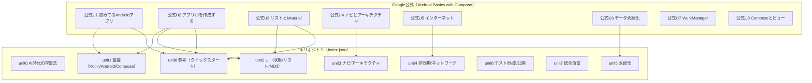

# Google公式コース対応表（Android Basics with Compose）

対象（公式）: https://developer.android.com/courses/android-basics-compose/course?hl=ja

このドキュメントは、Google公式「Android Basics with Compose」と、このリポジトリ（`index.json` / `chapters/`）の対応関係を可視化するためのものです。番号のズレがあるため、**「公式ユニット」**と**「本リポジトリのUnit」**を明示して参照します。

## ステータス定義

- `covered`: ほぼ同等の内容が章として存在する
- `partial`: 一部はあるが、公式の主題/演習が不足している
- `missing`: 章が存在しない（追加候補）
- `repo-only`: 公式には薄い/無いが、本リポジトリで扱っている

## 全体マップ（ユニット単位）

## 対応表（公式パスウェイ → 本リポジトリ）

### 公式ユニット 1: 初めての Android アプリ

| 公式パスウェイ | 公式リンク | 本リポジトリで対応する章 | ステータス | メモ |
|---|---|---|---|---|
| Kotlin の概要 | https://developer.android.com/courses/pathways/android-basics-compose-unit-1-pathway-1?hl=ja | `chapters/02-kotlin-basics.md`, `chapters/02-oop-fundamentals.md` | `covered` | OOPは公式より厚め（良い差分） |
| Android Studio をセットアップする | https://developer.android.com/courses/pathways/android-basics-compose-unit-1-pathway-2?hl=ja | `chapters/01-setup.md`, `chapters/02-first-app.md` | `covered` |  |
| 基本的なレイアウトを作成する | https://developer.android.com/courses/pathways/android-basics-compose-unit-1-pathway-3?hl=ja | `chapters/03-compose-basics.md`, `chapters/04-layout.md`, `chapters/03-android-fundamentals.md` | `covered` |  |

### 公式ユニット 2: アプリ UI を作成する

| 公式パスウェイ | 公式リンク | 本リポジトリで対応する章 | ステータス | メモ |
|---|---|---|---|---|
| Kotlin の基礎 | https://developer.android.com/courses/pathways/android-basics-compose-unit-2-pathway-1?hl=ja | `chapters/02-kotlin-basics.md`, `chapters/02-oop-fundamentals.md` | `covered` |  |
| アプリにボタンを追加する | https://developer.android.com/courses/pathways/android-basics-compose-unit-2-pathway-2?hl=ja | `chapters/03-compose-basics.md`, `chapters/04-state-interaction.md` | `covered` |  |
| UI と状態を操作する | https://developer.android.com/courses/pathways/android-basics-compose-unit-2-pathway-3?hl=ja | `chapters/04-state-interaction.md`, `chapters/06-state.md` | `covered` |  |

### 公式ユニット 3: リストの表示とマテリアル デザインの使用

| 公式パスウェイ | 公式リンク | 本リポジトリで対応する章 | ステータス | メモ |
|---|---|---|---|---|
| Kotlin の基礎（その他） | https://developer.android.com/courses/pathways/android-basics-compose-unit-3-pathway-1?hl=ja | `chapters/02-kotlin-basics.md`, `chapters/02-oop-fundamentals.md`, `chapters/05-kotlin-basics.md` | `partial` | 公式の対象範囲に合わせて不足があれば追記候補 |
| スクロール可能なリストを作成する | https://developer.android.com/courses/pathways/android-basics-compose-unit-3-pathway-2?hl=ja | `chapters/05-lists-lazycolumn.md` | `covered` |  |
| 美しいアプリを作成する | https://developer.android.com/courses/pathways/android-basics-compose-unit-3-pathway-3?hl=ja | `chapters/06-material-design.md` | `covered` |  |

### 公式ユニット 4: ナビゲーションとアプリ アーキテクチャ

| 公式パスウェイ | 公式リンク | 本リポジトリで対応する章 | ステータス | メモ |
|---|---|---|---|---|
| アーキテクチャ コンポーネント | https://developer.android.com/courses/pathways/android-basics-compose-unit-4-pathway-1?hl=ja | `chapters/08-architecture.md` | `covered` |  |
| Jetpack Compose でのナビゲーション | https://developer.android.com/courses/pathways/android-basics-compose-unit-4-pathway-2?hl=ja | `chapters/07-navigation.md` | `covered` |  |
| さまざまな画面サイズに適応する | https://developer.android.com/courses/pathways/android-basics-compose-unit-4-pathway-3?hl=ja | （未対応） | `missing` | 追加候補: adaptive layout / tablet / foldable |

### 公式ユニット 5: インターネットに接続する

| 公式パスウェイ | 公式リンク | 本リポジトリで対応する章 | ステータス | メモ |
|---|---|---|---|---|
| インターネットからデータを取得する | https://developer.android.com/courses/pathways/android-basics-compose-unit-5-pathway-1?hl=ja | `chapters/09-data-layer.md`, `chapters/10-network.md` | `covered` |  |
| インターネットから画像を読み込んで表示する | https://developer.android.com/courses/pathways/android-basics-compose-unit-5-pathway-2?hl=ja | `chapters/10-network.md` | `covered` |  |

### 公式ユニット 6: データの永続化

| 公式パスウェイ | 公式リンク | 本リポジトリで対応する章 | ステータス | メモ |
|---|---|---|---|---|
| SQL の概要 | https://developer.android.com/courses/pathways/android-basics-compose-unit-6-pathway-1?hl=ja | `chapters/11-storage.md` | `partial` | DAOの`@Query`例はあるが、SQLの基礎説明は薄め |
| Room を使用してデータを永続化する | https://developer.android.com/courses/pathways/android-basics-compose-unit-6-pathway-2?hl=ja | `chapters/11-storage.md` | `covered` |  |
| DataStore でキーを使用してデータにアクセスし保存する | https://developer.android.com/courses/pathways/android-basics-compose-unit-6-pathway-3?hl=ja | `chapters/11-storage.md` | `covered` |  |

### 公式ユニット 7: WorkManager

| 公式パスウェイ | 公式リンク | 本リポジトリで対応する章 | ステータス | メモ |
|---|---|---|---|---|
| WorkManager でタスクのスケジュールを設定する | https://developer.android.com/courses/pathways/android-basics-compose-unit-7-pathway-1?hl=ja | （未対応） | `missing` | 追加候補: バックグラウンド処理 / 制約 / リトライ |

### 公式ユニット 8: Compose とビュー

| 公式パスウェイ | 公式リンク | 本リポジトリで対応する章 | ステータス | メモ |
|---|---|---|---|---|
| ビュー内の Android ビューと Compose | https://developer.android.com/courses/pathways/android-basics-compose-unit-8-pathway-1?hl=ja | （未対応） | `missing` | 追加候補: `ComposeView` / 段階移行 |
| Compose 内のビュー | https://developer.android.com/courses/pathways/android-basics-compose-unit-8-pathway-2?hl=ja | （未対応） | `missing` | 追加候補: `AndroidView` / 既存Viewライブラリ |

## 本リポジトリ側の強み（repo-only）

- `chapters/00-ai-learning.md`: AI活用の学習導線
- `chapters/12-testing.md`: テスト基礎（公式コースの流れと独立して補強できる）
- `chapters/13-performance.md`, `chapters/14-publishing.md`: 実運用・公開の補強
- `chapters/15-project.md`: 総合演習の明確なゴール

## 次のアクション候補（優先順）

1. `missing` を埋める（公式U4-3 / U7 / U8）
2. `partial` の薄い部分を補強（公式U3-1 / U6-1）
3. 各章末尾に「公式の該当パスウェイ」リンクを追加して“公式を正”に寄せる

