# 第2章: Android Studio をセットアップする

## 1. この章のゴール

- Android Studio をインストールし、最初のプロジェクトを作成できる
- エミュレータ（または実機）でアプリを起動できる
- 「プロジェクトの場所」「Run ボタン」「Logcat」がどこにあるか分かる

## 2. 進め方

次の内容を **上から順番に** 進めます。「やらなくてOK」の行は飛ばして構いません。レッスンの本文はこのページの下にすべて掲載しています。目安時間の合計は約180分です。

| # | 種類 | 内容 | 目安 | 備考 |
|---|---|---|---|---|
| 1 | レッスン | Android Studio をダウンロードしてインストールする | 約60分 |  |
| 2 | レッスン | 初めての Android アプリを作成する | 約60分 |  |
| 3 | レッスン | Android Emulator で初めてのアプリを実行する | 約30分 |  |
| 4 | レッスン | Android デバイスを接続する方法 | 約30分 |  |

このプログラムの進め方は次の通りです。

1. 下の各レッスンを読み、各ステップの説明を理解してから **自分でコードを打つ**（コピペで済ませない）
2. ステップごとにアプリを実行し、期待どおり動くか確認する
3. 動かないときは、エラー文をそのまま AI に貼って「何が原因か」を聞き、直したら **なぜ直ったか** をメモする
4. 各レッスン末尾の「まとめ」を読み、説明できない用語があればレッスンに戻る

> 画面が最新の Android Studio と異なる場合があります。

## 3. Android Studio をダウンロードしてインストールする


### 1. 始める前に

このレッスンでは、Android Studio をインストールします。

Android Studio は Google が開発し配布する、Android アプリ開発用の公式の統合開発環境（IDE）です。IDE はソフトウェア デベロッパーによるソフトウェア（この場合は Android プラットフォーム向けのアプリ）の設計、ビルド、実行、テストを可能にするツールを備えています。Android Studio は IntelliJ IDEA を基盤として使用しています。Android プラグインがプリインストールされており、Android プラットフォーム向けに改良が加えられています。

#### 前提条件

- パソコンに関する中程度のスキルがあり、ファイルやフォルダ、アプリ（スプレッドシート、ワープロ、フォトエディタ）の使用に慣れていること。
- ソフトウェアのダウンロード、インストール、更新ができること。

#### 学習内容

- パソコンの構成が Android Studio を実行するための最小要件を満たしていることを確認する方法。
- Android Studio をダウンロードしてインストールする方法。

#### 必要なもの

- 64 ビット版の Windows（8、10、11）、Linux、macOS（10.14 Mojave 以降）、ChromeOS のいずれかを搭載したパソコン
- パソコンでのインターネット アクセス

### 2. Windows: システム要件を確認する

#### Android Studio のシステム要件

Windows での Android Studio のシステム要件は次のとおりです。

- 64 ビット Microsoft® Windows® 8 / 10 / 11
- x86_64 CPU アーキテクチャ、第 2 世代の Intel Core 以降、または [Windows Hypervisor](https://developer.android.com/studio/run/emulator-acceleration#vm-windows) をサポートする AMD CPU
- 8 GB 以上の RAM
- 8 GB 以上の空きディスク容量（IDE + Android SDK + Android Emulator）
- 1,280 × 800 以上の画面解像度

#### システム要件を確認する（Windows 10）

Windows パソコンの場合、システム要件を確認するために必要な情報はすべて設定アプリで確認できます。

1. [**設定**] を開きます。

> **ヒント:**画面下部のスタートボタンの横にある検索ツールで見つけることができます。

2. [**システム**] をクリックします。
3. 左側のナビゲーション パネルの一番下にある [**バージョン情報**] をクリックします。
4. [**Windows の仕様**] が要件を満たしていることを確認します。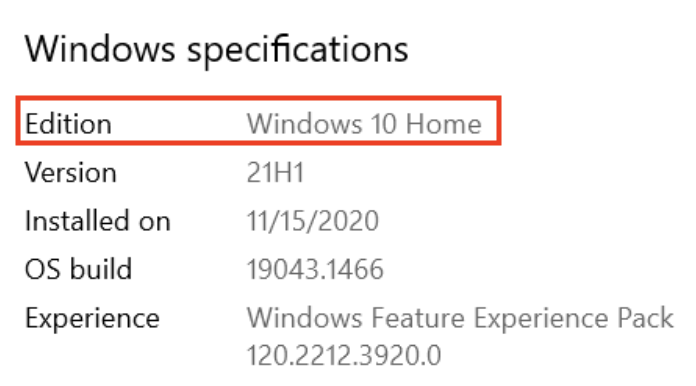
5. [**デバイスの仕様**] を選択します。実装 RAM が要件以上であることと、システムの種類が 64 ビット オペレーティング システムであることを確認します。

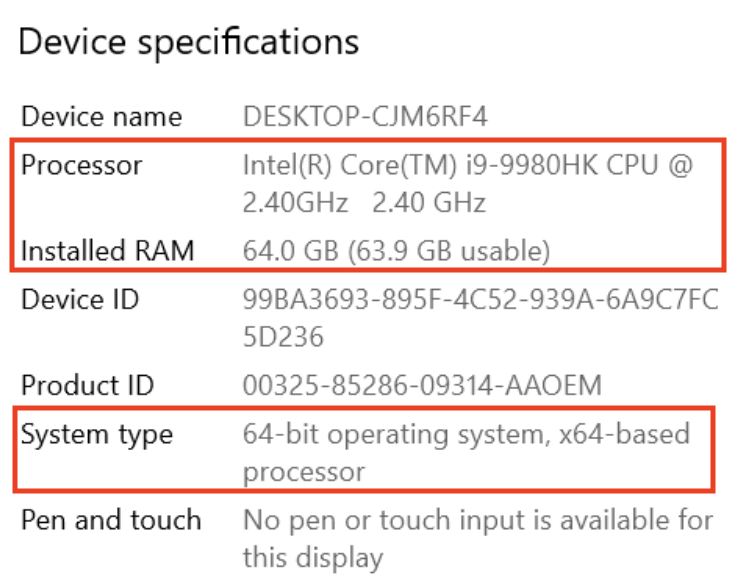

6. ナビゲーション パネルで [**ディスプレイ**] をクリックします。[**ディスプレイの解像度**] が要件以上であることを確認します。

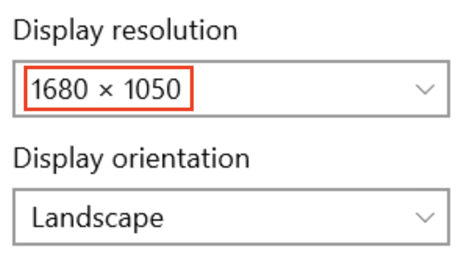

#### ストレージを確認する

1. エクスプローラーを開きます。
2. 左側のナビゲーション パネルで [**PC**] をクリックします。
3. ローカル ディスクに Android Studio をインストールするための十分な空き容量があることを確認します。

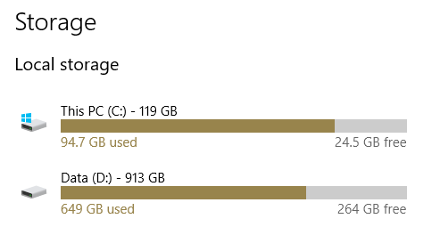

#### システム要件を確認する（Windows 8.1）

Windows 8.1 でデバイスの仕様を確認する手順は次のとおりです。

1. 設定アプリを開きます。
2. ナビゲーション パネルで [**PC とデバイス**] をクリックします。
3. ナビゲーション パネルで [**PC 情報**] をクリックします。CPU と RAM が最小要件を満たしていることと、64 ビット オペレーティング システムを使用していることを確認します。

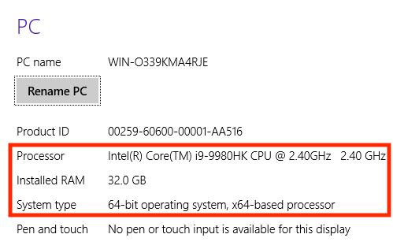

4. ナビゲーション パネルで [**ディスプレイ**] をクリックします。ディスプレイが要件を満たしていることを確認します。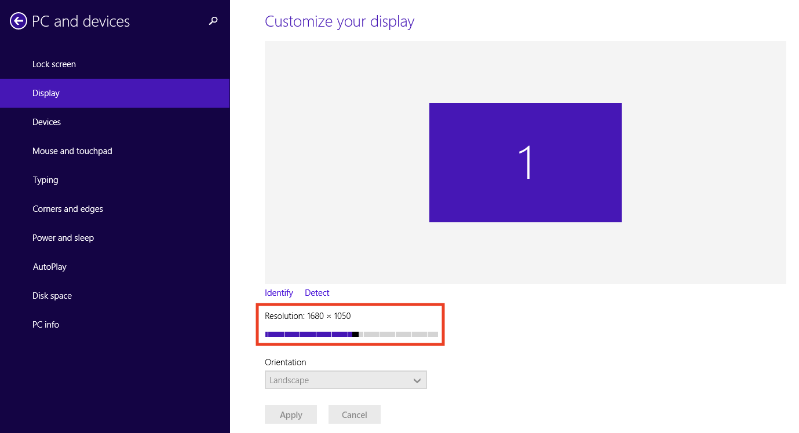
5. エクスプローラーを開いて [**PC**] をクリックし、十分なディスク容量があることを確認します。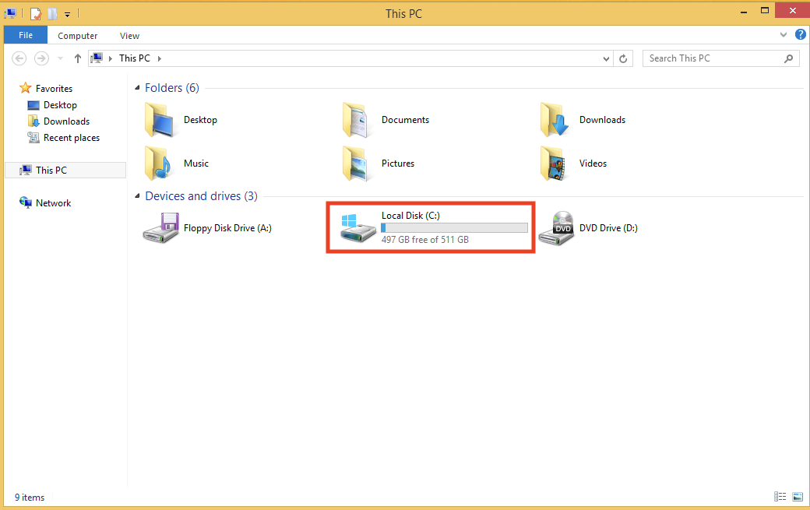

### 3. Windows: Android Studio をダウンロードしてインストールする

#### Android Studio をダウンロードする

1. ウェブブラウザを開き、[Android Studio のダウンロード ページ](https://developer.android.com/studio#get-android-studio)にアクセスします。

これは、Android Studio をダウンロードできるデベロッパー向け Android のウェブサイトです。このページでは、オペレーティング システムが自動検出されます。

2. [**Android Studio をダウンロード**] をクリックします。Android Studio の**ライセンス契約**について記載された**利用規約**のページが開きます。
3. **ライセンス契約**の内容を読みます。
4. 利用規約に同意する場合は、ページの下にある [**上記の利用規約を読んだうえで利用規約に同意します。**] のチェックボックスをオンにします。
5. [**Android Studio をダウンロード**] をクリックしてダウンロードを開始します。
6. プロンプトが表示されたら、見つけやすい場所（`Downloads` フォルダなど）にファイルを保存します。
7. ダウンロードが完了するまで待機します。時間がかかることがありますので、しばらくお待ちください。

#### Windows に Android Studio をインストールする

1. Android Studio インストール ファイルをダウンロードして保存したフォルダを開きます。
2. ダウンロードしたファイルをダブルクリックします。
3. インストールを許可してパソコンに変更を加えることについて [**ユーザー アカウント コントール**] ダイアログが表示されたら、[**はい**] をクリックしてインストールを確定します。

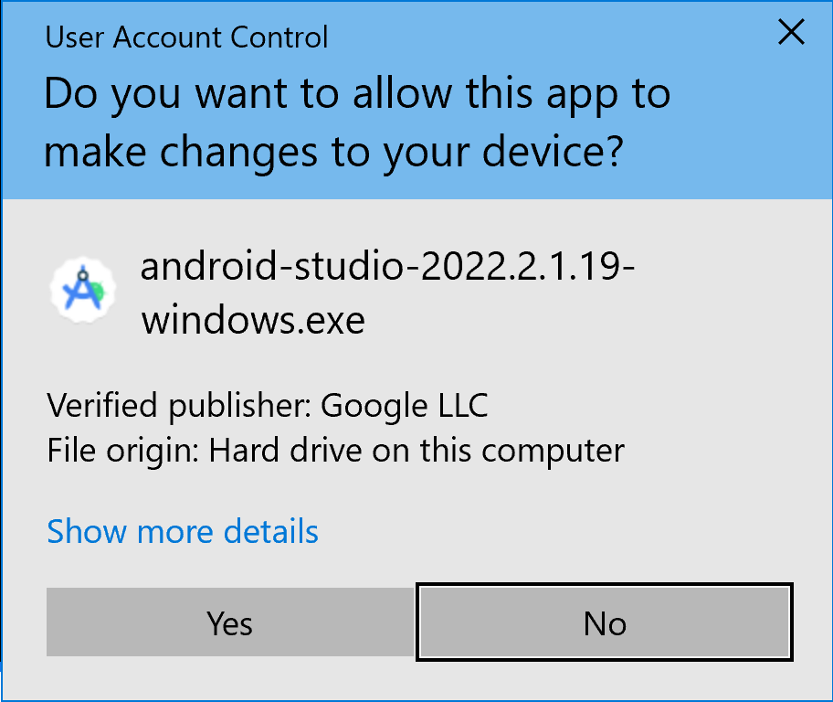

[**Welcome to Android Studio Setup**] ダイアログが表示されます。

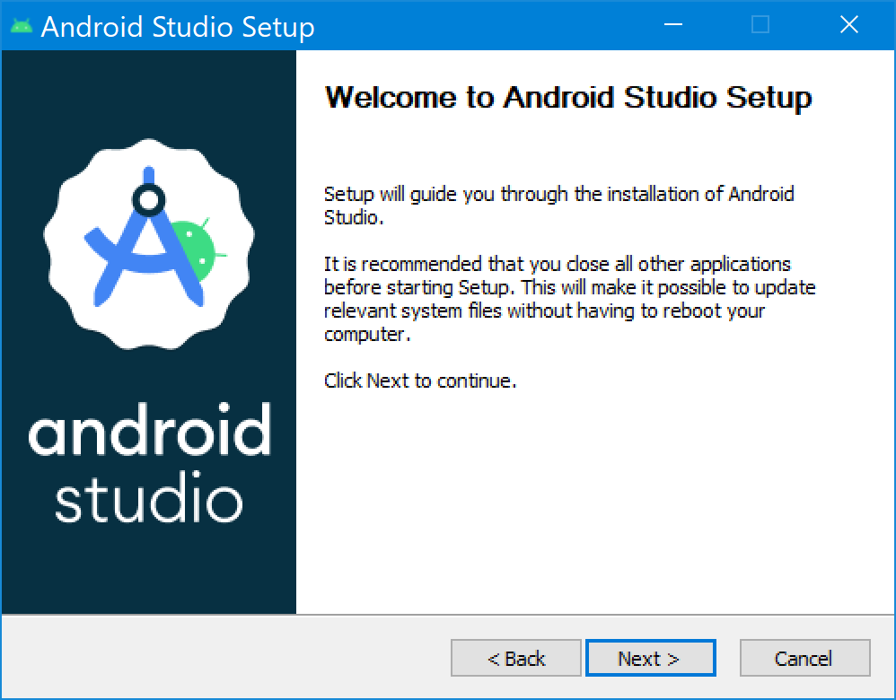

4. [**Next**] をクリックしてインストールを開始します。
5. すべての手順でデフォルトのインストール設定を受け入れます。
6. インストールが完了したら、[**Finish**] をクリックして、Android Studio を起動します。


7. Android Studio の初回起動時、ライトモードとダークモードのどちらを使用するかを選択します。このコースのスクリーンショットではライトモードが使用されていますが、どちらを選択しても構いません。

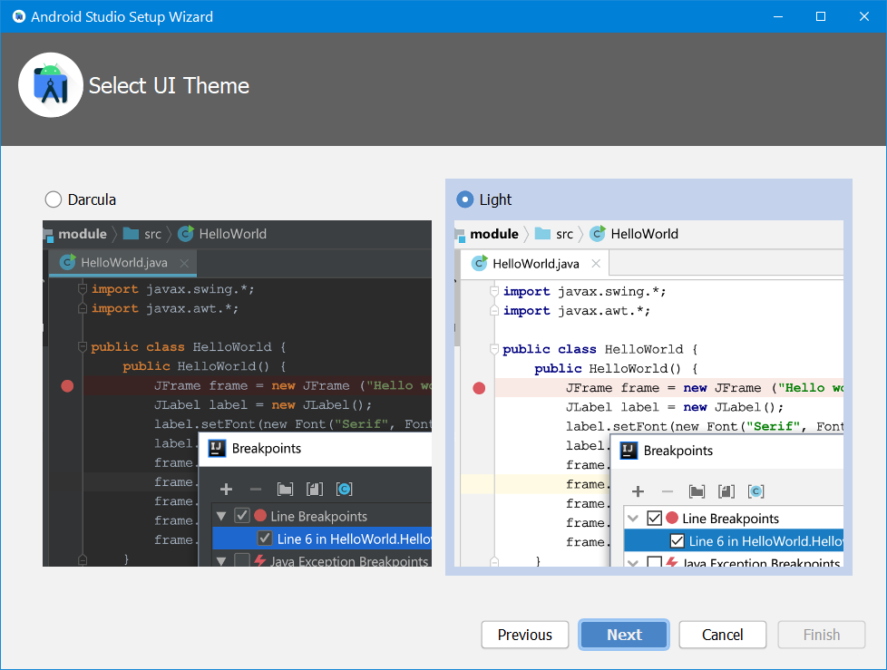

8. インストール中に、Android アプリ開発に必要な追加のコンポーネントとツールが、セットアップ ウィザードによってダウンロード、インストールされます。インターネットの速度によっては時間がかかる場合があります。途中、**Windows コマンド プロセッサ**について [**ユーザー アカウント制御**] ダイアログが表示される場合があります。[**はい**] をクリックして確定します。

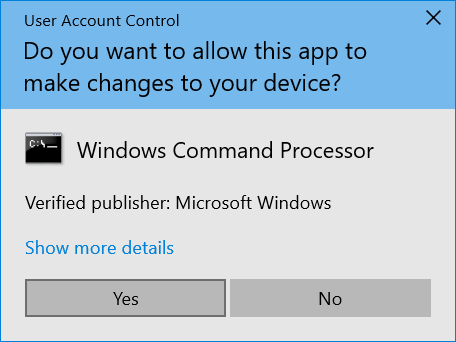

9. adb.exe に関して **Windows セキュリティの警告**が表示されることもあります。必要に応じて [**アクセスを許可する**] をクリックし、インストールを続行します。

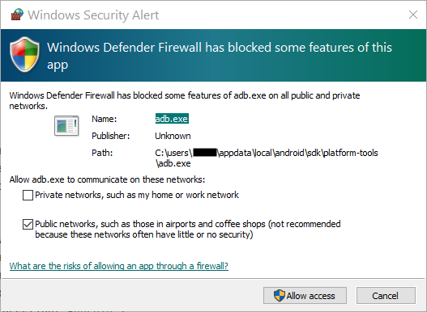

10. ダウンロードとインストールが完了したら、[**Finish**] をクリックします。

[**Welcome to Android Studio**] ウィンドウが表示されます。これでアプリの作成を開始できるようになりました。

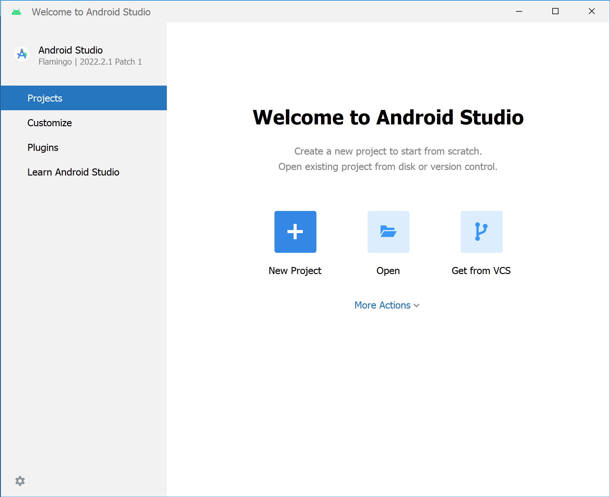

### 4. macOS: システム要件を確認する

#### Android Studio のシステム要件（macOS）

macOS での Android Studio のシステム要件は次のとおりです。

- MacOS® 10.14（Mojave）以降
- ARM ベースのチップ、または [Hypervisor.Framework](https://developer.android.com/studio/run/emulator-acceleration#vm-mac) をサポートする第 2 世代 Intel Core 以降
- 8 GB 以上の RAM
- 8 GB 以上の空きディスク容量（IDE + Android SDK + Android Emulator）
- 1,280 × 800 以上の画面解像度

#### システム要件を確認する

1.  > [**この Mac について**] を選択します。
2. ダイアログの [**概要**] タブで、OS のバージョン番号を確認し、要件の範囲内であることを確認します。
3. [**メモリ**] タブで、表示されている合計メモリが必要最小値以上であることを確認します。

たとえば、以下のスクリーンショットの OS バージョンは 12.2.1、メモリは 16 GB です。

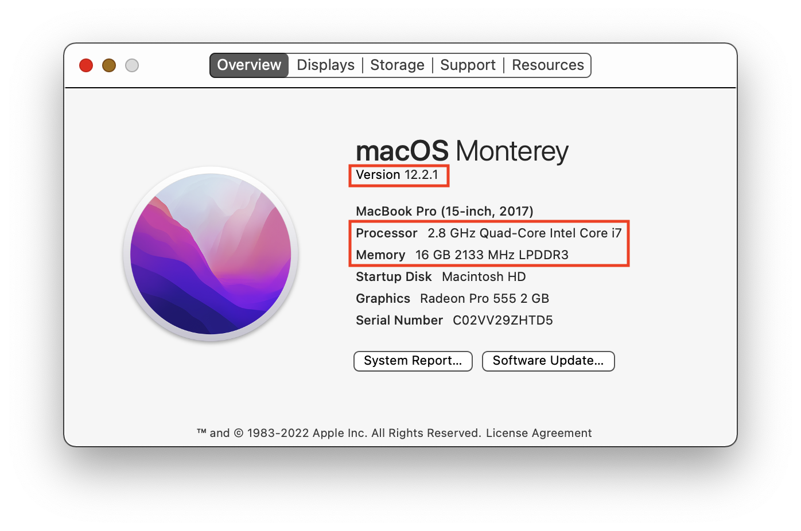

4. 同じダイアログの [**ディスプレイ**] タブをクリックします。
5. ディスプレイの説明で、パソコンの画面解像度が推奨値以上であることを確認します。

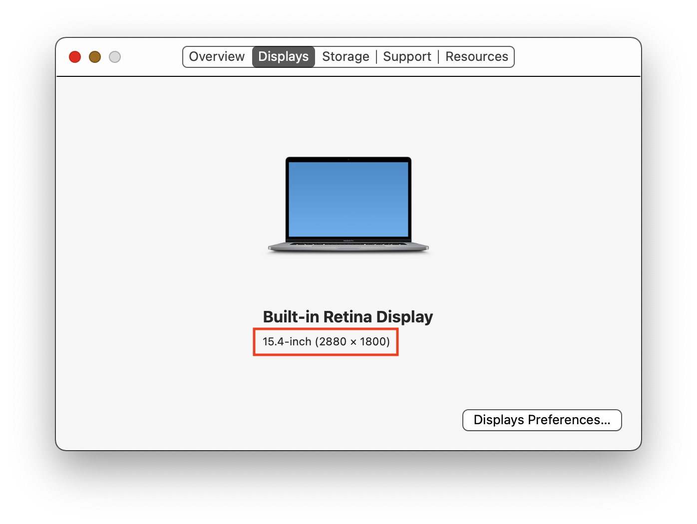

6. [**ストレージ**] タブをクリックします。
7. 使用可能なディスク容量を確認して、Android Studio のインストールと実行に必要なディスク容量以上であることを確認します。

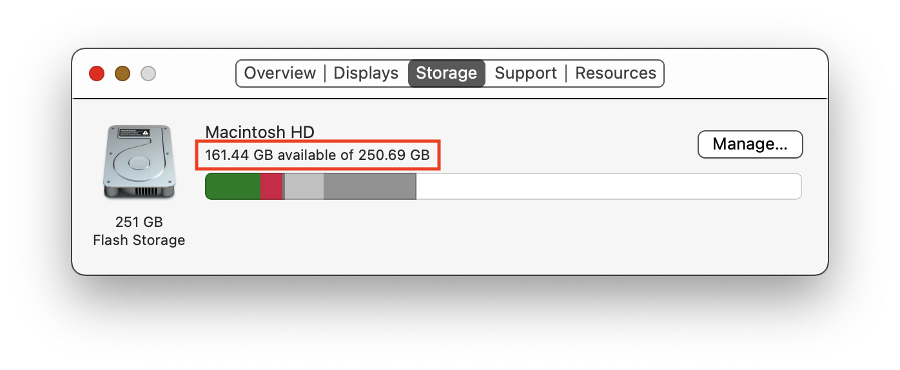

### 5. macOS: Android Studio をダウンロードしてインストールする

#### Android Studio をダウンロードする

1. ウェブブラウザを開き、[Android Studio のダウンロード ページ](https://developer.android.com/studio/?gclid=Cj0KCQiAjJOQBhCkARIsAEKMtO3zEhdK4_I0CEZic3UH4dl-9gVXuHFR9dCl3TOHKjmv3xWLU3UxfhYaApfAEALw_wcB&gclsrc=aw.ds)にアクセスします。これは、Android Studio をダウンロードできるデベロッパー向け Android のウェブサイトです。このページでは、オペレーティング システムが自動検出されます。
2. [**Android Studio をダウンロード**] をクリックします。Android Studio の**ライセンス契約**について記載された**利用規約**のページが開きます。
3. **ライセンス契約**の内容を読みます。
4. 利用規約に同意する場合は、ページの下にある [**上記の利用規約を読んだうえで利用規約に同意します。**] のチェックボックスをオンにします。
5. [**Apple チップ搭載の Mac**] または [**Intel チップ搭載の Mac**] をクリックしてダウンロードを開始します。
6. プロンプトが表示されたら、見つけやすい場所（`Downloads` フォルダなど）にファイルを保存します。
7. ダウンロードが完了するまで待機します。時間がかかることがありますので、しばらくお待ちください。

> **注**: 詳細な説明が必要な場合、またはインストールをカスタマイズする場合は、スクリーンショット付きの [Android Studio のインストール](https://developer.android.com/studio/install.html)の説明をご覧ください。

#### macOS に Android Studio をインストールする

1. Android Studio インストール ファイルをダウンロードして保存したフォルダを開きます。
2. ダウンロードしたファイルをダブルクリックします。以下のダイアログが表示されます。

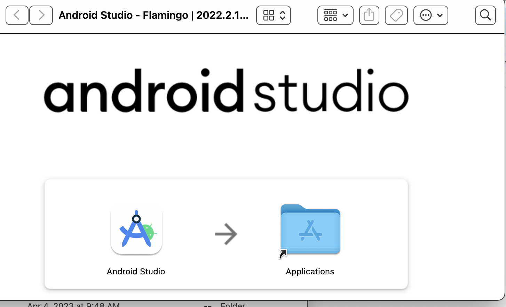

3. **Android Studio** のアイコンを `Applications` フォルダにドラッグします。
4. `Applications` フォルダで **Android Studio** のアイコンをダブルクリックして、**Android Studio セットアップ ウィザード**を起動します。
5. インターネットからダウンロードしたファイルのインストールまたは実行に関する警告が表示された場合は、インストールを許可します。

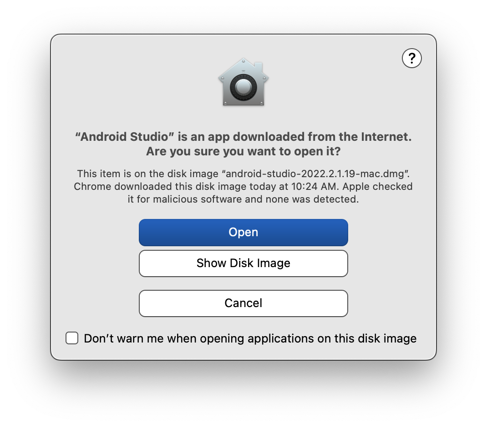

6. **Android Studio セットアップ ウィザード**に沿ってセットアップを進め、すべてのステップでデフォルト設定のままにします。インストール中に、Android アプリ開発に必要な追加のコンポーネントとツールが、セットアップ ウィザードによってダウンロード、インストールされます。インターネットの速度によっては時間がかかる場合があります。完了するまでお待ちください。
7. インストールが完了すると、Android Studio が自動的に起動します。

[**Welcome to Android Studio**] ウィンドウが開きます。これで、アプリの作成を開始できるようになりました。

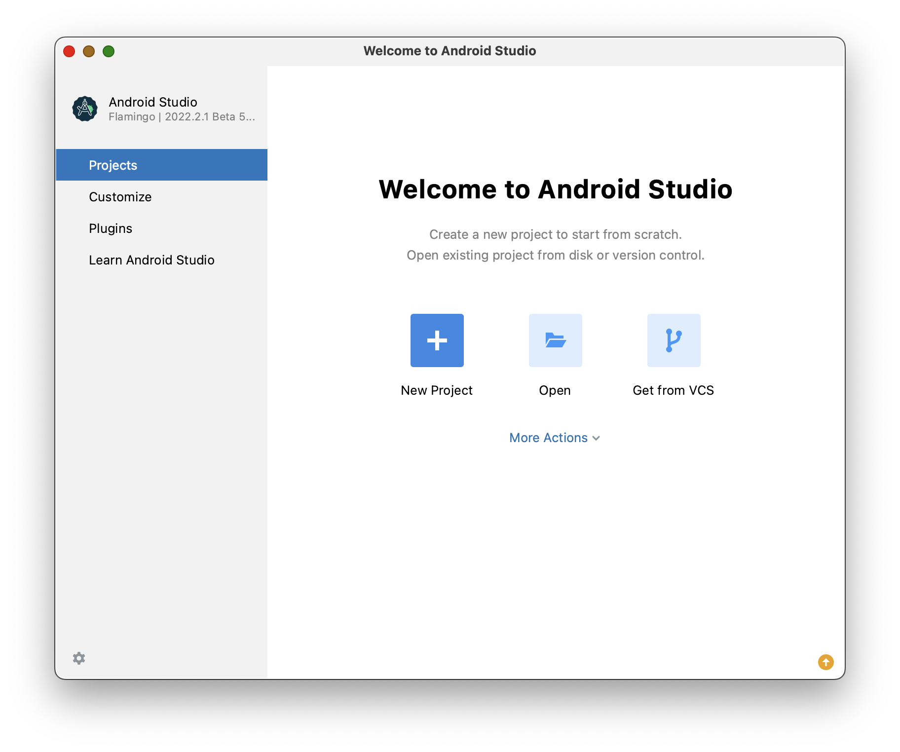

### 6. Linux: システム要件を確認する

#### Android Studio のシステム要件

Linux での Android Studio のシステム要件は次のとおりです。

- Gnome、KDE、または Unity DE をサポートする 64 ビット Linux ディストリビューション、GNU C ライブラリ（glibc）2.31 以降
- x86_64 CPU アーキテクチャ、第 2 世代の Intel Core 以降、または AMD Virtualization（AMD-V）と SSSE3 をサポートする AMD プロセッサ
- 8 GB 以上の RAM
- 8 GB 以上の空きディスク容量（IDE + Android SDK + Android Emulator）
- 1,280 × 800 以上の画面解像度

#### システム要件を確認する

インストールする前に、ターミナル コマンドを使用してパソコンがハードウェア要件を満たしているかどうかを確認します。

> **ヒント:**キーボード ショートカット（Ctrl+Alt+T キー）を使用すると、ターミナル ウィンドウをすばやく開くことができます。

1. `lscpu` を使用してプロセッサの仕様を確認します。

```kotlin
lscpu
```

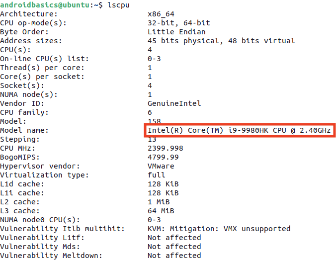

2. `free` コマンドを使用してシステムメモリの合計容量を確認します。

MB 単位で出力されているため、以下のシステムの場合のメモリ合計容量は 32 GB です。

```kotlin
free -m
```

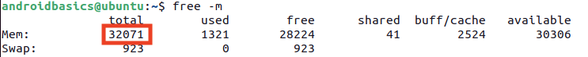

3. `df` コマンドを使用して使用可能なディスク容量を確認します。

```kotlin
df -h
```

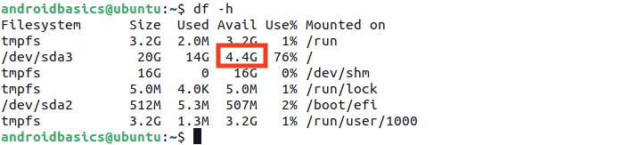

4. `xrandr` を使用して画面解像度を確認します。

```kotlin
xrandr | grep '*'
```

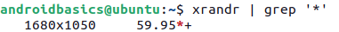

### 7. Linux: Android Studio をダウンロードしてインストールする

#### Android Studio をダウンロードする

1. ウェブブラウザを開き、[Android Studio のダウンロード ページ](https://developer.android.com/studio/?gclid=Cj0KCQiAjJOQBhCkARIsAEKMtO3zEhdK4_I0CEZic3UH4dl-9gVXuHFR9dCl3TOHKjmv3xWLU3UxfhYaApfAEALw_wcB&gclsrc=aw.ds)にアクセスします。
2. これは、Android Studio をダウンロードできるデベロッパー向け Android のウェブサイトです。このページでは、オペレーティング システムが自動検出されます。[**Android Studio をダウンロード**] をクリックします。**Android Studio のライセンス契約**について記載された**利用規約**のページが開きます。
3. **ライセンス契約**の内容を読みます。
4. 利用規約に同意する場合は、ページの下にある [**上記の利用規約を読んだうえで利用規約に同意します。**] のチェックボックスをオンにします。
5. [**Android Studio をダウンロード**] をクリックしてダウンロードを開始します。
6. プロンプトが表示されたら、見つけやすい場所（`Downloads` フォルダなど）にファイルを保存します。
7. ダウンロードが完了するまで待機します。時間がかかることがありますので、しばらくお待ちください。

#### Linux に Android Studio をインストールする

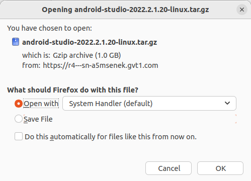

ターミナルで `Downloads` フォルダを開きます。

1. アーカイブを `tar` コマンドで解凍します。

```kotlin
tar -xzvf android-studio-2022.2.1.20-linux.tar.gz
```

2. `android-studio/bin` ディレクトリに移動します。

```kotlin
cd android-studio/bin
```

3. `studio.sh` を実行します。

```kotlin
./studio.sh
```

4. プロンプトの [**Do not import settings**] を選択したまま、[**OK**] をクリックします。

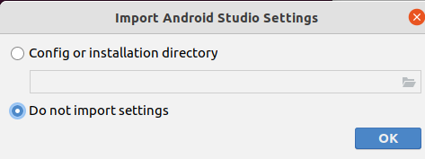

5. 使用状況データを Google と共有するかどうかを選択します。

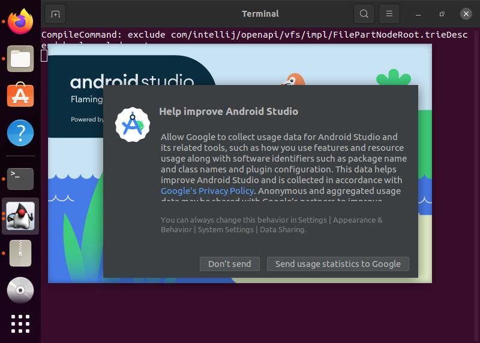

6. インストール タイプとして [**Standard**] を選択したままにします。[**Next**] をクリックして次に進みます。

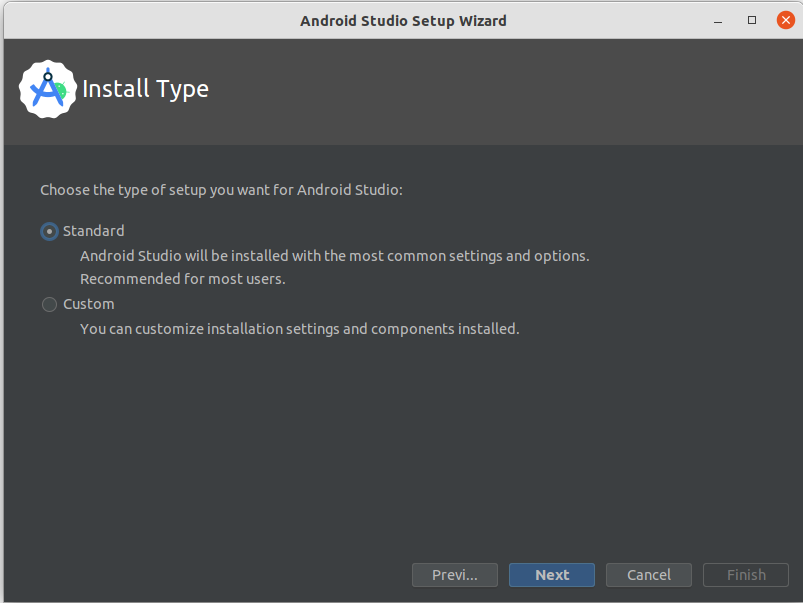

7. ライトモードとダークモードのどちらを使用するかを選択します。このコースのスクリーンショットではライトモードが使用されていますが、どちらを選択しても構いません。この設定は後からいつでも変更できます。

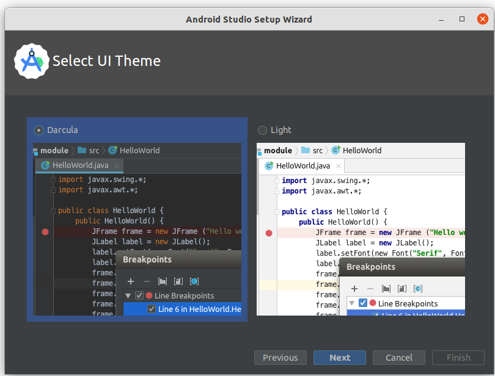

8. デフォルトの設定をすべてそのままにして、[**Next**] をクリックします。

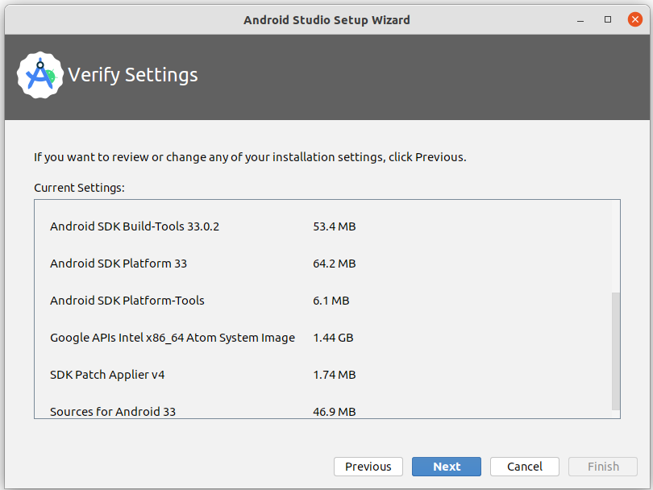

9. Android SDK と Android NDK の**ライセンス契約**を読んで同意し、[**Next**] をクリックします。

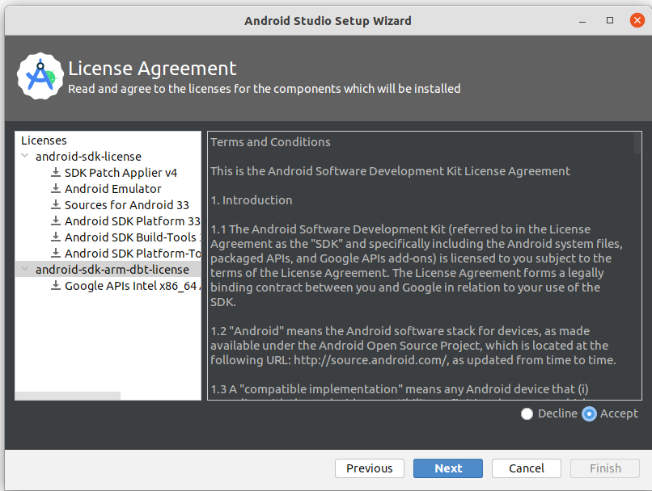

10. ハードウェア アクセラレーションと Android Emulator に関する追加情報が表示される場合もあります。[**完了**] をクリックします。

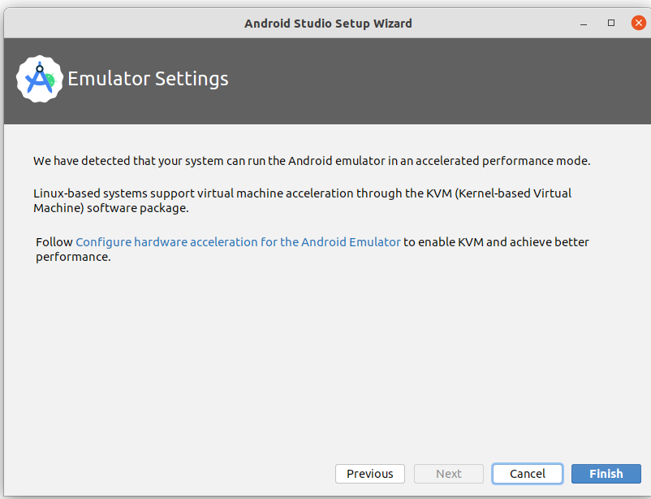

11. インストール中に、Android アプリ開発に必要な追加のコンポーネントとツールが、セットアップ ウィザードによってダウンロード、インストールされます。

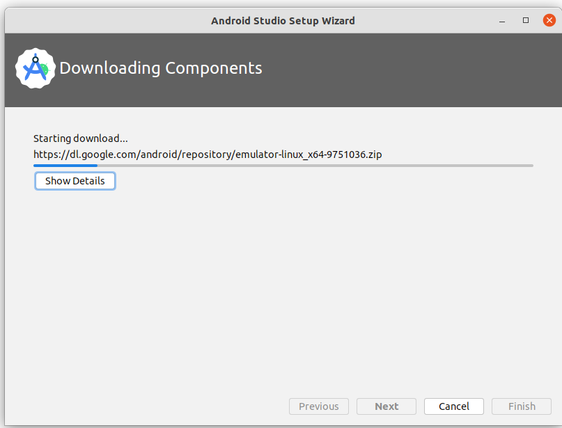

インストールが完了したら、[**Finish**] をクリックします。

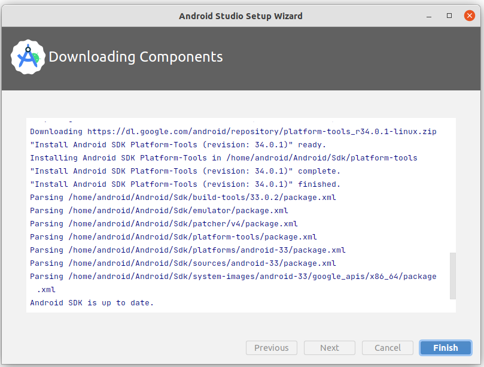

12. [**Welcome to Android Studio**] ダイアログが表示されます。これでアプリの作成を開始できるようになりました。

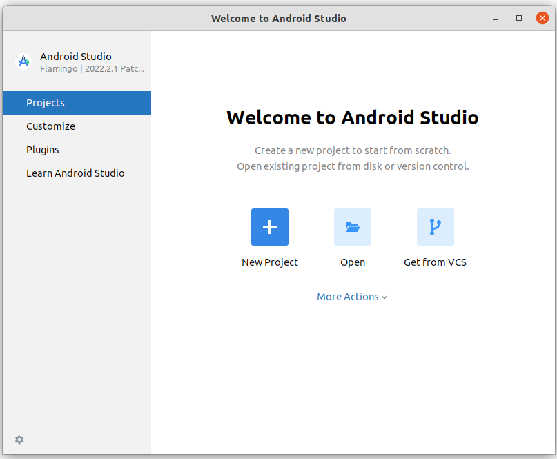

### 8. まとめ

お疲れさまでした。Android Studio のインストールは無事完了です。次のステップに進むことができます。

インストール手順で技術的な問題が発生した場合は、[トラブルシューティング ガイド](https://developer.android.com/studio/troubleshoot)をご覧ください。

#### 概要

- 統合開発環境（IDE）は、ソフトウェアを開発するためのツールのコレクションです。
- Android Studio は、IntelliJ IDEA をベースとした、Android 開発用の IDE です。

#### 詳細

- [Android Studio のダウンロード](https://developer.android.com/studio/)
- [Android Studio のインストール](https://developer.android.com/studio/install)
- [Android Studio の概要](https://developer.android.com/studio/intro)

## 4. 初めての Android アプリを作成する


### 1. 始める前に

[Android Studio](https://developer.android.com/studio) をパソコンにインストールしていない場合は、インストールします。Android Studio の実行に必要なシステム要件（ダウンロード ページの下部に記載されています）をパソコンが満たしていることを確認します。設定の手順について詳しくは、レッスンの「Android Studio のダウンロードとインストール」をご覧ください。

このレッスンでは、Android Studio に用意されているプロジェクト テンプレートを使用して、初めての Android アプリを作成します。Kotlin と Jetpack Compose を使用して、アプリをカスタマイズします。なお、Android Studio は更新されて UI が変更されることがあるため、ご使用の Android Studio がこのレッスンのスクリーンショットと多少異なっていても問題ありません。

#### 前提条件

- Kotlin の基礎知識があること

#### 必要なもの

- Android Studio の最新バージョン

#### 学習内容

- Android Studio で Android アプリを作成する方法
- Android Studio のプレビュー ツールでアプリを実行する方法
- Kotlin でテキストを更新する方法
- Jetpack Compose でユーザー インターフェース（UI）を更新する方法
- Jetpack Compose のプレビューでアプリのプレビューを表示する方法

#### 作成するアプリの概要

- 自己紹介をカスタマイズできるアプリ

このレッスンが完了すると、アプリは次のようになります（ただし、ご自身の名前でカスタマイズします）。

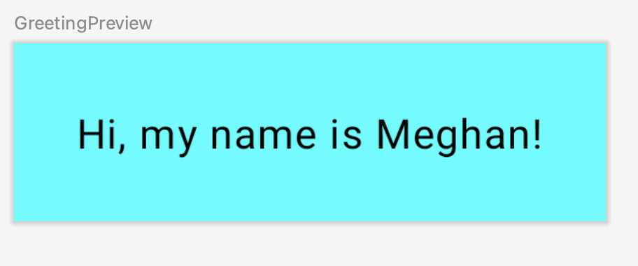

#### 必要なもの

- [Android Studio](https://developer.android.com/studio) がインストールされているパソコン。

### 2. テンプレートを使用してプロジェクトを作成する

このレッスンでは、Android Studio に用意されている **Empty Activity** プロジェクト テンプレートを使用して Android アプリを作成します。

Android Studio でプロジェクトを作成するには:

1. Android Studio のアイコンをダブルクリックして Android Studio を起動します。

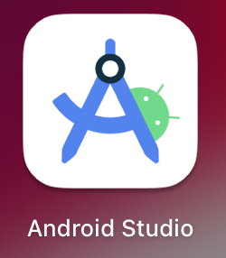

2. [**Welcome to Android Studio**] ダイアログで、[**New Project**] をクリックします。

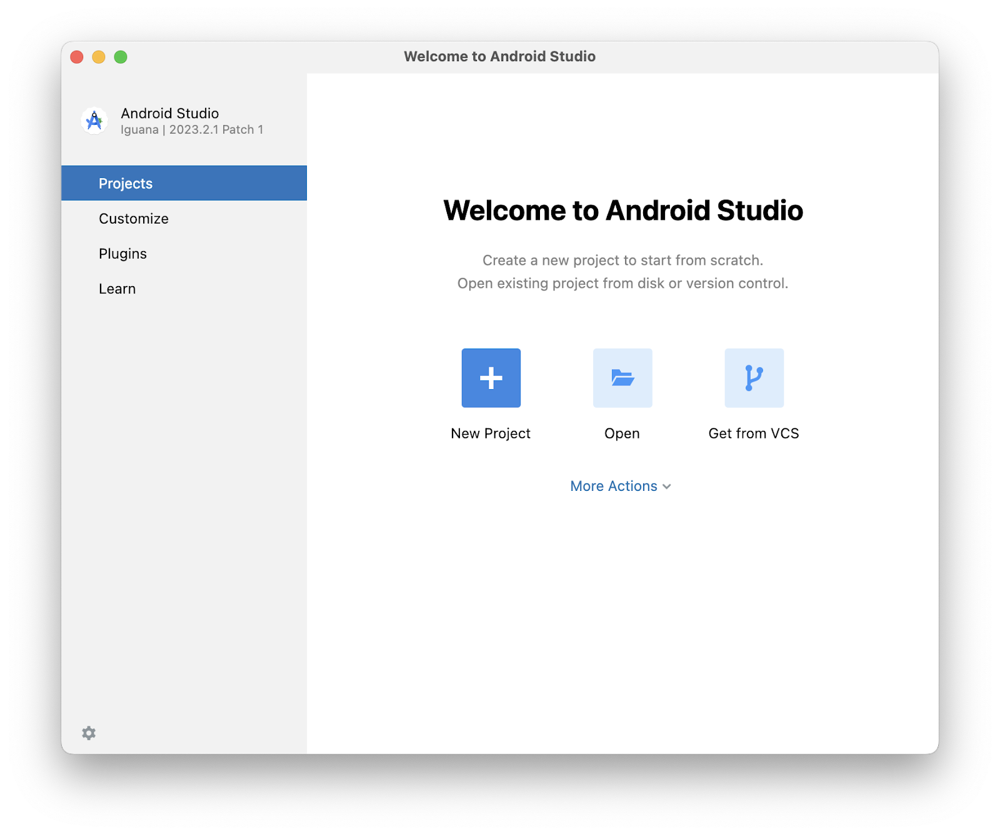

[**New Project**] ウィンドウが開き、Android Studio に用意されているテンプレートのリストが表示されます。

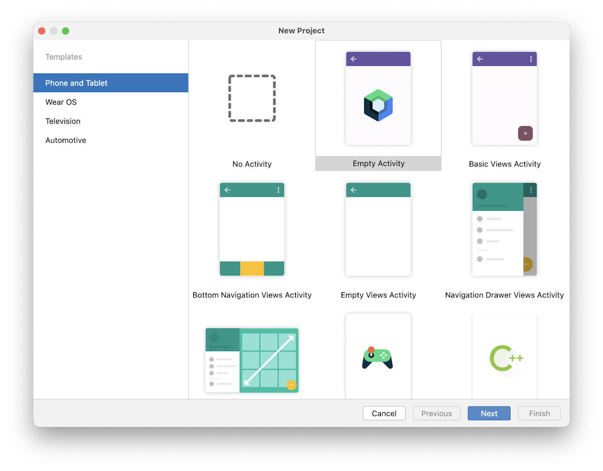

Android Studio のプロジェクト テンプレートは、ある種のアプリのブループリントを提供する Android プロジェクトです。テンプレートにより、プロジェクトの構造と、Android Studio でプロジェクトをビルドするために必要なファイルを作成します。選択したテンプレートによってスターター コードが提供されるため、作業を迅速に進めることができます。

3. [**Phone and Tablet**] タブが選択されていることを確認します。
4. [**Empty Activity**] テンプレートをクリックし、プロジェクトのテンプレートとして選択します。**Empty Activity** テンプレートは、Compose アプリの構築に使用できるシンプルなプロジェクトを作成するためのテンプレートです。単一の画面に「`"Hello` `Android!"`」というテキストが表示されます。
5. [**Next**] をクリックします。[**New Project**] ダイアログが開き、プロジェクトを設定するためのフィールドが表示されます。
6. プロジェクトを次のように設定します。

[**Name**] フィールドは、プロジェクトの名前を入力するために使用します。このレッスンでは「Greeting Card」と入力します。

[**Package name**] フィールドはそのままにしておきます。ファイル構造の中でどのようにファイルが整理されるかを示しています。この場合、パッケージ名は `com.example.greetingcard` です。

[**Save location**] フィールドはそのままにしておきます。プロジェクトに関連するすべてのファイルが保存される場所が表示されます。ファイルを見つけられるように、パソコンのどこに保存されるかをメモしておきます。

[**Minimum SDK**] フィールドのメニューから [**API 24: Android 7.0 (Nougat)**] を選択します。[Minimum SDK](https://developer.android.com/guide/topics/manifest/uses-sdk-element) は、アプリを実行できる Android の最小バージョンを示します。

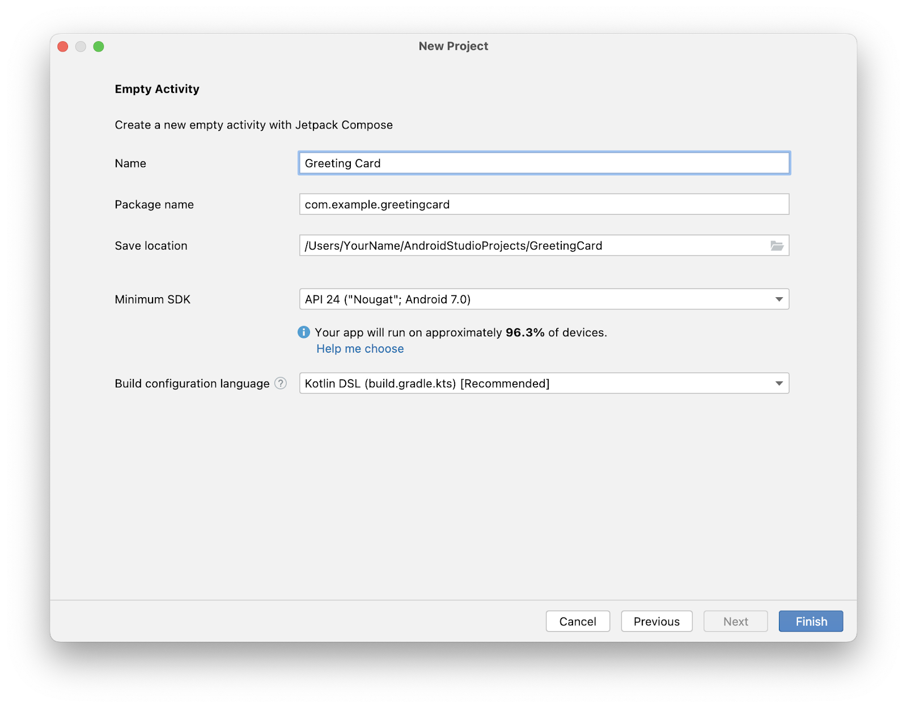

7. [**Finish**] をクリックします。この処理には時間がかかることがあります。しばらくお待ちください。Android Studio のセットアップ中、Android Studio でプロジェクトがセットアップ中であることを示す進行状況バーとメッセージが表示されます。たとえば、次のようになります。

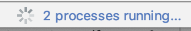

プロジェクトのセットアップが作成されると、次のようなメッセージが表示されます。

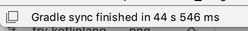

8. [**What's New**] ペインには Android Studio の新機能に関する最新情報が記載されています。いったん閉じます。

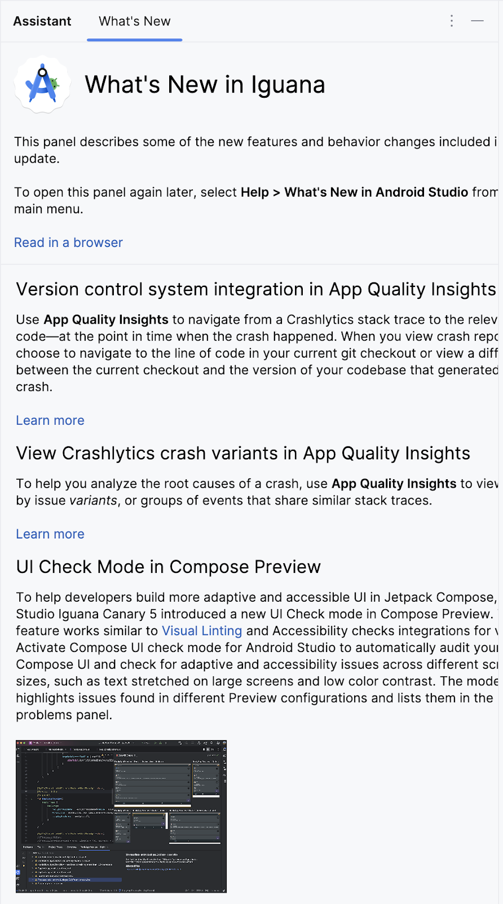

9. Android Studio の右上にある [**Split**] をクリックすると、コードとデザインの両方を表示できます。コードのみを表示するには [**Code**] をクリックし、デザインのみを表示するには [**Design**] をクリックします。

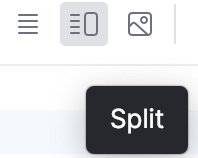

[**Split**] をクリックすると、次の 3 つのエリアが表示されます。

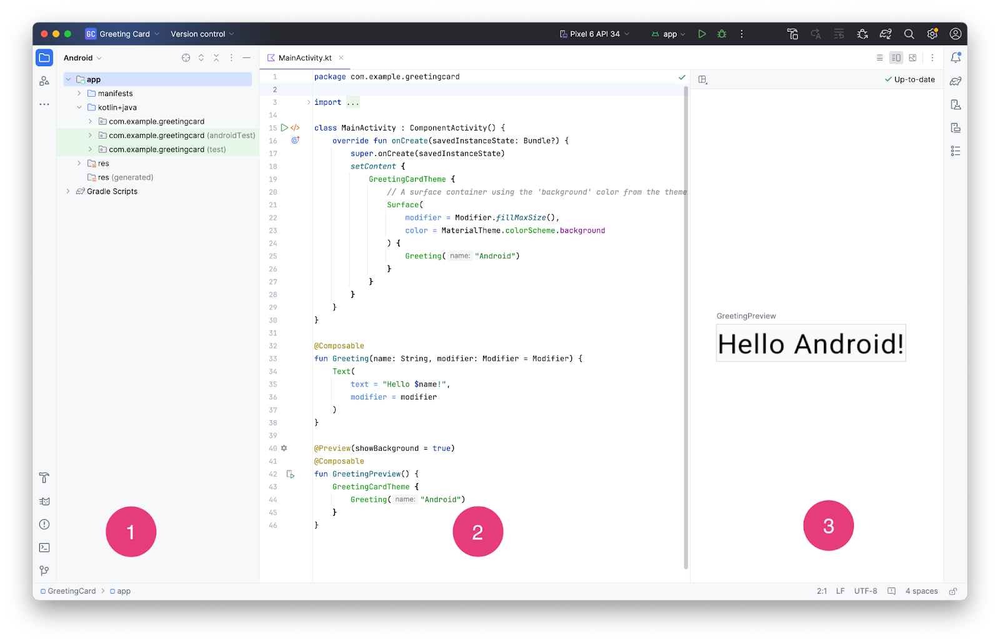

- [**Project**] ビュー（1）には、プロジェクトのファイルとフォルダが表示されます。
- [**Code**] ビュー（2）では、コードを編集します。
- [**Design**] ビュー（3）では、アプリの外観をプレビューします。

[**Design**] ビューには、空白のペインに次のテキストが表示されることがあります。

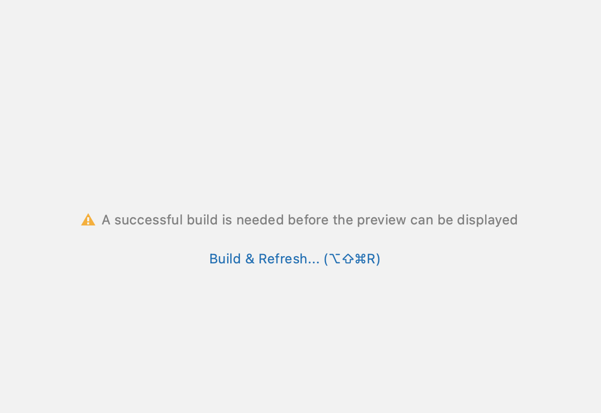

10. [**Build & Refresh**] をクリックします。ビルドに時間がかかる場合がありますが、完了すると、プレビューに「**Hello Android!**」というテキスト ボックスが表示されます。Empty Compose アクティビティには、このアプリを作成するために必要なコードがすべて含まれています。

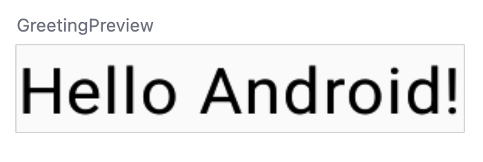

### 3. プロジェクト ファイルを探す

このセクションではファイル構造について理解を深めることで、引き続き Android Studio について説明します。

1. Android Studio で [**Project**] タブを確認します。[**Project**] タブには、プロジェクトのファイルとフォルダが表示されます。プロジェクトをセットアップしたとき、パッケージ名は **com.example.greetingcard** でした。パッケージは、この [**Project**] タブで確認できます。パッケージとは基本的に、コードが配置されているフォルダのことです。Android Studio は、パッケージのセットで構成されたディレクトリ構造でプロジェクトを整理します。
2. 必要に応じて、[**Android**] タブのプルダウン メニューから [**Android**] を選択します。

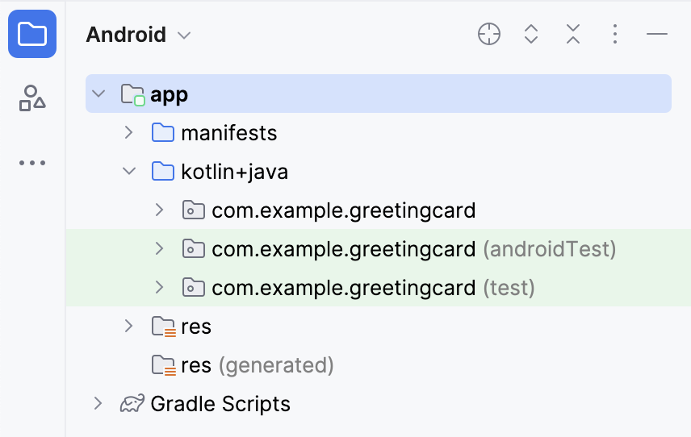

これが、使用するファイルの標準的なビューと構成です。アプリで作業するファイルに簡単にアクセスできるため、プロジェクトのコードを記述する場合に便利です。ただし、Finder や Windows のエクスプローラーなどのファイル ブラウザでファイルを確認すると、ファイル階層はまったく異なる構成になっています。

3. プルダウン メニューから [**Project Source Files**] を選択します。これで、ファイル ブラウザと同じようにファイルを閲覧できるようになりました。

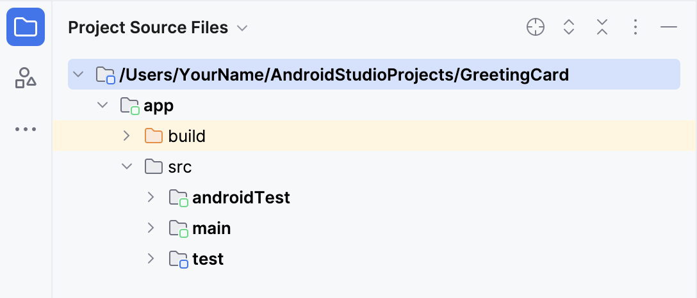

4. もう一度 [**Android**] を選択し、さきほどのビューに戻ります。このコースでは **Android** ビューを使用します。ファイル構造がおかしい場合は、**Android** ビューになっていることを確認してください。

### 4. テキストを更新する

Android Studio について理解したところで、グリーティング カードを作成してみましょう。

`MainActivity.kt` ファイルの [**Code**] ビューを確認します。このコードには自動生成された関数があります（具体的には `onCreate()` 関数や `setContent()` 関数）。

> **注:** 関数は、特定のタスクを実行するプログラムのセグメントのことです。

```kotlin
class MainActivity : ComponentActivity() {
    override fun onCreate(savedInstanceState: Bundle?) {
        super.onCreate(savedInstanceState)
        setContent {
            GreetingCardTheme {
                // A surface container using the 'background' color from the theme
                Surface(
                    modifier = Modifier.fillMaxSize(),
                    color = MaterialTheme.colorScheme.background
                ) {
                    Greeting("Android")
                }
            }
        }
    }
}
```

`onCreate()` 関数は、この Android アプリのエントリ ポイントであり、他の関数を呼び出してユーザー インターフェースを構築します。Kotlin プログラムでは、`main()` 関数が実行のエントリ ポイントや開始点です。Android アプリでは、`onCreate()` 関数がその役割を担います。

`onCreate()` 関数内の [`setContent()`](https://developer.android.com/reference/kotlin/androidx/compose/ui/platform/ComposeView#setContent(kotlin.Function0)) 関数は、コンポーズ可能な関数を介してレイアウトを定義するために使用されます。`@Composable` アノテーションが付いた関数はすべて、`setContent()` 関数や他のコンポーズ可能な関数から呼び出すことができます。アノテーションは、Jetpack Compose がこの関数を使用して UI を生成することを Kotlin コンパイラに伝えます。

> **注:** コンパイラは、記述された Kotlin コードを読み込んで 1 行ずつ解析し、パソコンが理解できる形式に変換します。このプロセスを、コードのコンパイルといいます。

次に、`Greeting()` 関数を見てみましょう。`Greeting()` 関数はコンポーズ可能な関数です。この関数の上に `@Composable` アノテーションが付加されている点に留意してください。コンポーズ可能な関数は、入力を受け取り、画面に表示される内容を生成します。

```kotlin
@Composable
fun Greeting(name: String, modifier: Modifier = Modifier) {
    Text(
        text = "Hello $name!",
        modifier = modifier
    )
}
```

関数については以前に学習しました（復習が必要な場合は「Kotlin で関数を作成して使用する」のレッスンをご覧ください）。ただし、コンポーズ可能な関数には異なる点がいくつかあります。

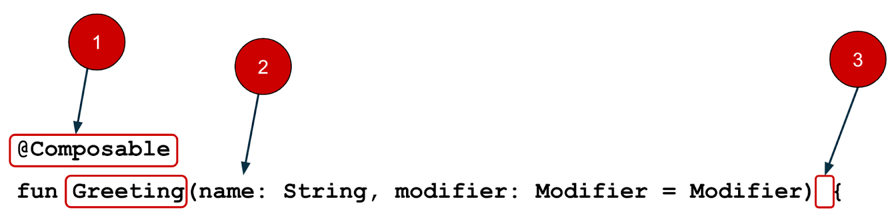

- 

        1. 関数の前に `@Composable` アノテーションを追加します。

- 

        2. `@Composable` 関数名は大文字で始めます。

- 

        3. `@Composable` 関数は何も返しません。

```kotlin
@Composable
fun Greeting(name: String, modifier: Modifier = Modifier) {
    Text(
        text = "Hello $name!",
        modifier = modifier
    )
}
```

現時点では、`Greeting()` 関数は名前を受け取り、その人物に `Hello` を表示します。

1. 「Hello」と挨拶するのではなく自己紹介するように `Greeting()` 関数を更新します。

```kotlin
@Composable
fun Greeting(name: String, modifier: Modifier = Modifier) {
    Text(
        text = "Hi, my name is $name!",
        modifier = modifier
    )
}
```

2. Android は自動的にプレビューを更新します。

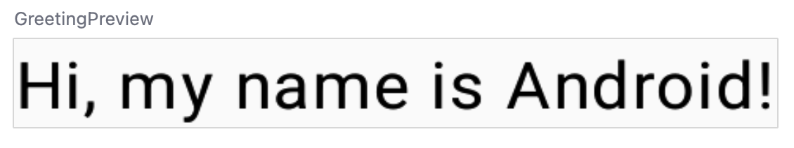

お疲れさまでした。テキストは変更されましたが、Android として自己紹介しています。これはおそらくご自身の名前ではないでしょう。今度は、ご自身の名前で自己紹介するようにカスタマイズしてみましょう。

`GreetingPreview()` 関数は、アプリ全体をビルドせずにコンポーザブルの外観を確認できる便利な機能です。コンポーザブルのプレビューを有効にするためには、`@Composable` と `@Preview` のアノテーションを追加します。`@Preview` アノテーションは、コンポーザブルをこのファイルのデザインビュー内で表示するように Android Studio に伝えます。

ご覧のとおり、`@Preview` アノテーションは `showBackground` というパラメータを受け取ります。`showBackground` を **true** に設定すると、コンポーザブルのプレビューに背景が追加されます。

Android Studio は、デフォルトではエディタにライトモードを使用するため、`showBackground` `=` `true` と `showBackground` `=` `false` の違いがわかりにくい場合があります。違いの見た目の例は次のとおりです。`true` に設定した場合の画像は背景が白くなっています。

| 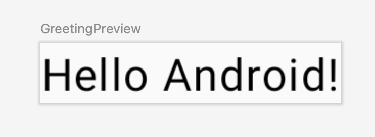showBackground = true |
|---|
| 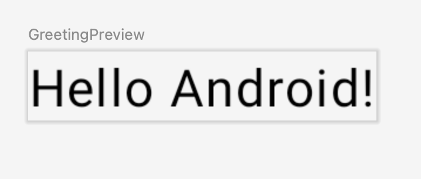showBackground = false |

3. ご自身の名前を使用して `GreetingPreview()` 関数を更新します。次に再ビルドし、カスタマイズしたグリーティング カードを見てみましょう。

```kotlin
@Preview(showBackground = true)
@Composable
fun GreetingPreview() {
    GreetingCardTheme {
        Greeting("Meghan")
    }
}
```

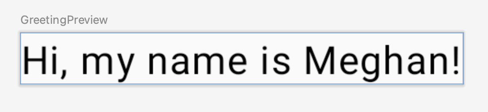

### 5. 背景色を変更する

これで自己紹介のテキストが完成しました。しかし、これだけではあまりおもしろくありません。このセクションでは、背景色を変更する方法について説明します。

自己紹介のテキストに別の背景色を設定するには、テキストを [`Surface`](https://developer.android.com/reference/kotlin/androidx/compose/material/Surface.composable#Surface(androidx.compose.ui.Modifier,androidx.compose.ui.graphics.Shape,androidx.compose.ui.graphics.Color,androidx.compose.ui.graphics.Color,androidx.compose.foundation.BorderStroke,androidx.compose.ui.unit.Dp,kotlin.Function0)) で囲む必要があります。`Surface` は、外観（背景色や枠線など）を変更できる UI のセクションを表すコンテナです。

1. テキストを `Surface` で囲むには、テキストの行をハイライト表示し、Windows の場合は `Alt+Enter` キー、Mac の場合は `Option+Enter` キーを押して、[**Surround with widget**] を選択します。

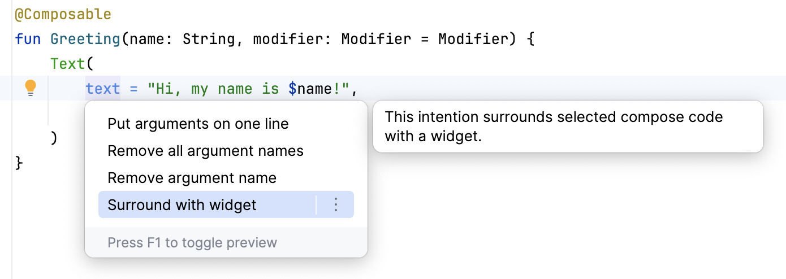

2. [**Surround with Container**] を選択します。

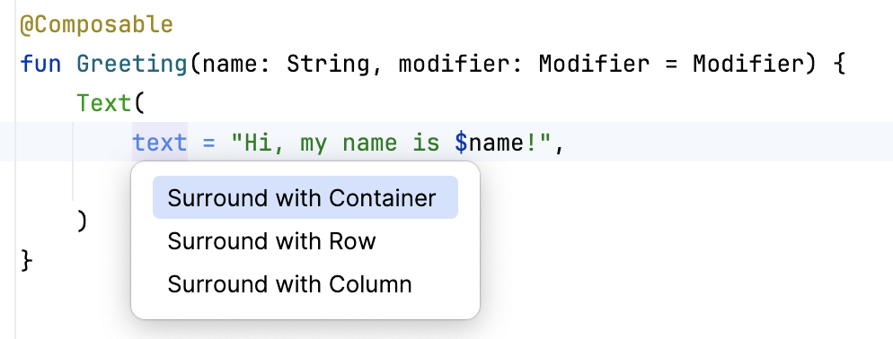

デフォルトで提供されるコンテナは `Box` ですが、別のコンテナタイプに変更することもできます。`Box` レイアウトについては、後ほど説明します。

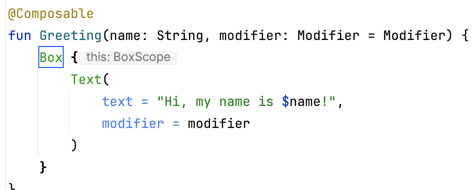

3. `Box` を削除し、代わりに「`Surface()`」と入力します。

```kotlin
@Composable
fun Greeting(name: String, modifier: Modifier = Modifier) {
    Surface() {
        Text(
            text = "Hi, my name is $name!",
            modifier = modifier
        )
    }
}
```

4. `Surface` コンテナに `color` パラメータを追加するには、`Color` に設定します。

```kotlin
@Composable
fun Greeting(name: String, modifier: Modifier = Modifier) {
    Surface(color = Color) {
        Text(
            text = "Hi, my name is $name!",
            modifier = modifier
        )
    }
}
```

5. 「`Color`」と入力すると赤色で表示されます。これは、Android Studio ではこの問題を解決できないことを意味します。この問題を解決するには、[import] と表示されているファイルの先頭までスクロールして、3 つの点のボタンを押します。

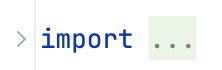

6. このステートメントをインポート リストの一番下に追加します。

```kotlin
import androidx.compose.ui.graphics.Color
```

インポートの全一覧は次のように表示されます。

```kotlin
import android.os.Bundle
import androidx.activity.ComponentActivity
import androidx.activity.compose.setContent
import androidx.compose.foundation.layout.Box
import androidx.compose.foundation.layout.fillMaxSize
import androidx.compose.material3.MaterialTheme
import androidx.compose.material3.Surface
import androidx.compose.material3.Text
import androidx.compose.runtime.Composable
import androidx.compose.ui.Modifier
import androidx.compose.ui.tooling.preview.Preview
import com.example.greetingcard.ui.theme.GreetingCardTheme
import androidx.compose.ui.graphics.Color
```

7. コードでは、インポートをアルファベット順で保持し、不要なインポートを削除することをおすすめします。そのためには、上部のツールバーで [**Help**] を押し、「**Optimize Imports**」と入力して、[**Optimize Imports**] をクリックします。

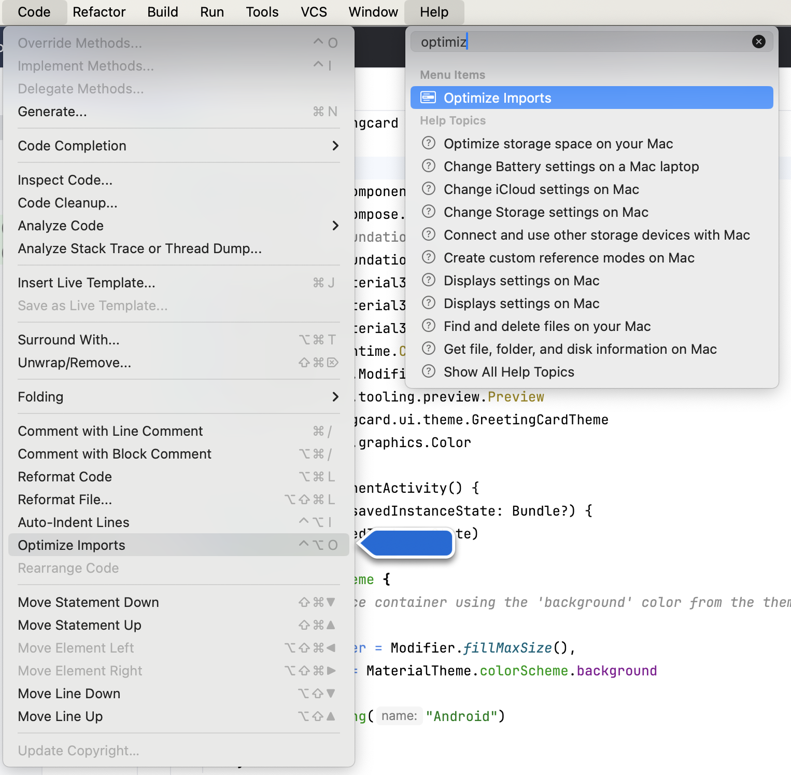

[**Code**] > [**Optimize Imports**] をクリックすることで、メニューから直接 [**Optimize Imports**] を開けます。場所がわからない場合は、ヘルプの検索オプションを使用してメニュー項目を見つけられます。

この時点でインポートの全一覧は次のように表示されます。

```kotlin
import android.os.Bundle
import androidx.activity.ComponentActivity
import androidx.activity.compose.setContent
import androidx.compose.foundation.layout.fillMaxSize
import androidx.compose.material3.MaterialTheme
import androidx.compose.material3.Surface
import androidx.compose.material3.Text
import androidx.compose.runtime.Composable
import androidx.compose.ui.Modifier
import androidx.compose.ui.graphics.Color
import androidx.compose.ui.tooling.preview.Preview
import com.example.greetingcard.ui.theme.GreetingCardTheme
```

8. サーフェスの括弧内で入力した色は、赤色から赤色の下線に変更されています。これを修正するため、後ろにピリオドを追加します。ポップアップが開き、さまざまな色のオプションが表示されます。

これも Android Studio の便利な機能です。インテリジェントで、役に立つことがあります。この場合は色を指定しようとしているため、さまざまな色が提案されます。

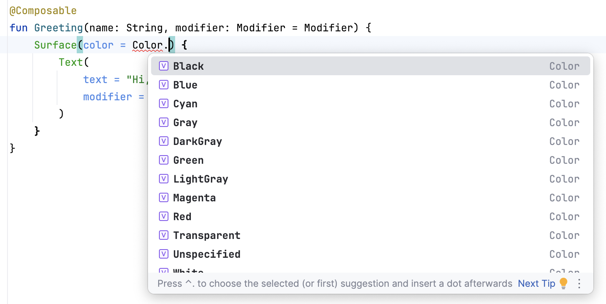

9. サーフェスの色を選択します。このレッスンでは**シアン**を使用しますが、好きな色を選択できます。

```kotlin
@Composable
fun Greeting(name: String, modifier: Modifier = Modifier) {
   Surface(color = Color.Cyan) {
       Text(
           text = "Hi, my name is $name!",
           modifier = modifier
       )
   }
}
```

10. 更新されたプレビューをご確認ください。

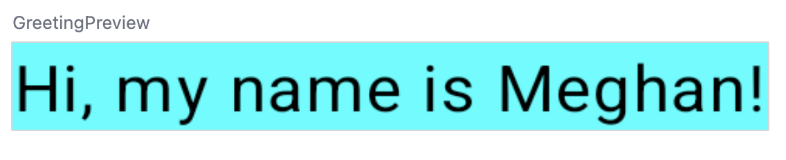

### 6. パディングを追加する

これでテキストに背景色が設定されました。今度はテキストの周囲に余白（パディング）を追加してみましょう。

[`Modifier`](https://developer.android.com/reference/kotlin/androidx/compose/ui/Modifier) は、コンポーザブルを拡張または装飾するために使用します。使用できる修飾子の一つに、`padding` 修飾子があります。これは要素の周囲に余白を設けます（この場合はテキストの周囲に余白を追加します）。そのためには [`Modifier.padding()`](https://developer.android.com/reference/kotlin/androidx/compose/ui/Modifier#(androidx.compose.ui.Modifier).padding(androidx.compose.ui.unit.Dp)) 関数を使用します。

コンポーザブルはすべて、タイプ `Modifier` のオプション パラメータを持つ必要があります。これは最初のオプション パラメータです。

1. `modifier` にサイズ `24.dp` のパディングを追加します。

> **注:** 密度非依存ピクセル（`dp`）については次の章で取り上げますが、今すぐ確認する場合は[レイアウト - マテリアル デザイン 3](https://m3.material.io/foundations/layout/understanding-layout/spacing#abccd6ce-1092-4ad0-9351-de75aeae0edf) の記事をご覧ください。

```kotlin
@Composable
fun Greeting(name: String, modifier: Modifier = Modifier) {
    Surface(color = Color.Cyan) {
        Text(
            text = "Hi, my name is $name!",
            modifier = modifier.padding(24.dp)
        )
    }
}
```

2. これらのインポートを import ステートメント セクションに追加します。

[**Optimize Imports**] を使用して、新しいインポートをアルファベット順に並べ替えてください。

```kotlin
import androidx.compose.ui.unit.dp
import androidx.compose.foundation.layout.padding
```

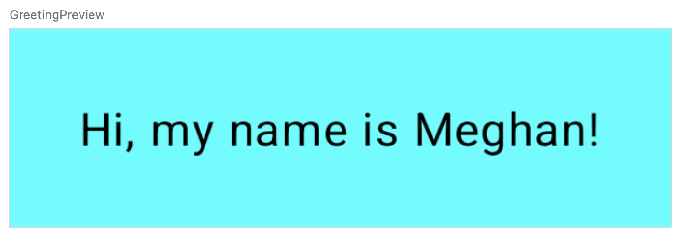

おつかれさまでした。Compose で初めての Android アプリを作成しました。これはかなり大きな成果です。時間をかけてさまざまな色やテキストを試し、カスタマイズしてみましょう。

### 7. 解答コードを確認する

#### レビュー用コード スニペット

```kotlin
package com.example.greetingcard

import android.os.Bundle
import androidx.activity.ComponentActivity
import androidx.activity.compose.setContent
import androidx.compose.foundation.layout.fillMaxSize
import androidx.compose.foundation.layout.padding
import androidx.compose.material3.MaterialTheme
import androidx.compose.material3.Surface
import androidx.compose.material3.Text
import androidx.compose.runtime.Composable
import androidx.compose.ui.Modifier
import androidx.compose.ui.graphics.Color
import androidx.compose.ui.tooling.preview.Preview
import androidx.compose.ui.unit.dp
import com.example.greetingcard.ui.theme.GreetingCardTheme

class MainActivity : ComponentActivity() {
    override fun onCreate(savedInstanceState: Bundle?) {
        super.onCreate(savedInstanceState)
        setContent {
            GreetingCardTheme {
                // A surface container using the 'background' color from the theme
                Surface(
                    modifier = Modifier.fillMaxSize(),
                    color = MaterialTheme.colorScheme.background
                ) {
                    Greeting("Android")
                }
            }
        }
    }
}

@Composable
fun Greeting(name: String, modifier: Modifier = Modifier) {
    Surface(color = Color.Cyan) {
        Text(
            text = "Hi, my name is $name!",
            modifier = modifier.padding(24.dp)
        )
    }
}

@Preview(showBackground = true)
@Composable
fun GreetingPreview() {
    GreetingCardTheme {
        Greeting("Meghan")
    }
}
```

### 8. まとめ

これで、Android Studio について学び、Compose で初めての Android アプリを作成できました。

このレッスンは、「Compose を用いた Android アプリ開発の基礎」コースの一部です。エミュレータまたは実機でアプリを実行する方法については、この章の次のレッスンをご覧ください。

#### 概要

- 新しいプロジェクトを作成するには、Android Studio を開き、**[New Project] > [Empty Activity] > [Next]** をクリックし、プロジェクトの名前を入力して設定を行います。
- アプリの外観を確認するには、[**Preview**] ペインを使用します。
- コンポーズ可能な関数は、通常の関数と似てはいますが少し異なります。関数名は大文字で始め、関数の前に `@Composable` アノテーションを追加します。`@Composable` 関数は何も返しません。
- [`Modifier`](https://developer.android.com/reference/kotlin/androidx/compose/ui/Modifier) は、コンポーザブルを拡張または装飾するために使用します。

#### 詳細

- [Android Studio の概要](https://developer.android.com/studio/intro)
- [プロジェクトの概要](https://developer.android.com/studio/projects)
- [プロジェクトの作成](https://developer.android.com/studio/projects/create-project)
- [テンプレートからコードを追加する](https://developer.android.com/studio/projects/templates)
- [Jetpack Compose](https://developer.android.com/jetpack/compose)
- [パディング – マテリアル デザイン 3](https://m3.material.io/foundations/layout/understanding-layout/spacing#64eb2223-f5e8-4d2a-9edc-9e3a7002220a)

## 5. Android Emulator で初めてのアプリを実行する


### 1. 始める前に

このレッスンでは、初めての Android アプリを作成するレッスンで作成したグリーティング カードアプリを取り上げ、Android Virtual Device（AVD）をセットアップして、Android Emulator でコードの動作を確認します。

#### 前提条件

- ワープロやスプレッドシートなどのアプリをセットアップ、設定、使用する方法についての知識があること。

#### 学習内容

- AVD を作成し、Android Emulator でアプリを実行する方法

#### 作成するアプリの概要

- テンプレートを使った基本的な Android アプリ

#### 必要なもの

- Android Studio がインストールされているパソコン

### 2. Android Emulator でアプリを実行する

このタスクでは、[デバイス マネージャ](http://developer.android.com/tools/devices/managing-avds.html)を使用して Android Virtual Device（AVD）を作成します。AVD は、パソコンで動作して特定の種類の Android デバイスの設定を模擬する、モバイル デバイスのソフトウェア バージョンです。エミュレータともいいます。スマートフォン、タブレット、テレビ、スマートウォッチ、Android Auto デバイスなど、どのデバイスにも対応します。ここではグリーティング カードアプリを実行するために AVD を使用します。

> **注:**Android Emulator は、仮想デバイスのセットアップに使用する独立したアプリであり、独自のシステム要件があります。仮想デバイスは、ディスク容量を大量に消費する可能性があります。問題が発生した場合は、[Android Emulator 上でアプリを実行する](https://developer.android.com/studio/run/emulator.html#Requirements)をご覧ください。

#### AVD を作成する

パソコンのエミュレータで Android アプリを実行するには、まず仮想デバイスを作成します。

1. Android Studio で、**[Tools] > [Device Manager]** を選択します。

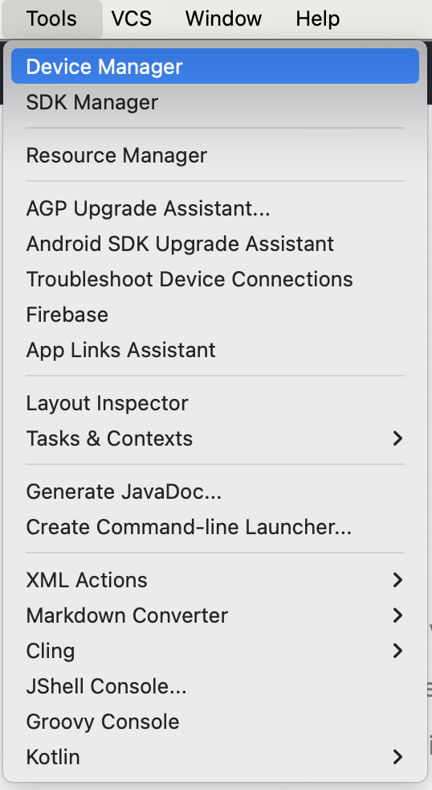

[**Device Manager**] ダイアログが開きます。以前に作成した仮想デバイスがあれば、このダイアログに表示されます。

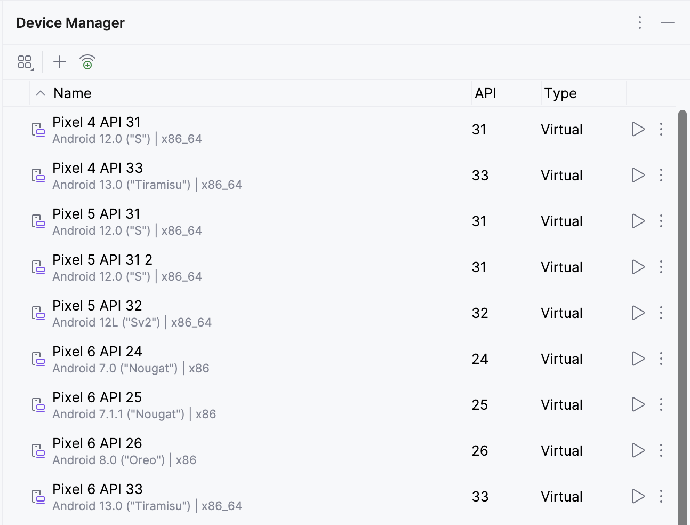

2. + をクリックして [**Create Virtual Device**] をクリックします。

[**Virtual Device Configuration**] ダイアログが表示されます。

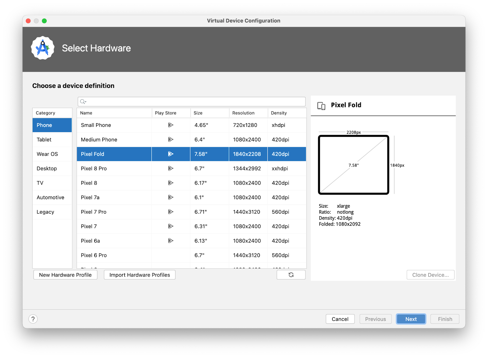

ダイアログには事前設定済みのデバイスのリストがカテゴリ別に表示されるため、この中から選択できます。デバイスごとに、ディスプレイ サイズ（インチ単位）、画面解像度（ピクセル単位）、ピクセル密度（1 インチあたりのピクセル数）の列が表に表示されます。

3. カテゴリで [**Phone**] を選択します。
4. **Google Pixel 6** などのスマートフォンを選択し、[**Next**] をクリックします。

ここで、仮想デバイス上で稼働させる Android のバージョンを選択できる別の画面が開きます。これにより、さまざまなバージョンの Android でアプリをテストできます。

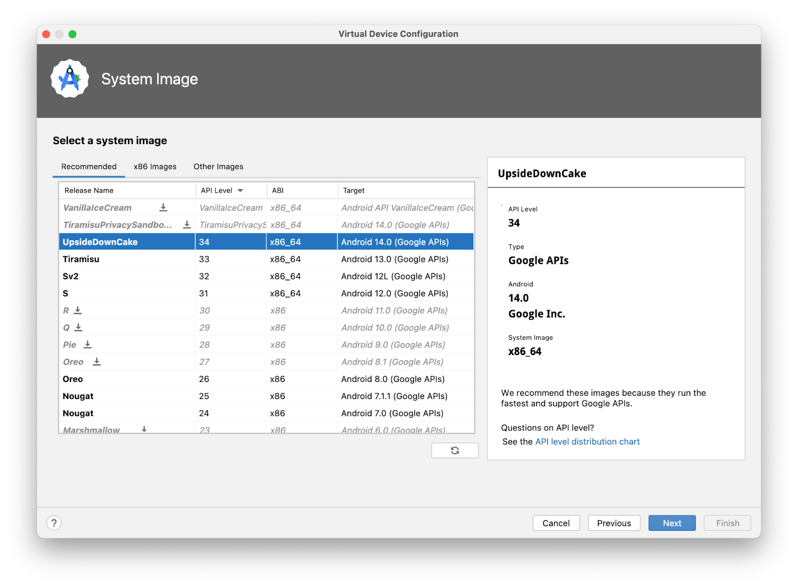

5. [**UpsideDownCake**] の横にダウンロード リンクがある場合は、**[Download] > [Accept] > [Next] > [Finish]** をクリックします。ダウンロード リンクがあるということは、イメージがパソコンにインストールされていないということです。その場合、仮想デバイスを設定するには、まずイメージをインストールする必要があります。ダウンロードが完了するまでに少し時間がかかります。


6. [**Recommended**] タブで、仮想デバイス上で稼働させる Android のバージョンとして [**UpsideDownCake**] を選択し、[**Next**] をクリックします。

Android 14 UpsideDownCake はこの記事の執筆時点で最新バージョンの Android ですが、これより後の安定版を選択することもできます。安定版のリストについては、[プラットフォームのコードネーム、バージョン、API レベル、NDK リリース](https://source.android.com/setup/start/build-numbers#platform-code-names-versions-api-levels-and-ndk-releases)をご覧ください。

> **重要:**Android システム イメージはディスク容量を大量に消費するため、最初にインストールされるのはごく一部のみです。[**Recommended**] タブに表示されるもの以外にも、多くのバージョンの Android システムが利用可能です。確認するには、[**Virtual Device Configuration**] ダイアログの [**x86 Images**] タブと [**Other Images**] タブをご覧ください。
> 
> 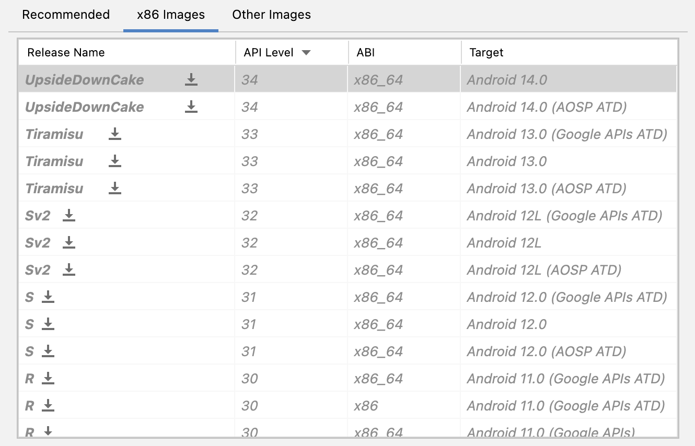

この操作で、デバイスの詳細設定を行える別の画面が開きます。

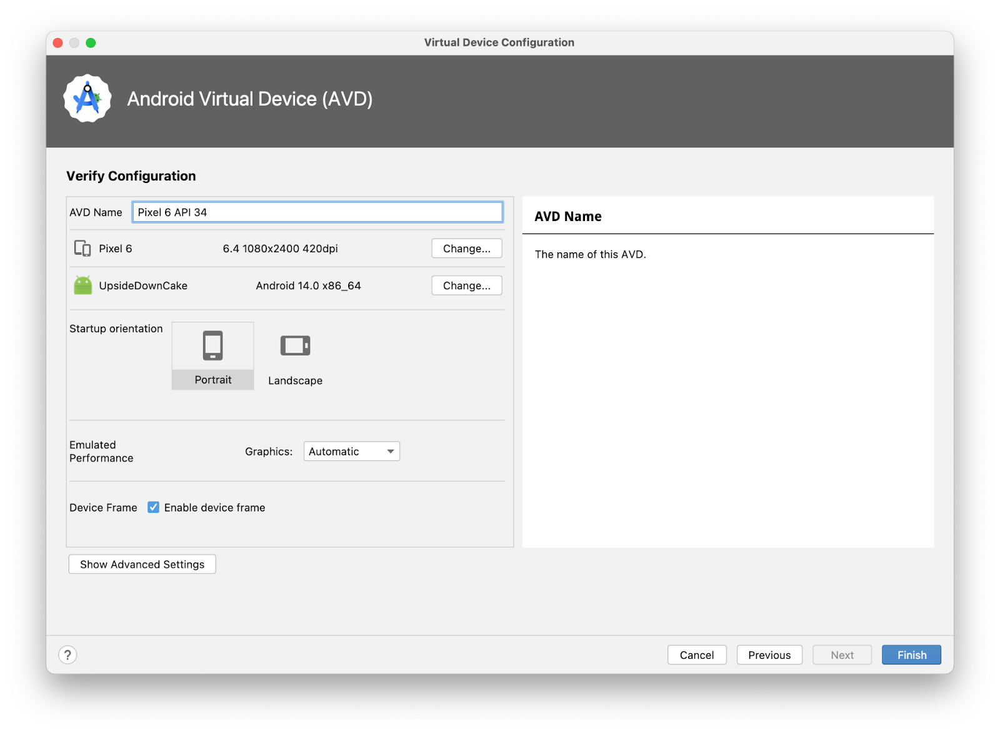

> **注:**Google API のシステム イメージを使用することについての警告が赤色で表示されても、ここでは無視して構いません。

7. [**AVD Name**] フィールドに AVD の名前を入力するか、デフォルトを使用します。残りのフィールドは変更しません。
8. [**完了**] をクリックします。

これで、[**Device Manager**] ペインに戻ります。

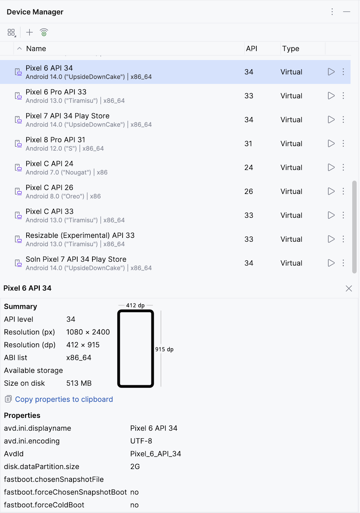

9. [**Device Manager**] ダイアログを閉じます。

#### Android Emulator でアプリを実行する

1. Android Studio ウィンドウの上部にあるプルダウン メニューから、作成した仮想デバイスを選択します。

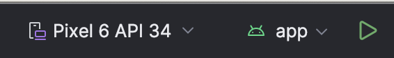

2.  をクリックします。

仮想デバイスが実機と同じように起動します。エミュレータが初めて起動するまでに少し時間がかかります（数分かかる場合があります）。仮想デバイスがコードエディタの横に開きます。

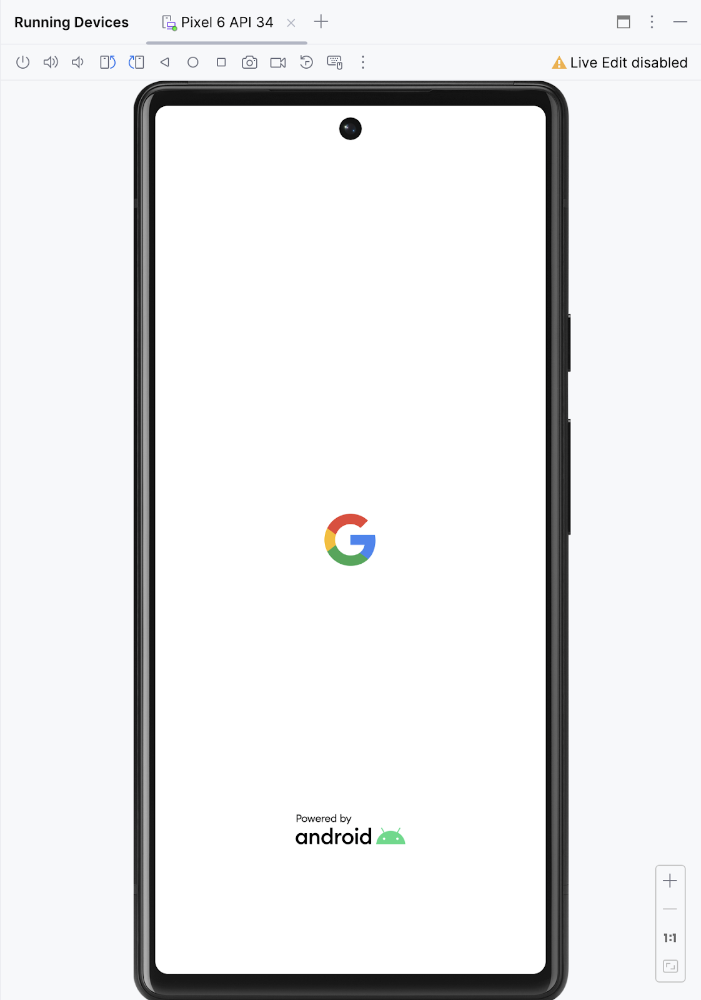

アプリの準備が整うと、仮想デバイス上で開きます。

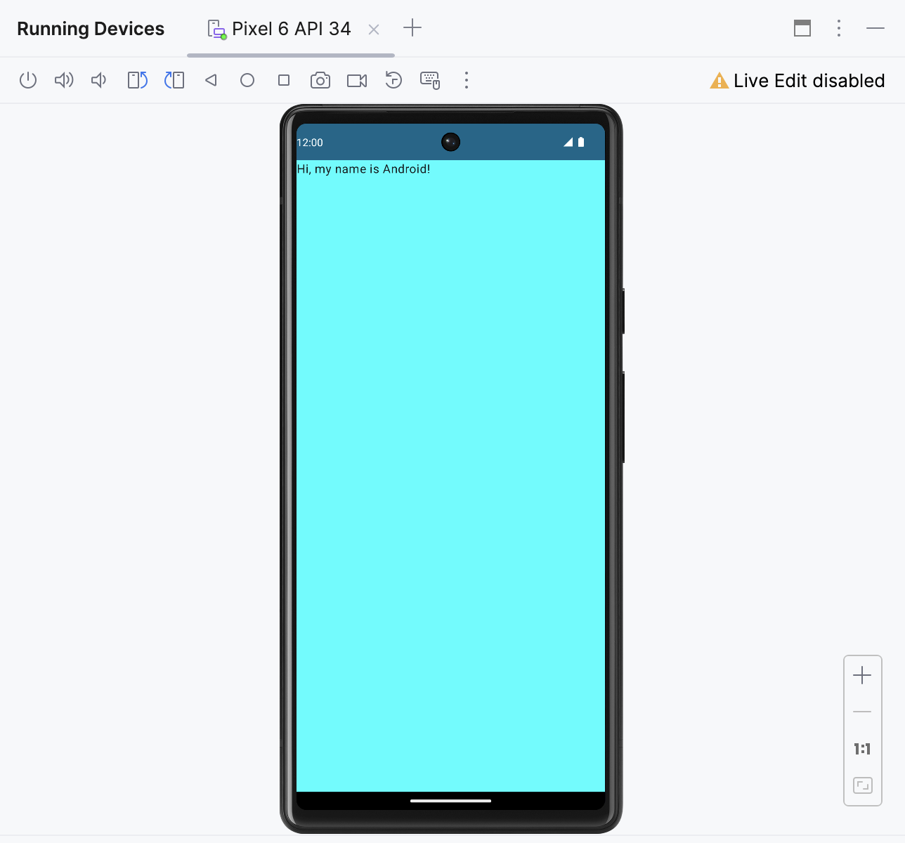

これで仮想デバイスが稼働した状態になりました。アプリが起動すると、背景色と挨拶文が画面に表示されます。

### 3. まとめ

お疲れさまでした。Android Emulator でアプリを実行できました。

#### 概要

- AVD を作成するには、プロジェクトを開いて **[Tools] > [Device Manager]** をクリックし、[デバイス マネージャー](http://developer.android.com/tools/devices/managing-avds.html)を使用してハードウェア デバイスとシステム イメージを選択します。
- 仮想デバイスでアプリを実行するには、デバイスが作成されていることを確認し、ツールバーのメニューでデバイスを選択して、 をクリックします。

#### 詳細

- [Android Studio の概要](https://developer.android.com/studio/intro)
- [プロジェクトの概要](https://developer.android.com/studio/projects)
- [プロジェクトの作成](https://developer.android.com/studio/projects/create-project)
- [テンプレートからコードを追加する](https://developer.android.com/studio/projects/templates)
- [アプリをビルドして実行する](https://developer.android.com/studio/run)
- [Android Emulator 上でアプリを実行する](https://developer.android.com/studio/run/emulator)

## 6. Android デバイスを接続する方法


### 1. 始める前に

このレッスンでは、Android Studio でアプリを実際の Android デバイスに接続する方法について説明します。デバイスはケーブルでも Wi-Fi でも接続できます。このレッスンは両方のケースに対応します。Android Studio は更新されて UI が変更されることがあるため、実際の Android Studio と画面が多少異なっていても問題ありません。

#### 前提条件

- Android Studio の使用方法についての基礎知識があること。
- Android デバイスで設定を開いて調整できること。

#### 学習内容

- Android デバイスで Android Studio からアプリを実行できるようにする方法。
- 実際の Android デバイスを接続して Android Studio でアプリを実行する方法。

#### 必要なもの

- パソコンにダウンロードし、インストールした [Android Studio](https://developer.android.com/studio)。
- Android Studio でセットアップされたアプリ プロジェクト。
- Lollipop 以降を搭載したスマートフォンやタブレットなどの Android デバイス。
- （省略可）USB ポートを介して Android デバイスをパソコンに接続するための USB ケーブル。

> **注:**お使いのパソコン、Android デバイスの USB ポートの種類や、必要な対応ケーブルを確認するには、[USB](https://en.wikipedia.org/wiki/USB) をご覧ください。

### 2. USB デバッグを有効にする

Android Studio が Android デバイスと通信できるようにするには、デバイスの開発者向けオプションの設定で USB デバッグを有効にする必要があります。

開発者向けオプションを表示して USB デバッグを有効にするには:

1. Android デバイスで [**設定**] > [**デバイス情報**] をタップします。
2. [**ビルド番号**] を 7 回タップします。
3. デバイスのパスワードまたは PIN の入力を求めるメッセージが表示されたら、入力します。「**You are now a developer!**」というメッセージが表示されたら成功です。

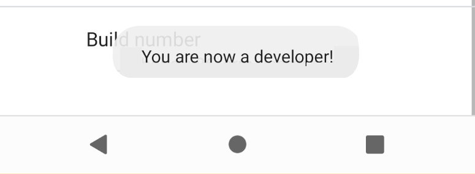

4. [**設定**] に戻り、[**システム**] > [**開発者向けオプション**] をタップします。
5. [**開発者向けオプション**] が表示されていない場合は、[**詳細オプション**] をタップします。

| ![[システム] ページの [開発者向けオプション] が赤色のボックスで囲まれている画像。](./images/basic-android-kotlin-compose-connect-device/c4b7a41bbf7800c3.png) | 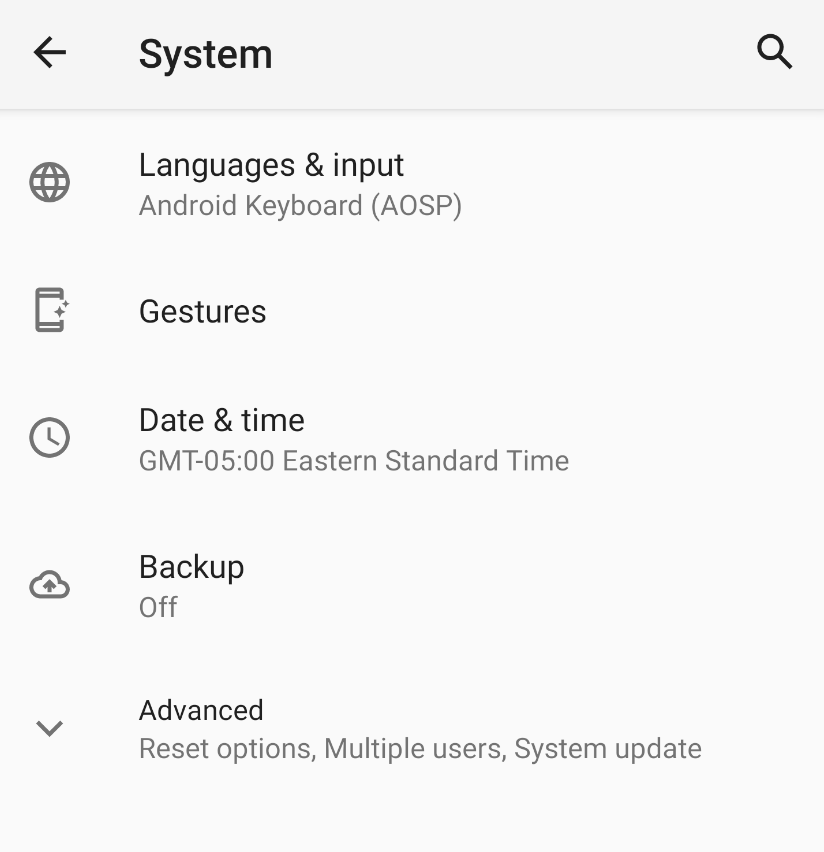 |
|---|---|

6. [**開発者向けオプション**] をタップし、[**USB デバッグ**] をタップしてオンに切り替えます。

![[開発者向けオプション] ページで [USB デバッグ] がオンになっており、赤色のボックスで囲まれている画像。](./images/basic-android-kotlin-compose-connect-device/cfc535f28f645d95.png)

#### [Google USB ドライバをインストールする（Windows のみ）](https://developer.android.com/codelabs/basic-android-kotlin-training-run-on-mobile-device?continue=https%3A%2F%2Fdeveloper.android.com%2Fcourses%2Fpathways%2Fandroid-basics-kotlin-two%23codelab-https%3A%2F%2Fdeveloper.android.com%2Fcodelabs%2Fbasic-android-kotlin-training-run-on-mobile-device#2)

Android Studio を Windows にインストールした場合は、実機でアプリを実行する前に USB デバイス ドライバをインストールする必要があります。

> **注:**Ubuntu Linux の場合は、[ハードウェア デバイス上でのアプリの実行](http://developer.android.com/tools/device.html)に記載されている手順を行ってください。

1. Android Studio で **[Tools] > [SDK Manager]** をクリックします。**[Preferences] > [Appearance & Behavior] > [System Settings] > [Android SDK]** ダイアログが開きます。
2. [**SDK Tools**] タブをクリックします。
3. [**Google USB Driver**] を選択して、[**OK**] をクリックします。

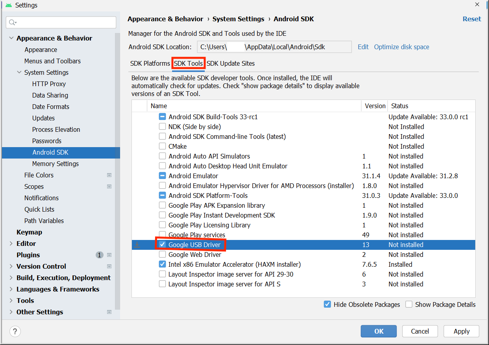

完了すると、ドライバ ファイルが `android_sdk\extras\google\usb_driver` ディレクトリにダウンロードされます。これで、デバイスを接続して Android Studio からアプリを実行できるようになりました。

### 3. ケーブルを使用して Android デバイスでアプリを実行する

デバイスを Android Studio に接続する方法は 2 つあります。ケーブルによる方法と、Wi-Fi による方法です。どちらを選択しても構いません。

Android デバイスで Android Studio からアプリを実行するには:

1. USB ケーブルを使用し、Android デバイスをパソコンに接続します。デバイスに、USB デバッグの許可を求めるダイアログが表示されます。

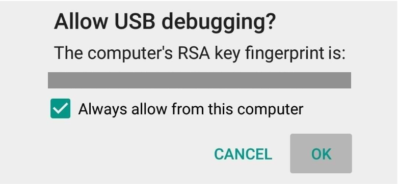

2. [**このパソコンからの USB デバッグを常に許可する**] チェックボックスをオンにして、[**OK**] をタップします。
3. パソコンの Android Studio で、プルダウンからデバイスが選択されていることを確認します。 をクリックします。


4. お使いのデバイスを選択して、[**OK**] をクリックします。Android Studio によってそのデバイスにアプリがインストールされて実行されます。

> **注**: Android Studio 3.6 以降の場合、デバッグをオンにした状態で実機を接続すると、その実機が自動的に選択されます。

5. お使いのデバイスに搭載されている Android プラットフォームが Android Studio にインストールされておらず、必要なプラットフォームをインストールするかどうかを尋ねるメッセージが表示された場合、**[Install] > [Continue] > [Finish]** をクリックします。Android Studio によってそのデバイスにアプリがインストールされて実行されます。

### 4. Wi-Fi を使用して Android デバイスでアプリを実行する

ケーブルがない場合は、Wi-Fi を使用してデバイスに接続し、アプリを実行することもできます。

#### 始める

1. パソコンとデバイスが同じワイヤレス ネットワークに接続されていることを確認します。
2. デバイスに Android 11 以降が搭載されていることを確認します。詳しくは、[Android のバージョンを確認して更新する](https://support.google.com/android/answer/7680439)をご覧ください。
3. パソコンに最新バージョンの Android Studio がインストールされていることを確認します。ダウンロードするには、[Android Studio のページ](https://developer.android.com/studio)をご覧ください。
4. パソコンに最新バージョンの [SDK Platform Tools](https://developer.android.com/studio/releases/platform-tools) がインストールされていることを確認します。

#### デバイスをペア設定する

1. Android Studio で、実行構成のプルダウン メニューから [**Pair Devices Using Wi-Fi**] を選択します。

![[Pair Devices Using Wi-Fi] が選択されたプルダウン メニューの画像。](./images/basic-android-kotlin-compose-connect-device/eaab2f4e864cb67a.png)

[**Pair devices over Wi-Fi**] ダイアログが開きます。

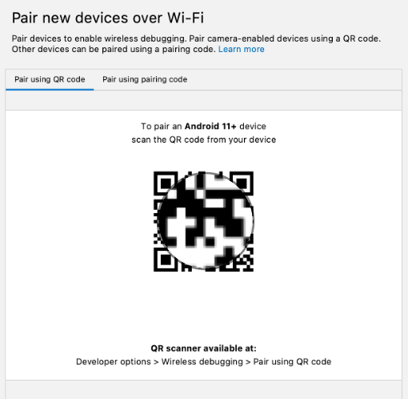

2. [**開発者向けオプション**] に移動して、[**デバッグ**] セクションまで下にスクロールし、[**ワイヤレス デバッグ**] をオンにします。

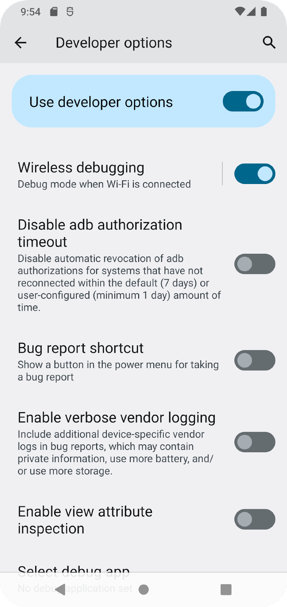

3. [**このネットワークでワイヤレス デバッグを許可しますか？**] というポップアップで [**許可**] を選択します。

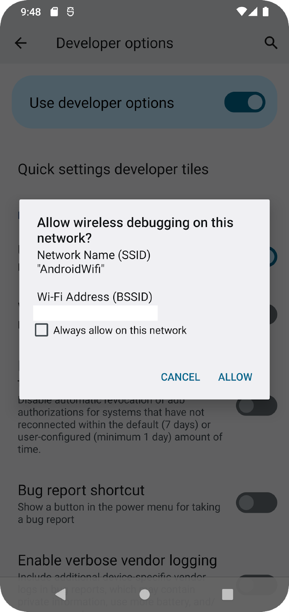

4. デバイスを QR コードでペア設定する場合は、[**QR コードによるデバイスのペア設定**] を選択して、パソコンの QR コードをスキャンします。または、デバイスをペア設定コードでペア設定する場合は、[**ペア設定コードによるデバイスのペア設定**] を選択して 6 桁のコードを入力します。
5. [実行] をクリックすると、アプリをデバイスにデプロイできるようになります。

> **注:**別のデバイスをペア設定する場合、またはパソコンからこのデバイスを削除する場合は、デバイスで [**ワイヤレス デバッグ**] に移動し、[**ペア設定済みのデバイス**] でワークステーション名をタップして、[**削除**] を選択します。

### 5. トラブルシューティング

- パソコンに Linux または Windows が搭載されており、実際の Android デバイスでアプリを実行できない場合は、[ハードウェア デバイス上でのアプリの実行](http://developer.android.com/tools/device.html)をご覧ください。
- パソコンに Windows が搭載されており、エミュレータのインストールがうまくできない場合は、お使いのデバイスに適した USB ドライバについて、[OEM USB ドライバのインストール](http://developer.android.com/tools/extras/oem-usb.html)をご覧ください。
- Android Studio でデバイスが認識されない場合は、USB ケーブルを挿し直すか、Android Studio を再起動してみます。
- それでもパソコンでデバイスが検出されない場合や、デバイスが未認証であると宣言される場合は、まず USB ケーブルを抜きます。次にデバイスで、**[設定] > [開発者向けオプション] > [USB デバッグの許可の取り消し]** をタップします。パソコンにデバイスを再接続します。許可を求めるメッセージが表示されたら、許可します。

### 6. まとめ

実際の Android デバイスを使用して Android Studio でアプリを実行する方法を学びました。

#### 概要

- ケーブルまたは Wi-Fi を使用して実機で Android アプリを実行できます。
- Windows ユーザーが実機でアプリを実行するには、USB デバッグ ドライバをインストールする必要があります。
- Wi-Fi を使用してアプリを実行する場合は、QR コードまたは 6 桁のコードを使用してペア設定できます。

#### 詳細はこちら

- [ハードウェア デバイス上でアプリを実行する](https://developer.android.com/studio/run/device)
- [OEM USB ドライバのインストール](https://developer.android.com/studio/run/oem-usb#Drivers)
- [Google USB ドライバを入手する](https://developer.android.com/studio/run/win-usb)

## 7. つまずきやすいポイント

- インストールと最初のビルドには時間がかかります（初回は数十分）。時間に余裕があるときに始めましょう。
- PC のメモリが少ないとエミュレータが重くなります。実機（Android スマホ）があれば USB 接続での実行がおすすめです。
- 「Gradle sync failed」などで止まったら、まず **エラーメッセージ全文** をコピーして AI に聞きましょう。ネットワークや権限の問題であることが多いです。

> この章で作った「Happy Birthday」プロジェクトは次章で拡張します。学習用リポジトリの `unit1/` 配下に置いておくと次章の提出がスムーズです。

## 8. AIに質問する（この章の例）

次の例をそのままAIに投げてOKです（必要なら自分のコード/エラーに置き換えてください）。

```text
「Android Studio のインストールで「Gradle sync failed」と出た。原因の切り分け手順を順番に教えて（エラー全文: ここに貼る／OS: ここに書く）」
「エミュレータが重くて動かない。PC のスペックは（ここに書く）。軽くする設定と、実機接続との比較を教えて」
「Android Studio の画面で「Project」「Logcat」「Run」がどこにあるか、初心者向けに説明して」
```

質問がまとまらないときは、第0章の「質問テンプレ」を使ってください。

## 9. チェックリスト

- [ ] Android Studio をインストールし、最初のプロジェクトを作成できる
- [ ] エミュレータ（または実機）でアプリを起動できる
- [ ] 「プロジェクトの場所」「Run ボタン」「Logcat」がどこにあるか分かる
- [ ] 各レッスンの「まとめ」にある用語を自分の言葉で説明できる

---

## 完了記録

この章には提出課題はありません。
学習が完了したら、進捗ダッシュボードで **完了日** を記録してください。
