# 第3章: 基本的なレイアウトを作成する

> 提出ブランチ: `feature/01-basic-layout`

## 1. この章のゴール

- `Text` / `Image` コンポーザブルと `Column` / `Row` / `Box` で画面を組める
- `Modifier` で余白・サイズ・配置を調整できる
- プロジェクト「名刺アプリ」を自分の情報で完成させられる

## 2. 進め方

次の内容を **上から順番に** 進めます。「やらなくてOK」の行は飛ばして構いません。レッスンの本文はこのページの下にすべて掲載しています。目安時間の合計は約345分です。

| # | 種類 | 内容 | 目安 | 備考 |
|---|---|---|---|---|
| 1 | レッスン | テキスト コンポーザブルを使用してシンプルなアプリを作成する | 約60分 |  |
| 2 | レッスン | Android アプリに画像を追加する | 約60分 |  |
| 3 | レッスン | 練習問題: Compose の基本 | 約90分 |  |
| 4 | レッスン | プロジェクト: 名刺アプリを作成する | 約120分 | **提出対象** |
| 5 | クイズ | [テスト: 基本的なレイアウトを作成する](https://developer.android.com/courses/quizzes/android-basics-compose-unit-1-pathway-3/Build-a-basic-layout?hl=ja) | 約15分 | リンク先で受ける |

このプログラムの進め方は次の通りです。

1. 下の各レッスンを読み、各ステップの説明を理解してから **自分でコードを打つ**（コピペで済ませない）
2. ステップごとにアプリを実行し、期待どおり動くか確認する
3. 動かないときは、エラー文をそのまま AI に貼って「何が原因か」を聞き、直したら **なぜ直ったか** をメモする
4. 章末のクイズ（リンク先）を受けて、間違えた項目をレッスンで読み直す

> 画面が最新の Android Studio と異なる場合があります。

## 3. テキスト コンポーザブルを使用してシンプルなアプリを作成する


### 1. 始める前に

このレッスンでは、Jetpack Compose を使用して、誕生日メッセージを画面上に表示するシンプルな Android アプリを作成します。

#### 前提条件

- Android Studio でアプリを作成する方法。
- エミュレータまたは Android デバイスでアプリを実行する方法。

#### 学習内容

- コンポーズ可能な関数（`Text`、`Column`、`Row` など）を記述する方法。
- アプリ内でレイアウトにテキストを表示する方法。
- テキストサイズの変更など、テキストの書式を設定する方法。

#### 作成するアプリの概要

- テキスト形式で誕生日祝いのメッセージを表示する Android アプリ。完成すると、以下のスクリーンショットのようになります。


#### 必要なもの

- Android Studio がインストールされているパソコン

### 2. Happy Birthday アプリを設定する

このタスクでは、Android Studio で Empty Activity テンプレートを使用してプロジェクトを設定し、テキスト メッセージをカスタマイズされた誕生日祝いのメッセージに変更します。

#### Empty Activity プロジェクトを作成する

1. [**Welcome to Android Studio**] ダイアログで、[**New Project**] を選択します。
2. [**New Project**] ダイアログで [**Empty Activity**] を選択し、[**Next**] をクリックします。
3. [**Name**] フィールドに「`Happy Birthday`」と入力し、[**Minimum SDK**] フィールドで API レベル 24（Nougat）以上を選択して、[**Finish**] をクリックします。

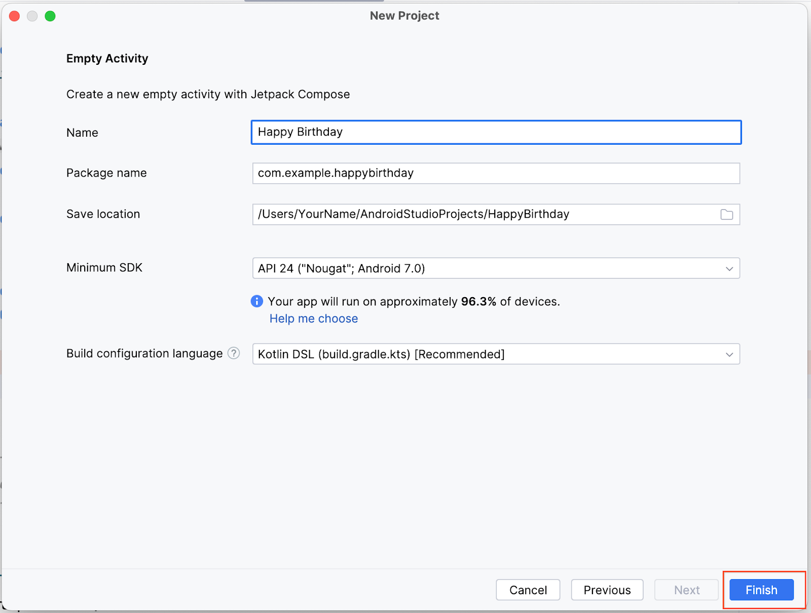

4. Android Studio でプロジェクト ファイルが作成され、プロジェクトがビルドされるまで待ちます。
5. （**Run 'app'**）をクリックします。

アプリは次のスクリーンショットのようになります。

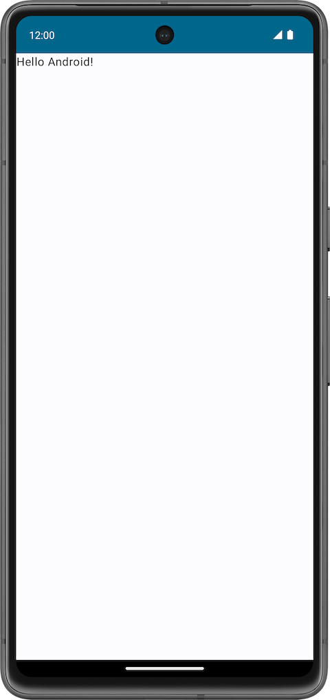

この Happy Birthday アプリを Empty Activity テンプレートで作成すると、基本的な Android アプリのリソースが設定され、画面に「**Hello Android!**」というメッセージが表示されます。このレッスンでは、メッセージの配置方法、そのテキストを誕生日祝いのメッセージに変更する方法、さらにメッセージを追加して書式を設定する方法を説明します。

#### ユーザー インターフェース（UI）とは

アプリのユーザー インターフェース（UI）とは、画面上に表示されるテキスト、画像、ボタン、その他のさまざまな種類の要素と、これらの要素の画面での配置方法になります。アプリがユーザーに何かを表示する仕組み、ユーザーがアプリを操作する仕組みです。

以下の画像は、クリック可能なボタン、テキスト メッセージ、ユーザーがデータを入力できるテキスト入力フィールドです。

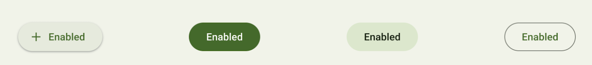

クリック可能なボタン

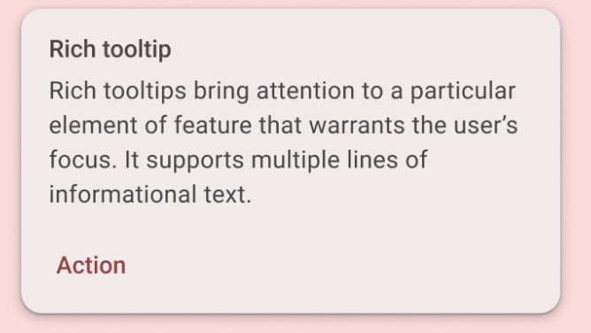

カード内のテキスト メッセージ

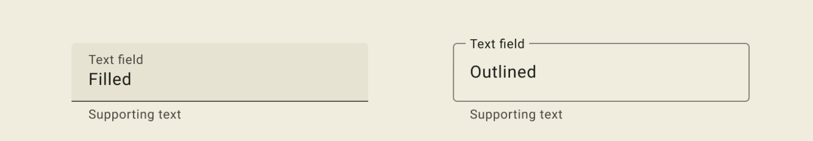

テキスト入力フィールド

これらの要素はそれぞれ UI コンポーネントと呼ばれます。アプリの画面に表示されるものは、ほぼすべてが UI 要素（UI コンポーネント）です。UI 要素は、クリック可能なボタンや編集可能な入力フィールドのようにインタラクティブなものにすることも、装飾的な画像にすることもできます。

次のアプリで、できる限り多くの UI コンポーネントを探してみましょう。

|  | 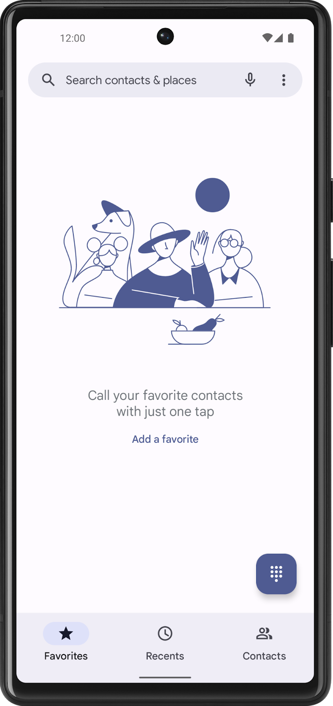 |
|---|---|

このレッスンでは、`Text` 要素というテキストを表示する UI 要素を使用します。

### 3. Jetpack Compose とは

Jetpack Compose は、Android UI を構築するための最新のツールキットです。Compose は、簡潔なコード、パワフルなツール、直感的な Kotlin 機能を使用して Android での UI の開発を簡素化し、加速します。Compose では、データを受け取って UI 要素を記述するコンポーズ可能な関数と呼ばれる一連の関数を定義することで、UI を構築できます。

#### コンポーズ可能な関数

コンポーズ可能な関数は、Compose の UI の基本的なビルディング ブロックです。コンポーズ可能な関数の機能は以下のとおりです。

- UI の一部を記述します。
- 何も返しません。
- 入力を受け取り、画面に表示されるものを生成します。

#### アノテーション

アノテーションは、コードに追加情報を付加する方法です。この情報は、Jetpack Compose コンパイラのようなツールや、他のデベロッパーがアプリのコードを理解する際に役立つものです。

アノテーションを付けるには、アノテーションを付ける宣言の先頭にある名前（アノテーション）の前に `@` 文字を追加します。アノテーションは、プロパティ、関数、クラスなど、さまざまなコード要素に付けることができます。クラスについてはコースの後半で学びます。

以下の図に、アノテーション付きの関数の例を示します。

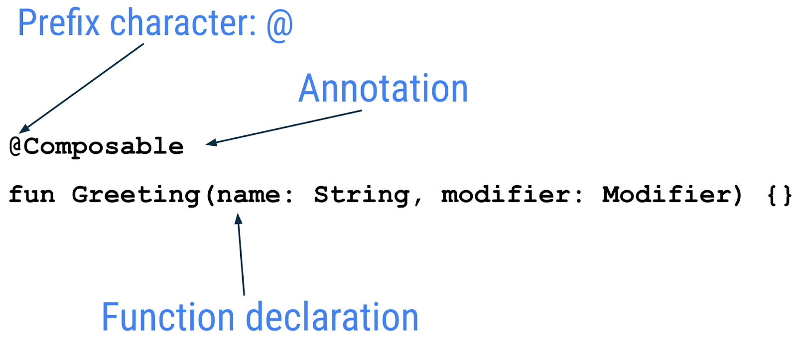

次のコード スニペットは、アノテーション付きのプロパティの例を示しています。これらのサンプルは、このレッスンの後半で使用します。

```kotlin
// Example code, do not copy it over

@Json
val imgSrcUrl: String

@Volatile
private var INSTANCE: AppDatabase? = null
```

##### パラメータ付きアノテーション

アノテーションはパラメータを受け入れることができます。パラメータは、それらを処理するツールに追加情報を提供します。パラメータありとパラメータなしの `@Preview` アノテーションの例を以下に示します。

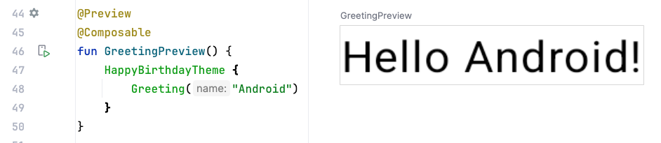

パラメータなしのアノテーション

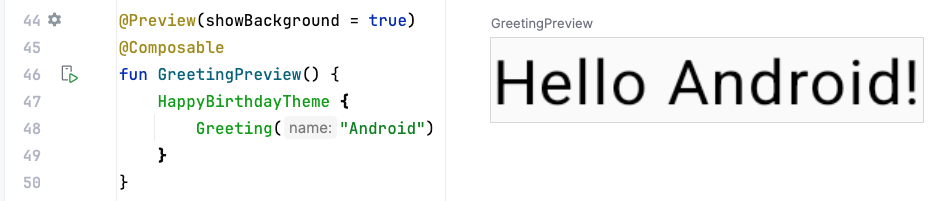

背景をプレビューするアノテーション

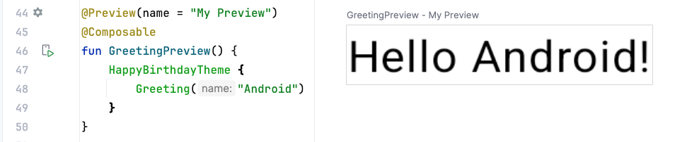

プレビュー タイトル付きのアノテーション

以下に示すように、アノテーションに複数の引数を渡すことができます。

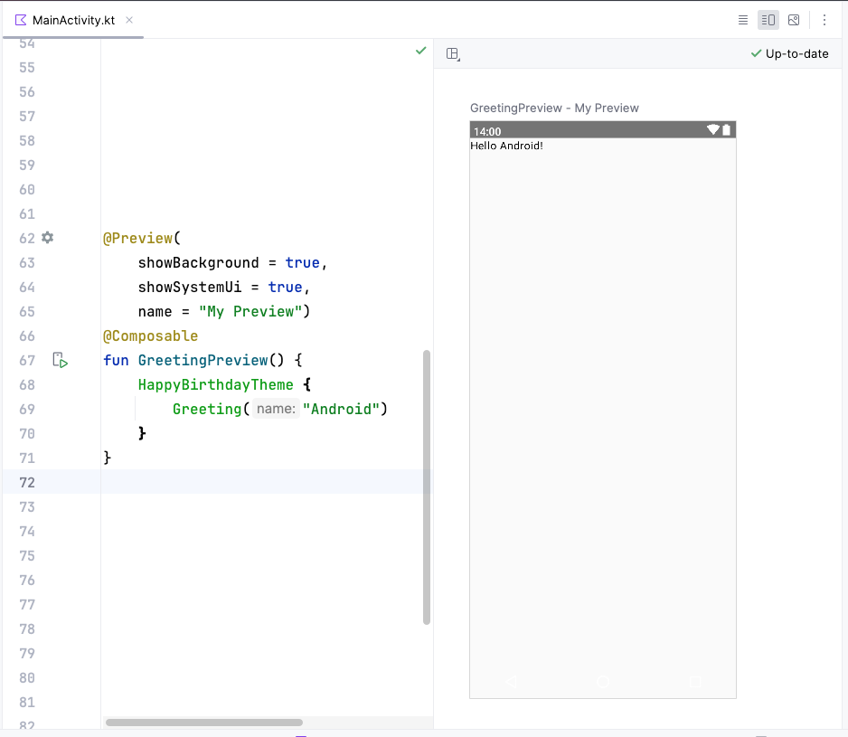

コードとプレビューを示す Android Studio のスクリーンショット

プレビュー タイトルとシステム UI 付きのアノテーション（スマートフォンの画面）

Jetpack Compose にはさまざまな組み込みアノテーションが用意されています。これまでのコースで、`@Composable` アノテーションと `@Preview` アノテーションについて説明しました。コースの後半では、さらに多くのアノテーションとその使用方法を学びます。

##### コンポーズ可能な関数の例

コンポーズ可能な関数には、[`@Composable`](https://developer.android.com/reference/kotlin/androidx/compose/runtime/Composable) アノテーションが付けられています。コンポーズ可能な関数はすべて、このアノテーションが必要です。このアノテーションは、この関数がデータを UI に変換するためのものであることを Compose コンパイラに伝えます。なお、コンパイラとは、記述したコードを 1 行ずつ読み、コンピュータが理解できる内容（機械語）に変換する特殊なプログラムです。

このコード スニペットは、シンプルなコンポーズ可能な関数の例です。渡されるデータ（`name` 関数パラメータ）を使用して、画面上にテキスト要素をレンダリングしています。

```kotlin
@Composable
fun Greeting(name: String) {
    Text(text = "Hello $name!")
}
```

コンポーズ可能な関数には以下の特徴があります。

- Jetpack Compose は、コンポーズ可能な関数に基づいて構築されています。コンポーズ可能な関数を使用すると、UI の外観を指定することにより、アプリの UI をプログラムで定義できます。UI の構築プロセスに注意を払う必要はありません。関数名に `@Composable` アノテーションを追加するだけでコンポーズ可能な関数を作成できます。
- コンポーズ可能な関数は、アプリのロジックで UI の記述や変更を行えるようにする引数を受け入れることができます。今回の例では、UI 要素で `String` を受け入れることで、名前を入れてユーザーにメッセージを表示できます。

##### コード内でのコンポーズ可能な関数について

1. Android Studio で `MainActivity.kt` ファイルを開きます。
2. `GreetingPreview()` 関数までスクロールします。このコンポーズ可能な関数は、`Greeting()` 関数をプレビューするのに役立ちます。関数には、その機能を説明する名前を付けるか、そのような名前に変更することをおすすめします。この関数の名前を `BirthdayCardPreview()` に変更します。

```kotlin
@Preview(showBackground = true)
@Composable
fun BirthdayCardPreview() {
    HappyBirthdayTheme {
        Greeting("Android")
    }
}
```

コンポーズ可能な関数は、他のコンポーズ可能な関数を呼び出すことができます。上記のコード スニペットでは、Preview 関数でコンポーズ可能な関数 `Greeting()` を呼び出しています。

なお、元の関数には、`@Composable` アノテーションの前にパラメータが付いた別のアノテーション `@Preview` もありました。`@Preview` アノテーションに渡される引数については、このコースの後半で詳しく説明します。

#### コンポーズ可能な関数の名前

Compose 関数が何も返さず、`@Composable` アノテーションが付いている場合は、パスカルケースを使用して名前を付ける必要があります。パスカルケースとは、複合語内の各単語の最初の文字が大文字になる命名規則を指します。パスカルケースとキャメルケースの違いは、パスカルケースでは、すべての単語の最初の文字が大文字になることです。キャメルケースでは、最初の文字は、単語の他の文字が小文字であれば大文字、大文字であれば小文字になります。

Compose 関数:

- 必ず名詞にしてください: `DoneButton()`
- 動詞または動詞句にしないでください: `DrawTextField()`
- 名詞の前置詞にしないでください: `TextFieldWithLink()`
- 形容詞にしないでください: `Bright()`
- 副詞にしないでください: `Outside()`
- 名詞の前に記述形容詞を付けることができます: `RoundIcon()`

詳しくは、[コンポーズ可能な関数の命名](https://github.com/androidx/androidx/blob/androidx-main/compose/docs/compose-api-guidelines.md#naming-unit-composable-functions-as-entities)をご覧ください。

**サンプルコード。コピーしないでください**

```kotlin
// Do: This function is a descriptive PascalCased noun as a visual UI element
@Composable
fun FancyButton(text: String) {}

// Do: This function is a descriptive PascalCased noun as a non-visual element
// with presence in the composition
@Composable
fun BackButtonHandler() {}

// Don't: This function is a noun but is not PascalCased!
@Composable
fun fancyButton(text: String) {}

// Don't: This function is PascalCased but is not a noun!
@Composable
fun RenderFancyButton(text: String) {}

// Don't: This function is neither PascalCased nor a noun!
@Composable
fun drawProfileImage(image: ImageAsset) {}
```

### 4. Android Studio のデザインペイン

[Android Studio](https://developer.android.com/studio) では、アプリを Android デバイスまたはエミュレータにインストールしなくても、コンポーズ可能な関数を IDE 内でプレビューできます。前の章で学習したように、アプリがどのように表示されるかについては、Android Studio の [**Design**] ペインでプレビューが可能です。

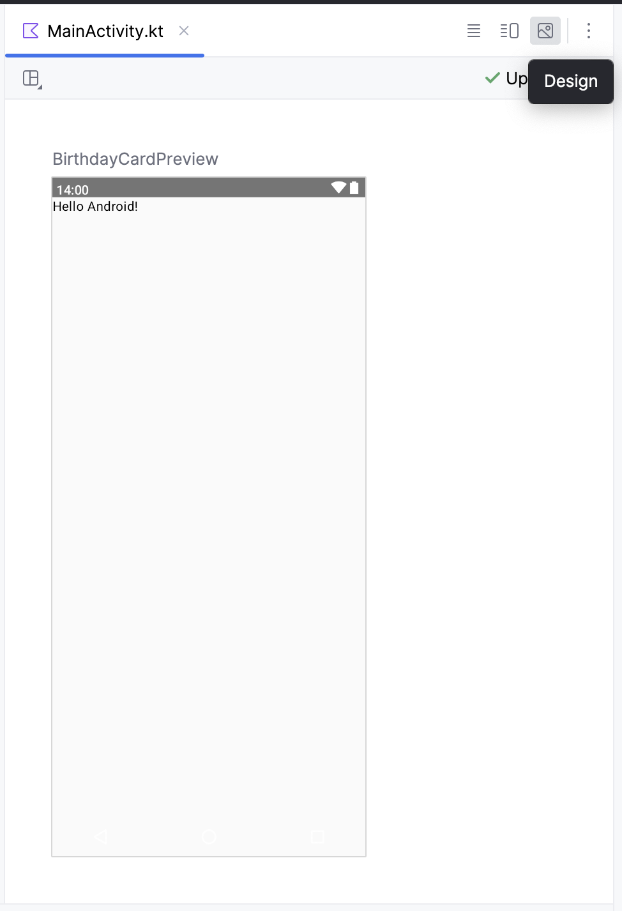

コンポーズ可能な関数は、プレビューするすべてのパラメータのデフォルト値を指定する必要があります。このため、`Greeting()` 関数を直接プレビューすることはおすすめしません。代わりに、別の関数（この場合は `BirthdayCardPreview()` 関数）を追加します。この関数は、適切なパラメータで `Greeting()` 関数を呼び出します。

```kotlin
@Preview(showBackground = true)
@Composable
fun BirthdayCardPreview() {
    HappyBirthdayTheme {
        Greeting("Android")
    }
}
```

> **ヒント**: [**Split**] アイコンをクリックすると、コードとデザイン プレビューの両方が表示されます。
> 
> 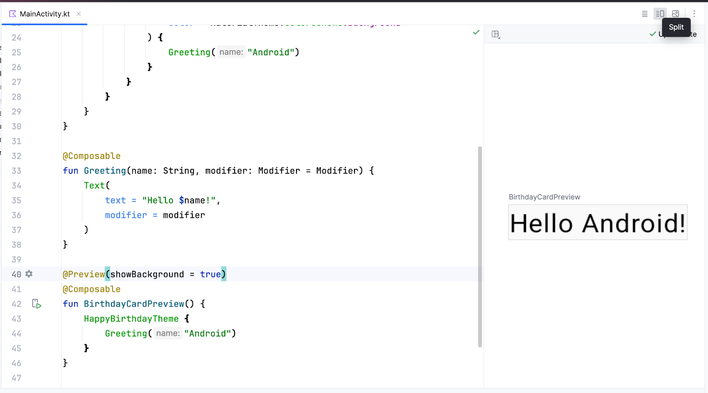

プレビューを表示するには:

1. `BirthdayCardPreview()` 関数で、`Greeting()` 関数の `"Android"` 引数を自分の名前に置き換えます。

```kotlin
@Preview(showBackground = true)
@Composable
fun BirthdayCardPreview() {
    HappyBirthdayTheme {
        Greeting("James")
    }
}
```

2. プレビューが自動的に更新されます。

更新されたプレビューが表示されます。

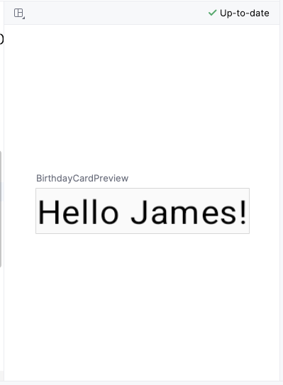

> **重要**: `@Preview` アノテーションを使用して `BirthdayCardPreview()` 関数に追加したコードは、Android Studio の [**Design**] ペインでのプレビュー専用です。これらの変更はアプリには反映されません。アプリに変更を加える方法については、後ほどこのレッスンで説明します。

### 5. 新しいテキスト要素を追加する

このタスクでは、`Hello $name!` のメッセージを削除して誕生日祝いのメッセージを追加します。

#### 新しいコンポーズ可能な関数を追加する

1. `MainActivity.kt` ファイルで、`Greeting()` 関数の定義を削除します。このレッスンの後半で、独自に作成した関数を追加して誕生日祝いのメッセージを表示します。

**次のコードを削除**します。

```kotlin
@Composable
fun Greeting(name: String, modifier: Modifier = Modifier) {
    Text(
        text = "Hello $name!",
        modifier = modifier
    )
}
```

2. `onCreate()` 関数内で、`Greeting()` 関数呼び出しの色が赤色になりました。この赤色はエラーを示しています。この関数呼び出しにカーソルを合わせると、Android Studio にエラーに関する情報が表示されます。

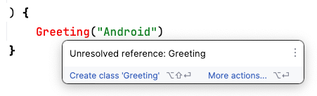

3. `Greeting()` 関数呼び出しとその引数を `onCreate()` 関数と `BirthdayCardPreview()` 関数から削除します。`MainActivity.kt` ファイルは次のようになります。

```kotlin
class MainActivity : ComponentActivity() {
    override fun onCreate(savedInstanceState: Bundle?) {
        super.onCreate(savedInstanceState)
        setContent {
            HappyBirthdayTheme {
                // A surface container using the 'background' color from the theme
                Surface(
                    modifier = Modifier.fillMaxSize(),
                    color = MaterialTheme.colorScheme.background
                ) {
                }
            }
        }
    }
}

@Preview(showBackground = true)
@Composable
fun BirthdayCardPreview() {
    HappyBirthdayTheme {
    }
}
```

4. `BirthdayCardPreview()` 関数の前に、`GreetingText()` という新しい関数を追加します。この関数の前に `@Composable` アノテーションを追加するようにしてください。これは、`Text` コンポーザブルを記述する Compose 関数になります。

```kotlin
@Composable
fun GreetingText() {
}
```

5. コンポーザブルが `Modifier` パラメータを受け取り、その `modifier` を最初の子に渡すようにすることをおすすめします。`Modifier` と子要素については、後続のタスクと Codelabs で詳しく説明します。ここでは、`Modifier` パラメータを `GreetingText()` 関数に追加します。

```kotlin
@Composable
fun GreetingText(modifier: Modifier = Modifier) {
}
```

6. `String` 型の `message` パラメータをコンポーズ可能な関数 `GreetingText()` に追加します。

```kotlin
@Composable
fun GreetingText(message: String, modifier: Modifier = Modifier) {
}
```

7. `GreetingText()` 関数に [`Text`](https://developer.android.com/jetpack/compose/text) コンポーザブルを追加し、テキスト メッセージを名前付き引数として渡します。

```kotlin
@Composable
fun GreetingText(message: String, modifier: Modifier = Modifier) {
    Text(
        text = message
    )
}
```

この `GreetingText()` 関数は UI にテキストを表示します。そのために、コンポーズ可能な関数 `Text()` を呼び出します。

#### 関数をプレビューする

このタスクでは、[**Design**] ペインで `GreetingText()` 関数をプレビューします。

1. `BirthdayCardPreview()` 関数内で `GreetingText()` 関数を呼び出します。
2. `String` 引数（友人への誕生日祝いのメッセージ）を `GreetingText()` 関数に渡します。必要に応じて、`"Happy Birthday Sam!"` などの名前でカスタマイズできます。

```kotlin
@Preview(showBackground = true)
@Composable
fun BirthdayCardPreview() {
    HappyBirthdayTheme {
        GreetingText(message = "Happy Birthday Sam!")
    }
}
```

3. [**Design**] ペインが自動的に更新されます。変更内容をプレビューします。

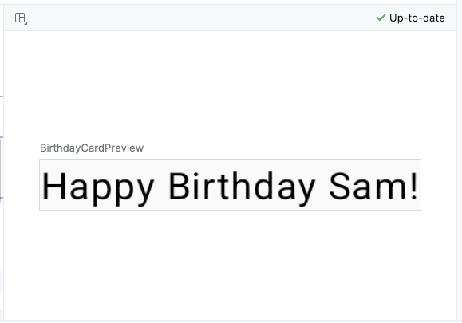

### 6. フォントサイズを変更する

ユーザー インターフェースにテキストを追加しましたが、まだ最終版のアプリとは外観に違いがあります。このタスクでは、テキスト要素の外観に影響を与えるサイズ、テキストの色などの属性を変更する方法を学びます。さまざまなフォントサイズと色も試します。

##### 拡張可能ピクセル

[拡張可能ピクセル（SP）](https://developer.android.com/reference/kotlin/androidx/compose/ui/unit/package-summary#(kotlin.Float).sp())はフォントサイズの単位です。Android アプリの UI 要素では、2 種類の測定単位を使用します。1 つは後でレイアウトに使用する[密度非依存ピクセル（DP）](https://developer.android.com/reference/kotlin/androidx/compose/ui/unit/package-summary#(kotlin.Int).dp())で、もう 1 つは拡張可能ピクセル（SP）です。SP の単位は、デフォルトでは DP の単位と同じですが、ユーザーがスマートフォン設定で選択するテキストサイズに基づいて変更されます。

1. `MainActivity.kt` ファイルで、`GreetingText()` 関数内の `Text()` コンポーザブルまでスクロールします。
2. `fontSize` 引数を 2 つ目の名前付き引数として `Text()` 関数に渡し、その値を `100.``sp` に設定します。

```kotlin
Text(
    text = message,
    fontSize = 100.sp
)
```

アプリをコンパイルするにはクラスまたはプロパティをいくつかインポートする必要があるため、Android Studio は `.sp` コードをハイライト表示します。

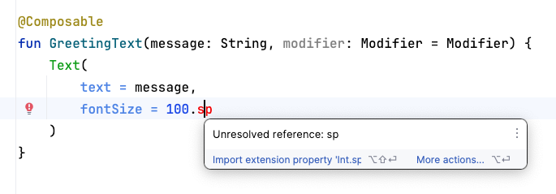

3. Android Studio でハイライト表示されている **`.sp`** をクリックします。
4. ポップアップで [**Import**] をクリックし、**`androidx.compose.ui.unit.sp`** をインポートして `.sp` 拡張プロパティを使用します。

> **注:** AndroidX（Android 拡張機能）ライブラリには、アプリのコア機能として開発を加速するのに役立つ一連のライブラリとクラスが含まれています。`androidx` パッケージを使用すると、クラス、プロパティ、その他のアーティファクトにアクセスできるようになります。

5. ファイルの先頭までスクロールして `import` ステートメントを確認します。ここに `import androidx.compose.ui.unit.sp` ステートメントがあります。これは、Android Studio がパッケージをファイルに追加することを意味します。

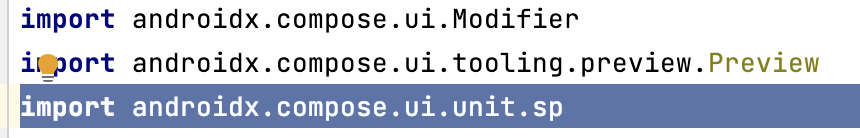

> **注:** Android Studio を使用してインポート中に問題が発生した場合は、ファイルの先頭部分に手動で import ステートメントを追加します。

6. フォントサイズのプレビューが更新されます。メッセージが重なっているので、行の高さを指定する必要があります。

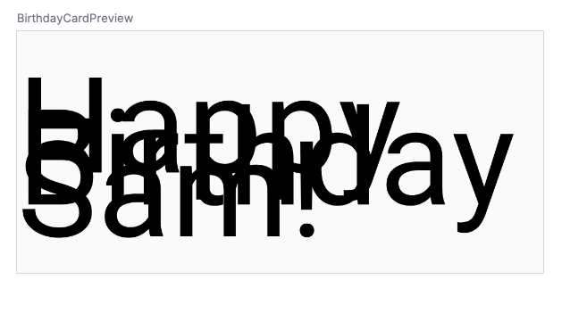

> **注:** `sp` は `Int` の[拡張プロパティ](https://kotlinlang.org/docs/extensions.html#extension-properties)であり、これにより `sp` の単位が作成されます。同様に、`.sp` 拡張プロパティは、`Float` や `Double` などの他のデータ型でも使用できます。

7. 行の高さを含むように `Text` コンポーザブルを更新します。

```kotlin
@Composable
fun GreetingText(message: String, modifier: Modifier = Modifier) {
    Text(
        text = message,
        fontSize = 100.sp,
        lineHeight = 116.sp,
    )
}
```

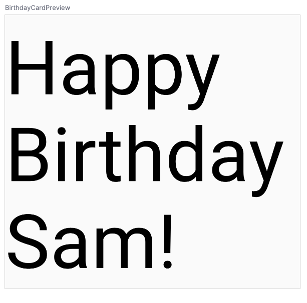

さまざまなフォントサイズを試せるようになりました。

### 7. 別のテキスト要素を追加する

前のタスクでは、友人への誕生日祝いのメッセージを追加しました。このタスクでは、カードに自分の名前で署名します。

1. `MainActivity.kt` ファイルで、`GreetingText()` 関数までスクロールします。
2. 署名用に、`String` 型の `from` パラメータを関数に渡します。

```kotlin
fun GreetingText(message: String, from: String, modifier: Modifier = Modifier)
```

> **注**: 関数呼び出しで名前付き引数を使用する場合、関数パラメータの順序は重要でありません。

3. 誕生日のメッセージ `Text` コンポーザブルの後に、`from` 値に設定された `text` 引数を受け入れる別の `Text` コンポーザブルを追加します。

```kotlin
@Composable
fun GreetingText(message: String, from: String, modifier: Modifier = Modifier) {
    Text(
        // ...
    )
    Text(
        text = from
    )
}
```

4. `fontSize` 名前付き引数を追加し、その値を `36.sp` に設定します。

```kotlin
Text(
    text = from,
    fontSize = 36.sp
)
```

5. `BirthdayCardPreview()` 関数までスクロールします。
6. カードに署名を入れる（`"From Emma"` など）ために、別の `String` 引数を追加します。

```kotlin
GreetingText(message = "Happy Birthday Sam!", from = "From Emma")
```

7. プレビューが表示されます。

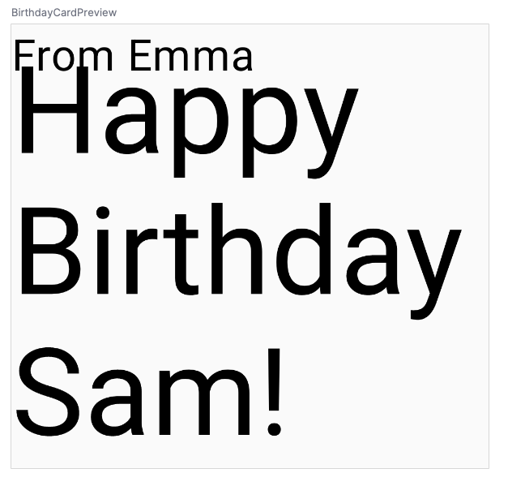

コンポーズ可能な関数は、複数の UI 要素を記述することがあります。ただし、配置方法のガイダンスが提供されないと、Compose は望ましくない方法で要素を配置する可能性があります。たとえば、前のコードでは、2 つのコンポーザブルの配置方法に関するガイダンスがないため、2 つのテキスト要素が互いに重なり合って生成されます。

次のタスクでは、コンポーザブルを行または列の形式で配置する方法を学習します。

### 8. テキスト要素を行または列で配置する

#### 行または列内のテキスト要素を配置する

#### UI 階層

UI 階層は包含を基本としています。つまり、1 つのコンポーネントに 1 つ以上のコンポーネントを含めることができ、「親」と「子」という用語が使用されることもあります。この場合、親 UI 要素が子 UI 要素を含み、その子 UI 要素がさらに子 UI 要素を含むことができます。このセクションでは、親 UI 要素として機能できる、`Column`、`Row`、`Box` のコンポーザブルについて学習します。

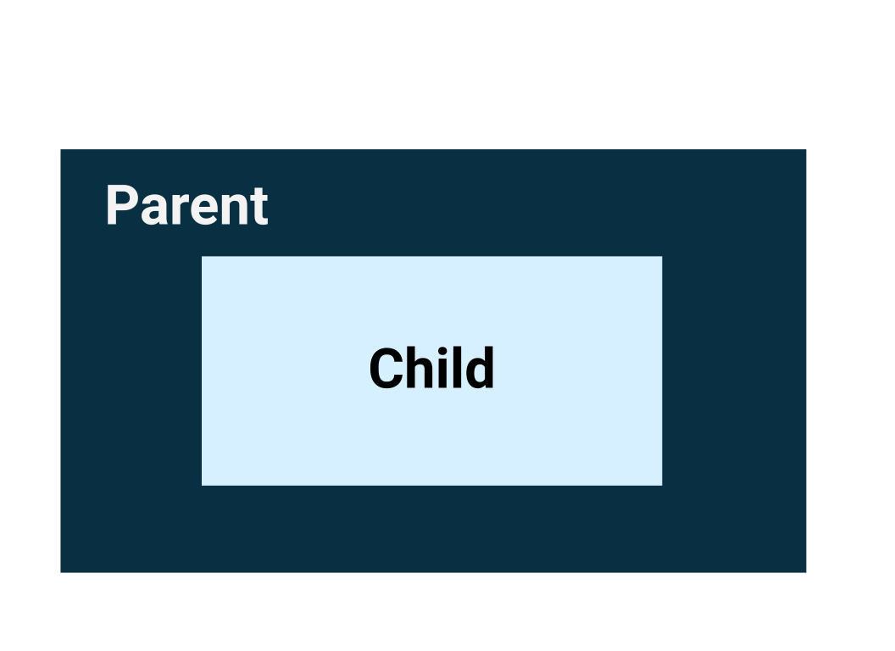

Compose には、基本的な標準レイアウト要素として、[`Column`](https://developer.android.com/reference/kotlin/androidx/compose/foundation/layout/Column.composable#Column(androidx.compose.ui.Modifier,androidx.compose.foundation.layout.Arrangement.Vertical,androidx.compose.ui.Alignment.Horizontal,kotlin.Function1))、[`Row`](https://developer.android.com/reference/kotlin/androidx/compose/foundation/layout/Row.composable#Row(androidx.compose.ui.Modifier,androidx.compose.foundation.layout.Arrangement.Horizontal,androidx.compose.ui.Alignment.Vertical,kotlin.Function1))、[`Box`](https://developer.android.com/reference/kotlin/androidx/compose/foundation/layout/Box.composable#Box(androidx.compose.ui.Modifier,androidx.compose.ui.Alignment,kotlin.Boolean,kotlin.Function1)) の 3 つのコンポーザブルがあります。`Box` コンポーザブルについては、次のレッスンで詳しく説明します。

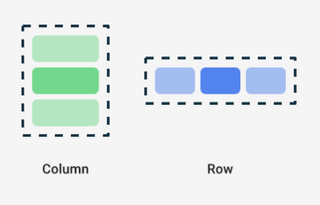

`Column`、`Row`、`Box` は、コンポーズ可能なコンテンツを引数として受け取るコンポーズ可能な関数であり、これらのレイアウト要素内にアイテムを配置できます。たとえば、`Row` コンポーザブル内の子要素は、それぞれ横方向に並べて配置されます。

```kotlin
// Don't copy.
Row {
    Text("First Column")
    Text("Second Column")
}
```

これらのテキスト要素は、次の画像のように画面上に並んで表示されます。

青い枠線はわかりやすく示すためのものであり、実際には表示されません。

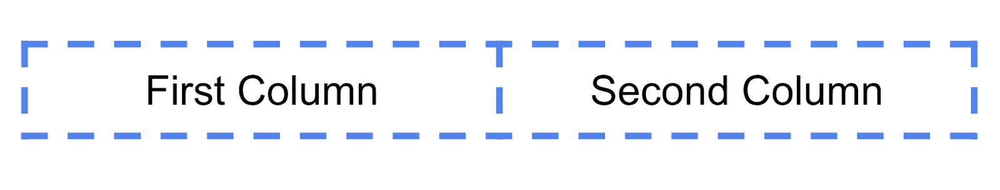

#### 後置ラムダ構文

前のコード スニペットでは、コンポーズ可能な関数 `Row` で、かっこの代わりに中かっこが使用されています。これを後置ラムダ構文と呼びます。ラムダと後置ラムダ構文については、このコースの後半で詳しく説明します。ここでは、一般的に使用される Compose 構文の使い方を学びます。

Kotlin には、最後のパラメータが関数の場合に、関数をパラメータとして渡すための特別な構文が用意されています。

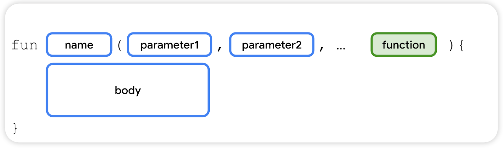

パラメータとして関数を渡す場合は、後置ラムダ構文を使用できます。関数をかっこで囲む代わりに、かっこの外側で中かっこに入れることができます。これは Compose で推奨される一般的な方法であるため、コードの見た目に慣れておく必要があります。

たとえば、コンポーズ可能な関数 `Row()` の最後のパラメータは `content` パラメータです。これは子 UI 要素を記述する関数です。3 つのテキスト要素を含む行を作成する場合、このコードは機能しますが、後置ラムダに名前付きパラメータを使用するのは非常に面倒です。

```kotlin
Row(
    content = {
        Text("Some text")
        Text("Some more text")
        Text("Last text")
    }
)
```

`content` パラメータは、関数のシグネチャの最後のパラメータであり、値をラムダ式として渡します（今のところ、ラムダが何であるかがわからなくてもかまいません。構文に慣れてください）。このため、次のように `content` パラメータとかっこを削除できます。

```kotlin
Row {
    Text("Some text")
    Text("Some more text")
    Text("Last text")
}
```

#### テキスト要素を行に配置する

このタスクでは、重複を避けるため、アプリのテキスト要素を行に配置します。

1. `MainActivity.kt` ファイルで、`GreetingText()` 関数までスクロールします。
2. テキスト要素の周囲に `Row` コンポーザブルを追加して、2 つのテキスト要素を含む行を表示します。2 つの `Text` コンポーザブルを選択し、電球をクリックします。[**Surround with widget**] > [**Surround with Row**] を選択します。

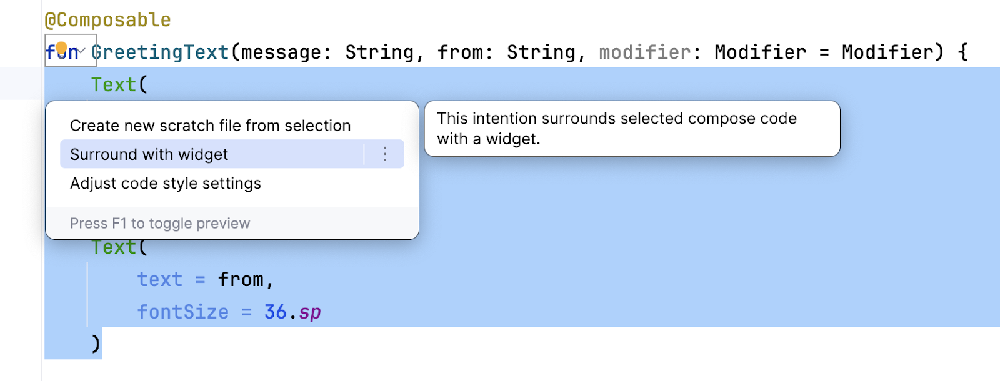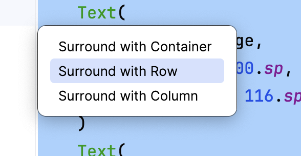

この関数は次のコード スニペットのようになります。

```kotlin
@Composable
fun GreetingText(message: String, from: String, modifier: Modifier = Modifier) {
    Row {
        Text(
            text = message,
            fontSize = 100.sp,
            lineHeight = 116.sp,
        )
        Text(
            text = from,
            fontSize = 36.sp
        )
    }
}
```

3. Android Studio が `Row` 関数を自動的にインポートします。一番上までスクロールしてインポート セクションを確認します。`import androidx.compose.foundation.layout.Row` が追加されているはずです。
4. [**Design**] ペインで、更新されたプレビューを確認します。誕生日メッセージのフォントサイズを一時的に [`30.sp`](http://30.sp) に変更します。

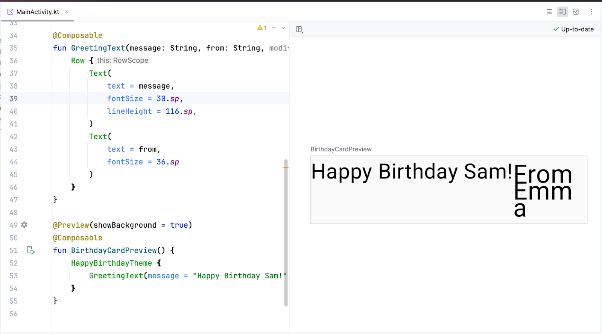

重複がなくなり、プレビューが見やすくなります。しかし、署名のための十分なスペースがないため、これは望ましくありません。次のタスクでは、テキスト要素を列に配置して、この問題を解決します。

#### テキスト要素を列で配置する

このタスクでは、`GreetingText()` 関数を変更して、テキスト要素を列で配置します。プレビューは次のスクリーンショットのようになります。

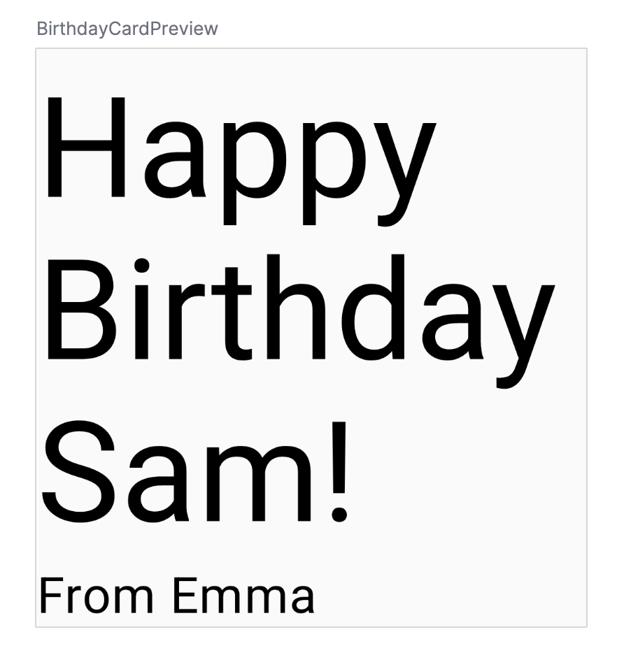

各自で演習を行ったので、以下のスニペット内の解答コードとご自身のコードを確認してみてください。

```kotlin
@Composable
fun GreetingText(message: String, from: String, modifier: Modifier = Modifier) {
    Column {
        Text(
            text = message,
            fontSize = 100.sp,
            lineHeight = 116.sp,
        )
        Text(
            text = from,
            fontSize = 36.sp
        )
    }
}
```

Android Studio によって自動的にインポートされたパッケージに注意してください。

```kotlin
import androidx.compose.foundation.layout.Column
```

コンポーザブルの子要素に修飾子パラメータを渡す必要があることを思い出してください。つまり、`Column` コンポーザブルに修飾子パラメータを渡す必要があります。

```kotlin
@Composable
fun GreetingText(message: String, from: String, modifier: Modifier = Modifier) {
    Column(modifier = modifier) {
        Text(
            text = message,
            fontSize = 100.sp,
            lineHeight = 116.sp,
        )
        Text(
            text = from,
            fontSize = 36.sp
        )
    }
}
```

### 9. アプリに挨拶メッセージを追加する

プレビューを確認したら、デバイスまたはエミュレータのアプリにコンポーザブルを追加します。

1. `MainActivity.kt` ファイルで、`onCreate()` 関数までスクロールします。
2. `Surface` ブロックから `GreetingText()` 関数を呼び出します。
3. `GreetingText()` 関数（誕生日祝いのメッセージと署名）を渡します。

完成した `onCreate()` 関数は次のコード スニペットのようになります。

```kotlin
class MainActivity : ComponentActivity() {
    override fun onCreate(savedInstanceState: Bundle?) {
        super.onCreate(savedInstanceState)
        setContent {
            HappyBirthdayTheme {
                // A surface container using the 'background' color from the theme
                Surface(
                    modifier = Modifier.fillMaxSize(),
                    color = MaterialTheme.colorScheme.background
                ) {
                    GreetingText(message = "Happy Birthday Sam!", from = "From Emma")
                }
            }
        }
    }
}
```

4. エミュレータでアプリをビルドして実行します。

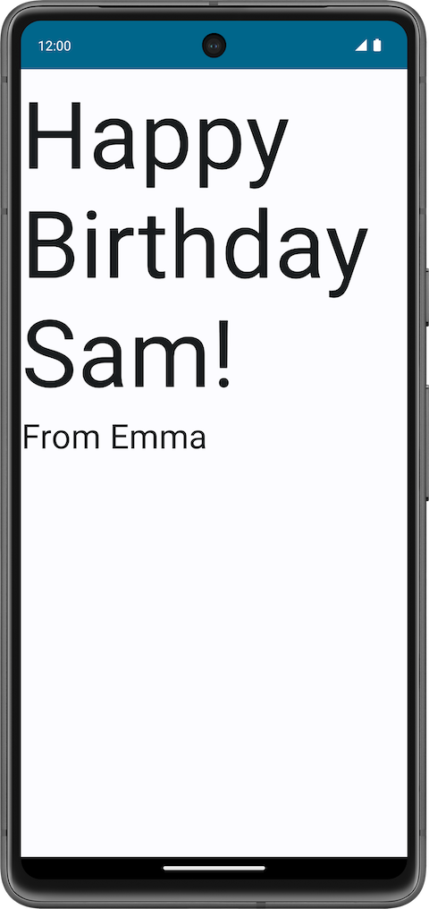

#### 挨拶メッセージを中央に配置する

1. 挨拶メッセージを画面の中央に揃えるには、`verticalArrangement` というパラメータを追加し、`Arrangement.Center` に設定します。`verticalArrangement` については、後のレッスンで詳しく説明します。

```kotlin
@Composable
fun GreetingText(message: String, from: String, modifier: Modifier = Modifier) {
    Column(
        verticalArrangement = Arrangement.Center,
        modifier = modifier
    ) {
        // ...
    }
}
```

2. 列の周囲にパディング `8.dp` を追加します。パディング値は `4.dp` 単位で使用することをおすすめします。

```kotlin
@Composable
fun GreetingText(message: String, from: String, modifier: Modifier = Modifier) {
    Column(
        verticalArrangement = Arrangement.Center,
        modifier = modifier.padding(8.dp)
    ) {
        // ...
    }
}
```

3. アプリの外観をさらに改善するには、`textAlign` を使用して、挨拶メッセージを中央に配置します。

```kotlin
Text(
    text = message,
    fontSize = 100.sp,
    lineHeight = 116.sp,
    textAlign = TextAlign.Center
)
```

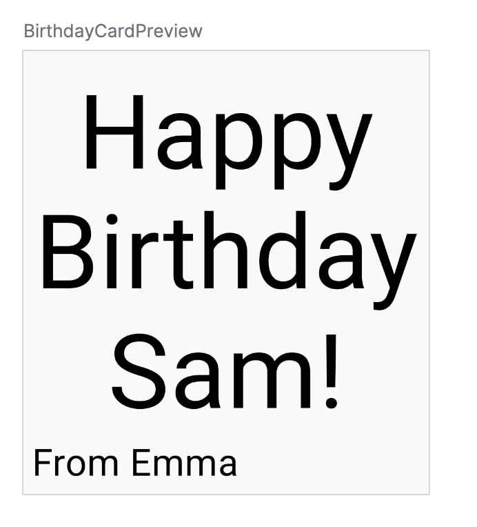

上のスクリーンショットでは、`textAlign` パラメータを指定しているため、挨拶メッセージのみが中央に配置されます。「**From Emma**」の署名はデフォルトの左揃えで配置されます。

4. 署名にパディングを追加して右揃えにします。

```kotlin
Text(
    text = from,
    fontSize = 36.sp,
    modifier = Modifier
        .padding(16.dp)
        .align(alignment = Alignment.End)
)
```

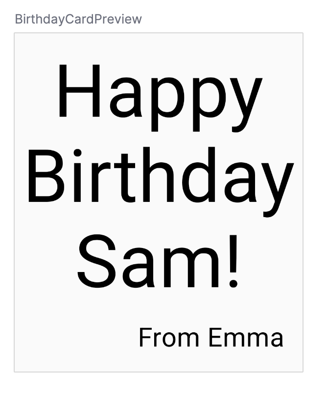

#### おすすめの方法を実践する

修飾子属性と親コンポーザブルの修飾子を渡すことをおすすめします。`GreetingText()` の修飾子パラメータを次のように更新します。

**onCreate()**

```kotlin
Surface(
    //...
) {
    GreetingText(
        message = "Happy Birthday Sam!",
        from = "From Emma",
        modifier = Modifier.padding(8.dp)
    )
}
```

**GreetingText()**

```kotlin
@Composable
fun GreetingText(message: String, from: String, modifier: Modifier = Modifier) {
    Column(
        verticalArrangement = Arrangement.Center,
        modifier = modifier
    ) {
        // ...
    }
}
```

エミュレータでアプリをビルドして実行し、最終結果を確認します。


### 10. 解答コードを取得する

完成した `MainActivity.kt`:

```kotlin
package com.example.happybirthday

import android.os.Bundle
import androidx.activity.ComponentActivity
import androidx.activity.compose.setContent
import androidx.compose.foundation.layout.Arrangement
import androidx.compose.foundation.layout.Column
import androidx.compose.foundation.layout.fillMaxSize
import androidx.compose.foundation.layout.padding
import androidx.compose.material3.MaterialTheme
import androidx.compose.material3.Surface
import androidx.compose.material3.Text
import androidx.compose.runtime.Composable
import androidx.compose.ui.Alignment
import androidx.compose.ui.Modifier
import androidx.compose.ui.text.style.TextAlign
import androidx.compose.ui.tooling.preview.Preview
import androidx.compose.ui.unit.dp
import androidx.compose.ui.unit.sp
import com.example.happybirthday.ui.theme.HappyBirthdayTheme

class MainActivity : ComponentActivity() {
    override fun onCreate(savedInstanceState: Bundle?) {
        super.onCreate(savedInstanceState)
        setContent {
            HappyBirthdayTheme {
                // A surface container using the 'background' color from the theme
                Surface(
                    modifier = Modifier.fillMaxSize(),
                    color = MaterialTheme.colorScheme.background
                ) {
                    GreetingText(
                        message = "Happy Birthday Sam!",
                        from = "From Emma",
                        modifier = Modifier.padding(8.dp)
                    )
                }
            }
        }
    }
}

@Composable
fun GreetingText(message: String, from: String, modifier: Modifier = Modifier) {
    Column(
        verticalArrangement = Arrangement.Center,
        modifier = modifier
    ) {
        Text(
            text = message,
            fontSize = 100.sp,
            lineHeight = 116.sp,
            textAlign = TextAlign.Center
        )
        Text(
            text = from,
            fontSize = 36.sp,
            modifier = Modifier
                .padding(16.dp)
                .align(alignment = Alignment.End)
        )
    }
}

@Preview(showBackground = true)
@Composable
fun BirthdayCardPreview() {
    HappyBirthdayTheme {
        GreetingText(message = "Happy Birthday Sam!", from = "From Emma")
    }
}
```

### 11. まとめ

Happy Birthday アプリを作成しました。

次のレッスンでは、アプリに画像を追加し、テキスト要素の配置を変更してアプリの見た目を整えます。

#### 概要

- Jetpack Compose は、Android UI を構築するための最新のツールキットです。Jetpack Compose は、簡潔なコード、パワフルなツール、直感的な Kotlin API により、Android での UI 開発を簡素化し、加速します。
- アプリのユーザー インターフェース（UI）は、画面上に表示されるテキスト、画像、ボタン、その他のさまざまな種類の要素です。
- コンポーズ可能な関数は、Compose の基本的なビルディング ブロックです。コンポーズ可能な関数とは、UI の一部を記述する関数のことです。
- コンポーズ可能な関数には、`@Composable` アノテーションが付けられます。このアノテーションは、この関数がデータを UI に変換するためのものであることを Compose コンパイラに伝えます。
- Compose には基本的となる標準レイアウト要素として、`Column`、`Row,`、`Box` の 3 つのコンポーザブルがあります。これらのコンポーザブルは、コンポーズ可能なコンテンツを受け取るコンポーズ可能な関数であり、内部にアイテムを配置できます。たとえば、`Row` 内のそれぞれの子が横に並べて配置されます。

#### 詳細

- [コンポーズ可能](https://developer.android.com/reference/kotlin/androidx/compose/runtime/Composable)
- [Compose レイアウトの基本](https://developer.android.com/jetpack/compose/layouts/basics)
- [ピクセル解像度](https://m3.material.io/foundations/layout/understanding-layout/spacing#28f7a086-b6f7-4120-b18f-02a5fa5adbb5)
- [Compose のテキスト](https://developer.android.com/jetpack/compose/text)
- [Jetpack Compose で Kotlin を使用する](https://developer.android.com/jetpack/compose/kotlin)

## 4. Android アプリに画像を追加する


### 1. 始める前に

このレッスンでは、`Image` コンポーザブルを使用してアプリに画像を追加する方法を学びます。

#### 前提条件

- Android Studio でアプリを作成して実行する方法についての基本的な知識
- テキスト コンポーザブルなどの UI 要素を追加する方法についての基本的な知識

#### 学習内容

- Android アプリに画像や写真を追加する方法
- `Image` コンポーザブルを使用してアプリに画像を表示する方法
- `String` リソースを使用する際のおすすめの方法

#### 作成するアプリの概要

- **Happy Birthday** アプリを拡張して、画像を追加します。

#### 必要なもの

- Android Studio がインストールされているパソコン
- テキスト コンポーザブルを使用してシンプルなアプリを作成するレッスンで作成したアプリ

### 2. アプリをセットアップする

#### アプリを設定する

Android Studio で、前のレッスンで作成した Happy Birthday プロジェクトを開きます。

アプリを実行すると、次のスクリーンショットのようになります。

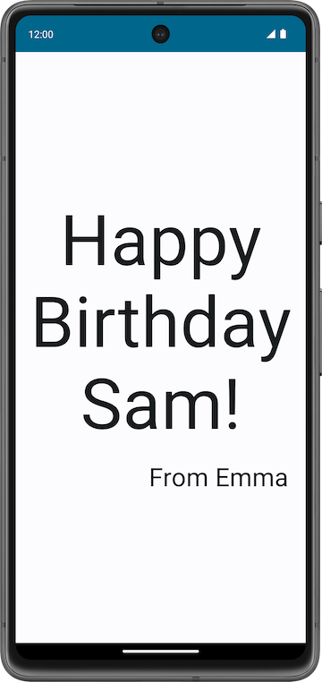

#### プロジェクトに画像を追加する

このタスクでは、インターネットから画像をダウンロードし、**Happy Birthday** アプリに追加します。

1. こちらの[リンク](https://github.com/google-developer-training/basic-android-kotlin-compose-birthday-card-app/blob/main/app/src/main/res/drawable-nodpi/androidparty.png)から誕生日カードアプリの画像を開きます。
2. [**ダウンロード**] をクリックします。

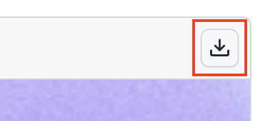

3. 画像を右クリックし、パソコンに `androidparty.png` というファイル名で保存します。
4. 画像の保存先をメモしておきます。

以下の例では、[**ダウンロード**] フォルダに保存したものとして説明します。

5. Android Studio のメニューで、**[View] > [Tool Windows] > [Resource Manager]** をクリックするか、[**Project**] ウィンドウの横にある [**Resource Manager**] タブをクリックします。

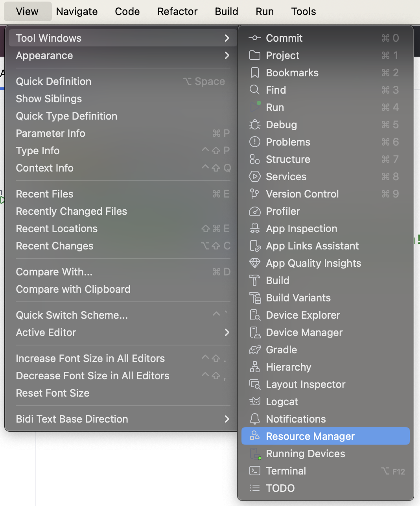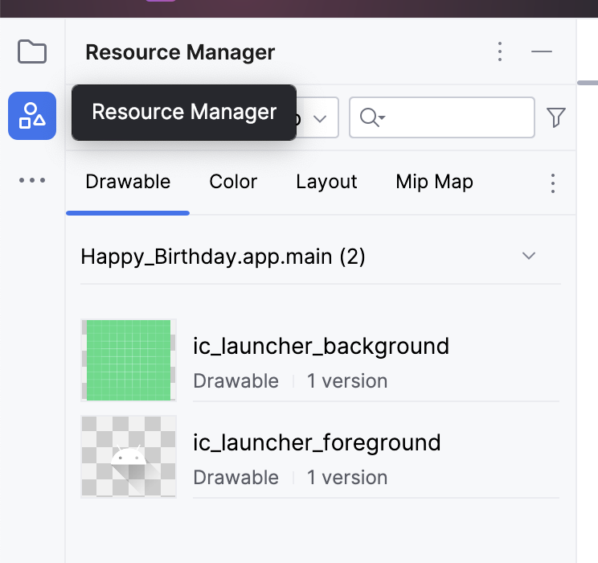

> **注**: Resource Manager は、アプリへのリソースのインポートや、アプリ内でのリソースの作成、管理、使用のためのツール ウィンドウです。

6. **[+]（モジュールにリソースを追加）> [Import Drawables]** をクリックします。

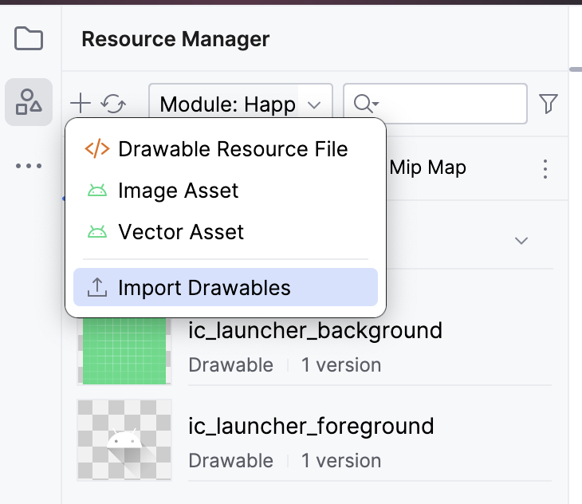

7. ファイル ブラウザで、ダウンロードした画像ファイルを選択して [**Open**] をクリックします。

この操作により、[**Import drawables**] ダイアログが開きます。

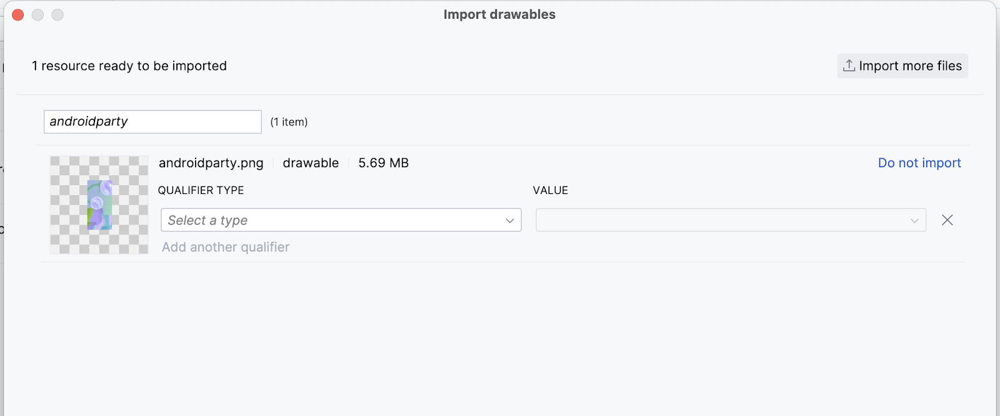

8. Android Studio に画像のプレビューが表示されます。[**QUALIFIER TYPE**] プルダウン リストから [**Density**] を選択します。この操作を行う理由については、後のセクションで説明します。

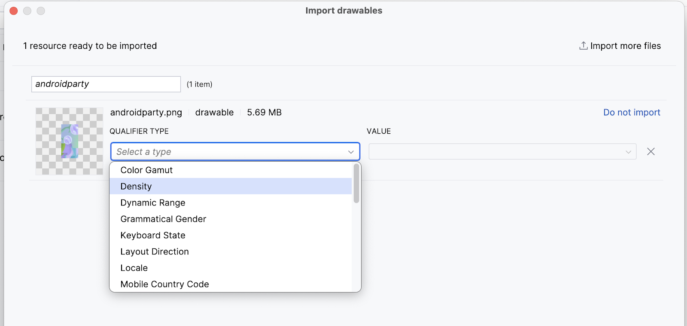

9. [**VALUE**] リストから [**No Density**] を選択します。

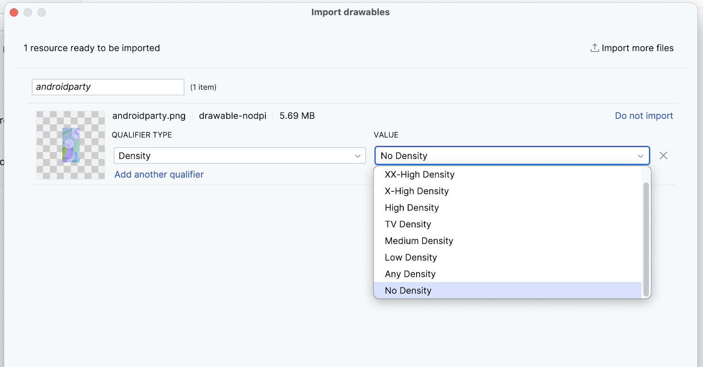

Android デバイスは、画面サイズ（スマートフォン、タブレット、TV など）だけでなく、画面のピクセルサイズもさまざまです。1 平方インチあたり 160 ピクセルのデバイスもあれば、480 ピクセルのデバイスもあります。ピクセル密度の違いを考慮しないと、画像が拡大されてぼやける、メモリを大量に消費する大きな画像になる、あるいは不適切にサイズ変更された画像になることがあります。

Android システムが処理できるよりも大きな画像のサイズを変更しようとすると、メモリ不足エラーがスローされます。写真であったり、現在の画像 `androidparty.png` のような背景画像であったりする場合は、`drawable-nodpi` フォルダに置く必要があります。ここに置くとサイズ変更が行われなくなります。

ピクセル密度について詳しくは、[各種のピクセル密度をサポートする](https://developer.android.com/training/multiscreen/screendensities)をご覧ください。

10. [**次へ**] をクリックします。
11. Android Studio に、画像が配置されるフォルダ構造が表示されます。先ほど説明した `drawable-nodpi` フォルダがあるはずです。
12. [**Import(C)**] をクリックします。

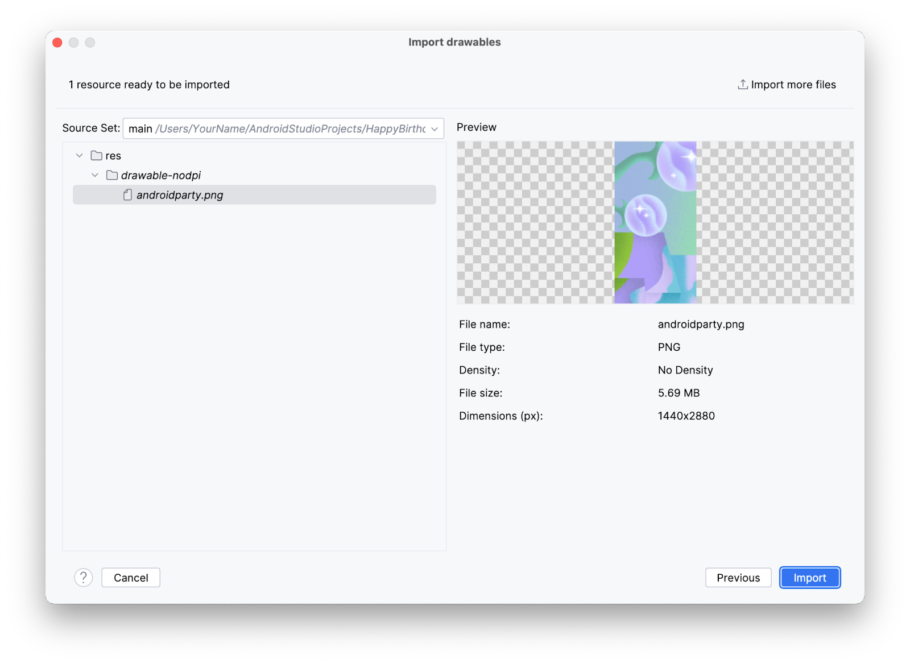

Android Studio によって `drawable-nodpi` フォルダが作成され、そこに画像が配置されます。Android Studio のプロジェクト ビューに、`androidparty.png (nodpi)` というリソース名で表示されます。Android Studio によって、パソコンのファイル システムに `drawable-nodpi` というフォルダが作成されます。

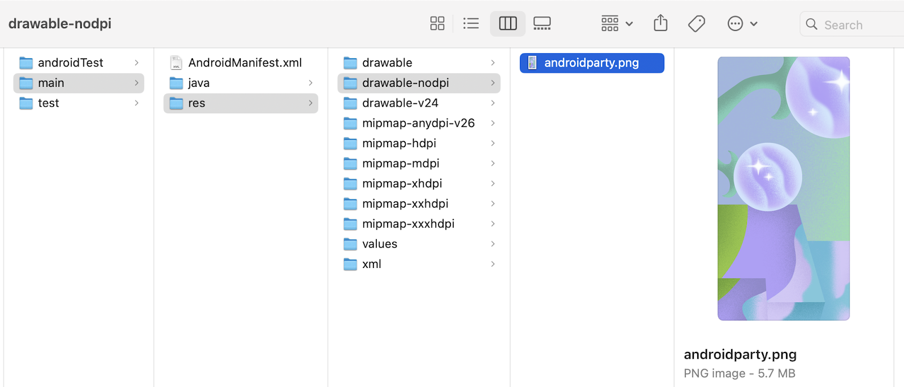

画像が正常に読み込まれると、Android Studio によって画像が [**Drawable**] タブのリストに追加されます。このリストには、アプリのすべての画像とアイコンが入っています。これで、この画像をアプリで使用できるようになりました。

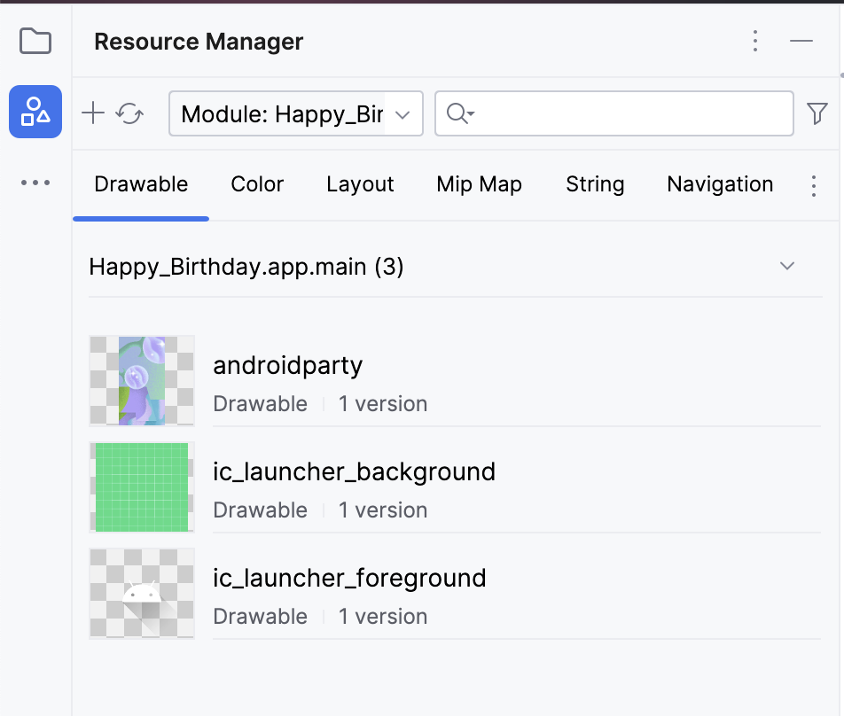

13. **[View] > [Tool Windows] > [Project]** をクリックするか、左端の [**Project**] タブをクリックして、プロジェクト ビューに戻ります。
14. **[app] > [res] > [drawable]** をクリックして、画像が `drawable` フォルダにあることを確認します。

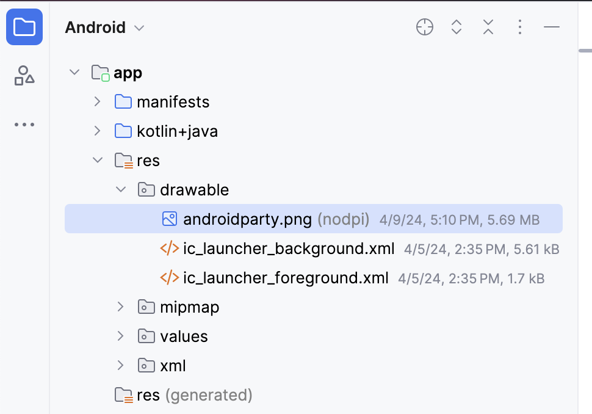

### 3. Image コンポーザブルを追加する

アプリに画像を表示するには、画像を表示する場所が必要です。`Text` コンポーザブルを使用してテキストを表示する場合と同じようにして、`Image` コンポーザブルを使用して画像を表示できます。

このタスクでは、`Image` コンポーザブルをアプリに追加し、ダウンロードした画像をアプリの画像に設定して、その画像のサイズと位置を画面内に収まるように調整します。

#### 画像を追加するためにコンポーズ可能な関数を追加する

1. `MainActivity.kt` ファイルで、`GreetingText()` 関数の後にコンポーズ可能な関数 `GreetingImage()` を追加します。
2. `GreetingImage()` 関数に 2 つの `String` パラメータを渡します。一つは誕生日祝いのメッセージの `message`、もう一つは署名の `from` です。

```kotlin
@Composable
fun GreetingImage(message: String, from: String) {
}
```

3. すべてのコンポーズ可能な関数は、オプションの `Modifier` パラメータを受け入れる必要があります。修飾子は、UI 要素に対して親レイアウト内での配置、表示、動作を指示します。`GreetingImage()` コンポーザブルで別のパラメータを追加します。

```kotlin
@Composable
fun GreetingImage(message: String, from: String, modifier: Modifier = Modifier) {
}
```

#### Jetpack Compose のリソース

リソースとは、コードが使用する追加のファイルと静的コンテンツであり、ビットマップ、ユーザー インターフェース文字列、アニメーション命令などがあります。Android のリソースについて詳しくは、[アプリリソースの概要](https://developer.android.com/guide/topics/resources/providing-resources)をご覧ください。

画像や文字列などのアプリリソースは必ずコードとは別にする必要があります。それにより、コードとは独立して管理できるようになります。実行時に、Android は現在の設定に基づいて適切なリソースを使用します。たとえば、画面サイズごとに異なる UI レイアウトや言語設定ごとに異なる文字列を指定できます。

##### リソースのグループ化

リソースは種類ごとにプロジェクトの `res/` ディレクトリの対応するサブディレクトリに保存する必要があります。たとえば、単純なプロジェクトのファイル階層の例を次に示します。

```kotlin
MyProject/
    src/
        MyActivity.kt
    res/
        drawable/
            graphic.png
        mipmap/
            icon.png
        values/
            strings.xml
```

この例では、`res/` ディレクトリのサブディレクトリにすべてのリソースが保存されていて、画像リソースは `drawable/` ディレクトリ、ランチャー アイコンは `mipmap/` ディレクトリ、文字列リソースは `values/` ディレクトリに入ります。アプリリソースの使用方法、形式、構文の詳細については、[リソースタイプの概要](https://developer.android.com/guide/topics/resources/available-resources)をご覧ください。

##### リソースへのアクセス

Jetpack Compose は、Android プロジェクトで定義されたリソースにアクセスできます。リソースにアクセスするには、プロジェクトの `R` クラスで生成されたリソース ID を使用します。

`R` クラスは、Android によって自動生成されたクラスであり、プロジェクト内のすべてのリソースの ID を含むクラスです。ほとんどの場合、リソース ID はファイル名と同じになります。たとえば、前のファイル階層の画像にアクセスするには、次のコードを使用します。

```kotlin
R.drawable.graphic
```

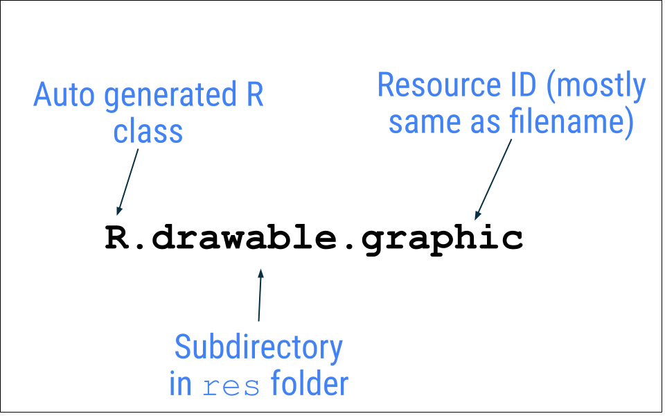

次のタスクでは、前のタスクに追加した画像ファイル **`androidparty.png`** を使用します。

1. `GreetingImage()` 関数の中で、`image` という名前の `val` プロパティを宣言します。
2. `androidparty` リソースを渡して [`painterResource()`](https://developer.android.com/reference/kotlin/androidx/compose/ui/res/painterResource.composable#painterResource(kotlin.Int)) 関数を呼び出します。その戻り値を `image` 変数に代入します。

```kotlin
val image = painterResource(R.drawable.androidparty)
```

アプリをコンパイルするには関数をインポートする必要があるため、Android Studio は `painterResource` コードをハイライト表示します。

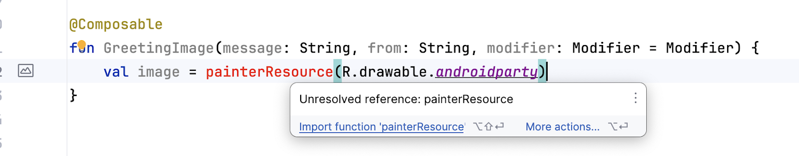

3. Android Studio でハイライト表示されている `.painterResource` をクリックします。
4. ポップアップで [**Import**] をクリックし、`androidx.compose.ui.res.painterResource` のインポートを追加します。

[`painterResource()`](https://developer.android.com/reference/kotlin/androidx/compose/ui/res/painterResource.composable#painterResource(kotlin.Int)) 関数は、ドローアブル画像リソースを読み込みます。引数としてリソース ID（この場合は `R.drawable.androidparty`）を取ります。

3. [`painterResource()`](https://developer.android.com/reference/kotlin/androidx/compose/ui/res/painterResource.composable#painterResource(kotlin.Int)) 関数の呼び出しの後に、`Image` コンポーザブルを追加し、`painter` という名前付きの引数として `image` を渡します。

```kotlin
Image(
    painter = image
)
```

アプリをコンパイルするには関数をインポートする必要があるため、Android Studio は `Image` コードをハイライト表示します。

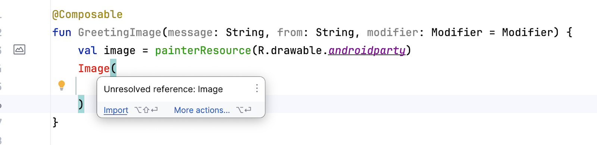

この警告を解決するには、`MainActivity.kt` ファイルの先頭に次のインポートを追加します。

```kotlin
import androidx.compose.foundation.Image
```

最初の警告は解決されましたが、Android Studio で単語 `Image` にカーソルを合わせると、[None of the following functions can be called with the arguments supplied] という新しい警告が表示されます。これは、提供された引数が `Image` 関数シグネチャのいずれとも一致しないためです。

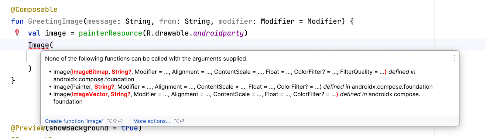

この警告は次のセクションで解決します。

#### アプリのユーザー補助対応を確認する

ユーザー補助を意識したコーディング習慣に従うことで、[障がい](https://developer.android.com/guide/topics/ui/accessibility)を持つユーザーを含めた、すべてのユーザーがアプリ内の移動やアプリの操作を簡単に行えるようになります。

> **注:** Android ではユーザー向けにさまざまなツールが用意されています。たとえば、[TalkBack](https://support.google.com/accessibility/android/answer/6283677) は Android デバイスに組み込まれている Google 製のスクリーン リーダーです。TalkBack により、画面を見ずにデバイスを使用できるよう音声フィードバックが提供されます。ユーザー補助機能について詳しくは、[ユーザーが利用しやすいアプリを作成する](https://developer.android.com/guide/topics/ui/accessibility/)をご覧ください。

Android Studio により、アプリのユーザー補助機能を強化するためのヒントと警告が提供されます。コンテンツの説明を使って UI 要素の目的を定義することで、TalkBack でアプリを利用しやすくなります。

しかし、このアプリの画像は装飾目的のみで使用されています。この場合は、画像にコンテンツの説明を追加すると TalkBack で利用しにくくなります。読み上げられるコンテンツの説明を設定するのではなく、画像の `contentDescription` 引数を `null` に設定すれば、TalkBack が `Image` コンポーザブルをスキップするようにできます。

- `Image` コンポーザブルに、`contentDescription` という名前付き引数を追加し、その値は `null` に設定します。

```kotlin
Image(
    painter = image,
    contentDescription = null
)
```

#### `Image` コンポーザブルをプレビューする

このタスクでは、画像コンポーザブルをプレビューし、アプリをエミュレータまたはデバイスで実行します。

1. `BirthdayCardPreview()` 関数内の `GreetingText()` 関数の呼び出しを `GreetingImage()` 関数の呼び出しに置き換えます。

関数は次のコード スニペットのようになります。

```kotlin
@Preview(showBackground = true)
@Composable
fun BirthdayCardPreview() {
    HappyBirthdayTheme {
        GreetingImage(
            message = "Happy Birthday Sam!",
            from = "From Emma"
        )
    }
}
```

2. [**Design**] ペインは自動更新されます。更新されない場合は、[] をクリックしてビルドします。

すると、テキストが表示されなくなります。これは、新しい関数には `Image` コンポーザブルがあるだけで、`Text` コンポーザブルがなくなっているためです。

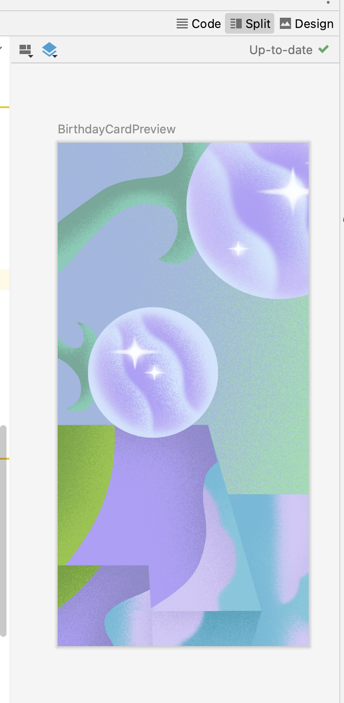

### 4. Box レイアウトを追加する

Compose には、基本的な標準レイアウト要素として、[`Column`](https://developer.android.com/reference/kotlin/androidx/compose/foundation/layout/Column.composable#Column(androidx.compose.ui.Modifier,androidx.compose.foundation.layout.Arrangement.Vertical,androidx.compose.ui.Alignment.Horizontal,kotlin.Function1))、[`Row`](https://developer.android.com/reference/kotlin/androidx/compose/foundation/layout/Row.composable#Row(androidx.compose.ui.Modifier,androidx.compose.foundation.layout.Arrangement.Horizontal,androidx.compose.ui.Alignment.Vertical,kotlin.Function1))、[`Box`](https://developer.android.com/reference/kotlin/androidx/compose/foundation/layout/Box.composable#Box(androidx.compose.ui.Modifier,androidx.compose.ui.Alignment,kotlin.Boolean,kotlin.Function1)) の 3 つのコンポーザブルがあります。[`Column`](https://developer.android.com/reference/kotlin/androidx/compose/foundation/layout/Column.composable#Column(androidx.compose.ui.Modifier,androidx.compose.foundation.layout.Arrangement.Vertical,androidx.compose.ui.Alignment.Horizontal,kotlin.Function1)) コンポーザブルと [`Row`](https://developer.android.com/reference/kotlin/androidx/compose/foundation/layout/Row.composable#Row(androidx.compose.ui.Modifier,androidx.compose.foundation.layout.Arrangement.Horizontal,androidx.compose.ui.Alignment.Vertical,kotlin.Function1)) コンポーザブルについては前のレッスンで学習したので、ここでは `Box` コンポーザブルについて詳しく学びます。

[`Box`](https://developer.android.com/reference/kotlin/androidx/compose/foundation/layout/Box.composable#Box(androidx.compose.ui.Modifier,androidx.compose.ui.Alignment,kotlin.Boolean,kotlin.Function1)) レイアウトは、Compose の標準レイアウト要素の一つです。`Box` レイアウトは、要素を別の要素の上に重ねるときに使用します。また、`Box` レイアウトを使用すると、それに含まれる要素の配置も設定することもできます。

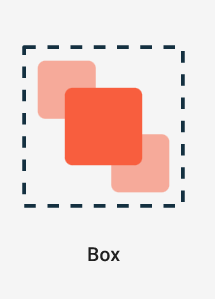

1. 次のように、`GreetingImage()` 関数内の `Image` コンポーザブルを `Box` コンポーザブルで囲みます。

```kotlin
@Composable
fun GreetingImage(message: String, from: String, modifier: Modifier = Modifier) {
    val image = painterResource(R.drawable.androidparty)
    Box {
        Image(
            painter = image,
            contentDescription = null
        )
    }
}
```

2. Android Studio にプロンプトが表示されたら、`androidx.compose.foundation.layout.Box` 関数をインポートします。
3. `modifier` パラメータを `Box` コンポーザブルに渡すコードを追加します。

```kotlin
@Composable
fun GreetingImage(message: String, from: String, modifier: Modifier = Modifier) {
    val image = painterResource(R.drawable.androidparty)
    Box(modifier) {
        Image(
            painter = image,
            contentDescription = null
        )
    }
}
```

4. 次のように、`Box` コンポーザブルの最後で `GreetingText()` 関数を呼び出し、誕生日メッセージと署名および修飾子を渡します。

```kotlin
@Composable
fun GreetingImage(message: String, from: String, modifier: Modifier = Modifier) {
    val image = painterResource(R.drawable.androidparty)
    Box(modifier) {
        Image(
            painter = image,
            contentDescription = null
        )
        GreetingText(
            message = message,
            from = from,
            modifier = Modifier
                .fillMaxSize()
                .padding(8.dp)
        )
    }
}
```

5. [**Design**] ペインでプレビューが更新されます。

すると、テキストと画像が表示されます。

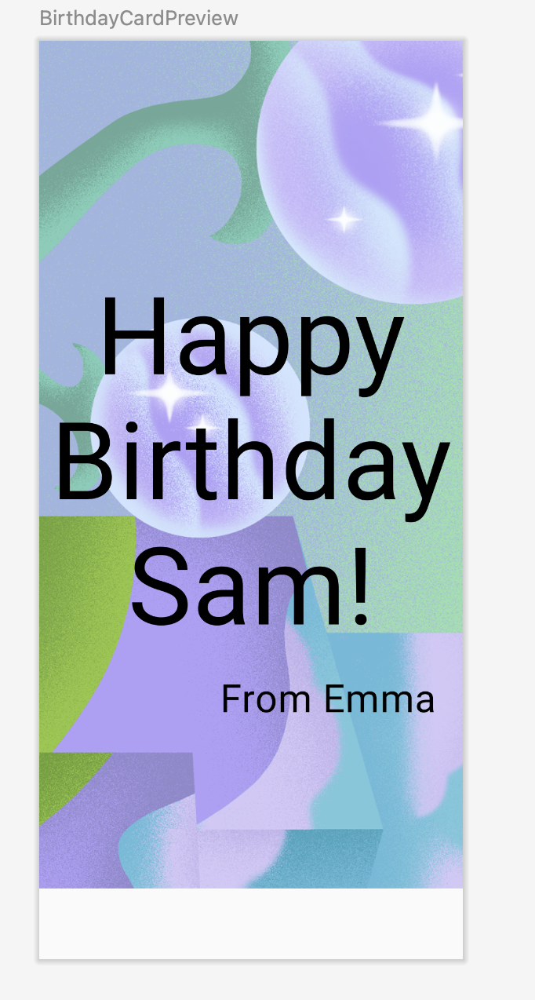

6. この変更をエミュレータまたはデバイスに反映させるために、`onCreate()` 関数内の `GreetingText()` 関数の呼び出しを `GreetingImage()` 関数の呼び出しに置き換えます。

その結果、`setContent` ブロックは次のコード スニペットのようになります。

```kotlin
setContent {
    HappyBirthdayTheme {
        // A surface container using the 'background' color from the theme
        Surface(
            modifier = Modifier.fillMaxSize(),
            color = MaterialTheme.colorScheme.background
        ) {
            GreetingImage(
                message = "Happy Birthday Sam!",
                from = "From Emma"
            )
        }
    }
}
```

画像は、画面と同じ幅になっていますが、画面の上側に寄せられています。画面の下側に空白があるので、あまり見栄えが良くありません。次のタスクでは、画面の上下左右に空白を作らないように、画像のサイズを画面全体のサイズに合わせます。

### 5. 不透明度を変更し、画像を拡大縮小する

このタスクでは、アプリの見栄えを良くするために画像が全画面に表示されるようにします。そのために、`ContentScale` パラメータを使用します。

#### コンテンツのサイズを調整する

アプリに画像を追加して、画像の位置設定を行いました。次は、画像のスケーリングの種類（画像のサイズの調整方法）を設定して、画像が全画面に表示されるようにします。

[`ContentScale`](https://developer.android.com/reference/kotlin/androidx/compose/ui/layout/ContentScale) には多数の[種類](https://developer.android.com/jetpack/compose/graphics/images/customize#content-scale)が用意されています。ここでは `ContentScale.Crop` パラメータを使用し、画像の幅と高さが、それぞれ画面の幅と高さと等しいかそれ以上になるように、アスペクト比を維持しながら均等に画像を拡大します。

1. Image に `ContentScale` の名前付き引数を追加します。

```kotlin
Image(
    painter = image,
    contentDescription = null,
    contentScale = ContentScale.Crop
)
```

2. Android Studio にプロンプトが表示されたら、`androidx.compose.ui.layout.ContentScale` インターフェースをインポートします。
3. [**Design**] ペインを確認します。

すると、次のスクリーンショットのように、画像がプレビュー画面全体に表示されます。

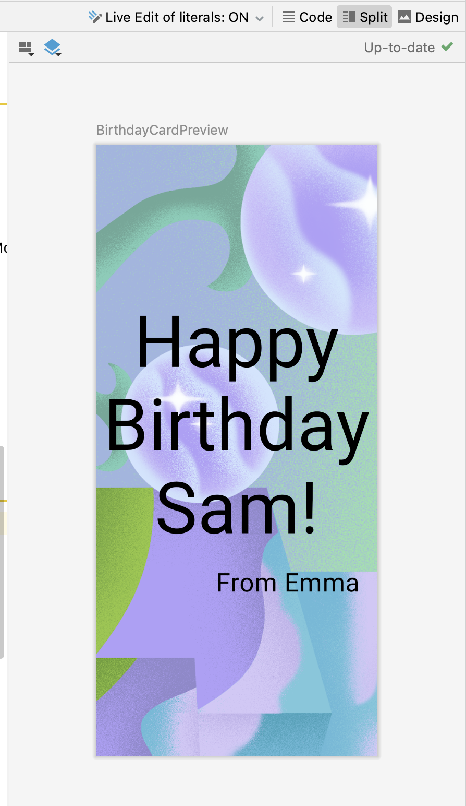

#### 不透明度の変更

アプリのコントラストを向上させるには、背景画像の不透明度を変更します。

`alpha` パラメータを `Image` コンポーザブルに追加し、`0.5F` に設定します。

```kotlin
Image(
    painter = image,
    contentDescription = null,
    contentScale = ContentScale.Crop,
    alpha = 0.5F
)
```

画像の不透明度が変更されます。

| 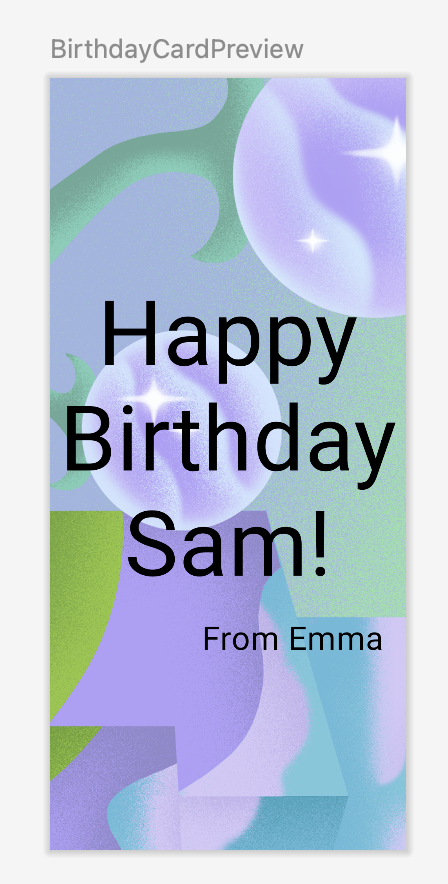 | 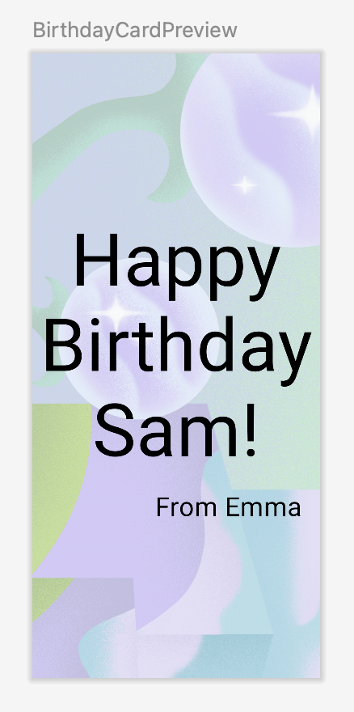 |
|---|---|

大量のコードになりましたが、その結果をプレビューしましょう。

#### アプリを実行する

デバイスまたはエミュレータでアプリを実行します。

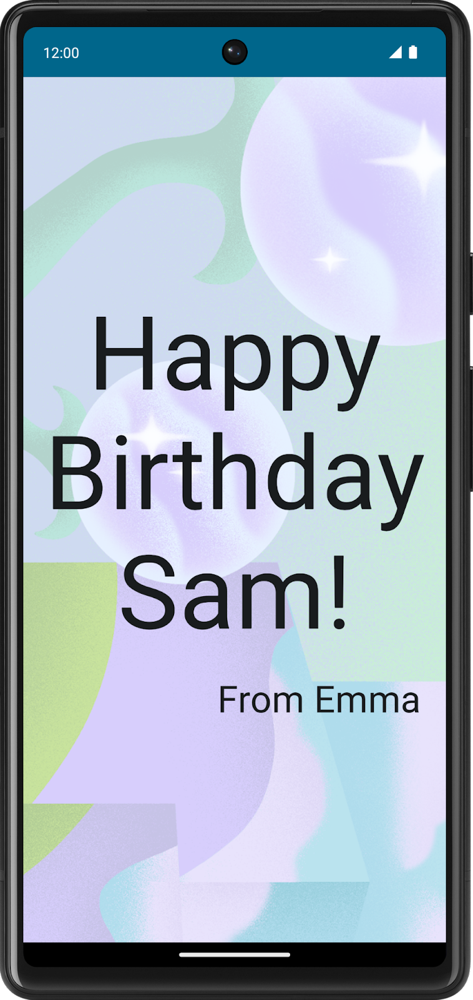

全画面の画像とテキスト メッセージが表示されるようにできました。また、画像の不透明度も変更しました。

#### レイアウト修飾子

修飾子は、Jetpack Compose UI 要素の装飾や、その動作の追加に使用されます。たとえば、行やテキスト、ボタンに、背景やパディング、動作を追加できます。このような設定をするには、コンポーザブルまたはレイアウトが修飾子をパラメータとして受け取る必要があります。

前回のレッスンで修飾子について説明した際には、パディング修飾子（`Modifier.padding`）を使用して、`Text` コンポーザブルの周囲に空白を追加しました。修飾子には多くの機能がありますが、それらは今回と以降で説明します。

たとえば、次の `Text` コンポーザブルには背景を緑色にする `Modifier` 引数があります。

```kotlin
// Example
Text(
    text = "Hello, World!",
    // Solid element background color
    modifier = Modifier.background(color = Color.Green)
)
```

上記の例と同様に、引数と引数修飾子をレイアウトに追加することで、Arrangement プロパティと Alignment プロパティを使用して子要素を配置できます。

[`Row`](https://developer.android.com/reference/kotlin/androidx/compose/foundation/layout/Row.composable#Row(androidx.compose.ui.Modifier,androidx.compose.foundation.layout.Arrangement.Horizontal,androidx.compose.ui.Alignment.Vertical,kotlin.Function1)) 内の子の位置を設定するには、`horizontalArrangement` 引数と `verticalAlignment` 引数を設定します。[`Column`](https://developer.android.com/reference/kotlin/androidx/compose/foundation/layout/Column.composable#Column(androidx.compose.ui.Modifier,androidx.compose.foundation.layout.Arrangement.Vertical,androidx.compose.ui.Alignment.Horizontal,kotlin.Function1)) の場合は、`verticalArrangement` 引数と `horizontalAlignment` 引数を設定します。

Arrangement プロパティは、レイアウトのサイズが子の合計よりも大きい場合に、子要素を配置するために使用されます。

たとえば、[`Column`](https://developer.android.com/reference/kotlin/androidx/compose/foundation/layout/Column.composable#Column(androidx.compose.ui.Modifier,androidx.compose.foundation.layout.Arrangement.Vertical,androidx.compose.ui.Alignment.Horizontal,kotlin.Function1)) のサイズが子のサイズの合計よりも大きい場合、[`verticalArrangement`](https://developer.android.com/reference/kotlin/androidx/compose/foundation/layout/Column.composable#Column(androidx.compose.ui.Modifier,androidx.compose.foundation.layout.Arrangement.Vertical,androidx.compose.ui.Alignment.Horizontal,kotlin.Function1)) を指定して `Column` 内の子の位置を定義できます。以下に、さまざまな垂直配置の図を示します。


同様に、[`Row`](https://developer.android.com/reference/kotlin/androidx/compose/foundation/layout/Row.composable#Row(androidx.compose.ui.Modifier,androidx.compose.foundation.layout.Arrangement.Horizontal,androidx.compose.ui.Alignment.Vertical,kotlin.Function1)) のサイズが子のサイズの合計よりも大きい場合は、`horizontalArrangement` を指定して `Row` 内の子の位置を定義できます。以下に、さまざまな水平配置の図を示します。

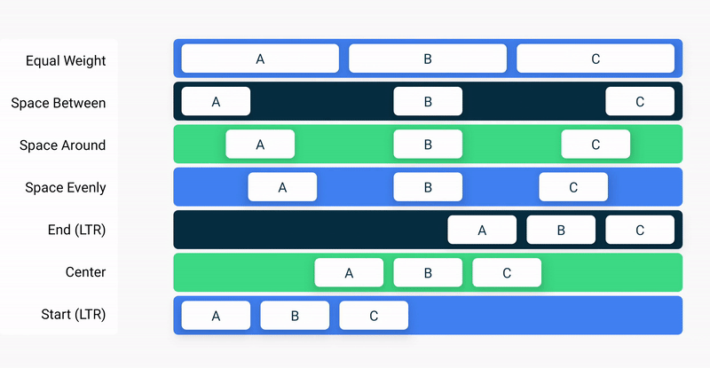

Alignment プロパティは、子要素をレイアウトの先頭、中央、末端に配置するために使用されます。

### 6. テキストの配置を調整する

このタスクでは、前のレッスンでアプリにテキストを配置するために追加したコードを確認します。

1. `MainActivity.kt` ファイルで、`GreetingText()` 関数までスクロールします。この列の `verticalArrangement` プロパティは `Arrangement.Center` に設定されています。テキスト コンテンツは画面の中央に配置されます。

```kotlin
@Composable
fun GreetingText(message: String, from: String, modifier: Modifier = Modifier) {
    Column(
        verticalArrangement = Arrangement.Center,
        modifier = modifier
    ) {
        Text(
            text = message,
            fontSize = 100.sp,
            lineHeight = 116.sp,
            textAlign = TextAlign.Center
        )
        Text(
            text = from,
            fontSize = 36.sp,
            modifier = Modifier
                .padding(16.dp)
                .align(alignment = Alignment.End)
        )
    }
}
```

#### パディング

UI 要素はコンテンツを囲んでいます。余白が狭すぎないようにするために、上下左右のパディングの量を指定できます。

| 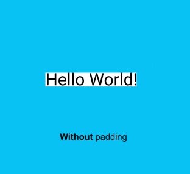 |  |
|---|---|

パディングは修飾子として使用されるので、任意のコンポーザブルに適用できます。`padding` 修飾子は、コンポーザブルの上下左右のそれぞれに対してパディングの量を定義するオプションの引数を取ります。

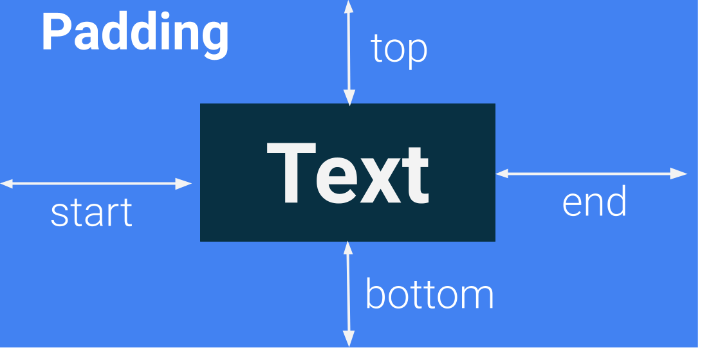

```kotlin
// This is an example.
Modifier.padding(
    start = 16.dp,
    top = 16.dp,
    end = 16.dp,
    bottom = 16.dp
)
```

1. あなたの番です！`MainActivity.kt` ファイルで、`GreetingText()` 関数が呼び出されるところまでスクロールし、パディング属性を確認します。

```kotlin
modifier = Modifier
    .fillMaxSize()
    .padding(8.dp)
```

2. 同様に、`GreetingText()` 関数の内側で、署名の `Text` コンポーザブルのパディングも確認します。

```kotlin
modifier = Modifier
    .padding(16.dp)
    .align(alignment = Alignment.End)
```

### 7. 適切なコード プラクティスを採用する

#### Translation

アプリを作成する際には、どこかの時点で別の言語に翻訳される可能性があることを知っておいてください。前のレッスンで学んだように、`String` というデータ型は `"Happy Birthday Sam!"` のような文字の並びです。

「ハードコード」された文字列とは、アプリのコードに直接書き込まれた文字列です。ハードコードされた文字列を使用すると、アプリを他の言語に翻訳するのが難しくなり、アプリの文字列を別の場所で再利用するのが難しくなります。この問題は、文字列をリソース ファイルに抽出することで解決できます。具体的には、文字列をコード内にハードコードする代わりに別のファイルに格納して、文字列リソースに名前を付けます。文字列を使用するときには、この名前を使用するようにします。文字列を変更したり、他の言語に翻訳したりしても、名前は変わりません。

1. `MainActivity.kt` ファイルで、`onCreate()` 関数までスクロールします。誕生日祝いのメッセージ（`Happy Birthday Sam!` 文字列、引用符なし）を選択します。
2. 画面左側の電球アイコンをクリックします。
3. [**Extract string resource**] を選択します。

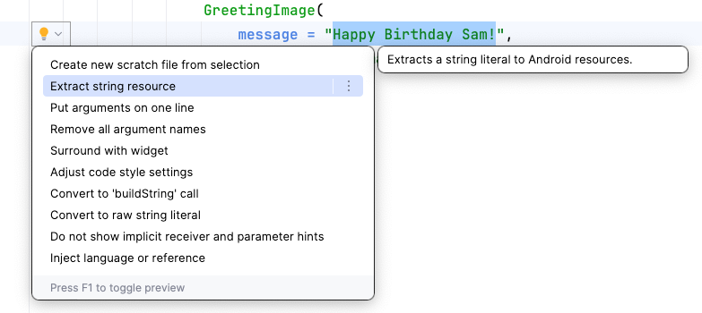

Android Studio で [**Extract Resource**] ダイアログが開きます。このダイアログでは、文字列リソースの名前と保存方法の詳細をカスタマイズできます。[**Resource name**] フィールドには、文字列の名前を入力します。[**Resource value**] には、実際の文字列を入力します。

4. [**Extract Resource**] ダイアログで、[**Resource name**] を `happy_birthday_text` に変更します。

文字列リソースの名前には小文字を使用し、複数の単語はアンダースコアで区切るようにします。他の設定はデフォルトのままにします。

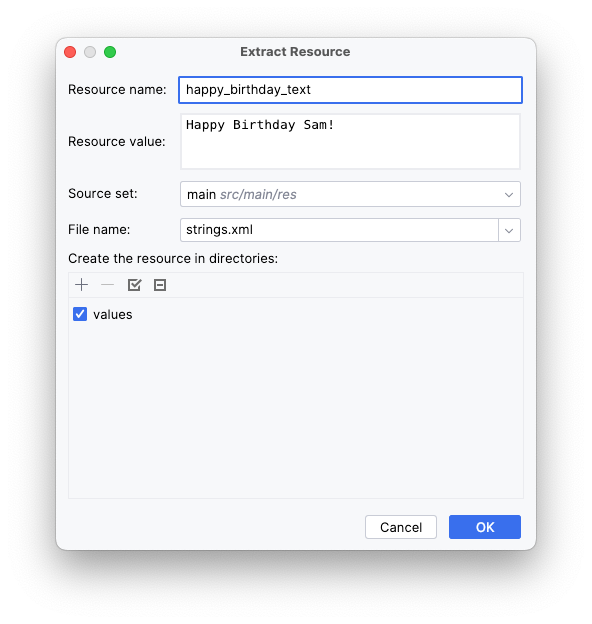

5. [**OK**] をクリックします。
6. コードの変更点を確認しましょう。

ハードコードされた文字列が `getString()` 関数の呼び出しに置き換えられています。

```kotlin
GreetingImage(
    message = getString(R.string.happy_birthday_text),
    from = "From Emma",
    modifier = Modifier.padding(8.dp)
)
```

> **注:** 一部の Android Studio バージョンでは、ハードコードされた文字列は `getString()` 関数に置き換えられます。このような場合は、手動で関数を `stringResource()` に変更してください。
> 
> 必要に応じて、`import androidx.compose.ui.res.stringResource` を import セクションに追加します。

7. [**Project**] ペインでパス **`app > res > values > strings.xml`** の **strings.xml** ファイルを開くと、`happy_birthday_text` という文字列リソースが Android Studio により作成されたのがわかります。

```kotlin
<resources>
    <string name="app_name">Happy Birthday</string>
    <string name="happy_birthday_text">Happy Birthday Sam!</string>
</resources>
```

`strings.xml` ファイルには、アプリによってユーザーに表示される文字列のリストが入っています。アプリの名前も文字列リソースです。文字列をすべて 1 か所にまとめることで、アプリ内のテキストの翻訳が簡単になり、アプリの別の場所で文字列を再利用するのも簡単になります。

8. 同じ手順で署名である `Text` コンポーザブルのテキストを抽出しますが、今度は [**Resource name**] フィールドに `signature_text` を入力します。

完成したファイルは以下のようになります。

```kotlin
<resources>
    <string name="app_name">Happy Birthday</string>
    <string name="happy_birthday_text">Happy Birthday Sam!</string>
    <string name="signature_text">From Emma</string>
</resources>
```

9. `stringResource()` と抽出された文字列を使用するように `BirthdayCardPreview()` を更新します。

```kotlin
@Preview(showBackground = true)
@Composable
fun BirthdayCardPreview() {
    HappyBirthdayTheme {
        GreetingImage(
            message = stringResource(R.string.happy_birthday_text),
            from = stringResource(R.string.signature_text)
        )
    }
}
```

> **注:** Android Studio で`stringResource` にカーソルを合わせると、[Unresolved reference: stringResource] という警告メッセージが表示される場合は、`stringResource()` 関数を使用するために `androidx.compose.ui.res.stringResource` の import ステートメントを追加する必要があります。

10. アプリをもう一度実行し、変わらず動作していることを確認します。

### 8. 課題に挑戦しましょう

アプリに画像を追加できたところで、次の課題に挑戦しましょう。

1. 署名テキスト コンポーザブルを画面の中央に揃えて配置します。

> **注:** ヒント: Compose には、親レイアウトによって適用される配置に関するレイアウトのルールに反して、子コンポーザブルを個別に配置する `align` 修飾子が用意されています。`.align(alignment = Alignment.CenterHorizontally)` 引数をテキスト コンポーザブル `Modifier` と連結します。

アプリでの表示は次のようになります。

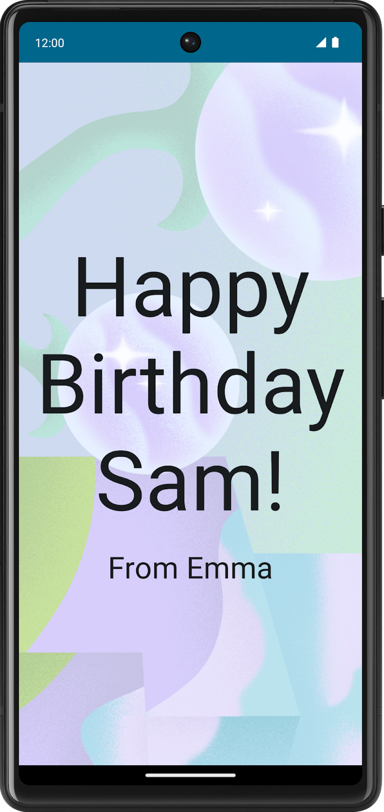

参考までに、`GreetingText()` 関数の解答コードは次のようになります。

```kotlin
@Composable
fun GreetingText(message: String, from: String, modifier: Modifier = Modifier) {
    Column(
        verticalArrangement = Arrangement.Center,
        modifier = modifier
    ) {
        Text(
            text = message,
            fontSize = 100.sp,
            lineHeight = 116.sp,
            textAlign = TextAlign.Center
        )
        Text(
            text = from,
            fontSize = 36.sp,
            modifier = Modifier
                .padding(16.dp)
                .align(alignment = Alignment.CenterHorizontally)
        )
    }
}
```

### 9. 解答コードを取得する

**Happy Birthday** アプリの解答コードは GitHub に掲載されています。

GitHub は、デベロッパーがソフトウェア プロジェクトのコードを管理できるようにするサービスです。Git という、コードの各バージョンで行われた変更を追跡するバージョン管理システムが使用されています。[Google ドキュメント](https://www.google.com/docs/about/)の変更履歴を見ると、いつ、どのような編集が行われたかを確認できます。同じように、プロジェクト内のコードのバージョン履歴を追跡できます。この機能は、プロジェクトに個人として取り組んでいる場合にも、チームとして取り組んでいる場合にも便利です。

GitHub には、プロジェクトの表示や管理ができるウェブサイトもあります。次の GitHub のリンクを使用すると、Happy Birdthday プロジェクトのファイルをオンラインで閲覧したり、パソコンにダウンロードしたりできます。

このレッスンの完成したコードをダウンロードするには、次の git コマンドを使用します。

```
$ git clone https://github.com/google-developer-training/basic-android-kotlin-compose-birthday-card-app.git
```

または、リポジトリを ZIP ファイルとしてダウンロードし、Android Studio で開くこともできます。

> **注:**解答コードは、ダウンロードしたリポジトリの `main` ブランチにあります。

解答コードを確認する場合は、[GitHub で表示します](https://github.com/google-developer-training/basic-android-kotlin-compose-birthday-card-app)。

#### GitHub におけるブランチ

ブランチとは何かを理解する前に、リポジトリ（リポ）とは何かを理解しておきましょう。リポジトリとは、プロジェクト全体（ディレクトリとファイル）であり、そのクローン（コピー）をパソコンに作成します。ブランチとは、リポジトリのあるバージョン、つまり独立した開発の系統のことです。たとえば、このコースの *starter* ブランチは、レッスンの間のコード作成に使用したバージョンかもしれません。*main* ブランチまたは *solution* ブランチは、レッスンの最後となるバージョンであり、完全な解答コードが入っているものです。

リポジトリには複数のブランチを作ることができます。つまり、リポジトリには複数バージョンのコードがあります。

### 10. まとめ

**Happy Birthday** アプリに画像を追加し、テキストを修飾子で整列して、ユーザー補助のガイドラインを遵守するようにし、他の言語に翻訳しやすくしました。そして、さらに重要なこととして、ご自分の **Happy Birthday** アプリを完成させました。作品をソーシャル メディアで共有し、ハッシュタグ **#AndroidBasics** を使って皆にわかるようしましょう。

#### 概要

- Android Studio の [**Resource Manager**] タブを使用すると、画像やその他のリソースを追加して配置することができます。
- `Image` コンポーザブルは、アプリに画像を表示する UI 要素です。
- アプリのユーザー補助機能を改善するために、`Image` コンポーザブルにコンテンツの説明を付ける必要があります。
- 誕生日祝いのメッセージなどのユーザーに表示するテキストは、文字列リソースに抽出して、アプリを他の言語に翻訳しやすくする必要があります。

#### 詳細

- [Resource Manager でアプリの UI リソースを管理する](https://developer.android.com/studio/write/resource-manager)
- [ユーザーが利用しやすいアプリを作成する](https://developer.android.com/guide/topics/ui/accessibility)
- [各種の言語と文化をサポートする](https://developer.android.com/training/basics/supporting-devices/languages)
- [GitHub のスタートガイド](https://help.github.com/en/github/getting-started-with-github)

## 5. 練習問題: Compose の基本


### 1. 始める前に

これまでに、初めてのアプリを作成し、Jetpack Compose の基本について学びました。今度は、学んだことを実践してみましょう。

今回の演習では、学習した UI コンポーザブルを使用してアプリを作成する方法に焦点を当てます。実際のユースケースから着想を得たものであり、一部は以前に経験したことがあるかもしれません。

この演習では、画像や文字列など、実装に必要なリソースが提供されます。文字列リソースには、UI に表示されるテキストが含まれています。こうした文字列を `strings.xml` ファイルに追加して、コードで使用します。

さらに、演習ではテキスト コンテンツに使用するフォントサイズや UI コンポーネント周囲のパディングなど、一連の仕様についても説明します。こうした仕様は一貫性のある UI 作成において役に立ち、通常デベロッパーが画面を可視化して作成する際の指針にもなります。組織のチームで作業する際にも、同様の仕様が存在する場合があります。

一部の演習では `Modifier` を使用しなければならない可能性もあります。そのような場合、各問題に用意されている**参照**セクションをご確認ください。修飾子やプロパティに関連するドキュメントへのリンクが掲載されています。ドキュメントを読み、そのコンセプトをアプリに取り入れる方法を決定できます。ドキュメントを理解する能力は、知識を深めるために身につける必要のある重要なスキルの一つです。

解答コードは最後に掲載されていますが、演習に取り組んでから解答を確認するようにしてください。解答はアプリを実装する方法の一つと捉えましょう。解答コードでは、これまでに学習した基本的なコンポーザブルとコンセプトが使用されています。改善の余地はたくさんあるので、いろいろなことを自由に試してください。

自分に合ったペースで問題に取り組みましょう。必要なだけ時間をかけ、じっくりと問題に取り組んでください。

最後に、Android Studio を使用して、この演習用に別のプロジェクトを作成する必要があります。

#### 前提条件

- 「テキスト コンポーザブルを使用してシンプルなアプリを作成する」レッスンを完了している
- 「Android アプリに画像を追加する」レッスンを完了している
- Android Studio の最新バージョン
- Kotlin プログラミング言語に関する基本的な知識
- Android Studio でデフォルトのテンプレートを使用して Android プロジェクトを作成できる
- `Text`、`Image`、`Box`、`Column`、`Row` 関数など、さまざまな `Composable` 関数に関する知識
- UI 装飾の `Modifier` クラスに関する知識

#### 必要なもの

- Android Studio がインストールされた、インターネットに接続できるパソコン。

### 2. Compose 記事

Learn Together アプリには、複数の Jetpack ライブラリに関する記事のリストが表示されます。ユーザーはトピックを選択して、最新の開発内容を知ることができます。

この演習では、Jetpack Compose のチュートリアルを表示するアプリの画面を作成します。この問題では、**リソース** セクションに掲載されている画像と文字列のリソースを使用します。

##### 最終的なスクリーンショット

実装が完了すると、次のスクリーンショットのようなデザインができあがります。

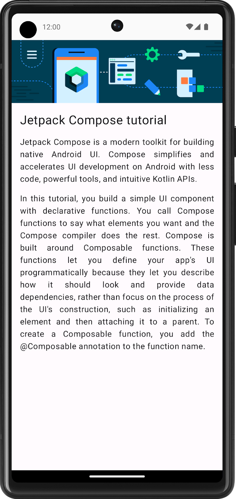

##### UI 仕様

UI 仕様は次のとおりです。

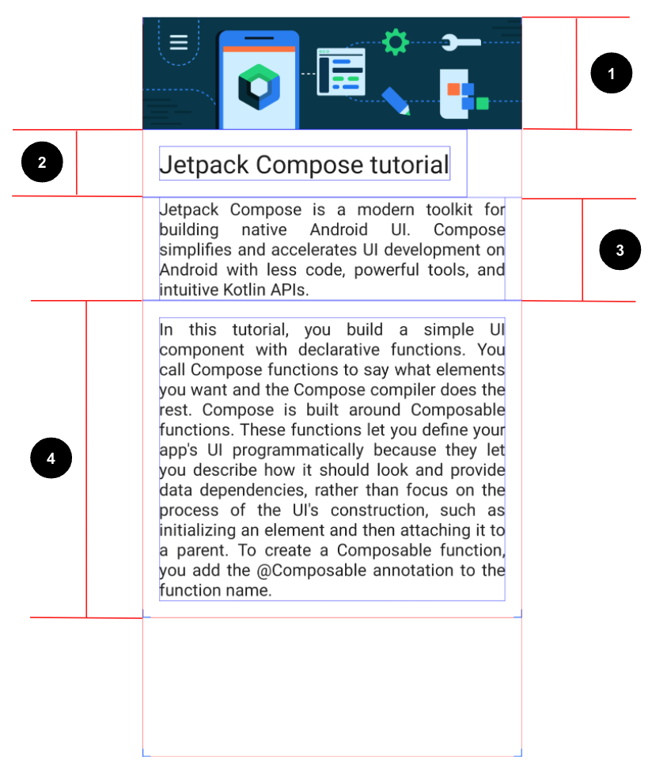

1. 画像を画面の幅いっぱいになるように設定します。
2. 最初の `Text` コンポーザブルを、フォントサイズ `24sp`、パディング（上下左右）`16dp` に設定します。
3. 2 つ目の `Text` コンポーザブルを、デフォルトのフォントサイズ、パディング（左右）`16dp`、テキスト配置 `Justify` に設定します。
4. 3 つ目の `Text` コンポーザブルを、デフォルトのフォントサイズ、パディング（上下左右）`16dp`、テキスト配置 `Justify` に設定します。

##### リソース

プロジェクトにインポートする必要がある[こちらの画像](https://github.com/google-developer-training/basic-android-kotlin-compose-training-practice-problems/blob/main/Unit%201/Pathway%203/ComposeArticle/app/src/main/res/drawable-nodpi/bg_compose_background.png)と、以下の文字列。

- `Jetpack Compose tutorial`
- `Jetpack Compose is a modern toolkit for building native Android UI. Compose simplifies and accelerates UI development on Android with less code, powerful tools, and intuitive Kotlin APIs.`
- `In this tutorial, you build a simple UI component with declarative functions. You call Compose functions to say what elements you want and the Compose compiler does the rest. Compose is built around Composable functions. These functions let you define your app\'s UI programmatically because they let you describe how it should look and provide data dependencies, rather than focus on the process of the UI\'s construction, such as initializing an element and then attaching it to a parent. To create a Composable function, you add the @Composable annotation to the function name.`

**ヒント:**子を垂直に配置するコンポーザブルはどれでしょうか。

##### 参照

- [`TextAlign.Justify`](https://developer.android.com/reference/kotlin/androidx/compose/ui/text/style/TextAlign#Justify()) プロパティ

### 3. タスク マネージャー

タスク マネージャー アプリでは、ユーザーが日常的なタスクを管理し、完了する必要があるタスクを確認することができます。

この演習では、ある日のタスクをすべて完了したときに表示される画面を作成します。

##### 最終的なスクリーンショット

実装が完了すると、次のスクリーンショットのようなデザインができあがります。

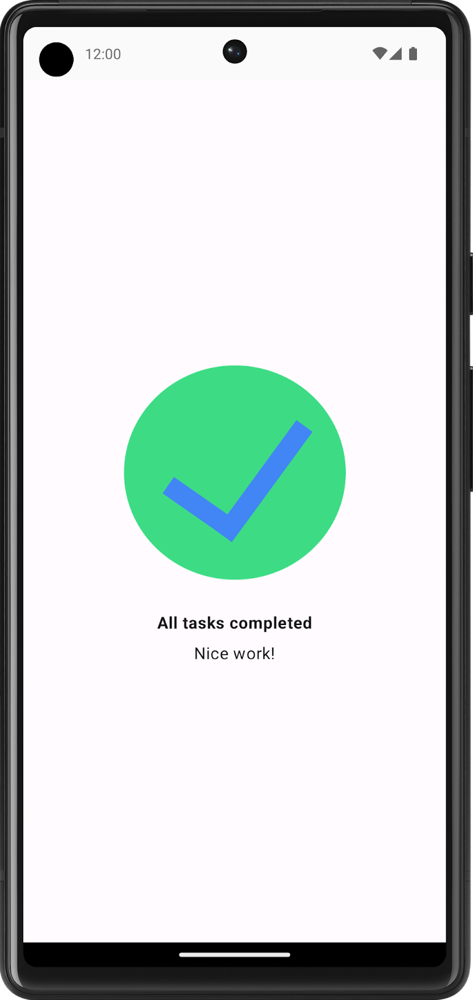

##### UI 仕様

UI 仕様は次のとおりです。

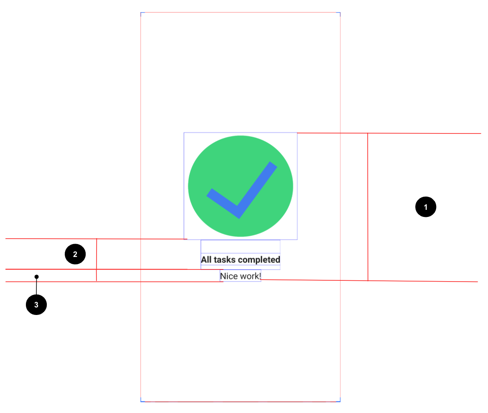

1. すべてのコンテンツを画面の垂直方向と水平方向に中央揃えで配置します。
2. 最初の `Text` コンポーザブルを、フォントの太さ `Bold`、上パディング `24dp`、下パディング `8dp` に設定します。
3. 2 つ目の `Text` コンポーザブルを、フォントサイズ `16sp` に設定します。

##### リソース

ダウンロードしてプロジェクトにインポートする必要がある[こちらの画像](https://github.com/google-developer-training/basic-android-kotlin-compose-training-practice-problems/blob/main/Unit%201/Pathway%203/TaskCompleted/app/src/main/res/drawable/ic_task_completed.png)と、以下の文字列。

- `All tasks completed`
- `Nice work!`

### 4. Compose 象限

この演習では、これまでに学習したコンセプトのほとんどを適用し、さらに一歩進んで、新しい `Modifier` とプロパティについて詳しく知る必要があります。追加の課題のように思えるかもしれませんが、ご安心ください。この問題の**参照**セクションに `Modifier` クラスとプロパティへのリンクが掲載されているため、実装に使用できます。

学習した `Composable` 関数についての情報を表示するアプリを作成する必要があります。

画面が 4 つの象限に分割され、各象限には `Composable` 関数の名前と、1 文での説明が記載されています。

##### 最終的なスクリーンショット

実装が完了すると、次のスクリーンショットのようなデザインができあがります。

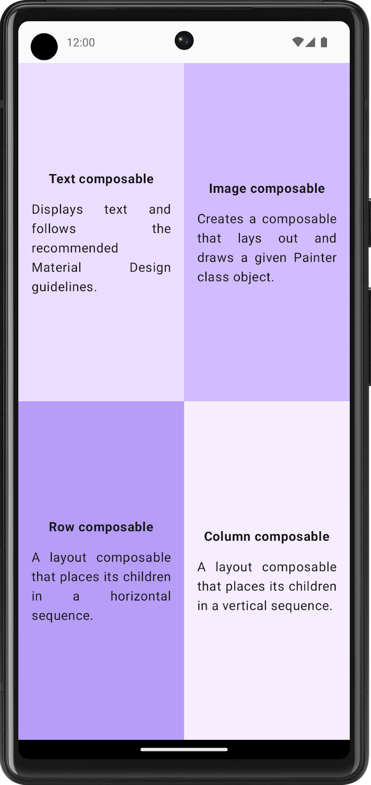

##### UI 仕様

画面全体の UI 仕様は次のとおりです。

- 画面全体を同じ大きさに 4 分割します。それぞれに Compose カードがあり、`Composable` 関数についての情報が表示されます。

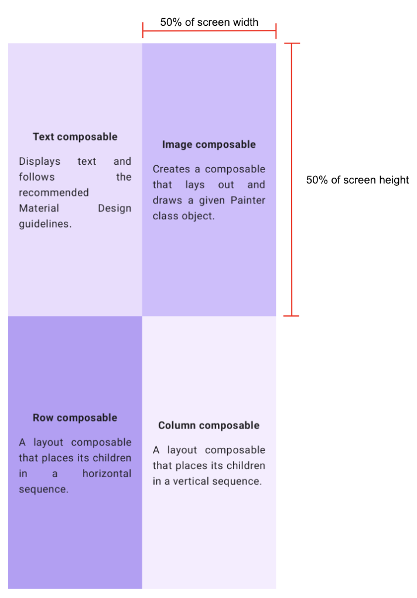

各象限の仕様は次のとおりです。

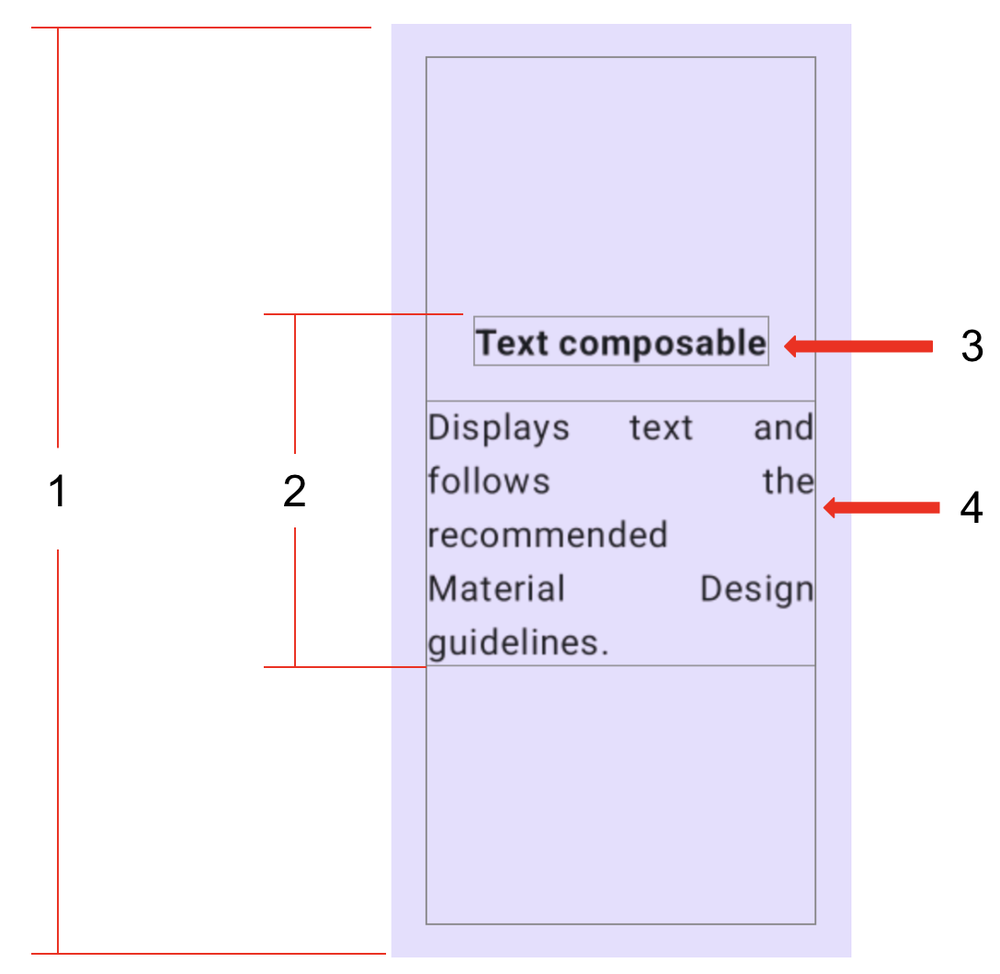

1. 象限全体（上下左右）を、パディング `16dp` に設定します。
2. すべてのコンテンツを各象限の垂直方向と水平方向に中央揃えで配置します。
3. 最初の `Text` コンポーザブルを、太字に書式設定し、下パディング `16dp` に設定します。
4. 2 つ目の `Text` コンポーザブルを、フォントサイズ `Default` に設定します。

##### リソース

以下の色。

- `Color(0xFFEADDFF)`
- `Color(0xFFD0BCFF)`
- `Color(0xFFB69DF8)`
- `Color(0xFFF6EDFF)`

以下の文字列。

- `Text composable`
- `Displays text and follows the recommended Material Design guidelines.`
- `Image composable`
- `Creates a composable that lays out and draws a given Painter class object.`
- `Row composable`
- `A layout composable that places its children in a horizontal sequence.`
- `Column composable`
- `A layout composable that places its children in a vertical sequence.`

##### 参照

- [`Weight modifier`](https://developer.android.com/reference/kotlin/androidx/compose/foundation/layout/RowScope#(androidx.compose.ui.Modifier).weight(kotlin.Float,kotlin.Boolean)) 機能
- [`FontWeight.Bold`](https://developer.android.com/reference/kotlin/androidx/compose/ui/text/font/FontWeight#Bold()) プロパティ
- [`TextAlign.Justify`](https://developer.android.com/reference/kotlin/androidx/compose/ui/text/style/TextAlign#Justify()) プロパティ

### 5. 解答コード

- [Compose 記事](https://github.com/google-developer-training/basic-android-kotlin-compose-training-practice-problems/tree/main/Unit%201/Pathway%203/ComposeArticle)
- [タスク マネージャー](https://github.com/google-developer-training/basic-android-kotlin-compose-training-practice-problems/tree/main/Unit%201/Pathway%203/TaskCompleted)
- [Compose 象限](https://github.com/google-developer-training/basic-android-kotlin-compose-training-practice-problems/tree/main/Unit%201/Pathway%203/ComposeQuadrant)

## 6. プロジェクト: 名刺アプリを作成する（提出対象）


### 1. 始める前に

このユニットで学習した内容を活用して、独自の名刺アプリを作成します。これまでのレッスンでは手順の説明を行っていましたが、ここでは、これまでに学習したコンセプトを基に構築可能なものに関するガイドラインと提案のみを提示しています。限られた指示のもと、創造性を発揮して自主的にアプリを作成することをおすすめします。

自分でアプリを作成するのは難しいことですが、十分な練習を積んできているので心配はいりません。この新しい状況で、習得したスキルを活用できます。アプリの特定部分の実装方法がわからない場合は、いつでも前のレッスンを参照できます。

このアプリを自分で作成する中で直面する問題を解決すると、学習速度が上がり、関連するコンセプトを忘れにくくなります。また、アプリは完全にカスタマイズされているため、自分に合わせて自由に変更し、友人や家族に見せることもできます。

#### 前提条件

- Android Studio でプロジェクトを作成、実行できること
- `Text` と `Image` のコンポーザブルを含むコンポーズ可能な関数の使用経験

#### 学習内容

- `Row` と `Column` のコンポーザブルを使用してシンプルなレイアウトを作成し、`horizontalAlignment` パラメータと `verticalArrangement` パラメータで配置する方法
- `Modifier` オブジェクトを使用して Compose 要素をカスタマイズする方法

#### 作成するアプリの概要

- 名刺を表示する Android アプリ

#### 必要なもの

- Android Studio がインストールされているパソコン
- アプリに表示される Android ロゴ（こちらの[リポジトリ](https://github.com/google-developer-training/basic-android-compose-training-assets/tree/main/Unit%201/Pathway%203/Project:%20business%20card%20app)で提供）

このプロジェクトの終了時におけるアプリの外観の例を次に示します。

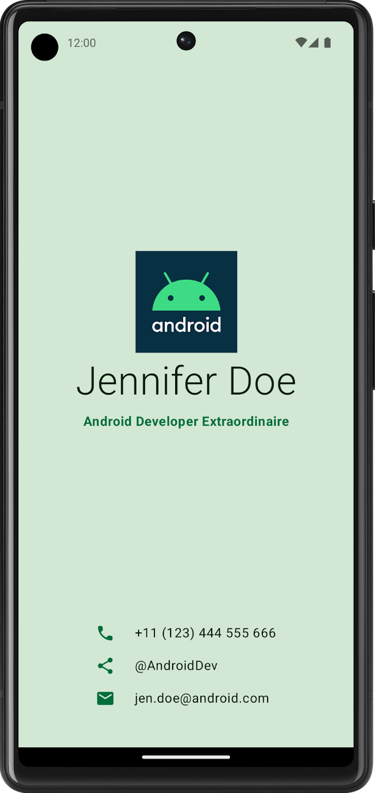

### 2. コンポーザブルを使用して UI を作成する

#### 低忠実度のプロトタイプを作成する

プロジェクトを開始するにあたって、UI 要素を画面上でどのように組み合わせるかを可視化すると有用です。プロの開発現場では、デザイナーやデザインチームが、デベロッパーに正確な仕様が含まれている UI モックアップ（デザイン）を提供することがよくあります。ただし、デザイナーと協力していない場合は、自分で低忠実度の（ローファイ）プロトタイプを作成することも可能です。ローファイ プロトタイプとは、アプリがどのようなものかについて基本概念を提供する単純なモデル（図形描画）のことです。

意外にも、デザイナー不在の仕事はよくあることですので、シンプルな UI モックアップをスケッチできる能力はデベロッパーにとって便利なスキルとなります。プロのデザイナーでなくても、デザインツールの使い方を知らなくても、心配ありません。ペンと紙、[スライド](http://slides.google.com)、[図形描画](https://docs.google.com/drawings/)を使うだけで作成できます。

低忠実度のプロトタイプを作成するには:

1. お好みの媒体で、アプリを構成する要素を追加します。検討する要素としては、Android ロゴ、名前、肩書き、連絡先情報、連絡先情報を示すアイコンなどがあります。たとえば、電話のアイコンは電話番号を示します。
2. こうした要素をさまざまな位置に追加し、視覚的に評価します。最初から完璧に仕上げる必要はありません。今は 1 つのデザインに決めておいて、後から繰り返し改良していくことができます。

> **注**: ユーザーにとってより良いデザインを実現するための原則がありますが、このプロジェクトでは扱いません。詳細については、[レイアウトについて](https://m3.material.io/foundations/layout/understanding-layout/overview)をご覧ください。

次の画像のような、ローファイ デザインを思いつくかもしれません。

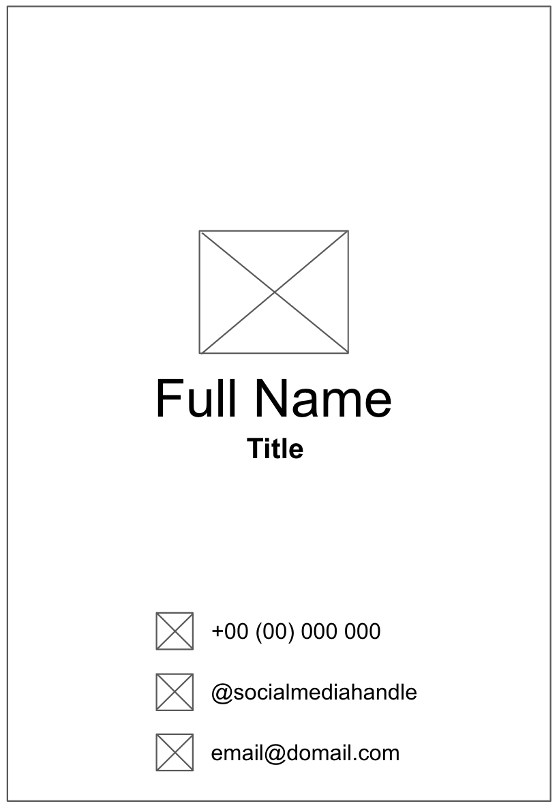

#### デザインをコードに変換する

プロトタイプを使用してデザインをコードに変換する手順は次のとおりです。

1. アプリのさまざまな論理的なセクションを特定し、その周囲に境界線を引きます。このステップにより、画面を小さなコンポーザブルに分割し、コンポーザブルの階層について検討できるようになります。

この例では、画面を 2 つのセクションに分割できます。

- ロゴ、名前、肩書き
- 連絡先情報

各セクションは 1 つのコンポーザブルに変換できます。このように、小さなコンポーズ可能な構成要素を使用して UI を作成できます。こうした各セクションは、`Row` コンポーザブルや `Column` コンポーザブルなどのレイアウト コンポーザブルで配置できます。

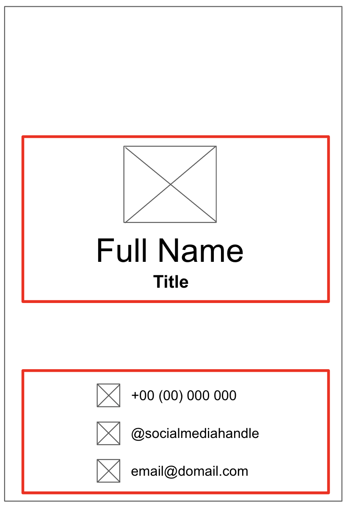

2. 複数の UI 要素を含むアプリのセクションごとに、その周囲に境界線を描きます。この境界線は、セクション内の要素間の関係を確認する際に役立ちます。

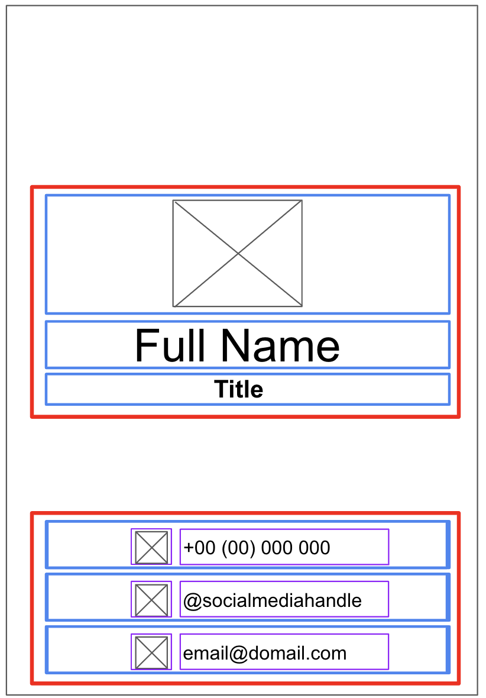

レイアウト コンポーザブルを使用して、`Text`、`Image`、`Icon` などのコンポーザブルの配置方法を簡単に確認できるようになりました。

使用できる各種コンポーザブルに関する注意事項:

`Row` コンポーザブルまたは `Column` コンポーザブル

- `Row` と `Column` のコンポーザブルで、さまざまな `horizontalArrangement` パラメータと `verticalAlignment` パラメータを試して、自分のデザインに合うようにしてください。

`Image` コンポーザブル

- `contentDescription` パラメータは必ず入力してください。前のレッスンで触れたように、TalkBack では `contentDescription` パラメータを使用してアプリのユーザー補助機能を強化しています。`Image` コンポーザブルが装飾目的にのみ使用されている場合、または `Image` コンポーザブルを説明する `Text` 要素がある場合は、`contentDescription` パラメータを `null` に設定できます。また、`modifier` パラメータに `height` 修飾子と `width` 修飾子を指定して、画像のサイズをカスタマイズすることもできます。

`Icon` コンポーザブル

- [`Icon` コンポーザブル](https://developer.android.com/reference/kotlin/androidx/compose/material/icons/Icons)を使用して、[マテリアル デザインのアイコン](https://fonts.google.com/icons?selected=Material+Icons)を追加できます。[`Tint` パラメータ](https://developer.android.com/reference/kotlin/androidx/compose/material/Icon.composable#Icon(androidx.compose.ui.graphics.vector.ImageVector,kotlin.String,androidx.compose.ui.Modifier,androidx.compose.ui.graphics.Color))を変更して、名刺のスタイルに合わせてアイコンの色を調整できます。`Image` コンポーザブルと同様に、`contentDescription` パラメータも必ず指定してください。

`Text` コンポーザブル

- `fontSize`、`textAlign`、`color`、`fontWeight` の各パラメータをさまざまな値で試して、テキストのスタイルを設定できます。

間隔と配置

- コンポーザブルの配置の補助として、`padding` や `weight` 修飾子などの `Modifier` 引数を使用できます。
- [`Spacer` コンポーザブル](https://developer.android.com/reference/kotlin/androidx/compose/foundation/layout/Spacer.composable#Spacer(androidx.compose.ui.Modifier))を使用して、間隔をより明示的に指定することもできます。

色のカスタマイズ

- `Color` クラスと色の [16 進数コード](https://www.w3schools.com/colors/colors_hexadecimal.asp)（RGB 形式で色を表す 16 進法）を組み合わせることでカスタムカラーを使用できます。たとえば、Android の緑色を示す 16 進数コードは #3DDC84 です。このコードを以下のように使用すると、テキストを同じ緑色にできます。

```kotlin
Text("Example", color = Color(0xFF3ddc84))
```

3. エミュレータまたは Android デバイスでアプリを実行し、コンパイルできることを確認します。

### 3. ご健闘を祈ります。

#### ご健闘をお祈りします

このガイドが、Compose で独自の名刺を作成するきっかけになれば幸いです。さらに、独自のロゴや写真を使用したアプリのカスタマイズも可能です。完成したら、友人や家族と一緒に作品を披露しましょう。作品をソーシャル メディアで共有する場合は、ハッシュタグ #AndroidBasics を付けてください。

## 7. つまずきやすいポイント

- レイアウトが思い通りにならないときは、まず `Column` / `Row` のどちらに入っているかを図に書いてみましょう。
- 画像は `res/drawable` に置き、`painterResource(R.drawable.xxx)` で読み込みます。ファイル名は小文字・数字・アンダースコアのみです。
- 名刺アプリは **正解が一つではありません**。要件（名前・肩書き・連絡先が見える）を満たしていれば、デザインは自由です。

## 8. AIに質問する（この章の例）

次の例をそのままAIに投げてOKです（必要なら自分のコード/エラーに置き換えてください）。

```text
「`Column` と `Row` と `Box` の違いを、図に描くイメージで説明して」
「名刺アプリで名前を画面中央、連絡先を画面下に置きたい。`Modifier` の使い方を、答えを丸ごとではなく方針→ヒントの順で教えて」
「このレイアウトのコードをレビューして。コンポーザブルの分け方と命名の改善点を教えて（コード: ここに貼る）」
```

質問がまとまらないときは、第0章の「質問テンプレ」を使ってください。

## 9. 提出物

次のレッスンで完成させた Android Studio プロジェクトを、学習用リポジトリの `unit1/BusinessCard/` に置きます（プロジェクトフォルダごとコピー。`build/` と `.idea/` は含めない）。

- プロジェクト: 名刺アプリを作成する

PR 本文には次の 3 点を書いてください。

- **やったこと**：どのレッスン / 演習を完了したか
- **動作確認**：どの端末（エミュレータ名 or 実機）で何を確認したか
- **詰まった点と解決**：エラーの内容と、どう直したか（AI に聞いた内容も可）

## 10. チェックリスト

- [ ] `Text` / `Image` コンポーザブルと `Column` / `Row` / `Box` で画面を組める
- [ ] `Modifier` で余白・サイズ・配置を調整できる
- [ ] プロジェクト「名刺アプリ」を自分の情報で完成させられる
- [ ] 章末のクイズに合格した
- [ ] 提出物が `unit1/BusinessCard/` にあり、Android Studio（または Kotlin Playground）で開いて動く

---

## 課題提出

この章には提出課題があります。

1. 上記の提出物を完了する
2. GitHub で `feature/01-basic-layout` ブランチを作成し、`develop` へのPRを作成（base=`develop`）
3. [AIプログラムレビュー](https://ai.studio/apps/84d224cb-7de1-44fb-995b-9a5917d25603?fullscreenApplet=true) を実行
4. 問題がなければ、進捗ダッシュボードで **PR URL** と **完了日** を記録
