# 第1章: Kotlin の概要

> 提出ブランチ: `feature/01-kotlin-intro`

## 1. この章のゴール

- Kotlin Playground でプログラムを書いて実行できる
- 変数（`val` / `var`）と関数を使ったプログラムを書ける
- 練習問題の解答を Kotlin ファイルとして残せる

## 2. 進め方

次の内容を **上から順番に** 進めます。「やらなくてOK」の行は飛ばして構いません。レッスンの本文はこのページの下にすべて掲載しています。目安時間の合計は約225分です。

| # | 種類 | 内容 | 目安 | 備考 |
|---|---|---|---|---|
| 1 | レッスン | 初めての Kotlin プログラム | 約30分 |  |
| 2 | レッスン | Kotlin で変数を作成して使用する | 約60分 |  |
| 3 | レッスン | Kotlin で関数を作成して使用する | 約60分 |  |
| 4 | レッスン | 練習問題: Kotlin の基本 | 約60分 | **提出対象** |
| 5 | クイズ | [テスト: Kotlin によるプログラミングの概要](https://developer.android.com/courses/quizzes/android-basics-compose-unit-1-pathway-1/intro-to-programming?hl=ja) | 約15分 | リンク先で受ける |

このプログラムの進め方は次の通りです。

1. 下の各レッスンを読み、各ステップの説明を理解してから **自分でコードを打つ**（コピペで済ませない）
2. ステップごとにアプリを実行し、期待どおり動くか確認する
3. 動かないときは、エラー文をそのまま AI に貼って「何が原因か」を聞き、直したら **なぜ直ったか** をメモする
4. 章末のクイズ（リンク先）を受けて、間違えた項目をレッスンで読み直す

> 画面が最新の Android Studio と異なる場合があります。

## 3. 初めての Kotlin プログラム


### 1. 始める前に


このコースでは、Kotlin プログラミング言語でコードを記述してアプリを作成します。Kotlin プログラミング言語は、Android アプリを初めて作成するユーザー向けに Google が推奨している言語です。

Kotlin は、デベロッパーの生産性を高める最新のプログラミング言語です。たとえば、Kotlin では他のプログラミング言語と比べて、同じ機能を少ないコード行でより簡潔に記述できます。また、Kotlin で作成したアプリはクラッシュする可能性が低いため、堅牢で安定したアプリをユーザーに提供できます。基本的に、Kotlin を使用することで、より優れた Android アプリを短時間で開発できます。そのため、業界での Kotlin の人気は高く、プロの Android デベロッパーの大半が使用する言語となっています。

Kotlin で Android アプリを作成するには、最初に Kotlin プログラミングのコンセプトの基礎をしっかりと確立することが重要です。このレッスンでは、アプリの作成に進む前に、Kotlin プログラミングの基本について学びます。

#### **作成するアプリの概要**

- 実行時にメッセージを表示する簡単な Kotlin プログラム。

#### **学習内容**

- シンプルな Kotlin プログラムを記述して実行する方法。
- シンプルなプログラムを変更して異なる出力を表示する方法。

#### **必要なもの**

- インターネットに接続でき、ウェブブラウザがインストールされたパソコン。

### 2. 始める

このレッスンでは、シンプルな Kotlin プログラムの基本事項と変更方法を学びます。プログラムとは、パソコンやモバイル デバイスになんらかのアクションを実行させるための一連の命令と考えることができます。これには、ユーザーへのメッセージの表示や、ショッピング カートの合計額の計算などがあります。コンピュータが実行すべきことを順を追って示した命令を、「コード」と呼びます。プログラムのコードを変更すると、出力が変わる可能性があります。

コードの記述と編集には、コードエディタというツールを使用します。テキスト エディタでもテキストの記述と編集が可能ですが、コードエディタには、コードをより正確に記述するための機能が用意されています。たとえば、コードエディタでは、入力中にオートコンプリートの候補が表示され、コードが正しくない場合はエラー メッセージが表示されます。

Kotlin 言語の基本を練習するには、Kotlin プレイグラウンドと呼ばれるインタラクティブなコードエディタを使用します。ウェブブラウザからアクセスできるため、パソコンにソフトウェアをインストールする必要はありません。Kotlin プレイグラウンドでは、直接 Kotlin コードを編集して実行し、出力を確認できます。

Kotlin プレイグラウンド内で Android アプリを作成することはできません。後ほど Android Studio というツールをインストールし、Android Studio で Android アプリコードの記述と編集を行います。

Kotlin の概要を理解したところで、最初のプログラムを見てみましょう。

### 3. Kotlin プレイグラウンドを開く

パソコンのウェブブラウザで [Kotlin プレイグラウンド](https://developer.android.com/training/kotlinplayground)を開きます。

この画像のようなウェブページが表示されます。

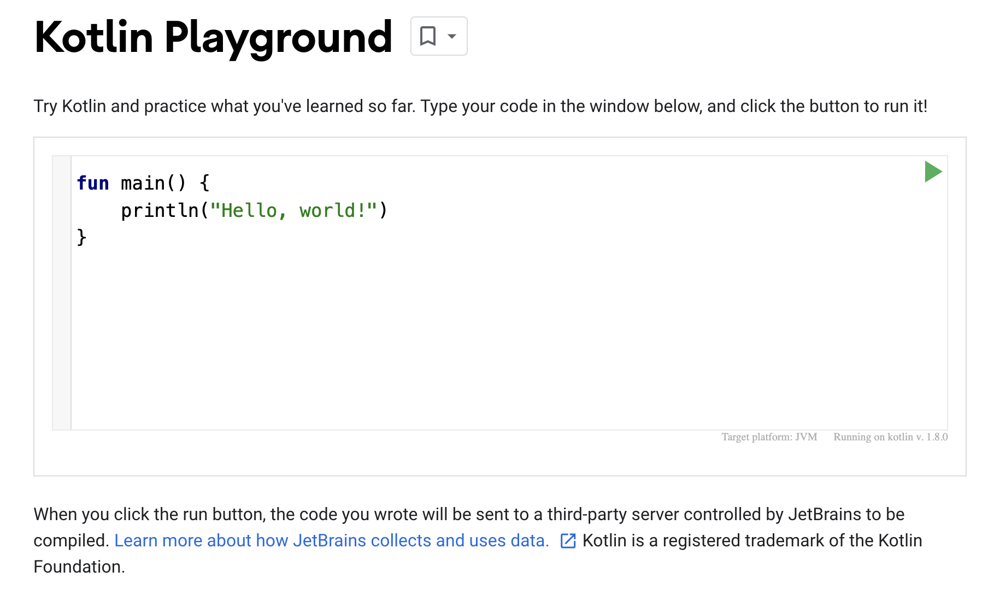

コードエディタにはすでに、デフォルトのコードがいくつか入力されています。この 3 行のコードで、簡単なプログラムが作成されています。

```kotlin
fun main() {
    println("Hello, world!")
}
```

プログラミングの経験がない方も、このプログラムが何を実行するためのものか推測してみてください。

次のセクションで、その推測が正しいか確認しましょう。

### 4. 初めてのプログラムを実行する

 をクリックして、プログラムを実行します。

実行ボタンをクリックすると、多くのことが行われます。Kotlin プログラミング言語のコードは人間が理解できるように設計されているため、Kotlin プログラムではコードの読み書きや共同作業を簡単に行うことができます。しかし、パソコンはこの言語をそのまま理解することができません。

そのため、記述された Kotlin コードを読み込んで 1 行ずつ解析し、パソコンが理解できる形式に変換する *Kotlin コンパイラ*が必要になります。このプロセスは、コードのコンパイルと呼ばれます。

コードが正常にコンパイルされると、プログラムが実行されます。パソコンでプログラムが実行されると、パソコンは各命令を実行します。料理のレシピにたとえるなら、プログラムの各命令を実行することは、レシピの各ステップを実行することに相当します。

このスクリーンショットは、プログラムの実行時に表示される出力を示しています。

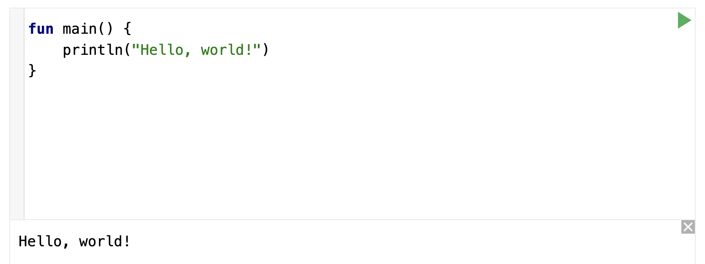

コードエディタの下部にあるペインに、プログラムの出力（結果）が以下のように表示されるはずです。

```
Hello, world!
```

分析がうまくいったようです。このプログラムは `Hello, world!` というメッセージを出力（表示）することを目的としています。

> **警告:** この結果が表示されない場合は、前のセクションの 3 行のコードをコピーして Kotlin プレイグラウンドに貼り付けてから、もう一度実行してください。

このプログラムの仕組みを見てみましょう。Kotlin プログラムには、コード内でプログラムの実行が開始される場所となる main 関数が必要です。main 関数は、プログラムのエントリ ポイント（開始点）になります。


次に、関数について詳しく見ていきましょう。

### 5. 関数の構成要素

関数とは、特定のタスクを実行するプログラムのセグメントのことです。プログラムには 1 つまたは複数の関数を含めることができます。

#### **関数の定義と呼び出し**

コードでは、最初に関数を定義します。つまり、そのタスクの実行に必要なすべての命令を指定します。

関数を定義したら、その関数を呼び出すことで、その関数内の命令を実行できます。

これは次のように例えることができます。チョコレート ケーキを焼くための詳細な手順（命令）を書き出し、この命令セットに `bakeChocolateCake` という名前を付けるとします。ケーキを焼きたいときには、`bakeChocolateCake` 命令を実行します。3 つのケーキが必要な場合は、`bakeChocolateCake` 命令を 3 回実行する必要があります。最初のステップでは、各ステップを定義し、それぞれに名前を付けます。これは関数の定義に相当します。その後、実行する必要のあるときに、いつでも各ステップを参照できます。これは関数の呼び出しに相当します。

> **注:** 「関数を宣言する」という表現もありますが、「宣言」と「定義」は同義語であり、どちらを使用しても意味に違いはありません。また、「関数定義」や「関数宣言」という用語もあります。これらは関数を定義するコードを指します。プログラミング言語ごとに宣言と定義の意味が異なります。

#### **関数を定義する**

関数を定義するために必要な主要部分は次のとおりです。

- 関数には、後で呼び出せるように**名前**を付ける必要があります。
- 関数には、いくつかの**入力**や、関数の呼び出し時に指定する情報が必要になる場合もあります。関数は、こうした入力を使用して目的を達成します。入力は必須ではなく、入力が不要な関数もあります。
- 関数には、タスクの実行命令が含まれる**本体**もあります。

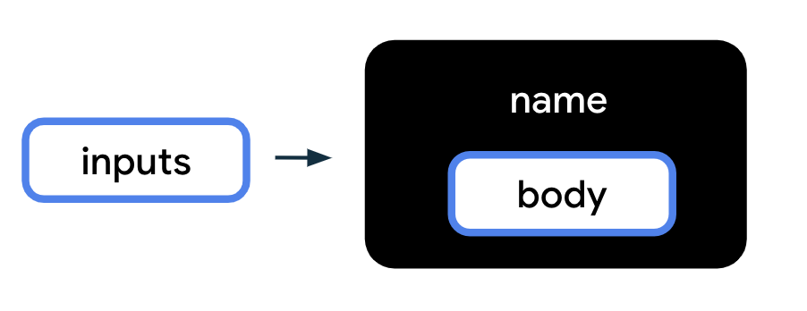

上の図を Kotlin コードに変換するには、次の構文（形式）を使用して関数を定義します。これらの要素の順序は重要です。`fun` という単語、関数名、丸かっこで囲まれた入力値、中かっこで囲まれた関数本体の順に記述します。

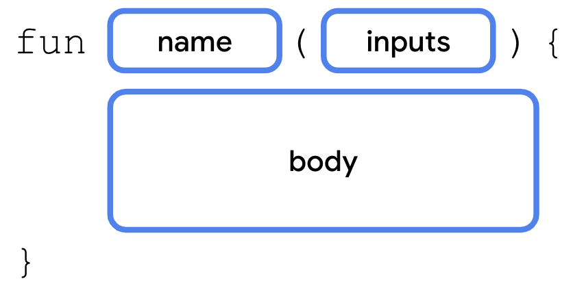

Kotlin プレイグラウンドに表示された `main`関数の例では、関数の主要部分が以下のように構成されています。

- 関数定義は `fun` という単語で始まっています。
- その後に、関数名の `main` があります。
- この関数には入力がないため、丸かっこ内は空になっています。
- 関数本体には `println("Hello, world!")` という 1 行のコードがあります。これは、関数の開き中かっこと閉じ中かっこの間にあります。

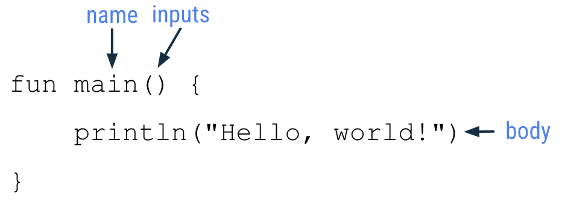

関数の各部分については、以下で詳しく説明します。

##### **関数のキーワード**

Kotlin で関数を定義することを示すには、新しい行で、特殊な単語である `fun`（関数の略）を使用します。すべて小文字で、正確に「`fun`」と入力してください。Kotlin コンパイラはプログラマーの意図を認識できないため、func、function などのスペルを使用することはできません。

これらの特殊な単語は Kotlin ではキーワードと呼ばれ、Kotlin で新しい関数を作成する場合など、特定の目的のために予約されています。

##### **関数名**

人間が名前で個人を識別しているように、関数にも名前があり、それによってお互いを区別しています。関数名は、`fun` キーワードの後に記述します。

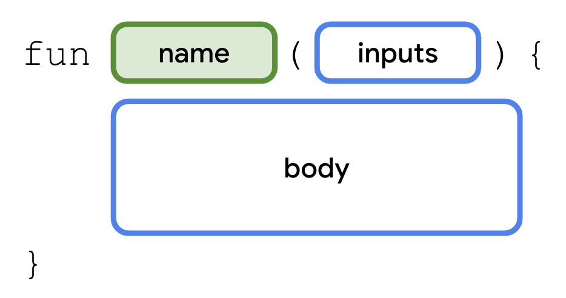

関数の目的に基づいて、関数に適切な名前を選択します。名前は通常、動詞または動詞句にします。関数名として [Kotlin キーワード](https://kotlinlang.org/docs/keyword-reference.html)は使用しないことをおすすめします。

関数名は、キャメルケースの命名規則に従い、最初の単語をすべて小文字にする必要があります。名前に複数の単語が含まれる場合、単語の間にスペースを入れず、その他の単語はすべて大文字で始める必要があります。

関数名の例:

- `calculateTip`
- `displayErrorMessage`
- `takePhoto`

##### **関数の入力**

関数名の後には必ず丸かっこが続きます。丸かっこ内には関数の入力を記述します。

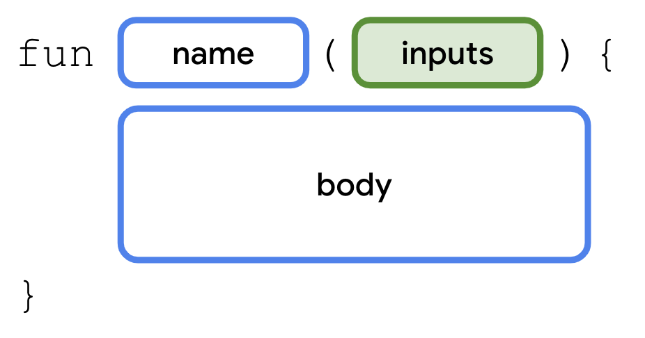

入力は、関数が目的を果たすために必要なデータです。関数を定義する際には、関数の呼び出し時に特定の入力を渡すことを必須とすることもできます。関数に必要な入力がない場合、丸かっこは空のまま（`()`）にします。

入力の数が異なる関数の例を次に示します。

次の図は、`addOne` という関数を示しています。この関数の目的は、特定の数値に「1」を足すことです。入力は 1 つで、任意の数字を指定できます。関数本体には、関数に渡される数値に 1 を加算するコードがあります。

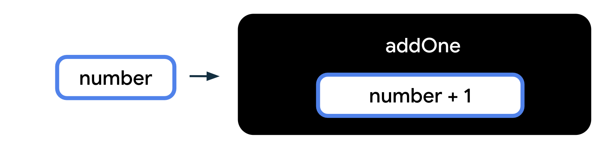

次の例は、`printFullName` という関数です。この関数には、姓と名の 2 つの入力が必要です。関数本体が姓と名を出力することで、人物のフルネームが表示されます。

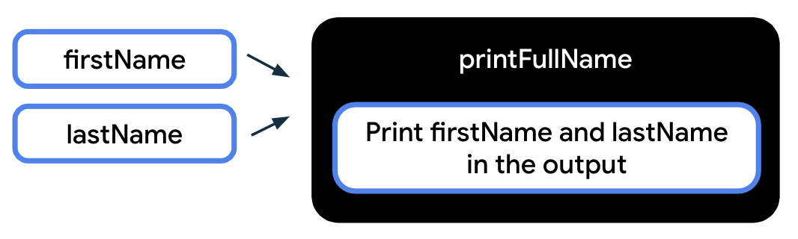

最後の例は、関数の呼び出し時に入力を渡す必要のない関数を示しています。`displayHello()` 関数を呼び出すと、Hello というメッセージが出力されます。

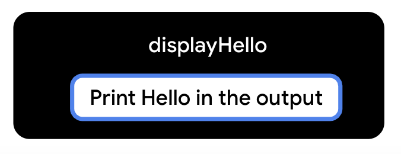

##### **関数本体**

関数本体には、関数の目的を達成するために必要な命令が含まれています。関数本体を見つけるには、開き中かっこと閉じ中かっこで囲まれたコード行を探します。

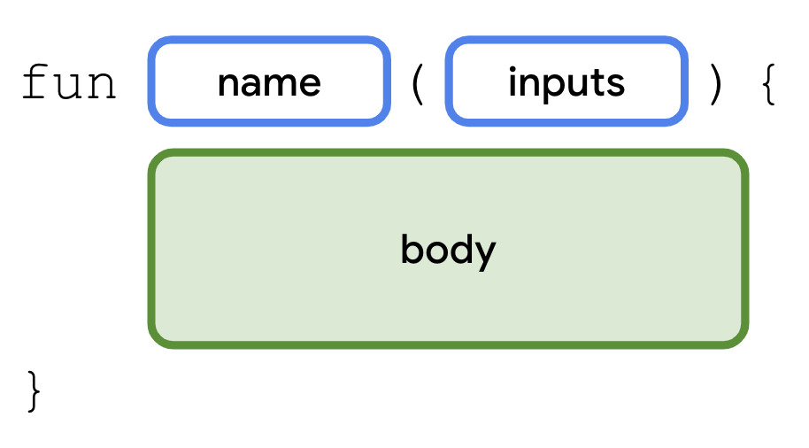

#### **シンプルなプログラムの説明**

このレッスンで見たシンプルなプログラムをもう一度確認してみましょう。


このプログラムには、`main` 関数という 1 つの関数が含まれています。`main` は、Kotlin の特別な関数名です。Kotlin プレイグラウンドでコードを記述する場合、コードは `main()` 関数内に記述するか、`main()` 関数から呼び出す必要があります。

この `main()` 関数の本体には 1 行のコードしかありません。

```kotlin
println("Hello, world!")
```

このコード行は、出力ペインに `Hello, world!` テキストを出力するという特定のアクションを実行するため、ステートメントとなります。具体的には、このコード行で `println()` 関数が呼び出されています。[`println()`](https://kotlinlang.org/api/latest/jvm/stdlib/kotlin.io/println.html) は、Kotlin 言語ですでに定義されている関数です。つまり、Kotlin 言語を作成したエンジニア チームによって、`println()` 関数の関数宣言がすでに作成されています。この関数には 1 つの入力が必要です。この入力がメッセージとして出力されます。

`println()` 関数を呼び出すときは、関数名の後の丸かっこ内にメッセージ テキストを記述します。表示するテキストは、必ず `"Hello, world!"` のように引用符で囲みます。

プログラムを実行すると、`println()` 関数に渡されたメッセージが出力されます。

```
Hello, world!
```

#### **試してみる**

プログラムの元のコードを見てみましょう。出力に以下のメッセージが表示されるように、Kotlin プレイグラウンドのコードを変更できるでしょうか。

```
Hello, Android!
```

### 6. プログラムを変更する

1. 出力に表示されるメッセージを変更するには、プログラムの 2 行目にある `println()` 関数呼び出しを変更します。`println()` 関数の `world` を `Android` に置き換えます。`"Hello, Android!"` が引き続き引用符と丸かっこ囲まれていることを確認してください。

```kotlin
fun main() {
    println("Hello, Android!")
}
```

2. プログラムを実行します。
3. 次のメッセージが出力されます。

```
Hello, Android!
```

これで、初めてのプログラムを変更できました。

次に、メッセージが 2 回出力されるようにコードを変更してみましょう。出力は次のようになります。

```
Hello, Android!
Hello, Android!
```

#### **複数のメッセージを出力する**

関数内には、タスクの実行に必要な数だけ命令行を記述できます。ただし、Kotlin では 1 行につき 1 つのステートメントのみを指定する必要があります。別のステートメントを記述する場合は、関数の新しい行に配置します。

複数行のテキストを出力するようにプログラムを変更するには:

1. 関数本体内の最初の `println()` ステートメントをコピーして、その下に 2 番目のステートメントとして貼り付けます。両方の `println()` ステートメントを main 関数の中かっこ内に配置する必要があります。これで、関数本体内のステートメントが 2 つになりました。

```kotlin
fun main() {
    println("Hello, Android!")
    println("Hello, Android!")
}
```

2. プログラムを実行します。
3. プログラムを実行すると、出力は次のようになります。

```
Hello, Android!
Hello, Android!
```

このようにして、コードへの変更が出力にどのように影響するかを確認できます。

4. `Hello,` *`YOUR_NAME`*`!` と出力するようにコードを変更します。

### 7. Kotlin スタイルガイド

このコースでは、Android デベロッパーとして従うべき適切なコーディング慣習について学びます。そうした慣習の 1 つは、Kotlin でコードを記述する際に、Google の Android コーディング標準に従うことです。詳細なガイドはスタイルガイドと呼ばれ、コードを見やすくするための適切な形式や、コードを記述する際に従うべき規則が記載されています。たとえば、スタイルガイドには、空白文字、インデント、命名などに関する推奨事項が含まれています。

スタイルガイドを遵守することの目的は、コードを読みやすくするとともに、他の Android デベロッパーの記述方法との一貫性を持たせることです。この一貫性は、大規模なプロジェクトで共同作業を行う場合に重要となります。これにより、プロジェクト内のすべてのファイルでコードのスタイルが統一されます。

ここまでで Kotlin について学習した内容に関して、スタイルガイドの推奨事項をいくつかご紹介します。

- 関数名はキャメルケースで記述し、動詞または動詞句を使用します。
- ステートメントは 1 行に 1 つずつ記述します。
- 関数の先頭行の末尾には、開き中かっこが必要です。
- 開き中かっこの前にはスペースが必要です。

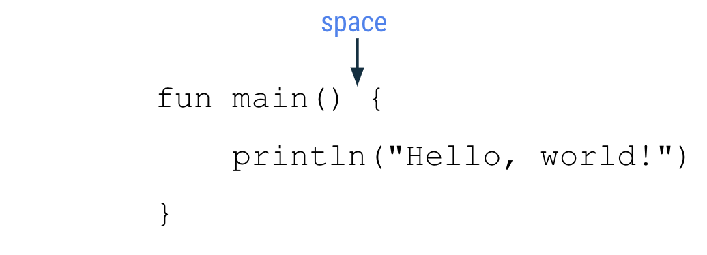

- 関数本体は、スペース 4 つ分インデントします。コードのインデントにはタブ文字を使用せず、スペースを 4 つ入力してください。

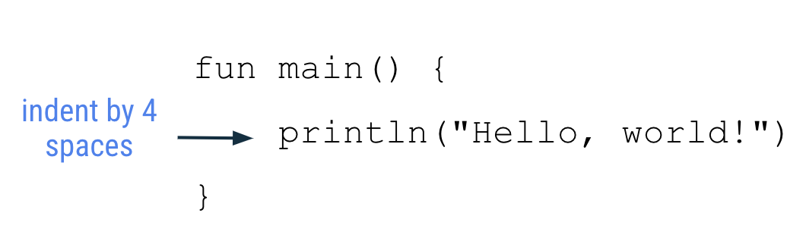

- 閉じ中かっこは、関数本体のコードの最終行の後に、単独の行で記述します。閉じ中かっこは、関数の先頭の `fun` キーワードと揃えます。

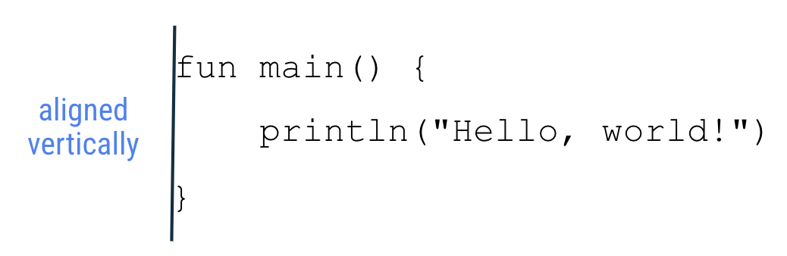

Kotlin の知識を身につける過程で、さらに Android のコーディング規則を学ぶことができます。詳細なスタイルガイドは[こちら](https://developer.android.com/kotlin/style-guide)にあります。まだ学習していない Kotlin の他のトピックも含まれますが、気にする必要はありません。

### 8. コードのエラーを修正する

人間が言語を学習する場合、正しく単語を使用し、文を構成するための、構文や文法の規則があります。プログラミング言語にも同様に、有効なコード（正常にコンパイルできるコード）を記述するための特定のルールがあります。

コーディングでは、誤って無効なコードを記述することがよくあります。初心者はこのようなミスを見つけたときに、混乱したり戸惑ったりするかもしれませんが、心配する必要はありません。記述したコードがそのまま完全に機能することはめったにないからです。ドキュメントを作成する際に推敲を重ねるのと同様に、コードについても、期待どおりに動作するまで何度も記述し直すことがよくあります。

コードを正常にコンパイルできない場合は、エラーが発生します。たとえば、タイプミス（引用符やかっこが抜けているなど）があると、コンパイラはコードを理解できず、コンピュータに実行させる手順に変換することができません。コードが想定どおりに動作しない場合や、コードエディタにエラー メッセージが表示された場合は、コードに戻って修正する必要があります。これらのエラーを解決するプロセスは、トラブルシューティングと呼ばれます。

1. 次のコード スニペットをコピーして Kotlin プレイグラウンドに貼り付け、プログラムを実行するとどうなるでしょうか。

```kotlin
fun main() {
    println("Today is sunny!)
}
```

本来は `Today is sunny!` というメッセージが表示されるはずですが、出力ペインには、代わりに感嘆符アイコンとエラー メッセージが表示されます。

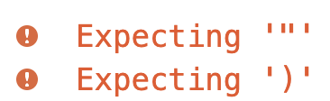

*Kotlin プレイグラウンドからのエラー メッセージ*

エラー メッセージは「Expecting」で始まっています。これは、Kotlin コンパイラが「想定」していた対象をコード内で見つけられないことを示しています。この場合、コンパイラは、プログラムの 2 行目のコードに閉じ引用符と閉じ丸かっこがあることを想定しています。

`println()` ステートメントを見ると、表示するメッセージには開き引用符はありますが、閉じ引用符がありません。コード内に閉じ丸かっこがあっても、その前に閉じ引用符がないため、コンパイラは丸かっこが出力テキストの一部であると判断します。

2. 感嘆符と閉じ丸かっこの間に閉じ引用符を追加します。

```kotlin
fun main() {
    println("Today is sunny!")
}
```

main 関数には、1 行のコード（`println()` ステートメント）が含まれています。テキストは `"Today is sunny!"` のように引用符で囲み、丸かっこ内に配置します。

3. プログラムを再実行します。

エラーは発生せず、出力ペインに次のテキストが表示されるはずです。

```
Today is sunny!
```

これでエラーを修正できました。コードの記述やエラーのトラブルシューティングの経験を積むことで、コードを記述する際に、大文字と小文字、スペル、スペース、記号、名前に注意することの重要性を理解できるようになります。

次のセクションでは、学習した内容の演習を行います。このレッスンの最後に解答が用意されていますが、まずは自分で考えることをおすすめします。

### 9. エクササイズ

#### 練習

1. このプログラムのコードを読み、Kotlin プレイグラウンドで実行せずに出力結果を推測してみましょう。

```kotlin
fun main() {
    println("1")
    println("2")
    println("3")
}
```

推測できたら、このコードをコピーして Kotlin プレイグラウンドに貼り付け、推測が正しいか確認してください。

2. Kotlin プレイグラウンドを使用して、次のメッセージを出力するプログラムを作成してください。

```
I'm
learning
Kotlin!
```

3. このプログラムをコピーして、Kotlin プレイグラウンドに貼り付けます。

```kotlin
fun main() {
    println("Tuesday")
    println("Thursday")
    println("Wednesday")
    println("Friday")
    println("Monday")
}
```

以下の出力を行うようにプログラムを修正してください。

```
Monday
Tuesday
Wednesday
Thursday
Friday
```

トラブルシューティングに慣れておくため、次の演習ではエラーを修正します。各演習では、ブラウザの Kotlin プレイグラウンドにコードをコピーしてください。プログラムを実行しようとすると、エラー メッセージが表示されます。

4. 目的の出力が生成されるように、プログラムのエラーを修正してください。

```kotlin
fun main() {
    println("Tomorrow is rainy")
```

目的の出力:

```
Tomorrow is rainy
```

5. 目的の出力が生成されるように、プログラムのエラーを修正してください。

```kotlin
fun main() {
    printLine("There is a chance of snow")
}
```

目的の出力:

```
There is a chance of snow
```

6. 目的の出力が生成されるように、プログラムのエラーを修正してください。

```kotlin
fun main() {
    println("Cloudy") println("Partly Cloudy") println("Windy")
}
```

目的の出力:

```
Cloudy
Partly Cloudy
Windy
```

7. 目的の出力が生成されるように、プログラムのエラーを修正してください。

```kotlin
fun main() (
    println("How's the weather today?")
)
```

目的の出力:

```
How's the weather today?
```

これらの演習を完了したら、次のセクションの解答を使って答え合わせをしてください。

### 10. ソリューション

#### 解答

1. プログラムの出力は次のようになります。

```
1
2
3
```

2. プログラム内のコードは次のようになります。

```kotlin
fun main() {
    println("I'm")
    println("learning")
    println("Kotlin!")
}
```

3. プログラムの正しいコードは次のとおりです。

```kotlin
fun main() {
    println("Monday")
    println("Tuesday")
    println("Wednesday")
    println("Thursday")
    println("Friday")
}
```

4. プログラムの 3 行目に、`main` 関数の関数本体の終了を示す閉じ中かっこがありません。

正しいコード:

```kotlin
fun main() {
    println("Tomorrow is rainy")
}
```

出力:

```
Tomorrow is rainy
```

5. プログラムを実行すると、`Unresolved reference: printLine` というエラーが表示されます。これは、`printLine()` が Kotlin では認識されない関数であるためです。また、Kotlin プレイグラウンドで、エラーの原因となっているコードの部分が赤色でハイライト表示されています。関数名を `println` に変更して、テキスト行を出力します。これにより、エラーが修正されます。

正しいコード:

```kotlin
fun main() {
    println("There is a chance of snow")
}
```

出力:

```
There is a chance of snow
```

6. プログラムを実行すると、`Unresolved reference: println` というエラーが表示されます。このメッセージでは、問題を解決するための方法が直接示されていません。これは、エラーのトラブルシューティングを行う場合によくあることで、予期しない動作を解決するためにコードを詳しく調べる必要があります。

よく見ると、コードの 2 番目の `println()` 関数呼び出しが赤色になっており、この部分に問題があることがわかります。これは、Kotlin では各行に 1 つのステートメントのみが記述されていることが想定されているためです。この場合、2 番目と 3 番目の `println()` 関数呼び出しを別々の新しい行に移動することで、問題を解決できます。

正しいコード:

```kotlin
fun main() {
    println("Cloudy")
    println("Partly Cloudy")
    println("Windy")
}
```

出力:

```
Cloudy
Partly Cloudy
Windy
```

7. プログラムを実行すると、`Function 'main' must have a body` というエラーが表示されます。関数本体は、丸かっこ（()）ではなく閉じ中かっこ（{}）で囲む必要があります。

正しいコード:

```kotlin
fun main() {
    println("How's the weather today?")
}
```

出力:

```
How's the weather today?
```

### 11. まとめ

以上で Kotlin の入門編は完了となります。

Kotlin でシンプルなプログラムを作成して実行し、出力されるテキストを確認しました。プログラムをさまざまな方法で変更し、その変更が出力に及ぼす影響を確認しました。プログラミングでミスをするのは珍しいことではありません。それを前提に、コード内のエラーをトラブルシューティングして修正するための初歩的な方法を学びました。これは今後役立つ重要なスキルです。

次のレッスンでは、Kotlin で変数を使用して、より魅力的なプログラムを作成する方法を学習します。

#### 概要

- Kotlin プログラムでは、プログラムのエントリ ポイントとして `main` 関数が必要です。
- Kotlin で関数を定義するには、`fun` キーワード、関数名、丸かっこで囲まれた入力、中かっこで囲まれた関数本体の順に指定します。
- 関数名はキャメルケースの命名規則に従い、小文字で始める必要があります。
- `println()` 関数呼び出しを使用してテキストを出力します。
- Kotlin スタイルガイドには、Kotlin でコーディングを行う際の形式とコード規則が記載されています。
- トラブルシューティングとは、コード内のエラーを解決するプロセスのことです。

#### 詳細

- [Hello World](https://play.kotlinlang.org/byExample/01_introduction/01_Hello%20world)
- [プログラムのエントリ ポイント](https://kotlinlang.org/docs/basic-syntax.html#program-entry-point)
- [標準出力に出力する](https://kotlinlang.org/docs/basic-syntax.html#print-to-the-standard-output)
- [関数の基本的な構文](https://kotlinlang.org/docs/basic-syntax.html#functions)
- [キーワードと演算子](https://kotlinlang.org/docs/keyword-reference.html)
- [関数の概念](https://kotlinlang.org/docs/functions.html)
- [`println()`](https://kotlinlang.org/api/latest/jvm/stdlib/kotlin.io/println.html)
- [Kotlin スタイルガイド](https://developer.android.com/kotlin/style-guide)

## 4. Kotlin で変数を作成して使用する


### 1. 始める前に

スマートフォンで使用するアプリには、同じ状態を維持する部分と変化する（変更できる）部分があります。

たとえば、設定アプリのカテゴリの名前（[ネットワークとインターネット]、[接続済みのデバイス]、[アプリ] など）は変化しません。

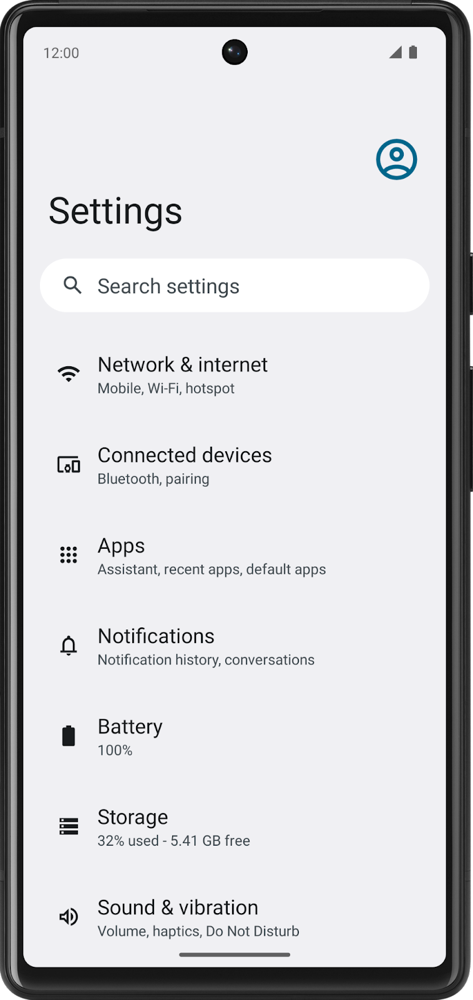

一方、ニュースアプリでは、記事（記事の名前、提供元、投稿時刻、画像）が頻繁に変化します。

時間の経過とともにコンテンツが変化するコードを記述するにはどうすればよいでしょうか。新しい記事の投稿は毎日分単位で行われるため、そのたびにアプリのコードを書き換えることはできません。

このレッスンでは、変数を使用するコードの記述方法を学びます。これにより、新しい命令セットを記述せずにプログラムの特定の部分を変更できるようになります。前のレッスンと同様に、ここでも Kotlin プレイグラウンドを使用します。

#### **作成するアプリの概要**

- 変数を使用する簡単な Kotlin プログラム。

#### **学習内容**

- 変数を定義してその値を更新する方法。
- Kotlin の基本的なデータ型から変数に適したデータ型を選択する方法。
- コードにコメントを追加する方法。

#### **必要なもの**

- ウェブブラウザがインストールされた、インターネットに接続できるパソコン。

### 2. 変数とデータ型

コンピュータ プログラミングには、変数という概念があります。変数とは、単一のデータを格納するためのコンテナです。これは、値が格納されている箱と考えることができます。箱には、変数名のラベルが付けられています。箱を変数名で参照することで、変数内に格納されている値にアクセスできます。

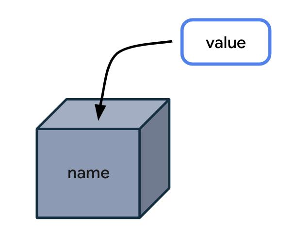

値を直接使用できるにもかかわらず、値を箱に保存し、箱を変数名で参照するのはなぜでしょうか。それは、コードのすべての命令で値を直接使用した場合、その特定のケースでしかプログラムが動作しなくなるためです。

変数の有用性は、次のように例えるとわかりやすくなります。最近会った人に手紙を送る場合を考えてみましょう。

Lauren 様

本日はオフィスでお会いできて光栄でした。金曜日にお会いできるのを楽しみにしております。

よろしくお願いいたします。

この手紙の内容自体は問題ありませんが、Lauren 氏とやり取りする特定の状況でのみ有効です。そのため、内容が少し異なるだけの手紙を、複数の人宛に何通も書く必要があります。このような場合は、手紙のテンプレートを 1 つ作成して、変更する可能性のある部分を空白にしておくと効率的です。

____ 様

本日は _____ でお会いできて光栄でした。____ にお会いできるのを楽しみにしております。

よろしくお願いいたします。

各空白に入る情報の種類を指定することもできます。これにより、手紙のテンプレートが想定どおりに使用されるようになります。

{ name } 様

本日は { location } でお会いできて光栄でした。*{ date } にお会いできるのを楽しみにしております。*

よろしくお願いいたします。

概念的には、アプリの作成も同じように考えることができます。一部のデータにはプレースホルダがありますが、アプリのそれ以外の部分は変化しません。

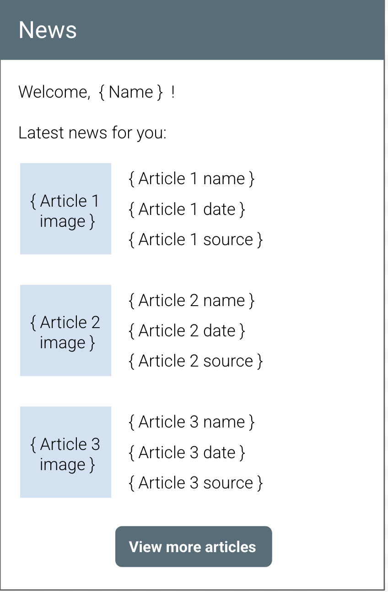

上記のニュースアプリの図では、「Welcome」のテキスト、「Latest news for you」という見出し、「View more articles」ボタンのテキストは常に同じです。一方、ユーザー名や各記事のコンテンツは変化する可能性があるため、変数を使用することで、各情報を適切に格納できます。

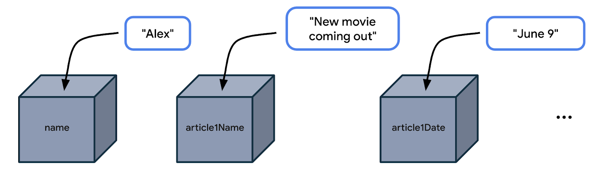

Alex というユーザーの場合にのみ、またはタイトルと公開日が同じニュース記事の場合にのみ機能するように、ニュースアプリのコード（命令）を記述する必要はありません。代わりに、`name`、`article1Name`、`article1Date` などの変数名を参照してコードを記述することで、アプリの柔軟性を高めることができます。これにより、コードの汎用性が高まり、ユーザー名や記事の詳細が異なる場合など、さまざまなユースケースに対応できるようになります。

#### **変数を使用したアプリの例**

次のアプリの例で、変数を使用できる場所を見てみましょう。


マップアプリでは、個々の場所（レストランや店舗など）の詳細画面が表示されることがあります。上記の Google マップアプリのスクリーンショットには、Google の本社（Googleplex）の詳細情報が表示されています。アプリに変数として格納されるデータは次のとおりです。

- 場所の**名前**
- 場所の**評価**
- 場所の**クチコミの数**
- ユーザーがこの場所を**保存**（またはブックマーク）したかどうか
- 場所の**住所**

これらの変数に格納されているデータを変更することで、地図アプリで他の場所の詳細情報も柔軟に表示できるようになります。

#### データ型

アプリのどの要素を変数にするかを決める際には、それらの変数に格納できるデータ型を指定することが重要です。Kotlin には、よく使われる基本的なデータ型がいくつかあります。以下の表では、行ごとに各データ型を示しています。データ型ごとに、格納できるデータの種類の説明と、値の例を記載しています。

| **Kotlin のデータ型** | **格納できるデータの種類** | **リテラル値の例** |
|---|---|---|
| `String` | テキスト | `"Add contact"`   `"Search"`   `"Sign in"` |
| `Int` | 整数 | `32`   `1293490`   `-59281` |
| `Double` | 小数 | `2.0`   `501.0292`   `-31723.99999` |
| `Float` | 小数（`Double` より精度が低くなります）。番号の末尾に `f` または `F` が含まれています。 | `5.0f`   `-1630.209f`   `1.2940278F` |
| `Boolean` | `true` または `false`。取り得る値が 2 つしかない場合は、このデータ型を使用します。`true` と `false` は、Kotlin のキーワードです。 | `true`   `false` |

> **注:** 数値データ型（`Int`、`Double`、`Float`）の有効な範囲については、[数値](https://kotlinlang.org/docs/numbers.html)をご覧ください。`Double` と `Float` の違いについて詳しくは、2 つのデータ型を比較した[こちらの表](https://kotlinlang.org/docs/numbers.html#floating-point-types)をご覧ください。

Kotlin の一般的なデータ型をいくつか確認したところで、先ほど場所の詳細ページで特定した各変数に適しているデータ型を考えてみましょう。


- 場所の**名前**はテキストなので、データ型が `String` である変数に保存できます。
- 場所の**評価**は小数（4.2 個の星など）であるため、`Double` として保存できます。
- 場所の**レビュー数**は整数であるため、`Int` として保存する必要があります。
- ユーザーがこの場所を**保存**したかどうかについては、有効な値は 2 つ（保存済みまたは未保存）であるため、`true` と `false` でそれぞれの状態を表すことができる `Boolean` として保存されます。
- 場所の**住所**はテキストであるため、`String` にする必要があります。

次の 2 つのシナリオでさらに練習しましょう。各アプリで使用されている変数とデータ型を特定してください。

1. 動画を視聴するアプリ（YouTube アプリなど）には、動画の詳細画面があります。変数はどこで使用されているでしょうか。また、それらの変数のデータ型は何でしょうか。


正解は 1 つではありませんが、動画視聴アプリでは変数を次のデータに使用できます。

- 動画の**名前**（`String`）
- チャンネルの**名前**（`String`）
- 動画の**視聴回数**（`Int`）
- 動画の**高評価数**（`Int`）
- 動画の**コメント数**（`Int`）

2. メッセージのようなアプリでは、受信した最新のテキスト メッセージが画面に表示されます。変数はどこで使用されているでしょうか。また、それらの変数のデータ型は何でしょうか。

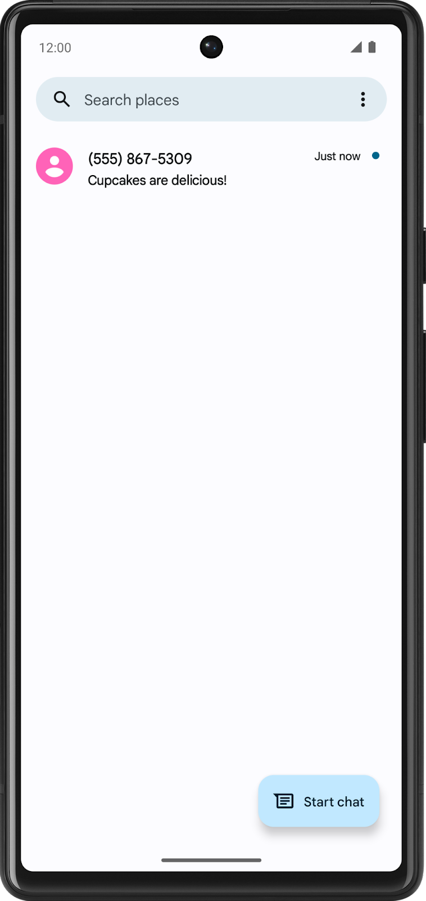

ここでも、正解は 1 つではありません。テキスト メッセージ アプリでは、変数を次のデータに使用できます。

- 送信者の**電話番号**（`String`）
- メッセージの**タイムスタンプ**（`String`）
- メッセージの内容の**プレビュー**（`String`）
- テキスト メッセージが**未読**かどうか（`Boolean`）

#### **試してみる**

1. スマートフォンでお気に入りのアプリを開きます。
2. アプリの特定の画面上で、変数が使用されていると思われる場所を特定します。
3. それらの変数のデータ型を推測します。
4. そのアプリの[スクリーンショット](https://support.google.com/pixelphone/answer/2811098)と、変数が使用されていると思われる場所の説明を添えて、ソーシャル メディアで回答を共有しましょう。その際にはハッシュタグ #AndroidBasics を使用してください。

ここまで、変数とデータ型の基本について学びました。次のセクションでは、コード内での変数とデータ型の使用方法について詳しく説明します。

### 3. 変数を定義して使用する

#### 変数の定義と使用

変数を使用するには、まずコードで変数を定義する必要があります。これは、前回のレッスンで学んだ、関数を呼び出す前に関数を定義する作業と似ています。

変数を定義するときは、変数を一意に識別するために名前を付けます。また、データ型を指定して格納するデータの種類を決定します。最後に、変数に格納する初期値を指定できますが、これは必須ではありません。

> **注:** 「変数を宣言する」という表現もありますが、「宣言」と「定義」は同義語であり、どちらを使用しても意味に違いはありません。また、「変数定義」や「変数宣言」という用語もあります。これらは変数を定義するコードを指します。言語ごとに宣言と定義の意味が異なります。

変数を定義したら、プログラム内でその変数を使用できるようになります。変数を使用するには、コード内に変数名を記述します。これにより、コード内のその時点における変数値を使用することが Kotlin コンパイラに伝えられます。

たとえば、ユーザーの受信トレイにある未読メッセージの件数の変数を定義するとします。この変数の名前を `count` とします。変数内に `2` などの値を保存することで、ユーザーの受信トレイ内に `2` 件の未読メッセージがあることを表現できます（変数には別の数値を格納することもできますが、この例では数値 `2` を使用します）。

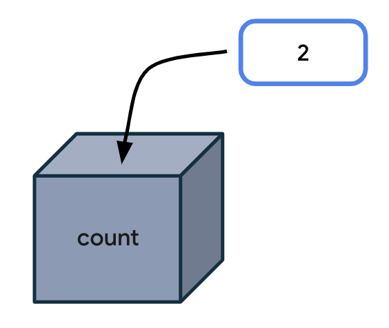

コードで未読メッセージの件数にアクセスする必要がある場合は、そのたびにコードに「`count`」と入力します。命令を実行すると、Kotlin コンパイラはコード内の変数名を確認し、その場所に変数値を使用します。

このプロセスを説明するための、より具体的な専門用語があります。

式は、値に評価される小さなコード単位です。式は、変数や関数呼び出しなどで構成できます。次のケースでは、式は `count` 変数という 1 つの変数で構成されています。この式は `2` と評価されます。

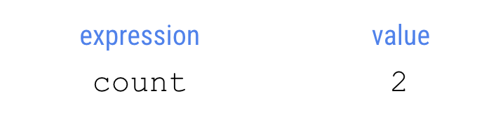

評価とは、式の値を決定することを意味します。この場合、式は `2` と評価されます。コンパイラは、コード内の式を評価し、プログラムで命令を実行するときにその値を使用します。

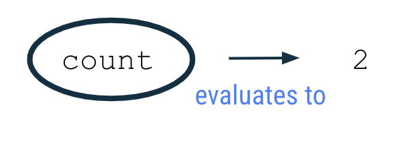

次のセクションでは、Kotlin プレイグラウンドでプログラムを実行して、実際の動作を確認します。

#### **例**

1. ウェブブラウザで [Kotlin プレイグラウンド](https://developer.android.com/training/kotlinplayground)を開きます。
2. Kotlin プレイグラウンドの既存のコードを、次のプログラムに置き換えます。

このプログラムは、初期値が `2` の `count` という変数を作成し、`count` 変数の値を出力して使用します。ここでは、コード構文をすべて理解していなくても問題ありません。その部分については後のセクションで詳しく説明します。

```kotlin
fun main() {
    val count: Int = 2
    println(count)
}
```

3. プログラムを実行します。出力は次のようになります。

```
2
```

#### **変数の宣言**

実行したプログラムのコードの 2 行目には、次のように記述されています。

```kotlin
val count: Int = 2
```

このステートメントにより、数値 `2` を保持する `count` という整数変数が作成されます。


Kotlin で変数を宣言する構文（または形式）に慣れるまでには、時間がかかることがあります。次の図は、変数の詳細を配置する場所と、スペースと記号の位置を示しています。

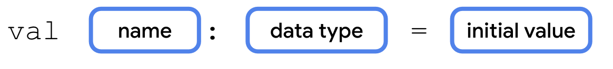

`count` 変数の例では、変数宣言が `val` という単語で始まっていることがわかります。変数名は `count` です。データ型は `Int` で、初期値は `2` です。

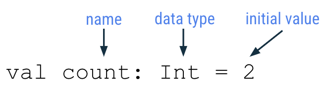

変数宣言の各部分について、以下で詳しく説明します。

##### 新しい変数を定義するキーワード

新しい変数を定義するには、まず Kotlin キーワード `val`（value（値）の略）を記述します。これにより、Kotlin コンパイラはこのステートメント内に変数宣言があることを認識します。

##### **変数名**

関数と同様、変数にも名前を付けます。変数宣言内で、`val` キーワードの後に変数名を指定します。


変数名は自由に設定できます。ただし、Kotlin [キーワード](https://kotlinlang.org/docs/keyword-reference.html)を変数名として使用することはおすすめしません。

コードを読みやすくするため、変数が保持するデータを表す名前を選択することをおすすめします。

関数名と同じように、変数名はキャメルケースの命名規則に従って付ける必要があります。変数名の最初の単語はすべて小文字にします。名前に複数の単語が含まれる場合、単語の間にスペースを入れず、その他の単語はすべて大文字で始める必要があります。

変数名の例:

- `numberOfEmails`
- `cityName`
- `bookPublicationDate`

前述のコード例では、`count` が変数名です。

```kotlin
val count: Int = 2
```

##### **変数のデータ型**

変数名の後に、コロン、スペース、および変数のデータ型を追加します。前述のとおり、Kotlin の基本的なデータ型には `String`、`Int`、`Double`、`Float,`、`Boolean` などがあります。データ型の詳細については、このコースで後ほど説明します。データ型は、ここに示したとおりに正確なスペルで入力し、それぞれ大文字で始めます。


`count` 変数の例では、`Int` が変数のデータ型です。

```kotlin
val count: Int = 2
```

##### **代入演算子**

変数宣言では、等号（`=`）をデータ型の後に記述します。この等号は代入演算子と呼ばれます。代入演算子によって、値が変数に代入されます。つまり、等号の右側にある値が、等号の左側にある変数に格納されます。

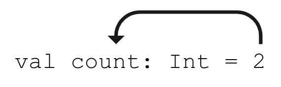

##### **変数の初期値**

変数の値とは、変数に格納されている実際のデータのことです。


`count` 変数の例では、数値 `2` が変数の初期値です。

```kotlin
val count: Int = 2
```

これを「`count` 変数が `2` に初期化される」と表現することもあります。これは、変数が宣言されたときに、変数に格納される最初の値が `2` であることを意味します。

初期値は、変数に対して宣言されたデータ型によって異なります。

このレッスンの前半で確認した以下の表をもう一度見てみましょう。3 列目は、各型の変数に格納できる値の例を示しています。これらの値は、固定値または定数値（常に同じ値）であるため、リテラルと呼ばれます。たとえば、整数 32 の値は常に 32 となります。一方、変数は値が変更される可能性があるため、リテラルではありません。こうしたリテラル値は、文字列リテラル、整数リテラル、ブール値リテラルなど、型に基づいて区別される場合もあります。

| **Kotlin のデータ型** | **格納できるデータの種類** | **リテラル値の例** |
|---|---|---|
| `String` | テキスト | `"Add contact"`   `"Search"`   `"Sign in"` |
| `Int` | 整数 | `32`   `1293490`   `-59281` |
| `Double` | 小数 | `2.0`   `501.0292`   `-31723.99999` |
| `Float` | 小数（`Double` より精度が低くなります）。番号の末尾に `f` または `F` が含まれています。 | `5.0f`   `-1630.209f`   `1.2940278F` |
| `Boolean` | `true` または `false`。取り得る値が 2 つしかない場合は、このデータ型を使用します。`true` と `false` は、Kotlin のキーワードです。 | `true`   `false` |

変数のデータ型に応じて、適切で有効な値を指定することが重要です。たとえば、Kotlin コンパイラでエラーとなるため、`Int` 型の変数内に `"Hello"` のような文字列リテラルを格納することはできません。

#### **変数を使用する**

Kotlin Playground で実行した元のプログラムは以下のようなものでした。コードの 2 行目で、`2` の値を持つ `count` という新しい整数変数が作成されることを学習しました。

```kotlin
fun main() {
    val count: Int = 2
    println(count)
}
```

次に、コードの 3 行目を見てみましょう。このコードでは、`count` 変数を出力します。

```kotlin
println(count)
```

`count` という単語が引用符で囲まれていないことに注意してください。これは文字列リテラルではなく、変数名です（文字列リテラルは単語が引用符で囲まれています）。プログラムを実行すると、Kotlin コンパイラは丸かっこ内の式（`count`）を `println()` 命令に対して評価します。式は `2` と評価されるため、入力として `2` を使用して `println()` メソッドが呼び出されます（`println(2)`）。

したがって、プログラムの出力は次のようになります。

```
2
```

出力に含まれる数値自体はそれほど有用ではありません。出力に詳細なメッセージを表示して、`2` が何を表しているかを理解できるようにすると便利です。

##### 文字列テンプレート

以下のようにすることで、出力に表示されるメッセージの有用性が高まります。

```
You have 2 unread messages.
```

より有用性の高いメッセージを出力する手順は次のとおりです。

1. 次のコードを使用して、Kotlin プレイグラウンドのプログラムを更新します。`println()` 呼び出しでは、`count` 変数名を含む文字列リテラルを渡します。テキストは引用符で囲んでください。これを実行しても期待どおりの結果は得られませんが、その問題は後で修正します。

```kotlin
fun main() {
    val count: Int = 2
    println("You have count unread messages.")
}
```

2. プログラムを実行すると、次のような出力が表示されます。

```
You have count unread messages.
```

これは文として意味をなしていません。変数名ではなく、`count` 変数の値をメッセージに表示する必要があります。

3. 出力を修正するには、文字列のテンプレートが必要です。ドル記号（`$`）とその後の変数名からなるテンプレート式が含まれているため、これは文字列のテンプレートです。テンプレート式が評価され、式の値は文字列に置き換えられます。


`count` 変数の前にドル記号 `$` を追加します。この場合、テンプレート式 `$count` は `2` と評価され、式が置かれている文字列で `2` に置き換えられます。

```kotlin
fun main() {
    val count: Int = 2
    println("You have $count unread messages.")
}
```

4. プログラムを実行すると、意図したとおりの出力が表示されます。

```
You have 2 unread messages.
```

これで、ユーザーにとってはるかにわかりやすい文を生成できました。

5. 次に、`count` 変数の初期値を別の整数リテラルに変更します。たとえば、数値 `10` を指定して、プログラムの他の部分はそのままにします。

```kotlin
fun main() {
    val count: Int = 10
    println("You have $count unread messages.")
}
```

6. プログラムを実行します。出力は適宜変更されるため、プログラムで `println()` ステートメントを変更する必要はありません。

```
You have 10 unread messages.
```

文字列テンプレートがいかに便利であるか理解できたと思います。ここでは、コードに文字列テンプレートを 1 回だけ記述しました（`"You have $count unread messages."`）。`count` 変数の初期値を変更しても `println()` ステートメントが引き続き機能するようになったため、コードの柔軟性が向上しました。

この点をさらに強調するために、以下の 2 つのプログラムを比較してみましょう。1 つ目のプログラムでは、文字列リテラルを使用し、文字列の中に未読メッセージの正確な数を直接指定しています。このプログラムは、ユーザーの未読メッセージが 10 件の場合にのみ機能します。

```kotlin
fun main() {
    println("You have 10 unread messages.")
}
```

2 つ目のプログラムでは、変数と文字列テンプレートを使用してコードをより多くのシナリオに適応させることができるため、プログラムの柔軟性が向上します。

```kotlin
fun main() {
    val count: Int = 10
    println("You have $count unread messages.")
}
```

#### **型推論**

以下に、変数を宣言する際に記述するコードを削減するためのヒントをご紹介します。

型推論とは、コード内で型を明示的に記述しなくても、Kotlin コンパイラが変数のデータ型を推論（または判断）できる機能のことです。つまり、変数の初期値を指定すれば、変数宣言のデータ型を省略できるということです。Kotlin コンパイラは初期値のデータ型を調べ、変数にその型のデータが格納されると想定します。

型推論を使用した変数宣言の構文は次のとおりです。

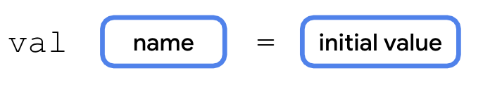

`count` の例に戻ると、プログラムにはもともと次のコード行が含まれていました。

```kotlin
val count: Int = 2
```

しかし、このコード行は次のように、コロン記号（`:`）と `Int` データ型を省略して記述することもできます。更新された構文では、入力する単語が少なく、`2` の値で `count` という `Int` 変数を作成した場合と同じ結果が得られます。

```kotlin
val count = 2
```

Kotlin コンパイラは、`2`（整数）を変数 `count` に格納するという意図を読み取り、`count` 変数の型が `Int` であると推論します。これは Kotlin コードを簡潔に記述する方法の一例です。

> **注:** 変数を宣言するときに初期値を指定しない場合は、型を指定する必要があります。
> 
> 次のコード行では初期値が指定されていないため、データ型を指定する必要があります。
> 
> `val count: Int`
> 
> 次のコード行では値が代入されているため、データ型を省略できます。
> 
> `val count = 2`

この例では、`Int` 型の変数についてのみ説明しましたが、型推論のコンセプトは Kotlin のすべてのデータ型に適用されます。

#### **整数の基本的な数学演算**

値が `2` の `Int` 変数と、値が `"2"` の `String` 変数の違いは何でしょうか。どちらも出力されると同じように見えます。

整数を（`String` ではなく）`Int` として格納することの利点は、`Int` 変数で数学演算（加算、減算、除算、乗算など）を実行できることです（その他の数学演算については[演算子](https://kotlinlang.org/docs/keyword-reference.html#operators-and-special-symbols)をご覧ください）。たとえば、2 つの整数変数を加算して合計を取得できます。整数を String として格納するほうが合理的な場合もありますが、このセクションの目的は、`Int` 変数を使ってできることを紹介することです。

1. Kotlin プレイグラウンドに戻り、コードエディタ内のすべてのコードを削除します。
2. 新しいプログラムを作成して、受信トレイ内の未読メール数を表す整数変数を定義し、`5` などの値に初期化します。別の数を選択することもできます。受信トレイ内の既読メール数を示す 2 つ目の整数変数を定義します。`100` などの値に初期化します。別の数を選択することもできます。2 つの整数を足して、受信トレイ内のメールの合計数を出力します。

```kotlin
fun main() {
    val unreadCount = 5
    val readCount = 100
    println("You have ${unreadCount + readCount} total messages in your inbox.")
}
```

3. プログラムを実行すると、受信トレイ内のメールの合計数が表示されます。

```
You have 105 total messages in your inbox.
```

文字列テンプレートの場合、1 つの変数名の前に `$` 記号を追加できることを学びました。式が複雑な場合は、式を中かっこで囲み、その前に `$` 記号を付けます（`${unreadCount + readCount}`）。中かっこ内の式（`unreadCount + readCount`）は `105` と評価されます。次に文字列内で、値 `105` に置き換えられます。

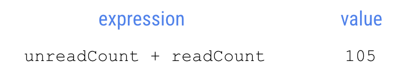

> **警告:** テンプレート式を中かっこで囲まないと、期待した結果は得られません。これを Kotlin プレイグラウンドでテストするには、`println()` ステートメントを `println("You have $unreadCount + readCount total messages in your inbox.")` に変更して出力を確認します。

4. このトピックの理解をさらに深めるために、名前と初期値が異なる複数の変数を作成し、テンプレート式を使用してメッセージを出力します。

たとえば、次の出力が表示されるようにプログラムを変更します。

```
100 photos
10 photos deleted
90 photos left
```

ここではプログラムを記述する方法の 1 つを紹介しましたが、記述方法は他にもあります。

```kotlin
fun main() {
    val numberOfPhotos = 100
    val photosDeleted = 10
    println("$numberOfPhotos photos")
    println("$photosDeleted photos deleted")
    println("${numberOfPhotos - photosDeleted} photos left")
}
```

### 4. 変数を更新する

アプリの実行中に、変数の値の更新が必要になる場合があります。たとえば、ショッピング アプリでは、ユーザーがショッピング カートにアイテムを追加すると、カートの合計額が増えます。

ショッピングのユースケースを簡略化して、シンプルなプログラムを作成しましょう。以下のロジックは、Kotlin ではなく人間の言語で書かれています。コードの記述方法の要点を説明することから、これは疑似コードと呼ばれますが、コードの詳細がすべて含まれているわけではありません。

> **注:** 擬似コードはコンパイルして実行できるコードではありません。擬似コードという名称はそのことに由来しています。

プログラムの主な機能は次のとおりです。

- 値 `0` で始まる `cartTotal` 整数変数を作成します。
- ユーザーがショッピング カートに 20 ドルのセーターを追加します。
- `cartTotal` 変数を、ショッピング カート内の商品の現在の金額である `20` に更新します。
- カート内の商品の合計額（`cartTotal` 変数）を出力します。

コードをさらに簡素化するため、ここではユーザーがショッピング カートに商品を追加した場合のコードは記述しません（プログラムがユーザー入力にどのように応答するかについては、後のユニットで学習します）。そのため、`cartTotal` 変数を作成、更新、出力する部分に焦点を当てます。

1. Kotlin プレイグラウンドの既存のコードを、以下のプログラムに置き換えます。プログラムの 2 行目で、`cartTotal` 変数を値 `0` に初期化します。初期値を指定することで型推論が行われるため、`Int` データ型を指定する必要はありません。プログラムの 3 行目で、代入演算子（`=`）を使用して `cartTotal` 変数を `20` に更新します。プログラムの 4 行目で、文字列テンプレートを使用して `cartTotal` 変数を出力します。

```kotlin
fun main() {
    val cartTotal = 0
    cartTotal = 20
    println("Total: $cartTotal")
}
```

2. プログラムを実行すると、コンパイル エラーが発生します。
3. エラーの内容は、「`val` には再代入できない」というものです。このエラーの原因はプログラムの 3 行目にあります。ここで `cartTotal` 変数を `20.` に変更しようとしましたが、`val` `cartTotal` には初期値（`0`）が代入されているため、別の値（`20`）を再代入することはできません。

```
Val cannot be reassigned
```

変数の値を更新する必要がある場合は、Kotlin キーワード `var`（`val` ではなく）を使用して変数を宣言します。

- `val` キーワード - 変数の値を変更しない場合に使用します。
- `var` キーワード - 変数の値を変更する可能性がある場合に使用します。

`val` の場合、変数は読み取り専用であるため、変数の値を読み取るか、値にアクセスすることしかできません。一度値を設定した後で、その値の編集や変更を行うことはできません。`var` の場合、変数は可変です。つまり、値を変更できるということです。

`val` は固定値、`var` は変数と考えると、違いを覚えやすくなります。Kotlin では、可能であれば `var` キーワードではなく `val` キーワードを使用することをおすすめします。

4. プログラムの 2 行目にある `cartTotal` の変数宣言を更新し、`val` の代わりに `var` を使用するようにします。コードは次のようになります。

```kotlin
fun main() {
    var cartTotal = 0
    cartTotal = 20
    println("Total: $cartTotal")
}
```

5. プログラムの 3 行目のコードの構文に注意してください。ここで変数を更新します。

```kotlin
cartTotal = 20
```

既存の変数（`cartTotal`）に新しい値（`20`）を代入するには、代入演算子（`=`）を使用します。変数はすでに定義されているため、`var` キーワードを再度使用する必要はありません。

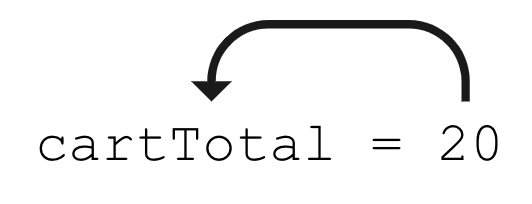

箱の例えを使って、`cartTotal` というラベルが付いた箱に値 `20` が格納されている状態をイメージします。

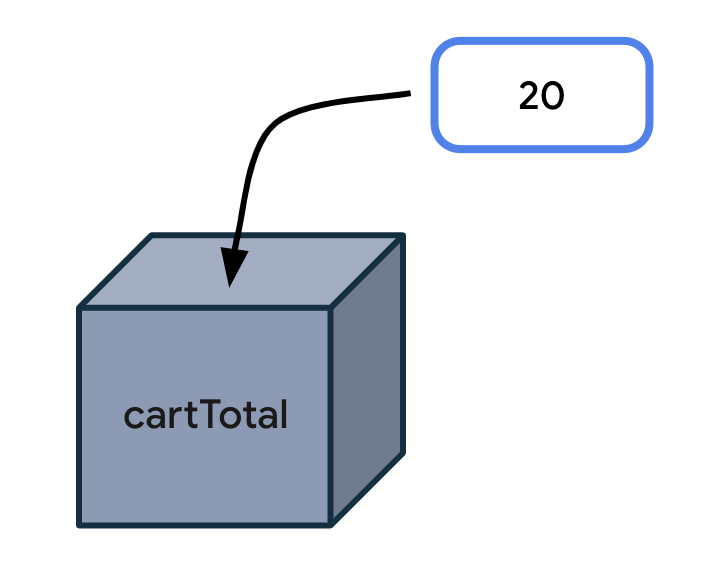

次の図は、変数を更新するための一般的な構文を示したものです。この変数は、コードの前の行ですでに宣言されています。更新する変数の名前でステートメントを開始します。それに続けて、スペース、等号、スペースの順で追加します。その後で、更新後の変数の値を記述します。

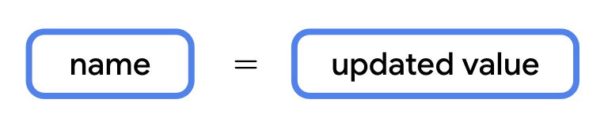

6. プログラムを実行すると、コードが正常にコンパイルされます。出力は次のようになります。

```
Total: 20
```

7. プログラムの実行中に変数の値がどのように変化するかを確認するには、最初に `cartTotal` 変数を宣言し、その後でこの変数を出力します。変更後のコードは以下のようになります。3 行目に新しい `println()` ステートメントが追加されました。また、コードの 4 行目にも空白行が追加されています。空白行は、コンパイラによるコードの理解には影響しません。関連するコードブロックごとに区切ることでコードが読みやすくなる場合には、空白行を追加します。

```kotlin
fun main() {
    var cartTotal = 0
    println("Total: $cartTotal")

    cartTotal = 20
    println("Total: $cartTotal")
}
```

8. プログラムを再度実行すると、出力は次のようになります。

```kotlin
Total: 0
Total: 20
```

最初はショッピング カートの合計額が `0` となり、その後 `20` に更新されています。これで、変数を正常に更新できました。`cartTotal` を読み取り専用変数（`val` を使用）から可変変数（`var` を使用）に変更したことで、この更新が可能になりました。

値の変更を想定している場合のみ、`var` を使用して変数を宣言してください。それ以外の場合は、デフォルトで `val` を使用して変数を宣言する必要があります。これにより、コードの安全性が高まります。`val` を使用することで、プログラム内で想定していない変数が更新されることを防止できます。`val` に値が代入された後は、常にその値が維持されます。

> **注:** val は読み取り専用変数であるため、他のプログラミング言語に慣れている方は、`val` の宣言を定数値の宣言のようなものと考えることができます。Kotlin では上記以外にも定数を宣言する際に従うべき規則がありますが、それらはこのレッスンの範囲外となります。詳細については、スタイルガイドの[定数](https://developer.android.com/kotlin/style-guide#constant_names)セクションをご覧ください。

#### **インクリメント演算子とデクリメント演算子**

変数の値を更新するには、変数を `var` として宣言する必要があることを学びました。この知識を、先ほど使用したメール メッセージの例に適用してみましょう。

1. Kotlin プレイグラウンドのコードを次のプログラムで置き換えます。

```kotlin
fun main() {
    val count: Int = 10
    println("You have $count unread messages.")
}
```

2. プログラムを実行します。次のように出力されます。

```
You have 10 unread messages.
```

3. `val` キーワードを `var` キーワードに置き換えて、`count` 変数を可変変数にします。このプログラムを実行しても、出力が変更されることはありません。

```kotlin
fun main() {
    var count: Int = 10
    println("You have $count unread messages.")
}
```

4. ただし、これで `count` を別の値に更新できるようになりました。たとえば、ユーザーの受信トレイに 1 通の新着メールが届いたら、`count` を 1 つ増やすことができます（メールの受信を表すコードを記述する必要はありません。インターネットからのデータの取得は、さらに後のユニットで学習する高度なトピックです）。現時点では、次のコード行で `1` ずつ増加する `count` 変数に注目してください。

```kotlin
count = count + 1
```

等号の右側の式は `count + 1` で、`11` と評価されます。これは、`count` の現在の値が `10`（プログラムの 2 行目）であり、`10 + 1` が `11` となるためです。その後、代入演算子を使用して、値 `11` が `count` 変数に代入（格納）されます。

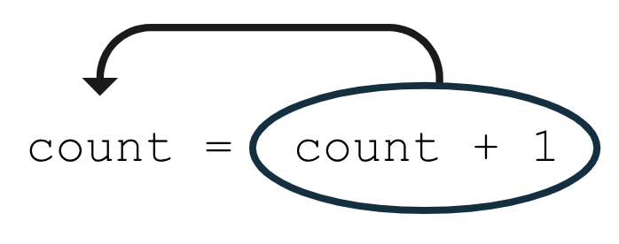

このコード行を、プログラムの `main()` 関数の一番下に追加します。コードは次のようになります。

```kotlin
fun main() {
    var count = 10
    println("You have $count unread messages.")
    count = count + 1
}
```

`count` 変数の更新後、この変数を使用するコードを追加していないため、このプログラムを実行しても出力は前と同じになります。

5. 変数の更新後に未読メッセージの数を出力する print ステートメントを追加します。

```kotlin
fun main() {
    var count = 10
    println("You have $count unread messages.")
    count = count + 1
    println("You have $count unread messages.")
}
```

6. プログラムを実行します。2 番目のメッセージで `count` が更新され、メッセージ数が `11` 件と表示されます。

```
You have 10 unread messages.
You have 11 unread messages.
```

7. 変数を `1` だけ増やしたい場合、インクリメント演算子（`++`）を使用することでコードを簡略化できます。インクリメント演算子は、2 つのプラス記号で構成されています。これらの記号を変数名の直後に使用することで、その変数の現在の値に 1 を加算したうえで新しい値を変数に格納するようコンパイラに指示できます。次の 2 行のコードは等価ですが、インクリメント演算子（`++`）を使用したほうが入力の手間が少なくなります。

```kotlin
count = count + 1
```

```kotlin
count++
```

コードにこの変更を加えてから、プログラムを実行します。変数名とインクリメント演算子の間にはスペースを入れないでください。

```kotlin
fun main() {
    var count = 10
    println("You have $count unread messages.")
    count++
    println("You have $count unread messages.")
}
```

8. プログラムを実行します。出力結果は同じですが、これで新しい演算子について学習できました。

```
You have 10 unread messages.
You have 11 unread messages.
```

9. 次に、プログラムの 4 行目を変更して、`count` 変数名の後にデクリメント*演算子*（`--`）を追加します。デクリメント演算子は、2 つのマイナス記号で構成されています。デクリメント演算子を変数名の後に配置することで、変数の値を `1` だけ減算したうえで新しい値を変数に格納するようコンパイラに指示できます。

```kotlin
fun main() {
    var count = 10
    println("You have $count unread messages.")
    count--
    println("You have $count unread messages.")
}
```

10. プログラムを実行します。次のように出力されます。

```
You have 10 unread messages.
You have 9 unread messages.
```

このセクションでは、インクリメント演算子（`++`）とデクリメント演算子（`--`）を使用して可変変数を更新する方法を学習しました。具体的には、`count++` と `count = count + 1`、`count--` と `count = count - 1` がそれぞれ等価であることを確認しました。

### 5. 他のデータ型

レッスンの前半では基本的なデータ型（`String`、`Int`、`Double`、`Boolean`）の概要を学び、直前には `Int` データ型を実際に使用しました。次に、他のデータ型について学習します。

| **Kotlin のデータ型** | **格納できるデータの種類** |
|---|---|
| `String` | テキスト |
| `Int` | 整数 |
| `Double` | 小数 |
| `Boolean` | `true` または `false`（取り得る値は 2 つのみ） |

Kotlin プレイグラウンドでこれらのプログラムを試して、出力を確認します。

#### Double

小数値を格納できる変数が必要な場合は、`Double` 変数を使用します。有効な範囲については、[こちらの表](https://kotlinlang.org/docs/numbers.html#floating-point-types)で格納できる 10 進数字をご覧ください。

> **注:** `Double` データ型の名前は、単精度の `Float` データ型と比較して 2 倍の精度を持つことに由来します。精度とは、格納できる 10 進数字の桁数のことです。したがって、`Double` 変数にはより精度の高い値を格納できます。`Double` と `Float` の具体的な違いについては、[こちらの表](https://kotlinlang.org/docs/numbers.html#floating-point-types)をご覧ください。レッスンのこのセクションでは、小数を扱うために `Double` を使用することに重点を置きます。

目的地に移動する際に、途中で 2 か所に立ち寄るため、行程が 3 つの部分に分かれるとします。このプログラムでは、目的地に到着するまでの残りの距離の合計を表示します。

1. Kotlin プレイグラウンドに次のコードを入力します。コードの各行で何が行われているか理解できるでしょうか。

```kotlin
fun main() {
    val trip1: Double = 3.20
    val trip2: Double = 4.10
    val trip3: Double = 1.72
    val totalTripLength: Double = 0.0
    println("$totalTripLength miles left to destination")
}
```

行程の各部分の距離を表すために、`trip1`、`trip2`、`trip3` という 3 つの変数を宣言しています。これらの変数には小数値が格納されるため、すべて `Double` 変数としています。変数の値はプログラムの過程で変化しないため、`val` を使用して各変数を宣言しています。このプログラムでは `totalTripLength` という 4 つ目の変数も作成し、現在 `0.0` に初期化しています。プログラム最終行では、`totalTripLength` 変数の値を含むメッセージを出力します。

2. `totalTripLength` 変数が 3 つの行程の長さの合計となるようにコードを修正します。

```kotlin
val totalTripLength: Double = trip1 + trip2 + trip3
```

`3.20 + 4.10 + 1.72` は `9.02` になるため、等号の右側の式は `9.02` と評価されます。`9.02` の値は `totalTripLength` 変数に格納されます。

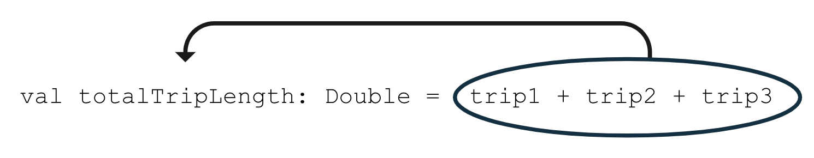

プログラム全体のコードは次のようになります。

```kotlin
fun main() {
    val trip1: Double = 3.20
    val trip2: Double = 4.10
    val trip3: Double = 1.72
    val totalTripLength: Double = trip1 + trip2 + trip3
    println("$totalTripLength miles left to destination")
}
```

3. プログラムを実行します。次のように出力されます。

```
9.02 miles left to destination
```

4. 型推論が行われるため、変数宣言から不要な `Double` データ型を削除するようコードを更新します。Kotlin コンパイラは、初期値として提供される小数に基づいて、これらの変数が `Double` データ型であると推論できます。

```kotlin
fun main() {
    val trip1 = 3.20
    val trip2 = 4.10
    val trip3 = 1.72
    val totalTripLength = trip1 + trip2 + trip3
    println("$totalTripLength miles left to destination")
}
```

5. コードを再度実行し、コードが引き続きコンパイルされることを確認します。出力は同じになりますが、これでコードが簡素化されました。

#### **String**

テキストを格納できる変数が必要な場合は、`String` 変数を使用します。String のリテラル値は `"Hello Kotlin"` のように引用符で囲みますが、`Int` および `Double` のリテラル値は引用符で囲みません。

1. このプログラムをコピーして、Kotlin プレイグラウンドに貼り付けます。

```kotlin
fun main() {
    val nextMeeting = "Next meeting:"
    val date = "January 1"
    val reminder = nextMeeting + date
    println(reminder)
}
```

`nextMeeting` 変数と `date` 変数という 2 つの `String` 変数が宣言され、その後で `reminder` という 3 つ目の `String` 変数が宣言されています。これは、`nextMeeting` 変数と `date` 変数をつなぐように設定されています。

このように + 記号を使用して 2 つの文字列を結合することを、「連結」と呼びます。次の図に示すように、式 `nextMeeting + date` の結果は `"Next meeting:January 1"` となります。


値 `"Next meeting:January 1"` は、プログラムの 4 行目にある代入演算子を使用して `reminder` 変数に格納されます。

2. プログラムを実行すると、次のように出力されます。

```
Next meeting:January 1
```

2 つの文字列を連結する場合、文字列の間にスペースは追加されません。出力される文字列のコロンの後にスペースを入れる場合は、いずれかの文字列にスペースを追加する必要があります。

3. `nextMeeting` 変数を更新して、文字列の末尾の閉じ引用符の前にスペースを追加します（または、`date` 変数の先頭にスペースを追加することもできます）。プログラムは次のようになります。

```kotlin
fun main() {
    val nextMeeting = "Next meeting: "
    val date = "January 1"
    val reminder = nextMeeting + date
    println(reminder)
}
```

4. プログラムをもう一度実行すると、出力メッセージのコロンの後にスペースが表示されます。

```
Next meeting: January 1
```

5. コードを変更して、`reminder` 変数に格納される式に別のテキストを連結（追加）します。

`+` 記号を使用して、`reminder` 文字列の末尾に文字列リテラル `" at work"` を追加します。

6. プログラムを実行します。

次のように出力されます。

```
Next meeting: January 1 at work
```

次のコードは、この動作を実装する方法の一つを示しています。

```kotlin
fun main() {
    val nextMeeting = "Next meeting: "
    val date = "January 1"
    val reminder = nextMeeting + date + " at work"
    println(reminder)
}
```

`nextMeeting` と `date` は既存の文字列変数の名前であるため、引用符で囲みません（それぞれの値はテキストなので引用符で囲みます）。逆に、リテラル `" at work"` は事前に変数で定義されていないため、他の文字列に連結する文字列であることをコンパイラが認識できるように、このテキストを引用符で囲みます。

技術的には、個別の変数を使用する代わりに、全文を表す 1 つの `String` 変数を宣言することによって、同じ内容を出力できます。ただし、この演習の目的は、`String` 変数を宣言および操作する方法、特に別々の文字列を連結する方法を示すことです。

7. 文字列を含むコードには、エスケープ シーケンスが使用されていることがあります。エスケープ シーケンスとは、バックスラッシュ記号（`\`）で始まる文字のことです。バックスラッシュはエスケープ バックスラッシュとも呼ばれます。

次の例では、文字列リテラル内に `\"` が使用されています。このコードをコピーして Kotlin プレイグラウンドに貼り付けます。

```kotlin
fun main() {
    println("Say \"hello\"")
}
```

前に、文字列リテラルを二重引用符で囲むことを学びました。しかし、文字列に `"` 記号を使用したい場合はどうすればよいでしょうか。その場合は、文字列内で二重引用符の前にバックスラッシュ記号を追加して、`\"` とする必要があります。さらに、文字列全体を二重引用符で囲むことを忘れないでください。

8. プログラムを実行して出力を表示します。出力は次のようになります。

```
Say "hello"
```

`println()` ステートメント内で `hello` の前後に `\"` を追加したため、出力では、`hello` が引用符で囲まれます。

Kotlin でサポートされているその他のエスケープ シーケンスについては、[エスケープ シーケンス](https://kotlinlang.org/docs/characters.html)に関するドキュメント ページをご覧ください。たとえば、文字列に改行を入れる場合は、`\n` のように、文字 n の前に `\` 記号を使用します。

これで、文字列の連結と、文字列内のエスケープ シーケンスについて学習しました。次に、このレッスンで扱う最後のデータ型に進みます。

#### **ブール値**

`Boolean` データ型は、変数が `true` または `false` で表される 2 つの値しか持たない場合に便利です。

たとえば、デバイスの機内モードのオン / オフ、アプリの通知の有効 / 無効などを表す変数があります。

1. Kotlin プレイグラウンドに次のコードを入力します。プログラムの 2 行目で、`notificationsEnabled` という `Boolean` 変数を宣言して `true` に初期化します。技術的には、宣言の `: Boolean` は省略できるため、削除しても構いません。プログラムの 3 行目で、`notificationsEnabled` 変数の値を出力します。

```kotlin
fun main() {
    val notificationsEnabled: Boolean = true
    println(notificationsEnabled)
}
```

プログラムを実行すると、次のように出力されます。

```
true
```

2. プログラムの 2 行目で、`Boolean` の初期値を false に変更します。

```kotlin
fun main() {
    val notificationsEnabled: Boolean = false
    println(notificationsEnabled)
}
```

プログラムを実行すると、次のように出力されます。

```
false
```

3. 他のデータ型を `Strings` に連結することもできます。たとえば、`Booleans` を `Strings` に連結できます。`+` 記号を使用して、`notificationsEnabled` ブール変数の値を `"Are notifications enabled? "` 文字列の末尾に連結（追加）します。

```kotlin
fun main() {
    val notificationsEnabled: Boolean = false
    println("Are notifications enabled? " + notificationsEnabled)
}
```

プログラムを実行して、連結の結果を確認します。プログラムの出力は次のようになります。

```
Are notifications enabled? false
```

このように、`Boolean` 変数の値は `true` または `false` に設定できます。`Boolean` 変数を使用すると、`Boolean` 変数の値が `true` の場合は一連の命令を実行し、`Boolean` の値が false の場合はそれらの命令をスキップするシナリオをコーディングすることも可能になります。`Booleans` については今後のレッスンで詳しく説明します。

### 6. コーディング規則

前のレッスンでは、Google が推奨し、他のプロのデベロッパーも従っている一貫した方法で Android コードを記述するための Kotlin スタイルガイドを紹介しました。

学習した新しいトピックに関連して、次のような形式やコーディング規則にも従う必要があります。

- 変数名はキャメルケースで記述し、先頭は小文字にします。
- 変数宣言でデータ型を指定する際には、コロンの後にスペースを入れます。

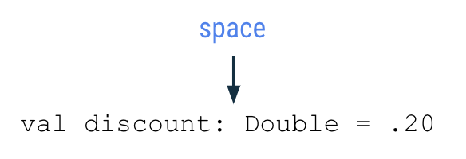

- 代入（`=`）、加算（`+`）、減算（`-`）、乗算（`*`）、除算（`/`）などの演算子の前後にはスペースが必要です。

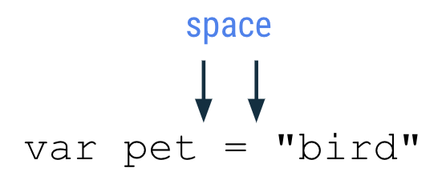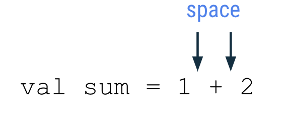

- 複雑なプログラムを記述する場合は、[1 行あたり 100 文字](https://developer.android.com/kotlin/style-guide#line_wrapping)を上限とすることが推奨されています。これにより、横方向にスクロールしなくても、プログラム内のすべてのコードをパソコンの画面で簡単に読むことができます。

### 7. コードでのコメント

コーディングの際には、コードの目的を説明するコメントを追加することもおすすめします。これにより、他の人がコードを簡単に理解できるようになります。スラッシュ記号を 2 つ（`//`）記述すると、その行のそれ以降のテキストはコメントと見なされ、コードとして解釈されないようになります。通常は、2 つのスラッシュ記号の後にスペースを追加します。

```kotlin
// This is a comment.
```

コメントはコード行の途中から開始することもできます。次の例では、`height = 1` は通常のコーディング ステートメントです。`// Assume the height is 1 to start with` はコメントとして解釈され、コードの一部とは見なされません。

```kotlin
height = 1 // Assume the height is 1 to start with
```

1 行につき 100 文字を超える長いコメントでコードを詳細に説明する場合は、複数行コメントを使用します。複数行コメントを開始するには、スラッシュ（`/`）とアスタリスク記号（`*`）を使って `/*` と記述します。コメントの各行の先頭にアスタリスクを追加し、コメントの最後にアスタリスクとスラッシュ記号（`*/`）を記述します。

```kotlin
/*
 * This is a very long comment that can
 * take up multiple lines.
 */
```

次のプログラムには、コードの内容を説明する単一行コメントと複数行コメントが含まれています。

```kotlin
/*
 * This program displays the number of messages
 * in the user's inbox.
 */
fun main() {
    // Create a variable for the number of unread messages.
    var count = 10
    println("You have $count unread messages.")

    // Decrease the number of messages by 1.
    count--
    println("You have $count unread messages.")
}
```

前述のように、コードに空の行を追加して、関連するステートメントをグループ化し、コードを読みやすくすることができます。

1. 以前に使用したコード スニペットにコメントを追加します。
2. プログラムを実行して、コメントが出力に影響せず、動作が変更されていないことを確認します。

### 8. まとめ

お疲れさまでした。このレッスンでは、Kotlin の変数の概要、変数がプログラミングで役立つ理由、変数を作成、更新、使用する方法について学習しました。また、`Int`、`Double`、`String`、`Boolean` など、Kotlin のさまざまな基本データ型を確認しました。さらに、`val` キーワードと `var` キーワードの違いについても学習しました。

デベロッパーになるためには、これらの概念をすべて理解しておく必要があります。

それでは次のレッスンでお会いしましょう。

#### **概要**

- 変数とは、単一のデータを格納するコンテナです。
- 変数を使用する前に、変数を宣言する必要があります。
- 変数の値が代入されると変更できなくなる読み取り専用の変数を定義するには、`val` キーワードを使用します。
- 可変または変更可能な変数を定義するには、`var` キーワードを使用します。
- Kotlin では、可能であれば `var` ではなく `val` を使用することをおすすめします。
- 変数を宣言するには、`val` キーワードまたは `var` キーワードで開始してから、変数名、データ型、初期値を指定します（例: `val count: Int = 2`）。
- 型の推論では、初期値を指定している場合、変数宣言のデータ型を省略できます。
- Kotlin の一般的な基本データ型には、`Int`、`String`、`Boolean`、`Float`、`Double` があります。
- 変数の宣言時や更新時に値を代入するには、代入演算子（`=`）を使用します。
- 更新できるのは、`var` を使用して可変変数として宣言された変数のみです。
- 整数変数の値を 1 ずつ増減するには、インクリメント演算子（`++`）またはデクリメント演算子（`--`）を使用します。
- 文字列を連結するには、`+` 記号を使用します。`Int` や `Boolean` などの他のデータ型の変数を `Strings` に連結することもできます。

#### **詳細**

- [変数](https://play.kotlinlang.org/byExample/01_introduction/03_Variables)
- [基本データ型](https://kotlinlang.org/docs/basic-types.html)
- [文字列テンプレート](https://kotlinlang.org/docs/basic-syntax.html#string-templates)
- [キーワードと演算子](https://kotlinlang.org/docs/keyword-reference.html)
- [基本的な構文](https://kotlinlang.org/docs/basic-syntax.html)

## 5. Kotlin で関数を作成して使用する


### 1. 始める前に

以前のレッスンでは、`Hello, world!` を出力するシンプルなプログラムを作成しました。ここまでに作成したプログラムで、以下の 2 つの関数を見てきました。

- `main()` 関数（すべての Kotlin プログラムに必要）。これは、プログラムのエントリ ポイント（開始点）です。
- `println()` 関数（テキストを出力するために `main()` から呼び出した関数）。

このレッスンでは、関数についてより深く学習します。

関数を使用すると、コードを `main()` にすべて含めるのではなく、再利用可能な部分に分割できます。関数は Android アプリの重要な構成要素です。関数の定義と使用方法を学ぶことは、Android デベロッパーになるための大きな一歩となります。

#### 前提条件

- Kotlin プログラミングの基礎知識（変数を含む）、および `println()` 関数と `main()` 関数の知識

#### 学習内容

- 独自の関数を定義して呼び出す方法
- 関数から値（変数に格納できる）を返す方法
- 複数のパラメータを持つ関数を定義して呼び出す方法
- 名前付き引数を使用して関数を呼び出す方法
- 関数パラメータのデフォルト値を設定する方法

#### 必要なもの

- Kotlin プレイグラウンドにアクセスできるウェブブラウザ

### 2. 関数を定義して呼び出す

関数について詳しく学習する前に、基本的な用語をおさらいしましょう。

- 関数を宣言（定義）するには、`fun` キーワードを使用し、タスクの実行に必要な手順を含むコードを中かっこの中に記述します。
- 関数を呼び出すと、その関数に含まれるすべてのコードが実行されます。

これまでは、すべてのコードを `main()` 関数内に記述していました。`main()` 関数は、実際にはコード内の任意の場所で呼び出されるわけではなく、Kotlin コンパイラによって開始点として使用されます。`main()` 関数は、`println()` 関数の呼び出しなどを実行する別のコードを含めることのみを目的とする関数です。

`println()` は、Kotlin 言語で用意されている関数です。ただし、独自の関数を定義することもできます。これにより、コードを複数回呼び出す必要がある場合にコードを再利用できます。以下のプログラムで例を示します。

```kotlin
fun main() {
    println("Happy Birthday, Rover!")
    println("You are now 5 years old!")
}
```

`main()` 関数は、2 つの `println()` ステートメント（Rover の誕生日を祝うメッセージと、Rover の年齢を述べるメッセージ）で構成されています。

Kotlin ではすべてのコードを `main()` 関数に含めることができますが、必ずしもそうする必要はありません。たとえば、新年のあいさつもプログラムに含める場合は、main 関数でその `println()` の呼び出しも追加する必要があります。Rover に何度もお祝いを言いたい場合もあるでしょう。単にコードをコピーして貼り付けることも、誕生日祝い用の関数を個別に作成することもできます。ここでは後者で進めます。タスクごとに個別の関数を作成すると、以下のようなメリットがあります。

- コードが再利用可能になる: 何度も使用する必要があるコードをコピーして貼り付ける代わりに、必要なときに 1 つの関数を呼び出すだけで済みます。
- コードが読みやすくなる: 関数が特定のタスクを 1 つだけ実行するようにすれば、他の開発者やチームメイトだけでなく、未来の自分自身もコードが何をしているかを正確に把握するのに役立ちます。

関数を定義する構文を次の図に示します。

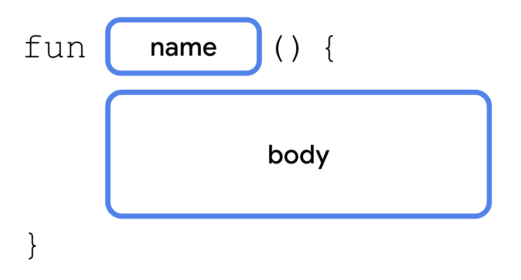

関数の定義は `fun` キーワードで始まり、その後に関数の名前、開きかっこと閉じかっこのペア、開き中かっこと閉じ中かっこのペアが続きます。中かっこの中には、関数を呼び出したときに実行されるコードを記述します。

新しい関数を作成し、2 つの `println()` ステートメントを `main()` 関数から移動させます。

1. ブラウザで [Kotlin プレイグラウンド](https://developer.android.com/training/kotlinplayground)を開き、その内容を以下のコードに置き換えます。

```kotlin
fun main() {
    println("Happy Birthday, Rover!")
    println("You are now 5 years old!")
}
```

2. `main()` 関数の後に、`birthdayGreeting()` という名前の新しい関数を定義します。この関数は、`main()` 関数と同じ構文で宣言します。

```kotlin
fun main() {
    println("Happy Birthday, Rover!")
    println("You are now 5 years old!")
}

fun birthdayGreeting() {
    
}
```

3. 2 つの `println()` ステートメントを `main()` から `birthdayGreeting()` 関数の中かっこ内に移動します。

```kotlin
fun main() {
    
}

fun birthdayGreeting() {
    println("Happy Birthday, Rover!")
    println("You are now 5 years old!")
}
```

4. `main()` 関数で、`birthdayGreeting()` 関数を呼び出します。完成したコードは以下のようになります。

```kotlin
fun main() {
    birthdayGreeting()
}

fun birthdayGreeting() {
    println("Happy Birthday, Rover!")
    println("You are now 5 years old!")
}
```

5. コードを実行します。次の出力が表示されます。

```
Happy Birthday, Rover!
You are now 5 years old!
```

### 3. 関数から値を返す

もっと複雑なアプリでは、関数はテキストを出力するだけではありません。

Kotlin 関数は、「戻り値」と呼ばれるデータも生成できます。戻り値は変数に格納されます。変数はコード内の別の場所で使用できます。

関数を定義するときは、関数で返す値のデータ型を指定できます。戻り値の型を指定するには、かっこの後にコロン（`:`）を置き、スペースを 1 つ空けて、型の名前（`Int`、`String` など）を置きます。次に、戻り値の型と開き中かっこの間にスペースを 1 つ空けます。関数本体の中では、すべてのステートメントの後に return 文を使用して関数が返すべき値を指定します。return ステートメントは、`return` キーワードと、その後に続く変数などの関数が出力として返す値で構成されます。

戻り値の型がある関数を宣言する構文は次のとおりです。

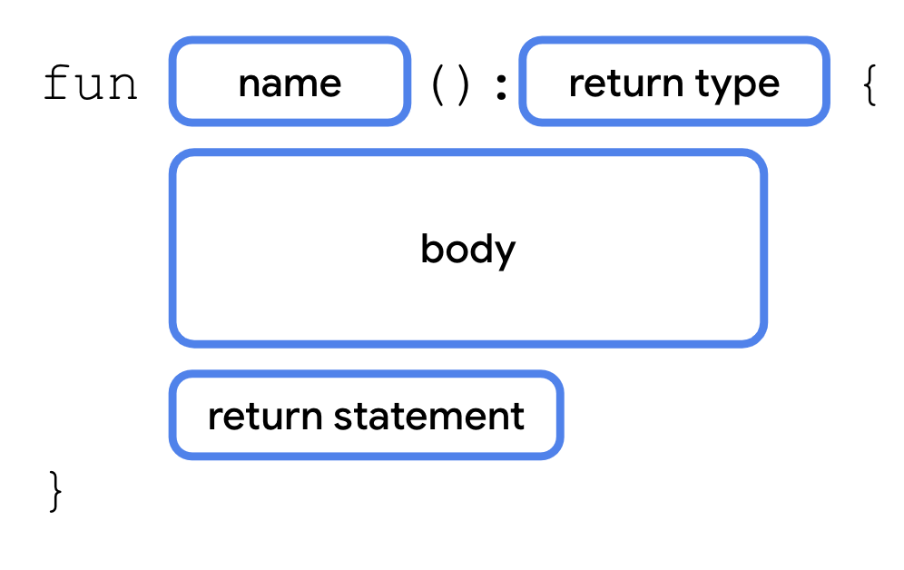

#### `Unit` 型

デフォルトでは、戻り値の型を指定しなかった場合、デフォルトの戻り値の型は `Unit` になります。`Unit` は、関数が値を返さないことを意味します。`Unit` は、他の言語の void という戻り値の型と同等です（例: Java と C では `void`、Swift では `Void` / 空のタプル `()`、Python では `None`）。値を返さない関数は、暗黙的に `Unit` を返します。`Unit` を返すようにコードを変更すると、このことを確認できます。

1. `birthdayGreeting()` の関数宣言で、閉じかっこの後にコロンを追加し、戻り値の型を `Unit` として指定します。

```kotlin
fun main() {
    birthdayGreeting()
}

fun birthdayGreeting(): Unit {
    println("Happy Birthday, Rover!")
    println("You are now 5 years old!")
}
```

2. コードを実行して、すべてが正常に機能していることを確認します。

```
Happy Birthday, Rover!
You are now 5 years old!
```

Kotlin では、戻り値の型が `Unit` の場合、指定は省略できます。何も返さない関数、または `Unit` を返す関数の場合、return 文は必要ありません。

> **注:** この後のレッスンでラムダと呼ばれる Kotlin 機能について学習するときに、また `Unit` 型が登場します。

#### `birthdayGreeting()` から `String` を返す

関数がどのように値を返すかを確認するため、単に結果を出力するのではなく、文字列を返すように `birthdayGreeting()` 関数を変更します。

1. 戻り値の型 `Unit` を `String` に置き換えます。

```kotlin
fun birthdayGreeting(): String {
    println("Happy Birthday, Rover!")
    println("You are now 5 years old!")
}
```

2. コードを実行します。エラーが発生します。関数の戻り値の型（`String` など）を宣言する場合、その関数には `return` ステートメントが含まれていなければなりません。

```
A 'return' expression required in a function with a block body ('{...}')
```

3. 関数から返すことができる文字列は 1 つのみであり、2 つ返すことはできません。`val` キーワードを使用して、`println()` ステートメントを `nameGreeting` と `ageGreeting,` の 2 つの変数に置き換えます。`birthdayGreeting()` から `println()` の呼び出しを削除したため、`birthdayGreeting()` を呼び出しても何も出力されません。

```kotlin
fun birthdayGreeting(): String {
    val nameGreeting = "Happy Birthday, Rover!"
    val ageGreeting = "You are now 5 years old!"
}
```

4. 前のレッスンで学んだ文字列書式設定の構文を使用して、関数から 2 つのメッセージで構成される文字列を返す `return` 文を追加します。

また、別々の行で 2 つのメッセージの書式を設定するには、`\n` エスケープ文字を使用する必要があります。これは、前のレッスンで学んだ `\"` エスケープ文字と非常に類似しています。`\n` 文字は改行に置き換えられ、2 つのメッセージはそれぞれ別の行に表示されます。

```kotlin
fun birthdayGreeting(): String {
    val nameGreeting = "Happy Birthday, Rover!"
    val ageGreeting = "You are now 5 years old!"
    return "$nameGreeting\n$ageGreeting"
}
```

5. `main()` では、`birthdayGreeting()` によって値が返されるため、結果を文字列変数に格納できます。`val` を使用して `greeting` 変数を宣言し、`birthdayGreeting()` の呼び出し結果を保存します。

```kotlin
fun main() {
    val greeting = birthdayGreeting()
}
```

6. `main()` で、`println()` を呼び出して `greeting` 文字列を出力します。`main()` 関数は以下のようになります。

```kotlin
fun main() {
    val greeting = birthdayGreeting()
    println(greeting)
}
```

7. コードを実行し、結果が前と同じになることを確認します。値を返すと、結果を変数に格納できます。では、`println()` 関数内で `birthdayGreeting()` 関数を呼び出すとどうなるでしょうか。

```
Happy Birthday, Rover!
You are now 5 years old!
```

8. 変数を削除して、`birthdayGreeting()` 関数の呼び出し結果を `println()` 関数に渡します。

```kotlin
fun main() {
    println(birthdayGreeting())
}
```

9. コードを実行し、出力を確認します。`birthdayGreeting()` を呼び出したときの戻り値は、そのまま `println()` に渡されます。

```
Happy Birthday, Rover!
You are now 5 years old!
```

### 4. birthdayGreeting() 関数にパラメータを追加する

前に見たとおり、`println()` 関数を呼び出す際に、かっこ内に文字列を含める、すなわち関数に「値を渡す」ことができます。`birthdayGreeting()` 関数でも同じことができます。ただし、まず `birthdayGreeting()` にパラメータを追加する必要があります。

パラメータは、関数内でアクセスするデータとして、関数に渡す変数の名前とデータ型を指定します。パラメータは、関数名の後のかっこ内で宣言します。

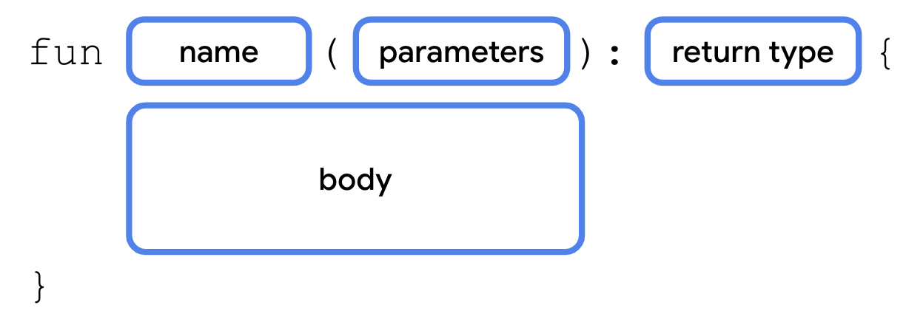

各パラメータは、コロンとスペースで区切られた変数名とデータ型で構成されます。パラメータが複数ある場合はカンマで区切ります。

現時点では、`birthdayGreeting()` 関数を使用できるのは、Rover にお祝いのメッセージを伝える場合に限られます。`birthdayGreeting()` 関数にパラメータを追加して、関数に渡した任意の名前の相手にお祝いのメッセージを伝えるようにします。

1. `birthdayGreeting()` 関数のかっこ内に、`name: String` 構文を使用して `String` 型の `name` パラメータを追加します。

```kotlin
fun birthdayGreeting(name: String): String {
    val nameGreeting = "Happy Birthday, Rover!"
    val ageGreeting = "You are now 5 years old!"
    return "$nameGreeting\n$ageGreeting"
}
```

前のステップで定義したパラメータは、`val` キーワードで宣言された変数と同じように機能します。その値は、`birthdayGreeting()` 関数の任意の場所で使用できます。前のレッスンでは、変数の値を文字列に挿入する方法を学びました。

2. `nameGreeting` 文字列内の `Rover` を、`$` 記号の後に `name` パラメータを付けたものに置き換えます。

```kotlin
fun birthdayGreeting(name: String): String {
    val nameGreeting = "Happy Birthday, $name!"
    val ageGreeting = "You are now 5 years old!"
    return "$nameGreeting\n$ageGreeting"
}
```

3. コードを実行し、エラーを確認します。`name` パラメータを宣言したので、`birthdayGreeting()` を呼び出すときに `String` で渡す必要があります。パラメータを取る関数を呼び出すときは、関数に引数を渡します。引数は、関数に渡す値（`"Rover"` など）です。

```
No value passed for parameter 'name'
```

4. `main()` の `birthdayGreeting()` 呼び出しに `"Rover"` を渡します。

```kotlin
fun main() {
    println(birthdayGreeting("Rover"))
}
```

5. コードを実行し、出力を確認します。`name` パラメータで指定した Rover という名前が出力されます。

```
Happy Birthday, Rover!
You are now 5 years old!
```

6. `birthdayGreeting()` はパラメータを取るので、Rover 以外の名前を指定して呼び出すこともできます。`println()` の呼び出し内に `birthdayGreeting()` の呼び出しをもう一つ追加して、引数 `"Rex"` を渡します。

```kotlin
println(birthdayGreeting("Rover"))
println(birthdayGreeting("Rex"))
```

7. コードを再度実行し、`birthdayGreeting()` に渡した引数に基づいて異なる結果が出力されることを確認します。

```
Happy Birthday, Rover!
You are now 5 years old!
Happy Birthday, Rex!
You are now 5 years old!
```

> **注:** パラメータと引数は同じ意味で使われることが多いのですが、同じものではありません。関数を定義するときは、関数の呼び出し時に渡すパラメータを定義します。関数を呼び出すときには、パラメータに対応する引数を渡します。パラメータは関数がアクセスできる変数（`name` 変数など）であり、引数は関数に渡す実際の値（文字列 `"Rover"` など）です。

> **警告:** 関数がパラメータに渡された値を変更できる一部の言語（Java など）と異なり、Kotlin のパラメータはイミュータブル（不変）です。関数本体からパラメータ値を再代入することはできません。

### 5. 複数のパラメータを持つ関数

前のページでは、名前に応じてメッセージを変更するパラメータを追加しました。しかし、1 つの関数に複数のパラメータを（データ型が異なるパラメータであっても）定義することもできます。このセクションでは、メッセージを修正して、犬の年齢に応じて変更されるようにします。


パラメータ定義はカンマで区切ります。同様に、複数のパラメータを指定して関数を呼び出す場合、渡される引数もカンマで区切ります。実際に見てみましょう。

1. `birthdayGreeting()` 関数の `name` パラメータの後に、`Int` 型の `age` パラメータを追加します。新しい関数宣言では、`name` と `age` という 2 つのパラメータをカンマで区切って指定する必要があります。

```kotlin
fun birthdayGreeting(name: String, age: Int): String {
    val nameGreeting = "Happy Birthday, $name!"
    val ageGreeting = "You are now 5 years old!"
    return "$nameGreeting\n$ageGreeting"
}
```

2. 新しいメッセージの文字列では、`age` パラメータを使用する必要があります。`ageGreeting` 文字列で `age` パラメータの値を使用するように、`birthdayGreeting()` 関数を更新します。

```kotlin
fun birthdayGreeting(name: String, age: Int): String {
    val nameGreeting = "Happy Birthday, $name!"
    val ageGreeting = "You are now $age years old!"
    return "$nameGreeting\n$ageGreeting"
}
```

3. 関数を実行し、出力に含まれるエラーを確認します。

```
No value passed for parameter 'age'
No value passed for parameter 'age'
```

4. 犬ごとに異なる年齢を渡すように、`main()` の `birthdayGreeting()` 関数に対する 2 つの呼び出しを変更します。Rover の年齢を `5`、Rex の年齢を `2` として渡します。

```kotlin
fun main() {
    println(birthdayGreeting("Rover", 5))
    println(birthdayGreeting("Rex", 2))
}
```

5. コードを実行します。両方のパラメータの値を渡したので、関数を呼び出すと、それぞれの犬の名前と年齢が出力に反映されます。

```
Happy Birthday, Rover!
You are now 5 years old!
Happy Birthday, Rex!
You are now 2 years old!
```

#### 関数のシグネチャ

ここまで、関数名、入力（パラメータ）、出力を定義する方法について見てきました。関数名と入力（パラメータ）の組み合わせを関数のシグネチャと総称します。関数のシグネチャはすべて戻り値の型の前に構成されており、次のコード スニペットに表示されています。

```kotlin
fun birthdayGreeting(name: String, age: Int)
```

カンマで区切られたパラメータは、パラメータ リストと呼ばれることもあります。

他のデベロッパーが作成したコードのドキュメントで、こうした用語が使用されている場合が多く見られます。関数のシグネチャから関数の名前と、渡すことができるデータ型を判別できます。

関数の定義にまつわる多数の新しい構文について学びました。関数の構文のまとめについては、以下の図をご覧ください。

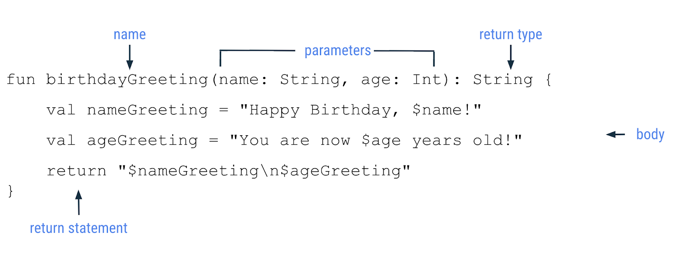

### 6. 名前付き引数

前の例では、関数を呼び出すときにパラメータ名である `name` や `age` を指定する必要はありませんでしたが、必要に応じて指定できます。たとえば、多数のパラメータを持つ関数を呼び出すことや、異なる順序で引数を渡す（例: `name` パラメータの前に `age` パラメータを置く）ことができます。関数を呼び出すときにパラメータ名を指定する場合、その引数を[名前付き引数](https://kotlinlang.org/docs/functions.html#named-arguments)と呼びます。`birthdayGreeting()` 関数で名前付き引数を使用してみましょう。

1. 以下のコード スニペットに示すとおり、名前付き引数を使用するように Rex の呼び出しを変更します。そのためには、パラメータ名、等号、値を続けて指定します（例: `name = "Rex"`）。

```kotlin
println(birthdayGreeting(name = "Rex", age = 2))
```

2. コードを実行し、出力が変わらないことを確認します。

```
Happy Birthday, Rover!
You are now 5 years old!
Happy Birthday, Rex!
You are now 2 years old!
```

3. 名前付き引数の順序を変更します。たとえば、名前付き引数 `name` の前に名前付き引数 `age` を置きます。

```kotlin
println(birthdayGreeting(age = 2, name = "Rex"))
```

4. コードを実行し、出力が変わらないことを確認します。引数の順序を変更した場合でも、同じパラメータに同じ値が渡されます。

```
Happy Birthday, Rover!
You are now 5 years old!
Happy Birthday, Rex!
You are now 2 years old!
```

### 7. デフォルトの引数

関数のパラメータには、デフォルトの引数を指定することもできます。Rover はお気に入りの犬かもしれませんし、ほとんどの場合で関数が特定の引数で呼び出されることが想定されるかもしれません。関数を呼び出すとき、デフォルトが存在する引数は省略できます。省略すると、デフォルトが使用されます。

デフォルトの引数を追加するには、パラメータのデータ型の後に代入演算子（`=`）を追加し、特定の値を設定します。デフォルトの引数を使用するように、コードを変更します。

1. `birthdayGreeting()` 関数で、`name` パラメータにデフォルト値の `"Rover"` を設定します。

```kotlin
fun birthdayGreeting(name: String = "Rover", age: Int): String {
    return "Happy Birthday, $name! You are now $age years old!"
}
```

2. `main()` 内の Rover に対する `birthdayGreeting()` の最初の呼び出しで、名前付き引数 `age` を `5` に設定します。`age` パラメータは `name` の後で定義されるので、名前付き引数 `age` を使用する必要があります。名前付き引数がない場合、Kotlin では、引数の順序はパラメータが定義されている順序と同じであると見なされます。名前付き引数を使用することで、Kotlin が `age` パラメータに対して `Int` を想定することが保証されます。

```kotlin
println(birthdayGreeting(age = 5))
println(birthdayGreeting("Rex", 2))
```

3. コードを実行します。`birthdayGreeting()` 関数の最初の呼び出しでは、名前を指定しなかったため、名前として「Rover」が出力されます。`birthdayGreeting()` の 2 回目の呼び出しでは、`name` に渡した `Rex` という値が引き続き使用されます。

```
Happy Birthday, Rover! You are now 5 years old!
Happy Birthday, Rex! You are now 2 years old!
```

4. `birthdayGreeting()` 関数の 2 回目の呼び出しから、名前を削除します。この場合も、`name` が省略されているため、年齢に対して名前付き引数を使用する必要があります。

```kotlin
println(birthdayGreeting(age = 5))
println(birthdayGreeting(age = 2))
```

5. コードを実行します。名前付き引数を渡していないため、`birthdayGreeting()` の両方の呼び出しで、名前として「Rover」が出力されることを確認します。

```
Happy Birthday, Rover! You are now 5 years old!
Happy Birthday, Rover! You are now 2 years old!
```

### 8. まとめ

お疲れさまでした。ここでは Kotlin で関数を定義して呼び出す方法について学習しました。

#### 概要

- 関数は `fun` キーワードで定義され、再利用可能なコードを含みます。
- 関数を使用することで大規模なプログラムの保守が容易になり、不要なコードの重複を回避できます。
- 関数で変数に格納できる値を返し、後で使用できます。
- 関数はパラメータを取ることができます。パラメータとは、関数本体の内部で利用可能な変数です。
- 引数は、関数を呼び出すときに渡す値です。
- 引数には、関数を呼び出すときに名前を付けることができます。名前付き引数を使用する場合は、出力に影響を与えることなく引数の順序を変更できます。
- デフォルトの引数を指定することで、関数を呼び出す際に引数を省略できます。

## 6. 練習問題: Kotlin の基本（提出対象）


### 1. 始める前に

Kotlin プログラミングの基本を身につけたところで、今度は実践してみましょう。

この演習では、学習したコンセプトの理解度をテストします。実際のユースケースをテーマとしており、一部は以前に経験したことがあるかもしれません。

手順に沿って、各問題の解答を考えましょう。練習問題によっては、行き詰まった場合に役立つヒントが用意されています。解答コードは最後に掲載されていますが、演習に取り組んでから解答を確認することを強くおすすめします。

解答は問題を解決する方法の一つと捉え、自信を持って自由に試しましょう。一部の演習は複数の方法で解くことができます。また、関数と変数に異なる名前を使用できます。

自分のやりやすいペースで問題に取り組みましょう。時間が記載されていますが、これはあくまでも目安であり、遵守する必要はありません。必要なだけ時間をかけ、じっくりと問題に取り組んでください。

[Kotlin のプレイグラウンド](https://developer.android.com/training/kotlinplayground)を使用して演習に取り組むことをおすすめします。

#### 前提条件

- [Kotlin のプレイグラウンド](https://developer.android.com/training/kotlinplayground)に慣れていること
- 関数の定義と呼び出しを行えること
- Kotlin の基本的なデータ型に関する知識があること
- 不変変数と可変変数に関する知識があること
- `println()` 関数に関する知識があること
- 初めての Kotlin プログラム、Kotlin で変数を作成して使用する、Kotlin で関数を作成して使用するのレッスンを完了していること

#### 必要なもの

- ウェブブラウザがインストールされた、インターネットに接続できるパソコン

### 2. メッセージを出力する

この章で学習した内容を友人に伝えましょう。

- 次のようにメッセージを 4 行に分けて出力する `main()` 関数を記述できますか。

```
Use the val keyword when the value doesn't change. 
Use the var keyword when the value can change.
When you define a function, you define the parameters that can be passed to it. 
When you call a function, you pass arguments for the parameters.
```

### 3. コンパイル エラーを修正する

このプログラムは、友人からチャット メッセージを受信したことを通知するメッセージを出力します。

```kotlin
fun main() { 
    println("New chat message from a friend'}
}
```

1. このプログラムでのコンパイル エラーの根本原因を特定し、修正できますか。
2. このコードで、文字列と関数の引数の開閉を示す記号は適切に使用されていますか。

**ヒント:**コードを実行してコンパイル エラーを確認するために、Kotlin のプレイグラウンドを使用できます。

エラーを修正すると、プログラムはエラーなくコンパイルされ、次の出力が表示されるはずです。

```
New chat message from a friend
```

### 4. 文字列テンプレート

このプログラムは、特定の商品に予定されているプロモーション セールについてユーザーに通知します。文字列テンプレートがあり、割引率については `discountPercentage` 変数を使用し、セール対象商品については `item` 変数を使用しています。しかし、このコードではコンパイル エラーが発生します。

```kotlin
fun main() {
    val discountPercentage: Int = 0
    val offer: String = ""
    val item = "Google Chromecast"
    discountPercentage = 20
    offer = "Sale - Up to $discountPercentage% discount on $item! Hurry up!"
    
    println(offer)
}
```

1. エラーの根本原因を特定し、修正できますか。
2. Kotlin のプレイグラウンドでコードを実行する前に、このプログラムの出力を判断できますか。

**ヒント:**読み取り専用の変数に値を再代入できますか。

エラーを修正すると、プログラムはエラーなくコンパイルされ、次の出力が表示されるはずです。

```
Sale - Up to 20% discount on Google Chromecast! Hurry up!
```

### 5. 文字列の連結

このプログラムは、パーティーの総人数を表示します。パーティーには大人と子供が出席しています。`numberOfAdults` 変数はパーティーの大人の人数を保持し、`numberOfKids` 変数は子供の人数を保持します。

```kotlin
fun main() {
    val numberOfAdults = "20"
    val numberOfKids = "30"
    val total = numberOfAdults + numberOfKids
    println("The total party size is: $total")
}
```

##### ステップ 1

- Kotlin のプレイグラウンドでコードを実行する前に、このプログラムの出力を判断できますか。

出力を判断したら、Kotlin のプレイグラウンドでコードを実行して表示された出力と一致するかどうかを確認します。

**ヒント:**2 つの文字列に `+` 演算子を使用するとどうなりますか。

##### ステップ 2

このコードは機能して出力を生成しますが、出力にパーティー出席者の合計人数は表示されません。

- コードの問題点を見つけて、次の出力を行うように修正できますか。

```
The total party size is: 50
```

### 6. メッセージの書式設定

このプログラムは、ある従業員が今月受け取る給与の総額を表示します。給与の総額は、ある従業員が毎月受け取る額の `baseSalary` 変数と、その従業員に追加で支給されるボーナスの `bonusAmount` 変数という、2 つの部分に分かれています。

```kotlin
fun main() {
    val baseSalary = 5000
    val bonusAmount = 1000
    val totalSalary = "$baseSalary + $bonusAmount"
    println("Congratulations for your bonus! You will receive a total of $totalSalary (additional bonus).")
}
```

1. このコードを Kotlin のプレイグラウンドで実行する前に、出力を把握できますか。
2. コードを Kotlin のプレイグラウンドで実行すると、想定どおりの出力が表示されますか。

### 7. 基本的な数学演算を実装する

この演習では、基本的な数学演算を行って出力を表示するプログラムを作成します。

##### ステップ 1

この `main()` 関数ではコンパイル エラーが 1 つ発生します。

```kotlin
fun main() {
    val firstNumber = 10
    val secondNumber = 5
    
    println("$firstNumber + $secondNumber = $result")
}
```

- プログラムが次の出力を表示するようにエラーを修正できますか。

```
10 + 5 = 15
```

##### ステップ 2

このコードは機能しますが、2 つの数を加算するロジックは result 変数内にあるため、コードを柔軟に再利用しにくくなっています。代わりに、加算演算を `add()` 関数に抽出してコードを再利用できるようにします。そのために、コードを次のように更新します。なお、このコードでは `thirdNumber` という新しい `val` を導入し、この新しい変数の結果を `firstNumber` で出力します。

```kotlin
fun main() {
    val firstNumber = 10
    val secondNumber = 5
    val thirdNumber = 8
    
    val result = add(firstNumber, secondNumber)
    val anotherResult = add(firstNumber, thirdNumber)

    println("$firstNumber + $secondNumber = $result")
    println("$firstNumber + $thirdNumber = $anotherResult")
}

// Define add() function below this line
```

- プログラムが次の出力を表示するように `add()` 関数を定義できますか。

```
10 + 5 = 15
10 + 8 = 18
```

##### ステップ 3

これで、2 つの数を加算する再利用可能な関数ができました。

- `add()` 関数を実装したときと同様に `subtract()` 関数を実装できますか。`subtract()` 関数を使用するように `main()` 関数も変更し、想定どおりに動作することを確認します。

**ヒント:**加算、減算、その他の数学演算の違いを考えてください。そこから解答コードに取り組みましょう。

### 8. デフォルトのパラメータ

Gmail には、新しいデバイスでログインが試行されるたびにユーザーに通知を送信する機能があります。

この演習では、このメッセージ テンプレートを使用してユーザーにメッセージを表示するプログラムを作成します。

```
There's a new sign-in request on operatingSystem for your Google Account emailId.
```

`operatingSystem` パラメータと `emailId` パラメータを受け取り、指定された形式でメッセージを作成してそのメッセージを返す関数を実装する必要があります。

たとえば、`operatingSystem` に「`Chrome OS`」、`emailId` に「`sample@gmail.com`」を指定して関数を呼び出した場合、次の文字列が返されます。

```
There's a new sign-in request on Chrome OS for your Google Account sample@gmail.com.
```

##### ステップ 1

1. このプログラムが出力を表示するように `displayAlertMessage()` 関数を実装できますか。

```kotlin
fun main() {
    val operatingSystem = "Chrome OS"
    val emailId = "sample@gmail.com"

    println(displayAlertMessage(operatingSystem, emailId))
}

// Define your displayAlertMessage() below this line.
```

2. プログラムが次の出力を表示しますか。

```
There's a new sign-in request on Chrome OS for your Google Account sample@gmail.com.
```

##### ステップ 2

よくできました。メッセージを表示できました。ただし、場合によってはユーザーのオペレーティング システムを特定できないことがあります。そのような場合は、オペレーティング システム名を `Unknown OS` として指定する必要があります。関数を呼び出すたびに `Unknown OS` 引数を渡す必要がなくなるよう、コードをさらに最適化できます。

1. この情報で、次の出力を表示するようにコードを最適化する方法がわかりますか。

```
There's a new sign-in request on Unknown OS for your Google Account user_one@gmail.com.

There's a new sign-in request on Windows for your Google Account user_two@gmail.com. 

There's a new sign-in request on Mac OS for your Google Account user_three@gmail.com. 
```

2. 上記のメッセージを出力するには、`main()` 関数の実装を次のように置き換えます。

```kotlin
fun main() {
    val firstUserEmailId = "user_one@gmail.com"

    // The following line of code assumes that you named your parameter as emailId. 
    // If you named it differently, feel free to update the name.
    println(displayAlertMessage(emailId = firstUserEmailId))
    println()

    val secondUserOperatingSystem = "Windows"
    val secondUserEmailId = "user_two@gmail.com"

    println(displayAlertMessage(secondUserOperatingSystem, secondUserEmailId))
    println()

    val thirdUserOperatingSystem = "Mac OS"
    val thirdUserEmailId = "user_three@gmail.com"

    println(displayAlertMessage(thirdUserOperatingSystem, thirdUserEmailId))
    println()
}
```

### 9. 歩数計

歩数計は、歩数をカウントする電子デバイスです。現在では、ほぼすべてのスマートフォン、スマートウォッチ、フィットネス機器に歩数計が内蔵されています。健康＆フィットネス アプリは、内蔵の歩数計を使用して歩数を計算します。この関数はユーザーの歩数に基づいて消費カロリー数を計算します。

- ベスト プラクティスに基づいて、このプログラムの関数、関数パラメータ、変数の名前を変更できますか。

```kotlin
fun main() {
    val Steps = 4000
    val caloriesBurned = PEDOMETERstepsTOcalories(Steps);
    println("Walking $Steps steps burns $caloriesBurned calories") 
}

fun PEDOMETERstepsTOcalories(NumberOFStepS: Int): Double {
    val CaloriesBURNEDforEachStep = 0.04
    val TotalCALORIESburned = NumberOFStepS * CaloriesBURNEDforEachStep
    return TotalCALORIESburned
}
```

### 10. 2 つの数を比較する

最新のスマートフォンには、利用時間（1 日にスマートフォンに費やした時間）を記録する機能が組み込まれています。

この演習では、今日スマートフォンに費やした時間（分単位）と昨日費やした時間を比較する関数を実装します。この関数は 2 つの整数パラメータを受け入れ、ブール値を返します。

最初のパラメータは今日費やした時間（分単位）、2 番目のパラメータは昨日費やした時間（分単位）です。この関数は、昨日より今日の方がスマートフォンに費やした時間が多い場合に `true` 値を返します。そうでない場合は `false` 値を返します。

たとえば、次の名前付き引数で関数を呼び出したとします。

- `timeSpentToday = 300` と `timeSpentYesterday = 250` の場合、関数は `true` 値を返します。
- `timeSpentToday = 300` と `timeSpentYesterday = 300` の場合、関数は `false` 値を返します。
- `timeSpentToday = 200` と `timeSpentYesterday = 220` の場合、関数は `false` 値を返します。

**ヒント:**`>` 比較演算子は、演算子の前の値が後の値より大きい場合、`true` 値を返します。そうでない場合は `false` 値を返します。

### 11. 重複するコードを関数に移動する

このプログラムはさまざまな都市の天気を表示します。これには、都市名、その日の最高気温と最低気温、降水確率が含まれます。

```kotlin
fun main() {
    println("City: Ankara")
    println("Low temperature: 27, High temperature: 31")
    println("Chance of rain: 82%")
    println()

    println("City: Tokyo")
    println("Low temperature: 32, High temperature: 36")
    println("Chance of rain: 10%")
    println()
    
    println("City: Cape Town")
    println("Low temperature: 59, High temperature: 64")
    println("Chance of rain: 2%")
    println()
    
    println("City: Guatemala City")
    println("Low temperature: 50, High temperature: 55")
    println("Chance of rain: 7%")
    println()
}
```

各都市の天気を表示するコードには多くの類似点があります。たとえば、`"City:"` や `"Low temperature:"` のように何度も繰り返されるフレーズがあります。類似したコードが繰り返されると、プログラムでエラーが発生するリスクが生じます。いずれかの都市について、タイプミスをしたり、天気の詳細情報を 1 つ忘れたりするかもしれません。

1. `main()` 関数の繰り返しを減らすために、1 つの都市について天気の詳細情報を表示する関数を作成し、残りの都市についても同様にできますか。
2. 都市ごとに作成した関数を呼び出し、適切な天気の詳細情報を引数として渡すように `main()` 関数を更新できますか。

### 12. 解答コード

#### メッセージを出力する

解答は、`println()` 関数を使用して各行でメッセージを出力します。

```kotlin
fun main() {
    println("Use the val keyword when the value doesn't change.")
    println("Use the var keyword when the value can change.")
    println("When you define a function, you define the parameters that can be passed to it.")
    println("When you call a function, you pass arguments for the parameters.")
}
```

#### コンパイル エラーを修正する

コードにはコンパイル エラーが 2 つ含まれていました。

1. 文字列は、一重引用符ではなく二重引用符で終わる必要があります。
2. 関数の引数は、中かっこではなく丸かっこで囲む必要があります。

```kotlin
fun main() { 
    println("New chat message from a friend")
}
```

#### 文字列テンプレート

読み取り専用変数の `discountPercentage` と `offer` を新しい値に代入すると、コンパイル エラーが起きます。このような代入は認められていません。

```kotlin
fun main() {
    val discountPercentage = 20
    val item = "Google Chromecast"
    val offer = "Sale  - Up to $discountPercentage% discount off $item! Hurry Up!"

    println(offer)
}
```

代替策として、`var` キーワードを使用して `discountPercentage` 整数と `offer` 文字列を宣言します。ただし、これらの値はプログラムのコンテキストでは不変であるため、`val` キーワードのままで問題ありません。

#### 文字列の連結

##### ステップ 1

プログラムは次の出力を表示します。

```
The total party size is: 2030 
```

これはひっかけ問題でした。`+` 演算子を `String` 値に使用すると、連結された文字列が生成されます。整数が二重引用符で囲まれているため、整数ではなく文字列として扱われ、`2030` という出力になります。

##### ステップ 2

`numberOfAdults` 変数と `numberOfKids` 変数を囲んでいる二重引用符を削除して `Int` 変数に変換します。

```kotlin
fun main() {
    val numberOfAdults = 20
    val numberOfKids = 30
    val total = numberOfAdults + numberOfKids
    println("The total party size is: $total")
}
```

Kotlin コンパイラは代入された値に基づいて変数の型を推定できる、ということを覚えているでしょうか。この場合、コンパイラは `numberOfAdults` 変数と `numberOfKids` 変数が `Int` 型であると推定します。

#### メッセージの書式設定

プログラムは次の出力を表示します。

```
Congratulations for your bonus! You will receive a total of 5000 + 1000 (additional bonus).
```

`"$baseSalary + $bonusAmount"` は、テンプレート式の構文を使用しています。テンプレート式では、まずコードが評価され、その結果が文字列として連結されます。

この問題では、`$baseSalary` 変数の値が `5000` と評価され、`$bonusAmount` 変数の値が `1000` と評価されます。次に、結果が連結されて `"5000 + 1000"` となり、`result` 変数に代入されます。

#### 基本的な数学演算を実装する

##### ステップ 1

`val` キーワードで不変の `result` 変数を定義してから、加算演算の結果を代入します。

```kotlin
fun main() {
    val firstNumber = 10
    val secondNumber = 5
    
    val result = firstNumber + secondNumber
    println("$firstNumber + $secondNumber = $result")
}
```

##### ステップ 2

1. `firstNumber` パラメータと `secondNumber` パラメータ（どちらも `Int` 型）を受け取り `Int` 値を返す `add()` 関数を作成します。
2. `add()` 関数の本文に加算演算のコードを入力し、`return` キーワードを使用して演算の結果を返します。

```kotlin
fun add(firstNumber: Int, secondNumber: Int): Int {
    return firstNumber + secondNumber
}
```

##### ステップ 3

1. `firstNumber` パラメータと `secondNumber` パラメータ（どちらも `Int` 型）を受け取り `Int` 値を返す `subtract()` 関数を定義します。
2. `subtract()` 関数の本文に減算演算のコードを入力し、`return` キーワードを使用して演算の結果を返します。

```kotlin
fun subtract(firstNumber: Int, secondNumber: Int): Int {
    return firstNumber - secondNumber
}
```

3. 新しい `subtract()` 関数を使用するように `main()` 関数を変更します。解答例を以下に示します。

```kotlin
fun main() {
    val firstNumber = 10
    val secondNumber = 5
    val thirdNumber = 8
    
    val result = add(firstNumber, secondNumber)
    val anotherResult = subtract(firstNumber, thirdNumber)

    println("$firstNumber + $secondNumber = $result")
    println("$firstNumber - $thirdNumber = $anotherResult")
}

fun add(firstNumber: Int, secondNumber: Int): Int {
    return firstNumber + secondNumber
}

fun subtract(firstNumber: Int, secondNumber: Int): Int {
    return firstNumber - secondNumber
}
```

#### デフォルトのパラメータ

##### ステップ 1

1. `operatingSystem` パラメータと `emailId` パラメータ（どちらも `String` 型）を受け取り `String` 値を返す `displayAlertMessage()` 関数を作成します。
2. 関数の本文で、テンプレート式を使用してメッセージを更新し、返します。

```kotlin
fun displayAlertMessage(operatingSystem: String, emailId: String): String {
    return "There is a new sign-in request on $operatingSystem for your Google Account $emailId."
}
```

##### ステップ 2

- `operatingSystem` パラメータに `"Unknown OS"` 値を代入します。

```kotlin
fun displayAlertMessage(
    operatingSystem: String = "Unknown OS",
    emailId: String
): String {
    return "There is a new sign-in request on $operatingSystem for your Google Account $emailId."
}
```

#### 歩数計

関数名と変数名はキャメルケースの命名規則に従って付ける必要があります。

名前に複数の単語が含まれている場合は、最初の単語の最初の文字を小文字にし、後続の単語の最初の文字を大文字にして、単語間のスペースをすべて削除します。

関数名の例:

- `calculateTip`
- `displayMessage`
- `takePhoto`

変数名の例:

- `numberOfEmails`
- `cityName`
- `bookPublicationDate`

名前の詳細については、[命名ルール](https://kotlinlang.org/docs/coding-conventions.html#naming-rules)をご覧ください。

[Kotlin キーワード](https://kotlinlang.org/docs/keyword-reference.html)は、Kotlin 言語ですでに特定の意味が割り当てられているため、関数名として使用しないでください。

解答コードは次のコード スニペットのようになります。

```kotlin
fun main() {
    val steps = 4000
    val caloriesBurned = pedometerStepsToCalories(steps)
    println("Walking $steps steps burns $caloriesBurned calories") 
}

fun pedometerStepsToCalories(numberOfSteps: Int): Double {
    val caloriesBurnedForEachStep = 0.04
    val totalCaloriesBurned = numberOfSteps * caloriesBurnedForEachStep
    return totalCaloriesBurned
}
```

#### 2 つの数を比較する

- `timeSpentToday` パラメータと `timeSpentYesterday` パラメータ（どちらも `Int` 型）を受け取り `Boolean` 値を返す `compareTime()` 関数を作成します。

解答では `>` 比較演算子を使用します。この演算子は `Boolean` 値として評価されるため、`compareTime()` 関数は単に `timeSpentToday > timeSpentYesterday` の結果を返します。

たとえば、`300` 引数を `timeSpentToday` パラメータに渡し、`250` 引数を `timeSpentYesterday` パラメータに渡すと、関数の本文は `300 > 250` と評価され、300 は 250 より大きいため `true` 値が返されます。

```kotlin
fun main() {
    println("Have I spent more time using my phone today: ${compareTime(300, 250)}")
    println("Have I spent more time using my phone today: ${compareTime(300, 300)}")
    println("Have I spent more time using my phone today: ${compareTime(200, 220)}")
}

fun compareTime(timeSpentToday: Int, timeSpentYesterday: Int): Boolean {
    return timeSpentToday > timeSpentYesterday
}
```

```
Have I spent more time using my phone today: true
Have I spent more time using my phone today: false
Have I spent more time using my phone today: false
```

#### 重複するコードを関数に移動する

1. `main()` 関数の後に、アンカラ市の天気の詳細情報を表示する関数を作成します。

関数名には、`printWeatherForCity()` などを使用できます。

2. この関数を `main()` 関数から呼び出します。

プログラムはアンカラの天気の詳細情報を表示します。

```kotlin
fun main() {
    printWeatherForCity()
}

fun printWeatherForCity() {
    println("City: Ankara")
    println("Low temperature: 27, High temperature: 31")
    println("Chance of rain: 82%")
    println()
}
```

これで、他の都市における天気の詳細情報を表示できる、柔軟性の高い別の関数を作成できるようになりました。

3. `println()` ステートメントのアンカラ固有の部分を変数に置き換えます。

変数名にはキャメルケースの命名規則を使用し、変数の前に `$` 記号を付けて、変数名の代わりに変数の値が使用されるようにしてください。これらは以前のレッスンで学習した文字列テンプレートです。

```kotlin
fun printWeatherForCity() {
    println("City: $cityName")
    println("Low temperature: $lowTemp, High temperature: $highTemp")
    println("Chance of rain: $chanceOfRain%")
    println()
}
```

4. これらの変数が、関数が呼び出されたときに必ず渡されるパラメータとなるように関数の定義を変更し、各パラメータのデータ型を指定します。

`cityName` パラメータは `String` 型ですが、`lowTemp`、`highTemp`、`chanceOfRain` パラメータは `Int` 型です。

メッセージは出力に表示されるため、関数の定義に `return` 値は必要ありません。

```kotlin
fun printWeatherForCity(cityName: String, lowTemp: Int, highTemp: Int, chanceOfRain: Int) {
    println("City: $cityName")
    println("Low temperature: $lowTemp, High temperature: $highTemp")
    println("Chance of rain: $chanceOfRain%")
    println()
}
```

5. `printWeatherForCity()` 関数を呼び出してアンカラの天気の詳細情報を渡すように、`main()` 関数を更新します。

都市名は `"Ankara"`、最低気温は `27`、最高気温は `31`、降水確率は `82` です。

```kotlin
fun main() {
    printWeatherForCity("Ankara", 27, 31, 82)
}

fun printWeatherForCity(cityName: String, lowTemp: Int, highTemp: Int, chanceOfRain: Int) {
    println("City: $cityName")
    println("Low temperature: $lowTemp, High temperature: $highTemp")
    println("Chance of rain: $chanceOfRain%")
    println()
}
```

6. プログラムを実行し、出力にアンカラの天気の詳細情報が表示されることを確認します。
7. 他の都市における天気の詳細情報を指定して `printWeatherForCity()` 関数を呼び出します。

```kotlin
fun main() {
    printWeatherForCity("Ankara", 27, 31, 82)
    printWeatherForCity("Tokyo", 32, 36, 10)
    printWeatherForCity("Cape Town", 59, 64, 2)
    printWeatherForCity("Guatemala City", 50, 55, 7)
}

fun printWeatherForCity(cityName: String, lowTemp: Int, highTemp: Int, chanceOfRain: Int) {
    println("City: $cityName")
    println("Low temperature: $lowTemp, High temperature: $highTemp")
    println("Chance of rain: $chanceOfRain%")
    println()
}
```

8. プログラムを実行します。

元のプログラムと同じ出力が表示されますが、コードが簡潔になり、不要な繰り返しが含まれなくなりました。都市の天気の詳細情報を出力するコードはすべて、`printWeatherForCity()` 関数という 1 か所に集約されています。天気の詳細情報の表示方法を変更する場合は、1 か所で変更してすべての都市に適用できます。

### 13. その他の演習

Kotlin 言語に関するその他の演習については、[JetBrains Academy の Kotlin Core トラック](https://hyperskill.org/tracks/18)をご覧ください。特定のトピックに移動するには、[ナレッジマップ](https://hyperskill.org/knowledge-map)に移動して、このトラックで扱っているトピックの一覧を確認してください。

## 7. つまずきやすいポイント

- Kotlin Playground はブラウザだけで動きます。まだ Android Studio は不要です。
- エラーメッセージは赤い行だけでなく **英文の内容** を読みましょう。分からなければ AI に「このエラーの意味は？」と丸ごと貼って聞いて構いません。
- `val` と `var` の違いは何度も出てきます。「後から変えるか、変えないか」で説明できるようにしておきましょう。

## 8. AIに質問する（この章の例）

次の例をそのままAIに投げてOKです（必要なら自分のコード/エラーに置き換えてください）。

```text
「Kotlin の `val` と `var` の違いを、初心者向けにたとえ話つきで説明して。最後に要点を3つにまとめて」
「この Kotlin コードでエラーが出た。原因と直し方を、答えを丸ごとではなくヒント→確認質問の順で教えて（コード: ここに貼る／エラー: ここに貼る）」
「練習問題: Kotlin の基本 の自分の解答をレビューして。動くかどうかと、読みやすくする改善点を教えて（コード: ここに貼る）」
```

質問がまとまらないときは、第0章の「質問テンプレ」を使ってください。

## 9. 提出物

次の演習で書いた Kotlin コードを、学習用リポジトリの `unit1/kotlin-intro/` に `.kt` ファイルとして置きます（1 問 1 ファイル、ファイル名は問題が分かる名前にする）。

- 練習問題: Kotlin の基本

PR 本文には次の 3 点を書いてください。

- **やったこと**：どのレッスン / 演習を完了したか
- **動作確認**：どの端末（エミュレータ名 or 実機）で何を確認したか
- **詰まった点と解決**：エラーの内容と、どう直したか（AI に聞いた内容も可）

## 10. チェックリスト

- [ ] Kotlin Playground でプログラムを書いて実行できる
- [ ] 変数（`val` / `var`）と関数を使ったプログラムを書ける
- [ ] 練習問題の解答を Kotlin ファイルとして残せる
- [ ] 章末のクイズに合格した
- [ ] 提出物が `unit1/kotlin-intro/` にあり、Android Studio（または Kotlin Playground）で開いて動く

---

## 課題提出

この章には提出課題があります。

1. 上記の提出物を完了する
2. GitHub で `feature/01-kotlin-intro` ブランチを作成し、`develop` へのPRを作成（base=`develop`）
3. [AIプログラムレビュー](https://ai.studio/apps/84d224cb-7de1-44fb-995b-9a5917d25603?fullscreenApplet=true) を実行
4. 問題がなければ、進捗ダッシュボードで **PR URL** と **完了日** を記録
