# 第5章: アプリにボタンを追加する

> 提出ブランチ: `feature/02-add-button`

## 1. この章のゴール

- `Button` の `onClick` でユーザー操作に反応するアプリを作れる
- `remember` と `mutableStateOf` で画面の状態を持てる
- Android Studio のデバッガで変数の中身を確認できる

## 2. 進め方

次の内容を **上から順番に** 進めます。「やらなくてOK」の行は飛ばして構いません。レッスンの本文はこのページの下にすべて掲載しています。目安時間の合計は約225分です。

| # | 種類 | 内容 | 目安 | 備考 |
|---|---|---|---|---|
| 1 | レッスン | インタラクティブな Dice Roller アプリを作成する | 約90分 | **提出対象** |
| 2 | レッスン | Android Studio でデバッガを使用する | 約45分 |  |
| 3 | レッスン | 練習: クリック動作 | 約90分 | **提出対象** |

このプログラムの進め方は次の通りです。

1. 下の各レッスンを読み、各ステップの説明を理解してから **自分でコードを打つ**（コピペで済ませない）
2. ステップごとにアプリを実行し、期待どおり動くか確認する
3. 動かないときは、エラー文をそのまま AI に貼って「何が原因か」を聞き、直したら **なぜ直ったか** をメモする
4. 各レッスン末尾の「まとめ」を読み、説明できない用語があればレッスンに戻る

> 画面が最新の Android Studio と異なる場合があります。

## 3. インタラクティブな Dice Roller アプリを作成する（提出対象）


### 1. 始める前に

このレッスンでは、ユーザーが `Button` コンポーザブルをタップしてサイコロを振る、インタラクティブな **Dice Roller** アプリを作成します。サイコロを振った結果は `Image` コンポーザブルで画面に表示されます。

Kotlin で Jetpack Compose を使用してアプリ レイアウトを作成し、`Button` コンポーザブルがタップされたときの動作を処理するビジネス ロジックを作成します。

#### 前提条件

- Android Studio で基本的な Compose アプリを作成して実行できること。
- アプリで `Text` コンポーザブルを使用する方法を熟知していること。
- アプリの翻訳や文字列の再利用のために、テキストを文字列リソースに抽出する方法を理解していること。
- Kotlin プログラミングの基礎知識があること。

#### 学習内容

- Compose を使用して Android アプリに `Button` コンポーザブルを追加する方法。
- Compose を使用して Android アプリの `Button` コンポーザブルに動作を追加する方法。
- Android アプリの `Activity` コードを開いて変更する方法。

#### 作成するアプリの概要

- ユーザーにサイコロを振らせてその結果を表示する、Dice Roller というインタラクティブな Android アプリ。

#### 必要なもの

- Android Studio がインストールされているパソコン

このレッスンが完了すると、アプリは次のようになります。


### 2. ベースラインを確立する

#### プロジェクトを作成する

1. Android Studio で、**[File] > [New] > [New Project]** をクリックします。
2. [**New Project**] ダイアログで [**Empty Activity**] を選択し、[**Next**] をクリックします。

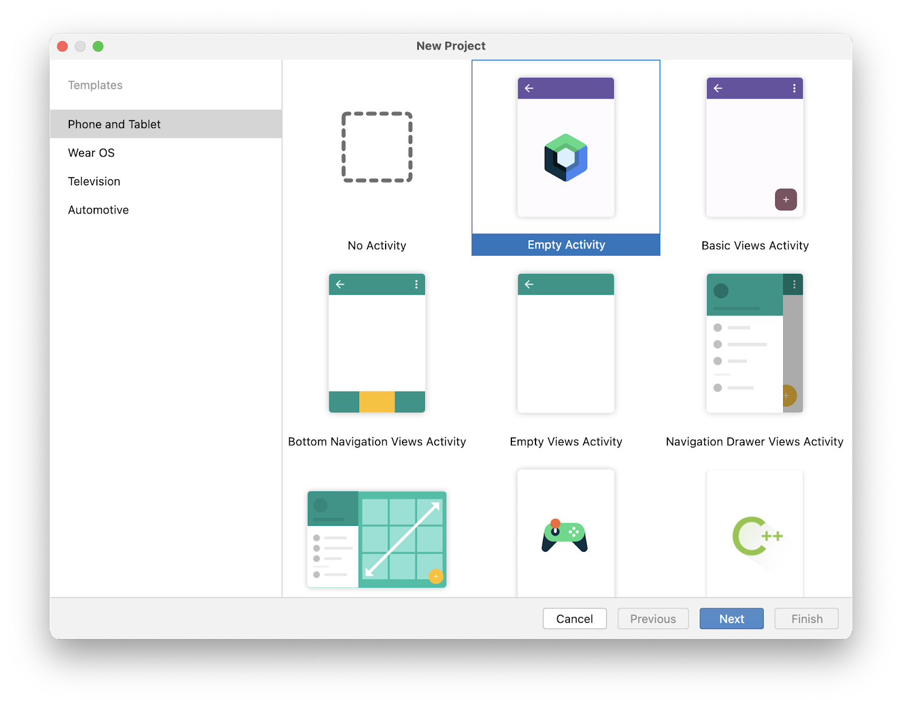

3. [**Name**] フィールドに「`Dice Roller`」と入力します。
4. [**Minimum SDK**] フィールドでメニューから API レベル 24（Nougat）以上を選択し、[**Finish**] をクリックします。

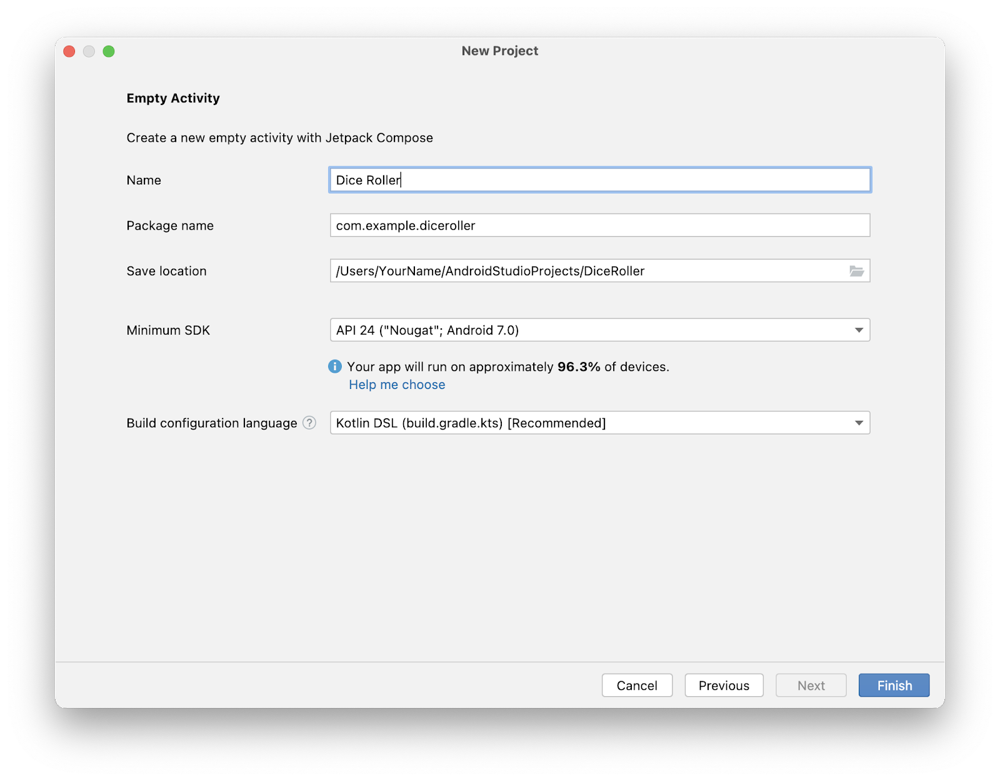

### 3. レイアウト インフラストラクチャを作成する

#### プロジェクトをプレビューする

プロジェクトをプレビューするには:

- [**Split**] ペインまたは [**Design**] ペインで [**Build & Refresh**] をクリックします。

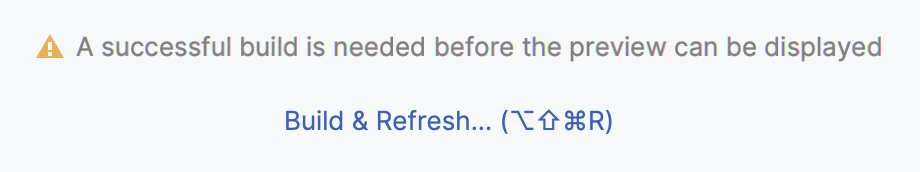

[**Design**] ペインにプレビューが表示されます。表示が小さくても、レイアウトを変更すると表示も変化するため心配する必要はありません。

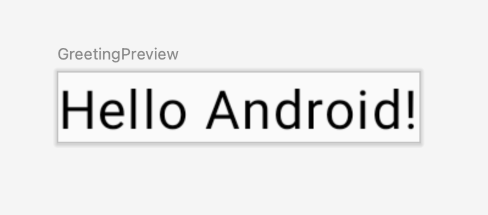

#### サンプルコードを再構成する

Dice Roller アプリのテーマに近づけるために、生成されたコードの一部を変更する必要があります。

完成したアプリのスクリーンショットには、サイコロの画像と、サイコロを転がすためのボタンがありました。このアーキテクチャを反映するように、コンポーズ可能な関数を構成します。

サンプルコードを再構成するには:

1. `GreetingPreview()` 関数を削除します。
2. `@Composable` アノテーションを付けて `DiceWithButtonAndImage()` 関数を作成します。

このコンポーズ可能な関数はレイアウトの UI コンポーネントを表し、また、ボタンクリックと画像表示のロジックを保持します。

3. `Greeting(name: String, modifier: Modifier = Modifier)` 関数を削除します。
4. `@Preview` アノテーションと `@Composable` アノテーションを付けて `DiceRollerApp()` 関数を作成します。

このアプリはボタンと画像のみで構成されているため、このコンポーズ可能な関数がアプリそのものだと考えてください。そのため、`DiceRollerApp()` 関数という名前になっています。

**`MainActivity.kt`**

```kotlin
@Preview
@Composable
fun DiceRollerApp() {

}

@Composable
fun DiceWithButtonAndImage() {

}
```

`Greeting()` 関数を削除したため、`DiceRollerTheme()` ラムダ本文の `Greeting("Android")` の呼び出しが赤色でハイライト表示されます。これは、コンパイラがその関数への参照を見つけられなくなったためです。

5. `onCreate()` メソッドにある `setContent{}` ラムダ内のコードをすべて削除します。
6. `setContent{}` ラムダ本体で `DiceRollerTheme{}` ラムダを呼び出し、`DiceRollerTheme{}` ラムダ内で `DiceRollerApp()` 関数を呼び出します。

**`MainActivity.kt`**

```kotlin
override fun onCreate(savedInstanceState: Bundle?) {
    super.onCreate(savedInstanceState)
    setContent {
        DiceRollerTheme {
            DiceRollerApp()
        }
    }
}
```

7. `DiceRollerApp()` 関数で、`DiceWithButtonAndImage()` 関数を呼び出します。

**`MainActivity.kt`**

```kotlin
@Preview
@Composable
fun DiceRollerApp() {
    DiceWithButtonAndImage()
}
```

#### 修飾子を追加する

Compose は、Compose UI 要素の動作を装飾または変更する要素のコレクションである [`Modifier`](https://developer.android.com/reference/kotlin/androidx/compose/ui/Modifier) オブジェクトを使用します。これを使用して **Dice Roller** アプリのコンポーネントの UI コンポーネントをスタイル設定します。

修飾子を追加するには:

1. `Modifier` 型の `modifier` 引数を受け入れるように `DiceWithButtonAndImage()` 関数を変更し、デフォルト値 `Modifier` を代入します。

**`MainActivity.kt`**

```kotlin
@Composable 
fun DiceWithButtonAndImage(modifier: Modifier = Modifier) {
}
```

このコード スニペットではわかりにくい可能性があるため、詳しく説明します。この関数では、`modifier` パラメータを渡すことができます。`modifier` パラメータのデフォルト値は `Modifier` オブジェクトであるため、メソッド シグネチャに `= Modifier` 部分があります。このパラメータのデフォルト値により、今後このメソッドを呼び出す場合、パラメータの値を渡すかどうかを決めることができます。独自の `Modifier` オブジェクトを渡せば、UI の動作と装飾をカスタマイズできます。`Modifier` オブジェクトを渡さない場合は、デフォルトの値（プレーンな `Modifier` オブジェクト）であるとみなされます。この手法はどのようなパラメータにも適用できます。デフォルトの引数の詳細については、[Default arguments](https://kotlinlang.org/docs/functions.html#default-arguments) をご覧ください。

> **注**: `import androidx.compose.ui.Modifier` ステートメントは `androidx.compose.ui.Modifier` パッケージをインポートし、`Modifier` オブジェクトを参照できるようにします。

2. `DiceWithButtonAndImage()` コンポーザブルに修飾子パラメータが設定されたため、コンポーザブルが呼び出されたときに修飾子を渡します。`DiceWithButtonAndImage()` 関数のメソッド シグネチャが変更されたため、呼び出されたときに、必要な装飾を行った `Modifier` オブジェクトを渡す必要があります。`Modifier` クラスは、`DiceRollerApp()` 関数でコンポーザブルの装飾（動作の追加）を行います。この場合、`DiceWithButtonAndImage()` 関数に渡す `Modifier` オブジェクトに重要な装飾を追加します。

デフォルトがあるのに、どうしてわざわざ `Modifier` 引数を渡す必要があるのか、と思うかもしれません。これは、コンポーザブルが再コンポーズされる可能性があるためです。つまり実質、`@Composable` メソッドのコードブロックが再実行されます。`Modifier` オブジェクトがコードブロック内で作成された場合、再作成される可能性があるため、効率的ではありません。再コンポーズについては、このレッスンで後ほど説明します。

**`MainActivity.kt`**

```kotlin
DiceWithButtonAndImage(modifier = Modifier)
```

3. `Modifier` オブジェクトに [`fillMaxSize()`](https://developer.android.com/reference/kotlin/androidx/compose/ui/Modifier#(androidx.compose.ui.Modifier).fillMaxSize(kotlin.Float)) メソッドを連結して、レイアウトが画面全体に表示されるようにします。

このメソッドは、利用可能なスペースをコンポーネントで埋めることを指定します。このレッスンではこれまでに、完成した Dice Roller アプリの UI のスクリーンショットを確認しました。注目すべき特徴は、サイコロとボタンが画面の中央に配置されていることです。[`wrapContentSize()`](https://developer.android.com/reference/kotlin/androidx/compose/ui/Modifier#(androidx.compose.ui.Modifier).wrapContentSize(androidx.compose.ui.Alignment,kotlin.Boolean)) メソッドは、利用可能なスペースが少なくとも内部のコンポーネントと同じ大きさである必要があるということを指定します。ただし `fillMaxSize()` メソッドを使用しているため、利用可能なスペースよりレイアウト内部のコンポーネントが小さい場合は、[`Alignment`](https://developer.android.com/reference/kotlin/androidx/compose/ui/Alignment) オブジェクトを `wrapContentSize()` メソッドに渡して、利用可能なスペース内でコンポーネントをどのように配置するかを指定できます。

**`MainActivity.kt`**

```kotlin
DiceWithButtonAndImage(modifier = Modifier
    .fillMaxSize()
)
```

> **注**: `fillMaxSize()` と `wrapContentSize()` の import ステートメントは、それぞれ `import androidx.compose.foundation.layout.fillMaxSize` と `import androidx.compose.foundation.layout.wrapContentSize` です。

4. `wrapContentSize()` メソッドを `Modifier` オブジェクトに連結し、コンポーネントを中央に配置するための引数として `Alignment.Center` を渡します。`Alignment.Center` は、コンポーネントを縦方向と横方向の両方で中央に配置することを指定します。

**`MainActivity.kt`**

```kotlin
DiceWithButtonAndImage(modifier = Modifier
    .fillMaxSize()
    .wrapContentSize(Alignment.Center)
)
```

> **注**: `Alignment` オブジェクトの import ステートメントは `import androidx.compose.ui.Alignment` です。

### 4. 縦向きレイアウトを作成する

Compose では、縦向きレイアウトは `Column()` 関数を使用して作成します。

[`Column()`](https://developer.android.com/reference/kotlin/androidx/compose/foundation/layout/Column.composable#Column(androidx.compose.ui.Modifier,androidx.compose.foundation.layout.Arrangement.Vertical,androidx.compose.ui.Alignment.Horizontal,kotlin.Function1)) 関数は、子を縦方向に並べて配置するコンポーザブル レイアウトです。想定されるアプリデザインでは、次のようにサイコロの画像が [Roll] ボタンの上方に表示されます。

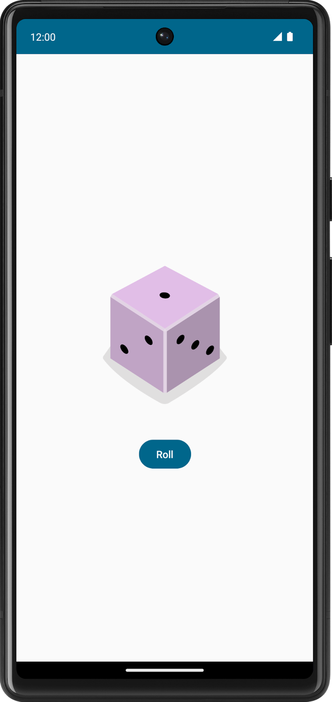

縦向きレイアウトを作成するには:

1. `DiceWithButtonAndImage()` 関数に `Column()` 関数を追加します。

> **注:** `Column` コンポーザブルの import ステートメントは `import androidx.compose.foundation.layout.Column` です。

2. `DiceWithButtonAndImage()` メソッド シグネチャから `modifier` 引数を `Column()` の修飾子引数に渡します。

`modifier` 引数により、`Column()` 関数内のコンポーザブルが、`modifier` インスタンスで呼び出される制約に従うようになります。

3. `horizontalAlignment` 引数を `Column()` 関数に渡し、`Alignment.CenterHorizontally` の値に設定します。

これにより、列内の子が幅に対してデバイス画面の中央に配置されます。

**`MainActivity.kt`**

```kotlin
fun DiceWithButtonAndImage(modifier: Modifier = Modifier) {
    Column (
        modifier = modifier,
        horizontalAlignment = Alignment.CenterHorizontally
    ) {}
}
```

### 5. ボタンを追加する

1. `strings.xml` ファイルに文字列を追加し、`Roll` 値に設定します。

**`res/values/strings.xml`**

```kotlin
<string name="roll">Roll</string>
```

2. `Column()` のラムダ本体に `Button()` 関数を追加します。

> **注:** `Button` コンポーザブルの import ステートメントは `import androidx.compose.material3.Button` です。

3. `MainActivity.kt` ファイルで、関数のラムダ本体の `Button()` に `Text()` 関数を追加します。
4. `roll` 文字列の文字列リソース ID を `stringResource()` 関数に渡し、結果を `Text` コンポーザブルに渡します。

**`MainActivity.kt`**

```kotlin
Column(
    modifier = modifier,
    horizontalAlignment = Alignment.CenterHorizontally
) {
    Button(onClick = { /*TODO*/ }) {
        Text(stringResource(R.string.roll))
    }
}
```

> **注**: `Button()` 関数を予測入力すると、`onClick = { /*TODO*/ }` 引数が表示されます。予測入力しない場合、または Android Studio で予測入力できない場合は、この引数をプレースホルダとして独自に実装できます。

> **注:** `stringResource` 関数の import ステートメントは `import androidx.compose.ui.res.stringResource` です。

### 6. 画像を追加する

このアプリに不可欠なもう一つのコンポーネントは、ユーザーが [**Roll**] ボタンをタップすると結果を表示する、サイコロの画像です。`Image` コンポーザブルを使用して画像を追加しますが、画像リソースが必要です。そのため、まずはこのアプリのために用意された画像をダウンロードする必要があります。

#### サイコロの画像をダウンロードする

1. [こちらの URL](https://github.com/google-developer-training/basic-android-kotlin-compose-training-dice-roller/raw/main/dice_images.zip) を開いて、サイコロの画像を ZIP ファイル形式でパソコンにダウンロードします。ダウンロードが完了するまで待機します。

パソコンに保存したファイルを見つけます。通常は **Downloads** フォルダにあります。

2. ZIP ファイルを解凍すると、1～6 の目を持つサイコロの画像ファイルが 6 つ入った、新しい `dice_images` フォルダが作成されます。

#### アプリにサイコロの画像を追加する

1. Android Studio で、**[View] > [Tool Windows] > [Resource Manager]** をクリックします。
2. **[+] > [Import Drawables]** をクリックしてファイル ブラウザを開きます。

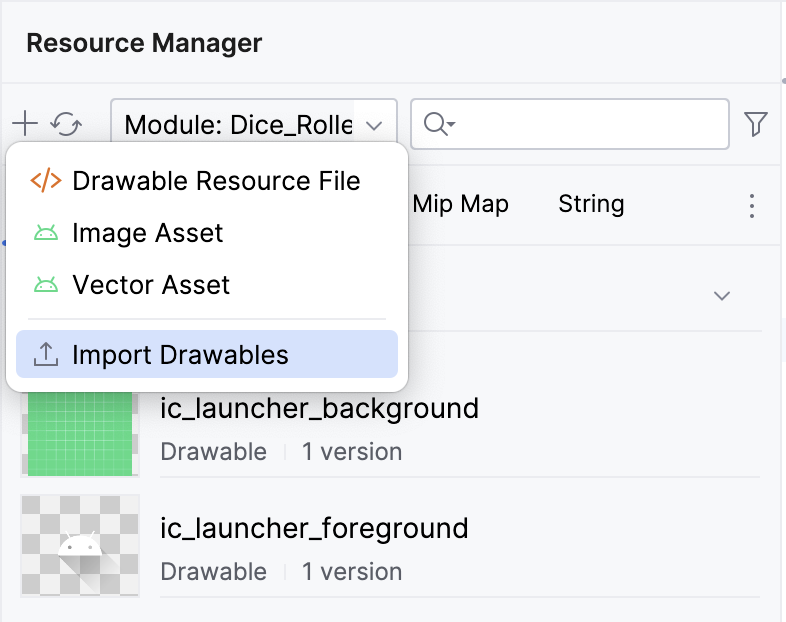

3. 6 つのサイコロの画像フォルダを見つけて選択し、アップロードに進みます。

アップロードされた画像は次のようになります。

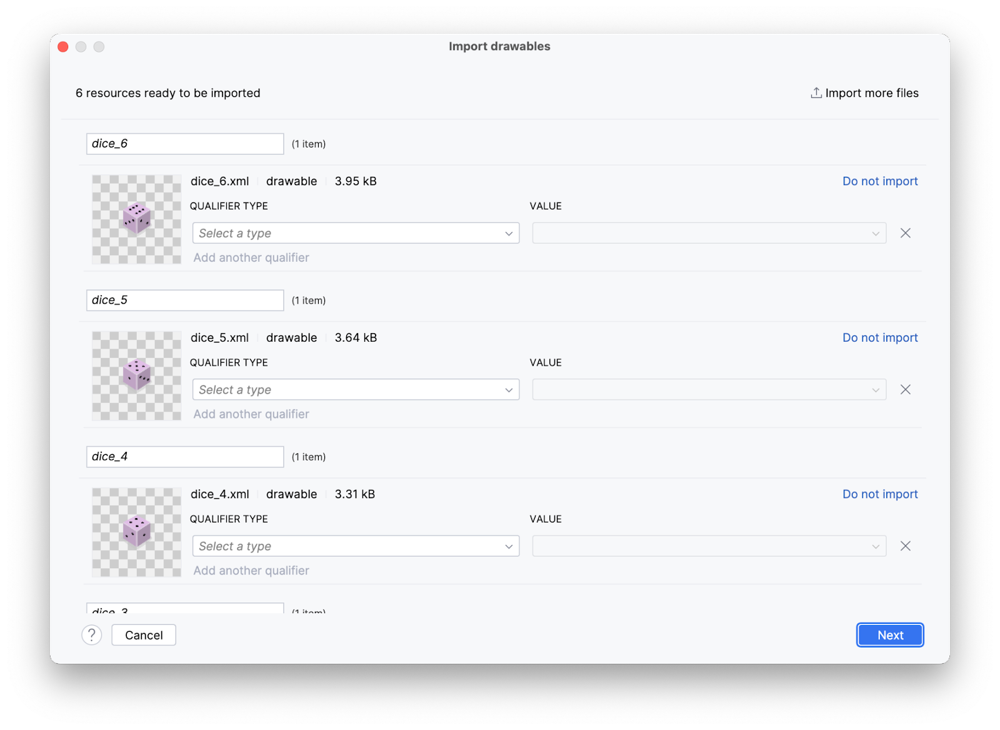

4. [**次へ**] をクリックします。

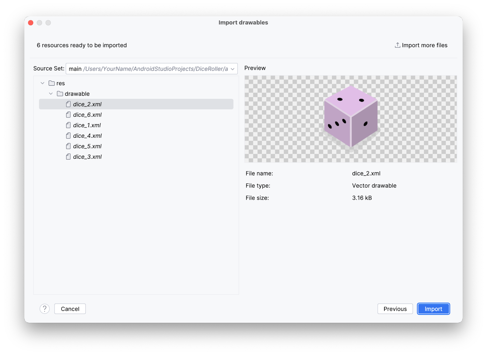

[**Import drawables**] ダイアログが表示され、ファイル構造内のリソース ファイルの移動先が表示されます。

5. [**Import**] をクリックして、6 つの画像をインポートすることを確認します。

画像が [**Resource Manager**] ペインに表示されます。

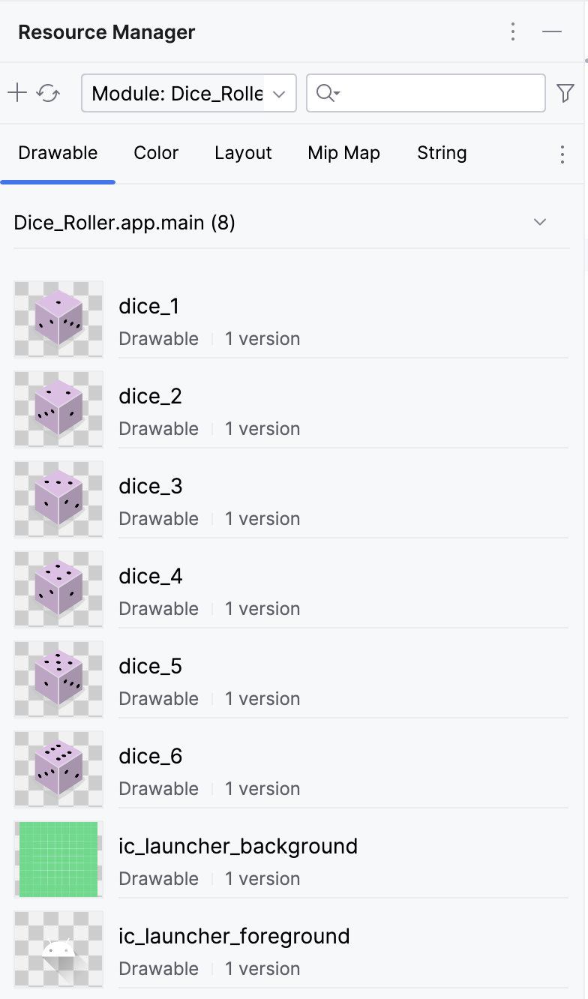

> **重要:** これらの画像は、Kotlin コードで次のリソース ID を使用して参照できます。
> 
> - `R.drawable.dice_1`
> - `R.drawable.dice_2`
> - `R.drawable.dice_3`
> - `R.drawable.dice_4`
> - `R.drawable.dice_5`
> - `R.drawable.dice_6`

お疲れさまでした。次のタスクでは、これらの画像をアプリで使用します。

#### `Image` コンポーザブルを追加する

サイコロの画像は [**Roll**] ボタンの上に表示されます。Compose は、その性質上、UI コンポーネントを順番に配置します。言い換えると、最初に宣言されたコンポーザブルが最初に表示されます。つまり、最初に宣言されたコンポーザブルが、その後に宣言されたコンポーザブルの上または前に表示されます。`Column` コンポーザブル内のコンポーザブルは、デバイス上で上下に重なり合って表示されます。このアプリでは、`Column` を使用してコンポーザブルを縦に積み重ねます。そのため、`Column()` 関数内で最初に宣言されたコンポーザブルは、同じ `Column()` 関数内で後に宣言されたコンポーザブルより前に表示されます。

`Image` コンポーザブルを追加するには:

1. `Column()` 関数本体で、`Button()` 関数の前に `Image()` 関数を作成します。

**`MainActivity.kt`**

```kotlin
Column(
    modifier = modifier,
    horizontalAlignment = Alignment.CenterHorizontally
) {
    Image()
    Button(onClick = { /*TODO*/ }) {
      Text(stringResource(R.string.roll))
    }
}
```

> **注:** `Image` コンポーザブルの import ステートメントは `import androidx.compose.foundation.Image` です。

2. `Image()` 関数に `painter` 引数を渡し、ドローアブル リソース ID 引数を受け入れる `painterResource` 値を代入します。ここでは、リソース ID `R.drawable.dice_1` 引数を渡します。

**`MainActivity.kt`**

```kotlin
Image(
    painter = painterResource(R.drawable.dice_1)
)
```

> **注:** `painterResource` 関数の import ステートメントは `import androidx.compose.ui.res.painterResource` です。

> **注**: 後ほど、リソース ID のために渡す値を変更します。ここでは、プレビュー用にコードがコンパイルされるよう、デフォルトを渡す必要があります。

3. アプリで画像を作成するときは、必ず「コンテンツの説明」を用意してください。コンテンツの説明は、Android 開発における重要な要素です。ユーザー補助を強化するために、それぞれの UI コンポーネントに説明を付けます。コンテンツの説明について詳しくは、[各 UI 要素について説明する](https://developer.android.com/guide/topics/ui/accessibility/apps#describe-ui-element)をご覧ください。コンテンツの説明をパラメータとして画像に渡すことができます。

**`MainActivity.kt`**

```kotlin
Image(
    painter = painterResource(R.drawable.dice_1),
    contentDescription = "1"
)
```

> **注:** 上に示したコンテンツの説明は、暫定的なプレースホルダです。これは、このレッスンの後のセクションで更新します。

これで、必要な UI コンポーネントがすべて揃いました。しかし、`Button` と `Image` が少し詰まっています。

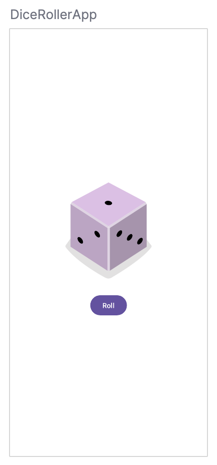

1. これを修正するには、`Image` コンポーザブルと `Button` コンポーザブルの間に [`Spacer`](https://developer.android.com/reference/kotlin/androidx/compose/foundation/layout/Spacer.composable#Spacer(androidx.compose.ui.Modifier)) コンポーザブルを追加します。`Spacer` は、パラメータとして `Modifier` を受け取ります。この場合、`Image` が `Button` の上にあるため、両者の間に縦方向のスペースが必要です。そのため、`Modifier` の高さを設定して `Spacer` に適用できます。高さを `16.dp` に設定してみます。通常、dp ディメンションは `4.dp` 単位で変更されます。

**`MainActivity.kt`**

```kotlin
Spacer(modifier = Modifier.height(16.dp))
```

> **注:** `Spacer` コンポーザブル、修飾子 `height`、`dp` のインポートは次のようになります。
> 
> `import androidx.compose.foundation.layout.height`
> 
> `import androidx.compose.foundation.layout.Spacer`
> 
> `import androidx.compose.ui.unit.dp`

2. [**Preview**] ペインで、[**Build & Refresh**] をクリックします。

次の画像のように表示されます。

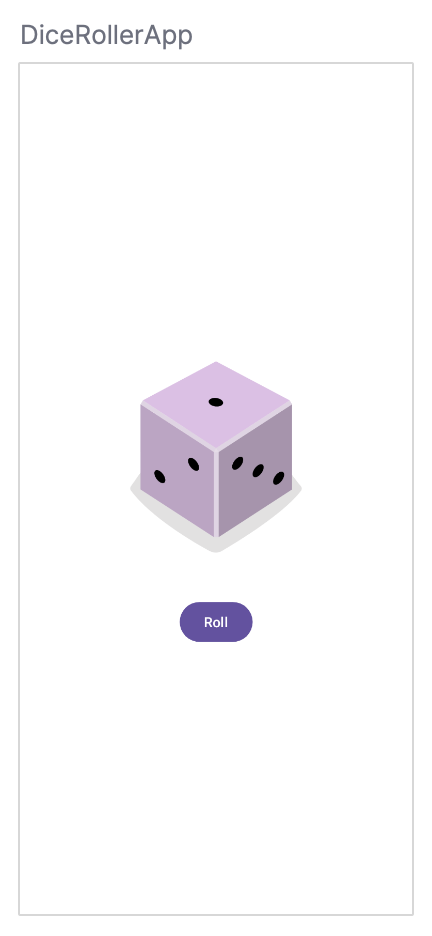

### 7. サイコロを振るロジックを作成する

必要なコンポーザブルがすべて揃ったため、ボタンをタップするとサイコロが振られるようにアプリを変更します。

#### ボタンをインタラクティブにする

1. `DiceWithButtonAndImage()` 関数で、`Column()` 関数の前に `result` 変数を作成し、`1` 値と等しくなるように設定します。
2. `Button` コンポーザブルを見てみると、内部にコメント `/*TODO*/` を含む中かっこのペアに設定された `onClick` パラメータが渡されています。ここでは、この中かっこはラムダというものを表します。中かっこの内部がラムダ本体です。関数を引数として渡す場合については、「[コールバック](https://en.wikipedia.org/wiki/Callback_(computer_programming))」とも呼ばれます。

**`MainActivity.kt`**

```kotlin
Button(onClick = { /*TODO*/ })
```

ラムダは関数リテラルです。他の関数と同様に機能しますが、`fun` キーワードで個別に宣言するのではなく、インラインで記述し、式として渡します。`Button` コンポーザブルは、関数が `onClick` パラメータとして渡されることを想定しています。ここはラムダを使用するために最適です。このセクションではラムダ本体を記述します。

3. `Button()` 関数で、`onClick` パラメータのラムダ本体の値からコメント `/*TODO*/` を削除します。
4. サイコロの出目はランダムです。それをコードに反映させるには、正しい構文を使用して乱数を生成する必要があります。Kotlin では、数値範囲に対して `random()` メソッドを使用できます。`onClick` ラムダ本体で、`result` 変数を 1～6 の範囲に設定し、その範囲に対して `random()` メソッドを呼び出します。Kotlin では、範囲の最初の数字と最後の数字の間にピリオドを 2 つ入れることで範囲を指定することに留意してください。

**`MainActivity.kt`**

```kotlin
fun DiceWithButtonAndImage(modifier: Modifier = Modifier) {
    var result = 1
    Column(
        modifier = modifier,
        horizontalAlignment = Alignment.CenterHorizontally
    ) {
        Image(
            painter = painterResource(R.drawable.dice_1),
            contentDescription = "1"
        )
        Spacer(modifier = Modifier.height(16.dp))
        Button(onClick = { result = (1..6).random() }) {
            Text(stringResource(R.string.roll))
        }
    }
}
```

これでボタンをタップできるようになりましたが、ボタンをタップしても見た目は変わりません。機能を構築する必要があります。

##### Dice Roller アプリに条件を追加する

前のセクションでは、`result` 変数を作成し、`1` 値にハードコードしました。最終的に、[**Roll**] ボタンをタップすると `result` 変数の値がリセットされ、表示される画像が決定されます。

コンポーザブルは、デフォルトではステートレスです。つまり、値は保持されず、システムがいつでも再コンポーズでき、結果的に値がリセットされます。しかし、Compose ではこれを簡単に回避できます。コンポーズ可能な関数は、`remember` コンポーザブルを使用してオブジェクトをメモリに格納できます。

1. `result` 変数を `remember` コンポーザブルにします。

`remember` コンポーザブルには、渡す関数が必要です。

2. `remember` コンポーザブル本体で、`mutableStateOf()` 関数を渡してから、その関数に `1` 引数を渡します。

`mutableStateOf()` 関数はオブザーバブルを返します。オブザーバブルについては後ほど詳しく説明しますが、ここでは基本的に、`result` 変数の値が変更されると再コンポーズがトリガーされ、結果の値が反映されて、UI が更新されます。

**`MainActivity.kt`**

```kotlin
var result by remember { mutableStateOf(1) }
```

> **注**: `import androidx.compose.runtime.mutableStateOf` ステートメントと `import androidx.compose.runtime.remember` ステートメントは、`mutableStateOf()` 関数と `remember` コンポーザブルに必要なパッケージをインポートします。
> 
> State の必要な拡張関数をインポートするには、次の import ステートメントも必要です。
> 
> `import androidx.compose.runtime.getValue`
> 
> `import androidx.compose.runtime.setValue`

ボタンをタップすると `result` 変数が乱数の値で更新されます。

`result` 変数を使用して、表示する画像を決定できるようになりました。

3. `result` 変数のインスタンス化の下で、不変の `imageResource` 変数を作成して `result` 変数を受け入れる `when` 式に設定し、考えられる結果をそれぞれのドローアブルに設定します。

**`MainActivity.kt`**

```kotlin
val imageResource = when (result) {
    1 -> R.drawable.dice_1
    2 -> R.drawable.dice_2
    3 -> R.drawable.dice_3
    4 -> R.drawable.dice_4
    5 -> R.drawable.dice_5
    else -> R.drawable.dice_6
}
```

4. `Image` コンポーザブルの `painterResource` パラメータに渡される ID を `R.drawable.dice_1` ドローアブルから `imageResource` 変数に変更します。
5. `result` 変数を `toString()` で文字列に変換し、`contentDescription` として渡すことで、`result` 変数の値を反映するように `Image` コンポーザブルの `contentDescription` パラメータを変更します。

**`MainActivity.kt`**

```kotlin
Image(
   painter = painterResource(imageResource),
   contentDescription = result.toString()
)
```

6. アプリを実行します。

**Dice Roller** アプリが完全に機能するようになりました。


### 8. 解答コードを取得する

このレッスンの完成したコードをダウンロードするには、次の git コマンドを使用します。

```
$ git clone https://github.com/google-developer-training/basic-android-kotlin-compose-training-dice-roller.git
```

または、リポジトリを ZIP ファイルとしてダウンロードし、Android Studio で開くこともできます。

解答コードを確認する場合は、[GitHub で表示します](https://github.com/google-developer-training/basic-android-kotlin-compose-training-dice-roller)。

1. プロジェクト用に提供されている GitHub リポジトリ ページに移動します。
2. ブランチ名がレッスンで指定されたブランチ名と一致していることを確認します。たとえば、次のスクリーンショットでは、ブランチ名は **main** です。

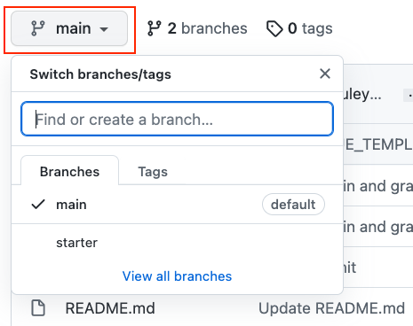

3. プロジェクトの GitHub ページで、[**Code**] ボタンをクリックすると、ポップアップが表示されます。

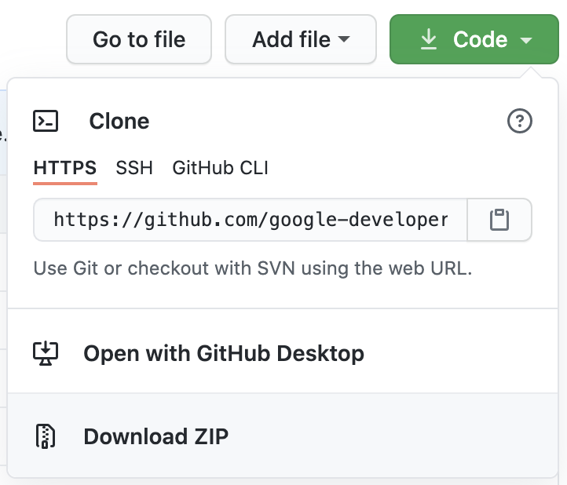

4. ポップアップで、[**Download ZIP**] をクリックして、プロジェクトをパソコンに保存します。ダウンロードが完了するまで待ちます。
5. パソコンに保存したファイルを見つけます（[**ダウンロード**] フォルダなど）。
6. ZIP ファイルをダブルクリックして展開します。プロジェクト ファイルが入った新しいフォルダが作成されます。

#### Android Studio でプロジェクトを開く

1. Android Studio を起動します。
2. [**Welcome to Android Studio**] ウィンドウで、[**Open**] をクリックします。


注: Android Studio がすでに開いている場合は、メニューから [**File**] > [**Open**] を選択します。


3. ファイル ブラウザで、展開したプロジェクト フォルダがある場所（[**ダウンロード**] フォルダなど）に移動します。
4. そのプロジェクト フォルダをダブルクリックします。
5. Android Studio でプロジェクトが開かれるまで待ちます。
6. **実行**ボタン  をクリックして、アプリをビルドし、実行します。期待どおりにビルドされることを確認します。

### 9. まとめ

Compose を使用して Android 用のインタラクティブな **Dice Roller** アプリを作成しました。

#### 概要

- コンポーズ可能な関数を定義する。
- Composition でレイアウトを作成する。
- `Button` コンポーザブルでボタンを作成します。
- `drawable` リソースをインポートする。
- `Image` コンポーザブルを使用して画像を表示する。
- コンポーザブルでインタラクティブな UI を作成する。
- `remember` コンポーザブルを使用して、Composition 内のオブジェクトをメモリに保存する。
- `mutableStateOf()` 関数で UI を更新して、オブザーバブルを作成する。

#### 詳細

- [Jetpack Compose チュートリアル](https://developer.android.com/jetpack/compose/tutorial)
- [Jetpack Compose ツールキットの依存関係を追加する](https://developer.android.com/jetpack/compose/setup#compose-compiler)
- [Jetpack Compose を使ってみる](https://developer.android.com/jetpack/compose/documentation)
- [コンポーズ可能な関数の基本](https://developer.android.com/jetpack/compose/layouts/basics#composable-functions)
- [`Button` コンポーザブル](https://developer.android.com/reference/kotlin/androidx/compose/material3/Button.composable#Button(kotlin.Function0,androidx.compose.ui.Modifier,kotlin.Boolean,androidx.compose.ui.graphics.Shape,androidx.compose.material3.ButtonColors,androidx.compose.material3.ButtonElevation,androidx.compose.foundation.BorderStroke,androidx.compose.foundation.layout.PaddingValues,androidx.compose.foundation.interaction.MutableInteractionSource,kotlin.Function1))
- [`Image` コンポーザブル](https://developer.android.com/reference/kotlin/androidx/compose/foundation/Image.composable#Image(androidx.compose.ui.graphics.ImageBitmap,kotlin.String,androidx.compose.ui.Modifier,androidx.compose.ui.Alignment,androidx.compose.ui.layout.ContentScale,kotlin.Float,androidx.compose.ui.graphics.ColorFilter,androidx.compose.ui.graphics.FilterQuality))
- [状態と Jetpack Compose](https://developer.android.com/jetpack/compose/state)

## 4. Android Studio でデバッガを使用する


### 1. 始める前に

このレッスンでは、Android Studio のデバッガを使用して、Dice Roller アプリを実行したときの動作を調べる方法について説明します。

デバッガは、Android アプリを動かすコードの実行を検査し、バグを修正できるようにするために不可欠なツールです。コードの実行を一時停止するポイントを指定し、変数、メソッド、その他のコードの側面を手動で操作できます。

#### 前提条件

- Android Studio に関する基本的な知識があること
- Android Studio で基本的な Jetpack Compose アプリを作成、実行できること
- インタラクティブな Dice Roller アプリを作成するレッスンを修了していること

#### 学習内容

- Android アプリにデバッガをアタッチする方法
- デバッガをアタッチしたアプリを起動する方法
- デバッガの基本的な機能を使用する方法
- デバッガの一般的な用途

#### 必要なもの

- Android Studio がインストールされているパソコン
- Compose での Dice Roller アプリの解答コード

### 2. スターター コードを取得する

まず、コードをダウンロードします。

または、コードの GitHub リポジトリのクローンを作成することもできます。

```
$ git clone https://github.com/google-developer-training/basic-android-kotlin-compose-training-dice-roller.git
$ cd basic-android-kotlin-compose-training-dice-roller
```

> **注:**スターター コードは、ダウンロードしたリポジトリの `main` ブランチにあります。

コードは [**GitHub リポジトリ**](https://github.com/google-developer-training/basic-android-kotlin-compose-training-dice-roller)で確認できます。

### 3. デバッガを実行する

アプリとともにデバッガを実行する方法は 2 つあります。

- デバイスまたはエミュレータで実行されている既存のアプリプロセスにデバッガをアタッチする
- デバッガでアプリを実行する

どちらの方法でも、ある程度は同じことを実現できます。両方の方法を理解したら、好みの方法か、必要な方法を選んでください。

#### アプリプロセスにデバッガをアタッチする

アプリがすでに実行されている場合は、デバッガをアタッチできます。

アプリプロセスにデバッガをアタッチする手順は次のとおりです。

1. （**Attach Debugger to Android Process**）をクリックします。

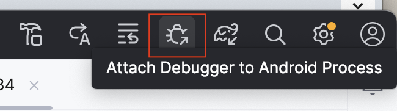

デバッガをアタッチするプロセスを選択できる [**Choose Process**] ダイアログが開きます。

2. [**`com.example.diceroller`**] を選択し、[**OK**] をクリックします。

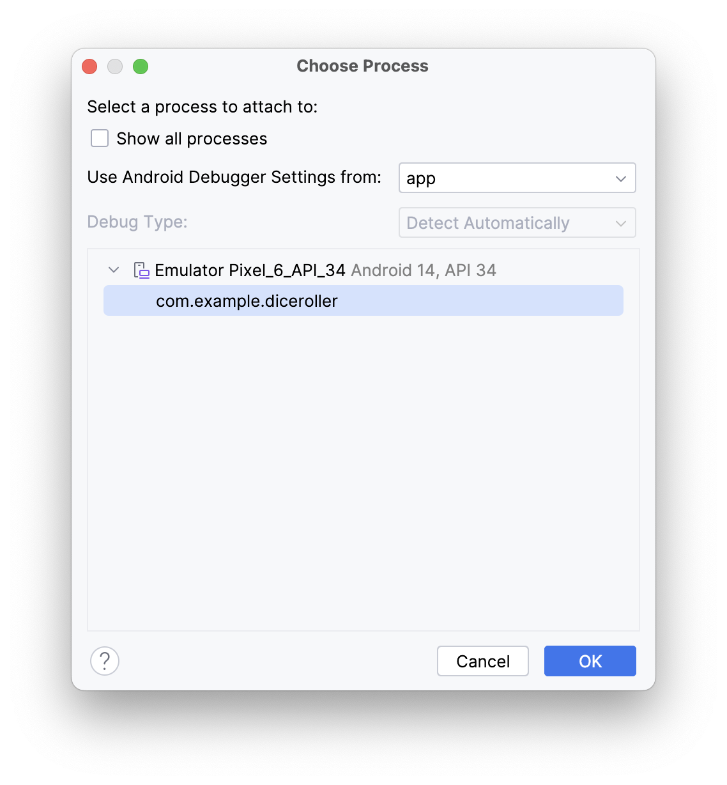

[**Debug**] ペインが Android Studio の下部に表示され、ターゲット デバイスまたはエミュレータにデバッガがアタッチされたことを示すメッセージが表示されます。

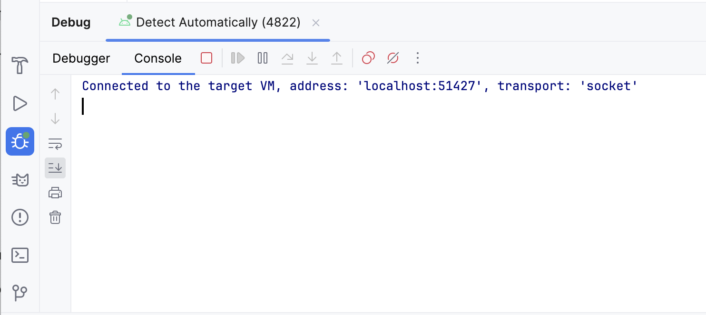

アプリにデバッガをアタッチしましたが、その意味やデバッガでできることついては、このレッスンで後ほど説明します。次に、デバッガをアタッチしたアプリを起動する方法を学びます。

#### **デバッガで**アプリを実行する

デバッガを使用することが最初からわかっている場合は、デバッガでアプリを実行すると時間を節約できます。さらに、アプリの起動時にのみ実行されるコードをデバッグする場合は、デバッガをアタッチした状態でアプリを起動する必要があります。

デバッガでアプリを実行する手順は次のとおりです。

1. [**Debug**] ペインで 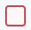（**Stop**）をクリックし、デバイスまたはエミュレータ上のアプリを閉じます。

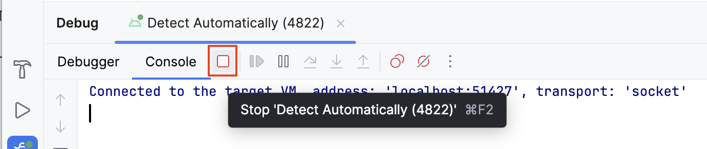

2. （**Debug ‘app'**）をクリックします。

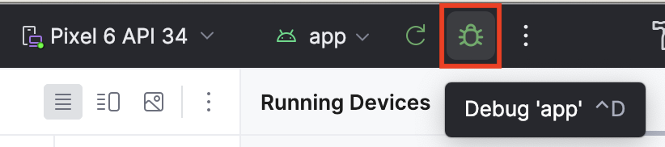

同じ [**Debug**] ペインが Android Studio の下部に表示され、コンソールの出力が表示されます。

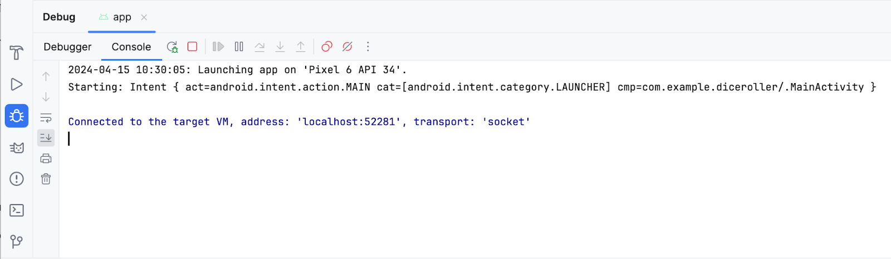

デバッガの起動方法について理解したところで、次はその使用方法について説明します。

### 4. デバッガを使用する

#### **Debug** **ペイン**

[**Debug**] ペインの上部に多数のボタンがありますが、こうしたボタンは今のところあまり意味をなさず、ほとんどがグレー表示され、クリックできません。このセクションでは、デバッガでよく使用する機能について説明します。このレッスンでは、その他のボタンについても必要に応じて説明します。

デバッガを初めて起動すると、[**Debug**] ペインに複数のボタンが表示されます。[**Debug**] ペインの上部には、[**Debugger**] ボタンと [**Console**] ボタンが表示されます。

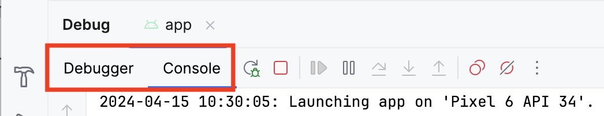

[**Console**] ボタンをクリックするとアプリの logcat 出力が表示されます。コード内にログ ステートメントがある場合は、そのコード部分が実行されると出力が表示されます。

[**Debugger**] ボタンをクリックすると別々のペインが 3 つ表示されますが、デバッガを使用していないため今のところ空白です。

1. [Frames] ディスプレイ
2. 評価と監視式のエントリ
3. Variables ペイン

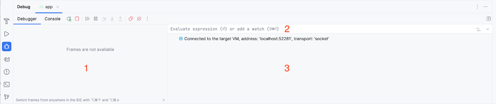

#### デバッガの一般的な機能を使用する

##### ブレークポイントを設定する

デバッガの主な機能として、特定のコード行の実行をブレークポイントで停止できることが挙げられます。

Android Studio でブレークポイントを設定するには、特定のコード行に移動してから、行番号の横のガターをクリックする必要があります。ブレークポイントの設定を解除するには、ガターの既存のブレークポイントをクリックして消去する必要があります。

- これを試す場合は、`imageResource` 変数が設定されているところにブレークポイントを設定します。

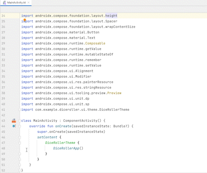

##### Resume Program **ボタン**を使用する

前のセクションでは、`imageResource` 変数が設定されているところにブレークポイントを設定しました。このブレークポイントにより、命令の実行が一時停止されます。デバッガでコードの実行が一時停止されたとき、実行を続行してアプリの実行を継続する必要が生じることはよくあります。最も直接的な方法は、**Resume Program** ボタンを使用することです。

プログラムを再開する手順は次のとおりです。

1. （**Debug ‘app'**）をクリックします。アプリを起動すると、次の画像のように表示されます。

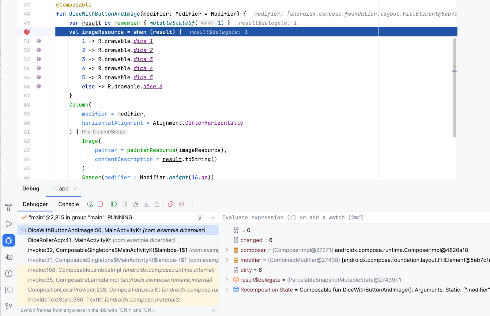

プログラムを再開する前に、デバッガが実行を一時停止したときに画面に表示される内容について説明します。

- [**Debug**] ペインのボタンの多くがクリックできるようになります。
- [**Frames**] ペインには、ブレークポイントが設定されている行への参照がハイライト表示されるなど、多くの情報が表示されます。
- [**Variables**] ペインには、項目の数が表示されますが、このアプリには変数があまりないため、現時点でこのレッスンの範囲内に関連のある情報はあまりありません。ただし、変数を検査する機能は、実行時にコード内で起きることについての情報が得られるため、デバッガに不可欠な機能です。このレッスンでは、変数を検査する方法について後ほど詳しく説明します。

デバイスまたはエミュレータでアプリを見ると、あるコード行でアプリが一時停止しているため、画面は空白になっています。具体的には、実行がブレークポイントで停止し、UI がまだレンダリングされていません。

ブレークポイントが設定されているからといって、アプリがすぐに停止するとは限らないことに注意してください。コード内のどこにブレークポイントを設定したかによって異なります。この例では、アプリの起動時に実行される行にブレークポイントを設定しました。

ブレークポイントが設定された行を実行しようとしたときにのみアプリがブレークポイントで一時停止する、という点が重要です。デバッガを進める方法は複数ありますが、今回は **Resume Program** ボタンを使用します。

2. 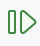（**Resume Program**）をクリックします。

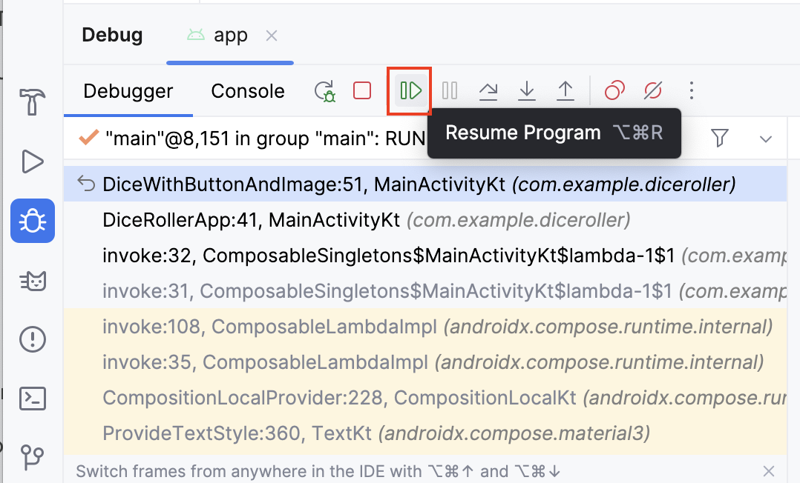

次の画像のように表示されます。

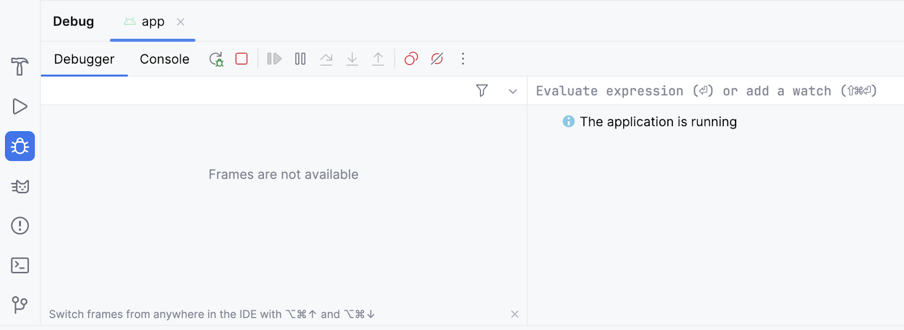

情報の大部分が消え、再度、ボタンがクリックできなくなります。また、デバイスまたはエミュレータでは、アプリは通常どおりに表示されます。これは、ブレークポイントでコードが一時停止されず、アプリが通常の実行状態になっているためです。デバッガはアタッチされていますが、ブレークポイントが設定されたコード行を実行しようとするまでは、特に何も起きません。このブレークポイントは以降の例で役立つため、そのままにしておきます。

##### Step Into **ボタン**を使用する

デバッガの **Step Into** ボタンを使用すると、実行時のコードを簡単かつ詳細に確認できます。命令がメソッドや他のコードを呼び出している場合、**Step Into** ボタンを使用すると、デバッガを起動してブレークポイントを設定する前に、手動で移動することなくコードに入ることができます。

**Step Into** ボタンを使用する手順は次のとおりです。

1. `DiceRollerApp()` 関数が呼び出される `MainActivity` クラスの `onCreate()` 関数内で、`setContent` ラムダ本体にブレークポイントを作成します。

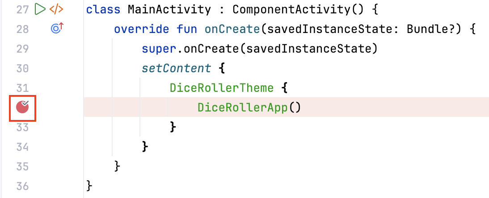

2. （**Debug ‘app'**）をクリックし、デバッガでアプリを再実行します。実行は、`DiceRollerApp()` 関数が呼び出される行で一時停止します。
3. 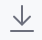（**Step Into**）をクリックします。

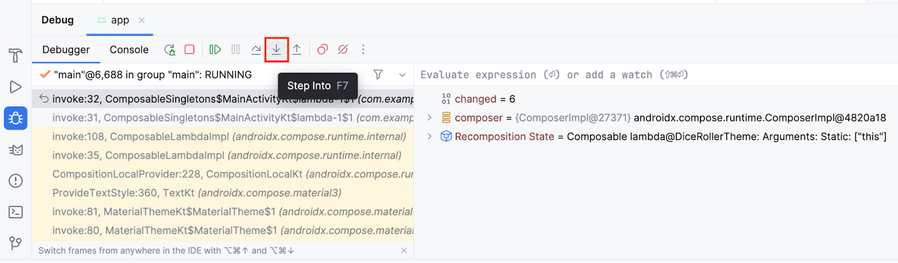

40 行目がハイライト表示され、[**Debug**] ペインの [**Frames**] ペインに、40 行目でコードが一時停止されていることが示されました。

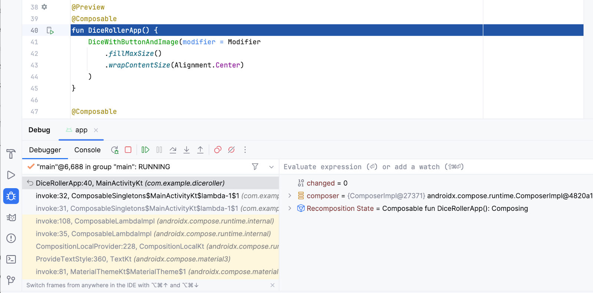

[**Frames**] ペインを開くと、ハイライト表示された行の次の行の先頭に `invoke:` が付けられ、その後に行番号が続いていることがわかります（前の画像では 32 行目）。これを「コールスタック」といいます。基本的には、コードの実行を現在の行に導く呼び出しのチェーンが表示されます。この場合は、32 行目に `DiceRollerApp()` 関数を呼び出す命令があります。

その関数呼び出しに設定されたブレークポイントでデバッガが停止したとき、**Step Into** ボタンをクリックすると、デバッガはその関数にステップインし、実行は関数が宣言されている 40 行目に導かれます。ハイライト表示された行は、実行が一時停止された場所を示しています。ハイライト表示された行の次の行に行番号が関連付けられている場合は、実行のパスを示しています。この場合、デバッガは 32 行目の命令によって 40 行目に達したことを示しています。

4. （**Resume Program**）をクリックします。

これで、設定した元のブレークポイントに達します。最初の例で実行を停止したときに見た内容について、理解が深まったかと思います。次の画像は、**Resume Program** セクションの 6 つ目のステップと同じ画像です。

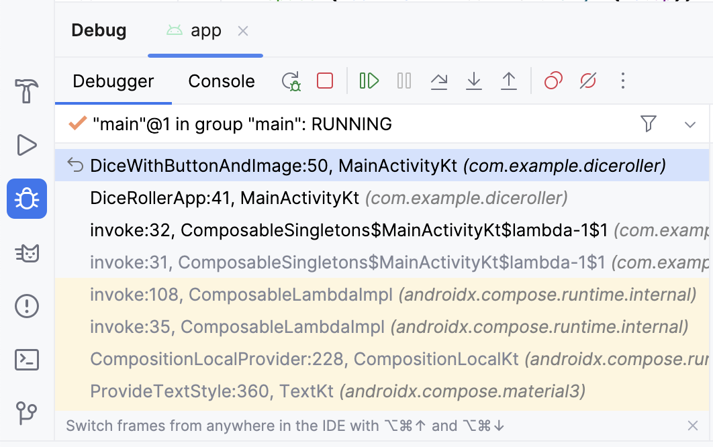

コールスタックでは、`DiceWithButtonAndImage()` 関数が 50 行目で一時停止していることがわかります。この関数は、32 行目で呼び出された `DiceRollerApp()` 関数の 41 行目から呼び出されています。コールスタック機能を使用すると、実行パスを把握できます。アプリ内のさまざまな場所から関数を呼び出すときに非常に便利です。

**Step Into** ボタンを使用すると、関数自体にブレークポイントを設定しなくても、関数に入って実行を一時停止できます。この場合、`DiceRollerApp()` 関数の呼び出しにブレークポイントを設定します。**Step Into** ボタンをクリックすると、`DiceRollerApp()` 関数で実行が一時停止します。

Dice Roller は、ファイル、クラス、関数が少ないため、かなり小規模なアプリです。規模の大きいアプリを扱う場合、デバッガの **Step Into** 機能は、コードを移動することなくコードにドリルダウンするため有用です。

##### Step Over **ボタン**を使用する

**Step Over** ボタンを使用すると、実行時にアプリコードをステップ実行できます。実行を次のコード行に移して、デバッガを進めます。

**Step Over** ボタンを使用する手順は次のとおりです。

- （**Step Over**）をクリックします。

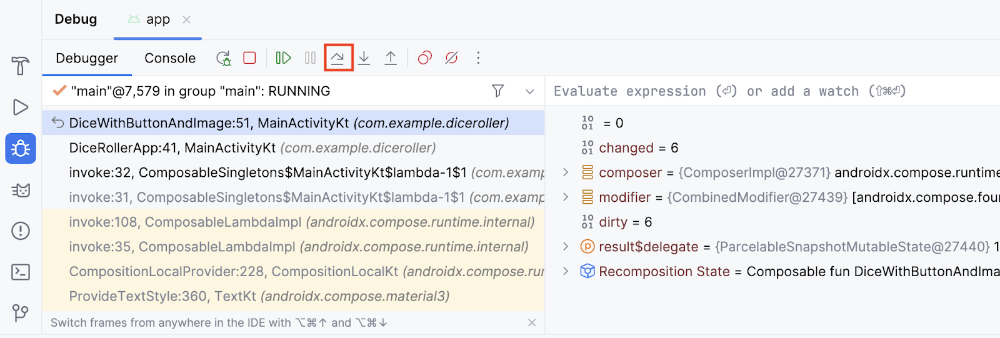

デバッガが、次に実行する行（51 行目）でコードを一時停止していることがわかります。各行を連続してステップ実行できます。

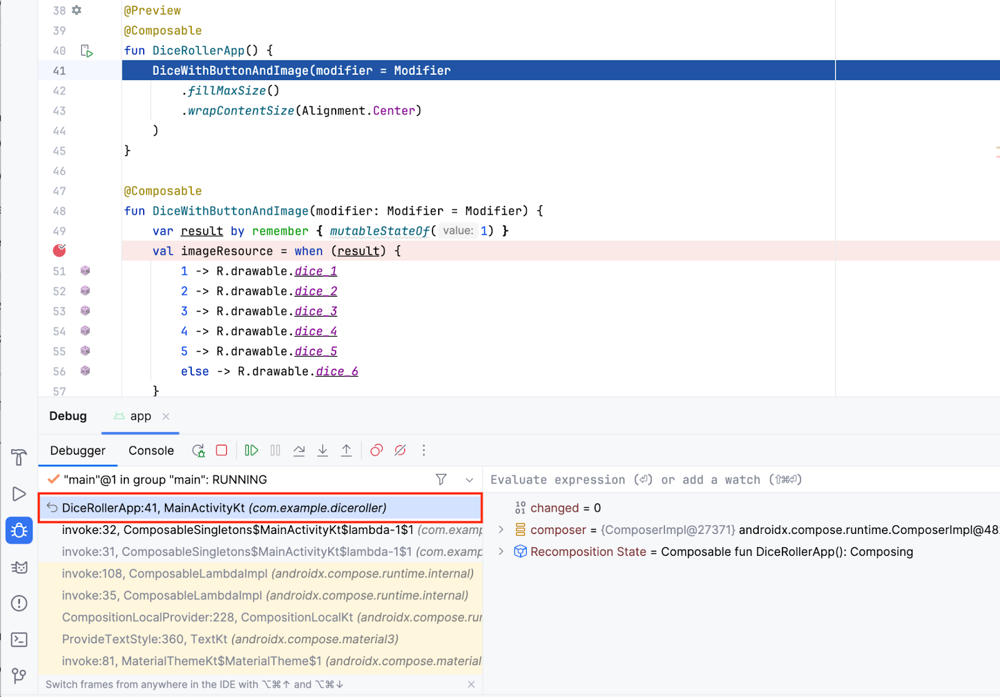

##### Step Out **ボタン**を使用する

**Step Out** ボタンは **Step Into** ボタンとは逆の動作をします。**Step Out** ボタンは、コールスタックにドリルダウンするのではなく、コールスタックに移動します。

**Step Out** ボタンを使用する手順は次のとおりです。

1. （**Step Out**）をクリックします。

プログラムはどの行で一時停止するでしょうか。

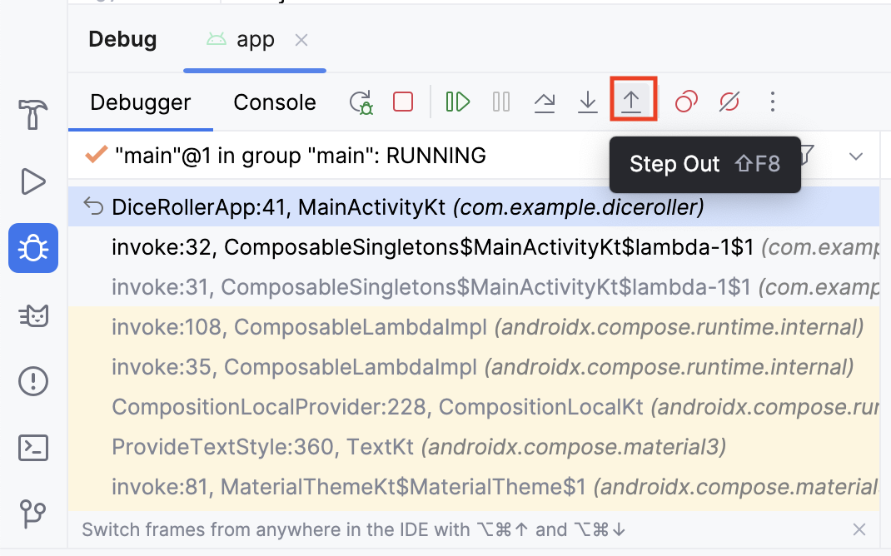

2. デバッガは `DiceRollerApp()` 関数からステップアウトして、その関数を呼び出した行に戻りました。

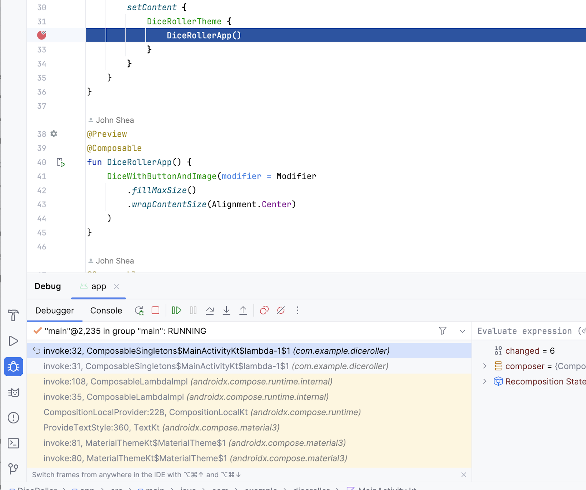

**Step Out** ボタンは、メソッド コールスタックに深く入りすぎた場合に有用なツールです。ステップインしたメソッドごとにコードをすべてステップ実行することなく、コールスタックを上がることができます。

#### **変数を検査する**

このレッスンで前に [**Variables**] ペインについて簡単に説明しました。このペインでは、ペインに表示された変数を検査してアプリの問題をデバッグする方法について詳しく知ることができます。

変数を検査する手順は次のとおりです。

1. `DiceRollerApp()` 関数が呼び出されているところのブレークポイントをクリックして削除し、`imageResource` 変数が設定されているところのブレークポイントは残します。
2. （**Debug ‘app'**）をクリックします。`result$delegate` 変数が、値が 1 の `MutableState` になっています。これは、変数が定義されると、`mutableStateOf` 1 でインスタンス化されるためです。`MutableState` は、変更可能な状態を result 変数に代入できることを意味します。

> **注:** [**Variables**] ペインの `result$delegate` 変数はコード内の `result` 変数を参照します。`result` 変数は `remember` デリゲートであるため、`$delegate` という表記があります。

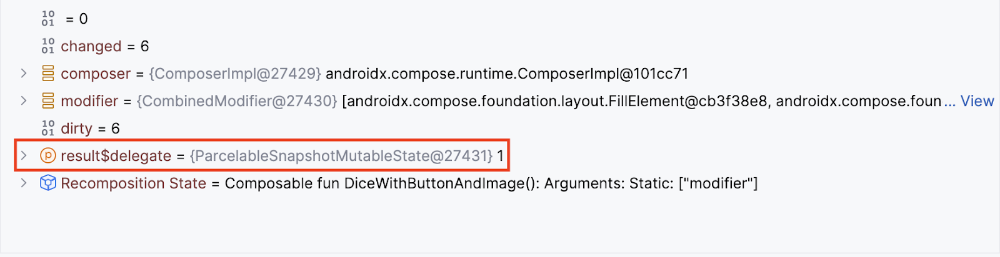

3. （**Resume Program**）をクリックします。
4. アプリで [**Roll**] をクリックします。コードはブレークポイントで再度一時停止します。`result$delegate` 変数には異なる値が表示される可能性があります。

この画像では、`result$delegate` 変数の可変状態に値 2 が格納されています。これは、デバッガで実行時に変数をどのように検査できるかを示しています。多機能なアプリでは、変数の値がクラッシュの原因となることがあります。デバッガを使用して変数を検査すると、クラッシュの詳細を把握してバグを修正できます。

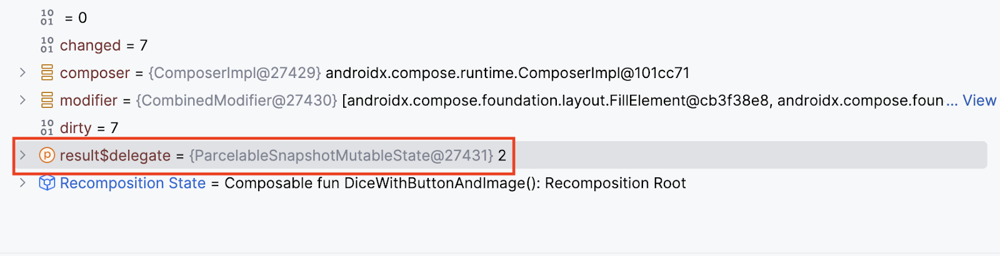

### 5. まとめ

お疲れさまでした。Android Studio のデバッガを使用しました。

#### 概要

- アプリにデバッガをアタッチする
- デバッガをアタッチしたアプリを起動する
- Debugger ペインについて理解する
- ブレークポイントを設定する
- デバッガからプログラムを再開する
- **Step Into** ボタンを使用する
- **Step Over** ボタンを使用する
- **Step Out** ボタンを使用する
- デバッガで変数を検査する

## 5. 練習: クリック動作（提出対象）


### 1. 始める前に

この章で、アプリにボタンを追加する方法と、アプリをボタンクリックに応答するように変更する方法を学習しました。次は、アプリを作成して、学んだことを実践しましょう。

作成するのは Lemonade アプリというアプリです。まず、Lemonade アプリの要件を確認し、アプリの外観と動作を把握しましょう。挑戦したい人は、自力で作成してもかまいません。行き詰まっても、以降のセクションに目を通せば、問題を分割して段階的に進める方法のヒントや指針が得られます。

自分のやりやすいペースで練習問題に取り組みましょう。必要なだけ時間をかけ、アプリの機能を部分ごとに作成してください。Lemonade アプリの解答コードは最後に用意していますが、解答を確認する前に自分でアプリを作成してみることをおすすめします。用意されている解答は Lemonade アプリを作成する唯一の方法ではないので、アプリの要件が満たされていれば、別の方法で作成してもまったく問題ありません。

#### **前提条件**

- Compose で、テキスト コンポーザブルと画像コンポーザブルを使用するシンプルな UI レイアウトを作成できること
- ボタンクリックに応答するインタラクティブ アプリを作成できること
- コンポジションと再コンポジションに関する基本的な知識があること
- Kotlin プログラミング言語の基本（関数、変数、条件、ラムダなど）に精通していること

#### **必要なもの**

- Android Studio がインストールされた、インターネットに接続できるパソコン。

### 2. アプリの概要

あなたは、デジタル上でレモネードを作るという私たちのビジョンを一緒に実現しようとしています。プロジェクトの目標は、画面上の画像をタップするとレモンを絞り、グラス 1 杯分のレモネードを作るという、シンプルでインタラクティブなアプリを作成することです。このアプリはメタファーとして、あるいはちょっとした暇つぶしの方法として考えてください。

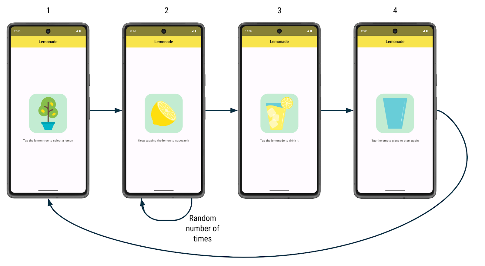

アプリの動作は次のとおりです。

1. 最初に起動されたとき、レモンの木を表示します。そこには、レモンの木の画像をタップし、木からレモンを「選ぶ」ように促すラベルがあります。
2. レモンの木がタップされたら、レモンを表示します。レモンをタップして「絞り」、レモネードを作るように促します。レモンを絞るには、数回タップする必要があります。レモンを絞るのに必要なタップの回数は毎回異なり、2 から 4 までのランダムに生成された数となります。
3. 必要な回数レモンがタップされたら、新鮮なレモネードを表示します。グラスをタップしてレモネードを「飲む」ようユーザーに求めます。
4. レモネードのグラスがタップされたら、空のグラスを表示します。やり直すには、空のグラスをタップするようユーザーに求めます。
5. 空のグラスがタップされたら、レモンの木を表示して、この過程をもう一度始めます。レモネードがおかわりできます。

以下は、アプリの外観を大きめのスクリーンショットで表したものです。

| 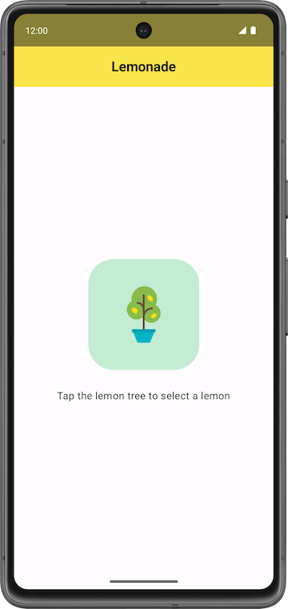 | 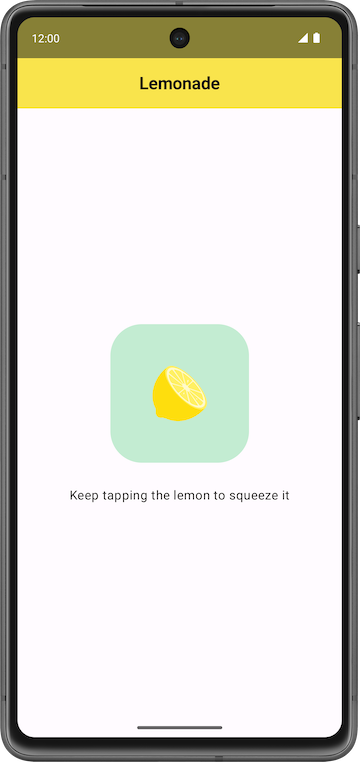 | 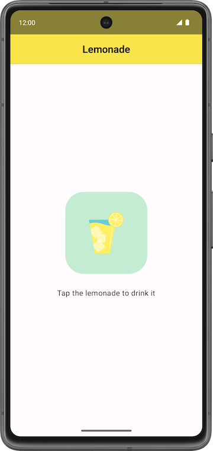 | 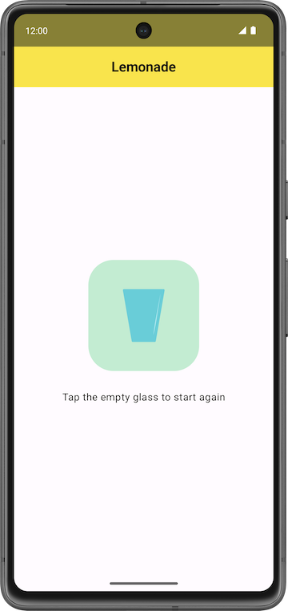 |
|---|---|---|---|

レモネードを作成するステップごとに、画面上の画像とテキストラベルは異なり、クリックに対する応答も異なります。たとえば、レモンの木をタップすると、レモンが表示されます。

ここでは、アプリの UI レイアウトを作成し、レモネードを作るためのすべてのステップをユーザーが完了するためのロジックを実装することです。

### 3. 始める

#### **プロジェクトの作成**

Android Studio で、**Empty Activity** テンプレートを使用して、以下のプロジェクトを作成します。

- Name: Lemonade
- Package name: com.example.lemonade
- Minimum SDK: 24

アプリが正常に作成され、プロジェクトがビルドされたら、次のセクションに進みます。

#### **画像を追加する**

Lemonade アプリで使用する 4 つのベクター型ドローアブル ファイルが用意されています。

次の手順でファイルを入手します。

1. アプリの[画像の ZIP ファイル](https://github.com/google-developer-training/basic-android-kotlin-compose-training-lemonade/raw/main/lemonade_images.zip)をダウンロードします。
2. ZIP ファイルをダブルクリックします。このステップでは、画像がフォルダに展開されます。
3. 画像をアプリの `drawable` フォルダに追加します。方法がわからない場合は、インタラクティブな Dice Roller アプリを作成するレッスンで確認してください。

プロジェクト フォルダは次のスクリーンショットのように、`lemon_drink.xml`、`lemon_restart.xml`、`lemon_squeeze.xml`、`lemon_tree.xml` のアセットが **res > drawable** ディレクトリに表示されるようにしてください。

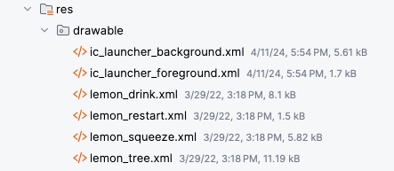

4. ベクター型ドローアブル ファイルをダブルクリックして、画像プレビューを表示します。
5. [**Design**] ペイン（[**Code**] または [**Split**] ビューではありません）を選択すると、画像がビューの幅いっぱいに表示されます。

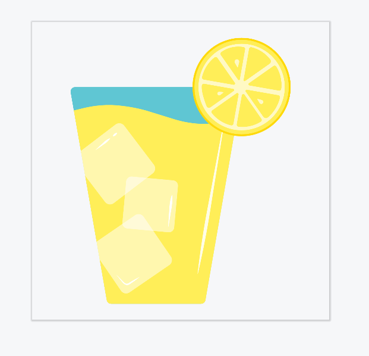

アプリに画像ファイルが追加されると、コード内で参照できるようになります。たとえば、ベクター型ドローアブル ファイルの名前が `lemon_tree.xml` である場合、Kotlin コードでは、`R.drawable.lemon_tree` という形式のリソース ID を使ってそのドローアブルを参照できます。

#### **文字列リソースを追加する**

プロジェクトの **res > values > strings.xml** ファイルに、次の文字列を追加します。

- `Tap the lemon tree to select a lemon`
- `Keep tapping the lemon to squeeze it`
- `Tap the lemonade to drink it`
- `Tap the empty glass to start again`

プロジェクトには、以下の文字列も必要です。ユーザー インターフェースの画面には表示されませんが、アプリ内の画像の内容説明で、画像を説明するために使用されます。以下の文字列をアプリの `strings.xml` ファイルに追加します。

- `Lemon tree`
- `Lemon`
- `Glass of lemonade`
- `Empty glass`

アプリで文字列リソースを宣言する方法がわからない場合は、インタラクティブな Dice Roller アプリを作成するレッスンまたは[文字列](https://developer.android.com/guide/topics/resources/string-resource#String)で確認してください。各文字列リソースに、含まれる値を表す適切な識別名を付けましょう。たとえば、文字列 `"Lemon"` の場合、`strings.xml` ファイルで識別名 `lemon_content_description` で宣言すると、コードではリソース ID `R.string.lemon_content_description` で参照できます。

#### **レモネードを作る手順**

これで、アプリの実装に必要な文字列リソースと画像アセットを用意できました。各ステップの概要と表示される画面は次のとおりです。

ステップ 1:

- テキスト: `Tap the lemon tree to select a lemon`
- 画像: レモンの木（`lemon_tree.xml`）

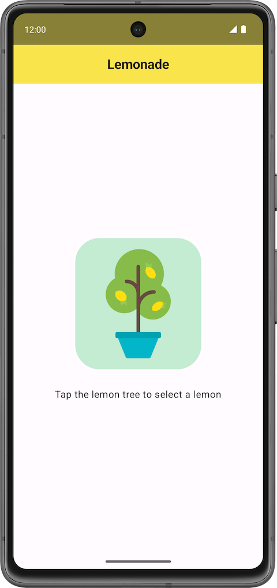

ステップ 2:

- テキスト: `Keep tapping the lemon to squeeze it`
- 画像: レモン（`lemon_squeeze.xml`）

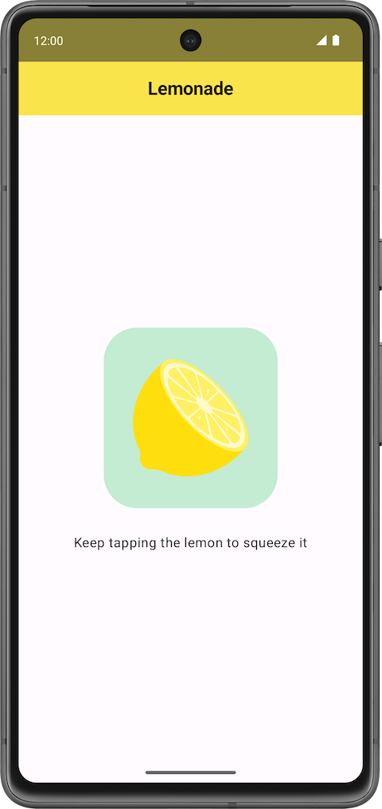

ステップ 3:

- テキスト: `Tap the lemonade to drink it`
- 画像: グラスいっぱいのレモネード（`lemon_drink.xml`）

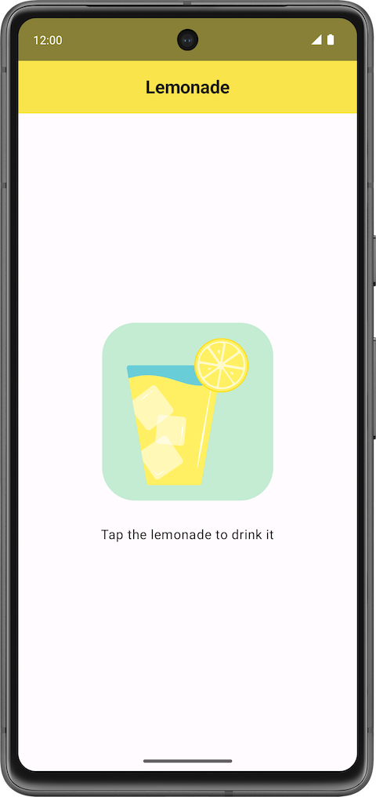

ステップ 4:

- テキスト: `Tap the empty glass to start again`
- 画像: 空のグラス（`lemon_restart.xml`）

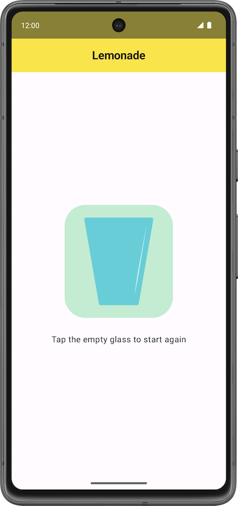

#### **見た目を整える**

アプリの見た目を完成版のスクリーンショットに近づけるために、見た目の調整をいくつか行います。

- テキストのフォントサイズを大きくして、デフォルトよりも大きくします（`18sp` など）。
- テキストラベルとその下の画像の間にはスペースを入れて、近づきすぎないようにします（`16dp` など）。
- ボタンにアクセント カラーを設定し、角を少し丸くして、画像がタップ可能であることをユーザーが理解できるようにします。

挑戦したい人は、アプリの残りの部分を必要な動作の説明をもとに作成しましょう。さらに手引きが必要な場合は、次に進んでください。

> **警告:** ヒントが表示される場合を除いて、残りの手順を読まないでください。自力で問題に取り組み、行き詰まった場合に、残りの手順を調べることをおすすめします。

### 4. アプリの作成方法を計画する

アプリを作成する際は、最低限動作するバージョンから始めることをおすすめします。その後に、完成するまで必要な機能を段階的に追加しましょう。すべての機能の中から、最初に作成できる機能を見つけましょう。

Lemonade アプリでは、アプリの主要な部分が段階的に変化し、毎回別の画像とテキストラベルが表示されます。どの程度絞ったかを示すための動作は、最初は無視します。この機能は、アプリのベースを作成した後で追加できます。

以下は、おすすめする作成手順の概要です。

1. レモネードを作る最初のステップの UI レイアウトを作成します。木になっているレモンを選択するように求めるステップです。細かな見た目は後で調整できるので、画像の枠線は省略します。


2. レモンの木がタップされたら、レモンの画像とそれに対応するテキストラベルを表示する、というアプリの動作を実装します。これが、レモネードを作る手順の最初の 2 つのステップです。

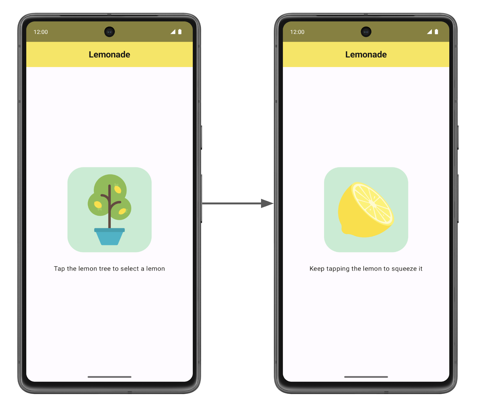

3. コードを追加して、画像がタップされるたびにレモネードを作る手順の残りのステップを表示するようにします。この段階では、レモンを 1 回タップすると、レモネードの入ったグラスが表示されます。


4. レモンを絞るステップにカスタムの動作を追加して 2～4 の範囲の数をランダムに生成し、ユーザーがレモンをその回数だけ「絞る」（タップする）動作を必須にします。


5. その他に必要な見た目の調整を行ってアプリを完成させます。たとえば、フォントサイズを変更し、画像の周りに枠線を付けて、アプリの見た目を良くするなどです。[Kotlin のコーディング スタイル ガイドライン](https://developer.android.com/kotlin/style-guide)を遵守している、コードにコメントを追加しているなど、適切なコーディング手法に従っていることを確認します。

以上の作成手順の概要を採用して Lemonade アプリを実装する場合は、自力でアプリを作成してください。5 つのステップそれぞれで、さらに手引きが必要な場合は、次のセクションに進みます。

### 5. アプリを実装する

#### **UI レイアウトを作成する**

まず、レモンの木の画像とそれに対応するテキストラベル（`Tap the lemon tree to select a lemon`）を画面の中央に表示するようにアプリを変更します。また、テキストとその下の画像の間に `16dp` のスペースを入れる必要もあります。


必要に応じて、次のスターター コードを `MainActivity.kt` ファイルで使用します。

```kotlin
package com.example.lemonade

import android.os.Bundle
import androidx.activity.ComponentActivity
import androidx.activity.compose.setContent
import androidx.compose.foundation.layout.fillMaxSize
import androidx.compose.material3.MaterialTheme
import androidx.compose.material3.Surface
import androidx.compose.material3.Text
import androidx.compose.runtime.Composable
import androidx.compose.ui.Modifier
import androidx.compose.ui.tooling.preview.Preview
import com.example.lemonade.ui.theme.LemonadeTheme

class MainActivity : ComponentActivity() {
   override fun onCreate(savedInstanceState: Bundle?) {
       super.onCreate(savedInstanceState)
       setContent {
           LemonadeTheme {
               LemonApp()
           }
       }
   }
}

@Composable
fun LemonApp() {
   // A surface container using the 'background' color from the theme
   Surface(
       modifier = Modifier.fillMaxSize(),
       color = MaterialTheme.colorScheme.background
   ) {
       Text(text = "Hello there!")
   }
}

@Preview(showBackground = true)
@Composable
fun DefaultPreview() {
   LemonadeTheme {
       LemonApp()
   }
}
```

このコードは、Android Studio が自動生成したコードに似ていますが、`Greeting()` コンポーザブルの代わりに、`LemonApp()` コンポーザブルが定義されており、パラメータは受け取りません。また、コードを簡単にプレビューできるように、`DefaultPreview()` コンポーザブルが `LemonApp()` コンポーザブルを使用するように更新されています。

Android Studio でこのコードを入力したら、`LemonApp()` コンポーザブルを修正して、アプリの内容を入れる必要があります。以下に作業の参考となる質問をいくつかご紹介します。

- どのコンポーザブルを使用しますか。
- コンポーザブルを目的の位置に配置するのに役立つ標準の [Compose レイアウト コンポーネント](https://developer.android.com/jetpack/compose/layouts/basics#standard-layouts)はありますか。

> **重要:** より多くのユーザーがアプリを利用できるようにするために、[画像の内容説明](https://developer.android.com/jetpack/compose/accessibility#describe-visual)を設定して、画像に含まれる内容を説明することを忘れないでください。

このステップを実装して、起動時にレモンの木とテキストラベルが表示されるようにします。コードを変更したときには、Android Studio でコンポーザブルを[プレビュー](https://developer.android.com/jetpack/compose/tooling#preview)して、UI がどのように表示されるかを確認しましょう。アプリを実行して、前のセクションのスクリーンショットと同じように表示されることを確認します。

画像をタップしたときの動作の追加方法について手引きが必要な場合は、作業後にこの手順に戻ってください。

#### **クリック動作を追加する**

次に、レモンの木の画像がタップされたら、レモンの画像がテキストラベル `Keep tapping the lemon to squeeze it` とともに表示されるようにコードを追加します。つまり、レモンの木をタップすると、テキストと画像が変化するということです。


この章の前半で、ボタンをクリック可能にする方法を学習しました。Lemonade アプリの場合は、`Button` コンポーザブルがありません。しかし、`clickable` 修飾子を指定すれば、ボタンだけでなく任意のコンポーザブルをクリック可能にできます。例については、[クリック可能](https://developer.android.com/reference/kotlin/androidx/compose/foundation/package-summary#(androidx.compose.ui.Modifier).clickable(kotlin.Boolean,kotlin.String,androidx.compose.ui.semantics.Role,kotlin.Function0))のドキュメントのページを確認してください。

画像がクリックされたときには、何をすべきでしょうか。この動作を実装するコードは簡単でないため、以前に学習したアプリに戻ります。

##### Dice Roller アプリを確認する

Dice Roller アプリのコードに戻り、サイコロの出目の値に基づいてアプリが別々のサイコロ画像を表示する方法を確認してください。

**Dice Roller アプリの MainActivity.kt**

```kotlin
...

@Composable
fun DiceWithButtonAndImage(modifier: Modifier = Modifier) {
   var result by remember { mutableStateOf(1) }
   val imageResource = when(result) {
       1 -> R.drawable.dice_1
       2 -> R.drawable.dice_2
       3 -> R.drawable.dice_3
       4 -> R.drawable.dice_4
       5 -> R.drawable.dice_5
       else -> R.drawable.dice_6
   }
   Column(modifier = modifier, horizontalAlignment = Alignment.CenterHorizontally) {
       Image(painter = painterResource(id = imageResource), contentDescription = result.toString())
       Button(onClick = { result = (1..6).random() }) {
          Text(stringResource(id = R.string.roll))
       }
   }
}

...
```

Dice Roller アプリのコードに関する以下の質問に答えてみましょう。

- 表示するサイコロの画像は、どの変数の値で決まりますか。
- 変数を変化させるトリガーとなるのは、ユーザーのどのような操作ですか。

コンポーズ可能な関数 `DiceWithButtonAndImage()` は、次のコードで `remember` コンポーザブルと `mutableStateOf()` 関数で定義された `result` 変数にサイコロの直近の出目を格納します。

```kotlin
var result by remember { mutableStateOf(1) }
```

`result` 変数が新しい値に更新されると、Compose が `DiceWithButtonAndImage()` コンポーザブルの再コンポジションをトリガーします。つまり、コンポーザブルが再度実行されます。`result` 値は再コンポーズ後も保存されているため、`DiceWithButtonAndImage()` コンポーザブルが再度実行されると、最新の `result` 値が使用されます。このコンポーザブルは、`result` 変数の値に対して `when` 文を使用して、新たに表示するドローアブル リソース ID を決め、`Image` コンポーザブルがそれを表示します。

##### 学習した内容を Lemonade アプリに応用する

次に、Lemonade アプリに関する以下の質問に答えてみましょう。

- 画面に表示するテキストと画像を決めるために使用できる変数はありますか。その変数をコードで定義してください。
- Kotlin の条件構文を使用し、その変数の値に基づいてアプリが異なる動作を実行するようにできますか。できる場合は、その条件文をコードに記述してください。
- 変数を変化させるトリガーとなるのは、ユーザーのどのような操作ですか。それが発生するコード内の適切な場所を見つけてください。そこに変数を更新するコードを追加してください。

> **注:** レモネードを作る手順の各ステップを数で表すこともできます。たとえば、ステップ 1 にはレモンの木の画像があり、画像をクリックするとステップ 2 に進みます。これは、どのテキスト文字列とどの画像に対応するかを整理するのに役立ちます。
> 
> 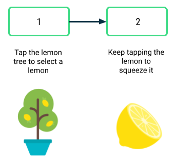

このセクションの実装はとても難しく、正しく動作させるには、コードの複数箇所を変更する必要があります。すぐにアプリが期待どおりに動作しなくても、気を落とすことはありません。この動作を実装する正しい方法は複数あります。

完了したら、アプリを実行して正しく動作することを確認します。起動すると、レモンの木の画像とそれに対応するテキストラベルが表示されます。レモンの木の画像を 1 回タップすると、テキストラベルが更新され、レモンの画像が表示されます。この時点でレモンの画像をタップしても何も起こりません。

#### **残りのステップを追加する**

これで、レモネードを作る手順の 2 つのステップを表示できるようになりました。この時点の `LemonApp()` コンポーザブルは、次のコード スニペットのようになります。アプリの動作が同じであれば、多少コードが違っても問題ありません。

**MainActivity.kt**

```kotlin
...
@Composable
fun LemonApp() {
   // Current step the app is displaying (remember allows the state to be retained
   // across recompositions).
   var currentStep by remember { mutableStateOf(1) }

   // A surface container using the 'background' color from the theme
   Surface(
       modifier = Modifier.fillMaxSize(),
       color = MaterialTheme.colorScheme.background
   ) {
       when (currentStep) {
           1 -> {
               Column (
                   horizontalAlignment = Alignment.CenterHorizontally,
                   verticalArrangement = Arrangement.Center,
                   modifier = Modifier.fillMaxSize()
               ){
                   Text(text = stringResource(R.string.lemon_select))
                   Spacer(modifier = Modifier.height(32.dp))
                   Image(
                       painter = painterResource(R.drawable.lemon_tree),
                       contentDescription = stringResource(R.string.lemon_tree_content_description),
                       modifier = Modifier
                           .wrapContentSize()
                           .clickable {
                               currentStep = 2
                           }
                   )
               }
           }
           2 -> {
               Column (
                   horizontalAlignment = Alignment.CenterHorizontally,
                   verticalArrangement = Arrangement.Center,
                   modifier = Modifier.fillMaxSize()
               ){
                   Text(text = stringResource(R.string.lemon_squeeze))
                   Spacer(modifier = Modifier.height(32
                       .dp))
                   Image(
                       painter = painterResource(R.drawable.lemon_squeeze),
                       contentDescription = stringResource(R.string.lemon_content_description),
                       modifier = Modifier.wrapContentSize()
                   )
               }
           }
       }
   }
}
...
```

次に、レモネードを作る手順の残りのステップを追加します。画像を 1 回タップすると、レモネードを作る手順の次のステップに進み、テキストと画像の両方が更新されます。前半の 2 つのステップだけでなく、すべてのステップをより柔軟に処理できるようにコードを変更する必要があります。


画像がクリックされるたびに動作を変えるには、クリック可能な動作をカスタマイズする必要があります。具体的には、画像がクリックされたときに実行されるラムダで、どのステップに遷移しようとしているかを認識している必要があります。

レモネードを作る手順の各ステップの中に同じコードがあると気づき始めたと思います。前のコード スニペットの `when` 文で、`1` の場合のコードは `2` の場合によく似ていますが、わずかな違いがあります。可能であれば、UI で画像の上にテキストを表示する `LemonTextAndImage()` といったコンポーズ可能な関数を作成しましょう。入力パラメータを受け取る新しいコンポーズ可能な関数を作成すると、渡す入力さえ変えれば複数のシナリオで役立つ再利用可能な関数となります。どのような入力パラメータにするかは、自身で決めてください。このコンポーズ可能な関数を作成したら、関連する場所で新しい関数を呼び出すように既存のコードを更新します。

`LemonTextAndImage()` のような別のコンポーザブルを使用することには、コードが整理され、堅牢になるという利点もあります。`LemonTextAndImage()` を呼び出すと、確実にテキストと画像の両方を新しい値にできます。これを使用しない場合は、更新されたテキストラベルが間違った画像とともに表示されてしまうケースが見逃されやすくなります。

もう一つのヒントとして、ラムダ関数をコンポーザブルに渡すというものもあります。関数型の表記を使用して、渡す関数の型を指定してください。次の例では、`WelcomeScreen()` コンポーザブルが定義されていて、`name` 文字列と `() -> Unit` 型の `onStartClicked()` 関数という 2 つの入力パラメータを受け入れています。つまり、この関数は入力を受け取らず（矢印の前の空のかっこ）、戻り値がありません（矢印の後の `Unit`）。この関数型 `() -> Unit` に一致する関数を使用して、この `Button` の `onClick` ハンドラを設定できます。ボタンがクリックされると、`onStartClicked()` 関数が呼び出されます。

```kotlin
@Composable
fun WelcomeScreen(name: String, onStartClicked: () -> Unit) {
    Column {
        Text(text = "Welcome $name!")
        Button(
            onClick = onStartClicked
        ) {
            Text("Start")
        }
    }
}
```

ラムダをコンポーザブルに渡すパターンは、`WelcomeScreen()` コンポーザブルを異なるシナリオで再利用できるため便利なパターンです。ユーザー名とボタンの `onClick` 動作は引数として渡されるため、毎回変えることができます。

自分のコードに戻り、このヒントを活用して、レモネードを作る手順の残りのステップを追加しましょう。

レモンを絞る回数をランダムにするカスタム ロジックの追加方法についてさらに手引きが必要な場合は、この手順に戻ってください。

#### **絞るロジックを追加する**

お疲れさまでした。アプリのベースは作成できました。画像をタップすると、次のステップに進みます。ここでは、レモネードを作るためにレモンを複数回絞る必要があるという動作を追加します。レモンを絞る、つまりタップする必要がある回数は、2 から 4 までの乱数にする必要があります。この乱数は、木から新しいレモンを選ぶたびに変わる番号になります。


ここで作業の参考となるように、いくつか質問をします。

- Kotlin では、どのようにして乱数を生成しますか。
- コードのどの時点で乱数を生成する必要がありますか。
- 次のステップに進む前に、レモンが必要な回数分タップされたことを確認するには、どうすればよいですか。
- 画面が再描画されるたびにデータがリセットされないようにするため、`remember` コンポーザブルに変数を保存する必要はありますか。

この変更の実装が完了したら、アプリを実行してください。次のステップに進むにはレモンの画像を複数回タップする必要があり、必要なタップ回数がそれぞれで 2 から 4 までの乱数になることを確認します。レモンの画像を 1 回タップするだけでレモネードの入ったガラスが表示される場合は、コードに戻って足らない部分を見つけ出し、もう一度試しください。

アプリを完成させる方法について追加の手引きが必要な場合は、この手順に戻ってください。

#### **アプリを完成させる**

完了まであと少しです。最後に細かな修正を加えて、アプリを仕上げましょう。

完成したアプリのスクリーンショットを再度示します。

|  |  |
|---|---|
|  |  |

- テキストと画像を画面の上下左右で中央になるように配置します。
- テキストのフォントサイズを `18sp` に設定します。
- テキストと画像の間に `16dp` のスペースを追加します。
- 画像の周りに `2dp` の細い枠線を追加し、`4dp` の少し丸まった角にします。枠線は、赤が `105`、緑が `205`、青が `216` の [RGB](https://en.wikipedia.org/wiki/RGB_color_model) 色値です。枠線の追加方法の例については、Google で検索してください。または、[枠線](https://developer.android.com/jetpack/compose/modifiers-list#Border)に関するドキュメントを確認してください。

これらの変更が完了したら、アプリを実行し、最終的なスクリーンショットと比較して、一致していることを確認します。

良いコーディング習慣として、コードに戻ってコメントを追加し、誰がコードを読んでもあなたの思考プロセスを簡単に理解できるようにしてください。また、ファイルの先頭にある、コード内で使用されていない import 文を削除してください。コードが [Kotlin スタイルガイド](https://developer.android.com/kotlin/style-guide)に従っていることを確認します。このような努力により、コードの可読性が上がり、メンテナンスが容易になります。

お疲れさまでした。Lemonade アプリの実装という素晴らしい成果をあげました。解決すべき部分がたくさんある難しいアプリでした。自分へのご褒美として、さわやかなレモネードを飲みましょう。乾杯！

### 6. 解答コードを取得する

解答コードをダウンロード:

または、GitHub リポジトリのクローンを作成してコードを入手することもできます。

```
$ git clone https://github.com/google-developer-training/basic-android-kotlin-compose-training-lemonade.git
```

アプリを実装する方法は複数あるため、解答コードと正確に一致している必要はありません。

[Lemonade アプリの GitHub リポジトリ](https://github.com/google-developer-training/basic-android-kotlin-compose-training-lemonade)でコードを見ることもできます。

## 6. つまずきやすいポイント

- 「ボタンを押しても画面が変わらない」場合、変数が `remember { mutableStateOf(...) }` になっているかを最初に疑いましょう。
- デバッガの **ブレークポイント** は今後ずっと使う道具です。この章で「止めて、変数を見て、1 行ずつ進める」を一度体験してください。

## 7. AIに質問する（この章の例）

次の例をそのままAIに投げてOKです（必要なら自分のコード/エラーに置き換えてください）。

```text
「ボタンを押しても画面が変わらない。`remember` と `mutableStateOf` の役割を説明したうえで、自分のコードのどこが問題か確認質問をして（コード: ここに貼る）」
「Android Studio のデバッガで、ブレークポイントを置いて変数を見る手順を初心者向けに説明して」
「練習: クリック動作 で詰まった。答えを丸ごとではなく、方針→ヒント→確認質問の順で教えて」
```

質問がまとまらないときは、第0章の「質問テンプレ」を使ってください。

## 8. 提出物

次のレッスンで完成させた Android Studio プロジェクトを、学習用リポジトリの `unit2/DiceRoller/` に置きます（プロジェクトフォルダごとコピー。`build/` と `.idea/` は含めない）。

- インタラクティブな Dice Roller アプリを作成する
- 練習: クリック動作

PR 本文には次の 3 点を書いてください。

- **やったこと**：どのレッスン / 演習を完了したか
- **動作確認**：どの端末（エミュレータ名 or 実機）で何を確認したか
- **詰まった点と解決**：エラーの内容と、どう直したか（AI に聞いた内容も可）

## 9. チェックリスト

- [ ] `Button` の `onClick` でユーザー操作に反応するアプリを作れる
- [ ] `remember` と `mutableStateOf` で画面の状態を持てる
- [ ] Android Studio のデバッガで変数の中身を確認できる
- [ ] 各レッスンの「まとめ」にある用語を自分の言葉で説明できる
- [ ] 提出物が `unit2/DiceRoller/` にあり、Android Studio（または Kotlin Playground）で開いて動く

---

## 課題提出

この章には提出課題があります。

1. 上記の提出物を完了する
2. GitHub で `feature/02-add-button` ブランチを作成し、`develop` へのPRを作成（base=`develop`）
3. [AIプログラムレビュー](https://ai.studio/apps/84d224cb-7de1-44fb-995b-9a5917d25603?fullscreenApplet=true) を実行
4. 問題がなければ、進捗ダッシュボードで **PR URL** と **完了日** を記録
