# 第4章: Kotlin の基礎

> 提出ブランチ: `feature/02-kotlin-fundamentals`

## 1. この章のゴール

- `if` / `when` で条件分岐を書ける
- null 安全（`?` / `?:` / `!!`）の意味を説明できる
- クラス・オブジェクト・ラムダ式を使ったコードが読める・書ける

## 2. 進め方

次の内容を **上から順番に** 進めます。「やらなくてOK」の行は飛ばして構いません。レッスンの本文はこのページの下にすべて掲載しています。目安時間の合計は約390分です。

| # | 種類 | 内容 | 目安 | 備考 |
|---|---|---|---|---|
| 1 | レッスン | Kotlin で条件を記述する | 約60分 |  |
| 2 | レッスン | Kotlin で null 可能性を使用する | 約60分 |  |
| 3 | レッスン | Kotlin でクラスとオブジェクトを使用する | 約90分 |  |
| 4 | レッスン | Kotlin で関数型とラムダ式を使用する | 約90分 |  |
| 5 | レッスン | 演習: Kotlin の基礎 | 約90分 | **提出対象** |

このプログラムの進め方は次の通りです。

1. 下の各レッスンを読み、各ステップの説明を理解してから **自分でコードを打つ**（コピペで済ませない）
2. ステップごとにアプリを実行し、期待どおり動くか確認する
3. 動かないときは、エラー文をそのまま AI に貼って「何が原因か」を聞き、直したら **なぜ直ったか** をメモする
4. 各レッスン末尾の「まとめ」を読み、説明できない用語があればレッスンに戻る

> 画面が最新の Android Studio と異なる場合があります。

## 3. Kotlin で条件を記述する

### 1. 始める前に

プログラミングの基礎として、条件は非常に重要です。条件は、判断を処理するプログラミング言語のコマンドです。条件を使用するとコードが動的になります。つまり、異なる条件を指定することで、異なる動作をさせることができます。

このレッスンでは、`if/else` と `when` のステートメントと式を使用して Kotlin で条件を記述する方法について説明します。

#### **前提条件**

- Kotlin プログラミングの基礎知識（変数を含む）、および `println()` 関数と `main()` 関数の知識

#### **学習****内容**

- ブール式を記述する方法
- `if/else` ステートメントを記述する方法
- `when` ステートメントを記述する方法
- `if/else` 式を記述する方法
- `when` 式を記述する方法
- カンマを使用して `when` 条件の複数の分岐について共通する動作を定義する方法
- `in` 範囲を使用して `when` 条件の分岐の範囲について共通する動作を定義する方法
- `is` キーワードを使用して `when` 条件ステートメントを記述する方法

#### **必要な****もの**

- Kotlin プレイグラウンドにアクセスできるウェブブラウザ

### 2. if / else ステートメントを使用して条件を表す

実生活で、直面した状況に応じて行動を変えるということはよくあります。たとえば、寒ければジャケットを着ますが、暖かければ着ません。

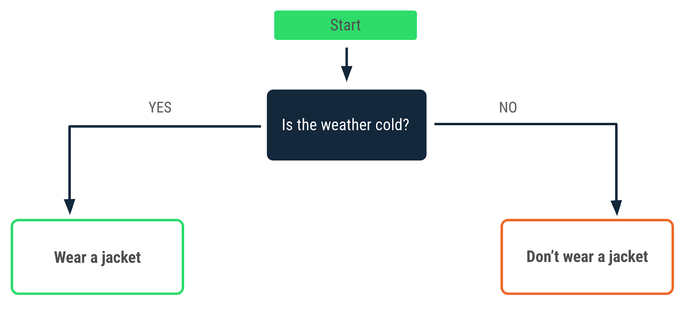

判断はプログラミングの基本概念でもあります。特定の状況におけるプログラムの動作について記述し、その状況が発生したとき、それに応じてプログラムが動作または反応できるようにします。Kotlin では、ある条件に基づいてプログラムに異なる動作をさせる場合、`if/else` ステートメントを使用できます。次のセクションでは、`if` ステートメントを記述します。

#### ブール式を使用して `if` 条件を記述する

信号機のところですべきことを運転手に伝えるプログラムを作成するとします。最初の条件である赤信号に注目してください。赤信号のときはどうするでしょうか。「止まれ」です。

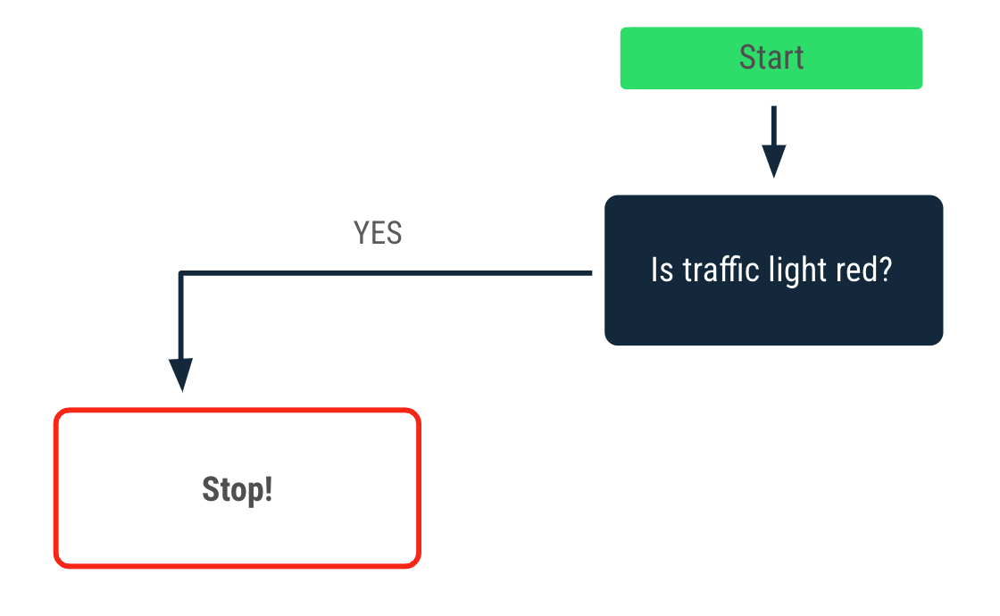

Kotlin では、この条件を `if` ステートメントで表現できます。`if` ステートメントについて詳しく見てみましょう。

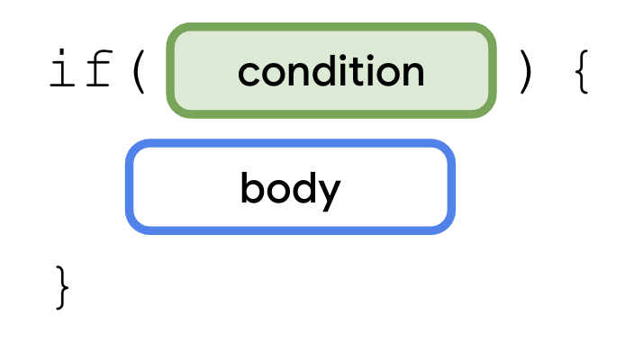

`if` ステートメントを使用するには、`if` キーワードを使用し、その後に、評価する条件を記述する必要があります。条件はブール式で表す必要があります。式は、値、変数、演算子を組み合わせたものであり、値を返します。ブール式はブール値を返します。

以前、次のような代入演算子について学習しました。

```kotlin
val number = 1
```

`=` 代入演算子は、`number` 変数に `1` 値を代入します。

これに対しブール式は、両辺の値または変数を比較する比較演算子で構成されます。比較演算子を見てみましょう。

```kotlin
1 == 1
```

`==` 比較演算子は、値を互いに比較します。この式はどのブール値を返すでしょうか。

この式のブール値を確認しましょう。

1. [Kotlin プレイグラウンド](https://developer.android.com/training/kotlinplayground)を使用してコードを実行します。
2. 関数本体に `println()` 関数を追加し、引数として `1 == 1` 式を渡します。

```kotlin
fun main() {
    println(1 == 1)
}
```

3. プログラムを実行して出力を確認します。

```
true
```

1 つ目の `1` 値は 2 つ目の `1` 値と等しいため、ブール式は `true` 値（ブール値）を返します。

#### 試してみる

比較演算子 `==` の他にも、ブール式を作成するために使用できる比較演算子があります。

- 未満: `<`
- 超える: `>`
- 以下: `<=`
- 以上: `>=`
- 等しくない: `!=`

簡単な式を使用して比較演算子の使い方を練習します。

1. 引数で、`==` 比較演算子を `<` 比較演算子に置き換えます。

```kotlin
fun main() {
    println(1 < 1)
}
```

2. プログラムを実行して出力を確認します。

1 つ目の `1` 値は 2 つ目の `1` 値未満ではないため、出力で `false` 値が返されます。

```
false
```

3. 他の比較演算子と数字を使用して、最初の 2 つのステップを繰り返しましょう。

#### 簡単な `if` ステートメントを記述する

ブール式の記述方法の例を確認したところで、最初の `if` ステートメントを記述してみましょう。`if` ステートメントの構文は次のとおりです。

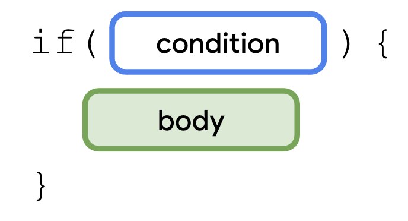

`if` ステートメントは `if` キーワードで始まり、その後に条件（丸かっこと中かっこで囲まれたブール式）が続きます。本体は、条件の後に続く、一対の中かっこで囲まれた一連のステートメントまたは式です。これらのステートメントまたは式は、条件が満たされた場合にのみ実行されます。つまり、中かっこ内のステートメントは、`if` 分岐のブール式が `true` 値を返す場合にのみ実行されます。

赤信号の場合の `if` ステートメントを記述します。

1. `main()` 関数内で `trafficLightColor` 変数を作成し、`"Red"` 値を代入します。

```kotlin
fun main() {
    val trafficLightColor = "Red"
}
```

2. 赤信号の場合の `if` ステートメントを追加し、`trafficLightColor == "Red"` 式を渡します。

```kotlin
fun main() {
    val trafficLightColor = "Red"

    if (trafficLightColor == "Red") {
        
    } 
}
```

3. `if` ステートメントの本体に `println()` 関数を追加し、`"Stop"` 引数を渡します。

```kotlin
fun main() {
    val trafficLightColor = "Red"

    if (trafficLightColor == "Red") {
        println("Stop")
    } 
}
```

4. プログラムを実行して出力を確認します。

```
Stop
```

`trafficLightColor == "Red"` 式は `true` 値を返すため、`println("Stop")` ステートメントが実行され、`Stop` メッセージが出力されます。

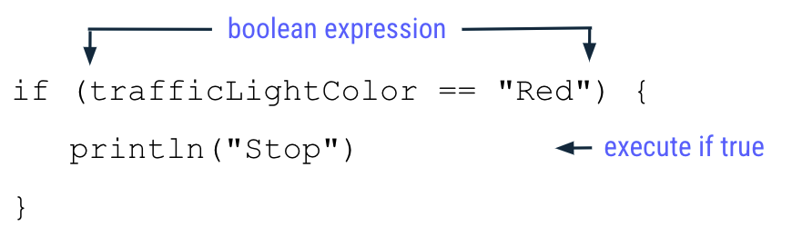

#### `else` 分岐を追加する

赤信号でないとき運転手に「進め」と伝えるように、プログラムを拡張してみましょう。

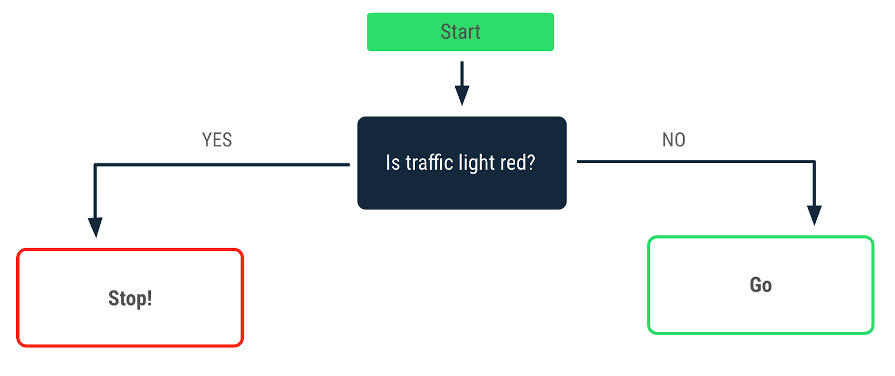

`else` 分岐を追加して `if/else` ステートメントを作成する必要があります。分岐は、結合することでステートメントまたは式を構成できる、コードの一部分です。`else` 分岐は `if` 分岐の後に続く必要があります。

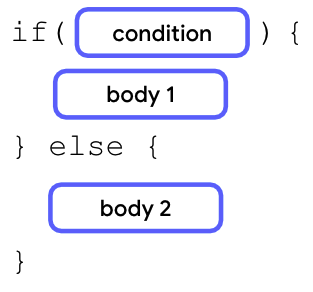

`if` ステートメントの右中かっこの後に、`else` キーワードを追加し、続けて一対の中かっこを追加します。`else` ステートメントの中かっこ内に、`if` 分岐の条件が false の場合にのみ実行される 2 つ目の本体を追加できます。

プログラムに `else` 分岐を追加します。

1. `if` ステートメントの右中かっこの後に、`else` キーワードを追加し、続けてもう一対の中かっこを追加します。

```kotlin
fun main() {
    val trafficLightColor = "Red"

    if (trafficLightColor == "Red") {
        println("Stop")
    } else {

    }
}
```

2. `else` キーワードの中かっこ内に `println()` 関数を追加し、`"Go"` 引数を渡します。

```kotlin
fun main() {
    val trafficLightColor = "Red"

    if (trafficLightColor == "Red") {
        println("Stop")
    } else {
        println("Go")
    }
}
```

3. プログラムを実行して出力を確認します。

```
Stop
```

このプログラムは `else` 分岐を追加する前と同じように動作しますが、`Go` メッセージが出力されません。

4. 青信号のとき運転手に「進め」と伝えるために、`trafficLightColor` 変数に `"Green"` 値を再代入します。

```kotlin
fun main() {
    val trafficLightColor = "Green"

    if (trafficLightColor == "Red") {
        println("Stop")
    } else {
        println("Go")
    }
}
```

5. プログラムを実行して出力を確認します。

```
Go
```

こうして、プログラムが `Stop` メッセージではなく `Go` メッセージを出力するようになりました。

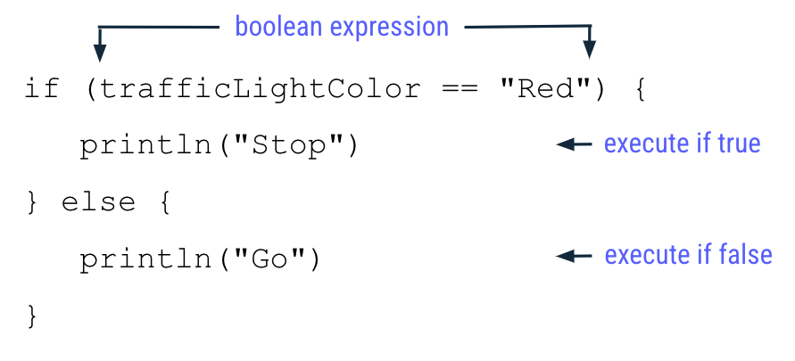

`trafficLightColor` 変数に `"Green"` 値を再代入したため、`if` 分岐で評価される `trafficLightColor == "Red"` 式は、`"Green"` 値が `"Red"` 値と等しくないことから、`false` 値を返します。

その結果、`if` 分岐内のすべてのステートメントがスキップされ、代わりに `else` 分岐内のすべてのステートメントが実行されます。つまり、`println("Go")` 関数は実行されますが、`println("Stop")` 関数は実行されません。

#### `else if` 分岐を追加する

一般的に、信号機には黄色もあり、運転手に「注意して進め」と伝えます。これを反映させるために、プログラムの判断プロセスを拡張してみましょう。

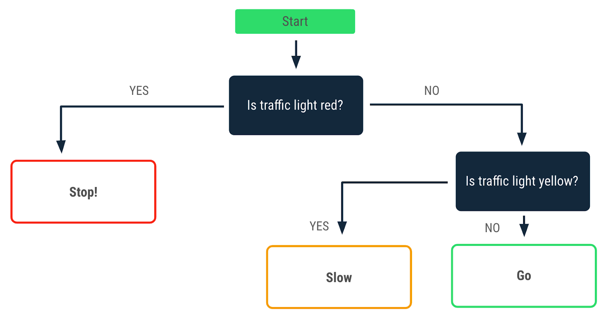

1 つの `if` と 1 つの `else` 分岐を含む `if/else` ステートメントを使用して、1 つの判断点に対応する条件を記述することを学びました。しかし、判断点が複数ある複雑な分岐は、どのように扱えばよいでしょうか。判断点が複数ある場合、条件を多層にして作成する必要があります。これは、`if/else` ステートメントに `else if` 分岐を追加するときに行えます。

`if` 分岐の右中かっこの後に、`else if` キーワードを追加する必要があります。`else if` キーワードのかっこ内に、`else if` 分岐の条件としてブール式を追加し、その後に一対の中かっこで囲んだ本体を続ける必要があります。この本体は、条件 1 が満たされず、条件 2 が満たされた場合にのみ実行されます。

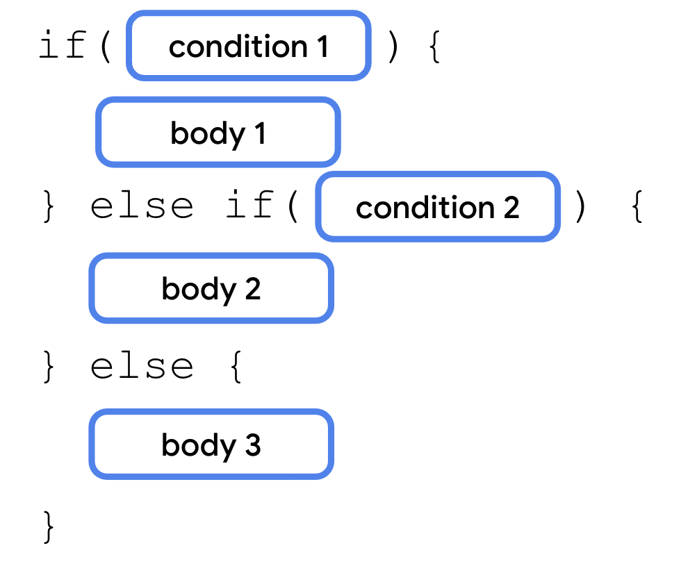

`else if` 分岐は常に `if` 分岐の後、`else` 分岐の前に配置します。1 つのステートメントに複数の `else if` 分岐を使用できます。

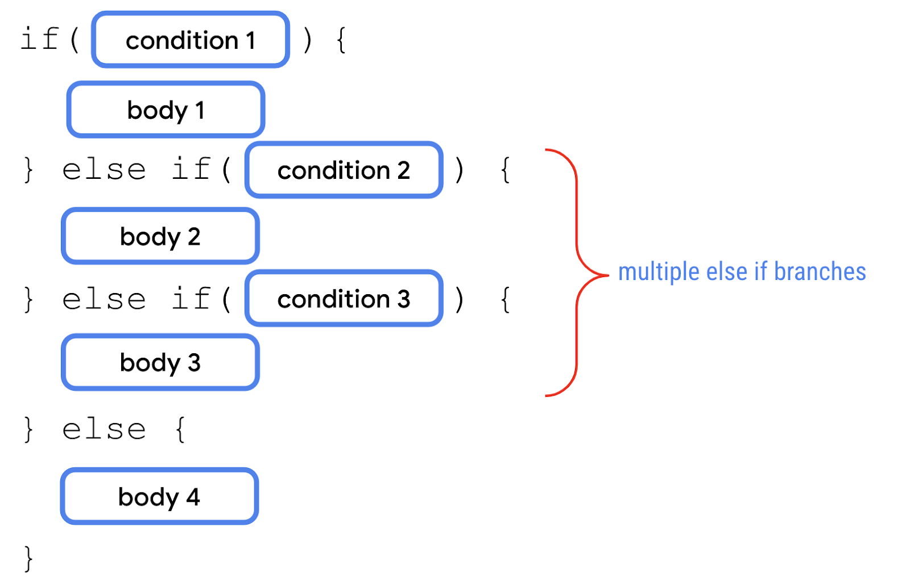

`if` ステートメントに、`else` 分岐なしで `if` 分岐と `else if` 分岐を含めることもできます。

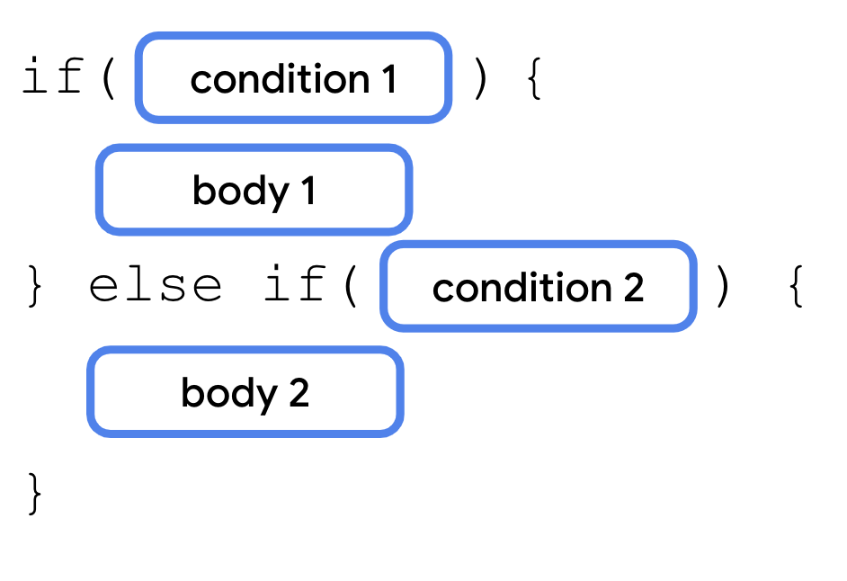

プログラムに `else if` 分岐を追加します。

1. `if` ステートメントの右中かっこの後に、`else if (trafficLightColor == "Yellow")` 式を追加し、続けて中かっこを追加します。

```kotlin
fun main() {
    val trafficLightColor = "Green"

    if (trafficLightColor == "Red") {
        println("Stop")
    } else if (trafficLightColor == "Yellow") {

    } else {
        println("Go")
    }
}
```

2. `else if` 分岐の中かっこ内に、`println()` ステートメントを追加し、`"Slow"` 文字列引数を渡します。

```kotlin
fun main() {
    val trafficLightColor = "Green"

    if (trafficLightColor == "Red") {
        println("Stop")
    } else if (trafficLightColor == "Yellow") {
        println("Slow")
    } else {
        println("Go")
    }
}
```

3. `trafficLightColor` 変数に `"Yellow"` 文字列値を再代入します。

```kotlin
fun main() {
    val trafficLightColor = "Yellow"

    if (trafficLightColor == "Red") {
        println("Stop")
    } else if (trafficLightColor == "Yellow") {
        println("Slow")
    } else {
        println("Go")
    }
}
```

4. プログラムを実行して出力を確認します。

```
Slow
```

`Stop` または `Go` のメッセージではなく、`Slow` のメッセージが出力されるようになりました。


`Slow` のメッセージのみが出力され、他の行は出力されない理由は次のとおりです。

- `trafficLightColor` 変数に `"Yellow"` 値が代入されます。
- `"Yellow"` 値と `"Red"` 値は等しくないため、`if` 分岐のブール式（画像では 1 と表されています）は `false` 値を返します。`if` 分岐内のすべてのステートメントがスキップされ、`Stop` のメッセージは出力されません。
- `if` 分岐が `false` 値を生成するため、プログラムは `else if` 分岐内のブール式の評価に進みます。
- `"Yellow"` 値と `"Yellow"` 値は等しいため、`else if` 分岐のブール式（画像では 2 として表されています）は `true` 値を返します。`else if` 分岐内のすべてのステートメントが実行され、`Slow` のメッセージが出力されます。
- `else if` 分岐のブール式が `true` 値を返すため、残りの分岐はスキップされます。そのため、`else` 分岐内のすべてのステートメントが実行されず、`Go` のメッセージは出力されません。

#### 試してみる

現在のプログラムにバグが含まれていることにお気付きでしょうか。

ユニット 1 では、コードの構文エラーが原因で Kotlin がコードをコンパイルできず、プログラムを実行できない、コンパイル エラーという種類のバグについて学びました。このプログラムには、プログラムは実行できるものの、想定どおりの出力が得られない、ロジックエラーという別の種類のバグがあります。

たとえば、青信号のときにのみ運転手に運転させるとします。信号機が壊れて消灯している場合はどうでしょうか。運転者に運転させますか？それとも、なんらかの問題が起きていると警告しますか？

あいにく現在のプログラムでは、赤信号または黄信号以外の場合、運転手には「進め」と伝えられます。

この問題を修正します。

1. `trafficLightColor` 変数に `"Black"` 値を再代入して、信号機が消灯している旨を示すようにします。

```kotlin
fun main() {
    val trafficLightColor = "Black"

    if (trafficLightColor == "Red") {
        println("Stop")
    } else if (trafficLightColor == "Yellow") {
        println("Slow")
    } else {
        println("Go")
    }
}
```

2. プログラムを実行して出力を確認します。

```
Go
```

`trafficLightColor` 変数に `"Green"` 値が代入されていない場合でも、`Go` のメッセージが出力されるようになっています。正しい動作が反映されるようにこのプログラムを修正できますか？

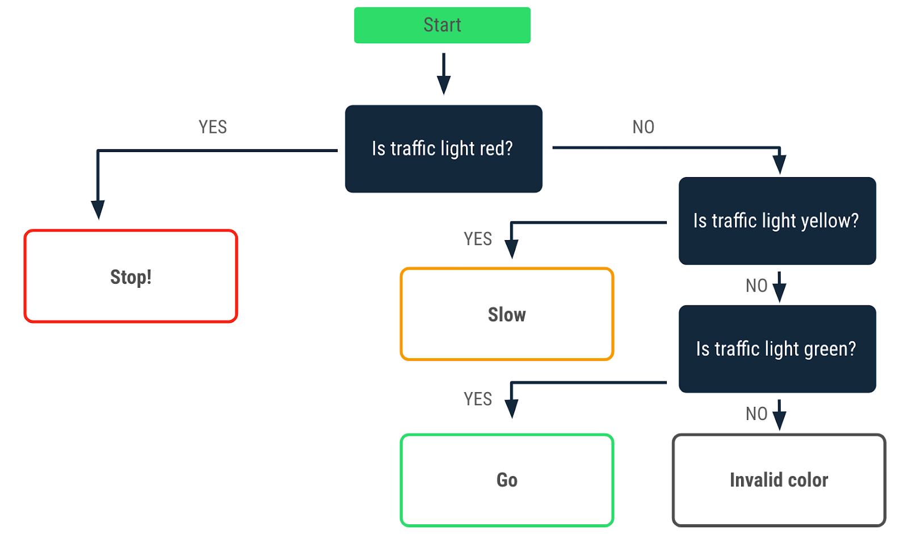

次のとおり出力されるようにプログラムを変更する必要があります。

- `Go` のメッセージ: `trafficLightColor` 変数に `"Green"` 値が代入された場合のみ
- `Invalid traffic-light color` のメッセージ: `trafficLightColor` 変数に `"Red"`、`"Yellow"`、`"Green"` の値が代入されていない場合のみ

#### `else` 分岐を修正する

`else` 分岐はキャッチオール分岐であるため、常に `if/else` ステートメントの最後に配置されます。これは、その前にある分岐の他の条件がすべて満たされない場合に、自動的に実行されます。そのため `else` 分岐は、特定の条件を満たしたときにのみアクションを実行する場合には適していません。信号機の場合、`else if` 分岐を使用して、青信号の条件を指定できます。

`else if` 分岐を使用して、青信号の条件を評価します。

1. 現在の `else if` 分岐の後に、別の `else if (trafficLightColor == "Green")` 分岐を追加します。

```kotlin
fun main() {
    val trafficLightColor = "Black"

    if (trafficLightColor == "Red") {
        println("Stop")
    } else if (trafficLightColor == "Yellow") {
        println("Slow")
    } else if (trafficLightColor == "Green") {
        println("Go")
    }
}
```

2. プログラムを実行して出力を確認します。

前にある条件が満たされない場合に実行される `else` 分岐がないため、出力は空になります。

3. 最後の `else if` 分岐の後に、`println("Invalid traffic-light color")` ステートメントを伴う `else` 分岐を追加します。

```kotlin
fun main() {
    val trafficLightColor = "Black"

    if (trafficLightColor == "Red") {
        println("Stop")
    } else if (trafficLightColor == "Yellow") {
        println("Slow")
    } else if (trafficLightColor == "Green") {
        println("Go")
    } else {
        println("Invalid traffic-light color")
    }

}
```

4. プログラムを実行して出力を確認します。

```
Invalid traffic-light color
```

5. `trafficLightColor` 変数に `"Red"`、`"Yellow"`、`"Green"` 以外の値を代入して、プログラムを再実行します。

プログラムの出力はどうなりましたか？

青信号の入力の検証として明示的な `else if` 分岐を用意し、他の無効な入力を捕捉するために `else` 分岐を用意することをおすすめします。これにより運転手は、青信号の場合にのみ「進め」と指示されるようになります。それ以外の場合、信号機が期待どおりに機能していない旨を伝える明示的なメッセージが出力されます。

### 3. when ステートメントを複数の分岐に使用する

`trafficLightColor` プログラムは、複数の条件（分岐）があると複雑に見えます。さらに多くの分岐を持つプログラムを簡素化できるかどうか、疑問に思われるかもしれません。

Kotlin で複数の分岐を扱う場合、`if/else` ステートメントの代わりに `when` ステートメントを使用できます。人間の読者（通常はデベロッパー）にとってどれだけ読みやすいかという、可読性が向上します。コードを記述するときは、可読性を考慮することが非常に重要です。たいていの場合、コードの全期間にわたって他のデベロッパーがレビューや変更を行う必要があるからです。可読性に優れていれば、デベロッパーがコードを正しく理解でき、誤ってバグを混入させずに済みます。

考慮する分岐が 3 つ以上ある場合、`when` ステートメントが優先されます。

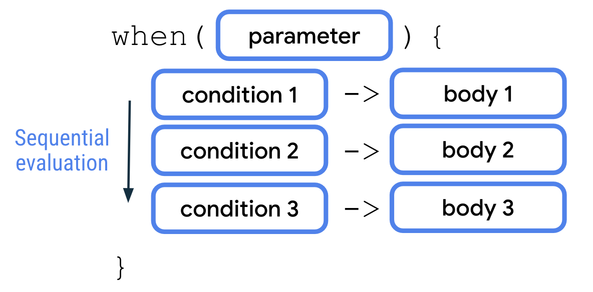

`when` ステートメントは、パラメータを通じて 1 つの値を受け取ります。その値が各条件に対して順番に評価されます。最初に満たされた条件に対応する本体が実行されます。各条件と本体は矢印（`->`）で区切ります。`if/else` ステートメントと同様に、`when` ステートメントでは条件と本体の各対を分岐といいます。また、`if/else` ステートメントと同様に、キャッチオール分岐として機能する `else` 分岐を `when` ステートメントの最終条件として追加できます。

#### `if/else` ステートメントを `when` ステートメントで書き換える

信号機プログラムには、すでに複数の分岐があります。

- 赤信号
- 黄信号
- 青信号
- 他の色の信号

`when` ステートメントを使用するようにプログラムを変換します。

1. `main()` 関数内の `if/else` ステートメントを削除します。

```kotlin
fun main() {
    val trafficLightColor = "Black"

}
```

2. `when` ステートメントを追加し、引数として `trafficLightColor` 変数を渡します。

```kotlin
fun main() {
    val trafficLightColor = "Black"

    when (trafficLightColor) {
    }
}
```

3. `when` ステートメントの本体に、`"Red"` 条件を追加し、続けて矢印と `println("Stop")` 本体を追加します。

```kotlin
fun main() {
    val trafficLightColor = "Black"

    when (trafficLightColor) {
        "Red" -> println("Stop")
    }
}
```

4. その次の行に `"Yellow"` 条件を追加し、続けて矢印と `println("Slow")` 本体を追加します。

```kotlin
fun main() {
    val trafficLightColor = "Black"

    when (trafficLightColor) {
        "Red" -> println("Stop")
        "Yellow" -> println("Slow")
    }
}
```

5. その次の行に `"Green"` 条件を追加し、続けて矢印と `println("Go")` 本体を追加します。

```kotlin
fun main() {
    val trafficLightColor = "Black"

    when (trafficLightColor) {
        "Red" -> println("Stop")
        "Yellow" -> println("Slow")
        "Green" -> println("Go")
    }
}
```

6. その次の行に `else` キーワードを追加し、続けて矢印と `println("Invalid traffic-light color")` 本体を追加します。

```kotlin
fun main() {
    val trafficLightColor = "Black"

    when (trafficLightColor) {
        "Red" -> println("Stop")
        "Yellow" -> println("Slow")
        "Green" -> println("Go")
        else -> println("Invalid traffic-light color")
    }
}
```

7. `trafficLightColor` 変数に `"Yellow"` 値を再代入します。

```kotlin
fun main() {
    val trafficLightColor = "Yellow"

    when (trafficLightColor) {
        "Red" -> println("Stop")
        "Yellow" -> println("Slow")
        "Green" -> println("Go")
        else -> println("Invalid traffic-light color")
    }
}
```

このプログラムを実行すると、どのような出力が得られるでしょうか。

8. プログラムを実行して出力を確認します。

```
Slow
```

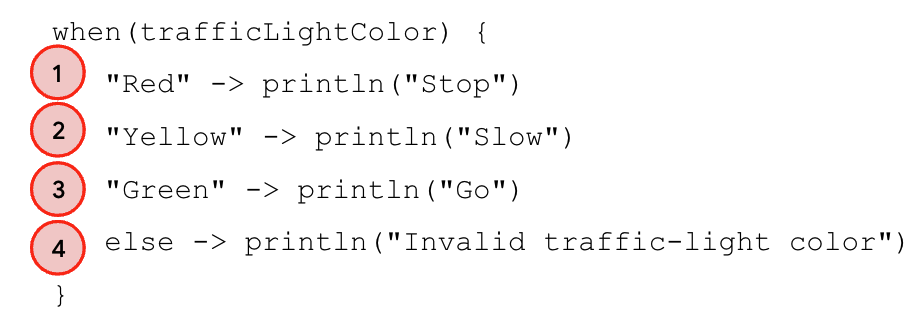

次の理由から、出力は `Slow` のメッセージになります。

- `trafficLightColor` 変数に `"Yellow"` 値が代入されます。
- 各条件が 1 つずつ順番に評価されます。
- `"Yellow"` 値と `"Red"` 値は等しくないため、最初の本体はスキップされます。
- `"Yellow"` 値と `"Yellow"` 値は等しいため、2 番目の本体が実行され、`Slow` のメッセージが出力されます。
- 本体が実行されたため、3 番目と 4 番目の分岐が無視され、`when` ステートメントが残されます。

> **注:**パラメータを受け取らず、`if/else` チェーンの代わりとして使用される、`when` ステートメントの変種があります。詳しくは、[When expression](https://kotlinlang.org/docs/control-flow.html#when-expression) をご覧ください。

#### 複雑な条件を `when` ステートメントで記述する

ここまでで、`trafficLightColor` 変数に `"Yellow"` 値が代入されるときなど、1 つの等しい条件について `when` 条件を記述する方法を学びました。次は、カンマ（`,`）、`in` キーワード、`is` キーワードを使用して、さらに複雑な `when` 条件を作成する方法を学びます。

1 から 10 までの数値が素数かどうかを判別するプログラムを作成します。

1. [Kotlin プレイグラウンド](https://developer.android.com/training/kotlinplayground)を別ウィンドウで開きます。

信号機プログラムには後ほど戻ってきます。

2. `x` 変数を定義して、`3` 値を代入します。

```kotlin
fun main() {
    val x = 3
}
```

3. `2`、`3`、`5`、`7` 条件の複数の分岐を含む `when` ステートメントを追加し、それぞれに続けて `println("x is prime number between 1 and 10.")` 本体を追加します。

```kotlin
fun main() {
    val x = 3

    when (x) {
        2 -> println("x is a prime number between 1 and 10.")
        3 -> println("x is a prime number between 1 and 10.")
        5 -> println("x is a prime number between 1 and 10.")
        7 -> println("x is a prime number between 1 and 10.")
    }
}
```

4. `println("x is not prime number between 1 and 10.")` 本体を伴う `else` 分岐を追加します。

```kotlin
fun main() {
    val x = 3

    when (x) {
        2 -> println("x is a prime number between 1 and 10.")
        3 -> println("x is a prime number between 1 and 10.")
        5 -> println("x is a prime number between 1 and 10.")
        7 -> println("x is a prime number between 1 and 10.")
        else -> println("x isn't a prime number between 1 and 10.")
    }
}
```

5. プログラムを実行して、出力が想定どおりであることを確認します。

```
x is a prime number between 1 and 10.
```

##### カンマ（`,`**）を複数の条件に使用する**

素数プログラムでは、`println()` ステートメントが何度も繰り返されています。`when` ステートメントを記述するとき、カンマ（`,`）を使用すると、同じ本体に対応する複数の条件を表すことができます。

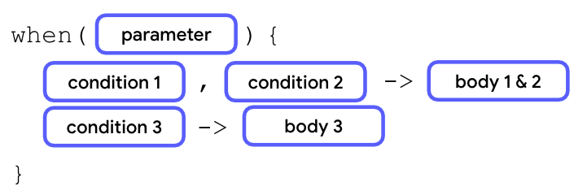

上の図では、最初と 2 番目の条件のいずれかが満たされると、対応する本体が実行されます。

このコンセプトで素数プログラムを書き換えます。

1. `2` 条件の分岐に、`3`、`5`、`7` をカンマ（`,`）で区切って追加します。

```kotlin
fun main() {
    val x = 3

    when (x) {
        2, 3, 5, 7 -> println("x is a prime number between 1 and 10.")
        3 -> println("x is a prime number between 1 and 10.")
        5 -> println("x is a prime number between 1 and 10.")
        7 -> println("x is a prime number between 1 and 10.")
        else -> println("x isn't a prime number between 1 and 10.")
    }
}
```

2. `3`、`5`、`7` 条件の個々の分岐を削除します。

```kotlin
fun main() {
    val x = 3

    when (x) {
        2, 3, 5, 7 -> println("x is a prime number between 1 and 10.")
        else -> println("x isn't a prime number between 1 and 10.")
    }
}
```

3. プログラムを実行して、出力が想定どおりであることを確認します。

```
x is a prime number between 1 and 10.
```

##### `in` **キーワードを条件の範囲に使用する**

複数の条件を示すために、カンマ（`,`）記号の他に、`in` キーワードと、`when` 分岐の値の範囲も使用できます。

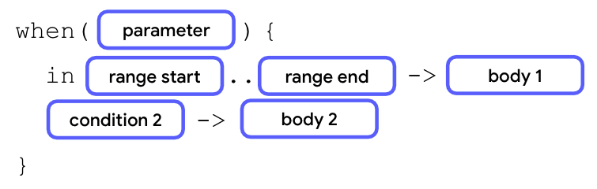

値の範囲を使用するには、範囲の開始を示す数値を追加し、その後にスペースなしで 2 つのピリオドを追加して、範囲の終了を示す別の数値で閉じます。

パラメータの値が範囲の開始から終了までのいずれかの値と等しいとき、最初の本体が実行されます。

素数プログラムで、数値が 1～10 であり、かつ素数でない場合に、メッセージを出力できますか？

`in` キーワードを伴う別の分岐を追加します。

1. `when` ステートメントの最初の分岐の後に、`in` キーワードを伴う 2 番目の分岐を追加し、続けて `1..10` 範囲と `println("x is a number between 1 and 10, but not a prime number.")` 本体を追加します。

```kotlin
fun main() {
    val x = 3

    when (x) {
        2, 3, 5, 7 -> println("x is a prime number between 1 and 10.")
        in 1..10 -> println("x is a number between 1 and 10, but not a prime number.")
        else -> println("x isn't a prime number between 1 and 10.")
    }
}
```

2. `x` 変数を `4` 値に変更します。

```kotlin
fun main() {
    val x = 4

    when (x) {
        2, 3, 5, 7 -> println("x is a prime number between 1 and 10.")
        in 1..10 -> println("x is a number between 1 and 10, but not a prime number.")
        else -> println("x isn't a prime number between 1 and 10.")
    }
}
```

3. プログラムを実行して出力を確認します。

```
x is a number between 1 and 10, but not a prime number.
```

2 番目の分岐のメッセージは出力されますが、最初または 3 番目の分岐のメッセージは出力されません。

##### 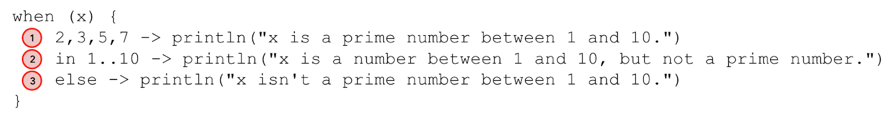

プログラムの流れは次のとおりです。

- `x` 変数に `4` 値が代入されます。
- プログラムは最初の分岐の条件の評価に進みます。`4` 値は `2`、`3`、`5`、`7` 値ではないため、プログラムは最初の分岐における本体の実行をスキップし、2 番目の分岐に進みます。
- `4` 値は `1`～`10` であるため、`x is a number between 1 and 10, but not a prime number.` 本体のメッセージが出力されます。
- 1 つの本体が実行されるため、プログラムは `when` ステートメントを離れ、`else` 分岐を無視します。

##### `is` キーワードを使用してデータ型を確認する

`is` キーワードを条件として使用すると、評価値のデータ型を確認できます。

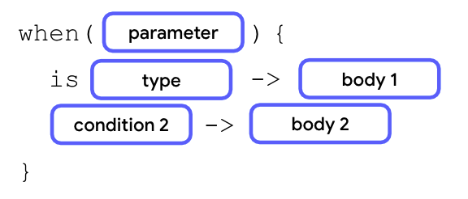

上の図では、引数の値が指定したデータ型である場合、最初の本体が実行されます。

素数プログラムで、入力が 1～10 の範囲外の整数である場合に、メッセージを出力できますか？

`is` キーワードを伴う別の分岐を追加します。

1. `x` を `Any` 型に変更します。これにより、`x` を `Int` 型以外の値にすることができます。

```kotlin
fun main() {
    val x: Any = 4

    when (x) {
        2, 3, 5, 7 -> println("x is a prime number between 1 and 10.")
        in 1..10 -> println("x is a number between 1 and 10, but not a prime number.")
        else -> println("x isn't a prime number between 1 and 10.")
    }
}
```

2. `when` ステートメントの 2 番目の分岐の後に、`is` キーワード、`Int` データ型、`println("x is an integer number, but not between 1 and 10.")` 本体を追加します。

```kotlin
fun main() {
    val x: Any = 4

    when (x) {
        2, 3, 5, 7 -> println("x is a prime number between 1 and 10.")
        in 1..10 -> println("x is a number between 1 and 10, but not a prime number.")
        is Int -> println("x is an integer number, but not between 1 and 10.")
        else -> println("x isn't a prime number between 1 and 10.")
    }
}
```

3. `else` 分岐の本体を `println("x isn't an integer number.")` 本体に変更します。

```kotlin
fun main() {
    val x: Any = 4

    when (x) {
        2, 3, 5, 7 -> println("x is a prime number between 1 and 10.")
        in 1..10 -> println("x is a number between 1 and 10, but not a prime number.")
        is Int -> println("x is an integer number, but not between 1 and 10.")
        else -> println("x isn't an integer number.")
    }
}
```

4. `x` 変数を `20` 値に変更します。

```kotlin
fun main() {
    val x: Any = 20

    when (x) {
        2, 3, 5, 7 -> println("x is a prime number between 1 and 10.")
        in 1..10 -> println("x is a number between 1 and 10, but not a prime number.")
        is Int -> println("x is an integer number, but not between 1 and 10.")
        else -> println("x isn't an integer number.")
    }
}
```

5. プログラムを実行して出力を確認します。

```
x is an integer number, but not between 1 and 10.
```

3 番目の分岐のメッセージは出力されますが、最初、2 番目、4 番目の分岐のメッセージは出力されません。

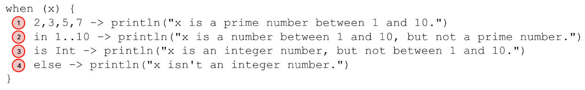

プログラムの流れは次のとおりです。

- `x` 変数に `20` 値が代入されます。
- プログラムは最初の分岐の条件の評価に進みます。`20` 値は `2`、`3`、`5`、`7` 値ではないため、プログラムは最初の分岐における本体の実行をスキップし、2 番目の分岐に進みます。
- `20` 値は `1`～`10` ではないため、プログラムは 2 番目の分岐における本体の実行をスキップし、3 番目の分岐に進みます。
- `20` 値は `Int` 型であるため、`x is an integer number, but not between 1 and 10` 本体が出力されます。
- 1 つの本体が実行されるため、プログラムは `when` ステートメントを離れ、`else` 分岐を無視します。

#### 試してみる

ここで、信号機プログラムで学んだことを実践しましょう。

一部の国には信号機の色として琥珀色があり、運転者に対し他の国でいう黄信号と同様の警告を行うとします。この追加条件をカバーしつつ元の条件を維持するように、プログラムを変更できますか？

#### 同じ本体を使用して条件を追加する

信号機プログラムに条件を追加します。

1. まだ開いている場合は、信号機プログラムがある Kotlin プレイグラウンドのインスタンスに戻ります。
2. 閉じた場合は、Kotlin プレイグラウンドの新しいインスタンスを開いて、次のコードを入力します。

```kotlin
fun main() {
    val trafficLightColor = "Yellow"

    when (trafficLightColor) {
        "Red" -> println("Stop")
        "Yellow" -> println("Slow")
        "Green" -> println("Go")
        else -> println("Invalid traffic-light color")
    }
}
```

3. `when` ステートメントの 2 番目の分岐で、`"Yellow"` 条件の後にカンマを追加し、その後に `"Amber"` 条件を追加します。

```kotlin
fun main() {
    val trafficLightColor = "Yellow"

    when (trafficLightColor) {
        "Red" -> println("Stop")
        "Yellow", "Amber" -> println("Slow")
        "Green" -> println("Go")
        else -> println("Invalid traffic-light color")
    }
}
```

4. `trafficLightColor` 変数を `"Amber"` 値に変更します。

```kotlin
fun main() {
    val trafficLightColor = "Amber"

    when (trafficLightColor) {
        "Red" -> println("Stop")
        "Yellow", "Amber" -> println("Slow")
        "Green" -> println("Go")
        else -> println("Invalid traffic-light color")
    }
}
```

5. プログラムを実行して出力を確認します。

```
Slow
```

### 4. if / else と when を式として使用する

`if/else` と `when` をステートメントとして使用する方法を学びました。条件をステートメントとして使用すると、条件に基づいて各分岐がさまざまなアクションを本体で実行できるようになります。

また、条件を式として使用し、条件の分岐ごとに異なる値を返すこともできます。各分岐の本体が似ている場合、条件式を使用すると、条件ステートメントよりもコードの可読性が高くなります。

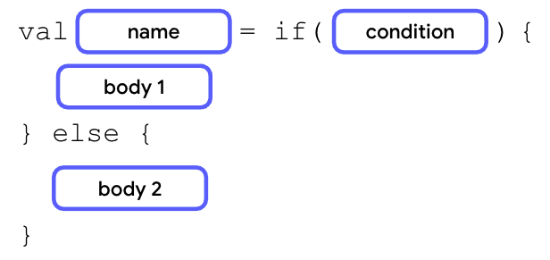

式としての条件の構文はステートメントと似ていますが、各分岐の本体の最終行は値または式を返す必要があり、条件は変数に代入されます。

本体に戻り値または式しかない場合は、中かっこを削除してコードを簡潔にできます。

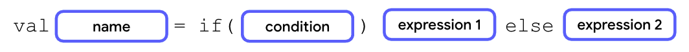

次のセクションでは、信号機プログラムを通じて `if/else` 式を見てみましょう。

#### `if` ステートメントを式に変換する

この `if/else` ステートメントでは `println()` ステートメントが何度も繰り返されています。

```kotlin
fun main() {
    val trafficLightColor = "Black"

    if (trafficLightColor == "Red") {
        println("Stop")
    } else if (trafficLightColor == "Yellow") {
        println("Slow")
    } else if (trafficLightColor == "Green") {
        println("Go")
    } else {
        println("Invalid traffic-light color")
    }

}
```

この `if/else` ステートメントを `if/else` 式に変換し、繰り返しを削除します。

1. Kotlin プレイグラウンドで、前の信号機プログラムに入ります。
2. `message` 変数を定義し、`if/else` ステートメントを代入します。

```kotlin
fun main() {
    val trafficLightColor = "Black"

    val message = if (trafficLightColor == "Red") {
        println("Stop")
    } else if (trafficLightColor == "Yellow") {
        println("Slow")
    } else if (trafficLightColor == "Green") {
        println("Go")
    } else {
        println("Invalid traffic-light color")
    }

}
```

3. すべての `println()` ステートメントと、その中かっこを削除します。ただし、内部の値は残します。

```kotlin
fun main() {
    val trafficLightColor = "Black"

    val message = 
      if (trafficLightColor == "Red") "Stop"
      else if (trafficLightColor == "Yellow") "Slow"
      else if (trafficLightColor == "Green") "Go"
      else "Invalid traffic-light color"
}
```

4. プログラムの最後に `println()` ステートメントを追加し、引数として `message` 変数を渡します。

```kotlin
fun main() {
    val trafficLightColor = "Black"

    val message = 
      if (trafficLightColor == "Red") "Stop"
      else if (trafficLightColor == "Yellow") "Slow"
      else if (trafficLightColor == "Green") "Go"
      else "Invalid traffic-light color"

    println(message)
}
```

5. プログラムを実行して出力を確認します。

```
Invalid traffic-light color
```

#### 試してみる

`when` ステートメントの代わりに `when` 式を使用するように信号機プログラムを変換します。

1. Kotlin プレイグラウンドで、次のコードを入力します。

```kotlin
fun main() {
    val trafficLightColor = "Amber"

    when (trafficLightColor) {
        "Red" -> println("Stop")
        "Yellow", "Amber" -> println("Slow")
        "Green" -> println("Go")
        else -> println("Invalid traffic-light color")
    }
}
```

`println()` ステートメントを繰り返さないように `when` ステートメントを式に変換できますか？

2. `message` 変数を作成し、`when` 式を代入します。

```kotlin
fun main() {
    val trafficLightColor = "Amber"

    val message = when(trafficLightColor) {
        "Red" -> "Stop"
        "Yellow", "Amber" -> "Slow"
        "Green" -> "Go"
        else -> "Invalid traffic-light color"
    }
}
```

3. プログラムの最終行として `println()` ステートメントを追加し、引数として `message` 変数を渡します。

```kotlin
fun main() {
    val trafficLightColor = "Amber"

    val message = when(trafficLightColor) {
        "Red" -> "Stop"
        "Yellow", "Amber" -> "Slow"
        "Green" -> "Go"
        else -> "Invalid traffic-light color"
    }
    println(message)
}
```

> **注:**`when` ステートメントでは `else` 分岐を定義する必要はありません。しかしほとんどの場合、`when` 式は値を返す必要があるため、`when` 式には `else` 分岐が必要です。そのため、Kotlin コンパイラはすべての分岐が網羅的かどうかを確認します。`else` 分岐を使用すると、変数に値が代入されないというシナリオがなくなります。

### 5. まとめ

お疲れさまでした。条件と、その Kotlin での記述方法について学習しました。

#### 概要

- Kotlin では、`if/else` 条件または `when` 条件を使用して分岐を実現できます。
- `if/else` 条件における `if` 分岐の本体は、`if` 分岐条件内のブール式が `true` 値を返した場合にのみ実行されます。
- `if/else` 条件における後続の `else if` 分岐は、前の `if` 分岐または `else if` 分岐が `false` 値を返した場合にのみ実行されます。
- `if/else` 条件における最後の `else` 分岐は、前のすべての `if` 分岐または `else if` 分岐が `false` 値を返した場合にのみ実行されます。
- 分岐が 2 つ以上ある場合は、`if/else` 条件の代わりに `when` 条件を使用することをおすすめします。
- カンマ（`,`）、`in` 範囲、`is` キーワードを使用すると、`when` 条件に複雑な条件を記述できます。
- `if/else` 条件と `when` 条件は、ステートメントまたは式として機能できます。

#### 詳細

- [条件とループ](https://kotlinlang.org/docs/control-flow.html#break-and-continue-in-loops)

## 4. Kotlin で null 可能性を使用する

### 1. 始める前に

このレッスンでは、null 可能性と、`null` 安全の重要性について学習します。null 可能性は、多くのプログラミング言語で一般的に見られる概念です。これは、値を持たないことが可能であるという、変数の能力のことです。Kotlin では、`null` 安全を達成するために、null 可能性を意識的に取り扱っています。

#### 前提条件

- Kotlin プログラミングの基礎知識（変数を含む）、変数からメソッドやプロパティへのアクセスに関する知識、`println()` 関数と `main()` 関数の知識
- `if/else` 文やブール式などの Kotlin の条件構文に慣れていること

#### 学習内容

- `null` とは何か
- null 値許容型と null 値非許容型の違い
- `null` 安全とその重要性、Kotlin がどのように `null` 安全を実現するか
- セーフコール演算子（`?.`）と非 null 値アサーション演算子（`!!`）を使用して null 値許容変数のメソッドとプロパティにアクセスする方法
- `if/else` 条件構文を使用して `null` チェックを行う方法
- `if/else` 式を使用して null 値許容変数を null 値非許容型に変換する方法
- null 値許容変数が `null` の場合のデフォルト値を、`if/else` 式またはエルビス演算子（`?:`）で指定する方法

#### **必要なもの**

- Kotlin プレイグラウンドにアクセスできるウェブブラウザ

### 2. null 値許容変数を使用する

#### `null` とは何か

ユニット 1 では、変数を宣言する場合、すぐに値を代入する必要があることを学習しました。たとえば、`favoriteActor` 変数を宣言する場合に、すぐに `"Sandra Oh"` という文字列値を代入します。

```kotlin
val favoriteActor = "Sandra Oh"
```

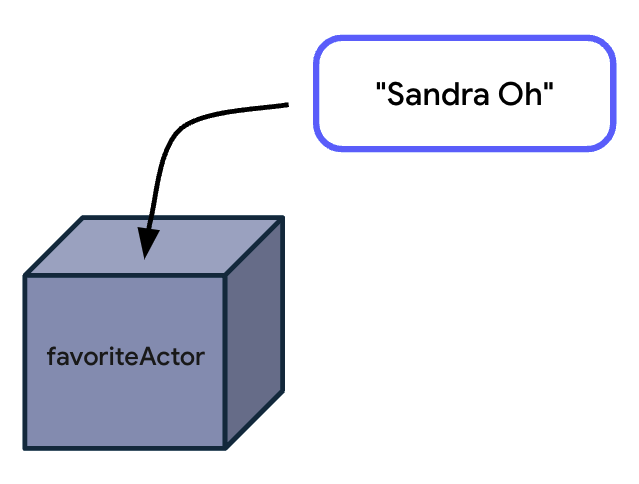

では、お気に入りの俳優がいない場合はどうでしょうか。この変数に `"Nobody"` や `"None"` という値を代入することもできます。しかし、プログラムは `favoriteActor` 変数に値がないとは解釈せず、`"Nobody"` や `"None"` という値があると解釈するため、良い方法ではありません。Kotlin では、`null` を使用することで、変数に関連付けられた値がないことを示すことができます。

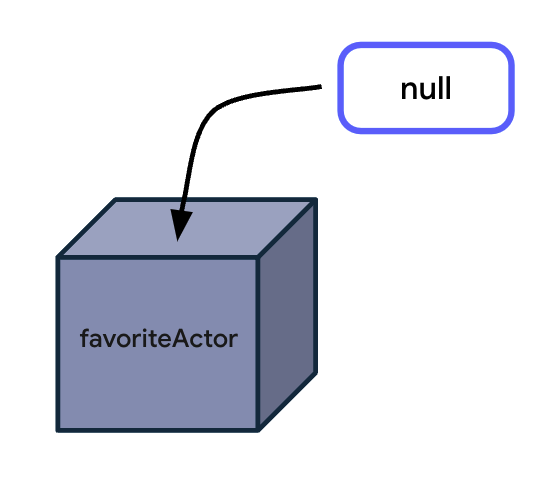

以下のようにして、コードで `null` を使用しましょう。

1. [Kotlin のプレイグラウンド](https://developer.android.com/training/kotlinplayground)で、`main()` 関数の本体の内容を、`null` に設定された `favoriteActor` 変数に置き換えます。

```kotlin
fun main() {
    val favoriteActor = null
}
```

2. `favoriteActor` 変数の値を `println()` 関数で出力するようにしてから、このプログラムを実行します。

```kotlin
fun main() {
    val favoriteActor = null
    println(favoriteActor)
}
```

出力は、次のコード スニペットのようになります。

```
null
```

#### 変数に `null` を再代入する

以前に、`var` キーワードで定義された変数には、同じ型の異なる値を再代入できることを学習しました。たとえば、新しい俳優の名前が `String` 型である限り、ある名前で宣言されている `name` 変数に別の名前を再代入できます。

```kotlin
var favoriteActor: String = "Sandra Oh"
favoriteActor = "Meryl Streep"
```

変数を宣言した後で、その変数に `null` を代入する必要が生じることがあります。たとえば、お気に入りの俳優を宣言した後で、それを一切公開しないことにした場合などです。この場合、`favoriteActor` 変数への `null` の代入が使えます。

#### **null 値非許容変数と null 値許容変数について**

以下のようにして `favoriteActor` 変数に `null` を再代入しましょう。

1. `val` キーワードを `var` キーワードに変更し、`favoriteActor` 変数が `String` 型であることを指定して、お気に入りの俳優の名前を代入します。

```kotlin
fun main() {
    var favoriteActor: String = "Sandra Oh"
    println(favoriteActor)
}
```

2. `println()` 関数を削除します。

```kotlin
fun main() {
    var favoriteActor: String = "Sandra Oh"
}
```

3. `favoriteActor` 変数に `null` を再代入するようにしてから、このプログラムを実行します。

```kotlin
fun main() {
    var favoriteActor: String = "Sandra Oh"
    favoriteActor = null
}
```

次のエラー メッセージが表示されます。


Kotlin では、null 値許容型と null 値非許容型の区別があります。

- null 値許容型は、`null` を保持できる変数です。
- null 値非許容型は、`null` を保持できない変数です。

型が null 値許容なのは、それに `null` を明示的に保持させる場合のみです。エラー メッセージが示すように、`String` データ型は null 値非許容型であるため、この変数に `null` を再代入することはできません。

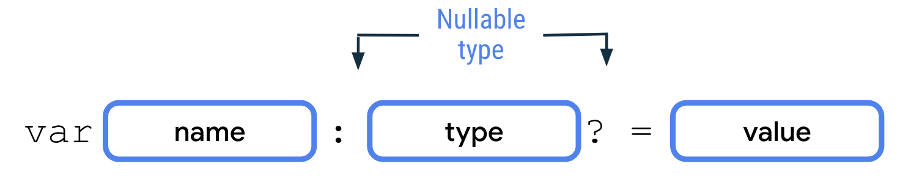

Kotlin で null 値許容変数を宣言するには、型の末尾に `?` 演算子を追加する必要があります。たとえば、`String?` 型は文字列か `null` のいずれかを保持できますが、`String` 型は文字列しか保持できません。null 値許容変数を宣言するには、null 値許容型を明示的に追加する必要があります。null 値許容型でない場合、Kotlin コンパイラは null 値非許容型だと推論します。

4. `favoriteActor` 変数の型を `String` データ型から `String?` データ型に変更します。

```kotlin
fun main() {
    var favoriteActor: String? = "Sandra Oh"
    favoriteActor = null
}
```

5. `null` の再代入の前後で `favoriteActor` 変数を出力するようにしてから、このプログラムを実行します。

```kotlin
fun main() {
    var favoriteActor: String? = "Sandra Oh"
    println(favoriteActor)

    favoriteActor = null
    println(favoriteActor)
}
```

出力は、次のコード スニペットのようになります。

```
Sandra Oh
null
```

`favoriteActor` 変数は、最初は文字列を保持していましたが、その後 `null` を再代入されます。

#### **試してみる**

null 値許容の `String?` 型を使用できるようになったので、`Int` 値で変数を初期化してから、`null` を再代入しましょう。

#### null 値許容の `Int` 値を記述する

1. `main()` 関数内のすべてのコードを削除します。

```kotlin
fun main() {
    
}
```

2. null 値許容の `Int` 型の `number` 変数を作成し、`10` という値を代入します。

```kotlin
fun main() {
    var number: Int? = 10
}
```

3. `number` 変数を出力するようにしてから、このプログラムを実行します。

```kotlin
fun main() {
    var number: Int? = 10
    println(number)
}
```

出力は想定どおりです。

```
10
```

4. `number` 変数が null 値許容であることを確かめるために、`null` を再代入します。

```kotlin
fun main() {
    var number: Int? = 10
    println(number)
    
    number = null
}
```

5. プログラムの最後の行として別の `println(number)` 文を追加し、実行します。

```kotlin
fun main() {
    var number: Int? = 10
    println(number)
    
    number = null
    println(number)
}
```

出力は想定どおりです。

```
10
null
```

> **注:** `null` を保持する可能性がある変数には null 値許容変数を使用する必要がありますが、`null` を保持することがない変数には null 値非許容変数を使用してください。null 許容変数にアクセスするには複雑な操作が必要となるためです。null 値許容変数を処理するさまざまな方法については、次のセクションで説明します。

### 3. null 値許容変数の扱い方

以前に、「`.`」演算子を使用して null 値非許容変数のメソッドとプロパティにアクセスする方法を学習しました。このセクションでは、null 値許容変数のメソッドとプロパティにアクセスする方法について説明します。

以下の手順で、null 値非許容の `favoriteActor` 変数のプロパティにアクセスしましょう。

1. `main()` 関数のすべてのコードを削除し、`String` 型の `favoriteActor` 変数を宣言して、お気に入りの俳優の名前を代入します。

```kotlin
fun main() {
    var favoriteActor: String = "Sandra Oh"
}
```

2. [`length`](https://kotlinlang.org/api/latest/jvm/stdlib/kotlin/-string/length.html) プロパティを使って `favoriteActor` 変数値の文字数を出力するようにしてから、このプログラムを実行します。

```kotlin
fun main() {
    var favoriteActor: String = "Sandra Oh"
    println(favoriteActor.length)
}
```

出力は想定どおりです。

```
9
```

`favoriteActor` 変数にはスペースを含めて *9* 文字が入っています。文字数はお気に入りの俳優の名前によって異なります。

#### null 値許容変数のプロパティにアクセスする

`favoriteActor` 変数を null 値許容にして、お気に入りの俳優がいない場合は、この変数に `null` を代入できるようにすることを考えます。

以下の手順で、null 値許容の `favoriteActor` 変数のプロパティにアクセスしましょう。

- `favoriteActor` 変数の型を null 値許容型に変更してから、このプログラムを実行します。

```kotlin
fun main() {
    var favoriteActor: String? = "Sandra Oh"
    println(favoriteActor.length)
}
```

次のエラー メッセージが表示されます。

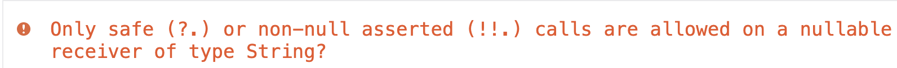

このエラーはコンパイル エラーです。前のレッスンで説明したように、コンパイル エラーは、コードの構文エラーが原因で Kotlin がコードをコンパイルできない場合に発生します。

Kotlin では、`null` 安全（`null` の可能性がある変数での呼び出しが間違って行われないことが保証されているという意味）を達成できるように構文上のルールが意図的に適用されます。これは、変数を `null` にできないという意味ではありません。変数のメンバーがアクセスされる場合には、その変数を `null` にできないという意味です。

このことは、アプリの実行中に `null` である変数のメンバーへのアクセス（`null` 参照）を行おうとすると、`null` 変数にはプロパティやメソッドがないためアプリがクラッシュすることから、大変重要です。この種のクラッシュは、コードをコンパイルして実行したあとで発生するエラーであることから、ランタイム エラーと呼ばれています。

Kotlin には `null` 安全という性質があるため、Kotlin コンパイラが null 値許容型に対する `null` チェックを強制して、このようなランタイム エラーを防いでいます。`Null` チェックとは、変数にアクセスして null 値非許容型として扱う前に、その変数が `null` になる可能性をチェックする処理のことです。null 値許容型を null 値非許容型として使用する場合は、`null` チェックを明示的に行う必要があります。詳しくは、このレッスンの後半にある `if/else` **条件構文**の**使用**に関するセクションをご覧ください。

この例の場合、`favoriteActor` 変数の `length` プロパティを直接参照できないことが原因でコンパイル時エラーとなります。これは、変数が `null` になる可能性があるためです。

次は、null 値許容型を扱うさまざまな手法と演算子について学習します。

#### セーフコール演算子（`?.`）を使用する

セーフコール演算子（`?.`）使用して、null 値許容変数のメソッドやプロパティにアクセスできます。

#### 

セーフコール演算子（`?.`）を使用してメソッドやプロパティにアクセスするには、変数名の後に「`?`」を追加し、「`.`」記法でメソッドやプロパティにアクセスします。

セーフコール演算子（`?.`）を使用すると、Kotlin コンパイラが `null` 参照に対するメンバー アクセスをすべて阻止して、アクセスされたメンバーの代わりに `null` を返すため、null 値許容変数に安全にアクセスできます。

以下の手順で、null 値許容の `favoriteActor` 変数のプロパティに安全にアクセスしましょう。

1. `println()` 文で、「`.`」演算子をセーフコール演算子（`?.`）に置き換えます。

```kotlin
fun main() {
    var favoriteActor: String? = "Sandra Oh"
    println(favoriteActor?.length)
}
```

2. このプログラムを実行して、出力が予想どおりであることを確認します。

```
9
```

文字数はお気に入りの俳優の名前によって異なります。

3. `favoriteActor` 変数に `null` を再代入するようにしてから、このプログラムを実行します。

```kotlin
fun main() {
    var favoriteActor: String? = null
    println(favoriteActor?.length)
}
```

以下のような出力が表示されます。

```
null
```

`null` 変数の `length` プロパティにアクセスしようとしましたが、プログラムはクラッシュしていません。セーフコール式は `null` を返しています。

> **注:** null 値非許容変数のメソッドやプロパティにも、セーフコール演算子（`?.`）を使用してアクセスできます。Kotlin コンパイラがエラーとすることはありませんが、null 値非許容変数のメソッドやプロパティへのアクセスは常に安全であるため、これは不要です。

#### 非 null アサーション演算子（`!!`）を使用する

null 値許容変数のメソッドやプロパティにアクセスするために、非 null アサーション演算子（`!!`）を使用することもできます。


null 値許容変数の後に、非 null アサーション演算子（`!!`）を追加し、その後に「`.`」演算子を追加して、さらにその後にメソッドまたはプロパティを追加する必要があります（スペースは入れません）。

その名前のとおり、非 null アサーション（`!!`）を使用すると、変数の値がどちらであるかにかかわらず、`null` でないことをアサートすることになります。

セーフコール演算子（`?.`）とは異なり、非 null アサーション演算子（`!!`）を使用すると、null 値許容変数が実際に `null` の場合に `NullPointerException` エラーがスローされます。したがって、変数が常に null 値非許容の場合か、適切な例外処理が設定されている場合にのみ行う必要があります。処理しない場合は、例外によりランタイム エラーが発生します。例外処理については、このプログラムの後半のユニットで説明します。

以下の手順で、非 null アサーション演算子（`!!`）を使用して `favoriteActor` 変数のプロパティにアクセスしましょう。

1. `favoriteActor` 変数にお気に入りの俳優の名前を再代入し、`println()` 文のセーフコール演算子（`?.`）を非 null アサーション演算子（`!!`）に置き換えます。

```kotlin
fun main() {
    var favoriteActor: String? = "Sandra Oh"
    println(favoriteActor!!.length)
}
```

2. このプログラムを実行して、出力が予想どおりであることを確認します。

```
9
```

文字数はお気に入りの俳優の名前によって異なります。

3. `favoriteActor` 変数に `null` を再代入するようにしてから、このプログラムを実行します。

```kotlin
fun main() {
    var favoriteActor: String? = null
    println(favoriteActor!!.length)
}
```

`NullPointerException` エラーが発生します。

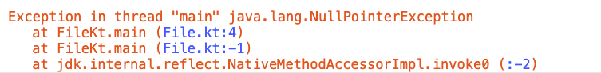

この Kotlin エラーは、プログラムが実行中にクラッシュしたことを示しています。このため、変数が `null` でないことが確実な場合を除き、非 null アサーション演算子（`!!`）の使用はおすすめしません。

> **注:** null 安全という性質を持たない他のプログラミング言語でアプリがクラッシュする原因の多くは `NullPointerException` エラーです。Kotlin では、言語に `null` 安全という性質があるため、プログラムがクラッシュする大きな原因が取り除かれています。

#### `if/else` 条件構文を使用する

`if/else` 条件構文の `if` 分岐を使って、`null` チェックを行うことができます。

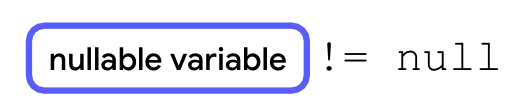

`null` チェックは、`!=` 比較演算子で null 値許容変数が `null` と等しくないことを確認することで行うことができます。

##### `if/else` ステートメント

次のように `if/else` 文を `null` チェックと組み合わせて使用できます。

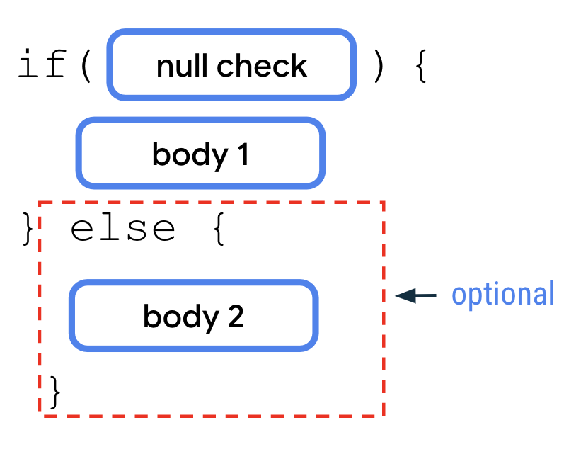

null チェックは、`if/else` 文と組み合わせると便利です。

- `nullableVariable != null` という式の `null` チェックを `if` の条件として使用します。
- `if` 分岐の本体 1 では、変数が `null` でないと想定されます。したがって、この本体では null 値非許容変数であるかのように変数のメソッドやプロパティに自由にアクセスできます。セーフコール演算子（`?.`）や非 null アサーション演算子（`!!`）は不要です。
- `else` 分岐の本体 2 では、変数が `null` であると想定されます。したがって、この本体には、変数が `null` のときに実行する文を追加できます。`else` 分岐は省略可能です。`null` チェックが失敗した場合のデフォルト動作を指定せずに、`null` チェックを実行する `if` 条件構文のみを使用できます。

null 値許容変数を使用するコードが複数行ある場合は、`if` 条件で `null` チェックを使用するのが便利です。これに対して、null 値許容変数の参照が 1 回の場合は、セーフコール演算子（`?.`）が便利です。

以下の手順で、`favoriteActor` 変数の `null` チェックを含む `if/else` 文を記述しましょう。

1. 今回も `favoriteActor` 変数にお気に入りの俳優の名前を代入し、`println()` 文を削除します。

```kotlin
fun main() {
    var favoriteActor: String? = "Sandra Oh"

}
```

2. `favoriteActor != null` という条件の `if` 分岐を追加します。

```kotlin
fun main() {
    var favoriteActor: String? = "Sandra Oh"

    if (favoriteActor != null) {

    }
}
```

3. `if` 分岐の本体に、`"The number of characters in your favorite actor's name is ${favoriteActor.length}."` 文字列を受け取る `println` 文を追加してから、このプログラムを実行します。

```kotlin
fun main() {
    var favoriteActor: String? = "Sandra Oh"

    if (favoriteActor != null) {
      println("The number of characters in your favorite actor's name is ${favoriteActor.length}.")
    }
}
```

出力は想定どおりです。

```
The number of characters in your favorite actor's name is 9.
```

文字数はお気に入りの俳優の名前によって異なります。

`null` チェックの後の `if` 分岐内で `length` メソッドにアクセスするため、「`.`」演算子を使用して名前の length メソッドに直接アクセスできています。このように、Kotlin コンパイラは `favoriteActor` 変数が `null` になる可能性がないことを認識しているため、プロパティに直接アクセスすることを許しています。

4. 省略可: `else` 分岐を追加して、俳優の名前が `null` になる状況に対応します。

```kotlin
fun main() {
    var favoriteActor: String? = "Sandra Oh"

    if (favoriteActor != null) {
      println("The number of characters in your favorite actor's name is ${favoriteActor.length}.")
    } else {

    }
}
```

5. `else` 分岐の本体に、`"You didn't input a name."` 文字列を受け取る `println` 文を追加します。

```kotlin
fun main() {
    var favoriteActor: String? = "Sandra Oh"

    if (favoriteActor != null) {
      println("The number of characters in your favorite actor's name is ${favoriteActor.length}.")
    } else {
      println("You didn't input a name.")
    }
}
```

6. `favoriteActor` 変数に `null` を代入するようにしてから、このプログラムを実行します。

```kotlin
fun main() {
    var favoriteActor: String? = null

    if(favoriteActor != null) {
      println("The number of characters in your favorite actor's name is ${favoriteActor.length}.")
    } else {
      println("You didn't input a name.")
    }
}
```

出力は想定どおりです。

```
You didn't input a name.
```

##### `if/else` **式**

`null` チェックと `if/else` 式を組み合わせて、null 値許容変数を null 値非許容変数に変換することもできます。

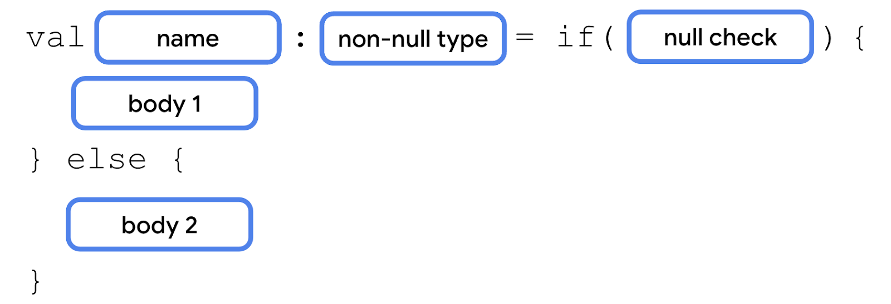

次のようにして、null 値非許容型に `if/else` 式を代入します。

- `nullableVariable != null` という `null` チェックを `if` 条件として使用します。
- `if` 分岐の本体 1 では、変数が `null` でないと想定されます。したがって、この本体では null 値非許容変数であるかのように変数のメソッドやプロパティにアクセスできます。セーフコール演算子（`?.`）や非 null アサーション演算子（`!!`）は不要です。
- `else` 分岐の本体 2 では、変数が `null` であると想定されます。したがって、この本体には、変数が `null` のときに実行する文を追加できます。
- 本体 1 と本体 2 の最後の行では、null 値非許容型になる式や値を使用し、それぞれ `null` チェックが成功したときと失敗したときに、それが null 値非許容変数に代入されるようにする必要があります。

以下の手順で、`if/else` 式を使用して、`println` 文を 1 つだけ使用するようにプログラムを書き換えましょう。

1. お気に入りの俳優の名前を `favoriteActor` 変数に代入します。

```kotlin
fun main() {
    var favoriteActor: String? = "Sandra Oh"

    if (favoriteActor != null) {
      println("The number of characters in your favorite actor's name is ${favoriteActor.length}.")
    } else {
      println("You didn't input a name.")
    }
}
```

2. `lengthOfName` 変数を作成してから、`if/else` 式を代入します。

```kotlin
fun main() {
    var favoriteActor: String? = "Sandra Oh"

    val lengthOfName = if (favoriteActor != null) {
      println("The number of characters in your favorite actor's name is ${favoriteActor.length}.")
    } else {
      println("You didn't input a name.")
    }
}
```

3. `if` 分岐と `else` 分岐の両方から `println()` 文を削除します。

```kotlin
fun main() {
    var favoriteActor: String? = "Sandra Oh"

    val lengthOfName = if (favoriteActor != null) {
      
    } else {
      
    }
}
```

4. `if` 分岐の本体に、`favoriteActor.length` という式を追加します。

```kotlin
fun main() {
    var favoriteActor: String? = "Sandra Oh"

    val lengthOfName = if (favoriteActor != null) {
      favoriteActor.length
    } else {
      
    }
}
```

`favoriteActor` 変数の `length` プロパティには、「`.`」演算子で直接アクセスします。

5. `else` 分岐の本体に、`0` の値を追加します。

```kotlin
fun main() {
   var favoriteActor: String? = "Sandra Oh"

    val lengthOfName = if (favoriteActor != null) {
      favoriteActor.length
    } else {
      0
    }
}
```

`0` の値は、名前が `null` の場合のデフォルト値として使用されます。

6. `main()` 関数の最後に、`"The number of characters in your favorite actor's name is $lengthOfName."` という文字列を受け取る `println` 文を追加し、次のプログラムを実行します。

```kotlin
fun main() {
    var favoriteActor: String? = "Sandra Oh"

    val lengthOfName = if (favoriteActor != null) {
      favoriteActor.length
    } else {
      0
    }

    println("The number of characters in your favorite actor's name is $lengthOfName.")
}
```

出力は想定どおりです。

```
The number of characters in your favorite actor's name is 9.
```

文字数は名前によって異なります。

> **注:** `null` のチェックには、`!=` 演算子の代わりに `==` 比較演算子を使用することもできます。このときは、2 つの本体が逆になります。`if` 分岐の本体では、変数が `null` であると想定され、`else` 分岐の本体では、変数が `null` でないと想定されます。

#### エルビス演算子（`?:`）を使用する

エルビス演算子（`?:`）は、セーフコール演算子（`?.`）と合わせて使用できる演算子です。エルビス演算子（`?:`）を使用することで、セーフコール演算子（`?.`）が `null` を返したときのデフォルト値を追加できます。これは `if/else` 式に似ていますが、より Kotlin らしい書き方です。

変数が `null` でない場合、エルビス演算子（`?:`）の前の式が実行されます。変数が `null` の場合、エルビス演算子（`?:`）の後の式が実行されます。

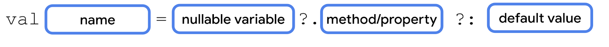

以下の手順で、以前のプログラムをエルビス演算子（`?:`）を使用するように変更しましょう。

1. `if/else` 条件構文を削除して、`lengthOfName` 変数に null 値許容の `favoriteActor` 変数を設定し、セーフコール演算子（`?.`）演算子を使用して `length` プロパティを呼び出します。

```kotlin
fun main() {
   var favoriteActor: String? = "Sandra Oh"

    val lengthOfName = favoriteActor?.length

    println("The number of characters in your favorite actor's name is $lengthOfName.")
}
```

2. `length` プロパティの後で、エルビス演算子（`?:`）の後に `0` の値を追加してから、このプログラムを実行します。

```kotlin
fun main() {
    var favoriteActor: String? = "Sandra Oh"

    val lengthOfName = favoriteActor?.length ?: 0

    println("The number of characters in your favorite actor's name is $lengthOfName.")
}
```

出力は前の出力と同じです。

```
The number of characters in your favorite actor's name is 9.
```

> **注:** エルビス演算子（`?:`）の名前は、[エルビス・プレスリー](https://en.wikipedia.org/wiki/Elvis_Presley)というロックスターに由来しています。この記号を横にすると、彼の[髪型](https://en.wikipedia.org/wiki/Quiff)を表す絵文字のようになるからです。

### 4. まとめ

これで完了です。null 可能性と、それをさまざまな演算子で扱う方法の学習が終わりました。

#### 概要

- 変数に `null` を設定することで、値を保持していないことを示せます。
- null 値非許容変数には `null` を代入できません。
- null 値許容変数には `null` を代入できます。
- null 値許容変数のメソッドやプロパティにアクセスするには、セーフコール演算子（`?.`）か非 null アサーション演算子（`!!`）を使用する必要があります。
- `null` チェックと合わせて `if/else` 文を使用すると、null 値非許容のコンテキストで null 値許容変数にアクセスできます。
- `if/else` 式を使用すると null 値許容変数を null 値非許容型に変換することができます。
- `if/else` 式またはエルビス演算子（`?:`）を使用して、null 値許容変数が `null` の場合のデフォルト値を指定できます。

#### **詳細**

- [null 安全](https://kotlinlang.org/docs/null-safety.html)

## 5. Kotlin でクラスとオブジェクトを使用する

### 1. 始める前に

このレッスンでは、Kotlin でクラスとオブジェクトを使用する方法について説明します。

クラスは、オブジェクトを作成する際の土台にする設計図を提供します。オブジェクトは、そのオブジェクト用のデータで構成されるクラスのインスタンスです。オブジェクトとクラス インスタンスは同じ意味です。

家を建てることを考えてみましょう。クラスは建築家が描いた設計プランに似ています。これは設計図とも呼ばれます。設計図は家ではありません。家を建てる方法を示した説明書です。家は実在物であり、設計図に従って作成されたオブジェクトであると言えます。

家の設計図に複数の部屋があり、各部屋に独自の設計と用途があるように、各クラスには独自の設計と用途があります。クラスの設計方法を理解するには、データ、ロジック、動作をオブジェクトで包み込む方法を指南する、オブジェクト指向プログラミング（OOP）というフレームワークについて理解する必要があります。

OOP を使用すると、実世界の複雑な問題を小さなオブジェクトにまとめて単純化することができます。OOP には 4 つの基本コンセプトがあります。それぞれのコンセプトの詳細については、このレッスンで後ほど説明します。

- **カプセル化。**関連するプロパティと、それらのプロパティにアクションを実行するメソッドをクラスで包みます。スマートフォンについて考えてみましょう。カメラ、ディスプレイ、メモリカードなどのハードウェア部品やソフトウェア部品がカプセル化されています。部品が内部でどのように接続されているかを気にする必要はありません。
- **抽象化。**カプセル化の延長で、内部の実装ロジックを可能な限り隠すという考え方です。たとえば、スマートフォンで写真を撮るには、カメラアプリを開き、撮影するシーンにスマートフォンを向けて、ボタンをクリックする必要があります。カメラアプリの作成方法や、スマートフォンのカメラ ハードウェアの仕組みを知る必要はありません。つまり、カメラアプリの内部の仕組みやモバイルカメラが写真を撮影する方法が抽象化され、重要なタスクを実行できるようになっています。
- **継承。**親子関係を作ることで、他のクラスの特性と動作のうえにクラスを作成できるようにします。たとえば、各メーカーは Android OS を搭載したさまざまなモバイル デバイスを製造していますが、デバイスごとに UI は異なります。つまり、メーカーは Android OS の機能を継承し、そのうえにカスタマイズを行っていると言えます。
- **ポリモーフィズム。**この単語は、ギリシャ語の「ポリ」（多数）と「モーフィズム」（形態）を合わせたものです。ポリモーフィズムとは、異なるオブジェクトを単一かつ共通の方法で使用することを指します。たとえば、Bluetooth スピーカーをスマートフォンに接続する場合、スマートフォンが知る必要があるのは Bluetooth で音声を再生できるデバイスがあることだけです。さまざまな Bluetooth スピーカーを使用できますが、スマートフォンが各スピーカーの使い方を個別に知っている必要はありません。

最後に、プロパティ委譲についても学習します。これを使用すると、プロパティ値を操作する再利用可能なコードを簡潔な構文で記述できます。このレッスンでは、スマートホーム アプリのクラス構造を構築することを題材にして、こうしたコンセプトについて学習します。

> **注**: スマート デバイスは暮らしを便利にするものです。スマートフォンでスマート デバイスを操作できるスマートホーム ソリューションが多数販売されています。モバイル デバイスを 1 回タップするだけで、スマートテレビ、照明、エアコン、その他の家電製品など、さまざまなデバイスを操作できます。

#### 前提条件

- [Kotlin のプレイグラウンド](https://developer.android.com/training/kotlinplayground)でコードを開き、編集し、実行できる。
- Kotlin プログラミングの基礎知識（変数と関数を含む）、および `println()` 関数と `main()` 関数の知識

#### 学習内容

- OOP の概要
- クラスとは何か
- コンストラクタ、関数、プロパティを備えたクラスを定義する方法
- オブジェクトをインスタンス化する方法
- 継承とは何か
- IS-A 関係と HAS-A 関係の違い
- プロパティと関数をオーバーライドする方法
- 可視性修飾子とは
- 委譲とは何か、`by` 委譲の使用方法

#### 作成するコードの概要

- スマートホームのクラス構造
- スマートテレビやスマートライトなどのスマート デバイスを表すクラス

> **注:** 記述したコードが実際のハードウェア デバイスを操作することはありません。その代わり、`println()` 関数でアクションをコンソールに出力して操作をシミュレートします。

#### 必要なもの

- ウェブブラウザがインストールされた、インターネットに接続できるパソコン

### 2. クラスを定義する

クラスを定義するときには、そのクラスのすべてのオブジェクトに必要なプロパティとメソッドを指定します。

クラス定義は `class` キーワードで始まり、その後に名前、中括弧の組が続きます。構文の左中括弧の前の部分は、クラスヘッダーとも呼ばれます。中括弧の内側では、クラスのプロパティと関数を指定できます。プロパティと関数については後ほど説明します。クラス定義の構文を次の図に示します。

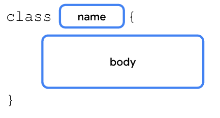

クラスには、以下のような命名規則が推奨されています。

- クラス名は任意に選択できますが、Kotlin の[キーワード](https://kotlinlang.org/docs/keyword-reference.html)は使用しません（例: `fun` キーワード）。
- クラス名は PascalCase（各単語が大文字で始まり、単語間にスペースがない）で記述します。たとえば、*S*martDevice では、各単語の先頭を大文字にし、単語間にはスペースを入れません。

クラスには、主に 3 つの構成要素があります。

- **プロパティ。**クラスのオブジェクトの属性を指定する変数。
- **メソッド。**クラスの動作とアクションを含んでいる関数。
- **コンストラクタ。**クラスを定義しているプログラムの中でそのクラスのインスタンスを作成する特別なメンバー関数。

クラスを扱う課題は今回が初めてではありません。これまでのレッスンで、`Int`、`Float`、`String`、`Double` などのデータ型について学習しました。Kotlin では、これらのデータ型がクラスとして定義されています。次のコード スニペットに示すように変数を定義すると、`1` の値でインスタンス化された `Int` クラスのオブジェクトが作成されます。

```kotlin
val number: Int = 1
```

`SmartDevice` クラスを定義しましょう。

1. [Kotlin のプレイグラウンド](https://developer.android.com/training/kotlinplayground)で、内容を空の `main()` 関数に置き換えます。

```kotlin
fun main() {
}
```

2. `main()` 関数の前の行で、本体に *`//`* *`empty`* *`body`* というコメントが入った `SmartDevice` クラスを定義します。

```kotlin
class SmartDevice {
    // empty body
}

fun main() {
}
```

### 3. クラスのインスタンスを作成する

すでに学習したとおり、クラスはオブジェクトの設計図です。Kotlin ランタイムは、クラス（設計図）を使用して、その型のオブジェクトを作成します。この `SmartDevice` クラスを、スマート デバイスの設計図として使用できます。プログラムで実際のスマート デバイスを使うには、`SmartDevice` のオブジェクト インスタンスを作成する必要があります。インスタンス化構文は、次の図に示すように、クラス名で始まり、その後に括弧の組が続きます。

#### 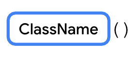

オブジェクトを使用するには、変数の定義と同様に、オブジェクトを作成して変数に代入します。不変変数は `val` キーワードを使用して作成し、可変変数は `var` キーワードを使用して作成します。`val` キーワードまたは `var` キーワードの後に、変数名、`=` 代入演算子、クラス オブジェクトのインスタンス化と続きます。この構文を図にすると次のようになります。

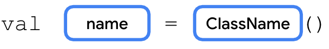

> **注:** オブジェクトを参照する変数を `val` キーワードで定義した場合、変数自体は読み取り専用になりますが、クラス オブジェクトは可変のままです。つまり、この変数に別のオブジェクトを再代入することはできませんが、プロパティの値を更新してオブジェクトの状態を変更することはできます。

`SmartDevice` クラスをオブジェクトとしてインスタンス化しましょう。

- `main()` 関数で、`val` キーワードを使用して `smartTvDevice` という名前の変数を作成し、`SmartDevice` クラスのインスタンスとして初期化します。

```kotlin
fun main() {
    val smartTvDevice = SmartDevice()
}
```

### 4. クラスメソッドを定義する

ユニット 1 では、以下のことを学びました。

- 関数の定義には、`fun` キーワードの後に、括弧の組と中括弧の組を続けたものを使用します。中括弧の中には、タスクを実行するために必要な手順であるコードが含まれています。
- 関数を呼び出すと、その関数に含まれるコードが実行されます。

クラスが実行できるアクションは、クラスの関数として定義されます。たとえば、スマート デバイス、スマートテレビ、スマートライトを所有していて、スマートフォンでオンとオフを切り替えられるとします。スマート デバイスは、プログラミングでは `SmartDevice` クラスに置き換えられ、オンとオフを切り替えるアクションは、オン / オフ動作を実現する `turnOn()` 関数と `turnOff()` 関数で表されます。

クラスで関数を定義する構文は、前に学習したものと同じです。唯一の違いは、関数がクラス本体にあることです。クラス本体で定義された関数は、メンバー関数またはメソッドと呼ばれ、クラスの動作を表します。このレッスンの残りの部分では、クラスの本体にある関数をメソッドと呼びます。

`SmartDevice` クラスで `turnOn()` メソッドと `turnOff()` メソッドを定義しましょう。

1. `SmartDevice` クラスの本体で、本体が空の `turnOn()` メソッドを定義します。

```kotlin
class SmartDevice {
    fun turnOn() {

    }
}
```

2. `turnOn()` メソッドの本体に `println()` 文を追加し、`"Smart` `device` `is` `turned` `on."` という文字列を渡します。

```kotlin
class SmartDevice {
    fun turnOn() {
        println("Smart device is turned on.")
    }
}
```

3. `turnOn()` メソッドの後に、`"Smart` `device` `is` `turned` `off."` という文字列を出力する `turnOff()` メソッドを追加します。

```kotlin
class SmartDevice {
    fun turnOn() {
        println("Smart device is turned on.")
    }

    fun turnOff() {
        println("Smart device is turned off.")
    }
}
```

#### **オブジェクト**のメソッドを呼び出す

ここまで、スマート デバイスの設計図となるクラスを定義し、そのクラスのインスタンスを作成して変数に代入しました。次に、`SmartDevice` クラスのメソッドを使用して、デバイスの電源をオンにしてからオフにします。

クラス内でのメソッドの呼び出しは、前のレッスンの `main()` 関数から他の関数を呼び出す方法に似ています。たとえば、`turnOn()` メソッドから `turnOff()` メソッドを呼び出す必要がある場合は、次のコード スニペットのように記述します。

```kotlin
class SmartDevice {
    fun turnOn() {
        // A valid use case to call the turnOff() method could be to turn off the TV when available power doesn't meet the requirement.
        turnOff()
        ...
    }

    ...
}
```

クラスの外部でクラスメソッドを呼び出すには、クラス オブジェクトの後に、`.` 演算子、関数名、括弧の組と続けたものを使用します。必要に応じて、メソッドに必要な引数を括弧内に入れます。この構文を図にすると次のようになります。

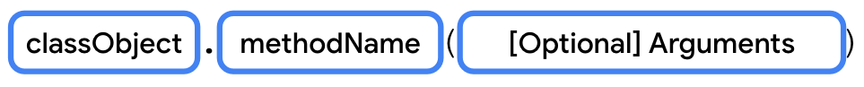

このオブジェクトの `turnOn()` メソッドと `turnOff()` メソッドを呼び出しましょう。

1. `main()` 関数の `smartTvDevice` 変数の後の行で、`turnOn()` メソッドを呼び出します。

```kotlin
fun main() {
    val smartTvDevice = SmartDevice()
    smartTvDevice.turnOn()
}
```

2. `turnOn()` メソッドの後の行で、`turnOff()` メソッドを呼び出します。

```kotlin
fun main() {
    val smartTvDevice = SmartDevice()
    smartTvDevice.turnOn()
    smartTvDevice.turnOff()
}
```

3. コードを実行します。

次のような出力が表示されます。

```
Smart device is turned on.
Smart device is turned off.
```

### 5. クラスのプロパティを定義する

ユニット 1 では、変数（1 つのデータを納めるコンテナ）について学びました。`val` キーワードを使用して読み取り専用変数を作成する方法と、`var` キーワードを使用して可変変数を作成する方法を学びました。

メソッドはクラスが実行できるアクションを定義しますが、プロパティはクラスの特性またはデータ属性を定義します。たとえば、スマート デバイスには次のような特性があります。

- **名前。**デバイスの名前。
- **カテゴリ。**スマート デバイスのタイプ（エンターテイメント、設備、調理など）。
- **デバイスのステータス。**デバイスがオンかオフか、オンラインかオフラインか。デバイスは、インターネットに接続されているときにオンラインとみなされ、そうでないときにはオフラインとみなされます。

プロパティは基本的に、関数本体ではなくクラス本体で定義される変数だと言えます。定義する構文は変数と同じだということです。不変プロパティは `val` キーワードで定義し、可変プロパティは `var` キーワードで定義します。

上で述べた特性を `SmartDevice` クラスのプロパティとして実装しましょう。

1. `turnOn()` メソッドの前の行で、`name` プロパティを定義して `"Android` `TV"` という文字列を代入します。

```kotlin
class SmartDevice {

    val name = "Android TV"

    fun turnOn() {
        println("Smart device is turned on.")
    }

    fun turnOff() {
        println("Smart device is turned off.")
    }
}
```

2. `name` プロパティの後の行で、`category` プロパティを定義して `"Entertainment"` という文字列を代入し、`deviceStatus` プロパティを定義して `"online"` という文字列を代入します。

```kotlin
class SmartDevice {

    val name = "Android TV"
    val category = "Entertainment"
    var deviceStatus = "online"

    fun turnOn() {
        println("Smart device is turned on.")
    }

    fun turnOff() {
        println("Smart device is turned off.")
    }
}
```

3. `smartTvDevice` 変数の後の行で、`println()` 関数を呼び出して、`"Device` `name` `is:` `${smartTvDevice.name}"` という文字列を渡します。

```kotlin
fun main() {
    val smartTvDevice = SmartDevice()
    println("Device name is: ${smartTvDevice.name}")
    smartTvDevice.turnOn()
    smartTvDevice.turnOff()
}
```

4. コードを実行します。

次のような出力が表示されます。

```
Device name is: Android TV
Smart device is turned on.
Smart device is turned off.
```

#### プロパティのゲッター関数とセッター関数

プロパティでは、変数よりも多くの処理を行えます。たとえば、スマートテレビを表すクラス構造を作成するとします。一般的な操作の一つに、音量の上げ下げがあります。このアクションをプログラミングで表現するために、`speakerVolume` という名前のプロパティを作成します。このプロパティには、テレビのスピーカーに設定されている現在の音量レベルが保持されていますが、音量の値には設定可能な範囲があります。設定できる音量の最小値は 0 で、最大値は 100 です。`speakerVolume` プロパティが 100 を超えたり、0 を下回ったりしないように、セッター関数を作成します。プロパティの値を更新するときに、値が 0 から 100 の範囲内にあるかどうかを確認する必要があります。別の例として、名前を常に大文字で記述する必要がある場合を考えます。ゲッター関数を実装すれば、そこで `name` プロパティを大文字に変換できます。

これらのプロパティを実装する方法を詳しく確認する前に、宣言するための完全な構文を理解しておく必要があります。可変プロパティを定義する完全な構文は、変数定義から始まり、その後に省略可能な `get()` 関数と `set()` 関数が続きます。この構文を図にすると次のようになります。

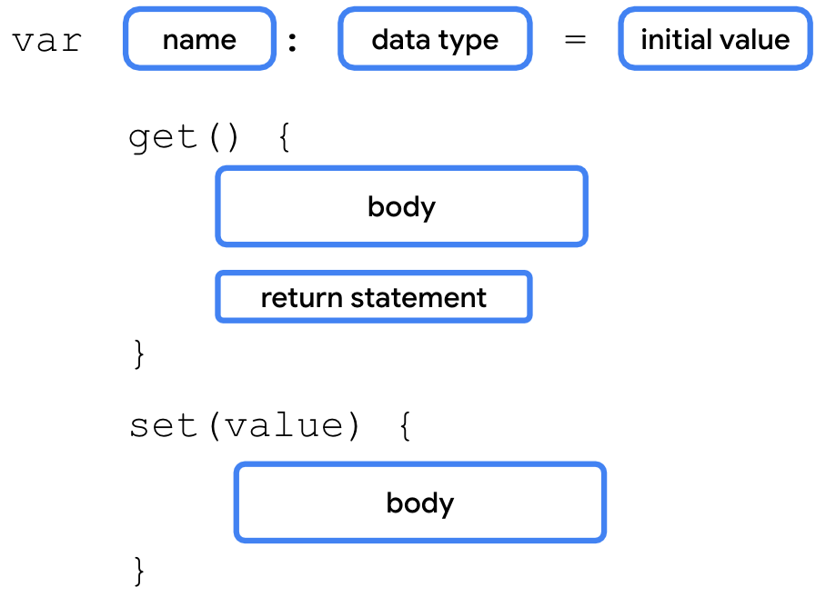

プロパティにゲッター関数とセッター関数を定義しない場合は、Kotlin コンパイラが内部的に作成します。たとえば、`var` キーワードを使用して `speakerVolume` プロパティを定義し、`2` という値を代入すると、コンパイラは次のコード スニペットのようにゲッター関数とセッター関数を自動生成します。

```kotlin
var speakerVolume = 2
    get() = field  
    set(value) {
        field = value    
    }
```

これらの行は、コンパイラがバックグラウンドで追加するものであり、コードには現れません。

不変プロパティの完全な構文は、次の 2 つの点が異なります。

- `val` キーワードで始まります。
- `val` 型の変数は読み取り専用であるため、`set()` 関数がありません。

Kotlin プロパティは、メモリに値を保持するためにバッキング フィールドを使用します。バッキング フィールドは、基本的には、プロパティで内部的に定義されているクラス変数です。バッキング フィールドのスコープはプロパティです。つまり、`get()` プロパティ関数や `set()` プロパティ関数からのみアクセスできます。

`get()` 関数内でのプロパティ値の読み取りと、`set()` 関数内での値の更新には、プロパティのバッキング フィールドを使用する必要があります。これは Kotlin コンパイラにより自動生成され、`field` 識別子で参照されます。

たとえば、`set()` 関数内でプロパティの値を更新する場合は、次のコード スニペットのように、`value` パラメータとして参照される `set()` 関数のパラメータを使用し、それを `field` 変数に代入します。

```kotlin
var speakerVolume = 2
    set(value) {
        field = value    
    }
```

> **警告**: プロパティ名を使用して値の取得または設定を行わないでください。たとえば、`set()` 関数で、`value` パラメータを `speakerVolume` プロパティ自身に代入しようとすると、Kotlin ランタイムが `speakerVolume` プロパティの値を更新しようとしてセッター関数の呼び出しが繰り返し行われるため、無限ループに陥ります。

たとえば、`speakerVolume` プロパティに割り当てる値を 0 から 100 の範囲にするには、次のコード スニペットに示すようなセッター関数を実装します。

```kotlin
var speakerVolume = 2
    set(value) {
        if (value in 0..100) {
            field = value
        }
    }
```

`set()` 関数は、`in` キーワードと値の範囲を使用して、`Int` 値が 0 から 100 の範囲内にあるかどうかをチェックします。値が範囲内の場合、`field` の値が更新されます。それ以外の場合、プロパティの値は変更されません。

このプロパティは、このレッスンの「クラス間の関係を実装する」セクションでクラスに追加しますので、ここでセッター関数をコードに追加する必要はありません。

### 6. コンストラクタを定義する

コンストラクタの主な目的は、クラスのオブジェクトを作成する方法を定めることです。別の言い方をすると、コンストラクタがオブジェクトを初期化することで、そのオブジェクトが使用可能になるということです｡この操作は、オブジェクトをインスタンス化するときに行いました｡クラスのオブジェクトがインスタンス化されるときに､コンストラクタ内のコードが実行されます。コンストラクタは、パラメータの有無にかかわらず定義できます。

#### デフォルト コンストラクタ

デフォルト コンストラクタは、パラメータのないコンストラクタです｡デフォルト コンストラクタは、次のコード スニペットに示すように定義します。

```kotlin
class SmartDevice constructor() {
    ...
}
```

Kotlin では簡潔な表現を目指しており、コンストラクタにアノテーションや可視性修飾子がない場合は、後で学習するように `constructor` キーワードを省くことができます。次のコード スニペットに示すように、コンストラクタにパラメータがない場合は、括弧も省くことができます。

```kotlin
class SmartDevice {
    ...
}
```

Kotlin コンパイラはデフォルト コンストラクタを自動生成します。自動生成されるデフォルト コンストラクタは、コンパイラがバックグラウンドで追加するため、コードには現れません。

#### パラメータ付きコンストラクタを定義する

`SmartDevice` クラス内では、`name` プロパティと `category` プロパティを変更できません。そのため、`SmartDevice` クラスのすべてのインスタンスで、必ず `name` プロパティと `category` プロパティを初期化する必要があります。現在の実装では、`name` プロパティと `category` プロパティの値がハードコードされています。これは、すべてのスマート デバイスが `"Android` `TV"` という文字列の名前を持ち、`"Entertainment"` という文字列のカテゴリに分類されることを意味します。

不変性を維持したまま、値のハードコードを避けるために、パラメータ付きコンストラクタを使用して初期化します。

- `SmartDevice` クラスで、デフォルト値を指定せずに `name` プロパティと `category` プロパティをコンストラクタに移動します。

```kotlin
class SmartDevice(val name: String, val category: String) {

    var deviceStatus = "online"

    fun turnOn() {
        println("Smart device is turned on.")
    }

    fun turnOff() {
        println("Smart device is turned off.")
    }
}
```

これで、プロパティを設定するためのパラメータをコンストラクタに渡せるようになったので、このクラスのオブジェクトをインスタンス化する方法も変わります。オブジェクトをインスタンス化するための完全な構文を次の図に示します。

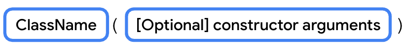

> **注:** クラスにデフォルト コンストラクタがない場合に、引数なしでオブジェクトをインスタンス化しようとすると、コンパイラがエラーを報告します。

コードで表すと次のようになります。

```kotlin
SmartDevice("Android TV", "Entertainment")
```

このコンストラクタの引数はどちらも文字列です。どの値がどのパラメータのものなのか判別しにくくなっています。これを解決するには、関数に引数を渡した方法と同様に、次のコード スニペットに示すように名前付き引数を備えたコンストラクタを作成します。

```kotlin
SmartDevice(name = "Android TV", category = "Entertainment")
```

Kotlin のコンストラクタには、主に 2 つのタイプがあります。

- **プライマリ コンストラクタ。**クラスには、プライマリ コンストラクタを 1 つだけ定義でき、これはクラスヘッダーの中で定義します。プライマリ コンストラクタは、デフォルト コンストラクタかパラメータ付きコンストラクタのいずれかです。プライマリ コンストラクタに本体はありません。つまり、コードがありません。
- **セカンダリ コンストラクタ。**クラスには、複数のセカンダリ コンストラクタを定義できます。セカンダリ コンストラクタは、パラメータの有無にかかわらず定義できます。セカンダリ コンストラクタは、クラスを初期化することができ、本体を持たせてそこに初期化ロジックを入れることができます。クラスにプライマリ コンストラクタがある場合、各セカンダリ コンストラクタでプライマリ コンストラクタを初期化する必要があります。

プライマリ コンストラクタを使用すると、クラスヘッダー内でプロパティを初期化できます。コンストラクタに渡される引数は、プロパティに代入されます。プライマリ コンストラクタを定義する構文は、クラス名の後に `constructor` キーワード、括弧のペアと続きます。括弧内にはプライマリ コンストラクタのパラメータが入ります。パラメータが複数ある場合は、パラメータ定義をカンマで区切ります。プライマリ コンストラクタを定義する完全な構文を次の図に示します。

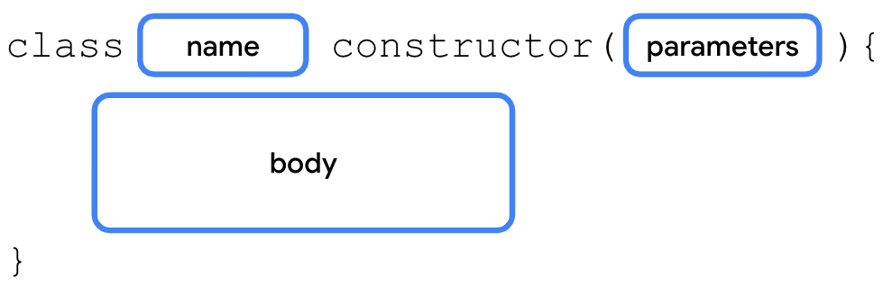

セカンダリ コンストラクタは、クラスの本体の中にあり、その構文は以下の 3 つの部分で構成されます。

- **セカンダリ コンストラクタの宣言。**セカンダリ コンストラクタの定義は、`constructor` キーワードで始まり、その後に括弧のペアが続きます。セカンダリ コンストラクタに必要なパラメータがあれば、それを括弧内に入れます。
- **プライマリ コンストラクタの初期化。**初期化は、コロンで始まり、その後に `this` キーワード、括弧のペアと続きます。プライマリ コンストラクタに必要なパラメータがある場合は、それを括弧内に入れます。
- **セカンダリ コンストラクタの本体。**セカンダリ コンストラクタの本体は、プライマリ コンストラクタの初期化の後ろに、中括弧で囲んで記述します。

この構文を図にすると次のようになります。

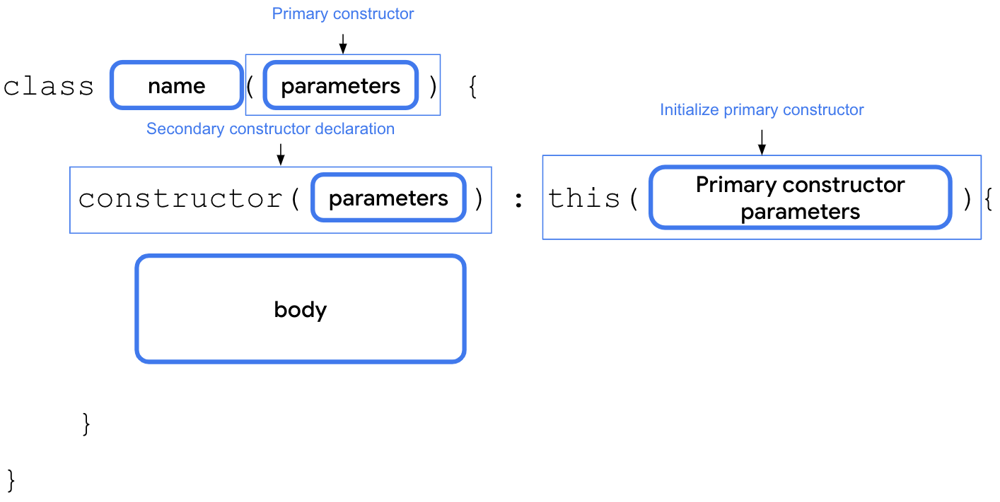

例として、スマート デバイス プロバイダが開発した API を統合する場合を考えます。この API は、初期デバイス ステータスを示す `Int` タイプのステータス コードを返します。また、この API は、デバイスがオフラインの場合は `0` の値を返し、オンラインの場合は `1` の値を返します。それ以外の整数値の場合、ステータスは不明とみなされます。次のコード スニペットに示すように、`SmartDevice` クラスにセカンダリ コンストラクタを作成すると、この `statusCode` パラメータを文字列表現に変換できます。

```kotlin
class SmartDevice(val name: String, val category: String) {
    var deviceStatus = "online"

    constructor(name: String, category: String, statusCode: Int) : this(name, category) {
        deviceStatus = when (statusCode) {
            0 -> "offline"
            1 -> "online"
            else -> "unknown"
        }
    }
    ...
}
```

### 7. クラス間で関係を作る

継承を使用すると、別のクラスの特性と動作に基づいてクラスを作成できます。これは、再利用可能なコードを記述し、クラス間で関係を作るための有効で強力なメカニズムです。

たとえば、スマートテレビ、スマートライト、スマート スイッチなど、多くのスマート デバイスが販売されています。プログラミングでスマート デバイスを表すとき、名前、カテゴリ、ステータスなどの共通の特性を各デバイスが共有します。また、オンとオフを切り替えられるといった共通の動作もあります。

ただし、スマート デバイスによってオンとオフの切り替え方は異なります。たとえば、テレビの電源をオンにするには、ディスプレイをオンにしてから、最後に設定されていた音量とチャンネルを設定し直す必要があります。一方、ライトをオンにする場合に必要なのは、明るさの増減だけです。

また、各スマート デバイスには、その他にも実行できる機能やアクションがあります。たとえば、テレビの場合は、音量の調節やチャンネルの変更ができます。ライトの場合は、明るさや色を調整できます。

つまり、すべてのスマート デバイスが異なる機能を持っている一方で、共通の特性もあるということです。こういった共通の特性は、各スマート デバイス クラスにコピーすることもできますが、継承してコードを再利用可能にすることもできます。

継承するには、`SmartDevice` の親クラスを作成し、上記の共通のプロパティと動作を定義する必要があります。さらに、親クラスのプロパティを継承する `SmartTvDevice` クラスや `SmartLightDevice` クラスなどの子クラスを作成します。

これをプログラミング用語では、`SmartTvDevice` クラスと `SmartLightDevice` クラスが `SmartDevice` 親クラスを「拡張」していると表現します。親クラスはスーパークラスとも呼ばれ、子クラスはサブクラスとも呼ばれます。これらの関係を次の図に示します。

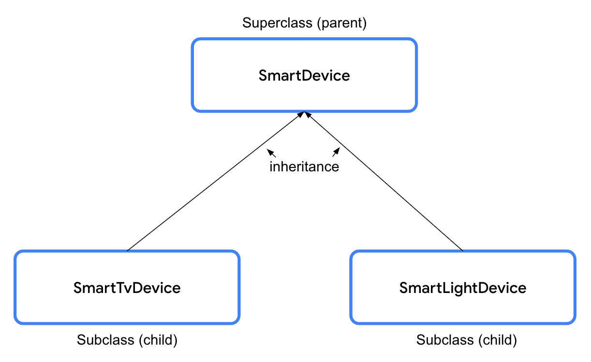

ただし Kotlin では、すべてのクラスがデフォルトで final です。これはつまり、そのようなクラスは拡張できないということなので、クラス間の関係を定義する必要があります。

`SmartDevice` スーパークラスとそのサブクラスの関係を定義しましょう。

1. `SmartDevice` スーパークラスで、`class` キーワードの前に `open` キーワードを追加して拡張可能にします。

```kotlin
open class SmartDevice(val name: String, val category: String) {
    ...
}
```

`open` キーワードは、このクラスが拡張可能であることをコンパイラに知らせるもので、これによって他のクラスがこのクラスを拡張できるようになります。

サブクラスを作成する構文は、すでに行ったように、クラスヘッダーの作成から始まります。コンストラクタの右括弧の後に、スペース、コロン、もう一つのスペース、スーパークラス名、括弧のペアと続けます。括弧内には、必要に応じて、スーパークラスのコンストラクタで必要なパラメータを入れます。この構文を図にすると次のようになります。

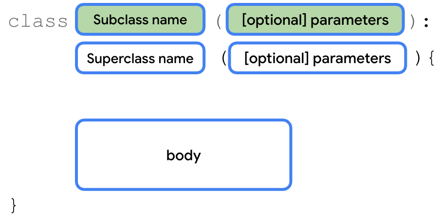

2. `SmartDevice` スーパークラスを拡張する `SmartTvDevice` サブクラスを作成します。

```kotlin
class SmartTvDevice(deviceName: String, deviceCategory: String) :
    SmartDevice(name = deviceName, category = deviceCategory) {
}
```

`SmartTvDevice` の `constructor` 定義では、プロパティが可変か不変かを指定しません。つまり、`deviceName` パラメータと `deviceCategory` パラメータは、クラス プロパティではなく、単なる `constructor` パラメータです。このクラスでは使用できず、スーパークラスのコンストラクタに渡すだけです。

3. `SmartTvDevice` サブクラスの本体で、ゲッター関数とセッター関数について学習したときに作成した `speakerVolume` プロパティを追加します。

```kotlin
class SmartTvDevice(deviceName: String, deviceCategory: String) :
    SmartDevice(name = deviceName, category = deviceCategory) {

    var speakerVolume = 2
        set(value) {
            if (value in 0..100) {
                field = value
            }
        }
}
```

4. `0..200` の範囲を設定するセッター関数を備え、`1` の値が代入される `channelNumber` プロパティを定義します。

```kotlin
class SmartTvDevice(deviceName: String, deviceCategory: String) :
    SmartDevice(name = deviceName, category = deviceCategory) {

    var speakerVolume = 2
        set(value) {
            if (value in 0..100) {
                field = value
            }
        }

    var channelNumber = 1
        set(value) {
            if (value in 0..200) {
                field = value
            }
        }
}
```

5. ボリュームを上げて、`"Speaker` `volume` `increased` `to` `$speakerVolume."` という文字列を出力する `increaseSpeakerVolume()` メソッドを定義します。

```kotlin
class SmartTvDevice(deviceName: String, deviceCategory: String) :
    SmartDevice(name = deviceName, category = deviceCategory) {

    var speakerVolume = 2
        set(value) {
            if (value in 0..100) {
                field = value
            }
        }

     var channelNumber = 1
        set(value) {
            if (value in 0..200) {
                field = value
            }
        }

    fun increaseSpeakerVolume() {
        speakerVolume++
        println("Speaker volume increased to $speakerVolume.")
    } 
}
```

6. チャンネル番号を増やし、`"Channel` `number` `increased` `to` `$channelNumber."` という文字列を出力する `nextChannel()` メソッドを追加します。

```kotlin
class SmartTvDevice(deviceName: String, deviceCategory: String) :
    SmartDevice(name = deviceName, category = deviceCategory) {

    var speakerVolume = 2
        set(value) {
            if (value in 0..100) {
                field = value
            }
        }

    var channelNumber = 1
        set(value) {
            if (value in 0..200) {
                field = value
            }
        }
    
    fun increaseSpeakerVolume() {
        speakerVolume++
        println("Speaker volume increased to $speakerVolume.")
    }

    fun nextChannel() {
        channelNumber++
        println("Channel number increased to $channelNumber.")
    }
}
```

7. `SmartTvDevice` サブクラスの後に、`SmartDevice` スーパークラスを拡張する `SmartLightDevice` サブクラスを定義します。

```kotlin
class SmartLightDevice(deviceName: String, deviceCategory: String) :
    SmartDevice(name = deviceName, category = deviceCategory) {
}
```

8. `SmartLightDevice` サブクラスの本体で、`0..100` の範囲を指定するセッター関数を備え、`0` の値が代入される `brightnessLevel` プロパティを定義します。

```kotlin
class SmartLightDevice(deviceName: String, deviceCategory: String) :
    SmartDevice(name = deviceName, category = deviceCategory) {

    var brightnessLevel = 0
        set(value) {
            if (value in 0..100) {
                field = value
            }
        }
}
```

9. ライトの明るさを上げ、`"Brightness` `increased` `to` `$brightnessLevel."` という文字列を出力する `increaseBrightness()` メソッドを定義します。

```kotlin
class SmartLightDevice(deviceName: String, deviceCategory: String) :
    SmartDevice(name = deviceName, category = deviceCategory) {

    var brightnessLevel = 0
        set(value) {
            if (value in 0..100) {
                field = value
            }
        }

    fun increaseBrightness() {
        brightnessLevel++
        println("Brightness increased to $brightnessLevel.")
    }
}
```

#### クラス間の関係

継承を使用する場合、2 つのクラス間の関係は「IS-A 関係」と呼ばれます。あるクラスのオブジェクトは、そのクラスを継承しているクラスのインスタンスでもあります。「HAS-A 関係」の場合、あるクラスのオブジェクトが別のクラスのインスタンスとなることなく、そのクラスのインスタンスを所有できます。次の図は、この関係をおおまかに示したものです。

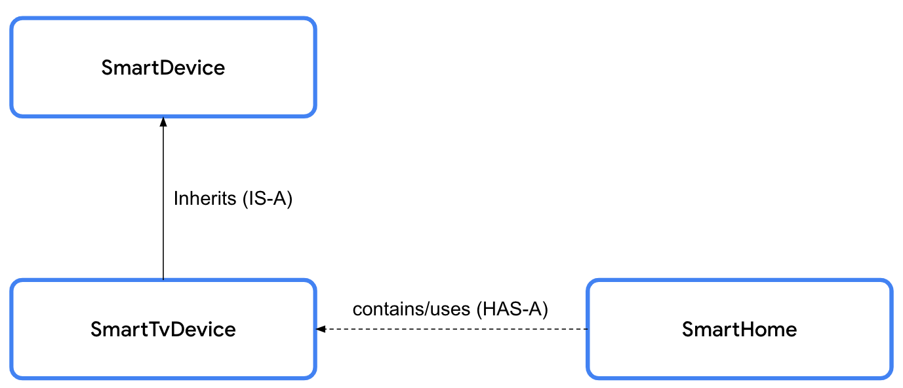

##### IS-A **関係**

`SmartDevice` スーパークラスと `SmartTvDevice` サブクラスの間に IS-A 関係があるとは、`SmartDevice` スーパークラスで可能なすべての操作を、`SmartTvDevice` サブクラスで行えるということです。この関係は一方向の関係です。つまり、すべてのスマートテレビがスマート デバイスであると言えますが、すべてのスマート デバイスがスマートテレビであるとは言えません。IS-A 関係をコードで表すと次のコード スニペットのようになります。

```kotlin
// Smart TV IS-A smart device.
class SmartTvDevice : SmartDevice() {
}
```

コードの再利用を可能にするためだけに継承を使用しないでください。その前に、2 つのクラスが互いに関連しているかどうかを確認してください。関係がある場合は、IS-A 関係の条件を満たしているかどうかを確認してください。そのサブクラスはスーパークラスだと言えるのかどうかを自問してください。たとえば、「Android はオペレーティング システムである」と言うことができます。

##### HAS-A **関係**

HAS-A 関係は、2 つのクラスの関係を特定するもう一つの方法です。たとえば、通常、スマートテレビは家で使用します。このとき、スマートテレビと家の間には、なんらかの関係があります。家にスマート デバイスがある、つまり家がスマート デバイスを「持っている」ということです。2 つのクラス間の *HAS-A* 関係は、コンポジションとも呼ばれます。

ここまでにスマート デバイスをいくつか作成しています。次は、スマート デバイスが入っている `SmartHome` クラスを作成します。`SmartHome` クラスを使ってスマート デバイスを操作できます。

HAS-A 関係を使用して `SmartHome` クラスを定義しましょう。

1. `SmartLightDevice` クラスと `main()` 関数の間で、`SmartHome` クラスを定義します。

```kotlin
class SmartLightDevice(deviceName: String, deviceCategory: String) :
    SmartDevice(name = deviceName, category = deviceCategory) {

    ...

}

class SmartHome {
}

fun main() { 
    ...
}
```

2. `SmartHome` クラスのコンストラクタで、`val` キーワードを使用して `SmartTvDevice` 型の `smartTvDevice` プロパティを作成します。

```kotlin
// The SmartHome class HAS-A smart TV device.
class SmartHome(val smartTvDevice: SmartTvDevice) {

}
```

3. `SmartHome` クラスの本体で、`smartTvDevice` プロパティの `turnOn()` メソッドを呼び出す `turnOnTv()` メソッドを定義します。

```kotlin
class SmartHome(val smartTvDevice: SmartTvDevice) {

    fun turnOnTv() {
        smartTvDevice.turnOn()
    }
}
```

4. `turnOnTv()` メソッドの後の行で、`smartTvDevice` プロパティの `turnOff()` メソッドを呼び出す `turnOffTv()` メソッドを定義します。

```kotlin
class SmartHome(val smartTvDevice: SmartTvDevice) {

    fun turnOnTv() {
        smartTvDevice.turnOn()
    }

    fun turnOffTv() {
        smartTvDevice.turnOff()
    }

}
```

5. `turnOffTv()` メソッドの後の行で、`smartTvDevice` プロパティの `increaseSpeakerVolume()` メソッドを呼び出す `increaseTvVolume()` メソッドを定義し、`smartTvDevice` プロパティの `nextChannel()` メソッドを呼び出す `changeTvChannelToNext()` メソッドを定義します。

```kotlin
class SmartHome(val smartTvDevice: SmartTvDevice) {

    fun turnOnTv() {
        smartTvDevice.turnOn()
    }

    fun turnOffTv() {
        smartTvDevice.turnOff()
    }

    fun increaseTvVolume() {
        smartTvDevice.increaseSpeakerVolume()
    }

    fun changeTvChannelToNext() {
        smartTvDevice.nextChannel()
    }
}
```

6. `SmartHome` クラスのコンストラクタで、`smartTvDevice` プロパティ パラメータを独立した行に移動し、その後にカンマを追加します。

```kotlin
class SmartHome(
    val smartTvDevice: SmartTvDevice,
) {

    ...

}
```

7. `smartTvDevice` プロパティの後ろの行で、`val` キーワードを使用して `SmartLightDevice` タイプの `smartLightDevice` プロパティを定義します。

```kotlin
// The SmartHome class HAS-A smart TV device and smart light.
class SmartHome(
    val smartTvDevice: SmartTvDevice,
    val smartLightDevice: SmartLightDevice
) {

    ...

}
```

8. `SmartHome` の本体で、`smartLightDevice` オブジェクトの `turnOn()` メソッドを呼び出す `turnOnLight()` メソッドと、`smartLightDevice` オブジェクトの `turnOff()` メソッドを呼び出す `turnOffLight()` メソッドを定義します。

```kotlin
class SmartHome(
    val smartTvDevice: SmartTvDevice,
    val smartLightDevice: SmartLightDevice
) {

    ...

    fun changeTvChannelToNext() {
        smartTvDevice.nextChannel()
    }

    fun turnOnLight() {
        smartLightDevice.turnOn()
    }

    fun turnOffLight() {
        smartLightDevice.turnOff()
    }
}
```

9. `turnOffLight()` メソッドの後ろの行で、`smartLightDevice` プロパティの `increaseBrightness()` メソッドを呼び出す `increaseLightBrightness()` メソッドを定義します。

```kotlin
class SmartHome(
    val smartTvDevice: SmartTvDevice,
    val smartLightDevice: SmartLightDevice
) {

    ...

    fun changeTvChannelToNext() {
        smartTvDevice.nextChannel()
    }

    fun turnOnLight() {
        smartLightDevice.turnOn()
    }

    fun turnOffLight() {
        smartLightDevice.turnOff()
    }

    fun increaseLightBrightness() {
        smartLightDevice.increaseBrightness()
    }
}
```

10. `increaseLightBrightness()` メソッドの後ろの行で、`turnOffTv()` メソッドと `turnOffLight()` メソッドを呼び出す `turnOffAllDevices()` メソッドを定義します。

```kotlin
class SmartHome(
    val smartTvDevice: SmartTvDevice,
    val smartLightDevice: SmartLightDevice
) {

    ...

    fun turnOffAllDevices() {
        turnOffTv()
        turnOffLight()
    }
}
```

#### スーパークラスのメソッドをサブクラスでオーバーライドする

前述のように、オンとオフを切り替える機能はすべてのスマート デバイスでサポートされていますが、その中の実行方法は異なります。このデバイス固有の動作を指定するには、スーパークラスで定義されている `turnOn()` メソッドと `turnOff()` メソッドをオーバーライドする必要があります。オーバーライドするとは、操作を横取りすること、典型的には手動で制御することを意味します。メソッドをオーバーライドすると、サブクラスのメソッドがスーパークラスで定義されたメソッドの実行をさえぎって、独自の実行を行います。

`SmartDevice` クラスの `turnOn()` メソッドと `turnOff()` メソッドをオーバーライドしましょう。

1. `SmartDevice` スーパークラスの本体で、各メソッドの `fun` キーワードの前に `open` キーワードを追加します。

```kotlin
open class SmartDevice(val name: String, val category: String) {

    var deviceStatus = "online"

    open fun turnOn() {
        // function body
    }

    open fun turnOff() {
        // function body
    }
}
```

2. `SmartLightDevice` クラスの本体で、本体が空の `turnOn()` メソッドを定義します。

```kotlin
class SmartLightDevice(deviceName: String, deviceCategory: String) :
    SmartDevice(name = deviceName, category = deviceCategory) {

    var brightnessLevel = 0
        set(value) {
            if (value in 0..100) {
                field = value
            }
        }

    fun increaseBrightness() {
        brightnessLevel++
        println("Brightness increased to $brightnessLevel.")
    }

    fun turnOn() {
    }
}
```

3. `turnOn()` メソッドの本体で、`deviceStatus` プロパティを文字列「`on`」に設定し、`2` の値に `brightnessLevel` プロパティを設定し、`println()` 文を追加して、`"$name` `turned` `on.` `The` `brightness` `level` `is` `$brightnessLevel."` という文字列を渡します。

```kotlin
    fun turnOn() {
        deviceStatus = "on"
        brightnessLevel = 2
        println("$name turned on. The brightness level is $brightnessLevel.")
    }
```

4. `SmartLightDevice` クラスの本体で、本体が空の `turnOff()` メソッドを定義します。

```kotlin
class SmartLightDevice(deviceName: String, deviceCategory: String) :
    SmartDevice(name = deviceName, category = deviceCategory) {

    var brightnessLevel = 0
        set(value) {
            if (value in 0..100) {
                field = value
            }
        }

    fun increaseBrightness() {
        brightnessLevel++
        println("Brightness increased to $brightnessLevel.")
    }

    fun turnOn() {
        deviceStatus = "on"
        brightnessLevel = 2
        println("$name turned on. The brightness level is $brightnessLevel.")
    }

    fun turnOff() {
    }
}
```

5. `turnOff()` メソッドの本体で、`deviceStatus` プロパティを文字列「`off`」に設定し、`0` の値に `brightnessLevel` プロパティを設定し、`println()` 文を追加して、`"Smart` `Light` `turned` `off"` という文字列を渡します。

```kotlin
class SmartLightDevice(deviceName: String, deviceCategory: String) :
    SmartDevice(name = deviceName, category = deviceCategory) {

    var brightnessLevel = 0
        set(value) {
            if (value in 0..100) {
                field = value
            }
        }

    fun increaseBrightness() {
        brightnessLevel++
        println("Brightness increased to $brightnessLevel.")
    }

    fun turnOn() {
        deviceStatus = "on"
        brightnessLevel = 2
        println("$name turned on. The brightness level is $brightnessLevel.")
    }

    fun turnOff() {
        deviceStatus = "off"
        brightnessLevel = 0
        println("Smart Light turned off")
    }
}
```

6. `SmartLightDevice` サブクラスで、`turnOn()` メソッドと `turnOff()` メソッドの `fun` キーワードの前に `override` キーワードを追加します。

```kotlin
class SmartLightDevice(deviceName: String, deviceCategory: String) :
    SmartDevice(name = deviceName, category = deviceCategory) {

    var brightnessLevel = 0
        set(value) {
            if (value in 0..100) {
                field = value
            }
        }

    fun increaseBrightness() {
        brightnessLevel++
        println("Brightness increased to $brightnessLevel.")
    }

    override fun turnOn() {
        deviceStatus = "on"
        brightnessLevel = 2
        println("$name turned on. The brightness level is $brightnessLevel.")
    }

    override fun turnOff() {
        deviceStatus = "off"
        brightnessLevel = 0
        println("Smart Light turned off")
    }
}
```

`override` キーワードは、サブクラスで定義されたメソッドに入っているコードを実行するように Kotlin ランタイムに指示するものです。

7. `SmartTvDevice` クラスの本体で、本体が空の `turnOn()` メソッドを定義します。

```kotlin
class SmartTvDevice(deviceName: String, deviceCategory: String) : SmartDevice(name = deviceName, category = deviceCategory) {

    var speakerVolume = 2
        set(value) {
            if (value in 0..100) {
                field = value
            }
        }
        
    var channelNumber = 1
        set(value) {
            if (value in 0..200) {
                field = value
            }
        }
        
    fun increaseSpeakerVolume() {
        speakerVolume++
        println("Speaker volume increased to $speakerVolume.")
    }
    
    fun nextChannel() {
        channelNumber++
        println("Channel number increased to $channelNumber.")
    }

    fun turnOn() {
    }
}
```

8. `turnOn()` メソッドの本体で、`deviceStatus` プロパティを文字列「`on`」に設定し、`println()` 文を追加して、`"$name is turned on. Speaker volume is set to $speakerVolume and channel number is " + "set to $channelNumber."` という文字列を渡します。

```kotlin
class SmartTvDevice(deviceName: String, deviceCategory: String) : SmartDevice(name = deviceName, category = deviceCategory) {

    ...

    fun turnOn() {
        deviceStatus = "on"
        println(
            "$name is turned on. Speaker volume is set to $speakerVolume and channel number is " +
                "set to $channelNumber."
        )
    }
}
```

9. `SmartTvDevice` クラスの本体で、`turnOn()` メソッドの後に、空の本体を持つ `turnOff()` メソッドを定義します。

```kotlin
class SmartTvDevice(deviceName: String, deviceCategory: String) : SmartDevice(name = deviceName, category = deviceCategory) {

    ...

    fun turnOn() {
        ...
    }

    fun turnOff() {
    }
}
```

10. `turnOff()` メソッドの本体で、`deviceStatus` プロパティを文字列「`off`」に設定し、`println()` 文を追加して、`"$name` `turned` `off"` という文字列を渡します。

```kotlin
class SmartTvDevice(deviceName: String, deviceCategory: String) : SmartDevice(name = deviceName, category = deviceCategory) {

    ...

    fun turnOn() {
        ...
    }

    fun turnOff() {
        deviceStatus = "off"
        println("$name turned off")
    }
}
```

11. `SmartTvDevice` クラスで、`turnOn()` メソッドと `turnOff()` メソッドの `fun` キーワードの前に `override` キーワードを追加します。

```kotlin
class SmartTvDevice(deviceName: String, deviceCategory: String) :
    SmartDevice(name = deviceName, category = deviceCategory) {

    var speakerVolume = 2
        set(value) {
            if (value in 0..100) {
                field = value
            }
        }

    var channelNumber = 1
        set(value) {
            if (value in 0..200) {
                field = value
            }
        }

    fun increaseSpeakerVolume() {
        speakerVolume++
        println("Speaker volume increased to $speakerVolume.")
    }

    fun nextChannel() {
        channelNumber++
        println("Channel number increased to $channelNumber.")
    }

    override fun turnOn() {
        deviceStatus = "on"
        println(
            "$name is turned on. Speaker volume is set to $speakerVolume and channel number is " +
                "set to $channelNumber."
        )
    }

    override fun turnOff() {
        deviceStatus = "off"
        println("$name turned off")
    }
}
```

12. `main()` 関数で、`var` キーワードを使用して `SmartDevice` 型の `smartDevice` 変数を定義します。そこで、`"Android` `TV"` と `"Entertainment"` という引数を渡して `SmartTvDevice` オブジェクトをインスタンス化します。

```kotlin
fun main() {
    var smartDevice: SmartDevice = SmartTvDevice("Android TV", "Entertainment")
}
```

13. `smartDevice` 変数の後ろの行で、`smartDevice` オブジェクトの `turnOn()` メソッドを呼び出します。

```kotlin
fun main() {
    var smartDevice: SmartDevice = SmartTvDevice("Android TV", "Entertainment")
    smartDevice.turnOn()
}
```

14. コードを実行します。

次のような出力が表示されます。

```
Android TV is turned on. Speaker volume is set to 2 and channel number is set to 1.
```

15. `turnOn()` メソッドの呼び出しの後ろの行で、`"Google` `Light"` と `"Utility"` という引数を渡して `SmartLightDevice` クラスをインスタンス化し、`smartDevice` 変数に再代入してから、`smartDevice` オブジェクト参照の `turnOn()` メソッドを呼び出します。

```kotlin
fun main() {
    var smartDevice: SmartDevice = SmartTvDevice("Android TV", "Entertainment")
    smartDevice.turnOn()
    
    smartDevice = SmartLightDevice("Google Light", "Utility")
    smartDevice.turnOn()
}
```

16. コードを実行します。

次のような出力が表示されます。

```
Android TV is turned on. Speaker volume is set to 2 and channel number is set to 1.
Google Light turned on. The brightness level is 2.
```

これはポリモーフィズムの例になっています。このコードでは、`SmartDevice` 型の変数の `turnOn()` メソッドを呼び出しますが、変数の実際の値に応じて `turnOn()` メソッドの異なる実装を実行することができます。

##### `super` **キーワード**を使用してサブクラスでスーパークラスのコードを再利用する

`turnOn()` メソッドと `turnOff()` メソッドをよく見ると、`SmartTvDevice` サブクラスと `SmartLightDevice` サブクラスでメソッドが呼び出されるときの `deviceStatus` 変数を更新する仕組みが似ていることに気が付くでしょう。つまり、コードが重複しているのです。`SmartDevice` クラスでステータスを更新するときのコードは再利用できます。

サブクラスからスーパークラスのオーバーライドされたメソッドを呼び出すには、`super` キーワードを使用する必要があります。スーパークラスのメソッドを呼び出す方法は、クラスの外部からメソッドを呼び出す場合と同様です。オブジェクトとメソッドの間で `.` 演算子を使用する代わりに、`super` キーワードを使用する必要があります。これは、サブクラスではなくスーパークラスのメソッドを呼び出すように Kotlin コンパイラに指示するものです。

スーパークラスのメソッドを呼び出す構文は、`super` キーワードの後に `.` 演算子、関数名、括弧のペアと続きます。必要に応じて、括弧内に引数を入れます。この構文を図にすると次のようになります。


`SmartDevice` スーパークラスのコードを再利用しましょう。

1. `turnOn()` メソッドと `turnOff()` メソッドから `println()` 文を削除し、`SmartTvDevice` サブクラスと `SmartLightDevice` サブクラスにある重複するコードを `SmartDevice` スーパークラスに移動します。

```kotlin
open class SmartDevice(val name: String, val category: String) {

    var deviceStatus = "online"

    open fun turnOn() {
        deviceStatus = "on"
    }

    open fun turnOff() {
        deviceStatus = "off"
    }
}
```

2. `super` キーワードを使用して、`SmartTvDevice` サブクラスと `SmartLightDevice` サブクラス内で `SmartDevice` クラスのメソッドを呼び出します。

```kotlin
class SmartTvDevice(deviceName: String, deviceCategory: String) :
    SmartDevice(name = deviceName, category = deviceCategory) {

    var speakerVolume = 2
        set(value) {
            if (value in 0..100) {
                field = value
            }
        }

     var channelNumber = 1
        set(value) {
            if (value in 0..200) {
                field = value
            }
        }

    fun increaseSpeakerVolume() {
        speakerVolume++
        println("Speaker volume increased to $speakerVolume.")
    }

    fun nextChannel() {
        channelNumber++
        println("Channel number increased to $channelNumber.")
    }

    override fun turnOn() {
        super.turnOn()
        println(
            "$name is turned on. Speaker volume is set to $speakerVolume and channel number is " +
                "set to $channelNumber."
        )
    }

    override fun turnOff() {
        super.turnOff()
        println("$name turned off")
    }
}
```

```kotlin
class SmartLightDevice(deviceName: String, deviceCategory: String) :
    SmartDevice(name = deviceName, category = deviceCategory) {

    var brightnessLevel = 0
        set(value) {
            if (value in 0..100) {
                field = value
            }
        }

    fun increaseBrightness() {
        brightnessLevel++
        println("Brightness increased to $brightnessLevel.")
    }

    override fun turnOn() {
        super.turnOn()
        brightnessLevel = 2
        println("$name turned on. The brightness level is $brightnessLevel.")
    }

    override fun turnOff() {
        super.turnOff()
        brightnessLevel = 0
        println("Smart Light turned off")
    }
}
```

#### サブクラスでスーパークラスのプロパティをオーバーライドする

メソッドと同様に、同じ手順でプロパティもオーバーライドできます。

`deviceType` プロパティをオーバーライドしましょう。

1. `SmartDevice` スーパークラスの `deviceStatus` プロパティの後ろの行で、`open` キーワードと `val` キーワードを使用して `deviceType` プロパティを定義し、`"unknown"` という文字列を設定します。

```kotlin
open class SmartDevice(val name: String, val category: String) {

    var deviceStatus = "online"

    open val deviceType = "unknown"
    ...
}
```

2. `SmartTvDevice` クラスで、`override` キーワードと `val` キーワードを使用して、`deviceType` プロパティを定義し、`"Smart` `TV"` という文字列を設定します。

```kotlin
class SmartTvDevice(deviceName: String, deviceCategory: String) :
    SmartDevice(name = deviceName, category = deviceCategory) {

    override val deviceType = "Smart TV"

    ...
}
```

3. `SmartLightDevice` クラスで、`override` キーワードと `val` キーワードを使用して、`deviceType` プロパティを定義し、`"Smart` `Light"` という文字列を設定します。

```kotlin
class SmartLightDevice(deviceName: String, deviceCategory: String) :
    SmartDevice(name = deviceName, category = deviceCategory) {

    override val deviceType = "Smart Light"

    ...

}
```

### 8. 可視性修飾子

可視性修飾子は、カプセル化を実現するうえで重要な役割を果たします。

- クラスでは、クラスの外部から不正にアクセスできないようにプロパティやメソッドを隠すことができます。
- パッケージでは、パッケージの外部から不正にアクセスできないようにクラスやインターフェースを隠すことができます。

Kotlin には、以下の 4 つの可視性修飾子が用意されています。

- `public`**:** デフォルトの可視性修飾子。宣言をどこからでもアクセスできるようにします。クラス外で使用するプロパティとメソッドは public とマークします。
- `private`**:** 宣言を同じクラスまたは同じソースファイルでアクセスできるようにします。

多くの場合、プロパティやメソッドの中には、クラス内でのみ使用し、他のクラスでは使用する必要のないものがあります。こういったプロパティやメソッドを `private` 可視性修飾子でマークすると、別のクラスが誤ってアクセスすることがなくなります。

- `protected`**:** 宣言をサブクラスでアクセスできるようにします。定義したクラスとそのサブクラスで使用するプロパティとメソッドは、`protected` 可視性修飾子でマークします。
- `internal`**:** 宣言を同じモジュール内でアクセスできるようにします。internal 修飾子は private と似ていますが、internal プロパティと internal メソッドには、同じモジュール内であればクラスの外部からでもアクセスできます。

> **注:** [モジュール](https://developer.android.com/studio/projects#ApplicationModules)とは、ソースファイルとビルド設定のコレクションであり、モジュールによって機能ごとにプロジェクトを分割できます。プロジェクトには 1 つまたは多数のモジュールを含めることができます。各モジュールは個別にビルド、テスト、デバッグできます。
> 
> パッケージは、関連するクラスをグループ化するディレクトリまたはフォルダのようなものです。一方、モジュールは、アプリのソースコード、リソース ファイル、アプリレベルの設定を格納するコンテナとなります。モジュールには複数のパッケージを含めることができます。

クラスを定義すると公開となり、それをインポートするパッケージからアクセスできるようになります。つまり、可視性修飾子を指定しない限り、デフォルトで公開になります。同様に、クラス内でプロパティやメソッドを定義または宣言すると、デフォルトではクラスの外部からクラス オブジェクトを使ってアクセスできます。コードに適切な可視性を定義するために、特に他のクラスがアクセスする必要のないプロパティやメソッドを隠す際に不可欠なものです。

例として、運転手が自動車を操作する仕組みについて考えてみましょう。自動車を構成する部品の詳細や自動車内部の仕組みは、デフォルトで隠されています。自動車は、できるだけ直感的に操作できるように作られています。自動車の操作が航空機のように複雑になることが望ましくないように、他の開発者や将来の自分がクラスのプロパティやメソッドの用途がわからなくなることも望ましいことではありません。

可視性修飾子を使用すると、コードの適切な部分をプロジェクト内の他のクラスから見えるようにして、実装が意図せず使用されないようにできるため、コードが理解しやすくなり、バグが発生しにくくなります。

可視性修飾子は、次の図のように、クラス、メソッド、プロパティを宣言するとき、その宣言の構文の前に置く必要があります。


#### プロパティに可視性修飾子を指定する

プロパティに可視性修飾子を指定する構文は、`private`、`protected`、または `internal` の修飾子で始まり、その後にプロパティを定義する構文が続きます。この構文を図にすると次のようになります。

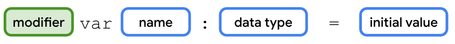

たとえば、次のコード スニペットで、`deviceStatus` プロパティを非公開にする方法を示しています。

```kotlin
open class SmartDevice(val name: String, val category: String) {

    ...

    private var deviceStatus = "online"

    ...
}
```

セッター関数に可視性修飾子を設定することもできます。修飾子は `set` キーワードの前に置きます。この構文を図にすると次のようになります。

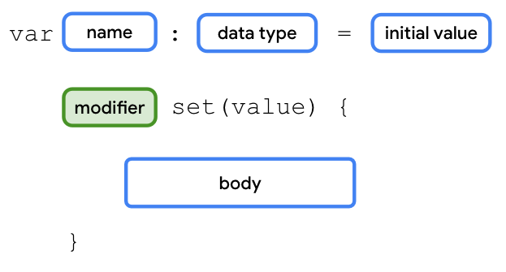

> **注:** ゲッター関数の可視性修飾子がプロパティの可視性修飾子と一致しない場合、コンパイルはエラーとなります。

`SmartDevice` クラスの場合、`deviceStatus` プロパティの値は、クラス オブジェクトを使ってクラスの外部で読み取ることができる必要があります。しかし、値の更新や書き込みができるのは、そのクラスとその子だけにする必要があります。この要件を実現するには、`deviceStatus` プロパティの `set()` 関数に `protected` 修飾子を使用する必要があります。

`deviceStatus` プロパティの `set()` 関数に `protected` 修飾子を使用しましょう。

1. `SmartDevice` スーパークラスの `deviceStatus` プロパティで、`protected` 修飾子を `set()` 関数に追加します。

```kotlin
open class SmartDevice(val name: String, val category: String) {

    ...

    var deviceStatus = "online"
        protected set(value) {
           field = value
       }

    ...
}
```

`set()` 関数ではアクションやチェックを実行していません。単に `value` パラメータを `field` 変数に代入しているだけです。すでに学習したとおり、これはプロパティ セッターのデフォルト実装に似ています。この場合、`set()` 関数の括弧と本体を省略できます。

```kotlin
open class SmartDevice(val name: String, val category: String) {

    ...

    var deviceStatus = "online"
        protected set

    ...
}
```

2. `SmartHome` クラスで、private のセッター関数を使用して `0` の値に設定された `deviceTurnOnCount` プロパティを定義します。

```kotlin
class SmartHome(
    val smartTvDevice: SmartTvDevice,
    val smartLightDevice: SmartLightDevice
) {

    var deviceTurnOnCount = 0
        private set

    ...
}
```

3. `turnOnTv()` メソッドと `turnOnLight()` メソッドに、`deviceTurnOnCount` プロパティとそれに続けて `++` 算術演算子を追加します。さらに、`turnOffTv()` メソッドと `turnOffLight()` メソッドに `deviceTurnOnCount` プロパティとそれに続けて `--` 算術演算子を追加します。

```kotlin
class SmartHome(
    val smartTvDevice: SmartTvDevice,
    val smartLightDevice: SmartLightDevice
) {

    var deviceTurnOnCount = 0
        private set

    fun turnOnTv() {
        deviceTurnOnCount++
        smartTvDevice.turnOn()
    }

    fun turnOffTv() {
        deviceTurnOnCount--
        smartTvDevice.turnOff()
    }
    
    ...

    fun turnOnLight() {
        deviceTurnOnCount++
        smartLightDevice.turnOn()
    }

    fun turnOffLight() {
        deviceTurnOnCount--
        smartLightDevice.turnOff()
    }

    ...

}
```

#### メソッドの可視性修飾子

メソッドに可視性修飾子を指定する構文は、`private`、`protected`、または `internal` の修飾子で始まり、その後にメソッドを定義する構文が続きます。この構文を図にすると次のようになります。

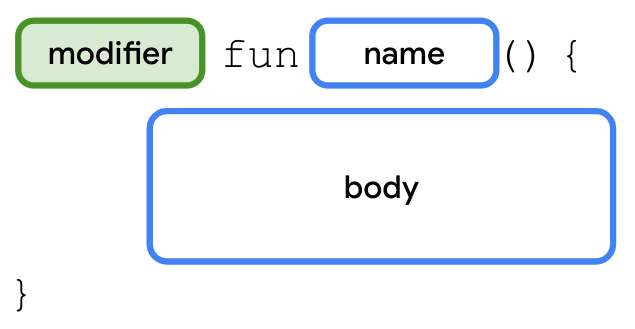

例として、`SmartTvDevice` クラスで、`nextChannel()` メソッドに `protected` 修飾子を指定する方法を、次のコード スニペットに示します。

```kotlin
class SmartTvDevice(deviceName: String, deviceCategory: String) :
    SmartDevice(name = deviceName, category = deviceCategory) {

    ...

    protected fun nextChannel() {
        channelNumber++
        println("Channel number increased to $channelNumber.")
    }      

    ...
}
```

#### コンストラクタの可視性修飾子

コンストラクタの可視性修飾子を指定する構文は、いくつかの点を除き、プライマリ コンストラクタの定義に似ています。

- 修飾子は、クラス名の後、`constructor` キーワードの前に指定します。
- プライマリ コンストラクタに修飾子を指定する必要がある場合は、パラメータがない場合でも `constructor` キーワードと括弧を残す必要があります。

この構文を図にすると次のようになります。

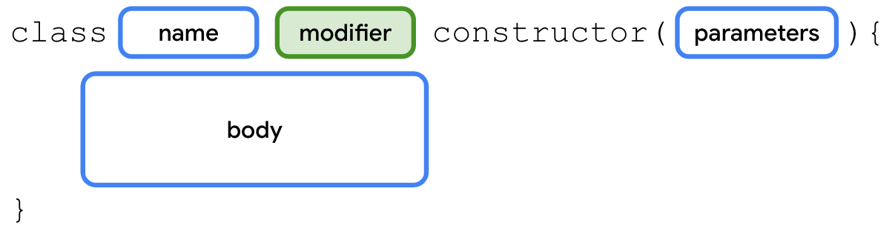

例として、`protected` 修飾子を `SmartDevice` コンストラクタに追加する方法を、次のコード スニペットに示します。

```kotlin
open class SmartDevice protected constructor (val name: String, val category: String) {

    ...

}
```

#### クラスの可視性修飾子

クラスに可視性修飾子を指定する構文は、`private`、`protected`、または `internal` の修飾子で始まり、その後にクラスを定義する構文が続きます。この構文を図にすると次のようになります。

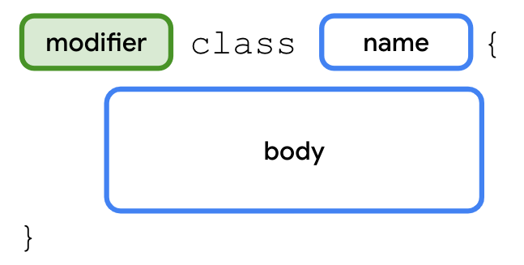

例として、`SmartDevice` クラスに `internal` 修飾子を指定する方法を、次のコード スニペットに示します。

```kotlin
internal open class SmartDevice(val name: String, val category: String) {

    ...

}
```

理想的には、プロパティとメソッドに指定する可視性を厳格なものにするよう努力すべきです。そのために、可能な限り `private` 修飾子を使って宣言してください。private にできない場合は、`protected` 修飾子を使用してください。protected にできない場合は、`internal` 修飾子を使用してください。internal にできない場合は、`public` 修飾子を使用してください。

##### 適切な可視性修飾子を指定する

次の表を参考にすれば、クラスやコンストラクタのプロパティやメソッドにアクセスできる場所に応じて、適切な可視性修飾子を決めることができます。

| **修飾子** | **同じクラスでアクセス可能** | **サブクラスでアクセス可能** | **同じモジュールでアクセス可能** | **モジュール外からアクセス可能** |
|---|---|---|---|---|
| `private` | ✔ | 𝗫 | 𝗫 | 𝗫 |
| `protected` | ✔ | ✔ | 𝗫 | 𝗫 |
| `internal` | ✔ | ✔ | ✔ | 𝗫 |
| `public` | ✔ | ✔ | ✔ | ✔ |

`SmartTvDevice` サブクラスでは、`speakerVolume` プロパティと `channelNumber` プロパティをクラスの外部から制御可能にすべきではありません。これらのプロパティは、`increaseSpeakerVolume()` メソッドと `nextChannel()` メソッドのみで制御すべきです。

同様に、`SmartLightDevice` サブクラスでは、`brightnessLevel` プロパティは `increaseLightBrightness()` メソッドのみで制御すべきです。

`SmartTvDevice` サブクラスと `SmartLightDevice` サブクラスに適切な可視性修飾子を追加しましょう。

1. `SmartTvDevice` クラスで、`private` 可視性修飾子を `speakerVolume` プロパティと `channelNumber` プロパティに追加します。

```kotlin
class SmartTvDevice(deviceName: String, deviceCategory: String) :
    SmartDevice(name = deviceName, category = deviceCategory) {

    private var speakerVolume = 2
        set(value) {
            if (value in 0..100) {
                field = value
            }
        }

    private var channelNumber = 1
        set(value) {
            if (value in 0..200) {
                field = value
            }
        }

    ...
}
```

2. `SmartLightDevice` クラスで、`brightnessLevel` プロパティに `private` 修飾子を追加します。

```kotlin
class SmartLightDevice(deviceName: String, deviceCategory: String) :
    SmartDevice(name = deviceName, category = deviceCategory) {

    ...

    private var brightnessLevel = 0
        set(value) {
            if (value in 0..100) {
                field = value
            }
        }

    ...
}
```

### 9. プロパティ委譲を定義する

前のセクションで説明したように、Kotlin のプロパティはバッキング フィールドを使用して、その値をメモリに保持します。これは、`field` 識別子を使用して参照します。

ここまでのコードを見ると、`SmartTvDevice` クラスと `SmartLightDevice` クラスの `speakerVolume` プロパティ、`channelNumber` プロパティ、`brightnessLevel` プロパティで値が範囲内にあるかどうかをチェックするコードが重複しています。委譲を使用すれば、セッター関数で範囲チェックのコードを再利用できます。値の管理にフィールド、ゲッター関数、セッター関数を使用するのではなく、委譲で値を管理します。

プロパティ委譲を作成するための構文は、変数の宣言で始まり、`by` キーワード、プロパティのゲッター関数とセッター関数を処理する委譲オブジェクトと続きます。この構文を図にすると次のようになります。

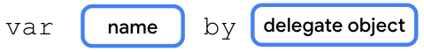

実装を委譲できるクラスを実装する前に、インターフェースについて理解しておく必要があります。インターフェースとは、それを実装するクラスが守る必要のある決まり事のことです。インターフェースでは、アクションを「どう行うか」ではなく「何を行うか」に焦点を当てます。つまり、インターフェースを使えば抽象化することができるということです。

たとえば、家を建てる前には、建築家に、寝室、子供部屋、リビングルーム、キッチン、複数のバスルームが必要だと伝えます。つまり、施主は「何が欲しいか」を指定し、建築家はそれを「どうやって実現するか」を設計します。インターフェースを作成する構文は、次の図のようになります。

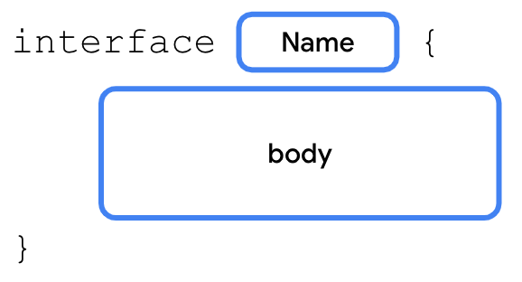

クラスを拡張して、その機能をオーバーライドする方法については、すでに学習しました。インターフェースでは、クラスがインターフェースを実装します。そのクラスでは、インターフェースで宣言されたメソッドとプロパティの実装の詳細を提供します。委譲の作成方法は、[`ReadWriteProperty`](https://kotlinlang.org/api/latest/jvm/stdlib/kotlin.properties/-read-write-property/) インターフェースの場合と同様です。インターフェースの詳細については、次のユニットで説明します。

`var` 型の委譲クラスを作成するには、[`ReadWriteProperty`](https://kotlinlang.org/api/latest/jvm/stdlib/kotlin.properties/-read-write-property/) インターフェースを実装する必要があります。同様に、`val` 型の場合は [`ReadOnlyProperty`](https://kotlinlang.org/api/latest/jvm/stdlib/kotlin.properties/-read-only-property/) インターフェースを実装する必要があります。

`var` 型の委譲を作成しましょう。

1. `main()` 関数の前に、`ReadWriteProperty<Any?,` `Int>` インターフェースを実装する `RangeRegulator` クラスを作成します。

```kotlin
class RangeRegulator() : ReadWriteProperty<Any?, Int> {

}

fun main() {
    ...
}
```

山括弧とその内側は気にしないでください。これらは一般的な型を表しており、次のユニットで学習します。

2. `RangeRegulator` クラスのプライマリ コンストラクタに、`initialValue` パラメータ、private の `minValue` プロパティ、private の `maxValue` プロパティ（どれも `Int` 型）を追加します。

```kotlin
class RangeRegulator(
    initialValue: Int,
    private val minValue: Int,
    private val maxValue: Int
) : ReadWriteProperty<Any?, Int> {

}
```

3. `RangeRegulator` クラスの本体で、`getValue()` メソッドと `setValue()` メソッドをオーバーライドします。

```kotlin
class RangeRegulator(
    initialValue: Int,
    private val minValue: Int,
    private val maxValue: Int
) : ReadWriteProperty<Any?, Int> {

    override fun getValue(thisRef: Any?, property: KProperty<*>): Int {
    }

    override fun setValue(thisRef: Any?, property: KProperty<*>, value: Int) {
    }
}
```

これらのメソッドは、プロパティのゲッター関数とセッター関数の役目を果たします。

> **注:** [`KProperty`](https://kotlinlang.org/api/latest/jvm/stdlib/kotlin.reflect/-k-property/#kproperty) は宣言されたプロパティを表すインターフェースであり、委譲されたプロパティのメタデータにアクセスできるようにするものです。[`KProperty`](https://kotlinlang.org/api/latest/jvm/stdlib/kotlin.reflect/-k-property/#kproperty) の概要を知っておくことは有用です。

4. `SmartDevice` クラスの前の行で、`ReadWriteProperty` インターフェースと `KProperty` インターフェースをインポートします。

```kotlin
import kotlin.properties.ReadWriteProperty
import kotlin.reflect.KProperty

open class SmartDevice(val name: String, val category: String) {
    ...
}

...

class RangeRegulator(
    initialValue: Int,
    private val minValue: Int,
    private val maxValue: Int
) : ReadWriteProperty<Any?, Int> {

    override fun getValue(thisRef: Any?, property: KProperty<*>): Int {
    }

    override fun setValue(thisRef: Any?, property: KProperty<*>, value: Int) {
    }
}

...
```

5. `RangeRegulator` クラスの `getValue()` メソッドの前の行で、`fieldData` プロパティを定義し、`initialValue` パラメータで初期化します。

```kotlin
class RangeRegulator(
    initialValue: Int,
    private val minValue: Int,
    private val maxValue: Int
) : ReadWriteProperty<Any?, Int> {

    var fieldData = initialValue

    override fun getValue(thisRef: Any?, property: KProperty<*>): Int {
    }

    override fun setValue(thisRef: Any?, property: KProperty<*>, value: Int) {
    }
}
```

このプロパティが変数のバッキング フィールドとなります。

6. `getValue()` メソッドの本体で、`fieldData` プロパティを返します。

```kotlin
class RangeRegulator(
    initialValue: Int,
    private val minValue: Int,
    private val maxValue: Int
) : ReadWriteProperty<Any?, Int> {

    var fieldData = initialValue

    override fun getValue(thisRef: Any?, property: KProperty<*>): Int {
        return fieldData
    }

    override fun setValue(thisRef: Any?, property: KProperty<*>, value: Int) {
    }
}
```

7. `setValue()` メソッドの本体で、`value` パラメータが `minValue..maxValue` の範囲にあるかどうかをチェックしてから、`fieldData` プロパティに代入します。

```kotlin
class RangeRegulator(
    initialValue: Int,
    private val minValue: Int,
    private val maxValue: Int
) : ReadWriteProperty<Any?, Int> {

    var fieldData = initialValue

    override fun getValue(thisRef: Any?, property: KProperty<*>): Int {
        return fieldData
    }

    override fun setValue(thisRef: Any?, property: KProperty<*>, value: Int) {
        if (value in minValue..maxValue) {
            fieldData = value
        }
    }
}
```

8. `SmartTvDevice` クラスで、委譲クラスを使用して `speakerVolume` プロパティと `channelNumber` プロパティを定義します。

```kotlin
class SmartTvDevice(deviceName: String, deviceCategory: String) :
    SmartDevice(name = deviceName, category = deviceCategory) {

    override val deviceType = "Smart TV"

    private var speakerVolume by RangeRegulator(initialValue = 2, minValue = 0, maxValue = 100)

    private var channelNumber by RangeRegulator(initialValue = 1, minValue = 0, maxValue = 200)

    ...

}
```

9. `SmartLightDevice` クラスで、委譲クラスを使用して `brightnessLevel` プロパティを定義します。

```kotlin
class SmartLightDevice(deviceName: String, deviceCategory: String) :
    SmartDevice(name = deviceName, category = deviceCategory) {

    override val deviceType = "Smart Light"

    private var brightnessLevel by RangeRegulator(initialValue = 0, minValue = 0, maxValue = 100)

    ...

}
```

### 10. 解答をテストする

解答コードは、次のコード スニペットのとおりです。

```kotlin
import kotlin.properties.ReadWriteProperty
import kotlin.reflect.KProperty

open class SmartDevice(val name: String, val category: String) {

    var deviceStatus = "online"
        protected set

    open val deviceType = "unknown"

    open fun turnOn() {
        deviceStatus = "on"
    }

    open fun turnOff() {
        deviceStatus = "off"
    }
}

class SmartTvDevice(deviceName: String, deviceCategory: String) :
    SmartDevice(name = deviceName, category = deviceCategory) {

    override val deviceType = "Smart TV"

    private var speakerVolume by RangeRegulator(initialValue = 2, minValue = 0, maxValue = 100)

    private var channelNumber by RangeRegulator(initialValue = 1, minValue = 0, maxValue = 200)

    fun increaseSpeakerVolume() {
        speakerVolume++
        println("Speaker volume increased to $speakerVolume.")
    }

    fun nextChannel() {
        channelNumber++
        println("Channel number increased to $channelNumber.")
    }

    override fun turnOn() {
        super.turnOn()
        println(
            "$name is turned on. Speaker volume is set to $speakerVolume and channel number is " +
                "set to $channelNumber."
        )
    }

    override fun turnOff() {
        super.turnOff()
        println("$name turned off")
    }
}

class SmartLightDevice(deviceName: String, deviceCategory: String) :
    SmartDevice(name = deviceName, category = deviceCategory) {

    override val deviceType = "Smart Light"

    private var brightnessLevel by RangeRegulator(initialValue = 0, minValue = 0, maxValue = 100)

    fun increaseBrightness() {
        brightnessLevel++
        println("Brightness increased to $brightnessLevel.")
    }

    override fun turnOn() {
        super.turnOn()
        brightnessLevel = 2
        println("$name turned on. The brightness level is $brightnessLevel.")
    }

    override fun turnOff() {
        super.turnOff()
        brightnessLevel = 0
        println("Smart Light turned off")
    }
}

class SmartHome(
    val smartTvDevice: SmartTvDevice,
    val smartLightDevice: SmartLightDevice
) {

    var deviceTurnOnCount = 0
        private set

    fun turnOnTv() {
        deviceTurnOnCount++
        smartTvDevice.turnOn()
    }

    fun turnOffTv() {
        deviceTurnOnCount--
        smartTvDevice.turnOff()
    }

    fun increaseTvVolume() {
        smartTvDevice.increaseSpeakerVolume()
    }

    fun changeTvChannelToNext() {
        smartTvDevice.nextChannel()
    }

    fun turnOnLight() {
        deviceTurnOnCount++
        smartLightDevice.turnOn()
    }

    fun turnOffLight() {
        deviceTurnOnCount--
        smartLightDevice.turnOff()
    }

    fun increaseLightBrightness() {
        smartLightDevice.increaseBrightness()
    }

    fun turnOffAllDevices() {
        turnOffTv()
        turnOffLight()
    }
}

class RangeRegulator(
    initialValue: Int,
    private val minValue: Int,
    private val maxValue: Int
) : ReadWriteProperty<Any?, Int> {

    var fieldData = initialValue

    override fun getValue(thisRef: Any?, property: KProperty<*>): Int {
        return fieldData
    }

    override fun setValue(thisRef: Any?, property: KProperty<*>, value: Int) {
        if (value in minValue..maxValue) {
            fieldData = value
        }
    }
}

fun main() {
    var smartDevice: SmartDevice = SmartTvDevice("Android TV", "Entertainment")
    smartDevice.turnOn()

    smartDevice = SmartLightDevice("Google Light", "Utility")
    smartDevice.turnOn()
}
```

次のような出力が表示されます。

```
Android TV is turned on. Speaker volume is set to 2 and channel number is set to 1.
Google Light turned on. The brightness level is 2.
```

### 11. 課題に挑戦しましょう

- `SmartDevice` クラスで、`"Device` `name:` `$name,` `category:` `$category,` `type:` `$deviceType"` という文字列を出力する `printDeviceInfo()` メソッドを定義してください。
- `SmartTvDevice` クラスで、音量を下げる `decreaseVolume()` メソッドと、前のチャンネルに切り替える `previousChannel()` メソッドを定義してください。
- `SmartLightDevice` クラスで、明るさを下げる `decreaseBrightness()` メソッドを定義してください。
- `SmartHome` クラスで、すべてのアクションを、各デバイスの `deviceStatus` プロパティが `"on"` 文字列に設定されている場合にのみ実行できるようにしてください。また、`deviceTurnOnCount` プロパティが正しく更新されるようにしてください。

実装が完了したら、次のことを行ってください。

- `SmartHome` クラスで、`decreaseTvVolume()`、`changeTvChannelToPrevious()`、`printSmartTvInfo()`、`printSmartLightInfo()`、`decreaseLightBrightness()` の各メソッドを定義してください。
- `SmartHome` クラスで、`SmartTvDevice` クラスと `SmartLightDevice` クラスの適当なメソッドを呼び出してください。
- `main()` 関数で、追加したメソッドを呼び出してテストしてください。

### 12. まとめ

お疲れさまでした。クラスを定義する方法と、オブジェクトをインスタンス化する方法の学習が終わりました。また、クラス間で関係を結ぶ方法と、プロパティ委譲を作成する方法についても学習しました。

#### **概要**

- OOP には、カプセル化、抽象化、継承、ポリモーフィズムという 4 つの主要な原理があります。
- クラスは `class` キーワードで定義され、プロパティとメソッドを含みます。
- プロパティは変数に似ていますが、プロパティにはカスタムのゲッターとセッターを設けることができます。
- コンストラクタでは、クラスのオブジェクトをインスタンス化する方法を指定します。
- プライマリ コンストラクタを定義する際には、`constructor` キーワードを省略できます。
- 継承により、コードの再利用が簡単になります。
- IS-A 関係は継承を表します。
- HAS-A 関係はコンポジションを表します。
- 可視性修飾子は、カプセル化を実現するうえで重要な役割を果たします。
- Kotlin には、`public`、`private`、`protected`、`internal` の 4 つの可視性修飾子があります。
- プロパティ委譲を使用すると、ゲッターとセッターのコードを複数のクラスで再利用できます。

#### **さらに詳しく**学習するには

- [組み込みの委譲](https://medium.com/androiddevelopers/built-in-delegates-4811947e781f)

## 6. Kotlin で関数型とラムダ式を使用する

### 1. はじめに

このレッスンでは、関数型、関数型の使用方法、ラムダ式に固有の構文について説明します。

Kotlin では、関数はファースト クラスの構造体とみなされます。つまり、関数はデータ型として扱うことができます。関数を変数に格納し、引数として他の関数に渡して、他の関数から返すことができます。

リテラル値で表現できる他のデータ型（`10` 値の `Int` 型と `"Hello"` 値の `String` 型など）と同様に、ラムダ式または簡略化してラムダと呼ばれる関数リテラルを宣言することもできます。ラムダ式は、Android 開発や Kotlin プログラミングで広く使用されます。

#### 前提条件

- 関数、`if/else` ステートメント、null 可能性など、Kotlin プログラミングに精通していること

#### 学習内容

- ラムダ構文を使用して関数を定義する方法。
- 関数を変数に格納する方法。
- 関数を引数として他の関数に渡す方法。
- 他の関数から関数を返す方法。
- null 値許容の関数型を使用する方法。
- ラムダ式をより簡潔にする方法。
- 高階関数の概要。
- `repeat()` 関数を使用する方法。

#### 必要なもの

- Kotlin プレイグラウンドにアクセスできるウェブブラウザ

### 2. 関数を変数に格納する

ここまでのところで、`fun` キーワードを使用して関数を宣言する方法を学びました。`fun` キーワードで宣言した関数は呼び出すことができ、それによって関数本体のコードが実行されます。

ファースト クラスの構造体である関数はデータ型でもあるため、関数を変数に格納する、関数に渡す、さらに関数から返すことができます。以前のレッスンで行ったように、ランタイムにアプリの動作を変更する、またはコンポーズ可能な関数をネストして、レイアウトをビルドすることが必要になる場合があります。これはすべて、ラムダ式によって行うことができます。

この動作を、[トリック オア トリート](https://en.wikipedia.org/wiki/Trick-or-treating)の例を通じて見ていきます。トリック オア トリートとは、コスチュームを着た子どもたちが家々を回って「トリック オア トリート」と言い、そのお返しに通常はお菓子をもらえる、多くの国でのハロウィーンの伝統的な習慣です。

関数を変数に格納します。

1. [Kotlin プレイグラウンド](https://developer.android.com/training/kotlinplayground)に移動します。
2. `main()` 関数の後で、パラメータと戻り値のない、`"No treats!"` を出力する `trick()` 関数を定義します。構文は、前のレッスンで使用した他の関数の構文と同じです。

```kotlin
fun main() {
    
}

fun trick() {
    println("No treats!")
}
```

3. `main()` 関数の本体で、`trickFunction` という変数を作成し、`trick` に設定します。関数を呼び出すのではなく、変数に格納するため、`trick` の後にかっこは挿入しません。

```kotlin
fun main() {
    val trickFunction = trick
}

fun trick() {
    println("No treats!")
}
```

4. コードを実行します。Kotlin コンパイラは `trick` を `trick()` 関数の名前として認識しますが、変数に割り当てるのではなく、関数を呼び出すことを想定しているため、エラーが発生します。

```
Function invocation 'trick()' expected
```

`trickFunction` 変数に `trick` を格納しようとしました。しかし、関数を値として参照するには、関数参照演算子（`::`）を使用する必要があります。この構文を以下の図に示します。


5. 関数を値として参照するには、`trickFunction` を `::trick` に再割り当てします。

```kotlin
fun main() {
    val trickFunction = ::trick
}

fun trick() {
    println("No treats!")
}
```

6. コードを実行して、エラーが発生しなくなったことを確認します。`trickFunction` は使用しないでくださいという警告が表示されますが、次のセクションで解決します。

#### ラムダ式を使用して関数を再定義する

ラムダ式は、`fun` キーワードのない関数を定義する簡潔な構文を備えています。別の関数で関数を参照せずに、ラムダ式を変数に直接格納できます。

代入演算子（`=`）の前に、`val` キーワードまたは `var` キーワードを追加し、その後に変数名を挿入します。この変数名は、関数を呼び出すときに使用します。代入演算子（`=`）の後ろにはラムダ式があります。これは、関数の本体を囲む中かっこのペアで構成されます。この構文を以下の図に示します。

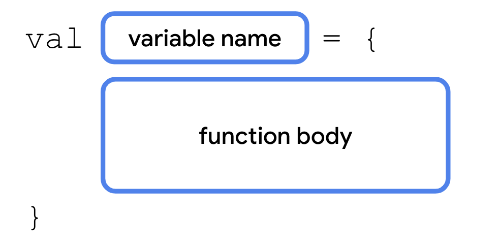

ラムダ式を使用して関数を定義する場合は、関数を参照する変数を設定します。他の型と同様に、値を他の変数に割り当てて、新しい変数名で関数を呼び出すこともできます。

ラムダ式を使用するようにコードを更新します。

1. ラムダ式を使用して `trick()` 関数を書き換えます。名前 `trick` は変数の名前を参照するようになりました。中かっこの関数本体はラムダ式になりました。

```kotlin
fun main() {
    val trickFunction = ::trick
}

val trick = {
    println("No treats!")
}
```

2. `trick` は関数名ではなく変数を参照するようになったため、`main()` 関数で関数参照演算子（`::`）を削除します。

```kotlin
fun main() {
    val trickFunction = trick
}

val trick = {
    println("No treats!")
}
```

3. コードを実行します。エラーは発生せず、関数参照演算子（`::`）を使用することなく `trick()` 関数を参照できます。関数をまだ呼び出していないため、出力は表示されません。
4. `main()` 関数で、`trick()` 関数を呼び出しますが、今回は他の関数を呼び出す場合と同じように、かっこを挿入します。

```kotlin
fun main() {
    val trickFunction = trick
    trick()
}

val trick = {
    println("No treats!")
}
```

5. コードを実行します。ラムダ式の本文が実行されます。

```
No treats!
```

6. `main()` 関数で、`trickFunction` 変数を関数のように呼び出します。

```kotlin
fun main() {
    val trickFunction = trick
    trick()
    trickFunction()
}

val trick = {
    println("No treats!")
}
```

7. コードを実行します。この関数は 2 回呼び出されます（`trick()` 関数の呼び出しに対して 1 回、2 回目は `trickFunction()` 関数の呼び出しに対して呼び出されます）。

```
No treats!
No treats!
```

ラムダ式を使用すると、関数を格納する変数を作成し、これらの変数を関数のように呼び出して、関数のように呼び出せる他の変数に格納できます。

### 3. 関数をデータ型として使用する

前のレッスンで、Kotlin には型推論があることを学びました。多くの場合、変数を宣言する際に、型を明示的に指定する必要はありません。前述の例では、Kotlin コンパイラは `trick` の値が関数であると推測できました。ただし、関数パラメータの型や戻り値の型を指定する場合は、関数型を表現するための構文について把握しておく必要があります。関数型は、オプションのパラメータ リスト、`->` 記号、戻り値の型を含むかっこのセットで構成されています。この構文を以下の図に示します。

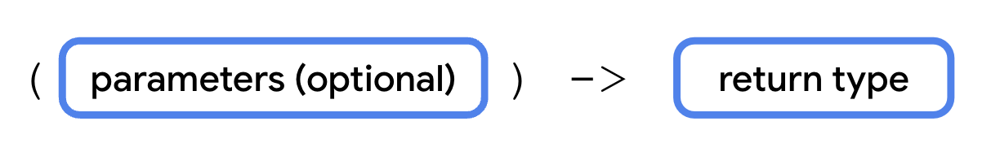

前に宣言した `trick` 変数のデータ型は `() -> Unit` です。この関数にはパラメータがないため、かっこは空です。この関数は何も返さないため、戻り値の型は `Unit` です。2 つの `Int` パラメータを受け取り、`Int` を返す関数がある場合、そのデータ型は `(Int, Int) -> Int` です。

関数の型を明示的に指定するラムダ式を使用して、別の関数を宣言します。

1. `trick` 変数の後に、`"Have a treat!"` を出力する本文を持つラムダ式と等しい `treat` という変数を宣言します。

```kotlin
val trick = {
    println("No treats!")
}

val treat = {
    println("Have a treat!")
}
```

2. `treat` 変数のデータ型を `() -> Unit` として指定します。

```kotlin
val treat: () -> Unit = {
    println("Have a treat!")
}
```

3. `main()` 関数で、`treat()` 関数を呼び出します。

```kotlin
fun main() {
    val trickFunction = trick
    trick()
    trickFunction()
    treat()
}
```

4. コードを実行します。`treat()` 関数は `trick()` 関数と同様に動作します。明示的に宣言しているのは `treat` 変数のみですが、どちらの変数も同じデータ型です。

```
No treats!
No treats!
Have a treat!
```

#### 関数を戻り値の型として使用する

関数はデータ型であるため、他のデータ型と同様に使用できます。他の関数から関数を返すこともできます。この構文を以下の図に示します。

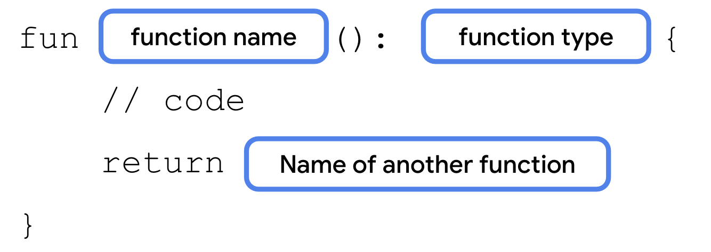

関数を返す関数を作成します。

1. `main()` 関数からコードを削除します。

```kotlin
fun main() {
    
}
```

2. `main()` 関数の後に、`Boolean` 型の `isTrick` パラメータを受け入れる `trickOrTreat()` 関数を定義します。

```kotlin
fun main() {
    
}

fun trickOrTreat(isTrick: Boolean): () -> Unit {
}

val trick = {
    println("No treats!")
}

val treat = {
    println("Have a treat!")
}
```

3. `trickOrTreat()` 関数の本体で、`isTrick` が `true` の場合は `trick()` 関数を返し、`isTrick` が false の場合は `treat()` 関数を返す `if` ステートメントを追加します。

```kotlin
fun trickOrTreat(isTrick: Boolean): () -> Unit {
    if (isTrick) {
        return trick
    } else {
        return treat
    }
}
```

4. `main()` 関数で、`treatFunction` という変数を作成して、`trickOrTreat()` の呼び出し結果に代入し、`isTrick` パラメータに `false` を渡します。次に、`trickFunction` という 2 つ目の変数を作成し、`trickOrTreat()` の呼び出し結果に代入します。今回は、`isTrick` パラメータに `true` を渡します。

```kotlin
fun main() {
    val treatFunction = trickOrTreat(false)
    val trickFunction = trickOrTreat(true)
}
```

5. `treatFunction()` を呼び出してから、次の行で `trickFunction()` を呼び出します。

```kotlin
fun main() {
    val treatFunction = trickOrTreat(false)
    val trickFunction = trickOrTreat(true)
    treatFunction()
    trickFunction()
}
```

6. コードを実行します。各関数の出力が表示されます。`trick()` 関数または `treat()` 関数を直接呼び出していない場合でも、これらの関数を呼び出すことができます。これは、`trickOrTreat()` 関数を呼び出すごとに戻り値を保存し、`trickFunction` 変数と `treatFunction` 変数を使用して関数を呼び出したためです。

```
Have a treat!
No treats!
```

これで、関数がどのように他の関数を返すかがわかりました。関数を引数として別の関数に渡すこともできます。2 つの文字列のいずれかを返す以外の処理を実行するカスタムの動作を `trickOrTreat()` 関数に設定する必要が生じることもあります。ある関数を引数として受け取る関数は、呼び出されるたびに別の関数を渡すことができます。

#### **関数を引数として別の関数に渡す**

ハロウィーンを祝う世界の一部の地域では、子どもたちはお菓子の代わりに小銭を受け取ります。または、両方を受け取ります。`trickOrTreat()` 関数を変更して、関数で表される追加のもてなしを引数として指定できるようにします。

`trickOrTreat()` がパラメータとして使用している関数も、独自のパラメータを受け取る必要があります。関数型を宣言する場合、パラメータにはラベルが付加されません。必要なのは、各パラメータのデータ型をカンマで区切って指定することのみです。この構文を以下の図に示します。

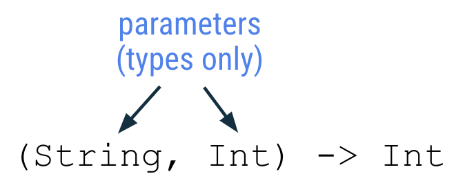

パラメータを受け取る関数のラムダ式を作成すると、パラメータには生成された順に名前が付けられます。パラメータ名は開いた中かっこの後にリストされます。それぞれの名前はカンマで区切られます。パラメータ名と関数本体は矢印（`->`）で区切られます。この構文を以下の図に示します。

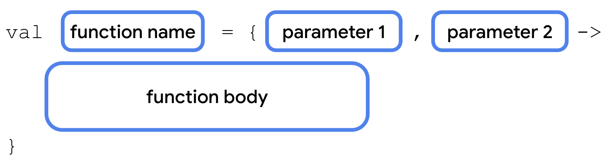

関数をパラメータとして受け取るように `trickOrTreat()` 関数を更新します。

1. `isTrick` パラメータの後に、`(Int) -> String` 型の `extraTreat` パラメータを追加します。

```kotlin
fun trickOrTreat(isTrick: Boolean, extraTreat: (Int) -> String): () -> Unit {
```

2. `else` ブロックで、`return` ステートメントの前に `println()` を呼び出し、`extraTreat()` 関数の呼び出しを渡します。`5` を `extraTreat()` の呼び出しに渡します。

```kotlin
fun trickOrTreat(isTrick: Boolean, extraTreat: (Int) -> String): () -> Unit {
    if (isTrick) {
        return trick
    } else {
        println(extraTreat(5))
        return treat
    }
}
```

3. これで、`trickOrTreat()` 関数を呼び出す場合に、ラムダ式を使用して関数を定義し、`extraTreat` パラメータに渡すことが必要になります。`main()` 関数で、`trickOrTreat()` 関数を呼び出す前に `coins()` 関数を追加します。`coins()` 関数は、`Int` パラメータに `quantity` という名前を付け、`String` を返します。キーワード `return` は存在しないため、ラムダ式では使用できません。代わりに、関数内の最後の式の結果が戻り値になります。

```kotlin
fun main() {
    val coins: (Int) -> String = { quantity ->
        "$quantity quarters"
    }
    
    val treatFunction = trickOrTreat(false)
    val trickFunction = trickOrTreat(true)
    treatFunction()
    trickFunction()
}
```

4. 以下に示すように、`coins()` 関数の後に `cupcake()` 関数を追加します。`Int` パラメータ `quantity` に名前を付け、`->` 演算子を使用して関数本体から分離します。これで、`coins()` 関数または `cupcake()` 関数を `trickOrTreat()` 関数に渡すことができます。

```kotlin
fun main() {
    val coins: (Int) -> String = { quantity ->
        "$quantity quarters"
    }

    val cupcake: (Int) -> String = { quantity ->
        "Have a cupcake!"
    }

    val treatFunction = trickOrTreat(false)
    val trickFunction = trickOrTreat(true)
    treatFunction()
    trickFunction()
}
```

5. `cupcake()` 関数で、`quantity` パラメータと `->` 記号を削除します。これらは使用されていないため、省略できます。

```kotlin
val cupcake: (Int) -> String = {
    "Have a cupcake!"
}
```

> **注:** `coins()` 関数では、`Int` パラメータの名前は `quantity` です。ただし、文字列のパラメータ名と変数名が同じであれば、どのような名前でもかまいません。

6. `trickOrTreat()` 関数の呼び出しを更新します。最初の呼び出しで、`isTrick` が `false` の場合は、`coins()` 関数を渡します。2 番目の呼び出しでは、`isTrick` が `true` の場合に `cupcake()` 関数を渡します。

```kotlin
fun main() {
    val coins: (Int) -> String = { quantity ->
        "$quantity quarters"
    }

    val cupcake: (Int) -> String = {
        "Have a cupcake!"
    }

    val treatFunction = trickOrTreat(false, coins)
    val trickFunction = trickOrTreat(true, cupcake)
    treatFunction()
    trickFunction()
}
```

7. コードを実行します。`extraTreat()` 関数は、`isTrick` パラメータが `false` 引数に設定されている場合にのみ呼び出されるため、出力には 5 クオーターが含まれますが、カップケーキは含まれません。

```
5 quarters
Have a treat!
No treats!
```

#### null 値許容の関数型

他のデータ型と同様に、関数型は null 値許容型として宣言できます。このような場合、変数には関数を含めるか、`null` にします。

関数を null 値許容型として宣言するには、関数型をかっこで囲み、閉じかっこの後ろに `?` 記号を付加します。たとえば、`() -> String` 型を null 値許容型にする場合は、`(() -> String)?` 型として宣言します。この構文を以下の図に示します。

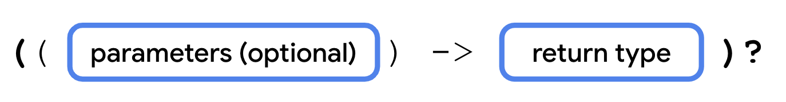

`trickOrTreat()` 関数を呼び出すたびに `extraTreat()` 関数を指定しなくても済むように、`extraTreat` パラメータを null 値許容にします。

1. `extraTreat` パラメータの型を `(() -> String)?` に変更します。

```kotlin
fun trickOrTreat(isTrick: Boolean, extraTreat: ((Int) -> String)?): () -> Unit {
```

2. `extraTreat()` 関数の呼び出しを変更し、`if` ステートメントを使用して、その関数が null でない場合にのみ関数を呼び出すようにします。`trickOrTreat()` 関数は次のコード スニペットのようになります。

```kotlin
fun trickOrTreat(isTrick: Boolean, extraTreat: ((Int) -> String)?): () -> Unit {
    if (isTrick) {
        return trick
    } else {
        if (extraTreat != null) {
            println(extraTreat(5))
        }
        return treat
    }
}
```

3. `cupcake()` 関数を削除し、`trickOrTreat()` 関数への 2 回目の呼び出しで `cupcake` 引数を `null` に置き換えます。

```kotlin
fun main() {
    val coins: (Int) -> String = { quantity ->
        "$quantity quarters"
    }

    val treatFunction = trickOrTreat(false, coins)
    val trickFunction = trickOrTreat(true, null)
    treatFunction()
    trickFunction()
}
```

4. コードを実行します。出力は変更されません。関数型を null 値許容型として宣言できるようになったため、`extraTreat` パラメータに関数を渡す必要はなくなりました。

```
5 quarters
Have a treat!
No treats!
```

### 4. 簡単な構文でラムダ式を記述する

ラムダ式には、コードをより簡潔にするためのさまざまな方法が用意されています。取り上げているラムダ式の多くは省略した構文で記述されているため、このセクションではその一部を見ていきます。

#### パラメータ名を省略する

`coins()` 関数を記述した際に、関数の `Int` パラメータに `quantity` という名前を明示的に宣言しました。ただし、`cupcake()` 関数で説明したように、パラメータ名を完全に省略できます。関数にパラメータが 1 つあり、名前を指定しない場合、Kotlin は暗黙的に `it` 名を割り当てます。これにより、パラメータ名と `->` 記号を省略でき、ラムダ式がより簡潔になります。この構文を以下の図に示します。

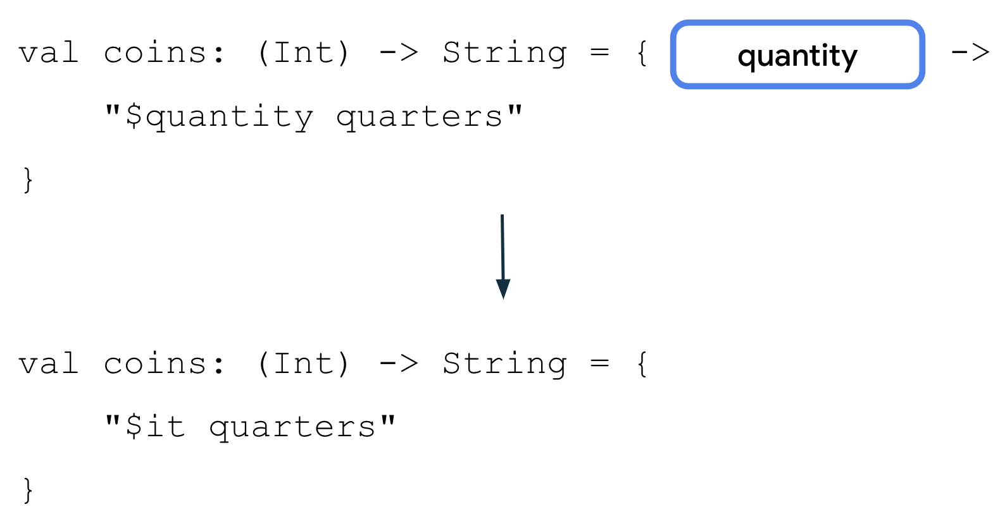

パラメータに省略形の構文を使用するように `coins()` 関数を更新します。

1. `coins()` 関数で、`quantity` パラメータ名と `->` 記号を削除します。

```kotlin
val coins: (Int) -> String = {
    "$quantity quarters"
}
```

2. `$it` を使用して、1 つのパラメータを参照するように `"$quantity quarters"` 文字列テンプレートを変更します。

```kotlin
val coins: (Int) -> String = {
    "$it quarters"
}
```

3. コードを実行します。Kotlin は `Int` パラメータの `it` パラメータ名を認識し、引き続きクオーター数を出力します。

```
5 quarters
Have a treat!
No treats!
```

#### ラムダ式を関数に直接渡す

現在、`coins()` 関数は 1 つの場所でのみ使用されます。最初に変数を作成せずにラムダ式を `trickOrTreat()` 関数に直接渡すことができるとしたらどうでしょう。

ラムダ式は単に、`0` が整数リテラルであるか、`"Hello"` が文字列リテラルであるのと同様に、関数リテラルです。ラムダ式は関数呼び出しに直接渡すことができます。この構文を以下の図に示します。

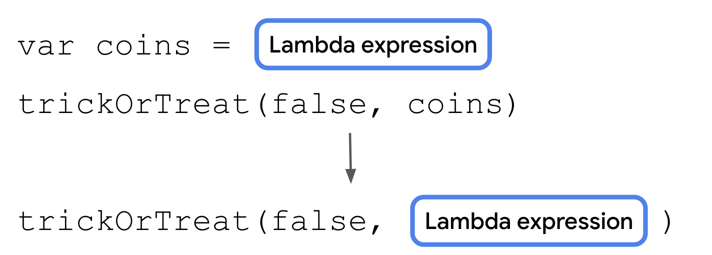

`coins` 変数を削除できるようにコードを変更します。

1. ラムダ式を移動して、`trickOrTreat()` 関数の呼び出しに直接渡すようにします。ラムダ式を 1 行に集約することもできます。

```kotlin
fun main() {
    val coins: (Int) -> String = {
        "$it quarters"
    }
    val treatFunction = trickOrTreat(false, { "$it quarters" })
    val trickFunction = trickOrTreat(true, null)
    treatFunction()
    trickFunction()
}
```

2. `coins` 変数は使用されなくなったため、削除します。

```kotlin
fun main() {
    val treatFunction = trickOrTreat(false, { "$it quarters" })
    val trickFunction = trickOrTreat(true, null)
    treatFunction()
    trickFunction()
}
```

3. コードを実行します。引き続き想定どおりにコンパイルされて実行されます。

```
5 quarters
Have a treat!
No treats!
```

#### **後置ラムダ構文を使用する**

関数の型が関数の最後のパラメータの場合は、別の省略形を使用してラムダを書き込むことができます。その場合は、ラムダ式を閉じかっこの後に配置すると、関数を呼び出すことができます。この構文を以下の図に示します。

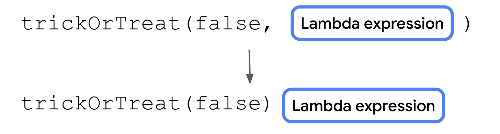

これにより、ラムダ式が他のパラメータから分離されるため、コードが読みやすくなりますが、コードの動作は変わりません。

後置ラムダ構文を使用するようにコードを更新します。

1. `treatFunction` 変数で、`trickOrTreat()` の呼び出しの閉じかっこの後にラムダ式 `{"$it quarters"}` を移動します。

```kotlin
val treatFunction = trickOrTreat(false) { "$it quarters" }
```

2. コードを実行します。すべて正常に動作します。

```
5 quarters
Have a treat!
No treats!
```

> **注:** UI の宣言に使用したコンポーズ可能な関数はパラメータとして関数を受け取り、通常は後置ラムダ構文を使用して呼び出されます。

### 5. repeat() 関数を使用する

関数が関数を返すか、関数を引数として受け取る場合は、高階関数と呼ばれます。`trickOrTreat()` 関数は高階関数の例です。パラメータとして `((Int) -> String)?` 型の関数を受け取り、`() -> Unit` 型の関数を返すためです。Kotlin には、ラムダの新しい知識を活用できる、便利な高階関数がいくつか用意されています。

[`repeat()`](https://kotlinlang.org/api/latest/jvm/stdlib/kotlin/repeat.html) 関数は、そのような高階関数の一つです。`repeat()` 関数を使用すると、`for` ループを関数で簡潔に表現できます。この関数や他の高階関数は、後のユニットで頻繁に使用します。`repeat()` 関数には次のような関数署名があります。

```kotlin
repeat(times: Int, action: (Int) -> Unit)
```

`times` パラメータは、アクションを実行する必要がある回数です。`action` パラメータは単一の `Int` パラメータを受け取り、`Unit` 型を返す関数です。`action` 関数の `Int` パラメータは、最初の反復処理の `0` 引数や 2 番目の反復処理の `1` 引数など、これまでにアクションが実行された回数です。`repeat()` 関数を使用すると、`for` ループと同様に、コードを指定された回数だけ繰り返すことができます。この構文を以下の図に示します。

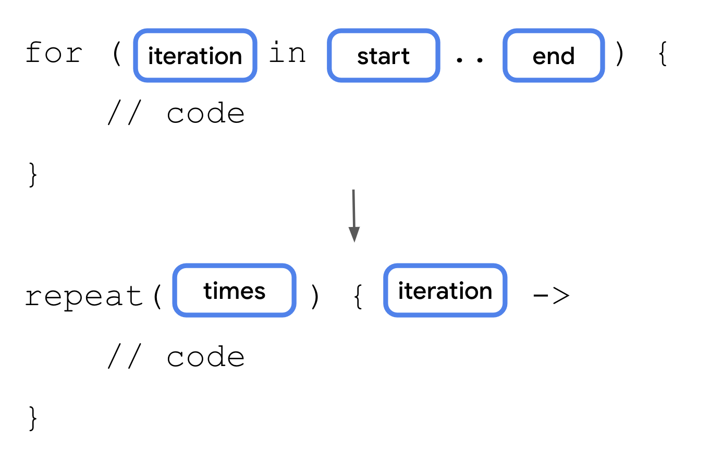

`repeat()` 関数を使用することで、`trickFunction()` 関数を 1 回だけではなく、複数回呼び出せます。

トリック オア トリートのコードを更新して、`repeat()` 関数の動作を確認します。

1. `main()` 関数で、`treatFunction()` と `trickFunction()` の呼び出しの間に `repeat()` 関数を呼び出します。`times` パラメータに `4` を渡し、`action` 関数に後置ラムダ構文を使用します。ラムダ式の `Int` パラメータの名前を指定する必要はありません。

```kotlin
fun main() {
    val treatFunction = trickOrTreat(false) { "$it quarters" }
    val trickFunction = trickOrTreat(true, null)
    treatFunction()
    trickFunction()
    repeat(4) {
        
    }
}
```

2. `treatFunction()` 関数の呼び出しを `repeat()` 関数のラムダ式に移動します。

```kotlin
fun main() {
    val treatFunction = trickOrTreat(false) { "$it quarters" }
    val trickFunction = trickOrTreat(true, null)
    repeat(4) {
        treatFunction()
    }
    trickFunction()
}
```

3. コードを実行します。`"Have a treat"` 文字列は 4 回出力されます。

```
5 quarters
Have a treat!
Have a treat!
Have a treat!
Have a treat!
No treats!
```

### 6. まとめ

お疲れさまでした。関数型とラムダ式の基礎を学習しました。Kotlin 言語について理解を深める際に、これらのコンセプトを理解しておくと役立ちます。また、関数型、高階関数、簡略構文を使用することで、コードがより簡潔になり、読みやすくなります。

#### **概要**

- Kotlin の関数はファースト クラスの構造体であり、データ型と同様に扱うことができます。
- ラムダ式には、関数を作成するための簡単な構文が用意されています。
- 関数型は他の関数に渡すことができます。
- 関数型は別の関数から返すことができます。
- ラムダ式は最後の式の値を返します。
- 1 つのパラメータを持つラムダ式でパラメータ ラベルが省略されている場合は、`it` 識別子によって参照されます。
- ラムダは変数名を付けずにインラインで記述できます。
- 関数の最後のパラメータが関数型の場合は、後置ラムダ構文を使用して、関数呼び出し時に最後のかっこの後にラムダ式を移動できます。
- 高階関数とは、他の関数をパラメータとして受け取る関数または関数を返す関数です。
- `repeat()` 関数は、`for` ループと同様に動作する高階関数です。

#### **詳細**

- [高階関数とラムダ](https://kotlinlang.org/docs/lambdas.html)

## 7. 演習: Kotlin の基礎（提出対象）

### 1. 始める前に

Kotlin プログラミングの基礎を学んだので、次は学んだことを実践しましょう。

この演習では、学習したコンセプトの理解度をテストします。実際のユースケースに基づいており、一部はユーザーとして以前に経験したことがあるかもしれません。

手順に沿って、[Kotlin のプレイグラウンド](https://developer.android.com/training/kotlinplayground)で各問題を解きましょう。一部の問題には、行き詰まった場合に役立つヒントが用意されています。各問題の解答コードは最後にありますが、解答を確認する前に自分で考えることをおすすめします。

自分のペースで進めてください。それぞれの問題には所要時間を示していますが、目安にすぎませんので、それにとらわれる必要はありません。必要なだけ時間をかけ、じっくりと問題に取り組んでください。回答例はあくまでも一つの例ですので、納得がいくまで試してください。

#### 前提条件

- [Kotlin のプレイグラウンド](https://developer.android.com/training/kotlinplayground)に精通していること
- 関数の定義と呼び出しを行えること
- Kotlin プログラミングの基礎知識（変数を含む）、および `println()` 関数と `main()` 関数の知識
- `if/else` と `when`（文と式）などの Kotlin の条件構文に慣れていること
- Kotlin のラムダ式に慣れていること
- null 値許容変数の扱い方に関する知識
- Kotlin のクラスとオブジェクトの作成方法に関する知識
- Kotlin での条件構文の使い方、Kotlin での null 値許容の使い方、Kotlin でのクラスとオブジェクトの使い方、Kotlin での関数型とラムダ式の使い方に関する各レッスンを修了していること

#### 必要なもの

- Kotlin のプレイグラウンド

### 2. モバイル通知

通常、スマートフォンには通知の概要が表示されます。

以下のコード スニペットの初期コードの中に、受信した通知数に基づいて概要メッセージを出力するプログラムを加えてください。メッセージには次の内容を入れてください。

- 通知数が 100 未満の場合は、正確な通知数。
- 通知数が 100 以上の場合は、`99+`。

```kotlin
fun main() {
    val morningNotification = 51
    val eveningNotification = 135
    
    printNotificationSummary(morningNotification)
    printNotificationSummary(eveningNotification)
}

fun printNotificationSummary(numberOfMessages: Int) {
    // Fill in the code.
}
```

`printNotificationSummary()` 関数を完成させて、プログラムが以下の行を出力するようにしてください。

```
You have 51 notifications.
Your phone is blowing up! You have 99+ notifications.
```

### 3. 映画のチケット料金

映画のチケット料金は、通常、映画を観る人の年齢に応じて異なります。

以下のコード スニペットの初期コードの中に、次のような年齢に基づいたチケット料金を計算するプログラムを書いてください。

- 12 歳以下は、15 ドルの子供料金。
- 13 歳から 60 歳までは、30 ドルの一般料金（月曜日は 25 ドルの割引料金）。
- 61 歳以上は、20 ドルのシニア料金（最高齢は 100 歳と想定）。
- 想定外の年齢が入力された場合は、無効な料金を表す値 `-1`。

```kotlin
fun main() {
    val child = 5
    val adult = 28
    val senior = 87
    
    val isMonday = true
    
    println("The movie ticket price for a person aged $child is \$${ticketPrice(child, isMonday)}.")
    println("The movie ticket price for a person aged $adult is \$${ticketPrice(adult, isMonday)}.")
    println("The movie ticket price for a person aged $senior is \$${ticketPrice(senior, isMonday)}.")
}

fun ticketPrice(age: Int, isMonday: Boolean): Int {
    // Fill in the code.
}
```

`ticketPrice()` 関数を完成させて、プログラムが以下の行を出力するようにしてください。

```
The movie ticket price for a person aged 5 is $15.
The movie ticket price for a person aged 28 is $25.
The movie ticket price for a person aged 87 is $20.
```

### 4. 温度の変換

世界で使用されている主な温度の単位は、摂氏、華氏、ケルビンの 3 つです。

以下のコード スニペットの初期コードの中に、温度をある単位から別の単位に変換するプログラムを書いてください。

- 摂氏（C）から華氏（F）: *F* = 9/5 (° *C*) + 32
- ケルビン（K）から摂氏（C）: *C* = *K* - 273.15
- 華氏（F）からケルビン（K）: *K* = 5/9 (° *F* - 32) + 273.15

`String.format("%.2f", /* measurement */ )` メソッドを使用して、数値を小数点以下 2 桁までの `String` 型に変換します。

```kotlin
fun main() {
    // Fill in the code.
}

fun printFinalTemperature(
    initialMeasurement: Double, 
    initialUnit: String, 
    finalUnit: String, 
    conversionFormula: (Double) -> Double
) {
    val finalMeasurement = String.format("%.2f", conversionFormula(initialMeasurement)) // two decimal places
    println("$initialMeasurement degrees $initialUnit is $finalMeasurement degrees $finalUnit.")
}
```

`main()` 関数を完成させ、`printFinalTemperature()` 関数を呼び出して、以下の行を出力するようにしてください。必ず、温度と変換式を引数として渡してください。ヒント: 除算の際に `Integer` が切り捨てられないように、必要に応じて `Double` 値を使用してください。

```
27.0 degrees Celsius is 80.60 degrees Fahrenheit.
350.0 degrees Kelvin is 76.85 degrees Celsius.
10.0 degrees Fahrenheit is 260.93 degrees Kelvin.
```

### 5. 楽曲カタログ

音楽プレーヤー アプリを作成することを考えます。

曲の構造を表すクラスを作成しましょう。`Song` クラスには、以下のコード要素を入れてください。

- タイトル、アーティスト、リリース年、再生回数のプロパティ
- 曲が人気があるかどうかを表すプロパティ（再生回数が 1,000 未満の場合は人気がないと見なす）
- 次の形式で曲の説明を出力するメソッド:

"[タイトル], performed by [アーティスト], was released in [リリース年]."

### 6. インターネット プロフィール

オンライン ウェブサイトで、必須の項目と必須でない項目があるプロフィールの入力を求められることがよくあります。たとえば、プロフィールを作るために個人情報や紹介者へのリンクを記入するなどします。

以下のコード スニペットの初期コードの中に、個人のプロフィール情報を出力するプログラムを書いてください。

```kotlin
fun main() {    
    val amanda = Person("Amanda", 33, "play tennis", null)
    val atiqah = Person("Atiqah", 28, "climb", amanda)
    
    amanda.showProfile()
    atiqah.showProfile()
}

class Person(val name: String, val age: Int, val hobby: String?, val referrer: Person?) {
    fun showProfile() {
       // Fill in code 
    }
}
```

`showProfile()` 関数を完成させて、プログラムが以下の行を出力するようにしてください。

```
Name: Amanda
Age: 33
Likes to play tennis. Doesn't have a referrer.

Name: Atiqah
Age: 28
Likes to climb. Has a referrer named Amanda, who likes to play tennis.
```

### 7. 折りたたみ式スマートフォン

通常、スマートフォンの画面は、電源ボタンを押すとオンとオフが切り替わります。一方、折りたたみ式スマートフォンを折りたたんだ場合、メインの内部画面は、電源ボタンを押したときにオンになりません。

以下のコード スニペットの初期コードの中に、`Phone` クラスを継承する `FoldablePhone` クラスを書いてください。そのクラスには、以下のものを含めてください。

- スマートフォンが折りたたまれているかどうかを示すプロパティ。
- スマートフォンが折りたたまれていないときにだけ画面をオンにする、`Phone` クラスとは異なる動作の `switchOn()` 関数。
- 折りたたみ状態を変更するメソッド。

```kotlin
class Phone(var isScreenLightOn: Boolean = false){
    fun switchOn() {
        isScreenLightOn = true
    }
    
    fun switchOff() {
        isScreenLightOn = false
    }
    
    fun checkPhoneScreenLight() {
        val phoneScreenLight = if (isScreenLightOn) "on" else "off"
        println("The phone screen's light is $phoneScreenLight.")
    }
}
```

### 8. 特殊なオークション

通常のオークションでは、最高額入札者がアイテムの価格を決定します。このオークションでは、入札者がいない場合、自動的に最低価格でオークション会社に売却されます。

以下のコード スニペットの初期コードの中に、null 値許容の `Bid?` 型を引数として受け取る `auctionPrice()` 関数を用意してあります。

```kotlin
fun main() {
    val winningBid = Bid(5000, "Private Collector")
    
    println("Item A is sold at ${auctionPrice(winningBid, 2000)}.")
    println("Item B is sold at ${auctionPrice(null, 3000)}.")
}

class Bid(val amount: Int, val bidder: String)
 
fun auctionPrice(bid: Bid?, minimumPrice: Int): Int {
   // Fill in the code.
}
```

`auctionPrice()` 関数を完成させて、プログラムが以下の行を出力するようにしてください。

```
Item A is sold at 5000.
Item B is sold at 3000.
```

### 9. 解答コード

#### モバイル通知

この解答では、`if/else` 文を使い、受け取った通知メッセージの数に基づいて、適切な通知概要のメッセージを出力します。

```kotlin
fun main() {
    val morningNotification = 51
    val eveningNotification = 135
    
    printNotificationSummary(morningNotification)
    printNotificationSummary(eveningNotification)
}

fun printNotificationSummary(numberOfMessages: Int) {
    if (numberOfMessages < 100) {
        println("You have ${numberOfMessages} notifications.")
    } else {
        println("Your phone is blowing up! You have 99+ notifications.")
    }
}
```

#### **映画のチケット料金**

この解答では、`when` 式を使い、年齢に基づいて適切なチケット料金を返しています。また、`when` 式の分岐の一つで簡単な `if/else` 式を使い、一般チケット料金に条件を追加しています。

`else` の分岐では、チケット料金として `else` 分岐の価格設定が無効であることを示す値 `-1` を返します。より良い実装では、この `else` の分岐で例外をスローしますが、例外処理は今後のユニットで学習します。

```kotlin
fun main() {
    val child = 5
    val adult = 28
    val senior = 87
    
    val isMonday = true
    
    println("The movie ticket price for a person aged $child is \$${ticketPrice(child, isMonday)}.")
    println("The movie ticket price for a person aged $adult is \$${ticketPrice(adult, isMonday)}.")
    println("The movie ticket price for a person aged $senior is \$${ticketPrice(senior, isMonday)}.")
}
 
fun ticketPrice(age: Int, isMonday: Boolean): Int {
    return when(age) {
        in 0..12 -> 15
        in 13..60 -> if (isMonday) 25 else 30
        in 61..100 -> 20
        else -> -1
    }
}
```

#### **温度の変換**

この解答では、`printFinalTemperature()` 関数のパラメータとして、関数を渡す必要があります。ラムダ式を引数として渡す最も簡潔な方法は、パラメータ名に `it` パラメータ参照を使い、末尾ラムダ構文を使う方法です。

```kotlin
fun main() {    
        printFinalTemperature(27.0, "Celsius", "Fahrenheit") { 9.0 / 5.0 * it + 32 }
        printFinalTemperature(350.0, "Kelvin", "Celsius") { it - 273.15 }
        printFinalTemperature(10.0, "Fahrenheit", "Kelvin") { 5.0 / 9.0 * (it - 32) + 273.15 }
}

fun printFinalTemperature(
    initialMeasurement: Double, 
    initialUnit: String, 
    finalUnit: String, 
    conversionFormula: (Double) -> Double
) {
    val finalMeasurement = String.format("%.2f", conversionFormula(initialMeasurement)) // two decimal places
    println("$initialMeasurement degrees $initialUnit is $finalMeasurement degrees $finalUnit.")
}
```

#### **楽曲カタログ**

この解答には、必要なすべてのパラメータを受け取るデフォルト コンストラクタを持った `Song` クラスがあります。この `Song` クラスには、カスタムのゲッター関数を使用する `isPopular` プロパティと、自身の説明を出力するメソッドがあります。`main()` 関数の中でこのクラスのインスタンスを作成し、そのメソッドを呼び出すと、実装が正しいかどうかをテストできます。大きな数値を書くときには `1_000_000` のように下線を使って読みやすくできます。

```kotlin
fun main() {    
    val brunoSong = Song("We Don't Talk About Bruno", "Encanto Cast", 2022, 1_000_000)
    brunoSong.printDescription()
    println(brunoSong.isPopular)
}

class Song(
    val title: String, 
    val artist: String, 
    val yearPublished: Int, 
    val playCount: Int
){
    val isPopular: Boolean
        get() = playCount >= 1000

    fun printDescription() {
        println("$title, performed by $artist, was released in $yearPublished.")
    }   
}
```

このインスタンスのメソッドで `println()` 関数を呼び出すと、プログラムは次のように出力します。

```
We Don't Talk About Bruno, performed by Encanto Cast, was released in 2022.
true
```

#### **インターネット プロフィール**

この解答では、いろいろな `if/else` 文に null チェックを入れ、各クラス プロパティが `null` かどうかで異なるテキストを出力するようにしています。

```kotlin
fun main() {    
    val amanda = Person("Amanda", 33, "play tennis", null)
    val atiqah = Person("Atiqah", 28, "climb", amanda)
    
    amanda.showProfile()
    atiqah.showProfile()
}

class Person(val name: String, val age: Int, val hobby: String?, val referrer: Person?) {
    fun showProfile() {
        println("Name: $name")
        println("Age: $age")
        if(hobby != null) {
            print("Likes to $hobby. ")
        }
        if(referrer != null) {
            print("Has a referrer named ${referrer.name}")
            if(referrer.hobby != null) {
                print(", who likes to ${referrer.hobby}.")
            } else {
                print(".")
            }
        } else {
            print("Doesn't have a referrer.")
        }
        print("\n\n")
    }
}
```

#### **折りたたみ式スマートフォン**

`Phone` クラスを親クラスにするには、クラス名の前に `open` というキーワードを追加してクラスをオープンする必要があります。また、`FoldablePhone` クラスで `switchOn()` をオーバーライドするには、`Phone` クラスでそのメソッドをオープンにするために、メソッドの前に `open` キーワードを追加する必要があります。

この解答には、デフォルト コンストラクタを持つ `FoldablePhone` クラスがあり、そのデフォルト コンストラクタには、デフォルト引数付きの `isFolded` パラメータがあります。また、`FoldablePhone` クラスには、`isFolded` プロパティの値を `true` にするメソッドと `false` にするメソッドがあります。さらに、`Phone` クラスから継承した `switchOn()` メソッドをオーバーライドしています。

`main()` 関数の中でこのクラスのインスタンスを作成し、そのメソッドを呼び出すと、実装が正しいかどうかをテストできます。

```kotlin
open class Phone(var isScreenLightOn: Boolean = false){
    open fun switchOn() {
        isScreenLightOn = true
    }
    
    fun switchOff() {
        isScreenLightOn = false
    }
    
    fun checkPhoneScreenLight() {
        val phoneScreenLight = if (isScreenLightOn) "on" else "off"
        println("The phone screen's light is $phoneScreenLight.")
    }
}

class FoldablePhone(var isFolded: Boolean = true): Phone() {
    override fun switchOn() {
        if (!isFolded) {
            isScreenLightOn = true
        }
    }
    
    fun fold() {
        isFolded = true
    }
    
    fun unfold() {
        isFolded = false
    }
}

fun main() {    
    val newFoldablePhone = FoldablePhone()
    
    newFoldablePhone.switchOn()
    newFoldablePhone.checkPhoneScreenLight()
    newFoldablePhone.unfold()
    newFoldablePhone.switchOn()
    newFoldablePhone.checkPhoneScreenLight()
}
```

次のような出力が表示されます。

```
The phone screen's light is off.
The phone screen's light is on.
```

#### **特殊なオークション**

この解答では、セーフコール演算子（`?.`）とエルビス演算子（`?:`）を使用して、正しい価格を返しています。

```kotlin
fun main() {
    val winningBid = Bid(5000, "Private Collector")
    
    println("Item A is sold at ${auctionPrice(winningBid, 2000)}.")
    println("Item B is sold at ${auctionPrice(null, 3000)}.")
}

class Bid(val amount: Int, val bidder: String)

fun auctionPrice(bid: Bid?, minimumPrice: Int): Int {
    return bid?.amount ?: minimumPrice
}
```

### 10. その他の演習

Kotlin 言語に関するその他の演習については、[JetBrains Academy の Kotlin Core トラック](https://hyperskill.org/tracks/18)をご覧ください。特定のトピックに移動するには、[ナレッジマップ](https://hyperskill.org/knowledge-map)に移動して、このトラックで扱っているトピックの一覧を確認してください。

## 8. つまずきやすいポイント

- この章の内容は後のユニットで **毎回** 使います。演習でつまずいた箇所は必ずメモして質問してください。
- ラムダ式 `{ x -> x * 2 }` は「名前のない小さな関数」です。Compose のクリック処理（`onClick = { ... }`）もこれです。
- `!!` は「絶対 null じゃない」と宣言する記号です。安易に使うとクラッシュの原因になるので、まず `?.` と `?:` で書けないか考えましょう。

## 9. AIに質問する（この章の例）

次の例をそのままAIに投げてOKです（必要なら自分のコード/エラーに置き換えてください）。

```text
「Kotlin の `?.` `?:` `!!` の違いを、クラッシュする例としない例つきで説明して」
「`when` と `if` はどう使い分ける？ この章の演習を題材に説明して」
「ラムダ式 `{ x -> x * 2 }` が何なのか、Compose の `onClick = { }` とつなげて説明して」
「演習: Kotlin の基礎 の自分の解答をレビューして。null 安全の観点で危ない箇所があれば指摘して（コード: ここに貼る）」
```

質問がまとまらないときは、第0章の「質問テンプレ」を使ってください。

## 10. 提出物

次の演習で書いた Kotlin コードを、学習用リポジトリの `unit2/kotlin-fundamentals/` に `.kt` ファイルとして置きます（1 問 1 ファイル、ファイル名は問題が分かる名前にする）。

- 演習: Kotlin の基礎

PR 本文には次の 3 点を書いてください。

- **やったこと**：どのレッスン / 演習を完了したか
- **動作確認**：どの端末（エミュレータ名 or 実機）で何を確認したか
- **詰まった点と解決**：エラーの内容と、どう直したか（AI に聞いた内容も可）

## 11. チェックリスト

- [ ] `if` / `when` で条件分岐を書ける
- [ ] null 安全（`?` / `?:` / `!!`）の意味を説明できる
- [ ] クラス・オブジェクト・ラムダ式を使ったコードが読める・書ける
- [ ] 各レッスンの「まとめ」にある用語を自分の言葉で説明できる
- [ ] 提出物が `unit2/kotlin-fundamentals/` にあり、Android Studio（または Kotlin Playground）で開いて動く

---

## 課題提出

この章には提出課題があります。

1. 上記の提出物を完了する
2. GitHub で `feature/02-kotlin-fundamentals` ブランチを作成し、`develop` へのPRを作成（base=`develop`）
3. [AIプログラムレビュー](https://ai.studio/apps/84d224cb-7de1-44fb-995b-9a5917d25603?fullscreenApplet=true) を実行
4. 問題がなければ、進捗ダッシュボードで **PR URL** と **完了日** を記録
