# 第6章: UI と状態を操作する

> 提出ブランチ: `feature/02-ui-state`

## 1. この章のゴール

- 状態ホイスティング（状態を親に持ち上げる）を説明できる
- `TextField` の入力を受け取って計算結果を表示できる
- 簡単な自動テスト（ユニットテスト / UI テスト）を書いて実行できる

## 2. 進め方

次の内容を **上から順番に** 進めます。「やらなくてOK」の行は飛ばして構いません。レッスンの本文はこのページの下にすべて掲載しています。目安時間の合計は約420分です。

| # | 種類 | 内容 | 目安 | 備考 |
|---|---|---|---|---|
| 1 | レッスン | Compose の状態の概要 | 約90分 |  |
| 2 | レッスン | カスタムのチップを計算する | 約90分 |  |
| 3 | レッスン | 自動テストを作成する | 約60分 |  |
| 4 | レッスン | プロジェクト: アートスペース アプリを作成する | 約180分 | **提出対象** |

このプログラムの進め方は次の通りです。

1. 下の各レッスンを読み、各ステップの説明を理解してから **自分でコードを打つ**（コピペで済ませない）
2. ステップごとにアプリを実行し、期待どおり動くか確認する
3. 動かないときは、エラー文をそのまま AI に貼って「何が原因か」を聞き、直したら **なぜ直ったか** をメモする
4. 各レッスン末尾の「まとめ」を読み、説明できない用語があればレッスンに戻る

> 画面が最新の Android Studio と異なる場合があります。

## 3. Compose の状態の概要

### 1. 始める前に

このレッスンでは、状態の概要と、Jetpack Compose での状態の使用方法と操作方法について説明します。

本質的には、アプリの状態とは、時間の経過とともに変化する可能性がある値を指します。この定義は非常に広範であり、データベースからアプリ内の変数まですべてが含まれます。データベースについては後のユニットで詳しく説明しますが、ここで覚えておくべきことは、データベースは構造化された情報（パソコン上のファイルなど）をまとめたものであることです。

すべての Android アプリはユーザーに状態を表示します。Android アプリの状態の例を次にいくつか示します。

- ネットワーク接続を確立できないときに表示されるメッセージ。
- フォーム（登録フォームなど）。状態を記入して送信できます。
- ボタンなどのタップ可能なコントロール。状態は、タップなし、タップ中（ディスプレイ アニメーション）、またはタップ済み（`onClick` アクション）のいずれかです。

このレッスンでは、Compose を使用する際の状態の考え方と使い方を学びます。そのために、以下の組み込みの Compose UI 要素を使用して Tip Time というチップ計算アプリをビルドします。

- テキストの入力と編集を行う `TextField` コンポーザブル。
- テキストを表示する `Text` コンポーザブル。
- UI 要素間に空白スペースを表示する `Spacer` コンポーザブル。

このレッスンの最後には、サービス料金を入力するとチップ金額が自動的に計算されるインタラクティブなチップ計算ツールが完成します。以下の画像は最終的なアプリの外観を示しています。


#### 前提条件

- Compose に関する基礎知識（`@Composable` アノテーションなど）。
- `Row` と `Column` のレイアウト コンポーザブルなど、Compose レイアウトに関する基本的な知識。
- `Modifier.padding()` 関数など、修飾子に関する基本的な知識。
- `Text` コンポーザブルに精通していること。

#### 学習内容

- UI で状態について検討する方法。
- Compose が状態を使用してデータを表示する方法。
- テキスト ボックスをアプリに追加する方法。
- 状態をホイスティングする方法。

#### **作成するアプリの概要**

- サービス料金に基づいてチップ金額を計算するチップ計算アプリ「Tip Time」。

#### **必要なもの**

- ウェブブラウザがインストールされた、インターネットに接続できるパソコン
- Kotlin に関する知識
- [Android Studio](https://developer.android.com/studio) の最新バージョン

### 2. 使ってみる

#### 始める

1. [Google のオンライン チップ計算ツール](https://www.google.com/search?q=tip+calculator)をご覧ください。これはあくまで一例であり、このプログラムで作成する Android アプリではありません。

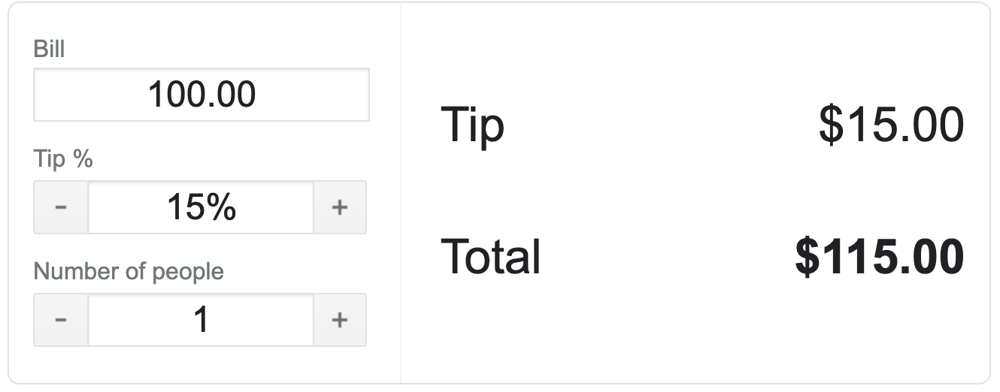 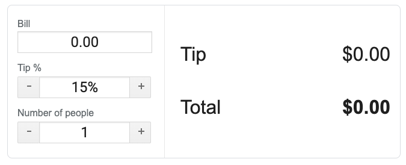

2. [**Bill**] ボックスと [**Tip %**] ボックスに異なる値を入力します。チップの金額と総額が変わります。

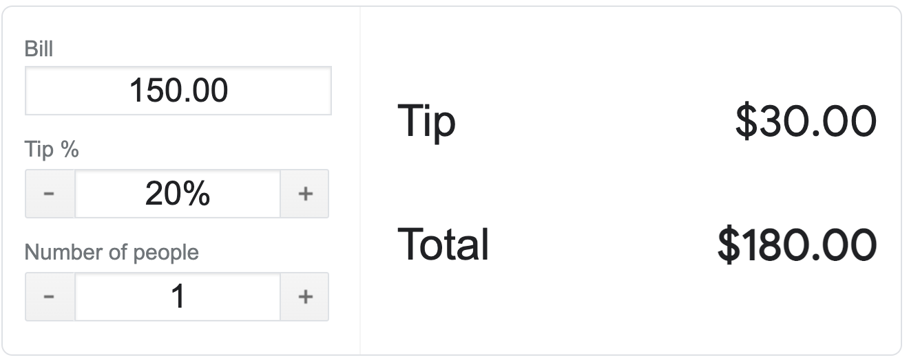

値を入力するとすぐに、[**Tip**] と [**Total**] が更新されます。次のレッスンを修了すると、同様のチップ計算アプリを Android で開発できるようになります。

ここでは、簡単なチップ計算ツールを Android アプリとして作成します。

デベロッパーは多くの場合、このように（外観はともかく）正常に動作するアプリの簡易版を作成します。そのうえで機能を追加し、デザインを洗練されたものにします。

このレッスンの終わりには、チップ計算アプリは次のスクリーンショットのようになります。ユーザーが**請求額**を入力すると、チップの推奨金額が表示されます。ここでは、チップの割合は **15%** にハードコードされています。次のレッスンでは、引き続きアプリで作業し、チップの割合のカスタム設定などの機能を追加します。

| 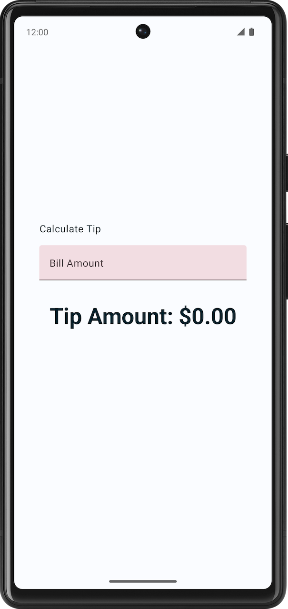 |  |
|---|---|

### 3. スターター コードを取得する

#### スターター コードを取得

スターター コードは、新しいプロジェクトの出発点として使用できる事前に作成されたコードです。また、このレッスンで学んだ新しいコンセプトに集中することもできます。

スターター コードはこちらからダウンロードできます。

または、GitHub リポジトリのクローンを作成してコードを入手することもできます。

```
$ git clone https://github.com/google-developer-training/basic-android-kotlin-compose-training-tip-calculator.git
$ cd basic-android-kotlin-compose-training-tip-calculator
$ git checkout starter
```

> **注:**スターター コードは、ダウンロードしたリポジトリの `starter` ブランチにあります。

スターター コードは [`TipTime`](https://github.com/google-developer-training/basic-android-kotlin-compose-training-tip-calculator/tree/starter) GitHub リポジトリで確認できます。

#### **スターター アプリの概要**

次の手順でスターター コードを確認し、よく理解してください。

1. Android Studio でスターター コードのプロジェクトを開きます。
2. Android デバイスまたはエミュレータでアプリを実行します。
3. 2 つのテキスト コンポーネントが表示されます。1 つはラベル用、もう 1 つはチップ金額を表示するためのものです。

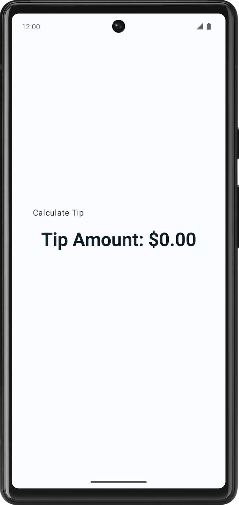

#### スターター コードのチュートリアル

スターター コードにはテキスト コンポーザブルが含まれています。この章では、ユーザーが入力できるようにテキスト フィールドを追加します。作業の土台とするファイルの一部について簡単に説明します。

**[res] > [values] > [strings.xml]**

```kotlin
<resources>
   <string name="app_name">Tip Time</string>
   <string name="calculate_tip">Calculate Tip</string>
   <string name="bill_amount">Bill Amount</string>
   <string name="tip_amount">Tip Amount: %s</string>
</resources>
```

これは、このアプリで使用するすべての文字列を含むリソースの `string.xml` ファイルです。

**MainActivity**

このファイルには、主にテンプレートから生成されたコードと次の関数が含まれています。

- `TipTimeLayout()` 関数には、スクリーンショットに示されている 2 つのテキスト コンポーザブルを持つ `Column` 要素が含まれています。また、美観上の理由でスペースを追加する `spacer` コンポーザブルもあります。
- 請求額を受け取って 15% のチップ金額を計算する `calculateTip()` 関数。`tipPercent` パラメータは `15.0` のデフォルト引数値に設定されています。これによって現時点で、デフォルトのチップ値が 15% に設定されます。次のレッスンでは、ユーザーからチップ金額を取得します。

```kotlin
@Composable
fun TipTimeLayout() {
    Column(
        modifier = Modifier
            .statusBarsPadding()
            .padding(horizontal = 40.dp)
            .verticalScroll(rememberScrollState())
            .safeDrawingPadding(),
        horizontalAlignment = Alignment.CenterHorizontally,
        verticalArrangement = Arrangement.Center
    ) {
        Text(
            text = stringResource(R.string.calculate_tip),
            modifier = Modifier
                .padding(bottom = 16.dp, top = 40.dp)
                .align(alignment = Alignment.Start)
        )
        Text(
            text = stringResource(R.string.tip_amount, "$0.00"),
            style = MaterialTheme.typography.displaySmall
        )
        Spacer(modifier = Modifier.height(150.dp))
    }
}
```

```kotlin
private fun calculateTip(amount: Double, tipPercent: Double = 15.0): String {
   val tip = tipPercent / 100 * amount
   return NumberFormat.getCurrencyInstance().format(tip)
}
```

`onCreate()` 関数の `Surface()` ブロックで、`TipTimeLayout()` 関数が呼び出されています。デバイスまたはエミュレータにアプリのレイアウトが表示されます。

```kotlin
override fun onCreate(savedInstanceState: Bundle?) {
   //...
   setContent {
       TipTimeTheme {
           Surface(
           //...
           ) {
               TipTimeLayout()
           }
       }
   }
}
```

`TipTimeLayoutPreview()` 関数の `TipTimeTheme` ブロックでは、`TipTimeLayout()` 関数が呼び出されています。これにより、[**Design**] ペインと [**Split**] ペインにアプリのレイアウトが表示されます。

```kotlin
@Preview(showBackground = true)
@Composable
fun TipTimeLayoutPreview() {
   TipTimeTheme {
       TipTimeLayout()
   }
}
```

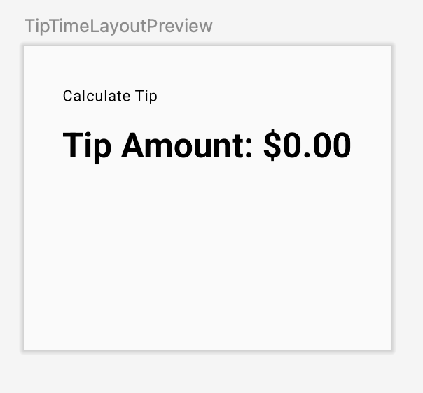

#### **ユーザーの入力を受け取る**

このセクションでは、ユーザーがアプリで請求額を入力できる UI 要素を追加します。下の画像のように表示されます。


このアプリはカスタムのスタイルとテーマを使用します。

スタイルとテーマは、単一の UI 要素の外観を指定する属性の集まりです。スタイルでは、アプリ全体に適用できるフォントの色、フォントサイズ、背景色などの属性を指定できます。これらをアプリに実装する方法については、後のレッスンで説明します。現時点では、アプリの外観を美しくするためにすでに対応済みです。

よりわかりやすくするために、カスタムテーマを使用した場合と使用しない場合のアプリのソリューション バージョンを以下に並べます。

| 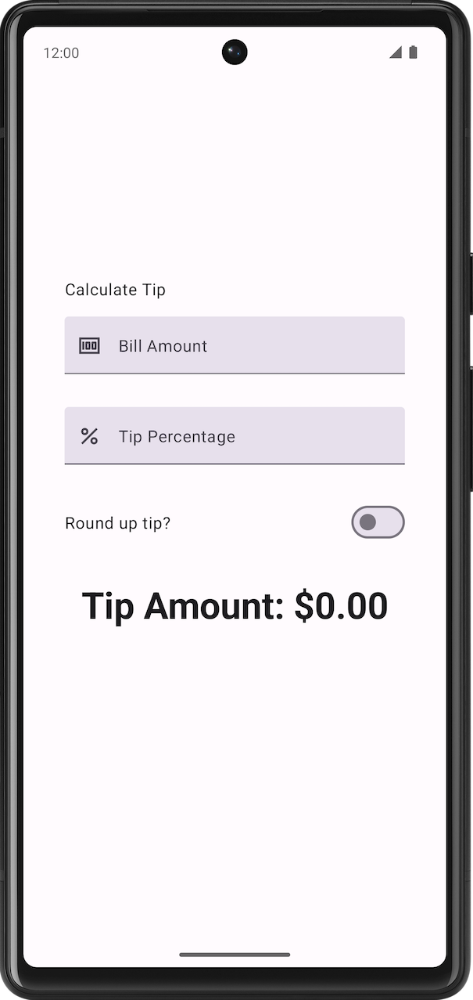カスタムテーマを使用しない場合。 | 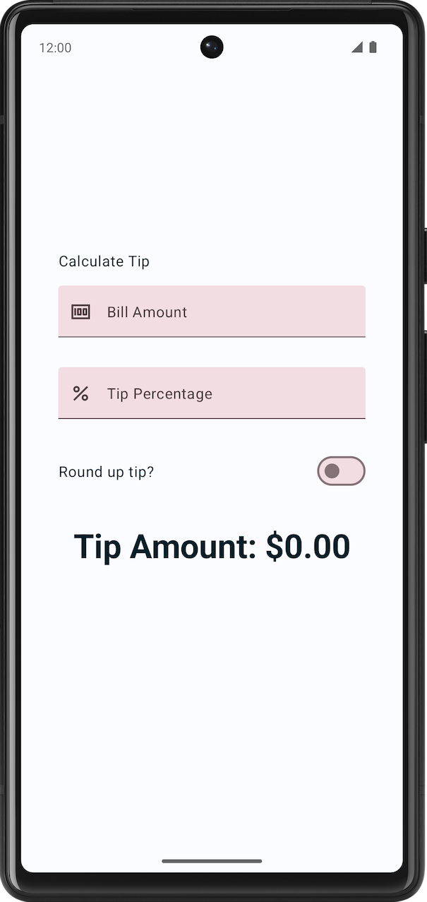カスタムテーマを使用した場合。 |
|---|---|

> **注:** アプリにテキスト フィールド コンポーザブルを追加すると、カスタムテーマの一部として、次のようにカラーパターンが設定されます。
> 
> 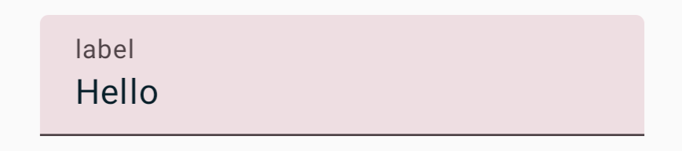

コンポーズ可能な関数 `TextField` を使用すると、ユーザーはアプリにテキストを入力できます。たとえば、次の画像に示すように、Gmail アプリのログイン画面にテキスト ボックスが配置されています。


`TextField` コンポーザブルをアプリに追加します。

1. `MainActivity.kt` ファイルに、`Modifier` パラメータを受け取るコンポーズ可能な関数 `EditNumberField()` を追加します。
2. `TipTimeLayout()` の下の `EditNumberField()` 関数の本体で、空の文字列に設定される `value` 名前付きパラメータと、空のラムダ式に設定される `onValueChange` 名前付きパラメータを受け入れる `TextField` を追加します。

```kotlin
@Composable
fun EditNumberField(modifier: Modifier = Modifier) {
   TextField(
      value = "",
      onValueChange = {},
      modifier = modifier
   )
}
```

3. 渡したパラメータに注意してください。

- `value` パラメータは、ここで渡す文字列値を表示するテキスト ボックスです。
- `onValueChange` パラメータは、ユーザーがテキスト ボックスにテキストを入力するとトリガーされるラムダ コールバックです。

4. この関数をインポートします。

```kotlin
import androidx.compose.material3.TextField
```

5. `TipTimeLayout()` コンポーザブルで、最初のテキスト コンポーズ可能な関数の後の行で、`EditNumberField()` 関数を呼び出して次の修飾子を渡します。

```kotlin
import androidx.compose.foundation.layout.fillMaxWidth

@Composable
fun TipTimeLayout() {
   Column(
        modifier = Modifier
            .statusBarsPadding()
            .padding(horizontal = 40.dp)
            .verticalScroll(rememberScrollState())
            .safeDrawingPadding(),
        horizontalAlignment = Alignment.CenterHorizontally,
        verticalArrangement = Arrangement.Center
   ) {
       Text(
           ...
       )
       EditNumberField(modifier = Modifier.padding(bottom = 32.dp).fillMaxWidth())
       Text(
           ...
       )
       ...
   }
}
```

これにより、画面にテキスト ボックスが表示されます。

6. [**Design**] ペインで、`Calculate Tip` テキスト、空のテキスト ボックス、`Tip Amount` テキスト コンポーザブルが表示されます。

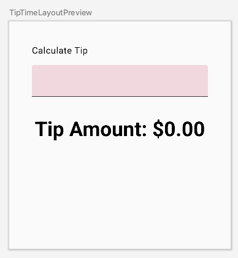

### 4. Compose で状態を使用する

アプリにおいて状態とは、時間とともに変化する可能性がある値を指します。このアプリでは、状態は請求額を表します。

状態を保存する変数を追加します。

1. `EditNumberField()` 関数の先頭で、`val` キーワードを使用して `amountInput` 変数を追加し、`"0"` 値に設定します。

```kotlin
val amountInput = "0"
```

請求額に対するアプリの状態です。

2. `value` 名前付きパラメータを `amountInput` 値に設定します。

```kotlin
TextField(
   value = amountInput,
   onValueChange = {},
)
```

3. プレビューを確認します。次の画像に示すように、テキスト ボックスに状態変数に設定された値が表示されます。

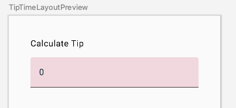

4. エミュレータでアプリを実行し、別の値を入力してください。`TextField` コンポーザブルは自身で更新しないため、ハードコードされた状態は変更されません。`amountInput` プロパティに設定されている `value` パラメータが変更されると更新されます。

`amountInput` 変数は、テキスト ボックスの状態を表します。ハードコードされた状態は、変更できず、ユーザー入力を反映しないため、有用ではありません。ユーザーが請求額を更新したときに、アプリの状態を更新する必要があります。

### 5. Composition

アプリのコンポーザブルは、テキスト、スペーサー、テキスト ボックスを含む列を表示する UI を記述します。テキストには `Calculate Tip` テキストが表示され、テキスト ボックスには `0` 値またはデフォルト値のいずれかが表示されます。

Compose は宣言型 UI フレームワークであり、コードで UI をどのように表示するかを宣言します。最初にテキスト ボックスに `100` 値を表示する場合は、コンポーザブルのコードの初期値を `100` 値に設定します。

アプリの実行中に、またはユーザーがアプリを操作したときに、UI を変更する必要がある場合はどうしますか。たとえば、ユーザーが入力した値で `amountInput` 変数を更新しテキスト ボックスに表示する場合はどうでしょうか。その場合は、再コンポーズと呼ばれるプロセスを利用してアプリの Composition を更新します。

Composition は、コンポーザブルの実行時に Compose がビルドする UI の記述です。Compose アプリは、コンポーズ可能な関数を呼び出して、データを UI に変換します。状態が変更されると、Compose は影響を受けるコンポーズ可能な関数を新しい状態で再実行し、更新された UI を作成します。これを再コンポーズと呼びます。Compose は、再コンポーズをスケジュール設定します。

Compose は、初回コンポーズで初めてコンポーザブルを実行する際に、Composition の UI を記述するために呼び出されるコンポーザブルをトラッキングします。再コンポーズの際、Compose はデータの変化に応じて変化した可能性があるコンポーザブルを再実行し、変化を反映するために Composition を更新します。

Composition は、初回コンポーズによってのみ作成され、再コンポーズによってのみ更新されます。Composition を変更する唯一の方法は、再コンポーズを行うことです。これを行うには、Compose はトラッキングする状態を認識している必要があります。これにより、更新を受信したときに再コンポーズをスケジュール設定できるようになります。今回は `amountInput` 変数であるため、値が変更されるたびに、Compose は再コンポーズをスケジュール設定します。

Compose でアプリの状態を監視またはトラッキングできるようにするには、Compose で [`State`](https://developer.android.com/reference/kotlin/androidx/compose/runtime/State) 型と [`MutableState`](https://developer.android.com/reference/kotlin/androidx/compose/runtime/MutableState) 型を使用します。`State` 型は変更不可であるため、その中の値の読み取りのみが可能ですが、[`MutableState`](https://developer.android.com/reference/kotlin/androidx/compose/runtime/MutableState) 型は変更可能です。[`mutableStateOf()`](https://developer.android.com/reference/kotlin/androidx/compose/runtime/package-summary#mutableStateOf(kotlin.Any,androidx.compose.runtime.SnapshotMutationPolicy)) 関数を使用して、監視可能な `MutableState` を作成できます。初期値をパラメータとして受け取って `State` オブジェクトにラップすることで、`value` を監視できるようになります。

`mutableStateOf()` 関数により返される値です。

- 状態（請求額）を保持します。
- 可変であるため、値を変更できます。
- 監視可能であるため、Compose は値の変更を監視し、UI を更新するための再コンポーズをトリガーします。

サービス料金の状態を追加します。

1. `EditNumberField()` 関数で、`amountInput` 状態変数の前の `val` キーワードを `var` キーワードに変更します。

```kotlin
var amountInput = "0"
```

これにより `amountInput` が可変になります。

2. Compose が `amountInput` の状態をトラッキングしてから、`amountInput` 状態変数のデフォルトの初期値である `"0"` 文字列を渡すことを認識するように、ハードコードされた `String` 変数ではなく `MutableState<String>` 型を使用します。

```kotlin
import androidx.compose.runtime.MutableState
import androidx.compose.runtime.mutableStateOf

var amountInput: MutableState<String> = mutableStateOf("0")
```

`amountInput` の初期化は、型推論を使用して次のように記述することもできます。

```kotlin
var amountInput = mutableStateOf("0")
```

`mutableStateOf()` 関数は最初の `"0"` 値を引数として受け取り、`amountInput` を監視できるようにします。その結果、Android Studio でこのコンパイルの警告が表示されますが、この後すぐに解決します。

```
Creating a state object during composition without using remember.
```

3. コンポーズ可能な関数 `TextField` で、`amountInput.value` プロパティを使用します。

```kotlin
TextField(
   value = amountInput.value,
   onValueChange = {},
   modifier = modifier
)
```

Compose は、状態 `value` プロパティを読み取り、その `value` が変更されたときに再コンポーズをトリガーする各コンポーザブルをトラッキングします。

`onValueChange` コールバックは、テキスト ボックスの入力が変更されるとトリガーされます。ラムダ式では、`it` 変数に新しい値が含まれています。

4. `onValueChange` 名前付きパラメータのラムダ式で、`amountInput.value` プロパティを `it` 変数に設定します。

```kotlin
@Composable
fun EditNumberField(modifier: Modifier = Modifier) {
   var amountInput = mutableStateOf("0")
   TextField(
       value = amountInput.value,
       onValueChange = { amountInput.value = it },
       modifier = modifier
   )
}
```

`onValueChange` コールバック関数によってテキストの変更が行われたことが `TextField` から通知された際に、`TextField` の状態（`amountInput` 変数）を更新します。

5. アプリを実行し、テキスト ボックスにテキストを入力します。下の画像で確認できるように、テキスト ボックスには引き続き値 `0` が表示されています。

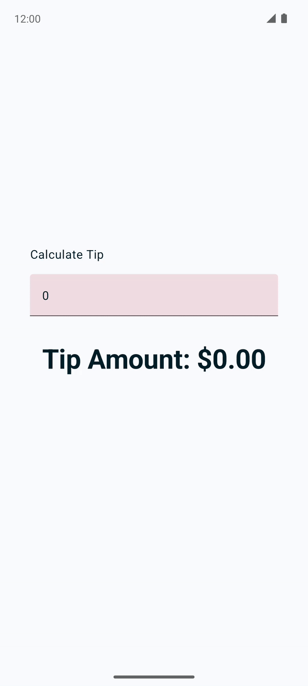

ユーザーがテキスト ボックスにテキストを入力すると、`onValueChange` コールバックが呼び出され、`amountInput` 変数が新しい値で更新されます。`amountInput` 状態は Compose によってトラッキングされるため、値が変更されると再コンポーズがスケジュール設定され、コンポーズ可能な関数 `EditNumberField()` が再度実行されます。そのコンポーズ可能な関数では、`amountInput` 変数は最初の `0` 値にリセットされます。このようにして、テキスト ボックスに `0` 値が表示されます。

追加したコードでは、状態の変更によって再コンポーズがスケジュール設定されます。

ただし、`EditNumberField()` 関数が再コンポーズされるたびに `0` 値にリセットされないように、再コンポーズ全体で `amountInput` 変数の値を保持する必要があります。この問題は次のセクションで解決します。

### 6. remember 関数を使用して状態を保存する

再コンポーズにより、コンポーズ可能なメソッドが何度も呼び出される場合があります。コンポーザブルは、保存されていない場合、再コンポーズ中に状態をリセットします。

コンポーズ可能な関数は、[`remember`](https://developer.android.com/reference/kotlin/androidx/compose/runtime/remember.composable#remember(kotlin.Function0)) を使用して再コンポーズ全体でオブジェクトを格納できます。初回コンポーズの際に、`remember` 関数によって計算された値が Composition に保存され、保存された値は再コンポーズの際に返されます。通常、`remember` 関数と `mutableStateOf` 関数はコンポーズ可能な関数で併用し、状態とその更新が UI に適切に反映されるようにします。

`EditNumberField()` 関数で `remember` 関数を使用します。

1. `EditNumberField()` 関数で、[`mutableStateOf`](https://developer.android.com/reference/kotlin/androidx/compose/runtime/package-summary#mutableStateOf(kotlin.Any,androidx.compose.runtime.SnapshotMutationPolicy))`()` 関数の呼び出しを `remember` で囲んで、`by` `remember` Kotlin プロパティのデリゲートを使用して `amountInput` 変数を初期化します。
2. [`mutableStateOf`](https://developer.android.com/reference/kotlin/androidx/compose/runtime/package-summary#mutableStateOf(kotlin.Any,androidx.compose.runtime.SnapshotMutationPolicy))`()` 関数で、静的な `"0"` 文字列ではなく、空の文字列を渡します。

```kotlin
var amountInput by remember { mutableStateOf("") }
```

これで、空の文字列が `amountInput` 変数の初期デフォルト値になります。`by` は [Kotlin のプロパティ委任](https://kotlinlang.org/docs/delegated-properties.html)です。`amountInput` プロパティのデフォルトのゲッター関数とセッター関数は、それぞれ `remember` クラスのゲッター関数とセッター関数に委任されています。

3. 次の関数をインポートします。

```kotlin
import androidx.compose.runtime.remember
import androidx.compose.runtime.getValue
import androidx.compose.runtime.setValue
```

> **警告:** このコードは、`getValue()` 拡張関数に関して、次の画像に示すエラーをスローする場合があります。
> 
> 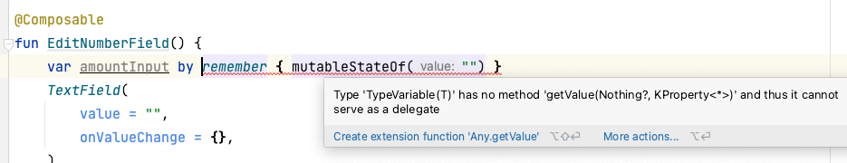
> 
> その場合は、次の画像に示すように、`getValue` インポートと `setValue` インポートをファイルの先頭のインポート ブロックに手動で追加します。
> 
> 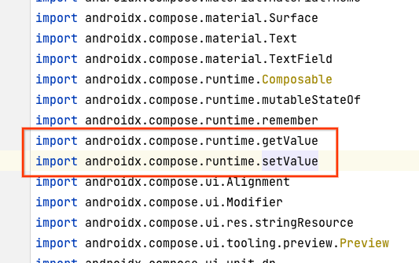

委任のゲッターとセッターのインポートを追加すると、`MutableState` の `value` プロパティを参照せずに `amountInput` を読み取り、設定できます。

更新された `EditNumberField()` 関数は次のようになります。

```kotlin
@Composable
fun EditNumberField(modifier: Modifier = Modifier) {
   var amountInput by remember { mutableStateOf("") }
   TextField(
       value = amountInput,
       onValueChange = { amountInput = it },
       modifier = modifier
   )
}
```

> **注:** 初回コンポ―ズの際に、`TextField` の `value` が初期値（空の文字列）に設定されます。
> 
> ユーザーがテキスト フィールドにテキストを入力すると、`onValueChange` ラムダ コールバックが呼び出されて、ラムダが実行され、`amountInput.value` がテキスト フィールドに入力された更新後の値に設定されます。
> 
> `amountInput` は Compose によってトラッキングされている変更可能な状態であり、再コンポーズがスケジュール設定されます。コンポーズ可能な関数 `EditNumberField()` が再コンポーズされます。`remember` `{ },` を使用しているため、変更内容は再コンポーズ後も保持されます。そのため、状態は `""` に再初期化されません。
> 
> テキスト フィールドの `value` は、`amountInput` の remember で保存される値に設定されます。テキスト フィールドが再コンポーズされます（画面に新しい値で再描画されます）。

4. アプリを実行し、テキスト ボックスにテキストを入力します。入力したテキストが表示されます。

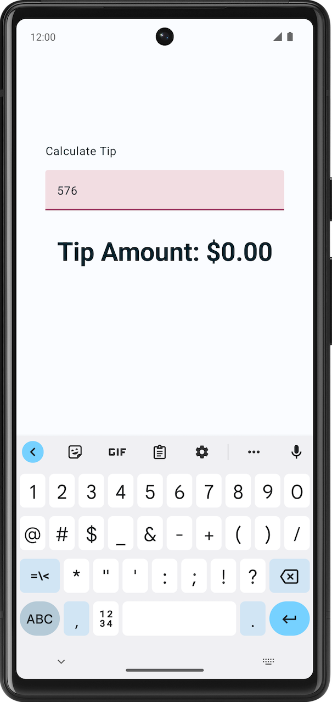

### 7. 状態と再コンポーズの実例

このセクションでは、ブレークポイントを設定してコンポーズ可能な関数 `EditNumberField()` をデバッグし、初期コンポーズと再コンポーズの仕組みを確認します。

> **注**: ブレークポイントとは、アプリの通常実行を一時停止して、変数の検証、式の評価、行ごとのコード実行などその他のアクションを行うコード内の場所を示します。ブレークポイントは実行可能な任意のコードの行に設定できます。

エミュレータまたはデバイスでブレークポイントを設定し、アプリをデバッグします。

1. `EditNumberField()` 関数内の、`onValueChange` 名前付きパラメータの横にある行ブレークポイントを設定します。
2. ナビゲーション メニューで、[**Debug 'app'**] をクリックします。アプリがエミュレータまたはデバイスで起動します。`TextField` 要素が最初に作成されたときに、アプリの実行が一時停止します。

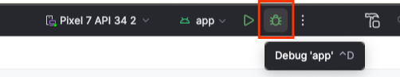

3. [**Debug**] ペインで、 [**Resume Program**] をクリックします。テキスト ボックスが作成されます。
4. エミュレータまたはデバイスで、テキスト ボックスに文字を入力します。設定したブレークポイントに到達すると、アプリの実行は再び一時停止します。

テキストを入力すると、`onValueChange` コールバックが呼び出されます。ラムダ `it` 内に、キーパッドで入力した新しい値があります。

「it」の値が `amountInput` に割り当てられた後、オブザーバブルな値が変更されると、Compose は新しいデータを使用し再コンポーズをトリガーします。

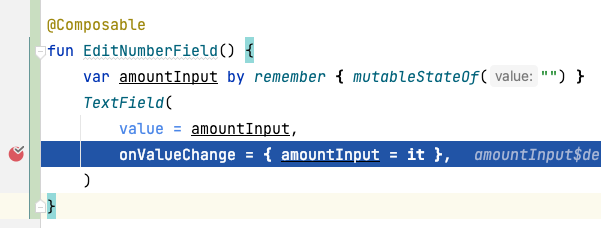

5. [**Debug**] ペインで、 [**Resume Program**] をクリックします。エミュレータまたはデバイスで入力したテキストは、この画像に示すように、ブレークポイントがある行の横に表示されます。

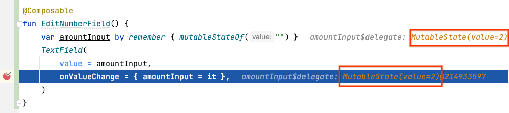

これはテキスト フィールドの状態です。

6.  [**Resume Program**] をクリックします。入力した値がエミュレータまたはデバイスに表示されます。

### 8. 外観を変更する

前のセクションでは、テキスト フィールドが機能するように設定しました。このセクションでは、UI を拡張します。

#### **テキスト ボックスにラベルを追加する**

すべてのテキスト ボックスに、ユーザーが入力できる情報を示すラベルを設定する必要があります。次のサンプル画像の最初の部分では、ラベルテキストがテキスト フィールドの中央にあり、入力行に沿って表示されています。次のサンプル画像の 2 番目の部分では、ユーザーがテキスト ボックスをクリックしてテキストを入力すると、テキスト ボックス内のラベルが上に移動します。テキスト フィールドの構造について詳しくは、[構造](https://material.io/components/text-fields#anatomy)をご覧ください。

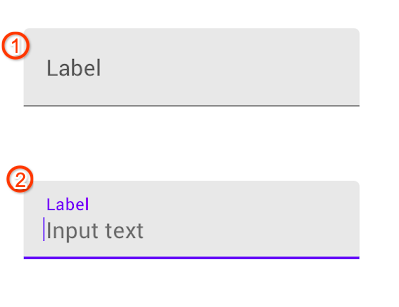

`EditNumberField()` 関数を変更して、テキスト フィールドにラベルを追加します。

1. `EditNumberField()` 関数のコンポーズ可能な関数 `TextField()` で、`label` 名前付きパラメータを追加して空のラムダ式に設定します。

```kotlin
TextField(
//...
   label = { }
)
```

2. ラムダ式では、*`stringResource`*`(R.string.`*`bill_amount`*`)` を受け入れる `Text()` 関数を呼び出します。

```kotlin
label = { Text(stringResource(R.string.bill_amount)) },
```

3. コンポーズ可能な関数 `TextField()` で、`singleLine` 名前付きパラメータを追加して `true` 値に設定します。

```kotlin
TextField(
  // ...
   singleLine = true,
)
```

これにより、テキスト ボックスが複数の行から水平方向にスクロールできる 1 行にまとめられます。

4. `keyboardOptions` パラメータを追加して `KeyboardOptions()` に設定します。

```kotlin
import androidx.compose.foundation.text.KeyboardOptions

TextField(
  // ...
   keyboardOptions = KeyboardOptions(),
)
```

Android の各種画面では、数字、メールアドレス、URL、パスワードなどの入力用に画面に表示するキーボードを必要に応じて構成できます。他のキーボード タイプについて詳しくは、[KeyboardType](https://developer.android.com/reference/kotlin/androidx/compose/ui/text/input/KeyboardType) をご覧ください。

5. キーボード タイプを数字キーボードに設定し、数字を入力します。`KeyboardOptions` 関数に `keyboardType` 名前付きパラメータを渡し `KeyboardType.Number` に設定します。

```kotlin
import androidx.compose.ui.text.input.KeyboardType

TextField(
  // ...
   keyboardOptions = KeyboardOptions(keyboardType = KeyboardType.Number),
)
```

完成した `EditNumberField()` 関数は次のコード スニペットのようになります。

```kotlin
@Composable
fun EditNumberField(modifier: Modifier = Modifier) {
    var amountInput by remember { mutableStateOf("") }
    TextField(
        value = amountInput,
        onValueChange = { amountInput = it },
        singleLine = true,
        label = { Text(stringResource(R.string.bill_amount)) },
        keyboardOptions = KeyboardOptions(keyboardType = KeyboardType.Number),
        modifier = modifier
    )
}
```

6. アプリを実行します。

キーパッドの変更点を次のスクリーンショットに示します。

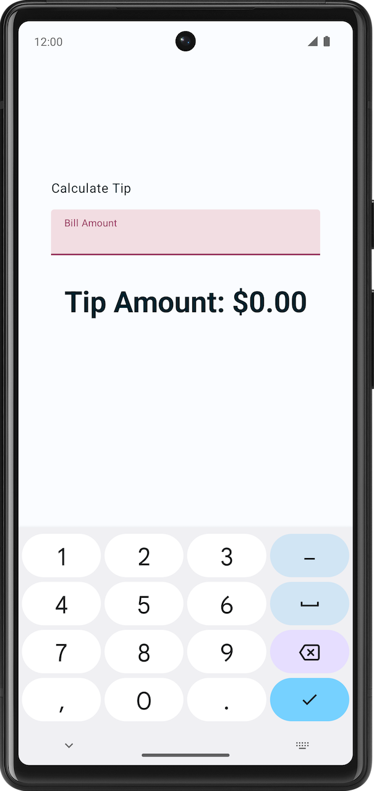

### 9. チップの金額を表示する

このセクションでは、チップ金額の計算と表示という、アプリの主な機能を実装します。

`MainActivity.kt` ファイルでは、スターター コードの一部として `private` `calculateTip()` 関数が提供されています。この関数を使用してチップ金額を計算します。

```kotlin
private fun calculateTip(amount: Double, tipPercent: Double = 15.0): String {
    val tip = tipPercent / 100 * amount
    return NumberFormat.getCurrencyInstance().format(tip)
}
```

上記のメソッドでは、[`NumberFormat`](https://developer.android.com/reference/java/text/NumberFormat) を使用してチップの表示形式を通貨として表示しています。

これで、アプリがチップを計算できるようになりましたが、クラスを使用して金額の書式設定と表示を行う必要があります。

#### `calculateTip()` 関数を使用する

ユーザーがテキスト フィールド コンポーザブルに入力したテキストは、ユーザーが数値を入力した場合でも `String` として `onValueChange` コールバック関数に返されます。この問題を解決するには、ユーザーが入力した金額を含む `amountInput` 値を変換する必要があります。

1. コンポーズ可能な関数 `EditNumberField()` で、`amountInput` 定義の後に `amount` という新しい変数を作成します。`amountInput` 変数で [`toDoubleOrNull`](https://kotlinlang.org/api/latest/jvm/stdlib/kotlin.text/to-double-or-null.html) 関数を呼び出して、`String` を `Double` に変換します。

```kotlin
val amount = amountInput.toDoubleOrNull()
```

`toDoubleOrNull()` 関数は、文字列を `Double` 数値として解析し、結果または `null`（文字列が数値の有効な表現でない場合）を返す、事前定義された Kotlin 関数です。

2. ステートメントの最後に、`amountInput` が null の場合に `0.0` 値を返す `?:` Elvis 演算子を追加します。

```kotlin
val amount = amountInput.toDoubleOrNull() ?: 0.0
```

> **注**: `?:` Elvis 演算子は、値が `null` でない場合は先行する式を、値が `null` の場合は後続の式を返します。これにより、このコードをより慣用的に記述できます。詳細については、[Elvis 演算子](https://kotlinlang.org/docs/reference/null-safety.html#elvis-operator)をご覧ください。

3. `amount` 変数の後に、`tip` という別の `val` 変数を作成します。`calculateTip()` で初期化し、`amount` パラメータを渡します。

```kotlin
val tip = calculateTip(amount)
```

完成した `EditNumberField()` 関数は次のコード スニペットのようになります。

```kotlin
@Composable
fun EditNumberField(modifier: Modifier = Modifier) {
   var amountInput by remember { mutableStateOf("") }

   val amount = amountInput.toDoubleOrNull() ?: 0.0
   val tip = calculateTip(amount)

   TextField(
       value = amountInput,
       onValueChange = { amountInput = it },
       label = { Text(stringResource(R.string.bill_amount)) },
       modifier = Modifier.fillMaxWidth(),
       singleLine = true,
       keyboardOptions = KeyboardOptions(keyboardType = KeyboardType.Number)
   )
}
```

#### 計算されたチップ金額を表示する

チップ金額を計算する関数を記述したら、次のステップでは計算されたチップ金額を表示します。

1. `Column()` ブロックの最後にある `TipTimeLayout()` 関数で、`$0.00` を表示するテキスト コンポーザブルに注目してください。これを計算されたチップ金額に更新します。

```kotlin
@Composable
fun TipTimeLayout() {
    Column(
        modifier = Modifier
            .statusBarsPadding()
            .padding(horizontal = 40.dp)
            .verticalScroll(rememberScrollState())
            .safeDrawingPadding(),
        horizontalAlignment = Alignment.CenterHorizontally,
        verticalArrangement = Arrangement.Center
    ) {
        // ...
        Text(
            text = stringResource(R.string.tip_amount, "$0.00"),
            style = MaterialTheme.typography.displaySmall
        )
        // ...
    }
}
```

チップ金額を計算して表示するには、`TipTimeLayout()` 関数の `amountInput` 変数にアクセスする必要がありますが、`amountInput` 変数はコンポーズ可能な関数 `EditNumberField()` で定義されたテキスト フィールドの状態であるため、`TipTimeLayout()` 関数からはまだ呼び出すことができません。以下の画像は、コードの構造を示しています。

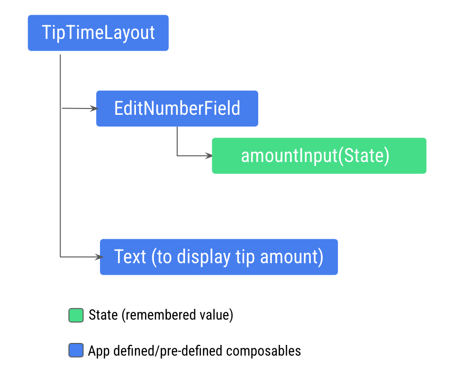

この構造体では、新しい `Text` コンポーザブルは `amountInput` 変数から計算された `amount` 変数にアクセスする必要があるため、`Text` コンポーザブルにチップ金額を表示することはできません。`amount` 変数を `TipTimeLayout()` 関数に公開する必要があります。以下の画像は、目的のコード構造を示しています。これにより、`EditNumberField()` コンポーザブルはステートレスになります。

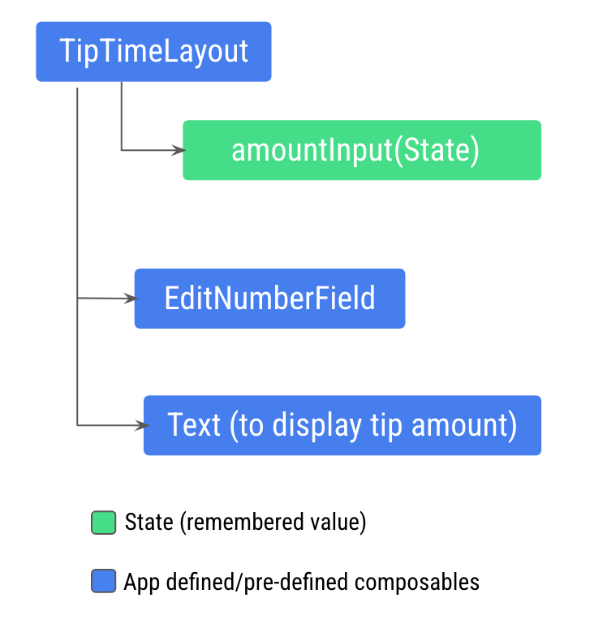

このパターンは、状態ホイスティングと呼ばれます。次のセクションでは、コンポーザブルから状態をホイスティング（リフト）して、ステートレスにします。

> **注:** ステートレスなコンポーザブルとは、自身の状態を保存しないコンポーザブルです。入力引数として与えられた状態を表示します。

### 10. 状態ホイスティング

このセクションでは、コンポーザブルを再利用して共有できるように状態を定義する場所を決定する方法について説明します。

コンポーズ可能な関数で、UI に表示する状態を保持する変数を定義できます。例としては、`amountInput` 変数を `EditNumberField()` コンポーザブルの状態として定義したことが挙げられます。

アプリが複雑になり、他のコンポーザブルが `EditNumberField()` コンポーザブル内の状態にアクセスする必要がある場合は、コンポーズ可能な関数 `EditNumberField()` から状態をホイスティング（抽出）することを検討する必要があります。

#### ステートフルとステートレスな**コンポーザブル**を理解する

次の場合は、状態をホイスティングする必要があります。

- 状態を複数のコンポーズ可能な関数と共有する。
- アプリで再利用できるステートレスなコンポーザブルを作成する。

コンポーズ可能な関数から状態を抽出する場合、作成されるコンポーズ可能な関数はステートレスと呼ばれます。つまり、コンポーズ可能な関数は、それらの状態を抽出してステートレスにできます。

ステートレスなコンポーザブルとは、状態を保持しない（つまり、新しい状態を保持、定義、変更しない）コンポーザブルです。一方、ステートフルなコンポーザブルとは、時間とともに変化する可能性がある状態を所有するコンポーザブルです。

> **注:** 実際のアプリでは、コンポーザブルが担う役割によっては、100% ステートレスなコンポーザブルを実現するのが困難な場合があります。コンポーザブルは、コンポーザブルの API で公開することで、可能な限り少ない状態を保持し、適切なタイミングで状態をホイスティングできるように設計する必要があります。

状態ホイスティングは、状態を呼び出し元に移行してコンポーネントをステートレスにするパターンです。

コンポーザブルに状態ホイスティングを適用すると、多くの場合、コンポーザブルに 2 つのパラメータを導入することになります。

- `value: T` パラメータ。表示する現在の値です。
- `onValueChange: (T) -> Unit` - コールバック ラムダ。値が変更されたときにトリガーされ、ユーザーがテキスト ボックスにテキストを入力したときなど、状態を他の場所で更新できるようにします。

`EditNumberField()` 関数で状態をホイスティングします。

1. `EditNumberField()` 関数定義を更新し、`value` パラメータと `onValueChange` パラメータを追加して状態をホイスティングします。

```kotlin
@Composable
fun EditNumberField(
   value: String,
   onValueChange: (String) -> Unit,
   modifier: Modifier = Modifier
) {
//...
```

`value` パラメータは `String` 型、`onValueChange` パラメータは `(String) -> Unit` 型であるため、`String` 値を入力として受け取り、戻り値が存在しない関数です。`onValueChange` パラメータは、`TextField` コンポーザブルに渡される `onValueChange` コールバックとして使用されます。

> **注:**すべてのコンポーズ可能な関数にデフォルトの [`Modifier`](https://developer.android.com/reference/kotlin/androidx/compose/ui/Modifier) パラメータを指定して再利用性を高めることをおすすめします。必要なすべてのパラメータの後に、最初のオプション パラメータとして追加する必要があります。

2. `EditNumberField()` 関数で、渡されたパラメータを使用するようにコンポーズ可能な関数 `TextField()` を更新します。

```kotlin
TextField(
   value = value,
   onValueChange = onValueChange,
   // Rest of the code
)
```

3. 状態をホイスティングし、remember で保存した状態を `EditNumberField()` 関数から `TipTimeLayout()` 関数に移動します。

```kotlin
@Composable
fun TipTimeLayout() {
   var amountInput by remember { mutableStateOf("") }

   val amount = amountInput.toDoubleOrNull() ?: 0.0
   val tip = calculateTip(amount)
  
   Column(
       //...
   ) {
       //...
   }
}
```

4. 状態を `TipTimeLayout()` にホイスティングしたら、次に `EditNumberField()` に渡します。`TipTimeLayout()` 関数で、ホイスティングした状態を使用するように *`EditNumberField`*`()` 関数の呼び出しを更新します。

```kotlin
EditNumberField(
   value = amountInput,
   onValueChange = { amountInput = it },
   modifier = Modifier
       .padding(bottom = 32.dp)
       .fillMaxWidth()
)
```

これにより、*`EditNumberField`* がステートレスになります。UI 状態を祖先である `TipTimeLayout()` にホイスティングしました。`TipTimeLayout()` が状態（`amountInput`）のオーナーになりました。

#### **位置による書式設定**

動的コンテンツを文字列で表示するために、位置による書式設定が使用されます。たとえば、[**Tip amount**] テキスト ボックスに `xx.xx` 値（関数で計算、書式設定された任意の金額）を表示するとします。`strings.xml` ファイルでこれを実現するには、次のコード スニペットのように、プレースホルダ引数を使用して文字列リソースを定義する必要があります。

```kotlin
// No need to copy.

// In the res/values/strings.xml file
<string name="tip_amount">Tip Amount: %s</string>
```

Compose コードでは、任意の型のプレースホルダ引数を複数指定できます。`string` プレースホルダは `%s` です。

`TipTimeLayout()` のテキスト コンポーザブルに注目すると、書式設定されたチップを `stringResource()` 関数に引数として渡します。

```kotlin
// No need to copy
Text(
   text = stringResource(R.string.tip_amount, "$0.00"),
   style = MaterialTheme.typography.displaySmall
)
```

1. 関数 `TipTimeLayout()` で、`tip` プロパティを使用してチップ金額を表示します。`tip` 変数をパラメータとして使用するように、`Text` コンポーザブルの `text` パラメータを更新します。

```kotlin
Text(
     text = stringResource(R.string.tip_amount, tip),
     // ...
```

完成した `TipTimeLayout()` 関数と `EditNumberField()` 関数は、次のコード スニペットのようになります。

```kotlin
@Composable
fun TipTimeLayout() {
   var amountInput by remember { mutableStateOf("") }
   val amount = amountInput.toDoubleOrNull() ?: 0.0
   val tip = calculateTip(amount)

   Column(
       modifier = Modifier
            .statusBarsPadding()
            .padding(horizontal = 40.dp)
            .verticalScroll(rememberScrollState())
            .safeDrawingPadding(),
       horizontalAlignment = Alignment.CenterHorizontally,
       verticalArrangement = Arrangement.Center
   ) {
       Text(
           text = stringResource(R.string.calculate_tip),
           modifier = Modifier
               .padding(bottom = 16.dp, top = 40.dp)
               .align(alignment = Alignment.Start)
       )
       EditNumberField(
           value = amountInput,
           onValueChange = { amountInput = it },
           modifier = Modifier
               .padding(bottom = 32.dp)
               .fillMaxWidth()
       )
       Text(
           text = stringResource(R.string.tip_amount, tip),
           style = MaterialTheme.typography.displaySmall
       )
       Spacer(modifier = Modifier.height(150.dp))
   }
}

@Composable
fun EditNumberField(
   value: String,
   onValueChange: (String) -> Unit,
   modifier: Modifier = Modifier
) {
   TextField(
       value = value,
       onValueChange = onValueChange,
       singleLine = true,
       label = { Text(stringResource(R.string.bill_amount)) },
       keyboardOptions = KeyboardOptions(keyboardType = KeyboardType.Number),
       modifier = modifier
   )
}
```

要約すると、`amountInput` 状態を `EditNumberField()` から `TipTimeLayout()` コンポーザブルにホイスティングしました。テキスト ボックスをこれまでと同じように動作させるには、コンポーズ可能な関数 `EditNumberField()` に `amountInput` 値と、ユーザーの入力によって `amountInput` 値を更新するラムダ コールバックの 2 つの引数を渡す必要があります。これらの変更により、`TipTimeLayout()` の `amountInput` プロパティからチップを計算してユーザーに表示できるようになります。

2. エミュレータまたはデバイスでアプリを実行し、[**Bill Amount**] テキスト ボックスに値を入力します。請求額の 15% となるチップ金額が次の画像のように表示されます。


### 11. 解答コードを取得する

このレッスンの完成したコードをダウンロードするには、以下の git コマンドを使用します。

```
$ git clone https://github.com/google-developer-training/basic-android-kotlin-compose-training-tip-calculator.git
$ cd basic-android-kotlin-compose-training-tip-calculator
$ git checkout state
```

または、リポジトリを ZIP ファイルとしてダウンロードし、Android Studio で開くこともできます。

> **注:**解答コードは、ダウンロードしたリポジトリの `state` ブランチにあります。

解答コードを確認する場合は、[GitHub で表示します](https://github.com/google-developer-training/basic-android-kotlin-compose-training-tip-calculator/tree/state)。

### 12. まとめ

お疲れさまでした。このレッスンは終了です。Compose アプリで状態を使用する方法を学習しました。

#### 概要

- アプリにおいて状態とは、時間とともに変化する可能性がある値を指します。
- Composition は、コンポーザブルの実行時に Compose がビルドする UI の記述です。Compose アプリは、コンポーズ可能な関数を呼び出して、データを UI に変換します。
- 初回コンポーズとは、Compose がコンポーズ可能な関数を初めて実行する際に UI を作成することです。
- 再コンポーズは、データが変更されたときに同じコンポーザブルを再度実行してツリーを更新する処理です。
- 状態ホイスティングは、状態を呼び出し元に移行してコンポーネントをステートレスにするパターンです。

#### **詳細**

- [状態と Jetpack Compose](https://developer.android.com/jetpack/compose/state)
- [Jetpack Compose の状態に関するレッスン](https://developer.android.com/codelabs/jetpack-compose-state)
- [Compose の思想](https://developer.android.com/jetpack/compose/mental-model)
- [状態をホイスティングする場所 | Compose | Android デベロッパー](https://developer.android.com/jetpack/compose/state-hoisting)

## 4. カスタムのチップを計算する

### 1. 始める前に

このレッスンでは、Compose の状態の概要レッスンの解答コードを使用して、インタラクティブなチップ計算ツールを作成します。このアプリでは、請求額とチップ率を入力するとチップ金額が自動的に計算され、四捨五入されます。最終的なアプリの外観は次のとおりです。


#### 前提条件

- Compose の状態の概要レッスン
- `Text` コンポーザブルと `TextField` コンポーザブルをアプリに追加できる
- `remember()` 関数、状態、状態ホイスティング、コンポーズ可能な関数のステートフル / ステートレスの違いに関する知識

#### 学習内容

- 仮想キーボードにアクション ボタンを追加する方法
- `Switch` コンポーザブルの概要と使用方法
- テキスト フィールドに先頭のアイコンを追加します。

#### **作成するアプリの概要**

- ユーザーが入力した請求金額とチップ率に基づいてチップ金額を計算する Tip Time アプリ

#### **必要なもの**

- [Android Studio](https://developer.android.com/studio) の最新バージョン
- Compose の状態の概要レッスンの解答コード

### 2. スターター コードを取得する

まず、スターター コードをダウンロードします。

または、GitHub リポジトリのクローンを作成してコードを入手することもできます。

```
$ git clone https://github.com/google-developer-training/basic-android-kotlin-compose-training-tip-calculator.git
$ cd basic-android-kotlin-compose-training-tip-calculator
$ git checkout state
```

> **注:**スターター コードは、ダウンロードしたリポジトリの `state` ブランチにあります。

コードは [`Tip Time`](https://github.com/google-developer-training/basic-android-kotlin-compose-training-tip-calculator/tree/state) GitHub リポジトリで確認できます。

### 3. スターター アプリの概要

このレッスンは、前のレッスン「Compose の状態の概要」の「Tip Time アプリ」を使って始めます。このアプリは、固定のチップ率でチップ金額を計算するために必要なユーザー インターフェースを提供するものです。[**Bill amount**] テキスト ボックスに、サービス料金を入力します。アプリはチップ金額を計算して `Text` コンポーザブルに表示します。

#### **Tip Time アプリを実行する**

1. Android Studio で Tip Time プロジェクトを開き、エミュレータまたはデバイスでアプリを実行します。
2. 請求金額を入力します。アプリが自動的にチップ金額を計算して表示します。


現在の実装では、チップ率は 15% にハードコードされています。このレッスンでは、テキスト フィールドを使用してこの機能を拡張し、アプリでカスタムのチップ率を計算してチップ金額を四捨五入できるようにします。

#### 必要な文字列リソースを追加する

1. [**Project**] タブで、**[res] > [values] > [strings.xml]** をクリックします。
2. `strings.xml` ファイルの `<resources>` タグの間に、次の文字列リソースを追加します。

```kotlin
<string name="how_was_the_service">Tip Percentage</string>
<string name="round_up_tip">Round up tip?</string>
```

`strings.xml` ファイルは、前のレッスンの文字列を含む次のコード スニペットのようになります。

**`strings.xml`**

```kotlin
<resources>
    <string name="app_name">Tip Time</string>
    <string name="calculate_tip">Calculate Tip</string>
    <string name="bill_amount">Bill Amount</string>
    <string name="how_was_the_service">Tip Percentage</string>
    <string name="round_up_tip">Round up tip?</string>
    <string name="tip_amount">Tip Amount: %s</string>
</resources>
```

### 4. チップ率のテキスト フィールドを追加する

提供されたサービスの質やその他のさまざまな理由によって、チップを増減したい場合があります。これに対応するために、アプリでユーザーがカスタムのチップ金額を計算できるようにする必要があります。このセクションでは、次の画像のように、ユーザーがカスタムのチップ率を入力するテキスト フィールドを追加します。

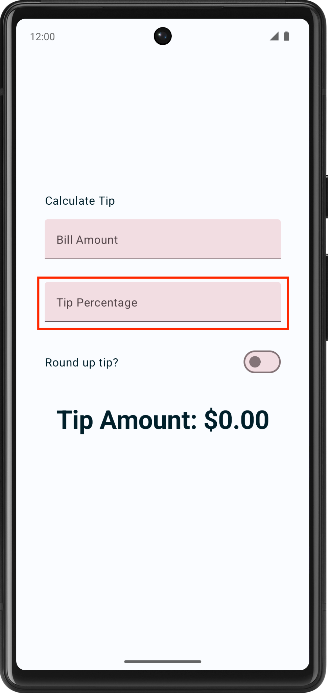

アプリにはすでに [**Bill Amount**] テキスト フィールド コンポーザブルがあります。これはステートレスな、`EditNumberField()` というコンポーズ可能な関数です。前のレッスンでは、`amountInput` の状態を `EditNumberField()` コンポーザブルから `TipTimeLayout()` コンポーザブルにホイスティングし、`EditNumberField()` コンポーザブルをステートレスにしました。

テキスト フィールドを追加するには、同じ `EditNumberField()` コンポーザブルを再利用しますが、別のラベルを使用します。この変更を行うには、ラベルをコンポーズ可能な関数 `EditNumberField()` 内でハードコードするのではなく、パラメータとして渡す必要があります。

コンポーズ可能な関数 `EditNumberField()` を再利用可能にします。

1. `MainActivity.kt` ファイルで、コンポーズ可能な関数 `EditNumberField()` のパラメータに `Int` 型の `label` 文字列リソースを追加します。

```kotlin
@Composable
fun EditNumberField(
    label: Int,
    value: String,
    onValueChanged: (String) -> Unit,
    modifier: Modifier = Modifier
)
```

> **注:**すべてのコンポーズ可能な関数にデフォルトの [`Modifier`](https://developer.android.com/reference/kotlin/androidx/compose/ui/Modifier) パラメータを指定して再利用性を高めることをおすすめします。必要なすべてのパラメータの後に、最初のオプション パラメータとして追加する必要があります。

2. 関数本体で、ハードコードされた文字列リソース ID を `label` パラメータに置き換えます。

```kotlin
@Composable
fun EditNumberField(
    //...
) {
     TextField(
         //...
         label = { Text(stringResource(label)) },
         //...
     )
}
```

3. `label` パラメータが文字列リソース参照であることを示すために、関数パラメータに `@StringRes` アノテーションを付けます。

```kotlin
@Composable
fun EditNumberField(
    @StringRes label: Int,
    value: String,
    onValueChanged: (String) -> Unit,
    modifier: Modifier = Modifier
) 
```

> **注:** `R.string.bill_amount` が文字列リソース参照の例です。

4. 以下をインポートします。

```kotlin
import androidx.annotation.StringRes
```

> **注:**`@StringRes` アノテーションは、文字列リソースを使用するタイプセーフな方法です。これは、渡される整数が `values/strings.xml` ファイルの文字列リソースであることを示します。こうしたアノテーションは、デベロッパーがコードの作業を行う場合や、Android Studio の [lint](https://developer.android.com/studio/write/lint) などのコード インスペクション ツールを利用する場合に便利です。lint については今後のレッスンで詳しく説明します。

5. コンポーズ可能な関数 `TipTimeLayout()` の `EditNumberField()` 関数呼び出しで、`label` パラメータを `R.string.bill_amount` 文字列リソースに設定します。

```kotlin
EditNumberField(
    label = R.string.bill_amount,
    value = amountInput,
    onValueChanged = { amountInput = it },
    modifier = Modifier.padding(bottom = 32.dp).fillMaxWidth()
)
```

6. [**Preview**] ペインに視覚的な変更はありません。

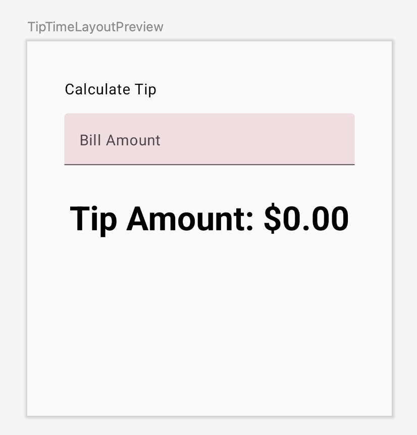

7. コンポーズ可能な関数 `TipTimeLayout()` で、`EditNumberField()` 関数呼び出しの後に、カスタムのチップ率用に別のテキスト フィールドを追加します。次のパラメータを使用して、コンポーズ可能な関数 `EditNumberField()` を呼び出します。

```kotlin
EditNumberField(
    label = R.string.how_was_the_service,
    value = "",
    onValueChanged = { },
    modifier = Modifier.padding(bottom = 32.dp).fillMaxWidth()
)
```

これで、カスタムのチップ率を入力する別のテキスト ボックスが追加されます。

8. 次の画像のように、アプリのプレビューに [**Tip Percentage**] テキスト フィールドが表示されるようになりました。

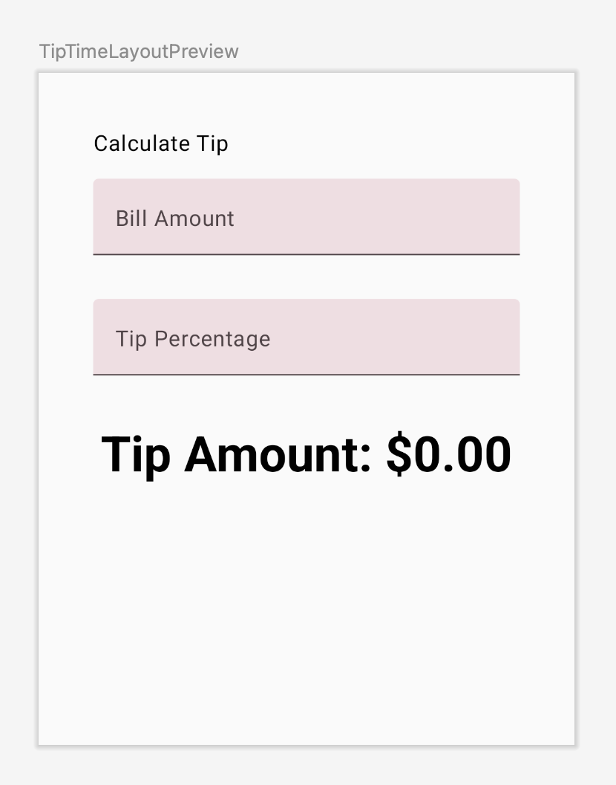

9. コンポーズ可能な関数 `TipTimeLayout()` の先頭に、追加したテキスト フィールドの状態変数用に `tipInput` という `var` プロパティを追加します。`mutableStateOf("")` を使用して変数を初期化し、`remember` 関数で呼び出しを囲みます。

```kotlin
var tipInput by remember { mutableStateOf("") }
```

10. 新しい `EditNumberField``()` 関数呼び出しで、名前付きパラメータ `value` を `tipInput` 変数に設定し、ラムダ式 `onValueChanged` の `tipInput` 変数を更新します。

```kotlin
EditNumberField(
    label = R.string.how_was_the_service,
    value = tipInput,
    onValueChanged = { tipInput = it },
    modifier = Modifier.padding(bottom = 32.dp).fillMaxWidth()
)
```

11. `TipTimeLayout()` 関数で、`tipInput` 変数の定義の後、`tipInput` 変数を `Double` 型に変換する `tipPercent` という `val` を定義します。エルビス演算子を使用して、値が `null` の場合に `0` を返します。テキスト フィールドが空の場合、この値は `null` になります。

```kotlin
val tipPercent = tipInput.toDoubleOrNull() ?: 0.0
```

12. `TipTimeLayout()` 関数で、`calculateTip()` 関数呼び出しを更新し、2 番目のパラメータとして `tipPercent` 変数を渡します。

```kotlin
val tip = calculateTip(amount, tipPercent)
```

`TipTimeLayout()` 関数のコードは次のコード スニペットのようになりました。

```kotlin
@Composable
fun TipTimeLayout() {
    var amountInput by remember { mutableStateOf("") }
    var tipInput by remember { mutableStateOf("") }
    val amount = amountInput.toDoubleOrNull() ?: 0.0
    val tipPercent = tipInput.toDoubleOrNull() ?: 0.0

    val tip = calculateTip(amount, tipPercent)
    Column(
        modifier = Modifier.padding(40.dp),
        horizontalAlignment = Alignment.CenterHorizontally,
        verticalArrangement = Arrangement.Center
    ) {
        Text(
            text = stringResource(R.string.calculate_tip),
            modifier = Modifier
                .padding(bottom = 16.dp)
                .align(alignment = Alignment.Start)
        )
        EditNumberField(
            label = R.string.bill_amount,
            value = amountInput,
            onValueChanged = { amountInput = it },
            modifier = Modifier
                .padding(bottom = 32.dp)
                .fillMaxWidth()
        )
        EditNumberField(
            label = R.string.how_was_the_service,
            value = tipInput,
            onValueChanged = { tipInput = it },
            modifier = Modifier
                .padding(bottom = 32.dp)
                .fillMaxWidth()
        )
        Text(
            text = stringResource(R.string.tip_amount, tip),
            style = MaterialTheme.typography.displaySmall
        )
        Spacer(modifier = Modifier.height(150.dp))
    }
}
```

13. エミュレータまたはデバイスでアプリを実行し、請求額とチップ率を入力します。チップ金額は正しく計算されていますか。

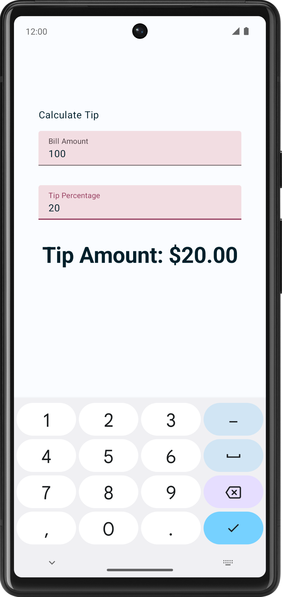

### 5. アクション ボタンを設定する

前のレッスンでは、`KeyboardOptions` クラスを使用してキーボードのタイプを設定する方法について説明しました。このセクションでは、同じ `KeyboardOptions` を使用してキーボード アクション ボタンを設定する方法について説明します。キーボード アクション ボタンは、キーボードの末端にあるボタンです。次の表に例を示します。

| **プロパティ** | **キーボード アクション ボタン** |
|---|---|
| [`ImeAction.Search`](https://developer.android.com/reference/kotlin/androidx/compose/ui/text/input/ImeAction#Search())   ユーザーが検索を行うときに使用します。 | 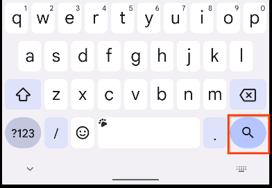 |
| [`ImeAction.Send`](https://developer.android.com/reference/kotlin/androidx/compose/ui/text/input/ImeAction#Send())   ユーザーが入力フィールドでテキストを送信するときに使用します。 | 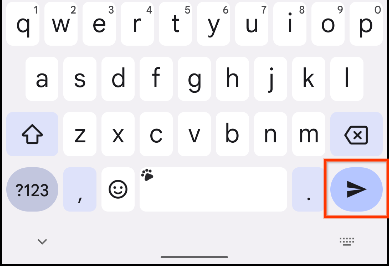 |
| [`ImeAction.Go`](https://developer.android.com/reference/kotlin/androidx/compose/ui/text/input/ImeAction#Go())   ユーザーが入力テキストのターゲットに移動するときに使用します。 | 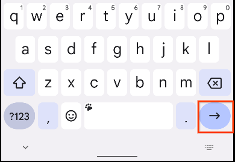 |

このタスクでは、テキスト ボックスのアクション ボタンを 2 種類設定します。

- [**Bill Amount**] テキスト ボックスの **Next** アクション ボタン。ユーザーが現在の入力を完了し、次のテキスト ボックスに移動することを示します。
- [**Tip Percentage**] テキスト ボックスの **Done** アクション ボタン。ユーザーが所定の入力を終了したことを示します。

これらのアクション ボタンを備えたキーボードの例を次の画像に示します。

| 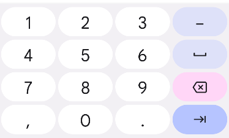 | 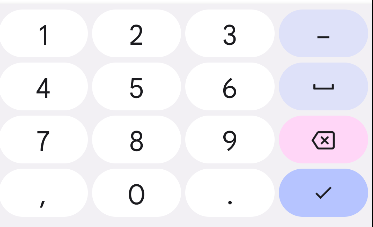 |
|---|---|

キーボード オプションを追加します。

1. `EditNumberField()` 関数の `TextField()` 関数呼び出しで、`ImeAction.Next` 値に設定した `imeAction` 名前付き引数を `KeyboardOptions` コンストラクタに渡します。[`KeyboardOptions.Default.copy()`](https://developer.android.com/reference/kotlin/androidx/compose/foundation/text/KeyboardOptions#copy(androidx.compose.ui.text.input.KeyboardCapitalization,kotlin.Boolean,androidx.compose.ui.text.input.KeyboardType,androidx.compose.ui.text.input.ImeAction)) 関数を使用して、他のデフォルト オプションを指定します。

```kotlin
import androidx.compose.ui.text.input.ImeAction

@Composable
fun EditNumberField(
    //...
) {
    TextField(
        //...
        keyboardOptions = KeyboardOptions.Default.copy(
            keyboardType = KeyboardType.Number,
            imeAction = ImeAction.Next
        )
    )
}
```

2. エミュレータまたはデバイスでアプリを実行します。次の画像のように、キーボードに **Next** アクション ボタンが表示されるようになりました。


[**Tip Percentage**] テキスト フィールドが選択されている場合、キーボードには同じ [**Next**] アクション ボタンが表示されます。しかし、テキスト フィールドにはアクション ボタンが 2 種類必要です。この問題はすぐに修正できます。

3. `EditNumberField()` 関数を調べます。`TextField()` 関数の `keyboardOptions` パラメータはハードコードされています。テキスト フィールド用に種々のアクション ボタンを作成するには、`KeyboardOptions` オブジェクトを引数として渡す必要があります。これは次のステップで行います。

```kotlin
// No need to copy, just examine the code.
fun EditNumberField(
    @StringRes label: Int,
    value: String,
    onValueChanged: (String) -> Unit,
    modifier: Modifier = Modifier
) {
    TextField(
        //...
        keyboardOptions = KeyboardOptions.Default.copy(
           keyboardType = KeyboardType.Number,
           imeAction = ImeAction.Next
        )
    )
}
```

4. `EditNumberField()` 関数定義に、`KeyboardOptions` 型の `keyboardOptions` パラメータを追加します。関数本体で、これを `TextField()` 関数の `keyboardOptions` 名前付きパラメータに代入します。

```kotlin
@Composable
fun EditNumberField(
    @StringRes label: Int,
    keyboardOptions: KeyboardOptions,
    // ...
){
    TextField(
        //...
        keyboardOptions = keyboardOptions
    )
}
```

5. `TipTimeLayout()` 関数で、最初の `EditNumberField()` 関数呼び出しを更新し、[**Bill Amount**] テキスト フィールドの `keyboardOptions` 名前付きパラメータを渡します。

```kotlin
EditNumberField(
    label = R.string.bill_amount,
    keyboardOptions = KeyboardOptions.Default.copy(
        keyboardType = KeyboardType.Number,
        imeAction = ImeAction.Next
    ),
    // ...
)
```

6. 2 番目の `EditNumberField()` 関数呼び出しで、[**Tip Percentage**] テキスト フィールドの `imeAction` を `ImeAction.Done` に変更します。関数は次のコード スニペットのようになります。

```kotlin
EditNumberField(
    label = R.string.how_was_the_service,
    keyboardOptions = KeyboardOptions.Default.copy(
        keyboardType = KeyboardType.Number,
        imeAction = ImeAction.Done
    ),
    // ...
)
```

7. アプリを実行します。次の画像のように、**Next** と **Done** のアクション ボタンが表示されます。

|  | 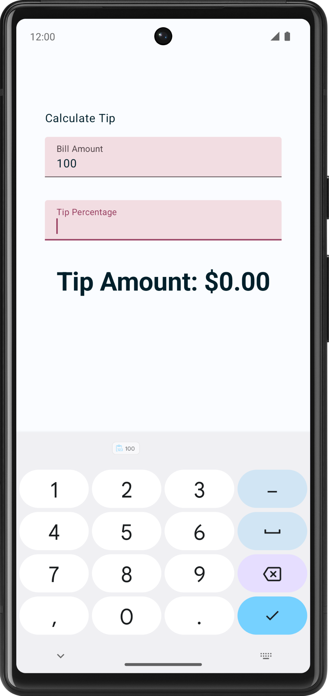 |
|---|---|

8. 請求額を入力して **Next** アクション ボタンをクリックします。次にチップ率を入力し、**Done** アクション ボタンをクリックします。キーパッドが閉じます。

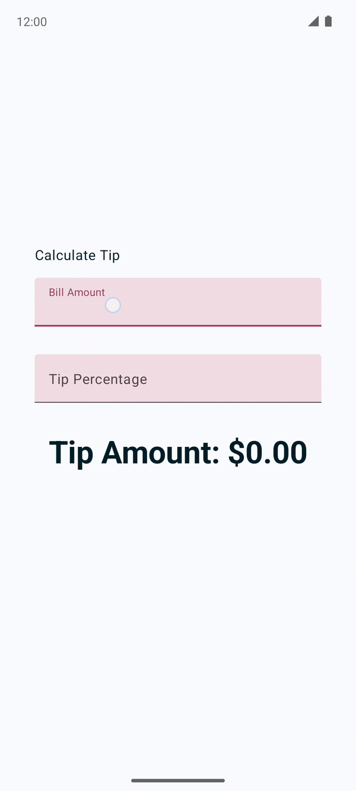

### 6. スイッチを追加する

スイッチは、1 つのアイテムの状態をオンまたはオフに切り替えます。

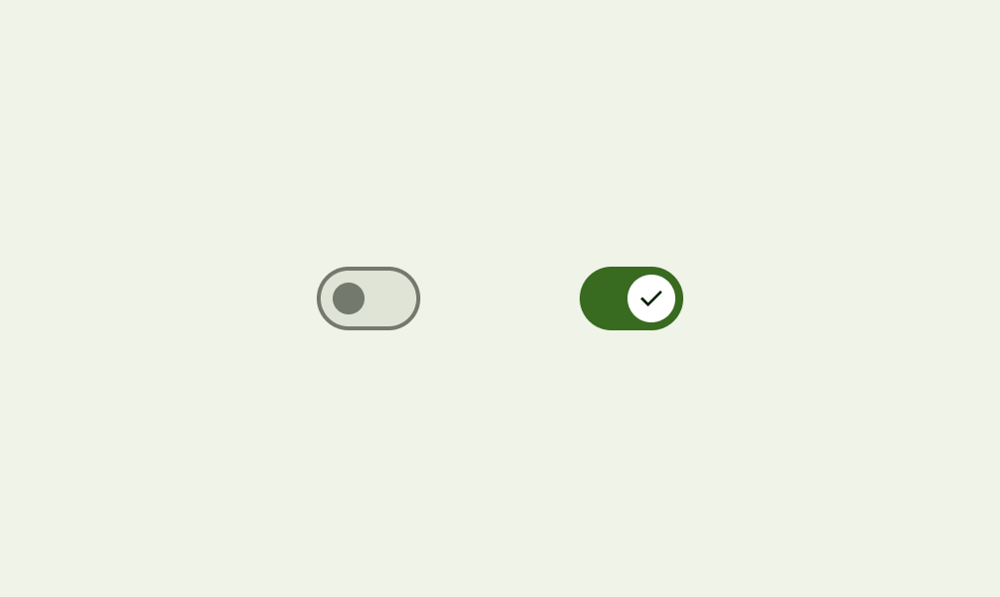

切り替えボタンには 2 つの状態があり、ユーザーは 2 つのオプションのいずれかを選択できます。切り替えボタンは、次の画像のように、トラック、つまみ、オプションのアイコンで構成されています。

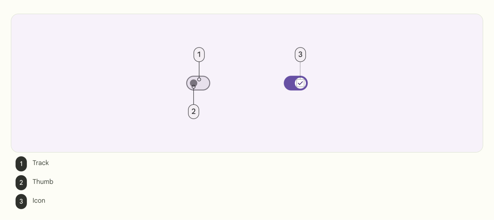

スイッチは、次の画像のように、決定内容の入力や設定の宣言に使用できる選択コントロールです。

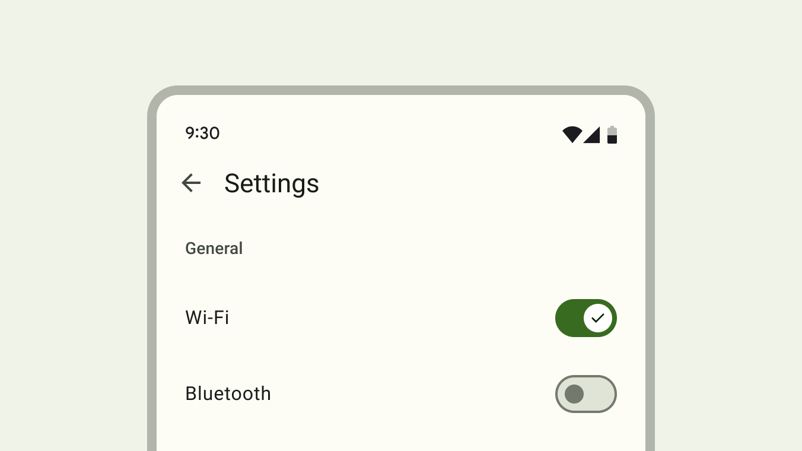

ユーザーは、つまみを前後にドラッグしてオプションを選択するか、単にスイッチをタップして切り替えます。別の切り替え例として、次の GIF ではビジュアル オプションの設定を**ダークモード**に切り替えています。

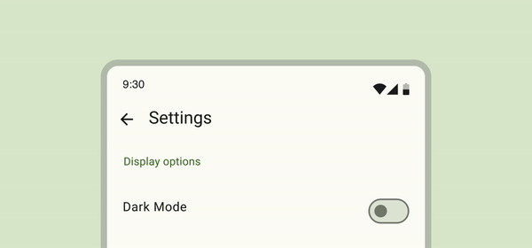

スイッチについて詳しくは、[スイッチ](https://m3.material.io/components/switch/overview)のドキュメントをご覧ください。

次の画像のように、`Switch` コンポーザブルを使用して、チップを最も近い整数に切り上げるかどうかを選択できるようにします。

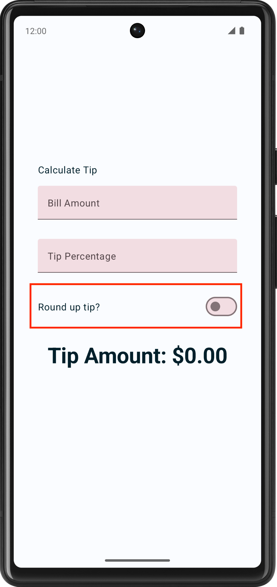

`Text` コンポーザブルと `Switch` コンポーザブルの行を追加します。

1. `EditNumberField()` 関数の後にコンポーズ可能な関数 `RoundTheTipRow()` を追加し、`EditNumberField()` 関数と同様の引数としてデフォルトの `Modifier` を渡します。

```kotlin
@Composable
fun RoundTheTipRow(modifier: Modifier = Modifier) {
}
```

2. `RoundTheTipRow()` 関数を実装し、次の `modifier` を使用して `Row` レイアウト コンポーザブルを追加します。子要素の幅を画面上の最大値に設定し、中央に配置して、サイズを `48dp` にします。

```kotlin
Row(
   modifier = modifier
       .fillMaxWidth()
       .size(48.dp),
   verticalAlignment = Alignment.CenterVertically
) {
}
```

3. 以下をインポートします。

```kotlin
import androidx.compose.foundation.layout.Row
import androidx.compose.foundation.layout.size
```

4. `Row` レイアウト コンポーザブルのラムダブロックに、`R.string.round_up_tip` 文字列リソースを使用して `Round up tip?` 文字列を表示する `Text` コンポーザブルを追加します。

```kotlin
Text(text = stringResource(R.string.round_up_tip))
```

5. `Text` コンポーザブルの後に `Switch` コンポーザブルを追加します。`checked` 名前付きパラメータを `roundUp` に設定し、`onCheckedChange` 名前付きパラメータを `onRoundUpChanged` に設定して渡します。

```kotlin
Switch(
    checked = roundUp,
    onCheckedChange = onRoundUpChanged,
)
```

次の表に、`RoundTheTipRow()` 関数で定義したものと同じパラメータに関する情報が含まれています。

| **パラメータ** | **説明** |
|---|---|
| `checked` | スイッチがオンになっているかどうか。これは `Switch` コンポーザブルの状態です。 |
| `onCheckedChange` | スイッチがクリックされたときに呼び出されるコールバック。 |

6. 以下をインポートします。

```kotlin
import androidx.compose.material3.Switch
```

7. `RoundTheTipRow()` 関数に、`Boolean` 型の `roundUp` パラメータと、`Boolean` を受け取って何も返さない `onRoundUpChanged` ラムダ関数を追加します。

```kotlin
@Composable
fun RoundTheTipRow(
    roundUp: Boolean,
    onRoundUpChanged: (Boolean) -> Unit,
    modifier: Modifier = Modifier
)
```

これにより、スイッチの状態がホイスティングされます。

8. `Switch` コンポーザブルに、この `modifier` を追加して、`Switch` コンポーザブルを画面の末端に配置します。

```kotlin
       Switch(
           modifier = modifier
               .fillMaxWidth()
               .wrapContentWidth(Alignment.End),
           //...
       )
```

9. 以下をインポートします。

```kotlin
import androidx.compose.foundation.layout.wrapContentWidth
```

10. `TipTimeLayout()` 関数に、`Switch` コンポーザブルの状態の var 変数を追加します。`roundUp` という `var` 変数を作成して `mutableStateOf()` に設定し、初期値として `false` を設定します。呼び出しを `remember { }` で囲みます。

```kotlin
fun TipTimeLayout() {
    //...
    var roundUp by remember { mutableStateOf(false) }

    //...
    Column(
        ...
    ) {
      //...
   }
}
```

これは `Switch` コンポーザブルの状態の変数であり、false がデフォルトの状態になります。

11. `TipTimeLayout()` 関数の `Column` ブロック内（[**Tip Percentage**] テキスト フィールドの後）。次の引数を持つ `RoundTheTipRow()` 関数を呼び出します。`roundUp` に設定された名前付きパラメータ `roundUp`、`roundUp` 値を更新するラムダ コールバックに設定された `onRoundUpChanged` 名前付きパラメータ。

```kotlin
@Composable
fun TipTimeLayout() {
    //...

    Column(
        ...
    ) {
        Text(
            ...
        )
        Spacer(...)
        EditNumberField(
            ...
        )
        EditNumberField(
            ...
        )
        RoundTheTipRow(
             roundUp = roundUp,
             onRoundUpChanged = { roundUp = it },
             modifier = Modifier.padding(bottom = 32.dp)
         )
        Text(
            ...
        )
    }
}
```

[**Round up tip?**] 行が表示されます。

12. アプリを実行します。アプリに [**Round up tip?**] の切り替えが表示されます。

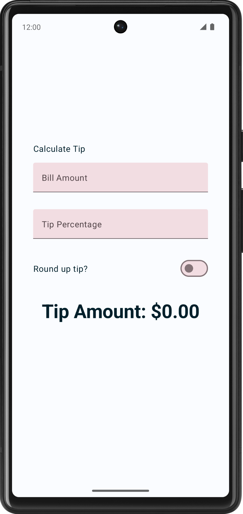

13. 請求額とチップ率を入力し、[**Round up tip?**] の切り替えを選択します。チップの金額は四捨五入されませんが、これはまだ `calculateTip()` 関数を更新する必要があるためです（次のセクションで行います）。

#### チップを四捨五入するように `calculateTip()` 関数を更新する

`Boolean` 変数を受け入れてチップを最も近い整数に[切り上げる](https://www.collinsdictionary.com/us/dictionary/english/round-up#:~:text=If%20you%20round%20an%20amount,or%20tip%20up%20to%2010%25.)ように、`calculateTip()` 関数を変更します。

1. チップを切り上げるには、`calculateTip()` 関数がスイッチの状態（`Boolean`）を把握する必要があります。`calculateTip()` 関数に、`Boolean` 型の `roundUp` パラメータを追加します。

```kotlin
private fun calculateTip(
    amount: Double,
    tipPercent: Double = 15.0,
    roundUp: Boolean
): String { 
    //...
}
```

2. `calculateTip()` 関数の `return` ステートメントの前に、`roundUp` の値をチェックする `if()` 条件を追加します。`roundUp` が `true` であれば、`tip` 変数を定義して `kotlin.math.``ceil``()` 関数に設定し、引数として関数 `tip` を渡します。

```kotlin
if (roundUp) {
    tip = kotlin.math.ceil(tip)
}
```

> **警告:** Android Studio に `val cannot be reassigned` エラーが表示されます。`tip` 変数を `var` 変数に変更する必要があります。
> 
> `var tip = tipPercent / 100 * amount`

> **注:**[`kotlin.math.ceil(x)`](https://kotlinlang.org/api/latest/jvm/stdlib/kotlin.math/ceil.html) 関数は、所定の整数値を切り上げます。たとえば、10.65 を四捨五入して 11.00 にします。この関数は、`Double` または `Float` の数値を受け取ることができます。

完成した `calculateTip()` 関数は次のコード スニペットのようになります。

```kotlin
private fun calculateTip(amount: Double, tipPercent: Double = 15.0, roundUp: Boolean): String {
    var tip = tipPercent / 100 * amount
    if (roundUp) {
        tip = kotlin.math.ceil(tip)
    }
    return NumberFormat.getCurrencyInstance().format(tip)
}
```

3. `TipTimeLayout()` 関数で、`calculateTip()` 関数呼び出しを更新し、`roundUp` パラメータを渡します。

```kotlin
val tip = calculateTip(amount, tipPercent, roundUp)
```

4. アプリを実行します。次の画像のように、チップ金額が切り上げられるようになりました。

| 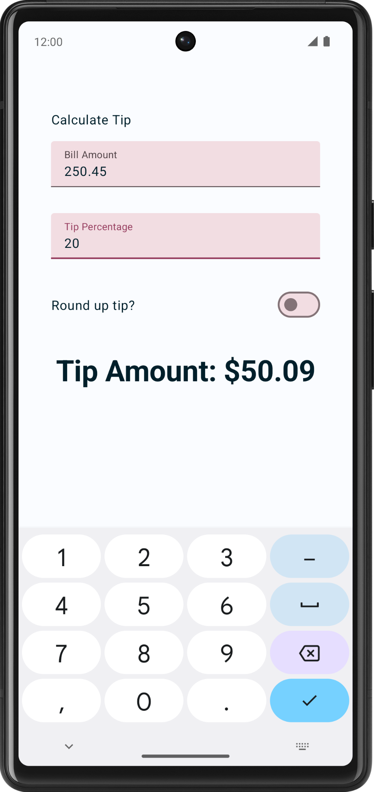 | 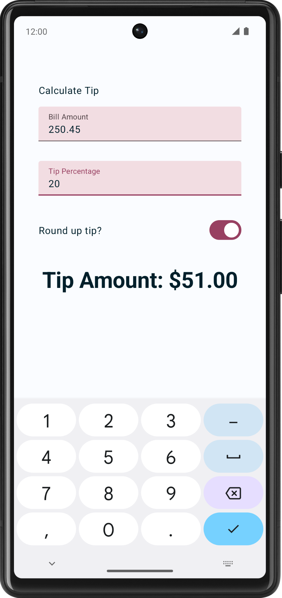 |
|---|---|

### 7. 横向きのサポートを追加する

Android デバイスには、スマートフォン、タブレット、折りたたみ式デバイス、ChromeOS デバイスなど、さまざまなフォーム ファクタがあり、広範な画面サイズが用意されています。アプリは、縦向きと横向きの両方をサポートする必要があります。

1. アプリを横向きでテストし、自動回転をオンにします。

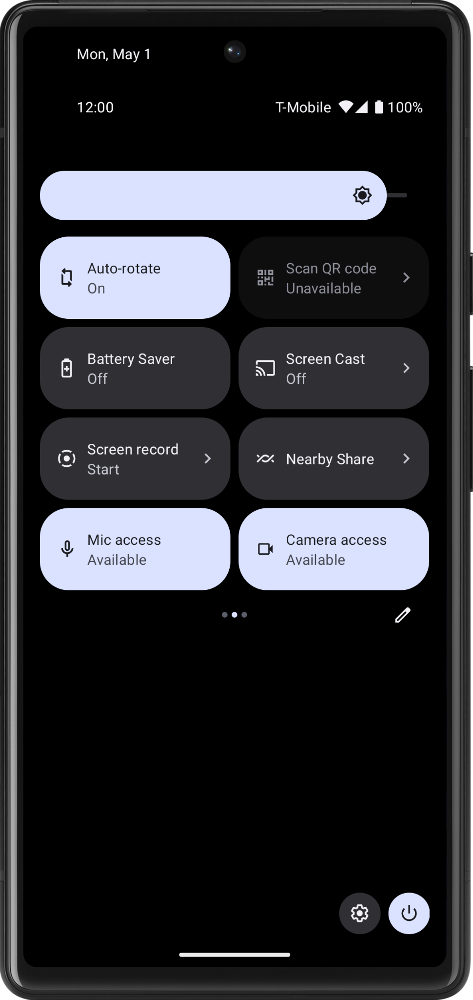

2. エミュレータまたはデバイスを左に回転させると、チップの金額が表示されません。この問題を解決するには、アプリ画面をスクロールできる縦方向のスクロールバーが必要です。

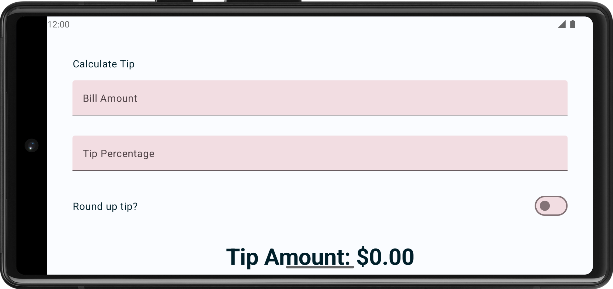

3. 修飾子に `.verticalScroll(rememberScrollState())` を追加して、列を縦方向にスクロールできるようにします。`rememberScrollState()` はスクロール状態を作成し、自動的に記憶します。

```kotlin
@Composable
fun TipTimeLayout() {
    // ...
    Column(
        modifier = Modifier
            .padding(40.dp)
            .verticalScroll(rememberScrollState()),
        horizontalAlignment = Alignment.CenterHorizontally,
        verticalArrangement = Arrangement.Center
    ) {
        //...
    }
}
```

4. 以下をインポートします。

```kotlin
import androidx.compose.foundation.rememberScrollState
import androidx.compose.foundation.verticalScroll
```

5. アプリを再度実行します。横表示でスクロールしてみましょう。

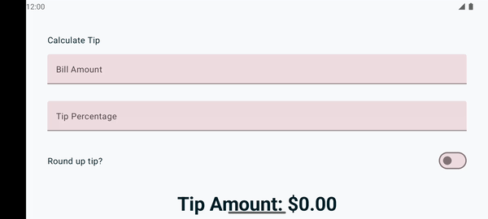

### 8. テキスト フィールドに先頭のアイコンを追加する（省略可）

アイコンを使用すると、テキスト フィールドをより視覚的にアピールし、テキスト フィールドに関する追加情報を提供できます。想定されるデータの種類や必要な入力の種類など、テキスト フィールドの目的をアイコンで示すことができます。たとえば、テキスト フィールドの横にある電話のアイコンは、ユーザーが電話番号を入力することが期待されていることを示します。

アイコンを使用して、ユーザーに期待する内容を視覚的に伝えることで入力を促すことができます。たとえば、テキスト フィールドの横にあるカレンダー アイコンは、ユーザーが日付を入力することが期待されていることを示します。

以下に、検索キーワードを入力することを示す検索アイコンを含むテキスト フィールドの例を示します。

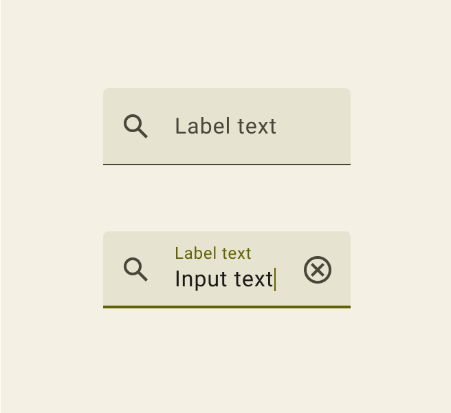

`EditNumberField()` コンポーザブルに、`Int` 型の `leadingIcon` という別のパラメータを追加します。`@DrawableRes` でアノテーションを付けます。

```kotlin
@Composable
fun EditNumberField(
    @StringRes label: Int,
    @DrawableRes leadingIcon: Int,
    keyboardOptions: KeyboardOptions,
    value: String,
    onValueChanged: (String) -> Unit,
    modifier: Modifier = Modifier
) 
```

1. 以下をインポートします。

```kotlin
import androidx.annotation.DrawableRes
import androidx.compose.material3.Icon
```

2. テキスト フィールドに先頭のアイコンを追加します。`leadingIcon` はコンポーザブルを受け取り、次の `Icon` コンポーザブルを渡します。

```kotlin
TextField(
    value = value,
    leadingIcon = { Icon(painter = painterResource(id = leadingIcon), null) },
    //...
)
```

3. 先頭のアイコンをテキスト フィールドに渡します。便宜上、アイコンはすでにスターター コード内にあります。

```kotlin
EditNumberField(
    label = R.string.bill_amount,
    leadingIcon = R.drawable.money,
    // Other arguments
)
EditNumberField(
    label = R.string.how_was_the_service,
    leadingIcon = R.drawable.percent,
    // Other arguments
)
```

4. アプリを実行します。

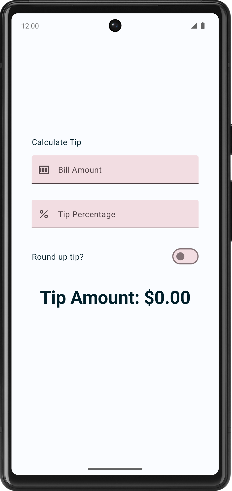

お疲れさまでした。これで、アプリでカスタムのチップ金額を計算できるようになりました。

### 9. 解答コードを取得する

このレッスンの完成したコードをダウンロードするには、次の git コマンドを使用します。

```
$ git clone https://github.com/google-developer-training/basic-android-kotlin-compose-training-tip-calculator.git
```

または、リポジトリを ZIP ファイルとしてダウンロードし、Android Studio で開くこともできます。

> **注:**解答コードは、ダウンロードしたリポジトリの `main` ブランチにあります。

解答コードを確認する場合は、[GitHub で表示します](https://github.com/google-developer-training/basic-android-kotlin-compose-training-tip-calculator/tree/main)。

### 10. まとめ

お疲れさまでした。Tip Time アプリにカスタムのチップ機能を追加しました。このアプリでは、ユーザーがカスタムのチップ率を入力し、チップの金額を切り上げられるようになりました。#AndroidBasics を付けて、ソーシャル メディアで共有しましょう。

#### **詳細**

- [テキスト フィールド – マテリアル デザイン 3](https://m3.material.io/components/text-fields/guidelines#5c8a5f07-b1a5-455f-bf76-7ff0d724f6b0)
- [スイッチ – マテリアル デザイン 3](https://m3.material.io/components/switch/overview)

## 5. 自動テストを作成する

### 1. 始める前に

このレッスンでは、Android の自動テストの概要と、自動テストを使用してスケーラブルで堅牢なアプリを作成する方法を学習します。また、UI ロジックとビジネス ロジックの違いを理解し、両方のロジックをテストする方法を習得します。最後に、Android Studio で自動テストを作成して実行する方法を学習します。

#### 前提条件

- 関数とコンポーザブルを使用して Android アプリを作成する能力。

#### **学習内容**

- Android の自動テストの概要
- 自動テストが重要である理由
- ローカルテストの概要と用途
- インストルメンテーション テストの概要と用途
- Android コード用のローカルテストを作成する方法
- Android アプリ用のインストルメンテーション テストを作成する方法
- 自動テストを実行する方法

#### **作成するアプリの概要**

- ローカルテスト
- インストルメンテーション テスト

#### **必要なもの**

- [Android Studio](https://developer.android.com/studio) の最新バージョン
- Tip Time アプリの解答コード

### 2. スターター コードを取得する

コードをダウンロードします。

または、GitHub リポジトリのクローンを作成してコードを入手することもできます。

```
$ git clone https://github.com/google-developer-training/basic-android-kotlin-compose-training-tip-calculator.git
$ cd basic-android-kotlin-compose-training-tip-calculator
$ git checkout main
```

> **注:**スターター コードは、ダウンロードしたリポジトリの `main` ブランチにあります。

### 3. 自動テスト

ソフトウェアのテストとは、ソフトウェアが想定どおりに動作することをチェックする体系的な方法です。自動テストとは、作成したコードの別の部分が正しく動作することを確認するためのコードです。

テストは、アプリの開発における重要なプロセスです。アプリに対して一貫性のあるテストを実施することで、アプリの公開前に、その正確性、機能の動作、使いやすさを検証できます。

テストでは、変更が導入されるたびに既存のコードを継続的にチェックすることもできます。

手動テストはほぼ常に実施されていますが、Android でのテストは多くの場合、自動化が可能です。コースの残り全体を通して、アプリコードとアプリ自体の機能要件をテストする自動テストに焦点を当てます。このレッスンでは、Android でのテストの基本について説明します。後のレッスンでは、Android アプリをテストするためのより高度な方法を学びます。

Android 開発と Android アプリのテストに慣れてきたら、日頃からアプリのコードとともにテストを作成することをおすすめします。アプリに新しい機能を追加するたびにテストを作成することで、以降のアプリの拡張に伴うワークロードを削減できます。また、手動によるアプリのテストにあまり時間をかけずに、アプリが適切に動作することを簡単に確認できます。

自動テストはすべてのソフトウェア開発に不可欠な要素であり、Android 開発も例外ではありません。したがって、今すぐ自動テストを導入することをおすすめします。

#### **自動テストが重要である理由**

最初は、自分のアプリにテストはあまり必要ないように思われるかもしれませんが、アプリのサイズと複雑さにかかわらず、テストは必要です。

コードベースを拡張するには、新しい要素を追加するたびに、既存の機能をテストする必要があります。ただし、これは、既存のテストがある場合にのみ可能です。アプリのサイズが大きくなると、手動テストでは自動テストよりはるかに多くの労力が必要になります。さらに、本番環境でのアプリの開発が始まったら、大規模なユーザーベースが存在する場合は、テストが必要不可欠になります。たとえば、Android の多くの異なるバージョンを搭載したさまざまな種類のデバイスについて考慮しなければなりません。

規模が大きくなると、最終的には、手動テストより自動テストの方が大幅に速く使用シナリオの大部分をカバーできるようになります。新しいコードをリリースする前にテストを実施すると、既存のコードに変更を加えて、予期しない動作をするアプリがリリースされることを防止できます。

自動テストは、人がデバイスを直接操作して実施する手動テストとは対照的に、ソフトウェアを通じて実行されるテストであることに留意してください。自動テストと手動テストは、ユーザーがプロダクトを快適に利用できるようにするために重要な役割を果たします。ただし、自動テストの方が正確であり、チームの生産性を最適化できます。これは、人が実行する必要がなく、手動テストよりもはるかに速く実行できるためです。

#### **自動テストの種類**

##### ローカルテスト

ローカルテストは自動テストの一種であり、コードの小規模な一部を直接テストして、その部分が適切に機能するかどうかを確認するものです。ローカルテストでは、関数、クラス、プロパティをテストできます。ローカルテストはワークステーションで実行されます。つまり、デバイスやエミュレータを必要とすることなく、開発環境で実行されます。簡単に言うと、ローカルテストは個人のパソコンで実行できます。また、コンピュータ リソースのオーバーヘッドが非常に少ないため、限られたリソースでも高速で実行できます。Android Studio は、ローカルテストを自動的に実行する機能を備えています。

##### **インストルメンテーション テスト**

Android 開発の場合、インストルメンテーション テストは UI テストです。インストルメンテーション テストでは、Android API と、そのプラットフォームの API およびサービスに依存するアプリの要素をテストできます。

ローカルテストと異なり、UI テストではアプリの全体または一部を起動し、ユーザー操作をシミュレートして、アプリが適切に反応するかどうかをチェックします。このプログラム全体を通して、UI テストは物理デバイスまたはエミュレータで実行します。

Android でインストルメンテーション テストを実行する場合、通常の Android アプリと同様に、テストコードは固有の Android Application Package（APK）に実際に組み込まれます。APK は、すべてのコードと、デバイスまたはエミュレータでアプリを実行するために必要なすべてのファイルを含む圧縮ファイルです。テスト APK は、通常のアプリ APK とともに、デバイスまたはエミュレータにインストールされます。テスト APK はアプリ APK に対してテストを実行します。

### 4. ローカルテストを作成する

#### **アプリコードを準備する**

ローカルテストでは、アプリコードからメソッドを直接テストするので、テストクラスとテストメソッドからテスト対象のメソッドにアクセスできることが必要です。次のコード スニペットのローカルテストでは、`calculateTip()` メソッドが正しく動作するかどうかを確認しますが、`calculateTip()` メソッドは現在 `private` であるため、テストからアクセスできません。`private` の指定を削除し、`internal` にします。

**`MainActivity.kt`**

```kotlin
internal fun calculateTip(amount: Double, tipPercent: Double = 15.0, roundUp: Boolean): String {
    var tip = tipPercent / 100 * amount
    if (roundUp) {
        tip = kotlin.math.ceil(tip)
    }
    return NumberFormat.getCurrencyInstance().format(tip)
}
```

- `MainActivity.kt` ファイルの `calculateTip()` メソッドの前の行に、`@VisibleForTesting` アノテーションを追加します。

```kotlin
@VisibleForTesting
internal fun calculateTip(amount: Double, tipPercent: Double = 15.0, roundUp: Boolean): String {
    var tip = tipPercent / 100 * amount
    if (roundUp) {
        tip = kotlin.math.ceil(tip)
    }
    return NumberFormat.getCurrencyInstance().format(tip)
}
```

これによりメソッドはパブリックになりますが、テスト目的でのみパブリックになっていることが他の開発者に示されます。

#### テスト ディレクトリを作成する

Android プロジェクトでは、`test` ディレクトリにローカルテストが作成されます。

**test** ディレクトリを作成します。

1. [**Project**] タブで、ビューを [Project] に変更します。

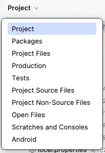

2. **src** ディレクトリを右クリックします。

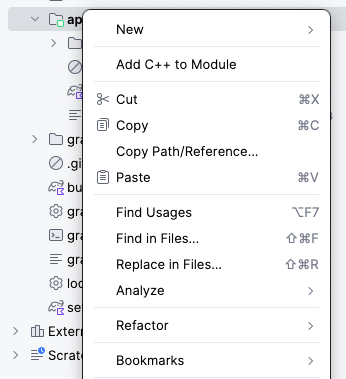

3. [**New**] > [**Directory**] を選択します。

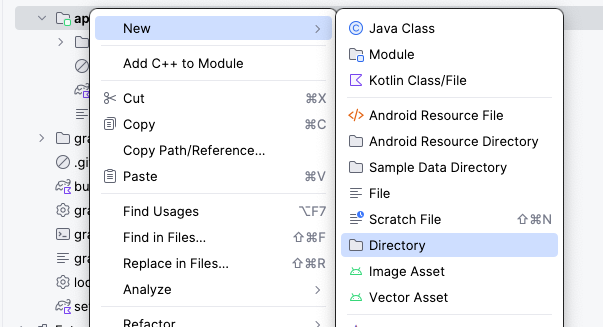

4. [**New Directory**] ウィンドウで [**test/java**] を選択します。

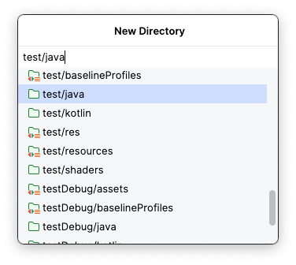

5. キーボードで **Return** キーまたは **Enter** キーを押します。[**Project**] タブに **test** ディレクトリが表示されます。

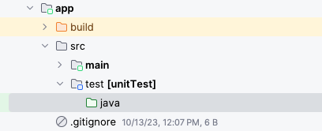

**test** ディレクトリのパッケージ構造は、アプリコードが配置されている `main` ディレクトリと同じにする必要があります。つまり、アプリコードが **main > java > com > example > tiptime** パッケージに作成されている場合、ローカルテストは **test > java > com > example > tiptime** に作成されるようにします。

このパッケージ構造を **test** ディレクトリに作成します。

1. **test/java** ディレクトリを右クリックし、**[New] > [Package]** を選択します。

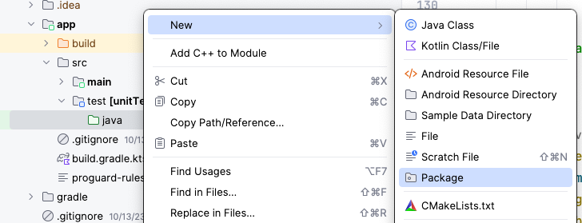

2. [**New Package**] ウィンドウに「`com.example.tiptime`」と入力します。

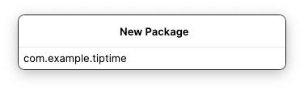

#### **テストクラスを作成する**

**test** パッケージの準備が整ったので、テストを作成します。まず、テストクラスを作成します。

1. [**Project**] タブで、**[app] > [src] > [test]** をクリックし、`test` ディレクトリの横にある展開矢印  をクリックします。
2. **`com.example.tiptime`** ディレクトリを右クリックして、**[New] > [Kotlin Class/File]** を選択します。

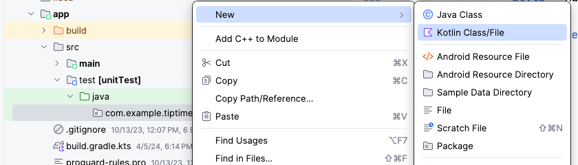

3. クラス名として「`TipCalculatorTests`」と入力します。

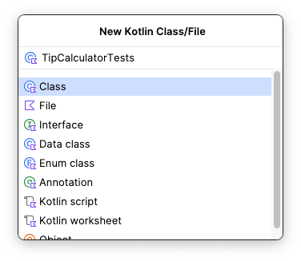

#### **テストを作成する**

前述のように、ローカルテストはアプリ内の小規模なコードをテストするために使用します。Tip Time アプリのメインの機能はチップの計算であるため、チップ計算ロジックが正しく動作するかどうかを確認するローカルテストが必要です。

そのためには、アプリコードと同様に、`calculateTip()` 関数を直接呼び出す必要があります。次に、関数によって返された値が、関数に渡した値から期待される値と一致するかどうかを確認します。

自動テストを作成するにあたり、知っておくべきことがいくつかあります。ローカルテストとインストルメンテーション テストの両方に当てはまるコンセプトのリストを以下に示します。最初は抽象的に思えるかもしれませんが、このレッスンを終える頃にはよく理解できるはずです。

- メソッドの形式で自動テストを記述します。
- メソッドに `@Test` アノテーションを付けます。これにより、コンパイラはメソッドがテストメソッドであることを認識し、そのメソッドをテストとして実行します。

> **注**: `@Test` アノテーションは、`import org.junit.Test` インポート ステートメントにより、`org.junit.Test` パッケージからインポートされます。

- 何をテストするか、どのような結果が期待されるかを明確に示す名前であることを確認します。
- テストメソッドでは、通常のアプリメソッドのようなロジックは使用しません。何かを実装する方法を気にする必要はありません。特定の入力から期待される出力を厳密にチェックします。言い換えると、テストメソッドは、アプリの UI またはロジックが正しく動作することをアサートする命令のセットのみを実行します。これがどういう意味かは後でわかるので、まだ理解できなくてもかまいません。今のところは、テストコードは見慣れたアプリコードとはかなり異なるということだけを覚えておいてください。
- 一般的に、テストはアサーションで終了します。アサーションは、特定の条件が満たされたことを確認するために使用されます。アサーションは、名前に assert が含まれるメソッド呼び出しの形式で行われます。たとえば、Android のテストでは `assertTrue()` アサーションがよく使用されます。アサーション ステートメントはほとんどのテストで使用されますが、実際のアプリコードではめったに使用されません。

テストを作成します。

1. 10 ドルの請求額に対する 20% のチップ計算をテストするメソッドを作成します。この計算の期待される結果は 2 ドルです。

```kotlin
import org.junit.Test

class TipCalculatorTests {

   @Test
   fun calculateTip_20PercentNoRoundup() {
       
   }
}
```

アプリコードの `MainActivity.kt` ファイルの `calculateTip()` メソッドには、3 つのパラメータが必要でした。それは、請求額、チップの割合、計算結果を四捨五入するかどうかを示すフラグです。

```kotlin
fun calculateTip(amount: Double, tipPercent: Double, roundUp: Boolean)
```

テストからこのメソッドを呼び出すときは、アプリコード内でこのメソッドを呼び出すときと同様に、これらのパラメータを渡す必要があります。

2. `calculateTip_20PercentNoRoundup()` メソッド内で、次の 2 つの定数変数を作成します。`10.00` の値に設定された `amount` 変数と、`20.00` の値に設定された `tipPercent` 変数。

```kotlin
val amount = 10.00
val tipPercent = 20.00
```

3. アプリコードの `MainActivity.kt` ファイルで、以下のコードを確認します。チップの金額は、デバイスのロケールに基づいて書式設定されます。

**`MainActivity.kt`**

```kotlin
...
NumberFormat.getCurrencyInstance().format(tip)
...
```

テストで予想されるチップ金額を確認するときは、同じフォーマットを使用する必要があります。

4. `NumberFormat.getCurrencyInstance().format(2)` に設定された `expectedTip` 変数を作成します。

`expectedTip` 変数は、後で `calculateTip()` メソッドの結果と比較されます。テストでは、このメソッドが正しく動作することを確認します。最後のステップでは、`amount` 変数の値を `10.00` に設定し、`tipPercent` 変数の値を `20.00` に設定します。10 の 20% は 2 であるため、`expectedTip` 変数は値が `2` のフォーマットされた通貨に設定されます。`calculateTip()` メソッドはフォーマットされた `String` 値を返すことを思い出してください。

5. `amount` 変数と `tipPercent` 変数を指定して `calculateTip()` メソッドを呼び出し、端数の切り上げに関する `false` 引数を渡します。

この例では、期待される結果に端数が含まれないので、切り上げを気にする必要はありません。

6. メソッド呼び出しの結果を `actualTip` 定数変数に格納します。

これまでのところ、このテストの作成は、アプリコード内の通常のメソッドの作成と大きな違いはありません。ただし、テスト対象のメソッドからの戻り値があるため、アサーションを使用してその値が正しいかどうかを判定する必要があります。

一般的に、アサーションの作成は自動テストの最終目標です。アサーションは、アプリコードではほとんど使用されません。この例では、`actualTip` 変数が `expectedTip` 変数と等しいことを確認します。そのためには、`JUnit` ライブラリの `assertEquals()` メソッドを使用できます。

`assertEquals()` メソッドは、2 つのパラメータ（期待される値と実際の値）を受け取ります。それらの値が等しければ、アサーションとテストは合格です。等しくなければ、アサーションとテストは失敗です。

7. この `assertEquals()` メソッドを呼び出し、パラメータとして `expectedTip` 変数と `actualTip` 変数を渡します。

```kotlin
import org.junit.Assert.assertEquals
import org.junit.Test
import java.text.NumberFormat

class TipCalculatorTests {

    @Test
    fun calculateTip_20PercentNoRoundup() {
        val amount = 10.00
        val tipPercent = 20.00
        val expectedTip = NumberFormat.getCurrencyInstance().format(2)
        val actualTip = calculateTip(amount = amount, tipPercent = tipPercent, false)
        assertEquals(expectedTip, actualTip)
    }
}
```

> **注**: `JUnit` ライブラリには多くのアサーションがあります。よく使用されるアサーションは次のとおりです。
> 
> - `assertEquals()`
> - `assertNotEquals()`
> - `assertTrue()`
> - `assertFalse()`
> - `assertNull()`
> - `assertNotNull()`
> - `assertThat()`
> 
> 詳しくは、[Assert](https://developer.android.com/reference/junit/framework/Assert) をご覧ください。

#### **テストを実行する**

いよいよテストを実行するときが来ました。

クラス名とテスト関数の行番号の横のガターに、矢印が表示されていることにお気づきでしょうか。この矢印をクリックすると、テストを実行できます。メソッドの横の矢印をクリックすると、そのテストメソッドだけが実行されます。クラス内に複数のテストメソッドがある場合は、クラスの横の矢印をクリックすると、そのクラス内のすべてのテストメソッドを実行できます。

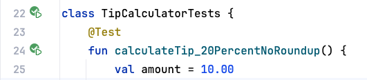

テストを実行します。

- クラス宣言の横の矢印をクリックし、次に [**Run 'TipCalculatorTests'**] をクリックします。

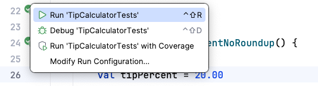

次の画面が表示されます。

- [**Run**] ペインの下部に、出力が表示されます。

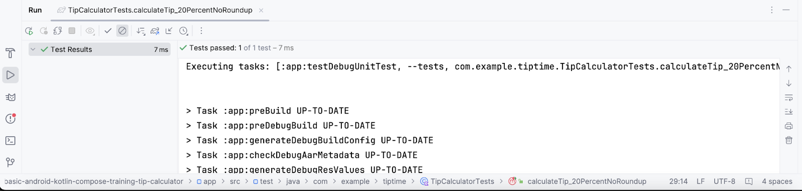

### 5. インストルメンテーション テストを作成する

#### インストルメンテーション ディレクトリを作成する

インストルメンテーション ディレクトリは、ローカルテスト ディレクトリの場合と同じように作成されます。

1. **src** ディレクトリを右クリックし、**[New] > [Directory]** を選択します。

#### 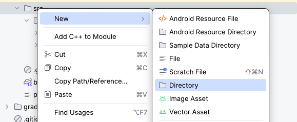

2. [**New Directory**] ウィンドウで [**androidTest/java**] を選択します。

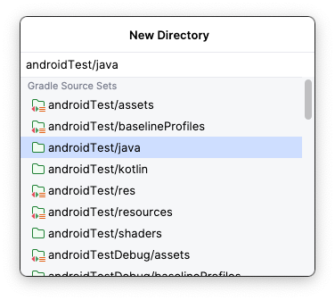

3. キーボードで **Return** キーまたは **Enter** キーを押します。[**androidTest**] タブに **androidTest** ディレクトリが表示されます。

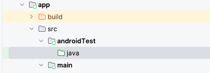

`main` ディレクトリと `test` ディレクトリのパッケージ構造が同じであるように、`androidTest` ディレクトリのパッケージ構造も同じである必要があります。

1. **androidTest/java** フォルダを右クリックして、**[New] > [Package]** を選択します。
2. [**New Package**] ウィンドウに「`com.example.tiptime`」と入力します。
3. キーボードで **Return** キーまたは **Enter** キーを押します。`androidTest` ディレクトリの完全なパッケージ構造が [**Project**] タブに表示されます。

#### **テストクラスを作成する**

Android プロジェクトでは、インストルメンテーション テスト ディレクトリは `androidTest` ディレクトリとして指定されます。

インストルメンテーション テストを作成するには、ローカルテストの作成と同じプロセスを繰り返す必要がありますが、今回は `androidTest` ディレクトリ内に作成します。

テストクラスを作成します。

1. プロジェクト ペインの `androidTest` ディレクトリに移動します。
2. `tiptime` ディレクトリが表示されるまで、各ディレクトリの横の展開矢印  をクリックします。

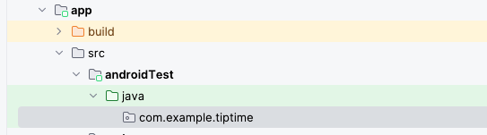

3. `tiptime` ディレクトリを右クリックして、**[New] > [Kotlin Class/File]** を選択します。
4. クラス名として「`TipUITests`」と入力します。

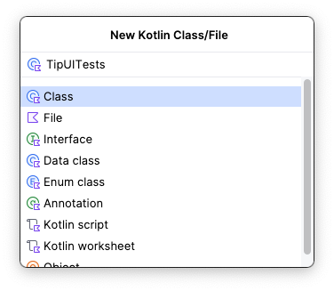

#### テストを作成する

インストルメンテーション テストのコードは、ローカルテストのコードとは大きく異なります。

インストルメンテーション テストでは、アプリの実際のインスタンスとその UI をテストします。したがって、Tip Time アプリのコードを作成したときに `MainActivity.kt` ファイルの `onCreate()` メソッドでコンテンツを設定したのと同様の方法で、UI コンテンツを設定する必要があります。この作業は、Compose で作成されたアプリのすべてのインストルメンテーション テストを作成する前に行う必要があります。

Tip Time アプリのテストでは、続いて UI コンポーネントを操作する手順を記述し、UI を使用してチップ計算プロセスをテストできるようにします。インストルメンテーション テストのコンセプトは、最初は抽象的に思えるかもしれませんが、心配は無用です。このプロセスについては、次のステップでカバーします。

テストを作成します。

1. `composeTestRule` 変数を作成して `createComposeRule()` メソッドの結果に設定し、これに `Rule` アノテーションを付けます。

```kotlin
import androidx.compose.ui.test.junit4.createComposeRule
import org.junit.Rule

class TipUITests {

   @get:Rule
   val composeTestRule = createComposeRule()
}
```

2. `calculate_20_percent_tip()` メソッドを作成し、これに `@Test` アノテーションを付けます。

```kotlin
import org.junit.Test

@Test
fun calculate_20_percent_tip() {
}
```

コンパイラは、`androidTest` ディレクトリにある `@Test` アノテーション付きのメソッドがインストルメンテーション テスト用であり、`test` ディレクトリにある `@Test` アノテーション付きのメソッドがローカルテスト用であることを認識します。

3. 関数本体で、`composeTestRule.setContent()` 関数を呼び出します。これにより、`composeTestRule` の UI コンテンツが設定されます。
4. 関数のラムダ本体で、`TipTimeLayout()` 関数を呼び出すラムダ本体を指定して `TipTimeTheme()` 関数を呼び出します。

```kotlin
import com.example.tiptime.ui.theme.TipTimeTheme

@Test
fun calculate_20_percent_tip() {
    composeTestRule.setContent {
        TipTimeTheme {
           TipTimeLayout()
        }
    }
}
```

作成されたコードは、`MainActivity.kt` ファイルの `onCreate()` メソッドでコンテンツを設定する際に記述したコードと似たものになります。UI コンテンツの設定が完了したら、アプリの UI コンポーネントを操作する手順を記述できます。このアプリでは、請求額とチップの割合の入力に基づいて、アプリが正しいチップの値を表示するかどうかをテストする必要があります。

5. UI コンポーネントは、`composeTestRule` によりノードとしてアクセスできます。そのための一般的な方法は、`onNodeWithText()` メソッドを使用して、特定のテキストを含むノードにアクセスすることです。`onNodeWithText()` メソッドを使用して、請求額が入力される `TextField` コンポーザブルにアクセスします。

```kotlin
import androidx.compose.ui.test.onNodeWithText

@Test
fun calculate_20_percent_tip() {
    composeTestRule.setContent {
        TipTimeTheme {
            TipTimeLayout()
        }
    }
    composeTestRule.onNodeWithText("Bill Amount")
}
```

次に、`performTextInput()` メソッドを呼び出して、`TextField` コンポーザブルに入力したいテキストを渡します。

6. 請求額の `TextField` に値 `10` を入力します。

```kotlin
import androidx.compose.ui.test.performTextInput

@Test
fun calculate_20_percent_tip() {
    composeTestRule.setContent {
        TipTimeTheme {
            TipTimeLayout()
        }
    }
    composeTestRule.onNodeWithText("Bill Amount")
.performTextInput("10")
}
```

7. 同様に、チップの割合の `OutlinedTextField` に値 `20` を入力します。

```kotlin
@Test
fun calculate_20_percent_tip() {
    composeTestRule.setContent {
        TipTimeTheme {
            TipTimeLayout()
        }
    }
   composeTestRule.onNodeWithText("Bill Amount")
.performTextInput("10")
   composeTestRule.onNodeWithText("Tip Percentage").performTextInput("20")
}
```

すべての `TextField` コンポーザブルに値を入力すると、アプリの画面の下部にある `Text` コンポーザブルにチップが表示されます。

上記の `TextField` コンポーザブルに値を入力するようテストに指示したので、アサーションを使用して、`Text` コンポーザブルが正しいチップを表示することを確認する必要があります。

Compose を使用したインストルメンテーション テストでは、UI コンポーネントでアサーションを直接呼び出すことができます。いくつかのアサーションを使用できますが、ここでは `assertExists()` メソッドを使用します。チップ金額を表示する `Text` コンポーザブルは、`Tip Amount: $2.00` を表示することが期待されます。

> **注**: 通貨記号はデバイスのロケールに応じて変わる場合があります。ここで「`$`」を使用しているのはあくまでも一例であり、ロケールに基づいて通貨をフォーマットする必要があります。

8. このテキストを含むノードが存在するというアサーションを作成します。

```kotlin
import java.text.NumberFormat

@Test
fun calculate_20_percent_tip() {
    composeTestRule.setContent {
        TipTimeTheme {
            Surface (modifier = Modifier.fillMaxSize()){
                TipTimeLayout()
            }
        }
    }
   composeTestRule.onNodeWithText("Bill Amount")
      .performTextInput("10")
   composeTestRule.onNodeWithText("Tip Percentage").performTextInput("20")
   val expectedTip = NumberFormat.getCurrencyInstance().format(2)
   composeTestRule.onNodeWithText("Tip Amount: $expectedTip").assertExists(
      "No node with this text was found."
   )
}
```

#### **テストを実行する**

インストルメンテーション テストの実行プロセスは、ローカルテストの実行プロセスと同じです。個々の宣言の横にあるガターの矢印をクリックして、個々のテストまたはテストクラス全体を実行します。

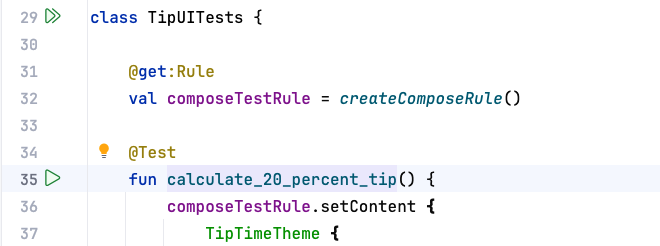

- クラス宣言の横の矢印をクリックします。デバイスまたはエミュレータで、テストの実行を確認できます。テストが終了すると、次の画像のような出力が表示されます。

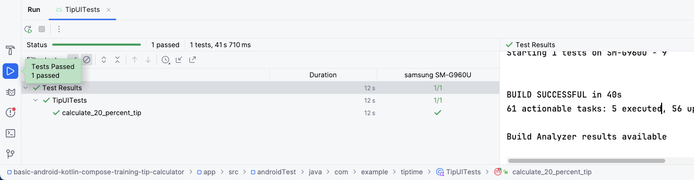

### 6. 解答コードを取得する

または、GitHub リポジトリのクローンを作成してコードを入手することもできます。

```
$ git clone https://github.com/google-developer-training/basic-android-kotlin-compose-training-tip-calculator.git
$ cd basic-android-kotlin-compose-training-tip-calculator
$ git checkout test_solution
```

> **注:**解答コードは、ダウンロードしたリポジトリの [`test_solution`](https://github.com/google-developer-training/basic-android-kotlin-compose-training-tip-calculator/tree/test_solution) ブランチにあります。

### 7. まとめ

お疲れさまでした。この演習では、Android の初めての自動テストを作成しました。テストは、ソフトウェア品質管理の重要な要素です。今後も Android アプリを開発する場合は、開発プロセス全体を通してアプリが適切に動作することを確認するために、アプリ機能とともにテストも作成してください。

#### **概要**

- 自動テストの概要
- 自動テストが重要である理由
- ローカルテストとインストルメンテーション テストの違い
- 自動テストの作成に関する基本的なベスト プラクティス
- Android プロジェクト内でローカルテストとインストルメンテーション テストのクラスが配置される場所と配置すべき場所
- テストメソッドを作成する方法
- ローカルテストとインストルメンテーション テストのクラスを作成する方法
- ローカルテストとインストルメンテーション テストでアサーションを作成する方法
- テストルールを使用する方法
- `ComposeTestRule` を使用してテストでアプリを起動する方法
- インストルメンテーション テストでコンポーザブルを操作する方法
- テストを実行する方法

## 6. プロジェクト: アートスペース アプリを作成する（提出対象）

### 1. 始める前に

このユニットで学習した内容を活用して、独自のデジタルアート空間（さまざまな作品を展示できるアプリ）を作成します｡これまでのレッスンでは手順の説明を行っていましたが、ここでは、これまでに学習したコンセプトを基に構築可能なものに関するガイドラインと提案のみを提示しています。限られた指示のもと、創造性を発揮して自主的にアプリを作成することをおすすめします。

自分でアプリを作成するのは難しいことですが、十分な練習を積んできているので心配はいりません。習得したスキルを新しい場面で活用できます。アプリの特定部分の実装方法がわからない場合は、いつでも前のレッスンを参照できます。

このアプリを自分で作成する中で直面する問題を解決すると、学習速度が上がり、コンセプトをより長く保持できます。また、アプリは完全にカスタマイズされているため、デベロッパー ポートフォリオの一部として自分の作品を紹介するために使用できます。

> **警告:** 自分で所有していないアセットや、アプリでの適切な使用権を持っていないアセットは使用しないでください。

#### 前提条件

- Android Studio でプロジェクトを作成、実行できること
- `Boolean` と `when` 式を含む Kotlin 構文の使用経験があること
- `MutableState` オブジェクトで状態を使用することなど、Jetpack Compose の基本的なコンセプトを応用できること
- `Text`、`Image`、`Button` のコンポーザブルを含むコンポーズ可能な関数の使用経験があること

#### 学習内容

- 低忠実度のプロトタイプを作成し、コードに変換する方法
- `Row` と `Column` のコンポーザブルを使用してシンプルなレイアウトを作成し、`horizontalAlignment` パラメータと `verticalArrangement` パラメータで配置する方法
- `Modifier` オブジェクトを使用して Compose 要素をカスタマイズする方法
- 状態を特定し、ボタンのタップなどのトリガー時に状態を変更する方法

#### 作成するアプリの概要

- 作品や家族写真を表示できる Android アプリ

#### 必要なもの

- Android Studio がインストールされているパソコン
- アプリに表示する写真やデジタルアート

このプロジェクトの終了時におけるアプリの外観の例を次に示します。


Android 基礎トレーニング チームが厳選した額縁入りの作品を展示するアートスペース アプリのサンプル

### 2. コンポーザブルを使用して静的な UI を作成する

#### 低忠実度のプロトタイプを作成する

低忠実度の（ローファイ）プロトタイプとは、アプリがどのようなものかについて基本概念を提供する単純なモデル（図形描画）のことです。

次のようにしてローファイ プロトタイプを作成します。

1. アートスペース アプリで表示する内容と、ターゲット ユーザーについて考えます。
2. お好みの媒体で、アプリを構成する要素を追加します。次のような要素を検討します。

- 作品の画像
- 作品に関する情報（タイトル、アーティスト、公開年など）
- その他、アプリをインタラクティブかつ動的にするボタンなどの要素

3. こうした要素をさまざまな位置に置き、視覚的に評価します。最初から完璧に仕上げる必要はありません。今は 1 つのデザインに決めておいて、後から繰り返し改良していくことができます。

> **注**: ユーザーにとってより良いデザインを実現するための原則がありますが、このプロジェクトでは扱いません。詳細については、[レイアウトについて](https://m3.material.io/foundations/layout/understanding-layout/overview)をご覧ください。

4. 次の画像のような、ローファイ デザインを思いつくかもしれません。

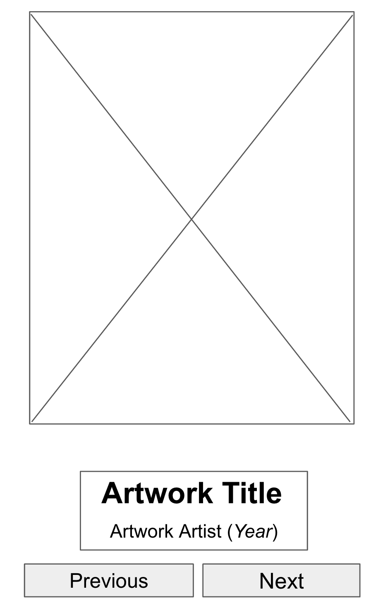

図 1. UI モックアップのプレースホルダ要素は、完成品の視覚化に役立ちます。

#### デザインをコードに変換する

以下の手順に沿って、プロトタイプを使用してデザインをコードに変換します。

1. アプリの構築に必要な UI 要素を特定します。

たとえば、作成した設計例では、1 つの `Image` コンポーザブル、2 つの `Text` コンポーザブル、2 つの `Button` コンポーザブルをコードに入れる必要があります。

2. アプリのさまざまな論理的なセクションを特定し、その周囲に境界線を引きます。

このステップにより、画面を小さなコンポーザブルに分割し、コンポーザブルの階層について検討できます。

この例では、画面を 3 つのセクションに分割できます。

- 作品用の壁
- 作品の説明
- 表示用のコントローラ

こうした各セクションは、`Row` コンポーザブルや `Column` コンポーザブルなどのレイアウト コンポーザブルで配置できます。

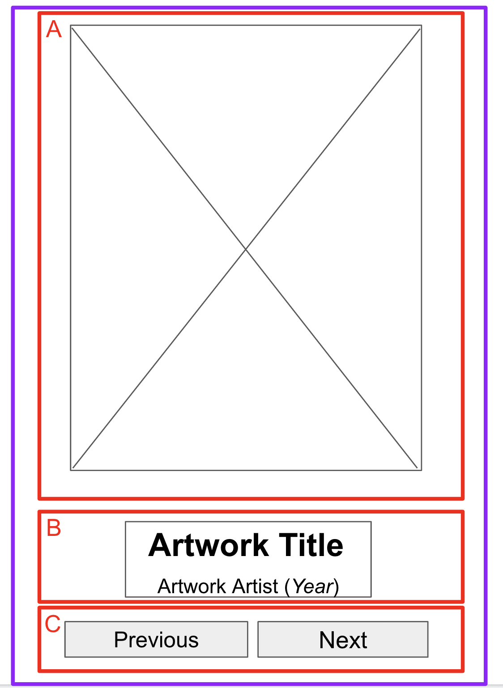

図 2. セクションの境界線はコンポーザブルの概念化に役立ちます。

3. 複数の UI 要素を含むアプリのセクションごとに、その周囲に境界線を描きます。

この境界線は、セクション内の要素間の関係を確認する際に役立ちます。

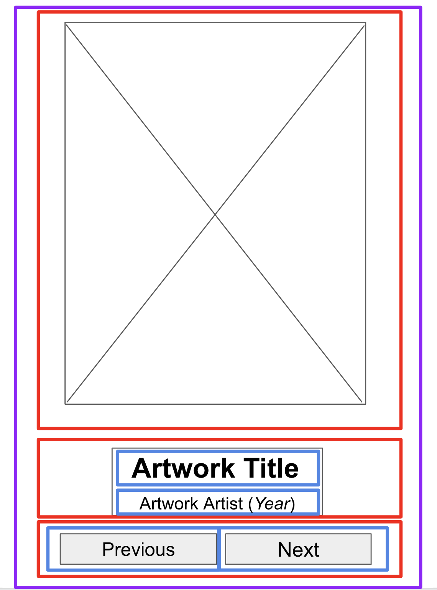

図 3. テキストとボタンに境界線を追加するとコンポーザブルの配置に役立ちます。

レイアウト コンポーザブルを使用して、`Text`、`Button` などのコンポーザブルの配置方法を簡単に確認できるようになりました。

使用できる各種コンポーザブルに関する注意事項:

- `Row` **コンポーザブル、または** `Column` **コンポーザブル**。`Row` と `Column` のコンポーザブルで、さまざまな `horizontalArrangement` パラメータと `verticalAlignment` パラメータを試して、自分のデザインに合うようにしてください。
- `Image` **コンポーザブル**。`contentDescription` パラメータは必ず入力してください。前のレッスンで触れたように、**TalkBack** では `contentDescription` パラメータを使用してアプリのユーザー補助機能を強化しています。`Image` コンポーザブルが装飾目的にのみ使用されている場合、または `Image` コンポーザブルを記述する `Text` 要素がある場合は、`contentDescription` パラメータを `null` に設定できます。
- `Text` **コンポーザブル**。`fontSize`、`textAlign`、`fontWeight` をさまざまな値で試して、テキストのスタイルを設定できます。また、[`buildAnnotatedString`](https://developer.android.com/jetpack/compose/text#multiple-styles) 関数を使用して、1 つの `Text` コンポーザブルに複数のスタイルを適用することもできます。
- `Surface` **コンポーザブル**。`Modifier.border` の `Elevation`、`Color`、`BorderStroke` をさまざまな値で試して、`Surface` コンポーザブル内にさまざまな UI を作成できます。
- **間隔と配置**。コンポーザブルの配置の補助として、`padding` や `weight` などの `Modifier` 引数を使用できます。

> **注**: シンプルなアプリでは UI 要素ごとにスタイルを設定できますが、画面を増やすとオーバーヘッドが発生します。Compose は、デザインの一貫性をマテリアル デザインの実装を通じて維持するのに役立ちます。マテリアル デザインとマテリアル テーマ設定については、以降のユニットで詳しく説明します。詳しくは、[Compose 内のマテリアル テーマ設定](https://developer.android.com/jetpack/compose/designsystems/material3)をご覧ください。

4. エミュレータまたは Android デバイスでアプリを実行します。

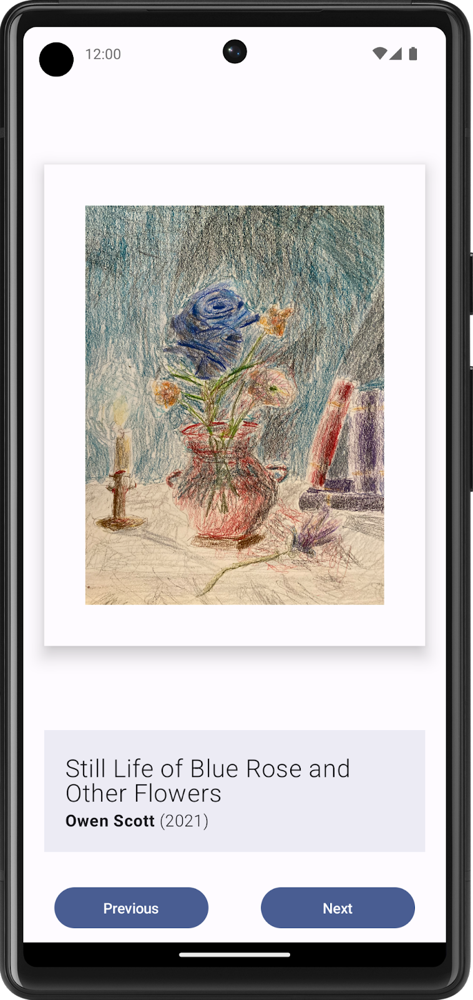

図 4. このアプリは静的コンテンツを表示し、ユーザーはまだ操作できません。

### 3. アプリをインタラクティブにする

#### ユーザー操作を特定する

アートスペースをデジタルで構築する利点は、ユーザーにとってインタラクティブかつ動的なものにできることです。最初のデザインとして、ユーザーが操作するためのボタンを 2 つ作成します。もちろん独自のアートスペースも作成できます。デザインや操作方法は自由に変更できます。ここで、ユーザーがアプリをどのように操作するか、その操作に基づいてアプリがどのように応答するかについて考えてみましょう。アプリには次のような操作を追加できます。

- ボタンをタップして、次または前の作品を表示する。
- スワイプして、作品の表示を次のアルバムまで早送りする。
- ボタンを長押しして、ツールチップに追加情報を表示させる。

> **注**: Compose には、アプリをインタラクティブにするためのさまざまなジェスチャーとアニメーションが用意されています。アニメーションについては、以降のユニットで詳しく説明します。高度なトピックについて詳しくは、[操作](https://developer.android.com/jetpack/compose/gestures)をご覧ください。

#### 動的要素に状態を作成する

以下のように、ボタンがタップされたときに次または前の作品を表示する UI について作業を進めます。

1. まず、ユーザー操作時に変化する必要がある UI 要素を特定します。

この場合は、作品の画像、タイトル、アーティスト、公開年です。

2. 必要なら、`MutableState` オブジェクトで動的 UI 要素ごとに状態を作成します。
3. ハードコードした値は、必ず定義した `states` で置き換えてください。

> **注**: 現在のところ、1 つの動的 UI 要素に 1 つの状態を使用していますが、この方法はコードの可読性とアプリのパフォーマンスにとって最も効率的な方法ではない場合があります。関連する要素を 1 つのエンティティとしてグループ化し、1 つの状態として宣言できますが、これについては `Collection` クラスと `Data` クラスを使う方法を今後のユニットで学習します。これらのコンセプトが完成したら、このプロジェクトに戻り、学習したコンセプトを使ってコードをリファクタリングできます。

#### 操作のための条件付きロジックを記述する

1. ユーザーがボタンをタップしたときに必要な動作を、まず [**Next**] ボタンから考えてみましょう。

ユーザーは、[**Next**] ボタンをタップしたときに、次の作品が表示されることを期待します。現時点では、次に表示する作品を特定することは困難です。

2. 1 で始まる連続した数の形式をとった識別子（ID）を各アートワークに追加します。

これにより、次の作品とは、次の ID を持つ作品のことだということが明確になりました。

作品数は無限ではないので、最後の作品を表示しているときの [**Next**] ボタンの動作を決めておくこともおすすめします。よくある動作は、最後の作品の後に最初の作品を表示するという動作です。

3. まずは疑似コードで記述し、Kotlin 構文を使わないでコードのロジックを把握します。

表示する作品が 3 つある場合、[**Next**] ボタンのロジックを表す疑似コードは、次のコード スニペットのようになります。

```kotlin
if (current artwork is the first artwork) {
    // Update states to show the second artwork.
}
else if (current artwork is the second artwork) {
    // Update states to show the third artwork.
}
else if (current artwork is the last artwork) {
   // Update state to show the first artwork.
}
```

4. 疑似コードを Kotlin コードに変換します。

多数の作品を扱うときには、コードが読みやすくなるように、`if else` 文の代わりに `when` 文を使用して条件付きロジックを作ることができます。

5. このロジックをボタンタップで実行させるには、`Button` コンポーザブルの `onClick()` 引数に入れます。
6. 同じ手順で、[**Previous**] ボタンのロジックを作ります。
7. アプリを実行し、ボタンをタップして、表示が前や次の作品に変わることを確認します。

### 4. 課題: 各種画面サイズ用に作成する

Android の強みの一つは、さまざまなデバイスと画面サイズに対応していることです。そのため、構築したアプリが幅広いユーザー層にアピールでき、多様な使い方が可能になります。すべてのユーザーに最適なエクスペリエンスを提供するには、対応しようとしているデバイスでテストする必要があります。たとえば、現在のサンプルアプリは、当初はポートレート モードのモバイル デバイス向けに設計、作成、テストしていたかもしれません。しかし、一部のユーザーは横表示モードの大画面で使用できることに気づいている可能性があります。

タブレットはこのアプリの主なサポート対象デバイスではありませんが、大きな画面で使っても破綻しないかどうかテストすることをおすすめします。

以下の手順に沿って、タブレットの大きな画面でアプリをテストしましょう。

1. Android タブレット デバイスがない場合は、[Android Virtual Device（AVD）を作成](https://developer.android.com/studio/run/managing-avds#createavd)します。
2. アプリをビルドして、横表示モードのタブレット AVD で実行します。
3. UI 要素が一部欠けている、配置がずれている、ボタン操作が想定どおりに機能しないなど、容認できないものがないか視覚的に検査します。

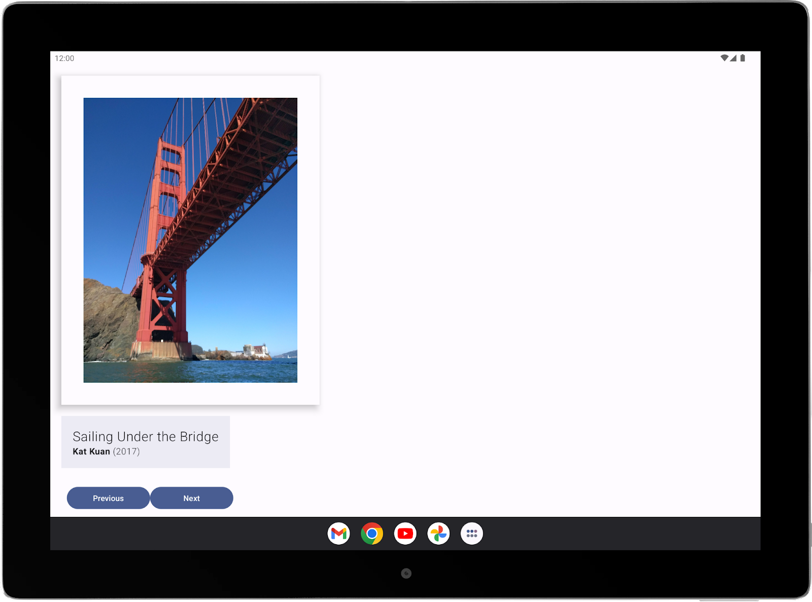

図 5. 大きなデバイスで正しく表示されるようにアプリを修正する必要があります。

4. コードを変更して、発見したバグを修正します。ガイダンスとして、[大画面でのアプリ品質の基本的な互換性に関するガイドライン](https://developer.android.com/docs/quality-guidelines/large-screens-app-quality#basic-compat)をご確認ください。
5. タブレットとスマートフォンで再度アプリをテストし、両方の種類のデバイスでバグが修正されていることを確認します。

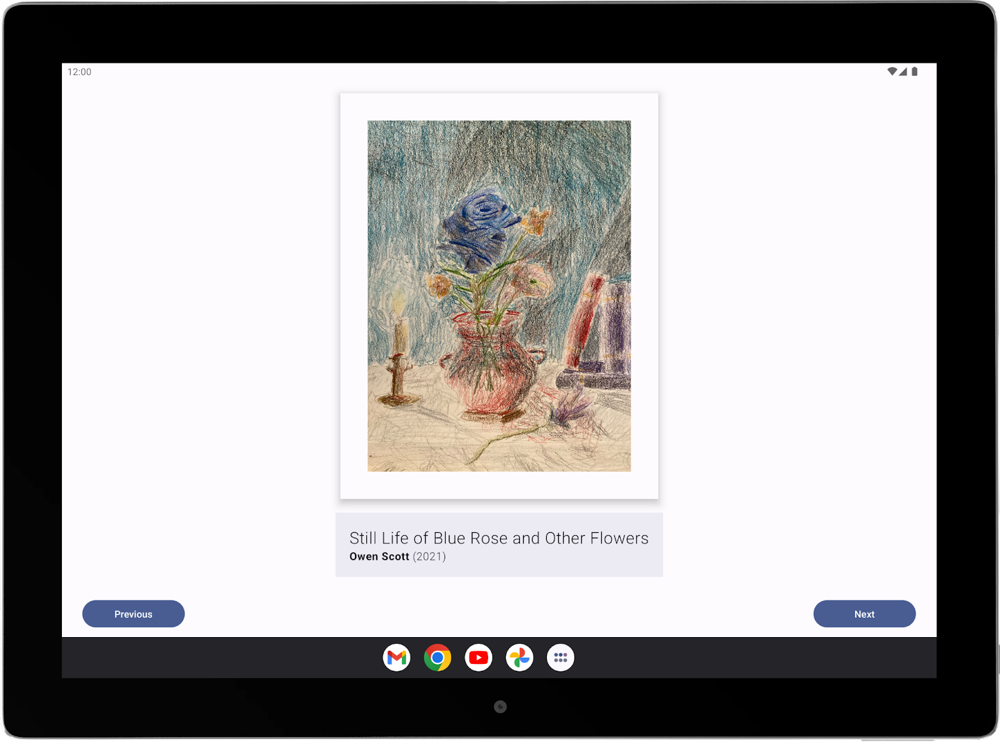

図 6. これで、アプリが大画面で適切に表示されるようになりました。

> **注**: タブレットとスマートフォンに対応するアプリの多くは、フォーク ファクタによって外観が変わる場合があります。これは、多くの場合、アプリが画面サイズごとに異なるレイアウトをサポートしているためです。詳しくは、[各種の画面サイズのサポート](https://developer.android.com/develop/ui/compose/layouts/adaptive/support-different-screen-sizes)をご覧ください。

### 5. ご健闘を祈ります。

#### ご健闘をお祈りします

このガイドが、独自のアートスペースを作成するきっかけになれば幸いです。最初から完璧なアプリを作成する必要はありません。Android の現在の知識に基づいて構築し、スキルの進展に合わせて改善することができます。

完成したら、作品をポートフォリオで紹介し、友だちや家族と共有しましょう。作品をソーシャル メディアで共有する場合は、ハッシュタグ #AndroidBasics を付けてください。

## 7. つまずきやすいポイント

- 「状態はどこに置くか」がこの章のテーマです。複数のコンポーザブルで同じ値を使うなら、共通の親に持ち上げます。
- アートスペース アプリは Unit 1〜2 の総まとめです。画像・ボタン・状態の 3 点が入っていれば OK。凝りすぎて止まるより、まず動くものを提出しましょう。

## 8. AIに質問する（この章の例）

次の例をそのままAIに投げてOKです（必要なら自分のコード/エラーに置き換えてください）。

```text
「状態ホイスティングを、なぜ必要かが分かるダメな例と良い例つきで説明して」
「`TextField` の入力値を `Double` に変換して計算したい。空文字や不正な入力のときにクラッシュしない書き方を教えて」
「アートスペース アプリの自分の設計（画像の配列とインデックスで管理）をレビューして。もっとシンプルにできるか確認して（コード: ここに貼る）」
「この章の内容で理解確認クイズを5問作って（解答は最後にまとめて）」
```

質問がまとまらないときは、第0章の「質問テンプレ」を使ってください。

## 9. 提出物

次のレッスンで完成させた Android Studio プロジェクトを、学習用リポジトリの `unit2/ArtSpace/` に置きます（プロジェクトフォルダごとコピー。`build/` と `.idea/` は含めない）。

- プロジェクト: アートスペース アプリを作成する

PR 本文には次の 3 点を書いてください。

- **やったこと**：どのレッスン / 演習を完了したか
- **動作確認**：どの端末（エミュレータ名 or 実機）で何を確認したか
- **詰まった点と解決**：エラーの内容と、どう直したか（AI に聞いた内容も可）

## 10. チェックリスト

- [ ] 状態ホイスティング（状態を親に持ち上げる）を説明できる
- [ ] `TextField` の入力を受け取って計算結果を表示できる
- [ ] 簡単な自動テスト（ユニットテスト / UI テスト）を書いて実行できる
- [ ] 各レッスンの「まとめ」にある用語を自分の言葉で説明できる
- [ ] 提出物が `unit2/ArtSpace/` にあり、Android Studio（または Kotlin Playground）で開いて動く

---

## 課題提出

この章には提出課題があります。

1. 上記の提出物を完了する
2. GitHub で `feature/02-ui-state` ブランチを作成し、`develop` へのPRを作成（base=`develop`）
3. [AIプログラムレビュー](https://ai.studio/apps/84d224cb-7de1-44fb-995b-9a5917d25603?fullscreenApplet=true) を実行
4. 問題がなければ、進捗ダッシュボードで **PR URL** と **完了日** を記録
