# 第9章: 美しいアプリを作成する

> ユニット 3「リストの表示とマテリアル デザインの使用」 パスウェイ 3
> 提出ブランチ: `feature/03-beautiful-apps`

## 1. この章のゴール

- Material Theme（色・タイポグラフィ・シェイプ）をアプリに適用できる
- `animateContentSize` などで簡単なアニメーションを付けられる
- TalkBack やコントラストなど、ユーザー補助の基本を確認できる

## 2. 進め方

公式パスウェイの内容を **上から順番に** 進めます。「やらなくてOK」の行は飛ばして構いません。Codelab の本文はこのページの下にすべて掲載しています（公式の動画はこのプログラムでは扱いません）。目安時間の合計は約390分です。

| # | 種類 | 内容 | 目安 | 備考 |
|---|---|---|---|---|
| 1 | Codelab | Jetpack Compose でのマテリアル テーマ設定 | 約120分 |  |
| 2 | Codelab | Jetpack Compose でのシンプルなアニメーション | 約60分 |  |
| 3 | Codelab | ユーザー補助機能のテスト | 約45分 |  |
| 4 | Codelab | 演習: スーパーヒーローのアプリを作成する | 約150分 | **提出対象** |
| 5 | Codelab | プロジェクト: 30 日間アプリの作成 | — | **やらなくてOK**（学習効果に対して難易度・工数が高い） |
| 6 | クイズ | [テスト: 美しいアプリを作成する](https://developer.android.com/courses/quizzes/android-basics-compose-unit-3-pathway-3/android-basics-compose-unit-3-pathway-3?hl=ja) | 約15分 | 公式サイトで受ける |

Codelab の進め方は次の通りです。

1. 下の各 Codelab を読み、各ステップの説明を理解してから **自分でコードを打つ**（コピペで済ませない）
2. ステップごとにアプリを実行し、期待どおり動くか確認する
3. 動かないときは、エラー文をそのまま AI に貼って「何が原因か」を聞き、直したら **なぜ直ったか** をメモする
4. パスウェイ末尾のクイズを受けて、間違えた項目を Codelab で読み直す

> Codelab 本文は Google Developers の公式 Codelab（CC BY 4.0）を日本語のまま転載しています。画面が最新の Android Studio と異なる場合があります。

## 3. Jetpack Compose でのマテリアル テーマ設定


### 1. 始める前に

[マテリアル デザイン](https://material.io/)は Google のデザイナーとデベロッパーが設計、サポートするデザイン システムで、Android やその他のモバイル プラットフォーム、ウェブ プラットフォームで、高品質なデジタル エクスペリエンスを実現します。見やすく魅力的なアプリの UI を一貫したデザインで作成するためのガイドラインとして利用できます。

この Codelab では、アプリでマテリアル デザインを使用するためのマテリアル テーマ設定と、色、タイポグラフィ、シェイプのカスタマイズについて学習します。アプリは必要に応じて少しだけでも大きくでもカスタマイズできます。また、トップ アプリバーを追加してアプリの名前やアイコンを表示する方法もわかります。

#### 前提条件

- Kotlin 言語（構文、関数、変数など）に精通している。
- パディングのある行と列を含め、Compose でレイアウトを作成できる。
- Compose で簡単なリストを作成できる。

#### 学習内容

- Compose アプリにマテリアル テーマ設定を適用する方法
- アプリにカスタム カラーパレットを追加する方法
- アプリにカスタム フォントを追加する方法
- アプリ内の要素にカスタム シェイプを追加する方法
- アプリにトップ アプリバーを追加する方法

#### 作成するアプリの概要

- マテリアル デザインのベスト プラクティスを取り入れた、洗練されたアプリを作成します。

#### 必要なもの

- Android Studio の最新バージョン
- スターター コードとフォントをダウンロードするためのインターネット接続

### 2. アプリの概要

この Codelab では、犬のリストを表示するアプリ、**Woof** を作成します。Woof ではマテリアル デザインを使用して洗練されたアプリ エクスペリエンスを実現します。

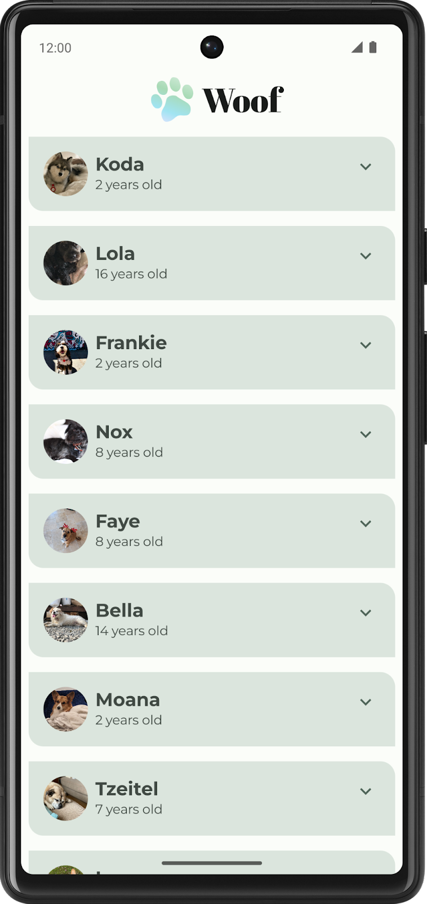

この Codelab では、マテリアル テーマ設定によってできることの一部を説明します。この Codelab を通じて、アプリのデザインをマテリアル テーマ設定によって改善するためのアイデアが得られます。

##### カラーパレット

これから作成するライトモードとダークモードのカラーパレットを以下に示します。

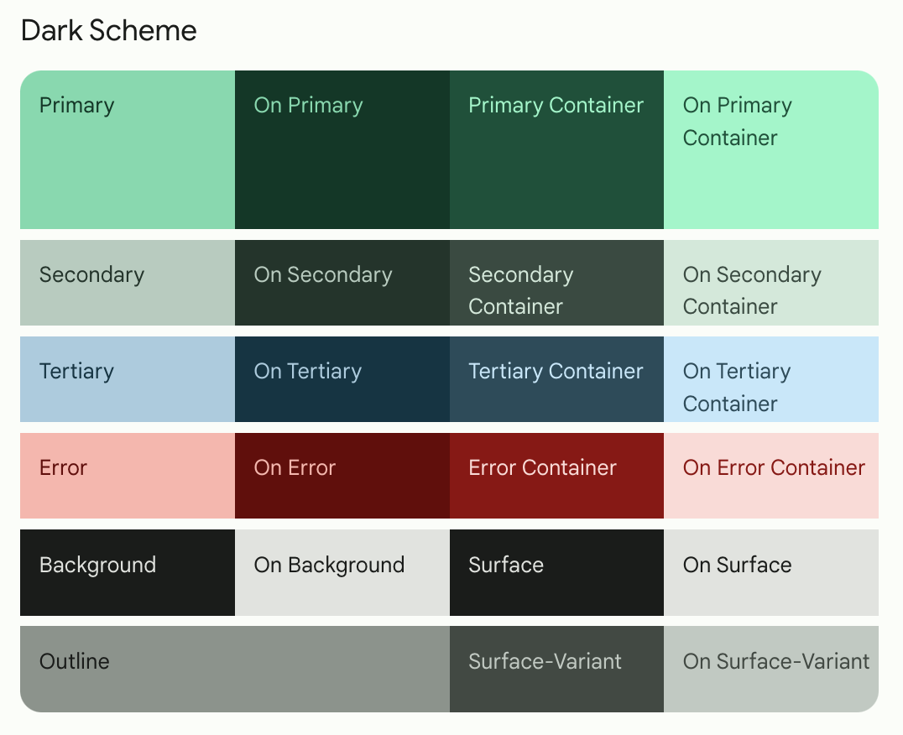

ライトモードとダークモードの完成したアプリを以下に示します。

| **ライトモード** | **ダークモード** |
|---|---|
|  |  |

##### タイポグラフィ

アプリで使用する書体スタイルは以下のとおりです。


##### テーマファイル

**Theme.kt** ファイルは、アプリのテーマに関するすべての情報を保持するファイルです。色、タイポグラフィ、シェイプによって定義されます。これは重要なファイルです。Theme.kt ファイルには、アプリの色、タイポグラフィ、シェイプを設定するコンポーザブル `WoofTheme()` があります。

```kotlin
@Composable
fun WoofTheme(
    darkTheme: Boolean = isSystemInDarkTheme(),
    // Dynamic color is available on Android 12+
    dynamicColor: Boolean = false,
    content: @Composable () -> Unit
) {
    val colorScheme = when {
        dynamicColor && Build.VERSION.SDK_INT >= Build.VERSION_CODES.S -> {
            val context = LocalContext.current
            if (darkTheme) dynamicDarkColorScheme(context) else dynamicLightColorScheme(context)
        }

        darkTheme -> DarkColors
        else -> LightColors
    }
    val view = LocalView.current
    if (!view.isInEditMode) {
        SideEffect {
            setUpEdgeToEdge(view, darkTheme)
        }
    }

    MaterialTheme(
        colorScheme = colorScheme,
        shapes = Shapes,
        typography = Typography,
        content = content
    )
}

/**
 * Sets up edge-to-edge for the window of this [view]. The system icon colors are set to either
 * light or dark depending on whether the [darkTheme] is enabled or not.
 */
private fun setUpEdgeToEdge(view: View, darkTheme: Boolean) {
    val window = (view.context as Activity).window
    WindowCompat.setDecorFitsSystemWindows(window, false)
    window.statusBarColor = Color.Transparent.toArgb()
    val navigationBarColor = when {
        Build.VERSION.SDK_INT >= 29 -> Color.Transparent.toArgb()
        Build.VERSION.SDK_INT >= 26 -> Color(0xFF, 0xFF, 0xFF, 0x63).toArgb()
        // Min sdk version for this app is 24, this block is for SDK versions 24 and 25
        else -> Color(0x00, 0x00, 0x00, 0x50).toArgb()
    }
    window.navigationBarColor = navigationBarColor
    val controller = WindowCompat.getInsetsController(window, view)
    controller.isAppearanceLightStatusBars = !darkTheme
    controller.isAppearanceLightNavigationBars = !darkTheme
}
```

**MainActivity.kt** では、`WoofTheme()` を追加することでアプリ全体のマテリアル テーマ設定が定義されます。

```kotlin
class MainActivity : ComponentActivity() {
   override fun onCreate(savedInstanceState: Bundle?) {
       super.onCreate(savedInstanceState)
       setContent {
           WoofTheme {
               Surface(
                   modifier = Modifier.fillMaxSize()
               ) {
                   WoofApp()
               }
           }
       }
   }
}
```

`WoofPreview()` をご覧ください。`WoofTheme()` を追加することで、`WoofPreview()` でマテリアル テーマ設定が定義されます。

```kotlin
@Preview
@Composable
fun WoofPreview() {
    WoofTheme(darkTheme = false) {
        WoofApp()
    }
}
```

### 3. スターター コードを取得する

まず、スターター コードをダウンロードします。

または、GitHub リポジトリのクローンを作成してコードを入手することもできます。

```
$ git clone https://github.com/google-developer-training/basic-android-kotlin-compose-training-woof.git
$ cd basic-android-kotlin-compose-training-woof
$ git checkout starter
```

> **注:**スターター コードは、ダウンロードしたリポジトリの `starter` ブランチにあります。

コードは [`Woof app`](https://github.com/google-developer-training/basic-android-kotlin-compose-training-woof/tree/starter) GitHub リポジトリで確認できます。

#### スターター コードを確認する

1. Android Studio でスターター コードを開きます。
2. [**com.example.woof**] > [**data**] > [**Dog.kt**] を開きます。これには、犬の写真、名前、年齢、特技を示す `Dog data class` が含まれます。また、犬のリストや、アプリのデータとして使用する情報も含まれています。
3. [**res**] > [**drawable**] を開きます。これには、アプリアイコン、犬の画像、アイコンなど、このプロジェクトに必要なすべての画像アセットが含まれています。
4. [**res**] > [**values**] > [**strings.xml**] を開きます。このファイルには、アプリで使用する文字列（アプリ名、犬の名前、説明など）が含まれています。
5. **MainActivity.kt** を開きます。このファイルには、犬の写真、名前、年齢を表示する簡単なリストを作成するコードが含まれています。
6. `WoofApp()` には、`DogItem` を表示する `LazyColumn` が含まれています。
7. `DogItem()` には、犬の写真とその犬に関する情報を表示する `Row` が含まれています。
8. `DogIcon()` は犬の写真を表示します。
9. `DogInformation()` は犬の名前と年齢を表示します。
10. `WoofPreview()` を使用すると、[**Design**] ペインでアプリのプレビューを表示できます。

> **注**: 各 `@Composable` メソッドには、パラメータとして修飾子が追加されています。Compose では、修飾子パラメータをコンポーズ可能な関数に渡すことをおすすめします。これによって、親コンポーザブルがコンテキスト情報を子コンポーザブルに渡すことができるようになるためです。
> 
> たとえば、あるボタンが与えられた場合、一方の親は子ボタンをフルサイズで使用し、もう一方の親は子ボタンでコンテンツをラップすることがあり得ます。それによってコードの再利用がしやすくなります。通常このパラメータは「修飾子」と呼ばれ、関数のパラメータ リストで最初のオプションのパラメータとして表示されます。この修飾子は、メソッドの最初の子に適用されます。詳しくは、[Jetpack Compose の API ガイドライン](https://android.googlesource.com/platform/frameworks/support/+/androidx-main/compose/docs/compose-api-guidelines.md#elements-accept-and-respect-a-modifier-parameter)をご覧ください。

#### エミュレータ / デバイスがライトモードになっていることを確認する

この Codelab ではライトモードとダークモードの両方を使用しますが、ほとんどの場合はライトモードです。始める前に、デバイスまたはエミュレータがライトモードになっていることを確認してください。

アプリをライトモードで表示するには、エミュレータまたは実機で次のように操作します。

1. デバイスの**設定**アプリを開きます。
2. **ダークモード**を検索してクリックします。
3. **ダークモード**がオンになっている場合は、オフにします。

スターター コードを実行すると、最初の画面が表示されます。犬の写真、名前、年齢を示すリストです。このままでも機能しますが、見た目が良くないので修正します。

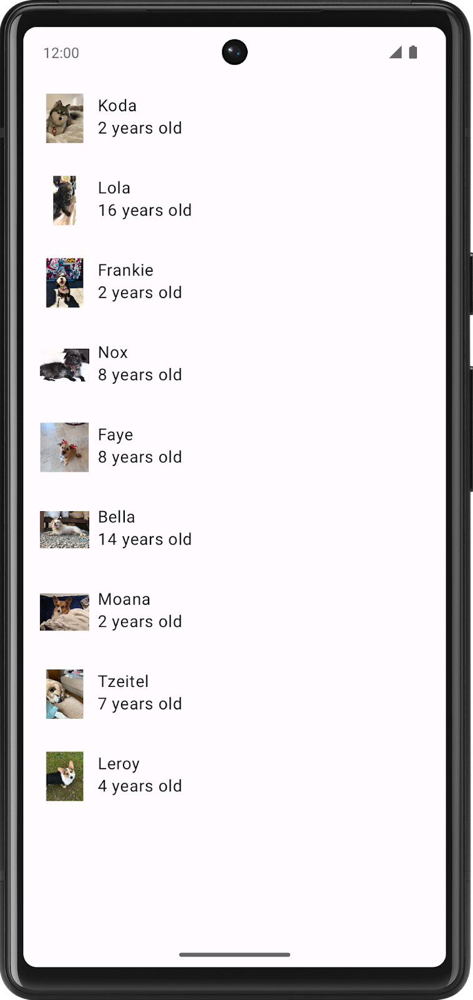

### 4. 色を追加する

最初に **Woof** アプリのカラーパターンを変更します。

カラーパターンは、アプリで使用する色の組み合わせを示しています。色の組み合わせによってムードが変わり、アプリを使用するユーザーの感じ方に影響します。

Android システムでは、色は 16 進数の色値で表されます。16 進数色コードは番号記号（#）で始まり、その後に色の赤、緑、青（RGB）成分を表す 6 つの文字または数字が続きます。最初の 2 文字と数字は赤、次の 2 文字は緑、最後の 2 文字は青を表します。


色には、色の透明度を表す英字や数字のアルファ値を含めることもできます（#00 は不透明度 0%（完全に透明）、#FF は不透明度 100%（完全に不透明））。指定した場合、アルファ値は 16 進数色コードで番号記号（#）に続く最初の 2 文字です。アルファ値を指定しない場合は、#FF（不透明度 100%）とみなされます。

色と 16 進数値の例を以下に示します。


#### マテリアル テーマビルダーを使用してカラーパターンを作成する

アプリのカスタム カラーパターンを作成するには、マテリアル テーマビルダーを使用します。

1. このリンクをクリックして[マテリアル テーマビルダー](https://m3.material.io/theme-builder#/custom)に移動します。
2. 左側のペインで [Core Colors] が表示されたら、[Primary] をクリックします。


3. HCT のカラー選択ツールが開きます。

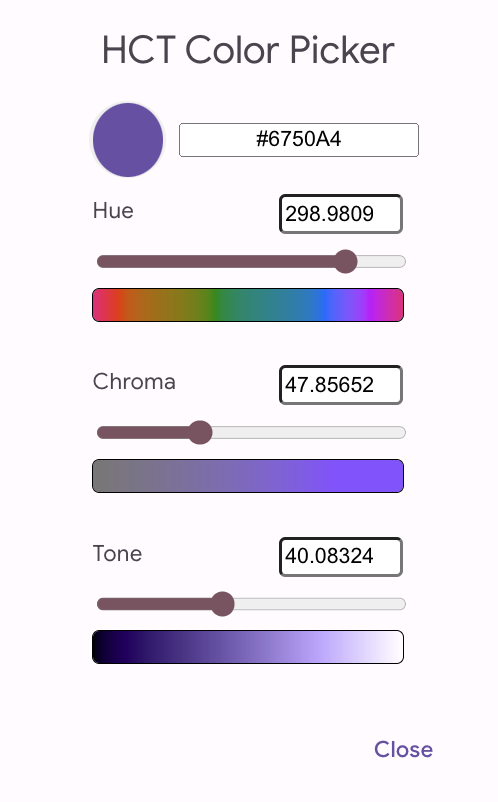

4. アプリのスクリーンショットに表示されるカラーパターンを作成するには、このカラー選択ツールでプライマリ カラーを変更します。テキスト ボックスで、現在のテキストを **#006C4C** に置き換えます。これにより、アプリのプライマリ カラーが緑色になります。

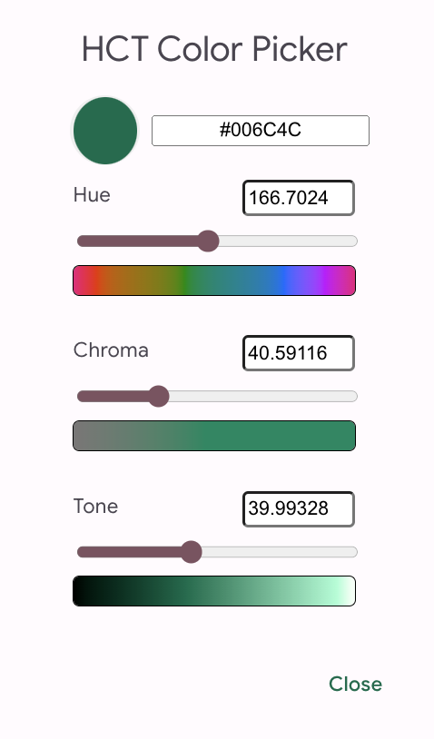

これによって、画面上のアプリが緑色のカラーパターンを採用するように更新されます。

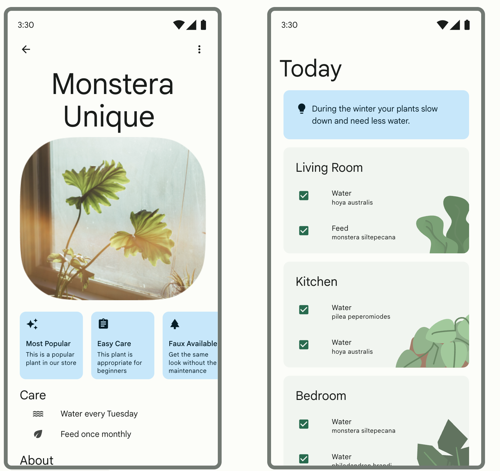

5. ページを下にスクロールすると、入力した色から生成されたライトモードとダークモードのフル カラーパターンが表示されます。


主要な役割とその活用方法は次のとおりです。

- **プライマリ** カラーは、UI の主要なコンポーネントに使用されます。
- **セカンダリ** カラーは、UI の目立たないコンポーネントに使用されます。
- **ターシャリ** カラーは、プライマリ カラーとセカンダリ カラーのバランスを保つため、または入力フィールドなどの要素に注意を引くための、対照的なアクセントに使用されます。
- **オン**カラー要素は、パレット内の他の色の**上**に配置され、主にテキスト、アイコン、ストロークに適用されます。カラーパレットでは、**サーフェス**色の上に表示される **onSurface** カラーと、**プライマリ** カラーの上部に表示される **onPrimary** カラーがあります。

これらのスロットによって一貫性のあるデザイン システムが実現し、関連するコンポーネントにも同様に色付けされるようになります。

色に関する理論的な話は以上です。次にこの美しいカラーパレットをアプリに追加してみましょう。

#### テーマにカラーパレットを追加する

マテリアル テーマビルダー ページでは、[**Export**] ボタンをクリックして、テーマビルダーで作成したカスタムテーマを含む **Color.kt** ファイルと **Theme.kt** ファイルをダウンロードできます。

これにより、作成したカスタムテーマをアプリに追加できるようになります。ただし、生成された **Theme.kt** ファイルにはダイナミック カラーのコードが含まれていないため（Codelab の後半で詳しく説明します）、ファイルをコピーします。

> **注**: 別のプロジェクトでマテリアル テーマビルダーで生成されたファイルを使用する場合は、そのパッケージ名をプロジェクトのパッケージ名に更新する必要があります。

1. **Color.kt** ファイルを開き、内容を以下のコードに置き換えて、新しいカラーパターンにコピーします。

```kotlin
package com.example.woof.ui.theme

import androidx.compose.ui.graphics.Color

val md_theme_light_primary = Color(0xFF006C4C)
val md_theme_light_onPrimary = Color(0xFFFFFFFF)
val md_theme_light_primaryContainer = Color(0xFF89F8C7)
val md_theme_light_onPrimaryContainer = Color(0xFF002114)
val md_theme_light_secondary = Color(0xFF4D6357)
val md_theme_light_onSecondary = Color(0xFFFFFFFF)
val md_theme_light_secondaryContainer = Color(0xFFCFE9D9)
val md_theme_light_onSecondaryContainer = Color(0xFF092016)
val md_theme_light_tertiary = Color(0xFF3D6373)
val md_theme_light_onTertiary = Color(0xFFFFFFFF)
val md_theme_light_tertiaryContainer = Color(0xFFC1E8FB)
val md_theme_light_onTertiaryContainer = Color(0xFF001F29)
val md_theme_light_error = Color(0xFFBA1A1A)
val md_theme_light_errorContainer = Color(0xFFFFDAD6)
val md_theme_light_onError = Color(0xFFFFFFFF)
val md_theme_light_onErrorContainer = Color(0xFF410002)
val md_theme_light_background = Color(0xFFFBFDF9)
val md_theme_light_onBackground = Color(0xFF191C1A)
val md_theme_light_surface = Color(0xFFFBFDF9)
val md_theme_light_onSurface = Color(0xFF191C1A)
val md_theme_light_surfaceVariant = Color(0xFFDBE5DD)
val md_theme_light_onSurfaceVariant = Color(0xFF404943)
val md_theme_light_outline = Color(0xFF707973)
val md_theme_light_inverseOnSurface = Color(0xFFEFF1ED)
val md_theme_light_inverseSurface = Color(0xFF2E312F)
val md_theme_light_inversePrimary = Color(0xFF6CDBAC)
val md_theme_light_shadow = Color(0xFF000000)
val md_theme_light_surfaceTint = Color(0xFF006C4C)
val md_theme_light_outlineVariant = Color(0xFFBFC9C2)
val md_theme_light_scrim = Color(0xFF000000)

val md_theme_dark_primary = Color(0xFF6CDBAC)
val md_theme_dark_onPrimary = Color(0xFF003826)
val md_theme_dark_primaryContainer = Color(0xFF005138)
val md_theme_dark_onPrimaryContainer = Color(0xFF89F8C7)
val md_theme_dark_secondary = Color(0xFFB3CCBE)
val md_theme_dark_onSecondary = Color(0xFF1F352A)
val md_theme_dark_secondaryContainer = Color(0xFF354B40)
val md_theme_dark_onSecondaryContainer = Color(0xFFCFE9D9)
val md_theme_dark_tertiary = Color(0xFFA5CCDF)
val md_theme_dark_onTertiary = Color(0xFF073543)
val md_theme_dark_tertiaryContainer = Color(0xFF244C5B)
val md_theme_dark_onTertiaryContainer = Color(0xFFC1E8FB)
val md_theme_dark_error = Color(0xFFFFB4AB)
val md_theme_dark_errorContainer = Color(0xFF93000A)
val md_theme_dark_onError = Color(0xFF690005)
val md_theme_dark_onErrorContainer = Color(0xFFFFDAD6)
val md_theme_dark_background = Color(0xFF191C1A)
val md_theme_dark_onBackground = Color(0xFFE1E3DF)
val md_theme_dark_surface = Color(0xFF191C1A)
val md_theme_dark_onSurface = Color(0xFFE1E3DF)
val md_theme_dark_surfaceVariant = Color(0xFF404943)
val md_theme_dark_onSurfaceVariant = Color(0xFFBFC9C2)
val md_theme_dark_outline = Color(0xFF8A938C)
val md_theme_dark_inverseOnSurface = Color(0xFF191C1A)
val md_theme_dark_inverseSurface = Color(0xFFE1E3DF)
val md_theme_dark_inversePrimary = Color(0xFF006C4C)
val md_theme_dark_shadow = Color(0xFF000000)
val md_theme_dark_surfaceTint = Color(0xFF6CDBAC)
val md_theme_dark_outlineVariant = Color(0xFF404943)
val md_theme_dark_scrim = Color(0xFF000000)
```

2. **Theme.kt** ファイルを開き、内容を以下のコードに置き換えて、テーマに新しい色を追加します。

```kotlin
package com.example.woof.ui.theme

import android.app.Activity
import android.os.Build
import android.view.View
import androidx.compose.foundation.isSystemInDarkTheme
import androidx.compose.material3.MaterialTheme
import androidx.compose.material3.darkColorScheme
import androidx.compose.material3.dynamicDarkColorScheme
import androidx.compose.material3.dynamicLightColorScheme
import androidx.compose.material3.lightColorScheme
import androidx.compose.runtime.Composable
import androidx.compose.runtime.SideEffect
import androidx.compose.ui.graphics.Color
import androidx.compose.ui.graphics.toArgb
import androidx.compose.ui.platform.LocalContext
import androidx.compose.ui.platform.LocalView
import androidx.core.view.WindowCompat

private val LightColors = lightColorScheme(
    primary = md_theme_light_primary,
    onPrimary = md_theme_light_onPrimary,
    primaryContainer = md_theme_light_primaryContainer,
    onPrimaryContainer = md_theme_light_onPrimaryContainer,
    secondary = md_theme_light_secondary,
    onSecondary = md_theme_light_onSecondary,
    secondaryContainer = md_theme_light_secondaryContainer,
    onSecondaryContainer = md_theme_light_onSecondaryContainer,
    tertiary = md_theme_light_tertiary,
    onTertiary = md_theme_light_onTertiary,
    tertiaryContainer = md_theme_light_tertiaryContainer,
    onTertiaryContainer = md_theme_light_onTertiaryContainer,
    error = md_theme_light_error,
    errorContainer = md_theme_light_errorContainer,
    onError = md_theme_light_onError,
    onErrorContainer = md_theme_light_onErrorContainer,
    background = md_theme_light_background,
    onBackground = md_theme_light_onBackground,
    surface = md_theme_light_surface,
    onSurface = md_theme_light_onSurface,
    surfaceVariant = md_theme_light_surfaceVariant,
    onSurfaceVariant = md_theme_light_onSurfaceVariant,
    outline = md_theme_light_outline,
    inverseOnSurface = md_theme_light_inverseOnSurface,
    inverseSurface = md_theme_light_inverseSurface,
    inversePrimary = md_theme_light_inversePrimary,
    surfaceTint = md_theme_light_surfaceTint,
    outlineVariant = md_theme_light_outlineVariant,
    scrim = md_theme_light_scrim,
)

private val DarkColors = darkColorScheme(
    primary = md_theme_dark_primary,
    onPrimary = md_theme_dark_onPrimary,
    primaryContainer = md_theme_dark_primaryContainer,
    onPrimaryContainer = md_theme_dark_onPrimaryContainer,
    secondary = md_theme_dark_secondary,
    onSecondary = md_theme_dark_onSecondary,
    secondaryContainer = md_theme_dark_secondaryContainer,
    onSecondaryContainer = md_theme_dark_onSecondaryContainer,
    tertiary = md_theme_dark_tertiary,
    onTertiary = md_theme_dark_onTertiary,
    tertiaryContainer = md_theme_dark_tertiaryContainer,
    onTertiaryContainer = md_theme_dark_onTertiaryContainer,
    error = md_theme_dark_error,
    errorContainer = md_theme_dark_errorContainer,
    onError = md_theme_dark_onError,
    onErrorContainer = md_theme_dark_onErrorContainer,
    background = md_theme_dark_background,
    onBackground = md_theme_dark_onBackground,
    surface = md_theme_dark_surface,
    onSurface = md_theme_dark_onSurface,
    surfaceVariant = md_theme_dark_surfaceVariant,
    onSurfaceVariant = md_theme_dark_onSurfaceVariant,
    outline = md_theme_dark_outline,
    inverseOnSurface = md_theme_dark_inverseOnSurface,
    inverseSurface = md_theme_dark_inverseSurface,
    inversePrimary = md_theme_dark_inversePrimary,
    surfaceTint = md_theme_dark_surfaceTint,
    outlineVariant = md_theme_dark_outlineVariant,
    scrim = md_theme_dark_scrim,
)

@Composable
fun WoofTheme(
    darkTheme: Boolean = isSystemInDarkTheme(),
    // Dynamic color is available on Android 12+
    dynamicColor: Boolean = false,
    content: @Composable () -> Unit
) {
    val colorScheme = when {
        dynamicColor && Build.VERSION.SDK_INT >= Build.VERSION_CODES.S -> {
            val context = LocalContext.current
            if (darkTheme) dynamicDarkColorScheme(context) else dynamicLightColorScheme(context)
        }

        darkTheme -> DarkColors
        else -> LightColors
    }
    val view = LocalView.current
    if (!view.isInEditMode) {
        SideEffect {
            setUpEdgeToEdge(view, darkTheme)
        }
    }

    MaterialTheme(
        colorScheme = colorScheme,
        shapes = Shapes,
        typography = Typography,
        content = content
    )
}

/**
 * Sets up edge-to-edge for the window of this [view]. The system icon colors are set to either
 * light or dark depending on whether the [darkTheme] is enabled or not.
 */
private fun setUpEdgeToEdge(view: View, darkTheme: Boolean) {
    val window = (view.context as Activity).window
    WindowCompat.setDecorFitsSystemWindows(window, false)
    window.statusBarColor = Color.Transparent.toArgb()
    val navigationBarColor = when {
        Build.VERSION.SDK_INT >= 29 -> Color.Transparent.toArgb()
        Build.VERSION.SDK_INT >= 26 -> Color(0xFF, 0xFF, 0xFF, 0x63).toArgb()
        // Min sdk version for this app is 24, this block is for SDK versions 24 and 25
        else -> Color(0x00, 0x00, 0x00, 0x50).toArgb()
    }
    window.navigationBarColor = navigationBarColor
    val controller = WindowCompat.getInsetsController(window, view)
    controller.isAppearanceLightStatusBars = !darkTheme
    controller.isAppearanceLightNavigationBars = !darkTheme
}
```

`WoofTheme()` では、`colorScheme val` は `when` ステートメントを使用します。

- `dynamicColor` が true でビルド バージョンが S 以降の場合、デバイスが `darkTheme` かどうかを確認します。
- ダークモードの場合、`colorScheme` は `dynamicDarkColorScheme` に設定されます。
- ダークモードでない場合は、`dynamicLightColorScheme` に設定されます。
- アプリが `dynamicColorScheme` を使用していない場合、アプリが `darkTheme` かどうかを確認します。ダークモードの場合、`colorScheme` は `DarkColors` に設定されます。
- いずれでもない場合、`colorScheme` は `LightColors` に設定されます。

**Theme.kt** ファイルでコピーしたファイルでは、`dynamicColor` が false に設定されており、作業中のデバイスはライトモードになっているため、`colorScheme` は `LightColors` に設定されます。

```kotlin
val colorScheme = when {
       dynamicColor && Build.VERSION.SDK_INT >= Build.VERSION_CODES.S -> {
           val context = LocalContext.current
           if (darkTheme) dynamicDarkColorScheme(context) else dynamicLightColorScheme(context)
       }

       darkTheme -> DarkColors
       else -> LightColors
   }
```

3. アプリを再実行すると、アプリバーの色が自動的に変更されていることがわかります。

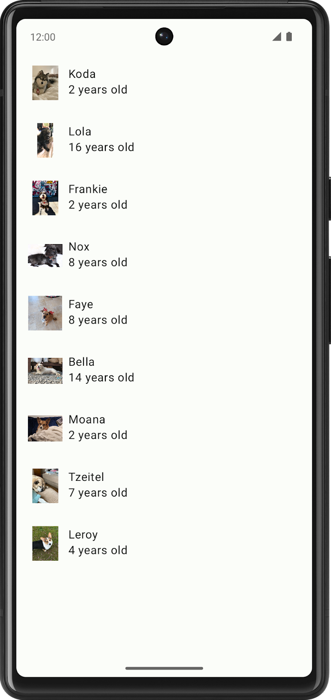

#### カラー マッピング

マテリアル コンポーネントはカラースロットに自動的にマッピングされます。フローティング アクション ボタンなど、UI の他の主要なコンポーネントも、デフォルトでプライマリ カラーになっています。つまり、コンポーネントに明示的に色を割り当てる必要はありません。アプリでカラーテーマを設定すると、自動的にカラースロットにマッピングされます。これをオーバーライドするには、コード内で色を明示的に設定します。色の役割について詳しくは、[こちら](https://m3.material.io/styles/color/the-color-system/color-roles)をご覧ください。

このセクションでは、`DogIcon()` と `DogInformation()` を含む `Row` を `Card` でラップし、リストアイテムの色を背景と区別します。

1. コンポーズ可能な関数 `DogItem()` で、`Row()` を `Card()` でラップします。

```kotlin
Card() {
   Row(
       modifier = modifier
           .fillMaxWidth()
           .padding(dimensionResource(id = R.dimen.padding_small))
   ) {
       DogIcon(dog.imageResourceId)
       DogInformation(dog.name, dog.age)
   }
}
```

2. `Card` が `DogItem()` の最初の子コンポーザブルになっているため、`DogItem()` から `Card` に修飾子を渡し、`Row` の修飾子を `Modifier` の新しいインスタンスに更新します。

```kotlin
Card(modifier = modifier) {
   Row(
       modifier = Modifier
           .fillMaxWidth()
           .padding(dimensionResource(id = R.dimen.padding_small))
   ) {
       DogIcon(dog.imageResourceId)
       DogInformation(dog.name, dog.age)
   }
}
```

3. `WoofPreview()` をご覧ください。`Card` コンポーザブルにより、リストアイテムの色が自動的に変更されました。色はきれいに見えますが、リストアイテムの間にはスペースがありません。

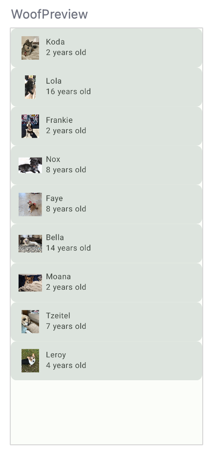

#### ディメンション ファイル

**strings.xml** を使用してアプリに文字列を保存する場合と同じように、**dimens.xml** というファイルを使用してディメンションの値を格納することもおすすめします。これは、値をハードコードする手間を省き、必要に応じて 1 か所で値を変更できるため便利です。

[**app**] > [**res**] > [**values**] > [**dimens.xml**] に移動して、ファイルを確認します。`padding_small`、`padding_medium`、`image_size` のディメンション値が格納されます。これらのディメンションはアプリ全体で使用されます。

```kotlin
<resources>
   <dimen name="padding_small">8dp</dimen>
   <dimen name="padding_medium">16dp</dimen>
   <dimen name="image_size">64dp</dimen>
</resources>
```

**dimens.xml** ファイルから値を追加する正しい形式は次のとおりです。

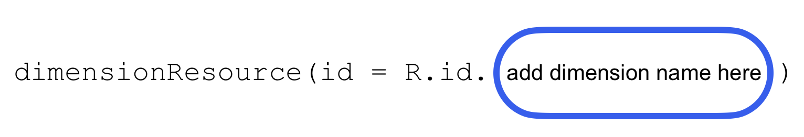

たとえば、`padding_small` を追加するには、`dimensionResource(id = R.dimen.`*`padding_small`*`)` を渡します。

1. `WoofApp()` で、`DogItem()` の呼び出しに `padding_small` を含む `modifier` を追加します。

```kotlin
@Composable
fun WoofApp() {
    Scaffold { it ->
        LazyColumn(contentPadding = it) {
            items(dogs) {
                DogItem(
                    dog = it,
                    modifier = Modifier.padding(dimensionResource(R.dimen.padding_small))
                )
            }
        }
    }
}
```

`WoofPreview()` で、リストアイテム間がより明確になりました。

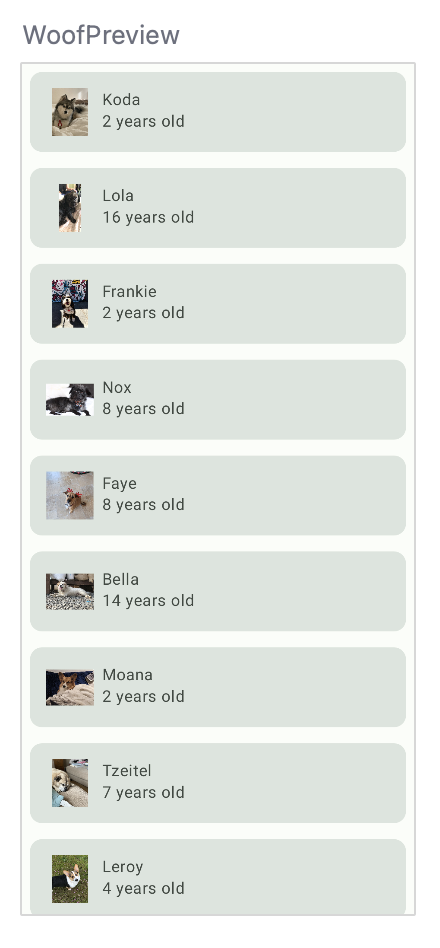

#### ダークモード

Android システムには、デバイスをダークモードに切り替えるオプションがあります。ダークモードでは、より暗く、落ち着いた色が使用されており、以下の効果があります。

- 電力使用量を大幅に削減できます（削減できる量はデバイスの画面テクノロジーに左右されます）。
- 視力の低いユーザーや明るい光に敏感なユーザーにとって、画面の見やすさが向上します。
- すべてのユーザーにとって、暗い場所でのデバイスの使いやすさが向上します。

アプリで[フォースダーク](https://developer.android.com/guide/topics/ui/look-and-feel/darktheme#force-dark)にオプトインすると、システムによってダークモードが実装されます。ただし、ダークモードの実装はユーザー エクスペリエンス向上に有効であるため、アプリのテーマについてはデベロッパーが完全に制御できます。

デベロッパーが独自にダークモードを選択する際は、ダークモードの色が[ユーザー補助のコントラスト標準](https://webaim.org/resources/contrastchecker/)に適合していることをご確認ください。ダークモードでは暗いサーフェス色を使用し、色のアクセントは限定されます。

##### ダークモードをプレビュー表示する

ダークモードの色は、前のステップですでに追加されています。ダークモードの動作を確認するには、別のプレビュー コンポーザブルを **MainActivity.kt** に追加します。それにより、コードの UI レイアウトを変更したときに、ライトモードとダークモードのプレビューがどのように表示されるかを同時に確認できます。

1. `WoofPreview()` で、`WoofDarkThemePreview()` という新しい関数を作成し、`@Preview` と `@Composable` というアノテーションを付けます。

```kotlin
@Preview
@Composable
fun WoofDarkThemePreview() {

}
```

2. `DarkThemePreview()` 内で `WoofTheme()` を追加します。`WoofTheme()` を追加しないと、アプリに追加したスタイルは表示されません。`darkTheme` パラメータを **true** に設定します。

```kotlin
@Preview
@Composable
fun WoofDarkThemePreview() {
   WoofTheme(darkTheme = true) {

   }
}
```

3. `WoofTheme()` 内で `WoofApp()` を呼び出します。

```kotlin
@Preview
@Composable
fun WoofDarkThemePreview() {
   WoofTheme(darkTheme = true) {
       WoofApp()
   }
}
```

[**Design**] ペインで下にスクロールして、アプリをダークモードで表示します。アプリ / リストアイテムの背景がさらに暗くなり、テキストが明るくなります。ダークモードとライトモードの違いを比較します。

| **ダークモード** | **ライトモード** |
|---|---|
| 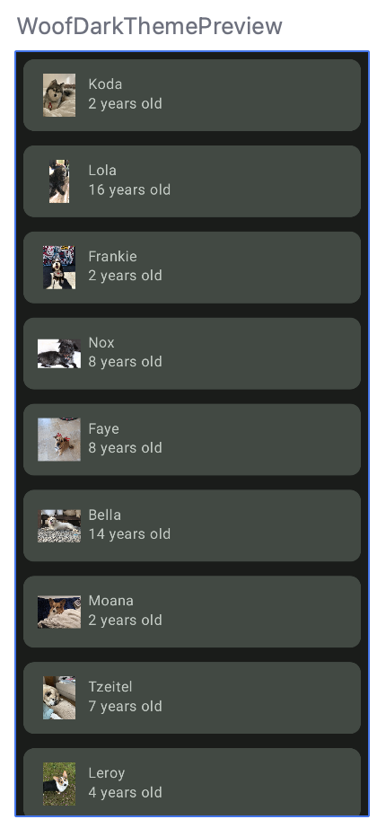 | 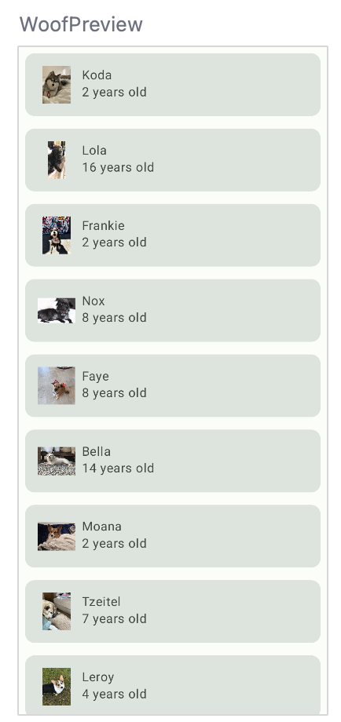 |

##### デバイスまたはエミュレータでダークモードを表示する

エミュレータまたは実機でアプリをダークモードで表示するには:

1. デバイスの**設定**アプリを開きます。
2. **ダークモード**を検索してクリックします。
3. **ダークモード**をオンにします。
4. **Woof** アプリを再度開くと、**ダークモード**で表示されます。

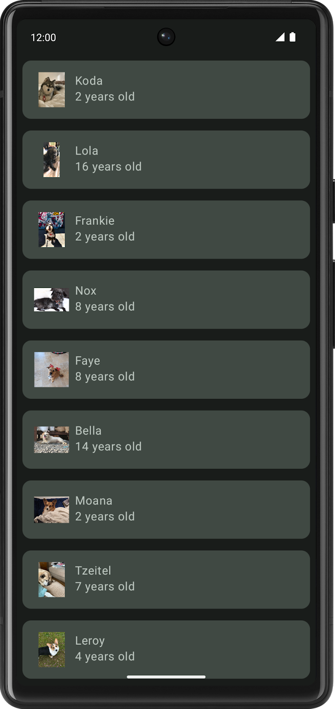

この Codelab ではライトモードに重点を置いているため、ダークモードをオフにしてからアプリの操作を進めてください。

1. デバイスの**設定**アプリを開きます。
2. [**Display**] を選択します。
3. [**Dark theme**] をオフにします。

セクションの最初と現在とで、アプリの外観がどのように変わったかを比較してください。リストアイテムやテキストがより明瞭になり、カラーパターンの視覚的な魅力が増しているはずです。

| **色を使わない** | **色を使う（ライトモード）** | **色を使う（ダークモード）** |
|---|---|---|
|  | 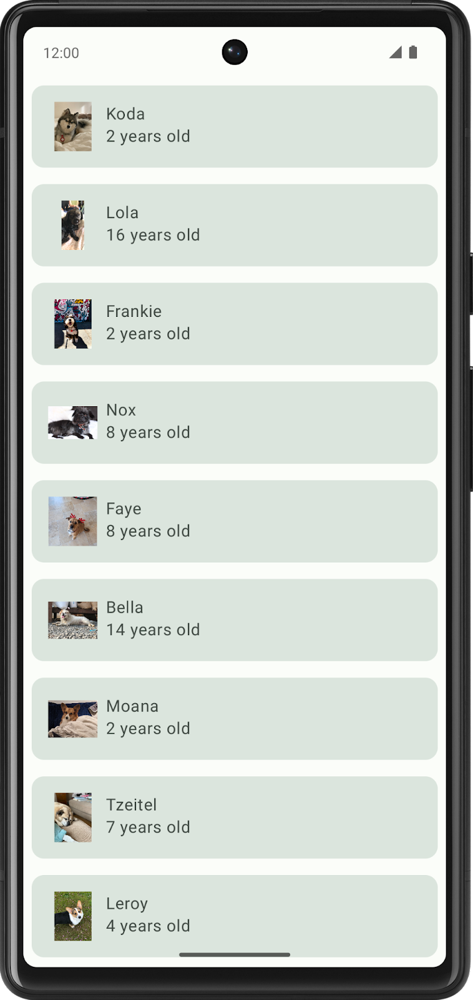 |  |

#### ダイナミック カラー

マテリアル 3 ではユーザーのパーソナライズに重点を置いています。マテリアル 3 の新機能であるダイナミック カラーでは、ユーザーの壁紙に基づいてアプリのテーマを作成します。そのため、ユーザーが緑色が好きで、スマートフォンの背景が青の場合、それを反映している Woof アプリも青色になります。動的なテーマ設定は、Android 12 以降を搭載した特定のデバイスでのみ行われます。

カスタムテーマは、強いブランディング カラーを持つアプリに使用できます。また、動的なテーマ設定に対応していないデバイスにも実装し、アプリにテーマ設定します。

1. ダイナミック カラーを有効にするには、**Theme.kt** を開き、`WoofTheme()` コンポーザブルに移動して `dynamicColor` パラメータを **true** に設定します。

```kotlin
@Composable
fun WoofTheme(
   darkTheme: Boolean = isSystemInDarkTheme(),
   dynamicColor: Boolean = true,
   content: @Composable () -> Unit
)
```

2. デバイスまたはエミュレータの背景を変更するには、[**設定**] に移動し、[**壁紙**] を検索します。
3. 壁紙を特定の色または色のセットに変更します。
4. アプリを再実行すると動的なテーマが表示されます（なお、ダイナミック カラーを表示するには、デバイスやエミュレータが Android 12 以降である必要があります）。さまざまな壁紙を使用して、自由にお試しください。

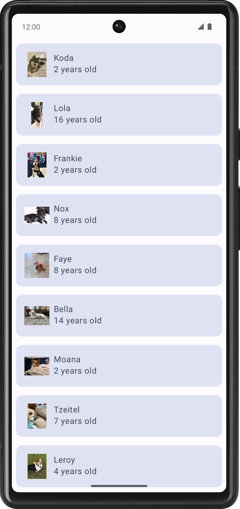

5. この Codelab ではカスタムテーマ設定に重点を置いているため、次に進む前に `dynamicColor` を無効にしてください。

```kotlin
@Composable
fun WoofTheme(
   darkTheme: Boolean = isSystemInDarkTheme(),
   dynamicColor: Boolean = false,
   content: @Composable () -> Unit
)
```

### 5. シェイプを追加する

シェイプを適用すると、コンポーザブルのデザインが大幅に変わる場合があります。シェイプはユーザーの注意を引き、コンポーネントを明確に示し、状態を伝え、ブランドを表現するために役立ちます。

多くのシェイプは、角が丸い長方形を表す [`RoundedCornerShape`](https://developer.android.com/reference/kotlin/androidx/compose/foundation/shape/RoundedCornerShape) を使用して定義されています。渡される数値によって角の丸みが決まります。`RoundedCornerShape(0.dp)` を使用すると、長方形の角は丸くなりません。`RoundedCornerShape(50.dp)` を使用すると、角が完全な円形になります。

| 0.dp | 25.dp | 50.dp |
|---|---|---|
| 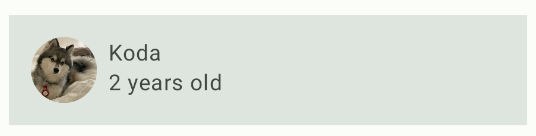 |  | 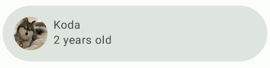 |

各隅に異なる丸め率を設定して、シェイプをさらにカスタマイズすることもできます。さまざまなシェイプを試してみましょう。

| 左上: 50.dp   左下: 25.dp   右上: 0.dp   右下: 15.dp | 左上: 15.dp   左下: 50.dp   右上: 50.dp   右下: 15.dp | 左上: 0.dp   左下: 50.dp   右上: 0.dp   右下: 50.dp |
|---|---|---|
|  |  |  |

Compose のコンポーネントのシェイプを定義するには、**Shape.kt** ファイルを使用します。コンポーネントには、大、中、小の 3 種類があります。このセクションでは、`Card` コンポーネント（`medium` サイズとして定義）を変更します。コンポーネントはサイズに基づいて[シェイプ カテゴリ](https://m3.material.io/styles/shape/shape-scale-tokens#b09934f1-1b0f-4ce4-ade6-4a1f138add6c)にグループ化されます。

このセクションでは、犬の画像を丸くシェーピングし、リストアイテムのシェイプを変更します。

#### 犬の画像を円形にする

1. **Shape.kt** ファイルを開き、small パラメータが `RoundedCornerShape(50.dp)` に設定されていることを確認します。これは画像を円形にシェーピングするために使用されます。

```kotlin
val Shapes = Shapes(
   small = RoundedCornerShape(50.dp),
)
```

2. **MainActivity.kt** を開きます。`DogIcon()` で、[`clip`](https://developer.android.com/reference/kotlin/androidx/compose/ui/Modifier#(androidx.compose.ui.Modifier).clip(androidx.compose.ui.graphics.Shape)) 属性を `Image` の `modifier` に追加します。画像がシェイプにクリップされます。`MaterialTheme.shapes.small` を渡します。

```kotlin
import androidx.compose.ui.draw.clip

@Composable
fun DogIcon(
   @DrawableRes dogIcon: Int,
   modifier: Modifier = Modifier
) {
   Image(
       modifier = modifier
           .size(dimensionResource(id = R.dimen.image_size))
           .padding(dimensionResource(id = R.dimen.padding_small))
           .clip(MaterialTheme.shapes.small),
```

`WoofPreview()` を見ると、犬のアイコンが円形になっていることがわかります。しかし、一部の写真の両側が切り取られ、完全な円形として表示されていません。


3. すべての写真を円形にするには、[`ContentScale`](https://developer.android.com/reference/kotlin/androidx/glance/layout/ContentScale) 属性と [`Crop`](https://developer.android.com/reference/kotlin/androidx/glance/layout/ContentScale#Crop()) 属性を追加します。画像が収まるように切り抜かれます。`contentScale` は `Image` の属性であり、`modifier` の一部ではありません。

```kotlin
import androidx.compose.ui.layout.ContentScale

@Composable
fun DogIcon(
   @DrawableRes dogIcon: Int,
   modifier: Modifier = Modifier
) {
   Image(
       modifier = modifier
           .size(dimensionResource(id = R.dimen.image_size))
           .padding(dimensionResource(id = R.dimen.padding_small))
           .clip(MaterialTheme.shapes.small),
       contentScale = ContentScale.Crop,
```

これは、完全な `DogIcon()` コンポーザブルです。

```kotlin
@Composable
fun DogIcon(
    @DrawableRes dogIcon: Int,
    modifier: Modifier = Modifier
) {
    Image(
        modifier = modifier
            .size(dimensionResource(R.dimen.image_size))
            .padding(dimensionResource(R.dimen.padding_small))
            .clip(MaterialTheme.shapes.small),
        contentScale = ContentScale.Crop,
        painter = painterResource(dogIcon),

        // Content Description is not needed here - image is decorative, and setting a null content
        // description allows accessibility services to skip this element during navigation.

        contentDescription = null
    )
}
```

`WoofPreview()` では、アイコンが円形に表示されます。


#### リストアイテムにシェイプを追加する

このセクションでは、リストアイテムにシェイプを追加します。リストアイテムはすでに `Card` を介して表示されています。`Card` は、サーフェスとして 1 つのコンポーザブルを含めることができ、また装飾オプションも用意されています。装飾は枠線やシェイプなどを使用して追加できます。このセクションでは、`Card` を使用してリストアイテムにシェイプを追加します。

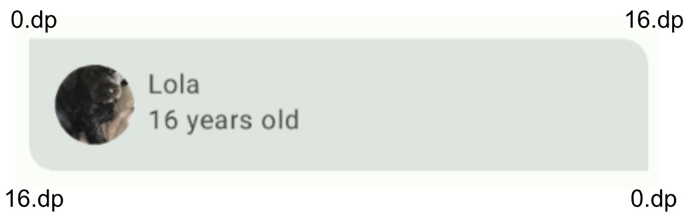

1. **Shape.kt** ファイルを開きます。`Card` はミディアム コンポーネントであるため、`Shapes` オブジェクトの medium パラメータを追加します。このアプリでは、リストアイテムの右上隅と左下隅ですが、完全な円形にはしません。それには、`16.dp` を `medium` 属性に渡します。

```kotlin
medium = RoundedCornerShape(bottomStart = 16.dp, topEnd = 16.dp)
```

`Card` はデフォルトでミディアム シェイプを使用しているため、明示的にミディアム シェイプに設定する必要はありません。**プレビュー**で、新しくシェーピングされた `Card` をご確認ください。


`WoofTheme()` の **Theme.kt** ファイルに戻って `MaterialTheme()` を見ると、`shapes` 属性が、更新した `Shapes` `val` に設定されていることがわかります。

```kotlin
MaterialTheme(
   colors = colors,
   typography = Typography,
   shapes = Shapes,
   content = content
)
```

以下に、シェーピング前後のリストアイテムの比較を示します。シェーピングを加えることで、アプリの魅力がどれだけ高まるかに注目してください。

| **シェーピングなし** | **シェーピングあり** |
|---|---|
| 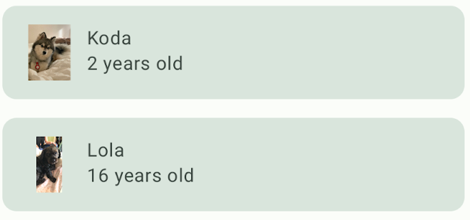 | 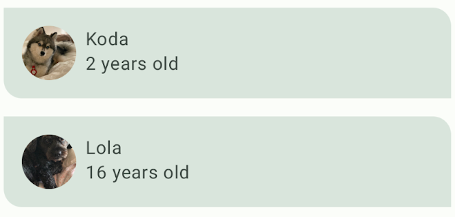 |

### 6. タイポグラフィを追加する

#### マテリアル デザインのタイプスケール

タイプスケールは、アプリ全体で使用できるフォント スタイルのセレクションです。柔軟でありながら一貫性のあるスタイルを保証します。[マテリアル デザインのタイプスケール](https://m3.material.io/styles/typography/type-scale-tokens)には、タイプシステムでサポートされる 15 のフォント スタイルが含まれています。名前とグループ化は、表示、見出し、タイトル、本文、ラベルに簡略化され、それぞれに大、中、小のサイズがあります。この選択が必要になるのは、アプリをカスタマイズする場合のみです。タイプスケールのカテゴリ別の設定がわからない場合は、デフォルトのタイポグラフィ スケールを使用できます。


タイプスケールには、それぞれ意図された用途と意味を持つ、再利用可能なテキスト カテゴリが含まれています。

##### **ディスプレイ**

最大のテキストであるディスプレイ スタイルは、短く重要なテキストや数字用に予約されています。大画面では特に高い効果を発揮します。

##### **見出し**

見出しは、小さい画面上の短く強調されたテキストに適しています。これらのスタイルは、テキストの主要な文や重要なコンテンツ領域をマークする場合に便利です。

##### **タイトル**

タイトルは見出しスタイルよりも小さく、比較的短い中強調のテキストに使用されます。

##### **本文**

本文のスタイルは、アプリ内のテキストの長い文に使用されます。

##### **ラベル**

ラベルのスタイルは小さく、実用的なスタイルであり、コンポーネント内のテキストや、キャプションなどのコンテンツ本文の非常に小さいテキストに使用されます。

#### フォント

Android プラットフォームにはさまざまなフォントが用意されていますが、デフォルトで用意されていないフォントを使用してアプリをカスタマイズすることもできます。カスタム フォントを使用すれば、個性を表現できます。ブランディングにも適しています。

このセクションでは、**Abril Fatface**、**Montserrat Bold**、**Montserrat Regular** というカスタム フォントを追加します。displayLarge 見出しと displayMedium 見出し、マテリアル タイプ システムの bodyLarge テキストを使用し、これらをアプリのテキストに追加します。

##### フォントの Android リソース ディレクトリを作成します。

アプリにフォントを追加する前に、フォントのディレクトリを作成する必要があります。

1. Android Studio のプロジェクト ビューで、**res** フォルダを右クリックします。
2. [**New**] > [**Android Resource Directory**] を選択します。

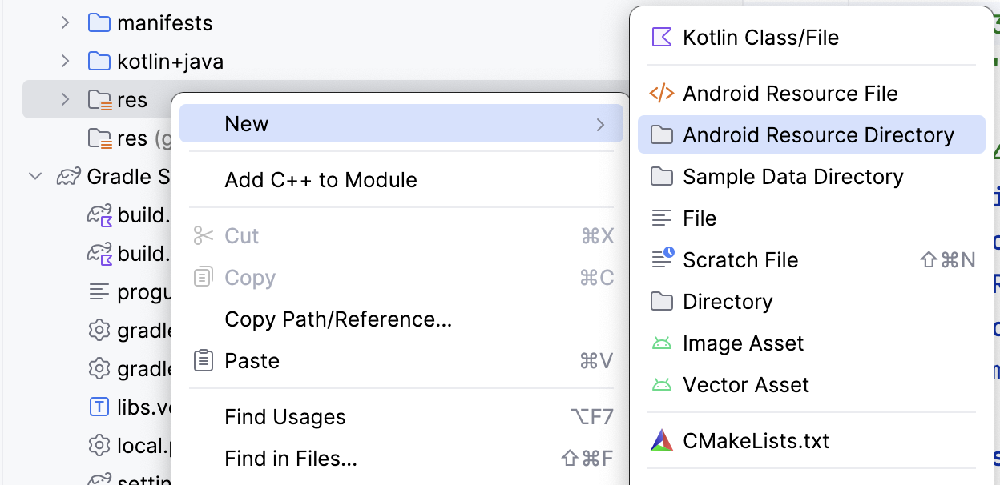

1. ディレクトリの名前を「**font**」にして、[Resource type] を「**font**」に設定し、[**OK**] をクリックします。


2. **[res] > [font]** にある新しいフォント リソース ディレクトリを開きます。

##### カスタム フォントをダウンロードする

Android プラットフォームでは提供されていないフォントを使用するため、カスタム フォントをダウンロードする必要があります。

1. [https://fonts.google.com/](https://fonts.google.com/) にアクセスします。
2. 「[**Montserrat**](https://fonts.google.com/specimen/Montserrat?query=mon)」を検索して、[**Download family**] をクリックします。
3. zip ファイルを解凍します。
4. ダウンロードした **Montserrat** フォルダを開きます。**static** フォルダに **Montserrat-Bold.ttf** と **Montserrat-Regular.ttf** があります（**ttf** は、フォントのファイル形式である TrueType フォントの略です）。両方のフォントを選択し、Android Studio のプロジェクトのフォント リソース ディレクトリにドラッグします。

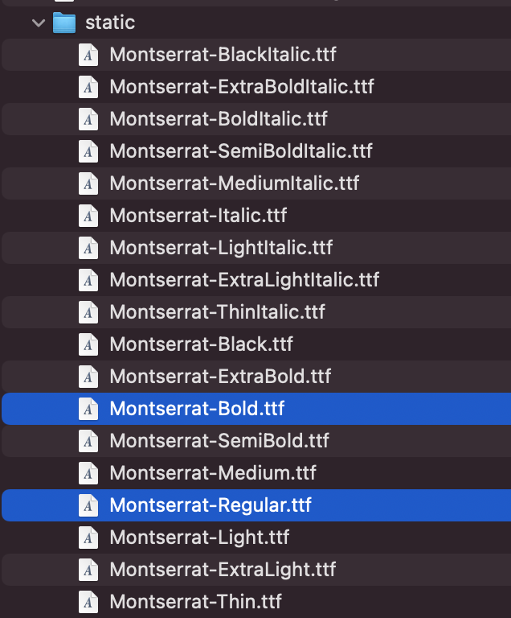

5. フォント フォルダで、ファイル名 **Montserrat-Bold.ttf** を **montserrat_bold.ttf** に、**Montserrat-Regular.ttf** を **montserrat_regular.ttf** に変更します。
6. 「[**Abril Fatface**](https://fonts.google.com/specimen/Abril+Fatface?query=abril)」を検索して [**Download Family**] をクリックします。
7. ダウンロードした **Abril_Fatface** フォルダを開きます。**AbrilFatface-Regular.ttf** を選択し、フォント リソース ディレクトリにドラッグします。
8. フォント フォルダで、ファイル名 **Abril_Fatface_Regular.ttf** を **abril_fatface_regular.ttf** に変更します。

3 つのカスタム フォント ファイルを追加したプロジェクトのフォント リソース ディレクトリは、次のようになります。

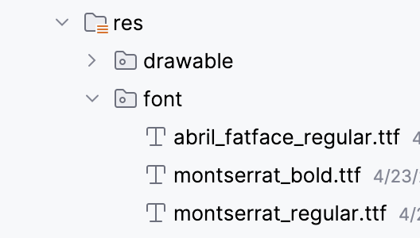

##### フォントを初期化する

1. プロジェクト ウィンドウで、[**ui.theme**] > [**Type.kt**] を開きます。インポート ステートメントの下、`Typography` `val` の上で、ダウンロードしたフォントを初期化します。まず、**Abril Fatface** を `FontFamily` に設定して初期化し、フォント ファイル `abril_fatface_regular` を指定して `Font` を渡します。

```kotlin
​​import androidx.compose.ui.text.font.Font
import androidx.compose.ui.text.font.FontFamily
import com.example.woof.R

val AbrilFatface = FontFamily(
   Font(R.font.abril_fatface_regular)
)
```

2. **Abril Fatface** の下にある **Montserrat** を `FontFamily` に設定して初期化し、フォント ファイル `montserrat_regular` を指定して `Font` に渡します。`montserrat_bold` については `FontWeight.Bold` も指定します。太字のフォント ファイルを渡しても、Compose はファイルが太字であることを認識しないため、ファイルを `FontWeight.Bold` に明示的にリンクする必要があります。

```kotlin
import androidx.compose.ui.text.font.FontWeight

val AbrilFatface = FontFamily(
   Font(R.font.abril_fatface_regular)
)

val Montserrat = FontFamily(
   Font(R.font.montserrat_regular),
   Font(R.font.montserrat_bold, FontWeight.Bold)
)
```

次に、先ほど追加したフォントにさまざまなタイプの見出しを設定します。`Typography` オブジェクトには、前述の 13 種類の書体のパラメータがあります。これは必要な数だけ定義できます。このアプリでは、`displayLarge`、`displayMedium`、`bodyLarge` を設定します。このアプリの次の部分では `labelSmall` を使用するため、ここで追加します。

追加する見出しのフォント、太さ、サイズを以下の表に示します。


3. `displayLarge` 属性には `TextStyle` を設定し、`fontFamily`、`fontWeight`、`fontSize` に上記の表の情報を入力します。それにより、`displayLarge` に設定されたテキストのフォントはすべて通常の太さの **Abril Fatface** に設定され、`fontSize` は `36.sp` になります。

`displayMedium`、`labelSmall`、`bodyLarge` についてもこの手順を繰り返します。

```kotlin
import androidx.compose.ui.text.TextStyle
import androidx.compose.ui.unit.sp

val Typography = Typography(
   displayLarge = TextStyle(
       fontFamily = AbrilFatface,
       fontWeight = FontWeight.Normal,
       fontSize = 36.sp
   ),
   displayMedium = TextStyle(
       fontFamily = Montserrat,
       fontWeight = FontWeight.Bold,
       fontSize = 20.sp
   ),
   labelSmall = TextStyle(
       fontFamily = Montserrat,
       fontWeight = FontWeight.Bold,
       fontSize = 14.sp
   ),
   bodyLarge = TextStyle(
       fontFamily = Montserrat,
       fontWeight = FontWeight.Normal,
       fontSize = 14.sp
   )
)
```

`WoofTheme()` の **Theme.kt** ファイルに移動して `MaterialTheme()` を見ると、`typography` パラメータは更新した `Typography val` と等しくなります。

```kotlin
MaterialTheme(
   colors = colors,
   typography = Typography,
   shapes = Shapes,
   content = content
)
```

##### アプリのテキストにタイポグラフィを追加する

次に、アプリの各テキスト インスタンスに見出しのタイプを追加します。

1. 短く重要な情報である `dogName` のスタイルとして `displayMedium` を追加します。小さい文字にも対応する `bodyLarge` を `dogAge` のスタイルとして追加します。

```kotlin
@Composable
fun DogInformation(
   @StringRes dogName: Int,
   dogAge: Int,
   modifier: Modifier = Modifier
) {
   Column(modifier = modifier) {
       Text(
           text = stringResource(dogName),
           style = MaterialTheme.typography.displayMedium,
           modifier = Modifier.padding(top = dimensionResource(id = R.dimen.padding_small))
       )
       Text(
           text = stringResource(R.string.years_old, dogAge),
           style = MaterialTheme.typography.bodyLarge
       )
   }
}
```

2. これで、`WoofPreview()` で犬の名前は `20.sp` で太字の **Montserrat** フォントになり、犬の年齢は `14.sp` で通常の **Montserrat** フォントになります。

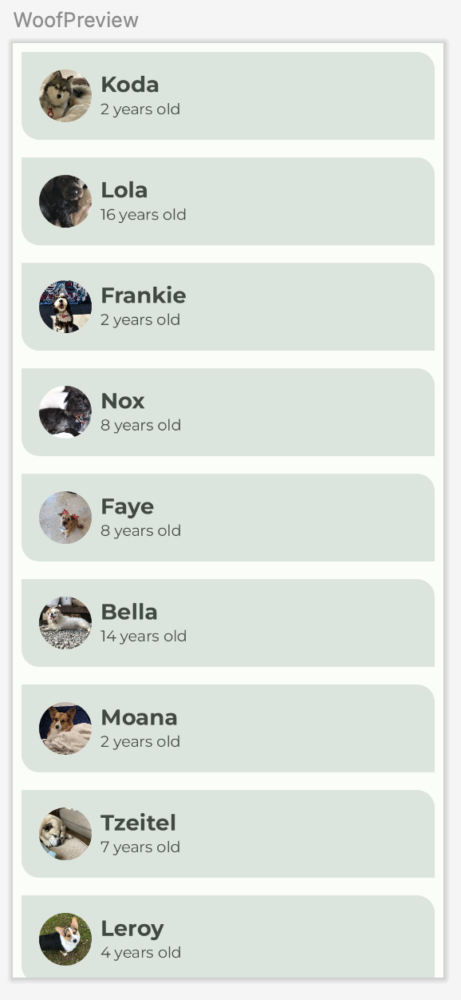

以下に、タイポグラフィを追加した前後のリストアイテムを並べて示します。犬の名前と犬の年齢のフォントの違いに注目してください。

| **タイポグラフィを使用しない場合** | **タイポグラフィを使用した場合** |
|---|---|
| 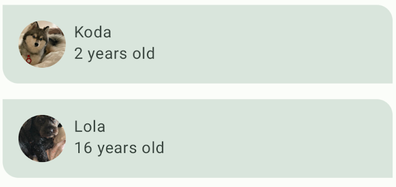 | 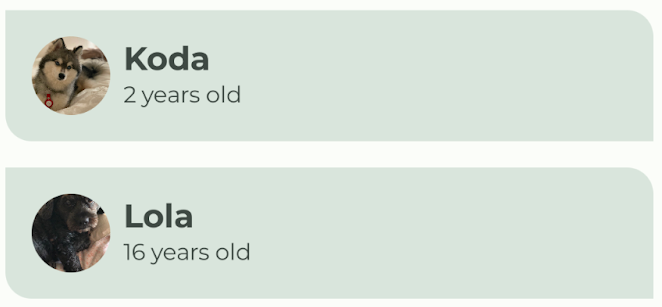 |

### 7. トップバーを追加する

[`Scaffold`](https://developer.android.com/reference/kotlin/androidx/compose/material3/Scaffold.composable#Scaffold(androidx.compose.ui.Modifier,kotlin.Function0,kotlin.Function0,kotlin.Function0,kotlin.Function0,androidx.compose.material3.FabPosition,androidx.compose.ui.graphics.Color,androidx.compose.ui.graphics.Color,androidx.compose.foundation.layout.WindowInsets,kotlin.Function1)) は、さまざまなコンポーネントや画面要素（`Image`、`Row`、`Column` など）のためのスロットが用意されたレイアウトです。`Scaffold` には、このセクションで使用する [`TopAppBar`](https://developer.android.com/reference/kotlin/androidx/compose/material3/package-summary#TopAppBar(kotlin.Function0,androidx.compose.ui.Modifier,kotlin.Function0,kotlin.Function1,androidx.compose.foundation.layout.WindowInsets,androidx.compose.material3.TopAppBarColors,androidx.compose.material3.TopAppBarScrollBehavior)) のためのスロットも用意されています。

`TopAppBar` はさまざまな用途に使用できますが、ここではブランディングとアプリの個性を出すために使用します。`TopAppBar` には、中央、小、中、大の 4 種類があります。この Codelab では、中央の上部アプリバーを実装します。以下のスクリーンショットのようなコンポーザブルを作成し、`Scaffold` の `topBar` セクションに配置します。


このアプリの場合、トップバーはロゴの画像とアプリのタイトルのテキストを含む `Row` で構成されています。このロゴは、グラデーションが施されたかわいらしい足跡とアプリのタイトルで構成されています。


#### トップバーに画像とテキストを追加する

1. **MainActivity.kt** で、`WoofTopAppBar()` というコンポーザブルを作成し、必要に応じて `modifier` を指定します。

```kotlin
@Composable
fun WoofTopAppBar(modifier: Modifier = Modifier) {
  
}
```

2. [`Scaffold`](https://developer.android.com/jetpack/compose/layouts/material#scaffold) は、スキャフォールド コンテンツのインセットを指定するために役立つ `contentWindowInsets` パラメータをサポートしています。[`WindowInsets`](https://developer.android.com/reference/android/view/WindowInsets) は、アプリがシステム UI と交差できる画面の部分であり、これらの要素は `PaddingValues` パラメータを介してコンテンツ スロットに渡されます。詳しくは、[こちら](https://developer.android.com/develop/ui/views/layout/insets)をご覧ください。

`contentWindowInsets` 値は `contentPadding` として `LazyColumn` に渡されます。

```kotlin
@Composable
fun WoofApp() {
    Scaffold { it ->
        LazyColumn(contentPadding = it) {
            items(dogs) {
                DogItem(
                    dog = it,
                    modifier = Modifier.padding(dimensionResource(R.dimen.padding_small))
                )
            }
        }
    }
}
```

3. `Scaffold` 内に `topBar` 属性を追加して、`WoofTopAppBar()` に設定します。

```kotlin
Scaffold(
   topBar = {
       WoofTopAppBar()
   }
)
```

`WoofApp()` コンポーザブルは次のようになります。

```kotlin
@Composable
fun WoofApp() {
    Scaffold(
        topBar = {
            WoofTopAppBar()
        }
    ) { it ->
        LazyColumn(contentPadding = it) {
            items(dogs) {
                DogItem(
                    dog = it,
                    modifier = Modifier.padding(dimensionResource(R.dimen.padding_small))
                )
            }
        }
    }
}
```

`WoofTopAppBar()` には何もないため、`WoofPreview()` に変更はありません。これを変更しましょう。


4. `WoofTopAppBar() Composable` 内に `CenterAlignedTopAppBar()` を追加し、修飾子パラメータを `WoofTopAppBar()` に渡された修飾子に設定します。

```kotlin
import androidx.compose.material3.CenterAlignedTopAppBar

@Composable
fun WoofTopAppBar(modifier: Modifier = Modifier) {
   CenterAlignedTopAppBar(
       modifier = modifier
   )
}
```

5. title パラメータには、`CenterAlignedTopAppBar` の `Image` と `Text` を保持する `Row` を渡します。

```kotlin
@Composable
fun WoofTopAppBar(modifier: Modifier = Modifier){
   CenterAlignedTopAppBar(
       title = {
           Row() {
              
           }
       },
       modifier = modifier
   )
}
```

6. ロゴ `Image` を `Row` に追加します。

- `modifier` の画像サイズを `dimens.xml` ファイルの `image_size` として設定し、パディングを `dimens.xml` ファイルの `padding_small` に設定します。
- `painter` を使用して、`Image` をドローアブル フォルダの `ic_woof_logo` に設定します。
- `contentDescription` を **null** に設定します。このアプリロゴによって、視覚に障がいのあるユーザー向けのセマンティック情報は提供されないため、コンテンツの説明を追加する必要はありません。

```kotlin
Row() {
   Image(
       modifier = Modifier
           .size(dimensionResource(id = R.dimen.image_size))
           .padding(dimensionResource(id = R.dimen.padding_small)),
       painter = painterResource(R.drawable.ic_woof_logo),
       contentDescription = null
   )
}
```

7. 次に、`Text` コンポーザブルを `Image.` の後の `Row` 内に追加します。

- *`stringResource()`* を使用して `app_name` の値に設定します。テキストにアプリの名前が設定されます。この名前は `strings.xml` に保存されています。
- アプリ名は短く重要なテキストであるため、テキストのスタイルは `displayLarge` に設定します。

```kotlin
Text(
   text = stringResource(R.string.app_name),
   style = MaterialTheme.typography.displayLarge
)
```


`WoofPreview()` では、このように配置されています。アイコンとテキストが縦方向に揃っていないため、見た目が少しずれています。

8. これを修正するには、`verticalAlignment` 値パラメータを `Row` に追加し、`Alignment.CenterVertically` に設定します。

```kotlin
import androidx.compose.ui.Alignment

Row(
   verticalAlignment = Alignment.CenterVertically
)
```


見た目もかなり良くなりました。

`WoofTopAppBar()` コンポーザブル全体は次のとおりです。

```kotlin
@Composable
fun WoofTopAppBar(modifier: Modifier = Modifier) {
   CenterAlignedTopAppBar(
       title = {
           Row(
               verticalAlignment = Alignment.CenterVertically
           ) {
               Image(
                   modifier = Modifier
                       .size(dimensionResource(id = R.dimen.image_size))
                       .padding(dimensionResource(id = R.dimen.padding_small)),
                   painter = painterResource(R.drawable.ic_woof_logo),

                   contentDescription = null
               )
               Text(
                   text = stringResource(R.string.app_name),
                   style = MaterialTheme.typography.displayLarge
               )
           }
       },
       modifier = modifier
   )
}
```

アプリを実行します。`TopAppBar` によって、アプリが統一感を持った美しいデザインになったことを確認してください。

| **トップ アプリバーなし** | **トップ アプリバーあり** |
|---|---|
| 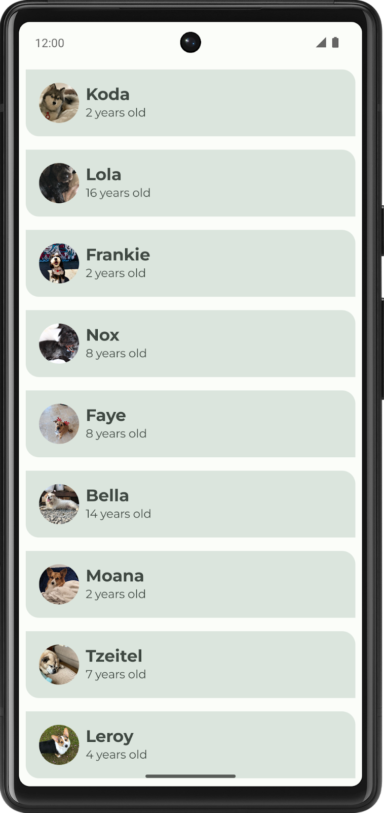 | 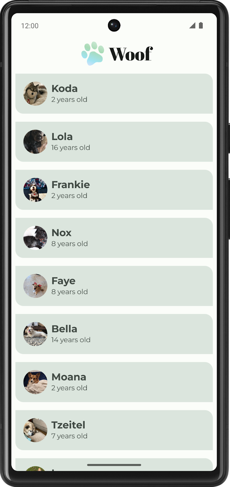 |

では、ダークモードで完成したアプリを見てみましょう。

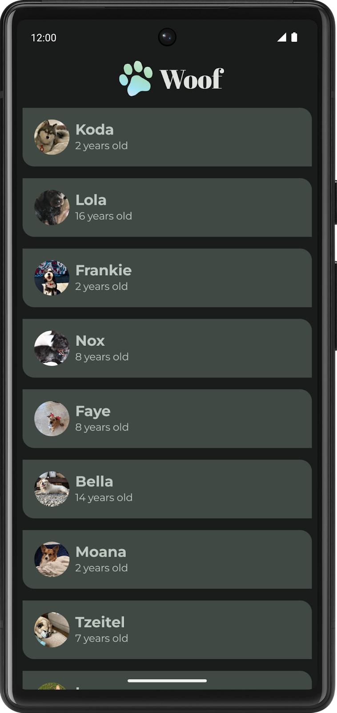

お疲れさまでした。これでこの Codelab は終了です。

### 8. 解答コードを取得する

この Codelab の完成したコードをダウンロードするには、以下の git コマンドを使用します。

```
$ git clone https://github.com/google-developer-training/basic-android-kotlin-compose-training-woof.git
$ cd basic-android-kotlin-compose-training-woof
$ git checkout material
```

または、リポジトリを ZIP ファイルとしてダウンロードし、Android Studio で開くこともできます。

> **注:**解答コードは、ダウンロードしたリポジトリの `material` ブランチにあります。

解答コードを確認する場合は、[GitHub で表示します](https://github.com/google-developer-training/basic-android-kotlin-compose-training-woof/tree/material)。

### 9. まとめ

今回は初めてのマテリアル アプリを作成しました。ライトモードとダークモード用のカスタム カラーパレットを作成し、さまざまなコンポーネントのシェイプを作成するとともに、フォントをダウンロードしてアプリに追加し、美しいトップバーを作成して全体に統一感を持たせました。この Codelab で習得したスキルを生かして、色、シェイプ、タイポグラフィを変更して、自分だけのアプリにカスタマイズしましょう。

#### 概要

- マテリアル テーマ設定では、色、タイポグラフィ、シェイプのカスタマイズに関するガイダンスにより、アプリにマテリアル デザインを適用できます。
- **Theme.kt** ファイルでは、テーマが定義されています。このアプリの場合、`[your app name]+Theme()`-`WoofTheme()` という名前のコンポーザブルを介してテーマが定義されています。この関数内で、`MaterialTheme` オブジェクトはアプリの `color`、`typography`、`shapes`、`content` を設定します。
- **Color.kt** では、アプリで使用する色が一覧表示されます。そして、**Theme.kt** で、特定のスロットに `LightColorPalette` と `DarkColorPalette` の色を割り当てます。すべてのスロットに割り当てる必要はありません。
- アプリで[フォースダーク](https://developer.android.com/guide/topics/ui/look-and-feel/darktheme#force-dark)にオプトインすると、システムによってダークモードが実装されます。ただし、デベロッパーがダークモードを実装してアプリのテーマを完全に制御すると、ユーザー エクスペリエンス向上にさらに有効です。
- **Shape.kt** では、アプリのシェイプを定義します。シェイプには 3 つのサイズ（大、中、小）があり、角の丸みを指定できます。
- シェイプはユーザーの注意を引き、コンポーネントを明確に示し、状態を伝え、ブランドを表現するために役立ちます。
- **Type.kt** では、フォントを初期化し、マテリアル デザインのタイプスケールに `fontFamily`、`fontWeight`、`fontSize` を割り当てます。
- [マテリアル デザインのタイプスケール](https://m3.material.io/styles/typography/type-scale-tokens)には、アプリとそのコンテンツのニーズに対応する、多様で広範なスタイルが用意されています。タイプスケールは、タイプシステムでサポートされる 15 のスタイルを組み合わせたものです。

### 10. 詳細

#### 関連リンク

- [マテリアル デザイン](https://m3.material.io/)
- [タイポグラフィ](https://m3.material.io/styles/typography/overview)
- [シェイプ](https://m3.material.io/styles/shape/overview)
- [色](https://m3.material.io/styles/color/overview)
- [修飾子パラメータ](https://android.googlesource.com/platform/frameworks/support/+/androidx-main/compose/docs/compose-api-guidelines.md#elements-accept-and-respect-a-modifier-parameter)
- [フォースダーク](https://developer.android.com/guide/topics/ui/look-and-feel/darktheme#force-dark)
- [ユーザー補助のコントラスト標準](https://webaim.org/resources/contrastchecker/)
- [Clip](https://developer.android.com/reference/kotlin/androidx/compose/ui/Modifier#(androidx.compose.ui.Modifier).clip(androidx.compose.ui.graphics.Shape))
- [ContentScale](https://developer.android.com/reference/kotlin/androidx/glance/layout/ContentScale)
- [切り抜き](https://developer.android.com/reference/kotlin/androidx/glance/layout/ContentScale#Crop())
- [カード](https://material.io/components/cards)
- [Scaffold](https://developer.android.com/jetpack/compose/layouts/material#scaffold)

## 4. Jetpack Compose でのシンプルなアニメーション


### 1. 始める前に

この Codelab では、Android アプリにシンプルなアニメーションを追加する方法について説明します。アニメーションを使用することで、アプリはよりインタラクティブかつ魅力的で、ユーザーが簡単に解釈できるものになります。画面上いっぱいに情報が表示されていても、変更箇所のそれぞれにアニメーションを適用すれば、ユーザーは何が変更されたかを容易に把握できます。

アプリのユーザー インターフェースで使用できるアニメーションにはさまざまなものがあります。アイテムの表示と非表示をフェードイン / フェードアウトで表現したり、アイテムを画面上で（時には画面外に出ていくように）動かしたり、注意を引く仕方で変形させたりできます。これにより、アプリの UI が表現力豊かなものになり、使いやすくなります。

また、アニメーションでアプリの外観を洗練させることができます。これはエレガントな印象を与えるだけでなく、ユーザーにもメリットがあります。

#### 前提条件

- 関数、ラムダ、ステートレス コンポーザブルなど、Kotlin に関する知識。
- Jetpack Compose でレイアウトを作成する方法に関する基本的な知識。
- Jetpack Compose でリストを作成する方法に関する基本的な知識。
- マテリアル デザインに関する基本的な知識。

#### 学習内容

- Jetpack Compose で簡単なスプリング アニメーションを作成する方法。

#### 作成するアプリの概要

- Jetpack Compose でのマテリアル テーマ設定の Codelab で作成した **Woof** アプリに対し、ユーザーの操作に応答するシンプルなアニメーションを追加します。

#### 必要なもの

- Android Studio の最新の安定版
- スターター コードをダウンロードするためのインターネット接続。

### 2. アプリの概要

Jetpack Compose を使用したマテリアル テーマ設定の Codelab では、マテリアル デザインを使用して、犬とその情報のリストを表示する **Woof** アプリを作成しました。


この Codelab では、**Woof** アプリにアニメーションを追加します。また、好きなことに関する情報を追加して、リストアイテムを展開するとその情報が表示されるようにします。さらに、展開時のリストアイテムをアニメーション化するためのスプリング アニメーションも追加します。

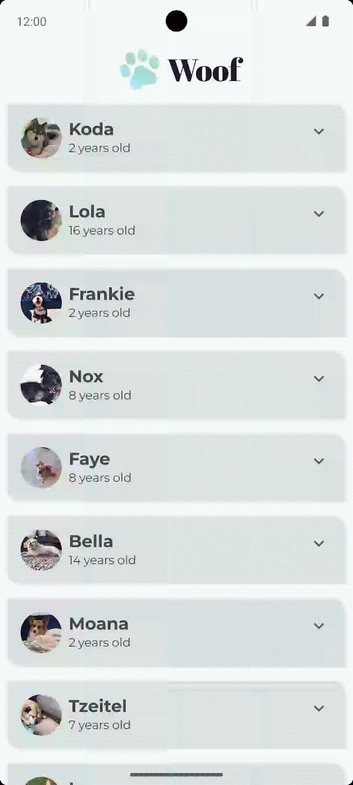

#### **スターター コードを取得する**

まず、スターター コードをダウンロードします。

または、GitHub リポジトリのクローンを作成してコードを入手することもできます。

```
$ git clone https://github.com/google-developer-training/basic-android-kotlin-compose-training-woof.git
$ cd basic-android-kotlin-compose-training-woof
$ git checkout material
```

> **注:**スターター コードは、ダウンロードしたリポジトリの `material` ブランチにあります。

コードは [`Woof app`](https://github.com/google-developer-training/basic-android-kotlin-compose-training-woof/tree/material) GitHub リポジトリで確認できます。

### 3. 展開アイコンを追加する

このセクションでは、アプリに**展開**アイコン  と**閉じる**アイコン  を追加します。


#### Icons

アイコンとは、目的の機能を視覚的に伝達することで、ユーザーがユーザー インターフェースを理解することを助けるシンボルです。多くの場合、アイコンはユーザーがよく知っていると思われる現実の物体から着想を得ています。ほとんどのアイコンのデザインは、ユーザーが即座に理解できる最小限のレベルまで簡略化されています。たとえば、現実の鉛筆は字を書くために使用されるので、通常、鉛筆のアイコンは**作成**や**編集**を表します。

|  写真撮影: [Angelina Litvin](https://unsplash.com/@linalitvina?utm_source=unsplash&utm_medium=referral&utm_content=creditCopyText)（出典: [Unsplash](https://unsplash.com/?utm_source=unsplash&utm_medium=referral&utm_content=creditCopyText)） |  |
|---|---|

マテリアル デザインでは、多くのニーズに対応した[多数のアイコン](https://material.io/resources/icons/?style=baseline)が一般的なカテゴリ別に用意されています。


#### Gradle 依存関係を追加する

プロジェクトに `material-icons-extended` ライブラリ依存関係を追加します。このライブラリの `Icons.Filled.ExpandLess` アイコン  と `Icons.Filled.ExpandMore` アイコン  を使用します。

> **Gradle 依存関係に関する注意**: プロジェクトに依存関係を追加するには、モジュールの `build.gradle.kts` ファイルの `dependencies` ブロックで、implementation などの依存関係構成を指定します。アプリのビルド時、ビルドシステムはライブラリ モジュールをコンパイルし、そのコンパイルしたコンテンツをアプリにパッケージ化します。
> 
> アプリへのライブラリの追加については、後ほど詳しく説明します。

1. [**Project**] ペインで、**[Gradle Scripts] > [build.gradle.kts (Module :app)]** を開きます。
2. `build.gradle.kts (Module :app)` ファイルの最後までスクロールします。`dependencies{}` ブロックに次の行を追加します。

```kotlin
implementation("androidx.compose.material:material-icons-extended")
```

> **ヒント:** Gradle ファイルを変更するたびに、Android Studio によるライブラリのインポートまたは更新と、一部のバックグラウンド タスクの実行が必要になることがあります。Android Studio に、プロジェクトの同期を求めるポップアップが表示されます。[**Sync Now**] をクリックします。
> 
> 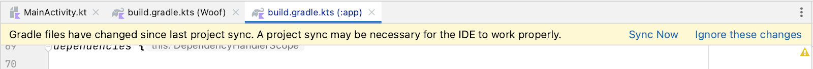

#### アイコン コンポーザブルを追加する

マテリアル アイコン ライブラリの**展開**アイコンを表示する関数を追加して、これをボタンとして使用します。

1. `MainActivity.kt` で、`DogItem()` 関数の後に、`DogItemButton()` という新しいコンポーズ可能な関数を作成します。
2. 展開された状態を示す `Boolean`、ボタンの onClick ハンドラのラムダ式、オプションの `Modifier` を次のように渡します。

```kotlin
@Composable
private fun DogItemButton(
   expanded: Boolean,
   onClick: () -> Unit,
   modifier: Modifier = Modifier
) {
 

}
```

3. `DogItemButton()` 関数内に、`onClick` という名前付きパラメータを受け入れる [`IconButton()`](https://developer.android.com/reference/kotlin/androidx/compose/material/IconButton.composable#IconButton(kotlin.Function0,androidx.compose.ui.Modifier,kotlin.Boolean,androidx.compose.foundation.interaction.MutableInteractionSource,kotlin.Function0)) コンポーザブルを追加します。これは後置ラムダ構文を使用するラムダで、アイコンが押されたときに呼び出される省略可能な `modifier` です。`IconButton's onClick` と `modifier value parameters` に `DogItemButton` に渡されたものと同じ値を設定します。

```kotlin
@Composable
private fun DogItemButton(
   expanded: Boolean,
   onClick: () -> Unit,
   modifier: Modifier = Modifier
){
   IconButton(
       onClick = onClick,
       modifier = modifier
   ) {

   }
}
```

4. `IconButton()` ラムダブロック内に [`Icon`](https://developer.android.com/reference/kotlin/androidx/compose/material/icons/Icons) コンポーザブルを追加し、`imageVector value-parameter` を `Icons.Filled.ExpandMore` に設定します。これが、リストアイテム  の最後に表示されます。Android Studio に `Icon()` コンポーザブルのパラメータに関する警告が表示されますが、これは次のステップで修正します。

```kotlin
import androidx.compose.material.icons.filled.ExpandMore
import androidx.compose.material.icons.Icons
import androidx.compose.material3.Icon
import androidx.compose.material3.IconButton

IconButton(
   onClick = onClick,
   modifier = modifier
) {
   Icon(
       imageVector = Icons.Filled.ExpandMore
   )
}
```

5. パラメータ値 `tint` を追加し、アイコンの色を `MaterialTheme.colorScheme.secondary` に設定します。名前付きパラメータ `contentDescription` を追加し、文字列リソース `R.string.expand_button_content_description` に設定します。

```kotlin
IconButton(
   onClick = onClick,
   modifier = modifier
){
   Icon(
       imageVector = Icons.Filled.ExpandMore,
       contentDescription = stringResource(R.string.expand_button_content_description),
       tint = MaterialTheme.colorScheme.secondary
   )
}
```

#### アイコンを表示する

`DogItemButton()` コンポーザブルをレイアウトに追加して表示します。

1. `DogItem()` の先頭に `var` を追加して、リストアイテムの展開状態を保存します。初期値を `false` に設定します。

```kotlin
import androidx.compose.runtime.getValue
import androidx.compose.runtime.mutableStateOf
import androidx.compose.runtime.remember
import androidx.compose.runtime.setValue

var expanded by remember { mutableStateOf(false) }
```

> **remember() と mutableStateOf() についての復習**
> 
> `mutableStateOf()` 関数を使用して、Compose で状態値の変更を監視し、UI を更新するための再コンポーズをトリガーします。初回コンポーズ時に、Composition に値を格納するために `mutableStateOf()` 関数呼び出しを `remember()` 関数でラップします。格納された値は再コンポーズの際に返されます。

2. リストアイテム内にアイコンボタンを表示します。`DogItem()` コンポーザブルの `Row` ブロックの最後で、`DogInformation()` を呼び出した後に `DogItemButton()` を追加します。コールバック用に `expanded` 状態と空のラムダを渡します。`onClick` アクションは後のステップで定義します。

```kotlin
Row(
   modifier = Modifier
       .fillMaxWidth()
       .padding(dimensionResource(R.dimen.padding_small))
) {
   DogIcon(dog.imageResourceId)
   DogInformation(dog.name, dog.age)
   DogItemButton(
       expanded = expanded,
       onClick = { /*TODO*/ }
   )
}
```

3. [**Design**] ペインで `WoofPreview()` を確認します。


展開ボタンがリストアイテムの末端に配置されていません。これは次のステップで修正します。

#### 展開ボタンを配置する

展開ボタンをリストアイテムの末端に配置するには、[`Modifier.weight()`](https://developer.android.com/reference/kotlin/androidx/compose/foundation/layout/RowScope#(androidx.compose.ui.Modifier).weight(kotlin.Float,kotlin.Boolean)) 属性を使用してスペーサーをレイアウトに追加する必要があります。

> **注:**[`Modifier.weight()`](https://developer.android.com/reference/kotlin/androidx/compose/foundation/layout/RowScope#(androidx.compose.ui.Modifier).weight(kotlin.Float,kotlin.Boolean)) では、UI 要素の幅と高さが、その要素の重みに比例し、重みづけされた兄弟要素（同じ行や列にある他の子要素）に応じて設定されます。
> 
> 例として、1 つの行内に 3 つの子要素があり、重みがそれぞれ `1f`、`1f`、`2f` である場合を考えてみましょう。すべての子要素に重みが割り当てられています。この行で使用できるスペースは、指定された重みの値に比例して分割されます。すなわち、重みの値が大きい子ほどスペースも大きくなります。子要素には以下のように重みが配分されます。
> 
> 
> 
> この行の場合、1 番目の子コンポーザブルの幅は行幅の ¼、2 番目も同じく行幅の ¼、3 番目は行幅の ½ です。
> 
> 子に重みが割り当てられていない場合（重みはオプションのパラメータです）、子コンポーザブルの高さと幅は、コンテンツをラップできるサイズにデフォルトで設定されます（UI 要素内のコンテンツをラップします）。

> **浮動小数点値に関する注意:** Kotlin の浮動小数点数は 10 進数で、数値の末尾の `f` または `F` で表されます。

**Woof** アプリでは、各リストアイテムの行に、犬の写真、犬の情報、展開ボタンが表示されます。展開ボタンが適切な位置に配置されるよう、そのボタンアイコンの前に、重みが `1f` の `Spacer` コンポーザブルを追加します。このスペーサーが行内で唯一重みを持つ子要素であるため、重みを持たない他の子要素の幅が決定された後、行内の残りのスペースを埋めることになります。

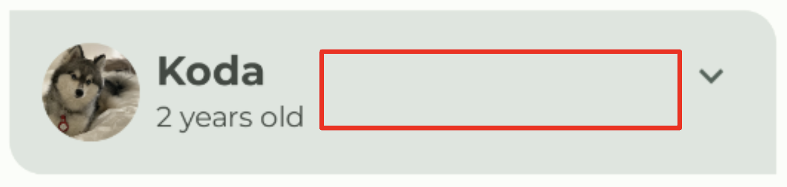

##### スペーサーをリストアイテムの行に追加する

1. `DogItem()` の `DogInformation()` から `DogItemButton()` の間に `Spacer` を追加します。`weight(1f)` で `Modifier` を渡します。[`Modifier.weight()`](https://developer.android.com/reference/kotlin/androidx/compose/foundation/layout/RowScope#(androidx.compose.ui.Modifier).weight(kotlin.Float,kotlin.Boolean)) により、行の残りのスペースがスペーサーで埋められます。

```kotlin
import androidx.compose.foundation.layout.Spacer

Row(
   modifier = Modifier
       .fillMaxWidth()
       .padding(dimensionResource(R.dimen.padding_small))
) {
   DogIcon(dog.imageResourceId)
   DogInformation(dog.name, dog.age)
   Spacer(modifier = Modifier.weight(1f))
   DogItemButton(
       expanded = expanded,
       onClick = { /*TODO*/ }
   )
}
```

2. [**Design**] ペインで `WoofPreview()` を確認します。展開ボタンがリストアイテムの末端に配置されるようになりました。

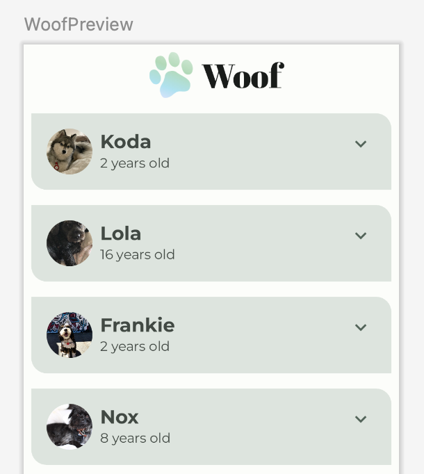

### 4. 好きなことを表示するコンポーザブルを追加する

このタスクでは、`Text` コンポーザブルを追加して犬の好きなことの情報を表示します。

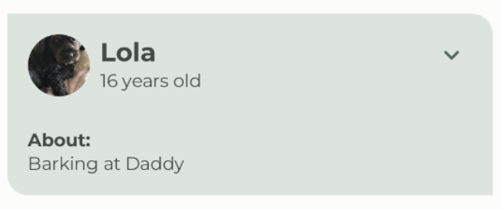

1. 新しいコンポーズ可能な関数を作成します。これは、犬の好きなことの文字列リソース ID とオプションの `Modifier` を受け取る `DogHobby()` です。

```kotlin
@Composable
fun DogHobby(
   @StringRes dogHobby: Int,
   modifier: Modifier = Modifier
) {
}
```

2. `DogHobby()` 関数内で `Column` を作成し、`DogHobby()` に渡された修飾子を渡します。

```kotlin
@Composable
fun DogHobby(
   @StringRes dogHobby: Int,
   modifier: Modifier = Modifier
){
   Column(
       modifier = modifier
   ) { 

   }
}
```

3. `Column` ブロック内に 2 つの `Text` コンポーザブルを追加します。一つは好きなことの情報の上に **About** テキストを表示し、もう一つは好きなことの情報を表示します。

最初の `text` を **strings.xml** ファイルの `about` に設定し、`style` を `labelSmall` として設定します。2 つ目の `text` は、渡された `dogHobby` に設定し、`style` を `bodyLarge` に設定します。

```kotlin
Column(
   modifier = modifier
) {
   Text(
       text = stringResource(R.string.about),
       style = MaterialTheme.typography.labelSmall
   )
   Text(
       text = stringResource(dogHobby),
       style = MaterialTheme.typography.bodyLarge
   )
}
```

4. `DogItem()` では、`DogHobby()` コンポーザブルは、`DogIcon()`、`DogInformation()`、`Spacer()`、`DogItemButton()` を含む `Row` の下位になります。これを行うには、`Row` を `Column` でラップして、好きなことを `Row` の下に追加できるようにします。

```kotlin
Column() {
   Row(
       modifier = Modifier
           .fillMaxWidth()
           .padding(dimensionResource(R.dimen.padding_small))
   ) {
       DogIcon(dog.imageResourceId)
       DogInformation(dog.name, dog.age)
       Spacer(modifier = Modifier.weight(1f))
       DogItemButton(
           expanded = expanded,
           onClick = { /*TODO*/ }
       )
   }
}
```

5. `Row` の後に、`Column` の 2 番目の子として `DogHobby()` を追加します。`dog.hobbies` を渡します。これには、渡された犬に固有の好きなことと、`DogHobby()` コンポーザブルのパディングが設定された `modifier` が含まれます。

```kotlin
Column() {
   Row() {
      ...
   }
   DogHobby(
       dog.hobbies,
       modifier = Modifier.padding(
           start = dimensionResource(R.dimen.padding_medium),
           top = dimensionResource(R.dimen.padding_small),
           end = dimensionResource(R.dimen.padding_medium),
           bottom = dimensionResource(R.dimen.padding_medium)
       )
   )
}
```

> **犬の好きなことに関する注意事項:** すべての犬の好きなことに関する情報は、スターター コードの一部としてすでに提供されています。コード内でこれを確認するには、`data/Dog.kt` ファイルを開き、犬の情報があらかじめ入力されている `dogs` リストを確認します。

完全な `DogItem()` 関数は次のようになるはずです。

```kotlin
@Composable
fun DogItem(
   dog: Dog,
   modifier: Modifier = Modifier
) {
   var expanded by remember { mutableStateOf(false) }
   Card(
       modifier = modifier
   ) {
       Column() {
           Row(
               modifier = Modifier
                   .fillMaxWidth()
                   .padding(dimensionResource(R.dimen.padding_small))
           ) {
               DogIcon(dog.imageResourceId)
               DogInformation(dog.name, dog.age)
               Spacer(Modifier.weight(1f))
               DogItemButton(
                   expanded = expanded,
                   onClick = { /*TODO*/ },
               )
           }
           DogHobby(
               dog.hobbies, 
               modifier = Modifier.padding(
                   start = dimensionResource(R.dimen.padding_medium),
                   top = dimensionResource(R.dimen.padding_small),
                   end = dimensionResource(R.dimen.padding_medium),
                   bottom = dimensionResource(R.dimen.padding_medium)
               )
           )
       }
   }
}
```

6. [**Design**] ペインで `WoofPreview()` を確認します。犬の好きなことが表示されるようになりました。

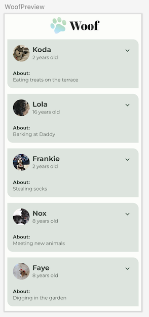

### 5. ボタンのクリックで好きなことの表示 / 非表示を切り替える

アプリの各リストアイテムに**展開ボタン**が表示されるようになりましたが、ボタンにはまだ何の機能もありません。このセクションでは、ユーザーが展開ボタンをクリックしたときに、好きなことの情報を表示または非表示にするオプションを追加します。

1. コンポーズ可能な関数 `DogItem()` の `DogItemButton()` 関数呼び出し内で `onClick()` ラムダ式を定義し、ボタンがクリックされたときに `expanded` 状態値（ブール値）を `true` に変更し、ボタンが再度クリックされると `false` に戻るようにします。

```kotlin
DogItemButton(
   expanded = expanded,
   onClick = { expanded = !expanded }
)
```

> **注:** 論理否定演算子（ ! ）は、`Boolean` 式の値を反転して返します。
> 
> たとえば、`expanded` が `true` の場合、`!expanded` は `false` と評価されます。

2. `DogItem()` 関数で、`DogHobby()` 関数呼び出しを `expanded` ブール値の `if` チェックでラップします。

```kotlin
@Composable
fun DogItem(
   dog: Dog,
   modifier: Modifier = Modifier
) {
   var expanded by remember { mutableStateOf(false) }
   Card(
       ...
   ) {
       Column(
           ...
       ) {
           Row(
               ...
           ) {
               ...
           }
           if (expanded) {
               DogHobby(
                   dog.hobbies, modifier = Modifier.padding(
                       start = dimensionResource(R.dimen.padding_medium),
                       top = dimensionResource(R.dimen.padding_small),
                       end = dimensionResource(R.dimen.padding_medium),
                       bottom = dimensionResource(R.dimen.padding_medium)
                   )
               )
           }
       }
   }
}
```

これで、`expanded` の値が `true` の場合にのみ、犬の好きなことの情報が表示されるようになりました。

3. プレビューで UI の外観を確認できます。また、UI を操作することもできます。UI プレビューを操作するには、[**Design**] ペインで WoofPreview テキストにカーソルを合わせ、[**Design**] ペインの右上隅にある**インタラクティブ モード**のボタン  をクリックします。クリックすると、インタラクティブ モードでプレビューが開始されます。


4. 展開ボタンをクリックして、プレビューを操作します。展開ボタンをクリックすると、犬の好きなことに関する情報の表示 / 非表示が切り替わります。


> **注:** インタラクティブ モードを停止するには、プレビュー ペインの左上隅にある [**Stop Interactive Mode**] をクリックします。
> 
> 

このままでは、リストアイテムを展開しても、展開ボタンのアイコンは変化しません。ユーザー エクスペリエンスを向上させるために、`ExpandMore` で下向きの矢印  を表示し、`ExpandLess` で上向きの矢印  を表示するようにアイコンを変更します。

5. `DogItemButton()` 関数に、`expanded` 状態に基づいて `imageVector` 値を更新する `if` ステートメントを次のように追加します。

```kotlin
import androidx.compose.material.icons.filled.ExpandLess

@Composable
private fun DogItemButton(
   ...
) {
   IconButton(onClick = onClick) {
       Icon(
           imageVector = if (expanded) Icons.Filled.ExpandLess else Icons.Filled.ExpandMore,
           ...
       )
   }
}
```

前のコード スニペットで `if-else` をどのように記述しているか確認してください。

`if (expanded) Icons.Filled.ExpandLess else Icons.Filled.ExpandMore`

これは、次のコードで中かっこ { } を使用する場合と同じです。

`if (expanded) {`

```kotlin
`Icons.Filled.ExpandLess`
```

`} else {`

```kotlin
`Icons.Filled.ExpandMore`
```

`}`

`if`-`else` ステートメントにコードが 1 行ある場合、中かっこは省略可能です。

6. デバイスまたはエミュレータでアプリを実行するか、もう一度プレビューでインタラクティブ モードを使用します。`ExpandMore` のアイコン  と `ExpandLess` のアイコン  が交互に表示されます。


> **インタラクティブ モードに関する注意**: インタラクティブ モードのプレビューは、デバイス上と同じように操作できます。ただし、このプレビュー モードは、デバイス上で行うアプリのテスト実行に置き換わるものではありません。

これで、アイコンの更新が完了しました。

リストアイテムを展開した際に、高さが瞬間的に変わったことに気づいたでしょうか。高さが瞬間的に変わってしまうと、洗練されたアプリには見えません。次はこの問題を解決するために、アプリにアニメーションを追加します。

### 6. アニメーションを追加する

アニメーションを使用すると、アプリ内で何が起こっているのかを、視覚的な手掛かりを通じてユーザーにわかりやすく伝えることができます。アニメーションは、新しいコンテンツがロードされたときや、新しいアクションが利用可能になったときなど、UI の状態が変化したときに特に役立ちます。また、アニメーションにより、アプリの外観が洗練されたものになります。

このセクションでは、スプリング アニメーションを追加して、リストアイテムの高さの変化をアニメーションにします。

#### スプリング アニメーション

[スプリング アニメーション](https://developer.android.com/jetpack/compose/animation#spring)は、**ばねの力**で動く物理学ベースのアニメーションです。スプリング アニメーションでは、適用されるばねの力に基づいて動きの値と速度が計算されます。

たとえば、画面上でアプリアイコンをドラッグし、アイコンから指を離すと、目に見えない力によってアイコンが元の位置に勢いよく戻ります。

次のアニメーションは、ばねの効果を示しています。アイコンから指を離すと、アイコンがばねのように再び元の場所に戻ります。


ばねの効果

ばねの力は、次の 2 つの特性に応じて決まります。

- **減衰率**: ばねの弾力性。
- **剛性のレベル**: ばねの固さ。ばねの収縮の速さを示す。

以下は、[減衰率と剛性のレベルが異なる](https://developer.android.com/reference/kotlin/androidx/compose/animation/core/Spring)アニメーションの例です。

| 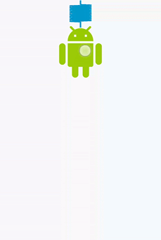弾力が強い | 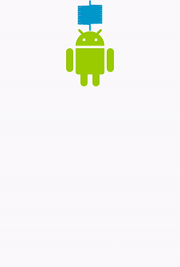弾力なし |
|---|---|

| 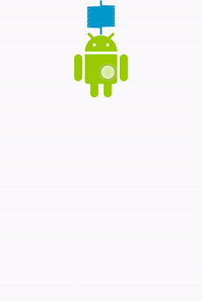剛性が高い | 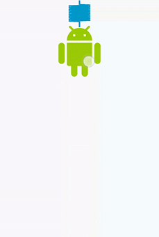剛性がとても低い |
|---|---|

コンポーズ可能な関数 `DogItem()` の `DogHobby()` 関数呼び出しを見てみましょう。このコンポジションには、`expanded` のブール値に基づく、犬の好きなことに関する情報が含まれています。リストアイテムの高さは、好きなことの情報の表示 / 非表示に応じて変化します。現時点では、表示 / 非表示の遷移がスムーズではありません。このセクションでは、[`animateContentSize`](https://developer.android.com/jetpack/compose/animation/composables-modifiers#animateContentSize) 修飾子を使用して、展開された状態と閉じられた状態とでよりスムーズな遷移が行われるようにします。

```kotlin
// No need to copy over
@Composable
fun DogItem(...) {
  ...
    if (expanded) {
       DogHobby(
          dog.hobbies, 
          modifier = Modifier.padding(
              start = dimensionResource(R.dimen.padding_medium),
              top = dimensionResource(R.dimen.padding_small),
              end = dimensionResource(R.dimen.padding_medium),
              bottom = dimensionResource(R.dimen.padding_medium)
          )
      )
   }
}
```

1. `MainActivity.kt` の `DogItem()` で、`modifier` パラメータを `Column` レイアウトに追加します。

```kotlin
@Composable
fun DogItem(
   dog: Dog, 
   modifier: Modifier = Modifier
) {
   ...
   Card(
       ...
   ) {
       Column(
          modifier = Modifier
       ){
           ...
       }
   }
}
```

2. 修飾子を [`animateContentSize`](https://developer.android.com/jetpack/compose/animation#animateContentSize) 修飾子と連結して、サイズ（リストアイテムの高さ）の変化をアニメーション化します。

```kotlin
import androidx.compose.animation.animateContentSize

Column(
   modifier = Modifier
       .animateContentSize()
)
```

この実装により、アプリのリストアイテムの高さをアニメーション化することはできるものの、そのアニメーションは非常に微細でアプリの実行時に識別するのは困難です。この問題を解決するために、オプションの [`animationSpec`](https://developer.android.com/reference/kotlin/androidx/compose/animation/core/AnimationSpec) パラメータを使用して、アニメーションをカスタマイズします。

3. Woof では、弾む動作なしでゆっくりと動くアニメーションにします。そうするために、`animateContentSize()` 関数呼び出しに `animationSpec` パラメータを追加します。それを [`DampingRatioNoBouncy`](https://developer.android.com/reference/kotlin/androidx/compose/animation/core/Spring#DampingRatioNoBouncy()) でスプリング アニメーションに設定して弾みをなくし、[`StiffnessMedium`](https://developer.android.com/reference/kotlin/androidx/compose/animation/core/Spring#StiffnessMedium()) パラメータでスプリングを少し強固にします。

```kotlin
import androidx.compose.animation.core.Spring
import androidx.compose.animation.core.spring

Column(
   modifier = Modifier
       .animateContentSize(
           animationSpec = spring(
               dampingRatio = Spring.DampingRatioNoBouncy,
               stiffness = Spring.StiffnessMedium
           )
       )
)
```

4. [**Design**] ペインで `WoofPreview()` を確認し、インタラクティブ モードを使用するか、エミュレータまたはデバイスでアプリを実行してスプリング アニメーションの動作を確認します。


お疲れさまでした。アニメーション付きの美しいアプリをお楽しみください。

### 7. （省略可）他のアニメーションを試す

#### animate*AsState

[`animate*AsState()`](https://developer.android.com/jetpack/compose/animation/value-based#animate-as-state) 関数は、Compose で単一の値をアニメーション化するための最もシンプルなアニメーション API です。終了値（またはターゲット値）を指定するだけで、API は現在の値から指定された終了値までのアニメーションを開始します。

Compose には、`Float`、`Color`、`Dp`、`Size`、`Offset`、`Int` など、多数のデータ型に使える `animate*AsState()` 関数が用意されています。汎用型を受け入れる `animateValueAsState()` を使用すると、他のデータ型のサポートを簡単に追加できます。

リストアイテムの展開時に色を変更するには、`animateColorAsState()` 関数を試してみてください。

1. `DogItem()` で色を宣言し、その初期化を `animateColorAsState()` 関数に委任します。

```kotlin
import androidx.compose.animation.animateColorAsState

@Composable
fun DogItem(
   dog: Dog,
   modifier: Modifier = Modifier
) {
   var expanded by remember { mutableStateOf(false) }
   val color by animateColorAsState()
   ...
}
```

2. `expanded` のブール値に応じて、`targetValue` 名前付きパラメータを設定します。リストアイテムが展開されている場合は、リストアイテムを `tertiaryContainer` 色に設定します。展開されていない場合は、`primaryContainer` 色に設定します。

```kotlin
import androidx.compose.animation.animateColorAsState

@Composable
fun DogItem(
   dog: Dog,
   modifier: Modifier = Modifier
) {
   var expanded by remember { mutableStateOf(false) }
   val color by animateColorAsState(
       targetValue = if (expanded) MaterialTheme.colorScheme.tertiaryContainer
       else MaterialTheme.colorScheme.primaryContainer,
   )
   ...
}
```

3. `color` をバックグラウンド修飾子として `Column` に設定します。

```kotlin
@Composable
fun DogItem(
   dog: Dog, 
   modifier: Modifier = Modifier
) {
   ...
   Card(
       ...
   ) {
       Column(
           modifier = Modifier
               .animateContentSize(
                   ...
                   )
               )
               .background(color = color)
       ) {...}
}
```

4. リストアイテムが展開されているときの色の変化を確認します。閉じられているリストアイテムは `primaryContainer` 色、展開されているリストアイテムは `tertiaryContainer` 色です。

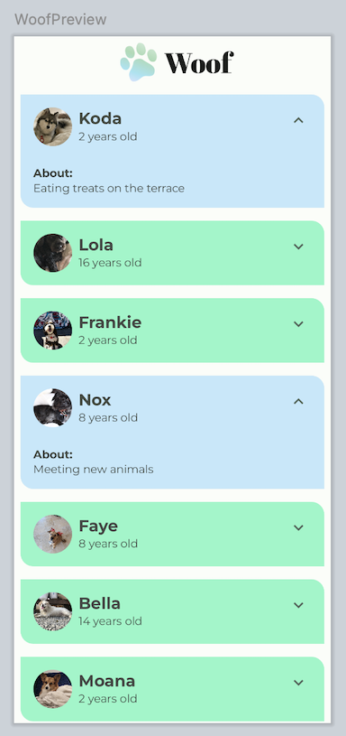

### 8. 解答コードを取得する

この Codelab の完成したコードをダウンロードするには、次の git コマンドを使用します。

```
$ git clone https://github.com/google-developer-training/basic-android-kotlin-compose-training-woof.git
```

または、リポジトリを ZIP ファイルとしてダウンロードし、Android Studio で開くこともできます。

> **注:**解答コードは、ダウンロードしたリポジトリの `main` ブランチにあります。

解答コードを確認する場合は、[GitHub で表示します](https://github.com/google-developer-training/basic-android-kotlin-compose-training-woof/tree/main)。

### 9. まとめ

お疲れさまでした。犬に関する情報の表示 / 非表示を切り替えるボタンを追加できました。スプリング アニメーションを使用して、ユーザー エクスペリエンスを向上させました。また、[**Design**] ペインでインタラクティブ モードを使用する方法も学習しました。

別の種類の [Jetpack Compose アニメーション](https://developer.android.com/jetpack/compose/animation)を試すことも可能です。作成したら、#AndroidBasics を付けて、ソーシャル メディアで共有しましょう。

#### **詳細**

- [Jetpack Compose でのアニメーション](https://developer.android.com/jetpack/compose/animation)
- Codelab: [Jetpack Compose で要素をアニメーション化する](https://developer.android.com/codelabs/jetpack-compose-animation)

## 5. ユーザー補助機能のテスト


### 1. はじめに

この Codelab では、アプリのユーザー補助機能をテストして改善する方法を学習します。

視覚、色覚、または聴覚に障がいのある方、細かい作業に支障のある方、認知障がいのある方など、障がいのある多くの方々が Android デバイスを使って、普段の生活でさまざまな操作を行っています。ユーザー補助を念頭に置いてアプリを開発すると、特に上記やその他の補助が必要なユーザーのエクスペリエンスを高めることができます。

この Codelab では、**TalkBack** と**スイッチ アクセス**を使用して、**Woof** アプリのユーザー補助機能をテストします。

- **TalkBack** を利用すると、ユーザーは画面を見ずにデバイスを操作できます。
- **スイッチ アクセス**を利用すると、タッチ スクリーンの代わりにスイッチを使ってアプリを操作できます。

#### **学習内容**

- TalkBack を使用してアプリを操作する方法
- タッチ スクリーンの代わりにスイッチ アクセスを使用してアプリを操作する方法
- UI を最適化してユーザー補助機能を改善する方法

#### **必要なもの**

- Android Studio がインストールされているパソコン
- Google Play ストア アプリにアクセス可能であるか、または Android ユーザー補助設定ツールがすでにインストールされている Android デバイスまたはエミュレータ
- **Woof** アプリの解答コード

### 2. セットアップする

#### 設定方法

#### スターター コードをダウンロードする

Android Studio で `android-basics-kotlin-compose-woof` フォルダを開きます。

> **スターター コードの URL:**
> 
> [**`https://github.com/google-developer-training/basic-android-kotlin-compose-training-woof`**](https://github.com/google-developer-training/basic-android-kotlin-compose-training-woof)
> 
> **スターター コードのブランチ名:**`main`

Android Studio で **Woof** アプリコードを開きます。

#### **デバイスのセットアップ**

デバイスまたはエミュレータにすでに Android ユーザー補助設定ツールをインストールしている場合は、この手順を省略できます。TalkBack やスイッチ アクセスへのアクセス用に Android ユーザー補助設定ツールをインストールする必要がある場合は、以下の手順を行ってください。

> **注:** 可能な場合、この Codelab には実機を使用することをおすすめします。実機があれば、以下のセットアップ手順を行う必要はありません。

##### **Google Play ストア アプリでデバイスを設定する**

実機を使用している場合は、以下の点をご確認ください。

- Play ストア アプリにアクセスできること
- Google アカウントにログインしていること
- Play ストア アプリからデバイスにアプリをダウンロードする権限があること

エミュレータを使用している場合は、以下の手順に沿って、エミュレータに Play ストア アプリへのアクセス権をセットアップします。

1. Android Studio で**デバイス マネージャー**を開き、[**Create Device**] を選択します。
2. [**Pixel 8**]、または [**Play Store**] 列に Play ストア アプリのアイコンが表示されている任意のデバイスを選択します。このアイコンは、このエミュレータに Google Play ストア アプリが付属していることを示します。

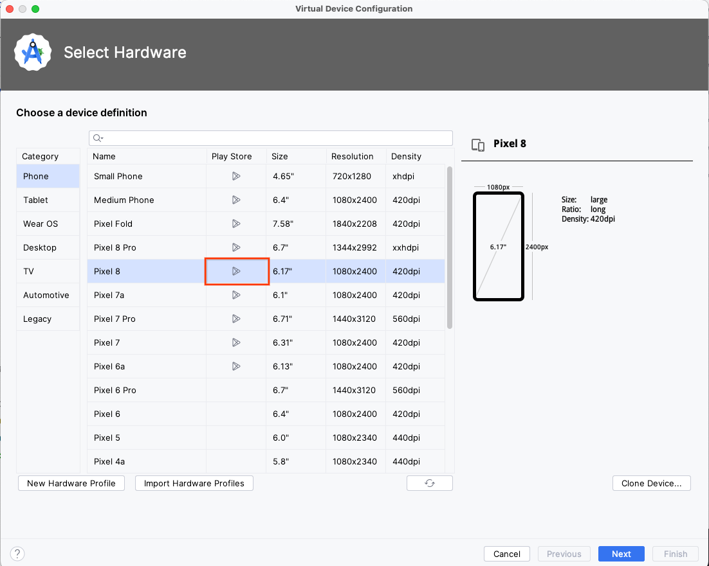

3. [**Next**] をクリックしてエミュレータの作成に進みます。新しいハードウェア プロファイル作成を完了する方法について復習が必要な場合は、こちらの Codelab セクションの動画をご覧ください。
4. エミュレータを作成したら、**デバイス マネージャー**で矢印アイコンをクリックして起動します。

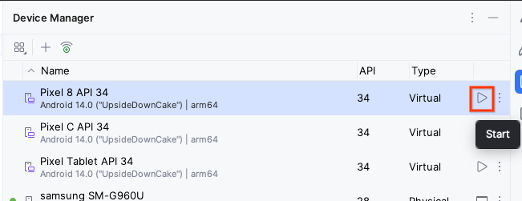

5. エミュレータで Play ストア アプリを起動し、有効な Google アカウントでログインします。

> **注:**Play ストア アプリ ランチャーが下記の場所にない場合は、[**All Apps**] 画面を確認してください。

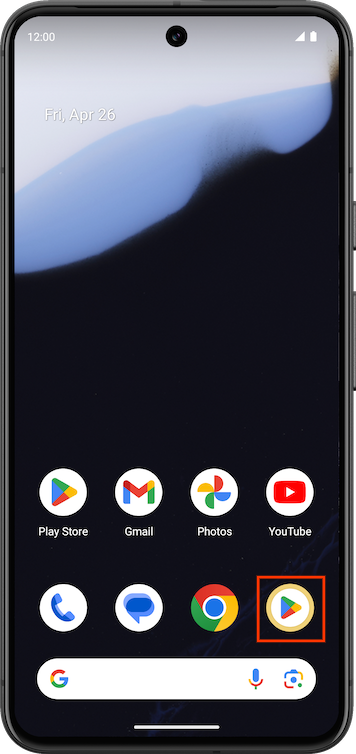

##### Android ユーザー補助設定ツール アプリをインストールする

Android ユーザー補助設定ツールには、さまざまなユーザー補助アプリが用意されています。それらは、この Codelab で後述する **TalkBack** と**スイッチ アクセス**を使用する場合に必要になります。

1. Google Play ストア アプリで、[**Android ユーザー補助設定ツール**](https://play.google.com/store/apps/details?id=com.google.android.marvin.talkback) アプリをインストールします。

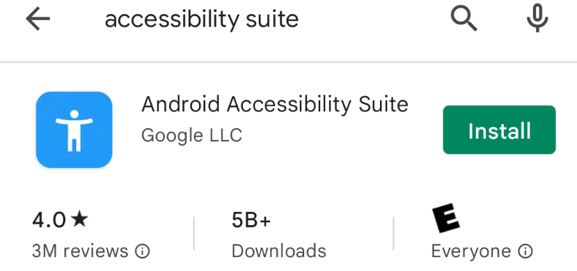

#### Woof アプリをインストールする

このセクションの冒頭で新しい Google Pixel 4 ハードウェア プロファイルを作成した場合は、ダウンロードした解答コードから **Woof** アプリをインストールする必要があります。

### 3. TalkBack で Woof を使用する

[**TalkBack**](https://support.google.com/accessibility/android/answer/6283677) は Google のスクリーン リーダーです。音声フィードバックが得られるため、画面を見ずにデバイスを操作できます。これは視覚に障がいのある方に特に役立ちます。

TalkBack を有効にすると、ユーザーは音声フィードバックやジェスチャー（スワイプやタップなど）でデバイスを操作できるようになります。デベロッパーは TalkBack を使って操作することで、アプリの改善点を効果的に特定できます。

以下の手順に沿って、TalkBack に関する理解を深めてください。

> **注:** **TalkBack** がオンになっている場合は、タップして項目を選択し、ダブルタップして有効にします。スワイプとシステム ナビゲーションは 2 本の指で行います。

1. TalkBack を設定して使用する方法については、次の動画をご覧ください。

> **注:** この動画にアクセスできない場合は、こちらの[ドキュメント](https://support.google.com/accessibility/android/answer/6283677)をご覧ください。

2. **TalkBack** に慣れたら、学んだことを **Woof** アプリに適用してみましょう。

> **注:** エミュレータの TalkBack の音声は、音量が小さい場合や音質が悪い場合があります。その場合はエミュレータで音量を上げてみてください。

3. **TalkBack** 機能を無効にしてから次のセクションに進んでください。**Talkback** を無効にする手順は次のとおりです。

デバイスまたはエミュレータで、[**Settings**] を開きます。

[**Accessibility**]、[**TalkBack**] の順に選択します。

[**Use TalkBack**] をオフにします。

[**OK**] を選択します。

TalkBack を無効にする方法について詳しくは、[サポート ドキュメント](https://support.google.com/accessibility/android/answer/6007100)をご覧ください。オプションには、エミュレータでは使用できないものもあります。また、特定のバージョンの Android ではサポートが終了しているものもあります。

### 4. スイッチ アクセスで Woof を使用する

スイッチ アクセスを利用すると、タッチスクリーンの代わりにスイッチを使って Android デバイスを操作できます。タッチスクリーンの代わりにスイッチを使用する方法は、特に細かい操作が難しいユーザーに役立ちます。

スイッチ アクセスは、画面上の項目をスキャンして、各項目を順番にハイライト表示します。目的の項目がハイライト表示されたらその項目を選択できます。

スイッチ アクセスを使うには、まずスイッチを準備する必要があります。スイッチにはいくつかの種類がありますが、この Codelab では、組み込みの音量ボタンを Android デバイスで使用します。

1. [**スイッチ アクセス**](https://support.google.com/accessibility/android/answer/6122836)を設定して使用する方法については、次の動画をご覧ください。

> **注:** この動画にアクセスできない場合は、こちらの[ドキュメント](https://support.google.com/accessibility/android/answer/6122836)をご覧ください。

2. 動画の指示に従って音量ボタンを設定すると、スイッチ アクセスによって音量小ボタンをクリックして、アプリ内の各種の要素に移動できるようになります。ハイライト表示された要素は、音量大ボタンを使用して選択できます。

クリック操作が単純であるアイテムの場合は、アイテムを選択することでタップ操作と同じ結果が得られます。カスタムのユーザー補助アクションが可能なアイテムの場合は、アイテムを選択すると、そのアイテムに対して可能な複数のアクションが表示されます。

スイッチ アクセスを有効にすると、デバイスの画面上部に [**Menu**] タブが表示されます。このタブを選択すると、ナビゲーション オプション（[**Back**]、[**Home**] など）があるグローバル メニューが開きます。これはデバイスの画面でのジェスチャーに相当します。オプションの中には、スイッチ アクセスの動作をカスタマイズするものもあります。

3. **スイッチ アクセス** に慣れたら、学んだことを**Woof** アプリに適用してみましょう。
4. **スイッチ アクセス**を無効にしてから、次のセクションに進んでください。

### 5. UI のユーザー補助機能を改善する

アプリを使いやすくするには、さまざまな UI デザインを検討する必要があります。TalkBack やスイッチ アクセスを効果的に使用するための属性と動作に加えて、UI を最適化してアプリのユーザー補助を改善する方法を紹介します。

#### **コンテンツの説明**

スクリーン リーダー（TalkBack など）のようなユーザー補助サービスのユーザーは、コンテンツの説明によってインターフェース内の要素の意味を理解します。

要素内で画像を使って情報を伝えるときなど、コンテンツの説明で、その要素に関連付けられている意味やアクションをテキストで説明できることもあります。

ユーザー インターフェースの要素にコンテンツ ラベルが設定されていないと、ユーザーが目的の情報を理解したり、インターフェースで操作を実行したりすることが難しくなる可能性があります。Compose では、`contentDescription` 属性を使用して視覚要素を説明できます。厳密な装飾が施された視覚要素については、`contentDescription` を `null` に設定してもかまいません。コンテンツの説明を適用する方法について詳しくは、こちらの[ドキュメント](https://developer.android.com/jetpack/compose/accessibility#describe-visual)をご覧ください。

#### タップ ターゲットのサイズ

ユーザーが操作できる画面上の要素はすべて、確実に操作できるよう十分な大きさにする必要があります。クリック可能なアイテムのタップ ターゲットの最小サイズは、高さ 48 dp x 幅 48 dp です。マテリアル デザイン コンポーネントには、Compose が適切な最小ターゲット サイズを自動的に割り当てるものがいくつかあります。タップ ターゲットの最小サイズは、48 dp 未満のクリック可能なコンポーネントを指します。48 dp を超えるコンポーネントには、コンポーネントのサイズ以上のタップ ターゲットが設定されます。タップ ターゲットのサイズについて詳しくは、以下のリソースをご覧ください。

1. 最小ターゲット サイズについては、[Compose のユーザー補助のドキュメント](https://developer.android.com/jetpack/compose/accessibility#minimum-target-sizes)をご覧ください。
2. タップ ターゲットのサイズについては、Google ユーザー補助機能の新機能の動画をご覧ください。

**Woof** アプリのコードを見てみましょう。**MainActivity.kt** では、`DogItemButton` コンポーザブルは `IconButton` コンポーザブルを使用します。

```kotlin
@Composable
private fun DogItemButton(
   expanded: Boolean,
   onClick: () -> Unit,
   modifier: Modifier = Modifier
) {
   IconButton(onClick = onClick) {
       Icon(
           imageVector = if (expanded) Icons.Filled.ExpandLess else Icons.Filled.ExpandMore,
           tint = MaterialTheme.colors.secondary,
           contentDescription = stringResource(R.string.expand_button_content_description),
       )
   }
}
```

`IconButton` はマテリアル デザイン コンポーネントです。[`IconButton` コンポーザブルのドキュメント](https://developer.android.com/reference/kotlin/androidx/compose/material/IconButton.composable#IconButton(kotlin.Function0,androidx.compose.ui.Modifier,kotlin.Boolean,androidx.compose.foundation.interaction.MutableInteractionSource,kotlin.Function0))では、タップ ターゲットの最小サイズは 48 dp x 48 dp であるとされています。

以下のコードは `IconButton` のソースコードです。修飾子は `minimumTouchTargetSize()` を設定しています。

```kotlin
@Composable
fun IconButton(
   onClick: () -> Unit,
   modifier: Modifier = Modifier,
   enabled: Boolean = true,
   interactionSource: MutableInteractionSource = remember { MutableInteractionSource() },
   content: @Composable () -> Unit
) {
   Box(
       modifier = modifier
           .minimumTouchTargetSize()
           .clickable(
               onClick = onClick,
               enabled = enabled,
               role = Role.Button,
               interactionSource = interactionSource,
               indication = rememberRipple(bounded = false, radius = RippleRadius)
           ),
       contentAlignment = Alignment.Center
   ) {
       val contentAlpha = if (enabled) LocalContentAlpha.current else ContentAlpha.disabled
       CompositionLocalProvider(LocalContentAlpha provides contentAlpha, content = content)
   }
}
```

> **注**: 上記の `IconButton` のコードは、**Woof** アプリのコードには直接記述されていません。これは Compose Material ライブラリから取得された `IconButton` のソースコードです。任意の手順として、このコードを自分で見つけるには、`MainActivity` で `IconButton` の呼び出しを右クリックして、**[Go To] > [Declaration] または [Usages]** を選択します。

#### 色のコントラスト

アプリのインターフェースに選択する色は、インターフェースの読みやすさとわかりやすさに影響します。色のコントラストが十分にあれば、テキストや画像は読みやすく、わかりやすくなります。

視覚障害の方が利用しやすくなるだけでなく、色のコントラストを十分に確保することは、直射日光が当たっている場合やディスプレイの輝度が低い場合など、極端な照明環境でデバイスのインターフェースを利用するあらゆるユーザーの方に役立ちます。

色のコントラストを最適化する方法について詳しくは、[Android ユーザー補助機能のヘルプ ドキュメント](https://support.google.com/accessibility/android/answer/7158390)をご覧ください。このリンクでは、使用する色を決める際に参考となるコントラスト比を確認できます。また、[このツール](https://webaim.org/resources/contrastchecker/)を使用して背景色と前景色をテストして、色のコントラスト比を十分に確保することができます。小さい文字サイズの推奨比率は 4.5 : 1、大きい文字サイズの推奨比率は 3.0 : 1 です。

**Woof** アプリについては、デザイナーが色を選択し、その色のコントラストが十分であることを確認しました。独自にアプリを作成する場合は、色のコントラストを必ず確認してください。マテリアル デザインの[カラーツール](https://material.io/resources/color/#!/?view.left=0&view.right=0)には、プライマリ カラーとセカンダリ カラーの上に適切なテキストカラーを表示するユーザー補助機能タブがあります。

### 6. まとめ

新しいアプリを作成する際や既存のアプリに新機能を追加する際は、ユーザー補助に留意することが重要です。ユーザー補助の機能とサービスを組み込むことで、特に障がいを持つユーザーのために、アプリの利便性を改善できます。

#### 詳細

- [ユーザー補助の設計](https://m3.material.io/foundations/accessible-design/overview)
- [Jetpack Compose のユーザー補助](https://developer.android.com/codelabs/jetpack-compose-accessibility#0)
- Android アプリのユーザー補助機能を強化する

## 6. 演習: スーパーヒーローのアプリを作成する（提出対象）


### 1. 始める前に

お疲れさまでした。このパスウェイでは、マテリアル デザインの基本と、アプリにシンプルなアニメーションを追加する方法を学習しました。次に、学習した内容を実践してみましょう。

この演習セットでは、パスウェイで学習したコンセプトを活用して**スーパーヒーロー**のアプリを作成します。このアプリでは、Jetpack Compose でのマテリアル テーマ設定 Codelab で学習したマテリアル デザインの原則に基づいて、スクロール可能なリストに必要なコンポーネントと洗練された UI を作成します。

解答コードは最後に掲載されていますが、演習に取り組んでから解答を確認するようにしてください。解答はアプリを実装する方法の一つと捉えましょう。改善の余地はたくさんあるので、いろいろなことを自由に試してください。

ご自分に合ったペースで問題に取り組みましょう。必要なだけ時間をかけ、じっくりと問題に取り組んでください。

#### 前提条件

- Jetpack Compose でのシンプルなアニメーションを通じて、「Compose での Android の基礎」コースワークを完了していること。

#### 必要なもの

- Android Studio がインストールされた、インターネットに接続できるパソコン。

#### 作成するアプリの概要

スーパーヒーローのリストを表示する**スーパーヒーロー** アプリを作成します。

完成したアプリの外観は、ライトモードとダークモードで次のようになります。

| 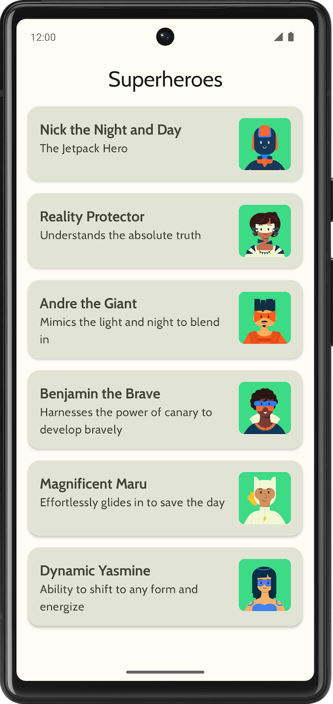 | 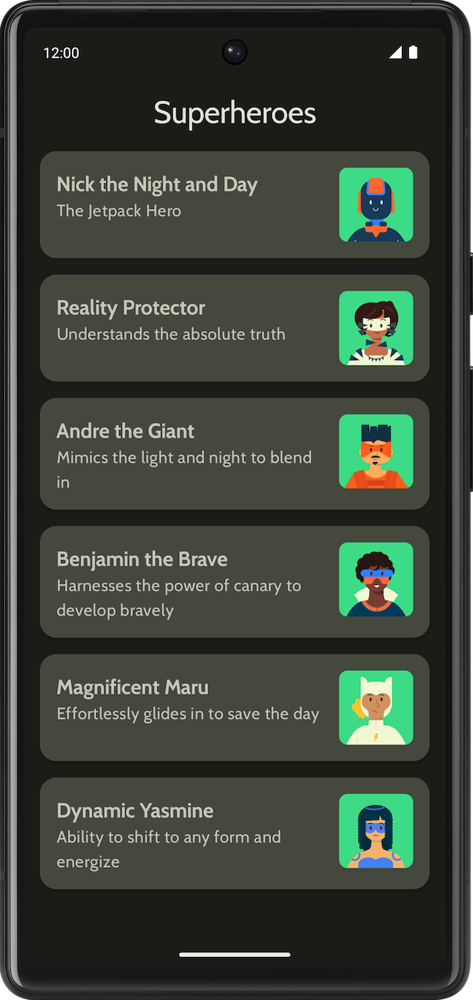 |
|---|---|

### 2. 使ってみる

#### 始める

このタスクではプロジェクトを設定して、スーパーヒーローのダミーデータを作成します。

1. **Empty Activity** テンプレートと、バージョン 24 以上の SDK を使用して、新しいプロジェクトを作成します。
2. アプリのアセット（スーパーヒーローの画像、アプリのロゴ）を[こちら](https://github.com/google-developer-training/basic-android-kotlin-compose-training-superheroes/raw/main/Image%20assets.zip)からダウンロードします。アプリアイコンを追加する方法について復習するには、Codelab のアプリアイコンを変更するをご覧ください。アプリに画像を追加する方法について復習するには、Codelab のインタラクティブな Dice Roller アプリを作成するをご覧ください。
3. [https://fonts.google.com](https://fonts.google.com) から、Cabin の太字フォントと Cabin の標準フォント ファイルをダウンロードして、利用可能な各種フォントを確認します。アプリのタイポグラフィをカスタマイズする方法については、Codelab のJetpack Compose でのマテリアル テーマ設定をご覧ください。
4. 各スーパーヒーローのデータを保持するデータクラスを作成します。コードを整理するために、`Hero` データクラス用に `model` という名前の新しいパッケージを作成します。リストアイテムは次のようになります。

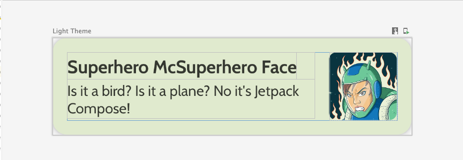

各スーパーヒーローのリストアイテムには、3 つの固有の情報（名前、説明、画像）が表示されます。

5. 同じ `model` パッケージで、表示するすべてのヒーロー情報用に別のファイルを作成します（名前、説明、画像リソースなど）。参考に、データセットのサンプルを示します。

```kotlin
object HeroesRepository {
    val heroes = listOf(
        Hero(
            nameRes = R.string.hero1,
            descriptionRes = R.string.description1,
            imageRes = R.drawable.android_superhero1
        ),
        Hero(
            nameRes = R.string.hero2,
            descriptionRes = R.string.description2,
            imageRes = R.drawable.android_superhero2
        ),
        Hero(
            nameRes = R.string.hero3,
            descriptionRes = R.string.description3,
            imageRes = R.drawable.android_superhero3
        ),
        Hero(
            nameRes = R.string.hero4,
            descriptionRes = R.string.description4,
            imageRes = R.drawable.android_superhero4
        ),
        Hero(
            nameRes = R.string.hero5,
            descriptionRes = R.string.description5,
            imageRes = R.drawable.android_superhero5
        ),
        Hero(
            nameRes = R.string.hero6,
            descriptionRes = R.string.description6,
            imageRes = R.drawable.android_superhero6
        )
    )
}
```

6. ヒーローの名前と説明の文字列を **strings.xml** ファイルで追加します。

```kotlin
<resources>
    <string name="app_name">Superheroes</string>
    <string name="hero1">Nick the Night and Day</string>
    <string name="description1">The Jetpack Hero</string>
    <string name="hero2">Reality Protector</string>
    <string name="description2">Understands the absolute truth</string>
    <string name="hero3">Andre the Giant</string>
    <string name="description3">Mimics the light and night to blend in</string>
    <string name="hero4">Benjamin the Brave</string>
    <string name="description4">Harnesses the power of canary to develop bravely</string>
    <string name="hero5">Magnificent Maru</string>
    <string name="description5">Effortlessly glides in to save the day</string>
    <string name="hero6">Dynamic Yasmine</string>
    <string name="description6">Ability to shift to any form and energize</string>
</resources>
```

### 3. マテリアル テーマ設定

このセクションでは、アプリのカラーパレット、タイポグラフィ、シェイプを追加して、アプリのデザインを向上させます。

以下は、このテーマにおすすめする色、タイプ、シェイプです。さまざまなカラーパターンを探索、変更できます。

[Material Theme Builder](https://m3.material.io/theme-builder#/custom) を使用して、アプリの新しいテーマを作成します。

**色**

`ui.theme/Color.kt`

```kotlin
import androidx.compose.ui.graphics.Color

val md_theme_light_primary = Color(0xFF466800)
val md_theme_light_onPrimary = Color(0xFFFFFFFF)
val md_theme_light_primaryContainer = Color(0xFFC6F181)
val md_theme_light_onPrimaryContainer = Color(0xFF121F00)
val md_theme_light_secondary = Color(0xFF596248)
val md_theme_light_onSecondary = Color(0xFFFFFFFF)
val md_theme_light_secondaryContainer = Color(0xFFDDE6C6)
val md_theme_light_onSecondaryContainer = Color(0xFF161E0A)
val md_theme_light_tertiary = Color(0xFF396661)
val md_theme_light_onTertiary = Color(0xFFFFFFFF)
val md_theme_light_tertiaryContainer = Color(0xFFBCECE6)
val md_theme_light_onTertiaryContainer = Color(0xFF00201D)
val md_theme_light_error = Color(0xFFBA1A1A)
val md_theme_light_errorContainer = Color(0xFFFFDAD6)
val md_theme_light_onError = Color(0xFFFFFFFF)
val md_theme_light_onErrorContainer = Color(0xFF410002)
val md_theme_light_background = Color(0xFFFEFCF5)
val md_theme_light_onBackground = Color(0xFF1B1C18)
val md_theme_light_surface = Color(0xFFFEFCF5)
val md_theme_light_onSurface = Color(0xFF1B1C18)
val md_theme_light_surfaceVariant = Color(0xFFE1E4D4)
val md_theme_light_onSurfaceVariant = Color(0xFF45483D)
val md_theme_light_outline = Color(0xFF75786C)
val md_theme_light_inverseOnSurface = Color(0xFFF2F1E9)
val md_theme_light_inverseSurface = Color(0xFF30312C)
val md_theme_light_inversePrimary = Color(0xFFABD468)
val md_theme_light_surfaceTint = Color(0xFF466800)
val md_theme_light_outlineVariant = Color(0xFFC5C8B9)
val md_theme_light_scrim = Color(0xFF000000)

val md_theme_dark_primary = Color(0xFFABD468)
val md_theme_dark_onPrimary = Color(0xFF223600)
val md_theme_dark_primaryContainer = Color(0xFF344E00)
val md_theme_dark_onPrimaryContainer = Color(0xFFC6F181)
val md_theme_dark_secondary = Color(0xFFC1CAAB)
val md_theme_dark_onSecondary = Color(0xFF2B331D)
val md_theme_dark_secondaryContainer = Color(0xFF414A32)
val md_theme_dark_onSecondaryContainer = Color(0xFFDDE6C6)
val md_theme_dark_tertiary = Color(0xFFA0D0CA)
val md_theme_dark_onTertiary = Color(0xFF013733)
val md_theme_dark_tertiaryContainer = Color(0xFF1F4E4A)
val md_theme_dark_onTertiaryContainer = Color(0xFFBCECE6)
val md_theme_dark_error = Color(0xFFFFB4AB)
val md_theme_dark_errorContainer = Color(0xFF93000A)
val md_theme_dark_onError = Color(0xFF690005)
val md_theme_dark_onErrorContainer = Color(0xFFFFDAD6)
val md_theme_dark_background = Color(0xFF1B1C18)
val md_theme_dark_onBackground = Color(0xFFE4E3DB)
val md_theme_dark_surface = Color(0xFF1B1C18)
val md_theme_dark_onSurface = Color(0xFFE4E3DB)
val md_theme_dark_surfaceVariant = Color(0xFF45483D)
val md_theme_dark_onSurfaceVariant = Color(0xFFC5C8B9)
val md_theme_dark_outline = Color(0xFF8F9285)
val md_theme_dark_inverseOnSurface = Color(0xFF1B1C18)
val md_theme_dark_inverseSurface = Color(0xFFE4E3DB)
val md_theme_dark_inversePrimary = Color(0xFF466800)
val md_theme_dark_surfaceTint = Color(0xFFABD468)
val md_theme_dark_outlineVariant = Color(0xFF45483D)
val md_theme_dark_scrim = Color(0xFF000000)
```

**シェイプ**

`ui.theme/Shape.kt`

```kotlin
import androidx.compose.foundation.shape.RoundedCornerShape
import androidx.compose.material3.Shapes
import androidx.compose.ui.unit.dp

val Shapes = Shapes(
    small = RoundedCornerShape(8.dp),
    medium = RoundedCornerShape(16.dp),
    large = RoundedCornerShape(16.dp)
)
```

**タイポグラフィ**

`ui.theme/Type.kt`

```kotlin
import androidx.compose.material3.Typography
import androidx.compose.ui.text.TextStyle
import androidx.compose.ui.text.font.Font
import androidx.compose.ui.text.font.FontFamily
import androidx.compose.ui.text.font.FontWeight
import androidx.compose.ui.unit.sp
import com.example.superheroes.R

val Cabin = FontFamily(
    Font(R.font.cabin_regular, FontWeight.Normal),
    Font(R.font.cabin_bold, FontWeight.Bold)
)
// Set of Material typography styles to start with
val Typography = Typography(
    bodyLarge = TextStyle(
        fontFamily = Cabin,
        fontWeight = FontWeight.Normal,
        fontSize = 16.sp,
        lineHeight = 24.sp,
        letterSpacing = 0.5.sp
    ),
    displayLarge = TextStyle(
        fontFamily = Cabin,
        fontWeight = FontWeight.Normal,
        fontSize = 30.sp
    ),
    displayMedium = TextStyle(
        fontFamily = Cabin,
        fontWeight = FontWeight.Bold,
        fontSize = 20.sp
    ),
    displaySmall = TextStyle(
        fontFamily = Cabin,
        fontWeight = FontWeight.Bold,
        fontSize = 20.sp
    )
)
```

**テーマ**

`ui.theme/Theme.kt`

```kotlin
import android.app.Activity
import android.os.Build
import androidx.compose.foundation.isSystemInDarkTheme
import androidx.compose.material3.MaterialTheme
import androidx.compose.material3.darkColorScheme
import androidx.compose.material3.dynamicDarkColorScheme
import androidx.compose.material3.dynamicLightColorScheme
import androidx.compose.material3.lightColorScheme
import androidx.compose.runtime.Composable
import androidx.compose.runtime.SideEffect
import androidx.compose.ui.graphics.toArgb
import androidx.compose.ui.platform.LocalContext
import androidx.compose.ui.platform.LocalView
import androidx.core.view.WindowCompat

private val LightColors = lightColorScheme(
   primary = md_theme_light_primary,
   onPrimary = md_theme_light_onPrimary,
   primaryContainer = md_theme_light_primaryContainer,
   onPrimaryContainer = md_theme_light_onPrimaryContainer,
   secondary = md_theme_light_secondary,
   onSecondary = md_theme_light_onSecondary,
   secondaryContainer = md_theme_light_secondaryContainer,
   onSecondaryContainer = md_theme_light_onSecondaryContainer,
   tertiary = md_theme_light_tertiary,
   onTertiary = md_theme_light_onTertiary,
   tertiaryContainer = md_theme_light_tertiaryContainer,
   onTertiaryContainer = md_theme_light_onTertiaryContainer,
   error = md_theme_light_error,
   errorContainer = md_theme_light_errorContainer,
   onError = md_theme_light_onError,
   onErrorContainer = md_theme_light_onErrorContainer,
   background = md_theme_light_background,
   onBackground = md_theme_light_onBackground,
   surface = md_theme_light_surface,
   onSurface = md_theme_light_onSurface,
   surfaceVariant = md_theme_light_surfaceVariant,
   onSurfaceVariant = md_theme_light_onSurfaceVariant,
   outline = md_theme_light_outline,
   inverseOnSurface = md_theme_light_inverseOnSurface,
   inverseSurface = md_theme_light_inverseSurface,
   inversePrimary = md_theme_light_inversePrimary,
   surfaceTint = md_theme_light_surfaceTint,
   outlineVariant = md_theme_light_outlineVariant,
   scrim = md_theme_light_scrim,
)

private val DarkColors = darkColorScheme(
   primary = md_theme_dark_primary,
   onPrimary = md_theme_dark_onPrimary,
   primaryContainer = md_theme_dark_primaryContainer,
   onPrimaryContainer = md_theme_dark_onPrimaryContainer,
   secondary = md_theme_dark_secondary,
   onSecondary = md_theme_dark_onSecondary,
   secondaryContainer = md_theme_dark_secondaryContainer,
   onSecondaryContainer = md_theme_dark_onSecondaryContainer,
   tertiary = md_theme_dark_tertiary,
   onTertiary = md_theme_dark_onTertiary,
   tertiaryContainer = md_theme_dark_tertiaryContainer,
   onTertiaryContainer = md_theme_dark_onTertiaryContainer,
   error = md_theme_dark_error,
   errorContainer = md_theme_dark_errorContainer,
   onError = md_theme_dark_onError,
   onErrorContainer = md_theme_dark_onErrorContainer,
   background = md_theme_dark_background,
   onBackground = md_theme_dark_onBackground,
   surface = md_theme_dark_surface,
   onSurface = md_theme_dark_onSurface,
   surfaceVariant = md_theme_dark_surfaceVariant,
   onSurfaceVariant = md_theme_dark_onSurfaceVariant,
   outline = md_theme_dark_outline,
   inverseOnSurface = md_theme_dark_inverseOnSurface,
   inverseSurface = md_theme_dark_inverseSurface,
   inversePrimary = md_theme_dark_inversePrimary,
   surfaceTint = md_theme_dark_surfaceTint,
   outlineVariant = md_theme_dark_outlineVariant,
   scrim = md_theme_dark_scrim,
)

@Composable
fun SuperheroesTheme(
   darkTheme: Boolean = isSystemInDarkTheme(),
   // Dynamic color is available on Android 12+
   // Dynamic color in this app is turned off for learning purposes
   dynamicColor: Boolean = false,
   content: @Composable () -> Unit
) {
   val colorScheme = when {
       dynamicColor && Build.VERSION.SDK_INT >= Build.VERSION_CODES.S -> {
           val context = LocalContext.current
           if (darkTheme) dynamicDarkColorScheme(context) else dynamicLightColorScheme(context)
       }

       darkTheme -> DarkColors
       else -> LightColors
   }
   val view = LocalView.current
   if (!view.isInEditMode) {
       SideEffect {
           val window = (view.context as Activity).window
           window.statusBarColor = colorScheme.background.toArgb()
           WindowCompat.getInsetsController(window, view).isAppearanceLightStatusBars = !darkTheme
       }
   }

   MaterialTheme(
       colorScheme = colorScheme,
       typography = Typography,
       shapes = Shapes,
       content = content
   )
}
```

### 4. リストを表示する

リストを作成するには、まずリストアイテムを作成します。

1. `com.example.superheroes` パッケージの下に `HeroesScreen.kt` というファイルを作成します。このファイルでは、リストアイテムとリスト コンポーザブルを作成します。
2. スーパーヒーローのリストアイテムを表すコンポーザブルを作成します。次のスクリーンショットと UI 仕様のようになります。

この UI 仕様に沿ったものにするか、独自のリストアイテムを作成します。

- カードの高度: `2dp`
- リストアイテムの高さ: `72dp`、パディング `16dp`
- リストアイテムのクリップ半径: `16dp`
- 画像レイアウト: `Box`、サイズ: `72dp`
- 画像のクリップ半径: `8dp`
- 画像とテキストの間のスペース: `16dp`
- スーパーヒーローの名前のスタイル: `DisplaySmall`
- スーパーヒーローの説明のスタイル: `BodyLarge`

さまざまなパディングとサイズのオプションを検討します。マテリアル 3 ガイドラインに従って、パディングは `4dp` 単位で増やす必要があります。

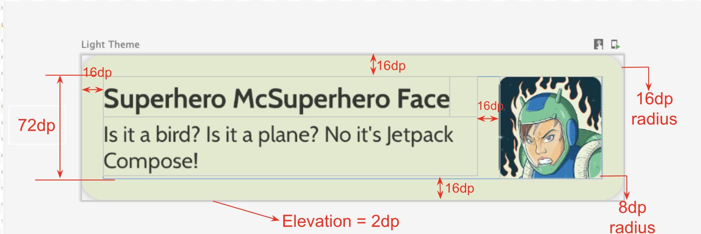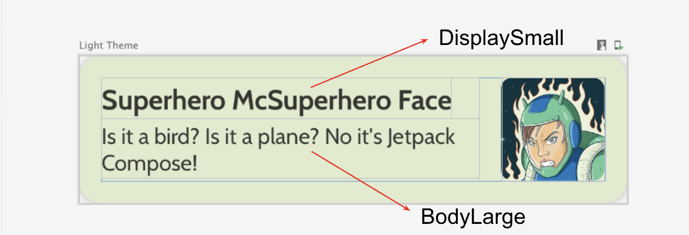

**遅延列を作成する**

1. ヒーローのリストを取得して表示する、別のコンポーザブルを作成します。ここで [`LazyColumn`](https://developer.android.com/reference/kotlin/androidx/compose/foundation/lazy/package-summary#LazyColumn(androidx.compose.ui.Modifier,androidx.compose.foundation.lazy.LazyListState,androidx.compose.foundation.layout.PaddingValues,kotlin.Boolean,androidx.compose.foundation.layout.Arrangement.Vertical,androidx.compose.ui.Alignment.Horizontal,androidx.compose.foundation.gestures.FlingBehavior,kotlin.Boolean,kotlin.Function1)) を使用します。
2. パディングには次の UI 仕様を使用します。

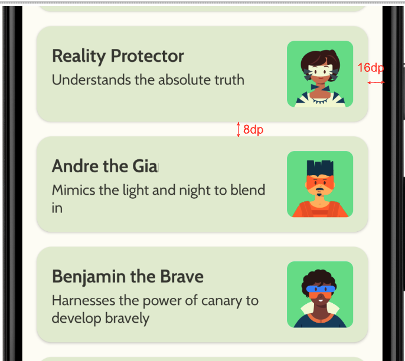

実装が完了すると、アプリは次のスクリーンショットのようになります。

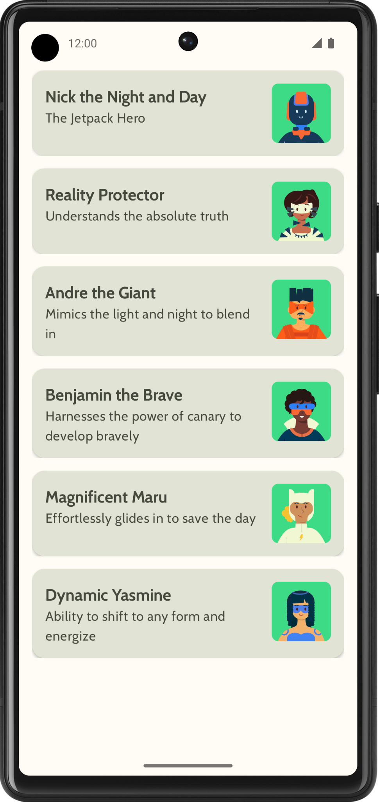

### 5. トップ アプリバーを追加する

アプリにトップ アプリバーを追加します。

1. `MainActivity.kt` で、トップ アプリバーを表示するコンポーザブルを追加します。トップ アプリバーにテキストを追加します。アプリ名にすることができます。水平方向と垂直方向ともに中央に揃えます。
2. 上部のアプリバーに `DisplayLarge` のスタイルを設定しました。

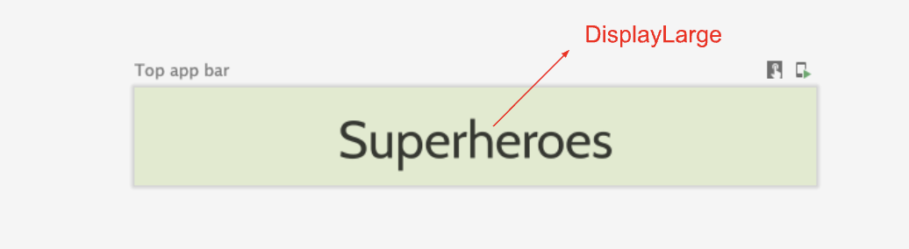

3. `scaffold` を使用してトップ アプリバーを表示します。必要に応じて、[トップ アプリバー - マテリアル デザイン 3](https://m3.material.io/components/top-app-bar/overview) のドキュメントをご覧ください。

#### ステータスバーの色をカスタマイズする

[エッジ ツー エッジ](https://developer.android.com/develop/ui/views/layout/edge-to-edge)のアプリにするには、ステータスバーの色を背景色に合わせてカスタマイズします。

1. `Theme.kt` で、この新しいメソッドを追加して、ステータスバーとナビゲーション バーの端から端までの色を変更します。

```kotlin
/**
 * Sets up edge-to-edge for the window of this [view]. The system icon colors are set to either
 * light or dark depending on whether the [darkTheme] is enabled or not.
 */
private fun setUpEdgeToEdge(view: View, darkTheme: Boolean) {
    val window = (view.context as Activity).window
    WindowCompat.setDecorFitsSystemWindows(window, false)
    window.statusBarColor = Color.Transparent.toArgb()
    val navigationBarColor = when {
        Build.VERSION.SDK_INT >= 29 -> Color.Transparent.toArgb()
        Build.VERSION.SDK_INT >= 26 -> Color(0xFF, 0xFF, 0xFF, 0x63).toArgb()
        // Min sdk version for this app is 24, this block is for SDK versions 24 and 25
        else -> Color(0x00, 0x00, 0x00, 0x50).toArgb()
    }
    window.navigationBarColor = navigationBarColor
    val controller = WindowCompat.getInsetsController(window, view)
    controller.isAppearanceLightStatusBars = !darkTheme
    controller.isAppearanceLightNavigationBars = !darkTheme
}
```

2. `SuperheroesTheme()` 関数で、`SideEffect` ブロック内から `setUpEdgeToEdge()` 関数を呼び出します。

```kotlin
fun SuperheroesTheme(
    darkTheme: Boolean = isSystemInDarkTheme(),
    // Dynamic color is available on Android 12+
    // Dynamic color in this app is turned off for learning purposes
    dynamicColor: Boolean = false,
    content: @Composable () -> Unit
) {
    //...
    val view = LocalView.current
    if (!view.isInEditMode) {
        SideEffect {
            setUpEdgeToEdge(view, darkTheme)
        }
    }

    //...
}
```

|  |  |
|---|---|

### 6. 解答コードを取得する

この Codelab の完成したコードをダウンロードするには、次の git コマンドを使用します。

```
$ git clone https://github.com/google-developer-training/basic-android-kotlin-compose-training-superheroes.git
```

または、リポジトリを ZIP ファイルとしてダウンロードし、Android Studio で開くこともできます。

> **注:**解答コードは、ダウンロードしたリポジトリの `main` ブランチにあります。

解答コードを確認する場合は、[GitHub で表示します](https://github.com/google-developer-training/basic-android-kotlin-compose-training-superheroes)。

## 7. つまずきやすいポイント

- 色を直接指定せず `MaterialTheme.colorScheme.xxx` を使うのがポイントです。ダークテーマ対応が自動で付いてきます。
- アニメーションは「動いたら OK」で十分です。細かい調整に時間をかけすぎないようにしましょう。

## 8. 提出物

次の Codelab で完成させた Android Studio プロジェクトを、学習用リポジトリの `unit3/Superheroes/` に置きます（プロジェクトフォルダごとコピー。`build/` と `.idea/` は含めない）。

- 演習: スーパーヒーローのアプリを作成する

PR 本文には次の 3 点を書いてください。

- **やったこと**：どの Codelab / 演習を完了したか
- **動作確認**：どの端末（エミュレータ名 or 実機）で何を確認したか
- **詰まった点と解決**：エラーの内容と、どう直したか（AI に聞いた内容も可）

## 9. チェックリスト

- [ ] Material Theme（色・タイポグラフィ・シェイプ）をアプリに適用できる
- [ ] `animateContentSize` などで簡単なアニメーションを付けられる
- [ ] TalkBack やコントラストなど、ユーザー補助の基本を確認できる
- [ ] パスウェイ末尾のクイズに合格した
- [ ] 提出物が `unit3/Superheroes/` にあり、Android Studio（または Kotlin Playground）で開いて動く

---

## 課題提出

この章には提出課題があります。

1. 上記の提出物を完了する
2. GitHub で `feature/03-beautiful-apps` ブランチを作成し、`develop` へのPRを作成（base=`develop`）
3. [AIプログラムレビュー](https://ai.studio/apps/84d224cb-7de1-44fb-995b-9a5917d25603?fullscreenApplet=true) を実行
4. 問題がなければ、進捗ダッシュボードで **PR URL** と **完了日** を記録
