# 第7章: Kotlin の基礎（その他）

> 提出ブランチ: `feature/03-kotlin-more`

## 1. この章のゴール

- ジェネリクス・enum・data class・object・拡張関数の用途を説明できる
- `List` / `Set` / `Map` を使い分けられる
- `map` / `filter` / `sortedBy` などの高階関数でコレクションを加工できる

## 2. 進め方

次の内容を **上から順番に** 進めます。「やらなくてOK」の行は飛ばして構いません。レッスンの本文はこのページの下にすべて掲載しています。目安時間の合計は約375分です。

| # | 種類 | 内容 | 目安 | 備考 |
|---|---|---|---|---|
| 1 | レッスン | ジェネリック、オブジェクト、拡張機能 | 約90分 |  |
| 2 | レッスン | Kotlin でコレクションを使用する | 約90分 |  |
| 3 | レッスン | コレクションを操作する高階関数 | 約90分 |  |
| 4 | レッスン | 演習: クラスとコレクション | 約90分 | **提出対象** |
| 5 | クイズ | [テスト: Kotlin の基礎（その他）](https://developer.android.com/courses/quizzes/android-basics-compose-unit-3-pathway-1/android-basics-compose-unit-3-pathway-1?hl=ja) | 約15分 | リンク先で受ける |

このプログラムの進め方は次の通りです。

1. 下の各レッスンを読み、各ステップの説明を理解してから **自分でコードを打つ**（コピペで済ませない）
2. ステップごとにアプリを実行し、期待どおり動くか確認する
3. 動かないときは、エラー文をそのまま AI に貼って「何が原因か」を聞き、直したら **なぜ直ったか** をメモする
4. 章末のクイズ（リンク先）を受けて、間違えた項目をレッスンで読み直す

> 画面が最新の Android Studio と異なる場合があります。

## 3. ジェネリック、オブジェクト、拡張機能


### 1. はじめに

数十年にわたり、プログラマーはより優れたコードの作成に役立つプログラミング言語をいくつも考案してきました。たとえば、同じアイデアをより少ないコードで表現したり、複雑なアイデアを表現する抽象化を行ったり、自分以外の開発者が誤解することを防止したりすることができるコードを記述する言語が考案されてきました。Kotlin 言語もその例外ではなく、開発者がより表現力に富んだコードを記述できるような機能が数多く用意されています。

残念ながら、そうした機能は、初めてのプログラミングでは開発者を戸惑わせることがあります。有用に思える機能であっても、その有用性の範囲と、機能によって解決される問題が常に明白であるとは限りません。Compose などのライブラリで使用されている機能の一部については、すでにご存じかもしれません。

経験に勝るものはありませんが、このレッスンでは、大規模なアプリの構造化に役立つ次のような Kotlin のコンセプトを紹介します。

- ジェネリック
- さまざまな種類のクラス（列挙型クラスとデータクラス）
- シングルトン オブジェクトとコンパニオン オブジェクト
- 拡張プロパティと拡張関数
- スコープ関数

このレッスンを修了すると、このコースですでに学習したコードに関するより深い知識を身につけ、自分のアプリでこれらのコンセプトを確認および使用する場合のいくつかの例を理解できるようになります。

#### 前提条件

- オブジェクト指向プログラミングの概念（継承など）に精通していること。
- インターフェースを定義して実装する方法を習得していること。

#### 学習内容

- クラスの汎用型パラメータを定義する方法。
- 汎用クラスをインスタンス化する方法。
- 列挙型クラスとデータクラスを使用するタイミング。
- インターフェースを実装する必要がある汎用型パラメータを定義する方法。
- スコープ関数を使用してクラスのプロパティとメソッドにアクセスする方法。
- クラスのシングルトン オブジェクトとコンパニオン オブジェクトを定義する方法。
- 新しいプロパティとメソッドで既存のクラスを拡張する方法。

#### 必要なもの

- Kotlin プレイグラウンドにアクセスできるウェブブラウザ。

### 2. ジェネリックを使用して再利用可能なクラスを作成する

たとえば、このコースですでに見たクイズと同様のオンライン クイズ用のアプリを作成するとします。クイズ問題には、穴埋め問題や正誤問題など、さまざまなタイプがあります。個々のクイズ問題は、複数のプロパティを含むクラスで表現できます。

クイズの問題テキストは文字列で表現できます。クイズ問題は、その解答も表現する必要があります。ただし、正誤問題のようなタイプの問題では、別のデータ型を使用して解答を表現する必要があります。次の 3 つのタイプの問題を定義してみましょう。

- **穴埋め問題**: 解答は `String` で表現される単語です。
- **正誤問題**: 解答は `Boolean` で表現されます。
- **計算問題**: 解答は数値です。単純な計算問題の解答は `Int` で表現されます。

さらに、このレッスンで扱うクイズ問題の例では、どのタイプの問題にも難易度ランクがあります。難易度ランクは、`"easy"`、`"medium"`、`"hard"` という 3 つの可能な値の文字列で表現されます。

個々のタイプのクイズ問題を表すクラスを定義します。

1. [Kotlin プレイグラウンド](https://developer.android.com/training/kotlinplayground)に移動します。
2. `main()` 関数の上に、穴埋め問題を表すクラスを `FillInTheBlankQuestion` という名前で定義します。このクラスは、`questionText` を表す `String` プロパティ、`answer` を表す `String` プロパティ、`difficulty` を表す `String` プロパティで構成されます。

```kotlin
class FillInTheBlankQuestion(
    val questionText: String,
    val answer: String,
    val difficulty: String
)
```

3. `FillInTheBlankQuestion` クラスの下に、正誤問題を表す別のクラスを `TrueOrFalseQuestion` という名前で定義します。このクラスは、`questionText` を表す `String` プロパティ、`answer` を表す `Boolean` プロパティ、`difficulty` を表す `String` プロパティで構成されます。

```kotlin
class TrueOrFalseQuestion(
    val questionText: String,
    val answer: Boolean,
    val difficulty: String
)
```

4. 最後に、上記の 2 つのクラスの下に、`NumericQuestion` クラスを定義します。このクラスは、`questionText` を表す `String` プロパティ、`answer` を表す `Int` プロパティ、`difficulty` を表す `String` プロパティで構成されます。

```kotlin
class NumericQuestion(
    val questionText: String,
    val answer: Int,
    val difficulty: String
)
```

5. 作成したコードを見てみましょう。繰り返しに気づきましたか？

```kotlin
class FillInTheBlankQuestion(
    val questionText: String,
    val answer: String,
    val difficulty: String
)

class TrueOrFalseQuestion(
    val questionText: String,
    val answer: Boolean,
    val difficulty: String
)
class NumericQuestion(
    val questionText: String,
    val answer: Int,
    val difficulty: String
)
```

3 つのクラスすべてに、まったく同じプロパティ `questionText`、`answer`、`difficulty` があります。唯一違うのは `answer` プロパティのデータ型です。この繰り返しに対する解決策は単純明快で、`questionText` と `difficulty` に親クラスを作成し、各サブクラスで `answer` プロパティを定義することだと思われるかもしれません。

しかし、継承を使用しても上記と同じ問題が残ります。新しいタイプの問題を追加するたびに、`answer` プロパティを追加しなくてはなりません。違うのはデータ型だけです。また、解答プロパティを持たない親クラス `Question` があるのも不自然です。

データ型が異なるプロパティを使用したい場合、サブクラス化は解決策になりません。これに代わる解決策として、Kotlin には「汎用型」という機能があります。これにより、特定のユースケースに応じて、さまざまなデータ型を持つ単一のプロパティを使用できます。

#### 汎用データ型とは

汎用型（「ジェネリック」）を使用すると、あるデータ型（クラスなど）が、そのプロパティとメソッドで使用できる不明なプレースホルダのデータ型を表現できます。これは正確にはどういうことでしょうか。

上記の例では、可能なデータ型ごとに解答プロパティを定義する代わりに、任意の問題を表す単一のクラスを作成し、`answer` プロパティのデータ型としてプレースホルダ名を使用することができます。実際のデータ型（`String`、`Int`、`Boolean` など）は、クラスをインスタンス化する際に指定します。プレースホルダ名が使用されているすべての箇所で、クラスに渡されるデータ型が使用されます。クラスの汎用型を定義する構文は次のとおりです。

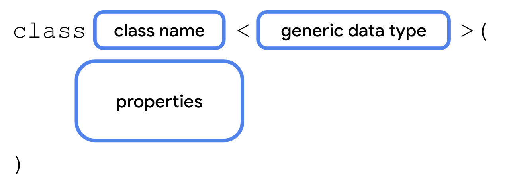

汎用型は、クラスをインスタンス化する際に指定されるため、クラス署名の一部として定義する必要があります。クラス名の後に、左山かっこ（`<`）、データ型のプレースホルダ名、右山かっこ（`>`）の順に記述します。

このプレースホルダ名は、クラス内の実際のデータ型を使用する任意の箇所で使用できます（プロパティのデータ型など）。

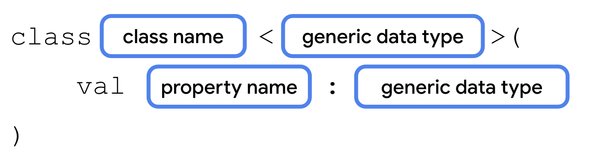

これは他のプロパティ宣言と同じですが、データ型の代わりにプレースホルダ名を使用する点だけが異なります。

クラスは、使用するデータ型を最終的にどうやって知るのでしょうか。汎用型が使用するデータ型は、クラスをインスタンス化する際に、山かっこで囲んだパラメータとして渡します。

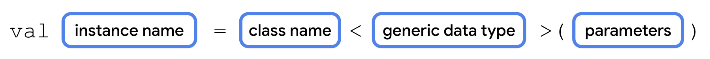

クラス名の後に、左山かっこ（`<`）、実際のデータ型（`String`、`Boolean`、`Int` など）、右山かっこ（`>`）の順に記述します。汎用プロパティ用に渡す値のデータ型は、山かっこで囲まれたデータ型と一致する必要があります。解答プロパティをジェネリックにすることにより、解答が `String`、`Boolean`、`Int` のいずれであろうと、または任意のデータ型であろうと、1 つのクラスであらゆるタイプのクイズ問題を表すことができます。

> **注:** クラスをインスタンス化する際に渡される汎用型は「パラメータ」とも呼ばれますが、かっこで囲まれたプロパティ値とは別のパラメータ リストに含まれます。

> **注:** 上記の例のように、クラスに複数の汎用型が含まれる場合は、`T`（Type の省略形）などの大文字の名前を持つ汎用型がよく使用されます。ただし、これには厳密なルールはありません。汎用型には、よりわかりやすい名前を付けることをおすすめします。

#### コードをリファクタリングしてジェネリックを使用する

コードをリファクタリングして、ジェネリックの解答プロパティを含む `Question` という名前の単一のクラスを使用するようにします。

1. `FillInTheBlankQuestion`、`TrueOrFalseQuestion`、`NumericQuestion` のクラス定義を削除します。
2. `Question` という名前の新しいクラスを作成します。

```kotlin
class Question()
```

3. クラス名の後、かっこの前に、左山かっこと右山かっこで囲んだ汎用型パラメータを追加します。汎用型に `T` という名前を付けます。

```kotlin
class Question<T>()
```

4. `questionText`、`answer`、および `difficulty` プロパティを追加します。`questionText` の型は `String` にする必要があります。`answer` の型は `T` にする必要があります。これは、`Question` クラスをインスタンス化する際にそのデータ型を指定するためです。`difficulty` プロパティの型は `String` にする必要があります。

```kotlin
class Question<T>(
    val questionText: String,
    val answer: T,
    val difficulty: String
)
```

5. これが複数の問題タイプ（穴埋め問題や正誤問題）でどのように機能するかを確認するため、次に示すように、`main()` 内に `Question` クラスの 3 つのインスタンスを作成します。

```kotlin
fun main() {
    val question1 = Question<String>("Quoth the raven ___", "nevermore", "medium")
    val question2 = Question<Boolean>("The sky is green. True or false", false, "easy")
    val question3 = Question<Int>("How many days are there between full moons?", 28, "hard")
}
```

6. コードを実行して、すべてが正常に機能することを確認します。3 つの異なるクラスを作成したり継承を使用したりする代わりに、`Question` クラスの 3 つのインスタンス（それぞれ解答のデータ型が異なる）を作成しました。これで、解答のタイプが異なる複数の問題を処理する場合に、同じ `Question` クラスを再利用できます。

### 3. 列挙型クラスを使用する

前のセクションでは、「easy」、「medium」、「hard」の 3 つの可能な値を持つ難易度プロパティを定義しました。これは機能しますが、問題がいくつかあります。

1. 3 つの可能な文字列のいずれかの入力を誤った場合、バグが発生する可能性があります。
2. 値を変更した場合（たとえば `"medium"` の名前を `"average"` に変更した場合）、その文字列が使用されている箇所をすべて更新する必要があります。
3. 開発者自身または他の開発者が 3 つの有効な値のいずれでもない別の文字列を誤って使用することを防止できません。
4. 難易度の種類を増やすと、コードの保守が困難になります。

Kotlin では、「列挙型クラス」という特別なタイプのクラスにより、これらの問題を解決できます。列挙型クラスは、可能な値の限定されたセットを持つ型を作成するために使用されます。たとえば、現実世界の 4 つの基本方位（東西南北）を列挙型クラスで表現できます。それ以外の方位は不要なので、コードで許可しないようにします。列挙型クラスの構文は次のとおりです。

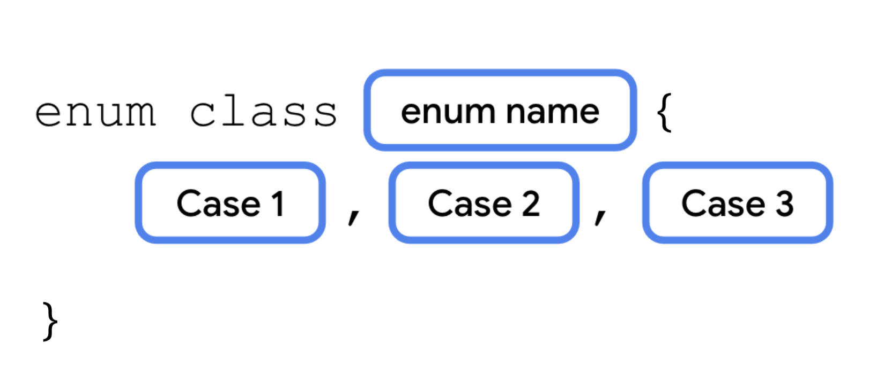

個々の可能な列挙の値は「列挙型定数」と呼ばれます。列挙型定数は波かっこ内に配置し、カンマで区切ります。慣例として、定数名はすべて大文字にします。

列挙型定数を参照するには、ドット演算子を使用します。

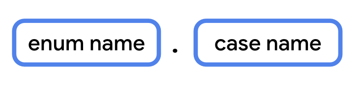

#### 列挙型定数を使用する

コードを変更して、`String` の代わりに列挙型定数を使用して難易度を表すようにします。

1. `Question` クラスの下に、`Difficulty` という名前の `enum` クラスを定義します。

```kotlin
enum class Difficulty {
    EASY, MEDIUM, HARD
}
```

2. `Question` クラス内で、`difficulty` プロパティのデータ型を `String` から `Difficulty` に変更します。

```kotlin
class Question<T>(
    val questionText: String,
    val answer: T,
    val difficulty: Difficulty
)
```

3. 3 つのタイプの問題を初期化する際に、難易度を表す列挙型定数を渡します。

```kotlin
val question1 = Question<String>("Quoth the raven ___", "nevermore", Difficulty.MEDIUM)
val question2 = Question<Boolean>("The sky is green. True or false", false, Difficulty.EASY)
val question3 = Question<Int>("How many days are there between full moons?", 28, Difficulty.HARD)
```

### 4. データクラスを使用する

`Activity` のサブクラスなど、これまでに扱ったクラスの多くには、さまざまなアクションを実行するメソッドがいくつかあります。これらのクラスは、データを表現する機能だけでなく、多くの機能を備えています。

一方、`Question` クラスなどのクラスには、データのみが含まれます。アクションを実行するメソッドは含まれていません。このようなクラスは「データクラス」として定義できます。クラスをデータクラスとして定義すると、Kotlin コンパイラはある種の仮定を行って、いくつかのメソッドを自動的に実装できます。たとえば、`toString()` は `println()` 関数によって自動的に呼び出されます。データクラスを使用すると、クラスのプロパティに基づいて `toString()` などのメソッドが自動的に実装されます。

データクラスを定義するには、`class` キーワードの前に `data` キーワードを追加するだけです。


#### `Question` をデータクラスに変換する

最初に、データクラスではないクラスで `toString()` などのメソッドを呼び出そうとしたときにどうなるかを確認します。次に、`Question` をデータクラスに変換します。これにより、このメソッドとその他のメソッドがデフォルトで実装されまます。

1. `main()` 内で、`question1` に対する `toString()` の呼び出し結果を出力します。

```kotlin
fun main() {
    val question1 = Question<String>("Quoth the raven ___", "nevermore", Difficulty.MEDIUM)
    val question2 = Question<Boolean>("The sky is green. True or false", false, Difficulty.EASY)
    val question3 = Question<Int>("How many days are there between full moons?", 28, Difficulty.HARD)
    println(question1.toString())
}
```

2. コードを実行します。出力には、クラス名と、オブジェクトの固有識別子のみが示されます。

```
Question@37f8bb67
```

3. `data` キーワードを使用して `Question` をデータクラスにします。

```kotlin
data class Question<T>(
    val questionText: String,
    val answer: T,
    val difficulty: Difficulty
)
```

4. コードをもう一度実行します。これをデータクラスとしてマークすると、Kotlin は `toString()` を呼び出す際にクラスのプロパティの表示方法を決定できます。

```
Question(questionText=Quoth the raven ___, answer=nevermore, difficulty=MEDIUM)
```

クラスがデータクラスとして定義されると、以下のメソッドが実装されます。

- `equals()`
- `hashCode()`: このメソッドは、特定のコレクション型を操作する際に使用されます。
- `toString()`
- [`componentN()`](https://kotlinlang.org/docs/destructuring-declarations.html#example-returning-two-values-from-a-function): `component1()`、`component2()`（以下同様）
- `copy()`

> **注:** データクラスのコンストラクタには少なくとも 1 つのパラメータが必要です。すべてのコンストラクタ パラメータは `val` または `var` でマークする必要があります。また、データクラスを `abstract`、`open`、`sealed`、`inner` にすることはできません。

### 5. シングルトン オブジェクトを使用する

インスタンスが 1 つのみのクラスを使用したい場合は数多くあります。次に例を示します。

1. モバイルゲームにおける現在のユーザーのプレーヤー統計情報。
2. 1 台のハードウェア デバイスの操作（スピーカーを介した音声の送信など）。
3. リモート データソース（Firebase データベースなど）にアクセスするためのオブジェクト。
4. 一度に 1 人のユーザーにのみログインを許可する認証。

これらののシナリオでは、おそらくクラスを使用する必要があります。しかし、そのクラスをインスタンス化してインスタンスを作成する必要があるのは一度だけです。ハードウェア デバイスが 1 台だけの場合や、一度に 1 人のユーザーだけがログインする場合、複数のインスタンスを作成する理由はありません。同じハードウェア デバイスに同時にアクセスするオブジェクトが 2 つあると、誤った奇妙な動作が発生する可能性があります。

オブジェクトをシングルトンとして定義すると、そのオブジェクトが 1 つのインスタンスしか持たないことをコード内で明確に伝達できます。「シングルトン」とは、単一のインスタンスのみを持つことができるクラスです。Kotlin には、「オブジェクト」と呼ばれる特別な構造体があり、これをシングルトン クラスとして使用できます。

#### シングルトン オブジェクトを定義する

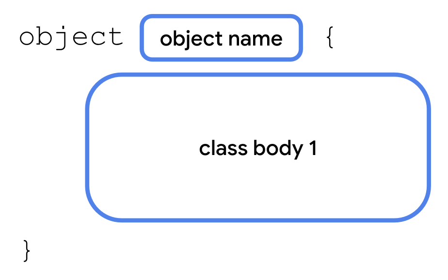

オブジェクトの構文はクラスの構文に似ています。`class` キーワードの代わりに、単に `object` キーワードを使用します。インスタンスを直接作成できないので、シングルトン オブジェクトにコンストラクタを含めることはできません。その代わりに、すべてのプロパティを波かっこで囲んで定義し、初期値を指定します。

前述の例の一部は、とりわけ特定のハードウェア デバイスを使用したことがない場合や、アプリでまだ認証を扱っていない場合は、わかりにくいかもしれません。しかし、Android 開発の学習を進めると、シングルトン オブジェクトをよくみかけます。ユーザーの状態を表すオブジェクトを使用する単純な例を見てみましょう。この例では、必要なインスタンスは 1 つだけです。

クイズでは、問題の合計数と、受講者がこれまでに解答した問題の数をトラッキングする方法があると便利です。このクラスのインスタンスは 1 つあれば十分です。そこで、クラスとして宣言する代わりに、シングルトン オブジェクトとして宣言します。

1. `StudentProgress` という名前のオブジェクトを作成します。

```kotlin
object StudentProgress {
}
```

2. この例では、問題が全部で 10 問あり、これまでにそのうちの 3 問が解答済みであるとします。`Int` プロパティを 2 つ追加します。`total` の値は `10` で、`answered` の値は `3` です。

```kotlin
object StudentProgress {
    var total: Int = 10
    var answered: Int = 3
}
```

#### シングルトン オブジェクトにアクセスする

前述のとおり、シングルトン オブジェクトのインスタンスを直接作成することはできません。では、そのプロパティにアクセスするにはどうすればよいでしょうか？

`StudentProgress` は同時に 1 つしか存在しないため、そのプロパティにアクセスするには、オブジェクト自体の名前を指定し、次にドット演算子（`.`）を付けて、その後にプロパティ名を指定します。

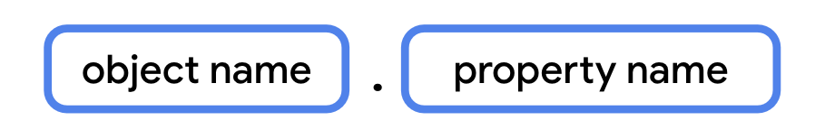

`main()` 関数を更新して、シングルトン オブジェクトのプロパティにアクセスするようにします。

1. `main()` 内に、`StudentProgress` オブジェクトから問題の `answered` と `total` の数を出力する `println()` の呼び出しを追加します。

```kotlin
fun main() {
    ...
    println("${StudentProgress.answered} of ${StudentProgress.total} answered.")
}
```

2. コードを実行して、すべてが正常に機能することを確認します。

```
...
3 of 10 answered.
```

#### オブジェクトをコンパニオン オブジェクトとして宣言する

Kotlin のクラスとオブジェクトは他の型の内部で定義できるため、コードをわかりやすく整理する方法として使用できます。「コンパニオン オブジェクト」を使用すると、シングルトン オブジェクトを別のクラスの内部で定義できます。コンパニオン オブジェクトを使用すると、オブジェクトのプロパティとメソッドが同じクラスに属している場合、そのクラスの内部からオブジェクトのプロパティとメソッドにアクセスできます。これにより、構文をより簡潔にすることができます。

コンパニオン オブジェクトを宣言するには、`object` キーワードの前に `companion` キーワードを追加するだけです。


クイズ問題を格納する新しいクラスを `Quiz` という名前で作成し、`StudentProgress` を `Quiz` クラスのコンパニオン オブジェクトにします。

1. 列挙型クラス `Difficulty` の下に、`Quiz` という名前の新しいクラスを定義します。

```kotlin
class Quiz {
}
```

2. `question1`、`question2`、`question3` を、`main()` から `Quiz` クラスに移動します。`println(question1.toString())` をまだ削除していない場合は、それを削除する必要もあります。

```kotlin
class Quiz {
    val question1 = Question<String>("Quoth the raven ___", "nevermore", Difficulty.MEDIUM)
    val question2 = Question<Boolean>("The sky is green. True or false", false, Difficulty.EASY)
    val question3 = Question<Int>("How many days are there between full moons?", 28, Difficulty.HARD)

}
```

3. `StudentProgress` オブジェクトを `Quiz` クラスに移動します。

```kotlin
class Quiz {
    val question1 = Question<String>("Quoth the raven ___", "nevermore", Difficulty.MEDIUM)
    val question2 = Question<Boolean>("The sky is green. True or false", false, Difficulty.EASY)
    val question3 = Question<Int>("How many days are there between full moons?", 28, Difficulty.HARD)

    object StudentProgress {
        var total: Int = 10
        var answered: Int = 3
    }
}
```

4. `StudentProgress` オブジェクトを `companion` キーワードでマークします。

```kotlin
companion object StudentProgress {
    var total: Int = 10
    var answered: Int = 3
}
```

5. `println()` の呼び出しを更新して、`Quiz.answered` と `Quiz.total` でプロパティを参照するようにします。これらのプロパティは `StudentProgress` オブジェクト内で宣言されていますが、`Quiz` クラスの名前のみを使用したドット表記でアクセスできます。

```kotlin
fun main() {
    println("${Quiz.answered} of ${Quiz.total} answered.")
}
```

6. コードを実行して出力を確認します。

```
3 of 10 answered.
```

### 6. 新しいプロパティとメソッドでクラスを拡張する

Compose を扱っているとき、UI 要素のサイズを指定する場合に、いくつかの興味深い構文に気づいたかもしれません。`Double` などの数値型には、ディメンションを指定する `dp` や `sp` などのプロパティがあります。

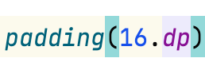

Kotlin 言語の設計者が、組み込みデータ型のプロパティと関数、具体的には Android UI の作成用のものを含めたのはなぜでしょうか。彼らは将来を予測できたのでしょうか。Compose が存在する前から、Kotlin は Compose で使用できるように設計されていたのでしょうか。

もちろんそうではありません。クラスを作成しているとき、別の開発者がアプリでそのクラスをどのように使用するか（どのように使用する予定なのか）が正確にわからないことはよくあります。将来のユースケースをすべて予測することは不可能です。また、予想外のユースケースに備えて不必要にコードを肥大化させるのは賢明ではありません。

これに対する Kotlin 言語の解決策は、他の開発者が既存のデータ型を拡張して、ドット構文でアクセスできるプロパティとメソッドをあたかもそのデータ型の一部であるかのように追加できるようにすることです。Kotlin で浮動小数点型を扱ったことがない開発者は、たとえば Compose ライブラリを構築する場合に、UI ディメンション固有のプロパティとメソッドを追加する方法を選択するかもしれません。

この構文は、最初の 2 つのユニットで Compose を学習したときに目にしたはずです。ここでは、この構文が内部的にどのように機能するかを学習します。既存の型を拡張するために、プロパティとメソッドを追加します。

#### 拡張プロパティを追加する

拡張プロパティを定義するには、変数名の前に型名とドット演算子（`.`）を追加します。

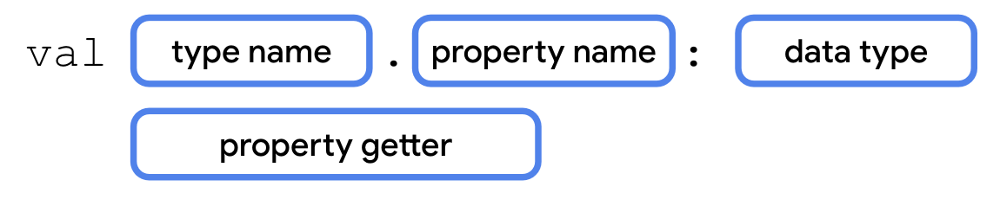

main() 関数のコードをリファクタリングして、クイズの進行状況を拡張プロパティに出力するようにします。

1. `Quiz` クラスの下に、`Quiz.StudentProgress` の拡張プロパティを `progressText` という名前で定義し、`String` 型を指定します。

```kotlin
val Quiz.StudentProgress.progressText: String
```

2. 拡張プロパティのゲッターを定義して、以前 `main()` で使用したのと同じ文字列を返します。

```kotlin
val Quiz.StudentProgress.progressText: String
    get() = "${answered} of ${total} answered"
```

3. `main()` 関数のコードを、`progressText` を出力するコードに置き換えます。これはコンパニオン オブジェクトの拡張プロパティなので、クラス名 `Quiz` を使用したドット表記でアクセスできます。

```kotlin
fun main() {
    println(Quiz.progressText)
}
```

4. コードを実行して、正常に機能することを確認します。

```
3 of 10 answered.
```

> **注:** 拡張プロパティはデータを格納できないので、get のみが可能です。

#### 拡張関数を追加する

拡張関数を定義するには、関数名の前に型名とドット演算子（`.`）を追加します。

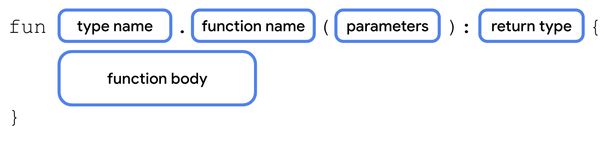

クイズの進行状況を進行状況バーとして出力する拡張関数を追加します。Kotlin プレイグラウンドでは実際に進行状況バーを作成することができないため、テキストを使用してレトロスタイルの進行状況バーを出力します。

1. `StudentProgress` オブジェクトに、`printProgressBar()` という名前の拡張オブジェクトを追加します。この関数はパラメータを受け取らず、戻り値を返しません。

```kotlin
fun Quiz.StudentProgress.printProgressBar() {
}
```

2. `repeat()` を使用して、`▓` という文字を `answered` 回出力します。進行状況バーのこの色が濃い部分は、解答済みの問題の数を表します。各文字の後に改行は入れないので、`print()` を使用します。

```kotlin
fun Quiz.StudentProgress.printProgressBar() {
    repeat(Quiz.answered) { print("▓") }
}
```

3. `repeat()` を使用して、`▒` という文字を出力します。この文字の数は、`total` から `answered` を差し引いた値です。進行状況バーのこの色の薄い部分は、未解答の問題の数を表します。

```kotlin
fun Quiz.StudentProgress.printProgressBar() {
    repeat(Quiz.answered) { print("▓") }
    repeat(Quiz.total - Quiz.answered) { print("▒") }
}
```

4. 引数なしで `println()` を使用して改行を出力し、次に `progressText` を出力します。

```kotlin
fun Quiz.StudentProgress.printProgressBar() {
    repeat(Quiz.answered) { print("▓") }
    repeat(Quiz.total - Quiz.answered) { print("▒") }
    println()
    println(Quiz.progressText)
}
```

5. `main()` のコードを更新して、`printProgressBar()` を呼び出すようにします。

```kotlin
fun main() {
    Quiz.printProgressBar()
}
```

6. コードを実行して出力を確認します。

```
▓▓▓▒▒▒▒▒▒▒
3 of 10 answered.
```

この手法の使用が必須かというと、もちろん違います。しかし、拡張プロパティと拡張メソッドを使用できるようにしておくと、他の開発者にコードを公開したときに、選択肢がさらに増えます。他の型でドット構文を使用すると、開発者自身にとっても他の開発者にとっても、コードが読みやすくなります。

### 7. インターフェースを使用して拡張関数を書き換える

前のページでは、拡張プロパティと拡張関数を使用して、`StudentProgress` オブジェクトにコードを直接追加せずに、プロパティとメソッドを追加する方法を確認しました。これは、定義済みの 1 つのクラスに機能を追加するための優れた方法ですが、ソースコードにアクセスできる場合は、必ずしもクラスを拡張する必要はありません。特定のメソッドまたはプロパティのみが存在し、どのような実装を行うべきかわからない場合もあります。それぞれの動作が異なる複数のクラスが必要で、各クラスに同じ追加のプロパティとメソッドがある場合は、そのようなプロパティとメソッドをインターフェースで定義できます。

たとえば、クイズ以外に、アンケートやレシピのステップなど、進行状況バーを使用できる順序付きデータのクラスがあるとします。ここでインターフェースを定義すると、各クラスに含める必要があるメソッドまたはプロパティを指定できます。

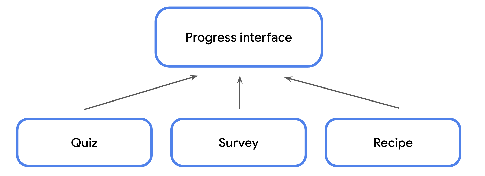

インターフェースを定義するには、`interface` キーワードの後に、UpperCamelCase 形式の名前、左波かっこと右波かっこを続けて記述します。波かっこの中で、インターフェースに従うすべてのクラスが実装する必要があるメソッド シグネチャまたは get のみのプロパティを定義できます。

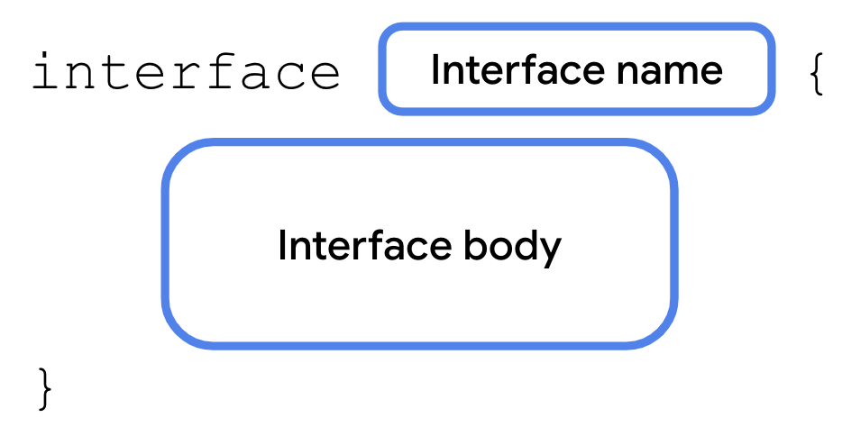

インターフェースは一種のコントラクトです。クラスがインターフェースに従うことを「インターフェースを拡張する」と言います。クラスがインターフェースを拡張することを宣言するには、コロン（`:`）の後に、スペース、インターフェース名を続けて記述します。

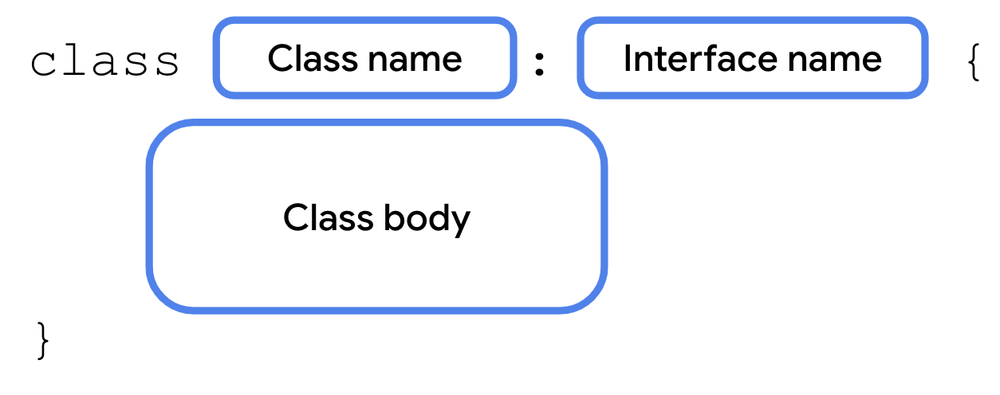

クラスでは、インターフェースで指定されているすべてのプロパティとメソッドを実装する必要があります。これにより、インターフェースを拡張する必要があるすべてのクラスに、まったく同じメソッド シグネチャを持つまったく同じメソッドを簡単に実装できます。プロパティまたはメソッドの追加または削除、メソッド シグネチャの変更など、なんらかの方法でインターフェースを変更した場合は、インターフェースを拡張するクラスをすべて更新し、コードの一貫性を維持して保守を容易にすることがコンパイラによって要求されます。

インターフェースを使用すると、インターフェースを拡張するクラスの動作にバリエーションを持たせることができます。実装を提供するかどうかはクラスごとに決定します。

インターフェースを使用するように進行状況バーを書き換え、Quiz クラスでインターフェースを拡張する方法を見てみましょう。

1. `Quiz` クラスの上で、`ProgressPrintable` という名前のインターフェースを定義します。`ProgressPrintable` という名前を選択したのは、このインターフェースを拡張するクラスが進行状況バーを出力できるようにするためです。

```kotlin
interface ProgressPrintable {
}
```

2. `ProgressPrintable` インターフェース内で、`progressText` という名前のプロパティを定義します。

```kotlin
interface ProgressPrintable {
    val progressText: String
}
```

3. `Quiz` クラスの宣言を変更して、`ProgressPrintable` インターフェースを拡張します。

```kotlin
class Quiz : ProgressPrintable {
    ... 
}
```

4. `Quiz` クラスに、`ProgressPrintable` インターフェースで指定した、`progressText` という名前の `String` 型のプロパティを追加します。このプロパティは `ProgressPrintable` から取得されるため、`val` の前に override キーワードを付けます。

```kotlin
override val progressText: String
```

5. 元の `progressText` 拡張プロパティからプロパティ ゲッターをコピーします。

```kotlin
override val progressText: String
        get() = "${answered} of ${total} answered"
```

6. 元の `progressText` 拡張プロパティを削除します。

**削除するコード:**

```kotlin
val Quiz.StudentProgress.progressText: String
    get() = "${answered} of ${total} answered"
```

7. `ProgressPrintable` インターフェースに、パラメータを受け取らず戻り値を返さない `printProgressBar` という名前のメソッドを追加します。

```kotlin
interface ProgressPrintable {
    val progressText: String
    fun printProgressBar()
}
```

8. `Quiz` クラスに、`override` キーワードを使用して `printProgressBar()` メソッドを追加します。

```kotlin
override fun printProgressBar() {
}
```

9. 元の `printProgressBar()` 拡張関数のコードを、インターフェースの新しい `printProgressBar()` に移動します。最後の行を変更して `Quiz` への参照を削除し、インターフェースの新しい `progressText` 変数を参照するようにします。

```kotlin
override fun printProgressBar() {
    repeat(Quiz.answered) { print("▓") }
    repeat(Quiz.total - Quiz.answered) { print("▒") }
    println()
    println(progressText)
}
```

10. 拡張関数 `printProgressBar()` を削除します。これで、この機能は `ProgressPrintable` を拡張する `Quiz` クラスに含まれるようになりました。

**削除するコード:**

```kotlin
fun Quiz.StudentProgress.printProgressBar() {
    repeat(Quiz.answered) { print("▓") }
    repeat(Quiz.total - Quiz.answered) { print("▒") }
    println()
    println(Quiz.progressText)
}
```

11. `main()` のコードを更新します。`printProgressBar()` 関数は `Quiz` クラスのメソッドになったため、まず `Quiz` オブジェクトをインスタンス化してから `printProgressBar()` を呼び出す必要があります。

```kotlin
fun main() {
    Quiz().printProgressBar()
}
```

12. コードを実行します。出力に変更はありませんが、コードのモジュール性が向上しました。コードベースの増大に伴い、同じインターフェースに従うクラスを簡単に追加できるため、スーパークラスから継承しなくてもコードを再利用できます。

```
▓▓▓▒▒▒▒▒▒▒
3 of 10 answered.
```

コードの構造化に役立つインターフェースのユースケースは数多くあり、共通のユニットで頻繁に使用されている例を目にするはずです。Kotlin を使用する際によく目にするであろうインターフェースの例を次にいくつか示します。

- [手動の依存関係インジェクション](https://developer.android.com/training/dependency-injection/manual)。依存関係のすべてのプロパティとメソッドを定義するインターフェースを作成します。依存関係（アクティビティ、テストケースなど）のデータ型としてインターフェースを要求し、インターフェースを実装する任意のクラスのインスタンスを使用できるようにします。これにより、基盤となる実装の入れ替えが可能になります。
- 自動テスト用のモックの作成。モッククラスと実際のクラスの両方が同じインターフェースに従います。
- [Compose マルチプラットフォーム](https://github.com/JetBrains/compose-jb) アプリ内での同じ依存関係へのアクセス。たとえば、基盤となる実装がプラットフォームごとに異なる場合でも、Android とパソコンに共通のプロパティとメソッドのセットを提供するインターフェースを作成します。
- Compose のいくつかのデータ型（[`Modifier`](https://developer.android.com/reference/kotlin/androidx/compose/ui/Modifier) など）はインターフェースです。これにより、基盤となるソースコードへのアクセスまたは変更を行わずに、新しい修飾子を追加できます。

### 8. スコープ関数を使用してクラスのプロパティとメソッドにアクセスする

すでに見てきたように、Kotlin には、コードをより簡潔にできる機能が数多く用意されています。

Android 開発の学習を進める中でよく目にするそうした機能の一つに、「スコープ関数」があります。スコープ関数を使用すると、変数名に繰り返しアクセスしなくても、クラスからプロパティとメソッドに簡単にアクセスできます。これは正確にはどういうことでしょうか。例を見てみましょう。

#### スコープ関数を使用してオブジェクト参照の繰り返しをなくす

スコープ関数は、オブジェクトの名前を参照せずにオブジェクトのプロパティとメソッドにアクセスすることを可能にする高階関数です。スコープ関数という呼称は、渡される関数の本体が、スコープ関数が呼び出されるオブジェクトのスコープを引き継ぐことに由来します。たとえば、一部のスコープ関数では、あたかも関数がクラスのメソッドとして定義されているかのように、そのクラス内のプロパティとメソッドにアクセスできます。これにより、長いオブジェクト名を指定する際に名前を省略できるので、コードが読みやすくなります。

もっとよく理解できるように、このコースに後ほど登場するスコープ関数をいくつか見てみましょう。

#### `let()` を使用して長いオブジェクト名を置き換える

`let()` 関数を使用すると、オブジェクトの実際の名前の代わりに識別子 `it` を使用して、ラムダ式でオブジェクトを参照できます。これにより、複数のプロパティにアクセスする際に、説明的な長いオブジェクト名を繰り返し使用することを回避できます。`let()` 関数は、ドット表記を使用して任意の Kotlin オブジェクトで呼び出すことができる拡張関数です。

`let()` を使用して、`question1`、`question2`、`question3` のプロパティにアクセスしてみましょう。

1. `printQuiz()` という名前の関数を `Quiz` クラスに追加します。

```kotlin
fun printQuiz() {
    
}
```

2. 問題の `questionText`、`answer`、`difficulty` を出力する次のコードを追加します。`question1`、`question2`、`question3` の複数のプロパティがアクセスされますが、そのたびに変数名全体が使用されます。変数の名前を変更した場合は、使用されている箇所をすべて更新する必要があります。

```kotlin
fun printQuiz() {
    println(question1.questionText)
    println(question1.answer)
    println(question1.difficulty)
    println()
    println(question2.questionText)
    println(question2.answer)
    println(question2.difficulty)
    println()
    println(question3.questionText)
    println(question3.answer)
    println(question3.difficulty)
    println()
}
```

3. `question1`、`question2`、`question3` で、`questionText`、`answer`、`difficulty` の各プロパティにアクセスするコードを、`let()` 関数の呼び出しで囲みます。各ラムダ式内の変数名をそのコードに置き換えます。

```kotlin
fun printQuiz() {
    question1.let {
        println(it.questionText)
        println(it.answer)
        println(it.difficulty)
    }
    println()
    question2.let {
        println(it.questionText)
        println(it.answer)
        println(it.difficulty)
    }
    println()
    question3.let {
        println(it.questionText)
        println(it.answer)
        println(it.difficulty)
    }
    println()
}
```

4. `main()` のコードを更新して、`quiz` という名前の `Quiz` クラスのインスタンスを作成します。

```kotlin
fun main() {
    val quiz = Quiz()
}
```

5. `printQuiz()` を呼び出します。

```kotlin
fun main() {
    val quiz = Quiz()
    quiz.printQuiz()
}
```

6. コードを実行して、すべてが正常に機能することを確認します。

```
Quoth the raven ___
nevermore
MEDIUM

The sky is green. True or false
false
EASY

How many days are there between full moons?
28
HARD
```

#### apply() を使用して変数なしでオブジェクトのメソッドを呼び出す

スコープ関数の便利な点の一つは、オブジェクトが変数に割り当てられる前に、オブジェクトでスコープ関数を呼び出せることです。たとえば、`apply()` 関数は、ドット表記を使用してオブジェクトで呼び出せる拡張関数です。`apply()` 関数は、そのオブジェクトへの参照も返すので、これを変数に格納できます。

`main()` のコードを更新して、`apply()` 関数を呼び出すようにします。

1. `Quiz` クラスのインスタンスを作成する際に、右かっこの後で `apply()` を呼び出します。`apply()` を呼び出す際にかっこを省略して、後置ラムダ構文を使用できます。

```kotlin
val quiz = Quiz().apply {
}
```

2. `printQuiz()` の呼び出しをラムダ式の内部に移動します。`quiz` 変数を参照する必要もドット表記を使用する必要もなくなります。

```kotlin
val quiz = Quiz().apply {
    printQuiz()
}
```

3. `apply()` 関数は `Quiz` クラスのインスタンスを返しますが、使用するところがないため、`quiz` 変数を削除します。`apply()` 関数では、`Quiz` のインスタンスでメソッドを呼び出す変数すら必要ありません。

```kotlin
Quiz().apply {
    printQuiz()
}
```

4. コードを実行します。`Quiz` のインスタンスを参照せずにこのメソッドを呼び出すことができた点に注意してください。`apply()` 関数は、`quiz` に格納されたオブジェクトを返しました。

```
Quoth the raven ___
nevermore
MEDIUM

The sky is green. True or false
false
EASY

How many days are there between full moons?
28
HARD
```

必要とする出力を得るうえでスコープ関数の使用は必須ではありませんが、上記の例は、コードをより簡潔にし、同じ変数名の繰り返しを回避する方法を示しています。

上記のコードでは 2 つの例のみを示しましたが、このコースで後ほどそれらの使用例を目にしたときは、[スコープ関数のドキュメント](https://kotlinlang.org/docs/scope-functions.html)をブックマークして参照することをおすすめします。

### 9. 概要

#### まとめ

このレッスンでは、Kotlin のいくつかの新機能がどのように機能するかを学びました。ジェネリックを使用すると、データ型をパラメータとしてクラスに渡すことができます。列挙型クラスは、可能な値の限定されたセットを定義します。データクラスは、クラスの有用なメソッドを自動的に生成します。

また、インスタンスが 1 つのみのシングルトン オブジェクトを作成する方法、シングルトン オブジェクトを別のクラスのコンパニオン オブジェクトにする方法、新しい get 専用プロパティと新しいメソッドで既存のクラスを拡張する方法を学びました。最後に、プロパティとメソッドにアクセスする際に、スコープ関数で構文を簡潔にする方法の例を学びました。

Kotlin、Android 開発、Compose について詳しく学習する過程で、これらのコンセプトはこの後のユニットにも登場します。ここでは、それらがどのように機能するかと、それらによってコードの再利用性と可読性がいかに向上するかについて理解を深めました。

### 10. 詳細

#### 関連リンク

- [ジェネリック](https://kotlinlang.org/docs/generics.html)
- [列挙型クラス](https://kotlinlang.org/docs/enum-classes.html)
- [データクラス](https://kotlinlang.org/docs/data-classes.html)
- [オブジェクトの式と宣言](https://kotlinlang.org/docs/object-declarations.html)
- [スコープ関数](https://kotlinlang.org/docs/scope-functions.html)

## 4. Kotlin でコレクションを使用する


### 1. はじめに

多くのアプリで、連絡先、設定、検索結果などのデータがリストとして表示されているのを目にしたことがあるかと思います。

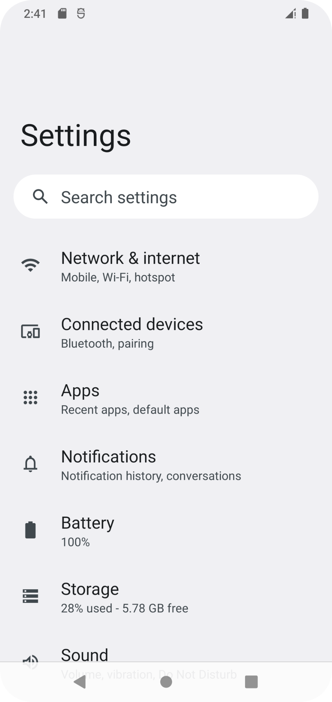

しかし、これまでに記述したコードでは、主に 1 つの値（例: 画面に表示されている数字やテキスト）のみで構成されるデータを扱っています。任意の量のデータを使用するアプリをビルドするには、コレクションの使用方法を確認する必要があります。

コレクション型（データ構造）を使用すると、複数の値（通常は同じデータ型）を整理して保存できます。コレクションには、順序付きリスト、一意の値のグループ化、あるデータ型の値から別のデータ型の値へのマッピングなどがあります。コレクションを効果的に使用すると、スクロール リストなど、Android アプリの一般的な機能を実装できるほか、任意の量のデータが関連する現実のさまざまなプログラミングに関する問題を解決できます。

このレッスンでは、コード内の複数の値を扱う方法について説明し、配列、リスト、セット、マップなど、さまざまなデータ構造を紹介します。

#### 前提条件

- クラス、インターフェース、ジェネリックなど、Kotlin でのオブジェクト指向プログラミングに精通していること。

#### 学習内容

- 配列を作成および変更する方法。
- `List` と `MutableList` の使用方法。
- `Set` と `MutableSet` の使用方法。
- `Map` と `MutableMap` の使用方法。

#### 必要なもの

- Kotlin プレイグラウンドにアクセスできるウェブブラウザ。

### 2. Kotlin の配列

#### 配列とは

配列は、プログラム内の任意の数の値をグループ化する最も簡単な方法です。

「ソーラーパネルをグループ化したソーラーアレイ（solar array）」、「プログラミング分野のキャリアの幅広い可能性（an array of possibilities）を切り開く Kotlin の学習」というように、`Array` は**複数の値**を表します。具体的には、配列はすべて同じデータ型を持つ一連の値です。

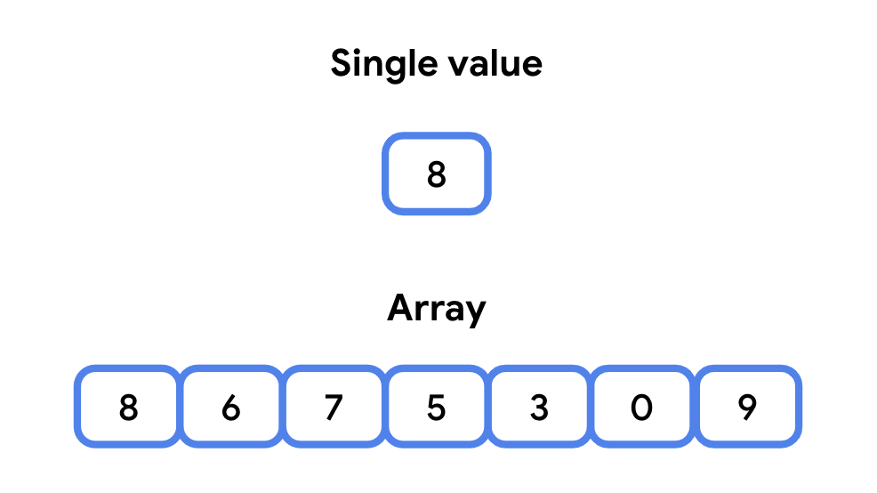

- 配列には要素またはアイテムと呼ばれる複数の値が含まれています。
- 配列内の要素は順序付けられ、インデックスでアクセスされます。

インデックスとは何でしょうか。インデックスは配列内の要素に対応する整数で、配列内の開始要素から各要素までの距離を示します。これを「ゼロ インデックス登録」と呼びます。配列の最初の要素はインデックス 0 に存在し、2 番目の要素は最初の要素から 1 つ目の場所にあることからインデックス 1 に存在します。以降の要素も同様に扱われます。

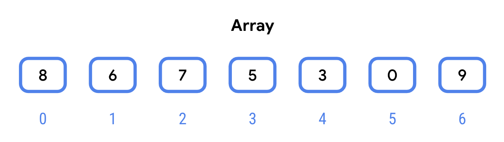

デバイスのメモリには、配列内の要素が隣接して保存されます。基礎となる詳細はこのレッスンの対象外ですが、配列には 2 つの重要な点があります。

- インデックスによる配列要素へのアクセスは高速です。配列の任意のランダム要素にはインデックスでアクセスできます。また、その際に要する時間は、他のランダム要素へのアクセスに要する時間とほぼ同じであると想定できます。これが、配列にランダム アクセスできるとされる理由です。
- 配列のサイズは固定されています。つまり、このサイズを超えて配列に要素を追加することはできません。100 個の要素が存在する配列では、最大インデックスが 99 であるため、インデックス 100 の要素にアクセスしようとすると例外がスローされます（前述のとおり、最初のインデックスは 1 ではなく 0 です）。ただし、配列のそれぞれのインデックスにある値は変更できます。

> **注:** このレッスンでの「メモリ」とは、デバイスの短期的なランダムアクセス メモリ（RAM）のことであり、長期的な永続ストレージではありません。メモリ内の任意の位置にすばやくアクセスできるため、「ランダム アクセス」と呼ばれます。

コード内で配列を宣言するには、`arrayOf()` 関数を使用します。


`arrayOf()` 関数は配列要素をパラメータとして受け取り、渡されたパラメータに一致する型の配列を返します。`arrayOf()` はパラメータの数が異なるため、他の関数とは若干異なる場合があります。2 つの引数を `arrayOf()` に渡すと、結果として得られる配列には、0 と 1 のインデックスが付加された 2 つの要素が含まれます。3 つの引数を渡すと、結果として得られる配列には、0 から 2 までのインデックスが付加された 3 つの要素が含まれます。

太陽系のほんの一部を探索して、実際の配列を確認しましょう。

1. [Kotlin のプレイグラウンド](https://developer.android.com/training/kotlinplayground)に移動します。
2. `main()` で `rockPlanets` 変数を作成します。`arrayOf()` を呼び出して、`String` 型と 4 つの文字列（太陽系の 4 つの岩石惑星）を渡します。

```kotlin
val rockPlanets = arrayOf<String>("Mercury", "Venus", "Earth", "Mars")
```

3. Kotlin は型推論を使用するため、`arrayOf()` を呼び出すときに型名を省略できます。`rockPlanets` 変数の下に、別の変数 `gasPlanets` を追加します。このとき、山かっこで囲んだ型を渡す必要はありません。

```kotlin
val gasPlanets = arrayOf("Jupiter", "Saturn", "Uranus", "Neptune")
```

4. 配列を使用すると、いくつかのスマートな処理を実施できます。たとえば、数値型 `Int` や `Double` と同様に、2 つの配列を加算できます。プラス（`+`）演算子を使用して、`solarSystem` という新しい変数を作成し、`rockPlanets` と `gasPlanets` を結合した結果と等しくなるように設定します。結果として、`rockPlanets` 配列の要素と `gasPlanets` 配列の要素をすべて含む新しい配列が生成されます。

```kotlin
val solarSystem = rockPlanets + gasPlanets
```

5. プログラムを実行して動作することを確認します。まだ出力は表示されません。

#### 配列内の要素にアクセスする

配列の要素にはインデックスでアクセスできます。

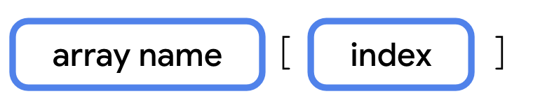

これはサブスクリプト構文と呼ばれます。これは次の 3 つの部分で構成されます。

- 配列の名前。
- 左角かっこ（`[`）と右角かっこ（`]`）。
- 角かっこ内の配列要素のインデックス。

`solarSystem` 配列の要素に、インデックスでアクセスしましょう。

1. `main()` で、`solarSystem` 配列の各要素にアクセスして出力します。最初のインデックスは `0`、最後のインデックスは `7` です。

```kotlin
println(solarSystem[0])
println(solarSystem[1])
println(solarSystem[2])
println(solarSystem[3])
println(solarSystem[4])
println(solarSystem[5])
println(solarSystem[6])
println(solarSystem[7])
```

2. プログラムを実行します。これらの要素は、`arrayOf()` の呼び出し時に指定した順序と同じです。

```
Mercury
Venus
Earth
Mars
Jupiter
Saturn
Uranus
Neptune
```

インデックスで配列要素の値を設定することもできます。

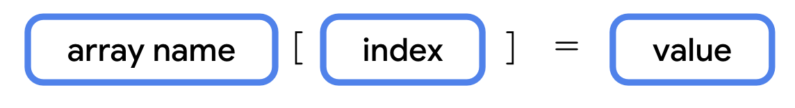

インデックスへのアクセスは前述の場合と同じ、配列の名前の後にインデックスを含む角かっこを付加します。その後に割り当て演算子（`=`）と新しい値を続けます。

`solarSystem` 配列の値を変更してみましょう。

1. 将来移住する人達のために、火星に新しい名前を付けてみましょう。インデックス `3` で要素にアクセスし、`"Little Earth"` に設定します。

```kotlin
solarSystem[3] = "Little Earth"
```

2. インデックス `3` で要素を出力します。

```kotlin
println(solarSystem[3])
```

3. プログラムを実行します。配列の 4 番目の要素（インデックス `3`）が更新されます。

```
...
Little Earth
```

4. 海王星よりも遠くに冥王星という 9 番目の惑星が存在することを天文学者が発見したとします。前述のとおり、配列のサイズを変更することはできません。サイズの変更を試みるとどうなるでしょうか。この惑星を `solarSystem` 配列に追加してみましょう。配列の 9 番目の要素であることから、惑星をインデックス `8` に追加します。

```kotlin
solarSystem[8] = "Pluto"
```

5. コードを実行します。`ArrayIndexOutOfBounds` 例外がスローされます。想定どおり、配列にすでに 8 個の要素があるため、単純に 9 番目の要素を追加することはできません。

```
Exception in thread "main" java.lang.ArrayIndexOutOfBoundsException: Index 8 out of bounds for length 8
```

6. 配列への惑星の追加を削除します。

**削除するコード**

```kotlin
solarSystem[8] = "Pluto"
```

7. 配列をさらに大きくする場合は、新しい配列を作成する必要があります。次に示すように、`newSolarSystem` という新しい変数を定義します。この配列では、要素を 8 個ではなく 9 個保存できます。

```kotlin
val newSolarSystem = arrayOf("Mercury", "Venus", "Earth", "Mars", "Jupiter", "Saturn", "Uranus", "Neptune", "Pluto")
```

8. インデックス `8` の要素を出力してみましょう。

```kotlin
println(newSolarSystem[8])
```

9. コードを実行し、例外が発生せずに動作することを確認します。

```
...
Pluto
```

これで、配列の知識を活用して、コレクションに対してほぼあらゆる作業を行えるようになったのでしょうか。

いいえ、まだ他に確認すべきことがあります。配列はプログラミングの基本的な側面の一つですが、要素の追加や削除が必要なタスクに配列を使用すると、コレクションの一意性の確認や、他のオブジェクトに対するオブジェクトのマッピングが従来ほど単純ではなくなり、アプリのコードが早期の段階で煩雑化します。

そのため、Kotlin を含むほとんどのプログラミング言語では、特殊なコレクション型を実装することで、実際のアプリでよく遭遇する状況に対処できます。以降のセクションでは、`List`、`Set`、`Map` という 3 つの一般的なコレクションについて説明します。また、一般的なプロパティとメソッド、およびこれらのコレクション型を使用する状況についても説明します。

### 3. リスト

リストは、順序付けされたサイズ変更可能なコレクションであり、通常はサイズ変更可能な配列として実装されます。配列に空き容量がなくなり、新しい要素を挿入しようとすると、配列はより大きな新しい配列にコピーされます。

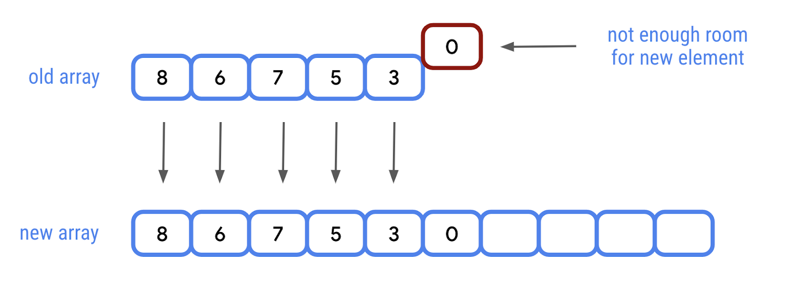

リストを使用すると、特定のインデックスで他の要素の間に新しい要素を挿入することもできます。

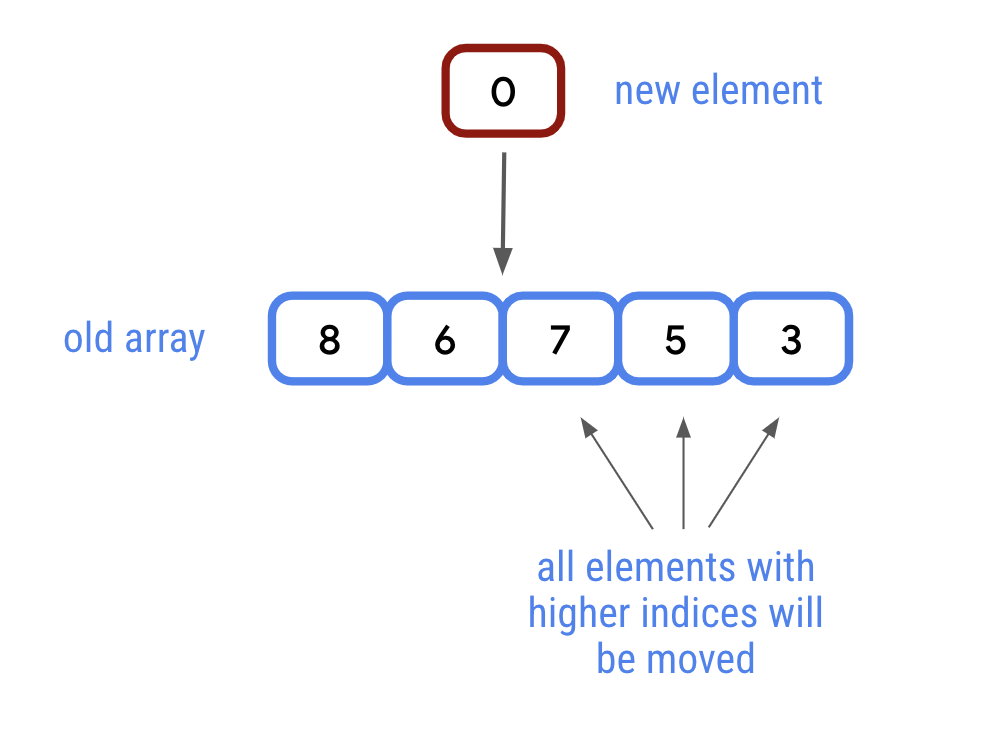

このような方法で、リストは要素を追加、削除できます。多くの場合、リスト内に存在する要素の数を問わず、要素をリストに追加するのに要する時間は同じです。まれに、新しい要素を追加することで配列が定義されたサイズを超えてしまう場合に、配列要素を移動して新しい要素用のスペースを確保する必要が生じることがあります。これはリストによってすべて自動的に処理されますが、背後では、この配列が必要に応じて新しい配列にスワップアウトされます。

#### `List` と `MutableList`

Kotlin で目にするコレクション型は、1 つ以上のインターフェースを実装します。このユニットの前の部分のジェネリック、オブジェクト、拡張機能のレッスンで説明したとおり、インターフェースは実装対象のクラスの標準的なプロパティとメソッドのセットを指定します。`List` インターフェースを実装するクラスは、`List` インターフェースのすべてのプロパティとメソッドの実装を行います。`MutableList` の場合も同様です。

`List` と `MutableList` の役割は何でしょうか。

- `List` は、アイテムの読み取り専用の順序付けされたコレクションに関連するプロパティとメソッドを定義するインターフェースです。
- `MutableList` は、要素の追加や削除など、リストを変更するメソッドを定義して、`List` インターフェースを拡張します。

これらのインターフェースでは、`List` または `MutableList`（あるいはそれらの両方）のプロパティとメソッドのみを指定します。その拡張を行うクラスによって、プロパティとメソッドの実装方法がそれぞれ決定されます。上記の配列ベースの実装は、すべてではないにしても最も頻繁に使用するものですが、Kotlin では他のクラスが `List` と `MutableList` を拡張できます。

#### `listOf()` 関数

`arrayOf()` と同様に、`listOf()` 関数はアイテムをパラメータとして受け取りますが、配列ではなく `List` を返します。

1. `main()` から既存のコードを削除します。
2. `main()` で、`listOf()` を呼び出して `solarSystem` という惑星の `List` を作成します。

```kotlin
fun main() {
    val solarSystem = listOf("Mercury", "Venus", "Earth", "Mars", "Jupiter", "Saturn", "Uranus", "Neptune")
}
```

3. `List` には、リスト内の要素の数を取得する `size` プロパティが存在します。`solarSystem` リストの `size` を出力します。

```kotlin
println(solarSystem.size) 
```

4. コードを実行します。リストのサイズは 8 であることが必要です。

```
8
```

#### リストから要素にアクセスする

配列と同様に、サブスクリプト構文を使用して `List` から特定のインデックスの要素にアクセスできます。`get()` メソッドを使用しても同じことができます。サブスクリプト構文と `get()` メソッドは、パラメータとして `Int` を受け取り、該当するインデックスの要素を返します。`Array` と同様に、`ArrayList` にはゼロのインデックスが付加されるため、たとえば、4 つ目の要素はインデックス `3` に存在します。

1. サブスクリプト構文を使用してインデックス `2` の惑星を出力します。

```kotlin
println(solarSystem[2])
```

2. `solarSystem` リストで `get()` を呼び出して、インデックス `3` の要素を出力します。

```kotlin
println(solarSystem.get(3))
```

3. コードを実行します。インデックス `2` の要素は `"Earth"`、インデックス `3` の要素は `"Mars"` です。

```
...
Earth
Mars
```

インデックスで要素を取得するだけでなく、`indexOf()` メソッドを使用して特定の要素のインデックスを検索することもできます。`indexOf()` メソッドは、指定された要素（引数として渡されます）のリストを検索し、その要素が最初に出現した位置のインデックスを返します。この要素がリストにない場合は、`-1` を返します。

1. `solarSystem` リストの `indexOf()` を呼び出した結果を出力し、`"Earth"` を渡します。

```kotlin
println(solarSystem.indexOf("Earth"))
```

2. `indexOf()` を呼び出して `"Pluto"` を渡し、結果を出力します。

```kotlin
println(solarSystem.indexOf("Pluto"))
```

3. コードを実行します。要素が `"Earth"` と一致するため、インデックス `2` が出力されます。`"Pluto"` に一致する要素がないため、`-1` が出力されます。

```
...
2
-1
```

#### `for` ループを使用してリスト要素を反復処理する

関数型とラムダ式について説明した際に、`repeat()` 関数を使用してコードを複数回実行する方法を確認しました。

プログラミングでの一般的なタスクは、リスト内の要素ごとにタスクを 1 回実行することです。Kotlin には、簡潔で判読が容易な構文でこれを実現する `for` ループと呼ばれる機能があります。多くの場合に、これはリストのループまたはリストの反復処理と呼ばれます。

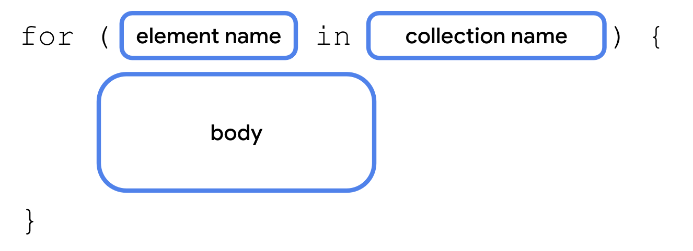

リストをループするには、`for` キーワードに続けて、開きかっこと閉じかっこの組み合わせを使用します。かっこ内に、変数名、`in` キーワード、コレクション名をこの順序で挿入します。閉じかっこの後には、開き中かっこと閉じ中かっこのペアがあります。このペアには、コレクション内の各要素に対して実行するコードを指定します。これをループの本文と呼びます。このコードのそれぞれの実行は、反復と呼ばれます。

`in` キーワードの前の変数が `val` または `var` で宣言されていません。これは読み取り専用であるとみなされます。任意の名前を付けることができます。リストに `planets` のような複数形の名前が指定されている場合、変数には単数形の名前（`planet` など）を付けるのが一般的です。変数に `item` や `element` という名前を付けることも一般的です。

これは、コレクション内の現在の要素（最初の反復処理の場合はインデックス `0` の要素、2 回目の反復処理の場合はインデックス `1` の要素、以降同様）に対応する一時変数として使用され、中かっこ内でアクセス可能です。

実際の動作を確認するため、`for` ループを使用して、各惑星名を別々の行に出力します。

1. `main()` の、`println()` への直近の呼び出しの下に、`for` ループを追加します。かっこ内で、変数 `planet` に名前を付け、`solarSystem` リストをループします。

```kotlin
for (planet in solarSystem) {
}
```

2. 中かっこ内で、`println()` を使用して `planet` の値を出力します。

```kotlin
for (planet in solarSystem) {
    println(planet)
}
```

3. コードを実行します。ループ本文内のコードは、コレクション内の各アイテムに対して実行されます。

```
...
Mercury
Venus
Earth
Mars
Jupiter
Saturn
Uranus
Neptune
```

#### リストに要素を追加する

コレクションの要素を追加、削除、更新する機能は、`MutableList` インターフェースを実装するクラス専用です。新たに見つかった惑星を追跡している場合は、要素を高頻度でリストに追加できる機能が必要でしょう。具体的には、要素の追加と削除を行うリストを作成するときに、`listOf()` ではなく `mutableListOf()` 関数を呼び出す必要があります。

`add()` 関数には次の 2 つのバージョンがあります。

- 最初の `add()` 関数には、リスト内の要素の型のパラメータが 1 つ存在し、リストの最後に追加されます。
- `add()` のもう一方のバージョンには 2 つのパラメータが存在します。最初のパラメータは、新しい要素が挿入されるインデックスに対応しています。2 つ目のパラメータはリストに追加される要素です。

実際に見てみましょう。

1. `solarSystem` の初期化を変更して、`listOf()` ではなく `mutableListOf()` を呼び出すようにします。`MutableList` で定義されたメソッドを呼び出すことができるようになりました。

```kotlin
val solarSystem = mutableListOf("Mercury", "Venus", "Earth", "Mars", "Jupiter", "Saturn", "Uranus", "Neptune")
```

2. ここでも、冥王星を惑星として分類する必要があります。`solarSystem` に対して `add()` メソッドを呼び出し、`"Pluto"` を単一の引数として渡します。

```kotlin
solarSystem.add("Pluto")
```

3. 一部の天文学者は、テイアと呼ばれる惑星がかつて存在し、地球と衝突した結果、月が形成されたとする理論を主張しています。インデックス `3`（`"Earth"`～`"Mars"`）に `"Theia"` を挿入します。

```kotlin
solarSystem.add(3, "Theia")
```

#### 特定のインデックスの要素を更新する

既存の要素はサブスクリプト構文で更新できます。

1. インデックス `3` の値を `"Future Moon"` に更新します。

```kotlin
solarSystem[3] = "Future Moon"
```

2. サブスクリプト構文を使用して、インデックス `3` と `9` にある値を出力します。

```kotlin
println(solarSystem[3])
println(solarSystem[9])
```

3. コードを実行して出力を確認します。

```
Future Moon
Pluto
```

#### リストから要素を削除する

要素を削除するには、`remove()` メソッドまたは `removeAt()` メソッドを使用します。要素を `remove()` メソッドに渡すか、`removeAt()` を使用してインデックスで指定して削除できます。

要素を削除する両方の方法を実際に見てみましょう。

1. `solarSystem` に対して `removeAt()` を呼び出し、インデックスに `9` を渡します。この操作を行うと、`"Pluto"` がリストから削除されます。

```kotlin
solarSystem.removeAt(9)
```

2. `solarSystem` に対して `remove()` を呼び出し、削除する要素として `"Future Moon"` を渡します。リストが検索され、一致する要素が見つかった場合は、削除されます。

```kotlin
solarSystem.remove("Future Moon")
```

3. `List` は、要素がリスト内に存在する場合に `Boolean` を返す `contains()` メソッドを指定します。`"Pluto"` に対して `contains()` を呼び出した結果を出力します。

```kotlin
println(solarSystem.contains("Pluto"))
```

4. より簡潔な構文として、`in` 演算子を使用する方法があります。要素がリストに含まれているかどうかを確認するには、要素、`in` 演算子、コレクションを使用します。`in` 演算子を使用して、`solarSystem` に `"Future Moon"` が含まれているかどうかを確認します。

```kotlin
println("Future Moon" in solarSystem)
```

5. コードを実行します。どちらのステートメントでも、`false` が出力されます。

```
...
false
false
```

### 4. セット

セットは特定の順序を持たないコレクションであり、重複値を許可しません。

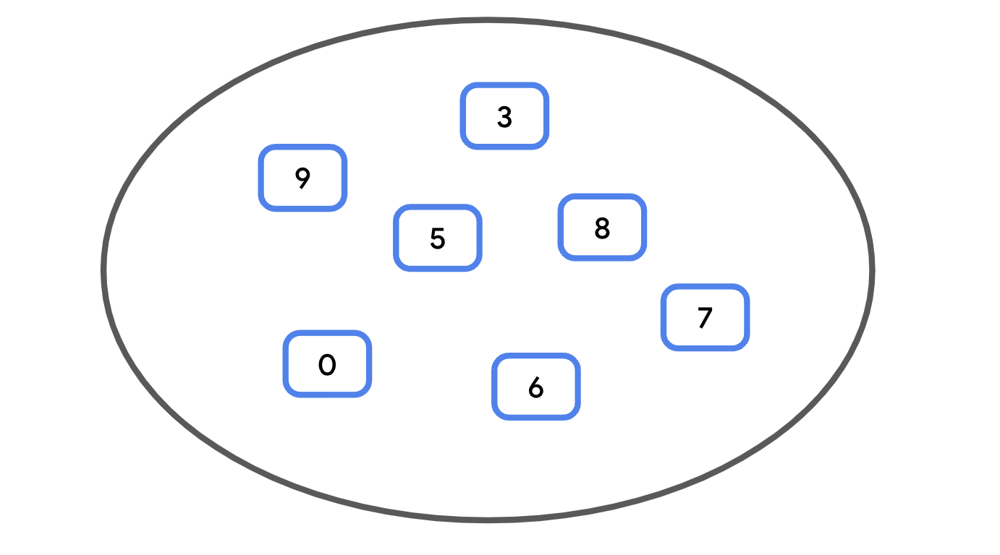

このようなコレクションはどのような仕組みでしょうか。シークレットはハッシュコードです。ハッシュコードは、Kotlin クラスの `hashCode()` メソッドで生成される `Int` です。これは、Kotlin オブジェクトの準一意識別子と考えることができます。`String` に 1 文字を追加するなど、オブジェクトを若干変更するだけでも、ハッシュ値が大きく変化します。2 つのオブジェクトが同じハッシュコードを持つことは可能です（ハッシュの競合と呼ばれます）が、`hashCode()` 関数では一定の一意性が保証されます。ほとんどの場合、2 つの異なる値はそれぞれに一意のハッシュコードを持ちます。

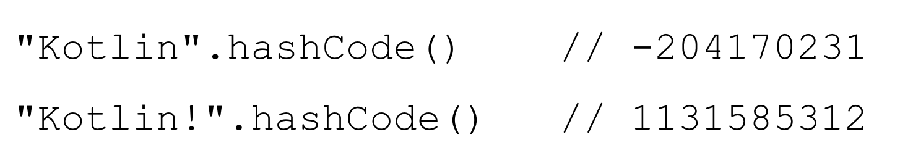

> **注:** セットではハッシュコードを配列インデックスとして使用します。もちろん、約 40 億個の異なるハッシュコードが存在する可能性があるため、`Set` は単なる 1 つの巨大な配列ではありません。`Set` はリストの配列と考えることができます。
> 
> 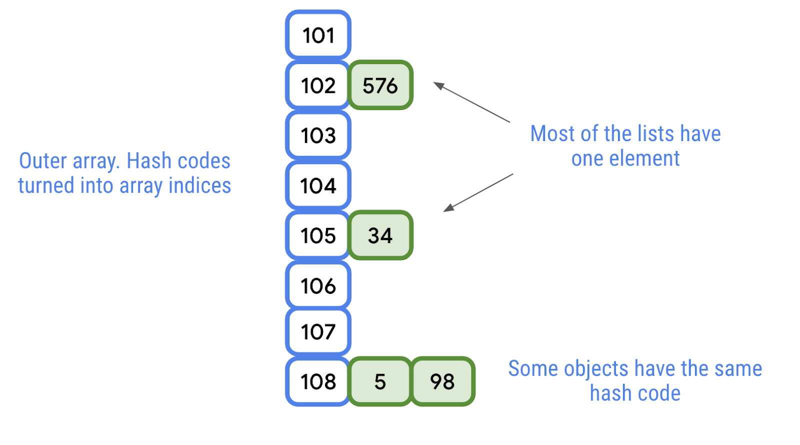
> 
> 外側の配列（左側にある枠線が青色の数字）はそれぞれ、設定可能なハッシュコードの範囲（バケットとも呼ばれます）に対応しています。内側のリスト（右側にある緑色の網掛け部分）はそれぞれ、セット内の個別のアイテムを表します。ハッシュの競合は比較的まれなため、潜在的なインデックスが制限されていても、各配列インデックスの内側のリストには、数万から数十万個の要素を追加しない限り、それぞれ 1 つまたは 2 つのアイテムのみ存在します。

セットには次の 2 つの重要なプロパティがあります。

1. リストに比べて、セット内の特定の要素をすばやく検索できます（特に大規模なコレクションの場合）。`List` の `indexOf()` では、一致が見つかるまで各要素を先頭からチェックする必要がありますが、チェックに要する時間は平均すると、要素が（最初の要素であるか、数十万番目の要素であるかを問わず）セットに存在するかどうかのチェックに要する時間と変わりません。
2. セットでは、同じデータ量のリストよりも多くのメモリを使用する傾向があります。これは、たいていの場合、セット内のデータよりも多くの配列インデックスを必要とするためです。

> **注:** 一般に考えられているのとは対照的に、セットに要素が含まれているかどうかの確認に要する時間は一定ではありません。実際には、セット内のデータ量によって異なります。ただし、通常はハッシュの競合はほとんど生じないため、確認が必要な要素の数はリスト内のアイテムを検索する場合よりも桁違いに少なくなります。

セットのメリットは一意性を確保できることです。新たに発見された惑星を追跡するプログラムを作成する場合は、このセットを使用することで、すでに発見されている惑星であるかどうかを簡単に確認できます。大量のデータが存在する場合、たいていは、要素がリストに存在するかどうかのチェック（すべての要素の反復処理を必要とします）よりも適した処理方法です。

`List` や `MutableList` と同様に、`Set` と `MutableSet` があります。`MutableSet` は `Set` を実装するため、`MutableSet` を実装するクラスは両方を実装する必要があります。

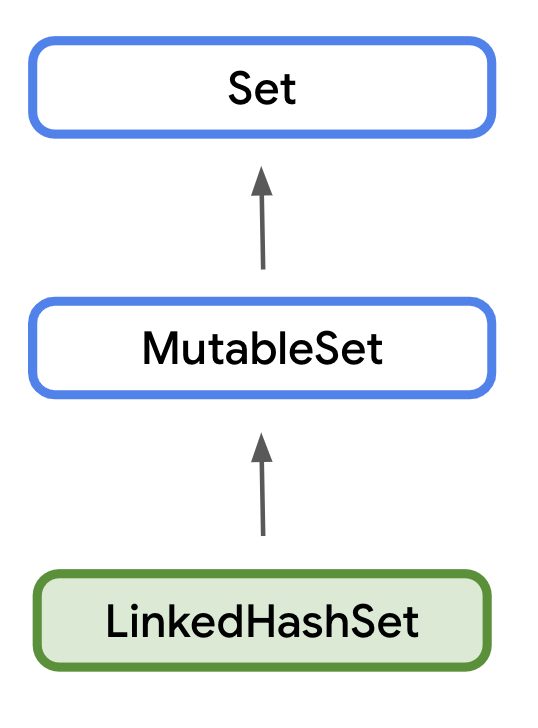

#### Kotlin で `MutableSet` を使用する

この例では、要素を追加または削除する方法を示すために `MutableSet` を使用します。

1. `main()` から既存のコードを削除します。
2. `mutableSetOf()` を使用して `solarSystem` という惑星の `Set` を作成します。これは `MutableSet` を返します。デフォルトの実装は `LinkedHashSet()` です。

```kotlin
val solarSystem = mutableSetOf("Mercury", "Venus", "Earth", "Mars", "Jupiter", "Saturn", "Uranus", "Neptune")
```

3. `size` プロパティを使用してセットのサイズを出力します。

```kotlin
println(solarSystem.size)
```

4. `MutableList` と同様に、`MutableSet` には `add()` メソッドがあります。`add()` メソッドを使用して、`solarSystem` セットに `"Pluto"` を追加します。追加する要素に対して 1 つのパラメータのみを受け取ります。セット内の要素は必ずしも順序を持たないため、インデックスはありません。

```kotlin
solarSystem.add("Pluto")
```

5. 要素を追加した後、セットの `size` を出力します。

```kotlin
println(solarSystem.size)
```

6. `contains()` 関数は単一のパラメータを受け取り、指定された要素がセットに含まれているかどうかを確認します。含まれている場合は true を返します。それ以外の場合は false を返します。`contains()` を呼び出して、`"Pluto"` が `solarSystem` に含まれているかどうかを確認します。

```kotlin
println(solarSystem.contains("Pluto"))
```

7. コードを実行します。サイズが拡大し、`contains()` が `true` を返すようになりました。

```
8
9
true
```

> **注**: 代替手段として、`in` 演算子を使用して、要素がコレクション内にあるかどうかを確認できます。たとえば、`"Pluto" in solarSystem` は `solarSystem.contains("Pluto")` と同じです。

8. 前述のとおり、セットに重複する内容を含めることはできません。`"Pluto"` をもう一度追加してみてください。

```kotlin
solarSystem.add("Pluto")
```

9. セットのサイズを再度出力します。

```kotlin
println(solarSystem.size)
```

10. コードをもう一度実行します。`"Pluto"` はすでにセットに含まれているため、追加されません。今回はサイズは拡大されません。

```
...
9
```

`remove()` 関数は単一のパラメータを受け取り、指定された要素をセットから削除します。

1. `remove()` 関数を使用して `"Pluto"` を削除します。

```kotlin
solarSystem.remove("Pluto")
```

> **注:** セットは順序付けられていないコレクションです。セットにはインデックスがないため、インデックスによってセットから値を削除する方法はありません。

2. コレクションのサイズを出力し、`contains()` を再度呼び出して、`"Pluto"` がまだセットにあるかどうかを確認します。

```kotlin
println(solarSystem.size)
println(solarSystem.contains("Pluto"))
```

3. コードを実行します。`"Pluto"` はセットに含まれなくなり、サイズは 8 になりました。

```
...
8
false
```

### 5. コレクションをマッピングする

`Map` は、キーと値で構成されるコレクションです。一意のキーは他の値にマッピングされるため、「マップ」と呼ばれます。キーとその付随する値は多くの場合、`key-value pair` と呼ばれます。

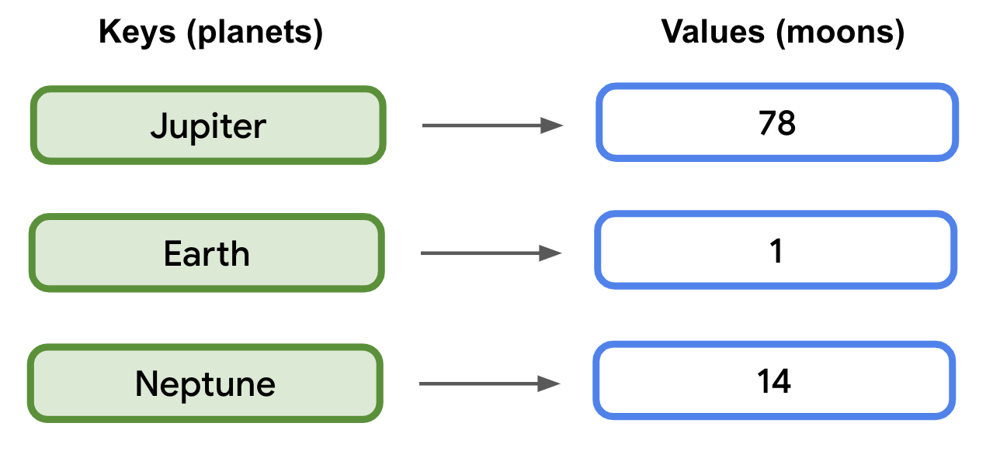

マップのキーは一意です。ただし、マップの値は一意ではありません。2 つの異なるキーが同じ値にマッピングされている可能性があります。たとえば、`"Mercury"` には `0` 個の衛星が存在し、`"Venus"` には `0` 個の衛星が存在します。

キーを使用してマップから値にアクセスする場合は、通常、大規模なリスト（`indexOf()` など）で検索するよりも高速です。

マップは、`mapOf()` 関数または `mutableMapOf()` 関数を使用して宣言できます。マップには、カンマで区切られた 2 つの汎用型が必要です。1 つはキー用、もう 1 つは値用です。

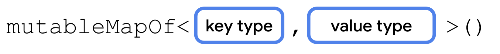

初期値がある場合は、マップでも型推論を使用できます。マップに初期値を設定するには、各 Key-Value ペアの構成要素としてキー、`to` 演算子、値をこの順序で設定します。各ペアをカンマで区切ります。

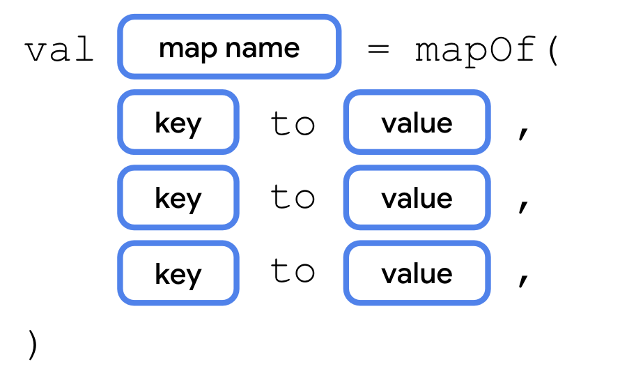

マップの使用方法、いくつかの有用なプロパティとメソッドについて詳しく見てみましょう。

1. `main()` から既存のコードを削除します。
2. 次に示すように、初期値に `mutableMapOf()` を使用して `solarSystem` というマップを作成します。

```kotlin
val solarSystem = mutableMapOf(
    "Mercury" to 0,
    "Venus" to 0,
    "Earth" to 1,
    "Mars" to 2,
    "Jupiter" to 79,
    "Saturn" to 82,
    "Uranus" to 27,
    "Neptune" to 14
)
```

3. リストやセットと同様に、`Map` には Key-Value ペアの数を含む `size` プロパティがあります。`solarSystem` マップのサイズを出力します。

```kotlin
println(solarSystem.size)
```

4. サブスクリプト構文を使用して、追加の Key-Value ペアを設定できます。キー `"Pluto"` の値を `5` に設定します。

```kotlin
solarSystem["Pluto"] = 5
```

5. 要素を挿入した後に、サイズを再度出力します。

```kotlin
println(solarSystem.size)
```

6. 値を取得するには、サブスクリプト構文を使用します。キー `"Pluto"` の衛星の数を出力します。

```kotlin
println(solarSystem["Pluto"])
```

7. `get()` メソッドを使用して値にアクセスすることもできます。サブスクリプト構文を使用する場合でも、`get()` を呼び出す場合でも、渡したキーがマップに存在しない可能性があります。Key-Value ペアが存在しない場合は null が返されます。`"Theia"` の衛星の数を出力します。

```kotlin
println(solarSystem.get("Theia"))
```

8. コードを実行します。冥王星の衛星の数が出力されます。ただし、テイアはマップに存在しないため、`get()` を呼び出すと null が返されます。

```
8
9
5
null
```

`remove()` メソッドは、指定されたキーを持つ Key-Value ペアを削除します。指定されたキーがマップに存在しない場合は、削除された値（`null`）を返します。

1. `remove()` を呼び出して `"Pluto"` を渡した結果を出力します。

```kotlin
solarSystem.remove("Pluto")
```

2. アイテムが削除されたことを確認するため、サイズを再度出力します。

```kotlin
println(solarSystem.size)
```

3. コードを実行します。エントリを削除した後のマップのサイズは 8 です。

```
...
8
```

4. サブスクリプト構文（`put()` メソッド）でも、既存のキーの値を変更できます。サブスクリプト構文を使用して木星の衛星を 78 個に更新し、新しい値を出力します。

```kotlin
solarSystem["Jupiter"] = 78
println(solarSystem["Jupiter"])
```

5. コードを実行します。既存のキー `"Jupiter"` の値が更新されます。

```
...
78
```

### 6. まとめ

お疲れさまでした。プログラミングにおける最も基本的なデータ型である配列と、`List`、`Set`、`Map` などの配列から構築されたいくつかの有用なコレクション型について学ぶことができました。これらのコレクション型を使用すると、コード内の値をグループ化して整理できます。配列やリストを使用すると、インデックスで要素にすばやくアクセスできます。一方で、セットとマップはハッシュコードを使用してコレクション内の要素の検出を容易にします。こうしたコレクション型は今後のアプリで頻繁に使用されるため、その使用方法を理解しておくことは将来のプログラミング分野のキャリアに対して有効です。

#### 概要

- 配列は同じ型の順序付きデータを格納し、サイズは固定されています。
- 配列は、他の多くのコレクション型を実装するために使用されます。
- リストはサイズ変更可能な順序付きコレクションです。
- セットは順序付けられていないコレクションであり、重複した内容を含めることはできません。
- マップの動作はセットと類似しており、指定された型のキーと値のペアを保存します。

### 7. 詳細

#### 関連リンク

- [コレクション](https://kotlinlang.org/docs/collections-overview.html)
- [リスト](https://kotlinlang.org/api/latest/jvm/stdlib/kotlin.collections/-list/)
- [条件とループ](https://kotlinlang.org/docs/control-flow.html)
- [MutableList](https://kotlinlang.org/api/latest/jvm/stdlib/kotlin.collections/-mutable-list/)
- [セット](https://kotlinlang.org/api/latest/jvm/stdlib/kotlin.collections/-set/)
- [hashCode()](https://kotlinlang.org/api/latest/jvm/stdlib/kotlin/-any/hash-code.html)
- [MutableSet](https://kotlinlang.org/api/latest/jvm/stdlib/kotlin.collections/-mutable-set/)
- [地図](https://kotlinlang.org/api/latest/jvm/stdlib/kotlin.collections/-map/)
- [MutableMap](https://kotlinlang.org/api/latest/jvm/stdlib/kotlin.collections/-mutable-map/)

## 5. コレクションを操作する高階関数


### 1. はじめに

Kotlin で関数型とラムダ式を使用するレッスンで、高階関数について学びました。これは、他の関数をパラメータとして受け取ったり、関数を返したりする、`repeat()` などの関数です。高階関数は特にコレクションと深い関係があり、並べ替えやフィルタリングなどの一般的なタスクをより少ないコードで実行するのに役立ちます。コレクションを扱うための基礎を十分に習得したところで、もう一度高階関数について学びましょう。

このレッスンでは、コレクション型に対して使用できるさまざまな関数（`forEach()`、`map()`、`filter()`、`groupBy()`、`fold()`、`sortedBy()` など）を学習します。その過程で、ラムダ式を扱う追加の演習を行います。

#### 前提条件

- 関数型とラムダ式に精通していること。
- 後置ラムダ構文（`repeat()` 関数など）に精通していること。
- Kotlin のさまざまなコレクション型（`List` など）に関する知識があること。

#### 学習内容

- ラムダ式を文字列に埋め込む方法。
- `List` コレクションに対してさまざまな高階関数（`forEach()`、`map()`、`filter()`、`groupBy()`、`fold()`、`sortedBy()` など）を使用する方法。

#### 必要なもの

- Kotlin プレイグラウンドにアクセスできるウェブブラウザ。

### 2. forEach() とラムダを含む文字列テンプレート

#### スターター コード

以下の例では、洋菓子店の美味しいクッキーのメニューを表す `List` を例として取り上げ、高階関数を使用してさまざまな方法でメニューの書式を設定します。

最初に、初期コードをセットアップします。

1. [Kotlin のプレイグラウンド](https://developer.android.com/training/kotlinplayground)に移動します。
2. `main()` 関数の上に `Cookie` クラスを追加します。`Cookie` の各インスタンスはメニューのアイテムを表し、`name`、`price`、およびクッキーに関するその他の情報を含みます。

```kotlin
class Cookie(
    val name: String,
    val softBaked: Boolean,
    val hasFilling: Boolean,
    val price: Double
)

fun main() {

}
```

3. 次に示すように、`Cookie` クラスの下、`main()` の外側に、クッキーのリストを作成します。型は `List<Cookie>` であると推定されます。

```kotlin
class Cookie(
    val name: String,
    val softBaked: Boolean,
    val hasFilling: Boolean,
    val price: Double
)

val cookies = listOf(
    Cookie(
        name = "Chocolate Chip",
        softBaked = false,
        hasFilling = false,
        price = 1.69
    ),
    Cookie(
        name = "Banana Walnut", 
        softBaked = true, 
        hasFilling = false, 
        price = 1.49
    ),
    Cookie(
        name = "Vanilla Creme",
        softBaked = false,
        hasFilling = true,
        price = 1.59
    ),
    Cookie(
        name = "Chocolate Peanut Butter",
        softBaked = false,
        hasFilling = true,
        price = 1.49
    ),
    Cookie(
        name = "Snickerdoodle",
        softBaked = true,
        hasFilling = false,
        price = 1.39
    ),
    Cookie(
        name = "Blueberry Tart",
        softBaked = true,
        hasFilling = true,
        price = 1.79
    ),
    Cookie(
        name = "Sugar and Sprinkles",
        softBaked = false,
        hasFilling = false,
        price = 1.39
    )
)

fun main() {

}
```

#### `forEach()` でリストをループする

最初に学ぶ高階関数は、`forEach()` 関数です。`forEach()` 関数は、コレクション内の各アイテムに対して、パラメータとして渡された関数を一度だけ実行します。この関数は、`repeat()` 関数または `for` ループと同じように機能します。ラムダは、コレクション内の最初の要素から最後の要素まで、各要素に対して順番に実行されます。メソッド シグネチャは次のとおりです。

```kotlin
forEach(action: (T) -> Unit)
```

`forEach()` は、単一のアクション パラメータ（つまり型が `(T) -> Unit` の関数）を受け取ります。

`T` は、コレクションに含まれる任意のデータ型に対応します。ラムダは単一のパラメータを受け取るので、名前を省略して `it` でパラメータを参照できます。

`forEach()` 関数を使用して、`cookies` リストのアイテムを出力します。

1. `main()` で、後置ラムダ構文を使用して `cookies` リストから `forEach()` を呼び出します。後置ラムダが唯一の引数であるため、関数を呼び出すときにかっこを省略できます。

```kotlin
fun main() {
    cookies.forEach {
        
    }
}
```

2. ラムダの本文に、`it` を出力する `println()` ステートメントを追加します。

```kotlin
fun main() {
    cookies.forEach {
        println("Menu item: $it")
    }
}
```

3. コードを実行し、出力を確認します。型の名前（`Cookie`）とオブジェクトの一意の識別子のみが出力され、オブジェクトの内容は出力されません。

```
Menu item: Cookie@5a10411
Menu item: Cookie@68de145
Menu item: Cookie@27fa135a
Menu item: Cookie@46f7f36a
Menu item: Cookie@421faab1
Menu item: Cookie@2b71fc7e
Menu item: Cookie@5ce65a89
```

#### 文字列に式を埋め込む

文字列テンプレートを初めて紹介したとき、変数名にドル記号（`$`）を付けて文字列に挿入する手法について説明しました。しかし、この手法は、プロパティにアクセスするためにドット演算子（`.`）と組み合わせると、思ったようには機能しません。

1. `forEach()` の呼び出しで、ラムダの本文を変更して `$it.name` を文字列に挿入します。

```kotlin
cookies.forEach {
    println("Menu item: $it.name")
}
```

2. コードを実行します。クラス名 `Cookie` と、オブジェクトの一意の識別子が挿入され、その後に `.name` が続きます。`name` プロパティの値はアクセスされません。

```
Menu item: Cookie@5a10411.name
Menu item: Cookie@68de145.name
Menu item: Cookie@27fa135a.name
Menu item: Cookie@46f7f36a.name
Menu item: Cookie@421faab1.name
Menu item: Cookie@2b71fc7e.name
Menu item: Cookie@5ce65a89.name
```

プロパティにアクセスしてそれらを文字列に埋め込むには、式が必要です。文字列テンプレートに式を含めるには、中かっこで囲みます。

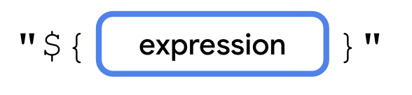

ラムダ式は、左中かっこと右中かっこの間に配置します。ラムダ式でプロパティへのアクセス、算術演算の実行、関数の呼び出しなどを行うことができ、ラムダの戻り値が文字列に挿入されます。

コードを変更して、名前が文字列に挿入されるようにしましょう。

1. `it.name` を中かっこで囲んでラムダ式にします。

```kotlin
cookies.forEach {
    println("Menu item: ${it.name}")
}
```

2. コードを実行します。出力に、各 `Cookie` の `name` が示されます。

```
Menu item: Chocolate Chip
Menu item: Banana Walnut
Menu item: Vanilla Creme
Menu item: Chocolate Peanut Butter
Menu item: Snickerdoodle
Menu item: Blueberry Tart
Menu item: Sugar and Sprinkles
```

### 3. map()

`map()` 関数を使用すると、あるコレクションを同じ数の要素を持つ新しいコレクションに変換できます。たとえば、`map()` を使用して、`List<Cookie>` をクッキーの `name` のみを含む `List<String>` に変換できます。そのためには、`Cookie` の各アイテムから `String` を作成する方法を `map()` 関数に指示します。

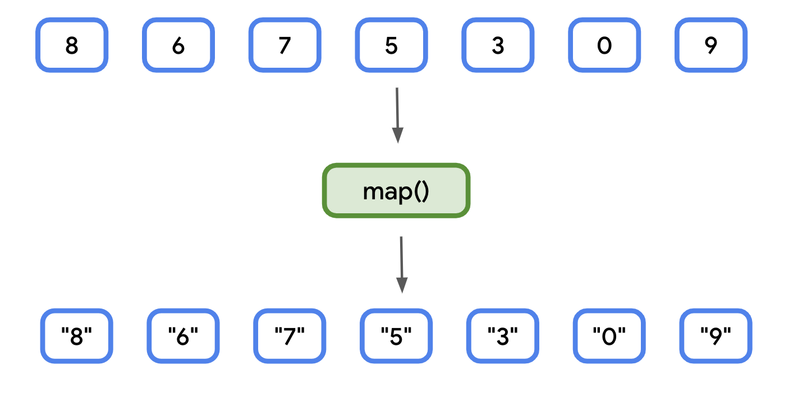

洋菓子店のインタラクティブなメニューを表示するアプリを作成する例で考えてみましょう。ユーザーは、クッキー メニューの画面に移動したときに、名前の次に価格が表示されるなどの合理的な順序でデータが表示されることを望むはずです。`map()` 関数を使用すると、関連するデータ（名前と価格）が書式設定された文字列のリストを作成できます。

1. `main()` から、既存のコードをすべて削除します。`fullMenu` という名前の新しい変数を作成し、`cookies` リストで `map()` を呼び出した結果を割り当てます。

```kotlin
val fullMenu = cookies.map {
    
}
```

2. ラムダの本文に、`it` の `name` と `price` を含む書式設定された文字列を追加します。

```kotlin
val fullMenu = cookies.map {
    "${it.name} - $${it.price}"
}
```

> **注:** 式の前で第 2 の `$` を使用しています。最初の $ は、その後に変数名またはラムダ式が続いていないため、ドル記号を表す文字（$）として扱われます。

3. `fullMenu` の内容を出力します。これは `forEach()` で行えます。`map()` から返される `fullMenu` コレクションの型は、`List<Cookie>` ではなく `List<String>` です。`cookies` 内の各 `Cookie` は、`fullMenu` 内の `String` に対応します。

```kotlin
println("Full menu:")
fullMenu.forEach {
    println(it)
}
```

4. コードを実行します。出力は `fullMenu` リストの内容と一致します。

```
Full menu:
Chocolate Chip - $1.69
Banana Walnut - $1.49
Vanilla Creme - $1.59
Chocolate Peanut Butter - $1.49
Snickerdoodle - $1.39
Blueberry Tart - $1.79
Sugar and Sprinkles - $1.39
```

### 4. filter()

`filter()` 関数を使用すると、コレクションのサブセットを作成できます。たとえば、数値のリストがある場合は、`filter()` を使用して、2 で割り切れる数値のみを含む新しいリストを作成できます。

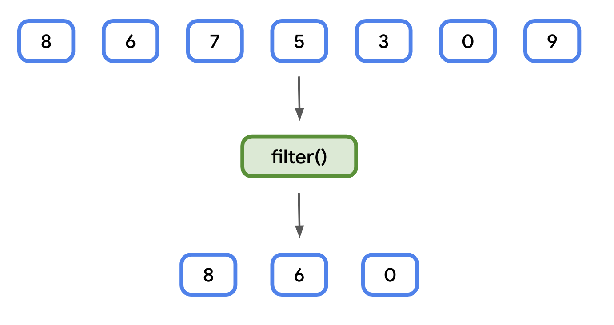

`map()` 関数の結果は常に元のコレクションと同じサイズのコレクションになりますが、`filter()` 関数の結果は元のコレクション以下のサイズのコレクションになります。`map()` と異なり、結果のコレクションのデータ型は元のコレクションと同じになるので、`List<Cookie>` をフィルタするともう一つの `List<Cookie>` になります。

`map()` および `forEach()` と同様に、`filter()` は単一のラムダ式をパラメータとして受け取ります。ラムダは、コレクション内の各アイテムを表す単一のパラメータを受け取り、`Boolean` 値を返します。

コレクション内の各アイテムについて、次の処理が行われます。

- ラムダ式の結果が `true` であれば、アイテムは新しいコレクションに含められます。
- ラムダ式の結果が `false` であれば、アイテムは新しいコレクションに含められません。

これは、アプリ内でデータのサブセットを取得したい場合に便利です。たとえば、洋菓子店がメニューの中にソフトクッキーを強調表示した特別な欄を作りたいと考えたとします。この場合、アイテムを出力する前に、`cookies` リストを `filter()` できます。

1. `main()` 内で、`softBakedMenu` という名前の新しい変数を作成し、`cookies` リストに対する `filter()` の呼び出しの結果を割り当てます。

```kotlin
val softBakedMenu = cookies.filter {
}
```

2. ラムダの本文に、クッキーの `softBaked` プロパティが `true` と等しいかどうかをチェックするブール式を追加します。`softBaked` 自体が `Boolean` であるため、ラムダ本文には `it.softBaked` のみを含めれば済みます。

```kotlin
val softBakedMenu = cookies.filter {
    it.softBaked
}
```

3. `forEach()` を使用して、`softBakedMenu` の内容を出力します。

```kotlin
println("Soft cookies:")
softBakedMenu.forEach {
    println("${it.name} - $${it.price}")
}
```

4. コードを実行します。前と同様にメニューが出力されますが、今度はソフトクッキーだけが含まれます。

```
...
Soft cookies:
Banana Walnut - $1.49
Snickerdoodle - $1.39
Blueberry Tart - $1.79
```

### 5. groupBy()

`groupBy()` 関数を使用すると、関数に基づいてリストをマップに変換できます。関数の一意の戻り値は、それぞれが結果のマップのキーになります。各キーに対応する値は、その一意の戻り値を生成したコレクション内のすべてのアイテムです。


キーのデータ型は、`groupBy()` に渡された関数の戻り値の型と同じです。値のデータ型は、元のリストのアイテムのリストです。

> **注:** この値の型は、リストの型と同じでなくてもかまいません。[`groupBy()`](https://kotlinlang.org/api/latest/jvm/stdlib/kotlin.collections/group-by.html) のもう一つのバージョンでは、値を別の型に変換できます。ただし、そのバージョンについてはここでは説明しません。

概念化が難しいため、単純な例から始めましょう。前と同じ数値リストを奇数と偶数でグループ化するとします。

数値が奇数か偶数かは、`2` で割った余りが `0` か `1` かをチェックすることで判定できます。余りが `0` であれば、数値は偶数です。余りが `1` であれば、数値は奇数です。

この計算は剰余演算子（`%`）で行えます。剰余演算子は、式の左辺の被除数を式の右辺の除数で除算します。


剰余演算子は、除算演算子（`/`）のように除算の結果を返すのではなく、余りを返します。これは、数値が偶数か奇数かを判定する場合に便利です。

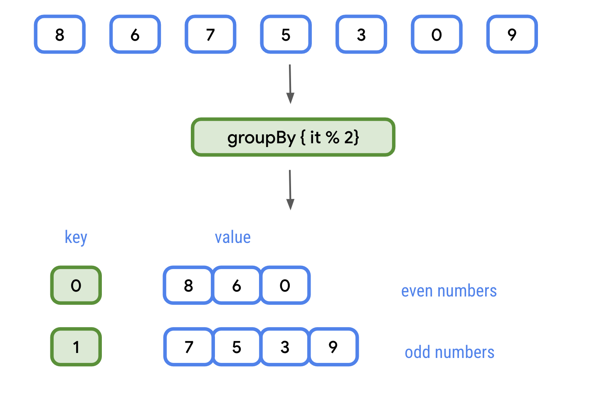

ラムダ式 `{ it % 2 }` を使用して、`groupBy()` 関数を呼び出します。

結果のマップには、`0` と `1` の 2 つのキーがあります。各キーは `List<Int>` 型の値を持ちます。キー `0` のリストにはすべての偶数の数値が含まれ、キー `1` のリストにはすべての奇数の数値が含まれます。

現実のユースケースとしては、写真の被写体や撮影場所で写真をグループ化する写真アプリがあります。洋菓子店のメニューの例では、クッキーがソフトクッキーかどうかでグループ化します。

`groupBy()` を使用し、`softBaked` プロパティに基づいてメニューをグループ化します。

1. 前のステップのコードから `filter()` の呼び出しを削除します。

**削除するコード**

```kotlin
val softBakedMenu = cookies.filter {
    it.softBaked
}
println("Soft cookies:")
softBakedMenu.forEach {
    println("${it.name} - $${it.price}")
}
```

2. `cookies` リストで `groupBy()` を呼び出し、結果を `groupedMenu` という名前の変数に格納します。

```kotlin
val groupedMenu = cookies.groupBy {}
```

3. `it.softBaked` を返すラムダ式を渡します。戻り値の型は `Map<Boolean, List<Cookie>>` になります。

```kotlin
val groupedMenu = cookies.groupBy { it.softBaked }
```

4. `groupedMenu[true]` の値を含む `softBakedMenu` 変数と、`groupedMenu[false]` の値を含む `crunchyMenu` 変数を作成します。`Map` の添字指定の結果は null 値許容であるため、Elvis 演算子（`?:`）を使用して空のリストを返すことができます。

```kotlin
val softBakedMenu = groupedMenu[true] ?: listOf()
val crunchyMenu = groupedMenu[false] ?: listOf()
```

> **注:** または、`emptyList()` を使用して空のリストを作成します。このほうが読みやすくなります。

5. ソフトクッキーのメニューを出力し、次にクランチ クッキーのメニューを出力するコードを追加します。

```kotlin
println("Soft cookies:")
softBakedMenu.forEach {
    println("${it.name} - $${it.price}")
}
println("Crunchy cookies:")
crunchyMenu.forEach {
    println("${it.name} - $${it.price}")
}
```

6. コードを実行します。`groupBy()` 関数により、いずれかのプロパティの値に基づいてリストが 2 つに分割されます。

```
...
Soft cookies:
Banana Walnut - $1.49
Snickerdoodle - $1.39
Blueberry Tart - $1.79
Crunchy cookies:
Chocolate Chip - $1.69
Vanilla Creme - $1.59
Chocolate Peanut Butter - $1.49
Sugar and Sprinkles - $1.39
```

> **注:** リストを 2 つに分けるだけでよい場合は、代わりに [`partition()`](https://kotlinlang.org/api/latest/jvm/stdlib/kotlin.collections/partition.html) 関数を使用できます。

### 6. fold()

`fold()` 関数は、コレクションから単一の値を生成するために使用します。合計価格を計算する場合や、リスト内のすべての要素を合計して平均値を求める場合などによく使用されます。

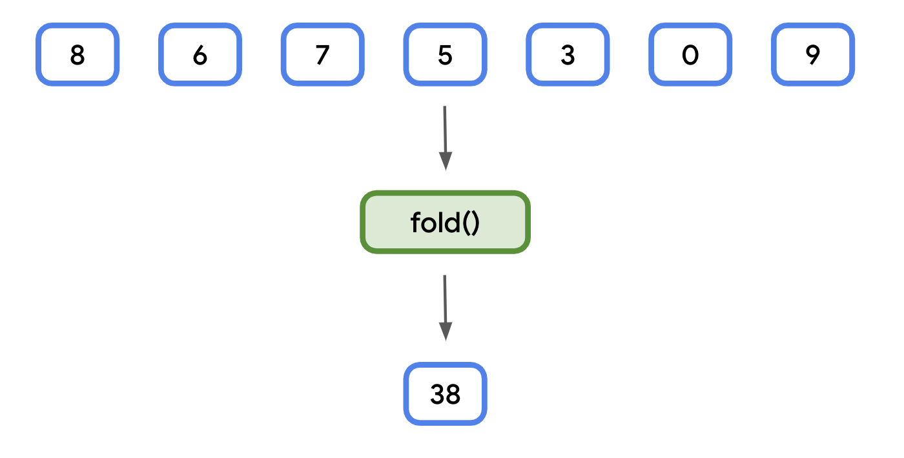

`fold()` 関数は、次の 2 つのパラメータを受け取ります。

- 初期値。データ型は関数の呼び出し時に推定されます（つまり、`0` の初期値は `Int` であると推定されます）。
- 初期値と同じ型の値を返すラムダ式。

ラムダ式は、さらに次の 2 つのパラメータを受け取ります。

- 1 つ目のパラメータはアキュムレータと呼ばれます。データ型は初期値と同じです。これは累積合計と見なされます。アキュムレータは、ラムダ式が呼び出されるたびに、前回ラムダが呼び出された時点の戻り値と等しくなります。
- 2 つ目のパラメータは、コレクション内の各要素と同じ型です。

これまで見てきた他の関数と同様に、ラムダ式はコレクション内の各要素に対して呼び出されるので、`fold()` はすべての要素を合計する簡単な方法として使用できます。

`fold()` を使用して、すべてのクッキーの合計価格を計算しましょう。

1. `main()` 内で、`totalPrice` という名前の新しい変数を作成し、`cookies` リストに対する `fold()` の呼び出しの結果を割り当てます。初期値として `0.0` を渡します。その型は `Double` であると推定されます。

```kotlin
val totalPrice = cookies.fold(0.0) {
}
```

2. ラムダ式のパラメータを両方とも指定する必要があります。アキュムレータには `total` を使用し、コレクション要素には `cookie` を使用します。パラメータ リストの後に矢印（`->`）を指定します。

```kotlin
val totalPrice = cookies.fold(0.0) {total, cookie ->
}
```

3. ラムダの本文で、`total` と `cookie.price` の和を計算します。これは戻り値であると推定され、次にラムダが呼び出されたときに `total` に渡されます。

```kotlin
val totalPrice = cookies.fold(0.0) {total, cookie ->
    total + cookie.price
}
```

4. 読みやすくするため、`totalPrice` の値を文字列として書式設定して出力します。

```kotlin
println("Total price: $${totalPrice}")
```

5. コードを実行します。結果は、`cookies` リストの価格の合計と等しくなります。

```
...
Total price: $10.83
```

> **注:**`fold()` は `reduce()` と呼ばれることもあります。Kotlin の `fold()` 関数は、JavaScript、Swift、Python などの `reduce()` 関数と同じように機能します。なお、Kotlin には [`reduce()`](https://kotlinlang.org/api/latest/jvm/stdlib/kotlin.collections/reduce.html) という名前の独自の関数もあります。この関数のアキュムレータは、引数として渡される初期値ではなく、コレクション内の最初の要素から計算を開始します。

> **注:** Kotlin コレクションには、数値型を操作する [`sum()`](https://kotlinlang.org/api/latest/jvm/stdlib/kotlin.collections/sum.html) 関数と、高階関数の [`sumOf()`](https://kotlinlang.org/api/latest/jvm/stdlib/kotlin.collections/sum-of.html) もあります。

### 7. sortedBy()

コレクションについて初めて学習したとき、要素の並べ替えに `sort()` 関数を使用できることを学びました。しかし、この関数は `Cookie` オブジェクトのコレクションでは機能しません。`Cookie` クラスには複数のプロパティがありますが、どのプロパティ（`name`、`price` など）を並べ替えようとしているかを Kotlin は認識しません。

このような場合のために、Kotlin コレクションには `sortedBy()` 関数が用意されています。`sortedBy()` を使用すると、並べ替え対象のプロパティを返すラムダを指定できます。たとえば、`price` で並べ替えたい場合、ラムダは `it.price` を返します。値のデータ型に自然な並べ替え順序（文字列の場合はアルファベット順、数値の場合は昇順）があれば、その型のコレクションと同様に並べ替えられます。

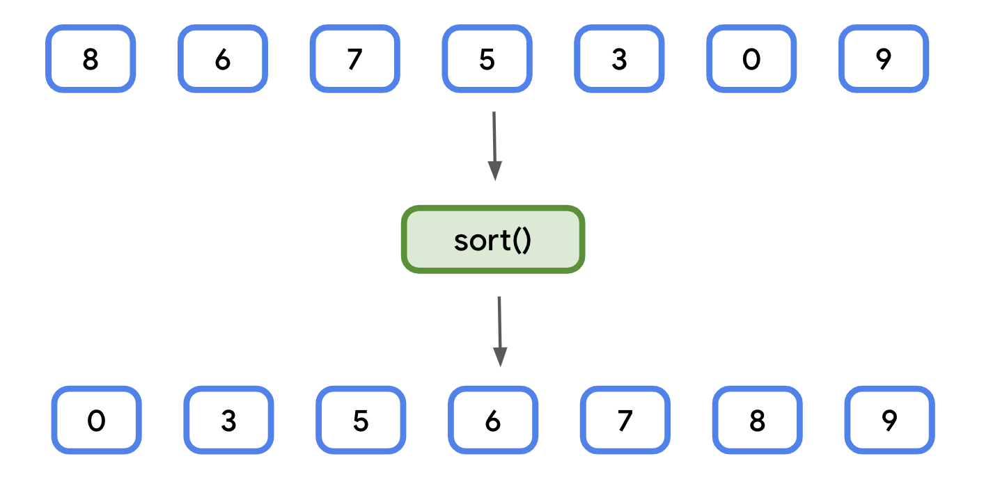

`sortedBy()` を使用して、クッキーのリストをアルファベット順に並べ替えます。

1. `main()` 内で、既存のコードの後に `alphabeticalMenu` という名前の新しい変数を追加し、`cookies` リストに対する `sortedBy()` の呼び出しを割り当てます。

```kotlin
val alphabeticalMenu = cookies.sortedBy {
}
```

2. ラムダ式内で `it.name` を返します。結果のリストは、型はまだ `List<Cookie>` のままですが、`name` に基づいて並べ替えられます。

```kotlin
val alphabeticalMenu = cookies.sortedBy {
    it.name
}
```

3. クッキーの名前を `alphabeticalMenu` に出力します。`forEach()` を使用すると、それぞれの名前を新しい行に出力できます。

```kotlin
println("Alphabetical menu:")
alphabeticalMenu.forEach {
    println(it.name)
}
```

4. コードを実行します。クッキーの名前がアルファベット順に出力されます。

```
...
Alphabetical menu:
Banana Walnut
Blueberry Tart
Chocolate Chip
Chocolate Peanut Butter
Snickerdoodle
Sugar and Sprinkles
Vanilla Creme
```

> **注:** データ型に自然な並べ替え順がある場合は、Kotlin コレクションでも [`sort()`](https://kotlinlang.org/api/latest/jvm/stdlib/kotlin.collections/sort.html) 関数を使用できます。

### 8. まとめ

これで完了です。コレクションに対して高階関数を使用できる例をいくつか学びました。並べ替えやフィルタリングなどの一般的な操作を 1 行のコードで実行できるので、プログラムがより簡潔でわかりやくなります。

#### 概要

- `forEach()` を使用すると、コレクション内の各要素をループできます。
- 文字列に式を挿入できます。
- `map()` を使用すると、コレクション（ほとんどの場合はデータ型が異なるコレクション）内のアイテムを書式設定できます。
- `filter()` を使用すると、コレクションのサブセットを生成できます。
- `groupBy()` は、関数の戻り値に基づいてコレクションを分割します。
- `fold()` は、コレクションを単一の値に変換します。
- `sortedBy()` を使用すると、指定したプロパティでコレクションを並べ替えることができます。

### 9. 詳細

#### 関連リンク

- [高階関数とラムダ](https://kotlinlang.org/docs/lambdas.html)
- [forEach()](https://kotlinlang.org/api/latest/jvm/stdlib/kotlin.collections/for-each.html)
- [map()](https://kotlinlang.org/api/latest/jvm/stdlib/kotlin.collections/map.html)
- [filter()](https://kotlinlang.org/api/latest/jvm/stdlib/kotlin.collections/filter.html)
- [groupBy()](https://kotlinlang.org/api/latest/jvm/stdlib/kotlin.collections/group-by.html)
- [fold()](https://kotlinlang.org/api/latest/jvm/stdlib/kotlin.collections/fold.html)
- [sortedBy()](https://kotlinlang.org/api/latest/jvm/stdlib/kotlin.collections/sorted-by.html)

## 6. 演習: クラスとコレクション（提出対象）


### 1. 始める前に

この章では、ジェネリクス、さまざまなクラスの型、コレクション、高階関数について学習しました。学んだことを実践するために、あなたはチームによる新しいイベント トラッキング アプリの改善を手伝います。各ステップの手順で、アプリの現在の状態と、完了するタスクの詳細が説明されています。

[Kotlin のプレイグラウンド](https://developer.android.com/training/kotlinplayground)を使用して演習に取り組むことをおすすめします。

#### 前提条件

- **Compose を用いた Android アプリ開発の基礎**コースのユニット 3 章 1 と、それ以前の章を完了していること。
- Kotlin プログラミング言語の基本（クラス、オブジェクト、コレクション、高階関数など）に精通していること

#### 必要なもの

- インターネットに接続されているパソコン
- [Kotlin のプレイグラウンド](https://developer.android.com/training/kotlinplayground)へのアクセス

### 2. アプリの概要

あなたは、イベント トラッキング アプリ チームに新たに加わったソフトウェア エンジニアです。ユーザーがイベントをトラッキングできるようにするアプリを開発しています。チームにより、アプリの機能を構築するためのタスクが割り当てられます。

各タスクの最後で、あなたの解決策と提示される解決策を比較してみてください。目的の機能を実現する方法は複数あるため、あなたのコードが提示されている解決策のコードと完全に一致していなくても問題ありません。

前のタスクで提示される解決策のコードを、次のタスクの出発点のコードとして使用し、共通の出発点からタスクを開始できるようにします。

### 3. タスク 1

別のソフトウェア エンジニアがすでにアプリの大まかな作業を完了していて、あなたはその詳細を実装するタスクを任されたとします。

あなたは、**`Event`** クラスを実装する必要があります。このクラスは、ユーザーが入力したイベントの詳細を保持するために使用されます（**ヒント**: このクラスではメソッドの定義やアクションの実行は不要です）。

このタスクでは、**`Event`** という名前のデータクラスを作成する必要があります。

このクラスのインスタンスは以下を保存できます。

- イベントの**title**（タイトル、文字列）。
- イベントの**description**（説明、文字列 で null でもよい）。
- イベントの[**daypart**](https://en.wikipedia.org/wiki/Dayparting)（時間帯、文字列）。トラッキングするのは、イベントが始まった時間帯（Morning、Afternoon、Evening のいずれか）のみです。
- イベントの**duration**（分単位の時間、整数）。

続行する前に、自分でコードを記述してみてください。

そのコードを使用して、次の情報でインスタンスを作成します。

- **タイトル**: Study Kotlin（Kotlin の学習）
- **説明**: Commit to studying Kotlin at least 15 minutes per day.（1 日に 15 分以上 Kotlin を学習することを約束します。）
- **時間帯**: Evening（夜）
- **期間**: 15

オブジェクトの出力を試して、次の出力が表示されることを確認します。

```
Event(title=Study Kotlin, description=Commit to studying Kotlin at least 15 minutes per day., daypart=Evening, durationInMinutes=15)
```

タスクを完了するか最善を尽くしたら、[**次へ**] をクリックしてください。解決策のコードが提示されます。

### 4. タスク 1 の解決策

解決策は次のコードのようになります。

```kotlin
data class Event(
    val title: String,
    val description: String? = null,
    val daypart: String,
    val durationInMinutes: Int,
)
```

### 5. タスク 2

マネージャーは、データクラス用に私たちが構築したコードを使用してプロジェクトを進めることにしました。

チームメンバーがしばらく `Event` クラスを使用した後、シニア チームメイトが、時間帯として文字列を使用することが望ましくないことに気付きました。

「Morning」という値を保存する開発者もいれば、「morning」、「MORNING」などの値を使用する開発者もいます。

これが、多くの問題につながりました。

ここでのタスクは、[リファクタリング](https://en.wikipedia.org/wiki/Code_refactoring)を行ってこの問題を修正することです。リファクタリングは、その機能を変更せずにコードを改善する処理です。これには、ロジックの簡素化や、繰り返しコードの別の関数への移動などがあります。

この問題を修正するため一部の個別の値をモデル化するには、どの型のクラスを使用すればよいでしょうか？

チームは、あなたに時間帯コードを enum（列挙型）クラスを使用するように変更してもらいたいと考えています。enum クラスを使用すれば、チームメイトが時間帯を指定する際に提示される時間帯値のいずれかを選択することとなるため、この種の問題は回避できます。

この enum クラスには `Daypart` という名前を付けます。含まれる値は次の 3 つです。

- `MORNING`
- `AFTERNOON`
- `EVENING`

この enum クラスを、あなたならどのように作成しますか？

`Event` クラスをリファクタリングして使用できるようにするには、どうすればよいですか？

先に進む前に、自分で解決策をコーディングしてみてください。

[**次へ**] をクリックすると、解決策のコードが提示されます。

### 6. タスク 2 の解決策

```kotlin
enum class Daypart {
    MORNING,
    AFTERNOON,
    EVENING,
}
```

リファクタリングされた `Event` データクラスで enum クラスが使用されるようになりました。

```kotlin
data class Event(
    val title: String,
    val description: String? = null,
    val daypart: Daypart,
    val durationInMinutes: Int,
)
```

### 7. タスク 3

同僚は、リファクタリングされた `Daypart` を好んで使用していますが、別の問題があります。

ユーザーのイベントの作成および保存には、現在以下のコードが使用されています。

```kotlin
val event1 = Event(title = "Wake up", description = "Time to get up", daypart = Daypart.MORNING, durationInMinutes = 0)
val event2 = Event(title = "Eat breakfast", daypart = Daypart.MORNING, durationInMinutes = 15)
val event3 = Event(title = "Learn about Kotlin", daypart = Daypart.AFTERNOON, durationInMinutes = 30)
val event4 = Event(title = "Practice Compose", daypart = Daypart.AFTERNOON, durationInMinutes = 60)
val event5 = Event(title = "Watch latest DevBytes video", daypart = Daypart.AFTERNOON, durationInMinutes = 10)
val event6 = Event(title = "Check out latest Android Jetpack library", daypart = Daypart.EVENING, durationInMinutes = 45)
```

現時点のコードでは、大量のイベントが生成されるだけでなく、それぞれのイベントに独自の変数が必要になります。生成されるイベントが増えるに従い、すべてのイベントをトラッキングすることが困難になります。このアプローチでは、ユーザーの作成したイベントの数を確認することが非常に困難となるでしょう。

このように保存されたイベントを整理する方法として、より優れた方法はないでしょうか？

すべてのイベントを 1 つの変数に格納するにはどのような方法がありますか（**注**: イベントがさらに追加される可能性があるため、柔軟性が必要になります。また、変数に格納されているイベントの数を効率的に返す必要もあります）？

どのクラスまたはデータ型を使用しますか？イベントをさらに追加する方法として何がありますか？

では、この機能を自分で実装してみましょう。[**次へ**] をクリックして解決策を表示する前に、自分でコードを記述してみてください。

### 8. タスク 3 の解決策

```kotlin
val events = mutableListOf<Event>(event1, event2, event3, event4, event5, event6)
```

### 9. タスク 4

マネージャーはアプリの機能に満足しています。ただ、イベントの期間に基づいて、ユーザーが**短い**イベントの概要を表示できるようにする必要があると判断しました。たとえば、「短いイベントが 5 件あります」などです。

「短い」イベントとは 60 分未満のイベントです。

前のタスクの解決策の `events` 変数コードを使用してこの結果を得るには、どうすればよいでしょうか？

> **注:** この問題は、複数の手順を踏むと解決に役立ちそうです。イベントの期間に基づいてイベントをフィルタするには、どうすればよいでしょうか？目的のイベントをフィルタした後、その数をどのようにしてカウントしますか？

[**次へ**] をクリックすると、解決策が提示されます。

### 10. タスク 4 の解決策

これを実現する方法は複数ありますが、ここでは以下を使用します。

```kotlin
val shortEvents = events.filter { it.durationInMinutes < 60 }
println("You have ${shortEvents.size} short events.")
```

### 11. タスク 5

チームメイトはアプリの機能に満足しています。ただ、ユーザーがすべてのイベントと時間帯の概要を表示できるようにしたいと考えています。

次のような出力を想定しています。

```
Morning: 3 events
Afternoon: 4 events
Evening: 2 events
```

前のタスクでも使った `events` 変数コードを使用してこの結果を得るには、どうすればよいでしょうか？

> **注:** この問題は、複数の手順を踏むと解決に役立ちそうです。イベントを 2 つのグループに分割した前のタスクに似ていますが、このタスクではイベントを 3 つのグループに分割する必要があります。イベントを時間帯別にグループ化するには、どうすればよいでしょうか？グループ化した後、各時間帯のイベントをどのようにカウントしますか？

[**次へ**] をクリックすると、解決策のコードが提示されます。

### 12. タスク 5 の解決策

以下は解決策です。ただし、その他のバリエーションも使用できます。

```kotlin
val groupedEvents = events.groupBy { it.daypart }
groupedEvents.forEach { (daypart, events) ->
    println("$daypart: ${events.size} events")
}
```

### 13. タスク 6

現在、同僚はインデックスを使用してその日の最後の項目（イベント）を特定および出力しています。使用されているコードは `println("Last event of the day: ${events[events.size - 1].title}")` です。

マネージャーは、[Kotlin のドキュメント](https://kotlinlang.org/docs/collection-elements.html#retrieve-by-position)を確認して、このコードを単純化できる関数を探すことを提案しています。

どのような関数を思いつきますか？

それを使用し、同じ結果が出力されることを確認してください。

[**次へ**] をクリックすると、解決策が提示されます。

### 14. タスク 6 の解決策

```kotlin
println("Last event of the day: ${events.last().title}")
```

### 15. タスク 7

チームは、あなたが設計したデータクラスを好んで使用していますが、文字列のイベント期間を必要とするたびにコードを記述し直すことが手間であると感じています。

```kotlin
val durationOfEvent = if (events[0].durationInMinutes < 60) {
        "short"
    } else {
        "long"
    }
println("Duration of first event of the day: $durationOfEvent")
```

この繰り返しはメソッドをクラスに直接追加することで修正できますが、他のチームがそれぞれのアプリであなたのイベントクラスをすでに使い始めているため、この方法は理想的でありません。クラスを変更すれば、その変更により破損が発生しないことを検証するために、すべてのコードをテストし直す必要があるからです。

データクラスを直接変更せずに上記のコードと同じ値を返す拡張プロパティを作成するには、どうすればよいでしょうか？

正しく実装すると次のコードを使用できるようになり、このタスクの開始時に表示されたコードと同じメッセージが出力されます。

```kotlin
println("Duration of first event of the day: ${events[0].durationOfEvent}")
```

[**次へ**] をクリックすると、解決策が提示されます。

### 16. タスク 7 の解決策

```kotlin
val Event.durationOfEvent: String
    get() = if (this.durationInMinutes < 60) {
        "short"
    } else {
        "long"
    }
```

### 17. その他の演習

Kotlin 言語に関するその他の演習については、[JetBrains Academy の Kotlin Core トラック](https://hyperskill.org/tracks/18)をご覧ください。特定のトピックに移動するには、[ナレッジマップ](https://hyperskill.org/knowledge-map)に移動して、このトラックで扱っているトピックの一覧を確認してください。

## 7. つまずきやすいポイント

- 高階関数は「for 文で書けることを短く書く道具」です。最初は for 文で書いてから `map` / `filter` に置き換えると理解しやすいです。
- `data class` はこの後のユニットで「1 件のデータ」を表すのに毎回使います。

## 8. AIに質問する（この章の例）

次の例をそのままAIに投げてOKです（必要なら自分のコード/エラーに置き換えてください）。

```text
「`data class` `enum class` `object` の使い分けを、この章の演習を題材に説明して」
「`map` `filter` `sortedBy` を for 文で書いた場合と比べて説明して。まず for 文で書いた自分のコードを高階関数に直して（コード: ここに貼る）」
「演習: クラスとコレクション の自分の解答をレビューして。コレクション操作をもっと短く書けるところを教えて（コード: ここに貼る）」
```

質問がまとまらないときは、第0章の「質問テンプレ」を使ってください。

## 9. 提出物

次の演習で書いた Kotlin コードを、学習用リポジトリの `unit3/kotlin-more/` に `.kt` ファイルとして置きます（1 問 1 ファイル、ファイル名は問題が分かる名前にする）。

- 演習: クラスとコレクション

PR 本文には次の 3 点を書いてください。

- **やったこと**：どのレッスン / 演習を完了したか
- **動作確認**：どの端末（エミュレータ名 or 実機）で何を確認したか
- **詰まった点と解決**：エラーの内容と、どう直したか（AI に聞いた内容も可）

## 10. チェックリスト

- [ ] ジェネリクス・enum・data class・object・拡張関数の用途を説明できる
- [ ] `List` / `Set` / `Map` を使い分けられる
- [ ] `map` / `filter` / `sortedBy` などの高階関数でコレクションを加工できる
- [ ] 章末のクイズに合格した
- [ ] 提出物が `unit3/kotlin-more/` にあり、Android Studio（または Kotlin Playground）で開いて動く

---

## 課題提出

この章には提出課題があります。

1. 上記の提出物を完了する
2. GitHub で `feature/03-kotlin-more` ブランチを作成し、`develop` へのPRを作成（base=`develop`）
3. [AIプログラムレビュー](https://ai.studio/apps/84d224cb-7de1-44fb-995b-9a5917d25603?fullscreenApplet=true) を実行
4. 問題がなければ、進捗ダッシュボードで **PR URL** と **完了日** を記録
