# 第8章: スクロール可能なリストを作成する

> 提出ブランチ: `feature/03-scrollable-list`

## 1. この章のゴール

- `LazyColumn` / `LazyVerticalGrid` でデータのリストを表示できる
- データクラスのリストからカード UI を生成できる
- アプリアイコン（Adaptive Icon）を差し替えられる

## 2. 進め方

次の内容を **上から順番に** 進めます。「やらなくてOK」の行は飛ばして構いません。レッスンの本文はこのページの下にすべて掲載しています。目安時間の合計は約255分です。

| # | 種類 | 内容 | 目安 | 備考 |
|---|---|---|---|---|
| 1 | レッスン | スクロール可能なリストを追加する | 約90分 | **提出対象** |
| 2 | レッスン | アプリアイコンを変更する | 約45分 |  |
| 3 | レッスン | 演習: グリッドを作成する | 約120分 | **提出対象** |

このプログラムの進め方は次の通りです。

1. 下の各レッスンを読み、各ステップの説明を理解してから **自分でコードを打つ**（コピペで済ませない）
2. ステップごとにアプリを実行し、期待どおり動くか確認する
3. 動かないときは、エラー文をそのまま AI に貼って「何が原因か」を聞き、直したら **なぜ直ったか** をメモする
4. 各レッスン末尾の「まとめ」を読み、説明できない用語があればレッスンに戻る

> 画面が最新の Android Studio と異なる場合があります。

## 3. スクロール可能なリストを追加する（提出対象）


### 1. 始める前に

このレッスンでは、Jetpack Compose を使用してアプリでスクロール可能なリストを作成する方法を学びます。

アファメーションのリストを日常をポジティブにする美しい画像とともに表示する **Affirmations** アプリを取り扱います。

データはすでに用意されているので、そのデータを取得して UI に表示するだけです。

#### 前提条件

- Kotlin のリストに精通していること
- Jetpack Compose でレイアウトを作成した経験
- デバイスまたはエミュレータでアプリを実行した経験

#### 学習内容

- Jetpack Compose を使用してマテリアル デザイン カードを作成する方法
- Jetpack Compose を使用してスクロール可能なリストを作成する方法

#### 作成するアプリの概要

- 既存のアプリケーションをベースとして、UI にスクロール可能なリストを追加する

最終的なプロダクトは次のようになります。

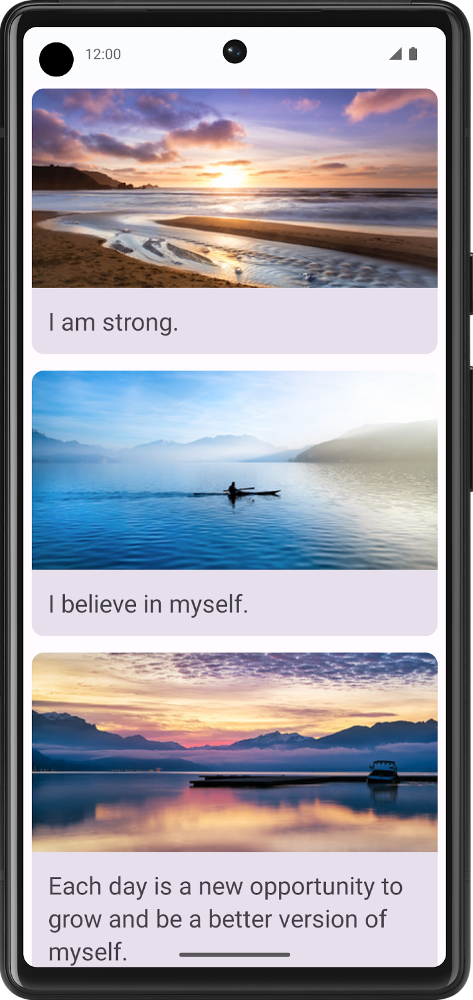

#### 必要なもの

- インターネットにアクセスできるパソコン、ウェブブラウザ、Android Studio
- GitHub へのアクセス

#### スターター コードをダウンロードする

Android Studio で `basic-android-kotlin-compose-training-affirmations` フォルダを開きます。

> **スターター コードの URL:**
> 
> [`https://github.com/google-developer-training/basic-android-kotlin-compose-training-affirmations`](https://github.com/google-developer-training/basic-android-kotlin-compose-training-affirmations/tree/starter)
> 
> **スターター コードのブランチ名:**`starter`

アプリが `starter` ブランチコードからビルドされた場合、空白の画面を表示することが想定されています。

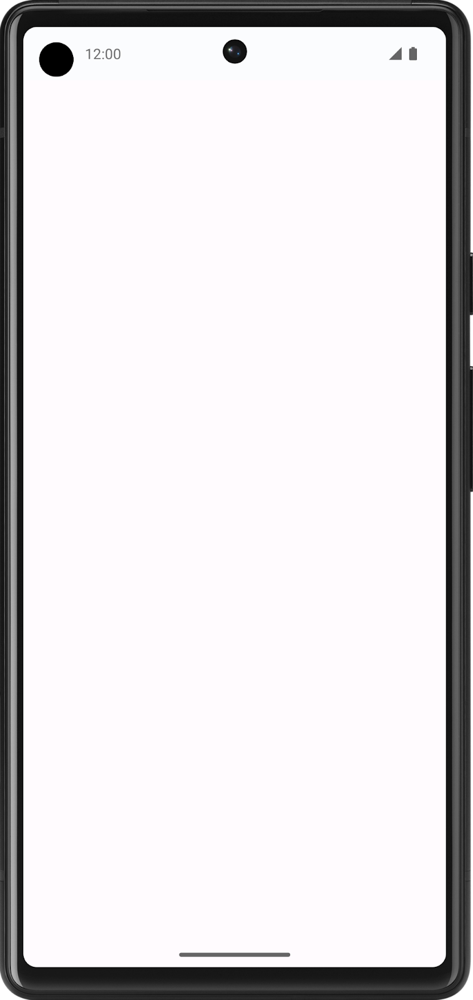

### 2. リストアイテムのデータクラスを作成する

#### アファメーション用のデータクラスを作成する

Android アプリでは、リストはリストアイテムで構成されます。単一のデータを持つリストアイテムの場合、これは文字列や整数などの単純なアイテムになります。画像とテキストなど、複数のデータを持つリストアイテムの場合、それらすべてのプロパティを格納するクラスが必要になります。データクラスはプロパティのみを格納するクラスの一種で、このようなプロパティを扱うユーティリティ メソッドを提供します。

1. **com.example.affirmations** の下に新しいパッケージを作成します。

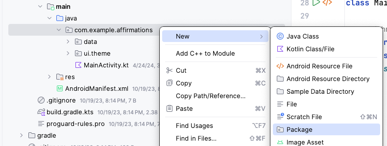

新しいパッケージに **model** という名前を付けます。この model パッケージには、データクラスで表されるデータモデルが含まれます。このデータクラスは、「アファメーション」となるものに関連する情報を表すプロパティで構成されます。アファメーションは、文字列リソースと画像リソースを 1 つずつ含みます。パッケージとは、クラスと他のディレクトリを含むディレクトリのことです。

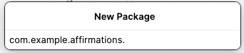

2. **com.example.affirmations.model** パッケージ内に新しいクラスを作成します。

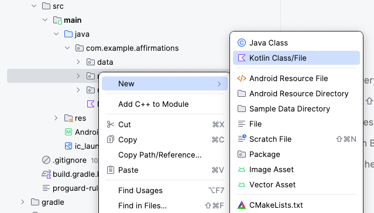

新しいクラスに **Affirmation** という名前を付け、これを **Data Class** にします。

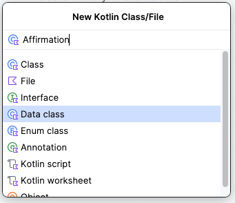

3. 各 `Affirmation` は、1 つの画像と 1 つの文字列で構成されます。`Affirmation` データクラスに 2 つの `val` プロパティを作成します。一つは `stringResourceId`、もう一つは `imageResourceId` という名前にします。どちらも整数にする必要があります。

**`Affirmation.kt`**

```kotlin
data class Affirmation(
    val stringResourceId: Int,
    val imageResourceId: Int
)
```

4. `stringResourceId` プロパティに `@StringRes` アノテーションを付け、`imageResourceId` に `@DrawableRes` アノテーションを付けます。`stringResourceId` は、文字列リソースに格納されているアファメーション テキストの ID を表します。`imageResourceId` は、ドローアブル リソースに格納されているアファメーション画像の ID を表します。

**`Affirmation.kt`**

```kotlin
import androidx.annotation.DrawableRes
import androidx.annotation.StringRes

data class Affirmation(
    @StringRes val stringResourceId: Int,
    @DrawableRes val imageResourceId: Int
)
```

5. **com.example.affirmations.data** パッケージで **Datasource.kt** ファイルを開き、2 つの import ステートメントと `Datasource` クラスのコンテンツのコメント化を解除します。

**`Datasource.kt`**

```kotlin
import com.example.affirmations.R
import com.example.affirmations.model.Affirmation

class Datasource() {
    fun loadAffirmations(): List<Affirmation> {
        return listOf<Affirmation>(
            Affirmation(R.string.affirmation1, R.drawable.image1),
            Affirmation(R.string.affirmation2, R.drawable.image2),
            Affirmation(R.string.affirmation3, R.drawable.image3),
            Affirmation(R.string.affirmation4, R.drawable.image4),
            Affirmation(R.string.affirmation5, R.drawable.image5),
            Affirmation(R.string.affirmation6, R.drawable.image6),
            Affirmation(R.string.affirmation7, R.drawable.image7),
            Affirmation(R.string.affirmation8, R.drawable.image8),
            Affirmation(R.string.affirmation9, R.drawable.image9),
            Affirmation(R.string.affirmation10, R.drawable.image10))
    }
}
```

> **注:** `loadAffirmations()` メソッドはスターター コードで提供されるすべてのデータを収集し、リストとして返します。後でこれを使用して、スクロール可能なリストを作成します。

### 3. アプリにリストを追加する

#### リストアイテム カードを作成する

このアプリはアファメーションのリストを表示することを想定しています。リストを表示するための UI を構成する最初のステップとして、リストアイテムを作成します。各アファメーション アイテムは 1 つの画像と 1 つの文字列で構成されます。これらの各アイテムのデータにはスターター コードが付属しています。このようなアイテムを表示するために、UI コンポーネントを作成します。

アイテムは、`Image` コンポーザブルと `Text` コンポーザブルを含む `Card` コンポーザブルで構成されます。Compose における `Card` は、コンテンツとアクションを単一のコンテナで表示するサーフェスです。プレビューで、アファメーション カードは次のようになります。

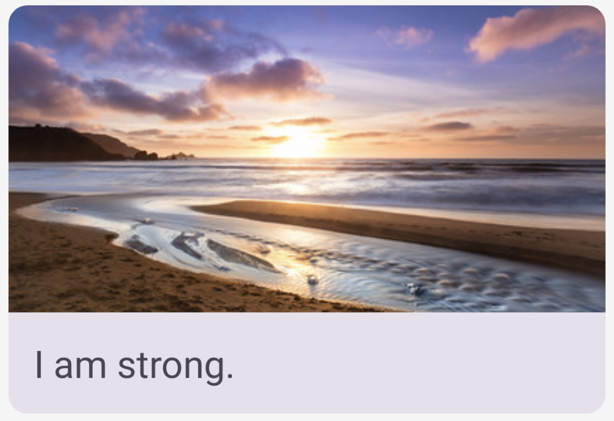

カードには、画像と、その下にテキストが表示されます。この縦型のレイアウトは、`Card` コンポーザブルでラップされた `Column` コンポーザブルを使用することで実現できます。自分で試してみるか、以下の手順に沿って作成してください。

1. **MainActivity.kt** ファイルを開きます。
2. `AffirmationsApp()` メソッドの下に `AffirmationCard()` という新しいメソッドを作成し、`@Composable` アノテーションを付けます。

**`MainActivity.kt`**

```kotlin
@Composable
fun AffirmationsApp() {
}

@Composable
fun AffirmationCard() {

}
```

3. メソッド シグネチャを編集して、`Affirmation` オブジェクトをパラメータとして取得します。`Affirmation` オブジェクトは `model` パッケージのものです。

**`MainActivity.kt`**

```kotlin
import com.example.affirmations.model.Affirmation

@Composable
fun AffirmationCard(affirmation: Affirmation) {

}
```

4. 署名に `modifier` パラメータを追加します。パラメータのデフォルト値 `Modifier` を設定します。

**`MainActivity.kt`**

```kotlin
@Composable
fun AffirmationCard(affirmation: Affirmation, modifier: Modifier = Modifier) {

}
```

> **注:** すべてのコンポーザブルに修飾子を渡してデフォルト値に設定することをおすすめします。

5. `AffirmationCard` メソッド内で、`Card` コンポーザブルを呼び出します。`modifier` パラメータを渡します。

**`MainActivity.kt`**

```kotlin
import androidx.compose.material3.Card

@Composable
fun AffirmationCard(affirmation: Affirmation, modifier: Modifier = Modifier) {
    Card(modifier = modifier) {

    }
}
```

6. `Card` コンポーザブル内に `Column` コンポーザブルを追加します。`Column` コンポーザブル内のアイテムは、UI 上で縦方向に配置されます。これで、関連するテキストの上に画像を配置できます。逆に、`Row` コンポーザブル内のアイテムは横方向に配置されます。

**`MainActivity.kt`**

```kotlin
import androidx.compose.foundation.layout.Column

@Composable
fun AffirmationCard(affirmation: Affirmation, modifier: Modifier = Modifier) {
    Card(modifier = modifier) {
        Column {

        }
    }

}
```

7. `Image` コンポーザブルを `Column` コンポーザブルのラムダ本文内に追加します。`Image` コンポーザブルには、表示するリソースと `contentDescription` が常に必要です。リソースは、`painter` パラメータに渡される `painterResource` である必要があります。`painterResource` メソッドは、ベクター型ドローアブルか、PNG などのラスター化されたアセット形式を読み込みます。また、`contentDescription` パラメータとして `stringResource` を渡します。

**`MainActivity.kt`**

```kotlin
import androidx.compose.foundation.Image
import androidx.compose.ui.res.painterResource
import androidx.compose.ui.res.stringResource

@Composable
fun AffirmationCard(affirmation: Affirmation, modifier: Modifier = Modifier) {
    Card(modifier = modifier) {
        Column {
            Image(
                painter = painterResource(affirmation.imageResourceId),
                contentDescription = stringResource(affirmation.stringResourceId),
            )
        }
    }
}
```

8. `painter` パラメータと `contentDescription` パラメータに加えて、`modifier` と `contentScale` を渡します。`contentScale` は、画像の拡大方法と表示方法を決定します。`Modifier` オブジェクトの `fillMaxWidth` 属性を設定して、高さを `194.dp` にする必要があります。`contentScale` は、`ContentScale.Crop` である必要があります。

**`MainActivity.kt`**

```kotlin
import androidx.compose.foundation.layout.fillMaxWidth
import androidx.compose.foundation.layout.height
import androidx.compose.ui.unit.dp
import androidx.compose.ui.layout.ContentScale

@Composable
fun AffirmationCard(affirmation: Affirmation, modifier: Modifier = Modifier) {
    Card(modifier = modifier) {
        Column {
            Image(
                painter = painterResource(affirmation.imageResourceId),
                contentDescription = stringResource(affirmation.stringResourceId),
                modifier = Modifier
                    .fillMaxWidth()
                    .height(194.dp),
                contentScale = ContentScale.Crop
            )
        }
    }
}
```

9. `Column` 内で、`Image` コンポーザブルの後に `Text` コンポーザブルを作成します。`affirmation.stringResourceId` の `stringResource` を `text` パラメータに渡し、`padding` 属性を `16.dp` に設定した `Modifier` オブジェクトを渡します。また、`MaterialTheme.typography.headlineSmall` を `style` パラメータに渡してテキストテーマを設定します。

**`MainActivity.kt`**

```kotlin
import androidx.compose.material3.Text
import androidx.compose.foundation.layout.padding
import androidx.compose.ui.platform.LocalContext

@Composable
fun AffirmationCard(affirmation: Affirmation, modifier: Modifier = Modifier) {
    Card(modifier = modifier) {
        Column {
            Image(
                painter = painterResource(affirmation.imageResourceId),
                contentDescription = stringResource(affirmation.stringResourceId),
                modifier = Modifier
                    .fillMaxWidth()
                    .height(194.dp),
                contentScale = ContentScale.Crop
            )
            Text(
                text = LocalContext.current.getString(affirmation.stringResourceId),
                modifier = Modifier.padding(16.dp),
                style = MaterialTheme.typography.headlineSmall
            )
        }
    }
}
```

#### AffirmationCard コンポーザブルのプレビュー

**Affirmations** アプリの UI の中核となるカードを作成することができました。カードが正しく表示されることを確認するために、アプリ全体を起動せずにプレビューできるコンポーザブルを作成します。

1. `AffirmationCardPreview()` という名前のプライベート メソッドを作成します。メソッドに `@Preview` と `@Composable` のアノテーションを付けます。

**`MainActivity.kt`**

```kotlin
import androidx.compose.ui.tooling.preview.Preview

@Preview
@Composable
private fun AffirmationCardPreview() {

}
```

2. メソッド内で `AffirmationCard` コンポーザブルを呼び出します。そのコンポーザブルに、コンストラクタに渡された `R.string.affirmation1` 文字列リソースと `R.drawable.image1` ドローアブル リソースを使用する新しい `Affirmation` オブジェクトを渡します。

**`MainActivity.kt`**

```kotlin
@Preview
@Composable
private fun AffirmationCardPreview() {
    AffirmationCard(Affirmation(R.string.affirmation1, R.drawable.image1))
}
```

3. [**Split**] タブを開くと、`AffirmationCard` のプレビューが表示されます。必要に応じて、[**Design**] ペインで [**Build & Refresh**] をクリックしてプレビューを表示します。

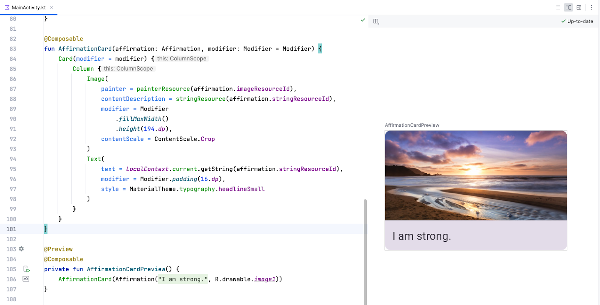

#### リストを作成する

リストアイテムのコンポーネントがリストの唯一のビルディング ブロックです。リストアイテムを作成したら、それを利用してリスト コンポーネントそのものを作成できます。

1. `AffirmationList()` という関数を作成し、`@Composable` アノテーションを付けて、`Affirmation` オブジェクトの `List` をメソッド シグネチャのパラメータとして宣言します。

**`MainActivity.kt`**

```kotlin
@Composable
fun AffirmationList(affirmationList: List<Affirmation>) {
    
}
```

2. デフォルト値を `Modifier` にして、メソッド シグネチャのパラメータとして `modifier` オブジェクトを宣言します。

**`MainActivity.kt`**

```kotlin
@Composable
fun AffirmationList(affirmationList: List<Affirmation>, modifier: Modifier = Modifier) {

}
```

3. Jetpack Compose では、`LazyColumn` コンポーザブルを使用してスクロール可能なリストを作成できます。`LazyColumn` と `Column` の違いは、表示するアイテム数が少ない場合は `Column` を使用する必要がある点です（Compose は一度にすべてのアイテムを読み込むため）。`Column` には、事前に定義した（つまり一定の）数のコンポーザブルのみを格納できます。`LazyColumn` はオンデマンドでコンテンツを追加できるため、長いリスト、特にリストの長さが不明な場合に適しています。`LazyColumn` もデフォルトでスクロール機能を提供します。追加のコードは必要ありません。`AffirmationList()` 関数内で `LazyColumn` コンポーザブルを宣言します。`modifier` オブジェクトを引数として `LazyColumn` に渡します。

**`MainActivity.kt`**

```kotlin
import androidx.compose.foundation.lazy.LazyColumn

@Composable
fun AffirmationList(affirmationList: List<Affirmation>, modifier: Modifier = Modifier) {
    LazyColumn(modifier = modifier) {

    }
}
```

4. `LazyColumn` のラムダ本体で、`items()` メソッドを呼び出して `affirmationList` を渡します。`items()` メソッドは、アイテムを `LazyColumn` に追加するためのものです。このメソッドは、このコンポーザブルに固有のもので、他のコンポーザブルでは一般的ではありません。

**`MainActivity.kt`**

```kotlin
import androidx.compose.foundation.lazy.items

@Composable
fun AffirmationList(affirmationList: List<Affirmation>, modifier: Modifier = Modifier) {
    LazyColumn(modifier = modifier) {
        items(affirmationList) {

        }
    }
}
```

5. `items()` メソッドの呼び出しにはラムダ関数が必要です。この関数で、`affirmationList` の 1 つのアファメーション アイテムを表す `affirmation` のパラメータを指定します。

**`MainActivity.kt`**

```kotlin
@Composable
fun AffirmationList(affirmationList: List<Affirmation>, modifier: Modifier = Modifier) {
    LazyColumn(modifier = modifier) {
        items(affirmationList) { affirmation ->

        }
    }
}
```

6. リスト内のアファメーションごとに `AffirmationCard()` コンポーザブルを呼び出します。`affirmation` と、`padding` 属性を `8.dp` に設定した `Modifier` オブジェクトを渡します。

**`MainActivity.kt`**

```kotlin
@Composable
fun AffirmationList(affirmationList: List<Affirmation>, modifier: Modifier = Modifier) {
    LazyColumn(modifier = modifier) {
        items(affirmationList) { affirmation ->
            AffirmationCard(
                affirmation = affirmation,
                modifier = Modifier.padding(8.dp)
            )
        }
    }
}
```

#### リストを表示する

1. `AffirmationsApp` コンポーザブルで、現在のレイアウトの向きを取得し、変数に保存します。これらは、後でパディングを設定するために使用されます。

**`MainActivity.kt`**

```kotlin
import com.example.affirmations.data.Datasource

@Composable
fun AffirmationsApp() {
    val layoutDirection = LocalLayoutDirection.current
}
```

2. 次に、`Surface` コンポーザブルを作成します。このコンポーザブルは、`AffirmationsList` コンポーザブルのパディングを設定します。

**`MainActivity.kt`**

```kotlin
import com.example.affirmations.data.Datasource

@Composable
fun AffirmationsApp() {
    val layoutDirection = LocalLayoutDirection.current
    Surface() {
    }
}
```

3. 親の最大幅と最大高さを埋め、ステータスバーのパディングを設定し、左右のパディングを `layoutDirection` に設定する `Modifier` を `Surface` コンポーザブルに渡します。たとえば、`LayoutDirection` オブジェクトをパディングに変換する場合は、`WindowInsets.safeDrawing.asPaddingValues().calculateStartPadding(layoutDirection)` のようにします。

**`MainActivity.kt`**

```kotlin
import com.example.affirmations.data.Datasource

@Composable
fun AffirmationsApp() {
    val layoutDirection = LocalLayoutDirection.current
    Surface(
        Modifier = Modifier
        .fillMaxSize()
        .statusBarsPadding()
        .padding(
            start = WindowInsets.safeDrawing.asPaddingValues()
                    .calculateStartPadding(layoutDirection),
            end = WindowInsets.safeDrawing.asPaddingValues()
                    .calculateEndPadding(layoutDirection),
        ),
    ) {
    }
}
```

4. `Surface` コンポーザブルのラムダで、`AffirmationList` コンポーザブルを呼び出し、`DataSource().loadAffirmations()` を `affirmationList` パラメータに渡します。

> **注:** `DataSource` クラスは `data` パッケージにあります。

**`MainActivity.kt`**

```kotlin
import com.example.affirmations.data.Datasource

@Composable
fun AffirmationsApp() {
    val layoutDirection = LocalLayoutDirection.current
    Surface(
        Modifier = Modifier
        .fillMaxSize()
        .statusBarsPadding()
        .padding(
            start = WindowInsets.safeDrawing.asPaddingValues()
                    .calculateStartPadding(layoutDirection),
            end = WindowInsets.safeDrawing.asPaddingValues()
                    .calculateEndPadding(layoutDirection),
        ),
    ) {
        AffirmationsList(
            affirmationList = Datasource().loadAffirmations(),
        )
    }
}
```

デバイスまたはエミュレータで **Affirmations** アプリを実行すると、完成したプロダクトが表示されます。


### 4. 解答コードを取得する

このレッスンの完成したコードをダウンロードするには、以下の git コマンドを使用します。

```
$ git clone https://github.com/google-developer-training/basic-android-kotlin-compose-training-affirmations.git
$ cd basic-android-kotlin-compose-training-affirmations
$ git checkout intermediate
```

または、リポジトリを ZIP ファイルとしてダウンロードし、Android Studio で開くこともできます。

> **注:**解答コードは、ダウンロードしたリポジトリの `intermediate` ブランチにあります。

解答コードを確認する場合は、[GitHub で表示します](https://github.com/google-developer-training/basic-android-kotlin-compose-training-affirmations/tree/intermediate)。

### 5. まとめ

ここでは、Jetpack Compose でカード、リストアイテム、スクロール可能なリストを作成する方法を学習しました。これらはあくまでリスト作成の基本ツールであり、リストアイテムは、創造性を発揮して自由にカスタマイズできます。

#### 概要

- [`Card`](https://developer.android.com/reference/kotlin/androidx/compose/material3/Card.composable#Card(androidx.compose.ui.Modifier,androidx.compose.ui.graphics.Shape,androidx.compose.material3.CardColors,androidx.compose.material3.CardElevation,androidx.compose.foundation.BorderStroke,kotlin.Function1))コンポーザブルを使用してリストアイテムを作成します。
- `Card` コンポーザブル内の UI を変更します。
- [`LazyColumn`](https://developer.android.com/reference/kotlin/androidx/compose/foundation/lazy/package-summary#LazyColumn(androidx.compose.ui.Modifier,androidx.compose.foundation.lazy.LazyListState,androidx.compose.foundation.layout.PaddingValues,kotlin.Boolean,androidx.compose.foundation.layout.Arrangement.Vertical,androidx.compose.ui.Alignment.Horizontal,androidx.compose.foundation.gestures.FlingBehavior,kotlin.Boolean,kotlin.Function1))コンポーザブルを使用してスクロール可能なリストを作成します。
- カスタムのリストアイテムを使用してリストを作成します。

## 4. アプリアイコンを変更する


### 1. 始める前に

アプリアイコンは、独自のスタイルと見た目でアプリを差別化する重要な手段です。アプリアイコンは、ホーム画面、[すべてのアプリ] 画面、設定アプリを含め、さまざまな場所に表示されます。

アプリアイコンを**ランチャー** アイコンということもあります。ランチャーは、Android デバイスでホームボタンを押してアプリの表示と整理を行う場合や、ウィジェットとショートカットを追加する場合に使用します。

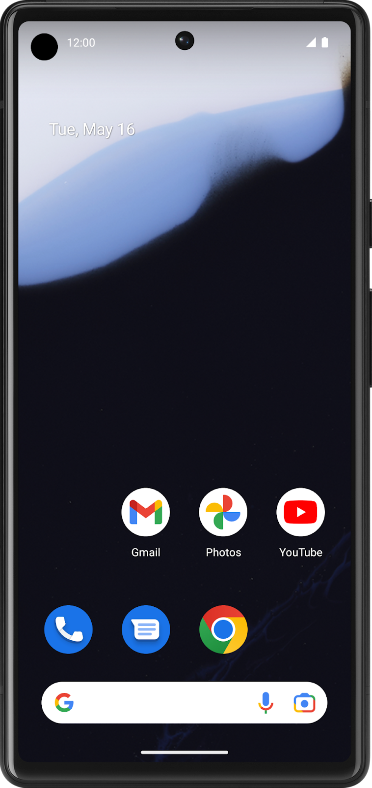 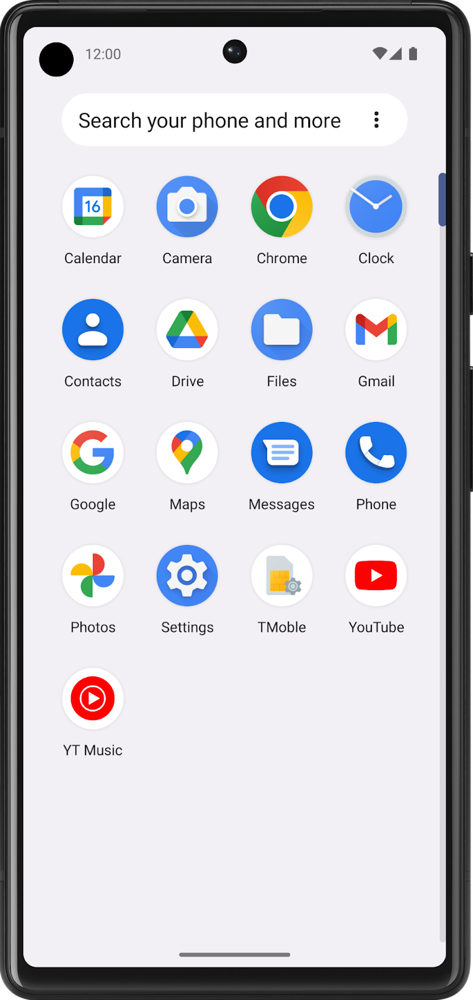

さまざまな Android デバイスを使用していると、デバイス メーカーによってランチャーが異なることに気づくかもしれません。デバイス メーカーは、自社ブランドに特徴的なカスタム ランチャーを作成することがあります。たとえばメーカーによっては、上に示した円形のアイコン形状とは異なる形状でアプリアイコンを表示することがあります。

すべてのアプリアイコンを正方形、丸みを帯びた正方形、またはスクワークル（正方形と円形の中間）で表示することもあります。

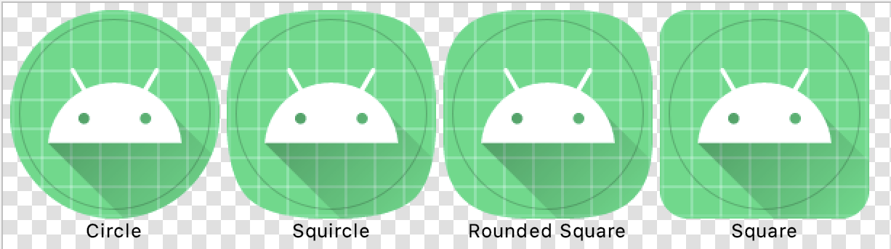

目標は、デバイス メーカーが選択する形状にかかわらず、1 つのデバイス上のすべてのアプリアイコン形状を統一し、一貫したユーザー エクスペリエンスを実現することです。


そのため Android プラットフォームでは、API レベル 26 で**アダプティブ アイコン**のサポートが導入されました。アプリにアダプティブ アイコンを実装すると、デバイスのディスプレイに合わせてランチャー アイコンを調整し、幅広いデバイスに対応できるようになります。

このレッスンには、**Affirmations** アプリのランチャー アイコン用の画像ソースファイルが用意されています。Android Studio の **Image Asset Studio** というツールを使用して、ランチャー アイコンのさまざまなバージョンを生成します。学習した内容は、その後他のアプリのアプリアイコンにも応用できます。


#### 前提条件

- リソース ファイルを含め、基本的な Android プロジェクトのファイルを操作できること
- Android Studio からエミュレータまたは実機に Android アプリをインストールできること

#### 学習内容

- アプリのランチャー アイコンを変更する方法
- Android Studio で Image Asset Studio を使用してランチャー アイコン アセットを生成する方法
- アダプティブ アイコンの概要と、2 つのレイヤである理由

#### 作成するもの

- **Affirmations** アプリのカスタム ランチャー アイコン

#### 必要なもの

- Android Studio の最新の安定版がインストールされているパソコン
- 画像リソース ファイルをダウンロードするためのインターネット接続
- GitHub へのアクセス

#### スターター コードをダウンロードする

Android Studio で `basic-android-kotlin-compose-training-affirmations` フォルダを開きます。

> **スターター コードの URL:**
> 
> [`https://github.com/google-developer-training/basic-android-kotlin-compose-training-affirmations`](https://github.com/google-developer-training/basic-android-kotlin-compose-training-affirmations/tree/intermediate)
> 
> **スターター コードのブランチ名:**`intermediate`

1. プロジェクト用に提供されている GitHub リポジトリ ページに移動します。
2. ブランチ名がレッスンで指定されたブランチ名と一致していることを確認します。たとえば、次のスクリーンショットでは、ブランチ名は **main** です。


3. プロジェクトの GitHub ページで、[**Code**] ボタンをクリックすると、ポップアップが表示されます。


4. ポップアップで、[**Download ZIP**] をクリックして、プロジェクトをパソコンに保存します。ダウンロードが完了するまで待ちます。
5. パソコンに保存したファイルを見つけます（[**ダウンロード**] フォルダなど）。
6. ZIP ファイルをダブルクリックして展開します。プロジェクト ファイルが入った新しいフォルダが作成されます。

#### Android Studio でプロジェクトを開く

1. Android Studio を起動します。
2. [**Welcome to Android Studio**] ウィンドウで、[**Open**] をクリックします。

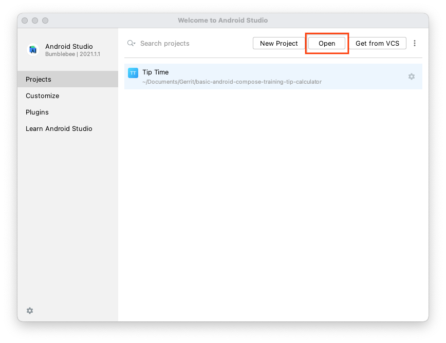

注: Android Studio がすでに開いている場合は、メニューから [**File**] > [**Open**] を選択します。

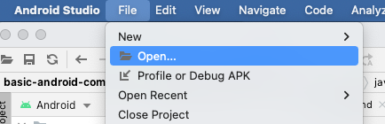

3. ファイル ブラウザで、展開したプロジェクト フォルダがある場所（[**ダウンロード**] フォルダなど）に移動します。
4. そのプロジェクト フォルダをダブルクリックします。
5. Android Studio でプロジェクトが開かれるまで待ちます。
6. **実行**ボタン  をクリックして、アプリをビルドし、実行します。期待どおりにビルドされることを確認します。

### 2. ランチャー アイコン

目標は、デバイスのモデルや画面密度にかかわらず、ランチャー アイコンを鮮明かつ明瞭に表示することです。画面密度とは、画面上の 1 インチあたりのピクセル数（1 インチあたりのドット数、dpi）を指します。中密度デバイス（mdpi）の場合、画面上の 1 インチあたりのドット数は 160 であり、超超超高密度デバイス（xxxhdpi）の場合、画面上の 1 インチあたりのドット数は 640 です。

さまざまな画面密度のデバイスに対応するには、さまざまなバージョンのアプリアイコンを用意する必要があります。

#### ランチャー アイコン ファイルを探す

1. ランチャー アイコンがプロジェクト内でどのように表示されるかを確認するには、まず Android Studio でプロジェクトを開きます。
2. [**Project**] ウィンドウで、[**Project**] ビューに切り替えます。プロジェクトのファイル構造が表示されます。

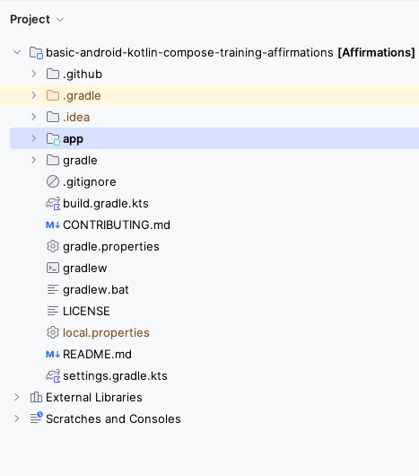

3. リソース ディレクトリ（**[app] > [src] > [main] > [res]**）に移動し、`mipmap` フォルダをいくつか開きます。これらの `mipmap` フォルダは、Android アプリのランチャー アイコン アセットを配置する場所です。

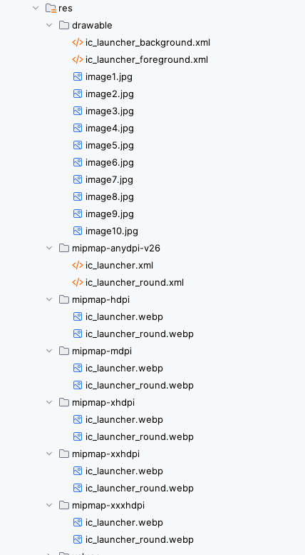

drawable フォルダには、ランチャー アイコン用のベクターが XML ファイルで格納されています。ドローアブル アイコンの場合、ベクターは、コンパイル時に画像を描画する一連の命令です。`mdpi`、`hdpi`、`xhdpi` などは密度修飾子です。リソース ディレクトリの名前（`mipmap,` など）に付加することで、特定の画面密度のデバイス用のリソースであることを示すことができます。Android の[密度修飾子](https://developer.android.com/training/multiscreen/screendensities#TaskProvideAltBmp)のリストを次に示します。

- `mdpi` - 中密度画面（160 dpi まで）用のリソース
- `hdpi` - 高密度画面（240 dpi まで）用のリソース
- `xhdpi` - 超高密度画面（320 dpi まで）用のリソース
- `xxhdpi` - 超超高密度画面（480 dpi まで）用のリソース
- `xxxhdpi` - 超超超高密度画面（640 dpi まで）用のリソース
- `nodpi` - 画面のピクセル密度にかかわらずスケーリングされることを想定してないリソース
- `anydpi` - 任意の密度にスケーリングされるリソース

> **注:**ランチャー アイコン アセットは、`drawable` ディレクトリにある他のアプリアセットとは別に、`mipmap` ディレクトリに配置されています。これは、ランチャーによっては、デバイスのデフォルトの密度バケットで提供されるものよりも大きなサイズのアプリアイコンが表示される可能性があるためです。たとえば `hdpi` デバイスでは、特定のデバイス ランチャーで `xhdpi` バージョンのアプリアイコンを代わりに使用することがあります。これらのディレクトリには、デフォルトの密度よりも高い密度または低い密度のアイコンを必要とするデバイスに対応したアイコンが保存されています。

4. 画像ファイルをクリックすると、プレビューが表示されます。`ic_launcher.webp` ファイルにはアイコンの正方形バージョンが含まれ、`ic_launcher_round.webp` ファイルにはアイコンの円形バージョンが含まれています。どちらも各 mipmap ディレクトリにあります。

たとえば、**[res] > [mipmap-xxxhdpi] > [ic_launcher_round.webp]** は次のようになります。アセットのサイズは右上に表示されています。この画像のサイズは 192 px x 192 px です。

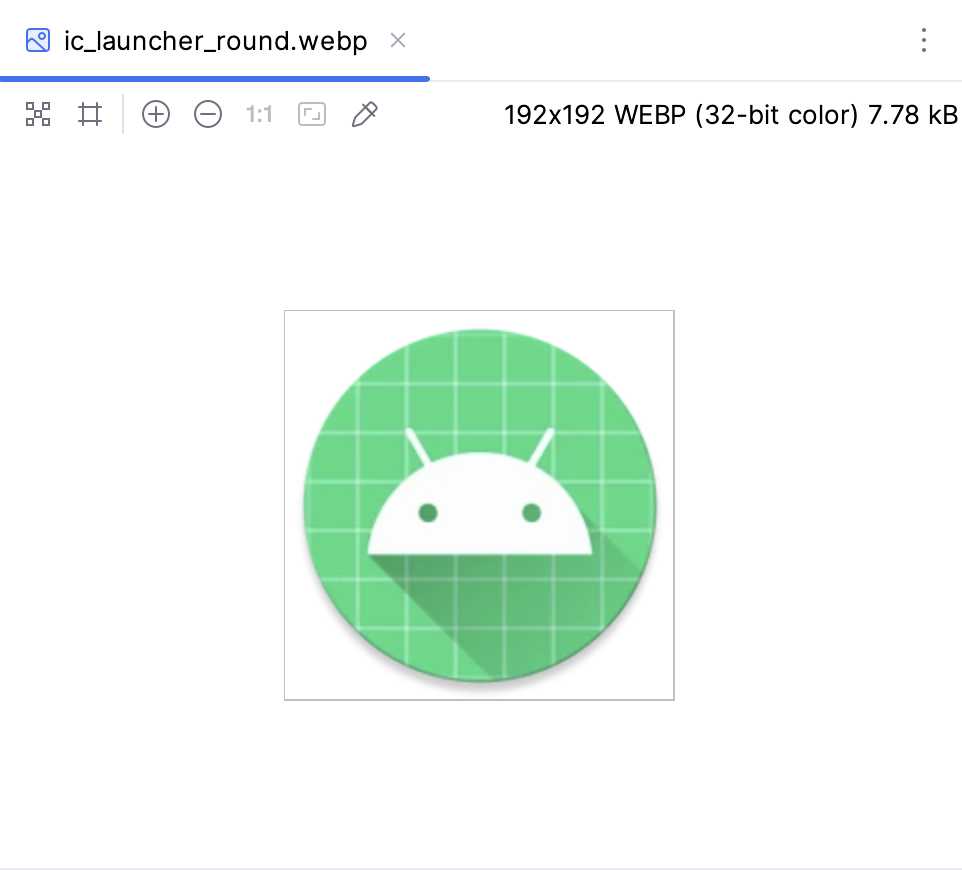

**[res] > [mipmap-mdpi] > [ic_launcher_round.webp]** は次のようになります。サイズは 48 px x 48 px のみです。

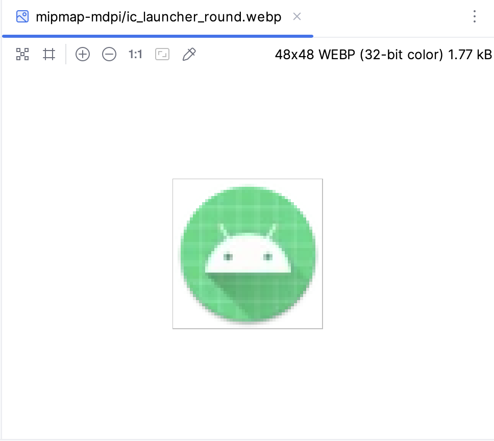

このように、こうしたビットマップ画像ファイルは一定のピクセル グリッドで構成されています。また、特定の画面解像度向けに作成されています。そのため、サイズを変更すると画質が低下することがあります。

> **注:**アプリアイコンがぼやけないようにするには、密度バケット（`mdpi`、`hdpi`、`xhdpi` など）ごとに異なるアイコンのビットマップ画像を用意する必要があります。なお、デバイスの画面密度が正確に 160 dpi、240 dpi、320 dpi などになることはありません。デバイスの画面密度に基づいて、Android は最も近い大きめな密度バケットのリソースを選択してから、縮小します。

ランチャー アイコンの概要について理解したところで、次はアダプティブ アイコンについて学習します。

### 3. アダプティブ アイコン

#### フォアグラウンド レイヤとバックグラウンド レイヤ

[Android 8.0 リリース](https://developer.android.com/about/versions/oreo)（API レベル 26）で、アダプティブ アイコンがサポートされました。これにより、柔軟かつ面白い視覚的効果が可能になりました。デベロッパーにとって、これはアプリアイコンがフォアグラウンド レイヤとバックグラウンド レイヤという 2 つのレイヤで構成されることを意味します。

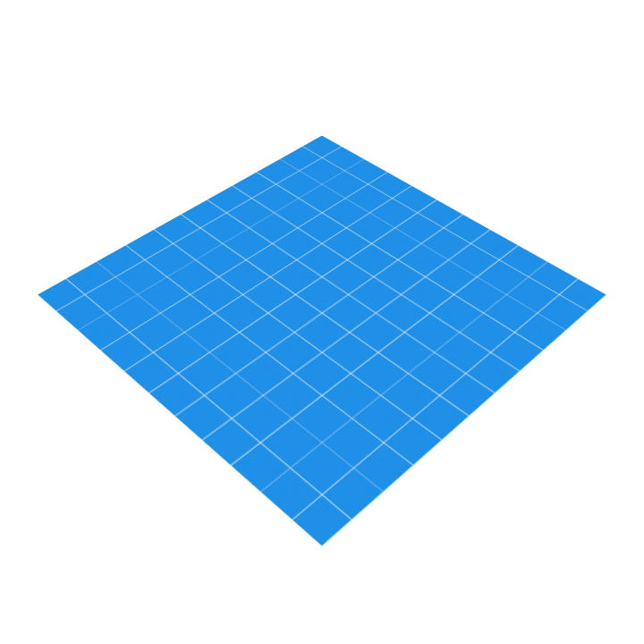

上の例では、白の Android アイコンがフォアグラウンド レイヤにあり、青と白のグリッドがバックグラウンド レイヤにあります。フォアグラウンド レイヤはバックグラウンド レイヤの上に重ねられます。その上にマスク（この場合は円形マスク）が適用され、円形のアプリアイコンが生成されます。

#### アダプティブ アイコン ファイルを探す

**Affirmations** アプリのコードですでに提供されているデフォルトのアダプティブ アイコン ファイルを見てみましょう。

1. Android Studio の [**Project**] ウィンドウで、**[res] > [mipmap-anydpi-v26]** リソース ディレクトリを見つけて開きます。

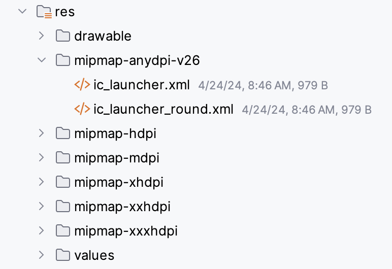

> **注**: アダプティブ アイコンはプラットフォームの API レベル 26 で追加されました。そのため、`-v26` リソース修飾子の付いた `mipmap` リソース ディレクトリで宣言する必要があります。つまり、このディレクトリ内のリソースは、API 26（Android 8.0）以降を搭載したデバイスにのみ適用されます。バージョン 25 以前を搭載したデバイスでは、このディレクトリ内のリソース ファイルは無視され、密度バケットの mipmap ディレクトリが優先されます。

2. `ic_launcher.xml` ファイルを開きます。次の結果が表示されます。

```kotlin
<?xml version="1.0" encoding="utf-8"?>
<adaptive-icon xmlns:android="http://schemas.android.com/apk/res/android">
    <background android:drawable="@drawable/ic_launcher_background"/>
    <foreground android:drawable="@drawable/ic_launcher_foreground"/>
    <monochrome android:drawable="@drawable/ic_launcher_foreground"/>
</adaptive-icon>
```

3. `<adaptive-icon>` 要素を使用して、それぞれにリソース ドローアブルを指定することで、アプリアイコンの `<background>` レイヤと `<foreground>` レイヤを宣言しています。
4. [**Project**] ビューに戻り、バックグラウンド ドローアブルとフォアグラウンド ドローアブルを探します（**[res] > [drawable] > [ic_launcher_background.xml]** と **[res] > [drawable] > [ic_launcher_foreground.xml]**）。
5. [**Design**] ビューに切り替えると、それぞれのプレビューが表示されます。

背景:

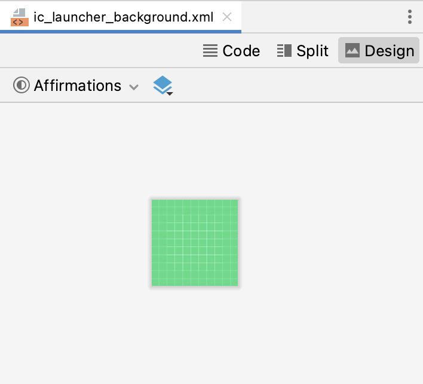

フォアグラウンド:

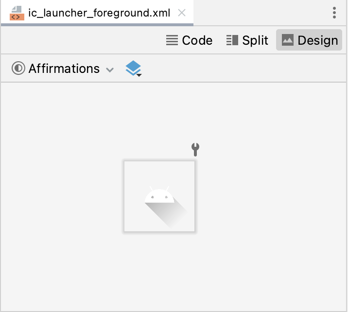

6. どちらもベクター型ドローアブル ファイルです。ピクセル単位の固定サイズはありません。[**Code**] ビューに切り替えると、`<vector>` 要素を使用したベクター型ドローアブルの XML 宣言を表示できます。

**`ic_launcher_foreground.xml`**

```kotlin
<!--
    Copyright (C) 2023 The Android Open Source Project

    Licensed under the Apache License, Version 2.0 (the "License");
    you may not use this file except in compliance with the License.
    You may obtain a copy of the License at

         https://www.apache.org/licenses/LICENSE-2.0

    Unless required by applicable law or agreed to in writing, software
    distributed under the License is distributed on an "AS IS" BASIS,
    WITHOUT WARRANTIES OR CONDITIONS OF ANY KIND, either express or implied.
    See the License for the specific language governing permissions and
    limitations under the License.
-->

<vector xmlns:android="http://schemas.android.com/apk/res/android"
    xmlns:aapt="http://schemas.android.com/aapt"
    android:width="108dp"
    android:height="108dp"
    android:viewportWidth="108"
    android:viewportHeight="108">
  <path android:pathData="M31,63.928c0,0 6.4,-11 12.1,-13.1c7.2,-2.6 26,-1.4 26,-1.4l38.1,38.1L107,108.928l-32,-1L31,63.928z">
    <aapt:attr name="android:fillColor">
      <gradient
          android:endX="85.84757"
          android:endY="92.4963"
          android:startX="42.9492"
          android:startY="49.59793"
          android:type="linear">
        <item
            android:color="#44000000"
            android:offset="0.0" />
        <item
            android:color="#00000000"
            android:offset="1.0" />
      </gradient>
    </aapt:attr>
  </path>
  <path
      android:fillColor="#FFFFFF"
      android:fillType="nonZero"
      android:pathData="M65.3,45.828l3.8,-6.6c0.2,-0.4 0.1,-0.9 -0.3,-1.1c-0.4,-0.2 -0.9,-0.1 -1.1,0.3l-3.9,6.7c-6.3,-2.8 -13.4,-2.8 -19.7,0l-3.9,-6.7c-0.2,-0.4 -0.7,-0.5 -1.1,-0.3C38.8,38.328 38.7,38.828 38.9,39.228l3.8,6.6C36.2,49.428 31.7,56.028 31,63.928h46C76.3,56.028 71.8,49.428 65.3,45.828zM43.4,57.328c-0.8,0 -1.5,-0.5 -1.8,-1.2c-0.3,-0.7 -0.1,-1.5 0.4,-2.1c0.5,-0.5 1.4,-0.7 2.1,-0.4c0.7,0.3 1.2,1 1.2,1.8C45.3,56.528 44.5,57.328 43.4,57.328L43.4,57.328zM64.6,57.328c-0.8,0 -1.5,-0.5 -1.8,-1.2s-0.1,-1.5 0.4,-2.1c0.5,-0.5 1.4,-0.7 2.1,-0.4c0.7,0.3 1.2,1 1.2,1.8C66.5,56.528 65.6,57.328 64.6,57.328L64.6,57.328z"
      android:strokeWidth="1"
      android:strokeColor="#00000000" />
</vector>
```

ベクター型ドローアブルとビットマップ画像はどちらもグラフィックを表しますが、重要な違いがあります。

ビットマップ画像は、各ピクセルの色情報を除き、保持する画像についてあまり理解していません。一方、ベクター グラフィックは、画像を定義する図形の描画方法を理解しています。これらの命令は、色情報とともに、点、線、曲線のセットで構成されています。ベクター グラフィックの利点は、画質を損なうことなく、任意の画面密度のキャンバス サイズに応じてスケーリングできることです。

[ベクター型ドローアブル](https://developer.android.com/develop/ui/views/graphics/vector-drawable-resources)は Android のベクター グラフィックの実装であり、モバイル デバイスで柔軟性を持たせることを目的としています。[使用可能な要素](https://developer.android.com/reference/kotlin/android/graphics/drawable/VectorDrawable)によって、XML で定義できます。すべての密度バケットに対してビットマップ アセットのバージョンを指定するのではなく、画像を一度定義するだけで済みます。そのため、アプリのサイズが小さくなり、保守が簡単になります。

> **注:**ベクター型ドローアブルの使用とビットマップ画像の使用は[トレードオフ](https://medium.com/androiddevelopers/understanding-androids-vector-image-format-vectordrawable-ab09e41d5c68)の関係にあります。たとえば、アイコンはシンプルな図形で構成されているためベクター型ドローアブルとしては理想的ですが、写真は一連の図形として表現することが困難です。このような場合はビットマップ アセットを使用する方が効率的です。

それでは、アプリアイコンを実際に変更する作業に入ります。

### 4. 新しいアセットをダウンロードする

次に示す 2 つの新しいアセットをダウンロードすると、**Affirmations** アプリ用のアダプティブ アイコンを作成できます。ベクター型ドローアブル ファイルの詳細をすべて理解する必要はありません。内容はデザインツールから自動的に生成されます。

1. バックグラウンド レイヤのベクター型ドローアブル [`ic_launcher_background.xml`](https://raw.githubusercontent.com/google-developer-training/basic-android-kotlin-compose-training-affirmations/main/app/src/main/res/drawable/ic_launcher_background.xml) をダウンロードします。ブラウザがファイルをダウンロードせずに表示する場合は、**[File] > [Save Page As...]** の順に選択し、ファイルをパソコンに保存します。
2. フォアグラウンド レイヤのベクター型ドローアブル [`ic_launcher_foreground.xml`](https://raw.githubusercontent.com/google-developer-training/basic-android-kotlin-compose-training-affirmations/main/app/src/main/res/drawable/ic_launcher_foreground.xml) をダウンロードします。

なお、フォアグラウンド レイヤ アセットとバックグラウンド レイヤ アセットには、両方ともサイズが 108 dpi x 108 dpi でなければならないなど、一定の要件があります。詳細については、[AdaptiveIconDrawable のドキュメント](https://developer.android.com/reference/kotlin/android/graphics/drawable/AdaptiveIconDrawable)をご覧ください。また、マテリアル デザイン サイトの [Android アイコン](https://m3.material.io/styles/icons/overview)に関するページにもデザイン ガイダンスが記載されています。

デバイス メーカーが提供するマスクの形状によっては、アイコンの端が切り取られる可能性があるため、アイコンに関する重要な情報は「[セーフゾーン](https://medium.com/google-design/designing-adaptive-icons-515af294c783)」に配置することが重要です。セーフゾーンは、フォアグラウンド レイヤ中央にある直径 66 dpi の円形です。セーフゾーンの外のコンテンツは、切り取られても構わない、重要でないものにする必要があります（背景色など）。

### 5. アプリアイコンを変更する

Android Studio に戻って、ダウンロードした新しいアセットを使用します。

1. まず、Android アイコンと緑色のグリッド背景を持つ古いドローアブル リソースを削除します。[**Project**] ビューで、ファイルを右クリックして [**Delete**] を選択します。

削除:

```kotlin
drawable/ic_launcher_background.xml
drawable/ic_launcher_foreground.xml
```

削除:

```kotlin
mipmap-anydpi-v26/
mipmap-hdpi/
mipmap-mdpi/
mipmap-xhdpi/
mipmap-xxhdpi/
mipmap-xxxhdpi/
```

[**Safe delete (with usage search)**] チェックボックスをオフにして、[**OK**] をクリックします。「**Safe delete (with usage search)**」機能は、削除しようとしているリソースの使用状況についてコードを検索します。この場合、これらのフォルダは同じ名前の新しいフォルダに置き換えられるため、[**Safe delete**] を気にする必要はありません。

2. 新しい**画像アセット**を作成します。[**res**] ディレクトリを右クリックして、**[New] > [Image Asset]** を選択します。または、[**Resource Manager**] タブをクリックして **+** アイコンをクリックし、プルダウンから [**Image Asset**] を選択します。

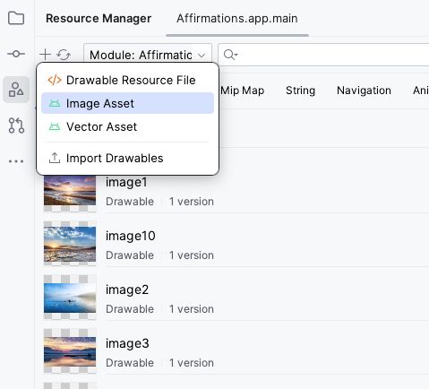

3. Android Studio の **Image Asset Studio** ツールが開きます。
4. デフォルト設定のままにします。

- **Icon Type:** Launcher Icons (Adaptive and Legacy)
- **Name:** ic_launcher

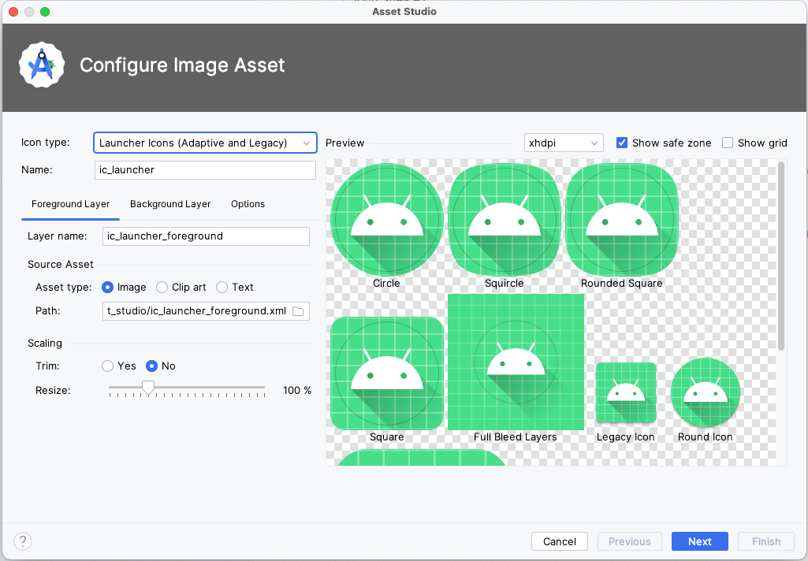

5. [**Foreground Layer**] タブがすでに選択されている状態で、[**Source Asset**] サブセクションに移動します。[**Path**] フィールドで、フォルダ アイコンをクリックします。
6. パソコンを参照してファイルを選択するように促すポップアップが表示されます。ダウンロードした新しい `ic_launcher_foreground.xml` ファイルの場所を探します。パソコンの**ダウンロード** フォルダに保存されている可能性があります。見つかったら、[**Open**] をクリックします。
7. [**Path**] が、新しいフォアグラウンド ベクター型ドローアブルの場所に更新されます。[**Layer Name**] は [**ic_launcher_foreground**]、[**Asset Type**] は [**Image**] のままにします。

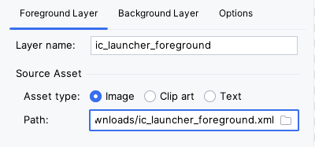

8. 次に、インターフェースの [**Background Layer**] タブに切り替えます。デフォルト値のままにします。
9. [**Path**] フィールドのフォルダ アイコンをクリックします。
10. ダウンロードした `ic_launcher_background.xml` ファイルの場所を探します。[**Open**] をクリックします。

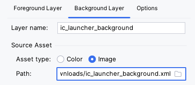

11. 新しいリソース ファイルを選択すると、プレビューが更新されます。新しいフォアグラウンド レイヤとバックグラウンド レイヤで、次のようになります。

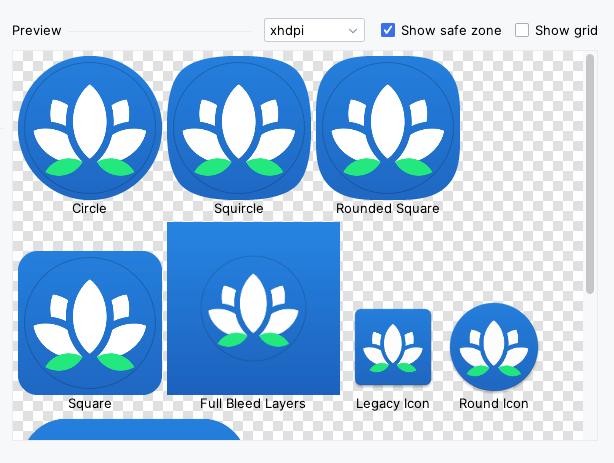

アプリアイコンを 2 つのレイヤで表すことにより、デバイス メーカー（相手先ブランド製品製造企業、略称 OEM）は、上のプレビューに示すように、Android デバイスに応じてさまざまな形状を作成できます。OEM は、デバイス上のすべてのアプリアイコンに適用されるマスクを提供します。

円形マスクをアプリアイコンの両レイヤに適用すると、Android の画像と青色のグリッド背景を持つ円形のアイコンが作成されます（上の左の画像）。あるいは、丸みのある四角形のマスクを適用して、右上のアプリアイコンを生成することもできます。

フォアグラウンド レイヤとバックグラウンド レイヤの両方があることで、2 つのレイヤが互いに独立して移動、スケーリングできるため、面白い視覚効果が得られます。視覚効果の見え方に関する面白い例については、設計上の考慮事項の[アダプティブ アイコンのデザインに関するブログ記事](https://medium.com/google-design/designing-adaptive-icons-515af294c783)をご覧ください。ユーザーが使用するデバイスや、OEM がアイコンに適用するマスクを知ることはできないため、重要な情報が切り落とされないようにアダプティブ アイコンを設定する必要があります。

12. 重要な内容が切り落とされている場合や小さすぎる場合は、各レイヤの [**Scaling**] セクションにある [**Resize**] スライダーバーを使用して、すべてがセーフゾーンに表示されるようにできます。切り落とされないようにするには、[**Foreground Layer**] タブと [**Background Layer**] タブの [**Resize**] スライダーをドラッグして、フォアグラウンドとバックグラウンドの画像のサイズを 99% に変更します。

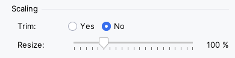

13. [**次へ**] をクリックします。
14. このステップは [**Confirm Icon Path**] です。個々のファイルをクリックすると、プレビューが表示されます。

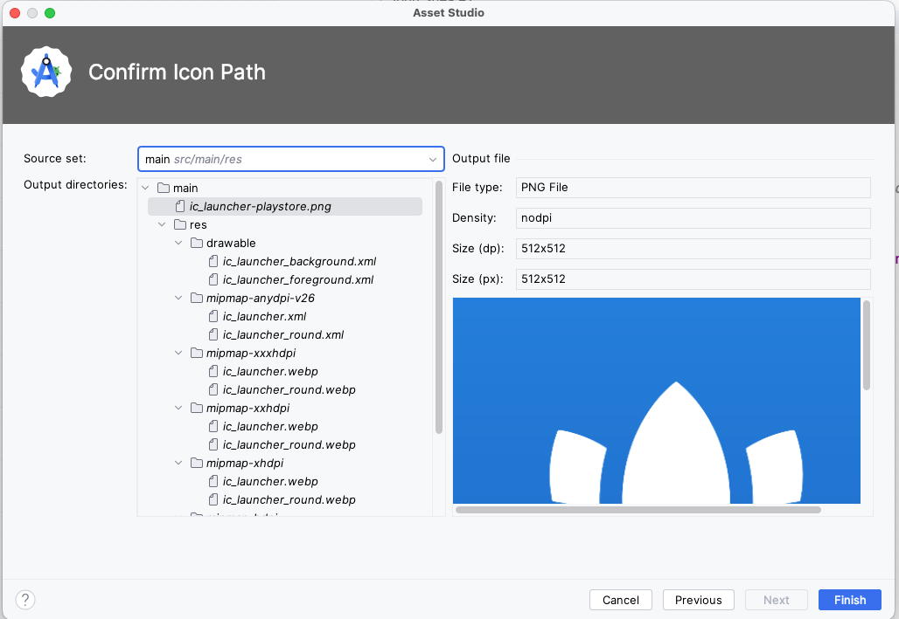

15. [**完了**] をクリックします。
16. `mipmap` フォルダで、生成されたすべてのアセットが正しく表示されることを確認します。例:

 

お疲れさまでした。ここでもう 1 つ変更を加えます。

#### アプリをテストする

1. 新しいアプリアイコンが表示されるかどうかをテストします。デバイス（エミュレータまたは実機）でアプリを実行します。
2. デバイスの**ホーム**ボタンをタップします。
3. 上にスワイプして**すべてのアプリ**リストを表示します。
4. 更新したアプリを探します。新しいアプリアイコンが表示されます。

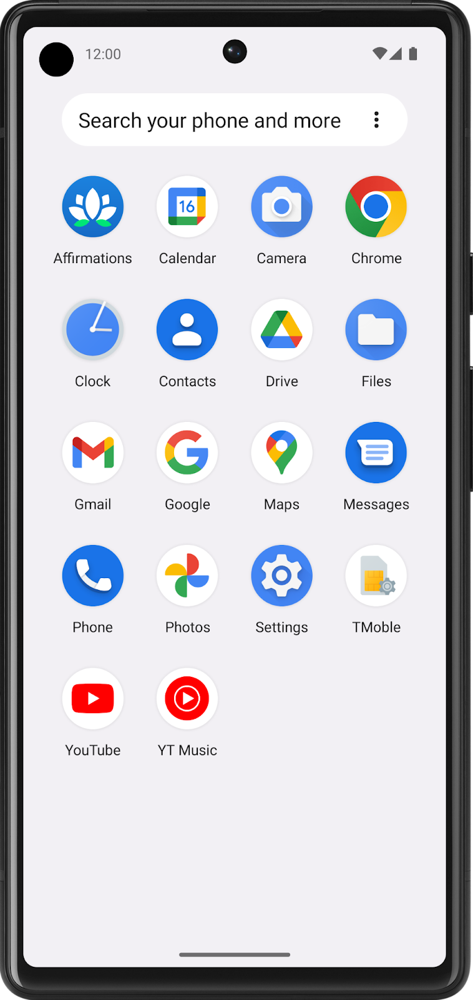

> **注:**デバイスモデルによっては、異なる形状のランチャー アイコンが表示される場合があります。それでもバックグラウンド レイヤの上にフォアグラウンド レイヤが表示され、なんらかのマスクが適用されます。

よくできました。新しいアプリアイコンは上出来です。

#### アダプティブ ランチャー アイコンとレガシー ランチャー アイコン

これでアダプティブ アイコンが正しく機能するようになりましたが、アプリアイコンのビットマップ画像をすべて削除できないのはなぜかと思うかもしれません。これらのファイルは、以前のバージョンの Android で高品質なアプリアイコンを表示するために必要です。これを下位互換性といいます。

**Android 8.0 以降**（API バージョン 26 以降）を搭載したデバイスの場合、**アダプティブ アイコン**を使用できます（フォアグラウンド ベクター型ドローアブル、バックグラウンド ベクター型ドローアブル、その上に適用される OEM マスクの組み合わせ）。プロジェクトの関連ファイルは次のとおりです。

```kotlin
res/drawable/ic_launcher_background.xml
res/drawable/ic_launcher_foreground.xml
res/mipmap-anydpi-v26/ic_launcher.xml
res/mipmap-anydpi-v26/ic_launcher_round.xml
```

**Android 8.0 より前**（ただしアプリの必要な最小 API レベルより後）を搭載したデバイスの場合、**レガシー ランチャー アイコン**（さまざまな密度バケットの `mipmap` フォルダにあるビットマップ画像）が使用されます。プロジェクトの関連ファイルは次のとおりです。

```kotlin
res/mipmap-mdpi/ic_launcher.webp
res/mipmap-mdpi/ic_launcher_round.webp
res/mipmap-hdpi/ic_launcher.webp
res/mipmap-hdpi/ic_launcher_round.webp
res/mipmap-xhdpi/ic_launcher.png
res/mipmap-xhdpi/ic_launcher_round.webp
res/mipmap-xxhdpi/ic_launcher.webp
res/mipmap-xxhdpi/ic_launcher_round.webp
res/mipmap-xxxhdpi/ic_launcher.webp
res/mipmap-xxxhdpi/ic_launcher_round.webp
```

Android は基本的に、アダプティブ アイコンをサポートしていない以前のデバイスではビットマップ画像にフォールバックします。

これで、アプリアイコンを変更する手順がすべて完了しました。

### 6. 解答コードを取得する

このレッスンの完成したコードをダウンロードするには、以下の git コマンドを使用します。

```
$ git clone https://github.com/google-developer-training/basic-android-kotlin-compose-training-affirmations.git
$ cd basic-android-kotlin-compose-training-affirmations
$ git checkout main
```

または、リポジトリを ZIP ファイルとしてダウンロードし、Android Studio で開くこともできます。

> **注:**解答コードは、ダウンロードしたリポジトリの `main` ブランチにあります。

解答コードを確認する場合は、[GitHub で表示します](https://github.com/google-developer-training/basic-android-kotlin-compose-training-affirmations)。

1. プロジェクト用に提供されている GitHub リポジトリ ページに移動します。
2. ブランチ名がレッスンで指定されたブランチ名と一致していることを確認します。たとえば、次のスクリーンショットでは、ブランチ名は **main** です。


3. プロジェクトの GitHub ページで、[**Code**] ボタンをクリックすると、ポップアップが表示されます。


4. ポップアップで、[**Download ZIP**] をクリックして、プロジェクトをパソコンに保存します。ダウンロードが完了するまで待ちます。
5. パソコンに保存したファイルを見つけます（[**ダウンロード**] フォルダなど）。
6. ZIP ファイルをダブルクリックして展開します。プロジェクト ファイルが入った新しいフォルダが作成されます。

#### Android Studio でプロジェクトを開く

1. Android Studio を起動します。
2. [**Welcome to Android Studio**] ウィンドウで、[**Open**] をクリックします。


注: Android Studio がすでに開いている場合は、メニューから [**File**] > [**Open**] を選択します。


3. ファイル ブラウザで、展開したプロジェクト フォルダがある場所（[**ダウンロード**] フォルダなど）に移動します。
4. そのプロジェクト フォルダをダブルクリックします。
5. Android Studio でプロジェクトが開かれるまで待ちます。
6. **実行**ボタン  をクリックして、アプリをビルドし、実行します。想定どおりにビルドされることを確認します。

### 7. 概要

#### まとめ

- アプリアイコン ファイルを `mipmap` リソース ディレクトリに配置する。
- 以前のバージョンの Android との下位互換性のために、各密度バケット（`mdpi`、`hdpi`、`xhdpi`、`xxhdpi`、`xxxhdpi`）に異なるバージョンのアプリアイコン ビットマップ画像を提供する。
- リソース ディレクトリにリソース修飾子を追加して、特定の構成（`v24` または `v26`）のデバイスで使用するリソースを指定する。
- ベクター型ドローアブルは Android のベクター グラフィックの実装であり、関連する色情報とともに、点、線、曲線のセットとして XML で定義される。ベクター型ドローアブルでは、画質を損なうことなく任意の密度にスケーリングできる。
- API 26 で Android プラットフォームにアダプティブ アイコンが導入された。特定の要件を満たすフォアグラウンド レイヤとバックグラウンド レイヤで構成されているため、さまざまな OEM マスクを使用して、幅広いデバイスで高品質なアプリアイコンが表示される。
- Android Studio の **Image Asset Studio** を使用して、アプリのレガシー アイコンとアダプティブ アイコンを作成する。

### 8. 詳細

#### 関連リンク

- [Android アイコンのデザイン ガイドライン](https://m3.material.io/styles/icons/designing-icons)
- [アダプティブ アイコン](https://developer.android.com/guide/practices/ui_guidelines/icon_design_adaptive)
- [Android のアダプティブ アイコンについて](https://medium.com/google-design/understanding-android-adaptive-icons-cee8a9de93e2)
- [アダプティブ アイコンのデザイン](https://medium.com/google-design/designing-adaptive-icons-515af294c783)
- [アダプティブ アイコンの実装](https://medium.com/androiddevelopers/implementing-adaptive-icons-1e4d1795470e)
- [Adaptive Icon Playground アプリ](https://github.com/nickbutcher/AdaptiveIconPlayground)
- [アダプティブ ランチャー アイコンとレガシー ランチャー アイコンを作成する](https://developer.android.com/studio/write/image-asset-studio#create-adaptive)
- [さまざまなピクセル密度のサポート](https://developer.android.com/training/multiscreen/screendensities#TaskProvideAltBmp)
- [アプリアイコンを mipmap ディレクトリに配置する](https://developer.android.com/training/multiscreen/screendensities#mipmap)
- [ベクター型ドローアブルの概要](https://developer.android.com/guide/topics/graphics/vector-drawable-resources)
- [`VectorDrawable` クラス](https://developer.android.com/reference/kotlin/android/graphics/drawable/VectorDrawable)

## 5. 演習: グリッドを作成する（提出対象）


### 1. 始める前に

お疲れさまでした。スクロール可能なリストを使用する最初のアプリを作成しました。今度は、学んだことを実践してみましょう。

この演習では、スクロール可能なリストを作成する際に必要なコンポーネントの作成に焦点を当てます。具体的には、スクロール可能なリストを追加するレッスンで学んだ成果に基づき、その知識を応用してスクロール可能なグリッドを作成します。

一部のセクションでは、これまでに学んだことがないコンポーザブルまたは修飾子を使用する必要があります。その場合は、各問題で参照できる**リファレンス**をご覧ください。馴染みのない修飾子、プロパティ、コンポーザブルに関するドキュメントへのリンクがあります。ドキュメントを読み、そのコンセプトをアプリに取り入れる方法を確認してください。ドキュメントの内容を理解する能力は、知識を深めるために身につける必要がある重要なスキルです。

解答コードは最後に掲載されていますが、演習に取り組んでから解答を確認するようにしてください。解答はアプリを実装する方法の一つとして捉えてください。

#### 前提条件

- スクロール可能なリストを追加するレッスンを通じて、「Compose での Android の基礎」コースワークを完了していること。

#### 必要なもの

- Android Studio がインストールされた、インターネットに接続できるパソコン。

##### リソース

練習問題のコードを完了するには、次のリソースが必要になります。

- [トピックの画像](https://github.com/google-developer-training/basic-android-kotlin-compose-training-courses/blob/main/topics.zip)。これらの画像はリスト内の各トピックを表します。
- [ic_grain.xml](https://raw.githubusercontent.com/android/compose-samples/main/Owl/app/src/main/res/drawable/ic_grain.xml)。これは、トピック内のコース数の横に表示される装飾アイコンです。

#### 作成するアプリの概要

以下の演習では、**Courses** アプリをゼロから作成します。**Courses** アプリは、コーストピックのリストを表示します。

演習は次のセクションに分かれており、各セクションでアプリを作成します。

- コーストピックのデータクラス:

トピックのデータには、画像、名前、トピックに関連するコースの数が含まれています。

- コーストピックのグリッド アイテムを表すコンポーザブル:

各トピック アイテムは、画像、名前、関連するコースの数、装飾アイコンを表示します。

- これらのコーストピック アイテムのグリッドを表示するコンポーザブル。

完成したアプリの外観は次のようになります。

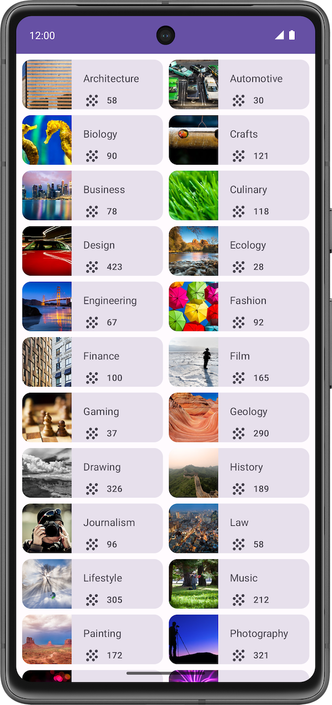

### 2. 使ってみる

#### 始める

**Empty Activity** テンプレートと、最小 SDK バージョンである 24 を使用して、新しいプロジェクトを作成します。

### 3. トピックのデータクラス

このセクションでは、各コーストピックのデータを保持するクラスを作成します。

完成したアプリのアイテムは次のようになります。

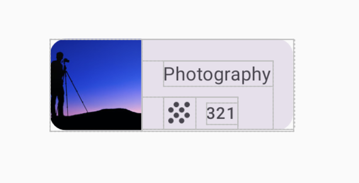

各コーストピックは 3 つの固有の情報を保持します。各アイテムの固有のコンテンツを参照として使用し、このデータを保持するクラスを作成します。

### 4. データソース

このセクションでは、コースのグリッドのデータセットを作成します。

次のアイテムを **app/src/main/res/values/strings.xml** にコピーします。

```kotlin
<string name="architecture">Architecture</string>
<string name="crafts">Crafts</string>
<string name="business">Business</string>
<string name="culinary">Culinary</string>
<string name="design">Design</string>
<string name="fashion">Fashion</string>
<string name="film">Film</string>
<string name="gaming">Gaming</string>
<string name="drawing">Drawing</string>
<string name="lifestyle">Lifestyle</string>
<string name="music">Music</string>
<string name="painting">Painting</string>
<string name="photography">Photography</string>
<string name="tech">Tech</string>
```

**DataSource.kt** という名前の空のファイルを作成します。次のコードをファイルにコピーします。

```kotlin
object DataSource {
    val topics = listOf(
        Topic(R.string.architecture, 58, R.drawable.architecture),
        Topic(R.string.crafts, 121, R.drawable.crafts),
        Topic(R.string.business, 78, R.drawable.business),
        Topic(R.string.culinary, 118, R.drawable.culinary),
        Topic(R.string.design, 423, R.drawable.design),
        Topic(R.string.fashion, 92, R.drawable.fashion),
        Topic(R.string.film, 165, R.drawable.film),
        Topic(R.string.gaming, 164, R.drawable.gaming),
        Topic(R.string.drawing, 326, R.drawable.drawing),
        Topic(R.string.lifestyle, 305, R.drawable.lifestyle),
        Topic(R.string.music, 212, R.drawable.music),
        Topic(R.string.painting, 172, R.drawable.painting),
        Topic(R.string.photography, 321, R.drawable.photography),
        Topic(R.string.tech, 118, R.drawable.tech)
    )
}
```

### 5. トピックのグリッド アイテム

トピックのグリッド アイテムを表すコンポーザブルを作成します。

##### 最終的なスクリーンショット

実装が完了すると、トピック アイテムのレイアウトは次のスクリーンショットのようになります。

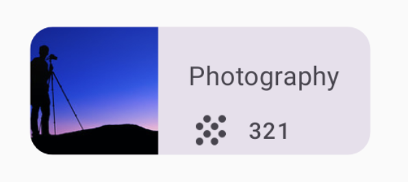

##### UI 仕様

次の UI 仕様を使用します。

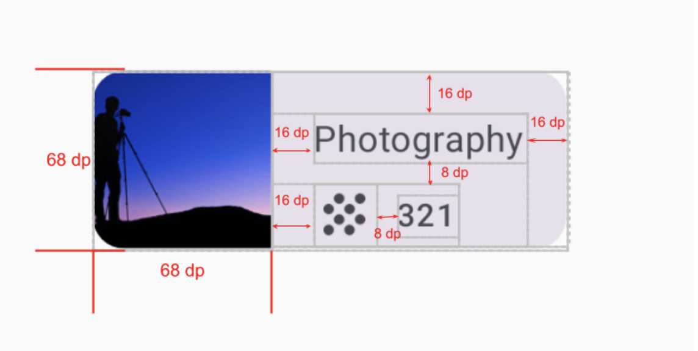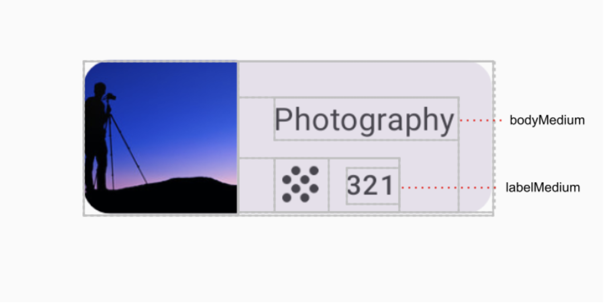

[テキストのスタイル設定](https://developer.android.com/jetpack/compose/themes/material#text-styles)

**ヒント:** どのコンポーザブルが子を垂直方向に配置し、どのコンポーザブルが子を水平方向に配置するかを考慮してください。

##### 参照

- [タイポグラフィ](https://developer.android.com/reference/kotlin/androidx/compose/material/Typography)
- [標準レイアウト コンポーネント](https://developer.android.com/jetpack/compose/layouts/basics#standard-layouts)
- [`Box`](https://developer.android.com/reference/kotlin/androidx/compose/foundation/layout/Box.composable#Box(androidx.compose.ui.Modifier)) レイアウト
- [`Column`](https://developer.android.com/reference/kotlin/androidx/compose/foundation/layout/Column.composable#Column(androidx.compose.ui.Modifier,androidx.compose.foundation.layout.Arrangement.Vertical,androidx.compose.ui.Alignment.Horizontal,kotlin.Function1)) レイアウト
- [`Row`](https://developer.android.com/reference/kotlin/androidx/compose/foundation/layout/Row.composable#Row(androidx.compose.ui.Modifier,androidx.compose.foundation.layout.Arrangement.Horizontal,androidx.compose.ui.Alignment.Vertical,kotlin.Function1)) レイアウト
- [`aspectRatio`](https://developer.android.com/reference/kotlin/androidx/compose/foundation/layout/aspectRatio.modifier#(androidx.compose.ui.Modifier).aspectRatio(kotlin.Float,kotlin.Boolean))
- [`painterResource`](https://developer.android.com/jetpack/compose/resources#vector-assets)

### 6. コースのグリッド

トピックのグリッド アイテムを作成したら、それを使用してコーストピックのグリッドを作成できます。

ここでは、グリッド アイテムのコンポーザブルを使用して、2 つの列を持つグリッドを作成します。

##### 最終的なスクリーンショット

実装が完了したら、次のスクリーンショットのようなデザインになります。


##### UI 仕様

次の UI 仕様を使用します。

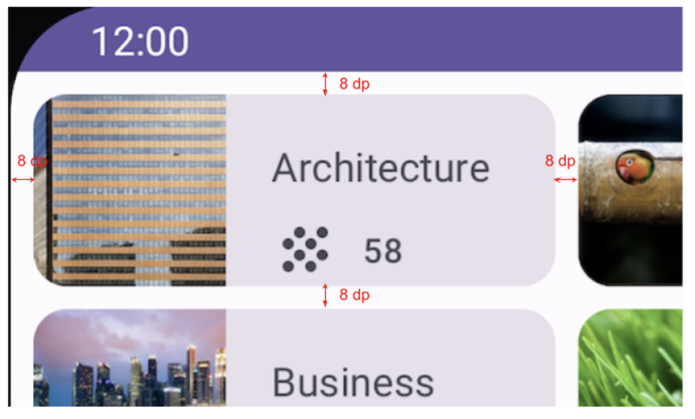

##### 参照

- [リストとグリッド](https://developer.android.com/jetpack/compose/lists#grids)
- [固定グリッドセル](https://developer.android.com/reference/kotlin/androidx/compose/foundation/lazy/grid/GridCells.Fixed)
- [リスト: コンテンツの間隔](https://developer.android.com/jetpack/compose/lists#content-spacing)
- レッスン: スクロール可能なリストを追加する

### 7. 解答コードを取得する

このレッスンの完成したコードをダウンロードするには、次の git コマンドを使用します。

```
$ git clone https://github.com/google-developer-training/basic-android-kotlin-compose-training-courses.git
```

または、リポジトリを ZIP ファイルとしてダウンロードし、Android Studio で開くこともできます。

解答コードを確認する場合は、[GitHub で表示します](https://github.com/google-developer-training/basic-android-kotlin-compose-training-courses)。

この演習で作成するアプリは、Owl アプリのコース画面の修正版です。[Owl アプリ](https://github.com/android/compose-samples/tree/main/Owl)は、Compose の機能を示す総合的なサンプルアプリです。その他の Compose サンプルアプリは、[compose-samples](https://github.com/android/compose-samples) GitHub リポジトリにあります。

## 6. つまずきやすいポイント

- `Column` と `LazyColumn` の違い（全部作るか、見える分だけ作るか）を説明できるようにしましょう。
- リストの 1 行を別のコンポーザブル関数に切り出す（`AffirmationCard` など）と、コードが読みやすくなり AI レビューも通りやすくなります。

## 7. AIに質問する（この章の例）

次の例をそのままAIに投げてOKです（必要なら自分のコード/エラーに置き換えてください）。

```text
「`Column` と `LazyColumn` の違いを、パフォーマンスの観点で説明して」
「`LazyColumn` に `data class` のリストを渡してカードを並べたい。1 行分のコンポーザブルを切り出す設計を、方針→ヒントの順で教えて」
「演習: グリッドを作成する で `LazyVerticalGrid` の列数指定で迷っている。`GridCells.Fixed` と `GridCells.Adaptive` の違いを教えて」
```

質問がまとまらないときは、第0章の「質問テンプレ」を使ってください。

## 8. 提出物

次のレッスンで完成させた Android Studio プロジェクトを、学習用リポジトリの `unit3/Affirmations/` に置きます（プロジェクトフォルダごとコピー。`build/` と `.idea/` は含めない）。

- スクロール可能なリストを追加する
- 演習: グリッドを作成する

PR 本文には次の 3 点を書いてください。

- **やったこと**：どのレッスン / 演習を完了したか
- **動作確認**：どの端末（エミュレータ名 or 実機）で何を確認したか
- **詰まった点と解決**：エラーの内容と、どう直したか（AI に聞いた内容も可）

## 9. チェックリスト

- [ ] `LazyColumn` / `LazyVerticalGrid` でデータのリストを表示できる
- [ ] データクラスのリストからカード UI を生成できる
- [ ] アプリアイコン（Adaptive Icon）を差し替えられる
- [ ] 各レッスンの「まとめ」にある用語を自分の言葉で説明できる
- [ ] 提出物が `unit3/Affirmations/` にあり、Android Studio（または Kotlin Playground）で開いて動く

---

## 課題提出

この章には提出課題があります。

1. 上記の提出物を完了する
2. GitHub で `feature/03-scrollable-list` ブランチを作成し、`develop` へのPRを作成（base=`develop`）
3. [AIプログラムレビュー](https://ai.studio/apps/84d224cb-7de1-44fb-995b-9a5917d25603?fullscreenApplet=true) を実行
4. 問題がなければ、進捗ダッシュボードで **PR URL** と **完了日** を記録
