# 第12章: さまざまな表示サイズに適応する

> ユニット 4「ナビゲーションとアプリ アーキテクチャ」 パスウェイ 3
> 提出ブランチ: `feature/04-adaptive-layouts`

## 1. この章のゴール

- ウィンドウサイズクラス（Compact / Medium / Expanded）を判定できる
- 画面幅に応じてナビゲーション（Bottom / Rail / Drawer）とレイアウトを切り替えられる
- タブレットや折りたたみ端末のエミュレータで動作確認できる

## 2. 進め方

公式パスウェイの内容を **上から順番に** 進めます。「やらなくてOK」の行は飛ばして構いません。Codelab の本文はこのページの下にすべて掲載しています（公式の動画はこのプログラムでは扱いません）。目安時間の合計は約405分です。

| # | 種類 | 内容 | 目安 | 備考 |
|---|---|---|---|---|
| 1 | Codelab | ダイナミック ナビゲーションを使用してアダプティブ アプリを作成する | 約120分 |  |
| 2 | Codelab | アダプティブ レイアウトでアプリを作成する | 約120分 |  |
| 3 | Codelab | 演習: スポーツアプリを作成する | 約150分 | **提出対象** |
| 4 | Codelab | プロジェクト: My City アプリを作成する | — | **やらなくてOK**（学習効果に対して難易度・工数が高い） |
| 5 | クイズ | [テスト: アダプティブ レイアウト](https://developer.android.com/courses/quizzes/android-basics-compose-unit-4-pathway-3/android-basics-compose-unit-4-pathway-3?hl=ja) | 約15分 | 公式サイトで受ける |

Codelab の進め方は次の通りです。

1. 下の各 Codelab を読み、各ステップの説明を理解してから **自分でコードを打つ**（コピペで済ませない）
2. ステップごとにアプリを実行し、期待どおり動くか確認する
3. 動かないときは、エラー文をそのまま AI に貼って「何が原因か」を聞き、直したら **なぜ直ったか** をメモする
4. パスウェイ末尾のクイズを受けて、間違えた項目を Codelab で読み直す

> Codelab 本文は Google Developers の公式 Codelab（CC BY 4.0）を日本語のまま転載しています。画面が最新の Android Studio と異なる場合は、公式ページ（各見出しの「出典」リンク）も確認してください。

## 3. ダイナミック ナビゲーションを使用してアダプティブ アプリを作成する

<!-- codelab:basic-android-kotlin-compose-adaptive-navigation-for-large-screens -->
出典: [ダイナミック ナビゲーションを使用してアダプティブ アプリを作成する](https://developer.android.com/codelabs/basic-android-kotlin-compose-adaptive-navigation-for-large-screens?hl=ja)（Google Developers, CC BY 4.0）

### 1. はじめに

Android プラットフォームでアプリを開発することの大きなメリットの 1 つは、ウェアラブル、折りたたみ式、タブレット、デスクトップ、さらにはテレビなど、さまざまなフォーム ファクタでユーザーにリーチできることです。アプリを使用するユーザーは、同じアプリを大画面デバイスで使用して、広くなったスペースのメリットを享受できます。Android ユーザーが、画面サイズの異なる複数のデバイスでアプリを使用することが多くなり、すべてのデバイスで質の高いユーザー エクスペリエンスを期待するようになっています。

ここまでは、主にモバイル デバイス向けアプリを作成する方法を学習しましたが、この Codelab では、アプリを他の画面サイズに適応させる方法を学びます。ここでは、アダプティブ ナビゲーション レイアウト パターンという、折りたたみ式、タブレット、パソコンなど、モバイル デバイスと大画面デバイスのどちらでも使用可能で見栄えも良いパターンを使用します。

#### 前提条件

- クラス、関数、条件文など、Kotlin プログラミングに精通していること
- `ViewModel` クラスの使用経験
- `Composable` 関数の作成に精通していること
- Jetpack Compose でレイアウトを作成した経験
- デバイスまたはエミュレータでアプリを実行した経験

#### 学習内容

- シンプルなアプリで、ナビゲーション グラフを使用せずに画面間のナビゲーションを作成する方法
- Jetpack Compose を使用してアダプティブ ナビゲーション レイアウトを作成する方法
- カスタムの「戻る」ハンドラを作成する方法

#### 作成するアプリの概要

- 既存の Reply アプリにダイナミック ナビゲーションを実装し、そのレイアウトがすべての画面サイズに適応するようにする

完成すると以下の画像のようになります。

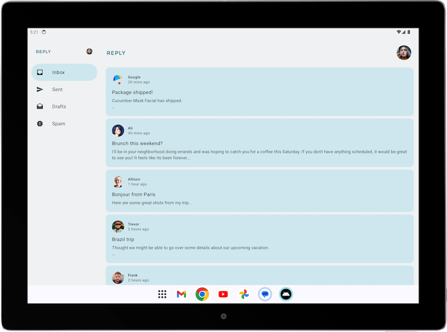

​​

#### 必要なもの

- インターネットにアクセスできるパソコン、ウェブブラウザ、Android Studio
- GitHub へのアクセス

### 2. アプリの概要

#### Reply アプリの概要

Reply アプリは、[メール クライアント](https://en.wikipedia.org/wiki/Email_client)に似たマルチスクリーン アプリです。

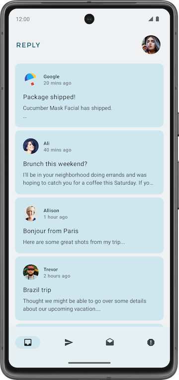

4 つのカテゴリからなり、それぞれ別のタブ（受信トレイ、送信済み、下書き、迷惑メール）で表示されます

#### スターター コードをダウンロードする

Android Studio で `basic-android-kotlin-compose-training-reply-app` フォルダを開きます。

> **スターター コードの URL:**
> 
> [`https://github.com/google-developer-training/basic-android-kotlin-compose-training-reply-app`](https://github.com/google-developer-training/basic-android-kotlin-compose-training-reply-app/tree/starter)
> 
> **スターター コードのブランチ名:**`starter`

### 3. スターター コードのチュートリアル

#### Reply アプリの重要なディレクトリ

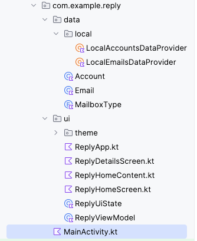

Reply アプリ プロジェクトのデータと UI レイヤは、別々のディレクトリに分割されています。`ReplyViewModel`、`ReplyUiState` などのコンポーザブルは、`ui` ディレクトリにあります。データレイヤとデータ プロバイダのクラスを定義する `data` クラスと `enum` クラスは `data` ディレクトリにあります。

#### Reply アプリのデータ初期化

Reply アプリは `ReplyViewModel` の `initializeUIState()` メソッドを使用してデータが初期化されます。このメソッドは `init` 関数で実行されます。

**ReplyViewModel.kt**

```kotlin
...
    init {
        initializeUIState()
    }
 

    private fun initializeUIState() {
        var mailboxes: Map<MailboxType, List<Email>> =
            LocalEmailsDataProvider.allEmails.groupBy { it.mailbox }
        _uiState.value = ReplyUiState(
            mailboxes = mailboxes,
            currentSelectedEmail = mailboxes[MailboxType.Inbox]?.get(0)
                ?: LocalEmailsDataProvider.defaultEmail
        )
    }
...
```

#### 画面レベルのコンポーザブル

他のアプリと同様に、Reply アプリは `viewModel` と `uiState` が宣言されるメインのコンポーザブルとして `ReplyApp` コンポーザブルを使用します。さまざまな `viewModel()` 関数も、`ReplyHomeScreen` コンポーザブルのラムダ引数として渡されます。

**ReplyApp.kt**

```kotlin
...
@Composable
fun ReplyApp(modifier: Modifier = Modifier) {
    val viewModel: ReplyViewModel = viewModel()
    val replyUiState = viewModel.uiState.collectAsState().value

    ReplyHomeScreen(
        replyUiState = replyUiState,
        onTabPressed = { mailboxType: MailboxType ->
            viewModel.updateCurrentMailbox(mailboxType = mailboxType)
            viewModel.resetHomeScreenStates()
        },
        onEmailCardPressed = { email: Email ->
            viewModel.updateDetailsScreenStates(
                email = email
            )
        },
        onDetailScreenBackPressed = {
            viewModel.resetHomeScreenStates()
        },
        modifier = modifier
    )
}
```

#### その他のコンポーザブル

- **`ReplyHomeScreen.kt`**: ナビゲーション要素など、ホーム画面用の画面コンポーザブルが含まれています。
- **`ReplyHomeContent.kt`**: ホーム画面の詳細なコンポーザブルを定義するコンポーザブルが含まれています。
- **`ReplyDetailsScreen.kt`**: 画面コンポーザブルと、詳細画面用のより小さなコンポーザブルが含まれています。

この Codelab の次のセクションに進む前に、各ファイルについて詳しく確認して、これらのコンポーザブルの理解を深めることをおすすめします。

### 4. ナビゲーション グラフを使用せずに画面を変更する

前のパスウェイでは、`NavHostController` クラスを使用して、ある画面から別の画面に移動する方法を学びました。Compose では、実行時の可変状態を利用し、単純な条件文で画面を変更することもできます。これは、Reply アプリのような 2 つの画面間のみで切り替える小さなアプリなどに特に有用です。

#### 状態変更で画面を変更する

Compose では、状態変更が発生すると画面が再コンポーズされます。単純な条件文を使用して画面を変更することで、状態の変化に対応できます。

条件文を使用して、ユーザーがホーム画面にいるときにホーム画面の内容を表示し、ユーザーがホーム画面にいないときには詳細画面の内容を表示しましょう。

Reply アプリを変更して、状態変更時に画面を変更できるようにします。手順は次のとおりです。

1. Android Studio でスターター コードを開きます。
2. `ReplyHomeScreen.kt` の `ReplyHomeScreen` コンポーザブルで、`ReplyAppContent` コンポーザブルを、`replyUiState` オブジェクトの `isShowingHomepage` プロパティが `true` の場合の `if` 文で囲みます。

**ReplyHomeScreen.kt**

```kotlin
@Composable
fun ReplyHomeScreen(
    replyUiState: ReplyUiState,
    onTabPressed: (MailboxType) -> Unit,
    onEmailCardPressed: (Int) -> Unit,
    onDetailScreenBackPressed: () -> Unit,
    modifier: Modifier = Modifier
) {

...
    if (replyUiState.isShowingHomepage) {
        ReplyAppContent(
            replyUiState = replyUiState,
            onTabPressed = onTabPressed,
            onEmailCardPressed = onEmailCardPressed,
            navigationItemContentList = navigationItemContentList,
            modifier = modifier

        )
    }
}
```

詳細画面を表示することで、ユーザーがホーム画面にいないときのシナリオを考慮する必要があります。

3. 本体に `ReplyDetailsScreen` コンポーザブルが含まれる `else` 分岐を追加します。`ReplyDetailsScreen` コンポーザブルの引数として `replyUIState`、`onDetailScreenBackPressed`、`modifier` を追加します。

**ReplyHomeScreen.kt**

```kotlin
@Composable
fun ReplyHomeScreen(
    replyUiState: ReplyUiState,
    onTabPressed: (MailboxType) -> Unit,
    onEmailCardPressed: (Int) -> Unit,
    onDetailScreenBackPressed: () -> Unit,
    modifier: Modifier = Modifier
) {

...

    if (replyUiState.isShowingHomepage) {
        ReplyAppContent(
            replyUiState = replyUiState,
            onTabPressed = onTabPressed,
            onEmailCardPressed = onEmailCardPressed,
            navigationItemContentList = navigationItemContentList,
            modifier = modifier

        )
    } else {
        ReplyDetailsScreen(
            replyUiState = replyUiState,
            onBackPressed = onDetailScreenBackPressed,
            modifier = modifier
        )
    }
}
```

`replyUiState` オブジェクトは状態オブジェクトです。そのため、実行時には、`replyUiState` オブジェクトの `isShowingHomepage` プロパティが変化すると、`ReplyHomeScreen` コンポーザブルが再コンポーズされ、`if/else` 文が再評価されます。このアプローチでは、`NavHostController` クラスを使用することなく画面間のナビゲーションに対応しています。

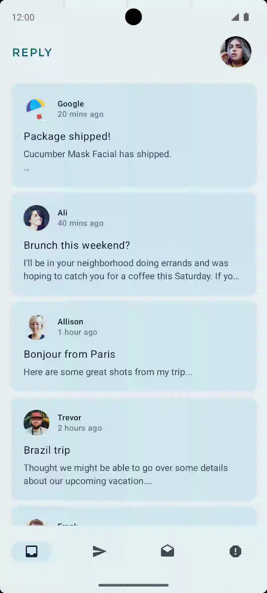

#### カスタムの「戻る」ハンドラを作成する

`NavHost` コンポーザブルを使用して画面を切り替えることの利点の 1 つは、前の画面の履歴がバックスタックに保存されることです。これらの保存された画面により、システムの [戻る] ボタンを押すと前の画面に簡単に移動できるようになります。Reply アプリでは `NavHost` を使用しないため、[戻る] ボタンを手動で処理するためのコードを追加する必要があります。これは次で行います。

次の手順に沿って、Reply アプリでカスタムの「戻る」ハンドラを作成します。

1. `ReplyDetailsScreen` コンポーザブルの 1 行目に、`BackHandler` コンポーザブルを追加します。
2. `BackHandler` コンポーザブルの本体で `onBackPressed()` 関数を呼び出します。

**ReplyDetailsScreen.kt**

```kotlin
...
import androidx.activity.compose.BackHandler
...
@Composable
fun ReplyDetailsScreen(
    replyUiState: ReplyUiState,
    onBackPressed: () -> Unit,
    modifier: Modifier = Modifier
) {
    BackHandler {
        onBackPressed()
    }
... 
```

### 5. 大画面デバイスでアプリを実行する

#### サイズ変更可能なエミュレータでアプリを確認する

使いやすいアプリを作成するには、さまざまなフォーム ファクタでのユーザー エクスペリエンスを理解する必要があります。そのため、開発プロセスの初期から、さまざまなフォーム ファクタでアプリをテストする必要があります。

さまざまな画面サイズのエミュレータを使用することで、この目標を達成できます。特に複数の画面サイズに対応するアプリを一度に構築する場合には、面倒な作業になる可能性があります。また、実行中のアプリの画面サイズの変化（画面の向きの変更、デスクトップでのウィンドウ サイズの変更、折りたたみ式デバイスでの折りたたみ状態の変化など）に対する反応をテストする必要があります。

Android Studio では、**サイズ変更可能なエミュレータ**を導入することで、このようなシナリオのテストが可能になりました。

サイズ変更可能なエミュレータは、次の手順でセットアップします。

1. Android Studio で、[**Tools**] > [**Device Manager**] を選択します。

![[Tools] メニューに、オプションのリストが表示されています。Device Manager が、リストの中ほどに表示され、選択されています。](./images/basic-android-kotlin-compose-adaptive-navigation-for-large-screens/d5ad25dcd845441a.png)

2. [**Device Manager**] で [**+**] アイコンをクリックして、仮想デバイスを作成します。

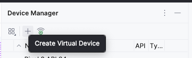

3. [**Phone**] カテゴリと [**Resizable (Experimental)**] デバイスを選択します。
4. [**次へ**] をクリックします。

![[Device Manager] ウィンドウに、デバイス定義を選ぶプロンプトが表示されています。選択肢のリストが表示され、その上に検索フィールドがあります。カテゴリ](./images/basic-android-kotlin-compose-adaptive-navigation-for-large-screens/94af56858ef86e1c.png)

5. **API レベル 34** 以上を選択します。
6. [**次へ**] をクリックします。

![[Virtual Device Configuration] ウィンドウに、システム イメージを選択するプロンプトが表示されています。API レベル 34 が選択されています。](./images/basic-android-kotlin-compose-adaptive-navigation-for-large-screens/9658c810f0be9988.png)

7. 新しい Android Virtual Device に名前を付けます。
8. [**完了**] をクリックします。

![Android Virtural Device（AVD）の [Virtual Configration] 画面が表示されています。設定画面には、AVD 名を入力するためのテキスト フィールドがあります。名前フィールドの下には、デバイス定義（Resizable Experimental）、システム イメージ（Tiramisu）、画面の向き（デフォルトの Portrait が選択されている）などのデバイス オプションのリストがあります。ボタンの読み上げ](./images/basic-android-kotlin-compose-adaptive-navigation-for-large-screens/f6f40f18319df171.png)

#### 大画面のエミュレータでアプリを実行する

サイズ変更可能なエミュレータのセットアップが完了したので、大画面でアプリがどのように表示されるのかを見てみましょう。

1. サイズ変更可能なエミュレータでアプリを実行します。
2. 表示モードに [**Tablet**] を選択します。

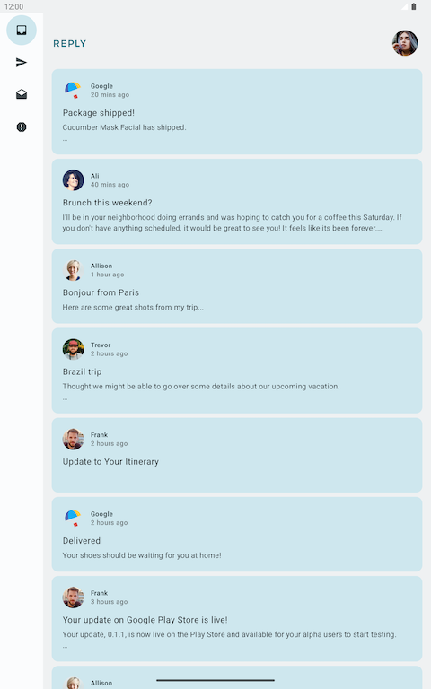

3. 横表示のタブレット モードでアプリを検査します。

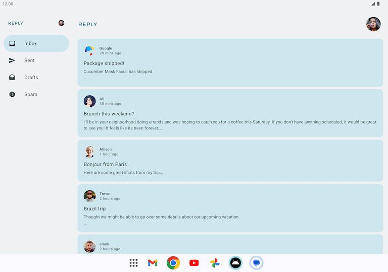

タブレット画面の表示は横長であることに注意してください。この向きは機能的には問題ありませんが、大画面のスペースを最大限に活用できてはいません。次はこれに対処しましょう。

#### 大画面用に設計する

タブレットでこのアプリを見たとき、デザインが悪く、魅力的でないと思ったのではないでしょうか。そうです。このレイアウトは大画面での使用に適したデザインになっていません。

タブレットや折りたたみ式などの大画面向けに設計する際には、ユーザーの使い勝手や、ユーザーの指と画面との距離を考慮する必要があります。モバイル デバイスの場合、ユーザーの指は画面のほとんどの場所に簡単に届くため、インタラクティブ要素（ボタンやナビゲーション要素など）の位置はそれほど重要ではありません。しかし、大画面の場合、重要なインタラクティブ要素が画面の中央に配置されると、指が届きづらくなります。

この Reply アプリで見たように、画面に合わせて UI 要素を広げたり引き伸ばしたりするだけでは、大画面向けのデザインとは言えません。広くなったスペースを活用して、別のユーザー エクスペリエンスを生み出すチャンスです。たとえば、同じ画面に別のレイアウトを追加して別の画面への移動を避けることや、マルチタスクを可能にすることが考えられます。


このデザインにより、ユーザーの生産性が高まり、エンゲージメントが促進されます。ただし、このデザインを採用する前に、まず画面サイズごとに異なるレイアウトを作成する方法を確認してください。

> **注**: 縦向きモードはスマートフォンのメインの向きなのに対して、横向きモードはタブレットのメインの向きです。適応性を考慮して設計する場合、妥当な画面サイズは、デバイスサイズだけでなく、現在のウィンドウ サイズとデバイスの向きの影響を受けます。

### 6. さまざまな画面サイズにレイアウトを合わせる

#### ブレークポイントとは

同じアプリで異なるレイアウトをどのように表示できるのか疑問に思われるかもしれません。簡単に言えば、この Codelab の最初に行ったように、さまざまな状態の条件分岐を使用するということです。

アダプティブ アプリを作成するには、画面サイズに応じてレイアウトを変更する必要があります。レイアウト変更の基準となる測定ポイントをブレークポイントと呼びます。マテリアル デザインで、ほとんどの Android 画面に対応する[独自のブレークポイント範囲](https://m3.material.io/foundations/adaptive-design/large-screens/overview)が作成されました。


このブレークポイント範囲の表は、たとえば、画面サイズが 600 dp 未満のデバイスでアプリが実行されている場合は、モバイル レイアウトが表示される必要があることが示されています。

> **注**: アダプティブ レイアウトにおけるブレークポイントという概念は、[デバッグにおけるブレークポイントという用語](https://developer.android.com/studio/debug#breakPoints)とは別のものです。

#### ウィンドウ サイズクラスを使用する

Compose に導入された `WindowSizeClass` API を使用すると、マテリアル デザインのブレークポイントを簡単に実装できます。

ウィンドウ サイズクラスには、幅と高さの両方について、コンパクト、中程度、拡大の 3 つのカテゴリのサイズがあります。

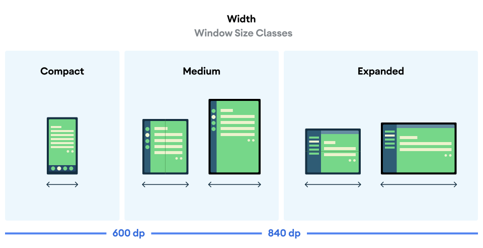 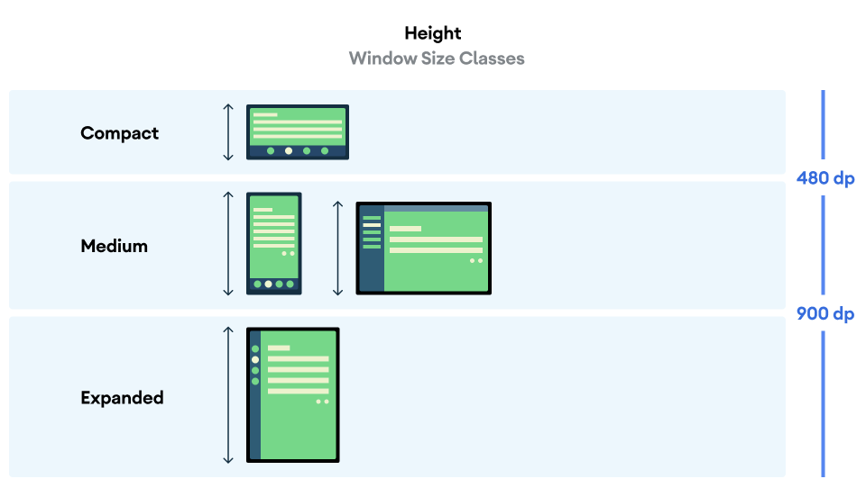

次の手順に沿って、Reply アプリに `WindowSizeClass` API を実装します。

1. `material3-window-size-class` 依存関係をモジュール `build.gradle.kts` ファイルに追加します。

**build.gradle.kts**

```kotlin
...
dependencies {
...
    implementation("androidx.compose.material3:material3-window-size-class")
...
```

2. 依存関係を追加した後、[**Sync Now**] をクリックして Gradle を同期します。

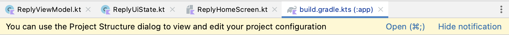

`build.gradle.kts` ファイルが最新の状態になると、随時アプリのウィンドウ サイズを格納する変数を作成できます。

3. `MainActivity.kt` ファイルの `onCreate()` 関数内で、パラメータとして `this` コンテキストを渡して `calculateWindowSizeClass()` メソッドを呼び出した結果を `windowSize` という変数に代入します。
4. 適切な `calculateWindowSizeClass` パッケージをインポートします。

**MainActivity.kt**

```kotlin
...
import androidx.compose.material3.windowsizeclass.calculateWindowSizeClass

...

override fun onCreate(savedInstanceState: Bundle?) {
    super.onCreate(savedInstanceState)

    setContent {
        ReplyTheme {
            val layoutDirection = LocalLayoutDirection.current
            Surface (
               // ...
            ) {
                val windowSize = calculateWindowSizeClass(this)
                ReplyApp()
...  
```

5. `calculateWindowSizeClass` の箇所に赤い下線が引かれ、赤い電球が表示されています。`windowSize` 変数の左側にある赤い電球のアイコンをクリックし、[**Opt in for ‘ExperimentalMaterial3WindowSizeClassApi' on ‘onCreate'**] を選択すると、`onCreate()` メソッドの上にアノテーションが作成されます。

> **注**: `material3-window-size-class` API が現時点でアルファ バージョンで、アノテーションが必要であるため、このエラー メッセージが表示されています。

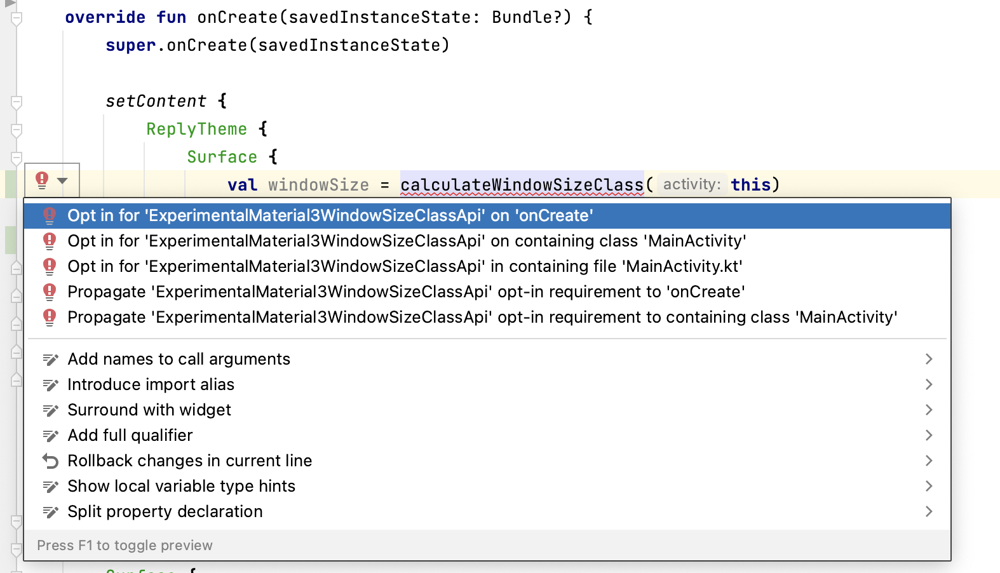

`MainActivity.kt` の `WindowWidthSizeClass` 変数を使用して、さまざまなコンポーザブルに表示するレイアウトを決定できます。この値を受け取るように `ReplyApp` コンポーザブルを準備しましょう。

6. `ReplyApp.kt` ファイルで、`WindowWidthSizeClass` をパラメータとして受け取るように `ReplyApp` コンポーザブルを変更し、適切なパッケージをインポートします。

**ReplyApp.kt**

```kotlin
...
import androidx.compose.material3.windowsizeclass.WindowWidthSizeClass
...

@Composable
fun ReplyApp(
    windowSize: WindowWidthSizeClass,
    modifier: Modifier = Modifier
) {
...  
```

7. `MainActivity.kt` ファイルの `onCreate()` メソッドで、`windowSize` 変数を `ReplyApp` コンポーネントに渡します。

**MainActivity.kt**

```kotlin
...
        setContent {
            ReplyTheme {
                Surface {
                    val windowSize = calculateWindowSizeClass(this)
                    ReplyApp(
                        windowSize = windowSize.widthSizeClass
                    )
...  
```

`windowSize` パラメータに関しては、アプリのプレビューも更新する必要があります。

8. `WindowWidthSizeClass.Compact` を `windowSize` パラメータとしてプレビュー コンポーネントの `ReplyApp` コンポーザブルに渡し、適切なパッケージをインポートします。

**MainActivity.kt**

```kotlin
...
import androidx.compose.material3.windowsizeclass.WindowWidthSizeClass
...

@Preview(showBackground = true)
@Composable
fun ReplyAppCompactPreview() {
    ReplyTheme {
        Surface {
            ReplyApp(
                windowSize = WindowWidthSizeClass.Compact,
            )
        }
    }
}
```

9. 画面のサイズに基づいてアプリのレイアウトを変更するために、`ReplyApp` コンポーザブルに `WindowWidthSizeClass` 値に基づく `when` 文を追加します。

**ReplyApp.kt**

```kotlin
...

@Composable
fun ReplyApp(
    windowSize: WindowWidthSizeClass,
    modifier: Modifier = Modifier
) {
    val viewModel: ReplyViewModel = viewModel()
    val replyUiState = viewModel.uiState.collectAsState().value
    
    when (windowSize) {
        WindowWidthSizeClass.Compact -> {
        }
        WindowWidthSizeClass.Medium -> {
        }
        WindowWidthSizeClass.Expanded -> {
        }
        else -> {
        }
    }
...  
```

これで、`WindowSizeClass` の値を使用してアプリのレイアウトを変更するための基盤が出来上がりました。次のステップでは、各画面サイズでアプリをどのように表示するかを決定します。

### 7. アダプティブ ナビゲーション レイアウトを実装する

#### アダプティブ UI ナビゲーションを実装する

現時点では、すべての画面サイズで[ボトム ナビゲーション](https://developer.android.com/reference/kotlin/androidx/compose/material3/package-summary#NavigationBar(androidx.compose.ui.Modifier,androidx.compose.ui.graphics.Color,androidx.compose.ui.graphics.Color,androidx.compose.ui.unit.Dp,kotlin.Function1))が使用されます。

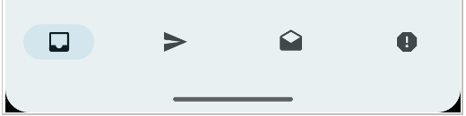

前述のように、大画面になると、この重要なナビゲーション要素にアクセスするのが難しくなるため、理想的とは言えません。幸い、[レスポンシブ UI のナビゲーション](https://developer.android.com/guide/topics/large-screens/navigation-for-responsive-uis#responsive_ui_navigation)では、ウィンドウ サイズクラスごとにナビゲーション要素の推奨パターンがあります。Reply アプリの場合は、以下の要素を実装できます。

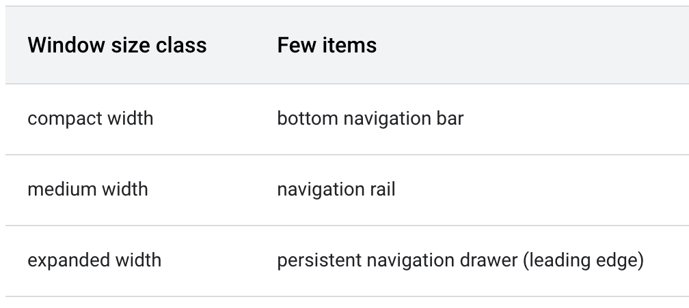

[マテリアル デザイン](https://m3.material.io/components/navigation-rail/overview)のもう一つのナビゲーション コンポーネントである[ナビゲーション レール](https://developer.android.com/reference/kotlin/androidx/compose/material3/NavigationRail.composable#NavigationRail(androidx.compose.ui.Modifier,androidx.compose.ui.graphics.Color,androidx.compose.ui.graphics.Color,kotlin.Function1,androidx.compose.foundation.layout.WindowInsets,kotlin.Function1))では、コンパクトなナビゲーションを選択可能で、アプリの横から主要な目的にアクセスできるようになります。


同様に、[永続 / 固定ナビゲーション ドロワー](https://developer.android.com/reference/kotlin/androidx/compose/material3/PermanentNavigationDrawer.composable#PermanentNavigationDrawer(kotlin.Function0,androidx.compose.ui.Modifier,kotlin.Function0))も[マテリアル デザイン](https://m3.material.io/components/navigation-drawer/overview)の一つで、大画面でも人間工学的に基づいた操作性が得られます。

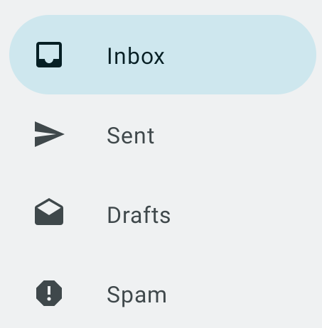

#### ナビゲーション ドロワーを実装する

拡大画面用のナビゲーション ドロワーを作成するために、`navigationType` パラメータを使用します。以下の手順に沿って進めます。

1. ナビゲーション要素の種類を表現するために、`ui` ディレクトリにある新しいパッケージ `utils` に新しいファイル `WindowStateUtils.kt` を作成します。
2. ナビゲーション要素の種類を表す `Enum` クラスを追加します。

**WindowStateUtils.kt**

```kotlin
package com.example.reply.ui.utils

enum class ReplyNavigationType {
    BOTTOM_NAVIGATION, NAVIGATION_RAIL, PERMANENT_NAVIGATION_DRAWER
}
 
```

ナビゲーション ドロワーを実装するには、アプリのウィンドウ サイズに基づいてナビゲーション タイプを決定する必要があります。

3. `ReplyApp` コンポーザブルで、`navigationType` 変数を作成し、`when` 文の画面サイズに応じて適切な `ReplyNavigationType` の値を代入します。

**ReplyApp.kt**

```kotlin
...
import com.example.reply.ui.utils.ReplyNavigationType
...
    val navigationType: ReplyNavigationType
    when (windowSize) {
        WindowWidthSizeClass.Compact -> {
            navigationType = ReplyNavigationType.BOTTOM_NAVIGATION
        }
        WindowWidthSizeClass.Medium -> {
            navigationType = ReplyNavigationType.NAVIGATION_RAIL
        }
        WindowWidthSizeClass.Expanded -> {
            navigationType = ReplyNavigationType.PERMANENT_NAVIGATION_DRAWER
        }
        else -> {
            navigationType = ReplyNavigationType.BOTTOM_NAVIGATION
        }
    }
...
 
```

これで `ReplyHomeScreen` コンポーザブルで `navigationType` の値を使用できるようになりました。実際に使用するために、それをコンポーザブルのパラメータにします。

4. `ReplyHomeScreen` コンポーザブルで、`navigationType` をパラメータとして追加します。

**ReplyHomeScreen.kt**

```kotlin
...
@Composable
fun ReplyHomeScreen(
    navigationType: ReplyNavigationType,
    replyUiState: ReplyUiState,
    onTabPressed: (MailboxType) -> Unit,
    onEmailCardPressed: (Email) -> Unit,
    onDetailScreenBackPressed: () -> Unit,
    modifier: Modifier = Modifier
) 

...
 
```

5. `navigationType` を `ReplyHomeScreen` コンポーザブルに渡します。

**ReplyApp.kt**

```kotlin
...
    ReplyHomeScreen(
        navigationType = navigationType,
        replyUiState = replyUiState,
        onTabPressed = { mailboxType: MailboxType ->
            viewModel.updateCurrentMailbox(mailboxType = mailboxType)
            viewModel.resetHomeScreenStates()
        },
        onEmailCardPressed = { email: Email ->
            viewModel.updateDetailsScreenStates(
                email = email
            )
        },
        onDetailScreenBackPressed = {
            viewModel.resetHomeScreenStates()
        },
        modifier = modifier
    )
...
 
```

次に、分岐を作成して、ユーザーが拡張画面でアプリを開いてホーム画面を表示したときに、アプリのコンテンツとともにナビゲーション ドロワーを表示するようにします。

6. `ReplyHomeScreen` コンポーザブルの本体で、`navigationType == ReplyNavigationType.PERMANENT_NAVIGATION_DRAWER && replyUiState.isShowingHomepage` という条件の `if` 文を追加します。

**ReplyHomeScreen.kt**

```kotlin
import androidx.compose.material3.PermanentNavigationDrawer
...
@Composable
fun ReplyHomeScreen(
    navigationType: ReplyNavigationType,
    replyUiState: ReplyUiState,
    onTabPressed: (MailboxType) -> Unit,
    onEmailCardPressed: (Email) -> Unit,
    onDetailScreenBackPressed: () -> Unit,
    modifier: Modifier = Modifier
) {
...
    if (navigationType == ReplyNavigationType.PERMANENT_NAVIGATION_DRAWER
        && replyUiState.isShowingHomepage
    ) {
    }

    if (replyUiState.isShowingHomepage) {
        ReplyAppContent(
            replyUiState = replyUiState,
...
```

7. 永続ドロワーを作成するために、if 文の本体に `PermanentNavigationDrawer` コンポーザブルを作成し、`drawerContent` パラメータの入力として `NavigationDrawerContent` コンポーザブルを追加します。
8. `ReplyAppContent` コンポーザブルを、`PermanentNavigationDrawer` の最後のラムダ引数として追加します。

**ReplyHomeScreen.kt**

```kotlin
...
    if (navigationType == ReplyNavigationType.PERMANENT_NAVIGATION_DRAWER
        && replyUiState.isShowingHomepage
    ) {
        PermanentNavigationDrawer(
            drawerContent = {
                PermanentDrawerSheet(Modifier.width(dimensionResource(R.dimen.drawer_width))) {
                    NavigationDrawerContent(
                        selectedDestination = replyUiState.currentMailbox,
                        onTabPressed = onTabPressed,
                        navigationItemContentList = navigationItemContentList,
                        modifier = Modifier
                            .wrapContentWidth()
                            .fillMaxHeight()
                            .background(MaterialTheme.colorScheme.inverseOnSurface)
                            .padding(dimensionResource(R.dimen.drawer_padding_content))
                    )
                }
            }
        ) {
            ReplyAppContent(
                replyUiState = replyUiState,
                onTabPressed = onTabPressed,
                onEmailCardPressed = onEmailCardPressed,
                navigationItemContentList = navigationItemContentList,
                modifier = modifier
            )
        }
    }

...
```

9. 前のコンポーザブルの本体を使用する `else` 分岐を追加し、拡大以外の画面には以前の分岐をそのまま使用します。

**ReplyHomeScreen.kt**

```kotlin
...
if (navigationType == ReplyNavigationType.PERMANENT_NAVIGATION_DRAWER
        && replyUiState.isShowingHomepage
) {
        PermanentNavigationDrawer(
            drawerContent = {
                PermanentDrawerSheet(Modifier.width(dimensionResource(R.dimen.drawer_width))) {
                    NavigationDrawerContent(
                        selectedDestination = replyUiState.currentMailbox,
                        onTabPressed = onTabPressed,
                        navigationItemContentList = navigationItemContentList,
                        modifier = Modifier
                            .wrapContentWidth()
                            .fillMaxHeight()
                            .background(MaterialTheme.colorScheme.inverseOnSurface)
                            .padding(dimensionResource(R.dimen.drawer_padding_content))
                    )
                }
            }
        ) {
            ReplyAppContent(
                replyUiState = replyUiState,
                onTabPressed = onTabPressed,
                onEmailCardPressed = onEmailCardPressed,
                navigationItemContentList = navigationItemContentList,
                modifier = modifier
            )
        }
    } else {
        if (replyUiState.isShowingHomepage) {
            ReplyAppContent(
                replyUiState = replyUiState,
                onTabPressed = onTabPressed,
                onEmailCardPressed = onEmailCardPressed,
                navigationItemContentList = navigationItemContentList,
                modifier = modifier
            )
        } else {
            ReplyDetailsScreen(
                replyUiState = replyUiState,
                onBackPressed = onDetailScreenBackPressed,
                modifier = modifier
            )
        }
    }
}
...
```

10. アプリを**タブレット** モードで実行します。以下に示す画面が表示されます。


#### ナビゲーション レールを実装する

ナビゲーション ドロワーの実装と同様に、ナビゲーション要素間の切り替えを行うには `navigationType` パラメータを使用する必要があります。

まず、中程度の画面用のナビゲーション レールを追加しましょう。

1. はじめに、`ReplyAppContent` コンポーザブルにパラメータとして `navigationType` を追加します。

**ReplyHomeScreen.kt**

```kotlin
...
@Composable
private fun ReplyAppContent(
    navigationType: ReplyNavigationType,
    replyUiState: ReplyUiState,
    onTabPressed: ((MailboxType) -> Unit),
    onEmailCardPressed: (Email) -> Unit,
    navigationItemContentList: List<NavigationItemContent>,
    modifier: Modifier = Modifier
) {       
... 
```

2. 両方の `ReplyAppContent` コンポーザブルに `navigationType` の値を渡します。

**ReplyHomeScreen.kt**

```kotlin
...
            ReplyAppContent(
                navigationType = navigationType,
                replyUiState = replyUiState,
                onTabPressed = onTabPressed,
                onEmailCardPressed = onEmailCardPressed,
                navigationItemContentList = navigationItemContentList,
                modifier = modifier
            )
        }
    } else {
        if (replyUiState.isShowingHomepage) {
            ReplyAppContent(
                navigationType = navigationType,
                replyUiState = replyUiState,
                onTabPressed = onTabPressed,
                onEmailCardPressed = onEmailCardPressed,
                navigationItemContentList = navigationItemContentList,
                modifier = modifier
            )
... 
```

次に、分岐を追加します。この分岐により、一部のシナリオでナビゲーション レールを表示できるようになります。

3. `ReplyAppContent` コンポーザブル本体の 1 行目で、`ReplyNavigationRail` コンポーザブルを `AnimatedVisibility` コンポーザブルで囲み、`ReplyNavigationType` の値が `NAVIGATION_RAIL` の場合に `visible` パラメータを `true` に設定します。

**ReplyHomeScreen.kt**

```kotlin
...
@Composable
private fun ReplyAppContent(
    navigationType: ReplyNavigationType,
    replyUiState: ReplyUiState,
    onTabPressed: ((MailboxType) -> Unit),
    onEmailCardPressed: (Email) -> Unit,
    navigationItemContentList: List<NavigationItemContent>,
    modifier: Modifier = Modifier
) {
    Box(modifier = modifier) {
        AnimatedVisibility(visible = navigationType == ReplyNavigationType.NAVIGATION_RAIL) {
            ReplyNavigationRail(
                currentTab = replyUiState.currentMailbox,
                onTabPressed = onTabPressed,
navigationItemContentList = navigationItemContentList
            )
        }
        Column(
            modifier = Modifier
                .fillMaxSize()
                .background(
                    MaterialTheme.colorScheme.inverseOnSurface
            )
        ) {
            ReplyListOnlyContent(
                replyUiState = replyUiState,
                onEmailCardPressed = onEmailCardPressed,
                modifier = Modifier.weight(1f)
                    .padding(
                        horizontal = dimensionResource(R.dimen.email_list_only_horizontal_padding)
                    )
            )
            ReplyBottomNavigationBar(
                currentTab = replyUiState.currentMailbox,
                onTabPressed = onTabPressed,
                navigationItemContentList = navigationItemContentList,
                  modifier = Modifier
                      .fillMaxWidth()
            )
        }
    }
}     
... 
```

4. コンポーザブルを正しく配置するために、`ReplyAppContent` の本体にある `AnimatedVisibility` コンポーザブルと `Column` コンポーザブルの両方を `Row` コンポーザブルで囲みます。

**ReplyHomeScreen.kt**

```kotlin
...
@Composable
private fun ReplyAppContent(
    navigationType: ReplyNavigationType,
    replyUiState: ReplyUiState,
    onTabPressed: ((MailboxType) -> Unit),
    onEmailCardPressed: (Email) -> Unit,
    navigationItemContentList: List<NavigationItemContent>,
    modifier: Modifier = Modifier,
) {
    Row(modifier = modifier) {
        AnimatedVisibility(visible = navigationType == ReplyNavigationType.NAVIGATION_RAIL) {
            val navigationRailContentDescription = stringResource(R.string.navigation_rail)
            ReplyNavigationRail(
                currentTab = replyUiState.currentMailbox,
                onTabPressed = onTabPressed,
                navigationItemContentList = navigationItemContentList
            )
        }
        Column(
            modifier = Modifier
                .fillMaxSize()
                .background(MaterialTheme.colorScheme.inverseOnSurface)
        ) {
            ReplyListOnlyContent(
                replyUiState = replyUiState,
                onEmailCardPressed = onEmailCardPressed,
                modifier = Modifier.weight(1f)
                    .padding(
                        horizontal = dimensionResource(R.dimen.email_list_only_horizontal_padding)
                )
            )
            ReplyBottomNavigationBar(
                currentTab = replyUiState.currentMailbox,
                onTabPressed = onTabPressed,
                navigationItemContentList = navigationItemContentList,
                modifier = Modifier
                    .fillMaxWidth()
            )
        }
    }
}

... 
```

最後に、一部のシナリオでボトム ナビゲーションが表示されることを確認しましょう。

5. `ReplyListOnlyContent` コンポーザブルの後で、`ReplyBottomNavigationBar` コンポーザブルを `AnimatedVisibility` コンポーザブルで囲みます。
6. `ReplyNavigationType` の値が `BOTTOM_NAVIGATION` の場合、`visible` パラメータを設定します。

**ReplyHomeScreen.kt**

```kotlin
...
ReplyListOnlyContent(
    replyUiState = replyUiState,
    onEmailCardPressed = onEmailCardPressed,
    modifier = Modifier.weight(1f)
        .padding(
            horizontal = dimensionResource(R.dimen.email_list_only_horizontal_padding)
        )

)
AnimatedVisibility(visible = navigationType == ReplyNavigationType.BOTTOM_NAVIGATION) {
    val bottomNavigationContentDescription = stringResource(R.string.navigation_bottom)
    ReplyBottomNavigationBar(
        currentTab = replyUiState.currentMailbox,
        onTabPressed = onTabPressed,
        navigationItemContentList = navigationItemContentList,
        modifier = Modifier
            .fillMaxWidth()
    )
}

... 
```

7. アプリを**開いた状態の折りたたみ式デバイス**で実行します。以下に示す画面が表示されます。


### 8. 解答コードを取得する

この Codelab の完成したコードをダウンロードするには、以下の git コマンドを使用します。

```
git clone https://github.com/google-developer-training/basic-android-kotlin-compose-training-reply-app.git 
cd basic-android-kotlin-compose-training-reply-app
git checkout nav-update
```

または、リポジトリを ZIP ファイルとしてダウンロードし、Android Studio で開くこともできます。

> **注:**解答コードは、コード リポジトリの `nav-update` ブランチにあります。

解答コードを確認する場合は、[GitHub で表示します](https://github.com/google-developer-training/basic-android-kotlin-compose-training-reply-app/tree/nav-update)。

### 9. まとめ

お疲れさまでした。アダプティブ ナビゲーション レイアウトを実装したことで、Reply アプリをあらゆる画面サイズに適応させることに一歩近づきました。また、さまざまな Android フォーム ファクタを使用するユーザー エクスペリエンスを向上させました。次の Codelab では、アダプティブ コンテンツ レイアウトの実装、テスト、プレビューを行い、アダプティブ アプリを扱うスキルをさらに高めます。

作成したら、#AndroidBasics を付けて、ソーシャル メディアで共有しましょう。

#### **詳細**

- [アダプティブ レイアウトを作成する](https://developer.android.com/jetpack/compose/layouts/adaptive)
- [各種の画面サイズのサポート](https://developer.android.com/guide/topics/large-screens/support-different-screen-sizes)
- [大画面用に設計する](https://m3.material.io/foundations/adaptive-design/large-screens/layout-anatomy)
- [あらゆる画面に対応した Jetnews](https://medium.com/androiddevelopers/jetnews-for-every-screen-4d8e7927752)

## 4. アダプティブ レイアウトでアプリを作成する

<!-- codelab:basic-android-kotlin-compose-adaptive-content-for-large-screens -->
出典: [アダプティブ レイアウトでアプリを作成する](https://developer.android.com/codelabs/basic-android-kotlin-compose-adaptive-content-for-large-screens?hl=ja)（Google Developers, CC BY 4.0）

### 1. はじめに

前の Codelab では、ウィンドウ サイズクラスを使用してダイナミック ナビゲーションを実装することで、Reply アプリをアダプティブに変換する作業を始めました。こうした機能は、あらゆる画面サイズに対応したアプリを構築するための重要な基礎であり、第一歩です。「ダイナミック ナビゲーションを使用してアダプティブ アプリを作成する」Codelab を受講していない場合は、戻ってそこから開始することを強くおすすめします。

この Codelab では、学習したコンセプトを基に、アプリにアダプティブ レイアウトをさらに実装します。実装するアダプティブ レイアウトは、正規レイアウト（大画面ディスプレイでよく使用されるパターンのセット）の一部です。また、堅牢なアプリを迅速に構築するための、他のツールやテストの手法についても学習します。

#### 前提条件

- 「ダイナミック ナビゲーションを使用してアダプティブ アプリを作成する」Codelab を修了している
- クラス、関数、条件文など、Kotlin プログラミングに精通している
- `ViewModel` クラスをよく理解している
- `Composable` 関数をよく理解している
- Jetpack Compose でレイアウトを作成した経験
- デバイスまたはエミュレータでアプリを実行した経験
- `WindowSizeClass` API を使用した経験

#### 学習内容

- Jetpack Compose を使用してリストビュー パターンのアダプティブ レイアウトを作成する方法
- さまざまな画面サイズのプレビューを作成する方法
- 複数の画面サイズのコードをテストする方法

#### 作成するアプリの概要

- 引き続き、あらゆる画面サイズに適応するように Reply アプリを更新します。

完成したアプリの外観は次のようになります。

#### 必要なもの

- インターネットにアクセスできるパソコン、ウェブブラウザ、Android Studio
- GitHub へのアクセス

#### スターター コードをダウンロードする

まず、スターター コードをダウンロードします。

または、GitHub リポジトリのクローンを作成してコードを入手することもできます。

```
$ git clone 
https://github.com/google-developer-training/basic-android-kotlin-compose-training-reply-app.git
$ cd basic-android-kotlin-compose-training-reply-app
$ git checkout nav-update
```

> **注:**スターター コードは、ダウンロードしたリポジトリの `nav-update` ブランチにあります。

スターター コードは [`Reply`](https://github.com/google-developer-training/basic-android-kotlin-compose-training-reply-app/tree/nav-update) GitHub リポジトリで確認できます。

### 2. さまざまな画面サイズのプレビュー

#### さまざまな画面サイズのプレビューを作成する

「ダイナミック ナビゲーションを使用してアダプティブ アプリを作成する」Codelab では、プレビュー コンポーザブルを使用して開発プロセスに役立てる方法を学びました。アダプティブ アプリの場合、複数のプレビューを作成して、さまざまな画面サイズでアプリを表示することをおすすめします。複数のプレビューを使用すると、あらゆる画面サイズに対する変更を一度に確認できます。またプレビューは、コードをレビューする他のデベロッパーにとって、アプリがさまざまな画面サイズに対応していることを確認するうえでも役立ちます。

これまでは、コンパクト画面をサポートするプレビューが 1 つあるだけでした。今度はプレビューを増やします。

中画面と拡大画面のプレビューを追加する手順は次のとおりです。

1. `Preview` アノテーションのパラメータに中程度の `widthDp` 値を設定し、`ReplyApp` コンポーザブルのパラメータとして `WindowWidthSizeClass.Medium` 値を指定することで、中画面のプレビューを追加します。

**MainActivity.kt**

```kotlin
...
@Preview(showBackground = true, widthDp = 700)
@Composable
fun ReplyAppMediumPreview() {
    ReplyTheme {
        Surface {
            ReplyApp(windowSize = WindowWidthSizeClass.Medium)
        }
    }
}
... 
```

2. `Preview` アノテーションのパラメータに大きな `widthDp` 値を設定し、`ReplyApp` コンポーザブルのパラメータとして `WindowWidthSizeClass.Expanded` 値を指定することで、拡大画面用の別のプレビューを追加します。

**MainActivity.kt**

```kotlin
...
@Preview(showBackground = true, widthDp = 1000)
@Composable
fun ReplyAppExpandedPreview() {
    ReplyTheme {
        Surface {
            ReplyApp(windowSize = WindowWidthSizeClass.Expanded)
        }
    }
}
... 
```

3. プレビューを作成すると次のようになります。

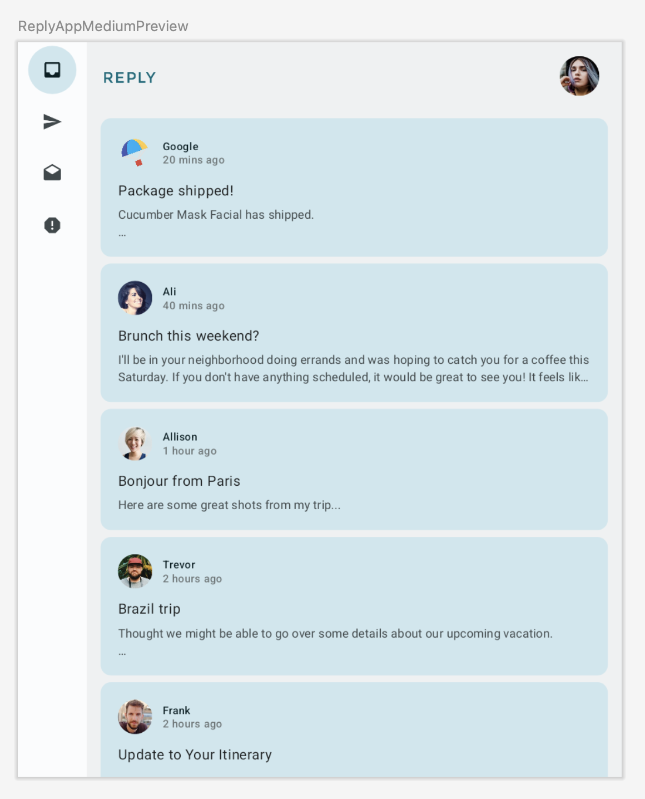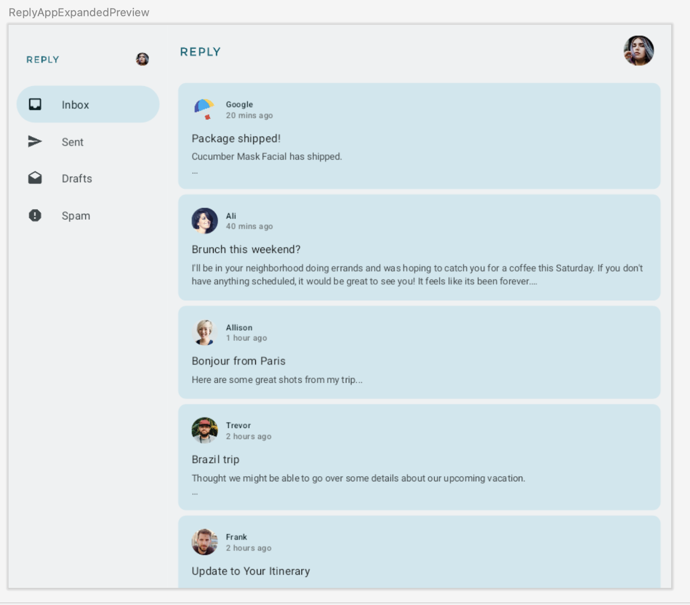

### 3. アダプティブ コンテンツ レイアウトを実装する

#### リスト詳細ビューについて

拡大画面ではコンテンツが引き伸ばされており、利用可能な画面スペースを有効活用できていないことがわかります。


[正規レイアウト](https://m3.material.io/foundations/adaptive-design/canonical-layouts)のいずれかを適用すると、このレイアウトを改善できます。正規レイアウトは、設計と実装の出発点として機能する大画面構成です。アプリ、リストビュー、サポートパネル、フィードの共通要素をどのように整理するかの指針として、3 つのレイアウトを使用できます。各レイアウトは、共通するユースケースとコンポーネントを考慮し、アプリが画面サイズやブレークポイントにどのように適応するかについての期待とユーザーニーズに対応します。

Reply アプリでは、コンテンツをブラウジングして詳細を素早く確認する場合に最適なリスト詳細ビューを実装します。リスト詳細ビューのレイアウトでは、メールリスト画面の横に別のペインを作成してメールの詳細を表示します。このレイアウトでは、利用可能な画面を使用して多くの情報を表示し、アプリの生産性を高めることができます。

#### リスト詳細ビューを実装する

拡大画面のリスト詳細ビューを実装する手順は次のとおりです。

1. さまざまなコンテンツ タイプのレイアウトを表すために、`WindowStateUtils.kt` で、コンテンツ タイプ別に新しい `Enum` クラスを作成します。拡大画面が使用されているときは `LIST_AND_DETAIL` 値を使用し、それ以外の場合は `LIST_ONLY` 値を使用します。

**WindowStateUtils.kt**

```kotlin
...
enum class ReplyContentType {
    LIST_ONLY, LIST_AND_DETAIL
}
... 
```

2. `ReplyApp.kt` で `contentType` 変数を宣言し、さまざまなウィンドウ サイズに適した `contentType` を代入して、画面サイズに応じて適切なコンテンツ タイプが選択されるようにします。

**ReplyApp.kt**

```kotlin
...
import com.example.reply.ui.utils.ReplyContentType
...

    val navigationType: ReplyNavigationType
    val contentType: ReplyContentType

    when (windowSize) {
        WindowWidthSizeClass.Compact -> {
            ...
            contentType = ReplyContentType.LIST_ONLY
        }
        WindowWidthSizeClass.Medium -> {
            ...
            contentType = ReplyContentType.LIST_ONLY
        }
        WindowWidthSizeClass.Expanded -> {
            ...
            contentType = ReplyContentType.LIST_AND_DETAIL
        }
        else -> {
            ...
            contentType = ReplyContentType.LIST_ONLY
        }
    }
... 
```

次に、`contentType` 値を使用すると、`ReplyAppContent` コンポーザブルのレイアウトにさまざまな分岐を作成できます。

3. `ReplyHomeScreen.kt` で、`ReplyHomeScreen` コンポーザブルにパラメータとして `contentType` を追加します。

**ReplyHomeScreen.kt**

```kotlin
...
@OptIn(ExperimentalMaterial3Api::class)
@Composable
fun ReplyHomeScreen(
    navigationType: ReplyNavigationType,
    contentType: ReplyContentType,
    replyUiState: ReplyUiState,
    onTabPressed: (MailboxType) -> Unit,
    onEmailCardPressed: (Email) -> Unit,
    onDetailScreenBackPressed: () -> Unit,
    modifier: Modifier = Modifier
) {
...
```

4. `contentType` 値を `ReplyHomeScreen` コンポーザブルに渡します。

**ReplyApp.kt**

```kotlin
...
    ReplyHomeScreen(
        navigationType = navigationType,
        contentType = contentType,
        replyUiState = replyUiState,
        onTabPressed = { mailboxType: MailboxType ->
            viewModel.updateCurrentMailbox(mailboxType = mailboxType)
            viewModel.resetHomeScreenStates()
        },
        onEmailCardPressed = { email: Email ->
            viewModel.updateDetailsScreenStates(
                email = email
            )
        },
        onDetailScreenBackPressed = {
            viewModel.resetHomeScreenStates()
        },
        modifier = modifier
    )

... 
```

5. `contentType` を `ReplyAppContent` コンポーザブルのパラメータとして追加します。

**ReplyHomeScreen.kt**

```kotlin
...
@Composable
private fun ReplyAppContent(
    navigationType: ReplyNavigationType,
    contentType: ReplyContentType,
    replyUiState: ReplyUiState,
    onTabPressed: ((MailboxType) -> Unit),
    onEmailCardPressed: (Email) -> Unit,
    navigationItemContentList: List<NavigationItemContent>,
    modifier: Modifier = Modifier
) {
... 
```

6. 2 つの `ReplyAppContent` コンポーザブルに `contentType` 値を渡します。

**ReplyHomeScreen.kt**

```kotlin
...
            ReplyAppContent(
                navigationType = navigationType,
                contentType = contentType,
                replyUiState = replyUiState,
                onTabPressed = onTabPressed,
                onEmailCardPressed = onEmailCardPressed,
                navigationItemContentList = navigationItemContentList,
                modifier = modifier
            )
        }
    } else {
        if (replyUiState.isShowingHomepage) {
            ReplyAppContent(
                navigationType = navigationType,
                contentType = contentType,
                replyUiState = replyUiState,
                onTabPressed = onTabPressed,
                onEmailCardPressed = onEmailCardPressed,
                navigationItemContentList = navigationItemContentList,
                modifier = modifier
            )
        } else {
            ReplyDetailsScreen(
                replyUiState = replyUiState,
                isFullScreen = true,
                onBackButtonClicked = onDetailScreenBackPressed,
                modifier = modifier
            )
        }
    }
... 
```

`contentType` が `LIST_AND_DETAIL` の場合はリストと詳細の完全な画面を表示し、`contentType` が `LIST_ONLY` の場合はリストのみのメール コンテンツを表示しましょう。

7. `ReplyHomeScreen.kt` で、`ReplyAppContent` コンポーザブルに `if/else` ステートメントを追加して、`contentType` 値が `LIST_AND_DETAIL` のときに `ReplyListAndDetailContent` コンポーザブルを表示し、`else` ブランチで `ReplyListOnlyContent` コンポーザブルを表示します。

**ReplyHomeScreen.kt**

```kotlin
...
        Column(
            modifier = modifier
                .fillMaxSize()
                .background(MaterialTheme.colorScheme.inverseOnSurface)
        ) {
            if (contentType == ReplyContentType.LIST_AND_DETAIL) {
                ReplyListAndDetailContent(
                    replyUiState = replyUiState,
                    onEmailCardPressed = onEmailCardPressed,
                    modifier = Modifier.weight(1f)
                )
            } else {
                ReplyListOnlyContent(
                    replyUiState = replyUiState,
                    onEmailCardPressed = onEmailCardPressed,
                    modifier = Modifier.weight(1f)
                        .padding(
                            horizontal = dimensionResource(R.dimen.email_list_only_horizontal_padding)
                        )
                )
            }
            AnimatedVisibility(visible = navigationType == ReplyNavigationType.BOTTOM_NAVIGATION) {
                ReplyBottomNavigationBar(
                    currentTab = replyUiState.currentMailbox,
                    onTabPressed = onTabPressed,
                    navigationItemContentList = navigationItemContentList
                )
            }
        }
... 
```

8. ユーザーが拡大ビューを使用している場合は詳細ビューに移動する必要がないため、`replyUiState.isShowingHomepage` 条件を削除して[固定的なナビゲーション ドロワー](https://developer.android.com/reference/kotlin/androidx/compose/material3/package-summary#NavigationRail(androidx.compose.ui.Modifier,androidx.compose.ui.graphics.Color,androidx.compose.ui.graphics.Color,kotlin.Function1,kotlin.Function1))を表示します。

**ReplyHomeScreen.kt**

```kotlin
...
    if (navigationType == ReplyNavigationType.PERMANENT_NAVIGATION_DRAWER) {
        PermanentNavigationDrawer(
            drawerContent = {
                PermanentDrawerSheet(Modifier.width(dimensionResource(R.dimen.drawer_width))) {
                    NavigationDrawerContent(
                        selectedDestination = replyUiState.currentMailbox,
                        onTabPressed = onTabPressed,
                        navigationItemContentList = navigationItemContentList,
                        modifier = Modifier
                            .wrapContentWidth()
                            .fillMaxHeight()
                            .background(MaterialTheme.colorScheme.inverseOnSurface)
                            .padding(dimensionResource(R.dimen.drawer_padding_content))
                    )
                }
            }
        ) {

... 
```

9. タブレット モードでアプリを実行すると、以下の画面が表示されます。

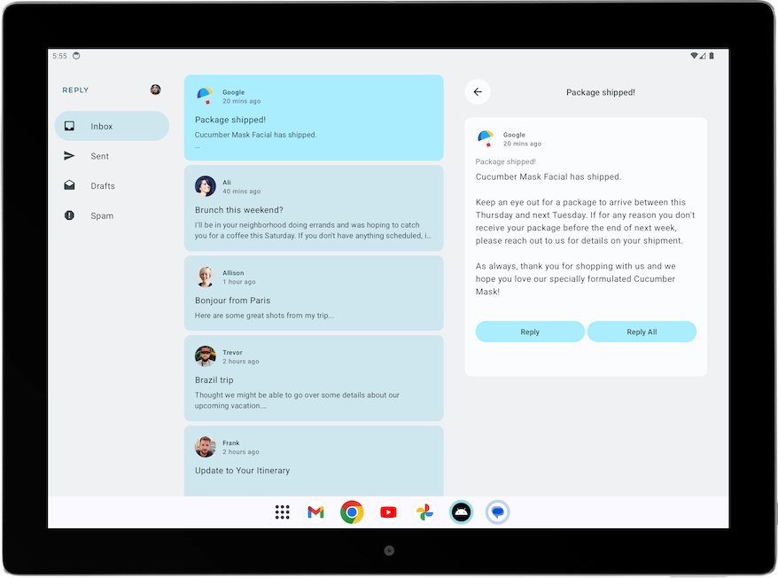

#### リストの詳細ビューの UI 要素を改善する

現在、アプリはホーム画面に拡大画面の詳細ペインを表示しています。

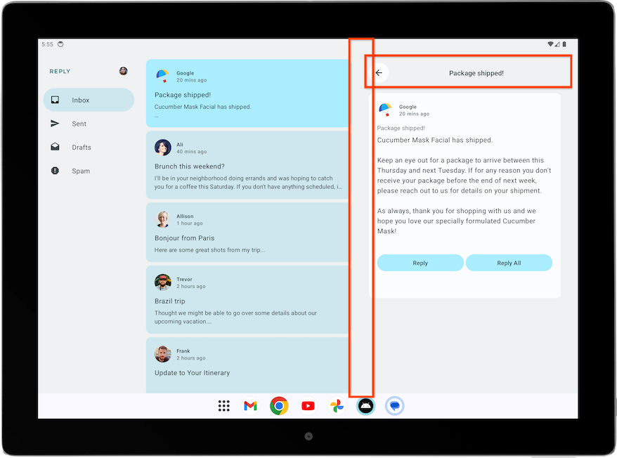

しかし、この画面は単体の詳細画面用にデザインされているため、戻るボタン、件名ヘッダー、追加のパディングなど、余分な要素があります。これは少し調整するだけで改善できます。

拡大ビューの詳細画面を改善する手順は次のとおりです。

10. `ReplyDetailsScreen.kt` で、`ReplyDetailsScreen` コンポーザブルに `Boolean` パラメータとして `isFullScreen` 変数を追加します。

この追加により、コンポーザブルを単体で使用する場合とホーム画面で使用する場合で差異を生じさせることができます。

**ReplyDetailsScreen.kt**

```kotlin
...
@Composable
fun ReplyDetailsScreen(
    replyUiState: ReplyUiState,
    onBackPressed: () -> Unit,
    modifier: Modifier = Modifier,
    isFullScreen: Boolean = false
) {
... 
```

11. `ReplyDetailsScreen` コンポーザブル内で、`ReplyDetailsScreenTopBar` コンポーザブルを `if` ステートメントでラップし、アプリが全画面表示されたときだけ表示されるようにします。

**ReplyDetailsScreen.kt**

```kotlin
...
    LazyColumn(
        modifier = modifier
            .fillMaxSize()
            .background(color = MaterialTheme.colorScheme.inverseOnSurface)
            .padding(top = dimensionResource(R.dimen.detail_card_list_padding_top))
    ) {
        item {
            if (isFullScreen) {
                ReplyDetailsScreenTopBar(
                    onBackPressed,
                    replyUiState,
                    Modifier
                        .fillMaxWidth()
                        .padding(bottom = dimensionResource(R.dimen.detail_topbar_padding_bottom))
                    )
                )
            }

... 
```

パディングを追加できるようになりました。`ReplyEmailDetailsCard` コンポーザブルに必要なパディングは、全画面として使用するかどうかによって異なります。拡大画面で `ReplyEmailDetailsCard` を他のコンポーザブルと使用すると、他のコンポーザブルからパディングが追加されます。

12. `isFullScreen` 値を `ReplyEmailDetailsCard` コンポーザブルに渡します。画面が全画面表示の場合は左右パディング `R.dimen.detail_card_outer_padding_horizontal` の修飾子を渡し、それ以外の場合は右パディング `R.dimen.detail_card_outer_padding_horizontal` の修飾子を渡します。

**ReplyDetailsScreen.kt**

```kotlin
...
        item {
            if (isFullScreen) {
                ReplyDetailsScreenTopBar(
                    onBackPressed,
                    replyUiState,
                    Modifier
                        .fillMaxWidth()
                        .padding(bottom = dimensionResource(R.dimen.detail_topbar_padding_bottom))
                    )
                )
            }
            ReplyEmailDetailsCard(
                email = replyUiState.currentSelectedEmail,
                mailboxType = replyUiState.currentMailbox,
                isFullScreen = isFullScreen,
                modifier = if (isFullScreen) {
                    Modifier.padding(horizontal = dimensionResource(R.dimen.detail_card_outer_padding_horizontal))
                } else {
                    Modifier.padding(end = dimensionResource(R.dimen.detail_card_outer_padding_horizontal))
                }
            )
        }
... 
```

13. `ReplyEmailDetailsCard` コンポーザブルにパラメータとして `isFullScreen` 値を追加します。

**ReplyDetailsScreen.kt**

```kotlin
...
@OptIn(ExperimentalMaterial3Api::class)
@Composable
private fun ReplyEmailDetailsCard(
    email: Email,
    mailboxType: MailboxType,
    modifier: Modifier = Modifier,
    isFullScreen: Boolean = false
) {
... 
```

14. `ReplyEmailDetailsCard` コンポーザブル内では、アプリが全画面表示でない場合にのみメールの件名テキストを表示します。これは、全画面レイアウトではすでにメールの件名をヘッダーとして表示しているためです。全画面表示の場合は、高さ `R.dimen.detail_content_padding_top` のスペーサーを追加します。

**ReplyDetailsScreen.kt**

```kotlin
...
Column(
    modifier = Modifier
        .fillMaxWidth()
        .padding(dimensionResource(R.dimen.detail_card_inner_padding))
) {
    DetailsScreenHeader(
        email,
        Modifier.fillMaxWidth()
    )
    if (isFullScreen) {
        Spacer(modifier = Modifier.height(dimensionResource(R.dimen.detail_content_padding_top)))
    } else {
        Text(
            text = stringResource(email.subject),
            style = MaterialTheme.typography.bodyMedium,
            color = MaterialTheme.colorScheme.outline,
            modifier = Modifier.padding(
                top = dimensionResource(R.dimen.detail_content_padding_top),
                bottom = dimensionResource(R.dimen.detail_expanded_subject_body_spacing)
            ),
        )
    }
    Text(
        text = stringResource(email.body),
        style = MaterialTheme.typography.bodyLarge,
        color = MaterialTheme.colorScheme.onSurfaceVariant,
    )
    DetailsScreenButtonBar(mailboxType, displayToast)
}

... 
```

15. `ReplyHomeScreen.kt` の `ReplyHomeScreen` コンポーザブル内で、`ReplyDetailsScreen` コンポーザブルを単独で作成するとき、`isFullScreen` パラメータに `true` 値を渡します。

**ReplyHomeScreen.kt**

```kotlin
...
        } else {
            ReplyDetailsScreen(
                replyUiState = replyUiState,
                isFullScreen = true,
                onBackPressed = onDetailScreenBackPressed,
                modifier = modifier
            )
        }
... 
```

16. タブレット モードでアプリを実行すると、次のレイアウトが表示されます。

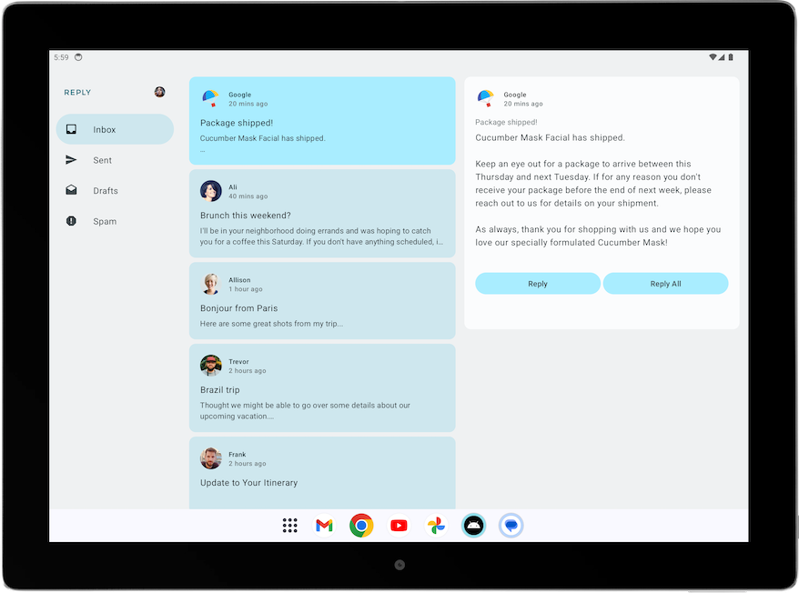

#### リストの詳細ビューの戻る操作の処理を調整する

拡大画面では、`ReplyDetailsScreen` に移動する必要はまったくありません。代わりに、ユーザーが戻るボタンを選択したときにアプリを閉じるようにします。そのため、戻る操作のハンドラを調整する必要があります。

`activity.finish()` 関数を `ReplyListAndDetailContent` コンポーザブル内の `ReplyDetailsScreen` コンポーザブルの `onBackPressed` パラメータとして渡すことで、戻る操作のハンドラを変更します。

**ReplyHomeContent.kt**

```kotlin
...
import android.app.Activity
import androidx.compose.ui.platform.LocalContext
...
        val activity = LocalContext.current as Activity
        ReplyDetailsScreen(
            replyUiState = replyUiState,
            modifier = Modifier.weight(1f),
            onBackPressed = { activity.finish() }
        )
... 
```

### 4. さまざまな画面サイズについて確認する

#### 大画面アプリの品質に関するガイドライン

Android で一貫性のある優れたユーザー エクスペリエンスを実現するには、品質を念頭に置いてアプリを構築し、テストすることが重要です。アプリの品質を向上させる方法については、[アプリの中核品質](https://developer.android.com/docs/quality-guidelines/core-app-quality)ガイドラインをご覧ください。

すべてのフォーム ファクタに適した高品質アプリを作成するには、[大画面アプリの品質](https://developer.android.com/docs/quality-guidelines/large-screen-app-quality)ガイドラインをご確認ください。また、アプリは [Tier 3 - 大画面対応](https://developer.android.com/docs/quality-guidelines/large-screen-app-quality#large_screen_ready)の要件も満たす必要があります。

#### アプリの大画面対応を手動でテストする

アプリの品質に関するガイドラインでは、アプリの品質を確認するための、テストデバイスの推奨事項と手順が示されています。Reply アプリに関連するテスト例を見てみましょう。

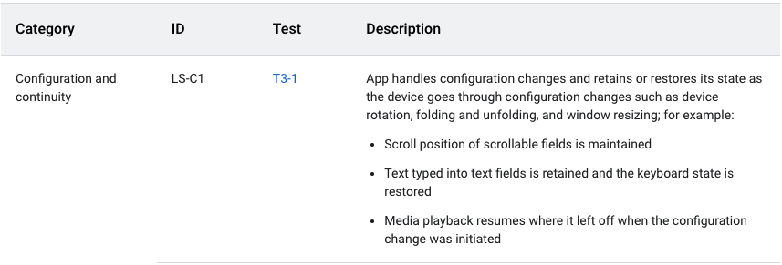

上記のアプリの品質に関するガイドラインでは、構成の変更後にアプリの状態を保持または復元することが求められています。またこのガイドラインには、下図のように、アプリのテスト方法も記載されています。

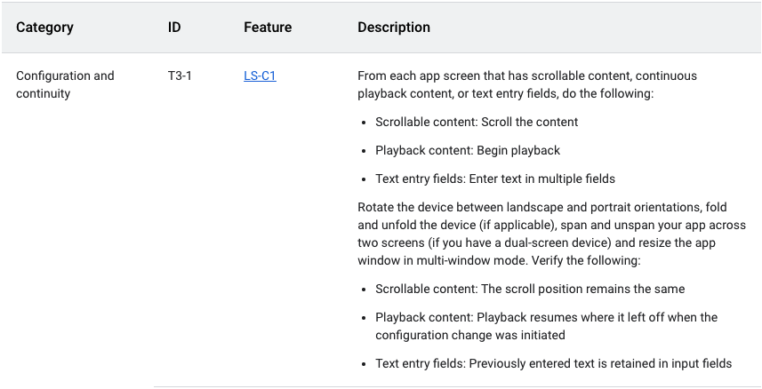

Reply アプリの構成の継続性を手動でテストする手順は次のとおりです。

1. Reply アプリを中サイズのデバイスで実行するか、サイズ変更可能なエミュレータを使用している場合は、開いた状態の折りたたみ式モードで実行します。
2. エミュレータで [**自動回転**] が [**ON**] に設定されていることを確認します。

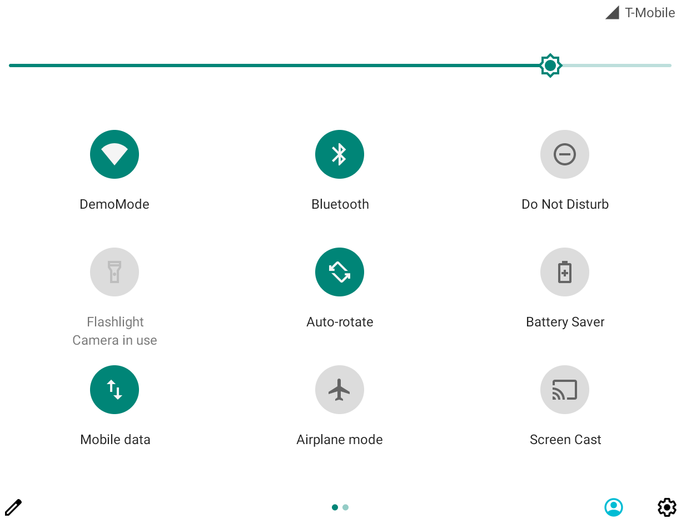

3. メールリストを下にスクロールします。

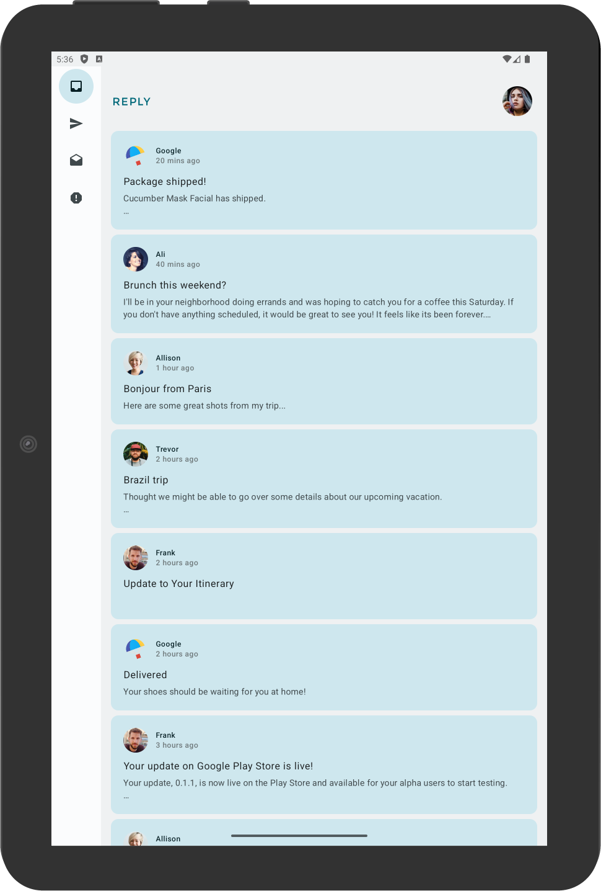

4. メールカードをクリックします。たとえば、**Ali** からのメールを開きます。

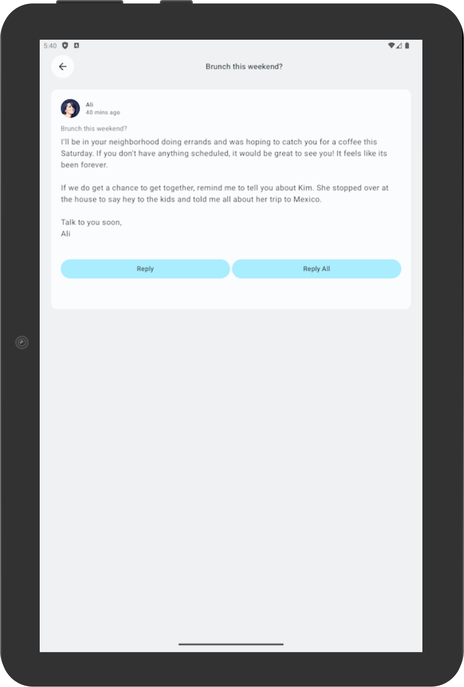

5. デバイスを回転させても、縦向きの状態で選択したメールが引き続き選択されていることを確認します。この例では、Ali からのメールが引き続き表示されています。

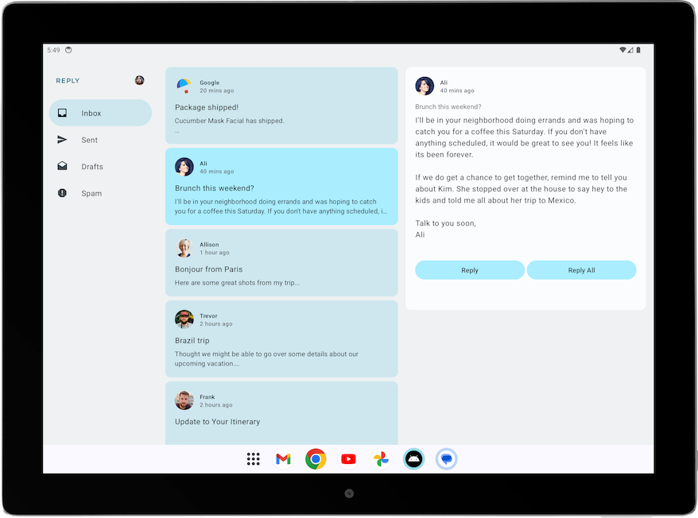

6. 縦向きに戻して、同じメールが引き続きアプリに表示されることを確認します。


### 5. アダプティブ アプリの自動テストを追加する

#### コンパクト画面のテストを構成する

「Cupcake アプリをテストする」Codelab では、UI テストの作成について学習しました。ここでは、さまざまな画面サイズ向けに固有のテストを作成する方法を学習しましょう。

Reply アプリでは、画面サイズに応じて異なるナビゲーション要素を使用します。たとえば、ユーザーが拡大画面を表示したときは固定的なナビゲーション ドロワーを表示することが想定されます。さまざまな画面サイズについて、ボトム ナビゲーション、ナビゲーション レール、ナビゲーション ドロワーなど、さまざまなナビゲーション要素の存在を確認するためのテストを作成すると便利です。

コンパクト画面について、ボトム ナビゲーション要素の存在を確認するためのテストを作成する手順は次のとおりです。

1. テスト ディレクトリで、`ReplyAppTest.kt` という新しい Kotlin クラスを作成します。
2. `ReplyAppTest` クラスで、`createAndroidComposeRule` を使用し `ComponentActivity` を型パラメータとして渡すテストルールを作成します。空のアクティビティへのアクセスには、`MainActivity` ではなく `ComponentActivity` が使用されます。

**ReplyAppTest.kt**

```kotlin
...
class ReplyAppTest {

    @get:Rule
    val composeTestRule = createAndroidComposeRule<ComponentActivity>()
...
```

画面上のナビゲーション要素を区別するには、`ReplyBottomNavigationBar` コンポーザブルに `testTag` を追加します。

3. **Navigation Bottom** の文字列リソースを定義します。

**strings.xml**

```kotlin
...
<resources>
...
    <string name="navigation_bottom">Navigation Bottom</string>
...
</resources>
```

4. `ReplyBottomNavigationBar` コンポーザブルで、`Modifier` の `testTag` メソッドの `testTag` 引数として文字列名を追加します。

**ReplyHomeScreen.kt**

```kotlin
...
val bottomNavigationContentDescription = stringResource(R.string.navigation_bottom)
ReplyBottomNavigationBar(
    ...
    modifier = Modifier
        .fillMaxWidth()
        .testTag(bottomNavigationContentDescription)
)
...
```

5. `ReplyAppTest` クラスで、コンパクト サイズ画面をテストするテスト関数を作成します。`composeTestRule` のコンテンツを `ReplyApp` コンポーザブルで設定し、`windowSize` 引数として `WindowWidthSizeClass.Compact` を渡します。

> **注:**テスト可能なコードを作成するには、`WindowWidthSizeClass` を引数として受け入れるコンポーザブルを追加することをおすすめします。

**ReplyAppTest.kt**

```kotlin
...
    @Test
    fun compactDevice_verifyUsingBottomNavigation() {
        // Set up compact window
        composeTestRule.setContent {
            ReplyApp(
                windowSize = WindowWidthSizeClass.Compact
            )
        }
    }
```

6. テストタグでボトム ナビゲーション要素の存在をアサートします。`composeTestRule` で拡張関数 `onNodeWithTagForStringId` を呼び出し、ナビゲーションの下部の文字列を渡して `assertExists()` メソッドを呼び出します。

**ReplyAppTest.kt**

```kotlin
...
    @Test
    fun compactDevice_verifyUsingBottomNavigation() {
        // Set up compact window
        composeTestRule.setContent {
            ReplyApp(
                windowSize = WindowWidthSizeClass.Compact
            )
        }
        // Bottom navigation is displayed
        composeTestRule.onNodeWithTagForStringId(
            R.string.navigation_bottom
        ).assertExists()
    }
```

7. テストを実行し、合格することを確認します。

#### 中画面と拡大画面のテストを構成する

コンパクト画面のテストが正常に作成できたところで、今度は中画面と拡大画面のテストを作成してみましょう。

中画面と拡大画面について、ナビゲーション レールと固定的なナビゲーション ドロワーの存在を確認するためのテストを作成する手順は次のとおりです。

1. 後でテストタグとして使用する **Navigation Rail** の文字列リソースを定義します。

**strings.xml**

```kotlin
...
<resources>
...
    <string name="navigation_rail">Navigation Rail</string>
...
</resources>
```

2. `PermanentNavigationDrawer` コンポーザブルの `Modifier` を通じて、文字列をテストタグとして渡します。

**ReplyHomeScreen.kt**

```kotlin
...
    val navigationDrawerContentDescription = stringResource(R.string.navigation_drawer)
        PermanentNavigationDrawer(
...
modifier = Modifier.testTag(navigationDrawerContentDescription)
)
...
```

3. `ReplyNavigationRail` コンポーザブルの `Modifier` を通じて、文字列をテストタグとして渡します。

**ReplyHomeScreen.kt**

```kotlin
...
val navigationRailContentDescription = stringResource(R.string.navigation_rail)
ReplyNavigationRail(
    ...
    modifier = Modifier
        .testTag(navigationRailContentDescription)
)
...
```

4. 中画面にナビゲーション レール要素が存在することを確認するテストを追加します。

**ReplyAppTest.kt**

```kotlin
...
@Test
fun mediumDevice_verifyUsingNavigationRail() {
    // Set up medium window
    composeTestRule.setContent {
        ReplyApp(
            windowSize = WindowWidthSizeClass.Medium
        )
    }
    // Navigation rail is displayed
    composeTestRule.onNodeWithTagForStringId(
        R.string.navigation_rail
    ).assertExists()
}
```

5. 拡大画面にナビゲーション ドロワー要素が存在することを確認するテストを追加します。

**ReplyAppTest.kt**

```kotlin
...
@Test
fun expandedDevice_verifyUsingNavigationDrawer() {
    // Set up expanded window
    composeTestRule.setContent {
        ReplyApp(
            windowSize = WindowWidthSizeClass.Expanded
        )
    }
    // Navigation drawer is displayed
    composeTestRule.onNodeWithTagForStringId(
        R.string.navigation_drawer
    ).assertExists()
}
```

6. タブレット エミュレータを使用して、またはサイズ変更可能なエミュレータをタブレット モードで使用して、テストを実行します。
7. すべてのテストを実行し、合格することを確認します。

#### コンパクト画面の構成変更をテストする

構成変更は、アプリのライフサイクルで頻繁に発生します。たとえば、画面の向きを縦向きから横向きに変更すると構成変更が発生します。構成変更が発生した場合、アプリが状態を保持しているかどうかをテストすることが重要です。次に、構成変更をシミュレートするテストを作成して、アプリがコンパクト画面で状態を保持しているかどうかをテストします。

コンパクト画面で構成変更をテストするには:

1. テスト ディレクトリで、`ReplyAppStateRestorationTest.kt` という新しい Kotlin クラスを作成します。
2. `ReplyAppStateRestorationTest` クラスで、`createAndroidComposeRule` を使用し `ComponentActivity` を型パラメータとして渡すテストルールを作成します。

**ReplyAppStateRestorationTest.kt**

```kotlin
...
class ReplyAppStateRestorationTest {

    /**
     * Note: To access to an empty activity, the code uses ComponentActivity instead of
     * MainActivity.
     */
    @get:Rule
    val composeTestRule = createAndroidComposeRule<ComponentActivity>()
}
...
```

3. 構成変更後もコンパクト画面でメールが選択されていることを確認するテスト関数を作成します。

**ReplyAppStateRestorationTest.kt**

```kotlin
...
@Test
fun compactDevice_selectedEmailEmailRetained_afterConfigChange() {
    
}
...
```

構成変更をテストするには、`StateRestorationTester` を使用する必要があります。

4. `StateRestorationTester` に引数として `composeTestRule` を渡し、`stateRestorationTester` をセットアップします。
5. `setContent()` を `ReplyApp` コンポーザブルとともに使用し、`windowSize` 引数として `WindowWidthSizeClass.Compact` を渡します。

**ReplyAppStateRestorationTest.kt**

```kotlin
...
@Test
fun compactDevice_selectedEmailEmailRetained_afterConfigChange() {
    // Setup compact window
    val stateRestorationTester = StateRestorationTester(composeTestRule)
    stateRestorationTester.setContent { ReplyApp(windowSize = WindowWidthSizeClass.Compact) }

}
...
```

6. アプリに 3 通目のメールが表示されていることを確認します。`composeTestRule` で `assertIsDisplayed()` メソッドを使用し、3 通目のメールのテキストを探します。

**ReplyAppStateRestorationTest.kt**

```kotlin
...
@Test
fun compactDevice_selectedEmailEmailRetained_afterConfigChange() {
    // Setup compact window
    val stateRestorationTester = StateRestorationTester(composeTestRule)
    stateRestorationTester.setContent { ReplyApp(windowSize = WindowWidthSizeClass.Compact) }

    // Given third email is displayed
    composeTestRule.onNodeWithText(
        composeTestRule.activity.getString(LocalEmailsDataProvider.allEmails[2].body)
    ).assertIsDisplayed()
}
...
```

7. メールの件名をクリックして、メールの詳細画面に移動します。`performClick()` メソッドを使用して移動します。

**ReplyAppStateRestorationTest.kt**

```kotlin
...
@Test
fun compactDevice_selectedEmailEmailRetained_afterConfigChange() {
    // Setup compact window
    val stateRestorationTester = StateRestorationTester(composeTestRule)
    stateRestorationTester.setContent { ReplyApp(windowSize = WindowWidthSizeClass.Compact) }

    // Given third email is displayed
    composeTestRule.onNodeWithText(
        composeTestRule.activity.getString(LocalEmailsDataProvider.allEmails[2].body)
    ).assertIsDisplayed()

    // Open detailed page
    composeTestRule.onNodeWithText(
        composeTestRule.activity.getString(LocalEmailsDataProvider.allEmails[2].subject)
    ).performClick()
}
...
```

8. 詳細画面に 3 通目のメールが表示されていることを確認します。戻るボタンの存在をアサートして、アプリが詳細画面を表示していること、3 通目のメールのテキストが表示されていることを確認します。

**ReplyAppStateRestorationTest.kt**

```kotlin
...
@Test
fun compactDevice_selectedEmailEmailRetained_afterConfigChange() {
    ...
    // Open detailed page
    composeTestRule.onNodeWithText(
        composeTestRule.activity.getString(LocalEmailsDataProvider.allEmails[2].subject)
    ).performClick()

    // Verify that it shows the detailed screen for the correct email
    composeTestRule.onNodeWithContentDescriptionForStringId(
        R.string.navigation_back
    ).assertExists()
    composeTestRule.onNodeWithText(
}
...
```

9. `stateRestorationTester.emulateSavedInstanceStateRestore()` を使用して構成変更をシミュレートします。

**ReplyAppStateRestorationTest.kt**

```kotlin
...
@Test
fun compactDevice_selectedEmailEmailRetained_afterConfigChange() {
    ...
    // Verify that it shows the detailed screen for the correct email
    composeTestRule.onNodeWithContentDescriptionForStringId(
        R.string.navigation_back
    ).assertExists()
    composeTestRule.onNodeWithText(
        composeTestRule.activity.getString(LocalEmailsDataProvider.allEmails[2].body)
    ).assertExists()

    // Simulate a config change
    stateRestorationTester.emulateSavedInstanceStateRestore()
}
...
```

10. 詳細画面に 3 通目のメールが表示されていることを再度確認します。戻るボタンの存在をアサートして、アプリが詳細画面を表示していること、3 通目のメールのテキストが表示されていることを確認します。

**ReplyAppStateRestorationTest.kt**

```kotlin
...
@Test
fun compactDevice_selectedEmailEmailRetained_afterConfigChange() {
    // Setup compact window
    val stateRestorationTester = StateRestorationTester(composeTestRule)
    stateRestorationTester.setContent { ReplyApp(windowSize = WindowWidthSizeClass.Compact) }

    // Given third email is displayed
    composeTestRule.onNodeWithText(
        composeTestRule.activity.getString(LocalEmailsDataProvider.allEmails[2].body)
    ).assertIsDisplayed()

    // Open detailed page
    composeTestRule.onNodeWithText(
        composeTestRule.activity.getString(LocalEmailsDataProvider.allEmails[2].subject)
    ).performClick()

    // Verify that it shows the detailed screen for the correct email
    composeTestRule.onNodeWithContentDescriptionForStringId(
        R.string.navigation_back
    ).assertExists()
    composeTestRule.onNodeWithText(
        composeTestRule.activity.getString(LocalEmailsDataProvider.allEmails[2].body)
    ).assertExists()

    // Simulate a config change
    stateRestorationTester.emulateSavedInstanceStateRestore()

    // Verify that it still shows the detailed screen for the same email
    composeTestRule.onNodeWithContentDescriptionForStringId(
        R.string.navigation_back
    ).assertExists()
    composeTestRule.onNodeWithText(
        composeTestRule.activity.getString(LocalEmailsDataProvider.allEmails[2].body)
    ).assertExists()
}

...
```

11. スマートフォン エミュレータで、またはサイズ変更可能なエミュレータのスマートフォン モードで、テストを実行します。
12. テストに合格することを確認します。

#### 拡大画面の構成変更をテストする

構成変更をシミュレートし、適切な WindowWidthSizeClass を渡すことで、拡大画面の構成変更をテストする手順は次のとおりです。

1. 構成変更後も詳細画面でメールが選択されていることを確認するテスト関数を作成します。

**ReplyAppStateRestorationTest.kt**

```kotlin
...
@Test
fun expandedDevice_selectedEmailEmailRetained_afterConfigChange() {

}
...
```

構成変更をテストするには、`StateRestorationTester` を使用する必要があります。

2. `StateRestorationTester` に引数として `composeTestRule` を渡し、`stateRestorationTester` をセットアップします。
3. `setContent()` を `ReplyApp` コンポーザブルとともに使用し、`windowSize` 引数として `WindowWidthSizeClass.Expanded` を渡します。

**ReplyAppStateRestorationTest.kt**

```kotlin
...
@Test
fun expandedDevice_selectedEmailEmailRetained_afterConfigChange() {
    // Setup expanded window
    val stateRestorationTester = StateRestorationTester(composeTestRule)
    stateRestorationTester.setContent { ReplyApp(windowSize = WindowWidthSizeClass.Expanded) }
}
...
```

4. アプリに 3 通目のメールが表示されていることを確認します。`composeTestRule` で `assertIsDisplayed()` メソッドを使用し、3 通目のメールのテキストを探します。

**ReplyAppStateRestorationTest.kt**

```kotlin
...
@Test
fun expandedDevice_selectedEmailEmailRetained_afterConfigChange() {
    // Setup expanded window
    val stateRestorationTester = StateRestorationTester(composeTestRule)
    stateRestorationTester.setContent { ReplyApp(windowSize = WindowWidthSizeClass.Expanded) }

    // Given third email is displayed
    composeTestRule.onNodeWithText(
        composeTestRule.activity.getString(LocalEmailsDataProvider.allEmails[2].body)
    ).assertIsDisplayed()
}
...
```

5. 詳細画面で 3 通目のメールを選択します。`performClick()` メソッドを使用してメールを選択します。

**ReplyAppStateRestorationTest.kt**

```kotlin
...
@Test
fun expandedDevice_selectedEmailEmailRetained_afterConfigChange() {
    // Setup expanded window
    val stateRestorationTester = StateRestorationTester(composeTestRule)
    stateRestorationTester.setContent { ReplyApp(windowSize = WindowWidthSizeClass.Expanded) }

    // Given third email is displayed
    composeTestRule.onNodeWithText(
        composeTestRule.activity.getString(LocalEmailsDataProvider.allEmails[2].body)
    ).assertIsDisplayed()

    // Select third email
    composeTestRule.onNodeWithText(
        composeTestRule.activity.getString(LocalEmailsDataProvider.allEmails[2].subject)
    ).performClick()
    ...
}

...
```

6. 詳細画面で `testTag` を使用し、その子でテキストを探すことにより、詳細画面に 3 通目のメールが表示されることを確認します。こうすることで、メールリストではなく詳細セクションでテキストを探すことができます。

**ReplyAppStateRestorationTest.kt**

```kotlin
...

@Test
fun expandedDevice_selectedEmailEmailRetained_afterConfigChange() {
    ...
    // Select third email
    composeTestRule.onNodeWithText(
        composeTestRule.activity.getString(LocalEmailsDataProvider.allEmails[2].subject)
    ).performClick()

    // Verify that third email is displayed on the details screen
    composeTestRule.onNodeWithTagForStringId(R.string.details_screen).onChildren()
        .assertAny(hasAnyDescendant(hasText(
            composeTestRule.activity.getString(LocalEmailsDataProvider.allEmails[2].body)))
        )
...
}

...
```

7. `stateRestorationTester.emulateSavedInstanceStateRestore()` を使用して構成変更をシミュレートします。

**ReplyAppStateRestorationTest.kt**

```kotlin
...
@Test
fun expandedDevice_selectedEmailEmailRetained_afterConfigChange() {
    ...
    // Verify that third email is displayed on the details screen
    composeTestRule.onNodeWithTagForStringId(R.string.details_screen).onChildren()
        .assertAny(hasAnyDescendant(hasText(
            composeTestRule.activity.getString(LocalEmailsDataProvider.allEmails[2].body)))
        )

    // Simulate a config change
    stateRestorationTester.emulateSavedInstanceStateRestore()
    ...
}
...
```

8. 構成変更後、詳細画面に 3 通目のメールが表示されることを再度確認します。

**ReplyAppStateRestorationTest.kt**

```kotlin
...
@Test
fun expandedDevice_selectedEmailEmailRetained_afterConfigChange() {
    // Setup expanded window
    val stateRestorationTester = StateRestorationTester(composeTestRule)
    stateRestorationTester.setContent { ReplyApp(windowSize = WindowWidthSizeClass.Expanded) }

    // Given third email is displayed
    composeTestRule.onNodeWithText(
        composeTestRule.activity.getString(LocalEmailsDataProvider.allEmails[2].body)
    ).assertIsDisplayed()

    // Select third email
    composeTestRule.onNodeWithText(
        composeTestRule.activity.getString(LocalEmailsDataProvider.allEmails[2].subject)
    ).performClick()

    // Verify that third email is displayed on the details screen
    composeTestRule.onNodeWithTagForStringId(R.string.details_screen).onChildren()
        .assertAny(hasAnyDescendant(hasText(
            composeTestRule.activity.getString(LocalEmailsDataProvider.allEmails[2].body)))
        )

    // Simulate a config change
    stateRestorationTester.emulateSavedInstanceStateRestore()

    // Verify that third email is still displayed on the details screen
    composeTestRule.onNodeWithTagForStringId(R.string.details_screen).onChildren()
        .assertAny(hasAnyDescendant(hasText(
            composeTestRule.activity.getString(LocalEmailsDataProvider.allEmails[2].body)))
        )
}
...
```

9. タブレット エミュレータで、またはサイズ変更可能なエミュレータのタブレット モードで、テストを実行します。
10. テストに合格することを確認します。

#### アノテーションを使用してさまざまな画面サイズのテストをグループ化する

これまでのテストから、対応していない画面サイズのデバイスに対してテストを行うと一部のテストが失敗することがわかります。適切なデバイスを使用して 1 つずつテストを行うこともできますが、テストケースが多い場合、この方法では対応できない可能性があります。

この問題を解決するには、テストを行うことができる画面サイズを示すアノテーションを作成し、該当するデバイス向けにアノテーション付きのテストを構成します。

画面サイズに基づいてテストを行う手順は次のとおりです。

1. テスト ディレクトリで、`TestCompactWidth`、`TestMediumWidth`、`TestExpandedWidth` の 3 つのアノテーション クラスを含む `TestAnnotations.kt` を作成します。

**TestAnnotations.kt**

```kotlin
...
annotation class TestCompactWidth
annotation class TestMediumWidth
annotation class TestExpandedWidth
...
```

2. コンパクト画面テストのテスト関数では、`ReplyAppTest` と `ReplyAppStateRestorationTest` のコンパクト画面テスト用のテスト アノテーションの後に `TestCompactWidth` アノテーションを配置して、このアノテーションを使用します。

**ReplyAppTest.kt**

```kotlin
...
    @Test
    @TestCompactWidth
    fun compactDevice_verifyUsingBottomNavigation() {
...
```

**ReplyAppStateRestorationTest.kt**

```kotlin
...
    @Test
    @TestCompactWidth
    fun compactDevice_selectedEmailEmailRetained_afterConfigChange() {

...
```

3. 中画面テスト用のテスト関数では、`ReplyAppTest` で中画面テスト用のテスト アノテーションの後に `TestMediumWidth` アノテーションを配置して、このアノテーションを使用します。

**ReplyAppTest.kt**

```kotlin
...
    @Test
    @TestMediumWidth
    fun mediumDevice_verifyUsingNavigationRail() {
...
```

4. 拡大画面テストのテスト関数では、`ReplyAppTest` と `ReplyAppStateRestorationTest` の拡大画面テスト用のテスト アノテーションの後に `TestExpandedWidth` アノテーションを配置して、このアノテーションを使用します。

**ReplyAppTest.kt**

```kotlin
...
    @Test
    @TestExpandedWidth
    fun expandedDevice_verifyUsingNavigationDrawer() {
...
```

**ReplyAppStateRestorationTest.kt**

```kotlin
...
    @Test
    @TestExpandedWidth
    fun expandedDevice_selectedEmailEmailRetained_afterConfigChange() {
...
```

確実に成功させるために、`TestCompactWidth` アノテーション付きのテストのみを実行するようにテストを構成します。

5. Android Studio で、[**Run**] > [**Edit Configurations**] を選択します。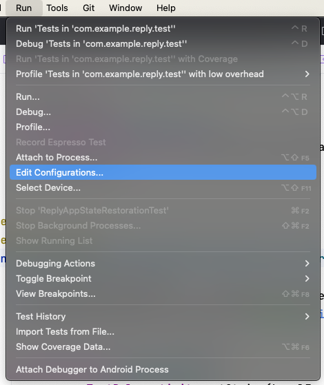
6. テストの名前を「**Compact tests**」に変更し、[**All in Package**] でテストを実行するように選択します。

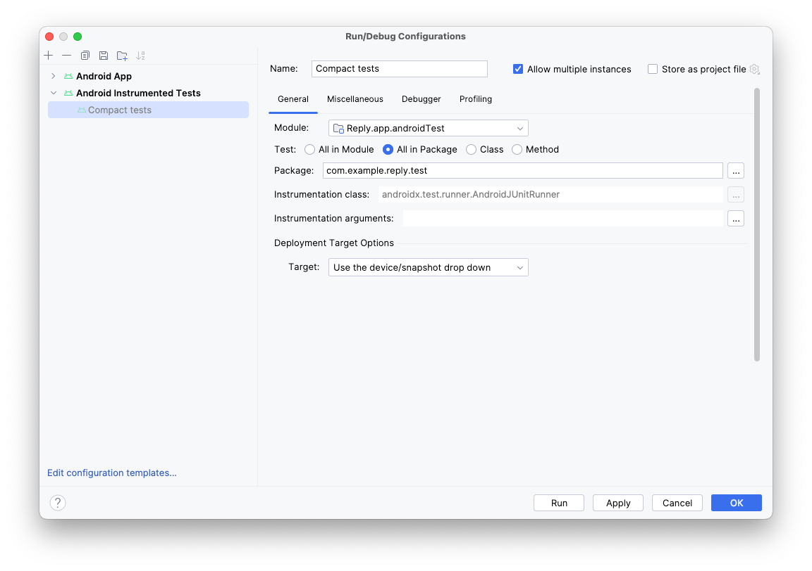

7. [**Instrumentation arguments**] フィールドの右側にあるその他アイコン（**...**）をクリックします。
8. プラス（`+`）ボタンをクリックし、その他のパラメータ（値 **com.example.reply.test.TestCompactWidth** の **annotation**）を追加します。

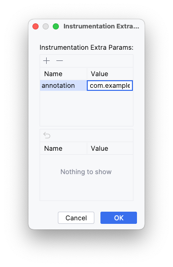

9. コンパクト エミュレータでテストを実行します。
10. コンパクト画面テストのみが実行されたことを確認します。

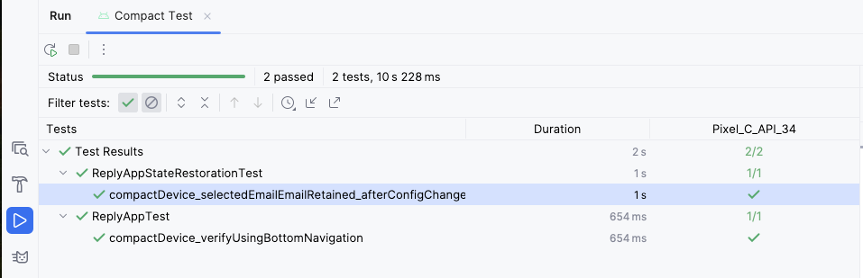

11. 中画面、拡大画面でも上記の手順を繰り返します。

### 6. 解答コードを取得する

この Codelab の完成したコードをダウンロードするには、次の git コマンドを使用します。

```
$ git clone https://github.com/google-developer-training/basic-android-kotlin-compose-training-reply-app.git
```

または、リポジトリを ZIP ファイルとしてダウンロードし、Android Studio で開くこともできます。

> **注:**解答コードは、ダウンロードしたリポジトリの `main` ブランチにあります。

解答コードを確認する場合は、[GitHub で表示します](https://github.com/google-developer-training/basic-android-kotlin-compose-training-reply-app)。

### 7. まとめ

お疲れさまでした。アダプティブ レイアウトを実装することで、Reply アプリをあらゆる画面サイズに適応させました。また、プレビューで開発時間を短縮することや、さまざまなテスト方法を使用してアプリの品質を維持することについても学びました。

#AndroidBasics を付けて、ソーシャル メディアで共有しましょう。

#### **詳細**

- [アダプティブ レイアウトを作成する](https://developer.android.com/jetpack/compose/layouts/adaptive)
- [各種の画面サイズのサポート](https://developer.android.com/guide/topics/large-screens/support-different-screen-sizes)
- [大画面用に設計する](https://m3.material.io/foundations/adaptive-design/large-screens/layout-anatomy)
- [あらゆる画面に対応した Jetnews](https://medium.com/androiddevelopers/jetnews-for-every-screen-4d8e7927752)
- [マルチプレビュー アノテーション](https://developer.android.com/jetpack/compose/tooling#preview-multipreview)

## 5. 演習: スポーツアプリを作成する（提出対象）

<!-- codelab:basic-android-kotlin-compose-practice-sports-app -->
出典: [演習: スポーツアプリを作成する](https://developer.android.com/codelabs/basic-android-kotlin-compose-practice-sports-app?hl=ja)（Google Developers, CC BY 4.0）

### 1. 始める前に

お疲れさまでした。このパスウェイでは、`WindowWidthSize` クラスと正規レイアウトを使用してアプリを適応させる方法を学習しました。次は、学んだことを実践してみましょう。

この演習セットでは、パスウェイで学習したコンセプトを活用してスポーツアプリを作成します。このスターター アプリは、モバイル レイアウトで適切に動作します。ここでのタスクは、アプリを大画面に適応させることです。

解答コードは最後に掲載されていますが、演習に取り組んでから解答を確認するようにしてください。自分のやりやすいペースで問題に取り組みましょう。時間が記載されていますが、あくまでも目安であり、厳密に守る必要はありません。必要なだけ時間をかけ、じっくりと問題に取り組んでください。

#### 前提条件

- ダイナミック ナビゲーションを使用してアダプティブ アプリを作成するとアダプティブ レイアウトを使用してアダプティブ アプリを作成するの Codelab を通じて、「Compose での Android の基礎」コースワークを完了していること。

#### 必要なもの

- Android Studio がインストールされた、インターネットに接続できるパソコン
- GitHub へのアクセス

#### 作成するアプリの概要

大画面に適応するスポーツアプリ。完成したアプリは次のようになります。

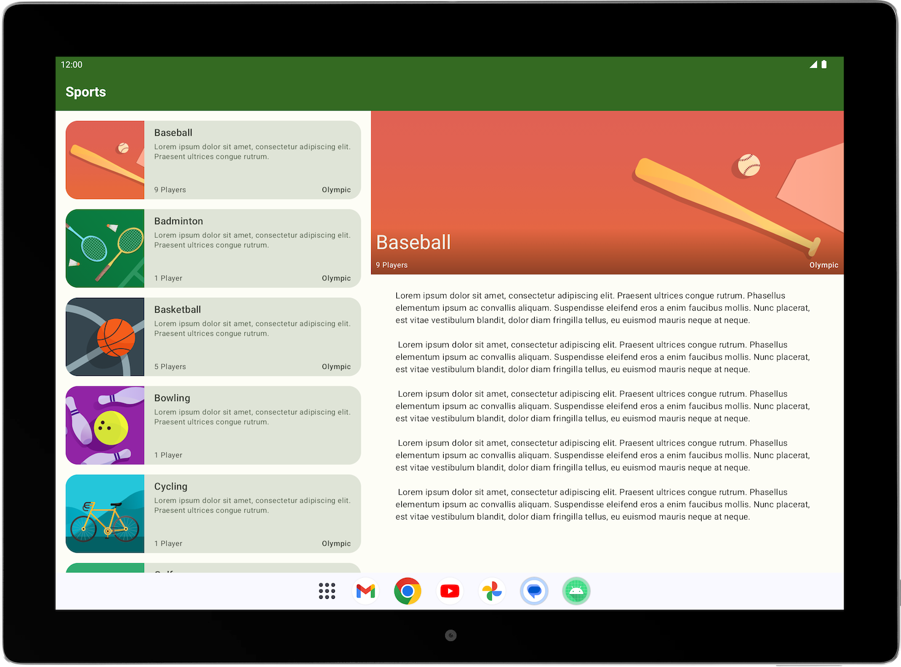

### 2. 始める

#### スターター コードをダウンロードする

Android Studio で `basic-android-kotlin-compose-training-sports` フォルダを開きます。

> **スターター コードの URL:**
> 
> [`https://github.com/google-developer-training/basic-android-kotlin-compose-training-sports/tree/starter`](https://github.com/google-developer-training/basic-android-kotlin-compose-training-sports/tree/starter)
> 
> **スターター コードのブランチ名:**`starter`

### 3. スポーツアプリを大画面にどのように適応させるかを決める

スポーツアプリを大画面に適応させるには、まず、大画面でのアプリの表示に最適なレイアウトのタイプを確立する必要があります。

1. コンパクト画面サイズで現在使用できるレイアウトの確認を始めましょう。画面は 2 つあります。`SportsList` コンポーザブルに対応するリスト画面と、`SportsDetail` コンポーザブルに対応する詳細画面です。

| 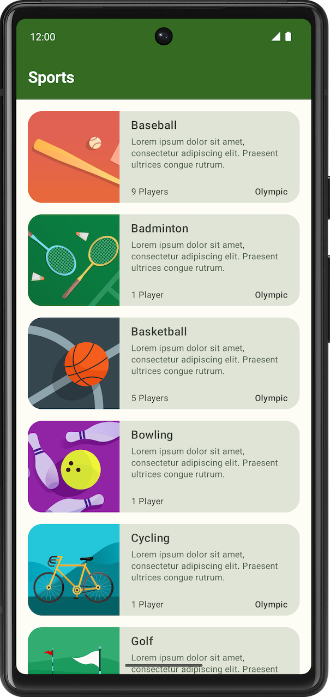 | 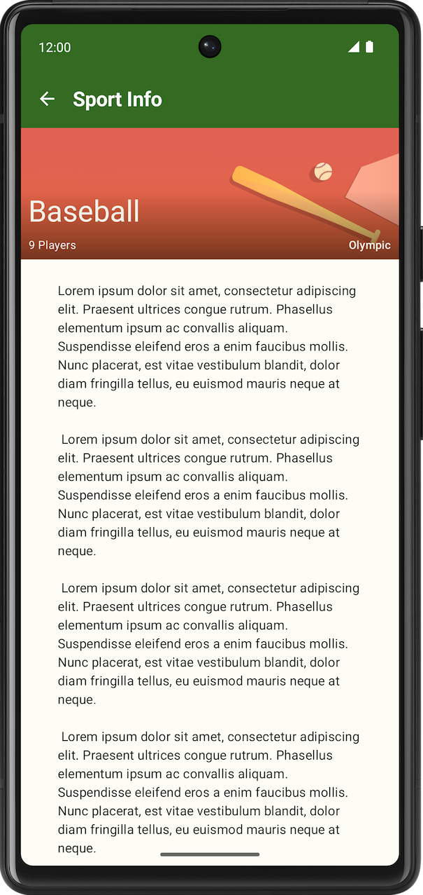 |
|---|---|

2. [正規レイアウト](https://m3.material.io/foundations/adaptive-design/canonical-layouts)を確認して、スポーツアプリのユースケースに最適なレイアウトを決定します。
3. 考えられる展開画面のレイアウトをスケッチします。シンプルなビジュアル デザイン ソフトウェアまたは紙を使用し、展開後のレイアウトで画面がどのように組み合わされるかを視覚化します。

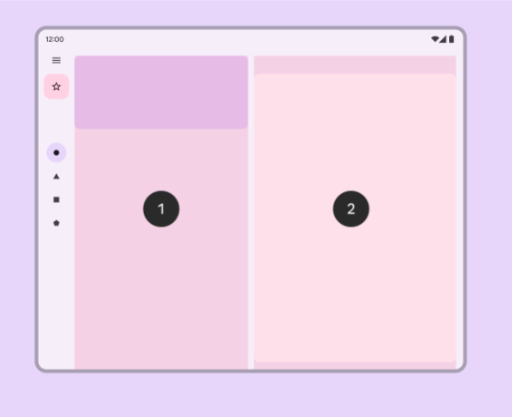

### 4. 展開画面をコードで作成する

展開後のレイアウトの表示方法が明確になったので、次はこれをコードに変換しましょう。

1. リスト画面と詳細画面の両方を表示する展開画面用のコンポーザブルを作成します。`SportsListAndDetails` という名前を付けて、`SportsScreens.kt` ファイルに追加します。
2. `SportsListAndDetails` コンポーザブルの UI の確認を簡素化するために、コンポーザブルのプレビューを作成します。

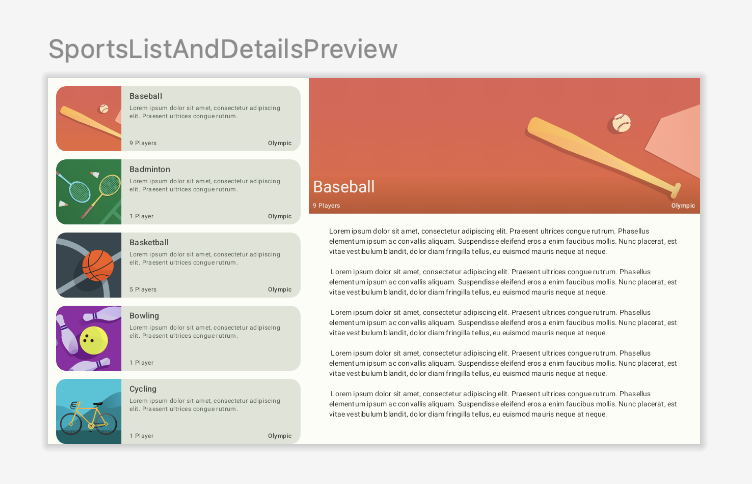

3. [戻る] ボタンの動作が展開画面に適したものであることを確認します。ユーザーが [戻る] ボタンを押すと、メイン画面が表示されアプリが終了するようにします。この動作を変更するには、適切なラムダを `SportsDetails` コンポーザブルに渡します。**ヒント**: `(LocalContext.current as Activity)` からアプリの `Activity` にアクセスできます。

### 5. ウィンドウ サイズに応じてアプリを別のレイアウトに変更する

展開画面のコンポーザブルをアプリに追加するには、次のタスクを行います。

1. アプリの `build.gradle.kts` に `androidx.compose.material3:material3-window-size-class` を追加します。
2. `MainActivity` で `windowSizeClass` を計算し、`widthSizeClass` を `SportsApp` コンポーザブルに渡します。
3. `utils` という名前の新しいディレクトリを作成し、`WindowStateUtils.kt` という名前の新しいファイルを作成します。
4. `WindowStateUtils` に `enum` クラスを追加して、2 つの異なる `contentType` を示します。それらに `ListOnly` タイプ、`ListAndDetail` タイプという名前を付けます。
5. `SportsApp` コンポーザブルで、`widthSizeClass` に基づいて `contentType` を決定します。
6. `contentType` が `ListAndDetail` の場合は `SportsListAndDetails` コンポーザブルを表示し、contentType が `ListOnly` の場合は以前の動作を維持します。
7. `SportsAppBar` コンポーザブルでは、リストページで画面が展開されたときに [戻る] ボタンが表示されず、アプリバーに **Sports** が表示されるように動作を変更します。
8. サイズ変更可能なエミュレータを使用して、コンパクト画面と展開画面の両方で UI とナビゲーション機能を確認します。

### 6. 解答コードを取得する

この Codelab の完成したコードをダウンロードするには、次の git コマンドを使用します。

```
$ git clone https://github.com/google-developer-training/basic-android-kotlin-compose-training-sports.git
```

または、リポジトリを ZIP ファイルとしてダウンロードし、Android Studio で開くこともできます。

> **注:**解答コードは、ダウンロードしたリポジトリの `main` ブランチにあります。

解答コードを確認する場合は、[GitHub で表示します](https://github.com/google-developer-training/basic-android-kotlin-compose-training-sports/tree/main)。

## 6. つまずきやすいポイント

- Android Studio の **Resizable Emulator** を使うと、スマホ／タブレット／折りたたみを 1 台で切り替えて確認できます。
- 「どのサイズでどのレイアウトを出すか」を先に表にしてから実装すると迷いません。

## 7. 提出物

次の Codelab で完成させた Android Studio プロジェクトを、学習用リポジトリの `unit4/Sports/` に置きます（プロジェクトフォルダごとコピー。`build/` と `.idea/` は含めない）。

- 演習: スポーツアプリを作成する

PR 本文には次の 3 点を書いてください。

- **やったこと**：どの Codelab / 演習を完了したか
- **動作確認**：どの端末（エミュレータ名 or 実機）で何を確認したか
- **詰まった点と解決**：エラーの内容と、どう直したか（AI に聞いた内容も可）

## 8. チェックリスト

- [ ] ウィンドウサイズクラス（Compact / Medium / Expanded）を判定できる
- [ ] 画面幅に応じてナビゲーション（Bottom / Rail / Drawer）とレイアウトを切り替えられる
- [ ] タブレットや折りたたみ端末のエミュレータで動作確認できる
- [ ] パスウェイ末尾のクイズに合格した
- [ ] 提出物が `unit4/Sports/` にあり、Android Studio（または Kotlin Playground）で開いて動く

---

## 課題提出

この章には提出課題があります。

1. 上記の提出物を完了する
2. GitHub で `feature/04-adaptive-layouts` ブランチを作成し、`develop` へのPRを作成（base=`develop`）
3. [AIプログラムレビュー](https://ai.studio/apps/84d224cb-7de1-44fb-995b-9a5917d25603?fullscreenApplet=true) を実行
4. 問題がなければ、進捗ダッシュボードで **PR URL** と **完了日** を記録
