# 第10章: アーキテクチャ コンポーネント

> 公式コース: [ユニット 4: ナビゲーションとアプリ アーキテクチャ](https://developer.android.com/courses/android-basics-compose/unit-4?hl=ja) ／ [パスウェイ 1: アーキテクチャ コンポーネント](https://developer.android.com/courses/pathways/android-basics-compose-unit-4-pathway-1?hl=ja)
> 提出ブランチ: `feature/04-architecture-components`

## 1. この章のゴール

- Activity のライフサイクル（onCreate / onStart / onResume …）を説明できる
- `ViewModel` と `StateFlow` で UI 状態を管理できる
- ViewModel のユニットテストを書ける

## 2. 進め方

公式パスウェイの内容を **上から順番に** 進めます。動画と「やらなくてOK」の行は飛ばして構いません。Codelab の本文はこのページの下にすべて掲載しています。目安時間の合計は約405分です。

| # | 種類 | 内容 | 目安 | 備考 |
|---|---|---|---|---|
| 1 | 動画 | ユニット 4 へようこそ | — | 見なくてOK |
| 2 | Codelab | [アクティビティのライフサイクルのステージ](https://developer.android.com/codelabs/basic-android-kotlin-compose-activity-lifecycle?hl=ja) | 約90分 | 本文は下に掲載 |
| 3 | 動画 | アプリ アーキテクチャの概要 | — | 見なくてOK |
| 4 | 動画 | アーキテクチャ: UI レイヤ | — | 見なくてOK |
| 5 | Codelab | [Compose での ViewModel と状態](https://developer.android.com/codelabs/basic-android-kotlin-compose-viewmodel-and-state?hl=ja) | 約120分 | 本文は下に掲載 |
| 6 | Codelab | [ViewModel をテストする単体テストを作成する](https://developer.android.com/codelabs/basic-android-kotlin-compose-test-viewmodel?hl=ja) | 約60分 | 本文は下に掲載 |
| 7 | Codelab | [演習: Dessert Clicker に ViewModel を追加する](https://developer.android.com/codelabs/basic-android-kotlin-compose-practice-viewmodel?hl=ja) | 約120分 | **提出対象**（本文は下に掲載） |
| 8 | 動画 | 次のステップ | — | 見なくてOK |
| 9 | クイズ | [テスト: アーキテクチャ コンポーネント](https://developer.android.com/courses/quizzes/android-basics-compose-unit-4-pathway-1/android-basics-compose-unit-4-pathway-1?hl=ja) | 約15分 |  |

Codelab の進め方は次の通りです。

1. 下の各 Codelab を読み、各ステップの説明を理解してから **自分でコードを打つ**（コピペで済ませない）
2. ステップごとにアプリを実行し、期待どおり動くか確認する
3. 動かないときは、エラー文をそのまま AI に貼って「何が原因か」を聞き、直したら **なぜ直ったか** をメモする
4. パスウェイ末尾のクイズを受けて、間違えた項目を Codelab で読み直す

> Codelab 本文は Google Developers の公式 Codelab（CC BY 4.0）を日本語のまま転載しています。画面が最新の Android Studio と異なる場合は、公式ページ（各見出しの「出典」リンク）も確認してください。

## 3. アクティビティのライフサイクルのステージ

<!-- codelab:basic-android-kotlin-compose-activity-lifecycle -->
出典: [アクティビティのライフサイクルのステージ](https://developer.android.com/codelabs/basic-android-kotlin-compose-activity-lifecycle?hl=ja)（Google Developers, CC BY 4.0）

### 1. 始める前に

この Codelab では、Android の基本的な要素であるアクティビティのライフサイクルについて学習します。

アクティビティは、その存続期間にわたってさまざまな状態に遷移し、場合によっては元の状態に戻ります。この状態の遷移を、アクティビティのライフサイクルといいます。

Android では、アクティビティはユーザーとやり取りするためのエントリ ポイントです。

これまでは、1 つのアクティビティでアプリの画面を 1 つ表示していました。現在のベスト プラクティスでは、1 つのアクティビティで必要に応じて画面を切り替えて複数の画面を表示することがあります。

アクティビティのライフサイクルは、アクティビティの作成から破棄（システムがそのアクティビティのリソースを再利用する）まで続きます。ユーザーがアクティビティを出入りすると、各アクティビティはアクティビティのライフサイクルの状態間を遷移します。

Android デベロッパーは、アクティビティのライフサイクルを理解しておく必要があります。アクティビティがライフサイクルの状態の変化に正しく反応しない場合、アプリに予期せぬバグが発生してユーザーの混乱を招いたり、Android システムのリソースを過度に使用したりする可能性があります。Android のライフサイクルを理解し、ライフサイクルの状態の変化に適切に対応することは、Android の開発における重要な部分です。

#### 前提条件

- アクティビティの概要と、アプリでアクティビティを作成する方法に関する知識
- アクティビティの `onCreate()` メソッドの概要と、このメソッドで行われるオペレーションの種類に関する知識

#### 学習内容

- ロギング情報を Logcat に出力する方法
- `Activity` のライフサイクルの基本と、アクティビティが状態間を遷移したときに呼び出されるコールバック
- ライフサイクル コールバック メソッドをオーバーライドして、アクティビティのライフサイクルのさまざまなタイミングでオペレーションを行う方法

#### 作成するアプリの概要

- Dessert Clicker というスターター アプリを変更して、Logcat に表示されるロギング情報を追加します。
- ライフサイクル コールバック メソッドをオーバーライドして、アクティビティの状態の変化を記録します。
- アプリを実行し、アクティビティの開始、停止、再開時に表示されるロギング情報をメモします。
- `rememberSaveable` を実装して、デバイス構成が変更された場合に失われる可能性があるアプリデータを保持します。

### 2. アプリの概要

この Codelab では、Dessert Clicker というスターター アプリを使用します。Dessert Clicker では、ユーザーが画面上のデザートをタップするたびに、そのデザートが「購入」されます。アプリは以下について、レイアウトの値を更新します。

- 「購入された」デザートの数
- 「購入済み」のデザートの総収益

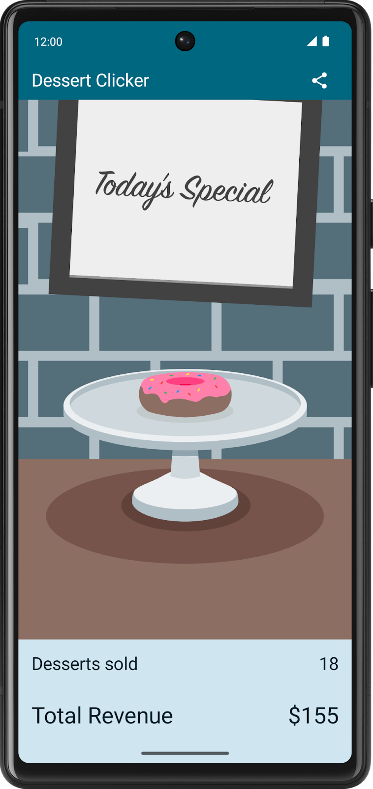

このアプリには、Android のライフサイクルに関連するバグがいくつか含まれています。たとえば、特定の状況でデザートの値が 0 にリセットされます。Android のライフサイクルを理解することで、このような問題が発生する理由とその解決方法がわかるようになります。

#### **スターター コードをダウンロードする**

Android Studio で `basic-android-kotlin-compose-training-dessert-clicker` フォルダを開きます。

> **スターター コードの URL:**[`https://github.com/google-developer-training/basic-android-kotlin-compose-training-dessert-clicker`](https://github.com/google-developer-training/basic-android-kotlin-compose-training-dessert-clicker/tree/starter)
> 
> **ブランチ名:**`starter`

### 3. ライフサイクル メソッドを確認し、基本的なロギングを追加する

どのアクティビティにもライフサイクルというものがあります。これは植物や動物のライフサイクルになぞらえた用語であり、たとえば蝶のライフサイクルでは、卵から幼虫、さなぎ、蝶になり、死に至るまでの過程で、さまざまな状態を遷移します。

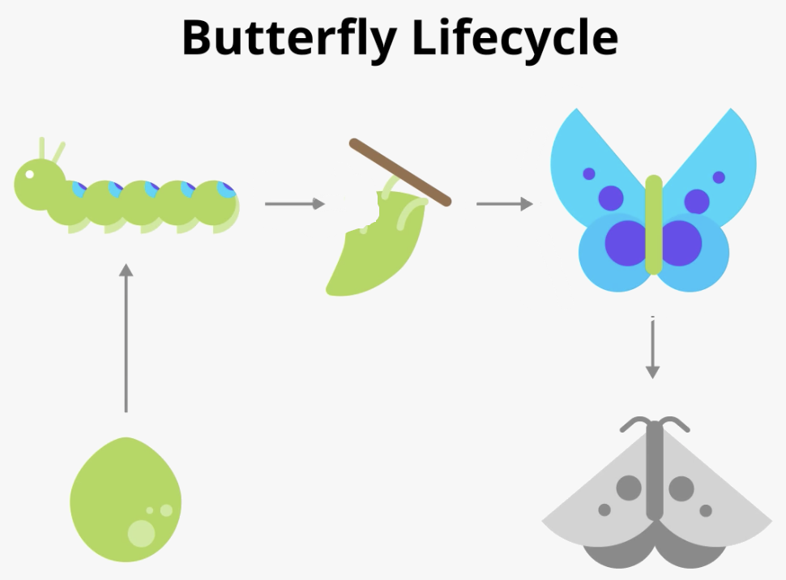

アクティビティのライフサイクルも同様に、最初の初期化から、オペレーティング システム（OS）によってメモリが回収される破棄までの過程で、アクティビティが遷移するさまざまな状態によって構成されています。通常、プログラムのエントリ ポイントは `main()` メソッドです。しかし Android のアクティビティは `onCreate()` メソッドで始まります。このメソッドは、上記の例でいうと卵の段階に相当します。このコースではすでにアクティビティを何度か使用しているため、`onCreate()` メソッドをご存じかもしれません。ユーザーがアプリの起動、アクティビティ間の移動、アプリ内外への移動を行うと、アクティビティの状態が変わります。

次の図は、アクティビティのライフサイクルの状態をすべて示しています。これらの状態は、名前が示すようにそれぞれアクティビティのステータスを表します。蝶のライフサイクルとは異なり、アクティビティは一方向にしか移動しないのではなく、ライフサイクル全体で状態間を行き来できます。

> **注:**Android アプリのアクティビティは複数にすることもできますが、これまでこのコースで実装しているように、アクティビティは 1 つにすることをおすすめします。

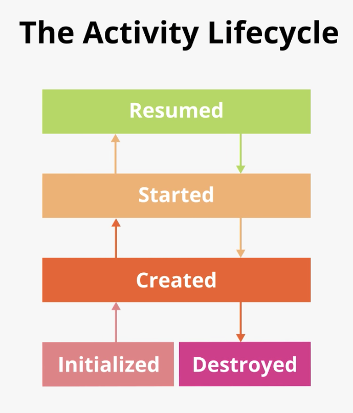

多くの場合、アクティビティのライフサイクルの状態が変わったタイミングで、動作の変更やコードの実行が必要になります。したがって、`Activity` クラス自体と、`Activity` のサブクラス（`ComponentActivity` など）は、一連のライフサイクル コールバック メソッドを実装しています。Android は、アクティビティがある状態から別の状態に遷移したときに、これらのコールバックを呼び出します。そのため、ライフサイクルの状態の変化に応じて、自分のアクティビティ内でこれらのメソッドをオーバーライドしてタスクを実行できます。次の図は、ライフサイクルの状態と、オーバーライド可能なコールバックを示しています。

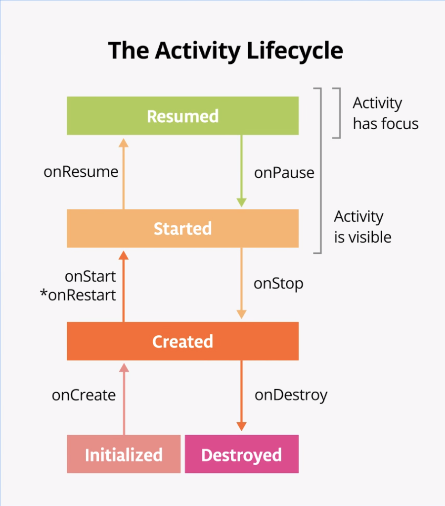

> **注:** `onRestart()` メソッドのアスタリスクは、状態が **Created** と **Started** の間を遷移するたびにこのメソッドが呼び出されるわけではないことを示しています。`onStop()` が呼び出され、その後アクティビティが再開された場合にのみ呼び出されます。

Android がオーバーライド可能なコールバックを呼び出すタイミングと、各コールバック メソッドで行われる処理を理解することは重要ですが、どちらの図も複雑でわかりにくくなっています。この Codelab では、それぞれの状態とコールバックの概要に触れるだけでなく、追究して Android アクティビティのライフサイクルについて理解を深めます。

#### ステップ 1: `onCreate()` メソッドを確認してロギングを追加する

Android のライフサイクルで何が起きているのかを調べる際に、さまざまなライフサイクル メソッドが呼び出されるタイミングを把握しておくと役に立ちます。この情報により、Dessert Clicker アプリのどの部分に問題があるのかを特定できます。

この情報は、Android のロギング機能を使用して簡単に特定できます。ロギングを使用すると、アプリの実行中にコンソールに短いメッセージを書き込むことができます。これを使用して、各コールバックがトリガーされたときにメッセージを表示できます。

1. Dessert Clicker アプリを実行し、デザートの写真を複数回タップします。[**Desserts sold**] の値と合計金額がどのように変化するかに注目してください。
2. `MainActivity.kt` を開き、このアクティビティの `onCreate()` メソッドを確認します。

```kotlin
override fun onCreate(savedInstanceState: Bundle?) {
    // ...
}
```

アクティビティのライフサイクルの図にある `onCreate()` メソッドに見覚えがあるかもしれません。以前にこのコールバックを使用したことがあるはずです。このメソッドはすべてのアクティビティに実装する必要があります。`onCreate()` メソッドでは、アクティビティに対して 1 回限りの初期化を行います。たとえば `onCreate()` では、`setContent()` を呼び出してアクティビティの UI レイアウトを指定します。

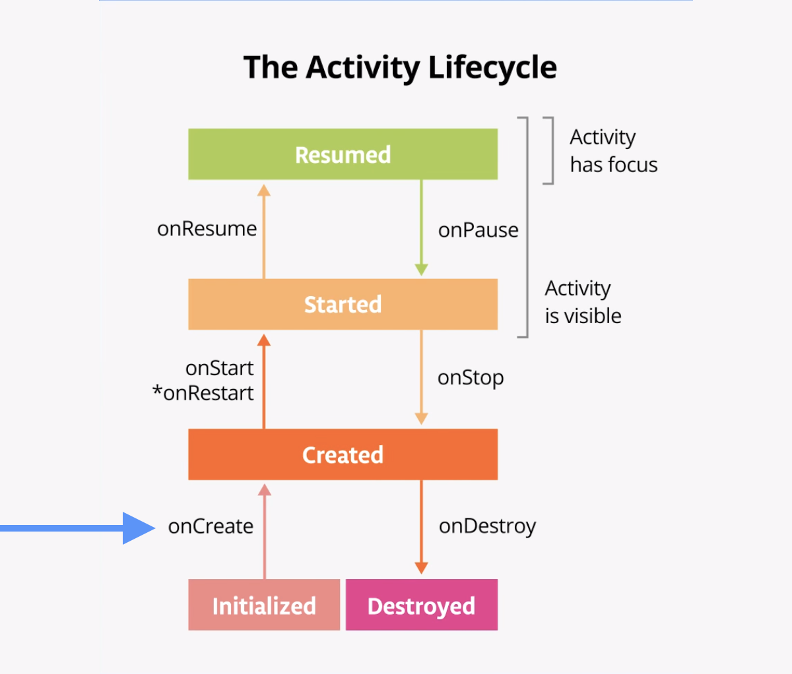

`onCreate()` ライフサイクル メソッドは、アクティビティの初期化直後（OS によって新しい `Activity` オブジェクトがメモリに作成されたとき）に 1 回呼び出されます。`onCreate()` が実行されると、アクティビティは作成されたと見なされます。

> **注:** `onCreate()` メソッドをオーバーライドする場合、アクティビティの作成を完了するにはスーパークラスの実装を呼び出す必要があります。そのため、このメソッド内ですぐに `super.onCreate()` を呼び出します。他のライフサイクル コールバック メソッドについても同じことが言えます。

3. 次の定数を、`MainActivity.kt` のトップレベル（クラス宣言 `class MainActivity` の上）に追加します。

値が変更されないため、ファイルで `TAG` 定数を宣言することをおすすめします。

コンパイル時の定数としてマークするには、変数を宣言するときに `const` を使用します。コンパイル時の定数は、コンパイル時に判明する値です。

```kotlin
private const val TAG = "MainActivity"
```

4. `onCreate()` メソッドで、`super.onCreate()` 呼び出しの直後に次の行を追加します。

```kotlin
Log.d(TAG, "onCreate Called")
```

5. 必要に応じて `Log` クラスをインポートします（`Alt+Enter`（Mac の場合は `Option+Enter`）を押して、[**Import**] を選択します）。自動インポートを有効にしている場合、インポートは自動的に行われます。

```kotlin
import android.util.Log
```

[`Log`](https://developer.android.com/reference/kotlin/android/util/Log) クラスは、メッセージを **Logcat** に書き込みます。**Logcat** は、メッセージを記録するためのコンソールです。Android からのアプリに関するメッセージ（`Log.d()` メソッドや他の `Log` クラスメソッドを使用してログに明示的に送信したメッセージを含む）がここに表示されます。

`Log` 命令には、重要な部分が 3 つあります。

- ログメッセージの**優先度**（メッセージの重要度）。この例では、[`Log.v()`](https://developer.android.com/reference/kotlin/android/util/Log#v_1) は詳細メッセージをログに記録します。[`Log.d()`](https://developer.android.com/reference/kotlin/android/util/Log#d) メソッドはデバッグ メッセージを書き込みます。`Log` クラスのその他のメソッドには、情報メッセージ用の [`Log.i()`](https://developer.android.com/reference/kotlin/android/util/Log#i_1)、警告メッセージ用の [`Log.w()`](https://developer.android.com/reference/kotlin/android/util/Log#w(kotlin.String,%20kotlin.String))、エラー メッセージ用の [`Log.e()`](https://developer.android.com/reference/kotlin/android/util/Log#e(kotlin.String,%20kotlin.String)) が含まれます。
- ログの `tag`（最初のパラメータ）。この例では `"MainActivity"`。このタグは、Logcat でログメッセージを簡単に見つけるための文字列です。通常、このタグはクラスの名前です。
- 実際のログメッセージ `msg`（2 番目のパラメータ）。短い文字列であり、この例では `"onCreate Called"`。

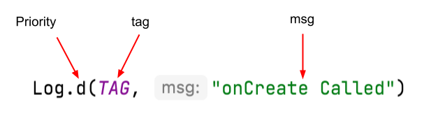

6. Dessert Clicker アプリをコンパイルして実行します。デザートをタップしても、アプリの動作には特に違いは生じません。Android Studio の画面の下部で [**Logcat**] タブをクリックします。

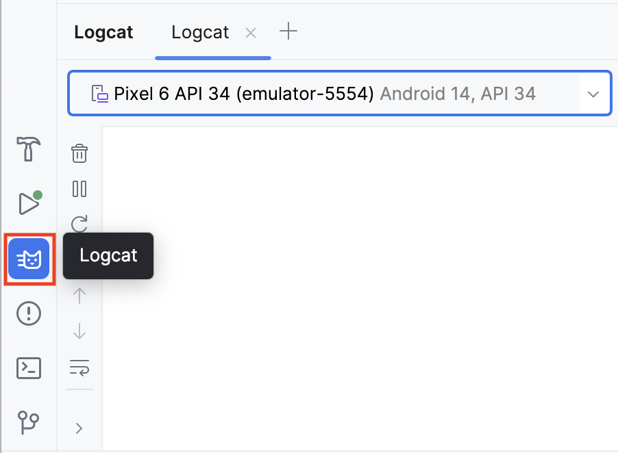

7. [**Logcat**] ウィンドウで、検索フィールドに「`tag:MainActivity`」と入力します。

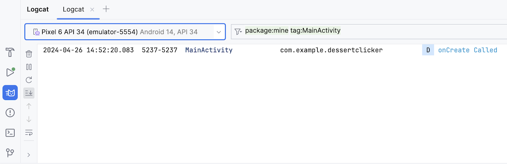

Logcat には多数のメッセージが含まれている場合がありますが、ほとんどは役に立ちません。Logcat エントリはさまざまな方法でフィルタできますが、検索するのが最も簡単です。コード内で `MainActivity` をログタグとして使用したため、そのタグを使用してログをフィルタできます。ログメッセージには、日時、ログタグ、パッケージの名前（`com.example.dessertclicker`）、実際のメッセージが含まれます。このメッセージがログに表示されていることから、`onCreate()` が実行されたことがわかります。

#### ステップ 2: `onStart()` メソッドを実装する

`onStart()` ライフサイクル メソッドは、`onCreate()` の直後に呼び出されます。`onStart()` が実行されると、アクティビティが画面に表示されます。アクティビティを初期化するために 1 回だけ呼び出される `onCreate()` とは異なり、`onStart()` はアクティビティのライフサイクルでシステムから何度も呼び出すことができます。

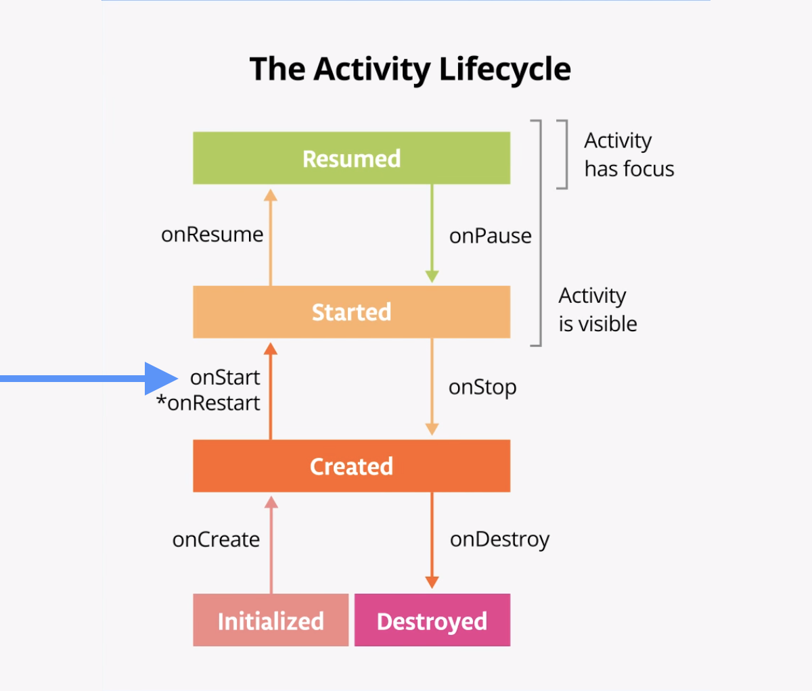

`onStart()` は、対応する `onStop()` ライフサイクル メソッドとペアになることに注意してください。ユーザーがアプリを起動してからデバイスのホーム画面に戻ると、アクティビティは停止し、画面に表示されなくなります。

1. Android Studio で、`MainActivity.kt` を開き、`MainActivity` クラス内にカーソルを置いて、**[Code] > [Override Methods...]** を選択するか、`Control+O` を押します。ダイアログが開き、このクラスでオーバーライドできるすべてのメソッドの長いリストが表示されます。

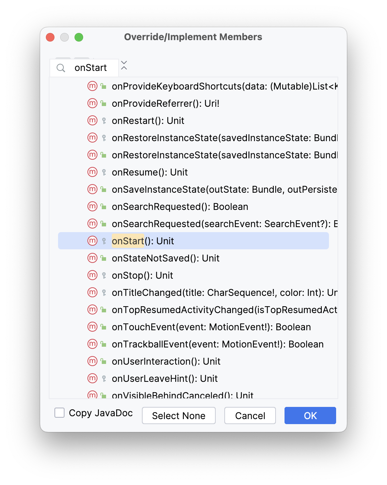

2. `onStart` を入力して、適切なメソッドを検索します。次の一致項目までスクロールするには、下矢印を使用します。リストから「`onStart()`」を選択し、[**OK**] をクリックしてボイラープレート オーバーライド コードを挿入します。コードは次の例のようになります。

```kotlin
override fun onStart() {
    super.onStart()
}
```

3. `onStart()` メソッド内に、ログメッセージを追加します。

```kotlin
override fun onStart() {
    super.onStart()
    Log.d(TAG, "onStart Called")
}
```

4. Dessert Clicker アプリをコンパイルして実行し、[**Logcat**] ペインを開きます。
5. 検索フィールドに「`tag:MainActivity`」と入力して、ログをフィルタします。`onCreate()` メソッドと `onStart()` メソッドの両方が相次いで呼び出され、アクティビティが画面に表示されます。
6. デバイスの**ホーム**ボタンを押してから、履歴画面を使用してアクティビティに戻ります。アクティビティは、中断したところからすべて同じ値で再開され、2 回目の `onStart()` が Logcat に記録されます。また、`onCreate()` メソッドが再度呼び出されることはありません。

```
2024-04-26 14:54:48.721  5386-5386  MainActivity            com.example.dessertclicker           D  onCreate Called
2024-04-26 14:54:48.756  5386-5386  MainActivity            com.example.dessertclicker           D  onStart Called
2024-04-26 14:55:41.674  5386-5386  MainActivity            com.example.dessertclicker           D  onStart Called
```

> **注:**デバイスでライフサイクル コールバックを試してみると、デバイスを回転させたときに異常な動作が発生することがあります。この動作については、この Codelab で後ほど説明します。

#### ステップ 3: ログ ステートメントを追加する

このステップでは、他のすべてのライフサイクル メソッドのロギングを実装します。

1. 次のコードに示すように、`MainActivity` の残りのライフサイクル メソッドをオーバーライドして、それぞれのログ ステートメントを追加します。

```kotlin
override fun onResume() {
    super.onResume()
    Log.d(TAG, "onResume Called")
}

override fun onRestart() {
    super.onRestart()
    Log.d(TAG, "onRestart Called")
}

override fun onPause() {
    super.onPause()
    Log.d(TAG, "onPause Called")
}

override fun onStop() {
    super.onStop()
    Log.d(TAG, "onStop Called")
}

override fun onDestroy() {
    super.onDestroy()
    Log.d(TAG, "onDestroy Called")
}
```

2. Dessert Clicker を再度コンパイルして実行し、Logcat を確認します。

今回は `onCreate()` と `onStart()` に加えて、`onResume()` ライフサイクル コールバックのログメッセージが表示されています。

```
2024-04-26 14:56:48.684  5484-5484  MainActivity            com.example.dessertclicker           D  onCreate Called
2024-04-26 14:56:48.709  5484-5484  MainActivity            com.example.dessertclicker           D  onStart Called
2024-04-26 14:56:48.713  5484-5484  MainActivity            com.example.dessertclicker           D  onResume Called
```

アクティビティが最初から開始されると、次の 3 つのライフサイクル コールバックが順に呼び出されます。

- `onCreate()`: システムがアプリを作成するとき。
- `onStart()`: アプリが画面に表示されますが、ユーザーはまだ操作できません。
- `onResume()`: アプリがフォアグラウンドになり、ユーザーが操作できるようになります。

`onResume()` メソッドは、その名前とは異なり、再開する対象がない場合でも起動時に呼び出されます。

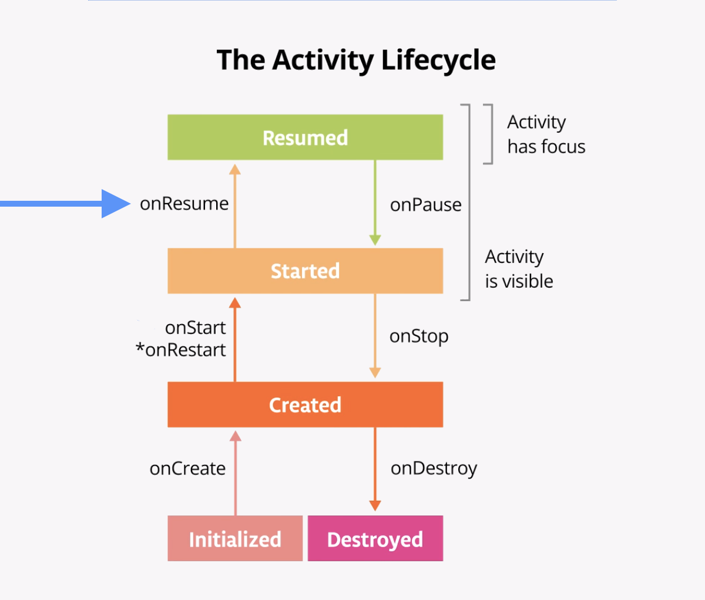

### 4. ライフサイクルのユースケースを確認する

Dessert Clicker アプリをロギング用にセットアップできたところで、アプリの使用を開始して、ライフサイクル コールバックがどのようにトリガーされるのかを確認しましょう。

#### ユースケース 1: アクティビティの開始と終了

アプリを初めて起動して終了するという、最も基本的なユースケースから始めます。

1. Dessert Clicker アプリをまだ実行していない場合は、コンパイルして実行します。すでに説明したとおり、アクティビティの初回起動時に `onCreate()`、`onStart()`、`onResume()` のコールバックが呼び出されます。

```
2024-04-26 14:56:48.684  5484-5484  MainActivity            com.example.dessertclicker           D  onCreate Called
2024-04-26 14:56:48.709  5484-5484  MainActivity            com.example.dessertclicker           D  onStart Called
2024-04-26 14:56:48.713  5484-5484  MainActivity            com.example.dessertclicker           D  onResume Called
```

2. カップケーキを数回タップします。
3. デバイスの**戻る**ボタンをタップします。

`onPause()`、`onStop()` の順序で呼び出されていることが、Logcat で確認できます。

```
2024-04-26 14:58:19.984  5484-5484  MainActivity            com.example.dessertclicker           D  onPause Called
2024-04-26 14:58:20.491  5484-5484  MainActivity            com.example.dessertclicker           D  onStop Called
2024-04-26 14:58:20.517  5484-5484  MainActivity            com.example.dessertclicker           D  onDestroy Called
```

この場合、**戻る**ボタンを使用することで、アクティビティ（とアプリ）が画面に表示されなくなり、バックスタックに移動します。

Android OS は、コードがアクティビティの [`finish()`](https://developer.android.com/reference/android/app/Activity.html#finish()) メソッドを呼び出すか、ユーザーがアプリを強制終了した場合に、アクティビティを終了することがあります。たとえばユーザーは、履歴画面でアプリを強制終了または終了できます。アプリが長時間画面に表示されていない場合、OS が独自にアクティビティをシャットダウンすることもあります。これにより、Android はバッテリー消費を抑え、アプリが使用していたリソースを回収して他のアプリで使用できるようにします。これらは、Android システムがアクティビティを破棄する理由のほんの一部です。Android システムが警告を表示せずにアクティビティを破棄するケースもあります。

> **注:**この Codelab で後述する `onCreate()` と `onDestroy()` は、1 つのアクティビティ インスタンスの存続期間中に 1 回だけ呼び出されます。`onCreate()` は、アプリを初めて初期化するために呼び出され、`onDestroy()` は、アクティビティで使用可能になっていたオブジェクトを無効化、終了、または破棄し、メモリなどのリソースを使用し続けないようにするために呼び出されます。

#### ユースケース 2: アクティビティ間の移動

アプリを起動して終了したことで、アクティビティが初めて作成されたときのライフサイクルの状態について、大部分を確認できました。また、アクティビティが終了されたときのライフサイクルの状態についても、大部分を確認しました。しかし、ユーザーは Android デバイスを操作する際に、アプリを切り替えたり、ホームに戻ったり、新しいアプリを起動したり、電話などの他のアクティビティによる中断を処理したりします。

その場合、ユーザーがアクティビティから離れるたびにそのアクティビティが完全に終了するわけではありません。

- アクティビティが画面に表示されなくなると、そのアクティビティはバックグラウンドに移行します（これとは逆の状態が、アクティビティがフォアグラウンドにあるとき、または画面に表示されているときです）。
- ユーザーがアプリに戻ると、同じアクティビティが再開され、再び表示されます。ライフサイクルのこの部分は、アプリの表示可能なライフサイクルと呼ばれます。

一般に、アプリがバックグラウンドにあるときは、システム リソースとバッテリーの消耗を抑えるために、アプリがアクティブに実行されないようにする必要があります。`Activity` ライフサイクルとそのコールバックを使用して、アプリがバックグラウンドに移行するタイミングを把握することで、実行中のオペレーションを一時停止できます。その後、アプリがフォアグラウンドになったらオペレーションを再開します。

このステップでは、アプリがバックグラウンドに移行してフォアグラウンドに戻ったときのアクティビティのライフサイクルを確認します。

1. Dessert Clicker アプリを実行した状態で、カップケーキを数回クリックします。
2. デバイスの**ホーム**ボタンを押して、Android Studio の Logcat を確認します。ホーム画面に戻ってもアプリは完全にシャットダウンされることはなく、バックグラウンドに移行されます。`onPause()` メソッドと `onStop()` メソッドが呼び出されています。

```
2024-04-26 15:00:04.905  5590-5590  MainActivity            com.example.dessertclicker           D  onPause Called
2024-04-26 15:00:05.430  5590-5590  MainActivity            com.example.dessertclicker           D  onStop Called
```

`onPause()` が呼び出されると、アプリのフォーカスが失われます。`onStop()` の後、アプリは画面に表示されなくなります。アクティビティは停止されていますが、`Activity` オブジェクトはメモリ内（バックグラウンド）に残っています。Android OS がアクティビティを破棄したわけではありません。ユーザーがアプリに戻ってくる可能性があるため、Android はアクティビティ リソースを保持しています。

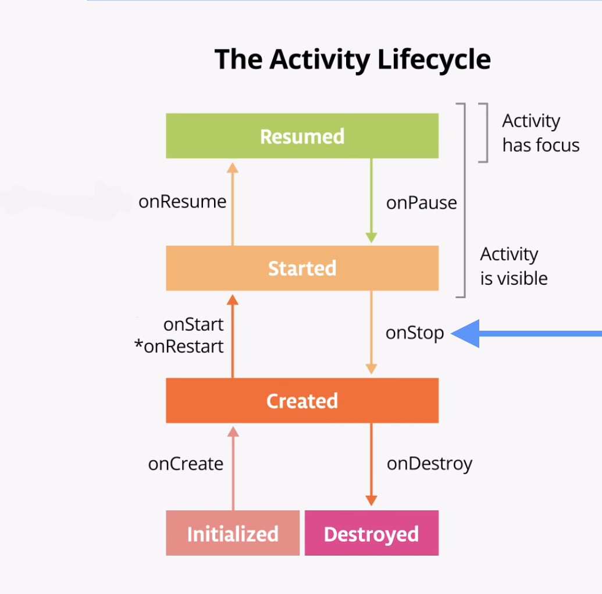

3. 履歴画面を使用してアプリに戻ります。エミュレータでは、次の図に示す正方形のシステムボタンから履歴画面にアクセスできます。

Logcat を確認すると、アクティビティが `onRestart()` と `onStart()` で再起動し、その後 `onResume()` で再開しています。

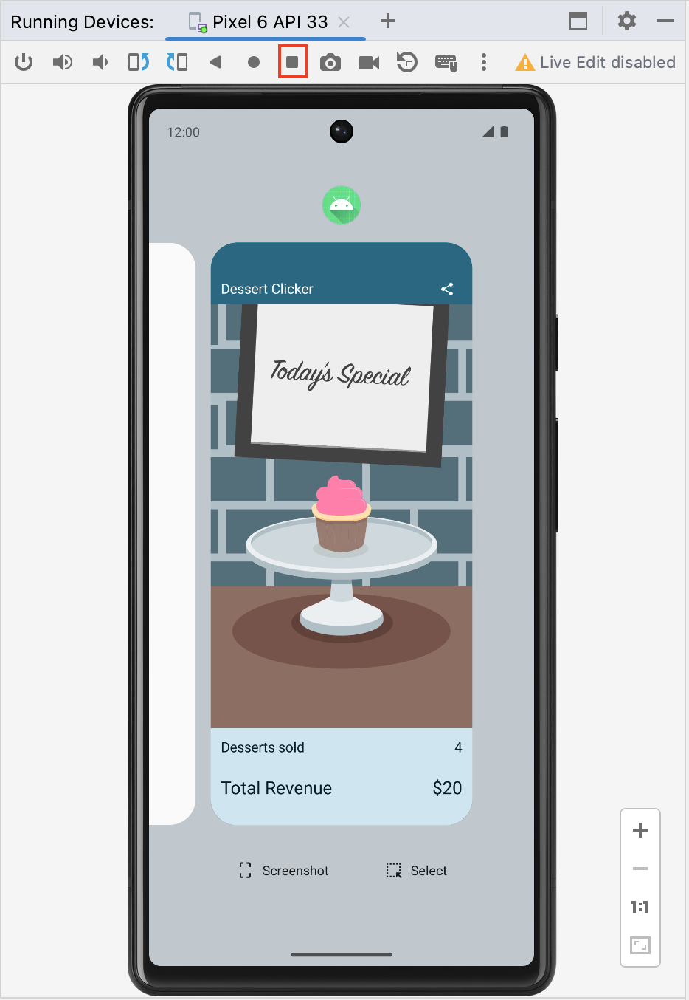

> **注**: `onRestart()` は、アクティビティがすでに作成されている場合にのみシステムから呼び出されます。`onStop()` が呼び出されると最終的に **Created** 状態になりますが、**Destroyed** 状態になるのではなく **Started** 状態に戻ります。そのため、`onRestart()` メソッドには、アクティビティを起動するのが**初めてではない**場合にのみ呼び出すコードを配置します。

```
2024-04-26 15:00:39.371  5590-5590  MainActivity            com.example.dessertclicker           D  onRestart Called
2024-04-26 15:00:39.372  5590-5590  MainActivity            com.example.dessertclicker           D  onStart Called
2024-04-26 15:00:39.374  5590-5590  MainActivity            com.example.dessertclicker           D  onResume Called
```

アクティビティがフォアグラウンドに戻ったときに、`onCreate()` メソッドが再び呼び出されることはありません。アクティビティ オブジェクトは破棄されていないため再作成の必要はなく、`onCreate()` の代わりに `onRestart()` メソッドが呼び出されます。アクティビティがフォアグラウンドに戻ったときに、[**Desserts sold**] の数値が保持されていることに注意してください。

4. デバイスの履歴画面に複数のアプリが表示されるように、Dessert Clicker 以外のアプリを少なくとも 1 つ起動します。
5. 履歴画面を開き、別の最近のアクティビティを開きます。最近使ったアプリに戻って、Dessert Clicker をフォアグラウンドに戻します。

**ホーム**ボタンを押したときと同じコールバックが Logcat に表示されていることに注意してください。アプリがバックグラウンドになるときに `onPause()` と `onStop()` が呼び出され、フォアグラウンドに戻るときに `onRestart()`、`onStart()`、`onResume()` が呼び出されます。

> **注:**ユーザーがアクティビティ間を移動する際、`onStart()` と `onStop()` が複数回呼び出されます。

これらのメソッドは、アプリが停止してバックグラウンドに移行するとき、またはアプリが再開されてフォアグラウンドに戻るときに呼び出されます。この間にアプリでなんらかの処理を行う必要がある場合は、関連するライフサイクル コールバック メソッドをオーバーライドします。

#### ユースケース 3: アクティビティの一部を非表示にする

アプリが起動されて `onStart()` が呼び出されると、アプリが画面に表示されることを説明しました。`onResume()` が呼び出されると、アプリはユーザー フォーカスを取得します。つまり、ユーザーはアプリを操作できます。ライフサイクルのうち、アプリが完全に画面に表示され、ユーザー フォーカスがある期間を、[フォアグラウンドの存続期間](https://developer.android.com/reference/android/app/Activity#activity-lifecycle)といいます。

アプリがバックグラウンドに移行すると、`onPause()` の後にフォーカスが失われ、`onStop()` 以降はアプリが表示されなくなります。

フォーカスと表示の違いは重要です。アクティビティは、ユーザー フォーカスがなくても画面上に部分的に表示できます。このステップでは、アクティビティが部分的に表示されているものの、ユーザー フォーカスがないケースを見ていきます。

1. Dessert Clicker アプリが実行されている状態で、画面右上の**共有**ボタンをクリックします。

共有アクティビティが画面の下半分に表示されますが、アクティビティは引き続き画面の上半分に表示されています。

 

2. Logcat を確認すると、`onPause()` のみが呼び出されています。

```
2024-04-26 15:01:49.535  5590-5590  MainActivity            com.example.dessertclicker           D  onPause Called
```

このユースケースでは、アクティビティがまだ部分的に表示されているため、`onStop()` は呼び出されません。ただし、ユーザー フォーカスはこのアクティビティではなく、フォアグラウンドの「共有」アクティビティにあるため、ユーザーはこのアクティビティを操作できません。

ここで、フォーカスと表示の違いが重要な理由を考えてみましょう。`onPause()` のみによる中断は通常、そのアクティビティに戻るか、別のアクティビティまたはアプリに移動するまでの短い時間しか持続しません。一般に、UI を継続的に更新して、アプリの残りの部分がフリーズしたように見えないようにする必要があります。

`onPause()` で実行されるコードにより、他のアクティビティやアプリの表示が妨げられるため、`onPause()` のコードは軽量化します。たとえば、電話の着信があった場合に、`onPause()` のコードによって着信通知が遅れる可能性があります。

3. 共有ダイアログの外側をクリックするとアプリに戻り、`onResume()` が呼び出されます。

`onResume()` と `onPause()` はどちらもフォーカスに関係があります。`onResume()` メソッドはアクティビティがフォーカスを得たときに呼び出され、`onPause()` はアクティビティがフォーカスを失ったときに呼び出されます。

### 5. 構成の変更について確認する

また、アクティビティのライフサイクルを管理するうえで、構成の変更がアクティビティのライフサイクルにどのように影響するかを理解しておくことも重要です。

構成の変更は、デバイスの状態が大きく変更されたために、システムにとってアクティビティを完全にシャットダウンして再構築するのが最も手間がかからない場合に行われます。たとえば、ユーザーがデバイスの言語を変更した場合、異なるテキスト方向と文字列の長さに対応するためにレイアウト全体の変更が必要になる可能性あります。ユーザーがデバイスをホルダーに装着した場合や物理キーボードを追加した場合は、アプリのレイアウトで別のディスプレイ サイズやレイアウトを利用する必要があるかもしれません。また、デバイスの向きが変わった場合（デバイスが縦向きから横向き、またはその逆に回転した場合）は、新しい向きに合わせてレイアウトの変更が必要になることがあります。次のシナリオで、アプリがどのように動作するか見てみましょう。

最後に紹介するライフサイクル コールバックは、`onStop()` の後に呼び出される `onDestroy()` です。これは、アクティビティが破棄される直前に呼び出されます。アプリのコードが `finish()` を呼び出すとき、または構成の変更によりシステムがアクティビティを破棄して再作成する必要があるときに発生する可能性があります。

#### 構成の変更により `onDestroy()` が呼び出される

画面の回転は構成の変更の一種であり、アクティビティのシャットダウンと再開が発生します。この構成の変更をシミュレートして影響を調べるには、次の手順を実施します。

1. アプリをコンパイルして実行します。
2. エミュレータでは、画面の回転のロックが無効になっていることを確認してください。
3. デバイスまたはエミュレータを回転させて横向きにします。エミュレータを左右に回転させるには、回転ボタンを使用します。
4. Logcat を調べて、アクティビティがシャットダウンするときに、`onPause()`、`onStop()`、`onDestroy()` をこの順序で呼び出すことを確認します。

```
2024-04-26 15:03:32.183  5716-5716  MainActivity            com.example.dessertclicker           D  onPause Called
2024-04-26 15:03:32.185  5716-5716  MainActivity            com.example.dessertclicker           D  onStop Called
2024-04-26 15:03:32.205  5716-5716  MainActivity            com.example.dessertclicker           D  onDestroy Called
```

#### デバイスの回転時のデータ損失

1. アプリをコンパイルして実行し、Logcat を開きます。
2. カップケーキを数回クリックすると、デザートが販売され、総収益は 0 でなくなります。
3. エミュレータでは、画面の回転のロックが無効になっていることを確認してください。
4. デバイスまたはエミュレータを回転させて横向きにします。エミュレータを左右に回転させるには、回転ボタンを使用します。

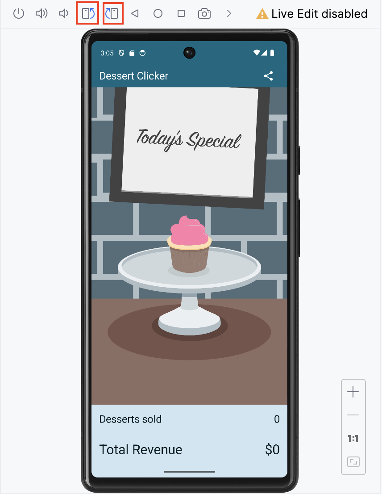

5. Logcat で出力を調べます。`MainActivity` の出力をフィルタします。

```
2024-04-26 15:04:29.356  5809-5809  MainActivity            com.example.dessertclicker           D  onCreate Called
2024-04-26 15:04:29.378  5809-5809  MainActivity            com.example.dessertclicker           D  onStart Called
2024-04-26 15:04:29.382  5809-5809  MainActivity            com.example.dessertclicker           D  onResume Called
2024-04-26 15:06:52.168  5809-5809  MainActivity            com.example.dessertclicker           D  onPause Called
2024-04-26 15:06:52.183  5809-5809  MainActivity            com.example.dessertclicker           D  onStop Called
2024-04-26 15:06:52.219  5809-5809  MainActivity            com.example.dessertclicker           D  onDestroy Called
2024-04-26 15:06:52.302  5809-5809  MainActivity            com.example.dessertclicker           D  onCreate Called
2024-04-26 15:06:52.308  5809-5809  MainActivity            com.example.dessertclicker           D  onStart Called
2024-04-26 15:06:52.312  5809-5809  MainActivity            com.example.dessertclicker           D  onResume Called
```

デバイスまたはエミュレータの画面を回転させると、すべてのライフサイクル コールバックが呼び出され、アクティビティがシャットダウンされます。その後アクティビティが再作成されると、すべてのライフサイクル コールバックが呼び出され、アクティビティが開始されます。

デバイスが回転し、アクティビティがシャットダウンされて再作成されると、アクティビティはデフォルト値で再開します。つまり、デザートの販売数と総収益がゼロにリセットされます。

これらの値がリセットされる理由と修正方法を知るには、コンポーザブルのライフサイクルと、それが状態の監視と保持をどのように把握しているのかを知る必要があります。

#### コンポーザブルのライフサイクル

アプリの UI は、最初は Composition というプロセスでコンポーズ可能な関数を実行することで構築されます。

アプリの状態が変化すると、再コンポーズがスケジュール設定されます。再コンポーズとは、状態が変化した可能性のあるコンポーズ可能な関数を Compose が再実行し、更新された UI を作成することです。Composition は、こうした変化を反映するように更新されます。

Composition は、初回のコンポーズとその後の再コンポーズによってのみ作成、更新できます。

コンポーズ可能な関数には、アクティビティのライフサイクルとは独立した、独自のライフサイクルがあります。そのライフサイクルは、「Composition に入る」、「0 回以上再コンポーズする」、「Composition から出る」というイベントで構成されます。

Compose が再コンポーズをトラッキングし、トリガーするには、状態がいつ変化したのかを把握する必要があります。オブジェクトの状態をトラッキングするよう Compose に指示するには、オブジェクトの型を [`State`](https://developer.android.com/reference/kotlin/androidx/compose/runtime/State) または [`MutableState`](https://developer.android.com/reference/kotlin/androidx/compose/runtime/MutableState) にする必要があります。`State` 型は不変であり、読み取りのみが可能です。`MutableState` 型は可変であり、読み取りと書き込みが可能です。

`MutableState` については、以前の Codelab の [Lemonade アプリ](https://github.com/google-developer-training/basic-android-kotlin-compose-training-lemonade)と [Tip Time アプリ](https://github.com/google-developer-training/basic-android-kotlin-compose-training-tip-calculator)ですでに確認、使用しました。

可変変数 `revenue` を作成するには、`mutableStateOf` を使用して宣言します。`0` は初期のデフォルト値です。

```kotlin
var revenue = mutableStateOf(0)
```

これは、収益値が変更されたときに Compose で再コンポーズをトリガーするには十分ですが、更新された値を保持するには不十分です。コンポーザブルが再実行されるたびに、収益値が再初期化されて初期のデフォルト値である `0` になります。

再コンポーズの際にその値を保持および再利用するよう Compose に指示するには、`remember` API で宣言する必要があります。

```kotlin
var revenue by remember { mutableStateOf(0) }
```

`revenue` の値が変更されると、Compose は、この値を読み取るすべてのコンポーズ可能な関数を、再コンポーズのためにスケジュール設定します。

Compose は再コンポーズ時に収益の状態を記憶しますが、構成の変更の際はこの状態を保持しません。構成の変更の際に Compose が状態を保持するようにするには、`rememberSaveable` を使用する必要があります。

その他の演習と詳細については、[Compose の状態の概要](https://developer.android.com/codelabs/basic-android-kotlin-compose-using-state) Codelab をご覧ください。

#### `rememberSaveable` を使用して構成の変更をまたいで値を保存する

Android OS がアクティビティを破棄して再作成する場合に必要な値を保存するには、`rememberSaveable` 関数を使用します。

再コンポーズの際に値を保存するには、`remember` を使用する必要があります。再コンポーズ時と構成の変更時の両方で値を保存するには、`rememberSaveable` を使用します。

> **注:**Android は、アプリに関連するすべてのアクティビティを含むアプリプロセス全体をシャットダウンすることがあります。システムに負荷がかかり、表示に遅延が発生するおそれがある場合に、このようなシャットダウンを行います。そのため、この時点では追加のコールバックやコードは実行されません。アプリのプロセスはバックグラウンドでそのままシャットダウンされますが、ユーザーにはアプリが終了したようには見えません。Android システムがシャットダウンしたアプリにユーザーが戻ると、Android はそのアプリを再起動します。このとき、ユーザーデータの損失が発生しないようにする必要があります。

`rememberSaveable` を使用して値を保存すると、アクティビティが復元されたときに必要に応じて使用できるようになります。

1. `MainActivity` で、現在 `remember` を使用している 5 つの変数のグループを `rememberSaveable` に更新します。

```kotlin
var revenue by remember { mutableStateOf(0) }
...
var currentDessertImageId by remember {
    mutableStateOf(desserts[currentDessertIndex].imageId)
}
```

```kotlin
var revenue by rememberSaveable { mutableStateOf(0) }
...
var currentDessertImageId by rememberSaveable {
    mutableStateOf(desserts[currentDessertIndex].imageId)
}
```

2. アプリをコンパイルして実行します。
3. カップケーキを数回クリックすると、デザートが販売され、総収益は 0 でなくなります。
4. デバイスまたはエミュレータを回転させて横向きにします。
5. アクティビティを破棄して再作成すると、デザートの画像、デザートの販売数、総収益が以前の値に戻ることを確認します。

### 6. 解答コード

> **解答コードの URL:**
> 
> [`https://github.com/google-developer-training/basic-android-kotlin-compose-training-dessert-clicker`](https://github.com/google-developer-training/basic-android-kotlin-compose-training-dessert-clicker)
> 
> **ブランチ名:**`main`

### 7. 概要

#### まとめ

#### アクティビティのライフサイクル

- アクティビティのライフサイクルは、アクティビティが移行する一連の状態です。アクティビティのライフサイクルは、Android OS が最初にアクティビティを作成したときに開始し、OS がアクティビティを破棄したときに終了します。
- ユーザーがアクティビティ間やアプリの内外に移動すると、各アクティビティはライフサイクルの状態間を移行します。
- アクティビティのライフサイクルの各状態には、`Activity` クラスでオーバーライド可能な、対応するコールバック メソッドがあります。ライフサイクル メソッドのコアセットは、[`onCreate()`](https://developer.android.com/reference/android/app/Activity.html#onCreate(android.os.Bundle))、[`onRestart()`](https://developer.android.com/reference/android/app/Activity.html#onRestart())、[`onStart()`](https://developer.android.com/reference/android/app/Activity.html#onStart())、[`onResume()`](https://developer.android.com/reference/android/app/Activity.html#onResume())、[`onPause()`](https://developer.android.com/reference/android/app/Activity.html#onPause())、[`onStop()`](https://developer.android.com/reference/android/app/Activity.html#onStop())、[`onDestroy()`](https://developer.android.com/reference/android/app/Activity.html#onDestroy()) です。
- アクティビティがあるライフサイクル状態に移行したときに実行される動作を追加するには、その状態のコールバック メソッドをオーバーライドします。
- Android Studio でクラスにスケルトン オーバーライド メソッドを追加するには、**[Code] > [Override Methods...]** を選択するか、`Control+O` を押します。

#### Log を使用したロギング

- Android Logging API（具体的には [`Log`](https://developer.android.com/reference/android/util/Log) クラス）を使用すると、Android Studio の Logcat に表示される短いメッセージを記述できます。
- `Log.d()` を使用してデバッグ メッセージを記述します。このメソッドは、ログタグ（通常はクラスの名前）とログメッセージ（短い文字列）の 2 つの引数を取ります。
- Android Studio の [**Logcat**] ウィンドウで、システムログ（自分で記述したメッセージを含む）を表示します。

#### 構成の変更

- 構成の変更は、デバイスの状態が大きく変更されたために、システムにとってアクティビティを破棄して再構築するのが最も手間がかからない場合に行われます。
- 構成の変更が発生する最も一般的な例は、ユーザーがデバイスを縦向きから横向きに、または横向きから縦向きにした場合です。デバイスの言語が変更された場合や、ユーザーがハードウェア キーボードを接続した場合も、構成の変更が発生する可能性があります。
- 構成の変更が発生すると、Android はすべてのアクティビティ ライフサイクルのシャットダウン コールバックを呼び出します。その後、Android はアクティビティをゼロから再起動して、ライフサイクルの起動コールバックをすべて実行します。
- Android は、構成の変更によりアプリをシャットダウンする際、`onCreate()` でアクティビティを再開します。
- 構成の変更後も残す必要がある値を保存するには、`rememberSaveable` を使用して変数を宣言します。

#### 詳細

- [`Log`](https://developer.android.com/reference/android/util/Log) クラス
- [Logcat でログを表示する](https://developer.android.com/studio/debug/am-logcat)
- [Saveable API](https://developer.android.com/reference/kotlin/androidx/compose/runtime/saveable/package-summary)
- [`Activity` クラス](https://developer.android.com/reference/android/app/Activity.html)
- [`ComponentActivity` クラス](https://developer.android.com/reference/androidx/activity/ComponentActivity)
- [アクティビティ デベロッパー ガイド](https://developer.android.com/guide/components/activities/intro-activities#kotlin)

## 4. Compose での ViewModel と状態

<!-- codelab:basic-android-kotlin-compose-viewmodel-and-state -->
出典: [Compose での ViewModel と状態](https://developer.android.com/codelabs/basic-android-kotlin-compose-viewmodel-and-state?hl=ja)（Google Developers, CC BY 4.0）

### 1. 始める前に

以前の Codelab では、アクティビティのライフサイクルと、関連するライフサイクルの構成変更にともなう問題について学習しました。構成変更が発生したときには、`rememberSaveable` を使用する、またはインスタンスの状態を保存するなどの方法で、アプリのデータを保存できます。ただし、これらの方法で問題が発生する場合があります。ほとんどの場合には `rememberSaveable` を使用できますが、その場合は、コンポーザブルの中や周辺のロジックを維持することになります。アプリが大きくなったときには、データとロジックをコンポーザブルから分離する必要があります。この Codelab では、Android Jetpack ライブラリ、`ViewModel`、Android アプリのアーキテクチャ ガイドラインを利用して、アプリを設計し、構成変更後もアプリデータを維持する堅牢な方法について学びます。

[Android Jetpack](https://developer.android.com/jetpack) ライブラリは、優れた Android アプリの開発を支援するライブラリ集です。このライブラリ集を使用すると、ベスト プラクティスに沿って開発を進めながら、ボイラープレート コードを作成する手間を省き、複雑なタスクを簡素化できるので、アプリのロジックなどのコードの重要な部分に集中できます。

「アプリ アーキテクチャ」は、アプリの設計ルールの集まりです。アーキテクチャは、住宅の設計図とほぼ同じで、アプリに構造を与えます。優れたアプリ アーキテクチャを採用すれば、コードの堅牢性、柔軟性、スケーラビリティ、テスト性、保守性を長年にわたって維持できます。[アプリ アーキテクチャ ガイド](https://developer.android.com/topic/libraries/architecture)で、アプリ アーキテクチャに関する推奨事項と推奨されるベスト プラクティスを紹介しています。

この Codelab では、Android Jetpack ライブラリのアーキテクチャ コンポーネントの一つである [`ViewModel`](https://developer.android.com/topic/libraries/architecture/viewmodel) を利用して、アプリデータを保存する方法について学びます。フレームワークが構成変更やその他のイベント中にアクティビティを破棄して再作成しても、保存されているデータは失われません。ただし、プロセスの終了が原因でアクティビティが破棄された場合、データは失われます。`ViewModel` は迅速にアクティビティを再作成することによってデータをキャッシュに保存しているだけなのです。

#### 前提条件

- 関数、ラムダ、ステートレス コンポーザブルなど、Kotlin に関する知識
- Jetpack Compose でレイアウトを作成する方法に関する基本的な知識
- マテリアル デザインに関する基本的な知識

#### 学習内容

- [Android アプリ アーキテクチャ](https://developer.android.com/topic/architecture#recommended-app-arch)の概要
- アプリで [`ViewModel`](https://developer.android.com/reference/android/arch/lifecycle/ViewModel) クラスを使用する方法
- [`ViewModel`](https://developer.android.com/reference/android/arch/lifecycle/ViewModel) を使用してデバイスの構成変更後も UI データを維持する方法

#### 作成するアプリの概要

- スクランブルされた単語を推測する [Unscramble](https://github.com/google-developer-training/basic-android-kotlin-compose-training-unscramble) ゲームアプリ

#### 必要なもの

- Android Studio の最新バージョン
- スターター コードをダウンロードするためのインターネット接続

### 2. アプリの概要

#### ゲームの概要

Unscramble アプリは、1 人でプレイするスクランブラー ゲームです。アプリにはスクランブルされた単語が表示され、プレーヤーは表示されている文字をすべて使用して単語を推測します。単語が正しい場合はスコアが加算されます。何回でも挑戦できます。現在の単語をスキップすることもできます。右上に単語カウントが表示されます。現在のゲームでプレイした単語の数です。スクランブルされた単語の数は、1 ゲームにつき 10 個です。

| 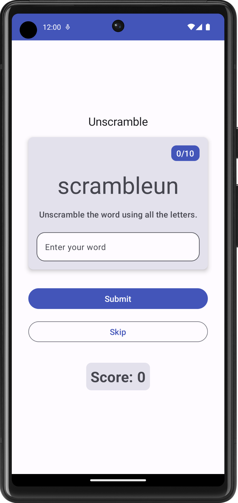 | 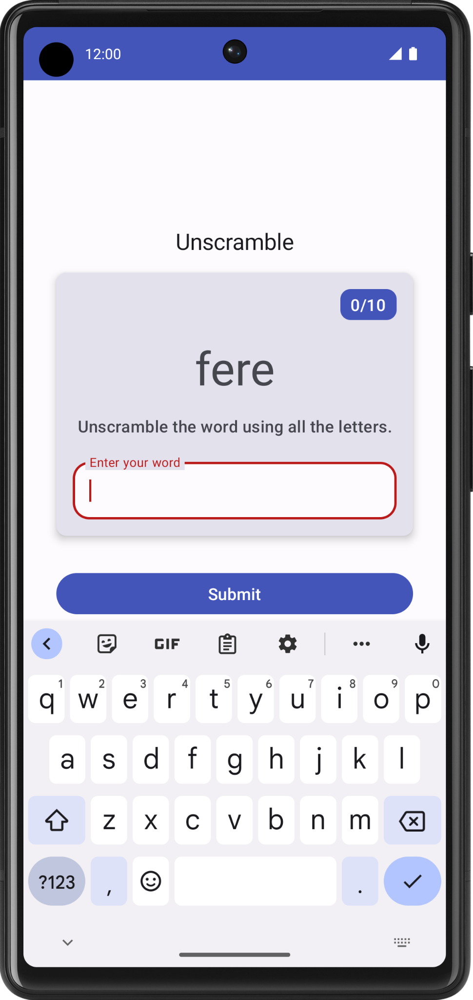 | 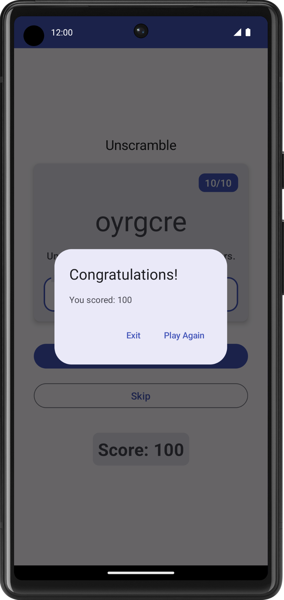 |
|---|---|---|

#### **スターター コードを取得する**

まず、スターター コードをダウンロードします。

または、GitHub リポジトリのクローンを作成してコードを入手することもできます。

```
$ git clone 
https://github.com/google-developer-training/basic-android-kotlin-compose-training-unscramble.git
$ cd basic-android-kotlin-compose-training-unscramble
$ git checkout starter
```

> **注:**スターター コードは、ダウンロードしたリポジトリの `starter` ブランチにあります。

スターター コードは [`Unscramble`](https://github.com/google-developer-training/basic-android-kotlin-compose-training-unscramble/tree/starter) GitHub リポジトリで確認できます。

### 3. スターター アプリの概要

次の手順でスターター コードを確認し、よく理解してください。

1. Android Studio でスターター コードのプロジェクトを開きます。
2. Android デバイスまたはエミュレータでアプリを実行します。
3. [**Submit**] ボタンと [**Skip**] ボタンをタップしてアプリを試します。

アプリにバグがあることがわかります。スクランブルされた単語は表示されませんが、「scrambleun」とハードコードされ、ボタンをタップしても何も起こりません。

この Codelab では、Android アプリ アーキテクチャを使用してゲーム機能を実装します。

#### スターター コードのチュートリアル

スターター コードには、あらかじめデザインされたゲーム画面のレイアウトが用意されています。このパスウェイでは、ゲームロジックを実装します。アーキテクチャ コンポーネントを使用して、推奨されるアプリ アーキテクチャを実装し、上記の問題を解決します。作業の土台とするファイルの一部について簡単に説明します。

**WordsData.kt**

このファイルには、ゲームで使用されている単語のリストに加え、ゲームごとの最大単語数と正解するごとに加算される点数の定数が入っています。

```kotlin
package com.example.android.unscramble.data

const val MAX_NO_OF_WORDS = 10
const val SCORE_INCREASE = 20

// Set with all the words for the Game
val allWords: Set<String> =
   setOf(
       "animal",
       "auto",
       "anecdote",
       "alphabet",
       "all",
       "awesome",
       "arise",
       "balloon",
       "basket",
       "bench",
      // ...
       "zoology",
       "zone",
       "zeal"
)
```

> **警告**: コード内に文字列をハードコードすることは、おすすめできません。ローカライズを容易にするために `strings.xml` に文字列を追加してください。このサンプルアプリでは、アプリのアーキテクチャに集中してもらうため、文字列をハードコードしています。

**MainActivity.kt**

このファイルには、主にテンプレートから生成されたコードが含まれています。`setContent{}` ブロック内の `GameScreen` コンポーザブルが表示されます。

**GameScreen.kt**

すべての UI コンポーザブルが **`GameScreen.kt`** ファイルで定義されています。以下のセクションで、いくつかのコンポーズ可能な関数について順を追って説明します。

**GameStatus**

`GameStatus` は、ゲームスコアを画面下部に表示するコンポーズ可能な関数です。このコンポーズ可能な関数では、`Card` にテキスト コンポーザブルが含まれています。現時点では、スコアは `0` にハードコードされています。

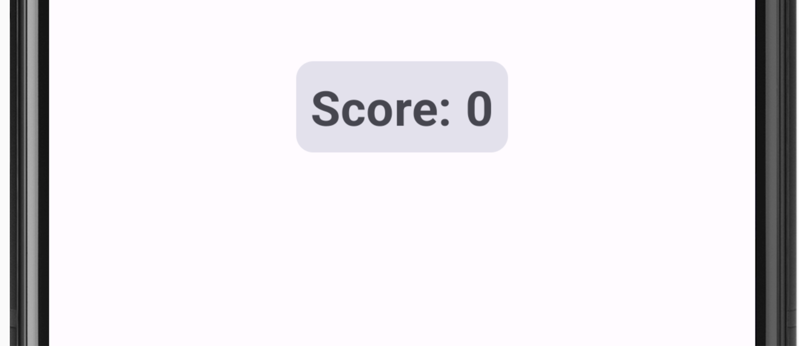

```kotlin
// No need to copy, this is included in the starter code.

@Composable
fun GameStatus(score: Int, modifier: Modifier = Modifier) {
    Card(
        modifier = modifier
    ) {
        Text(
            text = stringResource(R.string.score, score),
            style = typography.headlineMedium,
            modifier = Modifier.padding(8.dp)
        )
    }
}
```

**GameLayout**

`GameLayout` は、メインのゲーム機能（スクランブルされた単語、ゲームの手順、ユーザーの推測が入力されるテキスト フィールド）を表示するコンポーズ可能な関数です。

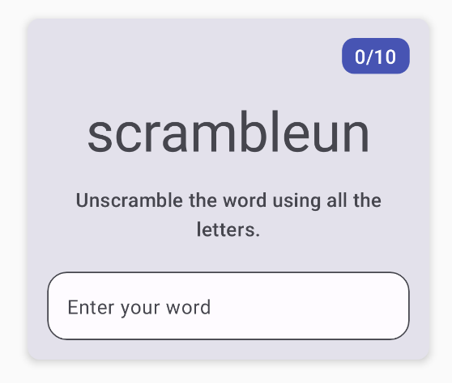

以下の `GameLayout` のコードには、スクランブルされた単語のテキスト、手順のテキスト、ユーザーが単語を入力するテキスト フィールド `OutlinedTextField` の 3 つの子要素が `Card` 内で 1 つの列になって含まれています。現時点では、スクランブルされた単語は「`scrambleun`」とハードコードされています。この Codelab の後半では、`WordsData.kt` ファイルの単語を表示する機能を実装します。

```kotlin
// No need to copy, this is included in the starter code.

@Composable
fun GameLayout(modifier: Modifier = Modifier) {
   val mediumPadding = dimensionResource(R.dimen.padding_medium)
   Card(
       modifier = modifier,
       elevation = CardDefaults.cardElevation(defaultElevation = 5.dp)
   ) {
       Column(
           verticalArrangement = Arrangement.spacedBy(mediumPadding),
           horizontalAlignment = Alignment.CenterHorizontally,
           modifier = Modifier.padding(mediumPadding)
       ) {
           Text(
               modifier = Modifier
                   .clip(shapes.medium)
                   .background(colorScheme.surfaceTint)
                   .padding(horizontal = 10.dp, vertical = 4.dp)
                   .align(alignment = Alignment.End),
               text = stringResource(R.string.word_count, 0),
               style = typography.titleMedium,
               color = colorScheme.onPrimary
           )
           Text(
               text = "scrambleun",
               style = typography.displayMedium
           )
           Text(
               text = stringResource(R.string.instructions),
               textAlign = TextAlign.Center,
               style = typography.titleMedium
           )
           OutlinedTextField(
               value = "",
               singleLine = true,
               shape = shapes.large,
               modifier = Modifier.fillMaxWidth(),
               colors = TextFieldDefaults.textFieldColors(containerColor = colorScheme.surface),
               onValueChange = { },
               label = { Text(stringResource(R.string.enter_your_word)) },
               isError = false,
               keyboardOptions = KeyboardOptions.Default.copy(
                   imeAction = ImeAction.Done
               ),
               keyboardActions = KeyboardActions(
                   onDone = { }
               )
           )
       }
   }
}
```

`OutlinedTextField` コンポーザブルは、以前の Codelab で作成したアプリの `TextField` コンポーザブルに似ています。

テキスト フィールドには次の 2 種類があります。

- 塗りつぶしテキスト フィールド
- 枠線付きテキスト フィールド

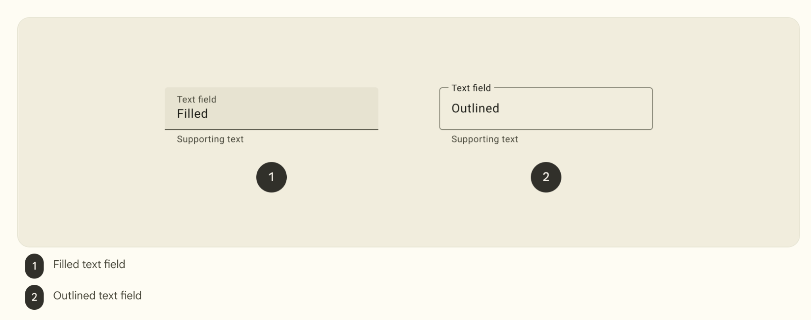

枠線付きテキスト フィールドは、塗りつぶしテキスト フィールドに比べて視覚的な強調が控えめになっています。多数のテキスト項目が配置されるフォームなどに表示される場合は、強調が控えめになってレイアウトがシンプルになります。

スターター コードでは、ユーザーが推測を入力しても `OutlinedTextField` が更新されません。この機能は、この Codelab で更新します。

**GameScreen**

`GameScreen` コンポーザブルには、`GameStatus` と `GameLayout` のコンポーズ可能な関数、ゲームタイトル、単語カウント、[**Submit**] ボタンと [**Skip**] ボタンのコンポーザブルが含まれています。


```kotlin
@Composable
fun GameScreen() {
    val mediumPadding = dimensionResource(R.dimen.padding_medium)

    Column(
        modifier = Modifier
            .verticalScroll(rememberScrollState())
            .padding(mediumPadding),
        verticalArrangement = Arrangement.Center,
        horizontalAlignment = Alignment.CenterHorizontally
    ) {

        Text(
            text = stringResource(R.string.app_name),
            style = typography.titleLarge,
        )

        GameLayout(
            modifier = Modifier
                .fillMaxWidth()
                .wrapContentHeight()
                .padding(mediumPadding)
        )
        Column(
            modifier = Modifier
                .fillMaxWidth()
                .padding(mediumPadding),
            verticalArrangement = Arrangement.spacedBy(mediumPadding),
            horizontalAlignment = Alignment.CenterHorizontally
        ) {

            Button(
                modifier = Modifier.fillMaxWidth(),
                onClick = { }
            ) {
                Text(
                    text = stringResource(R.string.submit),
                    fontSize = 16.sp
                )
            }

            OutlinedButton(
                onClick = { },
                modifier = Modifier.fillMaxWidth()
            ) {
                Text(
                    text = stringResource(R.string.skip),
                    fontSize = 16.sp
                )
            }
        }

        GameStatus(score = 0, modifier = Modifier.padding(20.dp))
    }
}
```

スターター コードでは、ボタンのクリック イベントが実装されていません。これらのイベントは、この Codelab で実装します。

**FinalScoreDialog**

`FinalScoreDialog` コンポーザブルは、ダイアログ（ユーザーにプロンプトを表示する小さなウィンドウ）を表示します。ここでは、[**Play Again**] か [**Exit**] を選択できます。この Codelab の後半で、このダイアログをゲームの最後に表示するロジックを実装します。

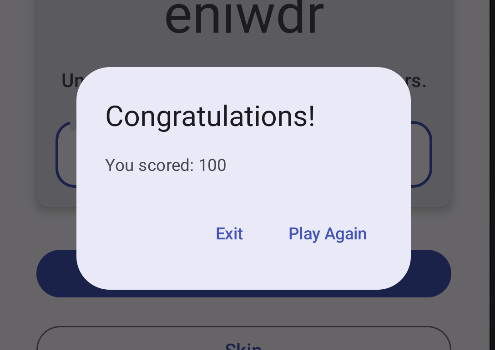

```kotlin
// No need to copy, this is included in the starter code.

@Composable
private fun FinalScoreDialog(
    score: Int,
    onPlayAgain: () -> Unit,
    modifier: Modifier = Modifier
) {
    val activity = (LocalContext.current as Activity)

    AlertDialog(
        onDismissRequest = {
           // Dismiss the dialog when the user clicks outside the dialog or on the back
           // button. If you want to disable that functionality, simply use an empty
           // onDismissRequest.
        },
        title = { Text(text = stringResource(R.string.congratulations)) },
        text = { Text(text = stringResource(R.string.you_scored, score)) },
        modifier = modifier,
        dismissButton = {
            TextButton(
                onClick = {
                    activity.finish()
                }
            ) {
                Text(text = stringResource(R.string.exit))
            }
        },
        confirmButton = {
            TextButton(onClick = onPlayAgain) {
                Text(text = stringResource(R.string.play_again))
            }
        }
    )
}
```

### 4. アプリ アーキテクチャの詳細

アプリ アーキテクチャでは、各クラスにアプリの責任を割り振る際のガイドラインを定めています。優れた設計のアプリ アーキテクチャでは、アプリの大規模化や機能追加による拡張が可能になります。アーキテクチャは、チームのコラボレーションを簡素化することもできます。

最も一般的な[アーキテクチャ原則](https://developer.android.com/jetpack/guide#common-principles)は、**関心の分離**と、**モデル駆動型 UI** です。

**関心の分離**

関心の分離という設計原則では、アプリを機能群に分割し、それぞれの機能群に別々の役割を持たせる必要があるとされています。

**モデル駆動型 UI**

モデル駆動型 UI の原則では、モデルから（できれば永続モデルから）UI を駆動するべきだとされています。モデルとは、アプリのデータ処理を担うコンポーネントです。モデルはアプリの UI 要素やアプリ コンポーネントから独立しているため、アプリのライフサイクルや関連する問題の影響を受けません。

#### アプリの推奨アーキテクチャ

前のセクションで説明したアーキテクチャに関する一般的な原則を考慮すると、各アプリに少なくとも 2 つのレイヤが必要です。

- **UI レイヤ:** アプリデータを画面に表示するレイヤですが、データからは独立しています。
- **データレイヤ:** アプリデータを格納、取得、公開するレイヤです。

ドメインレイヤという別のレイヤを追加することで、UI レイヤとデータレイヤの間のやり取りを簡素化でき、再利用できます。このレイヤは省略でき、このコースでは扱いません。

#### 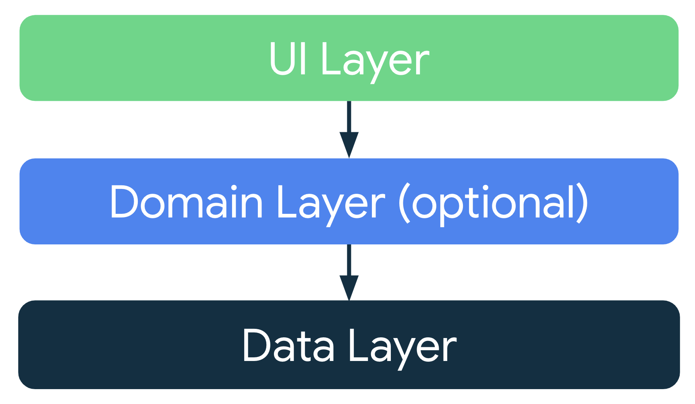

> **注**: このガイドの図にある矢印は、クラス間の依存関係を表しています。たとえば、ドメインレイヤはデータレイヤのクラスに依存しています。

##### UI レイヤ

UI レイヤ（またはプレゼンテーション レイヤ）の役割は、アプリデータを画面に表示することです。ユーザー操作（ボタンの押下など）によるデータの変更があると、UI を更新して変更を反映する必要があります。

UI レイヤは次のコンポーネントで構成されています。

- **UI 要素**: データを画面にレンダリングするコンポーネント。[Jetpack Compose](https://developer.android.com/jetpack/compose) を使用して作成します。
- **状態ホルダー:** データの保持、UI への公開、アプリロジックの処理を行うコンポーネント。状態ホルダーの例としては、[ViewModel](https://developer.android.com/topic/libraries/architecture/viewmodel) があります。

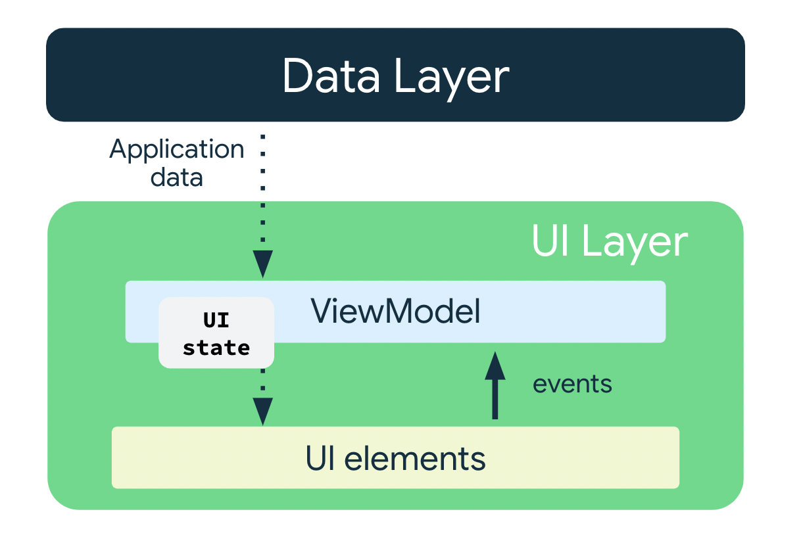

##### ViewModel

`ViewModel` コンポーネントは、UI が消費する状態を保持し、公開します。アプリデータを `ViewModel` が変換したものが UI 状態となります。`ViewModel` を使用することで、アプリがモデル駆動形 UI のアーキテクチャ原則に従うようにできます。

`ViewModel` には、Android フレームワークによってアクティビティが破棄されて再作成されたときにも破棄されない、アプリ関連のデータが保存されます。`ViewModel` オブジェクトは、アクティビティ インスタンスとは異なり、破棄されません。このアプリは、構成変更時に `ViewModel` オブジェクトを自動的に保持するため、保持しているデータを再コンポーズの直後にすぐに利用できます。

アプリに `ViewModel` を実装するには、アーキテクチャ コンポーネント ライブラリの `ViewModel` クラスを拡張して、そのクラス内にアプリデータを保存します。

##### UI 状態

ユーザーが目にするものが UI であり、ユーザーが目にするべきであるとアプリがみなすものが UI 状態です。UI は、UI 状態を視覚的に表したものです。UI 状態が変更されると、すぐに UI に反映されます。


UI は、画面上の UI 要素と UI 状態を足し合わせたものです。

```kotlin
// Example of UI state definition, do not copy over

data class NewsItemUiState(
    val title: String,
    val body: String,
    val bookmarked: Boolean = false,
    ...
)
```

##### **不変性**

上記の例では、UI 状態の定義は不変です。不変オブジェクトを使用することで、複数のソースが同時にアプリの状態を変更しないことを保証できます。この保護機能により UI は解放されて、状態の読み取りと、それに応じて UI 要素を更新するという唯一の役割に集中できます。したがって、UI 自体がそのデータの唯一のソースでない限り、UI 内で UI 状態を直接変更すべきではありません。この原則を破ると、同じ情報について信頼できるソースが複数発生し、データの不整合やわかりにくいバグにつながります。

### 5. ViewModel を追加する

このタスクでは、ゲームの UI 状態（スクランブルされた単語、単語カウント、スコア）を保存する `ViewModel` をアプリに追加します。前のセクションで見たスターター コードの問題を解決するために、ゲームデータを `ViewModel` に保存する必要があります。

1. `build.gradle.kts (Module :app)` を開き、`dependencies` ブロックまでスクロールして、`ViewModel` に次の依存関係を追加します。この依存関係は、ライフサイクル対応ビューモデルを Compose アプリに追加するために使用されます。

```kotlin
dependencies {
// other dependencies

    implementation("androidx.lifecycle:lifecycle-viewmodel-compose:2.6.1")
//...
}
```

2. `ui` パッケージで、`GameViewModel` という Kotlin のクラス / ファイルを作成します。これは `ViewModel` クラスから拡張します。

```kotlin
import androidx.lifecycle.ViewModel

class GameViewModel : ViewModel() {
}
```

3. `ui` パッケージで、`GameUiState` という状態 UI のモデルクラスを追加します。これをデータクラスにして、現在のスクランブルされた単語を表す変数を追加します。

```kotlin
data class GameUiState(
   val currentScrambledWord: String = ""
)
```

#### StateFlow

[`StateFlow`](https://kotlin.github.io/kotlinx.coroutines/kotlinx-coroutines-core/kotlinx.coroutines.flow/-state-flow/) は、現在の状態や新しい状態更新の情報を出力するデータ保持用の監視可能な Flow です。その [`value`](https://kotlin.github.io/kotlinx.coroutines/kotlinx-coroutines-core/kotlinx.coroutines.flow/-state-flow/value.html) プロパティは、現在の状態値を反映します。状態を更新してこの Flow に送信するには、[`MutableStateFlow`](https://kotlin.github.io/kotlinx.coroutines/kotlinx-coroutines-core/kotlinx.coroutines.flow/-mutable-state-flow/index.html) クラスの value プロパティに新しい値を割り当てます。

Android では、`StateFlow` は、オブザーバブルな不変状態を維持する必要があるクラスで適切に機能します。

`StateFlow` を `GameUiState` から公開し、コンポーザブルが UI 状態の更新をリッスンできるようにすることで、構成変更があっても画面状態が正常に維持されるようにできます。

`GameViewModel` クラスで、次の `_uiState` プロパティを追加します。

```kotlin
import kotlinx.coroutines.flow.MutableStateFlow

// Game UI state
private val _uiState = MutableStateFlow(GameUiState())
```

#### バッキング プロパティ

バッキング プロパティを使用すると、そのオブジェクト自体ではなくゲッターから返すことができます。

Kotlin のフレームワークでは、`var` プロパティのゲッターとセッターが生成されます。

ゲッター メソッドとセッター メソッドに関しては、両方または片方のメソッドをオーバーライドして、カスタムの動作を提供できます。バッキング プロパティを実装するには、ゲッター メソッドをオーバーライドして、データの読み取り専用バージョンを返すようにします。次の例でバッキング プロパティを示します。

```kotlin
//Example code, no need to copy over

// Declare private mutable variable that can only be modified
// within the class it is declared.
private var _count = 0 

// Declare another public immutable field and override its getter method. 
// Return the private property's value in the getter method.
// When count is accessed, the get() function is called and
// the value of _count is returned. 
val count: Int
    get() = _count
```

別の例として、アプリデータを `ViewModel` に対して非公開にする場合を考えてみましょう。

`ViewModel` クラスの内部:

- プロパティ `_count` は、`private` かつ可変です。したがって、`ViewModel` クラス内でのみアクセスと変更ができます。

`ViewModel` クラスの外部:

- Kotlin のデフォルトの可視性修飾子は `public` であるため、`count` は公開され、UI コントローラなどの他のクラスからアクセス可能です。`val` 型にセッターを指定することはできません。不変で読み取り専用であるため、オーバーライドできるのは `get()` メソッドのみです。外部のクラスがこのプロパティにアクセスすると、`_count` の値が返されますが、その値は変更できません。バッキング プロパティにより、`ViewModel` 内のアプリデータが、外部クラスによる望ましくない変更や安全でない変更から保護される一方で、外部の呼び出し元がその値に安全にアクセスできるようになります。

1. `GameViewModel.kt` ファイルで、バッキング プロパティを `_uiState` という名前の `uiState` に追加します。プロパティに `uiState` という名前を付け、`StateFlow<GameUiState>` 型にします。

現在、`_uiState` は `GameViewModel` 内でのみアクセスと変更が可能です。UI は、読み取り専用のプロパティ `uiState` を使用して、その値を読み取ることができます。初期化エラーは次のステップで修正できます。

```kotlin
import kotlinx.coroutines.flow.StateFlow

// Game UI state

// Backing property to avoid state updates from other classes
private val _uiState = MutableStateFlow(GameUiState())
val uiState: StateFlow<GameUiState> 
```

2. `uiState` を `_uiState.asStateFlow()` に設定します。

`asStateFlow()` により、この可変の状態フローが読み取り専用の状態フローになります。

```kotlin
import kotlinx.coroutines.flow.StateFlow
import kotlinx.coroutines.flow.asStateFlow

// Game UI state
private val _uiState = MutableStateFlow(GameUiState())
val uiState: StateFlow<GameUiState> = _uiState.asStateFlow()
```

#### スクランブルされた単語をランダムに表示する

このタスクでは、`WordsData.kt` からランダムな単語を選択して、その単語をスクランブルする、ヘルパー メソッドを追加します。

1. `GameViewModel` で、`currentWord` という `String` 型のプロパティを追加して、現在のスクランブルされた単語を保存します。

```kotlin
private lateinit var currentWord: String
```

2. リストからランダムな単語を選択してシャッフルするヘルパー メソッドを追加します。`pickRandomWordAndShuffle()` という名前を付け、入力パラメータはとらず、`String` を返すようにします。

```kotlin
import com.example.unscramble.data.allWords

private fun pickRandomWordAndShuffle(): String {
   // Continue picking up a new random word until you get one that hasn't been used before
   currentWord = allWords.random()
   if (usedWords.contains(currentWord)) {
       return pickRandomWordAndShuffle()
   } else {
       usedWords.add(currentWord)
       return shuffleCurrentWord(currentWord)
   }
}
```

Android Studio で未定義の変数と関数のエラーが報告されます。

3. `GameViewModel` で、`currentWord` プロパティの後に、以下のプロパティを追加します。このプロパティは、そのゲームで使用済みの単語を格納するための可変の Set となります。

```kotlin
// Set of words used in the game
private var usedWords: MutableSet<String> = mutableSetOf()
```

4. 現在の単語をシャッフルする `shuffleCurrentWord()` という名前の別のヘルパー メソッドを追加します。`String` を受け取ってシャッフルされた `String` を返すメソッドです。

```kotlin
private fun shuffleCurrentWord(word: String): String {
   val tempWord = word.toCharArray()
   // Scramble the word
   tempWord.shuffle()
   while (String(tempWord).equals(word)) {
       tempWord.shuffle()
   }
   return String(tempWord)
}
```

5. ゲームを初期化する `resetGame()` という名前のヘルパー関数を追加します。この関数は後でゲームの開始と再開に使用します。この関数では、`usedWords` Set 内のすべての単語をクリアし、`_uiState` を初期化します。`pickRandomWordAndShuffle()` を使用して、`currentScrambledWord` に設定する新しい単語を選びます。

```kotlin
fun resetGame() {
   usedWords.clear()
   _uiState.value = GameUiState(currentScrambledWord = pickRandomWordAndShuffle())
}
```

6. `GameViewModel` に `init` ブロックを追加して、そこから `resetGame()` を呼び出します。

```kotlin
init {
   resetGame()
}
```

ここでアプリをビルドしても、UI に変化はありません。データを `ViewModel` から `GameScreen` のコンポーザブルに渡していません。

### 6. Compose UI を設計する

Compose では、UI を更新する唯一の方法は、アプリの状態を変更することです。制御できるのは UI の状態です。UI の状態が変化するたびに、Compose は UI ツリーの変化した部分を再作成します。コンポーザブルは、状態を受け取ってイベントを公開できます。たとえば、`TextField` / `OutlinedTextField` は値を受け取って、コールバック ハンドラに値の変更をリクエストするコールバック `onValueChange` を公開します。

```kotlin
//Example code no need to copy over

var name by remember { mutableStateOf("") }
OutlinedTextField(
    value = name,
    onValueChange = { name = it },
    label = { Text("Name") }
)
```

コンポーザブルは状態を受け取ってイベントを公開するので、単方向データフロー パターンは Jetpack Compose に適しています。このセクションでは、Compose で単方向データフロー パターンを実装する方法、イベントと状態ホルダーを実装する方法、Compose で `ViewModel` を操作する方法に焦点を当てます。

#### **単方向データフロー**

単方向データフロー（UDF）は、状態が下方に流れ、イベントが上方に流れる設計パターンです。単方向データフローに従うことで、UI に状態を表示するコンポーザブルを、アプリ内で状態を保存および変更する部分から分離できます。

単方向データフローを使用するアプリの UI 更新ループは、次のようになります。

- **イベント**: UI の一部がイベントを生成して上方に渡します（たとえば、ボタンクリックが ViewModel に渡されて処理される場合）。または、アプリの他のレイヤからイベントが渡されます（たとえば、ユーザー セッションの有効期限が切れていることを示す場合）。
- **状態の更新:** イベント ハンドラが状態を変更します。
- **状態の表示**: 状態ホルダーが状態を下方に渡し、UI が状態を表示します。

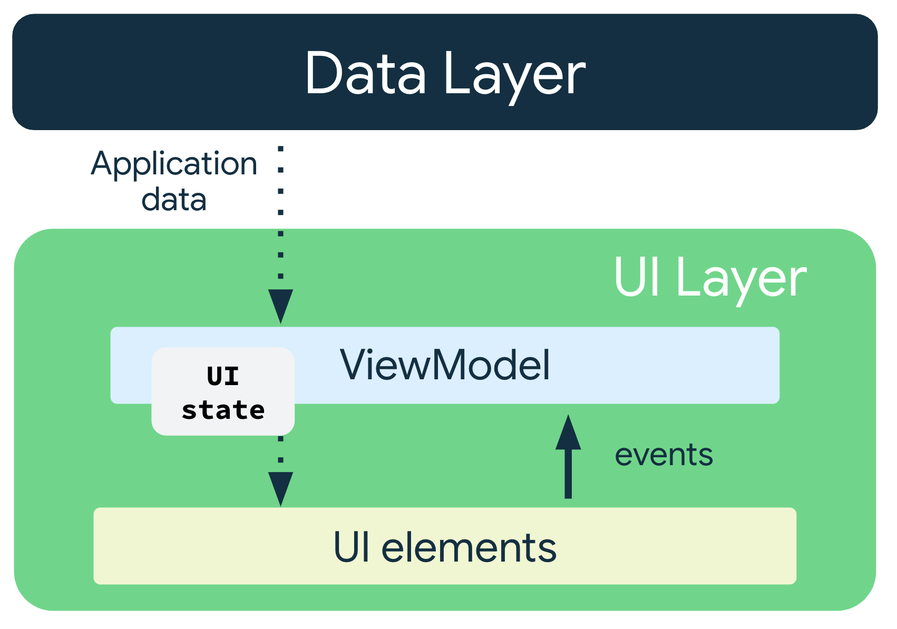

アプリ アーキテクチャに UDF パターンを採用すると、次の影響があります。

- `ViewModel` は、UI が消費する状態を保持し、公開します。
- UI 状態は、`ViewModel` によって変換されたアプリデータです。
- UI は、ユーザー イベントを `ViewModel` に通知します。
- `ViewModel` は、ユーザー アクションを処理し、状態を更新します。
- 更新された状態は、UI にフィードバックされてレンダリングされます。
- 以上のプロセスは、状態の変化を引き起こす任意のイベントで繰り返されます。

#### データを渡す

ViewModel インスタンスを UI に渡します。つまり、**`GameScreen.kt`** ファイルで `GameViewModel` から `GameScreen()` に渡します。`GameScreen()` で、ViewModel のインスタンスを使用して `collectAsState()` で `uiState` にアクセスします。

`collectAsState()` 関数は、この [`StateFlow`](https://kotlin.github.io/kotlinx.coroutines/kotlinx-coroutines-core/kotlinx.coroutines.flow/-state-flow/index.html) から値を収集し、[`State`](https://developer.android.com/reference/kotlin/androidx/compose/runtime/State) を介してその最新の値を提示します。[`StateFlow.value`](https://kotlin.github.io/kotlinx.coroutines/kotlinx-coroutines-core/kotlinx.coroutines.flow/-state-flow/value.html) が初期値に使用されます。[`StateFlow`](https://kotlin.github.io/kotlinx.coroutines/kotlinx-coroutines-core/kotlinx.coroutines.flow/-state-flow/index.html) に新しい値が送信されるたびに、返された [`State`](https://developer.android.com/reference/kotlin/androidx/compose/runtime/State) が更新されるので、[`State.value`](https://developer.android.com/reference/kotlin/androidx/compose/runtime/State#value()) を使用するごとに再コンポーズが発生します。

1. `GameScreen` 関数で、`GameViewModel` 型でデフォルト値が `viewModel()` の 2 番目の引数を渡します。

```kotlin
import androidx.lifecycle.viewmodel.compose.viewModel

@Composable
fun GameScreen(
   gameViewModel: GameViewModel = viewModel()
) {
   // ...
}
```

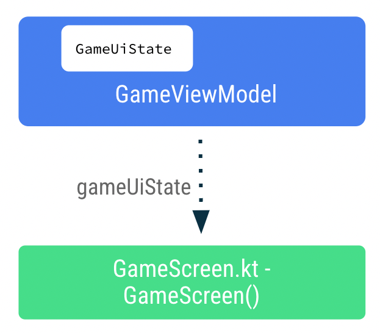

2. `GameScreen()` 関数に、`gameUiState` という名前の新しい変数を追加します。`by` デリゲートを使用して、`uiState` の `collectAsState()` を呼び出します。

この方法で、`uiState` 値が変更されるたびに、`gameUiState` 値を使用したコンポーザブルの再コンポーズが行われるようになります。

```kotlin
import androidx.compose.runtime.collectAsState
import androidx.compose.runtime.getValue

@Composable
fun GameScreen(
   // ...
) {
   val gameUiState by gameViewModel.uiState.collectAsState()
   // ...
}
```

3. `gameUiState.currentScrambledWord` を `GameLayout()` コンポーザブルに渡します。引数は後のステップで追加するので、ここではエラーを無視します。

```kotlin
GameLayout(
   currentScrambledWord = gameUiState.currentScrambledWord,
   modifier = Modifier
       .fillMaxWidth()
       .wrapContentHeight()
       .padding(mediumPadding)
)
```

4. コンポーズ可能な関数 `GameLayout()` にもう 1 つのパラメータとして `currentScrambledWord` を追加します。

```kotlin
@Composable
fun GameLayout(
   currentScrambledWord: String,
   modifier: Modifier = Modifier
) {
}
```

5. `currentScrambledWord` を表示するようにコンポーズ可能な関数 `GameLayout()` を更新します。この列の最初のテキスト フィールドの `text` パラメータを `currentScrambledWord` に設定します。

```kotlin
@Composable
fun GameLayout(
   // ...
) {
   Column(
       verticalArrangement = Arrangement.spacedBy(24.dp)
   ) {
       Text(
           text = currentScrambledWord,
           fontSize = 45.sp,
           modifier = modifier.align(Alignment.CenterHorizontally)
       )
    //... 
    }
}
```

6. アプリをビルドして実行すると、スクランブルされた単語が表示されます。

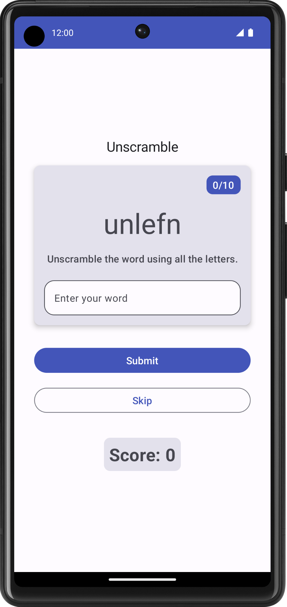

#### 推測した単語を表示する

`GameLayout()` コンポーザブルでは、ユーザーが推測した単語の更新が、`GameScreen` から `ViewModel` へと上方に流れるイベント コールバックの 1 つになります。データ `gameViewModel.userGuess` は `ViewModel` から `GameScreen` へと下方に流れます。

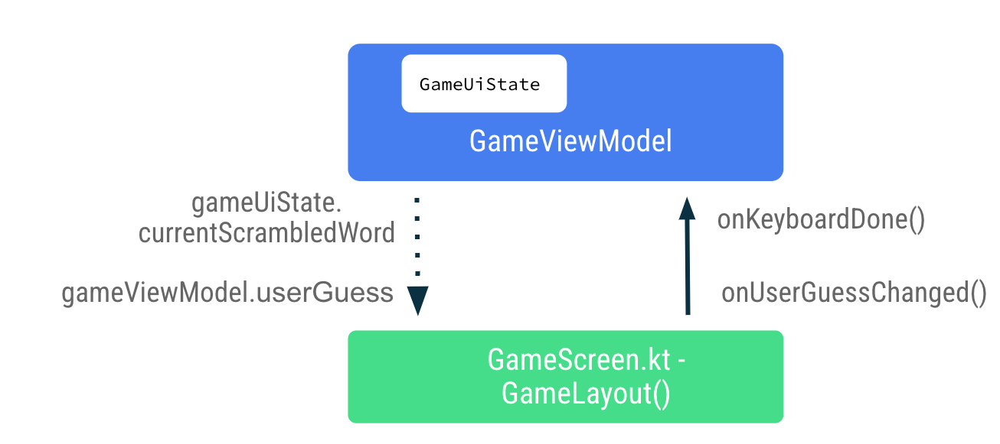

1. **`GameScreen.kt`** ファイルの `GameLayout()` コンポーザブルで、`onValueChange` を `onUserGuessChanged` に設定し、`onKeyboardDone()` を `onDone` キーボード アクションに設定します。エラーは次のステップで修正します。

```kotlin
OutlinedTextField(
   value = "",
   singleLine = true,
   modifier = Modifier.fillMaxWidth(),
   onValueChange = onUserGuessChanged,
   label = { Text(stringResource(R.string.enter_your_word)) },
   isError = false,
   keyboardOptions = KeyboardOptions.Default.copy(
       imeAction = ImeAction.Done
   ),
   keyboardActions = KeyboardActions(
       onDone = { onKeyboardDone() }
   ),
```

2. コンポーズ可能な関数 `GameLayout()` に、引数を 2 つ追加します。`onUserGuessChanged` ラムダは、`String` 引数をとって何も返さず、`onKeyboardDone` は、何も受け取らず何も返しません。

```kotlin
@Composable
fun GameLayout(
   onUserGuessChanged: (String) -> Unit,
   onKeyboardDone: () -> Unit,
   currentScrambledWord: String,
   modifier: Modifier = Modifier,
   ) {
}
```

3. `GameLayout()` 関数呼び出しで、`onUserGuessChanged` と `onKeyboardDone` にラムダ引数を追加します。

```kotlin
GameLayout(
   onUserGuessChanged = { gameViewModel.updateUserGuess(it) },
   onKeyboardDone = { },
   currentScrambledWord = gameUiState.currentScrambledWord,
)
```

`GameViewModel` の `updateUserGuess` メソッドの定義は、この後すぐ行います。

4. **`GameViewModel.kt`** ファイルで、ユーザーが推測した単語 `String` 引数を取る `updateUserGuess()` というメソッドを追加します。この関数内で、渡された `guessedWord` で `userGuess` を更新します。

```kotlin
  fun updateUserGuess(guessedWord: String){
     userGuess = guessedWord
  }
```

次に、ViewModel で `userGuess` を追加します。

5. `GameViewModel.kt` ファイルで、`userGuess` という var プロパティを追加します。`mutableStateOf()` を使用して、Compose がこの値を監視し、初期値を `""` に設定するようにします。

```kotlin
import androidx.compose.runtime.mutableStateOf
import androidx.compose.runtime.getValue
import androidx.compose.runtime.setValue

var userGuess by mutableStateOf("")
   private set
```

6. `GameScreen.kt` ファイルで、`GameLayout()` 内に `userGuess` の別の `String` パラメータを追加します。`OutlinedTextField` の `value` パラメータを `userGuess` に設定します。

```kotlin
fun GameLayout(
   currentScrambledWord: String,
   userGuess: String,
   onUserGuessChanged: (String) -> Unit,
   onKeyboardDone: () -> Unit,
   modifier: Modifier = Modifier
) {
   Column(
       verticalArrangement = Arrangement.spacedBy(24.dp)
   ) {
       //...
       OutlinedTextField(
           value = userGuess,
           //..
       )
   }
}
```

7. `GameScreen` 関数で、`GameLayout()` 関数の呼び出しに `userGuess` パラメータを追加します。

```kotlin
GameLayout(
   currentScrambledWord = gameUiState.currentScrambledWord,
   userGuess = gameViewModel.userGuess,
   onUserGuessChanged = { gameViewModel.updateUserGuess(it) },
   onKeyboardDone = { },
   //...
)
```

8. アプリをビルドして実行します。
9. 推測した単語を入力すると、テキスト フィールドにユーザーの推測が表示されます。

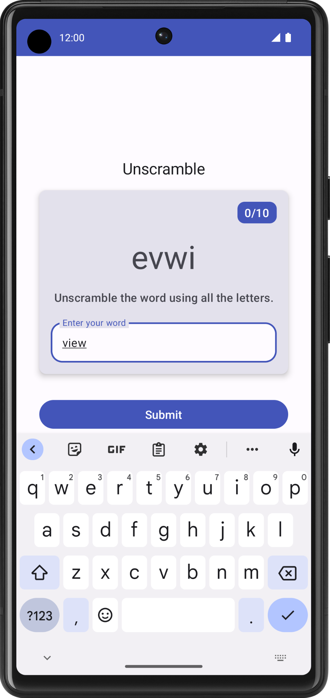

### 7. 推測した単語を照合して、スコアを更新する

このタスクでは、ユーザーが推測した単語を照合してから、ゲームスコアの更新とエラーの表示のどちらかを行うメソッドを実装します。ゲーム ステータスの UI は、後で新しいスコアと新しい単語で更新します。

1. `GameViewModel` で、`checkUserGuess()` という別のメソッドを追加します。
2. `checkUserGuess()` 関数で、ユーザーの推測が `currentWord` と同じかどうかを確かめる `if else` ブロックを追加します。`userGuess` を空の文字列にリセットします。

```kotlin
fun checkUserGuess() {
   
   if (userGuess.equals(currentWord, ignoreCase = true)) {
   } else {
   }
   // Reset user guess
   updateUserGuess("")
}
```

3. ユーザーの推測が間違っている場合は、`isGuessedWordWrong` を `true` に設定します。[`MutableStateFlow<T>.`](https://kotlinlang.org/api/kotlinx.coroutines/kotlinx-coroutines-core/kotlinx.coroutines.flow/-mutable-state-flow/index.html) [`update()`](https://kotlinlang.org/api/kotlinx.coroutines/kotlinx-coroutines-core/kotlinx.coroutines.flow/update.html) が指定された値を使って [`MutableStateFlow.value`](https://kotlinlang.org/api/kotlinx.coroutines/kotlinx-coroutines-core/kotlinx.coroutines.flow/-mutable-state-flow/value.html) を更新します。

```kotlin
import kotlinx.coroutines.flow.update

   if (userGuess.equals(currentWord, ignoreCase = true)) {
   } else {
       // User's guess is wrong, show an error
       _uiState.update { currentState ->
           currentState.copy(isGuessedWordWrong = true)
       }
   }
```

> **copy() メソッドに関する注意:** `copy()` 関数を使用してオブジェクトをコピーすると、一部のプロパティを変更し、残りのプロパティはそのままにするということができます。
> 
> 例:
> 
> `val jack =` `User(name =` `"Jack", age =` `1)`
> 
> `val olderJack = jack.copy(age =` `2)`

4. `GameUiState` クラスで、`isGuessedWordWrong` という `Boolean` を追加し、`false` に初期化します。

```kotlin
data class GameUiState(
   val currentScrambledWord: String = "",
   val isGuessedWordWrong: Boolean = false,
)
```

次に、ユーザーが [**Submit**] ボタンかキーボードの [done] キーをクリックしたときに、イベント コールバック `checkUserGuess()` を `GameScreen` から `ViewModel` へと上方に渡します。テキスト フィールドにエラーを設定するために、データ `gameUiState.isGuessedWordWrong` を `ViewModel` から `GameScreen` へと下方に渡します。

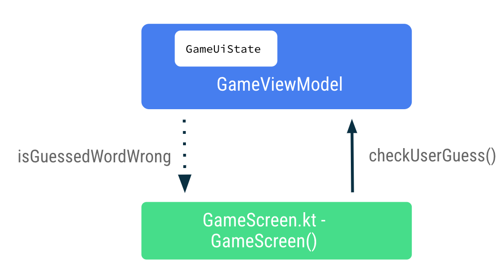

1. `GameScreen.kt` ファイルのコンポーズ可能な関数 `GameScreen()` の最後にある、[**Submit**] ボタンの `onClick` ラムダ式内で `gameViewModel.checkUserGuess()` を呼び出します。

```kotlin
Button(
   modifier = modifier
       .fillMaxWidth()
       .weight(1f)
       .padding(start = 8.dp),
   onClick = { gameViewModel.checkUserGuess() }
) {
   Text(stringResource(R.string.submit))
}
```

2. コンポーズ可能な関数 `GameScreen()` で、`GameLayout()` 関数呼び出しを更新して、`onKeyboardDone` ラムダ式で `gameViewModel.checkUserGuess()` を渡します。

```kotlin
GameLayout(
   currentScrambledWord = gameUiState.currentScrambledWord,
   userGuess = gameViewModel.userGuess,
   onUserGuessChanged = { gameViewModel.updateUserGuess(it) },
   onKeyboardDone = { gameViewModel.checkUserGuess() }
)
```

3. コンポーズ可能な関数 `GameLayout()` で、`Boolean` の関数パラメータ **`isGuessWrong`** を追加します。ユーザーの推測が間違っている場合にテキスト フィールドにエラーを表示するために、`OutlinedTextField` の **`isError`** パラメータを **`isGuessWrong`** に設定します。

```kotlin
fun GameLayout(
   currentScrambledWord: String,
   isGuessWrong: Boolean,
   userGuess: String,
   onUserGuessChanged: (String) -> Unit,
   onKeyboardDone: () -> Unit,
   modifier: Modifier = Modifier
) {
   Column(
       // ,...
       OutlinedTextField(
           // ...
           isError = isGuessWrong,
           keyboardOptions = KeyboardOptions.Default.copy(
               imeAction = ImeAction.Done
           ),
           keyboardActions = KeyboardActions(
               onDone = { onKeyboardDone() }
           ),
       )
}
}
```

4. コンポーズ可能な関数 `GameScreen()` で、`GameLayout()` 関数呼び出しを更新して `isGuessWrong` を渡します。

```kotlin
GameLayout(
   currentScrambledWord = gameUiState.currentScrambledWord,
   userGuess = gameViewModel.userGuess,
   onUserGuessChanged = { gameViewModel.updateUserGuess(it) },
   onKeyboardDone = { gameViewModel.checkUserGuess() },
   isGuessWrong = gameUiState.isGuessedWordWrong,
   // ...
)
```

5. アプリをビルドして実行します。
6. 間違った推測を入力して [**Submit**] をクリックします。テキスト フィールドが赤色に変わり、エラーを示していることを確認します。


テキスト フィールドのラベルには「Enter your word」と表示されています。ユーザー フレンドリーにするために、単語が間違っていることを示すエラーテキストを追加する必要があります。

7. **`GameScreen.kt`** ファイルの `GameLayout()` コンポーザブルで、`isGuessWrong` に応じてテキスト フィールドのラベル パラメータを次のように更新します。

```kotlin
OutlinedTextField(
   // ...
   label = {
       if (isGuessWrong) {
           Text(stringResource(R.string.wrong_guess))
       } else {
           Text(stringResource(R.string.enter_your_word))
       }
   },
   // ...
)
```

8. `strings.xml` ファイルで、エラーラベルに文字列を追加します。

```kotlin
<string name="wrong_guess">Wrong Guess!</string>
```

9. 再度アプリをビルドして実行します。
10. 間違った推測を入力して [**Submit**] をクリックします。エラーラベルに注目してください。

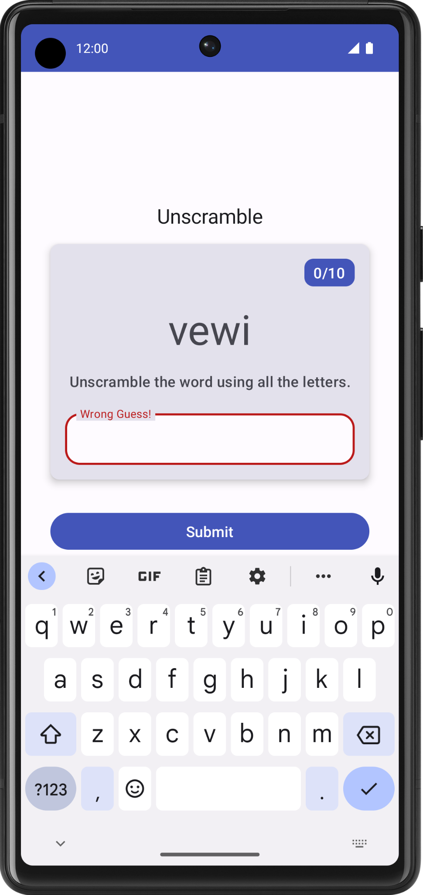

### 8. スコアと単語カウントを更新する

このタスクでは、ユーザーがゲームをプレイする際に、スコアと単語カウントを更新します。スコアは `_ uiState` に含まれている必要があります。

1. `GameUiState` で、`score` 変数を追加して、ゼロに初期化します。

```kotlin
data class GameUiState(
   val currentScrambledWord: String = "",
   val isGuessedWordWrong: Boolean = false,
   val score: Int = 0
)
```

2. スコア値を更新するために、`GameViewModel` の `checkUserGuess()` 関数にある、ユーザーの推測が正しかったときの `if` 条件内で `score` 値を増やします。

```kotlin
import com.example.unscramble.data.SCORE_INCREASE

fun checkUserGuess() {
   if (userGuess.equals(currentWord, ignoreCase = true)) {
       // User's guess is correct, increase the score
       val updatedScore = _uiState.value.score.plus(SCORE_INCREASE)
   } else {
       //...
   }
}
```

3. `GameViewModel` で、`updateGameState` という別のメソッドを追加して、スコアを更新し、現在の単語カウントを増分して、`WordsData.kt` ファイルから新しい単語を選べるようにします。パラメータとして `updatedScore` という名前の `Int` を追加します。ゲーム ステータスの UI 変数を次のように更新します。

```kotlin
private fun updateGameState(updatedScore: Int) {
   _uiState.update { currentState ->
       currentState.copy(
           isGuessedWordWrong = false,
           currentScrambledWord = pickRandomWordAndShuffle(),
           score = updatedScore
       )
   }
}
```

4. `checkUserGuess()` 関数で、ユーザーの推測が正しい場合に、更新されたスコアで `updateGameState` を呼び出して、次のラウンドのゲームを準備します。

```kotlin
fun checkUserGuess() {
   if (userGuess.equals(currentWord, ignoreCase = true)) {
       // User's guess is correct, increase the score
       // and call updateGameState() to prepare the game for next round
       val updatedScore = _uiState.value.score.plus(SCORE_INCREASE)
       updateGameState(updatedScore)
   } else {
       //...
   }
}
```

完成した `checkUserGuess()` は次のようになります。

```kotlin
fun checkUserGuess() {
   if (userGuess.equals(currentWord, ignoreCase = true)) {
       // User's guess is correct, increase the score
       // and call updateGameState() to prepare the game for next round
       val updatedScore = _uiState.value.score.plus(SCORE_INCREASE)
       updateGameState(updatedScore)
   } else {
       // User's guess is wrong, show an error
       _uiState.update { currentState ->
           currentState.copy(isGuessedWordWrong = true)
       }
   }
   // Reset user guess
   updateUserGuess("")
}
```

次に、スコアの更新と同様に、単語カウントを更新する必要があります。

5. `GameUiState` にカウント用の別の変数を追加します。`currentWordCount` という名前にして `1` に初期化します。

```kotlin
data class GameUiState(
   val currentScrambledWord: String = "",
   val currentWordCount: Int = 1,
   val score: Int = 0,
   val isGuessedWordWrong: Boolean = false,
)
```

6. `GameViewModel.kt` ファイルの `updateGameState()` 関数で、次のように単語カウントを増やします。`updateGameState()` 関数は、次のラウンドのゲームを準備するために呼び出されます。

```kotlin
private fun updateGameState(updatedScore: Int) {
   _uiState.update { currentState ->
       currentState.copy(
           //...
           currentWordCount = currentState.currentWordCount.inc(),
           )
   }
}
```

#### スコアと単語カウントを渡す

以下のステップで、スコアと単語カウントのデータを `ViewModel` から `GameScreen` へと下方に渡します。

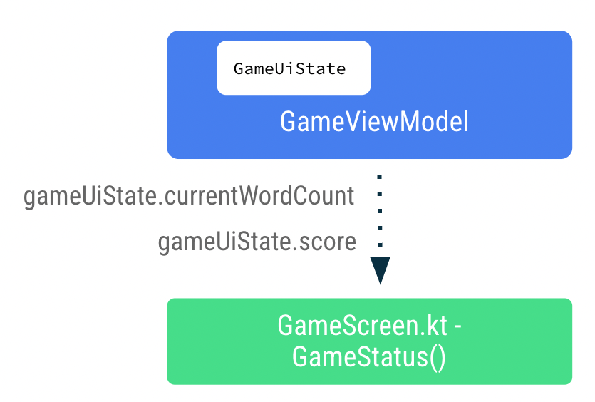

1. `GameScreen.kt` ファイルのコンポーズ可能な関数 `GameLayout()` で、単語カウントを引数として追加し、**`wordCount`** 形式の引数をテキスト要素に渡します。

```kotlin
fun GameLayout(
   onUserGuessChanged: (String) -> Unit,
   onKeyboardDone: () -> Unit,
   wordCount: Int,
   //...
) {
   //...

   Card(
       //...
   ) {
       Column(
           // ...
       ) {
           Text(
               //..
               text = stringResource(R.string.word_count, wordCount),
               style = typography.titleMedium,
               color = colorScheme.onPrimary
           )

// ...

}
```

2. 単語カウントを含めるように `GameLayout()` 関数呼び出しを更新します。

```kotlin
GameLayout(
   userGuess = gameViewModel.userGuess,
   wordCount = gameUiState.currentWordCount,
   //...
)
```

3. コンポーズ可能な関数 `GameScreen()` で、`GameStatus()` 関数呼び出しを更新して、`score` パラメータを追加します。`gameUiState` のスコアを渡します。

```kotlin
GameStatus(score = gameUiState.score, modifier = Modifier.padding(20.dp))
```

4. アプリをビルドして実行します。
5. 推測した単語を入力して [**Submit**] をクリックします。スコアと単語カウントが更新されます。
6. [**Skip**] をクリックしても、何も起こりません。

スキップ機能を実装するには、スキップ イベントのコールバックを `GameViewModel` に渡す必要があります。

7. `GameScreen.kt` ファイルにあるコンポーズ可能な関数 `GameScreen()` の `onClick` ラムダ式内で `gameViewModel.skipWord()` を呼び出します。

この関数はまだ実装されていないため、Android Studio にエラーが表示されます。このエラーは、次のステップで `skipWord()` メソッドを追加して修正します。ユーザーが単語をスキップしたときには、ゲーム変数を更新し、次のラウンドのゲームを準備する必要があります。

```kotlin
OutlinedButton(
   onClick = { gameViewModel.skipWord() },
   modifier = Modifier.fillMaxWidth()
) {
   //...
}
```

8. `GameViewModel` で、メソッド `skipWord()` を追加します。
9. `skipWord()` 関数内で、`updateGameState()` を呼び出して、スコアを渡し、ユーザーの推測をリセットします。

```kotlin
fun skipWord() {
   updateGameState(_uiState.value.score)
   // Reset user guess
   updateUserGuess("")
}
```

10. アプリを実行して、ゲームをプレイします。単語をスキップできるようになっているはずです。

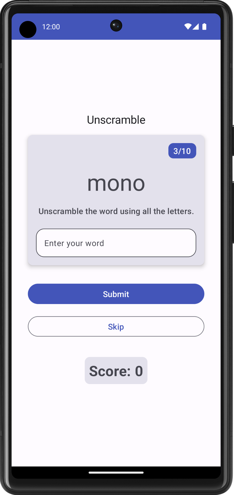

単語が 10 個を超えてもゲームをプレイできます。次のタスクでは、ゲームの最終ラウンドの処理を行います。

### 9. ゲームの最終ラウンドを処理する

現在の実装では、ユーザーは 10 語を超えてスキップまたはプレイできます。このタスクでは、ゲームを終了するためのロジックを追加します。

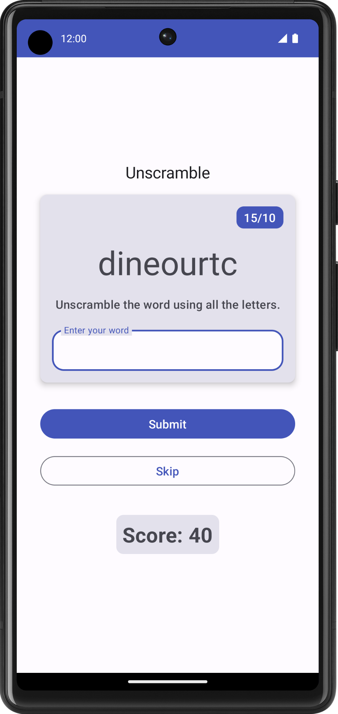

ゲーム終了のロジックを実装するには、まずユーザーが単語数の上限に達しているかどうかを確認する必要があります。

1. `GameViewModel` に `if-else` ブロックを追加し、既存の関数本体を `else` ブロック内に移動します。
2. `usedWords` のサイズが `MAX_NO_OF_WORDS` と等しいことを確認する `if` 条件を追加します。

```kotlin
import com.example.android.unscramble.data.MAX_NO_OF_WORDS

private fun updateGameState(updatedScore: Int) {
   if (usedWords.size == MAX_NO_OF_WORDS){
       //Last round in the game
   } else{
       // Normal round in the game
       _uiState.update { currentState ->
           currentState.copy(
               isGuessedWordWrong = false,
               currentScrambledWord = pickRandomWordAndShuffle(),
               currentWordCount = currentState.currentWordCount.inc(),
               score = updatedScore
           )
       }
   }
}
```

3. `if` ブロックで、`Boolean` フラグの `isGameOver` を追加し、このフラグをゲームの終了を示す `true` に設定します。
4. `if` ブロック内で、`score` を更新して `isGuessedWordWrong` をリセットします。関数のコードは次のようになるはずです。

```kotlin
private fun updateGameState(updatedScore: Int) {
   if (usedWords.size == MAX_NO_OF_WORDS){
       //Last round in the game, update isGameOver to true, don't pick a new word
       _uiState.update { currentState ->
           currentState.copy(
               isGuessedWordWrong = false,
               score = updatedScore,
               isGameOver = true
           )
       }
   } else{
       // Normal round in the game
       _uiState.update { currentState ->
           currentState.copy(
               isGuessedWordWrong = false,
               currentScrambledWord = pickRandomWordAndShuffle(),
               currentWordCount = currentState.currentWordCount.inc(),
               score = updatedScore
           )
       }
   }
}
```

5. `GameUiState` で、`Boolean` の変数 `isGameOver` を追加し、`false` に設定します。

```kotlin
data class GameUiState(
   val currentScrambledWord: String = "",
   val currentWordCount: Int = 1,
   val score: Int = 0,
   val isGuessedWordWrong: Boolean = false,
   val isGameOver: Boolean = false
)
```

6. アプリを実行して、ゲームをプレイします。10 単語を超えてはプレイできません。

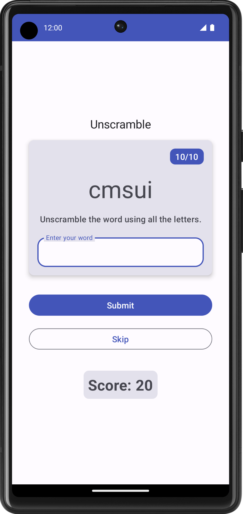

ゲームが終了したら、ユーザーに知らせて、もう一度プレイしたいかを尋ねるのがよいでしょう。この機能は、次のタスクで実装します。

#### ゲーム終了ダイアログを表示する

このタスクでは、`isGameOver` データを ViewModel から `GameScreen` へと下方に渡し、それを使用してゲームの終了と再開の選択肢があるアラート ダイアログを表示します。

ダイアログは、ユーザーによる意思決定や追加情報の入力を求める小さなウィンドウです。通常、ダイアログは画面全体に表示されるのではなく、また続行するにはユーザーが操作を行う必要があります。Android には、さまざまな種類のダイアログが用意されています。この Codelab では、アラート ダイアログについて学習します。

##### アラート ダイアログの構造

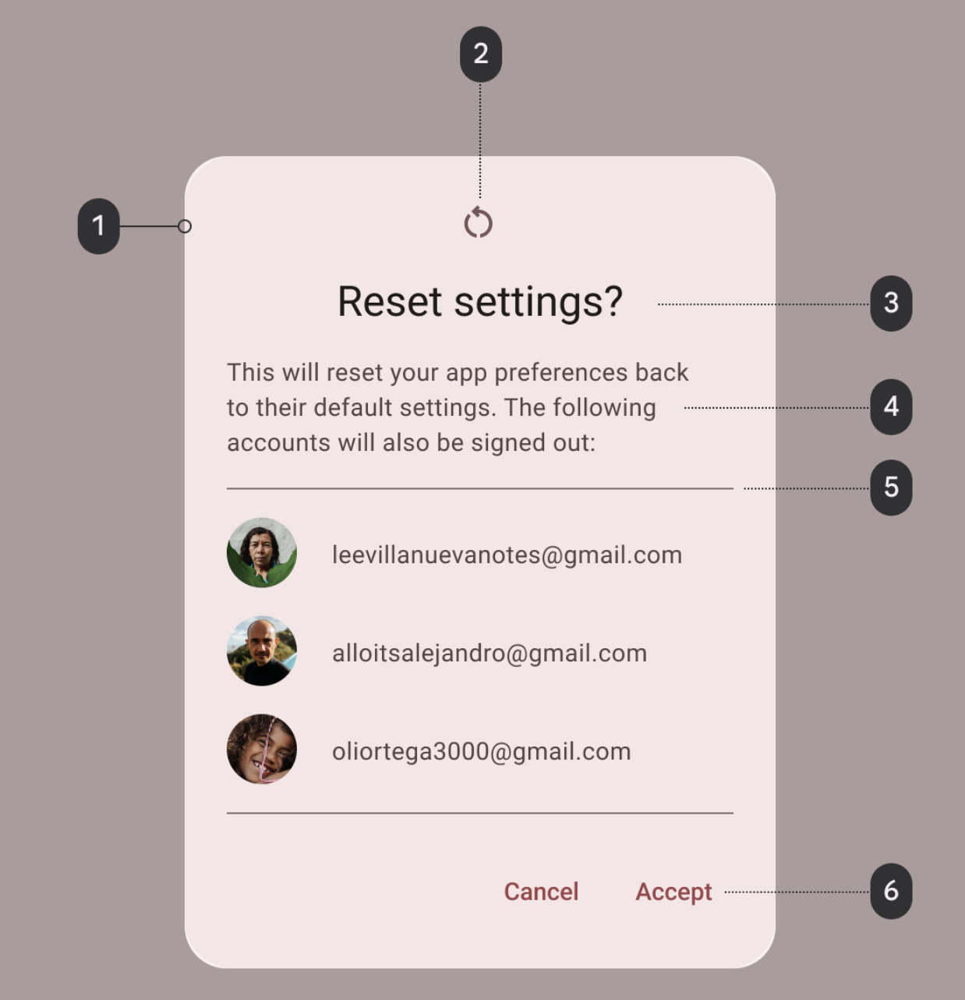

1. コンテナ
2. アイコン（省略可）
3. 見出し（省略可）
4. サポート テキスト
5. 分割線（省略可）
6. アクション

スターター コードの `GameScreen.kt` ファイルに、ゲームを終了するか再起動するかを選択できるアラート ダイアログを表示する関数がすでに用意されています。

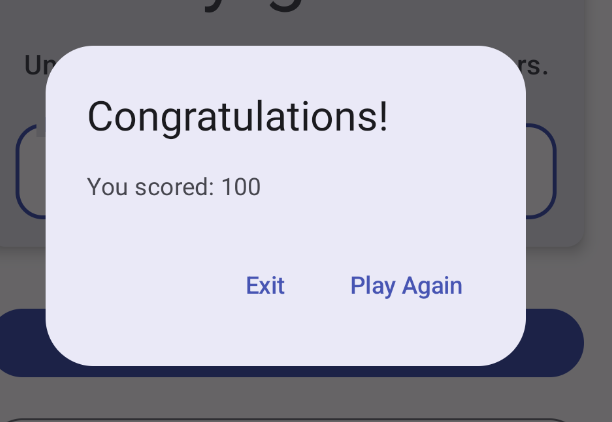

```kotlin
@Composable
private fun FinalScoreDialog(
   onPlayAgain: () -> Unit,
   modifier: Modifier = Modifier
) {
   val activity = (LocalContext.current as Activity)

   AlertDialog(
       onDismissRequest = {
           // Dismiss the dialog when the user clicks outside the dialog or on the back
           // button. If you want to disable that functionality, simply use an empty
           // onDismissRequest.
       },
       title = { Text(stringResource(R.string.congratulations)) },
       text = { Text(stringResource(R.string.you_scored, 0)) },
       modifier = modifier,
       dismissButton = {
           TextButton(
               onClick = {
                   activity.finish()
               }
           ) {
               Text(text = stringResource(R.string.exit))
           }
       },
       confirmButton = {
           TextButton(
               onClick = {
                   onPlayAgain()
               }
           ) {
               Text(text = stringResource(R.string.play_again))
           }
       }
   )
}
```

この関数では、`title` パラメータと `text` パラメータがアラート ダイアログに見出しとサポート テキストを表示します。`dismissButton` と `confirmButton` はテキストボタンです。`dismissButton` パラメータで、「**Exit**」というテキストを表示し、アクティビティを終了することでアプリを終了します。`confirmButton` パラメータで、ゲームを再開し、「**Play Again**」というテキストを表示します。

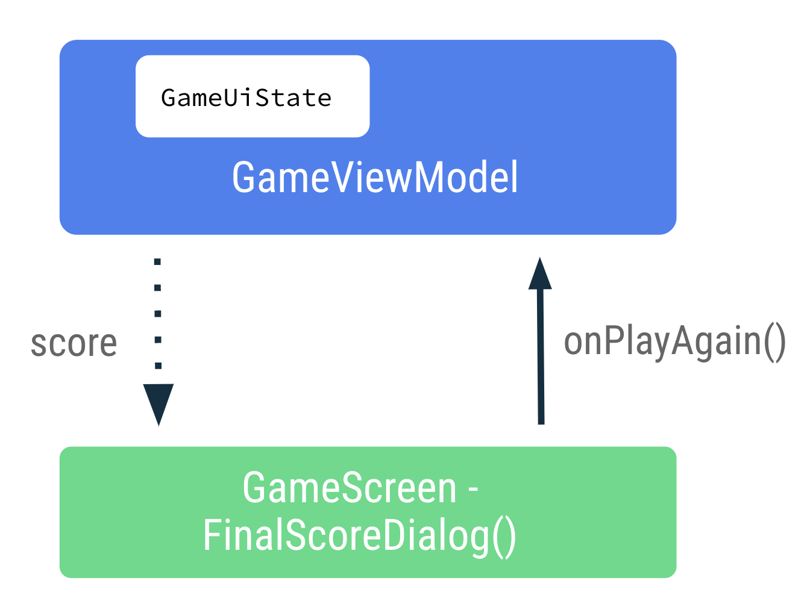

1. `GameScreen.kt` ファイルの `FinalScoreDialog()` 関数で、アラート ダイアログにゲームのスコアを表示するためのスコアのパラメータに注意してください。

```kotlin
@Composable
private fun FinalScoreDialog(
   score: Int,
   onPlayAgain: () -> Unit,
   modifier: Modifier = Modifier
) {
```

2. `FinalScoreDialog()` 関数で、`text` パラメータのラムダ式を使用して、ダイアログ テキストのフォーマット引数として `score` を使用しています。

```kotlin
text = { Text(stringResource(R.string.you_scored, score)) }
```

3. `GameScreen.kt` ファイルのコンポーズ可能な関数 `GameScreen()` の最後で、`Column` ブロックの後に、`gameUiState.isGameOver` を確認する `if` 条件を追加します。
4. `if` ブロックで、アラート ダイアログを表示します。`FinalScoreDialog()` を呼び出して、`onPlayAgain` イベント コールバックの `score` と `gameViewModel.resetGame()` を渡します。

```kotlin
if (gameUiState.isGameOver) {
   FinalScoreDialog(
       score = gameUiState.score,
       onPlayAgain = { gameViewModel.resetGame() }
   )
}
```

`resetGame()` は、`GameScreen` から `ViewModel` へと上方に渡されるイベント コールバックです。

5. `GameViewModel.kt` ファイルで、`resetGame()` 関数を再度呼び出し、`_uiState` を初期化して、新しい単語を選択します。

```kotlin
fun resetGame() {
   usedWords.clear()
   _uiState.value = GameUiState(currentScrambledWord = pickRandomWordAndShuffle())
}
```

6. アプリをビルドして実行します。
7. ゲームを最後までプレイし、[**Exit**] または [**Play Again**] の選択肢があるアラート ダイアログを確認します。アラート ダイアログに表示される選択肢を試してください。


### 10. デバイスの回転の状態

以前の Codelab で、Android での構成変更について学習しました。構成変更があると、Android がアクティビティをゼロから再起動して、ライフサイクルの起動コールバックをすべて実行します。

[`ViewModel`](https://developer.android.com/topic/libraries/architecture/viewmodel) は、Android フレームワークがアクティビティを破棄して再作成したときにも破棄されないアプリ関連のデータを格納します。`ViewModel` オブジェクトは自動的に保持され、構成変更時のアクティビティ インスタンスのように破棄されることはありません。保持されるデータは、再コンポーズ後すぐに利用できるようになります。

このタスクでは、構成変更後もアプリが状態 UI を保持するかどうかを確認します。

1. アプリを実行して、いくつかの単語をプレイします。デバイスの構成を縦向きから横向きに、またはその逆に変更します。
2. `ViewModel` の状態 UI に保存されたデータが、構成変更後も保持されていることを確認します。

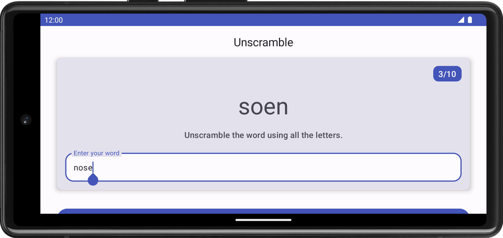

### 11. 解答コードを取得する

この Codelab の完成したコードをダウンロードするには、以下の git コマンドを使用します。

```
$ git clone https://github.com/google-developer-training/basic-android-kotlin-compose-training-unscramble.git
$ cd basic-android-kotlin-compose-training-unscramble
$ git checkout viewmodel
```

または、リポジトリを ZIP ファイルとしてダウンロードし、Android Studio で開くこともできます。

> **注:**解答コードは、ダウンロードしたリポジトリの `viewmodel` ブランチにあります。

この Codelab の解答コードを確認する場合は、[GitHub](https://github.com/google-developer-training/basic-android-kotlin-compose-training-unscramble/tree/viewmodel) で表示します。

### 12. まとめ

お疲れさまでした。Codelab を完了しました。ここでは、Android アプリのアーキテクチャ ガイドラインでは、異なる役割を持つクラスに分割することと、モデルから UI を駆動することが推奨されていることを学習しました。

作成したら、*#AndroidBasics* を付けて、ソーシャル メディアで共有しましょう。

#### **詳細**

- [アプリ アーキテクチャ ガイド | Android デベロッパー](https://developer.android.com/topic/architecture)
- [UI レイヤ | Android デベロッパー](https://developer.android.com/topic/architecture/ui-layer)
- [単方向データフローで状態を管理する | Android デベロッパー](https://developer.android.com/topic/architecture/ui-layer#udf)
- 学習パスウェイ: [最新の Android アプリ アーキテクチャ](https://developer.android.com/courses/pathways/android-architecture)

## 5. ViewModel をテストする単体テストを作成する

<!-- codelab:basic-android-kotlin-compose-test-viewmodel -->
出典: [ViewModel の単体テストを作成する](https://developer.android.com/codelabs/basic-android-kotlin-compose-test-viewmodel?hl=ja)（Google Developers, CC BY 4.0）

### 1. 始める前に

この Codelab では、`ViewModel` コンポーネントをテストする単体テストの作成方法について説明します。[Unscramble](https://github.com/google-developer-training/basic-android-kotlin-compose-training-unscramble.git) ゲームアプリの単体テストを追加します。Unscramble アプリは、スクランブルされた単語を推測し、正解するとポイントを獲得できる、楽しい単語ゲームです。次の画像は、アプリのプレビューを示しています。

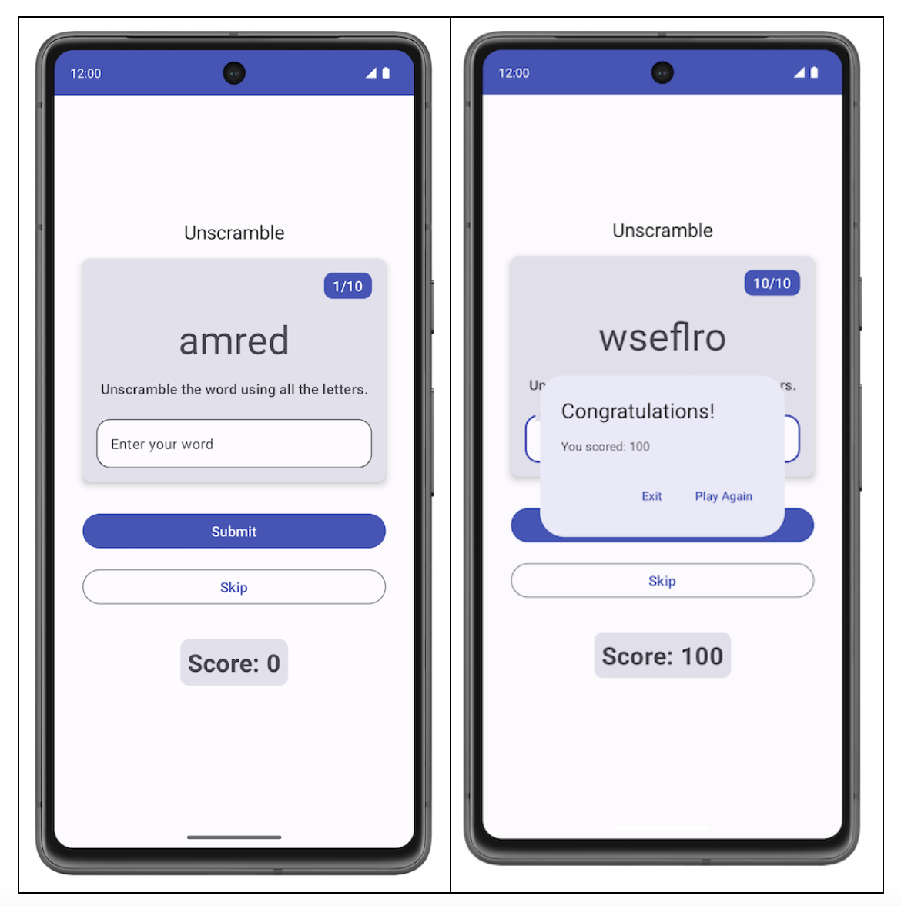

「[自動テストを作成する](https://developer.android.com/codelabs/basic-android-kotlin-compose-write-automated-tests?continue=https%3A%2F%2Fdeveloper.android.com%2Fcourses%2Fpathways%2Fandroid-basics-compose-unit-2-pathway-3%23codelab-https%3A%2F%2Fdeveloper.android.com%2Fcodelabs%2Fbasic-android-kotlin-compose-write-automated-tests#0)」Codelab では、自動テストの概要と重要性について学習しました。また、単体テストの実装方法についても学習しました。

学習した内容は以下のとおりです。

- 自動テストは、別のコードの正確さを検証するコードです。
- テストは、アプリの開発における重要なプロセスです。アプリに対して一貫性のあるテストを実施することで、アプリの公開前に、機能の動作、使いやすさを検証できます。
- 単体テストでは、関数、クラス、プロパティをテストできます。
- ローカル単体テストは、ワークステーションで実行されます。つまり、Android デバイスやエミュレータを必要とせずに、開発環境で実行されます。言い換えると、ローカルテストはパソコンで実行できます。

先に進む前に、「[自動テストを作成する](https://developer.android.com/codelabs/basic-android-kotlin-compose-write-automated-tests?continue=https%3A%2F%2Fdeveloper.android.com%2Fcourses%2Fpathways%2Fandroid-basics-compose-unit-2-pathway-3%23codelab-https%3A%2F%2Fdeveloper.android.com%2Fcodelabs%2Fbasic-android-kotlin-compose-write-automated-tests#0)」と「[Compose での ViewModel と状態](https://developer.android.com/codelabs/basic-android-kotlin-compose-viewmodel-and-state)」の Codelab を完了してください。

#### 前提条件

- 関数、ラムダ、ステートレス コンポーザブルなど、Kotlin に関する知識
- Jetpack Compose でレイアウトを作成する方法に関する基本的な知識
- マテリアル デザインに関する基本的な知識
- ViewModel を実装する方法に関する基本的な知識

#### 学習内容

- アプリ モジュールの **`build.gradle.kts`** ファイルに単体テストの依存関係を追加する方法
- 単体テストを実装するためのテスト戦略を作成する方法
- JUnit4 を使用して単体テストを作成し、テスト インスタンスのライフサイクルを理解する方法
- コード カバレッジを実行、分析、改善する方法

#### 作成するアプリの概要

- [Unscramble](https://github.com/google-developer-training/basic-android-kotlin-compose-training-unscramble.git) ゲームアプリの単体テスト

#### 必要なもの

- Android Studio の最新バージョン

#### スターター コードを取得する

まず、スターター コードをダウンロードします。

または、GitHub リポジトリのクローンを作成してコードを入手することもできます。

```
$ git clone https://github.com/google-developer-training/basic-android-kotlin-compose-training-unscramble.git
$ cd basic-android-kotlin-compose-training-unscramble
$ git checkout viewmodel
```

> **注:**スターター コードは、ダウンロードしたリポジトリの `viewmodel` ブランチにあります。

コードは [`Unscramble`](https://github.com/google-developer-training/basic-android-kotlin-compose-training-unscramble/tree/viewmodel) GitHub リポジトリで確認できます。

### 2. スターター コードの概要

ユニット 2 では、次の図に示すように、**src** フォルダの下にある **test** ソースセットに単体テストコードを配置することについて学習しました。

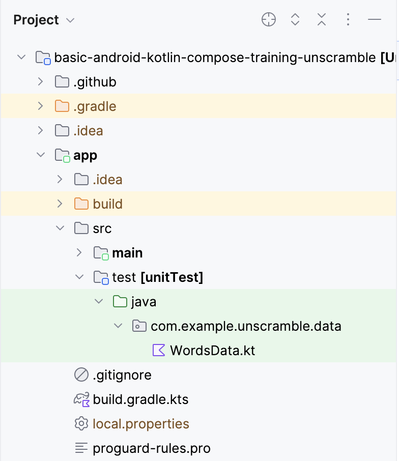

スターター コードには次のファイルがあります。

- **`WordsData.kt`****:**このファイルには、テストに使用する単語のリストと、スクランブルされた単語からスクランブルされていない単語を取得する `getUnscrambledWord()` ヘルパー関数が含まれています。このファイルを変更する必要はありません。

> **注:**テスト ソースセット `WordsData.kt` ファイルの `allWords` プロパティは、`GameViewModel` で使用されます。テストを実行すると、アプリ ソースセット `WordsData.kt` ファイルで利用可能な `allWords` プロパティが置き換えられます。
> 
> 次のユニットでは、疎結合を促進し、テストを実行しながら別のリソースを使用できる、依存関係注入という新しい手法について学習します。

### 3. テストの依存関係を追加する

この Codelab では、JUnit フレームワークを使用して単体テストを作成します。このフレームワークを使用するには、アプリ モジュールの **`build.gradle.kts`** ファイルに依存関係として追加する必要があります。

`implementation` 構成を使用して、アプリに必要な依存関係を指定します。たとえばアプリで `ViewModel` ライブラリを使用するには、次のコード スニペットに示すように、依存関係を `androidx.lifecycle:lifecycle-viewmodel-compose` に追加する必要があります。

```kotlin
dependencies {

    ...
    implementation("androidx.lifecycle:lifecycle-viewmodel-compose:2.6.1")
}
```

これで、このライブラリをアプリのソースコードで使用できるようになりました。Android Studio で、生成されたアプリ パッケージ（APK）ファイルにライブラリを追加できます。しかし、単体テストコードを APK ファイルの一部にすることは望ましくありません。テストコードはユーザーが使用する機能を追加するものではありませんし、APK のサイズにも影響します。テストコードに必要な依存関係についても同様であり、それぞれ別にしておく必要があります。そのためには、`testImplementation` 構成を使用します。こうすることで、構成がアプリコードではなくローカルのテスト ソースコードに適用されることを示します。

> **注:**各 Android アプリはコンパイルされ、アプリのコード、リソース、アセット、マニフェスト ファイルがすべて含まれる、アプリ パッケージ（APK）ファイルという単一のファイルにパッケージ化されます。アプリ パッケージ ファイルは略して「APK」と呼ばれることが多く、ファイルの拡張子は **.apk** です。Android デバイスは、このファイルを使用してアプリをインストールします。

プロジェクトに依存関係を追加するには、**`build.gradle.kts`** ファイルの dependencies ブロックで、`implementation` や `testImplementation` などの依存関係構成を指定します。それぞれの依存関係構成は、依存関係の使用方法について Gradle にさまざまな指示を与えます。

依存関係を追加するには:

1. [**Project**] ペインの **`app`** ディレクトリにある、`app` モジュールの **`build.gradle.kts`** ファイルを開きます。

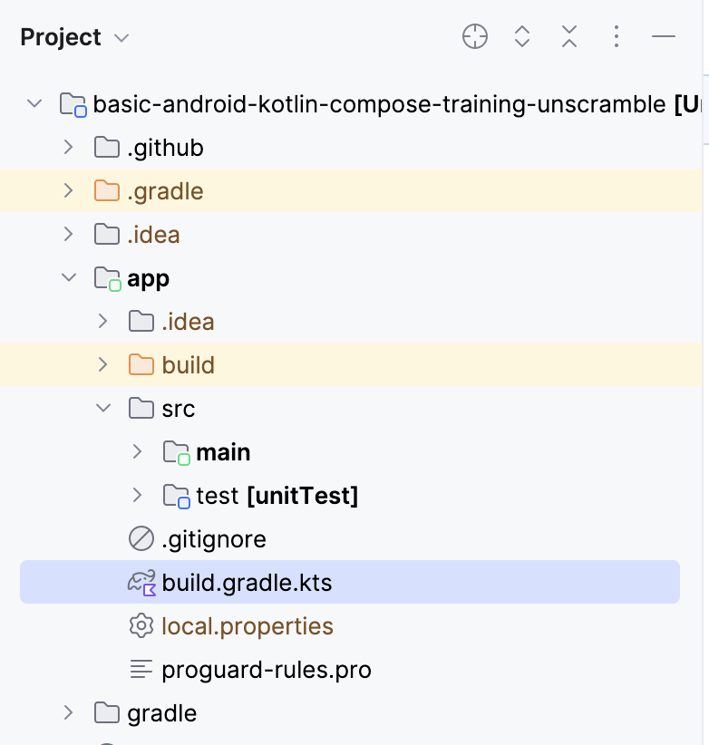

2. ファイル内で、`dependencies{}` ブロックが見つかるまで下にスクロールします。`junit` の `testImplementation` 構成ファイルを使用して依存関係を追加します。

```kotlin
plugins {
    ...
}

android {
    ...
}

dependencies {
    ...
    testImplementation("junit:junit:4.13.2")
}
```

3. 次のスクリーンショットに示すように、**build.gradle.kts** ファイルの上部にある通知バーで [**Sync Now**] をクリックし、インポートとビルドを終了します。

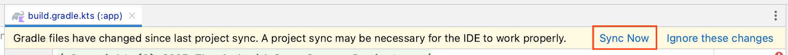

#### **部品構成表（BOM）の作成**

Compose ライブラリのバージョン管理には、Compose BOM の使用をおすすめします。BOM を使用すると、BOM のバージョンのみを指定して、すべての Compose ライブラリ バージョンを管理できます。

`app` モジュールの `build.gradle.kts` ファイルの依存関係セクションをご覧ください。

```kotlin
// No need to copy over
// This is part of starter code
dependencies {

   // Import the Compose BOM
    implementation (platform("androidx.compose:compose-bom:2023.06.01"))
    ...
    implementation("androidx.compose.material3:material3")
    implementation("androidx.compose.ui:ui")
    implementation("androidx.compose.ui:ui-graphics")
    implementation("androidx.compose.ui:ui-tooling-preview")
    ...
}
```

以下のことを確認してください。

- Compose ライブラリのバージョン番号が指定されていません。
- BOM が `implementation platform("androidx.compose:compose-bom:2023.06.01")` を使用してインポートされています。

これは、BOM 自体に、さまざまな Compose ライブラリが連携して適切に機能するよう、それぞれの最新の安定版ライブラリへのリンクが含まれているためです。アプリで BOM を使用するときに、Compose ライブラリの依存関係自体にバージョンを追加する必要はありません。BOM バージョンを更新すると、使用しているすべてのライブラリが自動的に新しいバージョンに更新されます。

BOM を Compose テスト ライブラリ（インストルメンテーション テスト）で使用するには、`androidTestImplementation platform("androidx.compose:compose-bom:xxxx.xx.xx")` をインポートする必要があります。次に示すように、変数を作成して `implementation` と `androidTestImplementation` に再利用することができます。

```kotlin
// Example, not need to copy over
dependencies {

   // Import the Compose BOM
    implementation(platform("androidx.compose:compose-bom:2023.06.01"))
    implementation("androidx.compose.material:material")
    implementation("androidx.compose.ui:ui")
    implementation("androidx.compose.ui:ui-tooling-preview")
    
    // ...
    androidTestImplementation(platform("androidx.compose:compose-bom:2023.06.01"))
    androidTestImplementation("androidx.compose.ui:ui-test-junit4")

}
```

> **注**: Compose BOM は Compose ライブラリ専用であり、ライフサイクル `androidx.lifecycle` ライブラリなどの他のライブラリ用ではありません。

お疲れさまでした。テストの依存関係をアプリに追加し、BOM について学習できたので、単体テストを追加できるようになりました。

### 4. テスト戦略

適切なテスト戦略は、コードのさまざまなパスと境界をカバーすることを中心に展開されます。非常に基本的なレベルでは、成功パス、エラーパス、境界ケースという 3 つのシナリオにテストを分類できます。

- **成功パス:**成功パスのテスト（「ハッピーパス テスト」ともいいます）は、ポジティブ フローの機能のテストに重点を置きます。ポジティブ フローとは、例外またはエラー状態がないフローのことです。エラーパスや境界ケースのシナリオとは異なり、成功パスのシナリオは、アプリの想定どおりの動作に重点を置くため、シナリオの網羅的なリストを簡単に作成できます。

Unscramble アプリの成功パスの例としては、ユーザーが正しい単語を入力して [**Submit**] ボタンをクリックしたときに、スコア、単語数、スクランブルされた単語が正しく更新されることが挙げられます。

- **エラーパス:**エラーパスのテストは、ネガティブ フローの機能のテストに重点を起きます。つまり、エラー状態や無効なユーザー入力にアプリがどのように応答するかをチェックします。想定どおりの動作が達成されなかったときに生じる可能性のある結果は数多くあるため、考えられるすべてのエラーフローを判断することは非常に困難です。

一般的に、考えられるすべてのエラーパスを列挙し、それらに対するテストを作成して、さまざまなシナリオを発見しながら単体テストを進化させ続けることをおすすめします。

Unscramble アプリのエラーパスの例としては、ユーザーが間違った単語を入力して [**Submit**] ボタンをクリックしたときに、エラー メッセージが表示され、スコアと単語数が更新されないことが挙げられます。

- **境界ケース:**境界ケースは、アプリの境界条件のテストに重点を置きます。Unscramble アプリの境界では、アプリが読み込むときの UI 状態と、ユーザーが最大数の単語をプレイした後の UI 状態を確認します。

これらのカテゴリに関するテストシナリオを作成し、テスト計画のガイドラインとして使用できます。

#### テストを作成する

一般的に、適切な単体テストには次の 4 つの特性があります。

- **範囲が限定的:**コードの一部など、特定のユニットをテストすることに重点が置かれています。コードの一部とは多くの場合、クラスまたはメソッドです。テストは範囲を狭くし、コードの複数の部分を同時に検証するのではなく、コードの各部分の正確さを検証することに重点を置くべきです。
- **理解しやすい:**簡潔で、コードを読んだときに理解しやすいものにします。デベロッパーがひと目で、テストの背後にある意図をすぐに理解できるようにしましょう。
- **確定的:**合格か不合格かの判定に一貫性があることが必要です。コードを変更せずに何度テストを実行しても、同じ結果が得られる必要があります。コードを変更していないにもかかわらず、あるときは不合格になり、またあるときは合格になるなど、テストが不安定であってはなりません。
- **自己完結:**人間による操作もセットアップも必要とせず、単独で動作します。

##### **成功パス**

成功パスの単体テストを作成するには、`GameViewModel` のインスタンスが初期化されている前提で、`updateUserGuess()` メソッドが正しい推測単語で呼び出された後に `checkUserGuess()` メソッドが呼び出されたとき、次のようになることをアサートする必要があります。

- 正しい推測が `updateUserGuess()` メソッドに渡される。
- `checkUserGuess()` が呼び出される。
- `score` と `isGuessedWordWrong` ステータスの値が正しく更新される。

次の手順を実施してテストを作成します。

1. 次のスクリーンショットに示すように、テスト ソースセットの下に新しいパッケージ `com.example.android.unscramble.ui.test` を作成し、ファイルを追加します。

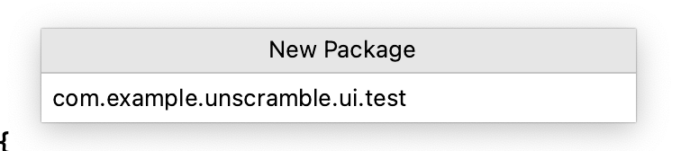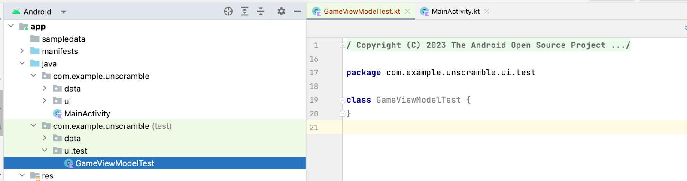

`GameViewModel` クラスの単体テストを作成するには、クラスのメソッドを呼び出して状態を検証できるように、クラスのインスタンスが必要となります。

2. `GameViewModelTest` クラスの本体で、`viewModel` プロパティを宣言し、`GameViewModel` クラスのインスタンスを代入します。

```kotlin
class GameViewModelTest {
    private val viewModel = GameViewModel()
}
```

3. 成功パスの単体テストを作成するには、`gameViewModel_CorrectWordGuessed_ScoreUpdatedAndErrorFlagUnset()` 関数を作成し、`@Test` アノテーションを付けます。

```kotlin
class GameViewModelTest {
    private val viewModel = GameViewModel()

    @Test
    fun gameViewModel_CorrectWordGuessed_ScoreUpdatedAndErrorFlagUnset()  {
    }
}
```

4. 以下をインポートします。

```kotlin
import org.junit.Test
```

> **注:**上記のコードでは、`thingUnderTest_TriggerOfTest_ResultOfTest` 形式を使用してテスト関数名を付けています。
> 
> - `thingUnderTest` = `gameViewModel`
> - `TriggerOfTest` = `CorrectWordGuessed`
> - `ResultOfTest` = `ScoreUpdatedAndErrorFlagUnset`

プレーヤーの正しい単語を `viewModel.updateUserGuess()` メソッドに渡すには、`GameUiState` のスクランブルされた単語からスクランブルされていない正しい単語を取得する必要があります。そのためには、まず現在のゲームの UI 状態を取得します。

5. 関数本体で `currentGameUiState` 変数を作成し、`viewModel.uiState.value` を代入します。

```kotlin
@Test
fun gameViewModel_CorrectWordGuessed_ScoreUpdatedAndErrorFlagUnset() {
    var currentGameUiState = viewModel.uiState.value
}
```

> **警告**: `MutableStateFlow` を使用しているため、この方法で uiState を取得できます。今後のユニットでは、データのストリームを作成する `StateFlow` の高度な使用方法について学習します。また、そのストリームを処理するように対処する必要があります。そうしたシナリオでは、さまざまなメソッドとアプローチを使用して単体テストを作成します。

6. プレーヤーの正しい推測を取得するには `getUnscrambledWord()` 関数を使用します。この関数は `currentGameUiState.currentScrambledWord` を引数として受け取り、スクランブルされていない単語を返します。この戻り値を `correctPlayerWord` という新しい読み取り専用変数に格納し、`getUnscrambledWord()` 関数から返された値を代入します。

```kotlin
@Test
fun gameViewModel_CorrectWordGuessed_ScoreUpdatedAndErrorFlagUnset() {
    var currentGameUiState = viewModel.uiState.value
    val correctPlayerWord = getUnscrambledWord(currentGameUiState.currentScrambledWord)

}
```

7. 推測した単語が正しいかどうかを検証するには、`viewModel.updateUserGuess()` メソッドの呼び出しを追加し、引数として `correctPlayerWord` 変数を渡します。次に、`viewModel.checkUserGuess()` メソッドの呼び出しを追加して、推測を検証します。

```kotlin
@Test
fun gameViewModel_CorrectWordGuessed_ScoreUpdatedAndErrorFlagUnset() {
    var currentGameUiState = viewModel.uiState.value
    val correctPlayerWord = getUnscrambledWord(currentGameUiState.currentScrambledWord)

    viewModel.updateUserGuess(correctPlayerWord)
    viewModel.checkUserGuess()
}
```

これで、ゲームの状態が想定どおりであることをアサートする準備が整いました。

8. `viewModel.uiState` プロパティの値から `GameUiState` クラスのインスタンスを取得し、`currentGameUiState` 変数に格納します。

```kotlin
@Test
fun gameViewModel_CorrectWordGuessed_ScoreUpdatedAndErrorFlagUnset() {
    var currentGameUiState = viewModel.uiState.value
    val correctPlayerWord = getUnscrambledWord(currentGameUiState.currentScrambledWord)
    viewModel.updateUserGuess(correctPlayerWord)
    viewModel.checkUserGuess()

    currentGameUiState = viewModel.uiState.value
}
```

9. 推測した単語が正しいこととスコアが更新されたことを確認するには、`assertFalse()` 関数を使用して `currentGameUiState.isGuessedWordWrong` プロパティが `false` であることを検証し、`assertEquals()` 関数を使用して `currentGameUiState.score` プロパティの値が `20` に等しいことを検証します。

```kotlin
@Test
fun gameViewModel_CorrectWordGuessed_ScoreUpdatedAndErrorFlagUnset() {
    var currentGameUiState = viewModel.uiState.value
    val correctPlayerWord = getUnscrambledWord(currentGameUiState.currentScrambledWord)
    viewModel.updateUserGuess(correctPlayerWord)
    viewModel.checkUserGuess()

    currentGameUiState = viewModel.uiState.value
    // Assert that checkUserGuess() method updates isGuessedWordWrong is updated correctly.
    assertFalse(currentGameUiState.isGuessedWordWrong)
    // Assert that score is updated correctly.
    assertEquals(20, currentGameUiState.score)
}
```

10. 以下をインポートします。

```kotlin
import org.junit.Assert.assertEquals
import org.junit.Assert.assertFalse
```

11. 値 `20` を理解しやすくし、再利用できるようにするには、コンパニオン オブジェクトを作成して、`SCORE_AFTER_FIRST_CORRECT_ANSWER` という `private` 定数に `20` を代入します。新しく作成した定数でテストを更新します。

```kotlin
class GameViewModelTest {
    ...
    @Test
    fun gameViewModel_CorrectWordGuessed_ScoreUpdatedAndErrorFlagUnset() {
        ...
        // Assert that score is updated correctly.
        assertEquals(SCORE_AFTER_FIRST_CORRECT_ANSWER, currentGameUiState.score)
    }

    companion object {
        private const val SCORE_AFTER_FIRST_CORRECT_ANSWER = SCORE_INCREASE
    }
}
```

12. テストを実行します。

次のスクリーンショットに示すように、すべてのアサーションが有効であるため、テストは合格するはずです。

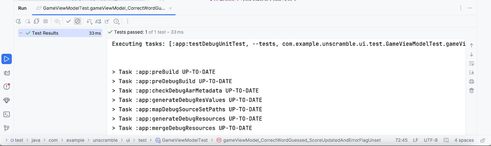

##### エラーパス

エラーパスの単体テストを作成するには、間違った単語が引数として `viewModel.updateUserGuess()` メソッドに渡され、`viewModel.checkUserGuess()` メソッドが呼び出されたら、次のようになることをアサートする必要があります。

- `currentGameUiState.score` プロパティの値は変更されない。
- 推測が間違っているため、`currentGameUiState.isGuessedWordWrong` プロパティの値は `true` に設定される。

次の手順を実施してテストを作成します。

1. `GameViewModelTest` クラスの本体で、`gameViewModel_IncorrectGuess_ErrorFlagSet()` 関数を作成し、`@Test` アノテーションを付けます。

```kotlin
@Test
fun gameViewModel_IncorrectGuess_ErrorFlagSet() {
    
}
```

2. `incorrectPlayerWord` 変数を定義し、単語のリストに存在しない `"and"` 値を代入します。

```kotlin
@Test
fun gameViewModel_IncorrectGuess_ErrorFlagSet() {
    // Given an incorrect word as input
    val incorrectPlayerWord = "and"
}
```

3. `viewModel.updateUserGuess()` メソッドの呼び出しを追加し、引数として `incorrectPlayerWord` 変数を渡します。
4. `viewModel.checkUserGuess()` メソッドの呼び出しを追加して、推測を検証します。

```kotlin
@Test
fun gameViewModel_IncorrectGuess_ErrorFlagSet() {
    // Given an incorrect word as input
    val incorrectPlayerWord = "and"

    viewModel.updateUserGuess(incorrectPlayerWord)
    viewModel.checkUserGuess()
}
```

5. `currentGameUiState` 変数を追加し、`viewModel.uiState.value` 状態の値を代入します。
6. アサーション関数を使用して、`currentGameUiState.score` プロパティの値が `0` であり、`currentGameUiState.isGuessedWordWrong` プロパティの値が `true` に設定されていることをアサートします。

```kotlin
@Test
fun gameViewModel_IncorrectGuess_ErrorFlagSet() {
    // Given an incorrect word as input
    val incorrectPlayerWord = "and"

    viewModel.updateUserGuess(incorrectPlayerWord)
    viewModel.checkUserGuess()

    val currentGameUiState = viewModel.uiState.value
    // Assert that score is unchanged
    assertEquals(0, currentGameUiState.score)
    // Assert that checkUserGuess() method updates isGuessedWordWrong correctly
    assertTrue(currentGameUiState.isGuessedWordWrong)
}
```

7. 以下をインポートします。

```kotlin
import org.junit.Assert.assertTrue
```

8. テストを実行して、合格することを確認します。

##### **境界ケース**

UI の初期状態をテストするには、`GameViewModel` クラスの単体テストを作成する必要があります。このテストは、`GameViewModel` が初期化されたとき、次の事項が真であることをアサートする必要があります。

- `currentWordCount` プロパティが `1` に設定されている。
- `score` プロパティが `0` に設定されている。
- `isGuessedWordWrong` プロパティが `false` に設定されている。
- `isGameOver` プロパティが `false` に設定されている。

次の手順でテストを追加します。

1. `gameViewModel_Initialization_FirstWordLoaded()` メソッドを作成し、`@Test` アノテーションを付けます。

```kotlin
@Test
fun gameViewModel_Initialization_FirstWordLoaded() {
    
}
```

2. `viewModel.uiState.value` プロパティにアクセスして `GameUiState` クラスの初期インスタンスを取得し、新しい読み取り専用変数 `gameUiState` に代入します。

```kotlin
@Test
fun gameViewModel_Initialization_FirstWordLoaded() {
    val gameUiState = viewModel.uiState.value
}
```

3. プレーヤーの正しい単語を取得するには `getUnscrambledWord()` 関数を使用します。この関数は `gameUiState.currentScrambledWord` の単語を受け取り、スクランブルされていない単語を返します。戻り値を、`unScrambledWord` という新しい読み取り専用変数に代入します。

```kotlin
@Test
fun gameViewModel_Initialization_FirstWordLoaded() {
    val gameUiState = viewModel.uiState.value
    val unScrambledWord = getUnscrambledWord(gameUiState.currentScrambledWord)

}
```

4. 状態が正しいことを検証するには、`assertTrue()` 関数を追加して、`currentWordCount` プロパティが `1` に設定され、`score` プロパティが `0` に設定されていることをアサートします。
5. `assertFalse()` 関数を追加して、`isGuessedWordWrong` プロパティが `false` であることと、`isGameOver` プロパティが `false` に設定されていることを検証します。

```kotlin
@Test
fun gameViewModel_Initialization_FirstWordLoaded() {
    val gameUiState = viewModel.uiState.value
    val unScrambledWord = getUnscrambledWord(gameUiState.currentScrambledWord)

    // Assert that current word is scrambled.
    assertNotEquals(unScrambledWord, gameUiState.currentScrambledWord)
    // Assert that current word count is set to 1.
    assertTrue(gameUiState.currentWordCount == 1)
    // Assert that initially the score is 0.
    assertTrue(gameUiState.score == 0)
    // Assert that the wrong word guessed is false.
    assertFalse(gameUiState.isGuessedWordWrong)
    // Assert that game is not over.
    assertFalse(gameUiState.isGameOver)
}
```

6. 以下をインポートします。

```kotlin
import org.junit.Assert.assertNotEquals
```

7. テストを実行して、合格することを確認します。

もう 1 つの境界ケースは、ユーザーがすべての単語を推測した後の UI 状態をテストすることです。ユーザーがすべての単語を正しく推測したとき、次の事項が真であることをアサートする必要があります。

- スコアが最新である。
- `currentGameUiState.currentWordCount` プロパティが `MAX_NO_OF_WORDS` 定数の値と等しい。
- `currentGameUiState.isGameOver` プロパティが `true` に設定されている。

次の手順でテストを追加します。

1. `gameViewModel_AllWordsGuessed_UiStateUpdatedCorrectly()` メソッドを作成し、`@Test` アノテーションを付けます。このメソッドで `expectedScore` 変数を作成し、`0` を代入します。

```kotlin
@Test
fun gameViewModel_AllWordsGuessed_UiStateUpdatedCorrectly() {
    var expectedScore = 0
}
```

2. 初期状態を取得するには、`currentGameUiState` 変数を追加し、`viewModel.uiState.value` プロパティの値を代入します。

```kotlin
@Test
fun gameViewModel_AllWordsGuessed_UiStateUpdatedCorrectly() {
    var expectedScore = 0
    var currentGameUiState = viewModel.uiState.value
}
```

3. プレーヤーの正しい単語を取得するには `getUnscrambledWord()` 関数を使用します。この関数は `currentGameUiState.currentScrambledWord` の単語を受け取り、スクランブルされていない単語を返します。この戻り値を `correctPlayerWord` という新しい読み取り専用変数に格納し、`getUnscrambledWord()` 関数から返された値を代入します。

```kotlin
@Test
fun gameViewModel_AllWordsGuessed_UiStateUpdatedCorrectly() {
    var expectedScore = 0
    var currentGameUiState = viewModel.uiState.value
    var correctPlayerWord = getUnscrambledWord(currentGameUiState.currentScrambledWord)
}
```

4. ユーザーがすべての答えを推測しているかどうかをテストするには、`repeat` ブロックを使用して、`viewModel.updateUserGuess()` メソッドと `viewModel.checkUserGuess()` メソッドの実行を `MAX_NO_OF_WORDS` 回繰り返します。

```kotlin
@Test
fun gameViewModel_AllWordsGuessed_UiStateUpdatedCorrectly() {
    var expectedScore = 0
    var currentGameUiState = viewModel.uiState.value
    var correctPlayerWord = getUnscrambledWord(currentGameUiState.currentScrambledWord)
    repeat(MAX_NO_OF_WORDS) {
        
    }
}
```

5. `repeat` ブロックで、`SCORE_INCREASE` 定数の値を `expectedScore` 変数に追加して、正解するたびにスコアが増加することをアサートします。
6. `viewModel.updateUserGuess()` メソッドの呼び出しを追加し、引数として `correctPlayerWord` 変数を渡します。
7. `viewModel.checkUserGuess()` メソッドの呼び出しを追加して、ユーザーの推測の確認をトリガーします。

```kotlin
@Test
fun gameViewModel_AllWordsGuessed_UiStateUpdatedCorrectly() {
    var expectedScore = 0
    var currentGameUiState = viewModel.uiState.value
    var correctPlayerWord = getUnscrambledWord(currentGameUiState.currentScrambledWord)
    repeat(MAX_NO_OF_WORDS) {
        expectedScore += SCORE_INCREASE
        viewModel.updateUserGuess(correctPlayerWord)
        viewModel.checkUserGuess()
    }
}
```

8. 現在のプレーヤーの単語を更新し、`getUnscrambledWord()` 関数を使用します。この関数は、`currentGameUiState.currentScrambledWord` を引数として受け取り、スクランブルされていない単語を返します。この戻り値を `correctPlayerWord.` という新しい読み取り専用変数に格納します。状態が正しいことを確認するには、`assertEquals()` 関数を追加して、`currentGameUiState.score` プロパティの値が `expectedScore` 変数の値と等しいことを確認します。

```kotlin
@Test
fun gameViewModel_AllWordsGuessed_UiStateUpdatedCorrectly() {
    var expectedScore = 0
    var currentGameUiState = viewModel.uiState.value
    var correctPlayerWord = getUnscrambledWord(currentGameUiState.currentScrambledWord)
    repeat(MAX_NO_OF_WORDS) {
        expectedScore += SCORE_INCREASE
        viewModel.updateUserGuess(correctPlayerWord)
        viewModel.checkUserGuess()
        currentGameUiState = viewModel.uiState.value
        correctPlayerWord = getUnscrambledWord(currentGameUiState.currentScrambledWord)
        // Assert that after each correct answer, score is updated correctly.
        assertEquals(expectedScore, currentGameUiState.score)
    }
}
```

9. `assertEquals()` 関数を追加して、`currentGameUiState.currentWordCount` プロパティの値が `MAX_NO_OF_WORDS` 定数の値と等しいことと、`currentGameUiState.isGameOver` プロパティの値が `true` に設定されていることをアサートします。

```kotlin
@Test
fun gameViewModel_AllWordsGuessed_UiStateUpdatedCorrectly() {
    var expectedScore = 0
    var currentGameUiState = viewModel.uiState.value
    var correctPlayerWord = getUnscrambledWord(currentGameUiState.currentScrambledWord)
    repeat(MAX_NO_OF_WORDS) {
        expectedScore += SCORE_INCREASE
        viewModel.updateUserGuess(correctPlayerWord)
        viewModel.checkUserGuess()
        currentGameUiState = viewModel.uiState.value
        correctPlayerWord = getUnscrambledWord(currentGameUiState.currentScrambledWord)
        // Assert that after each correct answer, score is updated correctly.
        assertEquals(expectedScore, currentGameUiState.score)
    }
    // Assert that after all questions are answered, the current word count is up-to-date.
    assertEquals(MAX_NO_OF_WORDS, currentGameUiState.currentWordCount)
    // Assert that after 10 questions are answered, the game is over.
    assertTrue(currentGameUiState.isGameOver)
}
```

10. 以下をインポートします。

```kotlin
import com.example.unscramble.data.MAX_NO_OF_WORDS
```

11. テストを実行して、合格することを確認します。

#### **テスト インスタンスのライフサイクルの概要**

テストで `viewModel` を初期化する方法をよく見ると、すべてのテストで使用されているにもかかわらず、`viewModel` が 1 回しか初期化されていないことがわかります。次のコード スニペットは、`viewModel` プロパティの定義を示しています。

```kotlin
class GameViewModelTest {
    private val viewModel = GameViewModel()
    
    @Test
    fun gameViewModel_Initialization_FirstWordLoaded() {
        val gameUiState = viewModel.uiState.value
        ...
    }
    ...
}
```

次のような疑問を抱かれるかもしれません。

- すべてのテストで `viewModel` の同じインスタンスが再利用されるということなのか。
- 何か問題が生じるのか。たとえば、`gameViewModel_Initialization_FirstWordLoaded` テストメソッドが `gameViewModel_CorrectWordGuessed_ScoreUpdatedAndErrorFlagUnset` テストメソッドの後に実行された場合はどうなるか。初期化テストは失敗するか。

どちらの疑問に対しても、答えは「いいえ」です。テストメソッドは、テスト インスタンスの状態が可変であることによる予期しない副作用を避けるために、独立して実行されます。デフォルトでは、各テストメソッドが実行される前に JUnit がテストクラスの新しいインスタンスを作成します。

`GameViewModelTest` クラスにはここまででテストメソッドが 4 つあるため、`GameViewModelTest` は 4 回インスタンス化します。各インスタンスにはそれぞれ `viewModel` プロパティのコピーがあります。そのため、テスト実行の順序は重要ではありません。

> **注:** この「メソッドごと」のテスト インスタンスのライフサイクルは、JUnit4 以降のデフォルトの動作です。

### 5. コード カバレッジについて

コード カバレッジは、アプリを構成するクラス、メソッド、コード行を適切にテストしているかどうかを判断するために重要な役割を果たします。

Android Studio にはローカル単体テストのためのテスト カバレッジ ツールが用意されており、単体テストがカバーするアプリコードの割合と領域が追跡されます。

#### **Android Studio でカバレッジを指定してテストを実行する**

カバレッジを指定してテストを実行するには:

1. プロジェクト ペインで `GameViewModelTest.kt` ファイルを右クリックし、 [**Run 'GameViewModelTest' with Coverage**] を選択します。

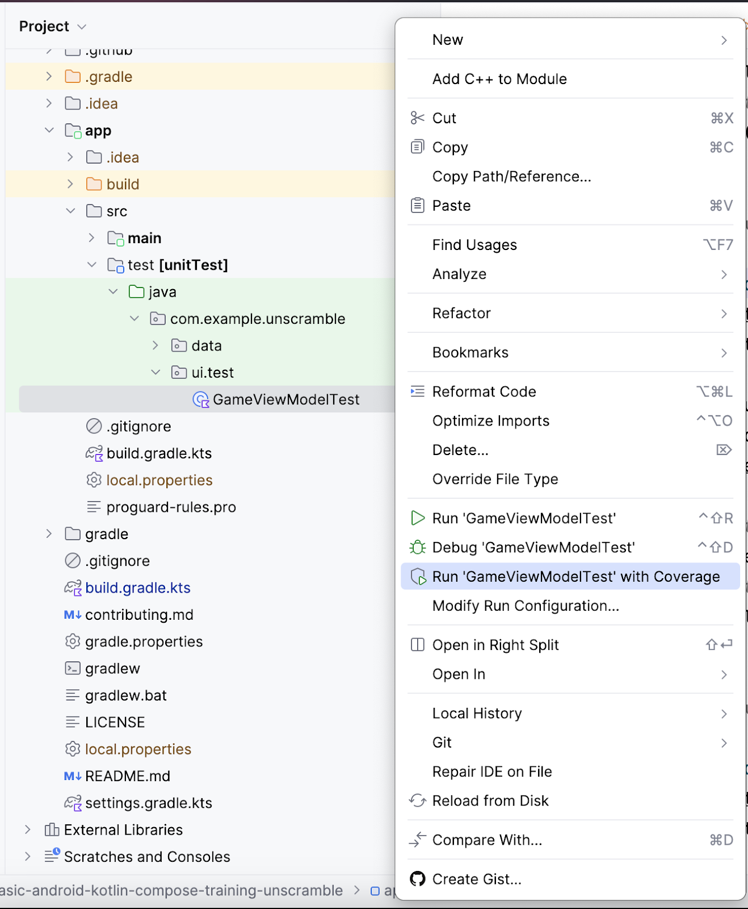

2. テスト実行が完了したら、右側のカバレッジ パネルで [**Flatten Packages**] オプションをクリックします。

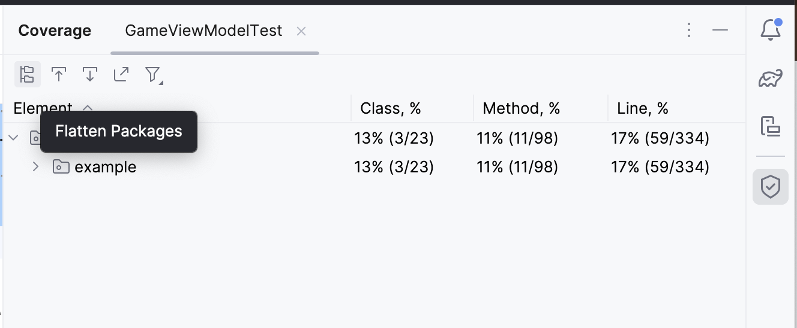

3. 次の図に示すように、**`com.example.android.unscramble.ui`** パッケージがあります。

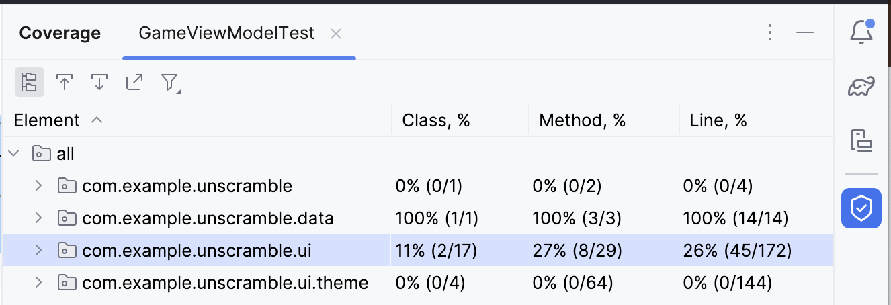

4. パッケージ名 **`com.example.android.unscramble.ui`** をダブルクリックすると、`GameViewModel` のカバレッジが次の図のように表示されます。

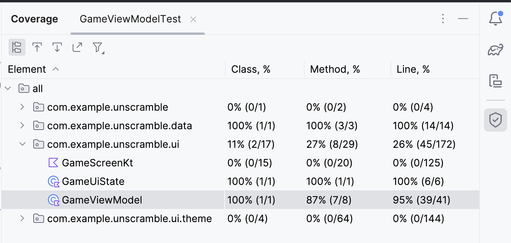

#### **テストレポートを分析する**

次の図に示すレポートは、2 つの部分に分かれています。

- **単体テストがカバーするメソッドの割合:**図の例では、これまでに作成したテストが 8 つのメソッドのうち 7 つをカバーしています。これはメソッド全体の 87% に相当します。
- **単体テストがカバーする行の割合:** 図の例では、作成したテストが 41 行のうち 39 行をテストしています。これはコード行の 95% に相当します。

> **注:**コード カバレッジは、テスト実行中に実行された行の数を追跡します。そのため、`GameUiState` の検証がなくてもカバレッジは 100% となっています。

このレポートは、これまでに作成した単体テストでコードの特定の部分が見逃されていることを示唆しています。どの部分が見逃されているのかを判断する手順は次のとおりです。

- [**GameViewModel**] をダブルクリックします。

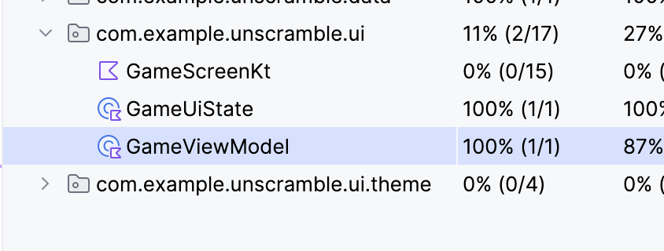

Android Studio で、`GameViewModel.kt` ファイルがウィンドウの左側で色分けされて表示されます。明るい緑色は、そのコード行がカバーされていることを示します。

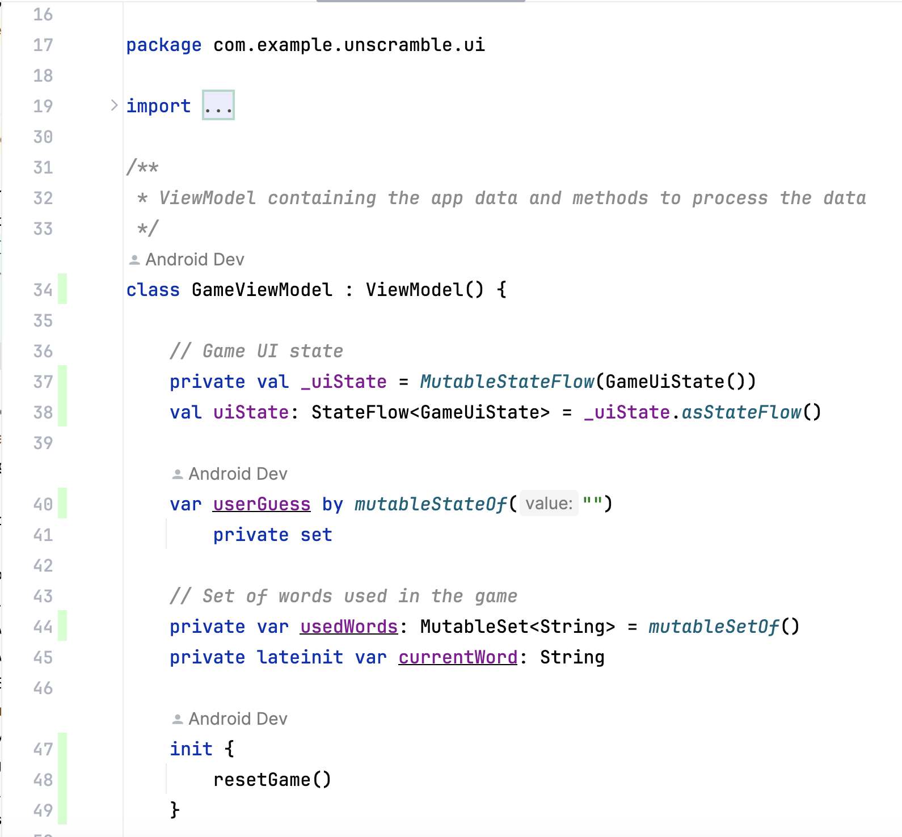

`GameViewModel` を下にスクロールすると、いくつかの行が薄いピンク色でマークされていることがわかります。この色は、そのコード行が単体テストでカバーされていないことを示します。

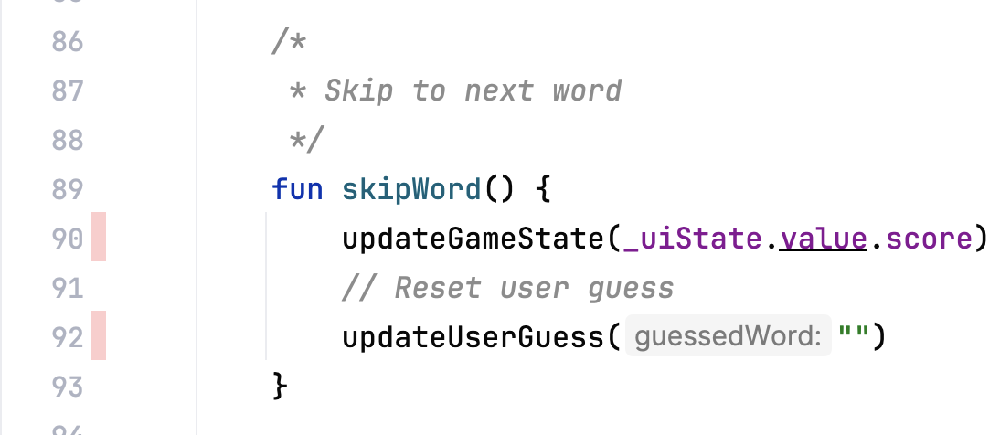

#### **カバレッジを改善する**

カバレッジを改善するには、見逃しているパスをカバーするテストを作成する必要があります。テストを追加して、ユーザーが単語をスキップしたとき、次の事項が真であることをアサートする必要があります。

- `currentGameUiState.score` プロパティは変更されない。
- 次のコード スニペットに示すように、`currentGameUiState.currentWordCount` プロパティは 1 ずつ増加する。

カバレッジを改善する準備として、次のテストメソッドを `GameViewModelTest` クラスに追加します。

```kotlin
@Test
fun gameViewModel_WordSkipped_ScoreUnchangedAndWordCountIncreased() {
    var currentGameUiState = viewModel.uiState.value
    val correctPlayerWord = getUnscrambledWord(currentGameUiState.currentScrambledWord)
    viewModel.updateUserGuess(correctPlayerWord)
    viewModel.checkUserGuess()

    currentGameUiState = viewModel.uiState.value
    val lastWordCount = currentGameUiState.currentWordCount
    viewModel.skipWord()
    currentGameUiState = viewModel.uiState.value
    // Assert that score remains unchanged after word is skipped.
    assertEquals(SCORE_AFTER_FIRST_CORRECT_ANSWER, currentGameUiState.score)
    // Assert that word count is increased by 1 after word is skipped.
    assertEquals(lastWordCount + 1, currentGameUiState.currentWordCount)
}
```

次の手順を実施してカバレッジを再実行します。

1. `GameViewModelTest.kt` ファイルを右クリックし、メニューから [**Run ‘GameViewModelTest' with Coverage**] を選択します。
2. ビルドが成功したら、もう一度 **GameViewModel** 要素に移動し、カバレッジの割合が 100% であることを確認します。次の図に、最終的なカバレッジ レポートを示します。

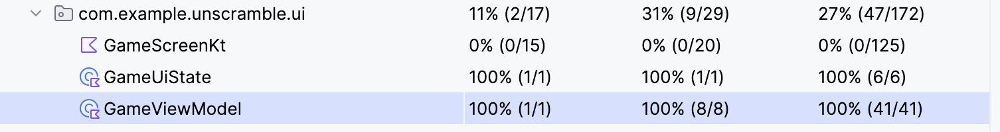

3. `GameViewModel.kt` ファイルに移動して下にスクロールし、前に見逃されていたパスがカバーされているかどうかを確認します。

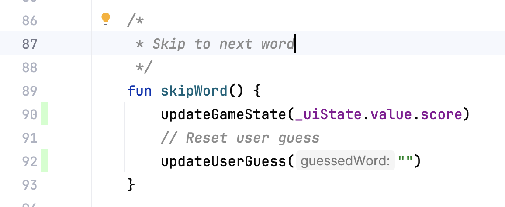

アプリコードのコード カバレッジを実行、分析、改善する方法を学習しました。

コード カバレッジの割合が高ければ、アプリコードの質が高いということになるのでしょうか。そうではありません。コード カバレッジは、単体テストでカバー（実行）されたコードの割合を示すもので、コードが検証されたことを示しているわけではありません。単体テストのコードからすべてのアサーションを削除してコード カバレッジを実行しても、カバレッジは 100% と表示されます。

カバレッジが高いことは、テストが正しく設計されていることや、アプリの動作が検証されていることを示すわけではありません。作成したテストに、テストするクラスの動作を検証するアサーションがあることを確認する必要があります。また、アプリ全体でテスト カバレッジ 100% を実現するように単体テストを作成する必要はありません。アクティビティなど、アプリのコードの一部は UI テストでテストする必要があります。

ただし、カバレッジが低いということは、コードの大部分がまったくテストされていないことを意味します。コード カバレッジは、コードの品質を測定するツールではなく、テストで実行されなかったコードの部分を見つけるツールとして使用してください。

### 6. 解答コードを取得する

この Codelab の完成したコードをダウンロードするには、以下の git コマンドを使用します。

```
$ git clone https://github.com/google-developer-training/basic-android-kotlin-compose-training-unscramble.git
$ cd basic-android-kotlin-compose-training-unscramble
$ git checkout main
```

または、リポジトリを ZIP ファイルとしてダウンロードし、Android Studio で開くこともできます。

> **注:**解答コードは、ダウンロードしたリポジトリの `main` ブランチにあります。

解答コードを確認する場合は、[GitHub で表示します](https://github.com/google-developer-training/basic-android-kotlin-compose-training-unscramble)。

### 7. まとめ

お疲れさまでした。テスト戦略を定義する方法を学習し、Unscramble アプリの `ViewModel` と `StateFlow` をテストする単体テストを実装しました。今後も Android アプリを開発する場合は、開発プロセス全体を通してアプリが適切に動作することを確認するために、アプリ機能とともにテストも作成するようにしてください。

##### **概要**

- `testImplementation` 構成を使用して、依存関係がアプリコードではなく、ローカルのテスト ソースコードに適用されることを示します。
- テストを、成功パス、エラーパス、境界ケースという 3 つのシナリオに分類するようにします。
- 適切な単体テストには、少なくとも 4 つの特性（範囲が限定的、理解しやすい、確定的、自己完結）があります。
- テストメソッドは、テスト インスタンスの状態が可変であることによる予期しない副作用を避けるために、独立して実行されます。
- デフォルトでは、各テストメソッドが実行される前に JUnit がテストクラスの新しいインスタンスを作成します。
- コード カバレッジは、アプリを構成するクラス、メソッド、コード行を適切にテストしているかどうかを判断するために重要な役割を果たします。

##### **詳細**

- [Android アプリのテストの基礎](https://developer.android.com/training/testing/fundamentals#benefits)
- [部品構成表を使用する | Jetpack Compose | Android デベロッパー](https://developer.android.com/jetpack/compose/bom/bom)

## 6. 演習: Dessert Clicker に ViewModel を追加する（提出対象）

<!-- codelab:basic-android-kotlin-compose-practice-viewmodel -->
出典: [演習: Dessert Clicker に ViewModel を追加する](https://developer.android.com/codelabs/basic-android-kotlin-compose-practice-viewmodel?hl=ja)（Google Developers, CC BY 4.0）

### 1. 始める前に

#### はじめに

Dessert Clicker は、インラインの状態とデータを利用して機能します。この演習では、MainActivity からインラインの状態、データ、ロジックを削除し、`ViewModel` に移します。

アプリのロジックをビューから分離して ViewModel に移すことは、Android 開発における最新の手法です。この方法には、以下の利点があります。

- 他の開発者がコードを読みやすくなります。
- コードをテストしやすくなります。
- 複数の開発者が、他の開発者の作業を妨げることなく、1 つのアプリを同時に開発できます。

解答コードは最後に掲載されていますが、演習に取り組んでから解答を確認するようにしてください。解答はアプリを実装する方法の一つとして捉えてください。

#### 前提条件

- [Compose での ViewModel と状態](https://developer.android.com/codelabs/basic-android-kotlin-compose-viewmodel-and-state)の Codelab を通じて、「Compose での Android の基礎」コースワークを完了していること。

#### 必要なもの

- Android Studio がインストールされた、インターネットに接続できるパソコン
- Dessert Clicker アプリの解答コード

#### 作成するアプリの概要

以下の練習問題では、データとアプリロジックを処理する `ViewModel` を追加し、Dessert Clicker アプリのアーキテクチャを改善します。

練習問題は複数のセクションに分かれていて、それぞれで以下の手順を個別に実施します。

- 必要な依存関係を追加および更新します。
- `ViewModel` クラスを作成します。

### 2. スターター コードをダウンロードする

> **スターター コードの URL:**
> 
> [`https://github.com/google-developer-training/basic-android-kotlin-compose-training-dessert-clicker`](https://github.com/google-developer-training/basic-android-kotlin-compose-training-dessert-clicker/tree/main)
> 
> **スターター コードのブランチ名:**`main`

1. Android Studio で `basic-android-kotlin-compose-training-dessert-clicker` フォルダを開きます。
2. Android Studio で Dessert Clicker アプリのコードを開きます。

### 3. 依存関係を設定する

1. プロジェクトの `build.gradle` ファイルに次のように変数を追加します。

```kotlin
buildscript {
   ext {
       ...
       lifecycle_version = '2.5.1'
   }
}
```

2. `app/build.gradle` ファイルに次のように依存関係を追加します。

```kotlin
dependencies {
    ...implementation "androidx.lifecycle:lifecycle-viewmodel-compose:$lifecycle_version"
}
```

### 4. UI 状態クラスを作成する

現在、`MainActivity` の `DessertClickerApp()` コンポーザブルには、UI を操作するデータと状態が含まれています。

UI に必要なすべてのデータを保持するデータクラスを作成します。`DessertClickerApp()` コンポーザブルが現在管理しているデータは、このクラス内のデータに置き換えられます。

### 5. ViewModel を作成する

Jetpack ViewModel コンポーネントを使用して `ViewModel` クラスを作成し、UI 状態の管理を ViewModel で行うようにします。

### 6. アプリのロジックとデータを ViewModel に移す

ロジックを `MainActivity` から ViewModel に移し、作成した UI 状態クラスを使用して UI 状態データにアクセスできるようにします。その後、すべてのデータと状態管理ロジックを `MainActivity` から削除します。

このタスクを自分でやってみてください。必要に応じて、[Compose での ViewModel と状態](https://developer.android.com/codelabs/basic-android-kotlin-compose-viewmodel-and-state)に関する Codelab のガイダンスを確認してください。

### 7. ViewModel を呼び出す

ViewModel が提供するデータとメソッドを使用して、`MainActivity` で UI を操作します。

### 8. 解答コード

> **スターター コードの URL:**
> 
> [`https://github.com/google-developer-training/basic-android-kotlin-compose-training-dessert-clicker`](https://github.com/google-developer-training/basic-android-kotlin-compose-training-dessert-clicker/tree/viewmodel)
> 
> **スターター コードのブランチ名:**`viewmodel`

## 7. つまずきやすいポイント

- 画面回転でデータが消える問題は、この章の ViewModel で解決します。「なぜ消えるのか」（Activity が作り直される）をまず理解しましょう。
- 「UI 状態は ViewModel に、表示は Composable に」という分け方は、この後のすべてのアプリで使います。

## 8. 提出物

次の Codelab で完成させた Android Studio プロジェクトを、学習用リポジトリの `unit4/DessertClicker/` に置きます（プロジェクトフォルダごとコピー。`build/` と `.idea/` は含めない）。

- 演習: Dessert Clicker に ViewModel を追加する

PR 本文には次の 3 点を書いてください。

- **やったこと**：どの Codelab / 演習を完了したか
- **動作確認**：どの端末（エミュレータ名 or 実機）で何を確認したか
- **詰まった点と解決**：エラーの内容と、どう直したか（AI に聞いた内容も可）

## 9. チェックリスト

- [ ] Activity のライフサイクル（onCreate / onStart / onResume …）を説明できる
- [ ] `ViewModel` と `StateFlow` で UI 状態を管理できる
- [ ] ViewModel のユニットテストを書ける
- [ ] パスウェイ末尾のクイズに合格した
- [ ] 提出物が `unit4/DessertClicker/` にあり、Android Studio（または Kotlin Playground）で開いて動く

---

## 課題提出

この章には提出課題があります。

1. 上記の提出物を完了する
2. GitHub で `feature/04-architecture-components` ブランチを作成し、`develop` へのPRを作成（base=`develop`）
3. [AIプログラムレビュー](https://ai.studio/apps/84d224cb-7de1-44fb-995b-9a5917d25603?fullscreenApplet=true) を実行
4. 問題がなければ、進捗ダッシュボードで **PR URL** と **完了日** を記録
