# 第11章: Jetpack Compose でのナビゲーション

> 提出ブランチ: `feature/04-navigation`

## 1. この章のゴール

- `NavHost` と `NavController` で複数画面を切り替えられる
- 画面間でデータを受け渡し、戻る操作を正しく扱える
- ナビゲーションを含む UI テストを書ける

## 2. 進め方

次の内容を **上から順番に** 進めます。「やらなくてOK」の行は飛ばして構いません。レッスンの本文はこのページの下にすべて掲載しています。目安時間の合計は約375分です。

| # | 種類 | 内容 | 目安 | 備考 |
|---|---|---|---|---|
| 1 | レッスン | Compose で画面間を移動する | 約150分 |  |
| 2 | レッスン | Cupcake アプリをテストする | 約60分 |  |
| 3 | レッスン | 演習: ナビゲーションを追加する | 約150分 | **提出対象** |
| 4 | クイズ | [テスト: Jetpack Compose でのナビゲーション](https://developer.android.com/courses/quizzes/android-basics-compose-unit-4-pathway-2/android-basics-compose-unit-4-pathway-2?hl=ja) | 約15分 | リンク先で受ける |

このプログラムの進め方は次の通りです。

1. 下の各レッスンを読み、各ステップの説明を理解してから **自分でコードを打つ**（コピペで済ませない）
2. ステップごとにアプリを実行し、期待どおり動くか確認する
3. 動かないときは、エラー文をそのまま AI に貼って「何が原因か」を聞き、直したら **なぜ直ったか** をメモする
4. 章末のクイズ（リンク先）を受けて、間違えた項目をレッスンで読み直す

> 画面が最新の Android Studio と異なる場合があります。

## 3. Compose で画面間を移動する


### 1. 始める前に

ここまで取り組んできたアプリは、1 つの画面で構成されていました。しかし、普段使用している多くのアプリは画面が複数あり、画面間を移動できるようになっているはずです。たとえば設定アプリには、複数の画面にまたがるコンテンツ ページが多数あります。

| 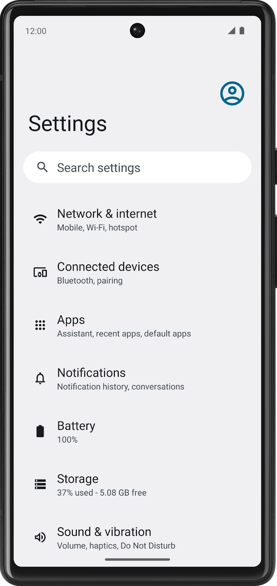 | 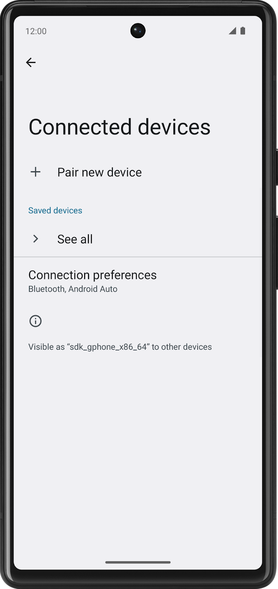 | 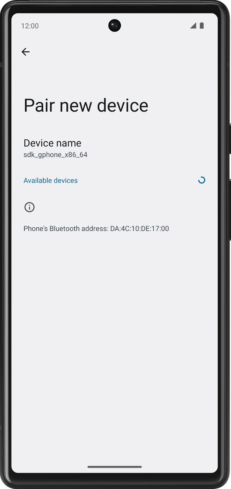 |
|---|---|---|

最新の Android 開発では、マルチスクリーン アプリの作成に Jetpack Navigation コンポーネントを使用します。Navigation Compose コンポーネントを使用すると、ユーザー インターフェースを作成する場合と同様に、宣言型のアプローチによって Compose でマルチスクリーン アプリを簡単に作成できます。このレッスンでは、複雑化するアプリにおけるおすすめの方法を示しつつ、Navigation Compose コンポーネントの基本、AppBar をレスポンシブにする方法、インテントを使用してアプリ間でデータを送信する方法を紹介します。

#### 前提条件

- 関数型、ラムダ、スコープ関数など、Kotlin 言語に精通していること
- Compose の基本的な `Row` レイアウトと `Column` レイアウトに精通していること

#### 学習内容

- `NavHost` コンポーザブルを作成して、アプリのルートと画面を定義する。
- `NavHostController` を使用して画面間を移動する。
- バックスタックを操作して前の画面に移動する。
- インテントを使用して別のアプリとデータを共有する。
- AppBar をカスタマイズする（タイトルや「戻る」ボタンなど）。

#### 作成するアプリの概要

- マルチスクリーン アプリのナビゲーションを実装します。

#### 必要なもの

- Android Studio の最新バージョン
- スターター コードをダウンロードするためのインターネット接続

### 2. スターター コードをダウンロードする

まず、スターター コードをダウンロードします。

または、GitHub リポジトリのクローンを作成してコードを入手することもできます。

```
$ git clone https://github.com/google-developer-training/basic-android-kotlin-compose-training-cupcake.git
$ cd basic-android-kotlin-compose-training-cupcake
$ git checkout starter
```

> **注:**スターター コードは、ダウンロードしたリポジトリの `starter` ブランチにあります。

このレッスンのスターター コードを確認する場合は、[GitHub](https://github.com/google-developer-training/basic-android-kotlin-compose-training-cupcake/tree/starter) で表示します。

### 3. アプリの内容

Cupcake アプリは、これまで取り組んできたアプリとは少し異なります。すべてのコンテンツが 1 つの画面に表示されるのではなく、個別の画面が 4 つあり、ユーザーは各画面を移動しながらカップケーキを注文します。アプリを実行しても何も起こらず、ナビゲーション コンポーネントがまだアプリコードに追加されていないため、これらの画面間を移動できません。ただし、各画面のコンポーザブルのプレビューを確認し、以下に示す最終的なアプリの画面と照らし合わせることはできます。

#### 注文開始画面

最初の画面には、注文するカップケーキの数量に対応した 3 つのボタンが表示されます。

| 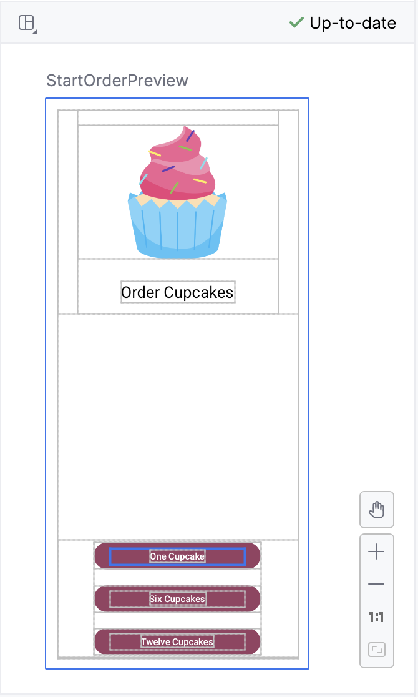 |  |
|---|---|

コードでは、これは `StartOrderScreen.kt` の `StartOrderScreen` コンポーザブルで表現します。

画面は、画像とテキストを含む 1 つの列と、異なる量のカップケーキを注文するための 3 つのカスタムボタンで構成されています。カスタムボタンは、`StartOrderScreen.kt` の `SelectQuantityButton` コンポーザブルで実装します。

#### フレーバー選択画面

数量を選択すると、カップケーキのフレーバーを選択するよう促されます。このアプリでは、ラジオボタンと呼ばれるものを使用して、さまざまなオプションを表示します。ユーザーは複数のフレーバーの中から 1 つを選択できます。

| 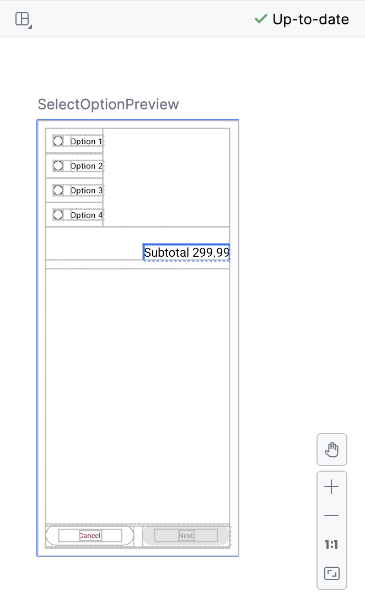 |  |
|---|---|

フレーバーのリストは、文字列リソース ID のリストとして `data.DataSource.kt` に格納されます。

#### 受け取り日選択画面

フレーバーを選択すると、受け取り日を選択する別のラジオボタン群が表示されます。受け取りオプションは、`OrderViewModel` の `pickupOptions()` 関数が返すリストに由来します。

|  | 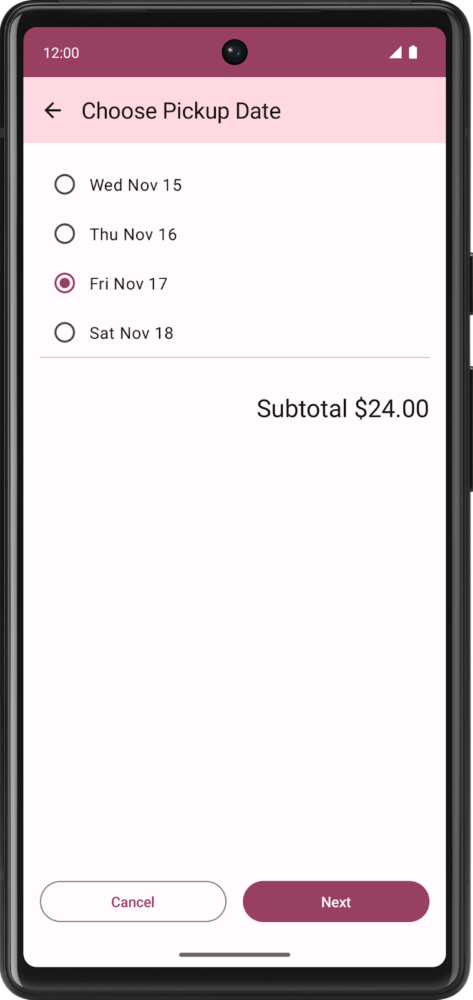 |
|---|---|

**フレーバー選択**画面と**受け取り日選択**画面は、同じ `SelectOptionScreen.kt` の `SelectOptionScreen` コンポーザブルで表現します。なぜ同じコンポーザブルを使用するのかというと、これらの画面のレイアウトがまったく同じだからです。唯一、データが異なりますが、同じコンポーザブルを使用して、フレーバー画面と受け取り日画面の両方を表示できます。

#### 注文概要画面

受け取り日を選択すると、アプリに**注文概要**画面が表示され、ユーザーは注文を確認して完了できます。

| 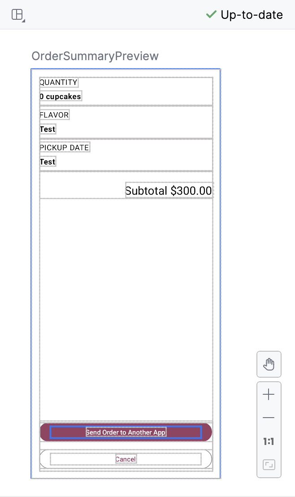 | 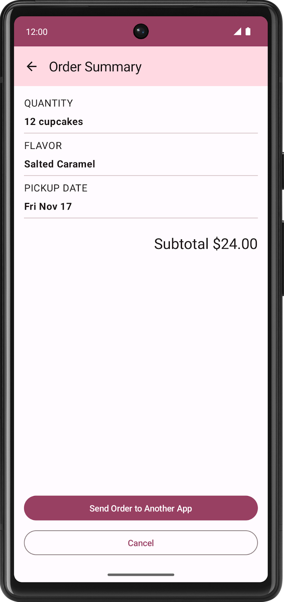 |
|---|---|

この画面は、`SummaryScreen.kt` の `OrderSummaryScreen` コンポーザブルで実装します。

このレイアウトは、注文に関するすべての情報を含む `Column`、小計のための `Text` コンポーザブル、注文を別のアプリに送信するボタン、注文をキャンセルして最初の画面に戻るボタンで構成されています。

ユーザーが別のアプリに注文を送信することを選択した場合、Cupcake アプリは、さまざまな共有オプションを示す [Android ShareSheet](https://developer.android.com/training/sharing/send#why-to-use-system-sharesheet) を表示します。

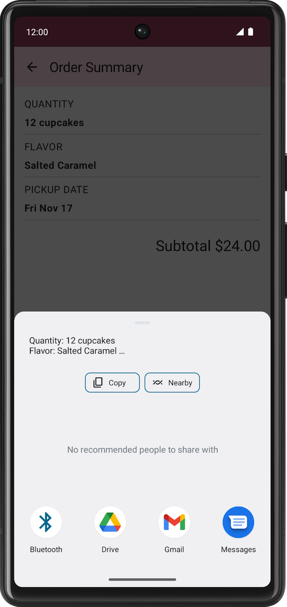

アプリの現在の状態は `data.OrderUiState.kt` に格納されます。`OrderUiState` データクラスには、各画面でのユーザーの選択内容を保存するプロパティが含まれています。

アプリの画面は `CupcakeApp` コンポーザブルで表示されます。しかしスターター プロジェクトでは、アプリは単に最初の画面を表示するだけです。今のところアプリのすべての画面を移動することはできませんが、ご安心ください。今回はこの点に取り組みます。ナビゲーション ルートの定義、画面間を移動するための NavHost コンポーザブルのセットアップ（デスティネーションともいいます）、共有画面などのシステム UI コンポーネントと統合するインテントの実行、ナビゲーションの変更に対する AppBar の反応について学習します。

#### 再利用可能なコンポーザブル

このコースのサンプルアプリは、おすすめの方法を適宜実践できるように設計されています。Cupcake アプリも例外ではありません。**ui.components** パッケージには `CommonUi.kt` というファイルがあり、`FormattedPriceLabel` コンポーザブルが含まれています。アプリ内の複数の画面でこのコンポーザブルを使用して、注文価格の書式を統一しています。同じ書式と修飾子で同じ `Text` コンポーザブルを複製するのではなく、`FormattedPriceLabel` を一度定義しておけば、他の画面で必要な回数だけ再利用できます。

フレーバーの画面と受け取り日の画面は `SelectOptionScreen` コンポーザブルを使用しており、これも再利用できます。このコンポーザブルは、表示するオプションを表す `List<String>` 型の `options` というパラメータを受け取ります。オプションは `Row` で表示され、`RadioButton` コンポーザブルと、各文字列を含む `Text` コンポーザブルで構成されます。`Column` はレイアウト全体を囲みます。また、書式設定された価格を表示する `Text` コンポーザブル、[**Cancel**] ボタン、[**Next**] ボタンが含まれます。

### 4. ルートを定義して NavHostController を作成する

#### Navigation コンポーネントの各部

Navigation コンポーネントは主に 3 つの部分から構成されています。

- **NavController:**デスティネーション（アプリの画面）間の移動を担います。
- **NavGraph:**コンポーザブルのデスティネーションをマッピングして移動できるようにします。
- **NavHost:**NavGraph の現在のデスティネーションを表示するコンテナとして機能するコンポーザブル。

このレッスンでは、NavController と NavHost に焦点を当てます。NavHost 内で、Cupcake アプリの NavGraph のデスティネーションを定義します。

#### アプリ内のデスティネーションのルートを定義する

Compose アプリにおけるナビゲーションの基本コンセプトとして、ルートがあります。ルートとは、デスティネーションに対応する文字列のことで、考え方は URL のコンセプトに似ています。異なる URL がウェブサイトの異なるページにマッピングされるように、ルートはデスティネーションにマッピングされる文字列であり、固有識別子として機能します。デスティネーションは通常、表示内容に対応する単一のコンポーザブル、またはコンポーザブルのグループです。Cupcake アプリでは、注文開始画面、フレーバー画面、受け取り日画面、注文概要画面のデスティネーションが必要です。

アプリの画面数には限りがあるため、ルートの数にも限りがあります。アプリのルートは列挙型クラスを使用して定義できます。Kotlin の列挙型クラスには、プロパティ名を含む文字列を返す name プロパティがあります。

まず、Cupcake アプリの 4 つのルートを定義します。

- **`Start`****:**カップケーキの数量を 3 つのボタンのいずれかで選択します。
- **`Flavor`****:**フレーバーを選択肢のリストから選択します。
- **`Pickup`****:**受け取り日を選択肢のリストから選択します。
- **`Summary`****:**選択内容を確認し、注文を送信またはキャンセルします。

列挙型クラスを追加してルートを定義します。

1. `CupcakeScreen.kt` の `CupcakeAppBar` コンポーザブルの上に、`CupcakeScreen` という列挙型クラスを追加します。

```kotlin
enum class CupcakeScreen() {
    
}
```

2. この列挙型クラスに、`Start`、`Flavor`、`Pickup`、`Summary` という 4 つのケースを追加します。

```kotlin
enum class CupcakeScreen() {
    Start,
    Flavor,
    Pickup,
    Summary
}
```

#### アプリに NavHost を追加する

NavHost は、所定のルートに基づいて他のコンポーザブルのデスティネーションを表示するコンポーザブルです。たとえばルートが `Flavor` であれば、`NavHost` はカップケーキのフレーバーを選択する画面を表示します。ルートが `Summary` であれば、アプリは概要画面を表示します。

`NavHost` の構文は、他のコンポーザブルの場合と同じです。

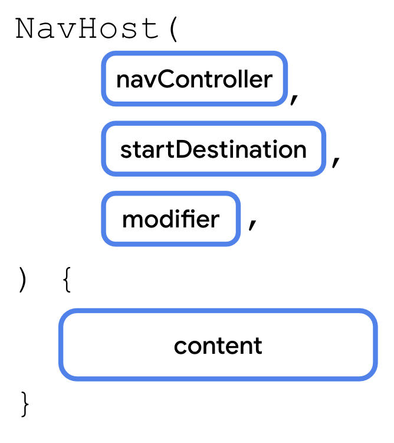

注目すべきパラメータは 2 つあります。

- **`navController`****:**`NavHostController` クラスのインスタンス。このオブジェクトを使用して画面間を移動できます（`navigate()` メソッドを呼び出して別のデスティネーションに移動するなど）。`NavHostController` は、コンポーズ可能な関数から `rememberNavController()` を呼び出すことで取得できます。
- **`startDestination`****:**アプリが最初に `NavHost` を表示したときにデフォルトで表示されるデスティネーションを定義する文字列ルート。Cupcake アプリの場合、これは `Start` ルートになります。

他のコンポーザブルと同様に、`NavHost` も `modifier` パラメータを受け取ります。

> **注:**[`NavHostController`](https://developer.android.com/reference/androidx/navigation/NavHostController) は [`NavController`](https://developer.android.com/reference/androidx/navigation/NavController) クラスのサブクラスであり、`NavHost` コンポーザブルで使用するための追加機能を提供します。

`CupcakeScreen.kt` の `CupcakeApp` コンポーザブルに `NavHost` を追加します。まず、ナビゲーション コントローラへの参照が必要です。ナビゲーション コントローラは、これから追加する `NavHost` と後のステップで追加する `AppBar` の両方で使用できます。そのため、変数を `CupcakeApp()` コンポーザブルで宣言する必要があります。

1. `CupcakeScreen.kt` を開きます。
2. `Scaffold` の `uiState` 変数の下に `NavHost` コンポーザブルを追加します。

```kotlin
import androidx.navigation.compose.NavHost

Scaffold(
    ...
) { innerPadding ->
    val uiState by viewModel.uiState.collectAsState()

    NavHost()
}
```

3. `navController` パラメータに `navController` 変数を渡し、`startDestination` パラメータに `CupcakeScreen.Start.name` を渡します。`CupcakeApp()` に渡された修飾子を修飾子パラメータに渡します。最後のパラメータに空の後置ラムダを渡します。

```kotlin
import androidx.compose.foundation.layout.padding

NavHost(
    navController = navController,
    startDestination = CupcakeScreen.Start.name,
    modifier = Modifier.padding(innerPadding)
) {

}
```

#### `NavHost` でルートを処理する

他のコンポーザブルと同様に、`NavHost` のコンテンツは関数型です。

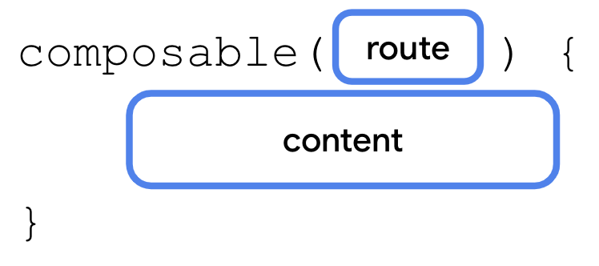

`NavHost` のコンテンツ関数内で、`composable()` 関数を呼び出します。`composable()` 関数には必須のパラメータが 2 つあります。

- **`route`****:**ルートの名前に対応する文字列。一意の文字列を指定できます。`CupcakeScreen` 列挙型の定数の name プロパティを使用します。
- **`content`****:**ここで、所定のルートに対して表示するコンポーザブルを呼び出すことができます。

4 つのルートそれぞれについて、`composable()` 関数を 1 回ずつ呼び出します。

> **注:** `composable()` 関数は [`NavGraphBuilder`](https://developer.android.com/reference/kotlin/androidx/navigation/NavGraphBuilder) の拡張関数です。

1. `composable()` 関数を呼び出し、`route` に `CupcakeScreen.Start.name` を渡します。

```kotlin
import androidx.navigation.compose.composable

NavHost(
    navController = navController,
    startDestination = CupcakeScreen.Start.name,
    modifier = Modifier.padding(innerPadding)
) {
    composable(route = CupcakeScreen.Start.name) {
        
    }
}
```

2. 後置ラムダ内で、`StartOrderScreen` コンポーザブルを呼び出し、`quantityOptions` プロパティに `quantityOptions` を渡します。`modifier` には `Modifier.fillMaxSize().padding(dimensionResource(R.dimen.padding_medium))` を渡します。

```kotlin
import androidx.compose.foundation.layout.fillMaxSize
import androidx.compose.ui.res.dimensionResource
import com.example.cupcake.ui.StartOrderScreen
import com.example.cupcake.data.DataSource

NavHost(
    navController = navController,
    startDestination = CupcakeScreen.Start.name,
    modifier = Modifier.padding(innerPadding)
) {
    composable(route = CupcakeScreen.Start.name) {
        StartOrderScreen(
            quantityOptions = DataSource.quantityOptions,
            modifier = Modifier
                .fillMaxSize()
                .padding(dimensionResource(R.dimen.padding_medium))
        )
    }
}
```

> **注:** `quantityOptions` プロパティは、**DataSource.kt** の `DataSource` シングルトン オブジェクトから取得されます。

3. 最初の `composable()` の呼び出しの下で、`composable()` を再度呼び出し、`route` に `CupcakeScreen.Flavor.name` を渡します。

```kotlin
composable(route = CupcakeScreen.Flavor.name) {
    
}
```

4. 後置ラムダ内で、`LocalContext.current` への参照を取得し、`context` という変数に格納します。[`Context`](https://developer.android.com/reference/android/content/Context) は Android システムによって実装が提供される抽象クラスです。アプリケーション固有のリソースとクラスだけでなく、アプリケーション レベルのオペレーション（例: アクティビティの起動）のアップコールへのアクセスを可能にします。この変数を使用して、ビューモデルのリソース ID のリストから文字列を取得しフレーバーのリストを表示できます。

```kotlin
import androidx.compose.ui.platform.LocalContext

composable(route = CupcakeScreen.Flavor.name) {
    val context = LocalContext.current
}
```

5. `SelectOptionScreen` コンポーザブルを呼び出します。

```kotlin
composable(route = CupcakeScreen.Flavor.name) {
    val context = LocalContext.current
    SelectOptionScreen(

    )
}
```

6. ユーザーがフレーバーを選択したとき、フレーバー画面が小計を表示、更新する必要があります。`subtotal` パラメータに `uiState.price` を渡します。

```kotlin
composable(route = CupcakeScreen.Flavor.name) {
    val context = LocalContext.current
    SelectOptionScreen(
        subtotal = uiState.price
    )
}
```

7. フレーバー画面では、アプリの文字列リソースからフレーバーのリストを取得します。`map()` 関数を使用し、それぞれのフレーバーに対して `context.resources.getString(id)` を呼び出すことで、リソース ID のリストを文字列のリストに変換します。

```kotlin
import com.example.cupcake.ui.SelectOptionScreen

composable(route = CupcakeScreen.Flavor.name) {
    val context = LocalContext.current
    SelectOptionScreen(
        subtotal = uiState.price,
        options = DataSource.flavors.map { id -> context.resources.getString(id) }
    )
}
```

8. `onSelectionChanged` パラメータには、ビューモデルの `setFlavor()` を呼び出すラムダ式を渡し、`it`（`onSelectionChanged()` に渡された引数）を渡します。`modifier` パラメータには `Modifier.fillMaxHeight().` を渡します。

```kotlin
import androidx.compose.foundation.layout.fillMaxHeight
import com.example.cupcake.data.DataSource.flavors

composable(route = CupcakeScreen.Flavor.name) {
    val context = LocalContext.current
    SelectOptionScreen(
        subtotal = uiState.price,
        options = DataSource.flavors.map { id -> context.resources.getString(id) },
        onSelectionChanged = { viewModel.setFlavor(it) },
        modifier = Modifier.fillMaxHeight()
    )
}
```

受け取り日画面はフレーバー画面に似ています。唯一の違いは、`SelectOptionScreen` コンポーザブルに渡されるデータです。

9. `composable()` 関数を再度呼び出し、`route` パラメータに `CupcakeScreen.Pickup.name` を渡します。

```kotlin
composable(route = CupcakeScreen.Pickup.name) {
    
}
```

10. 後置ラムダで、`SelectOptionScreen` コンポーザブルを呼び出し、前と同じように `subtotal` に `uiState.price` を渡します。`options` パラメータには `uiState.pickupOptions` を渡し、`onSelectionChanged` パラメータには `viewModel` の `setDate()` を呼び出すラムダ式を渡します。`modifier` パラメータには `Modifier.fillMaxHeight().` を渡します。

```kotlin
SelectOptionScreen(
    subtotal = uiState.price,
    options = uiState.pickupOptions,
    onSelectionChanged = { viewModel.setDate(it) },
    modifier = Modifier.fillMaxHeight()
)
```

11. `composable()` をもう一度呼び出し、`route` に `CupcakeScreen.Summary.name` を渡します。

```kotlin
composable(route = CupcakeScreen.Summary.name) {
    
}
```

12. 後置ラムダで、`OrderSummaryScreen()` コンポーザブルを呼び出し、`orderUiState` パラメータに `uiState` 変数を渡します`modifier` パラメータには `Modifier.fillMaxHeight().` を渡します。

```kotlin
import com.example.cupcake.ui.OrderSummaryScreen

composable(route = CupcakeScreen.Summary.name) {
    OrderSummaryScreen(
        orderUiState = uiState,
        modifier = Modifier.fillMaxHeight()
    )
}
```

`NavHost` のセットアップは以上です。次のセクションでは、アプリがルートを変更して、ユーザーが各ボタンをタップしたときに画面間を移動するようにします。

### 5. ルート間を移動する

ルートを定義し、`NavHost` でコンポーザブルにマッピングしたところで、今度は画面間を移動しましょう。`NavHostController`（`rememberNavController()` を呼び出す際の `navController` プロパティ）は、ルート間の移動を担います。ただし、このプロパティは `CupcakeApp` コンポーザブルで定義されています。アプリのさまざまな画面からアクセスする方法が必要です。

単に、`navController` をパラメータとして各コンポーザブルに渡すだけです。

このアプローチは機能しますが、アプリの設計に理想的な方法ではありません。NavHost を使用してアプリのナビゲーションを処理するメリットは、ナビゲーション ロジックが個々の UI とは別に維持されることです。このオプションでは、`navController` をパラメータとして渡す場合の大きな欠点を回避できます。

- ナビゲーション ロジックが 1 か所にまとまるため、コードをメンテナンスしやすくなり、誤って個々の画面からアプリ内を自由に移動できるようにしないことで、バグを防止できます。
- さまざまなフォーム ファクタ（縦向きのスマートフォン、折りたたみ式スマートフォン、大画面のタブレットなど）で動作する必要があるアプリでは、アプリのレイアウトに応じて、ボタンがナビゲーションをトリガーする場合もあれば、しない場合もあります。個々の画面は自己完結している必要があります。アプリ内の他の画面を認識する必要はありません。

代わりに、ユーザーがボタンをクリックしたときの動作について、関数型を各コンポーザブルに渡します。これにより、コンポーザブルとその子コンポーザブルは、関数を呼び出すタイミングを決定します。ただし、ナビゲーション ロジックはアプリの個々の画面には公開されません。ナビゲーション動作はすべて NavHost で処理されます。

#### `StartOrderScreen` にボタンハンドラを追加する

まず、最初の画面で数量ボタンのいずれかが押されたときに呼び出される関数型のパラメータを追加します。この関数は `StartOrderScreen` コンポーザブルに渡され、ビューモデルの更新と次の画面への移動を担います。

1. `StartOrderScreen.kt` を開きます。
2. `quantityOptions` パラメータの下、修飾子パラメータの前に、`() -> Unit` 型の `onNextButtonClicked` というパラメータを追加します。

```kotlin
@Composable
fun StartOrderScreen(
    quantityOptions: List<Pair<Int, Int>>,
    onNextButtonClicked: () -> Unit,
    modifier: Modifier = Modifier
){
    ...
}
```

3. `StartOrderScreen` コンポーザブルが `onNextButtonClicked` の値を必要とするため、`StartOrderPreview` を見つけて空のラムダ本体を `onNextButtonClicked` パラメータに渡します。

```kotlin
@Preview
@Composable
fun StartOrderPreview() {
    CupcakeTheme {
        StartOrderScreen(
            quantityOptions = DataSource.quantityOptions,
            onNextButtonClicked = {},
            modifier = Modifier
                .fillMaxSize()
                .padding(dimensionResource(R.dimen.padding_medium))
        )
    }
}
```

各ボタンはそれぞれ異なる数量のカップケーキに対応しています。この情報は、`onNextButtonClicked` に渡される関数がそれに応じて適切にビューモデルを更新できるようにするために必要です。

4. `Int` パラメータを受け取るように `onNextButtonClicked` パラメータの型を変更します。

```kotlin
onNextButtonClicked: (Int) -> Unit,
```

`onNextButtonClicked()` を呼び出すときに渡す `Int` を確認するために、`quantityOptions` パラメータの型を見てみましょう。

型は `List<Pair<Int, Int>>` か、`Pair<Int, Int>` のリストです。[`Pair`](https://kotlinlang.org/api/latest/jvm/stdlib/kotlin/-pair/) 型にはなじみがないかもしれませんが、その名のとおり、値のペアです。`Pair` は汎用型パラメータを 2 つ受け取ります。この場合、どちらも `Int` 型です。

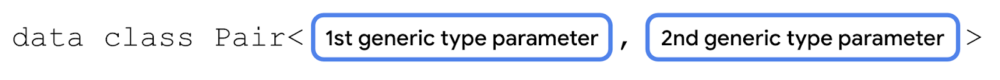

ペアの各アイテムには、1 つ目のプロパティまたは 2 つ目のプロパティでアクセスします。`StartOrderScreen` コンポーザブルの `quantityOptions` パラメータの場合、1 つ目の `Int` は、各ボタンに表示する文字列のリソース ID です。2 つ目の `Int` は、カップケーキの実際の数量です。

`onNextButtonClicked()` 関数を呼び出すときに、選択したペアの 2 つ目のプロパティを渡します。

1. `SelectQuantityButton` の `onClick` パラメータの空のラムダ式を見つけます。

```kotlin
quantityOptions.forEach { item ->
    SelectQuantityButton(
        labelResourceId = item.first,
        onClick = {}
    )
}
```

2. そのラムダ式で `onNextButtonClicked` を呼び出し、`item.second`（カップケーキの数）を渡します。

```kotlin
quantityOptions.forEach { item ->
    SelectQuantityButton(
        labelResourceId = item.first,
        onClick = { onNextButtonClicked(item.second) }
    )
}
```

#### SelectOptionScreen にボタンハンドラを追加する

1. `SelectOptionScreen.kt` で、`SelectOptionScreen` コンポーザブルの `onSelectionChanged` パラメータの下に、`() -> Unit` 型の `onCancelButtonClicked` というパラメータを追加し、`{}` のデフォルト値を指定します。

```kotlin
@Composable
fun SelectOptionScreen(
    subtotal: String,
    options: List<String>,
    onSelectionChanged: (String) -> Unit = {},
    onCancelButtonClicked: () -> Unit = {},
    modifier: Modifier = Modifier
)
```

2. `onCancelButtonClicked` パラメータの下に、`() -> Unit` 型の `onNextButtonClicked` という名前の別のパラメータを追加し、`{}` のデフォルト値を指定します。

```kotlin
@Composable
fun SelectOptionScreen(
    subtotal: String,
    options: List<String>,
    onSelectionChanged: (String) -> Unit = {},
    onCancelButtonClicked: () -> Unit = {},
    onNextButtonClicked: () -> Unit = {},
    modifier: Modifier = Modifier
)
```

3. Cancel ボタンの `onClick` パラメータに `onCancelButtonClicked` を渡します。

```kotlin
OutlinedButton(
    modifier = Modifier.weight(1f),
    onClick = onCancelButtonClicked
) {
    Text(stringResource(R.string.cancel))
}
```

4. Next ボタンの `onClick` パラメータに `onNextButtonClicked` を渡します。

```kotlin
Button(
    modifier = Modifier.weight(1f),
    enabled = selectedValue.isNotEmpty(),
    onClick = onNextButtonClicked
) {
    Text(stringResource(R.string.next))
}
```

#### SummaryScreen にボタンハンドラを追加する

最後に、概要画面の [**Cancel**] ボタンと [**Send**] ボタンのボタンハンドラ関数を追加します。

1. **`SummaryScreen.kt`** の `OrderSummaryScreen` コンポーザブルに、`() -> Unit` 型の `onCancelButtonClicked` というパラメータを追加します。

```kotlin
@Composable
fun OrderSummaryScreen(
    orderUiState: OrderUiState,
    onCancelButtonClicked: () -> Unit,
    modifier: Modifier = Modifier
){
    ...
}
```

2. `(String, String) -> Unit` 型のパラメータを追加し、名前を `onSendButtonClicked` にします。

```kotlin
@Composable
fun OrderSummaryScreen(
    orderUiState: OrderUiState,
    onCancelButtonClicked: () -> Unit,
    onSendButtonClicked: (String, String) -> Unit,
    modifier: Modifier = Modifier
){
    ...
}
```

3. `OrderSummaryScreen` コンポーザブルによって `onSendButtonClicked` と `onCancelButtonClicked` の値が要求されます。`OrderSummaryPreview` を見つけて 2 つの `String` パラメータが設定された空のラムダ本体を `onSendButtonClicked` に渡し、空のラムダ本体を `onCancelButtonClicked` パラメータに渡します。

```kotlin
@Preview
@Composable
fun OrderSummaryPreview() {
   CupcakeTheme {
       OrderSummaryScreen(
           orderUiState = OrderUiState(0, "Test", "Test", "$300.00"),
           onSendButtonClicked = { subject: String, summary: String -> },
           onCancelButtonClicked = {},
           modifier = Modifier.fillMaxHeight()
       )
   }
}
```

4. [**Send**] ボタンの `onClick` パラメータに `onSendButtonClicked` を渡します。`newOrder` と `orderSummary`（前に `OrderSummaryScreen` で定義した 2 つの変数）を渡します。これらの文字列は、ユーザーが別のアプリと共有できる実際のデータで構成されます。

```kotlin
Button(
    modifier = Modifier.fillMaxWidth(),
    onClick = { onSendButtonClicked(newOrder, orderSummary) }
) {
    Text(stringResource(R.string.send))
}
```

5. [**Cancel**] ボタンの `onClick` パラメータに `onCancelButtonClicked` を渡します。

```kotlin
OutlinedButton(
    modifier = Modifier.fillMaxWidth(),
    onClick = onCancelButtonClicked
) {
    Text(stringResource(R.string.cancel))
}
```

#### 別のルートに移動する

別のルートに移動するには、単に `NavHostController` のインスタンスで `navigate()` メソッドを呼び出します。

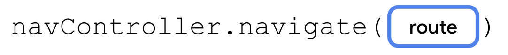

navigate メソッドは、1 つのパラメータ（`NavHost` で定義したルートに対応する `String`）を受け取ります。ルートが `NavHost` の `composable()` の呼び出しのいずれかと一致する場合、アプリはその画面に移動します。

`Start`、`Flavor`、`Pickup` の各画面でユーザーがボタンを押したときに、`navigate()` を呼び出す関数を渡します。

1. `CupcakeScreen.kt` で、開始画面の `composable()` の呼び出しを見つけます。`onNextButtonClicked` パラメータにラムダ式を渡します。

```kotlin
StartOrderScreen(
    quantityOptions = DataSource.quantityOptions,
    onNextButtonClicked = {
    }
)
```

カップケーキの数について、この関数に渡した `Int` プロパティを覚えているでしょうか。次の画面に移動する前に、ビューモデルを更新してアプリに正しい小計が表示されるようにする必要があります。

2. `viewModel` に対して `setQuantity` を呼び出し、`it` を渡します。

```kotlin
onNextButtonClicked = {
    viewModel.setQuantity(it)
}
```

3. `navController` に対して `navigate()` を呼び出し、`route` に `CupcakeScreen.Flavor.name` を渡します。

```kotlin
onNextButtonClicked = {
    viewModel.setQuantity(it)
    navController.navigate(CupcakeScreen.Flavor.name)
}
```

4. フレーバー画面の `onNextButtonClicked` パラメータについては、単に `navigate()` を呼び出すラムダを渡し、`route` に `CupcakeScreen.Pickup.name` を渡します。

```kotlin
composable(route = CupcakeScreen.Flavor.name) {
    val context = LocalContext.current
    SelectOptionScreen(
        subtotal = uiState.price,
        onNextButtonClicked = { navController.navigate(CupcakeScreen.Pickup.name) },
        options = DataSource.flavors.map { id -> context.resources.getString(id) },
        onSelectionChanged = { viewModel.setFlavor(it) },
        modifier = Modifier.fillMaxHeight()
    )
}
```

5. 次に実装する `onCancelButtonClicked` に空のラムダを渡します。

```kotlin
SelectOptionScreen(
    subtotal = uiState.price,
    onNextButtonClicked = { navController.navigate(CupcakeScreen.Pickup.name) },
    onCancelButtonClicked = {},
    options = DataSource.flavors.map { id -> context.resources.getString(id) },
    onSelectionChanged = { viewModel.setFlavor(it) },
    modifier = Modifier.fillMaxHeight()
)
```

6. 受け取り画面の `onNextButtonClicked` パラメータについては、`navigate()` を呼び出すラムダを渡し、`route` に `CupcakeScreen.Summary.name` を渡します。

```kotlin
composable(route = CupcakeScreen.Pickup.name) {
    SelectOptionScreen(
        subtotal = uiState.price,
        onNextButtonClicked = { navController.navigate(CupcakeScreen.Summary.name) },
        options = uiState.pickupOptions,
        onSelectionChanged = { viewModel.setDate(it) },
        modifier = Modifier.fillMaxHeight()
    )
}
```

7. 再度、`onCancelButtonClicked()` に空のラムダを渡します。

```kotlin
SelectOptionScreen(
    subtotal = uiState.price,
    onNextButtonClicked = { navController.navigate(CupcakeScreen.Summary.name) },
    onCancelButtonClicked = {},
    options = uiState.pickupOptions,
    onSelectionChanged = { viewModel.setDate(it) },
    modifier = Modifier.fillMaxHeight()
)
```

8. `OrderSummaryScreen` については、`onCancelButtonClicked` と `onSendButtonClicked` に空のラムダを渡します。`onSendButtonClicked` に渡される `subject` と `summary` のパラメータを追加します。これらはまもなく実装します。

```kotlin
composable(route = CupcakeScreen.Summary.name) {
    OrderSummaryScreen(
        orderUiState = uiState,
        onCancelButtonClicked = {},
        onSendButtonClicked = { subject: String, summary: String ->

        },
        modifier = Modifier.fillMaxHeight()
    )
}
```

これで、アプリの各画面を移動できるようになりました。`navigate()` を呼び出すと、画面が変更されるだけでなく、実際にバックスタックの上に配置されます。また、システムの「戻る」ボタンを押すと、前の画面に戻ることができます。

表示された画面は一つひとつ前の画面の上に積み重ねられ、「戻る」ボタン（）で削除できます。一番下の `startDestination` から、表示されている一番上の画面までの履歴を、バックスタックといいます。

#### 開始画面までポップする

システムの「戻る」ボタンとは異なり、[**Cancel**] ボタンを押しても前の画面に戻りません。バックスタックからすべての画面をポップ（削除）して、開始画面に戻る必要があります。

そのためには、`popBackStack()` メソッドを呼び出します。

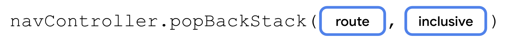

`popBackStack()` メソッドには必須のパラメータが 2 つあります。

- **`route`****:**戻るデスティネーションのルートを表す文字列。
- **`inclusive`****:**ブール値。true の場合、指定したルートもポップ（削除）します。false の場合、`popBackStack()` は開始デスティネーションより上にあるデスティネーションをすべて削除し、ユーザーが目にする一番上の画面として開始デスティネーションを残します。

ユーザーがいずれかの画面で [**Cancel**] ボタンを押すと、アプリはビューモデルの状態をリセットし、`popBackStack()` を呼び出します。まずこれを行うメソッドを実装してから、[**Cancel**] ボタンを備えた 3 つの画面すべてで、適切なパラメータに渡します。

1. `CupcakeApp()` 関数の後に、`cancelOrderAndNavigateToStart()` というプライベート関数を定義します。

```kotlin
private fun cancelOrderAndNavigateToStart() {
}
```

2. `OrderViewModel` 型の `viewModel` と `NavHostController` 型の `navController` という 2 つのパラメータを追加します。

```kotlin
private fun cancelOrderAndNavigateToStart(
    viewModel: OrderViewModel,
    navController: NavHostController
) {
}
```

3. 関数本体で、`viewModel` に対して `resetOrder()` を呼び出します。

```kotlin
private fun cancelOrderAndNavigateToStart(
    viewModel: OrderViewModel,
    navController: NavHostController
) {
    viewModel.resetOrder()
}
```

4. `navController` に対して `popBackStack()` を呼び出し、`route` に `CupcakeScreen.Start.name` を渡して、`inclusive` に `false` を渡します。

```kotlin
private fun cancelOrderAndNavigateToStart(
    viewModel: OrderViewModel,
    navController: NavHostController
) {
    viewModel.resetOrder()
    navController.popBackStack(CupcakeScreen.Start.name, inclusive = false)
}
```

5. `CupcakeApp()` コンポーザブルで、2 つの `SelectOptionScreen` コンポーザブルと `OrderSummaryScreen` コンポーザブルの `onCancelButtonClicked` パラメータに `cancelOrderAndNavigateToStart` を渡します。

```kotlin
composable(route = CupcakeScreen.Start.name) {
    StartOrderScreen(
        quantityOptions = DataSource.quantityOptions,
        onNextButtonClicked = {
            viewModel.setQuantity(it)
            navController.navigate(CupcakeScreen.Flavor.name)
        },
        modifier = Modifier
            .fillMaxSize()
            .padding(dimensionResource(R.dimen.padding_medium))
    )
}
composable(route = CupcakeScreen.Flavor.name) {
    val context = LocalContext.current
    SelectOptionScreen(
        subtotal = uiState.price,
        onNextButtonClicked = { navController.navigate(CupcakeScreen.Pickup.name) },
        onCancelButtonClicked = {
            cancelOrderAndNavigateToStart(viewModel, navController)
        },
        options = DataSource.flavors.map { id -> context.resources.getString(id) },
        onSelectionChanged = { viewModel.setFlavor(it) },
        modifier = Modifier.fillMaxHeight()
    )
}
composable(route = CupcakeScreen.Pickup.name) {
    SelectOptionScreen(
        subtotal = uiState.price,
        onNextButtonClicked = { navController.navigate(CupcakeScreen.Summary.name) },
        onCancelButtonClicked = {
            cancelOrderAndNavigateToStart(viewModel, navController)
        },
        options = uiState.pickupOptions,
        onSelectionChanged = { viewModel.setDate(it) },
        modifier = Modifier.fillMaxHeight()
    )
}
composable(route = CupcakeScreen.Summary.name) {
    OrderSummaryScreen(
        orderUiState = uiState,
        onCancelButtonClicked = {
            cancelOrderAndNavigateToStart(viewModel, navController)
        },
        onSendButtonClicked = { subject: String, summary: String ->

        },
        modifier = Modifier.fillMaxHeight()
   )
}
```

6. アプリを実行し、いずれかの画面で [**Cancel**] ボタンを押すと最初の画面に戻ることを確認します。

### 6. 別のアプリに移動する

ここまでで、アプリ内の別の画面に移動する方法と、ホーム画面に戻る方法を学習しました。Cupcake アプリにナビゲーションを実装するには、もう 1 つだけステップがあります。注文概要画面で、ユーザーは別のアプリに注文を送信できます。この選択により、[ShareSheet](https://developer.android.com/training/sharing/send)（画面の下部を覆うユーザー インターフェース コンポーネント）が表示され、共有オプションが表示されます。

この UI 部分は、Cupcake アプリの一部ではありません。実際は Android オペレーティング システムが提供しています。共有画面などのシステム UI は、`navController` で呼び出すわけではありません。代わりに、インテントというものを使用します。

インテントはシステムになんらかのアクションを行わせるリクエストです。通常は、新しいアクティビティを提示します。さまざまなインテントが存在します。包括的なリストについては、ドキュメントをご覧になることをおすすめします。ここでは、`ACTION_SEND` というインテントを活用します。このインテントに文字列などのデータを指定し、そのデータに適した共有アクションを提示できます。

インテントをセットアップする基本的なプロセスは次のとおりです。

1. インテント オブジェクトを作成し、インテントを指定します（`ACTION_SEND` など）。
2. インテントで送信する追加データの型を指定します。単純なテキストには `"text/plain"` を使用できますが、`"image/*"` や `"video/*"` など他のタイプも使用できます。
3. `putExtra()` メソッドを呼び出して、共有するテキストや画像などの追加データをインテントに渡します。このインテントは `EXTRA_SUBJECT` と `EXTRA_TEXT` という 2 つのエクストラを受け取ります。
4. コンテキストの `startActivity()` メソッドを呼び出し、インテントから作成したアクティビティを渡します。

ここでは共有アクション インテントの作成方法を説明しますが、プロセスは他のタイプのインテントでも同じです。今後のプロジェクトでは必要に応じて、特定の種類のデータと必要なエクストラについてドキュメントをご覧になることをおすすめします。

次の手順を実施して、カップケーキの注文を別のアプリに送信するインテントを作成します。

1. **CupcakeScreen.kt** の `CupcakeApp` コンポーザブルの下に `shareOrder()` というプライベート関数を作成します。

```kotlin
private fun shareOrder()
```

2. `Context` 型の `context` というパラメータを追加します。

```kotlin
import android.content.Context

private fun shareOrder(context: Context) {
}
```

3. `subject` と `summary` の 2 つの `String` パラメータを追加します。これらの文字列は共有アクション シートに表示されます。

```kotlin
private fun shareOrder(context: Context, subject: String, summary: String) {
}
```

4. 関数本体内に `intent` というインテントを作成し、引数として `Intent.ACTION_SEND` を渡します。

```kotlin
import android.content.Intent

val intent = Intent(Intent.ACTION_SEND)
```

この `Intent` オブジェクトは一度構成するだけで済むため、後続する数行のコードは、前のレッスンで学習した `apply()` 関数を使用してさらに簡潔にできます。

5. 新しく作成したインテントに対して `apply()` を呼び出し、ラムダ式を渡します。

```kotlin
val intent = Intent(Intent.ACTION_SEND).apply {
    
}
```

6. ラムダ本体で、型を `"text/plain"` に設定します。これは `apply()` に渡される関数で行うため、オブジェクトの識別子である `intent` を参照する必要はありません。

```kotlin
val intent = Intent(Intent.ACTION_SEND).apply {
    type = "text/plain"
}
```

7. `putExtra()` を呼び出して、`EXTRA_SUBJECT` に subject を渡します。

```kotlin
val intent = Intent(Intent.ACTION_SEND).apply {
    type = "text/plain"
    putExtra(Intent.EXTRA_SUBJECT, subject)
}
```

8. `putExtra()` を呼び出して、`EXTRA_TEXT` に summary を渡します。

```kotlin
val intent = Intent(Intent.ACTION_SEND).apply {
    type = "text/plain"
    putExtra(Intent.EXTRA_SUBJECT, subject)
    putExtra(Intent.EXTRA_TEXT, summary)
}
```

9. コンテキストの `startActivity()` メソッドを呼び出します。

```kotlin
context.startActivity(
    
)
```

10. `startActivity()` に渡されるラムダ内で、クラスメソッド `createChooser()` を呼び出してインテントからアクティビティを作成します。最初の引数と `new_cupcake_order` 文字列リソースに intent を渡します。

```kotlin
context.startActivity(
    Intent.createChooser(
        intent,
        context.getString(R.string.new_cupcake_order)
    )
)
```

11. `CupcakeApp` コンポーザブルにおいて、`CucpakeScreen.Summary.name` の `composable()` の呼び出しで、コンテキスト オブジェクトへの参照を取得し、`shareOrder()` 関数に渡せるようにします。

```kotlin
composable(route = CupcakeScreen.Summary.name) {
    val context = LocalContext.current

    ...
}
```

12. `onSendButtonClicked()` のラムダ本体で `shareOrder()` を呼び出し、引数として `context`、`subject`、`summary` を渡します。

```kotlin
onSendButtonClicked = { subject: String, summary: String ->
    shareOrder(context, subject = subject, summary = summary)
}
```

13. アプリを実行し、画面を移動します。

[**Send Order to Another App**] をクリックすると、エクストラとして指定した件名と概要に加えて、[**メッセージ**] や [**Bluetooth**] などの共有アクションがボトムシートに表示されます。


### 7. アプリバーがナビゲーションに反応するようにする

アプリは機能し、どの画面間でも移動できるようにもなりましたが、このレッスンの冒頭で示したスクリーンショットと比べると欠けているものがまだいくつかあります。アプリバーは自動的にはナビゲーションに反応しません。アプリが新しいルートに移動したときにタイトルが更新されず、必要に応じてタイトルの前に「上へ」ボタンが表示されることもありません。

> **注:**システムの「戻る」ボタンは、Android オペレーティング システムによって提供され、画面の下部に配置されます。
> 
> 
> 
> 一方で「上へ」ボタンは、アプリの `AppBar` に配置されます。
> 
> 
> 
> アプリ内では、「戻る」ボタンと「上へ」ボタンの動作はどちらも同じであり、前の画面に戻ります。

スターター コードには、`CupcakeAppBar` という `AppBar` を管理するためのコンポーザブルが含まれています。アプリにナビゲーションを実装したので、バックスタックからの情報を使用して正しいタイトルを表示し、必要に応じて「上へ」ボタンを表示できます。タイトルが適切に更新されるように `CupcakeAppBar` コンポーザブルは現在の画面を認識する必要があります。

1. **CupcakeScreen.kt** の `CupcakeScreen` 列挙型で、`@StringRes` アノテーションを使用して `Int` 型の `title` という名前のパラメータを追加します。

```kotlin
import androidx.annotation.StringRes

enum class CupcakeScreen(@StringRes val title: Int) {
    Start,
    Flavor,
    Pickup,
    Summary
}
```

2. 各画面のタイトル テキストに対応する各列挙型のリソース値を追加します。`app_name` を `Start` 画面に、`choose_flavor` を `Flavor` 画面に、`choose_pickup_date` を `Pickup` 画面に、さらに `order_summary` を `Summary` 画面に使用します。

```kotlin
enum class CupcakeScreen(@StringRes val title: Int) {
    Start(title = R.string.app_name),
    Flavor(title = R.string.choose_flavor),
    Pickup(title = R.string.choose_pickup_date),
    Summary(title = R.string.order_summary)
}
```

3. `CupcakeScreen` 型の `currentScreen` というパラメータを `CupcakeAppBar` コンポーザブルに追加します。

```kotlin
fun CupcakeAppBar(
    currentScreen: CupcakeScreen,
    canNavigateBack: Boolean,
    navigateUp: () -> Unit = {},
    modifier: Modifier = Modifier
)
```

4. `CupcakeAppBar` 内で、`currentScreen.title` を `TopAppBar` のタイトル パラメータの `stringResource()` の呼び出しに渡すことによって、ハードコードされたアプリ名を現在の画面のタイトルに置き換えます。

```kotlin
TopAppBar(
    title = { Text(stringResource(currentScreen.title)) },
    modifier = modifier,
    navigationIcon = {
        if (canNavigateBack) {
            IconButton(onClick = navigateUp) {
                Icon(
                    imageVector = Icons.Filled.ArrowBack,
                    contentDescription = stringResource(R.string.back_button)
                )
            }
        }
    }
)
```

「上へ」ボタンは、バックスタックにコンポーザブルがある場合にのみ表示されます。アプリの画面がバックスタックにない場合（`StartOrderScreen` が表示されている場合）、「上へ」ボタンは表示されません。これを確認するには、バックスタックへの参照が必要です。

1. `CupcakeApp` コンポーザブルで、`navController` 変数の下に `backStackEntry` という変数を作成し、`by` デリゲートを使用して `navController` の `currentBackStackEntryAsState()` メソッドを呼び出します。

```kotlin
import androidx.navigation.compose.currentBackStackEntryAsState

@Composable
fun CupcakeApp(
    viewModel: OrderViewModel = viewModel(),
    navController: NavHostController = rememberNavController()
){

    val backStackEntry by navController.currentBackStackEntryAsState()

    ...
}
```

2. 現在の画面のタイトルを `CupcakeScreen` の値に変換します。`backStackEntry` 変数の下で、`CupcakeScreen` の `valueOf()` クラス関数の呼び出し結果と同等の `currentScreen` という名前の `val` を使用して変数を作成し、`backStackEntry` の宛先のルートに渡します。エルビス演算子を使用して `CupcakeScreen.Start.name` のデフォルト値を指定します。

```kotlin
val currentScreen = CupcakeScreen.valueOf(
    backStackEntry?.destination?.route ?: CupcakeScreen.Start.name
)
```

3. `currentScreen` 変数の値を同じ名前の `CupcakeAppBar` コンポーザブルのパラメータに渡します。

```kotlin
CupcakeAppBar(
    currentScreen = currentScreen,
    canNavigateBack = false,
    navigateUp = {}
)
```

バックスタックで現在の画面の背後に画面がある限り、「上へ」ボタンが表示されます。ブール式を使用して、「上へ」ボタンを表示するかどうかを指定できます。

1. `canNavigateBack` パラメータに、`navController` の `previousBackStackEntry` プロパティが null と等しくないかどうかを確認するブール式を渡します。

```kotlin
canNavigateBack = navController.previousBackStackEntry != null,
```

2. 実際に前の画面に戻るには、`navController` の `navigateUp()` メソッドを呼び出します。

```kotlin
navigateUp = { navController.navigateUp() }
```

3. アプリを実行します。

`AppBar` のタイトルが現在の画面を反映するように更新されました。`StartOrderScreen` 以外の画面に移動すると「上へ」ボタンが表示され、前の画面に戻ることができます。

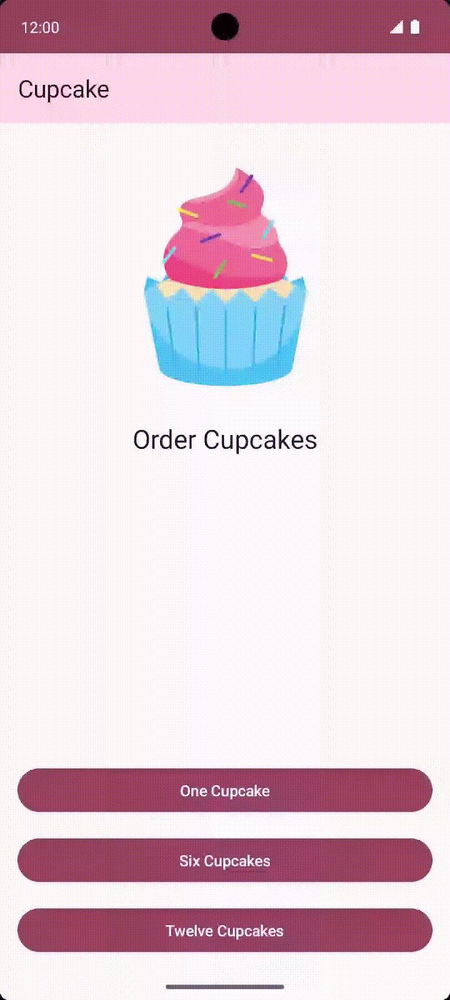

### 8. 解答コードを取得する

このレッスンの完成したコードをダウンロードするには、以下の git コマンドを使用します。

```
$ git clone https://github.com/google-developer-training/basic-android-kotlin-compose-training-cupcake.git
$ cd basic-android-kotlin-compose-training-cupcake
$ git checkout navigation
```

または、リポジトリを ZIP ファイルとしてダウンロードし、Android Studio で開くこともできます。

> **注:**解答コードは、ダウンロードしたリポジトリの `navigation` ブランチにあります。

このレッスンの解答コードを確認する場合は、[GitHub](https://github.com/google-developer-training/basic-android-kotlin-compose-training-cupcake/tree/navigation) で表示します。

### 9. 概要

#### まとめ

お疲れさまでした。簡単な単一画面のアプリから、Jetpack Navigation コンポーネントを使用して複数の画面間を移動する複雑なマルチスクリーン アプリに飛躍しました。ルートを定義し、NavHost で処理して、関数型のパラメータを使用してナビゲーション ロジックを個々の画面から分離しました。また、インテントを使用して別のアプリにデータを送信する方法や、ナビゲーションに応じてアプリバーをカスタマイズする方法も学習しました。今後のユニットでは、こうしたスキルを使用して、さらに複雑化するマルチスクリーン アプリに取り組んでいきます。

#### 詳細

- [Compose を使用したナビゲーション](https://developer.android.com/jetpack/compose/navigation)
- [ナビゲーションの原則](https://developer.android.com/guide/navigation/navigation-principles)
- [Jetpack Compose の Navigation](https://developer.android.com/codelabs/jetpack-compose-navigation#0)
- [ナビゲーションの種類](https://material.io/design/navigation/understanding-navigation.html)

## 4. Cupcake アプリをテストする


### 1. はじめに

「Compose で画面間を移動する」レッスンでは、Jetpack Navigation Compose コンポーネントを使用して、Compose アプリにナビゲーションを追加する方法を学習しました。

Cupcake アプリには複数の画面があり、ユーザーは移動し、さまざまなアクションを行えます。このアプリは、自動テストのスキルを磨くのに適しています。このレッスンでは、Cupcake アプリの UI テストをいくつか作成し、テスト カバレッジを最大化する方法について学習します。

#### 前提条件

- 関数型、ラムダ、スコープ関数など、Kotlin 言語に精通していること
- 「Compose で画面間を移動する」レッスンを完了していること

#### 学習内容

- Compose で Jetpack Navigation コンポーネントをテストする。
- UI テストごとに一貫した UI 状態を作成する。
- テスト用のヘルパー関数を作成する。

#### 作成するアプリの概要

- Cupcake アプリの UI テスト

#### 必要なもの

- Android Studio の最新バージョン
- スターター コードをダウンロードするためのインターネット接続

### 2. スターター コードをダウンロードする

> **スターター コードの URL:**
> 
> [`https://github.com/google-developer-training/basic-android-kotlin-compose-training-cupcake`](https://github.com/google-developer-training/basic-android-kotlin-compose-training-cupcake/tree/navigation)
> 
> **スターター コードのブランチ名:**`navigation`

1. Android Studio で **`basic-android-kotlin-compose-training-cupcake`** フォルダを開きます。
2. Android Studio で Cupcake アプリのコードを開きます。

### 3. UI テスト用に Cupcake をセットアップする

#### `androidTest` の依存関係を追加する

Gradle ビルドツールを使用すると、特定のモジュールの依存関係を追加できます。この機能により、依存関係が不必要にコンパイルされなくなります。プロジェクトに依存関係を追加する際の `implementation` 構成については、すでにご存じでしょう。このキーワードを使用して、アプリ モジュールの `build.gradle.kts` ファイルで依存関係をインポートしました。`implementation` キーワードを使用すると、そのモジュール内のすべてのソースセットでその依存関係を利用できるようになります。このコースではこれまで、`main`、`test`、`androidTest` ソースセットを扱いました。

UI テストは、`androidTest` という独自のソースセットに含まれています。このモジュールにのみ必要な依存関係は、アプリコードが含まれている `main` モジュールなど、他のモジュール用にコンパイルする必要はありません。UI テストでのみ使用する依存関係を追加する場合は、`androidTestImplementation` キーワードを使用して、アプリ モジュールの `build.gradle.kts` ファイルで依存関係を宣言します。そうすることで、UI テストを実行したときだけ UI テストの依存関係がコンパイルされるようになります。

次の手順で、UI テストの作成に必要な依存関係を追加します。

1. `build.gradle.kts(Module :app)` ファイルを開きます。
2. このファイルの `dependencies` セクションに、次の依存関係を追加します。

```kotlin
androidTestImplementation(platform("androidx.compose:compose-bom:2023.05.01"))
androidTestImplementation("androidx.compose.ui:ui-test-junit4")
androidTestImplementation("androidx.navigation:navigation-testing:2.6.0")
androidTestImplementation("androidx.test.espresso:espresso-intents:3.5.1")
androidTestImplementation("androidx.test.ext:junit:1.1.5")
```

#### UI テスト ディレクトリを作成する

1. プロジェクト ビューで `src` ディレクトリを右クリックし、[**New**] > [**Directory**] を選択します。

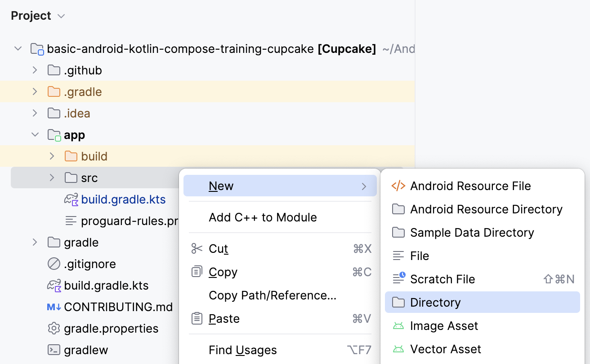

2. [**androidTest/java**] オプションを選択します。

> **注:**このオプションが見つからない場合は下にスクロールしてください。

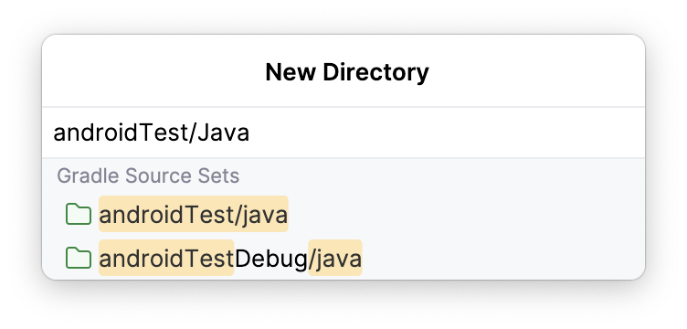

#### テスト パッケージを作成する

1. プロジェクト ウィンドウで `androidTest/java` ディレクトリを右クリックし、[**New**] > [**Package**] を選択します。

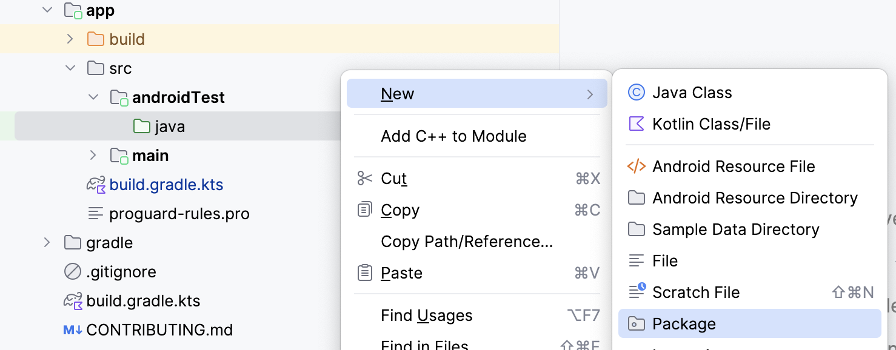

2. パッケージに「**com.example.cupcake.test**」という名前を付けます。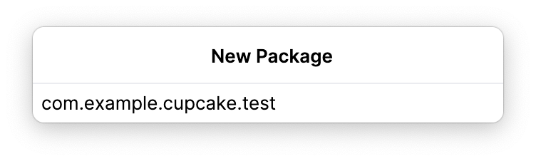

#### ナビゲーション テストクラスを作成する

`test` ディレクトリで、`CupcakeScreenNavigationTest` という新しい Kotlin クラスを作成します。

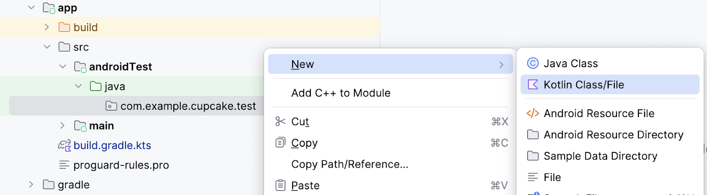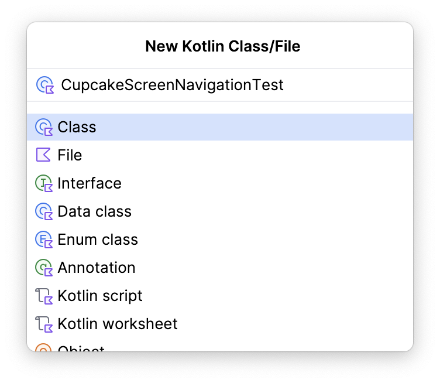

### 4. ナビゲーション ホストをセットアップする

以前レッスンでは、Compose での UI テストには Compose テストルールが必要であることを学習しました。Jetpack Navigation のテストも同様です。ただしナビゲーションをテストする場合は、Compose テストルールによる追加のセットアップが必要です。

Compose Navigation をテストする場合、アプリコードと同じ `NavHostController` にはアクセスできません。ただし、`TestNavHostController` を使用し、このナビゲーション コントローラでテストルールを構成することはできます。このセクションでは、ナビゲーション テストのテストルールを構成、再利用する方法について説明します。

1. `CupcakeScreenNavigationTest.kt` で、`createAndroidComposeRule` を使用し `ComponentActivity` を型パラメータとして渡すテストルールを作成します。

```kotlin
import androidx.activity.ComponentActivity
import androidx.compose.ui.test.junit4.createAndroidComposeRule
import org.junit.Rule

@get:Rule
val composeTestRule = createAndroidComposeRule<ComponentActivity>()
```

アプリを正しい場所に移動させるには、アプリが移動するためのアクションを行ったときに、`TestNavHostController` インスタンスを参照してナビゲーション ホストのナビゲーション ルートを確認する必要があります。

2. `TestNavHostController` インスタンスを `lateinit` 変数としてインスタンス化します。Kotlin では、`lateinit` キーワードを使用して、オブジェクトの宣言後に初期化できるプロパティを宣言します。

```kotlin
import androidx.navigation.testing.TestNavHostController

private lateinit var navController: TestNavHostController
```

次に、UI テストに使用するコンポーザブルを指定します。

3. `setupCupcakeNavHost()` というメソッドを作成します。
4. `setupCupcakeNavHost()` メソッドで、作成した Compose テストルールに対して `setContent()` メソッドを呼び出します。
5. `setContent()` メソッドに渡されたラムダ内で、`CupcakeApp()` コンポーザブルを呼び出します。

```kotlin
import com.example.cupcake.CupcakeApp

fun setupCupcakeNavHost() {
    composeTestRule.setContent {
        CupcakeApp()
    }
}
```

今度は、テストクラスに `TestNavHostContoller` オブジェクトを作成する必要があります。アプリはコントローラを使用して Cupcake アプリのさまざまな画面を移動するため、このオブジェクトはナビゲーション状態を判断するために後で使用します。

6. 前に作成したラムダを使用して、ナビゲーション ホストをセットアップします。作成した `navController` 変数を初期化し、ナビゲータを登録して、その `TestNavHostController` を `CupcakeApp` コンポーザブルに渡します。

```kotlin
import androidx.compose.ui.platform.LocalContext

fun setupCupcakeNavHost() {
    composeTestRule.setContent {
        navController = TestNavHostController(LocalContext.current).apply {
            navigatorProvider.addNavigator(ComposeNavigator())
        }
        CupcakeApp(navController = navController)
    }
}
```

`CupcakeScreenNavigationTest` クラスのテストはすべて、ナビゲーションの面をテストします。そのため、各テストは作成した `TestNavHostController` オブジェクトに依存します。テストのたびに `setupCupcakeNavHost()` 関数を手動で呼び出してナビゲーション コントローラをセットアップするのではなく、**junit** ライブラリが提供する `@Before` アノテーションを使用して自動的に行うことができます。メソッドに `@Before` アノテーションを付けると、`@Test` アノテーションを付けたどのメソッドよりも前に実行されます。

7. `@Before` アノテーションを `setupCupcakeNavHost()` メソッドに追加します。

```kotlin
import org.junit.Before

@Before
fun setupCupcakeNavHost() {
    composeTestRule.setContent {
        navController = TestNavHostController(LocalContext.current).apply {
            navigatorProvider.addNavigator(ComposeNavigator())
        }
        CupcakeApp(navController = navController)
    }
}
```

### 5. ナビゲーション テストを作成する

#### 開始デスティネーションを検証する

Cupcake アプリを作成したとき、アプリのナビゲーションを示す定数を含む `CupcakeScreen` という `enum` クラスを作成しました。

**CupcakeScreen.kt**

```kotlin
/**
* enum values that represent the screens in the app
*/
enum class CupcakeScreen(@StringRes val title: Int) {
   Start(title = R.string.app_name),
   Flavor(title = R.string.choose_flavor),
   Pickup(title = R.string.choose_pickup_date),
   Summary(title = R.string.order_summary)
}
```

UI を持つすべてのアプリには、なんらかのホーム画面があります。Cupcake の場合は**注文開始画面**です。`CupcakeApp` コンポーザブルのナビゲーション コントローラは、`CupcakeScreen` 列挙型の `Start` アイテムを使用して、この画面に移動するタイミングを決定します。アプリの起動時に、デスティネーション ルートがまだ存在しない場合、ナビゲーション ホストのデスティネーション ルートは `CupcakeScreen.Start.name` に設定されます。

まず、アプリの起動時に**注文開始画面**が現在のデスティネーション ルートであることを検証するテストを作成する必要があります。

1. `cupcakeNavHost_verifyStartDestination()` という関数を作成し、`@Test` アノテーションを付けます。

```kotlin
import org.junit.Test

@Test
fun cupcakeNavHost_verifyStartDestination() {
}
```

ここで、ナビゲーション コントローラの最初のデスティネーション ルートが**注文開始画面**であることを確認します。

2. 想定されるルート名（この場合は `CupcakeScreen.Start.name`）が、ナビゲーション コントローラの現在のバックスタック エントリのデスティネーション ルートと等しいことをアサートします。

```kotlin
import org.junit.Assert.assertEquals
...

@Test
fun cupcakeNavHost_verifyStartDestination() {
    assertEquals(CupcakeScreen.Start.name, navController.currentBackStackEntry?.destination?.route)
}
```

> **注:**作成した `AndroidComposeTestRule` は自動的にアプリを起動し、`@Test` メソッドを実行する前に `CupcakeApp` コンポーザブルを表示します。そのため、アプリを起動するためにテストメソッドで追加の手順を行う必要はありません。

#### ヘルパー メソッドを作成する

UI テストでは、UI の特定部分をテストできる状態にするために、手順を繰り返す必要が生じることがよくあります。カスタム UI では、複数のコード行を必要とする複雑なアサーションも必要になる場合があります。前のセクションで記述したアサーションは、多くのコードを必要とします。Cupcake アプリでナビゲーションをテストするときは、同じアサーションを何度も使用します。このような場合は、テストにヘルパー メソッドを作成すると、コードを重複して記述せずに済みます。

ナビゲーション テストを作成するたびに、`CupcakeScreen` 列挙型アイテムの `name` プロパティを使用して、ナビゲーション コントローラの現在のデスティネーション ルートが正しいことを確認します。このようなアサーションを行うときにいつでも呼び出せるヘルパー関数を作成します。

次の手順でヘルパー関数を作成します。

1. `test` ディレクトリに `ScreenAssertions` という空の Kotlin ファイルを作成します。

> **注:****クラス**ではなく**ファイル**を作成してください。このファイルは、空の Kotlin ファイルを必要とする拡張関数の作成に使用されます。

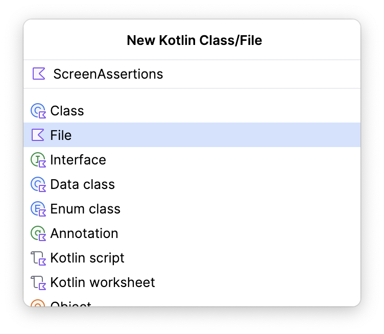

2. `NavController` クラスに `assertCurrentRouteName()` という拡張関数を追加し、メソッドのシグネチャに想定されるルート名の文字列を渡します。

```kotlin
fun NavController.assertCurrentRouteName(expectedRouteName: String) {

}
```

3. この関数で、`expectedRouteName` がナビゲーション コントローラの現在のバックスタック エントリのデスティネーション ルートと等しいことをアサートします。

```kotlin
import org.junit.Assert.assertEquals
...

fun NavController.assertCurrentRouteName(expectedRouteName: String) {
    assertEquals(expectedRouteName, currentBackStackEntry?.destination?.route)
}
```

4. CupcakeScreenNavigationTest ファイルを開き、長いアサーションではなく新しい拡張関数を使用するように `cupcakeNavHost_verifyStartDestination()` 関数を変更します。

```kotlin
@Test
fun cupcakeNavHost_verifyStartDestination() {
    navController.assertCurrentRouteName(CupcakeScreen.Start.name)
}
```

多くのテストでは、UI コンポーネントの操作も必要になります。このレッスンではリソース文字列を使用して、こうしたコンポーネントを見つけることがよくあります。コンポーザブルにアクセスするには、リソース文字列と `Context.getString()` メソッドを使用します。詳しくは、[こちら](https://developer.android.com/reference/android/content/Context#getString(int))をご覧ください。Compose で UI テストを記述する場合、このメソッドの実装は次のようになります。

```kotlin
composeTestRule.onNodeWithText(composeTestRule.activity.getString(R.string.my_string)
```

これは詳細な命令であり、拡張関数を追加することで簡略化できます。

1. `com.example.cupcake.test` パッケージに **ComposeRuleExtensions.kt** という名前の新しいファイルを作成します。プレーンな Kotlin ファイルであることを確認してください。

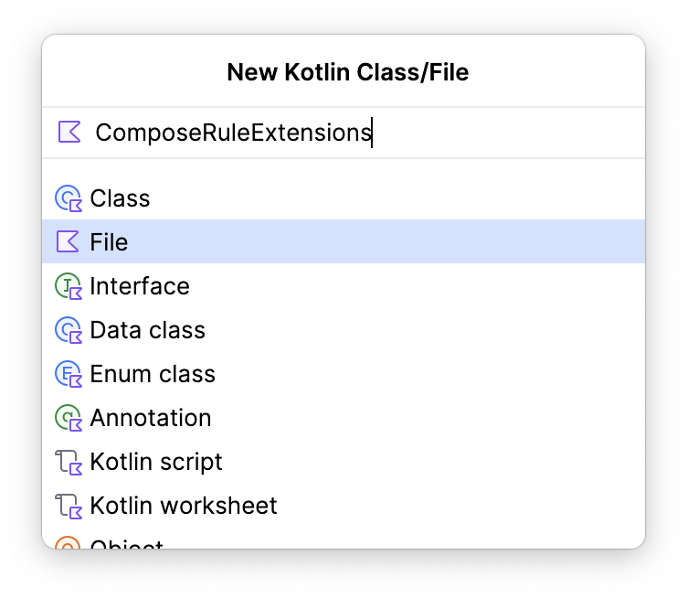

2. このファイルに次のコードを追加します。

```kotlin
import androidx.activity.ComponentActivity
import androidx.annotation.StringRes
import androidx.compose.ui.test.SemanticsNodeInteraction
import androidx.compose.ui.test.junit4.AndroidComposeTestRule
import androidx.compose.ui.test.onNodeWithText
import androidx.test.ext.junit.rules.ActivityScenarioRule

fun <A : ComponentActivity> AndroidComposeTestRule<ActivityScenarioRule<A>, A>.onNodeWithStringId(
    @StringRes id: Int
): SemanticsNodeInteraction = onNodeWithText(activity.getString(id))
```

この拡張関数を使用すると、UI コンポーネントを文字列リソースで見つける際に記述するコードの量を減らせます。次の記述を参考に説明します。

```kotlin
composeTestRule.onNodeWithText(composeTestRule.activity.getString(R.string.my_string)
```

これを、次のような命令として使用できるようになります。

```kotlin
composeTestRule.onNodeWithStringId(R.string.my_string)
```

#### スタート画面に上ボタンがないことを検証する

Cupcake アプリの元のデザインでは、開始画面のツールバーに「上へ」ボタンがありません。

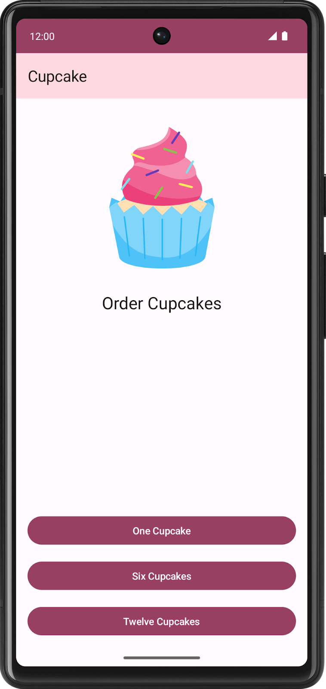

開始画面は初期画面であることから、この画面から「上へ」移動する場所がないため、ボタンはありません。以下の手順に沿って、スタート画面に「上へ」ボタンがないことを確認する関数を作成します。

1. `cupcakeNavHost_verifyBackNavigationNotShownOnStartOrderScreen()` というメソッドを作成し、`@Test` アノテーションを付けます。

```kotlin
@Test
fun cupcakeNavHost_verifyBackNavigationNotShownOnStartOrderScreen() {
}
```

Cupcake アプリでは、「上へ」ボタンのコンテンツの説明が `R.string.back_button` リソースの文字列に設定されています。

2. `R.string.back_button` リソースの値を使用してテスト関数の変数を作成します。

```kotlin
@Test
fun cupcakeNavHost_verifyBackNavigationNotShownOnStartOrderScreen() {
    val backText = composeTestRule.activity.getString(R.string.back_button)
}
```

3. このコンテンツの説明を含むノードが画面に存在しないことをアサートします。

```kotlin
@Test
fun cupcakeNavHost_verifyBackNavigationNotShownOnStartOrderScreen() {
    val backText = composeTestRule.activity.getString(R.string.back_button)
    composeTestRule.onNodeWithContentDescription(backText).assertDoesNotExist()
}
```

#### フレーバー画面へのナビゲーションを検証する

開始画面でボタンをクリックすると、ナビゲーション コントローラにフレーバー画面への移動を指示するメソッドがトリガーされます。

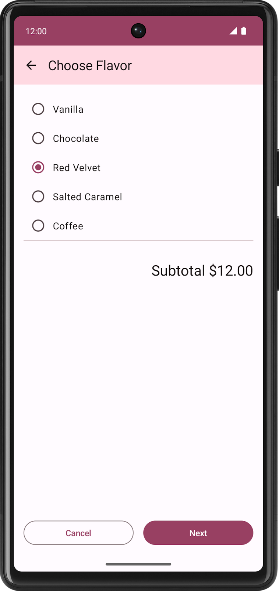

このテストでは、ボタンをクリックしてこのナビゲーションをトリガーし、デスティネーション ルートがフレーバー画面であることを検証するコマンドを作成します。

1. `cupcakeNavHost_clickOneCupcake_navigatesToSelectFlavorScreen()` という関数を作成し、`@Test` アノテーションを付けます。

```kotlin
@Test
fun cupcakeNavHost_clickOneCupcake_navigatesToSelectFlavorScreen(){
}
```

> **注:**テストメソッド名は、アプリコードで使用する関数名とは異なります。テストメソッドの命名規則としては、`thingUnderTest_TriggerOfTest_ResultOfTest` をおすすめします。先ほど作成した関数を例にとると、[**One Cupcake**] ボタンをクリックしてカップケーキのナビゲーション ホストをテストしており、期待される結果はフレーバー画面へのナビゲーションであることがわかります。

2. 文字列リソース ID で [**One Cupcake**] ボタンを探し、クリック アクションを行います。

```kotlin
import com.example.cupcake.R
...

@Test
fun cupcakeNavHost_clickOneCupcake_navigatesToSelectFlavorScreen() {
    composeTestRule.onNodeWithStringId(R.string.one_cupcake)
        .performClick()
}
```

3. 現在のルート名がフレーバー画面名であることをアサートします。

```kotlin
@Test
fun cupcakeNavHost_clickOneCupcake_navigatesToSelectFlavorScreen() {
    composeTestRule.onNodeWithStringId(R.string.one_cupcake)
        .performClick()
    navController.assertCurrentRouteName(CupcakeScreen.Flavor.name)
}
```

#### その他のヘルパー メソッドを作成する

Cupcake アプリのナビゲーション フローはほぼ直線的です。[**Cancel**] ボタンをクリックした場合を除き、アプリ内を一方向にしか移動できません。そのため、アプリ内の深い画面をテストする場合、テストするエリアに移動するためのコードを繰り返すことになります。この状況では、コードを 1 回記述するだけで済むようにヘルパー メソッドを多く使用する価値があります。

フレーバー画面へのナビゲーションをテストしたので、今後のテストで同じコードを繰り返す必要がなくなるよう、フレーバー画面に移動するメソッドを作成しましょう。

> **注:**テストメソッドではないことに留意してください。何のテストも行われません。また、明示的に呼び出された場合にのみ動作します。そのため、`@Test` アノテーションを付けないでください。

1. `navigateToFlavorScreen()` というメソッドを作成します。

```kotlin
private fun navigateToFlavorScreen() {
}
```

2. 前のセクションと同様に、[**One Cupcake**] ボタンを探してクリック アクションを行うコマンドを記述します。

```kotlin
private fun navigateToFlavorScreen() {
    composeTestRule.onNodeWithStringId(R.string.one_cupcake)
        .performClick()
}
```

フレーバー画面の [**Next**] ボタンは、フレーバーを選択するまでクリックできませんでした。このメソッドは、あくまでもナビゲーション用の UI を準備するためのものです。このメソッドを呼び出すと、UI は [**Next**] ボタンをクリックできる状態になります。

3. UI で `R.string.chocolate` 文字列を含むノードを探し、クリック アクションを行って選択します。

```kotlin
private fun navigateToFlavorScreen() {
    composeTestRule.onNodeWithStringId(R.string.one_cupcake)
        .performClick()
    composeTestRule.onNodeWithStringId(R.string.chocolate)
        .performClick()
}
```

受け取り画面と概要画面に移動するヘルパー メソッドを作成できるかどうかを確認しましょう。解答を見る前に、この演習をご自身で試してみてください。

> **注:**概要画面に移動するには、まず受け取り画面で日付を選択する必要があります。UI で選択する日付を生成する必要があります。

そのためには、次のコードを使用します。

```kotlin
private fun getFormattedDate(): String {
    val calendar = Calendar.getInstance()
    calendar.add(java.util.Calendar.DATE, 1)
    val formatter = SimpleDateFormat("E MMM d", Locale.getDefault())
    return formatter.format(calendar.time)
}
```

```kotlin
private fun navigateToPickupScreen() {
    navigateToFlavorScreen()
    composeTestRule.onNodeWithStringId(R.string.next)
        .performClick()
}

private fun navigateToSummaryScreen() {
    navigateToPickupScreen()
    composeTestRule.onNodeWithText(getFormattedDate())
        .performClick()
    composeTestRule.onNodeWithStringId(R.string.next)
        .performClick()
}
```

開始画面以外の画面をテストする場合、「上へ」ボタンの機能をテストして、前の画面に移動することを確認する計画を立てる必要があります。「上へ」ボタンを見つけてクリックするためにヘルパー関数を作成することを検討してください。

```kotlin
private fun performNavigateUp() {
    val backText = composeTestRule.activity.getString(R.string.back_button)
    composeTestRule.onNodeWithContentDescription(backText).performClick()
}
```

#### テスト カバレッジを最大化する

アプリのテストスイートは、アプリの機能を可能な限りテストする必要があります。UI テストスイートで UI 機能を 100% カバーすることが理想です。実際には、UI に影響を与える可能性のあるアプリの外部要因（固有の画面サイズを持つデバイス、Android オペレーティング システムのバージョンの違い、スマートフォン上の他のアプリに影響を与える可能性のあるサードパーティ アプリなど）が数多く存在するため、それだけのテスト カバレッジを達成することは困難です。

テスト カバレッジを最大化する方法として、機能を追加すると同時にテストを作成することが挙げられます。そうすることで、新機能に対して先回りしすぎることや、考えられるシナリオをすべて思い出すために後戻りしなければならなくなることを避けられます。この時点では Cupcake アプリはかなり小さいため、アプリのナビゲーションの大部分はテスト済みです。しかし、テストするナビゲーション状態はまだあります。

以下のナビゲーション状態を検証するためのテストを作成できるかどうかを確認しましょう。解答を見る前に、ご自身で実装してみてください。

- フレーバー画面から「上へ」ボタンをクリックして開始画面に移動する
- フレーバー画面から [Cancel] ボタンをクリックして開始画面に移動する
- 受け取り画面に移動する
- 受け取り画面から「上へ」ボタンをクリックしてフレーバー画面に移動する
- 受け取り画面から [Cancel] ボタンをクリックして開始画面に移動する
- 概要画面に移動する
- 概要画面から [Cancel] ボタンをクリックして開始画面に移動する

```kotlin
@Test
fun cupcakeNavHost_clickNextOnFlavorScreen_navigatesToPickupScreen() {
    navigateToFlavorScreen()
    composeTestRule.onNodeWithStringId(R.string.next)
        .performClick()
    navController.assertCurrentRouteName(CupcakeScreen.Pickup.name)
}

@Test
fun cupcakeNavHost_clickBackOnFlavorScreen_navigatesToStartOrderScreen() {
    navigateToFlavorScreen()
    performNavigateUp()
    navController.assertCurrentRouteName(CupcakeScreen.Start.name)
}

@Test
fun cupcakeNavHost_clickCancelOnFlavorScreen_navigatesToStartOrderScreen() {
    navigateToFlavorScreen()
    composeTestRule.onNodeWithStringId(R.string.cancel)
        .performClick()
    navController.assertCurrentRouteName(CupcakeScreen.Start.name)
}

@Test
fun cupcakeNavHost_clickNextOnPickupScreen_navigatesToSummaryScreen() {
    navigateToPickupScreen()
    composeTestRule.onNodeWithText(getFormattedDate())
        .performClick()
    composeTestRule.onNodeWithStringId(R.string.next)
        .performClick()
    navController.assertCurrentRouteName(CupcakeScreen.Summary.name)
}

@Test
fun cupcakeNavHost_clickBackOnPickupScreen_navigatesToFlavorScreen() {
    navigateToPickupScreen()
    performNavigateUp()
    navController.assertCurrentRouteName(CupcakeScreen.Flavor.name)
}

@Test
fun cupcakeNavHost_clickCancelOnPickupScreen_navigatesToStartOrderScreen() {
    navigateToPickupScreen()
    composeTestRule.onNodeWithStringId(R.string.cancel)
        .performClick()
    navController.assertCurrentRouteName(CupcakeScreen.Start.name)
}

@Test
fun cupcakeNavHost_clickCancelOnSummaryScreen_navigatesToStartOrderScreen() {
    navigateToSummaryScreen()
    composeTestRule.onNodeWithStringId(R.string.cancel)
        .performClick()
    navController.assertCurrentRouteName(CupcakeScreen.Start.name)
}
```

### 6. 注文画面のテストを作成する

ナビゲーションは、Cupcake アプリの機能の一面にすぎません。また、ユーザーは各アプリ画面を操作します。これらの画面に何が表示されるのかを確認し、画面に対する操作によって正しい結果が得られることを確認する必要があります。**SelectOptionScreen** は、アプリの重要な部分です。

このセクションでは、この画面のコンテンツが正しく設定されていることを確認するテストを作成します。

#### フレーバー選択画面のコンテンツをテストする

1. 他のテストファイルが含まれる `app/src/androidTest` ディレクトリ内に `CupcakeOrderScreenTest` という新しいクラスを作成します。

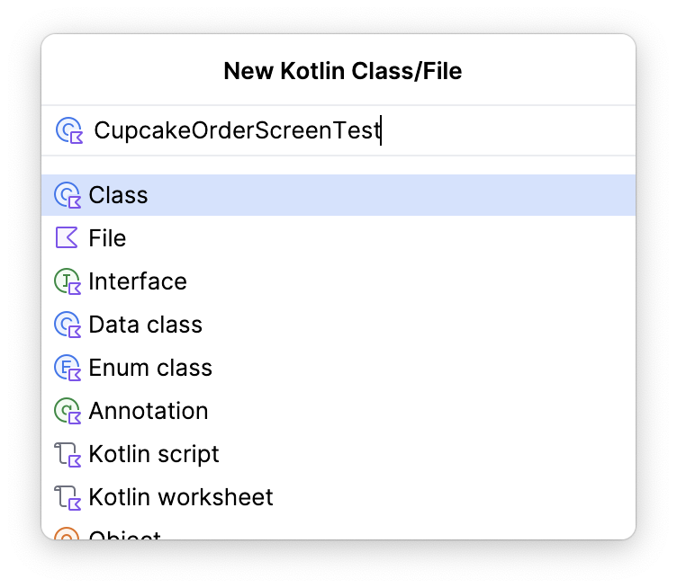

2. このクラスで、`AndroidComposeTestRule` を作成します。

```kotlin
@get:Rule
val composeTestRule = createAndroidComposeRule<ComponentActivity>()
```

3. `selectOptionScreen_verifyContent()` という関数を作成し、`@Test` アノテーションを付けます。

```kotlin
@Test
fun selectOptionScreen_verifyContent() {

}
```

この関数では、Compose ルールの内容を最終的に `SelectOptionScreen` に設定します。これにより、`SelectOptionScreen` コンポーザブルが直接起動されるため、ナビゲーションが不要になります。ただし、この画面にはフレーバー オプションのリストと小計の 2 つのパラメータが必要です。

4. 画面に渡すフレーバー オプションのリストと小計を作成します。

```kotlin
@Test
fun selectOptionScreen_verifyContent() {
    // Given list of options
    val flavors = listOf("Vanilla", "Chocolate", "Hazelnut", "Cookie", "Mango")
    // And subtotal
    val subtotal = "$100"
}
```

5. 作成した値を使用して、`SelectOptionScreen` コンポーザブルにコンテンツを設定します。

なお、このアプローチは `MainActivity` からコンポーザブルを起動する場合と同様です。唯一の違いは、`MainActivity` が `CupcakeApp` コンポーザブルを呼び出すのに対して、ここでは `SelectOptionScreen` コンポーザブルを呼び出している点です。`setContent()` から起動するコンポーザブルを変更できるため、テストするエリアに到達するためにアプリを明示的に順を追って操作するのではなく、特定のコンポーザブルを起動できます。このアプローチでは、現在のテストと無関係なコードのエリアでテストが失敗することを避けられます。

```kotlin
@Test
fun selectOptionScreen_verifyContent() {
    // Given list of options
    val flavors = listOf("Vanilla", "Chocolate", "Hazelnut", "Cookie", "Mango")
    // And subtotal
    val subtotal = "$100"

    // When SelectOptionScreen is loaded
    composeTestRule.setContent {
        SelectOptionScreen(subtotal = subtotal, options = flavors)
    }
}
```

テストのこの時点で、アプリが `SelectOptionScreen` コンポーザブルを起動し、テストの手順に沿って操作できるようになります。

6. `flavors` リストを反復処理し、リスト内の各文字列アイテムが画面に表示されることを確認します。
7. `onNodeWithText()` メソッドを使用して画面上のテキストを見つけ、`assertIsDisplayed()` メソッドを使用してテキストがアプリに表示されることを検証します。

```kotlin
@Test
fun selectOptionScreen_verifyContent() {
    // Given list of options
    val flavors = listOf("Vanilla", "Chocolate", "Hazelnut", "Cookie", "Mango")
    // And subtotal
    val subtotal = "$100"

    // When SelectOptionScreen is loaded
    composeTestRule.setContent {
        SelectOptionScreen(subtotal = subtotal, options = flavors)
    }

    // Then all the options are displayed on the screen.
    flavors.forEach { flavor ->
        composeTestRule.onNodeWithText(flavor).assertIsDisplayed()
    }
}
```

8. 同じ手法で、アプリにテキストが表示されることを検証し、アプリで正しい小計の文字列が画面に表示されることを検証します。画面で `R.string.subtotal_price` リソース ID と正しい小計値を検索し、アプリがその値を表示することをアサートします。

```kotlin
import com.example.cupcake.R
...

@Test
fun selectOptionScreen_verifyContent() {
    // Given list of options
    val flavors = listOf("Vanilla", "Chocolate", "Hazelnut", "Cookie", "Mango")
    // And subtotal
    val subtotal = "$100"

    // When SelectOptionScreen is loaded
    composeTestRule.setContent {
        SelectOptionScreen(subtotal = subtotal, options = flavors)
    }

    // Then all the options are displayed on the screen.
    flavors.forEach { flavor ->
        composeTestRule.onNodeWithText(flavor).assertIsDisplayed()
    }

    // And then the subtotal is displayed correctly.
    composeTestRule.onNodeWithText(
        composeTestRule.activity.getString(
            R.string.subtotal_price,
            subtotal
        )
    ).assertIsDisplayed()
}
```

[**Next**] ボタンは、アイテムを選択するまで有効になりませんでした。このテストでは画面コンテンツのみを検証するため、最後に [**Next**] ボタンが無効になっていることをテストします。

9. 文字列リソース ID でノードを探す場合と同じアプローチで [**Next**] ボタンを探します。ただし、アプリにノードが表示されることを確認するのではなく、`assertIsNotEnabled()` メソッドを使用します。

```kotlin
@Test
fun selectOptionScreen_verifyContent() {
    // Given list of options
    val flavors = listOf("Vanilla", "Chocolate", "Hazelnut", "Cookie", "Mango")
    // And subtotal
    val subtotal = "$100"

    // When SelectOptionScreen is loaded
    composeTestRule.setContent {
        SelectOptionScreen(subtotal = subtotal, options = flavors)
    }

    // Then all the options are displayed on the screen.
    flavors.forEach { flavor ->
        composeTestRule.onNodeWithText(flavor).assertIsDisplayed()
    }

    // And then the subtotal is displayed correctly.
    composeTestRule.onNodeWithText(
        composeTestRule.activity.getString(
            R.string.subtotal_price,
            subtotal
        )
    ).assertIsDisplayed()

    // And then the next button is disabled
    composeTestRule.onNodeWithStringId(R.string.next).assertIsNotEnabled()
}
```

#### テスト カバレッジを最大化する

フレーバー選択画面のコンテンツのテストは、1 つの画面の 1 つの要素だけをテストします。コード カバレッジを広げるために作成できるテストは他にもあります。解答コードをダウンロードする前に、以下のテストをご自身で記述してみてください。

- 開始画面のコンテンツを検証する。
- 概要画面のコンテンツを検証する。
- フレーバー選択画面でオプションが選択されたら [**Next**] ボタンが有効になることを検証する。

テストを作成するときは、コードの記述量を減らせるヘルパー関数がないか注意してください。

### 7. 解答コードを取得する

このレッスンの完成したコードをダウンロードするには、次の git コマンドを使用します。

```
$ git clone https://github.com/google-developer-training/basic-android-kotlin-compose-training-cupcake.git
```

または、リポジトリを ZIP ファイルとしてダウンロードし、Android Studio で開くこともできます。

> **注:**解答コードは、ダウンロードしたリポジトリの `main` ブランチにあります。

解答コードを確認する場合は、[GitHub で表示します](https://github.com/google-developer-training/basic-android-kotlin-compose-training-cupcake/tree/main)。

### 8. 概要

#### まとめ

お疲れさまでした。Jetpack Navigation コンポーネントをテストする方法について学習しました。また、再利用可能なヘルパー メソッドを記述する方法、`setContent()` を活用して簡潔なテストを作成する方法、`@Before` アノテーションを付けてテストをセットアップする方法、最大のテスト カバレッジについての考え方など、UI テストを作成するための基本的なスキルについても学習しました。今後も Android アプリを作成する際、機能のコードとともにテストも忘れずに作成してください。

## 5. 演習: ナビゲーションを追加する（提出対象）


### 1. 始める前に

お疲れさまでした。Jetpack Compose で複数の画面間を移動する最初のアプリを作成しました。今度は、学んだことを実践してみましょう。

この演習では、複数の画面コンポーザブルを持つアプリにナビゲーションを追加するために必要なコンポーネントの作成に焦点を当てます。この教材では、Compose を使用して画面間を移動するレッスンで学習した成果に基づき、その知識を応用して、既存のアプリにナビゲーションを追加します。

解答コードは最後に掲載されていますが、演習に取り組んでから解答を確認するようにしてください。解答はアプリを実装する方法の一つとして捉えてください。

#### 前提条件

- Compose を使用して画面間を移動するレッスンを通じて「Compose での Android の基礎」コースワークを完了していること

#### 必要なもの

- Android Studio がインストールされた、インターネットに接続できるパソコン
- Lunch Tray アプリのスターター コード

#### 作成するアプリの概要

以下の練習問題では、ナビゲーションを追加して Lunch Tray アプリを完成させます。Lunch Tray アプリは、3 つの画面を備えたインタラクティブなランチ注文アプリです。各画面には、主菜、副菜、付け合わせの 3 種類のメニュー項目のいずれかが表示され、ユーザーは各メニューから選ぶことができます。

練習問題はセクションに分かれており、各セクションで次の作業を行います。

- ユーザーが移動する各画面の参照を作成します。
- ナビゲーション コントローラを初期化します。
- 必要に応じて、画面のタイトルとナビゲーション ボタンを表示するトップバーを作成します。
- 画面から次の画面へのルーティングを決定するナビゲーション ホストを設定します。

最終的なアプリのフローは次のようになります。

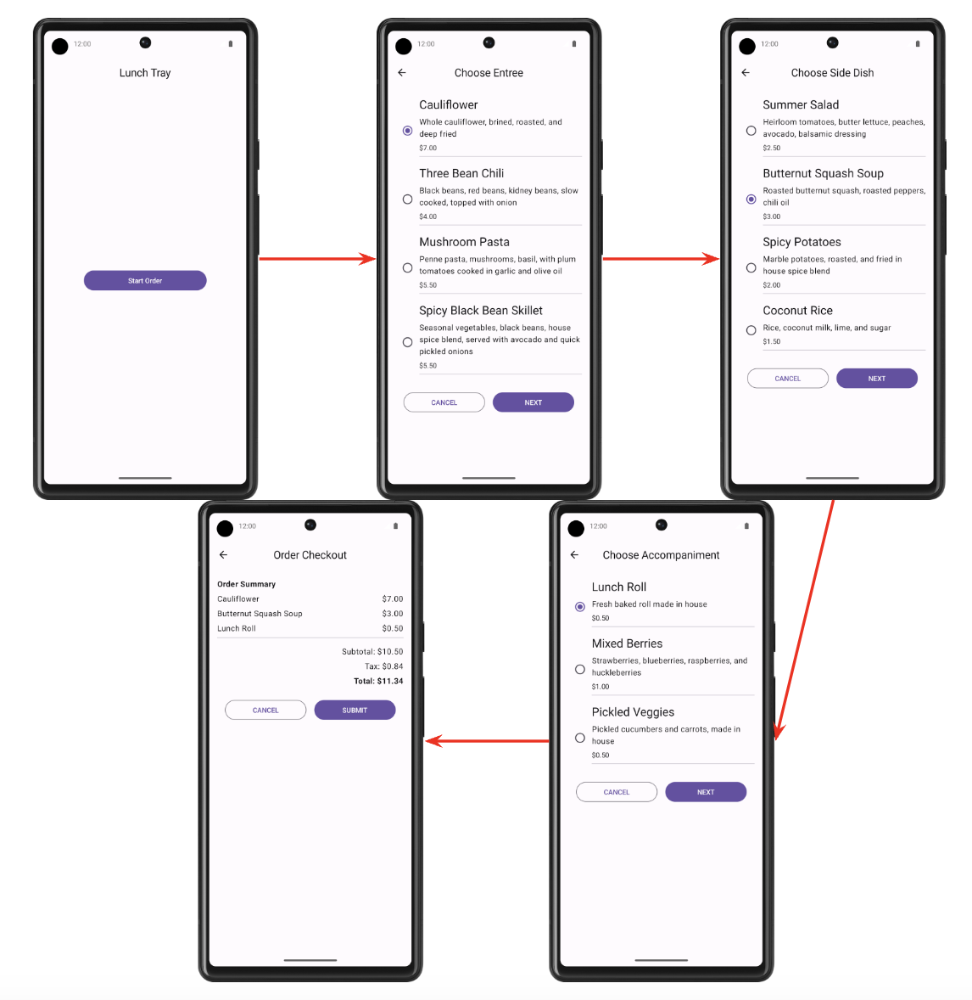

### 2. 設定する

#### **スターター コードをダウンロードする**

> **スターター コードの URL:**
> 
> [`https://github.com/google-developer-training/basic-android-kotlin-compose-training-lunch-tray`](https://github.com/google-developer-training/basic-android-kotlin-compose-training-lunch-tray/tree/starter)
> 
> **スターター コードのブランチ名:**`starter`

1. Android Studio で **`basic-android-kotlin-compose-training-lunch-tray`** フォルダを開きます。
2. Android Studio で Lunch Tray アプリのコードを開きます。

### 3. 画面の列挙型

このセクションでは、以下の Lunch Tray アプリの各画面の定数を格納する `enum` クラスを作成します。

- 開始
- 主菜のメニュー
- 副菜のメニュー
- 付け合わせのメニュー
- ご購入手続き

各画面には、文字列形式のタイトルを関連付ける必要があります。この文字列は、スターター コードでリソースとして用意されています。

### 4. ナビゲーション コントローラと初期化

このセクションでは、ナビゲーション コントローラを作成します。また、バックスタック エントリと現在の画面の名前も初期化します。

現在の画面の名前は、初期画面の名前か、移動先の画面の名前（現在存在している場合）のいずれかにします。

### 5. AppBar

`Scaffold` コンポーザブルのアプリバー用のコンポーザブルを作成します。アプリバーには現在の画面のタイトルを表示します。後方ナビゲーションが可能な場合は、適切な後方ナビゲーション ボタンも画面に表示します。[**Start**] 画面では後方ナビゲーションを使用できません。

##### 最終的なスクリーンショット

以下のスクリーンショットは、アプリバーの 2 つの例を示しています。1 つは上へボタンがないもの、もう 1 つは上へボタンがあるものです。

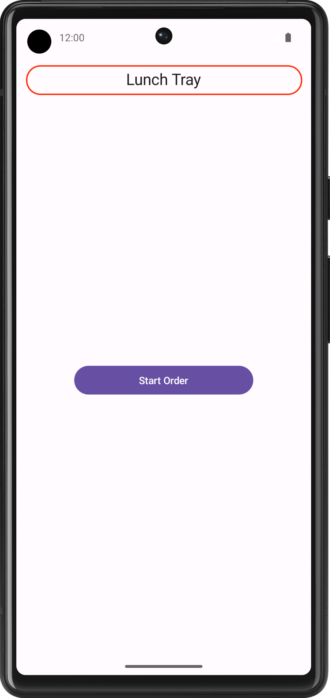 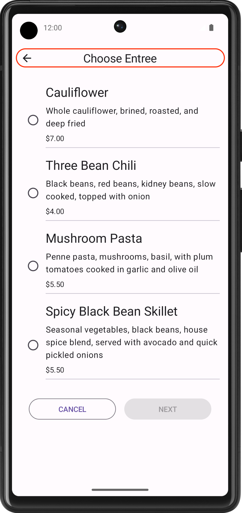

##### UI 仕様

後方ナビゲーション ボタンには **`Icons.Filled.ArrowBack`** アイコンを使用します。

### 6. ナビゲーション ホスト

この演習では、ナビゲーション ホストを使用して、Lunch Tray アプリのナビゲーション ルーティングを作成します。

次の図は、Lunch Tray アプリのナビゲーション フローを示しています。

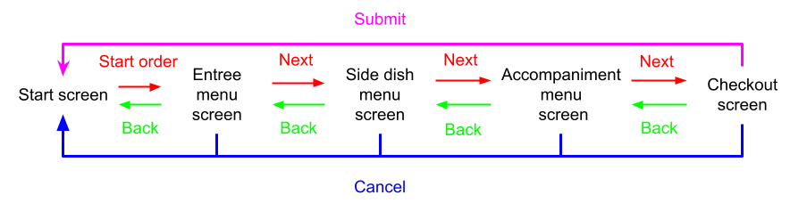

- [**Start**] 画面の [**Start Order**] ボタンをタップすると、[**Entree menu**] 画面に移動します。
- [**Entree menu**] 画面の [**Next**] ボタンをタップすると、[**Side dish menu**] 画面に移動します。
- [**Side dish menu**] 画面の [**Next**] ボタンをタップすると、[**Accompaniment menu**] 画面に移動します。
- [**Accompaniment menu**] 画面の [**Next**] ボタンをタップすると、[**Checkout**] 画面に移動します。
- [**Checkout**] 画面の [**Submit**] ボタンをタップすると、[**Start**] 画面に移動します。
- いずれかの画面で [**Cancel**] ボタンをタップすると、[**Start**] 画面に戻ります。

> **注:** [**Start**] 画面からナビゲーション フローが開始されるため、バックスタックから画面をポップすることで [Start] 画面に移動できます。

##### 最終結果

実装が完了すると、アプリのナビゲーション フローは次のようになります。

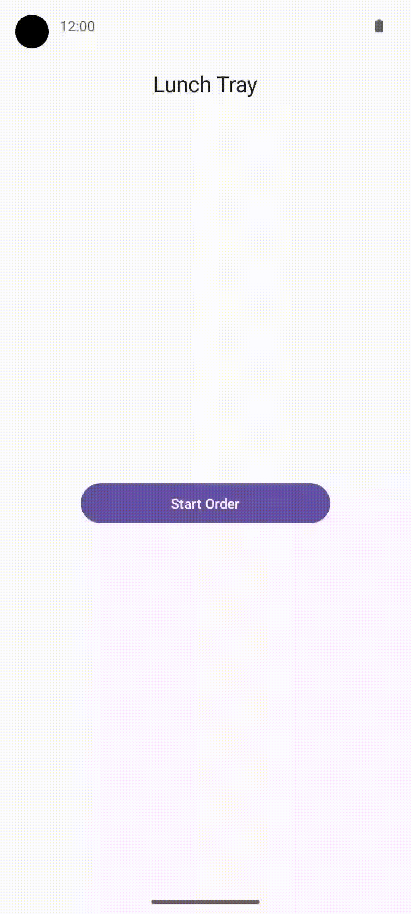

### 7. 解答コードを取得する

> **解答コードの URL:**
> 
> [`https://github.com/google-developer-training/basic-android-kotlin-compose-training-lunch-tray`](https://github.com/google-developer-training/basic-android-kotlin-compose-training-lunch-tray/tree/main)
> 
> **解答コードのブランチ名:**`main`

## 6. つまずきやすいポイント

- 画面の名前は `enum class` で管理すると、文字列のタイプミスによるクラッシュを防げます。
- 「戻る」で意図しない画面に行くときは、`popBackStack` / `popUpTo` の指定を疑いましょう。

## 7. AIに質問する（この章の例）

次の例をそのままAIに投げてOKです（必要なら自分のコード/エラーに置き換えてください）。

```text
「`NavHost` `NavController` `composable()` の関係を、初心者向けに図解して」
「戻るボタンで意図しない画面に戻ってしまう。`popBackStack` と `popUpTo` の違いを説明したうえで、自分のコードの問題点を確認して（コード: ここに貼る）」
「演習: ナビゲーションを追加する で、画面の名前を `enum class` で管理する書き方を、方針→ヒントの順で教えて」
```

質問がまとまらないときは、第0章の「質問テンプレ」を使ってください。

## 8. 提出物

次のレッスンで完成させた Android Studio プロジェクトを、学習用リポジトリの `unit4/Lunchtray/` に置きます（プロジェクトフォルダごとコピー。`build/` と `.idea/` は含めない）。

- 演習: ナビゲーションを追加する

PR 本文には次の 3 点を書いてください。

- **やったこと**：どのレッスン / 演習を完了したか
- **動作確認**：どの端末（エミュレータ名 or 実機）で何を確認したか
- **詰まった点と解決**：エラーの内容と、どう直したか（AI に聞いた内容も可）

## 9. チェックリスト

- [ ] `NavHost` と `NavController` で複数画面を切り替えられる
- [ ] 画面間でデータを受け渡し、戻る操作を正しく扱える
- [ ] ナビゲーションを含む UI テストを書ける
- [ ] 章末のクイズに合格した
- [ ] 提出物が `unit4/Lunchtray/` にあり、Android Studio（または Kotlin Playground）で開いて動く

---

## 課題提出

この章には提出課題があります。

1. 上記の提出物を完了する
2. GitHub で `feature/04-navigation` ブランチを作成し、`develop` へのPRを作成（base=`develop`）
3. [AIプログラムレビュー](https://ai.studio/apps/84d224cb-7de1-44fb-995b-9a5917d25603?fullscreenApplet=true) を実行
4. 問題がなければ、進捗ダッシュボードで **PR URL** と **完了日** を記録
