# 第13章: インターネットからデータを取得する

> 提出ブランチ: `feature/05-get-data-internet`

## 1. この章のゴール

- コルーチン（`launch` / `async` / `suspend`）の基本を説明できる
- Retrofit と kotlinx.serialization で REST API から JSON を取得できる
- 通信中・成功・失敗の 3 状態を UI に反映できる

## 2. 進め方

次の内容を **上から順番に** 進めます。「やらなくてOK」の行は飛ばして構いません。レッスンの本文はこのページの下にすべて掲載しています。目安時間の合計は約330分です。

| # | 種類 | 内容 | 目安 | 備考 |
|---|---|---|---|---|
| 1 | レッスン | Kotlin Playground でのコルーチンの概要 | 約90分 |  |
| 2 | レッスン | Android Studio でのコルーチンの概要 | 約90分 |  |
| 3 | レッスン | インターネットからデータを取得する | 約150分 | **提出対象** |

このプログラムの進め方は次の通りです。

1. 下の各レッスンを読み、各ステップの説明を理解してから **自分でコードを打つ**（コピペで済ませない）
2. ステップごとにアプリを実行し、期待どおり動くか確認する
3. 動かないときは、エラー文をそのまま AI に貼って「何が原因か」を聞き、直したら **なぜ直ったか** をメモする
4. 各レッスン末尾の「まとめ」を読み、説明できない用語があればレッスンに戻る

> 画面が最新の Android Studio と異なる場合があります。

## 3. Kotlin Playground でのコルーチンの概要


### 1. 始める前に

このレッスンでは、優れたユーザー エクスペリエンスを提供するために Android デベロッパーが理解しておくべき重要なスキルである同時実行を紹介します。**同時実行**とは、アプリで複数のタスクを同時に行うことです。たとえば、アプリは、ユーザーの入力イベントに応答し、それに応じて UI を更新しながら、ウェブサーバーからデータを取得したり、デバイスにユーザーデータを保存したりできます。

アプリで同時に処理を行うには、Kotlin **コルーチン**を使用します。コルーチンを使用すると、コードブロックの実行を中断して後で再開できるため、その間に他の処理を行うことができます。コルーチンを使用すると、**非同期**コードを記述しやすくなります。つまり、あるタスクが終了してから次のタスクを開始する必要がなく、複数のタスクを同時に実行できます。

このレッスンでは、Kotlin のプレイグラウンドの基本的な例を紹介し、非同期プログラミングに慣れるよう、コルーチンの実践演習を行います。

#### 前提条件

- `main()` 関数を使用して基本的な Kotlin プログラムを作成できること
- 関数やラムダを含む、Kotlin 言語の基本的な知識

#### **作成するアプリの概要**

- コルーチンの基本を学習して試すための短い Kotlin プログラム

#### 学習内容

- Kotlin コルーチンで非同期プログラミングを簡素化する方法
- 構造化された同時実行の目的とそれが重要である理由

#### 必要なもの

- [Kotlin のプレイグラウンド](https://developer.android.com/training/kotlinplayground)を使用するためのインターネット アクセス

### 2. 同期コード

#### シンプルなプログラム

**同期コード**で進行中の概念上のタスクは、一度に 1 つだけです。これは順次の直線的なパスと考えることができます。あるタスクが完全に終了してから次のタスクを開始する必要があります。同期コードの例を次に示します。

1. [Kotlin のプレイグラウンド](https://developer.android.com/training/kotlinplayground)を開きます。
2. このコードを、晴れの天気予報を表示するプログラムのコードに置き換えます。`main()` 関数では、まず `Weather forecast` というテキストを出力します。次に `Sunny` を出力します。

```kotlin
fun main() {
    println("Weather forecast")
    println("Sunny")
}
```

3. コードを実行します。上のコードを実行すると、出力は次のようになります。

```
Weather forecast
Sunny
```

テキストを出力するタスクが完了してから実行が次のコード行に移るため、`println()` は同期呼び出しです。`main()` の各関数呼び出しは同期的であるため、`main()` 関数全体が同期的です。関数が同期か非同期かは、その構成要素で決まります。

同期関数は、タスクが完了した場合にのみ戻ります。そのため、`main()` の最後の print ステートメントが実行された後、すべての処理が完了します。`main()` 関数が戻り、プログラムが終了します。

#### 遅延を追加する

ここで、晴れの天気予報を取得するには、リモートのウェブサーバーへのネットワーク リクエストが必要だとします。晴れの天気予報を出力する前に、コードに遅延を追加して、ネットワーク リクエストをシミュレートします。

1. まず、コードの先頭で `main()` 関数の前に `import kotlinx.coroutines.*` を追加します。これにより、使用する関数が Kotlin コルーチン ライブラリからインポートされます。
2. コードを変更して `delay(1000)` 呼び出しを追加します。この呼び出しで、`main()` 関数の残りの部分の実行が `1000` ミリ秒（1 秒）遅れます。この `delay()` 呼び出しを、`Sunny` の print ステートメントの前に挿入します。

```kotlin
import kotlinx.coroutines.*

fun main() {
    println("Weather forecast")
    delay(1000)
    println("Sunny")
}
```

`delay()` は、実際は Kotlin コルーチン ライブラリが提供する特別な **suspend 関数**です。`main()` 関数の実行はこの時点で中断（一時停止）し、指定した遅延時間（この場合は 1 秒）が経過すると再開されます。

この時点でプログラムを実行しようとすると、コンパイル エラー「`Suspend function 'delay' should be called only from a coroutine or another suspend function`」が発生します。

Kotlin のプレイグラウンドでコルーチンを学習するために、コルーチン ライブラリの `runBlocking()` 関数の呼び出しで既存のコードをラップできます。`runBlocking()` はイベントループを実行し、再開の準備ができたときに各タスクを中断したところから続行することで、複数のタスクを一度に処理できます。

3. `main()` 関数の既存の内容を `runBlocking {}` 呼び出しの本体に移動します。`runBlocking{}` の本体は新しいコルーチン内で実行されます。

```kotlin
import kotlinx.coroutines.*

fun main() {
    runBlocking {
        println("Weather forecast")
        delay(1000)
        println("Sunny")
    }
}
```

`runBlocking()` は同期的です。ラムダブロック内のすべての処理が完了するまで戻りません。つまり、`delay()` 呼び出しの処理が完了するまで（1 秒経過するまで）待機してから、`Sunny` print ステートメントの実行を続行します。`runBlocking()` 関数内のすべての処理が完了すると、関数が戻り、プログラムが終了します。

4. プログラムを実行します。出力は次のとおりです。

```
Weather forecast
Sunny
```

出力は前と同じです。コードはまだ同期的です。直線的に動作し、一度に 1 つのことしか行いません。しかし、遅延のために長時間にわたって実行される点が異なります。

コルーチンの「コ」は、協調的という意味です。何かを待つために中断するとき、コードは連携して基となるイベントループを共有し、その間に他の処理を行えるようにします（「コルーチン」の「ルーチン」は、関数などの一連の命令を意味します）。この例の場合、`delay()` 呼び出しに到達するとコルーチンが中断します。コルーチンが中断している 1 秒間に（このプログラムに他の処理はありませんが）他の処理を実施できます。遅延時間が経過すると、コルーチンの実行が再開し、`Sunny` が出力されます。

> **注:**一般的に、このような `main()` 関数内で `runBlocking()` を使用することは、学習目的に限ります。Android には、準備が整ったときの再開を処理するためのイベントループが用意されているため、Android アプリのコードに `runBlocking()` は必要ありません。ただし、`runBlocking()` はテストには有用です。テストのアサーションを呼び出す前に、アプリの特定の条件を待たせることができます。

#### 関数の中断

気象データを取得するためのネットワーク リクエストを実行する実際のロジックが複雑になる場合は、ロジックを独自の関数に抜き出すことをおすすめします。コードをリファクタリングして効果を確認してみましょう。

1. 気象データのネットワーク リクエストをシミュレートするコードを抜き出し、`printForecast()` という独自の関数に移します。`runBlocking()` のコードから `printForecast()` を呼び出します。

```kotlin
import kotlinx.coroutines.*

fun main() {
    runBlocking {
        println("Weather forecast")
        printForecast()
    }
}

fun printForecast() {
    delay(1000)
    println("Sunny")
}
```

プログラムを実行すると、先ほどと同じコンパイル エラーが表示されます。suspend 関数はコルーチンまたは別の suspend 関数からしか呼び出せないため、`printForecast()` を `suspend` 関数として定義します。

2. `printForecast()` 関数宣言の `fun` キーワードの直前に `suspend` 修飾子を追加して、suspend 関数にします。

```kotlin
import kotlinx.coroutines.*

fun main() {
    runBlocking {
        println("Weather forecast")
        printForecast()
    }
}

suspend fun printForecast() {
    delay(1000)
    println("Sunny")
}
```

`delay()` は suspend 関数でした。今回、`printForecast()` も suspend 関数になりました。

**suspend** 関数は通常の関数に似ていますが、中断して後で再開できます。そのために、suspend 関数は、この機能を利用できるようにする他の suspend 関数からしか呼び出すことができません。

suspend 関数には 0 個以上の中断ポイントを含めることができます。**中断ポイント**は、関数の実行を中断できる、関数内の場所です。実行が再開されると、コード内の最後に中断したところから再開して、関数の残りの部分に進みます。

3. 練習として、コードの `printForecast()` 関数の宣言の下に、別の suspend 関数を追加します。この新しい suspend 関数を `printTemperature()` とします。天気予報の気温データを取得するためのネットワーク リクエストを行うように見せることができます。

関数内でも実行を `1000` ミリ秒遅らせ、気温値を摂氏 `30` 度のように出力します。エスケープ シーケンス `"\u00b0"` を使用して度記号 `°` を出力できます。

```kotlin
suspend fun printTemperature() {
    delay(1000)
    println("30\u00b0C")
}
```

4. `main()` 関数の `runBlocking()` コードから新しい `printTemperature()` 関数を呼び出します。コード全体を次に示します。

```kotlin
import kotlinx.coroutines.*

fun main() {
    runBlocking {
        println("Weather forecast")
        printForecast()
        printTemperature()
    }
}

suspend fun printForecast() {
    delay(1000)
    println("Sunny")
}

suspend fun printTemperature() {
    delay(1000)
    println("30\u00b0C")
} 
```

5. プログラムを実行します。出力は次のようになります。

```
Weather forecast
Sunny
30°C
```

このコードでは、まず `printForecast()` suspend 関数の遅延でコルーチンが中断し、その 1 秒間の遅延後に再開します。`Sunny` テキストが出力されます。`printForecast()` 関数は呼び出し元に戻ります。

次に、`printTemperature()` 関数が呼び出されます。このコルーチンは、`delay()` の呼び出しに到達すると中断し、1 秒後に再開して気温値を出力し終えます。`printTemperature()` 関数はすべての処理を完了して戻ります。

`runBlocking()` 本体にはこれ以上実行するタスクがないため、`runBlocking()` 関数が戻り、プログラムは終了します。

前述のように、`runBlocking()` は同期的であり、本体内の各呼び出しは順次呼び出されます。なお、適切に設計された suspend 関数は、すべての処理が完了してから戻ります。その結果、suspend 関数は順次実行されます。

6. （省略可）このプログラムを遅延させて実行するためにかかる時間を確認する場合は、コードを `measureTimeMillis()` の呼び出しでラップすると、渡されたコードブロックの実行にかかった時間（ミリ秒）が返されます。この関数にアクセスするためにインポート ステートメント（`import kotlin.system.*`）を追加します。実行時間を出力し、`1000.0` で割ってミリ秒を秒に変換します。

```kotlin
import kotlin.system.*
import kotlinx.coroutines.*

fun main() {
    val time = measureTimeMillis {
        runBlocking {
            println("Weather forecast")
            printForecast()
            printTemperature()
        }
    }
    println("Execution time: ${time / 1000.0} seconds")
}
suspend fun printForecast() {
    delay(1000)
    println("Sunny")
}

suspend fun printTemperature() {
    delay(1000)
    println("30\u00b0C")
} 
```

出力:

```
Weather forecast
Sunny
30°C
Execution time: 2.128 seconds
```

出力は、実行に約 2.1 秒かかったことを示しています（正確な実行時間は若干異なる可能性があります）。各 suspend 関数で 1 秒の遅延が発生するため、妥当なようです。

ここまでで、コルーチン内のコードがデフォルトで順次呼び出されることを確認しました。同時実行を行うには、明示的に指定する必要があります。その方法については、次のセクションで説明します。協調的なイベントループを利用して複数のタスクを同時に実行すると、プログラムの実行時間を短縮できます。

### 3. 非同期コード

#### **launch()**

コルーチン ライブラリの `launch()` 関数を使用して、新しいコルーチンを起動します。タスクを同時に実行するには、複数の `launch()` 関数をコードに追加して、複数のコルーチンを同時進行できるようにします。

Kotlin のコルーチンは、[**構造化された同時実行**](https://kotlinlang.org/docs/coroutines-basics.html#structured-concurrency)という重要なコンセプトに従っています。同時実行を明示的に要求しない限り（`launch()` を使用するなど）、コードはデフォルトで順次処理され、基となるイベントループと連携します。関数を呼び出す場合は、実装の詳細で使用したコルーチンの数に関係なく、関数が戻るまでにその処理を完全に終了することが前提となります。例外で失敗しても、例外がスローされると、関数から保留中のタスクはなくなります。したがって、例外がスローされても、処理が正常に完了しても、制御フローが関数から戻ればすべての処理が終了します。

1. 前のステップのコードから始めます。`launch()` 関数を使用して、`printForecast()` と `printTemperature()` の各呼び出しをそれぞれのコルーチンに移動します。

```kotlin
import kotlinx.coroutines.*

fun main() {
    runBlocking {
        println("Weather forecast")
        launch {
            printForecast()
        }
        launch {
            printTemperature()
        }
    }
}

suspend fun printForecast() {
    delay(1000)
    println("Sunny")
}

suspend fun printTemperature() {
    delay(1000)
    println("30\u00b0C")
} 
```

2. プログラムを実行します。出力は次のとおりです。

```
Weather forecast
Sunny
30°C
```

出力は同じですが、プログラムの実行が速くなったことにお気づきでしょうか。以前は、suspend 関数 `printForecast()` が完全に終了するまで待ってから `printTemperature()` 関数に移動する必要がありました。今回、`printForecast()` と `printTemperature()` は、別々のコルーチン内にあるため同時に実行できるようになりました。

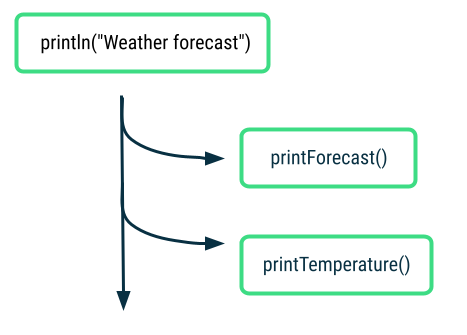

`launch { printForecast() }` 呼び出しは、`printForecast()` のすべての処理が完了する前に戻ることができます。これがコルーチンの優れている点です。次の `launch()` 呼び出しに移動して、次のコルーチンを開始できます。すべての処理が完了する前でも、`launch { printTemperature() }` も同様に戻ります。

3. （省略可）プログラムがどれくらい速くなったのかを確認する場合は、`measureTimeMillis()` のコードを追加して実行時間を確認します。

```kotlin
import kotlin.system.*
import kotlinx.coroutines.*

fun main() {
    val time = measureTimeMillis {
        runBlocking {
            println("Weather forecast")
            launch {
                printForecast()
            }
            launch {
                printTemperature()
            }
        }
    }
    println("Execution time: ${time / 1000.0} seconds")
}

...
```

出力:

```
Weather forecast
Sunny
30°C
Execution time: 1.122 seconds
```

実行時間が約 2.1 秒から約 1.1 秒に短縮されたことがわかります。同時実行オペレーションを追加すると、プログラムの実行が速くなります。この時間測定コードを削除してから、次のステップに進んでください。

2 回目の `launch()` 呼び出しの後、`runBlocking()` コードの末尾より前に、別の print ステートメントを追加するとどうなるでしょうか？メッセージは出力のどこに表示されますか？

4. `runBlocking()` コードを変更して、そのブロックの末尾より前に print ステートメントを追加します。

```kotlin
...

fun main() {
    runBlocking {
        println("Weather forecast")
        launch {
            printForecast()
        }
        launch {
            printTemperature()
        }
        println("Have a good day!")
    }
}

...
```

5. プログラムを実行すると、次のように出力されます。

```
Weather forecast
Have a good day!
Sunny
30°C
```

この出力から、`printForecast()` と `printTemperature()` の 2 つの新しいコルーチンが起動した後、`Have a good day!` を出力する次の命令に進めることがわかります。これは、`launch()` の「ファイア アンド フォーゲット（撃ちっぱなし）」の性質を表しています。`launch()` で新しいコルーチンを起動します。処理がいつ終了するのかを気にする必要はありません。

その後、コルーチンが処理を完了し、残りの出力ステートメントを出力します。`runBlocking()` 呼び出しの本体の処理（すべてのコルーチンを含む）がすべて完了すると、`runBlocking()` が戻り、プログラムが終了します。

これで、同期コードが**非同期**コードに変わりました。非同期関数が戻ったとき、タスクはまだ終了していない可能性があります。`launch()` の場合がそうでした。関数は戻りましたが、その処理はまだ完了していません。`launch()` を使用すると、コード内で複数のタスクを同時に実行できます。これは、開発する Android アプリで使用できる強力な機能です。

#### async()

実際のところ、予報と気温のネットワーク リクエストに要する時間は不明です。両方のタスクが完了したときに統一された天気予報を表示する場合、現在の `launch()` によるアプローチでは不十分です。そこで `async()` を使用します。

コルーチンの終了タイミングを重視しており、コルーチンからの戻り値が必要な場合は、コルーチン ライブラリの `async()` 関数を使用します。

`async()` 関数は `Deferred` 型のオブジェクトを返します。これは、準備ができたらそこに結果が入るという約束のようなものです。`await()` を使用して `Deferred` オブジェクトの結果にアクセスできます。

1. まず、予報と気温のデータを出力するのではなく、`String` を返すように suspend 関数を変更します。関数名を `printForecast()` と `printTemperature()` から `getForecast()` と `getTemperature()` に更新します。

```kotlin
...

suspend fun getForecast(): String {
    delay(1000)
    return "Sunny"
}

suspend fun getTemperature(): String {
    delay(1000)
    return "30\u00b0C"
}
```

2. 2 つのコルーチンに `launch()` ではなく `async()` を使用するように `runBlocking()` コードを変更します。各 `async()` 呼び出しの戻り値を、`forecast` と `temperature` という変数に格納します。これらは、`String` 型の結果を保持する `Deferred` オブジェクトです（Kotlin の型推論により型の指定は省略できますが、`async()` 呼び出しによって返される内容が明確になるよう以下に記載します）。

```kotlin
import kotlinx.coroutines.*

fun main() {
    runBlocking {
        println("Weather forecast")
        val forecast: Deferred<String> = async {
            getForecast()
        }
        val temperature: Deferred<String> = async {
            getTemperature()
        }
        ...
    }
}

...
```

3. コルーチンの後半で、2 つの `async()` 呼び出しの後、`Deferred` オブジェクトに対して `await()` を呼び出すことで、それぞれのコルーチンの結果にアクセスできます。この場合、`forecast.await()` と `temperature.await()` を使用して各コルーチンの値を出力できます。

```kotlin
import kotlinx.coroutines.*

fun main() {
    runBlocking {
        println("Weather forecast")
        val forecast: Deferred<String> = async {
            getForecast()
        }
        val temperature: Deferred<String> = async {
            getTemperature()
        }
        println("${forecast.await()} ${temperature.await()}")
        println("Have a good day!")
    }
}

suspend fun getForecast(): String {
    delay(1000)
    return "Sunny"
}

suspend fun getTemperature(): String {
    delay(1000)
    return "30\u00b0C"
}
```

4. プログラムを実行すると、出力は次のようになります。

```
Weather forecast
Sunny 30°C
Have a good day!
```

ここでは、同時実行して予報と気温データを取得する 2 つのコルーチンを作成しました。それぞれが完了すると値を返しました。その後、2 つの戻り値を 1 つの print ステートメント `Sunny 30°C` にまとめました。

> **注:**`async(),` の実例については、[Now in Android アプリ](https://github.com/android/nowinandroid)の該当部分をご覧ください。[SyncWorker](https://github.com/android/nowinandroid/blob/main/sync/work/src/main/java/com/google/samples/apps/nowinandroid/sync/workers/SyncWorker.kt#L65) クラスで、`sync()` の呼び出しは、特定のバックエンドへの同期が成功した場合にブール値を返します。いずれかの同期オペレーションが失敗した場合、アプリは再試行する必要があります。

#### **並列分解**

この天気の例をさらに 1 歩進めて、コルーチンが処理の並列分解にどのように役立つのかを見てみましょう。並列分解では、問題を小さなサブタスクに分割して、並列に解けるようにします。サブタスクの結果が揃ったら、まとめて最終的な結果を出すことができます。

コードで、`runBlocking()` の本体から天気予報のロジックを抜き出して、`Sunny 30°C` という文字列の組み合わせを返す単一の `getWeatherReport()` 関数にします。

1. コードで新しい suspend 関数 `getWeatherReport()` を定義します。
2. この関数を、空のラムダブロックを指定した `coroutineScope{}` の呼び出しと結果が等しくなるように設定します。最終的に、天気予報を取得するロジックが含まれることになります。

```kotlin
...

suspend fun getWeatherReport() = coroutineScope {
    
}

...
```

`coroutineScope{}` は、この天気予報タスクのローカル スコープを作成します。このスコープ内で起動されたコルーチンは、このスコープ内でグループ化されます。このキャンセルと例外の意味については後述します。

3. `coroutineScope()` の本体内で、`async()` を使用して 2 つの新しいコルーチンを作成し、それぞれ予報と気温データを取得します。この 2 つのコルーチンの結果を組み合わせて、天気予報文字列を作成します。そのためには、`async()` 呼び出しによって返された各 `Deferred` オブジェクトに対して `await()` を呼び出します。これにより、この関数から戻る前に、各コルーチンがその処理を完了し、結果を返すようになります。

```kotlin
...

suspend fun getWeatherReport() = coroutineScope {
    val forecast = async { getForecast() }
    val temperature = async { getTemperature() }
    "${forecast.await()} ${temperature.await()}"
}

...
```

4. この新しい `getWeatherReport()` 関数を `runBlocking()` から呼び出します。コード全体を次に示します。

```kotlin
import kotlinx.coroutines.*

fun main() {
    runBlocking {
        println("Weather forecast")
        println(getWeatherReport())
        println("Have a good day!")
    }
}

suspend fun getWeatherReport() = coroutineScope {
    val forecast = async { getForecast() }
    val temperature = async { getTemperature() }
    "${forecast.await()} ${temperature.await()}"
}

suspend fun getForecast(): String {
    delay(1000)
    return "Sunny"
}

suspend fun getTemperature(): String {
    delay(1000)
    return "30\u00b0C"
}
```

5. プログラムを実行すると、次の出力が表示されます。

```
Weather forecast
Sunny 30°C
Have a good day!
```

出力は同じですが、ここで注意すべき重要な点がいくつかあります。前述のように、`coroutineScope()` は、起動したコルーチンを含むすべての処理が完了した場合にのみ返されます。この場合、コルーチン `getForecast()` と `getTemperature()` の両方が終了し、それぞれの結果を返す必要があります。その後、`Sunny` テキストと `30°C` が組み合わされ、スコープから返されます。この `Sunny 30°C` という天気予報が出力され、呼び出し元は `Have a good day!` という最後の print ステートメントに進むことができます。

`coroutineScope()` は、関数が内部で処理を同時実行していても、`coroutineScope` はすべての処理が完了するまでは戻らないため、呼び出し元には同期オペレーションに見えます。

構造化された同時実行に関する重要な点は、複数の同時実行オペレーションを、単一の同期オペレーションにまとめることができるということです。同時実行は実装の詳細です。呼び出しコードの唯一の要件は、suspend 関数またはコルーチンであることです。それ以外には、呼び出しコードの構造で同時実行の詳細を考慮する必要はありません。

### 4. 例外とキャンセル

次に、エラーが発生する可能性がある状況や、処理がキャンセルされる可能性がある状況について説明しましょう。

#### 例外の概要

[例外](https://kotlinlang.org/docs/exceptions.html)とは、コードの実行中に発生する予期しないイベントです。このような例外に対処する適切な方法を実装すれば、アプリのクラッシュやユーザー エクスペリエンスへの悪影響を防ぐことができます。

以下に、例外があるために早く終了するプログラムの例を示します。このプログラムは、`numberOfPizzas / numberOfPeople` の除算によって 1 人が食べられるピザの枚数を計算することを目的としています。誤って、`numberOfPeople` の値を実際の値に設定し忘れたとしましょう。

```kotlin
fun main() {
    val numberOfPeople = 0
    val numberOfPizzas = 20
    println("Slices per person: ${numberOfPizzas / numberOfPeople}")
}
```

プログラムを実行すると、値をゼロで割ることはできないため、プログラムは計算例外でクラッシュします。

```
Exception in thread "main" java.lang.ArithmeticException: / by zero
 at FileKt.main (File.kt:4) 
 at FileKt.main (File.kt:-1) 
 at jdk.internal.reflect.NativeMethodAccessorImpl.invoke0 (:-2)
```

この問題は、`numberOfPeople` の初期値をゼロ以外の数値に変更することで簡単に解決できますが、コードが複雑になるにつれ、すべての例外の発生を予測して防ぐことができなくなるケースもあります。

コルーチンの 1 つが例外で失敗したらどうなるでしょうか。天気プログラムのコードを変更して確認しましょう。

#### **コルーチンを伴う**例外

1. 前のセクションの天気プログラムから始めます。

```kotlin
import kotlinx.coroutines.*

fun main() {
    runBlocking {
        println("Weather forecast")
        println(getWeatherReport())
        println("Have a good day!")
    }
}

suspend fun getWeatherReport() = coroutineScope {
    val forecast = async { getForecast() }
    val temperature = async { getTemperature() }
    "${forecast.await()} ${temperature.await()}"
}

suspend fun getForecast(): String {
    delay(1000)
    return "Sunny"
}

suspend fun getTemperature(): String {
    delay(1000)
    return "30\u00b0C"
}
```

suspend 関数のいずれかで、意図的に例外をスローしてどのような影響があるかを確認します。これで、サーバーからデータを取得したときに予期しないエラーが発生することをシミュレートします。現実味のあるエラーです。

2. `getTemperature()` 関数に、例外をスローするコード行を追加します。Kotlin の `throw` キーワードを使って throw 式を作成し、その後に [`Throwable`](https://kotlinlang.org/api/latest/jvm/stdlib/kotlin/-throwable/) から拡張された例外の新しいインスタンスを続けます。

たとえば、`AssertionError` をスローし、エラーの詳細を表すメッセージ文字列（`throw AssertionError("Temperature is invalid")`）を渡すことができます。この例外をスローすると、`getTemperature()` 関数の実行が停止します。

```kotlin
...

suspend fun getTemperature(): String {
    delay(500)
    throw AssertionError("Temperature is invalid")
    return "30\u00b0C"
}
```

また、他の `getForecast()` 関数が処理を完了する前に例外の発生を認識できるよう、`getTemperature()` メソッドの遅延を `500` ミリ秒に変更することもできます。

3. プログラムを実行して出力を表示します。

```
Weather forecast
Exception in thread "main" java.lang.AssertionError: Temperature is invalid
 at FileKt.getTemperature (File.kt:24) 
 at FileKt$getTemperature$1.invokeSuspend (File.kt:-1) 
 at kotlin.coroutines.jvm.internal.BaseContinuationImpl.resumeWith (ContinuationImpl.kt:33) 
```

この動作を理解するには、コルーチンの間に親子関係があることを把握する必要があります。あるコルーチン（子）を別のコルーチン（親）から起動できます。コルーチンからコルーチンを起動するにつれて、コルーチンの階層全体を構築できます。

`getTemperature()` を実行するコルーチンと `getForecast()` を実行するコルーチンは、同じ親コルーチンの子コルーチンです。コルーチンの例外で見られる動作は、構造化された同時実行によるものです。子コルーチンのいずれかが例外で失敗すると、その例外は上方に伝播されます。親コルーチンがキャンセルされ、それによって他の子コルーチンがすべて（この場合は `getForecast()` を実行しているコルーチン）がキャンセルされます。最後に、エラーが上方に伝播されて、プログラムは `AssertionError` でクラッシュします。

#### try-catch 例外

コードの特定の部分が例外をスローする可能性があることがわかっている場合は、そのコードを [try-catch](https://kotlinlang.org/docs/exceptions.html) ブロックで囲みます。例外をキャッチして、役に立つエラー メッセージをユーザーに表示するなど、アプリで適切に処理することができます。この仕組みのコード スニペットを以下に示します。

```kotlin
try {
    // Some code that may throw an exception
} catch (e: IllegalArgumentException) {
    // Handle exception
}
```

この手法は、コルーチンを使用した非同期コードでも有効です。try-catch 式で、コルーチンの例外をキャッチして処理できます。これは、構造化された同時実行では、シーケンシャル コードは依然として同期コードであるため、try-catch ブロックは想定どおりに機能するためです。

```kotlin
...

fun main() {
    runBlocking {
        ...
        try {
            ...
            throw IllegalArgumentException("No city selected")
            ...
        } catch (e: IllegalArgumentException) {
            println("Caught exception $e")
            // Handle error
        }
    }
}

...
```

例外処理に慣れるため、前に追加した例外をキャッチして出力するよう天気プログラムを変更します。

1. `runBlocking()` 関数内で、`getWeatherReport()` を呼び出すコードを try-catch ブロックで囲みます。キャッチされたエラーを出力し、天気予報が利用できないというメッセージも出力します。

```kotlin
import kotlinx.coroutines.*

fun main() {
    runBlocking {
        println("Weather forecast")
        try {
            println(getWeatherReport())
        } catch (e: AssertionError) {
            println("Caught exception in runBlocking(): $e")
            println("Report unavailable at this time")
        }
        println("Have a good day!")
    }
}

suspend fun getWeatherReport() = coroutineScope {
    val forecast = async { getForecast() }
    val temperature = async { getTemperature() }
    "${forecast.await()} ${temperature.await()}"
}

suspend fun getForecast(): String {
    delay(1000)
    return "Sunny"
}

suspend fun getTemperature(): String {
    delay(500)
    throw AssertionError("Temperature is invalid")
    return "30\u00b0C"
}
```

2. このプログラムを実行すると、エラーが適切に処理され、プログラムは実行を正常に終了することができます。

```
Weather forecast
Caught exception in runBlocking(): java.lang.AssertionError: Temperature is invalid
Report unavailable at this time
Have a good day!
```

出力から、`getTemperature()` が例外をスローしていることがわかります。`runBlocking()` 関数の本体で、`println(getWeatherReport())` 呼び出しを try-catch ブロックで囲みます。想定された種類の例外（この例では `AssertionError`）をキャッチしたら、`"Caught exception"` として出力し、その後にエラー メッセージ文字列を続けます。エラーを処理するため、もう 1 つの `println()` ステートメントで天気予報が利用できないこと（`Report unavailable at this time`）をユーザーに伝えます。

この動作は、気温を取得できなかった場合は（有効な予報を取得したとしても）天気予報がまったく表示されないことを意味します。

プログラムの動作に応じて、天気プログラムで例外を処理できた方法がもう 1 つあります。

3. 気温を取得するために `async()` によって起動されたコルーチン内で try-catch 動作が実際に発生するよう、エラー処理を移動します。こうすれば、気温を取得できなかった場合でも、予報を出力できます。以下にコードを示します。

```kotlin
import kotlinx.coroutines.*

fun main() {
    runBlocking {
        println("Weather forecast")
        println(getWeatherReport())
        println("Have a good day!")
    }
}

suspend fun getWeatherReport() = coroutineScope {
    val forecast = async { getForecast() }
    val temperature = async {
        try {
            getTemperature()
        } catch (e: AssertionError) {
            println("Caught exception $e")
            "{ No temperature found }"
        }
    }

    "${forecast.await()} ${temperature.await()}"
}

suspend fun getForecast(): String {
    delay(1000)
    return "Sunny"
}

suspend fun getTemperature(): String {
    delay(500)
    throw AssertionError("Temperature is invalid")
    return "30\u00b0C"
}
```

4. プログラムを実行します。

```
Weather forecast
Caught exception java.lang.AssertionError: Temperature is invalid
Sunny { No temperature found }
Have a good day!
```

出力から、`getTemperature()` 呼び出しは例外で失敗しましたが、`async()` 内のコードがその例外をキャッチし、気温が見つからなかったことを示す `String` をコルーチンが返すことによって例外を適切に処理できたことがわかります。例外が発生しても天気予報は出力でき、`Sunny` の予報が表示されます。天気予報に気温はありませんが、その場所に、気温が見つからなかったことを説明するメッセージが表示されます。プログラムがエラーでクラッシュするよりも、ユーザー エクスペリエンスが向上します。

このエラー処理の手法については、`async()` がコルーチンの起動時のプロデューサーであると考えるとわかりやすいでしょう。`await()` は、コルーチンからの結果を消費するのを待機しているため、コンシューマーです。プロデューサーは、処理を行って結果を生成します。コンシューマーは、その結果を消費します。プロデューサーで例外が発生した場合、処理されないとコンシューマーがその例外を受け取るため、コルーチンは失敗します。ただし、プロデューサーが例外をキャッチして処理できれば、コンシューマーはその例外を認識せず、有効な結果とみなします。

参考までに `getWeatherReport()` コードをもう一度示します。

```kotlin
suspend fun getWeatherReport() = coroutineScope {
    val forecast = async { getForecast() }
    val temperature = async {
        try {
            getTemperature()
        } catch (e: AssertionError) {
            println("Caught exception $e")
            "{ No temperature found }"
        }
    }

    "${forecast.await()} ${temperature.await()}"
}
```

この場合、プロデューサー（`async()`）は例外をキャッチして処理できるため、`"{ No temperature found }"` という結果 `String` を返すことができます。コンシューマー（`await()`）はこの結果 `String` を受け取るため、例外の発生を認識する必要がありません。これが、コードで発生する可能性がある例外を適切に処理するためのもう 1 つの方法です。

> **注:**`launch()` で開始されたコルーチンと `async()` で開始されたコルーチンでは、例外の伝播が異なります。`launch()` で開始されたコルーチン内では、例外は直ちにスローされるため、例外がスローされると思われる場合は try-catch ブロックでコードを囲むことができます。[例](https://developer.android.com/kotlin/coroutines#handling-exceptions)をご覧ください。

> **警告:** コルーチン コードの try-catch ステートメント内では、一般的な `Exception` をキャッチしないようにしてください。ここには、非常に幅広い範囲の例外が含まれます。実際はバグであるためコードで修正しなければならないエラーを誤ってキャッチして抑制してしまう可能性があります。もう 1 つの重要な理由は、コルーチンのキャンセルが [`CancellationException`](https://kotlinlang.org/docs/exception-handling.html#cancellation-and-exceptions) に依存することです。これについては、このセクションの後半で説明します。`CancellationExceptions` を含め、どのような種類の `Exception` でも再スローせずにキャッチすると、コルーチン内のキャンセル動作が想定とは異なる可能性があります。代わりに、コードからスローされると思われる具体的な種類の例外をキャッチしてください。

例外は、処理されない限り、コルーチンのツリーの上方に伝播されることを説明しました。また、例外が階層のルートまで伝播される場合も注意することが重要です。アプリ全体がクラッシュする可能性があります。例外処理について詳しくは、[コルーチン内の例外](https://medium.com/androiddevelopers/exceptions-in-coroutines-ce8da1ec060c)に関するブログ投稿と、[コルーチンの例外処理についての記事](https://kotlinlang.org/docs/exception-handling.html)をご覧ください。

#### **キャンセル**

例外と同様のテーマとして、コルーチンのキャンセルがあります。通常、このシナリオは、イベントが原因でアプリが開始済みの処理をキャンセルした場合は、ユーザー主導となります。

たとえば、ユーザーがアプリで気温の値に確認する必要がなくなったので、アプリで設定を選択したとしましょう。必要なのは天気予報（`Sunny` など）のみで、正確な温度は必要ありません。この場合は、現在気温データを取得しているコルーチンをキャンセルします。

1. まず、以下の初期コード（キャンセルなし）から始めましょう。

```kotlin
import kotlinx.coroutines.*

fun main() {
    runBlocking {
        println("Weather forecast")
        println(getWeatherReport())
        println("Have a good day!")
    }
}

suspend fun getWeatherReport() = coroutineScope {
    val forecast = async { getForecast() }
    val temperature = async { getTemperature() }
    "${forecast.await()} ${temperature.await()}"
}

suspend fun getForecast(): String {
    delay(1000)
    return "Sunny"
}

suspend fun getTemperature(): String {
    delay(1000)
    return "30\u00b0C"
}
```

2. 遅延の後に、予報のみが表示されるよう、気温を取得していたコルーチンをキャンセルします。`coroutineScope` ブロックの戻り値を天気予報の文字列のみに変更します。

```kotlin
...

suspend fun getWeatherReport() = coroutineScope {
    val forecast = async { getForecast() }
    val temperature = async { getTemperature() }
    
    delay(200)
    temperature.cancel()

    "${forecast.await()}"
}

...
```

3. プログラムを実行します。この場合の出力は次のようになります。天気予報に含まれるのは予報の `Sunny` のみで、コルーチンがキャンセルされたため気温は出力されません。

```
Weather forecast
Sunny
Have a good day!
```

ここでは、コルーチンはキャンセルでき、キャンセルしても同じスコープ内の他のコルーチンには影響せず、親コルーチンはキャンセルされないことについて説明しました。

> **注**: [コルーチンのキャンセル](https://medium.com/androiddevelopers/cancellation-in-coroutines-aa6b90163629)について詳しくは、Android デベロッパー ブログの投稿をご覧ください。キャンセルは協調的にする必要があるため、コルーチンはキャンセルできるように実装してください。

このセクションでは、キャンセルと例外がコルーチン内でどのように動作し、コルーチンの階層にどのように結び付いているかを確認しました。では、重要なすべての要素がどのように連携しているかを把握できるよう、コルーチンの背後にある正式なコンセプトについて説明しましょう。

### 5. コルーチンのコンセプト

処理を非同期または同時に実行する場合、処理の実行方法、コルーチンの存続期間、キャンセルされたかエラーで失敗した場合の動作などを決める必要があります。コルーチンは**構造化された同時実行**の原則に従います。つまり、メカニズムを組み合わせてコード内でコルーチンを使用する際に、こうしたことを決める必要があります。

#### **ジョブ**

`launch()` 関数でコルーチンを起動すると、`Job` のインスタンスが返されます。ジョブは、コルーチンへのハンドル（参照）を保持するため、そのライフサイクルを管理できます。

```kotlin
val job = launch { ... }
```

> **注:** `async()` 関数で開始されたコルーチンから返されるオブジェクト `Deferred` は `Job` でもあり、コルーチンの今後の結果を保持します。

ジョブは、タスクが必要なくなったらコルーチンをキャンセルするなど、ライフサイクル、つまりコルーチンの存続期間を制御するために使用できます。

```kotlin
job.cancel()
```

ジョブを使用すると、ジョブのステータス（アクティブ、キャンセル、完了）を確認できます。コルーチンと、そのコルーチンが起動したコルーチンがすべての処理を完了していれば、ジョブは完了です。なお、コルーチンは別の理由（キャンセルや例外による失敗など）で完了することもありますが、その時点でジョブは完了したとみなされます。

また、ジョブはコルーチン間の親子関係も記録します。

#### ジョブ階層

あるコルーチンが別のコルーチンを起動する場合、新しいコルーチンから戻るジョブのことを、元の親ジョブの子といいます。

```kotlin
val job = launch {
    ...            

    val childJob = launch { ... }

    ...
}
```

この親子関係によってジョブ階層が形成され、各ジョブがジョブを起動できる、というようになります。

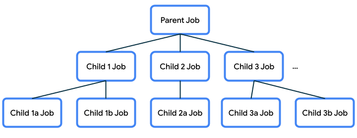

子と親、さらに同じ親に属する他の子について、特定の動作を規定することになるため、この親子関係は重要です。この動作については、天気プログラムの前述の例で説明しました。

- 親ジョブがキャンセルされると、その子ジョブもキャンセルされます。
- `job.cancel()` で子ジョブがキャンセルされると、子ジョブは終了しますが、親ジョブはキャンセルされません。
- ジョブが例外で失敗した場合、その例外で親がキャンセルされます。これを、エラーの上方伝播（親、親の親など）といいます。

#### **CoroutineScope**

コルーチンは通常、`CoroutineScope` で起動されます。これにより、管理されずに失われるコルーチンがなくなり、リソースが無駄になりません。

`launch()` と `async()` は、`CoroutineScope` の[拡張関数](https://kotlinlang.org/docs/extensions.html)です。スコープで `launch()` または `async()` を呼び出し、そのスコープ内に新しいコルーチンを作成します。

`CoroutineScope` はライフサイクルに関連付けられ、そのスコープ内のコルーチンの存続期間を設定します。スコープがキャンセルされると、そのジョブはキャンセルされ、キャンセルが子ジョブに伝播します。スコープ内の子ジョブが例外で失敗すると、他の子ジョブがキャンセルされ、親ジョブがキャンセルされて、例外は呼び出し元に再度スローされます。

##### Kotlin のプレイグラウンドの CoroutineScope

このレッスンでは、プログラムの `CoroutineScope` を提供する `runBlocking()` を使用しました。また、`coroutineScope { }` を使用して `getWeatherReport()` 関数内に新しいスコープを作成する方法も学びました。

##### **Android アプリの CoroutineScope**

Android は、`Activity`（`lifecycleScope`）や `ViewModel`（`viewModelScope`）など、ライフサイクルが明確に定義されたエンティティでコルーチン スコープをサポートします。これらのスコープ内で開始されるコルーチンは、対応するエンティティ（`Activity` や `ViewModel` など）のライフサイクルに従います。

たとえば、`lifecycleScope` というコルーチン スコープを指定して `Activity` でコルーチンを開始するとします。アクティビティが破棄されると、`lifecycleScope` がキャンセルされ、その子コルーチンもすべて自動的にキャンセルされます。`Activity` のライフサイクルに従うコルーチンが望ましい動作かどうかを判断するだけで済みます。

今後取り組む Race Tracker Android アプリでは、コルーチンのスコープをコンポーザブルのライフサイクルに設定する方法について学びます。

##### **CoroutineScope の実装の詳細**

Kotlin コルーチン ライブラリで [`CoroutineScope.kt`](https://cs.android.com/android/platform/superproject/+/master:external/kotlinx.coroutines/kotlinx-coroutines-core/common/src/CoroutineScope.kt?q=coroutinescope) がどのように実装されているのかをソースコードで確認すると、`CoroutineScope` がインターフェースとして宣言され、`CoroutineContext` が変数として含まれていることがわかります。

`launch()` 関数と `async()` 関数は、そのスコープ内で新しい子コルーチンを作成し、子はスコープからコンテキストも継承します。コンテキストには何が含まれるのでしょうか。次はこれについて説明します。

#### **CoroutineContext**

`CoroutineContext` は、コルーチンが実行されるコンテキストに関する情報を提供します。`CoroutineContext` は基本的に要素を格納するマップであり、各要素に一意のキーがあります。コンテキストに含まれるフィールド（必須ではありません）の例を次に示します。

- name - コルーチンを一意に識別するための、コルーチンの名前
- job - コルーチンのライフサイクルを制御します
- dispatcher - 適切なスレッドに処理をディスパッチします
- exception handler - コルーチンで実行されるコードによってスローされる例外を処理します

> **注:** `CoroutineContext` のデフォルト値は次のとおりです。値を指定しない場合に使用されます。
> 
> - コルーチン名「coroutine」
> - 親ジョブなし
> - コルーチン ディスパッチャ「`Dispatchers.Default`」
> - 例外ハンドラなし

コンテキストの各要素は、`+` 演算子でまとめて追加できます。たとえば、1 つの `CoroutineContext` を次のように定義できます。

```kotlin
Job() + Dispatchers.Main + exceptionHandler
```

名前が指定されていないため、デフォルトのコルーチン名が使用されます。

コルーチン内で新しいコルーチンを起動すると、子コルーチンは親コルーチンから `CoroutineContext` を継承しますが、作成されたコルーチン専用のジョブが置き換えられます。また、変更するコンテキスト部分の `launch()` 関数または `async()` 関数に引数を渡すことで、親コンテキストから継承した要素をオーバーライドすることもできます。

```kotlin
scope.launch(Dispatchers.Default) {
    ...
}
```

`CoroutineContext` の詳細と、コンテキストが親から継承される仕組みについては、KotlinConf の講演動画をご覧ください。

ディスパッチャについて何度か言及していますが、その役割は、処理をディスパッチすること、またはスレッドに割り当てることです。スレッドとディスパッチャについて、さらに詳しく見ていきましょう。

#### **ディスパッチャ**

コルーチンはディスパッチャを使用して、実行に使用するスレッドを決定します。**スレッド**を開始し、なんらかの処理（コードの実行）を行い、それ以上の処理がなくなると終了します。

ユーザーがアプリを起動すると、Android システムは、アプリの新しいプロセスと 1 つの実行スレッド（**メインスレッド**）を作成します。メインスレッドは、Android システム イベント、画面の UI 描画、ユーザー入力イベントの処理など、アプリに関する多くの重要なオペレーションを処理します。そのため、アプリ用に記述するコードの大半はメインスレッドで実行される可能性があります。

コードのスレッド動作に関して理解すべき 2 つの用語として、**ブロック**と**非ブロック**があります。通常の関数は、処理が完了するまで呼び出し元のスレッドをブロックします。つまり、処理が完了するまで呼び出し元のスレッドを放棄しないため、その間は他の処理を実行できません。逆に、非ブロックコードは、特定の条件が満たされるまで呼び出し元のスレッドを放棄するため、その間に他の処理を実行できます。非ブロック処理の実行には、処理が完了する前に戻るため非同期関数を使用できます。

Android アプリの場合、実行にあまり時間がかからなければ、メインスレッドではブロックコードのみを呼び出します。メインスレッドをブロックしないようにして、新しいイベントがトリガーされたらすぐに処理を実行できるようにすることが目標です。このメインスレッドはアクティビティの **UI スレッド**であり、UI 描画や UI 関連のイベントを担当します。画面に変更がある場合、UI を再描画する必要があります。画面上のアニメーションなどについては、UI を頻繁に再描画して、滑らかに遷移して見えるようにする必要があります。長時間実行の処理ブロックをメインスレッドで実行する必要がある場合、画面の更新頻度が下がり、突然の遷移（「ジャンク」）や、アプリのハング、反応速度の低下が生じることがあります。

そのため、長時間実行の処理アイテムをメインスレッドから移動し、別のスレッドで処理する必要があります。アプリは 1 つのメインスレッドで開始されますが、複数のスレッドを作成して追加の処理を行うこともできます。こうした追加のスレッドを、ワーカー スレッドということがあります。長時間実行タスクがワーカー スレッドを長時間ブロックしても、その間にメインスレッドはブロックされず、ユーザーに対しアクティブに反応できるため、問題はありません。

Kotlin には次のような組み込みディスパッチャが用意されています。

- **Dispatchers.Main:**このディスパッチャを使用すると、コルーチンはメインの Android スレッドで実行されます。このディスパッチャは主に、UI の更新や操作を処理し、迅速に処理を行うために使用します。
- **Dispatchers.IO:**このディスパッチャは、メインスレッドの外部でディスクまたはネットワークの I/O を行う場合に適しています。たとえば、ファイルの読み書き、ネットワーク オペレーションの実行などです。
- **Dispatchers.Default:**これは、`launch()` と `async()` を呼び出したとき、コンテキストでディスパッチャが指定されていない場合に使用されるデフォルト ディスパッチャです。このディスパッチャを使用すると、メインスレッドの外部でコンピューティング負荷の高い処理を行うことができます。たとえば、ビットマップ画像ファイルの処理などです。

> **注:** すでに利用できる `Handler` や `Executor` から `CoroutineDispatcher` を作成する必要がある場合は、拡張機能の `Executor.asCoroutineDispatcher()` と `Handler.asCoroutineDispatcher()` もあります。

コルーチン ディスパッチャについて理解を深めるには、Kotlin のプレイグラウンドで次の例を試してください。

1. Kotlin のプレイグラウンドにあるコードを次のコードに置き換えます。

```kotlin
import kotlinx.coroutines.*

fun main() {
    runBlocking {
        launch {
            delay(1000)
            println("10 results found.")
        }
        println("Loading...")
    }
}
```

2. 次に、起動されたコルーチンの内容を `withContext()` の呼び出しでラップして、コルーチンが実行される `CoroutineContext` を変更し、特にディスパッチャをオーバーライドします。プログラムの残りのコルーチン コードに現在使用されている `Dispatchers.Main` ではなく、`Dispatchers.Default` を使用するように切り替えます。

```kotlin
...

fun main() {
    runBlocking {
        launch {
            withContext(Dispatchers.Default) {
                delay(1000)
                println("10 results found.")
            }
        }
        println("Loading...")
    }
}
```

[`withContext()`](https://kotlinlang.org/api/kotlinx.coroutines/kotlinx-coroutines-core/kotlinx.coroutines/with-context.html) は、それ自体が suspend 関数であるため、ディスパッチャの切り替えが可能です。指定されたコードブロックを新しい `CoroutineContext` を使用して実行します。新しいコンテキストは、親ジョブ（外側の `launch()` ブロック）のコンテキストからのものです。ただし、親コンテキストで使用されているディスパッチャは、ここで指定されたディスパッチャ（`Dispatchers.Default`）でオーバーライドされます。こうして、`Dispatchers.Main` による処理の実行から `Dispatchers.Default` の使用へと移行できます。

3. プログラムを実行します。出力は次のようになります。

```
Loading...
10 results found.
```

4. print ステートメントを追加し、`Thread.currentThread().name` を呼び出してスレッドを確認します。

```kotlin
import kotlinx.coroutines.*

fun main() {
    runBlocking {
        println("${Thread.currentThread().name} - runBlocking function")
                launch {
            println("${Thread.currentThread().name} - launch function")
            withContext(Dispatchers.Default) {
                println("${Thread.currentThread().name} - withContext function")
                delay(1000)
                println("10 results found.")
            }
            println("${Thread.currentThread().name} - end of launch function")
        }
        println("Loading...")
    }
}
```

5. プログラムを実行します。出力は次のようになります。

```
main @coroutine#1 - runBlocking function
Loading...
main @coroutine#2 - launch function
DefaultDispatcher-worker-1 @coroutine#2 - withContext function
10 results found.
main @coroutine#2 - end of launch function
```

この出力から、ほとんどのコードがメインスレッドのコルーチンで実行されていることがわかります。ただし、`withContext(Dispatchers.Default)` ブロックのコード部分については、デフォルト ディスパッチャ ワーカー スレッド（メインスレッドではありません）のコルーチンで実行されます。`withContext()` が戻った後、コルーチンはメインスレッドでの実行に戻っています（出力ステートメント `main @coroutine#2 - end of launch function` のとおり）。この例では、コルーチンに使用されるコンテキストを変更することで、ディスパッチャを切り替えることができることを示しています。

メインスレッドで開始されたコルーチンがあり、特定のオペレーションをメインスレッドから移動する場合は、`withContext` を使用してその処理に使用するディスパッチャを切り替えることができます。利用可能なディスパッチャ（オペレーションの種類に応じて `Main`、`Default`、`IO`）から適切に選択します。処理は、その目的のために指定されたスレッド（またはスレッドプールというスレッド グループ）に割り当てることができます。コルーチンは自身を中断でき、ディスパッチャは再開方法にも影響を及ぼします。

Room と Retrofit（このユニットと次のユニット）などの人気のライブラリを扱う場合、ライブラリ コードがすでに `Dispatchers.IO.` のような代替コルーチン ディスパッチャを使用してこの処理を行っている場合は、ディスパッチャを自分で明示的に切り替える必要がない場合もあります。このような場合、これらのライブラリで公開されている `suspend` 関数は、すでに**メインセーフ**である可能性があり、メインスレッドで実行されているコルーチンから呼び出すことができます。ワーカー スレッドを使用するディスパッチャへの切り替えは、ライブラリ自体が処理します。

これで、コルーチンの重要な部分と、コルーチンのライフサイクルと動作を形成する際に `CoroutineScope`、`CoroutineContext`、`CoroutineDispatcher`、`Jobs` が果たす役割について大まかに確認できました。

### 6. まとめ

コルーチンに関する難しいトピックは以上です。コルーチンが非常に有用であることがわかりました。実行を中断し、基となるスレッドを他の処理に解放して、コルーチンを後で再開できます。これにより、コード内で同時実行オペレーションを実行できます。

Kotlin のコルーチン コードは、構造化された同時実行の原則に従います。デフォルトでは順次処理されるため、同時実行する場合はその旨を明示する必要があります（`launch()` や `async()` を使用するなど）。構造化された同時実行では、複数の同時実行オペレーションを 1 つの同期オペレーションにまとめることができます。同時実行は実装の詳細です。呼び出しコードの唯一の要件は、suspend 関数またはコルーチンであることです。それ以外には、呼び出しコードの構造で同時実行の詳細を考慮する必要はありません。これにより、非同期コードが読みやすく、考えやすくなります。

構造化された同時実行では、アプリで起動された各コルーチンをトラッキングし、失われないようにします。コルーチンに階層を持たせることができます。タスクでサブタスクを起動し、さらにサブタスクを起動できます。ジョブは、コルーチン間の親子関係を維持し、コルーチンのライフサイクルを制御できます。

起動、完了、キャンセル、失敗の 4 つは、コルーチンの実行における一般的なオペレーションです。同時実行プログラムを簡単に管理できるようにするために、構造化された同時実行は、階層内の一般的なオペレーションの管理方法の基礎となる原則を定義します。

1. **起動:**存続期間の境界が定義されたスコープでコルーチンを起動します。
2. **完了:**子ジョブが完了するまで、ジョブは完了しません。
3. **キャンセル:**このオペレーションは下方に伝播する必要があります。コルーチンがキャンセルされると、子コルーチンもキャンセルされる必要があります。
4. **失敗:**このオペレーションは上方に伝播する必要があります。コルーチンが例外をスローすると、親はすべての子をキャンセルし、自身をキャンセルして、親に例外を伝播させます。これは、エラーが検出されて処理されるまで続きます。これにより、コード内のエラーが適切に報告され、失われることはありません。

コルーチンに関する実践演習を行い、コルーチンの背後にあるコンセプトを理解することで、Android アプリで同時実行コードを記述する準備が整いました。非同期プログラミングにコルーチンを使用すると、コードが読みやすく、考えやすくなります。また、キャンセルと例外が発生した場合でもより堅牢になり、エンドユーザーにとってより最適で応答性の高いエクスペリエンスが提供されます。

#### **概要**

- コルーチンを使用すると、新しいプログラミング スタイルを学習することなく、同時実行する長時間実行コードを作成できます。設計上、コルーチンの実行は順次行われます。
- コルーチンは構造化された同時実行の原則に従い、処理が失われないようにし、存続期間に一定の境界があるスコープに関連付けられるようにします。同時実行を明示的に要求しない限り（`launch()` や `async()` を使用するなど）、コードはデフォルトで順次処理され、基となるイベントループと連携します。関数を呼び出す場合は、実装の詳細で使用したコルーチンの数に関係なく、関数が戻るまでに（例外で失敗しない限り）その処理を完全に終了する必要があるということが前提となります。
- `suspend` 修飾子は、実行を中断して後で再開できる関数をマークするために使用されます。
- `suspend` 関数は、別の suspend 関数またはコルーチンからのみ呼び出すことができます。
- 新しいコルーチンは、`CoroutineScope` の拡張関数 `launch()` または `async()` を使用して開始できます。
- ジョブは、コルーチンのライフサイクルを管理し、親子関係を維持することで、構造化された同時実行を確保するための重要な役割を果たします。
- `CoroutineScope` は、ジョブを通じてコルーチンの存続期間を制御し、子とその子にキャンセルやその他のルールを再帰的に適用します。
- `CoroutineContext` は、コルーチンの動作を定義します。ジョブとコルーチン ディスパッチャへの参照を含むことができます。
- コルーチンは、`CoroutineDispatcher` を使用して、実行に使用するスレッドを決定します。

#### 詳細

- [Android での Kotlin コルーチン](https://developer.android.com/kotlin/coroutines)
- [Kotlin のコルーチンと Flow に関する参考情報](https://developer.android.com/kotlin/coroutines/additional-resources)
- [コルーチン ガイド](https://kotlinlang.org/docs/coroutines-guide.html)
- [コルーチンのコンテキストとディスパッチャ](https://kotlinlang.org/docs/coroutine-context-and-dispatchers.html)
- [コルーチンでのキャンセルと例外](https://medium.com/androiddevelopers/coroutines-first-things-first-e6187bf3bb21)
- [Android でのコルーチン](https://medium.com/androiddevelopers/coroutines-on-android-part-i-getting-the-background-3e0e54d20bb)

## 4. Android Studio でのコルーチンの概要


### 1. 始める前に

前のレッスンでは、コルーチンについて学習しました。Kotlin プレイグラウンドを使用して、コルーチンで同時実行コードを記述しました。このレッスンでは、Android アプリ内のコルーチンとそのライフサイクルに関する知識を利用します。新しいコルーチンを同時に起動するためのコードを追加し、それらのコルーチンをテストする方法を学習します。

#### 前提条件

- Kotlin 言語の基本（関数やラムダを含む）に関する知識
- Jetpack Compose でレイアウトを作成できること
- Kotlin で単体テストを作成できること（ViewModel レッスンの単体テストを作成するを参照）
- スレッドと同時実行の仕組みに関する知識
- コルーチンと CoroutineScope に関する基本的な知識

#### **作成するアプリの概要**

- 2 人のプレーヤー間のレースの進行状況をシミュレートする Race Tracker アプリを作成します。このアプリを通して、コルーチンのさまざまな側面についてテストし、学習を深めることができます。

#### 学習内容

- Android アプリのライフサイクルにおけるコルーチンの使用。
- 構造化された同時実行の原則。
- コルーチンをテストする単体テストを作成する方法。

#### 必要なもの

- Android Studio の最新の安定版

### 2. アプリの概要

Race Tracker は、2 人のプレーヤーによる競走をシミュレートするアプリです。アプリ UI は、[**Start** / **Pause**] と [**Reset**] の 2 つのボタンと、ランナーの進行状況を示す 2 つの進行状況バーで構成されています。レースは、プレーヤー 1 と 2 がそれぞれ異なるスピードで「走る」という設定です。実際のレースでは、プレーヤー 2 がプレーヤー 1 の 2 倍の速さで進みます。

| 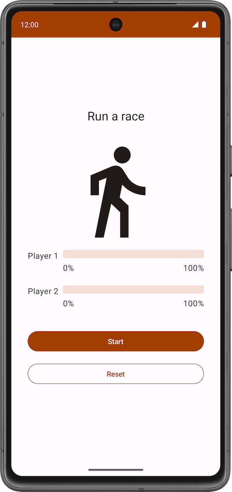 | 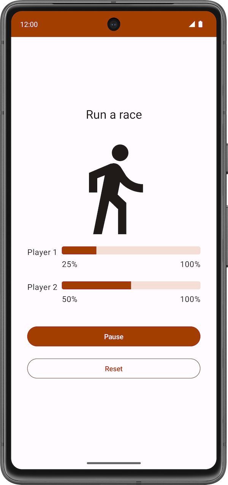 | 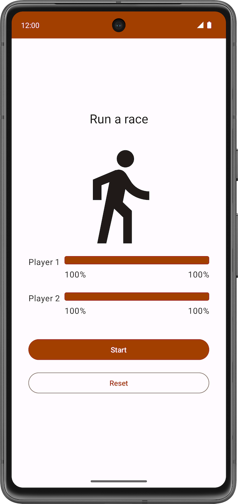 |
|---|---|---|

アプリでコルーチンを使用して、次のことを確認します。

- 両方のプレーヤーが同時に「競走」する。
- アプリの UI がレスポンシブで、ランナーの進行に合わせて進行状況バーが伸びていく。

スターター コードには、Race Tracker アプリ用の UI コードが含まれています。レッスンのこのパートは主に、Android アプリ内の Kotlin コルーチンに慣れることに焦点を当てます。

#### スターター コードを取得する

まず、スターター コードをダウンロードします。

または、GitHub リポジトリのクローンを作成してコードを入手することもできます。

```
$ git clone https://github.com/google-developer-training/basic-android-kotlin-compose-training-race-tracker.git
$ cd basic-android-kotlin-compose-training-race-tracker
$ git checkout starter
```

> **注:**スターター コードは、ダウンロードしたリポジトリの `starter` ブランチにあります。

スターター コードは [Race Tracker](https://github.com/google-developer-training/basic-android-kotlin-compose-training-race-tracker) GitHub リポジトリで確認できます。

#### スターター コードのチュートリアル

レースを始めるには、[**Start**] ボタンをクリックします。レース中は、[**Start**] ボタンが [**Pause**] ボタンに変わります。


このボタンを使用して、レースの一時停止と再開をいつでも行えます。


レース中は、進行状況バー（ステータス インジケーター）が各プレーヤーの進行状況を示します。コンポーズ可能な関数 `StatusIndicator` が各プレーヤーの進行状況を表示します。この関数は `LinearProgressIndicator` コンポーザブルを使用して、進行状況バーを表示します。進行状況の値はコルーチンを使用して更新します。


`RaceParticipant`: 進行状況バーを伸ばすためのデータを提供します。このクラスは各プレーヤーの状態ホルダーで、参加者の `name`、レース完了に到達する `maxProgress`、進行状況バーを伸ばす遅延間隔、レース中の進行状況を示す`currentProgress`、`initialProgress` を更新します。

次のセクションでは、コルーチンを使用して、アプリの UI をブロックせずにレースの進行状況をシミュレートする機能を実装します。

### 3. レースの進行状況を実装する

`run()` 関数を使用してプレーヤーの `currentProgress` を `maxProgress` と比較し、レースの全体的な進行状況を表示します。また、suspend 関数（`delay()`）を使用して、進行状況バーを伸ばすタイミングにわずかな遅延を追加します。この関数は別の suspend 関数 `delay()` を呼び出しているため、`suspend` 関数である必要があります。また、この関数は、レッスンの後半でコルーチンから呼び出します。関数を実装する手順は次のとおりです。

1. スターター コードの一部である `RaceParticipant` クラスを開きます。
2. `RaceParticipant` クラス内で、`run()` という名前の新しい `suspend` 関数を定義します。

```kotlin
class RaceParticipant(
    ...
) {
    var currentProgress by mutableStateOf(initialProgress)
        private set

    suspend fun run() {
        
    }
    ...
}
```

3. レースの進行状況をシミュレートするには、`currentProgress` が値 `maxProgress`（`100` に設定される）に達するまで実行される `while` ループを追加します。

```kotlin
class RaceParticipant(
    ...
    val maxProgress: Int = 100,
    ...
) {
    var currentProgress by mutableStateOf(initialProgress)
        private set

    suspend fun run() {
        while (currentProgress < maxProgress) {
            
        }
    }
    ...
}
```

4. `currentProgress` の値は `initialProgress`（`0`）に設定されています。参加者の進行状況をシミュレートするには、while ループで `progressIncrement` プロパティの値ずつ `currentProgress` の値を増やしていきます。`progressIncrement` のデフォルト値は `1` です。

```kotlin
class RaceParticipant(
    ...
    val maxProgress: Int = 100,
    ...
    private val progressIncrement: Int = 1,
    private val initialProgress: Int = 0
) {
    ...
    var currentProgress by mutableStateOf(initialProgress)
        private set

    suspend fun run() {
        while (currentProgress < maxProgress) {
            currentProgress += progressIncrement
        }
    }
}
```

5. レースの進行状況バーをさまざまな間隔で伸ばすシミュレーションを行うには、suspend 関数 `delay()` を使用します。`progressDelayMillis` プロパティの値を引数として渡します。

```kotlin
suspend fun run() {
    while (currentProgress < maxProgress) {
        delay(progressDelayMillis)
        currentProgress += progressIncrement
    }
}
```

今追加したコードを見ると、次のスクリーンショットのように、Android Studio の `delay()` 関数の呼び出しの左側にアイコンが表示されます。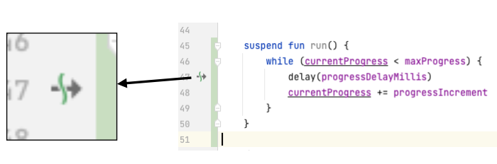

このアイコンは、関数が一時停止してから後で再開できる一次停止ポイントを示します。

次の図に示すように、コルーチンが遅延時間中に待機している間、メインスレッドはブロックされません。

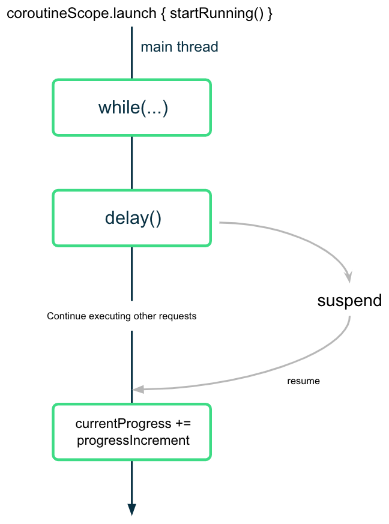

コルーチンは、目的の間隔値を指定して `delay()` 関数を呼び出した後、実行を一時停止します（ただし、ブロックしません）。遅延時間後、コルーチンは実行を再開して `currentProgress` プロパティの値を更新します。

### 4. レースを開始する

ユーザーが [**Start**] ボタンを押したとき、2 つのプレーヤー インスタンスでそれぞれ suspend 関数 `run()` を呼び出して「レースを開始」する必要があります。そのためには、`run()` 関数を呼び出すコルーチンを起動します。

レースを開始するためのコルーチンを起動するときは、両方のプレーヤーについて次の点を確認する必要があります。

- [**Start**] ボタンをクリックすると（コルーチンが起動すると）、すぐに走行が開始する。
- [**Pause**] ボタンまたは [**Reset**] ボタンをクリックすると、それぞれレースを一時停止するかリセットする（コルーチンがキャンセルされる）。
- アプリを閉じると、キャンセルが適切に処理される（すべてのコルーチンがキャンセルされ、ライフサイクルにバインドされる）。

最初のレッスンで、suspend 関数は別の suspend 関数からしか呼び出せないことを学習しました。コンポーザブル内から suspend 関数を安全に呼び出すには、`LaunchedEffect()` コンポーザブルを使用する必要があります。`LaunchedEffect()` コンポーザブルはコンポジションに残っている限り、指定された suspend 関数を実行します。コンポーズ可能な関数 `LaunchedEffect()` を使用すると、次のすべてを行うことができます。

- `LaunchedEffect()` コンポーザブルを使用すると、コンポーザブルから suspend 関数を安全に呼び出すことができます。
- `LaunchedEffect()` 関数は、コンポジションに入ると、コードブロックがパラメータとして渡されたコルーチンを起動します。コンポジションに残っている限り、指定された suspend 関数を実行します。ユーザーが Race Tracker アプリの [**Start**] ボタンをクリックすると、`LaunchedEffect()` はコンポジションに入り、コルーチンを起動して進行状況を更新します。
- `LaunchedEffect()` がコンポジションを出ると、コルーチンはキャンセルされます。アプリでユーザーが [**Reset**] ボタンまたは [**Pause**] ボタンをクリックすると、`LaunchedEffect()` がコンポジションから削除され、それが起動したコルーチンもキャンセルされます。

RaceTracker アプリの場合、ディスパッチャを明示的に提供する必要はありません（`LaunchedEffect()` によって処理されるため）。

レースを開始するには、プレーヤーごとに `run()` 関数を呼び出して、次の手順を行います。

1. `com.example.racetracker.ui` パッケージ内の `RaceTrackerApp.kt` ファイルを開きます。
2. `RaceTrackerApp()` コンポーザブルに移動し、`raceInProgress` の定義の後の行に `LaunchedEffect()` コンポーザブルの呼び出しを追加します。

```kotlin
@Composable
fun RaceTrackerApp() {
    ...
    var raceInProgress by remember { mutableStateOf(false) }

    LaunchedEffect {
    
    }
    RaceTrackerScreen(...)
}
```

3. `playerOne` または `playerTwo` のインスタンスが別のインスタンスに置き換えられた場合、`LaunchedEffect()` は起動したコルーチンをいったんキャンセルして再起動する必要があります。そのためには、`playerOne` オブジェクトと `playerTwo` オブジェクトを `key` として `LaunchedEffect` に追加します。テキスト値が変更されたときに `Text()` コンポーザブルが再コンポーズされる仕組みと同様に、`LaunchedEffect()` のいずれかの重要な引数が変更されると、それが起動したコルーチンはいったんキャンセルされた後、再起動されます。

```kotlin
LaunchedEffect(playerOne, playerTwo) {
}
```

4. `playerOne.run()` 関数と `playerTwo.run()` 関数の呼び出しを追加します。

```kotlin
@Composable
fun RaceTrackerApp() {
    ...
    var raceInProgress by remember { mutableStateOf(false) }

    LaunchedEffect(playerOne, playerTwo) {
        playerOne.run()
        playerTwo.run()
    }
    RaceTrackerScreen(...)
}
```

5. `LaunchedEffect()` ブロックを `if` 条件でラップします。この状態の初期値は `false` です。ユーザーが [**Start**] ボタンをクリックし、`LaunchedEffect()` が実行されると、`raceInProgress` 状態の値が `true` に更新されます。

```kotlin
if (raceInProgress) {
    LaunchedEffect(playerOne, playerTwo) {
        playerOne.run()
        playerTwo.run() 
    }
}
```

6. `raceInProgress` フラグを `false` に更新してレースを終了します。この値は、ユーザーが [**Pause**] ボタンをクリックした場合でも `false` に設定されます。この値が `false` に設定されると、`LaunchedEffect()` により、起動されたすべてのコルーチンは確実にキャンセルされます。

```kotlin
LaunchedEffect(playerOne, playerTwo) {
    playerOne.run()
    playerTwo.run()
    raceInProgress = false 
}
```

7. アプリを実行し、[**Start**] ボタンをクリックします。プレーヤー 2 がレースを開始する前に、プレーヤー 1 がレースを完了していることがわかります。次の動画をご覧ください。

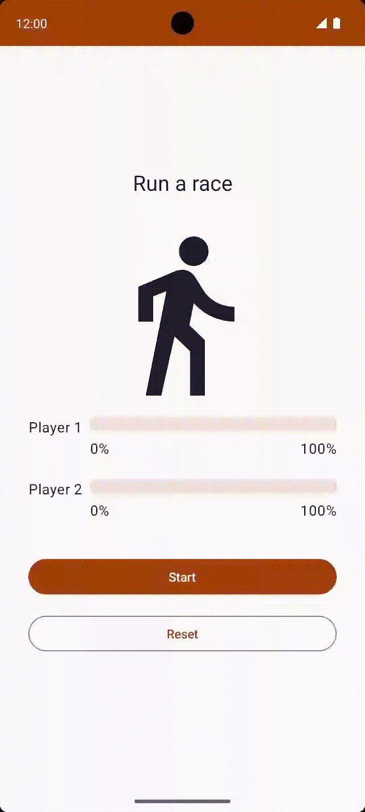

公平なレースではないようです。次のセクションでは、同時実行タスクを起動して、両方のプレーヤーが同時に走行できるようにする方法、コンセプトを理解する方法、この動作を実装する方法を学習します。

### 5. 構造化された同時実行

コルーチンを使用してコードを記述する方法は、構造化された同時実行と呼ばれます。この種類のプログラミングにより、コードの読みやすさが改善し、開発時間が短縮します。構造化された同時実行とは、コルーチンに階層があるということです。つまり、タスクによってサブタスクが起動され、次いでサブタスクが起動されます。この階層の単位はコルーチン スコープと呼ばれます。コルーチン スコープは常にライフサイクルに関連付ける必要があります。

コルーチン API は、この構造化された同時実行に準拠した設計となっています。suspend としてマークされていない関数から suspend 関数を呼び出すことはできません。この制限により、`launch` などのコルーチン ビルダーから suspend 関数を確実に呼び出すことができます。これらのビルダーは、今度は `CoroutineScope` に関連付けられます。

### 6. 同時実行タスクを起動する

1. 両方の参加者を同時に走行させるには、2 つのコルーチンを別々に起動し、`run()` 関数の各呼び出しをこれらのコルーチン内に移動します。`playerOne.run()` の呼び出しを `launch` ビルダーでラップします。

```kotlin
LaunchedEffect(playerOne, playerTwo) {
    launch { playerOne.run() }
    playerTwo.run()
    raceInProgress = false 
}
```

2. 同様に、`playerTwo.run()` 関数の呼び出しを `launch` ビルダーでラップします。この変更により、アプリは同時に実行される 2 つのコルーチンを起動します。両方のプレーヤーが同時に走行できるようになりました。

```kotlin
LaunchedEffect(playerOne, playerTwo) {
    launch { playerOne.run() }
    launch { playerTwo.run() }
    raceInProgress = false 
}
```

3. アプリを実行し、[**Start**] ボタンをクリックします。レースが開始される見込みでしたが、予想とは異なりボタンのテキストが [**Start**] に戻ります。

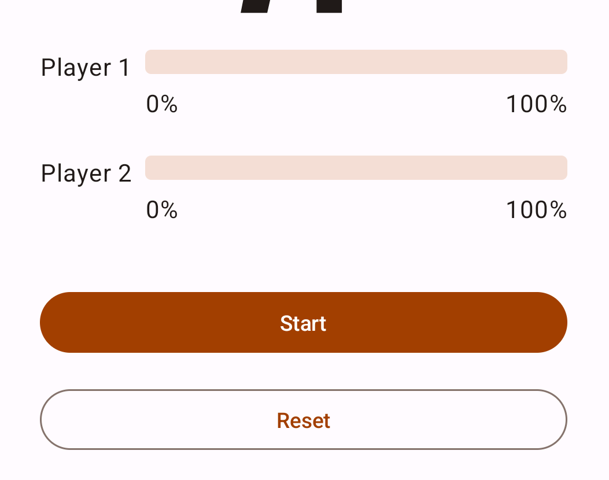

両方のプレーヤーが走行を完了したら、Race Tracker アプリは [**Pause**] ボタンのテキストを [**Start**] にリセットする必要があります。ただしここでは、プレーヤーのレースの完了を待つのではなく、コルーチンが起動されるとすぐにアプリが `raceInProgress` を更新します。

```kotlin
LaunchedEffect(playerOne, playerTwo) {
    launch {playerOne.run() }
    launch {playerTwo.run() }
    raceInProgress = false // This will update the state immediately, without waiting for players to finish run() execution.
}
```

次の理由により、`raceInProgress` フラグがすぐに更新されます。

- `launch` ビルダー関数は、`playerOne.run()` を実行するコルーチンを起動し、すぐにコードブロックの次の行を実行します。
- `playerTwo.run()` 関数を実行する 2 番目の `launch` ビルダー関数でも、同じ実行フローが発生します。
- 2 番目の `launch` ビルダーが返されると、すぐに `raceInProgress` フラグが更新されます。この場合、ボタンはすぐに [**スタート**] ボタンとなり、レースは開始されません。

##### コルーチンのスコープ

`coroutineScope` suspend 関数は `CoroutineScope` を作成し、指定された suspend ブロックを現在のスコープで呼び出します。スコープは、`LaunchedEffect()` スコープから `coroutineContext` を継承します。

このスコープは、指定されたブロックとそのすべての子コルーチンが完了するとすぐに返されます。`RaceTracker` アプリの場合、両方の参加者オブジェクトが `run()` 関数の実行を終了すると、返されます。

1. `raceInProgress` フラグを更新する前に `playerOne` と `playerTwo` の `run()` 関数の実行が完了するように、両方の起動ビルダーを `coroutineScope` ブロックでラップします。

```kotlin
LaunchedEffect(playerOne, playerTwo) {
    coroutineScope {
        launch { playerOne.run() }
        launch { playerTwo.run() }
    }
    raceInProgress = false
}
```

2. エミュレータまたは Android デバイスでアプリを実行します。次の画面が表示されます。


3. [**Start**] ボタンをクリックします。プレーヤー 2 はプレーヤー 1 よりも速く走行します。レースが終了すると（両方のプレーヤーが 100% の進行状況に達すると）、[**Pause**] ボタンが [**Start**] ボタンに変わります。[**Reset**] ボタンをクリックすると、レースをリセットしてシミュレーションを再実行できます。レースを次の動画で示します。


次の図に実行フローを示します。

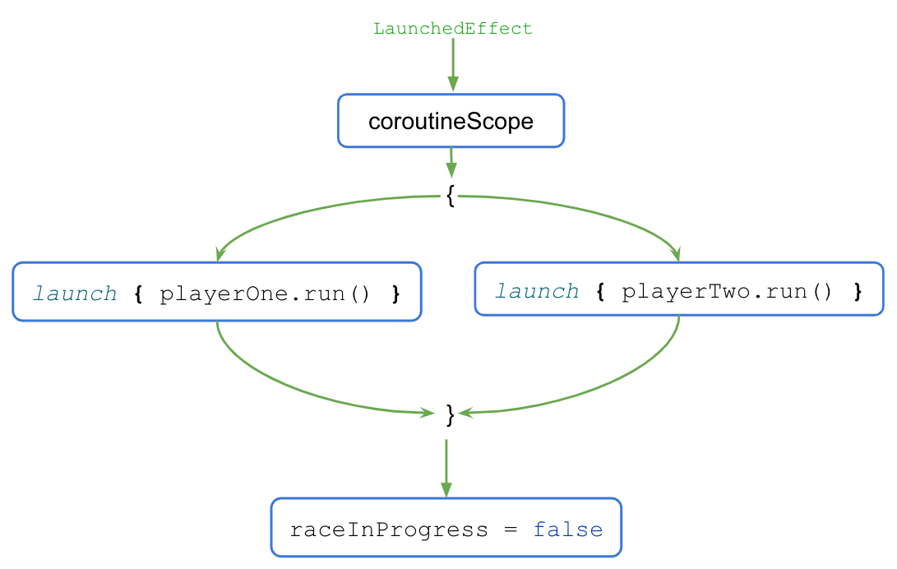

- `LaunchedEffect()` ブロックが実行されると、制御は `coroutineScope{..}` ブロックに移ります。
- `coroutineScope` ブロックは、両方のコルーチンを同時に起動し、実行が完了するのを待ちます。
- 実行が完了すると、`raceInProgress` フラグが更新されます。

`coroutineScope` ブロックは、ブロック内のすべてのコードの実行が完了した後にのみ、実行を継続します。ブロックの外のコードでは、同時実行の有無は実装の詳細にすぎません。このコーディング スタイルは、同時実行プログラミングに対する構造化されたアプローチを提供するもので、構造化された同時実行と呼ばれます。

レースの完了後に [**Reset**] ボタンをクリックすると、コルーチンがキャンセルされ、両方のプレーヤーの進行状況が `0` にリセットされます。

ユーザーが [**Reset**] ボタンをクリックしたときにコルーチンがどのようにキャンセルされるかを確認するには、次の手順を行います。

1. 次のコードに示すように、`run()` メソッドの本体を try-catch ブロックでラップします。

```kotlin
suspend fun run() {
    try {
        while (currentProgress < maxProgress) {
            delay(progressDelayMillis)
            currentProgress += progressIncrement
        }
    } catch (e: CancellationException) {
        Log.e("RaceParticipant", "$name: ${e.message}")
        throw e // Always re-throw CancellationException.
    }
}
```

2. アプリを実行し、[**Start**] ボタンをクリックします。
3. 進行状況の数値が増えたら、[**Reset**] ボタンをクリックします。
4. 次のメッセージが Logcat に出力されていることを確認します。

```
Player 1: StandaloneCoroutine was cancelled
Player 2: StandaloneCoroutine was cancelled
```

### 7. コルーチンをテストする単体テストを作成する

コルーチンを使用する単体テストのコードの実行は、非同期、かつ複数のスレッド間で行われる可能性があるため、特別な注意が必要です。

テストで suspend 関数を呼び出すには、コルーチン内で行う必要があります。JUnit テスト関数自体は suspend 関数ではないため、`runTest` コルーチン ビルダーを使用する必要があります。このビルダーは `kotlinx-coroutines-test` ライブラリの一部であり、テストを実行するように設計されています。ビルダーは新しいコルーチンでテスト本体を実行します。

> **注**: コルーチンは、テスト本体で直接開始できるだけでなく、`runTest` を使用したテストで使用しているオブジェクトからも開始できます。

`runTest` は `kotlinx-coroutines-test` ライブラリの一部であるため、その依存関係を追加する必要があります。

依存関係を追加するには、次の手順を行います。

1. [**Project**] ペインの **`app`** ディレクトリにある、アプリ モジュールの **`build.gradle.kts`** ファイルを開きます。

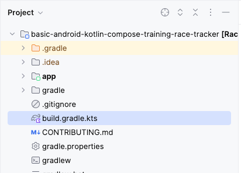

2. ファイル内で、`dependencies{}` ブロックが見つかるまで下にスクロールします。
3. `testImplementation` 構成ファイルを使用して依存関係を `kotlinx-coroutines-test` ライブラリに追加します。

```kotlin
plugins {
    ...
}

android {
    ...
}

dependencies {
    ...
    testImplementation("org.jetbrains.kotlinx:kotlinx-coroutines-test:1.6.4")
}
```

4. 次のスクリーンショットに示すように、**build.gradle.kts** ファイルの上部にある通知バーで [**Sync Now**] をクリックし、インポートとビルドを終了します。


ビルドが完了したら、テストの作成を開始できます。

#### レースの開始と終了の単体テストを実装する

レースの各段階でレースの進行状況が正しく更新されるようにするには、単体テストでさまざまなシナリオに対応する必要があります。このレッスンでは、次の 2 つのシナリオについて説明します。

- レース開始後の進行状況。
- レース終了後の進行状況。

レースの開始後にレースの進行状況が正しく更新されるかどうかを確認するには、`raceParticipant.progressDelayMillis` 期間が経過した後に現在の進行状況が 1 に設定されていることをアサートします。

テストシナリオを実装する手順は次のとおりです。

1. テスト ソースセットの下にある `RaceParticipantTest.kt` ファイルに移動します。
2. テストを定義するには、`raceParticipant` 定義の後に `raceParticipant_RaceStarted_ProgressUpdated()` 関数を作成し、`@Test` アノテーションを付けます。テストブロックは `runTest` ビルダーに配置する必要があるため、式の構文を使用して `runTest()` ブロックをテスト結果として返します。

```kotlin
class RaceParticipantTest {
    private val raceParticipant = RaceParticipant(
        ...
    )

    @Test
    fun raceParticipant_RaceStarted_ProgressUpdated() = runTest {
    }
}
```

3. 読み取り専用の `expectedProgress` 変数を追加し、`1` に設定します。

```kotlin
@Test
fun raceParticipant_RaceStarted_ProgressUpdated() = runTest {
    val expectedProgress = 1
}
```

4. レースの開始をシミュレートするには、`launch` ビルダーを使用して新しいコルーチンを起動し、`raceParticipant.run()` 関数を呼び出します。

```kotlin
@Test
fun raceParticipant_RaceStarted_ProgressUpdated() = runTest {
    val expectedProgress = 1
    launch { raceParticipant.run() }
}
```

> **注:** `runtTest` ビルダーで `raceParticipant.run()` を直接呼び出すこともできますが、デフォルトのテスト実装では `delay()` の呼び出しは無視されます。その結果、`run()` の実行が終了してから進行状況を分析できるようになります。

`raceParticipant.progressDelayMillis` プロパティの値によって、レースの進行状況が更新されるまでの時間が決まります。`progressDelayMillis` 時間が経過した後に進行状況をテストするには、テストになんらかの遅延を追加します。

5. `advanceTimeBy()` ヘルパー関数を使用して、時間を `raceParticipant.progressDelayMillis` の値だけ進めます。`advanceTimeBy()` 関数を使用してテスト実行時間を短縮できます。

```kotlin
@Test
fun raceParticipant_RaceStarted_ProgressUpdated() = runTest {
    val expectedProgress = 1
    launch { raceParticipant.run() }
    advanceTimeBy(raceParticipant.progressDelayMillis)
}
```

6. `advanceTimeBy()` は指定された時間にスケジュール設定されたタスクを実行しないので、`runCurrent()` 関数を呼び出す必要があります。この関数は、現在の時刻に保留中のタスクをすべて実行します。

```kotlin
@Test
fun raceParticipant_RaceStarted_ProgressUpdated() = runTest {
    val expectedProgress = 1
    launch { raceParticipant.run() }
    advanceTimeBy(raceParticipant.progressDelayMillis)
    runCurrent()
}
```

7. 進行状況が確実に更新されるようにするには、`assertEquals()` 関数の呼び出しを追加して、`raceParticipant.currentProgress` プロパティの値が `expectedProgress` 変数の値と一致するかどうかを確認します。

```kotlin
@Test
fun raceParticipant_RaceStarted_ProgressUpdated() = runTest {
    val expectedProgress = 1
    launch { raceParticipant.run() }
    advanceTimeBy(raceParticipant.progressDelayMillis)
    runCurrent()
    assertEquals(expectedProgress, raceParticipant.currentProgress)
}
```

8. テストを実行して、合格することを確認します。

レースの終了後、レースの進行状況が正しく更新されているかどうかを確認するには、レースの終了時に現在の進行状況が `100` に設定されていることをアサートします。

テストを実装する手順は次のとおりです。

1. `raceParticipant_RaceStarted_ProgressUpdated()` テスト関数の後に、`raceParticipant_RaceFinished_ProgressUpdated()` 関数を作成し、`@Test` アノテーションを付けます。この関数は、`runTest{}` ブロックからテスト結果を返します。

```kotlin
class RaceParticipantTest {
    ...

    @Test
    fun raceParticipant_RaceStarted_ProgressUpdated() = runTest {
        ...
    }

    @Test
    fun raceParticipant_RaceFinished_ProgressUpdated() = runTest {
    }
}
```

2. `launch` ビルダーを使用して新しいコルーチンを起動し、その `raceParticipant.run()` 関数の呼び出しを追加します。

```kotlin
@Test
fun raceParticipant_RaceFinished_ProgressUpdated() = runTest {
    launch { raceParticipant.run() }
}
```

3. レースの終了をシミュレートするには、`advanceTimeBy()` 関数を使用して、ディスパッチ時間を `raceParticipant.maxProgress * raceParticipant.progressDelayMillis` だけ進めます。

```kotlin
@Test
fun raceParticipant_RaceFinished_ProgressUpdated() = runTest {
    launch { raceParticipant.run() }
    advanceTimeBy(raceParticipant.maxProgress * raceParticipant.progressDelayMillis)
}
```

4. `runCurrent()` 関数の呼び出しを追加して、保留中のタスクを実行します。

```kotlin
@Test
fun raceParticipant_RaceFinished_ProgressUpdated() = runTest {
    launch { raceParticipant.run() }
    advanceTimeBy(raceParticipant.maxProgress * raceParticipant.progressDelayMillis)
    runCurrent()
}
```

5. 進行状況が正しく更新されるようにするには、`assertEquals()` 関数の呼び出しを追加して `raceParticipant.currentProgress` プロパティの値が `100` と等しいかどうかを確認します。

```kotlin
@Test
fun raceParticipant_RaceFinished_ProgressUpdated() = runTest {
    launch { raceParticipant.run() }
    advanceTimeBy(raceParticipant.maxProgress * raceParticipant.progressDelayMillis)
    runCurrent()
    assertEquals(100, raceParticipant.currentProgress)
}
```

6. テストを実行して、合格することを確認します。

#### **課題に挑戦しましょう**

ViewModel の単体テストを作成するのレッスンで説明したテスト戦略を利用します。ハッピーパス、エラーケース、境界ケースを網羅するテストを追加します。

作成したテストと、解答コードで使用できるテストを比較します。

### 8. 解答コードを取得する

このレッスンの完成したコードをダウンロードするには、以下の git コマンドを使用します。

```
git clone https://github.com/google-developer-training/basic-android-kotlin-compose-training-race-tracker.git 
cd basic-android-kotlin-compose-training-race-tracker
```

または、リポジトリを ZIP ファイルとしてダウンロードし、Android Studio で開くこともできます。

> **注:**解答コードは、コード リポジトリの `main` ブランチにあります。

解答コードを確認する場合は、[GitHub で表示します](https://github.com/google-developer-training/basic-android-kotlin-compose-training-race-tracker)。

### 9. まとめ

これで完了です。ここまで、コルーチンを使用して同時実行を処理する方法について学習しました。コルーチンは、メインスレッドをブロックしてアプリの応答を止める可能性のある長時間実行タスクの管理に役立ちます。また、コルーチンをテストする単体テストを作成する方法についても学習しました。

コルーチンには、次のような機能があります。

- **読みやすさ:** コルーチンを使用して記述するコードにより、コード行の実行順序がわかりやすくなります。
- **Jetpack の統合:** Compose や ViewModel など、Jetpack ライブラリの多くには、コルーチンを全面的にサポートする拡張機能が用意されています。一部のライブラリでは、構造化された同時実行に使用できる独自のコルーチン スコープも用意されています。
- **構造化された同時実行:** コルーチンによって同時実行コードを安全かつ簡単に実装できるようにし、不要なボイラープレート コードを排除し、アプリで起動されたコルーチンの紛失や漏洩を防ぎます。

#### **概要**

- コルーチンを使用すると、新しいプログラミング スタイルを学習することなく、同時実行する長時間実行コードを作成できます。設計上、コルーチンの実行は順次行われます。
- `suspend` キーワードは関数または関数型をマークして、一連のコード命令の実行、一時停止、再開が可能であることを示すために使用されます。
- `suspend` 関数は、別の suspend 関数からのみ呼び出すことができます。
- 新しいコルーチンは、`launch` または `async` ビルダー関数を使用して開始できます。
- コルーチンのコンテキスト、コルーチン ビルダー、ジョブ、コルーチン スコープ、ディスパッチャは、コルーチンを実装するための主要なコンポーネントです。
- コルーチンは、ディスパッチャを使用して実行に使用するスレッドを決定します。
- ジョブは、コルーチンのライフサイクルを管理し、親子関係を維持することで、構造化された同時実行を確保するうえで重要な役割を果たします。
- `CoroutineContext` は、ジョブとコルーチン ディスパッチャを使用してコルーチンの動作を定義します。
- `CoroutineScope` は、そのジョブを通じてコルーチンの存続期間を制御し、子とその子にキャンセルやその他のルールを再帰的に適用します。
- 起動、完了、キャンセル、失敗の 4 つは、コルーチンの実行における一般的なオペレーションです。
- コルーチンは構造化された同時実行の原則に従います。

#### 詳細

- [Android での Kotlin コルーチン](https://developer.android.com/kotlin/coroutines)
- [Kotlin のコルーチンと Flow に関する参考情報](https://developer.android.com/kotlin/coroutines/additional-resources)
- [コルーチンの例外](https://medium.com/androiddevelopers/exceptions-in-coroutines-ce8da1ec060c)
- [Android でのコルーチン（パート 1）](https://medium.com/androiddevelopers/coroutines-on-android-part-i-getting-the-background-3e0e54d20bb)

## 5. インターネットからデータを取得する（提出対象）


### 1. 始める前に

市販されている Android アプリの大半は、ネットワーク オペレーション（バックエンド サーバーからメール、メッセージ、またはその他の情報を取得するなど）を実行するために、インターネットに接続します。Gmail、YouTube、Google フォトは、インターネットに接続してユーザーデータを表示するアプリの例です。

このレッスンでは、コミュニティで開発されたオープンソースのライブラリを使用して、バックエンド サーバーからデータを取得するデータレイヤを構築します。この方法は、データの取得を大幅に簡素化します。また、Android のベスト プラクティス（バックグラウンド スレッドでオペレーションを実行するなど）に沿ってアプリを構築するのに役立ちます。さらに、インターネットが低速な場合や利用できない場合は、エラー メッセージを表示します。これにより、ネットワーク接続に関する問題について常にユーザーに通知できます。

#### 前提条件

- コンポーズ可能な関数の作成方法についての基本的な知識。
- Android アーキテクチャ コンポーネントである `ViewModel` の使用方法についての基本的な知識。
- 長時間実行タスクでコルーチンを使用する方法についての基本的な知識。
- `build.gradle.kts` に依存関係を追加する方法についての基本的な知識。

#### **学習内容**

- [REST](https://en.wikipedia.org/wiki/Representational_state_transfer) ウェブサービスとは何か。
- [Retrofit](https://square.github.io/retrofit/) ライブラリを使用し、インターネット上の REST ウェブサービスに接続してレスポンスを取得する方法。
- [シリアル化（kotlinx.serialization）](https://kotlinlang.org/docs/serialization.html#0)ライブラリを使用し、JSON レスポンスを解析してデータ オブジェクトに変換する方法。

#### **演習内容**

- スターター アプリに変更を加え、ウェブサービス API リクエストを送信してレスポンスを処理します。
- Retrofit ライブラリを使用して、アプリにデータレイヤを実装します。
- kotlinx.serialization*kotlinx.serialization* ライブラリを使用して、ウェブサービスからの JSON レスポンスを解析してアプリのデータ オブジェクトのリストに変換し、UI 状態にアタッチします。
- コルーチンに対する Retrofit のサポートを使用して、コードを簡素化します。

#### **必要なもの**

- Android Studio がインストールされているパソコン
- Mars Photos アプリのスターター コード

### 2. アプリの概要

**Mars Photos** という名前のアプリを編集して、火星の地表の画像を表示します。このアプリは、ウェブサービスに接続して火星の写真を取得し、表示します。画像は、NASA の火星探査機が撮影した火星の実際の写真です。次の画像は、画像のグリッドを表示する最終的なアプリのスクリーンショットです。


> **注**: 上の画像は、以降のレッスンで追加の更新を行った後、このユニットの最後で構築する最終的なアプリのスクリーンショットです。このスクリーンショットは、このレッスンで作成するアプリの全体的な機能がよくわかるようにするために示しています。

このレッスンで作成するバージョンのアプリに、視覚的に凝ったところはありません。このレッスンでは、アプリのデータレイヤの部分に焦点を絞っています。これは、インターネットに接続し、ウェブサービスを使用して未加工のプロパティ データをダウンロードする部分です。アプリがこのデータを正しく取得して解析できるようにするため、バックエンド サーバーから受信した写真の数を `Text` コンポーザブルに出力できます。


### 3. Mars Photos スターター アプリを確認する

##### スターター コードをダウンロードする

まず、スターター コードをダウンロードします。

または、GitHub リポジトリのクローンを作成してコードを入手することもできます。

```
$ git clone https://github.com/google-developer-training/basic-android-kotlin-compose-training-mars-photos.git
$ cd basic-android-kotlin-compose-training-mars-photos
$ git checkout starter
```

> **注:**スターター コードは、ダウンロードしたリポジトリの `starter` ブランチにあります。

コードは [`Mars Photos`](https://github.com/google-developer-training/basic-android-kotlin-compose-training-mars-photos/tree/starter) GitHub リポジトリで確認できます。

#### スターター コードを実行する

1. Android Studio で、ダウンロードしたプロジェクトを開きます。プロジェクトのフォルダ名は `basic-android-kotlin-compose-training-mars-photos` です。
2. [**Android**] ペインで、[**app**] > [**kotlin + java**] を開きます。アプリに `ui` という名前のパッケージ フォルダがあることに注目してください。これがアプリの UI レイヤです。

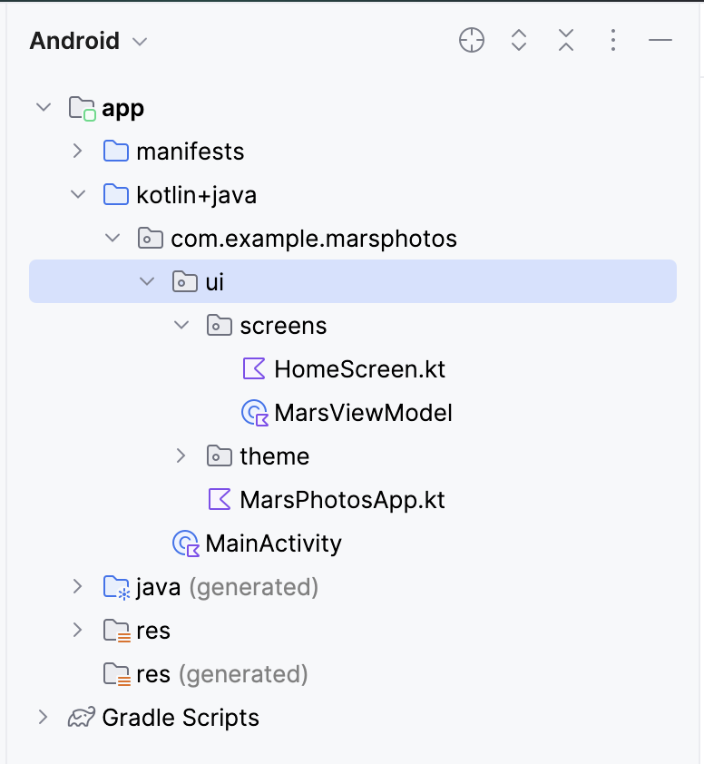

3. アプリを実行します。アプリをコンパイルして実行すると、プレースホルダ テキストが中央にある次のような画面が表示されます。このレッスンの最後では、このプレースホルダ テキストを更新して、取得した写真の数に置き換えます。

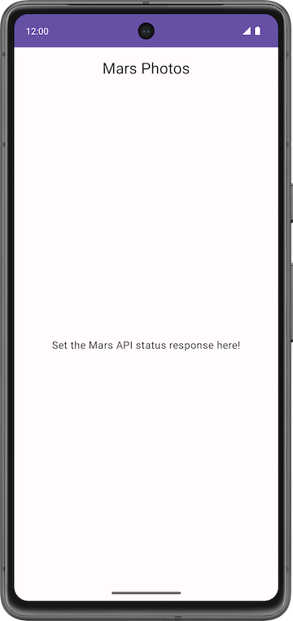

#### **スターター コードのチュートリアル**

ここでは、プロジェクトの構造を把握します。プロジェクトに含まれる重要なファイルとフォルダの説明を以下に示します。

`ui\MarsPhotosApp.kt`:

- このファイルには、コンポーザブル `MarsPhotosApp` が含まれています。このコンポーザブルは、トップ アプリバーや `HomeScreen` などのコンポーザブルのコンテンツを画面に表示します。前のステップのプレースホルダ テキストは、このコンポーザブルに表示されます。
- 次のレッスンでは、このコンポーザブルは Mars Photos バックエンド サーバーから受信したデータを表示します。

`screens\MarsViewModel.kt`:

- このファイルは、`MarsPhotosApp` に対応するビューモデルです。
- このクラスには、`marsUiState` という名前の `MutableState` プロパティが含まれています。このプロパティの値を更新すると、画面に表示されるプレースホルダ テキストが更新されます。
- `getMarsPhotos()` メソッドは、プレースホルダのレスポンスを更新します。このレッスンの後半では、このメソッドを使用して、サーバーから取得したデータを表示します。このレッスンの目標は、インターネットから取得したデータを使用して、`ViewModel` 内の `MutableState` を更新することです。

`screens\HomeScreen.kt`:

- このファイルには、`HomeScreen` コンポーザブルと `ResultScreen` コンポーザブルが含まれています。`ResultScreen` は、`Text` コンポーザブルに `marsUiState` の値を表示するシンプルな `Box` レイアウトを備えています。

`MainActivity.kt`:

- このアクティビティの唯一のタスクは、`ViewModel` を読み込んで `MarsPhotosApp` コンポーザブルを表示することです。

### 4. ウェブサービスの概要

このレッスンでは、バックエンド サーバーと通信して必要なデータを取得するネットワーク サービスのレイヤを作成します。このタスクを実装するため、[Retrofit](https://square.github.io/retrofit/) というサードパーティ ライブラリを使用します。詳細については後で説明します。`ViewModel` はデータレイヤと通信します。アプリの他の部分はこの実装に対して透過的です。

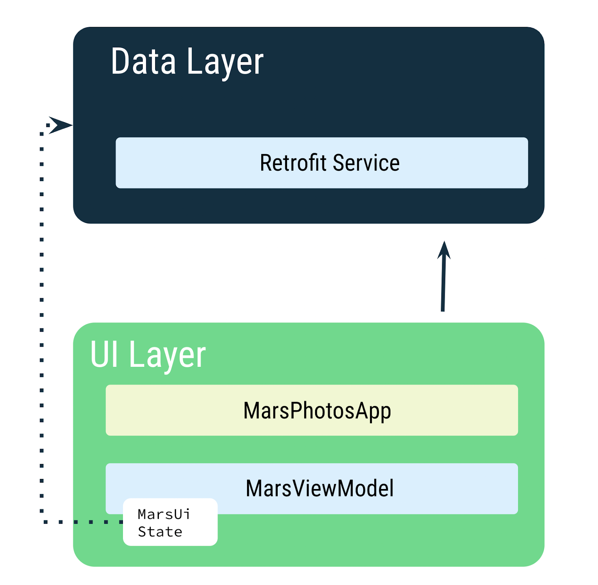

`MarsViewModel` は、火星写真データを取得するためにネットワーク呼び出しを行う役割を担います。`ViewModel` では、データが変更されたときに `MutableState` を使用してアプリの UI を更新します。

> **注**: 後のレッスンで、データレイヤにリポジトリを追加します。リポジトリは Retrofit サービスと通信してデータを取得します。リポジトリはアプリの他の部分にデータを公開します。

### 5. ウェブサービスと Retrofit

火星写真データはウェブサーバーに格納されています。このデータをアプリに取り込むには、インターネット上のサーバーとの接続を確立して通信する必要があります。

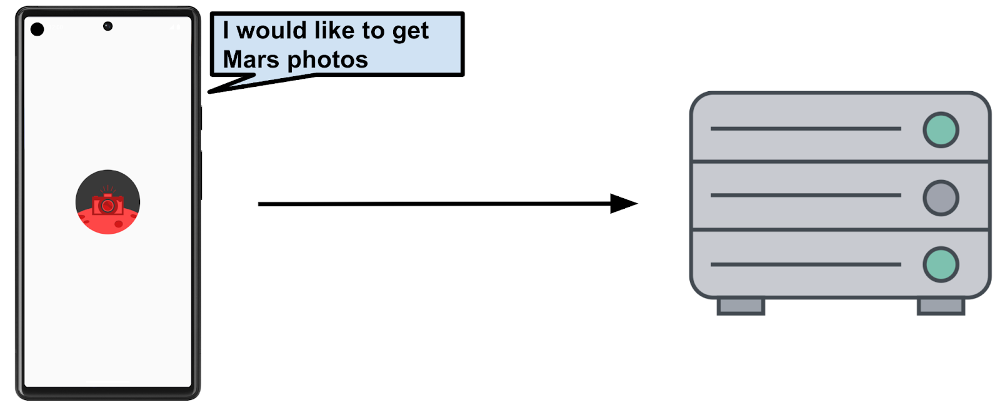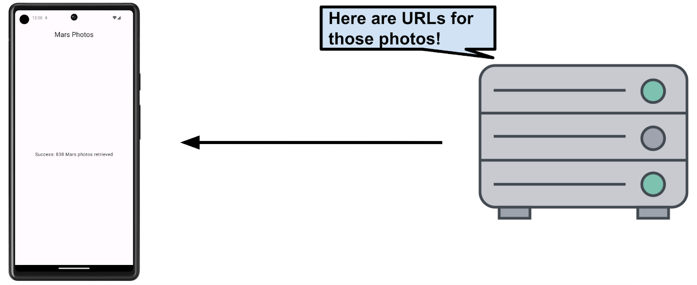

> **注**: このレッスンでは、火星の写真ではなくレコード（URL）の数だけを取得します。後のレッスンで、火星の写真を取得してグリッドに表示します。

今日の多くのウェブサーバーは、[REST](https://en.wikipedia.org/wiki/Representational_state_transfer) と呼ばれる一般的なステートレス ウェブ アーキテクチャを使用してウェブサービスを実行します。REST とは、**RE**presentational **S**tate **T**ransfer の略です。このアーキテクチャを提供するウェブサービスを、RESTful サービスと呼びます。

リクエストは、[Uniform Resource Identifier](https://en.wikipedia.org/wiki/Uniform_Resource_Identifier)（URI）を介して、標準化された方法で RESTful ウェブサービスに送信されます。URI は、サーバー内のリソースを、場所またはアクセス方法に関係なく、名前で識別します。たとえば、このレッスンのアプリでは、次のサーバー URI を使用して画像 URL を取得します（このサーバーは火星の不動産と火星の写真の両方をホストしています）。

[android-kotlin-fun-mars-server.appspot.com](https://android-kotlin-fun-mars-server.appspot.com)

> **注**: 上記のサーバーは、火星の不動産を紹介する別のサンプルアプリからもアクセスされます。そのため、このサーバーには 2 つの異なるエンドポイントがあります。1 つは火星の不動産用で、もう 1 つは写真用です。このコースでは、火星の写真を取得するためにこのサーバーを使用します。

URL（Uniform Resource Locator）は URI のサブセットであり、リソースが存在する場所とリソースを取得する仕組みを示します。

**例:**

次の URL は、利用可能な火星のすべての不動産物件のリストを取得します。

[https://android-kotlin-fun-mars-server.appspot.com/realestate](https://android-kotlin-fun-mars-server.appspot.com/realestate)

次の URL は、火星の写真のリストを取得します。

[https://android-kotlin-fun-mars-server.appspot.com/photos](https://android-kotlin-fun-mars-server.appspot.com/photos)

これらの URL は、ハイパーテキスト転送プロトコル（http:）を介してネットワークから取得できる特定のリソース（[/realestate](https://android-kotlin-fun-mars-server.appspot.com/realestate) や [/photos](https://android-kotlin-fun-mars-server.appspot.com/photos) など）を指します。このレッスンでは、[/photos](https://android-kotlin-fun-mars-server.appspot.com/photos) エンドポイントを使用します。エンドポイントとは、サーバー上で実行されるウェブサービスにアクセスできる URL です。

> **注**: 皆さんがよくご存じのウェブ URL は、実際には URI の一種です。このコースでは、URL と URI を同じ意味で使用します。

#### **ウェブサービス リクエスト**

個々のウェブサービス リクエストは URI を含んでおり、Chrome などのウェブブラウザで使用されるのと同じ HTTP プロトコルを介してサーバーに転送されます。HTTP リクエストには、サーバーに何をすべきかを伝えるオペレーションが含まれています。

一般的な HTTP オペレーションには次のようなものがあります。

- GET: サーバーデータを取得します。
- POST: サーバー上に新しいデータを作成します。
- PUT: サーバー上の既存のデータを更新します。
- DELETE: サーバーからデータを削除します。

アプリは火星の写真の情報を得るための HTTP GET リクエストをサーバーに送信し、サーバーはそれに応じて画像 URL を含むレスポンスをアプリに返します。

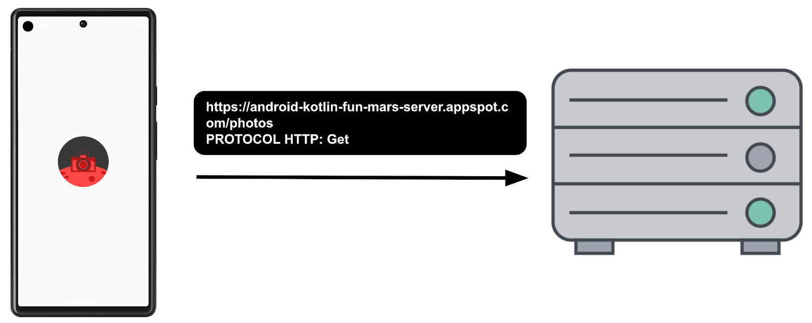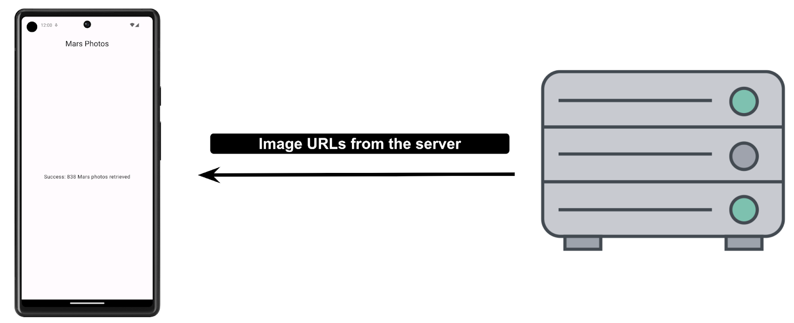

ウェブサービスからのレスポンスは、XML（eXtensible Markup Language）や JSON（JavaScript Object Notation）などの一般的なデータ形式のいずれかで書式設定されています。JSON 形式では、構造化データを Key-Value ペアで表現します。アプリは JSON を使用して REST API と通信します。JSON については、後のタスクで詳しく説明します。

このタスクでは、サーバーへのネットワーク接続を確立し、サーバーと通信して、JSON レスポンスを受信します。演習用にすでに作成されているバックエンド サーバーを使用します。このレッスンでは、サードパーティ ライブラリである Retrofit ライブラリを使用して、バックエンド サーバーと通信します。

##### **外部ライブラリ**

外部ライブラリ（つまりサードパーティ ライブラリ）は、コア Android API の拡張機能に似ています。このコースで使用するライブラリは、コミュニティによって開発されたオープンソースのライブラリで、全世界に広がる大規模な Android コミュニティの協力によってメンテナンスされています。これらのリソースは、Android デベロッパーが優れたアプリを開発するために役立ちます。

> **警告**: コミュニティで開発されてメンテナンスされているライブラリを利用すると、かなりの時間を節約できます。しかし、これらのライブラリに含まれるコードが何をするかについてはアプリが最終的な責任を負うことになるため、慎重にライブラリを選択する必要があります。

##### Retrofit ライブラリ

このレッスンで RESTful な Mars ウェブサービスと通信するために使用する Retrofit ライブラリは、適切なサポートとメンテナンスが行われているライブラリの良い例です。[GitHub](https://github.com/square/retrofit) ページにアクセスしてオープンされている問題とクローズされた問題（問題の中には機能リクエストもあります）をチェックすると、そのことがよくわかります。デベロッパーが継続的に問題を解決し、機能リクエストに対応している場合、ライブラリは適切にメンテナンスされていてアプリで使用する有力な候補になる可能性が高くなります。ライブラリについて詳しくは、[Retrofit](https://square.github.io/retrofit/) のドキュメントもご覧ください。

Retrofit ライブラリは REST バックエンドと通信します。このライブラリはコードを生成しますが、演習で渡すパラメータに基づいてウェブサービスの URI を指定する必要があります。このトピックについては、後で詳しく説明します。

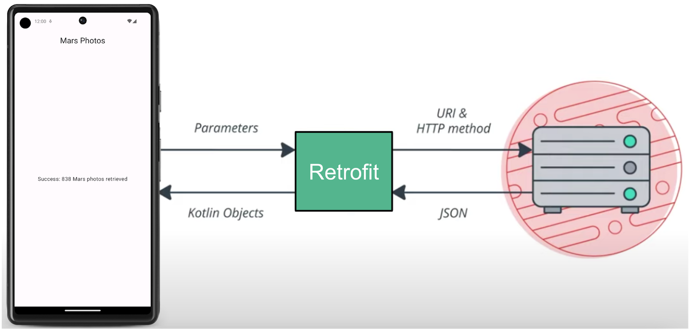

#### Retrofit の依存関係を追加する

Android Gradle を使用して、プロジェクトに外部ライブラリを追加できます。ライブラリの依存関係に加えて、ライブラリがホストされているリポジトリも含める必要があります。

1. モジュール レベルの Gradle ファイル `build.gradle.kts (Module :app)` を開きます。
2. `dependencies` セクションに、Retrofit ライブラリ用に以下の行を追加します。

```kotlin
// Retrofit 
implementation("com.squareup.retrofit2:retrofit:2.9.0")
// Retrofit with Scalar Converter
implementation("com.squareup.retrofit2:converter-scalars:2.9.0")
```

2 つのライブラリは連携して機能します。1 つ目の依存関係は Retrofit2 ライブラリ用で、2 つ目の依存関係は Retrofit スカラー コンバータ用です。Retrofit2 は Retrofit ライブラリの更新版です。このスカラー コンバータにより、Retrofit は JSON 結果を `String` として返すことができます。JSON は、データを保存してクライアントとサーバー間で転送するための形式です。JSON については後で学習します。

3. [**Sync Now**] をクリックして、新しい依存関係でプロジェクトを再ビルドします。

### 6. インターネットに接続する

Retrofit ライブラリを使用して、Mars ウェブサービスと通信し、未加工の JSON レスポンスを `String` として表示します。プレースホルダ `Text` は、返された JSON レスポンス文字列か、または接続エラーを示すメッセージを表示します。

Retrofit は、ウェブサービスからのコンテンツに基づいて、アプリ用のネットワーク API を作成します。ウェブサービスからデータを取得し、データのデコード方法を認識している別個のコンバータ ライブラリを経由して、`String` のようなオブジェクトの形式でデータを返します。Retrofit には、XML や JSON などのよく使用されるデータ形式のサポートが組み込まれています。最後に Retrofit は、このサービスを呼び出して使用するコードを作成します。コードには、重要な詳細情報（バックグラウンド スレッドでのリクエストの実行など）が含まれています。

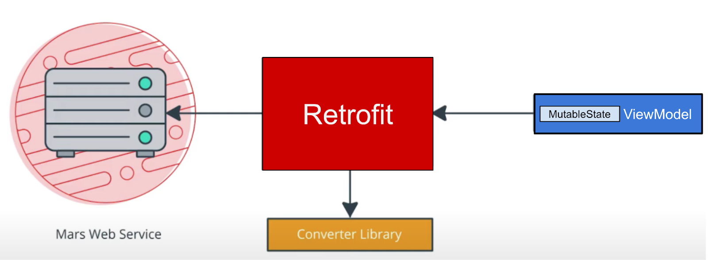

このタスクでは、`ViewModel` がウェブサービスとの通信に使用する **Mars Photos** プロジェクトにデータレイヤを追加します。Retrofit サービス API を実装するには、次の手順を実施します。

- データソースである `MarsApiService` クラスを作成します。
- ベース URL とコンバータ ファクトリを使用して、文字列を変換する Retrofit オブジェクトを作成します。
- Retrofit がウェブサーバーと通信する方法を記述するインターフェースを作成します。
- Retrofit サービスを作成し、API サービスのインスタンスをアプリの他の部分に公開します。

上記の手順を実装します。

1. Android プロジェクト ペインでパッケージ com.example.marsphotos を右クリックし、**[New] > [Package]** を選択します。
2. ポップアップで、提案されたパッケージ名の末尾に「**network**」を追加します。
3. 新しいパッケージの下に新しい Kotlin ファイルを作成し、`MarsApiService` という名前を付けます。
4. `network/MarsApiService.kt` を開きます。
5. ウェブサービスのベース URL を表す次の定数を追加します。

```kotlin
private const val BASE_URL = 
   "https://android-kotlin-fun-mars-server.appspot.com"
```

6. この定数のすぐ下に、Retrofit オブジェクトを作成するための Retrofit ビルダーを追加します。

```kotlin
import retrofit2.Retrofit

private val retrofit = Retrofit.Builder()
```

Retrofit は、ウェブサービスのベース URI と、ウェブサービス API を構築するためのコンバータ ファクトリを必要とします。コンバータは、ウェブサービスから返されたデータをどのように処理するかを Retrofit に伝えます。この演習では、Retrofit はウェブサービスから JSON レスポンスを取得し、`String` として返す必要があります。Retrofit には、文字列とその他のプリミティブ型をサポートする `ScalarsConverter` があります。

7. `ScalarsConverterFactory` のインスタンスを使用して、ビルダーで `addConverterFactory()` を呼び出します。

```kotlin
import retrofit2.converter.scalars.ScalarsConverterFactory

private val retrofit = Retrofit.Builder()
   .addConverterFactory(ScalarsConverterFactory.create())
```

8. `baseUrl()` メソッドを使用して、ウェブサービスのベース URL を追加します。
9. `build()` を呼び出して Retrofit オブジェクトを作成します。

```kotlin
private val retrofit = Retrofit.Builder()
   .addConverterFactory(ScalarsConverterFactory.create())
   .baseUrl(BASE_URL)
   .build()
```

10. Retrofit ビルダーに対する呼び出しの下に、`MarsApiService` という名前のインターフェースを定義します。このインターフェースで、Retrofit が HTTP リクエストを使用してウェブサーバーと通信する方法を定義します。

```kotlin
interface MarsApiService {
}
```

11. ウェブサービスからレスポンス文字列を取得するために、`getPhotos()` という名前の関数を `MarsApiService` インターフェースに追加します。

```kotlin
interface MarsApiService {    
    fun getPhotos()
}
```

12. これが GET リクエストであることを Retrofit に伝えるために `@GET` アノテーションを使用し、そのウェブサービス メソッド用のエンドポイントを指定します。この演習では、エンドポイントは `photos` です。前のタスクで説明したように、このレッスンでは [/photos](https://android-kotlin-fun-mars-server.appspot.com/photos) エンドポイントを使用します。

```kotlin
import retrofit2.http.GET

interface MarsApiService {
    @GET("photos") 
    fun getPhotos()
}
```

`getPhotos()` メソッドが呼び出されると、Retrofit はリクエストの開始に使用するベース URL（Retrofit ビルダーで定義した URL）の末尾にエンドポイント `photos` を追加します。

13. 関数の戻り値の型を `String` に追加します。

```kotlin
interface MarsApiService {
    @GET("photos") 
    fun getPhotos(): String
}
```

##### **オブジェクト宣言**

Kotlin では、シングルトン オブジェクトの宣言に[オブジェクト宣言](https://kotlinlang.org/docs/reference/object-declarations.html#object-declarations)を使用します。[シングルトン パターン](https://en.wikipedia.org/wiki/Singleton_pattern)を使用すると、オブジェクトのインスタンスが 1 つだけ作成され、そのオブジェクトへのグローバル アクセス ポイントが 1 つであることが保証されます。オブジェクトの初期化はスレッドセーフで、最初のアクセスの際に行われます。

オブジェクト宣言とそれに対するアクセスの例を次に示します。オブジェクト宣言では、常に `object` キーワードの後に名前を指定します。

**例:**

```kotlin
// Example for Object declaration, do not copy over

object SampleDataProvider {
    fun register(provider: SampleProvider) {
        // ...
    }
​
    // ...
}

// To refer to the object, use its name directly.
SampleDataProvider.register(...)
```

> **警告**: シングルトン パターンを使用する方法はおすすめしません。シングルトンは、（特にテストで）予測が難しいグローバルな状態を表します。オブジェクトは、その作成方法を記述するのではなく、必要な依存関係を定義する必要があります。
> 
> シングルトン パターンの代わりに[依存関係インジェクション](https://developer.android.com/training/dependency-injection)を使用します。依存関係インジェクションを実装する方法は後のレッスンで学ぶことができます。

Retrofit オブジェクトで `create()` 関数を呼び出すのは、メモリ、速度、パフォーマンスの点で高コストです。アプリに必要な Retrofit API サービスのインスタンスは 1 つだけであるため、オブジェクト宣言を使用してアプリの他の部分にサービスを公開します。

1. `MarsApiService` インターフェース宣言の外部で、`MarsApi` という公開オブジェクトを定義して Retrofit サービスを初期化します。このオブジェクトは、アプリの他の部分がアクセスできる公開シングルトン オブジェクトです。

```kotlin
object MarsApi {}
```

2. `MarsApi` オブジェクト宣言内に、遅延初期化される `MarsApiService` 型の Retrofit オブジェクト プロパティを `retrofitService` という名前で追加します。この遅延初期化により、プロパティが最初に使用されるときに初期化されるようにします。エラーはこの後のステップで修正するので、無視してください。

> **注**:「遅延初期化」は、不要な計算やその他のコンピューティング リソースの使用を回避するために、オブジェクトが実際に必要になるまでオブジェクトの作成を故意に遅らせるときに使用します。Kotlin では、遅延初期化の[高度なサポート](https://kotlinlang.org/docs/reference/delegated-properties.html#lazy)が提供されています。

```kotlin
object MarsApi {
    val retrofitService : MarsApiService by lazy {}
}
```

3. `MarsApiService` インターフェースで `retrofit.create()` メソッドを使用して、`retrofitService` 変数を初期化します。

```kotlin
object MarsApi {
    val retrofitService : MarsApiService by lazy { 
       retrofit.create(MarsApiService::class.java)
    }
}
```

以上で Retrofit のセットアップは完了です。アプリが `MarsApi.retrofitService` を呼び出すたびに、呼び出し元は、最初のアクセスで作成された `MarsApiService` を実装する同一のシングルトン Retrofit オブジェクトにアクセスします。次のタスクでは、実装した Retrofit オブジェクトを使用します。

#### MarsViewModel でウェブサービスを呼び出す

このステップでは、`getMarsPhotos()` メソッドを実装します。このメソッドは、REST サービスを呼び出して、返された JSON 文字列を処理します。

> **注**: おすすめのアプローチは、ウェブサービスをリポジトリから呼び出して、データレイヤをアプリの他の部分から分離することです。後のレッスンでは、アプリにリポジトリを追加します。

##### ViewModelScope

[`viewModelScope`](https://developer.android.com/topic/libraries/architecture/coroutines#viewmodelscope) は、アプリの `ViewModel` ごとに定義される組み込みコルーチン スコープです。このスコープ内で起動されたすべてのコルーチンは、`ViewModel` がクリアされると自動的にキャンセルされます。

`viewModelScope` を使用すると、コルーチンを起動して、バックグラウンドでウェブサービス リクエストを送信できます。`viewModelScope` は `ViewModel` に属しているため、アプリで構成の変更が発生してもリクエストは続行されます。

1. `MarsApiService.kt` ファイルで、`getPhotos()` を非同期にして呼び出し元のスレッドをブロックしないようにするため、suspend 関数にします。この関数は、[`viewModelScope`](https://developer.android.com/topic/libraries/architecture/coroutines#viewmodelscope) 内から呼び出すことができます。

```kotlin
@GET("photos")
suspend fun getPhotos(): String
```

2. `ui/screens/MarsViewModel.kt` ファイルを開きます。下にスクロールして `getMarsPhotos()` メソッドを表示します。ステータス レスポンスを `"Set the Mars API Response here!"` に設定する行を削除して、メソッド `getMarsPhotos()` を空にします。

```kotlin
private fun getMarsPhotos() {}
```

3. `getMarsPhotos()` 内で、`viewModelScope.launch` を使用してコルーチンを起動します。

```kotlin
import androidx.lifecycle.viewModelScope
import kotlinx.coroutines.launch

private fun getMarsPhotos() {
    viewModelScope.launch {}
}
```

4. `viewModelScope` 内で、シングルトン オブジェクト `MarsApi` を使用して、`retrofitService` インターフェースの `getPhotos()` メソッドを呼び出します。返されたレスポンスを、`listResult` という名前の `val` に保存します。

```kotlin
import com.example.marsphotos.network.MarsApi

viewModelScope.launch {
    val listResult = MarsApi.retrofitService.getPhotos()
}
```

5. バックエンド サーバーから受信した結果を `marsUiState` に割り当てます。`marsUiState` は、最新のウェブ リクエストのステータスを表す可変状態オブジェクトです。

```kotlin
val listResult = MarsApi.retrofitService.getPhotos()
marsUiState = listResult
```

6. アプリを実行します。アプリはすぐに閉じ、エラー ポップアップが表示される場合もあれば、表示されない場合もあります。これはアプリがクラッシュしたことを示しています。
7. Android Studio で [**Logcat**] タブをクリックし、ログ内に「`------- beginning of crash`」のような行で始まるエラーがあることを確認します。

```
    --------- beginning of crash
22803-22865/com.example.android.marsphotos E/AndroidRuntime: FATAL EXCEPTION: OkHttp Dispatcher
    Process: com.example.android.marsphotos, PID: 22803
    java.lang.SecurityException: Permission denied (missing INTERNET permission?)
...
```

このエラー メッセージは、アプリに `INTERNET` 権限がない可能性を示しています。次のタスクでは、この問題を解決するためにアプリにインターネット権限を追加する方法について説明します。

### 7. インターネット権限と例外処理を追加する

#### **Android の権限**

Android における権限の目的は、Android ユーザーのプライバシーを保護することです。Android アプリは、連絡先や通話履歴などの機密ユーザーデータと、カメラやインターネットなどの特定のシステム機能にアクセスする権限を宣言またはリクエストする必要があります。

アプリがインターネットにアクセスするには、`INTERNET` 権限が必要です。インターネットに接続すると、セキュリティ上の問題が生じるおそれがあります。そのため、アプリはデフォルトではインターネットに接続しません。アプリがインターネットにアクセスするには、その必要性を明示的に宣言する必要があります。この宣言は標準の権限と見なされます。Android の権限とその種類の詳細については、[Android での権限](https://developer.android.com/guide/topics/permissions/overview)をご覧ください。

このステップでは、`AndroidManifest.xml` ファイルに `<uses-permission>` タグを含めることにより、アプリが必要とする権限を宣言します。

1. `manifests/AndroidManifest.xml` を開きます。次の行を `<application>` タグの直前に追加します。

```kotlin
<uses-permission android:name="android.permission.INTERNET" />
```

2. アプリをコンパイルして再度実行します。

インターネット接続が確立されていれば、火星の写真に関するデータを含む JSON テキストが表示されます。画像レコードごとに `id` と `img_src` が繰り返されていることに注目してください。JSON 形式については、このレッスンで後ほど詳しく説明します。

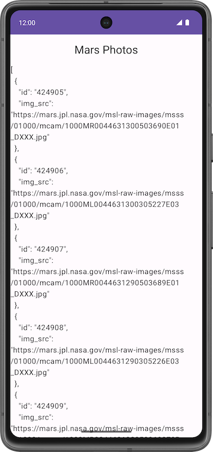

3. デバイスまたはエミュレータの**戻る**ボタンをタップして、アプリを閉じます。

#### **例外処理**

コードにはバグがあります。バグを表示するには、次の手順を実施します。

1. ネットワーク接続エラーをシミュレートするため、デバイスまたはエミュレータを機内モードにします。
2. 最近使ったアプリのメニューからアプリを再度開きます。または、Android Studio からアプリを実行します。
3. Android Studio で [**Logcat**] タブをクリックし、次のような致命的な例外がログに含まれていることを確認します。

```
3302-3302/com.example.android.marsphotos E/AndroidRuntime: FATAL EXCEPTION: main
    Process: com.example.android.marsphotos, PID: 3302
```

このエラー メッセージは、アプリが接続を試行してタイムアウトしたことを示しています。実際のインターネット接続では、このような例外はよく発生します。権限の問題とは異なり、この種のエラーを修正することはできませんが、処理することはできます。次のステップでは、このような例外を処理する方法を学びます。

##### **例外**

[例外](https://developer.android.com/reference/java/lang/Exception)とは、コンパイル時ではなく実行時に発生し、ユーザーへの通知なしに突然アプリを終了させるエラーです。例外はユーザー エクスペリエンスを低下させます。例外処理は、アプリが突然終了することを防ぎ、例外が発生する状況をユーザー フレンドリーな方法で処理するメカニズムす。

例外の原因には、ゼロ除算やネットワーク接続エラーなどの単純なものがあります。このような例外は、前のレッスンで説明した `IllegalArgumentException` と似ています。

サーバーへの接続時に発生する可能性のある問題の例を次に示します。

- API で使用されている URL または URI が正しくない。
- サーバーが利用できないため、アプリがサーバーに接続できなかった。
- ネットワーク レイテンシに問題がある。
- デバイスのインターネット接続が不十分だったか、接続がなかった。

これらの例外はコンパイル時には処理できませんが、実行時には `try-catch` ブロックを使用して処理できます。詳細な説明については、[例外](https://kotlinlang.org/docs/reference/exceptions.html)をご覧ください。

**try-catch ブロックの構文例**

```kotlin
try {
    // some code that can cause an exception.
}
catch (e: SomeException) {
    // handle the exception to avoid abrupt termination.
}
```

`try` ブロック内に、例外を予測したコードを追加します。このアプリでは、それはネットワーク呼び出しです。`catch` ブロック内に、アプリが突然終了することを防ぐコードを実装する必要があります。例外が発生した場合は、アプリを突然終了する代わりに、`catch` ブロックを実行してエラーからの回復処理を行います。

1. `getMarsPhotos()` の `launch` ブロック内で、例外を処理する `try` ブロックを追加して `MarsApi` 呼び出しを囲みます。
2. `try` ブロックの後に `catch` ブロックを追加します。

```kotlin
import java.io.IOException

viewModelScope.launch {
   try {
       val listResult = MarsApi.retrofitService.getPhotos()
       marsUiState = listResult
   } catch (e: IOException) {

   }
}
```

3. アプリを再度実行します。今回はアプリがクラッシュしません。

##### 状態 UI を追加する

`MarsViewModel` クラスでは、最新のウェブ リクエストのステータスである `marsUiState` が可変状態オブジェクトとして保存されます。しかし、このクラスには、読み込み、成功、失敗という別々のステータスを保存する機能がありません。

- **読み込み**ステータスは、アプリがデータを待機していることを示します。
- **成功**ステータスは、データがウェブサービスから正常に取得されたことを示します。
- **エラー** ステータスは、ネットワーク エラーまたは接続エラーを示します。

アプリでこれら 3 つの状態を表すには、シール インターフェースを使用します。`sealed interface` を使用すると、可能な値を制限することで、状態の管理が簡単になります。Mars Photos アプリでは、`marsUiState` ウェブ レスポンスを、読み込み、成功、エラーという 3 つの状態（データクラス オブジェクト）に制限しています。これは次のようなコードになります。

```kotlin
// No need to copy over
sealed interface MarsUiState {
   data class Success : MarsUiState
   data class Loading : MarsUiState
   data class Error : MarsUiState
}
```

上記のコード スニペットでは、レスポンスが成功したら、サーバーから火星の写真の情報を受け取ります。データを保存するには、`Success` データクラスにコンストラクタ パラメータを追加します。

`Loading` 状態と `Error` 状態の場合、新しいデータを設定して新しいオブジェクトを作成する必要はありません。単にウェブ レスポンスを渡すだけです。`data` クラスを `Object` に変更して、ウェブ レスポンスのオブジェクトを作成します。

1. `ui/MarsViewModel.kt` ファイルを開きます。import ステートメントの後に `MarsUiState` シール インターフェースを追加します。これにより、`MarsUiState` オブジェクトが網羅的な値を持つことができます。

```kotlin
sealed interface MarsUiState {
    data class Success(val photos: String) : MarsUiState
    object Error : MarsUiState
    object Loading : MarsUiState
}
```

2. `MarsViewModel` クラス内の `marsUiState` の定義を更新します。型を `MarsUiState` に変更し、そのデフォルト値を `MarsUiState.Loading` に設定します。`marsUiState` への書き込みを保護するため、セッターを非公開にします。

```kotlin
var marsUiState: MarsUiState by mutableStateOf(MarsUiState.Loading)
  private set
```

3. 下にスクロールして `getMarsPhotos()` メソッドを表示します。`marsUiState` の値を `MarsUiState.Success` に更新して `listResult` を渡します。

```kotlin
val listResult = MarsApi.retrofitService.getPhotos()
marsUiState = MarsUiState.Success(listResult)
```

4. `catch` ブロック内で、エラー レスポンスを処理します。`MarsUiState` を `Error` に設定します。

```kotlin
catch (e: IOException) {
   marsUiState = MarsUiState.Error
}
```

5. `marsUiState` の代入を `try-catch` ブロックの外に出すことができます。完成した関数のコードは次のようになります。

```kotlin
private fun getMarsPhotos() {
   viewModelScope.launch {
       marsUiState = try {
           val listResult = MarsApi.retrofitService.getPhotos()
           MarsUiState.Success(listResult)
       } catch (e: IOException) {
           MarsUiState.Error
       }
   }
}
```

6. `screens/HomeScreen.kt` ファイルで、`marsUiState` に `when` 式を追加します。`marsUiState` が `MarsUiState.Success` の場合は、`ResultScreen` を呼び出して `marsUiState.photos` を渡します。エラーはとりあえず無視してください。

```kotlin
import androidx.compose.foundation.layout.fillMaxWidth

fun HomeScreen(
   marsUiState: MarsUiState,
   modifier: Modifier = Modifier
) {
    when (marsUiState) {
        is MarsUiState.Success -> ResultScreen(
            marsUiState.photos, modifier = modifier.fillMaxWidth()
        )
    }
}
```

> **注**: `marsUiState` プロパティは文字列ではなくなり、`MarsUiState` シール インターフェースに変更されました。このインターフェースは、`MarsUiState.Loading`、`MarsUiState.Success`、`MarsUiState.Error` という 3 種類のオブジェクト値を持つことができます。

7. `when` ブロック内に、`MarsUiState.Loading` と `MarsUiState.Error` のチェックを追加します。アプリに `LoadingScreen`、`ResultScreen`、`ErrorScreen` の各コンポーザブルを表示させます。これらは後で実装します。

```kotlin
import androidx.compose.foundation.layout.fillMaxSize

fun HomeScreen(
   marsUiState: MarsUiState,
   modifier: Modifier = Modifier
) {
    when (marsUiState) {
        is MarsUiState.Loading -> LoadingScreen(modifier = modifier.fillMaxSize())
        is MarsUiState.Success -> ResultScreen(
            marsUiState.photos, modifier = modifier.fillMaxWidth()
        )

        is MarsUiState.Error -> ErrorScreen( modifier = modifier.fillMaxSize())
    }
}
```

> **注**: `sealed` キーワードを指定せずに `MarsUiState` `interface` を実装する場合は、Success、Error、Loading、および `else` ブランチを追加する必要があります。4 つ目のオプション（else）が存在しないため、`sealed` インターフェースを使用して、オプションが 3 つだけであることをコンパイラに知らせます（これにより、条件が網羅的になります）。

8. `res/drawable/loading_animation.xml` を開きます。このドローアブルは、中心点の周りで画像ドローアブル（`loading_img.xml`）が回転するアニメーションです（アニメーションはプレビューでは確認できません）。


9. `screens/HomeScreen.kt` ファイルの `HomeScreen` コンポーザブルの下に、次のコンポーズ可能な関数 `LoadingScreen` を追加して、読み込み中を表すアニメーションを表示します。`loading_img` ドローアブル リソースはスターター コードに含まれています。

```kotlin
import androidx.compose.ui.res.painterResource
import androidx.compose.ui.unit.dp
import androidx.compose.foundation.layout.size
import androidx.compose.foundation.Image

@Composable
fun LoadingScreen(modifier: Modifier = Modifier) {
    Image(
        modifier = modifier.size(200.dp),
        painter = painterResource(R.drawable.loading_img),
        contentDescription = stringResource(R.string.loading)
    )
}
```

10. `LoadingScreen` コンポーザブルの下に、次のコンポーズ可能な関数 `ErrorScreen` を追加して、アプリがエラー メッセージを表示できるようにします。

```kotlin
import androidx.compose.foundation.layout.Arrangement
import androidx.compose.foundation.layout.Column
import androidx.compose.foundation.layout.padding

@Composable
fun ErrorScreen(modifier: Modifier = Modifier) {
    Column(
        modifier = modifier,
        verticalArrangement = Arrangement.Center,
        horizontalAlignment = Alignment.CenterHorizontally
    ) {
        Image(
            painter = painterResource(id = R.drawable.ic_connection_error), contentDescription = ""
        )
        Text(text = stringResource(R.string.loading_failed), modifier = Modifier.padding(16.dp))
    }
}
```

11. 機内モードをオンにして、アプリを再度実行します。今回は、アプリは突然終了せず、次のエラー メッセージを表示します。

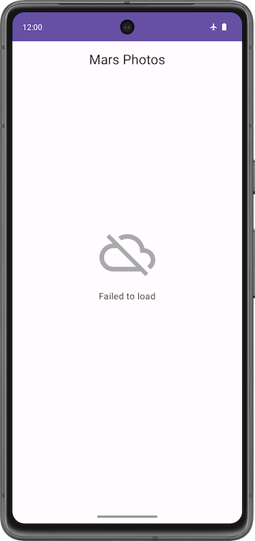

12. スマートフォンまたはエミュレータで機内モードをオフにします。アプリを実行してテストします。すべてが正しく動作し、JSON 文字列が表示されることを確認します。

| 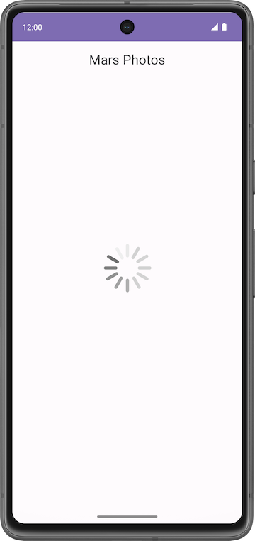 |  |
|---|---|

### 8. kotlinx.serialization を使用して JSON レスポンスを解析する

#### **JSON**

通常、リクエストしたデータは、XML や JSON などの一般的なデータ形式のいずれかで書式設定されます。個々の呼び出しは構造化データを返すので、アプリはレスポンスからデータを読み取るためにデータの構造を認識している必要があります。

たとえば、このアプリは、サーバー [https://](https://mars.udacity.com/realestate)[android-kotlin-fun-mars-server.appspot.com/photos](https://android-kotlin-fun-mars-server.appspot.com/photos) からデータを取得します。この URL をブラウザに入力すると、火星の地表の ID と画像 URL のリストが JSON 形式で表示されます。

##### **サンプル JSON レスポンスの構造**

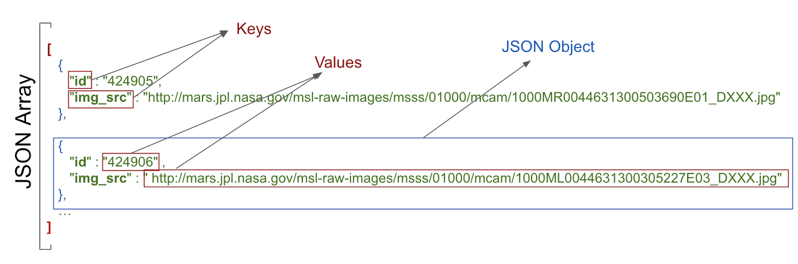

JSON レスポンスの構造には、以下の特徴があります。

- JSON レスポンスは角かっこで囲まれた配列です。配列には JSON オブジェクトが含まれています。
- JSON オブジェクトは中かっこで囲まれています。
- 各 JSON オブジェクトには、カンマで区切られた Key-Value ペアのセットが含まれています。
- ペアのキーと値はコロンで区切られています。
- 名前は引用符で囲まれています。
- 値は、数値、文字列、ブール値、配列、オブジェクト（JSON オブジェクト）、null のいずれかです。

たとえば、`img_src` は URL で、文字列です。この URL をウェブブラウザに貼り付けると、火星の地表の画像が表示されます。


このアプリでは、現在 Mars ウェブサービスから JSON レスポンスを取得しています。これはスタートとしては上々です。しかし、画像を表示するために実際に必要なのは Kotlin オブジェクトであり、長い JSON 文字列ではありません。このプロセスは「シリアル化解除」と呼ばれます。

[「シリアル化」](https://kotlinlang.org/docs/serialization.html)は、アプリによって使用されるデータを、ネットワーク経由で転送できる形式に変換するプロセスです。「シリアル化解除」は、「シリアル化」とは反対に、外部ソース（サーバーなど）からデータを読み取ってランタイム オブジェクトに変換するプロセスです。これらは両方とも、ネットワーク経由でデータを交換するアプリのほとんどに不可欠なコンポーネントです。

`kotlinx.serialization` は、JSON 文字列を Kotlin オブジェクトに変換するライブラリ セットを備えています。コミュニティで開発されたサードパーティ ライブラリとして、Retrofit と連携する [Kotlin Serialization Converter](https://github.com/JakeWharton/retrofit2-kotlinx-serialization-converter#kotlin-serialization-converter) があります。

このタスクでは、`kotlinx.serialization` ライブラリを使用して、ウェブサービスからの JSON レスポンスを解析し、火星の写真を表す有用な Kotlin オブジェクトに変換します。アプリを変更して、未加工の JSON を表示する代わりに、返された火星の写真の数を表示するようにします。

#### `kotlinx.serialization` ライブラリの依存関係を追加する

1. `build.gradle.kts (Module :app)` を開きます。
2. `plugins` ブロックに `kotlinx serialization` プラグインを追加します。

```kotlin
id("org.jetbrains.kotlin.plugin.serialization") version "1.8.10"
```

3. `dependencies` セクションで、`kotlinx.serialization` の依存関係を含めるために次のコードを追加します。この依存関係により、Kotlin プロジェクトで JSON シリアル化が可能になります。

```kotlin
// Kotlin serialization 
implementation("org.jetbrains.kotlinx:kotlinx-serialization-json:1.5.1")
```

4. `dependencies` ブロックで Retrofit スカラー コンバータの行を見つけて、`kotlinx-serialization-converter` を使用するように変更します。

**変更前のコード**

```kotlin
// Retrofit with scalar Converter
implementation("com.squareup.retrofit2:converter-scalars:2.9.0")
```

**変更後のコード**

```kotlin
// Retrofit with Kotlin serialization Converter

implementation("com.jakewharton.retrofit:retrofit2-kotlinx-serialization-converter:1.0.0")
implementation("com.squareup.okhttp3:okhttp:4.11.0")
```

5. [**Sync Now**] をクリックして、新しい依存関係でプロジェクトを再ビルドします。

> **注:** プロジェクトは、削除した Retrofit スカラー依存関係に関連するコンパイラ エラーを表示することがあります。こうしたエラーの修正は、これ以降のステップで行います。

#### **MarsPhoto データクラスを実装する**

ウェブサービスから取得した JSON レスポンスのサンプル エントリは、先ほど示した例と同様で、次のようになります。

```kotlin
[
    {
        "id":"424906",
        "img_src":"http://mars.jpl.nasa.gov/msl-raw-images/msss/01000/mcam/1000ML0044631300305227E03_DXXX.jpg"
    },
...]
```

上記の例では、個々の火星写真エントリに次の JSON 形式の Key-Value ペアが含まれています。

- **`id`****:** プロパティの ID（文字列）。引用符（`" "`）でラップされているため、型は `Integer` ではなく `String` です。
- **`img_src`****:** 画像の URL（文字列）。

kotlinx.serialization は、この JSON データを解析して Kotlin オブジェクトに変換します。そのためには、解析結果を格納する Kotlin データクラスが kotlinx.serialization に存在する必要があります。このステップでは、データクラス `MarsPhoto` を作成します。

1. **network** パッケージを右クリックして、**[New] > [Kotlin File/Class]** を選択します。
2. ダイアログで [**Class**] を選択し、クラスの名前として「`MarsPhoto`」と入力します。この操作により、`MarsPhoto.kt` という名前の新しいファイルが `network` パッケージに作成されます。
3. クラス定義の前に `data` キーワードを追加して、`MarsPhoto` をデータクラスにします。
4. 中かっこ `{}` をかっこ `()` に変更します。データクラスには少なくとも 1 つのプロパティが定義されている必要があるため、この変更を行うとエラーになります。

```kotlin
data class MarsPhoto()
```

5. 次のプロパティを `MarsPhoto` クラス定義に追加します。

```kotlin
data class MarsPhoto(
    val id: String,  val img_src: String
)
```

6. `MarsPhoto` クラスをシリアル化可能にするため、`@Serializable` アノテーションを付けます。

```kotlin
import kotlinx.serialization.Serializable

@Serializable
data class MarsPhoto(
    val id: String,  val img_src: String
)
```

`MarsPhoto` クラスの変数はそれぞれ JSON オブジェクトのキー名に対応することに注目してください。特定の JSON レスポンスに含まれる型をマッチングするには、すべての値に対して `String` オブジェクトを使用します。

`kotlinx serialization` は、JSON を解析して名前でキーをマッチングし、データ オブジェクトに適切な値を入力します。

##### **@SerialName アノテーション**

JSON レスポンスのキー名に対応する Kotlin プロパティがわかりづらい場合や、推奨されるコーディング スタイルと一致しない場合があります。たとえば、JSON ファイルでは `img_src` キーにアンダースコアを使用しますが、プロパティに関する Kotlin の命名規則では大文字と小文字（キャメルケース）を使用します。

JSON レスポンスのキー名と異なる変数名をデータクラスで使用するには、`@SerialName` アノテーションを使用します。次の例では、データクラスの変数名は `imgSrc` です。`@SerialName(value = "img_src")` を使用して、変数を JSON 属性 `img_src` にマッピングできます。

1. `img_src` キーの行を下記の行に置き換えます。

```kotlin
import kotlinx.serialization.SerialName

@SerialName(value = "img_src") 
val imgSrc: String
```

#### MarsApiService と MarsViewModel を更新する

このタスクでは、`kotlinx.serialization` コンバータを使用して、JSON オブジェクトを Kotlin オブジェクトに変換します。

1. `network/MarsApiService.kt` を開きます。
2. `ScalarsConverterFactory` の未解決の参照エラーに注目してください。これらのエラーの原因は、前のセクションで行った Retrofit の依存関係の変更です。
3. `ScalarConverterFactory` のインポートを削除します。その他のエラーは後で修正します。

**削除する行:**

```kotlin
import retrofit2.converter.scalars.ScalarsConverterFactory
```

4. *`retrofit`* オブジェクト宣言で、`ScalarConverterFactory` の代わりに `kotlinx.serialization` を使用するように Retrofit ビルダーを変更します。

```kotlin
import com.jakewharton.retrofit2.converter.kotlinx.serialization.asConverterFactory
import kotlinx.serialization.json.Json
import okhttp3.MediaType

private val retrofit = Retrofit.Builder()
        .addConverterFactory(Json.asConverterFactory("application/json".toMediaType()))
        .baseUrl(BASE_URL)
        .build()
```

> **注**: Android Studio に `kotlinx.serialization.ExperimentalSerializationApi` に関する警告が表示された場合は、とりあえず無視してください。この警告については気にする必要はありません。これは Kotlin の今後のバージョンで解決される予定です。
> 
> 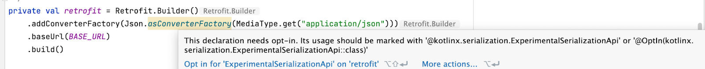

これで `kotlinx.serialization` の配置が済んだので、Retrofit に対し、JSON 文字列を返すのではなく JSON 配列から `MarsPhoto` オブジェクトのリストを返すようリクエストできます。

5. `String` を返す代わりに `MarsPhoto` オブジェクトのリストを返すように、Retrofit の `MarsApiService` インターフェースを更新します。

```kotlin
interface MarsApiService {
    @GET("photos")
    suspend fun getPhotos(): List<MarsPhoto>
}
```

6. `viewModel` に同様の変更を加えます。`MarsViewModel.kt` を開き、下にスクロールして `getMarsPhotos()` メソッドを表示します。

`getMarsPhotos()` メソッドの `listResult` が `List<MarsPhoto>` になり、`String` ではなくなりました。このリストのサイズは、受信されて解析された写真の数です。

7. 取得された写真の数を出力するため、`marsUiState` を次のように更新します。

```kotlin
val listResult = MarsApi.retrofitService.getPhotos()
marsUiState = MarsUiState.Success(
   "Success: ${listResult.size} Mars photos retrieved"
)
```

8. デバイスまたはエミュレータで機内モードがオフになっていることを確認します。アプリをコンパイルして実行します。

今回は、長い JSON 文字列ではなく、ウェブサービスから返されたプロパティの数を示すメッセージが表示されます。


> **注:** インターネット接続がうまくいかない場合は、デバイスまたはエミュレータで機内モードがオフになっていることを確認してください。

### 9. 解答コード

このレッスンの完成したコードをダウンロードするには、以下の git コマンドを使用します。

```
$ git clone https://github.com/google-developer-training/basic-android-kotlin-compose-training-mars-photos.git
$ cd basic-android-kotlin-compose-training-mars-photos
$ git checkout repo-starter
```

または、リポジトリを ZIP ファイルとしてダウンロードし、Android Studio で開くこともできます。

> **注:**解答コードは、ダウンロードしたリポジトリの `repo-starter` ブランチにあります。

このレッスンの解答コードを確認する場合は、[GitHub](https://github.com/google-developer-training/basic-android-kotlin-compose-training-mars-photos/tree/repo-starter) で表示します。

### 10. 概要

#### まとめ

##### **REST ウェブサービス**

- ウェブサービスは、インターネット経由で提供されるソフトウェア ベースの機能です。アプリはウェブサービスにリクエストを送信することにより、データを取得できます。
- 一般的なウェブサービスは [REST](https://en.wikipedia.org/wiki/Representational_state_transfer) アーキテクチャを使用します。REST アーキテクチャを提供するウェブサービスを RESTful*RESTful* サービスと呼びます。RESTful ウェブサービスは、標準のウェブ コンポーネントとプロトコルを使用して構築されます。
- REST ウェブサービスへのリクエストは、URI を介する標準的な方法で行います。
- アプリでウェブサービスを使用するには、ネットワーク接続を確立してサービスと通信する必要があります。アプリは、レスポンス データを受信して解析し、アプリが使用できる形式に変換する必要があります。
- [Retrofit](https://square.github.io/retrofit/) ライブラリは、アプリが REST ウェブサービスにリクエストを送信することを可能にするクライアント ライブラリです。
- コンバータを使用して、ウェブサービスに送信するデータとウェブサービスから返されたデータをどのように処理するかを Retrofit に伝えます。たとえば、`ScalarsConverter` は、ウェブサービスのデータを `String` またはその他のプリミティブとして扱います。
- アプリがインターネットに接続できるようにするには、Android マニフェストに `"android.permission.INTERNET"` 権限を追加します。
- 遅延初期化では、オブジェクトの作成がそのオブジェクトが初めて使用されるときまで遅延されます。参照は作成されますが、オブジェクトは作成されません。オブジェクトが初めてアクセスされたときに参照が作成され、その後アクセスされるたびに使用されます。

##### **JSON 解析**

- 多くの場合、ウェブサービスからのレスポンスは、構造化データを表す一般的な形式である [JSON](https://www.json.org/) で書式設定されます。
- JSON オブジェクトは Key-Value ペアのコレクションです。
- JSON オブジェクトのコレクションは JSON 配列です。ウェブサービスからのレスポンスは JSON 配列として取得されます。
- Key-Value ペアのキーは引用符で囲まれています。値は数値または文字列です。
- Kotlin では、別個のコンポーネントである [*kotlinx.serialization*](https://github.com/Kotlin/kotlinx.serialization) でデータのシリアル化ツールを使用できます。*kotlinx.serialization* は、JSON 文字列を Kotlin オブジェクトに変換するライブラリのセットを備えています。
- コミュニティで開発された Retrofit 用の Kotlin Serialization Converter ライブラリとして、[retrofit2-kotlinx-serialization-converter](https://github.com/JakeWharton/retrofit2-kotlinx-serialization-converter#kotlin-serialization-converter) があります。
- *kotlinx.serialization*kotlinx.serialization は、JSON レスポンスのキーを、同じ名前を持つデータ オブジェクトのプロパティとマッチングします。
- 異なるプロパティ名をキーで使用するには、そのプロパティに `@SerialName` アノテーションを付けて JSON キー `value` を指定します。

### 11. 詳細

#### 関連リンク

Android デベロッパー ドキュメント:

- [アプリ アーキテクチャ ガイド | Android デベロッパー](https://developer.android.com/topic/architecture)
- [ViewModel の概要](https://developer.android.com/topic/libraries/architecture/viewmodel)
- [ViewModelScope](https://developer.android.com/topic/libraries/architecture/coroutines#viewmodelscope)

Kotlin ドキュメント:

- [例外: try、catch、finally、throw、Nothing](https://kotlinlang.org/docs/reference/exceptions.html)
- [コルーチン（公式ドキュメント）](https://kotlinlang.org/docs/reference/coroutines-overview.html)
- [コルーチンのコンテキストとディスパッチャ](https://kotlinlang.org/docs/reference/coroutines/coroutine-context-and-dispatchers.html)
- [シリアル化 | Kotlin](https://kotlinlang.org/docs/serialization.html#0)

その他:

- [Retrofit](https://square.github.io/retrofit/)
- [Kotlin シリアル化用の Retrofit 2 Converter.Factory](https://github.com/JakeWharton/retrofit2-kotlinx-serialization-converter)

## 6. つまずきやすいポイント

- 通信が失敗するときは、`AndroidManifest.xml` の `INTERNET` パーミッションと URL のタイプミスを最初に確認しましょう。
- 「Loading / Success / Error」を `sealed interface` で表す書き方は、実務でもそのまま使えます。

## 7. AIに質問する（この章の例）

次の例をそのままAIに投げてOKです（必要なら自分のコード/エラーに置き換えてください）。

```text
「コルーチンの `launch` `async` `suspend` の違いを、日常のたとえ話つきで説明して」
「Retrofit で通信すると失敗する。`INTERNET` パーミッション、URL、シリアライズの順で切り分ける確認質問をして（エラー全文: ここに貼る）」
「Loading / Success / Error を `sealed interface` で表す理由と、UI 側での分岐の書き方を説明して」
```

質問がまとまらないときは、第0章の「質問テンプレ」を使ってください。

## 8. 提出物

次のレッスンで完成させた Android Studio プロジェクトを、学習用リポジトリの `unit5/MarsPhotos/` に置きます（プロジェクトフォルダごとコピー。`build/` と `.idea/` は含めない）。

- インターネットからデータを取得する

PR 本文には次の 3 点を書いてください。

- **やったこと**：どのレッスン / 演習を完了したか
- **動作確認**：どの端末（エミュレータ名 or 実機）で何を確認したか
- **詰まった点と解決**：エラーの内容と、どう直したか（AI に聞いた内容も可）

## 9. チェックリスト

- [ ] コルーチン（`launch` / `async` / `suspend`）の基本を説明できる
- [ ] Retrofit と kotlinx.serialization で REST API から JSON を取得できる
- [ ] 通信中・成功・失敗の 3 状態を UI に反映できる
- [ ] 各レッスンの「まとめ」にある用語を自分の言葉で説明できる
- [ ] 提出物が `unit5/MarsPhotos/` にあり、Android Studio（または Kotlin Playground）で開いて動く

---

## 課題提出

この章には提出課題があります。

1. 上記の提出物を完了する
2. GitHub で `feature/05-get-data-internet` ブランチを作成し、`develop` へのPRを作成（base=`develop`）
3. [AIプログラムレビュー](https://ai.studio/apps/84d224cb-7de1-44fb-995b-9a5917d25603?fullscreenApplet=true) を実行
4. 問題がなければ、進捗ダッシュボードで **PR URL** と **完了日** を記録
