# 第14章: インターネットから画像を読み込んで表示する

> ユニット 5「インターネットに接続する」 パスウェイ 2
> 提出ブランチ: `feature/05-load-images`

## 1. この章のゴール

- Repository パターンでデータ取得を UI から分離できる
- 手動の依存関係注入（`AppContainer`）を説明できる
- Coil で URL から画像を読み込んで表示できる

## 2. 進め方

次の内容を **上から順番に** 進めます。「やらなくてOK」の行は飛ばして構いません。レッスンの本文はこのページの下にすべて掲載しています。目安時間の合計は約405分です。

| # | 種類 | 内容 | 目安 | 備考 |
|---|---|---|---|---|
| 1 | レッスン | リポジトリと手動依存関係挿入を追加する | 約120分 |  |
| 2 | レッスン | インターネットから画像を読み込んで表示する | 約90分 |  |
| 3 | レッスン | 練習: Amphibians アプリを作成する | 約180分 | **提出対象** |
| 4 | レッスン | プロジェクト: Bookshelf アプリの作成 | — | **やらなくてOK**（学習効果に対して難易度・工数が高い） |
| 5 | クイズ | [テスト: 画像を読み込んで表示する](https://developer.android.com/courses/quizzes/android-basics-compose-unit-5-pathway-2/android-basics-compose-unit-5-pathway-2?hl=ja) | 約15分 | 公式サイトで受ける |

このプログラムの進め方は次の通りです。

1. 下の各レッスンを読み、各ステップの説明を理解してから **自分でコードを打つ**（コピペで済ませない）
2. ステップごとにアプリを実行し、期待どおり動くか確認する
3. 動かないときは、エラー文をそのまま AI に貼って「何が原因か」を聞き、直したら **なぜ直ったか** をメモする
4. 末尾のクイズを受けて、間違えた項目をレッスンで読み直す

> レッスン本文は Google Developers の公式コンテンツ（CC BY 4.0）を日本語のまま転載しています。画面が最新の Android Studio と異なる場合があります。

## 3. リポジトリと手動依存関係挿入を追加する


### 1. 始める前に

#### **はじめに**

前のレッスンでは、`ViewModel` を通じて API サービスを使用してネットワークから火星写真の URL を取得することで、ウェブサービスからデータを取得する方法を学習しました。この方法は効果的で簡単に実装できますが、アプリの成長に合わせてうまく拡張することができず、複数のデータソースと連携する必要があります。この問題に対処するため、Android アーキテクチャのベスト プラクティスでは、UI レイヤとデータレイヤを分離することをおすすめします。

このレッスンでは、**Mars Photos** アプリを UI レイヤとデータレイヤに別々にリファクタリングします。リポジトリ パターンを実装し、依存関係インジェクションを使用する方法を学びます。依存関係インジェクションを使用して、開発とテストに役立つ、より柔軟なコーディング構造を作成します。

#### **前提条件**

- REST ウェブサービスから JSON を取得する能力と、[Retrofit](https://square.github.io/retrofit/) ライブラリおよび [シリアル化（kotlinx.serialization）](https://kotlinlang.org/docs/serialization.html)ライブラリを使用してそのデータを解析し、Kotlin オブジェクトに変換する能力
- [REST](https://en.wikipedia.org/wiki/Representational_state_transfer) ウェブサービスの使用方法に関する知識
- アプリにコルーチンを実装する能力

#### **学習内容**

- リポジトリ パターン
- 依存関係インジェクション

#### **作成するアプリの概要**

- UI レイヤとデータレイヤに分離されるよう **Mars Photos** アプリを変更する。
- データレイヤを分離しつつ、リポジトリ パターンを実装する。
- 依存関係インジェクションを使用して、疎結合のコードベースを作成する。

#### **必要なもの**

- 最新のウェブブラウザ（[Chrome](https://www.google.com/chrome/) の最新バージョンなど）を搭載したパソコン

#### スターター コードを取得する

まず、スターター コードをダウンロードします。

または、GitHub リポジトリのクローンを作成してコードを入手することもできます。

```
$ git clone https://github.com/google-developer-training/basic-android-kotlin-compose-training-mars-photos.git
$ cd basic-android-kotlin-compose-training-mars-photos
$ git checkout repo-starter
```

> **注:**スターター コードは、クローンを作成したリポジトリの `repo-starter` ブランチにあります。

コードは [`Mars Photos`](https://github.com/google-developer-training/basic-android-kotlin-compose-training-mars-photos/tree/repo-starter) GitHub リポジトリで確認できます。

### 2. UI レイヤとデータレイヤを分離する

#### **レイヤを分離する理由**

コードを異なるレイヤに分割することで、アプリのスケーラビリティと堅牢性を高め、テストを容易にできます。境界が明確に定義された複数のレイヤを使用することで、複数のデベロッパーは、互いに悪影響を及ぼすことなく同じアプリ上で作業することが容易になります。

[Android の推奨アプリ アーキテクチャ](https://developer.android.com/topic/architecture#recommended-app-arch)によれば、アプリには少なくとも UI レイヤとデータレイヤがあるべきです。

このレッスンでは、データレイヤーに焦点を当て、推奨されるベスト プラクティスに従うようアプリに変更を加えます。

#### **データレイヤーとは**

データレイヤーは、アプリのビジネス ロジックの処理と、アプリのデータの収集と保存を担当します。データレイヤは、[単方向データフロー](https://developer.android.com/topic/architecture#unidirectional-data-flow) パターンを使用して、UI レイヤにデータを公開します。データは、ネットワーク リクエスト、ローカル データベースなどの複数のソースや、デバイス上のファイルから取得される場合があります。

アプリに複数のデータソースがある場合もあります。アプリを開くと、デバイス上のローカル データベース（最初のソース）からデータが取得されます。アプリの実行中に、新しいデータの取得のために 2 番目のソースにネットワーク リクエストが発行されます。

データを UI コードとは別のレイヤに置くことで、コードの一部を変更でき、他の部分に影響を与えることがありません。この方法は、[関心の分離](https://en.wikipedia.org/wiki/Separation_of_concerns)と呼ばれる設計原則の一部です。コードの一部は、それ自体の関心に焦点を当て、内部動作を他のコードから分離してカプセル化します。カプセル化とは、コードの内部動作をコードの他の部分から隠す形式です。コードの 1 つのセクションが別のコードのセクションとやり取りする必要がある場合、カプセル化はインターフェースを介して行われます。

UI レイヤの関心は、提供されたデータを表示することです。データはデータレイヤの関心であるため、UI はデータを取得しなくなります。

データレイヤは、1 つ以上のリポジトリで構成されています。リポジトリ自体には、0 個以上のデータソースが含まれています。

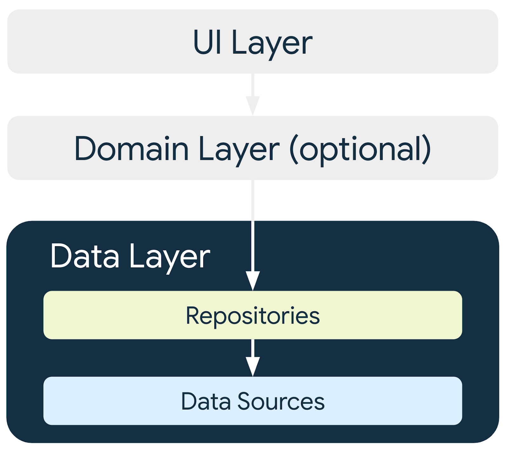

ベスト プラクティスとして、アプリで使用するデータソースのタイプごとにリポジトリを提供する必要があります。

このレッスンでは、アプリに 1 つのデータソースがあるため、コードをリファクタリングした後でアプリに 1 つのリポジトリが作成されます。このアプリの場合、インターネットからデータを取得するリポジトリが、データソースの役割を果たします。これは、API に対するネットワーク リクエストによって行われます。データソースのコーディングがより複雑になるか、新しいデータソースが追加される場合、データソースの責任はさまざまなデータソース クラスにカプセル化され、リポジトリはすべてのデータソースの管理を担当します。

##### **リポジトリとは**

リポジトリ クラスには通常、次のような役割があります。

- アプリの他の部分にデータを公開する。
- データの変更を一元管理する。
- 複数のデータソース間の競合を解決する。
- アプリの他の部分からデータソースを抽象化する。
- ビジネス ロジックを含む。

**Mars Photos** アプリには、ネットワーク API 呼び出しという 1 つのデータソースがあります。このアプリはデータを取得するだけなので、ビジネス ロジックを含みません。データはリポジトリ クラスを介してアプリに公開され、リポジトリ クラスはデータのソースを抽象化します。

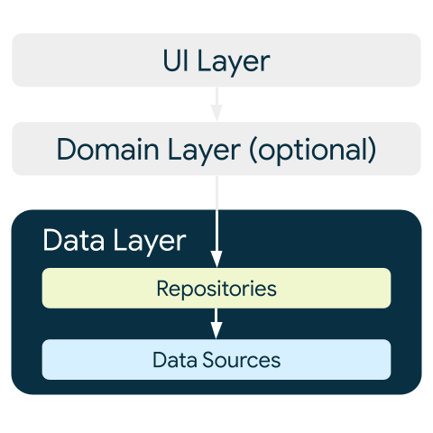

### 3. データレイヤを作成する

まず、リポジトリ クラスを作成する必要があります。Android デベロッパー ガイドには、リポジトリ クラスの名前は、担当するデータに基づいて付けられると記載されています。[リポジトリの命名規則](https://developer.android.com/topic/architecture/data-layer#naming-conventions)は、「データのタイプ + リポジトリ」です。このアプリの場合は `MarsPhotosRepository` になります。

#### **リポジトリを作成する**

1. [**com.example.marsphotos**] を右クリックして **[New] > [Package]** を選択します。
2. ダイアログで「`data`」と入力します。
3. `data` パッケージを右クリックして、**[New] > [Kotlin Class/File]** を選択します。
4. ダイアログで [**Interface**] を選択し、インターフェースの名前として「`MarsPhotosRepository`」と入力します。
5. `MarsPhotosRepository` インターフェース内に `getMarsPhotos()` という抽象関数を追加します。この関数は `MarsPhoto` オブジェクトのリストを返します。呼び出しはコルーチンから行われるため、宣言には `suspend` を使用します。

```kotlin
import com.example.marsphotos.model.MarsPhoto

interface MarsPhotosRepository {
    suspend fun getMarsPhotos(): List<MarsPhoto>
}
```

6. インターフェース宣言の下に、`NetworkMarsPhotosRepository` という名前のクラスを作成して `MarsPhotosRepository` インターフェースを実装します。
7. インターフェース `MarsPhotosRepository` をクラス宣言に追加します。

インターフェースの抽象メソッドをオーバーライドしていなかったため、エラー メッセージが表示されます。次の手順でこのエラーを解消します。

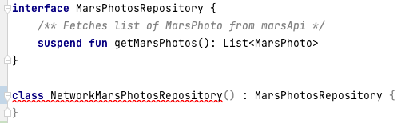

8. `NetworkMarsPhotosRepository` クラス内で、抽象関数 `getMarsPhotos()` をオーバーライドします。この関数は、`MarsApi.retrofitService.getPhotos()` の呼び出しでデータを返します。

```kotlin
import com.example.marsphotos.network.MarsApi

class NetworkMarsPhotosRepository() : MarsPhotosRepository {
   override suspend fun getMarsPhotos(): List<MarsPhoto> {
       return MarsApi.retrofitService.getPhotos()
   }
}
```

次に、Android のベスト プラクティスで推奨されているように、リポジトリを使用してデータを取得するように `ViewModel` コードを更新する必要があります。

9. `ui/screens/MarsViewModel.kt` ファイルを開きます。
10. 下にスクロールして `getMarsPhotos()` メソッドを表示します。
11. 「`val listResult = MarsApi.retrofitService.getPhotos()`」という行を次のコードで置き換えます。

```kotlin
import com.example.marsphotos.data.NetworkMarsPhotosRepository

val marsPhotosRepository = NetworkMarsPhotosRepository()
val listResult = marsPhotosRepository.getMarsPhotos()
```

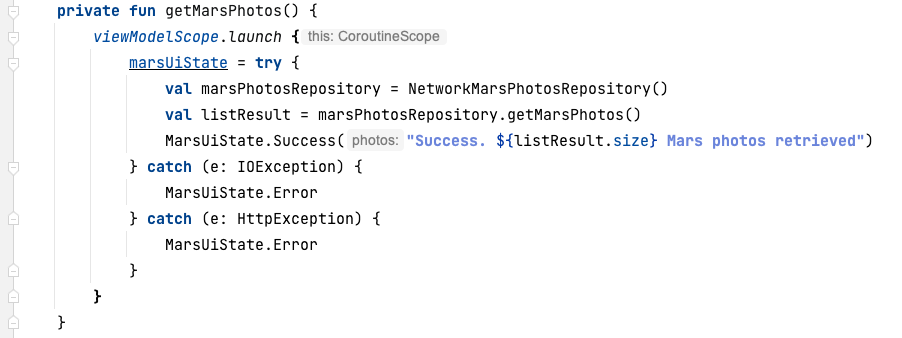

12. アプリを実行します。お気づきのように、表示される結果は前の結果と同じです。

`ViewModel` がデータのネットワーク リクエストを直接行うのではなく、リポジトリがデータを提供します。`ViewModel` は `MarsApi` コードを直接参照しなくなりました。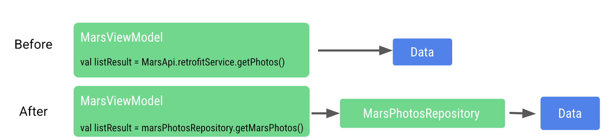

この方法により、データを取得するコードが `ViewModel` から疎結合されます。疎結合されると、リポジトリに `getMarsPhotos()` という関数がある限り、`ViewModel` またはリポジトリに変更を加えても、他の部分に悪影響を与えることはありあせん。

呼び出し元に影響を与えることなく、リポジトリ内の実装に変更を加えることができるようになりました。大規模なアプリでは、この変更により複数の呼び出し元をサポートできます。

### 4. 依存関係インジェクション

多くの場合、クラスが機能するには、他のクラスのオブジェクトが必要になります。クラスで別のクラスが必要な場合、必要なクラスは**依存関係**と呼ばれます。

次の例では、`Car` オブジェクトが `Engine` オブジェクトに依存しています。

クラスでこれらの必要なオブジェクトを取得する方法は 2 つあります。1 つ目の方法は、クラスが必要なオブジェクトをインスタンス化することです。

```kotlin
interface Engine {
    fun start()
}

class GasEngine : Engine {
    override fun start() {
        println("GasEngine started!")
    }
}

class Car {

    private val engine = GasEngine()

    fun start() {
        engine.start()
    }
}

fun main() {
    val car = Car()
    car.start()
}
```

もう 1 つの方法は、必要なオブジェクトを引数として渡すことです。

```kotlin
interface Engine {
    fun start()
}

class GasEngine : Engine {
    override fun start() {
        println("GasEngine started!")
    }
}

class Car(private val engine: Engine) {
    fun start() {
        engine.start()
    }
}

fun main() {
    val engine = GasEngine()
    val car = Car(engine)
    car.start()
}
```

クラスが必要なオブジェクトをインスタンス化することは簡単ですが、この方法では、クラスと必要なオブジェクトが密結合されているため、コードの柔軟性がなくなり、テストが難しくなります。

呼び出し元のクラスは、オブジェクトのコンストラクタ（実装の詳細）を呼び出す必要があります。コンストラクタを変更する場合は、呼び出し元のコードも変更する必要があります。

コードの柔軟性と適応性を高めるために、クラスは依存するオブジェクトをインスタンス化することはできません。依存するオブジェクトは、クラスの外部でインスタンス化してから渡す必要があります。この方法では、クラスが特定の 1 つのオブジェクトにハードコードされなくなるため、より柔軟なコードを作成できます。必要なオブジェクトの実装は、呼び出し元コードを変更しなくても変更できます。

前の例を続けると、`ElectricEngine` が必要な場合は、これを作成して `Car` クラスに渡すことができます。`Car` クラスは一切変更する必要がありません。

```kotlin
interface Engine {
    fun start()
}

class ElectricEngine : Engine {
    override fun start() {
        println("ElectricEngine started!")
    }
}

class Car(private val engine: Engine) {
    fun start() {
        engine.start()
    }
}

fun main() {
    val engine = ElectricEngine()
    val car = Car(engine)
    car.start()
}
```

必要なオブジェクトを渡すことを「依存関係インジェクション」（DI）といいます。「制御の反転」ともいいます。

DI とは、呼び出し元クラスにハードコードされるのではなく、実行時に依存関係を提供することを指します。

依存関係インジェクションを実装すると次のことが可能になります。

- **コードの再利用に役立つ。**コードは特定のオブジェクトに依存しないため、柔軟性が高くなります。
- **リファクタリングが容易になる。**コードは疎結合されているため、コードの 1 つのセクションをリファクタリングしても、コードの別のセクションに影響はありません。
- **テストに役立つ。**テスト オブジェクトはテスト中に渡すことができます。

DI がテストに役立つ方法の一例として、ネットワーク呼び出しコードをテストするというものがあります。このテストでは、ネットワーク呼び出しが行われ、データが返されるかどうかを実際にテストしてみます。テスト中にネットワーク リクエストを行うたびに支払いが発生する場合は、コストが高くなる可能性があるため、このコードのテストをスキップできます。では、テスト用にネットワーク リクエストを模擬できる場合はどうでしょうか。どのくらいコストを削減できるでしょうか。テスト用に、ネットワーク呼び出しを実際に行わなくても、リポジトリにテスト オブジェクトを渡して、呼び出し時の架空のデータを返すことができます。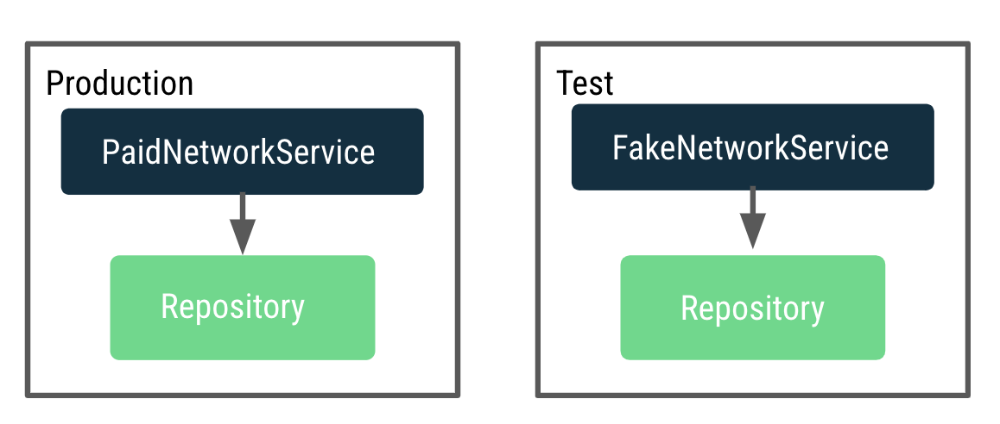

`ViewModel` をテスト可能にしたいのですが、現在は実際のネットワーク呼び出しを行うリポジトリに依存しています。実際の本番環境リポジトリでテストすると、多くのネットワーク呼び出しが行われます。この問題を解決するには、`ViewModel` がリポジトリを作成するのではなく、本番環境とテストに使用するリポジトリ インスタンスを動的に決定して渡す方法が必要です。

このプロセスは、リポジトリを `MarsViewModel` に提供するアプリケーション コンテナを実装することで行われます。

[コンテナ](https://developer.android.com/training/dependency-injection/manual#dependencies-container)は、アプリに必要な依存関係を含むオブジェクトです。これらの依存関係はアプリ全体で使用されるため、すべてのアクティビティが使用できる共通の場所に配置する必要があります。Application クラスのサブクラスを作成して、コンテナへの参照を格納できます。

#### アプリケーション コンテナを作成する

1. `data` パッケージを右クリックして、**[New] > [Kotlin Class/File]** を選択します。
2. ダイアログで [**Interface**] を選択し、インターフェースの名前として「`AppContainer`」と入力します。
3. `AppContainer` インターフェース内に、`MarsPhotosRepository` 型の `marsPhotosRepository` という抽象プロパティを追加します。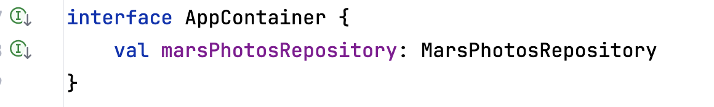
4. インターフェース定義の下に、インターフェース `AppContainer` を実装する `DefaultAppContainer` というクラスを作成します。
5. `network/MarsApiService.kt` から、変数 `BASE_URL`、`retrofit`、`retrofitService` のコードを `DefaultAppContainer` クラスに移動して、依存関係を維持しているコンテナ内にすべて配置されるようにします。

```kotlin
import retrofit2.Retrofit
import com.example.marsphotos.network.MarsApiService
import com.jakewharton.retrofit2.converter.kotlinx.serialization.asConverterFactory
import kotlinx.serialization.json.Json
import okhttp3.MediaType.Companion.toMediaType

class DefaultAppContainer : AppContainer {

    private const val BASE_URL =
        "https://android-kotlin-fun-mars-server.appspot.com"

    private val retrofit: Retrofit = Retrofit.Builder()
        .addConverterFactory(Json.asConverterFactory("application/json".toMediaType()))
        .baseUrl(BASE_URL)
        .build()

    private val retrofitService: MarsApiService by lazy {
        retrofit.create(MarsApiService::class.java)
    }

}
```

6. 変数 `BASE_URL` の場合、`const` キーワードを削除します。`BASE_URL` はトップレベル変数ではなくなり、`DefaultAppContainer` クラスのプロパティになったため、`const` を削除する必要があります。キャメルケース `baseUrl` にリファクタリングします。
7. 変数 `retrofitService` の場合は、`private` 可視性修飾子を追加します。`private` 修飾子を追加したのは、変数 `retrofitService` がプロパティ `marsPhotosRepository` によってクラス内でのみ使用され、クラス外からアクセスできるようにする必要がないためです。
8. `DefaultAppContainer` クラスはインターフェース `AppContainer` を実装しているため、`marsPhotosRepository` プロパティをオーバーライドする必要があります。変数 `retrofitService` の後に、次のコードを追加します。

```kotlin
override val marsPhotosRepository: MarsPhotosRepository by lazy {
    NetworkMarsPhotosRepository(retrofitService)
}
```

完成した `DefaultAppContainer` クラスは次のようになります。

```kotlin
class DefaultAppContainer : AppContainer {

    private val baseUrl =
        "https://android-kotlin-fun-mars-server.appspot.com"

    /**
     * Use the Retrofit builder to build a retrofit object using a kotlinx.serialization converter
     */
    private val retrofit = Retrofit.Builder()
        .addConverterFactory(Json.asConverterFactory("application/json".toMediaType()))
        .baseUrl(baseUrl)
        .build()
    
    private val retrofitService: MarsApiService by lazy {
        retrofit.create(MarsApiService::class.java)
    }

    override val marsPhotosRepository: MarsPhotosRepository by lazy {
        NetworkMarsPhotosRepository(retrofitService)
    }
}
```

9. `data/MarsPhotosRepository.kt` ファイルを開きます。`retrofitService` を `NetworkMarsPhotosRepository` に渡しているため、`NetworkMarsPhotosRepository` クラスを変更する必要があります。
10. 次のコードに示すように、`NetworkMarsPhotosRepository` クラス宣言にコンストラクタ パラメータ `marsApiService` を追加します。

```kotlin
import com.example.marsphotos.network.MarsApiService

class NetworkMarsPhotosRepository(
    private val marsApiService: MarsApiService
) : MarsPhotosRepository {
```

11. `NetworkMarsPhotosRepository` クラスの `getMarsPhotos()` 関数内の return 文を変更して `marsApiService` からデータを取得します。

```kotlin
override suspend fun getMarsPhotos(): List<MarsPhoto> = marsApiService.getPhotos()
}
```

12. `MarsPhotosRepository.kt` ファイルから次のインポートを削除します。

```kotlin
// Remove
import com.example.marsphotos.network.MarsApi
```

`network/MarsApiService.kt` ファイルのすべてのコードをオブジェクトから移動しました。残りのオブジェクト宣言は不要になったため、削除できます。

13. 次のコードを削除します。

```kotlin
object MarsApi {

}
```

### 5. アプリケーション コンテナをアプリにアタッチする

このセクションの手順では、次の図に示すように、アプリのオブジェクトをアプリケーション コンテナに接続します。

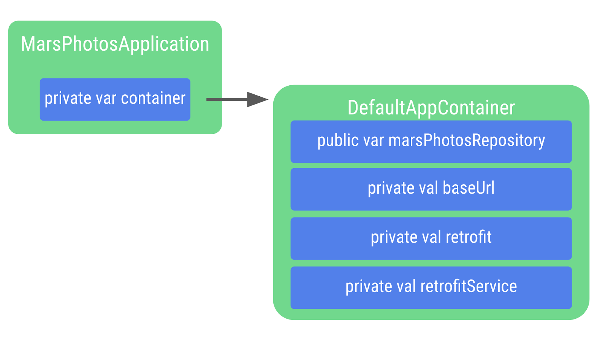

1. `com.example.marsphotos` を右クリックして、**[New] > [Kotlin Class/File]** を選択します。
2. ダイアログで「`MarsPhotosApplication`」と入力します。このクラスはアプリのオブジェクトから継承されるため、クラス宣言に追加する必要があります。

```kotlin
import android.app.Application

class MarsPhotosApplication : Application() {
}
```

3. `MarsPhotosApplication` クラス内で、`AppContainer` 型の `container` という変数を宣言して `DefaultAppContainer` オブジェクトを保存します。この変数は `onCreate()` の呼び出し中に初期化されるため、`lateinit` 修飾子でマークする必要があります。

```kotlin
import com.example.marsphotos.data.AppContainer
import com.example.marsphotos.data.DefaultAppContainer

lateinit var container: AppContainer
override fun onCreate() {
    super.onCreate()
    container = DefaultAppContainer()
}
```

4. 完全な `MarsPhotosApplication.kt` ファイルは次のコードのようになります。

```kotlin
package com.example.marsphotos

import android.app.Application
import com.example.marsphotos.data.AppContainer
import com.example.marsphotos.data.DefaultAppContainer

class MarsPhotosApplication : Application() {
    lateinit var container: AppContainer
    override fun onCreate() {
        super.onCreate()
        container = DefaultAppContainer()
    }
}
```

5. 定義したアプリクラスをアプリで使用できるように、Android マニフェストを更新する必要があります。`manifests/AndroidManifest.xml` ファイルを開きます。

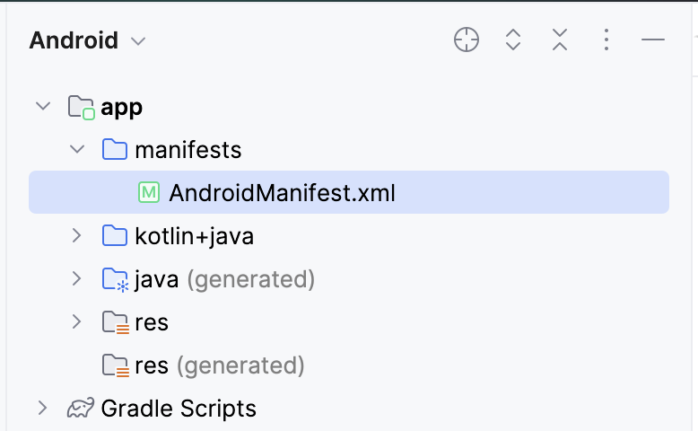

6. `application` セクションで、`android:name` 属性を追加し、アプリクラス名の値を `".MarsPhotosApplication"` にします。

```kotlin
<application
   android:name=".MarsPhotosApplication"
   android:allowBackup="true"
...
</application>
```

### 6. ViewModel にリポジトリを追加する

これらの手順を完了すると、`ViewModel` はリポジトリ オブジェクトを呼び出して火星のデータを取得できます。

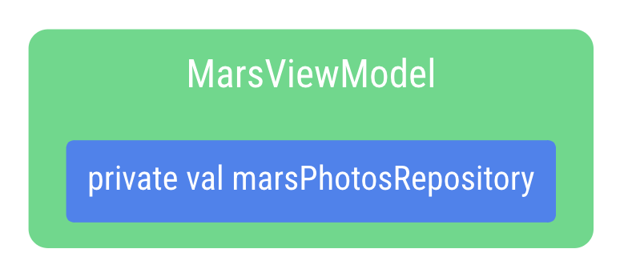

1. `ui/screens/MarsViewModel.kt` ファイルを開きます。
2. `MarsViewModel` のクラス宣言に、`MarsPhotosRepository` 型のプライベート コンストラクタ パラメータ `marsPhotosRepository` を追加します。アプリが依存関係インジェクションを使用するようになったため、コンストラクタ パラメータの値はアプリケーション コンテナから取得されます。

```kotlin
import com.example.marsphotos.data.MarsPhotosRepository

class MarsViewModel(private val marsPhotosRepository: MarsPhotosRepository) : ViewModel(){
```

3. `getMarsPhotos()` 関数では、`marsPhotosRepository` がコンストラクタ呼び出しに入力されるようになったため、次のコード行を削除します。

```kotlin
val marsPhotosRepository = NetworkMarsPhotosRepository()
```

4. Android フレームワークでは、`ViewModel` を作成する際にコンストラクタで値を渡すことができません。この制限を回避するために `ViewModelProvider.Factory` オブジェクトを実装します。

[Factory パターン](https://en.wikipedia.org/wiki/Factory_method_pattern)は、オブジェクトの作成に使用される作成パターンです。`MarsViewModel.Factory` オブジェクトはアプリケーション コンテナを使用して `marsPhotosRepository` を取得します。次に、`ViewModel` オブジェクトの作成時にこのリポジトリを `ViewModel` に渡します。

5. 関数 `getMarsPhotos()` の下に、コンパニオン オブジェクトのコードを入力します。

コンパニオン オブジェクトは、すべてのユーザーが使用するオブジェクトのインスタンスを 1 つ使用できる点で便利です。高価なオブジェクトのインスタンスを新たに作成する必要はありません。これは実装の詳細であり、分離することで、アプリのコードの他の部分に影響を与えずに変更を加えることができます。

`APPLICATION_KEY` は `ViewModelProvider.AndroidViewModelFactory.Companion` オブジェクトの一部で、アプリの `MarsPhotosApplication` オブジェクトの検出に使用されます。このオブジェクトには、依存関係インジェクションに使用されるリポジトリを取得するための `container` プロパティがあります。

```kotlin
import androidx.lifecycle.ViewModelProvider
import androidx.lifecycle.ViewModelProvider.AndroidViewModelFactory.Companion.APPLICATION_KEY
import androidx.lifecycle.viewModelScope
import androidx.lifecycle.viewmodel.initializer
import androidx.lifecycle.viewmodel.viewModelFactory
import com.example.marsphotos.MarsPhotosApplication

companion object {
   val Factory: ViewModelProvider.Factory = viewModelFactory {
       initializer {
           val application = (this[APPLICATION_KEY] as MarsPhotosApplication)
           val marsPhotosRepository = application.container.marsPhotosRepository
           MarsViewModel(marsPhotosRepository = marsPhotosRepository)
       }
   }
}
```

6. `theme/MarsPhotosApp.kt` ファイルを開き、`MarsPhotosApp()` 関数内で、Factory を使用するよう `viewModel()` を更新します。

```kotlin
Surface(
            // ...
        ) {
            val marsViewModel: MarsViewModel =
   viewModel(factory = MarsViewModel.Factory)
            // ...
        }
```

この `marsViewModel` 変数は、`viewModel()` 関数への呼び出しによって入力されます。この関数は、引数としてコンパニオン オブジェクトの `MarsViewModel.Factory` を渡されて `ViewModel` を作成します。

7. アプリを実行して、以前と同様に動作していることを確認します。

これで、**Mars Photos** アプリをリファクタリングしてリポジトリと依存関係インジェクションを使用できるようになりました。リポジトリを使用してデータレイヤを実装することにより、Android のベスト プラクティスに沿って UI とデータソースのコードを分離しています。

依存関係インジェクションを使用すると、`ViewModel` のテストが容易になります。アプリの柔軟性と堅牢性が高まり、拡張の準備が整いました。

これらの改善を行ったら、次にこのテスト方法を学びます。テストを通じてコードの動作が想定どおりに保たれ、引き続きコードを扱う際にバグが発生する可能性が低くなります。

### 7. ローカルテストのセットアップを行う

前のセクションでは、REST API サービスとの直接のやり取りを `ViewModel` から抽象化するためのリポジトリを実装しました。この方法では、目的が限られている小規模なコードをテストできます。機能に制限がある小規模なコード向けのテストは、複数の機能を備えた大規模なコード用に記述したテストよりも、ビルド、実装、理解が容易です。

また、インターフェース、継承、依存関係インジェクションを活用して、リポジトリを実装しました。以降のセクションでは、これらのアーキテクチャのベスト プラクティスによってテストが容易になる理由を説明します。さらに、Kotlin コルーチンを使用してネットワーク リクエストを実行しました。コルーチンを使用するコードをテストするには、コードの非同期実行を考慮するために追加の手順が必要です。これらの手順については、このレッスンで後ほど説明します。

#### **ローカルテストの依存関係を追加する**

`app/build.gradle.kts` に次の依存関係を追加します。

```kotlin
testImplementation("junit:junit:4.13.2")
testImplementation("org.jetbrains.kotlinx:kotlinx-coroutines-test:1.7.1")
```

#### **ローカルテスト ディレクトリを作成する**

1. プロジェクト ビューで **src** ディレクトリを右クリックし、**[New] > [Directory] > [test/java]** を選択してローカル テスト ディレクトリを作成します。
2. テスト ディレクトリに `com.example.marsphotos` という名前の新しいパッケージを作成します。

### 8. テスト用の架空のデータと依存関係を作成する

このセクションでは、依存関係インジェクションがローカルテストの作成にどのように役立つかを説明します。レッスンの前半で、API サービスに依存するリポジトリを作成しました。次に、リポジトリに依存するように `ViewModel` を変更しました。

各ローカルテストで 1 つの項目のみをテストします。たとえば、ビューモデルの機能をテストしても、リポジトリや API サービスの機能をテストしない場合があります。同様に、リポジトリをテストするときに、API サービスをテストしない場合があります。

インターフェースを使用し、次いで依存関係インジェクションを使用して、これらのインターフェースから継承するクラスを含めると、テスト用に作成された架空のクラスを使用して依存関係の機能をシミュレートできます。テスト用の架空のクラスとデータソースを挿入することで、再現性と整合性を保ちながらコードを個別にテストできます。

まず必要なのは、架空のデータを作成して、後で作成する架空のクラスで使用できるようにすることです。

1. テスト ディレクトリで、`com.example.marsphotos` の下に `fake` というパッケージを作成します。
2. `fake` ディレクトリに `FakeDataSource` という新しい Kotlin オブジェクトを作成します。
3. このオブジェクトで、`MarsPhoto` オブジェクトのリストに設定するプロパティを作成します。リストは長くする必要はありませんが、少なくとも 2 つのオブジェクトを含める必要があります。

> **注:** このレッスンでテストを作成するために、オブジェクトに保存されるデータが、必ずしも API によって返されるデータを表す必要はありません。つまり、有効な ID や URL を含める必要はありません。

```kotlin
object FakeDataSource {

   const val idOne = "img1"
   const val idTwo = "img2"
   const val imgOne = "url.1"
   const val imgTwo = "url.2"
   val photosList = listOf(
       MarsPhoto(
           id = idOne,
           imgSrc = imgOne
       ),
       MarsPhoto(
           id = idTwo,
           imgSrc = imgTwo
       )
   )
}
```

このレッスンで前述したように、リポジトリは API サービスに依存しています。リポジトリ テストを作成するには、作成した架空のデータを返す架空の API サービスが必要です。この架空の API サービスがリポジトリに渡されると、リポジトリは架空の API サービスのメソッドが呼び出されたときに架空のデータを受け取ります。

1. `fake` パッケージで、`FakeMarsApiService` という名前の新しいクラスを作成します。
2. `MarsApiService` インターフェースを継承するように `FakeMarsApiService` クラスをセットアップします。

```kotlin
class FakeMarsApiService : MarsApiService {
}
```

3. `getPhotos()` 関数をオーバーライドします。

```kotlin
override suspend fun getPhotos(): List<MarsPhoto> {
}
```

4. `getPhotos()` メソッドから架空の写真のリストを返します。

```kotlin
override suspend fun getPhotos(): List<MarsPhoto> {
   return FakeDataSource.photosList
}
```

なお、このクラスの目的がよくわからなくても問題ありません。この架空のクラスの使用法については、次のセクションで詳しく説明します。

### 9. リポジトリ テストを作成する

このセクションでは、`NetworkMarsPhotosRepository` クラスの `getMarsPhotos()` メソッドをテストします。さらに、架空のクラスの使用方法を説明し、コルーチンをテストする方法を示します。

1. 架空のディレクトリに、`NetworkMarsRepositoryTest` という名前の新しいクラスを作成します。
2. 作成したクラス内に `networkMarsPhotosRepository_getMarsPhotos_verifyPhotoList()` という新しいメソッドを作成し、`@Test` アノテーションを付けます。

```kotlin
@Test
fun networkMarsPhotosRepository_getMarsPhotos_verifyPhotoList(){
}
```

リポジトリをテストするには、`NetworkMarsPhotosRepository` のインスタンスが必要になります。このクラスは `MarsApiService` インターフェースに依存することを思い出してください。ここで、前のセクションの架空の API サービスを活用します。

3. `NetworkMarsPhotosRepository` のインスタンスを作成し、`FakeMarsApiService` を `marsApiService` パラメータとして渡します。

```kotlin
@Test
fun networkMarsPhotosRepository_getMarsPhotos_verifyPhotoList(){
    val repository = NetworkMarsPhotosRepository(
       marsApiService = FakeMarsApiService()
    )
}
```

架空の API サービスを渡すことで、リポジトリ内の `marsApiService` プロパティの呼び出しにより、`FakeMarsApiService` が呼び出されます。依存関係に架空のクラスを渡すことで、依存関係が返す内容を正確に制御できます。この方法により、テスト対象のコードは、テストされていないコードや、変更の可能性や予期しない問題が発生する可能性がある API に依存しなくなります。このような状況では、作成したコードに問題がなくても、テストが失敗することがあります。架空の実装は、より一貫性のあるテスト環境の作成、テストの不安定性の低減、1 つの機能をテストする簡潔なテストに役立ちます。

4. `getMarsPhotos()` メソッドから返されたデータが `FakeDataSource.photosList` と等しいことを確認します。

```kotlin
@Test
fun networkMarsPhotosRepository_getMarsPhotos_verifyPhotoList(){
    val repository = NetworkMarsPhotosRepository(
       marsApiService = FakeMarsApiService()
    )assertEquals(FakeDataSource.photosList, repository.getMarsPhotos())
}
```

IDE では、`getMarsPhotos()` メソッド呼び出しに赤色の下線が表示されます。

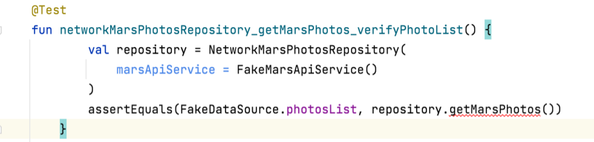

メソッドにカーソルを合わせると、「suspend 関数「getMarsPhotos」をコルーチンまたは別の suspend 関数からのみ呼び出す必要があります」というツールチップが表示されます。

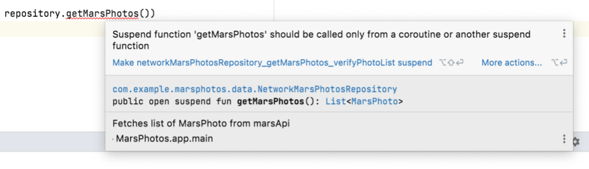

`data/MarsPhotosRepository.kt` で、`NetworkMarsPhotosRepository` の `getMarsPhotos()` 実装を見ると、`getMarsPhotos()` 関数が suspend 関数であることがわかります。

```kotlin
class NetworkMarsPhotosRepository(
   private val marsApiService: MarsApiService
) : MarsPhotosRepository {
   /** Fetches list of MarsPhoto from marsApi*/
   override suspend fun getMarsPhotos(): List<MarsPhoto> = marsApiService.getPhotos()
}
```

この関数を `MarsViewModel` から呼び出す際には、このメソッドを `viewModelScope.launch()` に渡されたラムダの呼び出しを通じてコルーチンから呼び出しています。テストのコルーチンから `getMarsPhotos()` などの suspend 関数を呼び出す必要もあります。ただし、方法は異なります。次のセクションでは、この問題を解決する方法を説明します。

#### **コルーチンをテストする**

このセクションでは、テストメソッドの本文がコルーチンから実行されるように `networkMarsPhotosRepository_getMarsPhotos_verifyPhotoList()` テストを変更します。

1. `NetworkMarsRepositoryTest.kt` で、`networkMarsPhotosRepository_getMarsPhotos_verifyPhotoList()` 関数を式に変更します。

```kotlin
@Test
fun networkMarsPhotosRepository_getMarsPhotos_verifyPhotoList() =
```

2. この式を `runTest()` 関数と同じになるように設定します。このメソッドではラムダが想定されています。

```kotlin
...
import kotlinx.coroutines.test.runTest
...

@Test
fun networkMarsPhotosRepository_getMarsPhotos_verifyPhotoList() =
    runTest {}
```

コルーチン テスト ライブラリには `runTest()` 関数が用意されています。この関数は、ラムダで渡されたメソッドを受け取り、`TestScope`（`CoroutineScope` から継承）から実行します。

> **注:** 参考として、作成した ViewModel からリポジトリを呼び出すときは、`viewModelScope`（最終的には `CoroutineScope`）を使用して `getMarsPhotos()` を呼び出します。

3. テスト関数の内容をラムダ関数に移動します。

```kotlin
@Test
fun networkMarsPhotosRepository_getMarsPhotos_verifyPhotoList() =
   runTest {
       val repository = NetworkMarsPhotosRepository(
           marsApiService = FakeMarsApiService()
       )
       assertEquals(FakeDataSource.photosList, repository.getMarsPhotos())
   }
```

`getMarsPhotos()` の赤色の線が消えています。これを実行すると、テストに合格します。

### 10. ViewModel テストを作成する

このセクションでは、`MarsViewModel` から `getMarsPhotos()` 関数のテストを作成します。`MarsViewModel` は `MarsPhotosRepository` に依存します。したがって、このテストを作成するには、架空の `MarsPhotosRepository` を作成する必要があります。また、`runTest()` メソッドを使用するだけでなく、コルーチンにとって考慮すべき追加の手順がいくつかあります。

#### **架空のリポジトリを作成する**

このステップの目的は、`MarsPhotosRepository` インターフェースから継承した架空のクラスを作成し、`getMarsPhotos()` 関数をオーバーライドして架空のデータを返すことです。この方法は、架空の API サービスで採用する方法と似ていますが、このクラスで `MarsApiService` ではなく `MarsPhotosRepository` インターフェースを拡張する点が異なります。

1. `fake` ディレクトリに `FakeNetworkMarsPhotosRepository` という新しいクラスを作成します。
2. `MarsPhotosRepository` インターフェースを使用してこのクラスを拡張します。

```kotlin
class FakeNetworkMarsPhotosRepository : MarsPhotosRepository{
}
```

3. `getMarsPhotos()` 関数をオーバーライドします。

```kotlin
class FakeNetworkMarsPhotosRepository : MarsPhotosRepository{
   override suspend fun getMarsPhotos(): List<MarsPhoto> {
   }
}
```

4. `getMarsPhotos()` 関数から `FakeDataSource.photosList` を返します。

```kotlin
class FakeNetworkMarsPhotosRepository : MarsPhotosRepository{
   override suspend fun getMarsPhotos(): List<MarsPhoto> {
       return FakeDataSource.photosList
   }
}
```

#### **ViewModel テストを作成する**

1. `MarsViewModelTest` という新しいクラスを作成します。
2. `marsViewModel_getMarsPhotos_verifyMarsUiStateSuccess()` という関数を作成し、`@Test` アノテーションを付けます。

```kotlin
@Test
fun marsViewModel_getMarsPhotos_verifyMarsUiStateSuccess()
```

3. この関数を `runTest()` メソッドの結果に設定される式にして、前のセクションのリポジトリ テストと同様に、コルーチンからテストを実行します。

```kotlin
@Test
fun marsViewModel_getMarsPhotos_verifyMarsUiStateSuccess() =
    runTest{
    }
```

4. `runTest()` のラムダ本体で、`MarsViewModel` のインスタンスを作成し、作成した架空のリポジトリのインスタンスを渡します。

```kotlin
@Test
fun marsViewModel_getMarsPhotos_verifyMarsUiStateSuccess() =
    runTest{
        val marsViewModel = MarsViewModel(
            marsPhotosRepository = FakeNetworkMarsPhotosRepository()
         )
    }
```

5. `ViewModel` インスタンスの `marsUiState` について、`MarsPhotosRepository.getMarsPhotos()` の呼び出しが成功した結果と一致していることを確認します。

> **注:** `MarsPhotosRepository.getMarsPhotos()` の呼び出しをトリガーするために、`MarsViewlModel.getMarsPhotos()` を直接呼び出す必要はありません。`MarsViewModel.getMarsPhotos()` は、`ViewModel` が初期化されたときに呼び出されます。

```kotlin
@Test
fun marsViewModel_getMarsPhotos_verifyMarsUiStateSuccess() =
   runTest {
       val marsViewModel = MarsViewModel(
           marsPhotosRepository = FakeNetworkMarsPhotosRepository()
       )
       assertEquals(
           MarsUiState.Success("Success: ${FakeDataSource.photosList.size} Mars " +
                   "photos retrieved"),
           marsViewModel.marsUiState
       )
   }
```

このテストをそのまま実行しようとすると、失敗します。エラーは次の例のようになります。

```kotlin
Exception in thread "Test worker @coroutine#1" java.lang.IllegalStateException: Module with the Main dispatcher had failed to initialize. For tests Dispatchers.setMain from kotlinx-coroutines-test module can be used
```

`MarsViewModel` が `viewModelScope.launch()` を使用してリポジトリを呼び出すことを思い出してください。この命令は、デフォルトのコルーチン ディスパッチャ（`Main` ディスパッチャ）の下で、新しいコルーチンを開始します。`Main` ディスパッチャは、Android UI スレッドをラップします。前述のエラーの理由は、単体テストが Android UI スレッドに対応していないことです。単体テストは、Android デバイスやエミュレータではなく、ワークステーションで実行されます。ローカル単体テストのコードが `Main` ディスパッチャを参照する場合、単体テストの実行時に例外（上記の例など）がスローされます。この問題を解決するには、単体テストの実行時にデフォルトのディスパッチャを明示的に定義する必要があります。方法については、次のセクションをご覧ください。

#### テスト ディスパッチャを作成する

`Main` ディスパッチャは UI コンテキストでのみ使用できるため、ディスパッチャを単体テストに適したものに置き換える必要があります。Kotlin コルーチン ライブラリには、この目的のために `TestDispatcher` というコルーチン ディスパッチャが用意されています。新しいコルーチンが生成される単体テストでは、ビューモデルの `getMarsPhotos()` 関数の場合と同様に、`Main` ディスパッチャの代わりに `TestDispatcher` を使用する必要があります。

いずれの場合も、`Main` ディスパッチャを `TestDispatcher` に置き換えるには、`Dispatchers.setMain()` 関数を使用します。`Dispatchers.resetMain()` 関数を使用して、スレッド ディスパッチャを `Main` ディスパッチャにリセットできます。各テストで `Main` ディスパッチャを置き換えるコードが重複しないように、JUnit テストルールに抽出できます。TestRule は、テストを実行する環境を制御する方法を提供します。TestRule は、さらにチェックを追加したり、テストに必要なセットアップやクリーンアップを行ったり、別の場所で報告するためにテスト実行を監視したりできます。TestRule は、テストクラス間で簡単に共有できます。

`Main` ディスパッチャを置き換えるために、TestRule を記述する専用のクラスを作成します。カスタム TestRule を実装するには次の手順を行います。

1. テスト ディレクトリに `rules` という新しいパッケージを作成します。
2. rules ディレクトリで、`TestDispatcherRule` という新しいクラスを作成します。
3. `TestDispatcherRule` を `TestWatcher` で拡張します。あ`TestWatcher` クラスを使用すると、テストのさまざまな実行フェーズでアクションを実行できます。

```kotlin
class TestDispatcherRule(): TestWatcher(){

}
```

4. `TestDispatcherRule` の `TestDispatcher` コンストラクタ パラメータを作成します。

このパラメータを使用すると、`StandardTestDispatcher` など、さまざまなディスパッチャを使用できます。このコンストラクタ パラメータには、デフォルト値として `UnconfinedTestDispatcher` オブジェクトのインスタンスを設定する必要があります。[`UnconfinedTestDispatcher`](https://kotlinlang.org/api/kotlinx.coroutines/kotlinx-coroutines-test/kotlinx.coroutines.test/-unconfined-test-dispatcher.html) クラスは `TestDispatcher` クラスを継承し、タスクが特定の順序で実行されないように指定します。この実行パターンは、コルーチンが自動的に処理されるため、単純なテストに適しています。`UnconfinedTestDispatcher` とは異なり、`StandardTestDispatcher` クラスを使用すると、コルーチンの実行を完全に制御できます。この方法は、手動のアプローチを必要とする複雑なテストに適していますが、このレッスンのテストには必要ありません。

```kotlin
class TestDispatcherRule(
    val testDispatcher: TestDispatcher = UnconfinedTestDispatcher(),
) : TestWatcher() {

}
```

5. このテストルールの主な目的は、テストの実行を開始する前に `Main` ディスパッチャをテスト ディスパッチャに置き換えることです。`TestWatcher` クラスの `starting()` 関数は、特定のテストが実行される前に実行されます。`starting()` 関数をオーバーライドします。

```kotlin
class TestDispatcherRule(
    val testDispatcher: TestDispatcher = UnconfinedTestDispatcher(),
) : TestWatcher() {
    override fun starting(description: Description) {
        
    }
}
```

6. `Dispatchers.setMain()` の呼び出しを追加し、引数として `testDispatcher` を渡します。

```kotlin
class TestDispatcherRule(
    val testDispatcher: TestDispatcher = UnconfinedTestDispatcher(),
) : TestWatcher() {
    override fun starting(description: Description) {
        Dispatchers.setMain(testDispatcher)
    }
}
```

7. テスト実行が終了したら、`finished()` メソッドをオーバーライドして `Main` ディスパッチャをリセットします。`Dispatchers.resetMain()` 関数を呼び出します。

```kotlin
class TestDispatcherRule(
    val testDispatcher: TestDispatcher = UnconfinedTestDispatcher(),
) : TestWatcher() {
    override fun starting(description: Description) {
        Dispatchers.setMain(testDispatcher)
    }

    override fun finished(description: Description) {
        Dispatchers.resetMain()
    }
}
```

`TestDispatcherRule` ルールを再利用できるようになりました。

8. `MarsViewModelTest.kt` ファイルを開きます。
9. `MarsViewModelTest` クラスで、`TestDispatcherRule` クラスをインスタンス化し、`testDispatcher` 読み取り専用プロパティに割り当てます。

```kotlin
class MarsViewModelTest {
    
    val testDispatcher = TestDispatcherRule()
    ...
}
```

10. このルールをテストに適用するには、`testDispatcher` プロパティに `@get:Rule` アノテーションを追加します。

```kotlin
class MarsViewModelTest {
    @get:Rule
    val testDispatcher = TestDispatcherRule()
    ...
}
```

11. テストを再実行します。今回はテストに合格することを確認します。

### 11. 解答コードを取得する

このレッスンの完成したコードをダウンロードするには、以下のコマンドを使用します。

```
$ git clone https://github.com/google-developer-training/basic-android-kotlin-compose-training-mars-photos.git
$ cd basic-android-kotlin-compose-training-mars-photos
$ git checkout coil-starter
```

または、リポジトリを ZIP ファイルとしてダウンロードし、Android Studio で開くこともできます。

> **注:**解答コードは、ダウンロードしたリポジトリの `coil-starter` ブランチにあります。

このレッスンの解答コードを確認する場合は、[GitHub](https://github.com/google-developer-training/basic-android-kotlin-compose-training-mars-photos/tree/coil-starter) で表示します。

### 12. まとめ

おつかれさまでした。レッスンを完了し、**Mars Photos** アプリをリファクタリングして、リポジトリ パターンと依存関係インジェクションを実装しました。

アプリのコードは、データレイヤに関する Android のベスト プラクティスに従うようになりました。つまり、柔軟性、堅牢性が高くなり、拡張が容易になります。

またこれらの変更により、アプリを容易にテストできるようになりました。この利点は非常に重要です。コードが想定どおりに動作することを確認しながら、コードを改善し続けることができるためです。

作成したら、#AndroidBasics を付けて、ソーシャル メディアで共有しましょう。

### 13. 詳細はこちら

#### 関連リンク

Android デベロッパー ドキュメント:

- [Android での依存関係インジェクション](https://developer.android.com/training/dependency-injection)
- [アプリ アーキテクチャ ガイド - データレイヤー](https://developer.android.com/topic/architecture/data-layer)

その他:

- [結合](https://en.wikipedia.org/wiki/Coupling_(computer_programming))

## 4. インターネットから画像を読み込んで表示する


### 1. 始める前に

#### **はじめに**

これまでのレッスンでは、リポジトリ パターンを使用してウェブサービスからデータを取得し、レスポンスを解析して Kotlin オブジェクトに変換する方法を学びました。このレッスンでは、その知識に基づいて、ウェブ URL から写真を読み込んで表示します。また、`LazyVerticalGrid` を作成して概要ページに画像のグリッドを表示する方法もおさらいします。

#### 前提条件

- REST ウェブサービスから JSON を取得する方法と、[Retrofit](https://square.github.io/retrofit/) および [Gson](https://github.com/google/gson) ライブラリを使用してそのデータを解析し、Kotlin オブジェクトに変換する方法に関する知識
- [REST](https://en.wikipedia.org/wiki/Representational_state_transfer) ウェブサービスに関する知識
- Android アーキテクチャ コンポーネント（[データレイヤ](https://developer.android.com/topic/architecture/data-layer)やリポジトリなど）に精通していること
- [依存関係インジェクション](https://developer.android.com/training/dependency-injection)に関する知識
- `ViewModel` と `ViewModelProvider.Factory` に関する知識
- アプリのコルーチン実装に関する知識
- リポジトリ パターンの知識

#### 学習内容

- [Coil](https://coil-kt.github.io/coil/) ライブラリを使用してウェブ URL から画像を読み込んで表示する方法。
- `LazyVerticalGrid` を使用して画像のグリッドを表示する方法。
- 画像をダウンロードして表示する際に発生するエラーの処理方法。

#### 作成するアプリの概要

- Mars Photos アプリを変更して、火星のデータから画像 URL を取得し、Coil を使用してその画像を読み込んで表示します。
- 読み込み中のアニメーションとエラーアイコンをアプリに追加します。
- ステータス処理とエラー処理をアプリに追加します。

#### 必要なもの

- 最新のウェブブラウザ（[Chrome](https://www.google.com/chrome/) の最新バージョンなど）を搭載したパソコン
- REST ウェブサービスを使用した **Mars Photos** アプリのスターター コード

### 2. アプリの概要

このレッスンでは、前のレッスンで作成した **Mars Photos** アプリを引き続き操作します。**Mars Photos** アプリは、ウェブサービスに接続し、Gson を使用して取得した Kotlin オブジェクトの数を取得して表示します。これらの Kotlin オブジェクトには、NASA の火星探査機が撮影した火星表面の実際の写真の URL が含まれています。

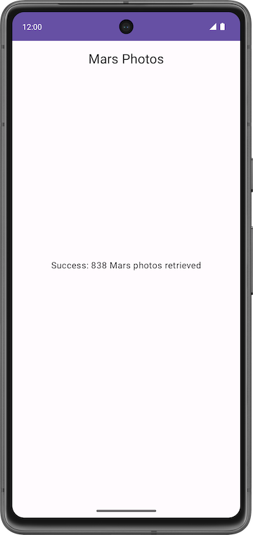

このレッスンで作成するバージョンのアプリでは、火星の写真が画像のグリッドで表示されます。これらの画像は、アプリがウェブサービスから取得したデータの一部です。アプリは [Coil](https://coil-kt.github.io/coil/) ライブラリを使用して画像の読み込みと表示を行い、`LazyVerticalGrid` を使用して画像のグリッド レイアウトを作成します。また、アプリはエラー メッセージを表示して、ネットワーク エラーを適切に処理します。

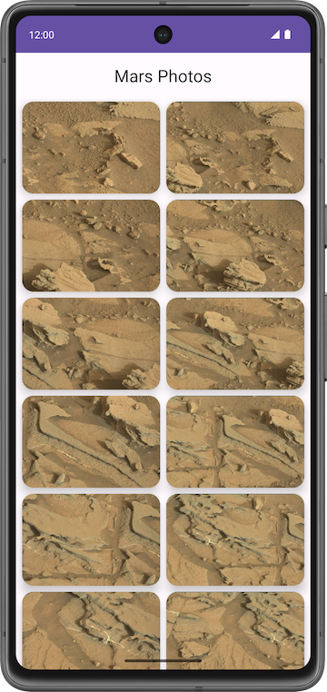

#### スターター コードを取得する

まず、スターター コードをダウンロードします。

または、GitHub リポジトリのクローンを作成してコードを入手することもできます。

```
$ git clone https://github.com/google-developer-training/basic-android-kotlin-compose-training-mars-photos.git
$ cd basic-android-kotlin-compose-training-mars-photos
$ git checkout coil-starter
```

> **注:**スターター コードは、ダウンロードしたリポジトリの `coil-starter` ブランチにあります。

コードは [`Mars Photos`](https://github.com/google-developer-training/basic-android-kotlin-compose-training-mars-photos/tree/coil-starter) GitHub リポジトリで確認できます。

### 3. ダウンロードした画像を表示する

ウェブ URL からの写真を表示するのは簡単に思えますが、適切に処理するにはかなりの作業が必要です。画像をダウンロードして内部的に保存（キャッシュ）し、圧縮形式から Android が使用できる形式にデコードする必要があります。メモリ内キャッシュとストレージベースのキャッシュの両方またはいずれかに画像を保存できます。これらすべてを優先度の低いバックグラウンド スレッドで行いつつ、UI の応答性を維持する必要があります。また、ネットワークと CPU のパフォーマンスを最適化するため、複数の画像を一度に取得してデコードする必要もあります。

幸いなことに、コミュニティで開発された [Coil](https://coil-kt.github.io/coil/) というライブラリを使用して、画像のダウンロード、バッファリング、デコード、キャッシュ保存を行うことができます。Coil を使用しないと、行うべき作業が格段に増えます。

Coil は、基本的に次の 2 つのものを必要とします。

- 読み込んで表示する画像の URL。
- 実際に画像を表示するための `AsyncImage` コンポーザブル。

このタスクでは、Coil を使用して、Mars ウェブサービスから取得した単一の画像を表示する方法を学びます。ウェブサービスから返された火星写真のリストに含まれる最初の写真の画像を表示します。次の画像は、変更前と変更後のスクリーンショットを示しています。

 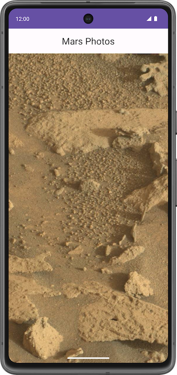

#### **Coil の依存関係を追加する**

1. リポジトリと手動 DI の追加レッスンから [Mars Photos アプリの解答コード](https://github.com/google-developer-training/basic-android-kotlin-compose-training-mars-photos/tree/coil-starter)を開きます。
2. アプリを実行して、火星写真の取得数が表示されることを確認します。
3. **build.gradle.kts (Module :app)** を開きます。
4. `dependencies` セクションで、Coil ライブラリ用に次の行を追加します。

```kotlin
// Coil
implementation("io.coil-kt:coil-compose:2.4.0")
```

[Coil](https://coil-kt.github.io/coil/#download) のドキュメント ページでライブラリの最新バージョンを確認し、アップデートします。

5. [**Sync Now**] をクリックし、新しい依存関係でプロジェクトを再ビルドします。

#### 画像の URL を表示する

このステップでは、最初の火星写真の URL を取得して表示します。

1. `getMarsPhotos()` メソッドの `ui/screens/MarsViewModel.kt` にある `try` ブロック内で、ウェブサービスから取得したデータを `listResult` に設定している行を見つけます。

```kotlin
// No need to copy, code is already present
try {
   val listResult = marsPhotosRepository.getMarsPhotos()
   //...
}
```

2. この行を更新するには、`listResult` を `result` に変更し、取得した最初の火星写真を新しい変数 `result` に割り当てます。インデックス `0` の最初の写真オブジェクトを割り当てます。

```kotlin
try {
   val result = marsPhotosRepository.getMarsPhotos()[0]
   //...
}
```

3. 次の行で、`MarsUiState.Success()` 関数呼び出しに渡すパラメータを、次のコード内の文字列に更新します。`listResult` ではなく、新しいプロパティのデータを使用します。写真 `result` の最初の画像の URL を表示します。

```kotlin
try {
   ...
   MarsUiState.Success("First Mars image URL: ${result.imgSrc}")
}
```

完全な `try` ブロックは、次のコードのようになります。

```kotlin
marsUiState = try {
   val result = marsPhotosRepository.getMarsPhotos()[0]
   MarsUiState.Success(
       "   First Mars image URL : ${result.imgSrc}"
   )
}
```

4. アプリを実行します。`Text` コンポーザブルにより、最初の火星写真の URL が表示されます。次のセクションでは、アプリにこの URL の画像を表示させる方法について説明します。

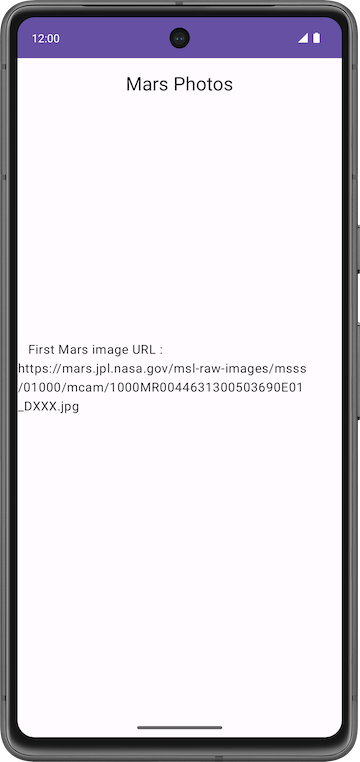

#### `AsyncImage` **コンポーザブル**を追加する

このステップでは、`AsyncImage` コンポーザブル関数を追加して、1 枚の火星写真を読み込んで表示します。`AsyncImage` は、画像リクエストを非同期で実行し、結果をレンダリングするコンポーザブルです。

```kotlin
// Example code, no need to copy over
AsyncImage(
    model = "https://android.com/sample_image.jpg",
    contentDescription = null
)
```

`model` 引数には、`ImageRequest.data` 値または `ImageRequest` のいずれかを指定できます。上記の例では、`ImageRequest.data` 値、つまり画像の URL（`"https://android.com/sample_image.jpg"`）を割り当てます。次のサンプルコードは、`ImageRequest` 自体を `model` に割り当てる方法を示しています。

```kotlin
// Example code, no need to copy over

AsyncImage(
    model = ImageRequest.Builder(LocalContext.current)
        .data("https://example.com/image.jpg")
        .crossfade(true)
        .build(),
    placeholder = painterResource(R.drawable.placeholder),
    contentDescription = stringResource(R.string.description),
    contentScale = ContentScale.Crop,
    modifier = Modifier.clip(CircleShape)
)
```

`AsyncImage` は、標準の Image コンポーザブルと同じ引数をサポートします。また、`placeholder` / `error` / `fallback` ペインタと `onLoading` / `onSuccess` / `onError` コールバックの設定もサポートします。上記のサンプルコードでは、画像を円形の切り抜きとクロスフェードで読み込み、プレースホルダを設定しています。

`contentDescription` は、この画像が表す内容を示すためにユーザー補助サービスで使用されるテキストを設定します。

`AsyncImage` コンポーザブルをコードに追加して、最初に取得された火星写真を表示します。

1. `ui/screens/HomeScreen.kt` に、`MarsPhotoCard()` という新しいコンポーズ可能な関数を追加します。これは `MarsPhoto` と `Modifier` を受け取ります。

```kotlin
@Composable
fun MarsPhotoCard(photo: MarsPhoto, modifier: Modifier = Modifier) {
}
```

2. コンポーズ可能な関数 `MarsPhotoCard()` 内に、次のように `AsyncImage()` 関数を追加します。

```kotlin
import coil.compose.AsyncImage
import coil.request.ImageRequest
import androidx.compose.ui.platform.LocalContext

@Composable
fun MarsPhotoCard(photo: MarsPhoto, modifier: Modifier = Modifier) {
    AsyncImage(
        model = ImageRequest.Builder(context = LocalContext.current)
            .data(photo.imgSrc)
            .build(),
        contentDescription = stringResource(R.string.mars_photo),
        modifier = Modifier.fillMaxWidth()
    )
}
```

上記のコードでは、画像の URL（`photo.imgSrc`）を使用して `ImageRequest` を作成し、`model` 引数に渡します。`contentDescription` を使用して、ユーザー補助リーダー用のテキストを設定します。

3. `crossfade(true)` を `ImageRequest` に追加して、リクエストが正常に完了したときにクロスフェード アニメーションを有効にします。

```kotlin
@Composable
fun MarsPhotoCard(photo: MarsPhoto, modifier: Modifier = Modifier) {
    AsyncImage(
        model = ImageRequest.Builder(context = LocalContext.current)
            .data(photo.imgSrc)
            .crossfade(true)
            .build(),
        contentDescription = stringResource(R.string.mars_photo),
        modifier = Modifier.fillMaxWidth()
    )
}
```

4. リクエストが正常に完了したときに `ResultScreen` コンポーザブルではなく `MarsPhotoCard` コンポーザブルを表示するように `HomeScreen` コンポーザブルを更新します。型の不一致エラーは次のステップで修正します。

```kotlin
@Composable
fun HomeScreen(
    marsUiState: MarsUiState,
    modifier: Modifier = Modifier
) {
    when (marsUiState) {
        is MarsUiState.Loading -> LoadingScreen(modifier = modifier.fillMaxSize()) 
        is MarsUiState.Success -> MarsPhotoCard(photo = marsUiState.photos, modifier = modifier.fillMaxSize())
        else -> ErrorScreen(modifier = modifier.fillMaxSize())
    }
}
```

5. `MarsViewModel.kt` ファイルで、`String` ではなく `MarsPhoto` オブジェクトを受け入れるように `MarsUiState` インターフェースを更新します。

```kotlin
sealed interface MarsUiState {
    data class Success(val photos: MarsPhoto) : MarsUiState
    //...
}
```

6. 最初の火星写真オブジェクトを `MarsUiState.Success()` に渡すように、`getMarsPhotos()` 関数を更新します。`result` 変数を削除します。

```kotlin
marsUiState = try {
    MarsUiState.Success(marsPhotosRepository.getMarsPhotos()[0])
}
```

7. アプリを実行し、単一の火星画像が表示されていることを確認します。

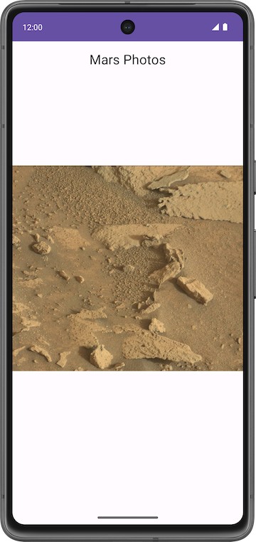

8. 火星の写真が画面全体に表示されていません。画面上の使用可能なスペースを埋めるには、`HomeScreen.kt` および `AsyncImage` で `contentScale` を `ContentScale.Crop` に設定します。

```kotlin
import androidx.compose.ui.layout.ContentScale

@Composable
fun MarsPhotoCard(photo: MarsPhoto, modifier: Modifier = Modifier) {
   AsyncImage(
       model = ImageRequest.Builder(context = LocalContext.current)
           .data(photo.imgSrc)
           .crossfade(true)
           .build(),
       contentDescription = stringResource(R.string.mars_photo),
       contentScale = ContentScale.Crop,
       modifier = modifier,
   )
}
```

9. アプリを実行し、画像が水平方向と垂直方向の両方で画面全体に表示されることを確認します。


#### 読み込み中の画像とエラーの画像を追加する

画像の読み込み時にプレースホルダ画像を表示して、アプリのユーザー エクスペリエンスを改善できます。画像がない、画像が破損していることなどが原因で読み込みが失敗した場合、エラー画像を表示することもできます。このセクションでは、`AsyncImage` を使用してエラー画像とプレースホルダ画像の両方を追加します。

1. `res/drawable/ic_broken_image.xml` を開き、右側の [**Design**] タブまたは [**Split**] タブをクリックします。エラー画像の場合は、組み込みのアイコン ライブラリにある破損した画像のアイコンを使用します。このベクター型ドローアブルでは、`android:tint` 属性によりアイコンがグレーに色付けされています。


2. `res/drawable/loading_img.xml` を開きます。このドローアブルは、中心点の周りで画像ドローアブル（`loading_img.xml`）が回転するアニメーションです（アニメーションはプレビューでは確認できません）。


3. `HomeScreen.kt` ファイルに戻ります。次のコードに示すように、`MarsPhotoCard` コンポーザブルで、`AsyncImage()` の呼び出しを更新して `error` 属性と `placeholder` 属性を追加します。

```kotlin
import androidx.compose.ui.res.painterResource

@Composable
fun MarsPhotoCard(photo: MarsPhoto, modifier: Modifier = Modifier) {
    AsyncImage(
        // ...
        error = painterResource(R.drawable.ic_broken_image),
        placeholder = painterResource(R.drawable.loading_img),
        // ...
    )
}
```

このコードは、読み込み時に使用する読み込み中のプレースホルダ画像（`loading_img` ドローアブル）を設定します。また、画像の読み込みに失敗した場合に使用する画像（`ic_broken_image` ドローアブル）も設定します。

完全な `MarsPhotoCard` コンポーザブルは、次のコードのようになります。

```kotlin
@Composable
fun MarsPhotoCard(photo: MarsPhoto, modifier: Modifier = Modifier) {
    AsyncImage(
        model = ImageRequest.Builder(context = LocalContext.current)
            .data(photo.imgSrc)
            .crossfade(true)
            .build(),
        error = painterResource(R.drawable.ic_broken_image),
        placeholder = painterResource(R.drawable.loading_img),
        contentDescription = stringResource(R.string.mars_photo),
        contentScale = ContentScale.Crop
    )
}
```

4. アプリを実行します。ネットワーク接続の速度によっては、Coil がプロパティ画像をダウンロードして表示する間、一瞬だけ読み込み中の画像が表示されます。しかし、ネットワークを切断しても、破損した画像のアイコンは表示されません。この問題は、レッスンの最後のタスクで修正します。


### 4. LazyVerticalGrid で画像のグリッドを表示する

以上で、アプリはインターネットから火星写真（最初の `MarsPhoto` リストアイテム）を読み込むようになりました。この火星写真データの画像 URL を使用して `AsyncImage` にデータを入力しました。しかし、目標はアプリに画像のグリッドを表示させることです。このタスクでは、`LazyVerticalGrid` とグリッド レイアウト マネージャーを使用して、画像のグリッドを表示します。

##### **Lazy グリッド**

[LazyVerticalGrid](https://developer.android.com/reference/kotlin/androidx/compose/foundation/lazy/grid/package-summary#LazyVerticalGrid(androidx.compose.foundation.lazy.grid.GridCells,androidx.compose.ui.Modifier,androidx.compose.foundation.lazy.grid.LazyGridState,androidx.compose.foundation.layout.PaddingValues,kotlin.Boolean,androidx.compose.foundation.layout.Arrangement.Vertical,androidx.compose.foundation.layout.Arrangement.Horizontal,androidx.compose.foundation.gestures.FlingBehavior,kotlin.Boolean,kotlin.Function1)) コンポーザブルと [LazyHorizontalGrid](https://developer.android.com/reference/kotlin/androidx/compose/foundation/lazy/grid/package-summary#LazyHorizontalGrid(androidx.compose.foundation.lazy.grid.GridCells,androidx.compose.ui.Modifier,androidx.compose.foundation.lazy.grid.LazyGridState,androidx.compose.foundation.layout.PaddingValues,kotlin.Boolean,androidx.compose.foundation.layout.Arrangement.Horizontal,androidx.compose.foundation.layout.Arrangement.Vertical,androidx.compose.foundation.gestures.FlingBehavior,kotlin.Boolean,kotlin.Function1)) コンポーザブルは、アイテムをグリッドに表示するためのサポートを提供しています。Lazy 垂直グリッドは、複数の列にわたって、上下にスクロール可能なコンテナにアイテムを表示し、Lazy 水平グリッドは横軸でそれと同じように動作します。

#### 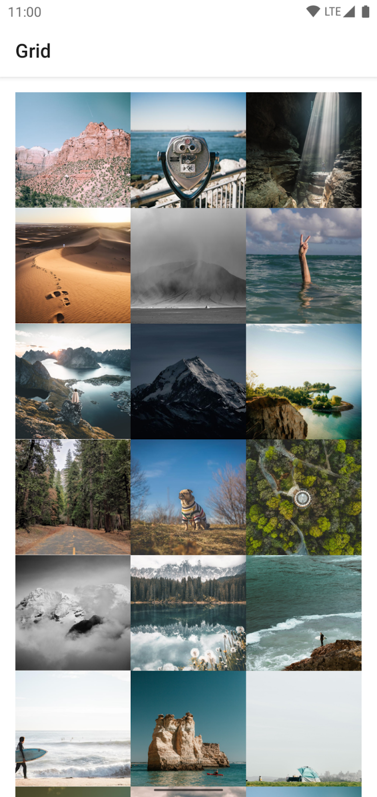

デザインの観点からすると、グリッド レイアウトは火星写真をアイコンまたは画像として表示するのに最適です。

[`LazyVerticalGrid`](https://developer.android.com/reference/kotlin/androidx/compose/foundation/lazy/grid/package-summary#LazyVerticalGrid(androidx.compose.foundation.lazy.grid.GridCells,androidx.compose.ui.Modifier,androidx.compose.foundation.lazy.grid.LazyGridState,androidx.compose.foundation.layout.PaddingValues,kotlin.Boolean,androidx.compose.foundation.layout.Arrangement.Vertical,androidx.compose.foundation.layout.Arrangement.Horizontal,androidx.compose.foundation.gestures.FlingBehavior,kotlin.Boolean,kotlin.Function1)) の `columns` パラメータと [`LazyHorizontalGrid`](https://developer.android.com/reference/kotlin/androidx/compose/foundation/lazy/grid/package-summary#LazyHorizontalGrid(androidx.compose.foundation.lazy.grid.GridCells,androidx.compose.ui.Modifier,androidx.compose.foundation.lazy.grid.LazyGridState,androidx.compose.foundation.layout.PaddingValues,kotlin.Boolean,androidx.compose.foundation.layout.Arrangement.Horizontal,androidx.compose.foundation.layout.Arrangement.Vertical,androidx.compose.foundation.gestures.FlingBehavior,kotlin.Boolean,kotlin.Function1)) の `rows` パラメータは、セルを列または行に配置する方法を制御します。次のサンプルコードでは、[`GridCells.Adaptive`](https://developer.android.com/reference/kotlin/androidx/compose/foundation/lazy/grid/GridCells.Adaptive) を使用して各列の幅を `128.dp` 以上に設定し、グリッド形式でアイテムを表示しています。

```kotlin
// Sample code - No need to copy over

@Composable
fun PhotoGrid(photos: List<Photo>) {
    LazyVerticalGrid(
        columns = GridCells.Adaptive(minSize = 150.dp)
    ) {
        items(photos) { photo ->
            PhotoItem(photo)
        }
    }
}
```

`LazyVerticalGrid` を使用するとアイテムの幅を指定でき、グリッドに可能な限り多くの列が収まるようになります。列の数が計算された後、グリッドは残りの幅を列間で均等に分配します。このような適応型のサイズ調整方法は、さまざまな画面サイズでアイテムのセットを表示する場合に特に便利です。

> **注**: 使用する列の数を正確に把握している場合は、必要な列の数を含む [`GridCells.Fixed`](https://developer.android.com/reference/kotlin/androidx/compose/foundation/lazy/grid/GridCells.Fixed) のインスタンスを指定できます。

このレッスンでは、火星写真を表示するために `LazyVerticalGrid` コンポーザブルを使用し、`GridCells.Adaptive` の幅を `150.dp` に設定します。

##### **アイテムのキー**

ユーザーがグリッド（`LazyColumn` 内の `LazyRow`）をスクロールすると、リストアイテムの位置が変更されます。しかし、画面の向きの変更やアイテムの追加または削除によって、ユーザーに表示される行内のスクロール位置が消える可能性があります。アイテムのキーを使用すると、キーに基づいてスクロール位置を維持できます。

キーを指定することで、Compose が並べ替えを正しく処理できるようになります。たとえば、アイテムに記憶された状態が含まれている場合、キーを設定すると、位置が変更されたときに、Compose がこの状態をアイテムと一緒に移動できるようになります。

#### **LazyVerticalGrid を追加する**

火星写真のリストを垂直グリッドで表示するコンポーザブルを追加します。

1. `HomeScreen.kt` ファイルで、`PhotosGridScreen()` という名前のコンポーズ可能な関数を新たに作成します。この関数は、`MarsPhoto` のリストと `modifier` を引数として受け取ります。

```kotlin
@Composable
fun PhotosGridScreen(
    photos: List<MarsPhoto>,
    modifier: Modifier = Modifier,
    contentPadding: PaddingValues = PaddingValues(0.dp),
) {
}
```

2. `PhotosGridScreen` コンポーザブル内に、次のパラメータで `LazyVerticalGrid` を追加します。

```kotlin
import androidx.compose.foundation.lazy.grid.LazyVerticalGrid
import androidx.compose.foundation.lazy.grid.GridCells
import androidx.compose.foundation.layout.fillMaxWidth
import androidx.compose.foundation.layout.PaddingValues
import androidx.compose.ui.unit.dp

@Composable
fun PhotosGridScreen(
    photos: List<MarsPhoto>,
    modifier: Modifier = Modifier,
    contentPadding: PaddingValues = PaddingValues(0.dp),
) {
    LazyVerticalGrid(
        columns = GridCells.Adaptive(150.dp),
        modifier = modifier.padding(horizontal = 4.dp),
        contentPadding = contentPadding,
   ) {
     }
}
```

3. アイテムのリストを追加するには、`LazyVerticalGrid` ラムダ内で `items()` 関数を呼び出して `MarsPhoto` のリストとアイテムキーを `photo.id` として渡します。

```kotlin
import androidx.compose.foundation.lazy.grid.items

@Composable
fun PhotosGridScreen(
    photos: List<MarsPhoto>,
    modifier: Modifier = Modifier,
    contentPadding: PaddingValues = PaddingValues(0.dp),
) {
   LazyVerticalGrid(
       // ...
   ) {
       items(items = photos, key = { photo -> photo.id }) {
       }
   }
}
```

4. 単一のリストアイテムで表示されるコンテンツを追加するには、`items` ラムダ式を定義します。`MarsPhotoCard` を呼び出して `photo` を渡します。

```kotlin
items(items = photos, key = { photo -> photo.id }) {
   photo -> MarsPhotoCard(photo)
}
```

5. リクエストが正常に完了したときに `MarsPhotoCard` コンポーザブルではなく `PhotosGridScreen` コンポーザブルを表示するように `HomeScreen` コンポーザブルを更新します。

```kotlin
when (marsUiState) {
       // ...
       is MarsUiState.Success -> PhotosGridScreen(marsUiState.photos, modifier)
       // ...
}
```

6. `MarsViewModel.kt` ファイルで、単一の `MarsPhoto` ではなく `MarsPhoto` オブジェクトのリストを受け入れるように、`MarsUiState` インターフェースを更新します。`PhotosGridScreen` コンポーザブルは、`MarsPhoto` オブジェクトのリストを受け入れます。

```kotlin
sealed interface MarsUiState {
    data class Success(val photos: List<MarsPhoto>) : MarsUiState
    //...
}
```

7. `MarsViewModel.kt` ファイルで、火星写真オブジェクトのリストを `MarsUiState.Success()` に渡すように `getMarsPhotos()` 関数を更新します。

```kotlin
marsUiState = try {
    MarsUiState.Success(marsPhotosRepository.getMarsPhotos())
}
```

8. アプリを実行します。

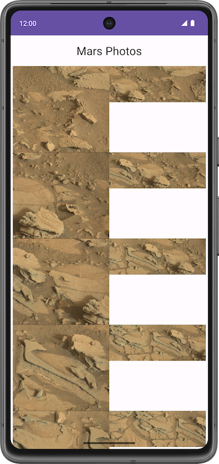

各写真の周囲にパディングはなく、写真ごとにアスペクト比が異なることに注意してください。これらの問題は `Card` コンポーザブルを追加することで解決できます。

#### **カード コンポーザブルを追加する**

1. `HomeScreen.kt` ファイルの `MarsPhotoCard` コンポーザブルで、`AsyncImage` の周囲に `8.dp` のエレベーションを持つ `Card` を追加します。`modifier` 引数を `Card` コンポーザブルに割り当てます。

```kotlin
import androidx.compose.material.Card
import androidx.compose.foundation.layout.aspectRatio
import androidx.compose.foundation.layout.padding

@Composable
fun MarsPhotoCard(photo: MarsPhoto, modifier: Modifier = Modifier) {

    Card(
        modifier = modifier,
        elevation = CardDefaults.cardElevation(defaultElevation = 8.dp)
    ) {

        AsyncImage(
            model = ImageRequest.Builder(context = LocalContext.current)
                .data(photo.imgSrc)
                .crossfade(true)
                .build(),
            error = painterResource(R.drawable.ic_broken_image),
            placeholder = painterResource(R.drawable.loading_img),
            contentDescription = stringResource(R.string.mars_photo),
            contentScale = ContentScale.Crop,
            modifier = Modifier.fillMaxWidth()
        )
    }
}
```

2. アスペクト比を修正するには、`PhotosGridScreen()` で `MarsPhotoCard()` の修飾子を更新します。

```kotlin
@Composable
fun PhotosGridScreen(photos: List<MarsPhoto>, modifier: Modifier = Modifier) {
   LazyVerticalGrid(
       //...
   ) {
       items(items = photos, key = { photo -> photo.id }) { photo ->
           MarsPhotoCard(
               photo,
               modifier = modifier
                   .padding(4.dp)
                   .fillMaxWidth()
                   .aspectRatio(1.5f)
           )
       }
   }
}
```

3. `PhotosGridScreen()` をプレビューするように結果画面のプレビューを更新します。空の画像 URL のモックデータ

```
@Preview(showBackground = true)
@Composable
fun PhotosGridScreenPreview() {
   MarsPhotosTheme {
       val mockData = List(10) { MarsPhoto("$it", "") }
       PhotosGridScreen(mockData)
   }
}
```

> **モックデータ:** 関数によっては、他のオブジェクトやデータに依存するものがあります。これらの関数の動作を分離するには、他のオブジェクトやデータをモックまたは架空のオブジェクトやデータに置き換えて、実際のオブジェクトの動作をシミュレートする必要があります。
> 
> モックは、実際のオブジェクトの動作を模倣したオブジェクトを作成するプロセスです。
> 
> モックは主に単体テストで使用されます。

モックデータには空の URL があるため、写真グリッドのプレビューに画像の読み込みが表示されます。

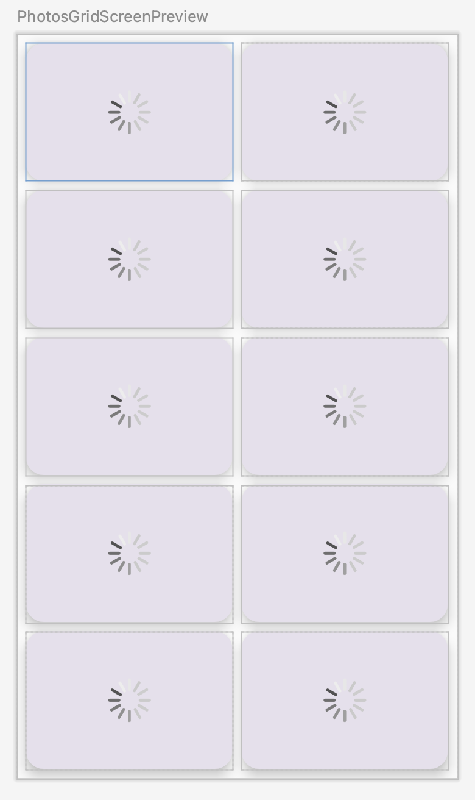

4. アプリを実行します。


5. アプリの実行中に機内モードをオンにします。
6. エミュレータで画像をスクロールします。まだ読み込まれていない画像が、破損した画像のアイコンとして表示されます。これは、ネットワーク エラーが発生したときや画像を取得できないときに表示するために Coil 画像ライブラリに渡した画像ドローアブルです。

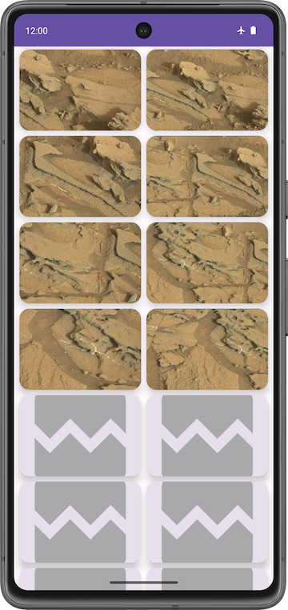

お疲れさまでした。エミュレータまたはデバイスで機内モードをオンにして、ネットワーク接続エラーをシミュレートしました。

### 5. 再試行アクションを追加する

このセクションでは、再試行アクション ボタンを追加し、ボタンがクリックされたときに写真を取得します。

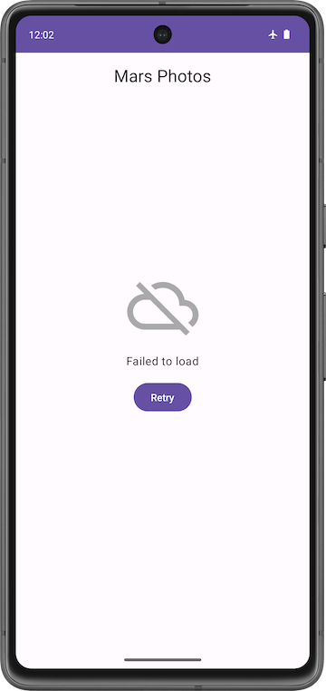

1. エラー画面にボタンを追加します。`HomeScreen.kt` ファイルで、`retryAction` ラムダ パラメータとボタンを含めるように `ErrorScreen()` コンポーザブルを更新します。

```kotlin
@Composable
fun ErrorScreen(retryAction: () -> Unit, modifier: Modifier = Modifier) {
    Column(
        // ...
    ) {
        Image(
            // ...
        )
        Text(//...)
        Button(onClick = retryAction) {
            Text(stringResource(R.string.retry))
        }
    }
}
```

> **注:** ErrorScreenPreview() が以下のコード スニペットに一致していることを確認してください。
> 
> 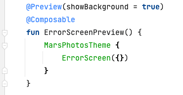

プレビューの確認

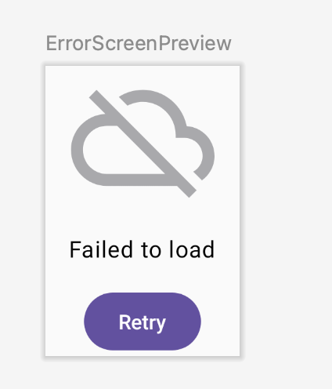

2. 再試行ラムダを渡すように `HomeScreen()` コンポーザブルを更新します。

```kotlin
@Composable
fun HomeScreen(
   marsUiState: MarsUiState, retryAction: () -> Unit, modifier: Modifier = Modifier
) {
   when (marsUiState) {
       //...

       is MarsUiState.Error -> ErrorScreen(retryAction, modifier = modifier.fillMaxSize())
   }
}
```

3. `ui/theme/MarsPhotosApp.kt` ファイルの `HomeScreen()` 関数呼び出しを更新し、`retryAction` ラムダ パラメータを `marsViewModel::getMarsPhotos` に設定します。これにより、サーバーから火星の写真が取得されます。

```kotlin
HomeScreen(
   marsUiState = marsViewModel.marsUiState,
   retryAction = marsViewModel::getMarsPhotos
)
```

### 6. ViewModel テストを更新する

`MarsUiState` と `MarsViewModel` が、1 枚の写真ではなく、写真のリストに対応するようになりました。現在の状態では、`MarsViewModelTest` は `MarsUiState.Success` データクラスが文字列プロパティを含むことを想定しています。そのため、テストはコンパイルされません。`marsViewModel_getMarsPhotos_verifyMarsUiStateSuccess()` テストを更新して、`MarsViewModel.marsUiState` が写真のリストを含む `Success` の状態と等しいことを確認する必要があります。

1. `rules/MarsViewModelTest.kt` ファイルを開きます。
2. `marsViewModel_getMarsPhotos_verifyMarsUiStateSuccess()` テストでは、`assertEquals()` 関数呼び出しを変更して、`Success` 状態（架空の写真リストを photos パラメータに渡す）を `marsViewModel.marsUiState` と比較します。

```kotlin
@Test
    fun marsViewModel_getMarsPhotos_verifyMarsUiStateSuccess() =
        runTest {
            val marsViewModel = MarsViewModel(
                marsPhotosRepository = FakeNetworkMarsPhotosRepository()
            )
            assertEquals(
                MarsUiState.Success(FakeDataSource.photosList),
                marsViewModel.marsUiState
            )
        }
```

これでテストのコンパイル、実行が完了し、合格できました。

### 7. 解答コードを取得する

このレッスンの完成したコードをダウンロードするには、次の git コマンドを使用します。

```
$ git clone https://github.com/google-developer-training/basic-android-kotlin-compose-training-mars-photos.git
```

または、リポジトリを ZIP ファイルとしてダウンロードし、Android Studio で開くこともできます。

> **注:**解答コードは、ダウンロードしたリポジトリの `main` ブランチにあります。

このレッスンの解答コードを確認する場合は、[GitHub](https://github.com/google-developer-training/basic-android-kotlin-compose-training-mars-photos/tree/main) で表示します。

### 8. まとめ

おつかれさまです。これでレッスンは完了し、Mars Photos アプリが完成しました。アプリを使って家族や友人に実際の火星の写真を見せてあげましょう。

作成したら、*#AndroidBasics* を付けて、ソーシャル メディアで共有しましょう。

### 9. 詳細

#### 関連リンク

Android デベロッパー ドキュメント:

- [リストとグリッド | Jetpack Compose | Android デベロッパー](https://developer.android.com/jetpack/compose/lists)
- [Lazy グリッド | Jetpack Compose | Android デベロッパー](https://developer.android.com/jetpack/compose/lists#lazy-grids)
- [ViewModel の概要](https://developer.android.com/topic/libraries/architecture/viewmodel)

その他:

- [Coil](https://coil-kt.github.io/coil/)

## 5. 練習: Amphibians アプリを作成する（提出対象）


### 1. 始める前に

#### はじめに

このユニットでは、インターネットからデータを取得してアプリをワンランク アップさせる方法を学習しました。アプリは、サーバーから利用可能な最新のデータを表示できるようになり、開いたときに静的に利用可能だったデータのみに限定されなくなりました。これは、実際のアプリのほとんどで非常に重要な機能です。

この演習セットでは、学習したコンセプトを活用して Amphibians アプリを作成します。このアプリは、インターネットから両生類のデータを取得し、スクロール リストに表示します。

解答コードは最後にあります。この学習体験を最大限に活用するため、記載された解答コードを確認する前に、できる限りご自身で実装とトラブルシューティングを行ってみてください。この実践時間中に、多くのことを学びましょう。

#### 前提条件

- レッスンインターネットから画像を読み込んで表示するの「Compose を用いた Android アプリ開発の基礎」コースワークを完了していること。

#### 必要なもの

- Android Studio がインストールされた、インターネットに接続できるパソコン。

#### 作成するアプリの概要

この演習セットでは、両生類のリストと、その詳細や画像を表示するアプリを作成します。データは、ネットワーク リクエストによってインターネットから取得します。これには、それぞれの両生類の名前、種類、説明、画像の URL が含まれます。

両生類の JSON データは [https://android-kotlin-fun-mars-server.appspot.com/amphibians](https://android-kotlin-fun-mars-server.appspot.com/amphibians) でホストされています。

提示されている解答コードでは、以下の UI デザインが表示されます。

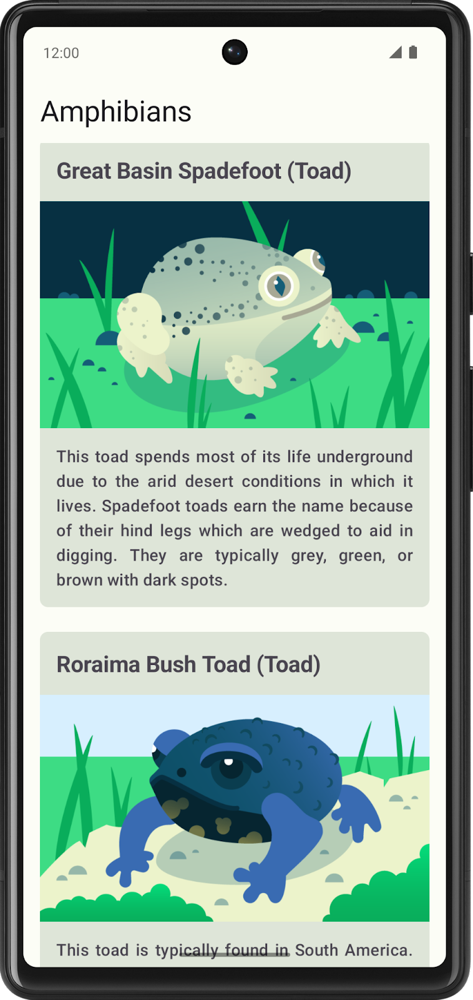

以下のセクションでは、アプリを作成する一般的な手順を紹介します。手順どおりに行う必要はありませんが、作成方法の参考としてご利用ください。

### 2. アプリを計画する

コーディングを始める前に、アプリの各種要素とそれらがどのように接続されているかについて大まかに説明します。

この準備作業を行うと、何を行う必要があるかを特定できます。また、問題が発生する可能性のある場所がわかることがあり、問題を解決する方法について検討することもできます。

### 3. 新しいプロジェクトを作成する

Android Studio で新しいプロジェクトから始めます。

1. Android Studio を開き、[**New Project**] を選択します。
2. [Templates] で [**Phone and Tablet**] を選択します。
3. [**Empty Activity**] を選択して、[**Next**] をクリックします。
4. 名前を **Amphibians** に変更します。
5. [**完了**] をクリックします。

これで、コーディングを開始できます。

### 4. 依存関係を設定する

このアプリは、ネットワーク リクエストに Retrofit、画像の読み込みに Coil、Amphibians API から返された JSON の解析に kotlinx.serialization ライブラリを使用します。

`app/build.gradle.kts` にその依存関係を追加します。

### 5. UI レイヤを作成する

[Android アプリ アーキテクチャ](https://developer.android.com/topic/architecture)のおすすめの方法に沿って、このアプリの UI レイヤを作成することをおすすめします。

このレイヤには `ViewModel` と、`ViewModel` からの `UiState` を表示するコンポーズ可能な関数が含まれます。`ViewModel` は、画面の UI 状態を公開し、UI レイヤのビジネス ロジックを処理して、階層の他のレイヤからビジネス ロジックを呼び出します。

[UI レイヤ](https://developer.android.com/topic/architecture/ui-layer)には、ユーザーが見て操作する視覚的要素も含まれます。計画している UI を作成するには、このレイヤで、各種要素をどのように組み合わせるかを指定します。色、フォント、画像の表示方法を指定することになります。

### 6. データレイヤを作成する

データレイヤは、API から両生類のデータを取得します。

両生類のデータ用のデータクラス、データを管理するためのリポジトリ、ネットワークからデータを取得するためのデータソース クラスを含めることをおすすめします。

ネットワーク呼び出しについてご不明な点がありましたら、レッスン [インターネットからデータを取得する](https://www.google.com/url?sa=D&q=https%3A%2F%2Fdeveloper.android.com%2Fcodelabs%2Fbasic-android-kotlin-compose-getting-data-internet)のウェブサービスと Retrofit をご覧ください。

ネットワーク レスポンスの解析についてご不明な点がありましたら、kotlinx.serialization を使用して JSON レスポンスを解析するをご覧ください。

Coil を使用して画像を読み込む方法については、[公式ドキュメント](https://coil-kt.github.io/coil/)をご確認ください。またはレッスン [インターネットから画像を読み込んで表示する](https://www.google.com/url?sa=D&q=https%3A%2F%2Fdeveloper.android.com%2Fcodelabs%2Fbasic-android-kotlin-compose-load-images)のダウンロードした画像を表示するをもう一度ご覧ください。

### 7. 依存関係インジェクションを実装する

アプリの柔軟性、堅牢性、スケーラビリティを維持するため、[依存関係インジェクション](https://developer.android.com/training/dependency-injection)（DI）を使用する必要があります。

DI を使用すると、アプリ コンポーネントが疎結合されたままとなりテストしやすくなります。

DI を実装する場合は、アプリに必要な依存関係を取得するために使う[アプリケーション コンテナ](https://developer.android.com/training/dependency-injection/manual#dependencies-container)を作成する必要があります。

アプリケーション コンテナは、アプリ全体からアクセスできる必要があります。これを実現するには、カスタムの `Application` クラスに依存関係コンテナを保持します。このクラスは [`Application` クラス](https://developer.android.com/reference/android/app/Application)から継承します。

この機能の実装についてご不明な点がありましたら、以下をご覧ください。

- アプリケーション コンテナについては、レッスンリポジトリと手動 DI を追加するの依存関係インジェクションとアプリケーション コンテナをアプリにアタッチするをご覧ください。
- アプリのクラスコードについては、アプリケーション コンテナをアプリにアタッチするをご覧ください。

### 8. 解答コード

> **解答コードの URL:**
> 
> [`https://github.com/google-developer-training/basic-android-kotlin-compose-training-amphibians`](https://github.com/google-developer-training/basic-android-kotlin-compose-training-amphibians)
> 
> **ブランチ名:**`main`

## 6. つまずきやすいポイント

- Amphibians アプリは Unit 5 の総まとめです。「Mars Photos と同じ構成で、API と表示だけ変える」と考えると見通しが立ちます。
- Repository を挟む理由は「テストしやすくする」「データの取り方を後から変えられる」の 2 つです。自分の言葉で説明できるようにしましょう。

## 7. AIに質問する（この章の例）

次の例をそのままAIに投げてOKです（必要なら自分のコード/エラーに置き換えてください）。

```text
「Repository パターンを挟む理由を「テストしやすさ」「差し替えやすさ」の観点で説明して」
「手動の依存関係注入（`AppContainer`）が何をしているのか、コードを追いながら説明して（コード: ここに貼る）」
「練習: Amphibians アプリ を Mars Photos と同じ構成で作りたい。変える箇所と変えない箇所を一覧にして」
```

質問がまとまらないときは、第0章の「質問テンプレ」を使ってください。

## 8. 提出物

次のレッスンで完成させた Android Studio プロジェクトを、学習用リポジトリの `unit5/Amphibians/` に置きます（プロジェクトフォルダごとコピー。`build/` と `.idea/` は含めない）。

- 練習: Amphibians アプリを作成する

PR 本文には次の 3 点を書いてください。

- **やったこと**：どのレッスン / 演習を完了したか
- **動作確認**：どの端末（エミュレータ名 or 実機）で何を確認したか
- **詰まった点と解決**：エラーの内容と、どう直したか（AI に聞いた内容も可）

## 9. チェックリスト

- [ ] Repository パターンでデータ取得を UI から分離できる
- [ ] 手動の依存関係注入（`AppContainer`）を説明できる
- [ ] Coil で URL から画像を読み込んで表示できる
- [ ] パスウェイ末尾のクイズに合格した
- [ ] 提出物が `unit5/Amphibians/` にあり、Android Studio（または Kotlin Playground）で開いて動く

---

## 課題提出

この章には提出課題があります。

1. 上記の提出物を完了する
2. GitHub で `feature/05-load-images` ブランチを作成し、`develop` へのPRを作成（base=`develop`）
3. [AIプログラムレビュー](https://ai.studio/apps/84d224cb-7de1-44fb-995b-9a5917d25603?fullscreenApplet=true) を実行
4. 問題がなければ、進捗ダッシュボードで **PR URL** と **完了日** を記録
