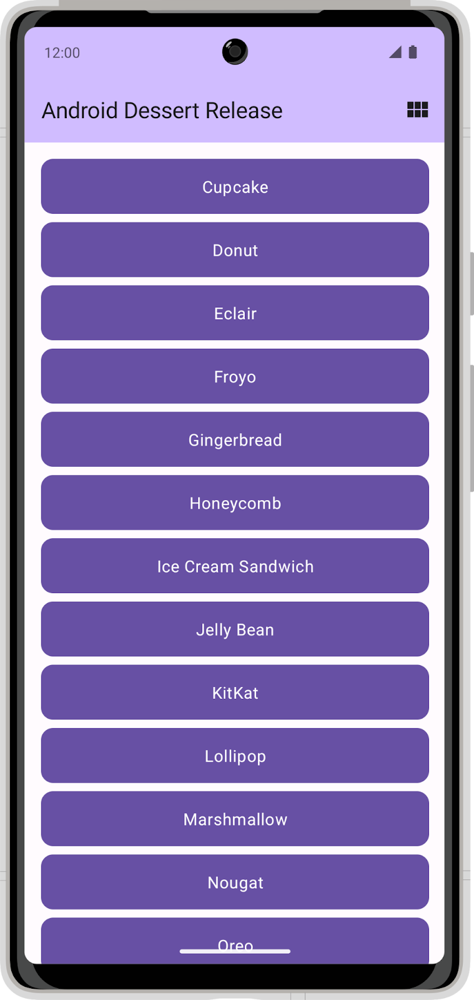
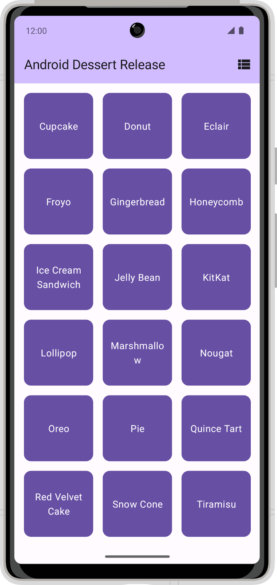
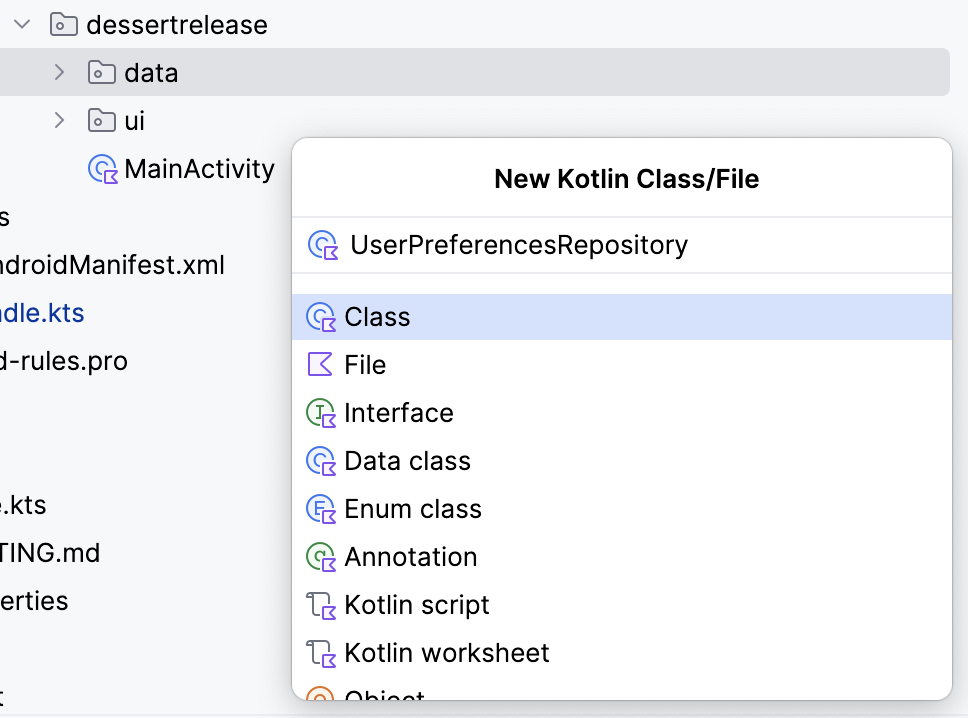

# 第17章: DataStore でキーを使用してデータにアクセスし保存する

> ユニット 6「データの永続化」 パスウェイ 3
> 提出ブランチ: `feature/06-datastore`

## 1. この章のゴール

- Preferences DataStore で Key-Value の設定値を保存・読み出しできる
- Room と DataStore の使い分け（構造化データか、単純な設定か）を説明できる

## 2. 進め方

次の内容を **上から順番に** 進めます。「やらなくてOK」の行は飛ばして構いません。レッスンの本文はこのページの下にすべて掲載しています。目安時間の合計は約130分です。

| # | 種類 | 内容 | 目安 | 備考 |
|---|---|---|---|---|
| 1 | レッスン | DataStore を使用して設定をローカルに保存する | 約120分 | **提出対象** |
| 2 | レッスン | プロジェクト: フライト検索アプリを作成する | — | **やらなくてOK**（学習効果に対して難易度・工数が高い） |
| 3 | クイズ | [テスト: DataStore](https://developer.android.com/courses/quizzes/android-basics-compose-unit-6-pathway-3/android-basics-compose-unit-6-pathway-3?hl=ja) | 約10分 | 公式サイトで受ける |

このプログラムの進め方は次の通りです。

1. 下の各レッスンを読み、各ステップの説明を理解してから **自分でコードを打つ**（コピペで済ませない）
2. ステップごとにアプリを実行し、期待どおり動くか確認する
3. 動かないときは、エラー文をそのまま AI に貼って「何が原因か」を聞き、直したら **なぜ直ったか** をメモする
4. 末尾のクイズを受けて、間違えた項目をレッスンで読み直す

> レッスン本文は Google Developers の公式コンテンツ（CC BY 4.0）を日本語のまま転載しています。画面が最新の Android Studio と異なる場合があります。

## 3. DataStore を使用して設定をローカルに保存する（提出対象）


### 1. 始める前に

#### はじめに

このユニットで、SQL と Room を使用してデバイスにデータをローカルで保存する方法を学びました。SQL と Room は強力なツールです。ただし、リレーショナル データを保存する必要がない場合には、DataStore のシンプルなソリューションを利用できます。DataStore Jetpack コンポーネントは、少ないオーバーヘッドで小さくシンプルなデータセットを保存できる優れた方法です。DataStore には、`Preferences DataStore` と `Proto DataStore` の 2 種類の実装があります。

- `Preferences DataStore` は Key-Value ペアを格納します。値は、`String`、`Boolean`、`Integer` などの Kotlin の基本データ型にできます。複雑なデータセットは保存されません。定義済みのスキーマは必要ありません。`Preferences Datastore` の主なユースケースは、ユーザー設定をデバイスに保存することです。
- `Proto DataStore` はカスタムデータ型を格納します。proto 定義をオブジェクト構造にマッピングする事前定義スキーマが必要です。

このレッスンでは `Preferences DataStore` についてのみ説明します。`Proto DataStore` の詳細については、[DataStore](https://developer.android.com/topic/libraries/architecture/datastore) のドキュメントをご覧ください。

`Preferences DataStore` は、ユーザー管理の設定を保存する優れた方法です。このレッスンでは、`DataStore` を実装してこれを行う方法について学びます。

#### 前提条件:

- Room によるデータの読み取りと更新のレッスンを通じて、「Compose での Android の基礎」コースワークを完了していること

#### 必要なもの

- Android Studio がインストールされた、インターネットに接続できるパソコン。
- デバイスまたはエミュレータ
- Dessert Release アプリのスターター コード

#### 作成するアプリの概要

Dessert Release アプリには、Android リリースのリストが表示されます。アプリバーのアイコンで、グリッドビュー レイアウトとリストビュー レイアウトを切り替えます。

 

現在の状態では、アプリはレイアウトの選択を保持しません。アプリを閉じてもレイアウトの選択は保存されず、設定はデフォルトの選択に戻ります。このレッスンでは、`DataStore` を Dessert Release アプリに追加し、これを使用してレイアウトの選択設定を保存します。

### 2. スターター コードをダウンロードする

次のリンクをクリックして、このレッスンのコードをすべてダウンロードします。

また、必要に応じて、GitHub から Dessert Release コードのクローンを作成することもできます。

> **スターター コードの URL:**
> 
> [`https://github.com/google-developer-training/basic-android-kotlin-compose-training-dessert-release`](https://github.com/google-developer-training/basic-android-kotlin-compose-training-dessert-release/tree/starter)
> 
> **スターター コードのブランチ名:**`starter`

```
$ git clone https://github.com/google-developer-training/basic-android-kotlin-compose-training-dessert-release.git
$ cd basic-android-kotlin-compose-training-dessert-release
$ git checkout starter
```

1. Android Studio で `basic-android-kotlin-compose-training-dessert-release` フォルダを開きます。
2. Android Studio で Dessert Release アプリのコードを開きます。

### 3. 依存関係を設定する

`app/build.gradle.kts` ファイルの `dependencies` に以下を追加します。

```kotlin
implementation("androidx.datastore:datastore-preferences:1.0.0")
```

### 4. ユーザー設定リポジトリを実装する

1. `data` パッケージで、`UserPreferencesRepository` という名前の新しいクラスを作成します。



2. `UserPreferencesRepository` コンストラクタで、`Preferences` 型の `DataStore` オブジェクト インスタンスを表すプライベート値プロパティを定義します。

```kotlin
class UserPreferencesRepository(
    private val dataStore: DataStore<Preferences>
){
}
```

> **注:** Preferences クラスでは `androidx.datastore.preferences.core.Preferences` インポートを使用してください。

`DataStore` は Key-Value ペアを格納します。値にアクセスするにはキーを定義する必要があります。

3. `UserPreferencesRepository` クラス内に `companion object` を作成します。
4. `booleanPreferencesKey()` 関数を使用してキーを定義し、そのキーに `is_linear_layout` という名前を渡します。SQL テーブル名と同様に、このキーにはアンダースコア形式を使用する必要があります。このキーは、線形レイアウトを表示するかどうかを示すブール値にアクセスするために使用されます。

```kotlin
class UserPreferencesRepository(
    private val dataStore: DataStore<Preferences>
){
    private companion object {
        val IS_LINEAR_LAYOUT = booleanPreferencesKey("is_linear_layout")
    }
    ...
}
```

#### DataStore へ書き込む

`DataStore` 内の値を作成、変更するには、ラムダを `edit()` メソッドに渡します。ラムダに `MutablePreferences` のインスタンスが渡され、これを使用して `DataStore` の値を更新できます。このラムダ内のすべての更新は、単一のトランザクションとして実行されます。つまり、更新はアトミックで、一度に行われます。この更新により、一部の値が更新されても他の値が更新されない状況が回避されます。

1. suspend 関数を作成し、`saveLayoutPreference()` という名前を付けます。
2. `saveLayoutPreference()` 関数で、`dataStore` オブジェクトに対して `edit()` メソッドを呼び出します。

```kotlin
suspend fun saveLayoutPreference(isLinearLayout: Boolean) {
    dataStore.edit {

    }
}
```

3. コードを読みやすくするために、ラムダ本体で提供される `MutablePreferences` の名前を定義します。このプロパティを使用して、定義したキーと、`saveLayoutPreference()` 関数に渡されたブール値を使用して値を設定します。

```kotlin
suspend fun saveLayoutPreference(isLinearLayout: Boolean) {
    dataStore.edit { preferences ->
        preferences[IS_LINEAR_LAYOUT] = isLinearLayout
    }
}
```

> **注:** この関数が呼び出されて値が設定されるまで、値は DataStore 内に存在しません。`edit()` メソッドで Key-Value ペアを設定すると、値が定義され、アプリのキャッシュまたはデータがクリアされるまで初期化されます。

#### DataStore から読み取る

`isLinearLayout` を `dataStore` に書き込む方法を構築しました。これを読み取る手順は次のとおりです。

1. `UserPreferencesRepository` に、`isLinearLayout` という `Flow<Boolean>` 型のプロパティを作成します。

```kotlin
val isLinearLayout: Flow<Boolean> =
```

2. `DataStore.data` プロパティを使用して `DataStore` 値を公開できます。`isLinearLayout` を `DataStore` オブジェクトの `data` プロパティに設定します。

```kotlin
val isLinearLayout: Flow<Boolean> = dataStore.data
```

> **注:** このコードはコンパイルされず、`dataStore.data` の命令に赤の下線が付きます。実装はまだ完了していないため、この結果は想定内です。

`data` プロパティは、`Preferences` オブジェクトの `Flow` です。`Preferences` オブジェクトは、DataStore 内のすべての Key-Value ペアを格納します。DataStore のデータが更新されるたびに、新しい `Preferences` オブジェクトが `Flow` に出力されます。

3. map 関数を使用して、`Flow<Preferences>` を `Flow<Boolean>` に変換します。

この関数は、現在の `Preferences` オブジェクトをパラメータとして持つラムダを受け入れます。以前に定義したキーを指定して、レイアウト設定を取得できます。`saveLayoutPreference` がまだ呼び出されていない場合、値が存在しない可能性があるため、デフォルト値も指定する必要があります。

4. 線形レイアウト ビューをデフォルトにするには、`true` を指定します。

> **注:** 設定を定義して初期化するまで、設定は `DataStore` に保存されません。そのため、設定が存在することをプログラムで確認し、存在しない場合にデフォルト値を指定する必要があります。

```kotlin
val isLinearLayout: Flow<Boolean> = dataStore.data.map { preferences ->
    preferences[IS_LINEAR_LAYOUT] ?: true
}
```

#### 例外処理

デバイスでファイル システムを操作する際には、なんらかの失敗が発生する可能性があります。たとえば、ファイルが存在しない、ディスクに空きがない、ディスクがマウントされていない、といったことが起こります。`DataStore` でファイルのデータの読み書きを行う際、`DataStore` へのアクセス時に `IOExceptions` が発生する場合があります。例外をキャッチしてこれらの失敗を処理するには、`catch{}` 演算子を使用します。

1. コンパニオン オブジェクトに、ロギングに使用する不変の `TAG` 文字列プロパティを実装します。

```kotlin
private companion object {
    val IS_LINEAR_LAYOUT = booleanPreferencesKey("is_linear_layout")
    const val TAG = "UserPreferencesRepo"
}
```

2. `Preferences DataStore` は、データの読み取り中にエラーが発生した場合、`IOException` をスローします。`isLinearLayout` の初期化ブロックで、`map()` の前に `catch{}` 演算子を使用して、`IOException` をキャッチできるようにします。

```kotlin
val isLinearLayout: Flow<Boolean> = dataStore.data
    .catch {}
    .map { preferences ->
        preferences[IS_LINEAR_LAYOUT] ?: true
    }
```

3. catch ブロックに `IOexception` がある場合は、エラーを記録して `emptyPreferences()` を出力します。別のタイプの例外がスローされた場合は、その例外を再スローすることをおすすめします。エラーがある場合に `emptyPreferences()` を出力することで、map 関数で引き続きデフォルト値にマッピングできます。

```kotlin
val isLinearLayout: Flow<Boolean> = dataStore.data
    .catch {
        if(it is IOException) {
            Log.e(TAG, "Error reading preferences.", it)
            emit(emptyPreferences())
        } else {
            throw it
        }
    }
    .map { preferences ->
        preferences[IS_LINEAR_LAYOUT] ?: true
    }
```

### 5. DataStore を初期化する

このレッスンでは、依存関係挿入を手動で処理する必要があります。したがって、`UserPreferencesRepository` クラスに `Preferences DataStore` を手動で指定する必要があります。`DataStore` を `UserPreferencesRepository` に挿入する手順は次のとおりです。

1. `dessertrelease` パッケージを見つけます。
2. このディレクトリ内に `DessertReleaseApplication` という新しいクラスを作成し、`Application` クラスを実装します。これは DataStore のコンテナです。

```kotlin
class DessertReleaseApplication: Application() {
}
```

3. `DessertReleaseApplication.kt` ファイル内、ただし `DessertReleaseApplication` クラスの外部で、`LAYOUT_PREFERENCE_NAME` という `private const val` を宣言します。
4. `LAYOUT_PREFERENCE_NAME` 変数に文字列値 `layout_preferences` を割り当てます。これは、次のステップでインスタンス化する `Preferences Datastore` の名前として使用できます。

```kotlin
private const val LAYOUT_PREFERENCE_NAME = "layout_preferences"
```

5. `DessertReleaseApplication` クラス本体の外側にある `DessertReleaseApplication.kt` ファイル内で、`preferencesDataStore` デリゲートを使用して `Context.dataStore` という `DataStore<Preferences>` 型のプライベート値プロパティを作成します。`preferencesDataStore` デリゲートの `name` パラメータの `LAYOUT_PREFERENCE_NAME` を渡します。

```kotlin
private const val LAYOUT_PREFERENCE_NAME = "layout_preferences"
private val Context.dataStore: DataStore<Preferences> by preferencesDataStore(
    name = LAYOUT_PREFERENCE_NAME
)
```

6. `DessertReleaseApplication` クラス本文内で、`UserPreferencesRepository` の `lateinit var` インスタンスを作成します。

```kotlin
private const val LAYOUT_PREFERENCE_NAME = "layout_preferences"
private val Context.dataStore: DataStore<Preferences> by preferencesDataStore(
    name = LAYOUT_PREFERENCE_NAME
)

class DessertReleaseApplication: Application() {
    lateinit var userPreferencesRepository: UserPreferencesRepository
}
```

7. `onCreate()` メソッドをオーバーライドします。

```kotlin
private const val LAYOUT_PREFERENCE_NAME = "layout_preferences"
private val Context.dataStore: DataStore<Preferences> by preferencesDataStore(
    name = LAYOUT_PREFERENCE_NAME
)

class DessertReleaseApplication: Application() {
    lateinit var userPreferencesRepository: UserPreferencesRepository

    override fun onCreate() {
        super.onCreate()
    }
}
```

8. `onCreate()` メソッド内で、`dataStore` をパラメータとして `UserPreferencesRepository` を作成して、`userPreferencesRepository` を初期化します。

```kotlin
private const val LAYOUT_PREFERENCE_NAME = "layout_preferences"
private val Context.dataStore: DataStore<Preferences> by preferencesDataStore(
    name = LAYOUT_PREFERENCE_NAME
)

class DessertReleaseApplication: Application() {
    lateinit var userPreferencesRepository: UserPreferencesRepository

    override fun onCreate() {
        super.onCreate()
        userPreferencesRepository = UserPreferencesRepository(dataStore)
    }
}
```

9. `AndroidManifest.xml` ファイルの `<application>` タグ内に次の行を追加します。

```kotlin
<application
    android:name=".DessertReleaseApplication"
    ...
</application>
```

このアプローチでは、`DessertReleaseApplication` クラスをアプリのエントリ ポイントとして定義します。このコードの目的は、`MainActivity` を起動する前に、`DessertReleaseApplication` クラスで定義された依存関係を初期化することです。

### 6. UserPreferencesRepository を使用する

#### リポジトリを ViewModel に提供する

`UserPreferencesRepository` が依存関係の挿入により利用可能となったので、`DessertReleaseViewModel` でこれを使用できます。

1. `DessertReleaseViewModel` で、コンストラクタ パラメータとして `UserPreferencesRepository` のプロパティを作成します。

```kotlin
class DessertReleaseViewModel(
    private val userPreferencesRepository: UserPreferencesRepository
) : ViewModel() {
    ...
}
```

2. `ViewModel` のコンパニオン オブジェクトの `viewModelFactory initializer` ブロックで、次のコードを使用して `DessertReleaseApplication` のインスタンスを取得します。

```kotlin
    ...
    companion object {
        val Factory: ViewModelProvider.Factory = viewModelFactory {
            initializer {
                val application = (this[APPLICATION_KEY] as DessertReleaseApplication)
                ...
            }
        }
    }
}
```

3. `DessertReleaseViewModel` のインスタンスを作成し、`userPreferencesRepository` を渡します。

```kotlin
    ...
    companion object {
        val Factory: ViewModelProvider.Factory = viewModelFactory {
            initializer {
                val application = (this[APPLICATION_KEY] as DessertReleaseApplication)
                DessertReleaseViewModel(application.userPreferencesRepository)
            }
        }
    }
}
```

`UserPreferencesRepository` に ViewModel からアクセスできるようになりました。次のステップでは、先ほど実装した `UserPreferencesRepository` の読み取りと書き込みの機能を使用します。

#### レイアウト設定を保存する

1. `DessertReleaseViewModel` の `selectLayout()` 関数を編集して設定リポジトリにアクセスし、レイアウト設定を更新します。
2. `DataStore` への書き込みは、`suspend` 関数を使用して非同期に行われます。設定リポジトリの `saveLayoutPreference()` 関数を呼び出す新しいコルーチンを開始します。

```kotlin
fun selectLayout(isLinearLayout: Boolean) {
    viewModelScope.launch {
        userPreferencesRepository.saveLayoutPreference(isLinearLayout)
    }
}
```

#### レイアウト設定を読み取る

このセクションでは、`ViewModel` の既存の `uiState: StateFlow` をリファクタリングして、リポジトリの `isLinearLayout: Flow` を反映させます。

1. `uiState` プロパティを `MutableStateFlow(DessertReleaseUiState)` に初期化するコードを削除します。

```kotlin
val uiState: StateFlow<DessertReleaseUiState> =
```

リポジトリからの線形レイアウト設定には、true または false という 2 つの値があり、形式は `Flow<Boolean>` です。この値は、UI の状態にマッピングする必要があります。

2. `StateFlow` を、`isLinearLayout Flow` で呼び出される `map()` コレクション変換の結果に設定します。

```kotlin
val uiState: StateFlow<DessertReleaseUiState> =
    userPreferencesRepository.isLinearLayout.map { isLinearLayout ->
}
```

3. `DessertReleaseUiState` データクラスのインスタンスを返し、`isLinearLayout Boolean` を渡します。画面はこの UI 状態を使用して、表示する正しい文字列とアイコンを決定します。

```kotlin
val uiState: StateFlow<DessertReleaseUiState> =
    userPreferencesRepository.isLinearLayout.map { isLinearLayout ->
        DessertReleaseUiState(isLinearLayout)
    }
```

`UserPreferencesRepository.isLinearLayout` は `Flow` で、これは [*cold*](https://developer.android.com/kotlin/flow/stateflow-and-sharedflow#sharein) です。ただし、UI に状態を提供するには、`StateFlow` などの*ホットフロー*を使用して、UI で状態が常にすぐに使用できるようにすることをおすすめします。

4. `stateIn()` 関数を使用して、`Flow` を `StateFlow` に変換します。
5. `stateIn()` 関数は、`scope`、`started`、`initialValue` の 3 つのパラメータを受け入れます。これらのパラメータには、それぞれ `viewModelScope`、`SharingStarted.WhileSubscribed(5_000)`、`DessertReleaseUiState()` を渡します。

```kotlin
val uiState: StateFlow<DessertReleaseUiState> =
    userPreferencesRepository.isLinearLayout.map { isLinearLayout ->
        DessertReleaseUiState(isLinearLayout)
    }
.stateIn(
        scope = viewModelScope,
        started = SharingStarted.WhileSubscribed(5_000),
        initialValue = DessertReleaseUiState()
    )
```

> **注:** `started` パラメータと、`SharingStarted.WhileSubscribed(5_000)` が渡される理由については、[LiveData から Kotlin のフローへの移行](https://medium.com/androiddevelopers/migrating-from-livedata-to-kotlins-flow-379292f419fb)をご覧ください。

6. アプリを起動します。切り替えアイコンをクリックすると、グリッド レイアウトと線形レイアウトを切り替えることができます。

> **注:** レイアウトを切り替えてアプリを閉じてみてください。アプリをもう一度開くと、レイアウトの設定が保存されていることがわかります。

 

お疲れさまでした。ユーザーのレイアウト設定を保存するために、アプリに `Preferences DataStore` を追加しました。

### 7. 解答コードを取得する

このレッスンの完成したコードをダウンロードするには、以下の git コマンドを使用します。

```
$ git clone https://github.com/google-developer-training/basic-android-kotlin-compose-training-dessert-release.git
$ cd basic-android-kotlin-compose-training-dessert-release
$ git checkout main
```

または、リポジトリを ZIP ファイルとしてダウンロードし、Android Studio で開くこともできます。

> **注:**解答コードは、ダウンロードしたリポジトリの `main` ブランチにあります。

解答コードを確認する場合は、[GitHub で表示します](https://github.com/google-developer-training/basic-android-kotlin-compose-training-dessert-release/tree/main)。

## 4. つまずきやすいポイント

- DataStore は「ダークテーマ ON/OFF」「最後に開いたタブ」のような小さな設定に向いています。一覧データを入れたくなったら Room を使います。

## 5. AIに質問する（この章の例）

次の例をそのままAIに投げてOKです（必要なら自分のコード/エラーに置き換えてください）。

```text
「Room と DataStore の使い分けを、具体例つきで説明して」
「Preferences DataStore に Boolean を保存して読み出す最小のコードを、方針→ヒントの順で教えて」
「DataStore の値を `Flow` で受け取って Compose に反映する流れを説明して」
```

質問がまとまらないときは、第0章の「質問テンプレ」を使ってください。

## 6. 提出物

次のレッスンで完成させた Android Studio プロジェクトを、学習用リポジトリの `unit6/DessertRelease/` に置きます（プロジェクトフォルダごとコピー。`build/` と `.idea/` は含めない）。

- DataStore を使用して設定をローカルに保存する

PR 本文には次の 3 点を書いてください。

- **やったこと**：どのレッスン / 演習を完了したか
- **動作確認**：どの端末（エミュレータ名 or 実機）で何を確認したか
- **詰まった点と解決**：エラーの内容と、どう直したか（AI に聞いた内容も可）

## 7. チェックリスト

- [ ] Preferences DataStore で Key-Value の設定値を保存・読み出しできる
- [ ] Room と DataStore の使い分け（構造化データか、単純な設定か）を説明できる
- [ ] パスウェイ末尾のクイズに合格した
- [ ] 提出物が `unit6/DessertRelease/` にあり、Android Studio（または Kotlin Playground）で開いて動く

---

## 課題提出

この章には提出課題があります。

1. 上記の提出物を完了する
2. GitHub で `feature/06-datastore` ブランチを作成し、`develop` へのPRを作成（base=`develop`）
3. [AIプログラムレビュー](https://ai.studio/apps/84d224cb-7de1-44fb-995b-9a5917d25603?fullscreenApplet=true) を実行
4. 問題がなければ、進捗ダッシュボードで **PR URL** と **完了日** を記録
