# 第16章: Room を使用してデータを永続化する

> ユニット 6「データの永続化」 パスウェイ 2
> 提出ブランチ: `feature/06-room`

## 1. この章のゴール

- Room の Entity / DAO / Database の役割を説明できる
- アプリを再起動してもデータが残る CRUD アプリを作れる
- `Flow` でデータベースの変更を UI に自動反映できる

## 2. 進め方

公式パスウェイの内容を **上から順番に** 進めます。「やらなくてOK」の行は飛ばして構いません。Codelab の本文はこのページの下にすべて掲載しています（公式の動画はこのプログラムでは扱いません）。目安時間の合計は約435分です。

| # | 種類 | 内容 | 目安 | 備考 |
|---|---|---|---|---|
| 1 | 記事 | [Flow のテスト](https://developer.android.com/kotlin/flow/test?hl=ja) | — | **やらなくてOK**（学習効果に対して難易度・工数が高い） |
| 2 | Codelab | Room を使用してデータを永続化する | 約150分 |  |
| 3 | Codelab | Room によるデータの読み取りと更新 | 約120分 |  |
| 4 | Codelab | 演習: Bus Schedule アプリを作成する | 約150分 | **提出対象** |
| 5 | クイズ | [テスト: Room](https://developer.android.com/courses/quizzes/android-basics-compose-unit-6-pathway-2/android-basics-compose-unit-6-pathway-2?hl=ja) | 約15分 | 公式サイトで受ける |

Codelab の進め方は次の通りです。

1. 下の各 Codelab を読み、各ステップの説明を理解してから **自分でコードを打つ**（コピペで済ませない）
2. ステップごとにアプリを実行し、期待どおり動くか確認する
3. 動かないときは、エラー文をそのまま AI に貼って「何が原因か」を聞き、直したら **なぜ直ったか** をメモする
4. パスウェイ末尾のクイズを受けて、間違えた項目を Codelab で読み直す

> Codelab 本文は Google Developers の公式 Codelab（CC BY 4.0）を日本語のまま転載しています。画面が最新の Android Studio と異なる場合があります。

## 3. Room を使用してデータを永続化する


### 1. 始める前に

ほとんどの製品版品質のアプリには、保持する必要のあるデータがあります。たとえば、曲のプレイリスト、To-Do リストの項目、収支の記録、星座表、個人データの履歴などが挙げられます。そのようなユースケースでは、この永続データの保存にデータベースを使用します。

[Room](https://developer.android.com/topic/libraries/architecture/room) は、Android [Jetpack](https://developer.android.com/jetpack/androidx/explorer?case=data) の一部である永続ライブラリで、[SQLite](https://developer.android.com/training/data-storage/sqlite) データベースの上に位置する抽象化レイヤです。SQLite は専門言語（SQL）を使用してデータベース操作を行います。SQLite を直接使用する代わりに Room を使用すると、データベースのセットアップ、構成、アプリの操作が簡単になります。Room には、SQLite ステートメントのコンパイル時チェック機能もあります。

抽象化レイヤは、基となる実装や複雑さを隠す機能のセットです。この場合、SQLite のような既存の機能セットに対するインターフェースを提供します。

下図に、このコースで推奨されているアーキテクチャ全体におけるデータソースとしての Room の位置付けを示します。Room はデータソースです。

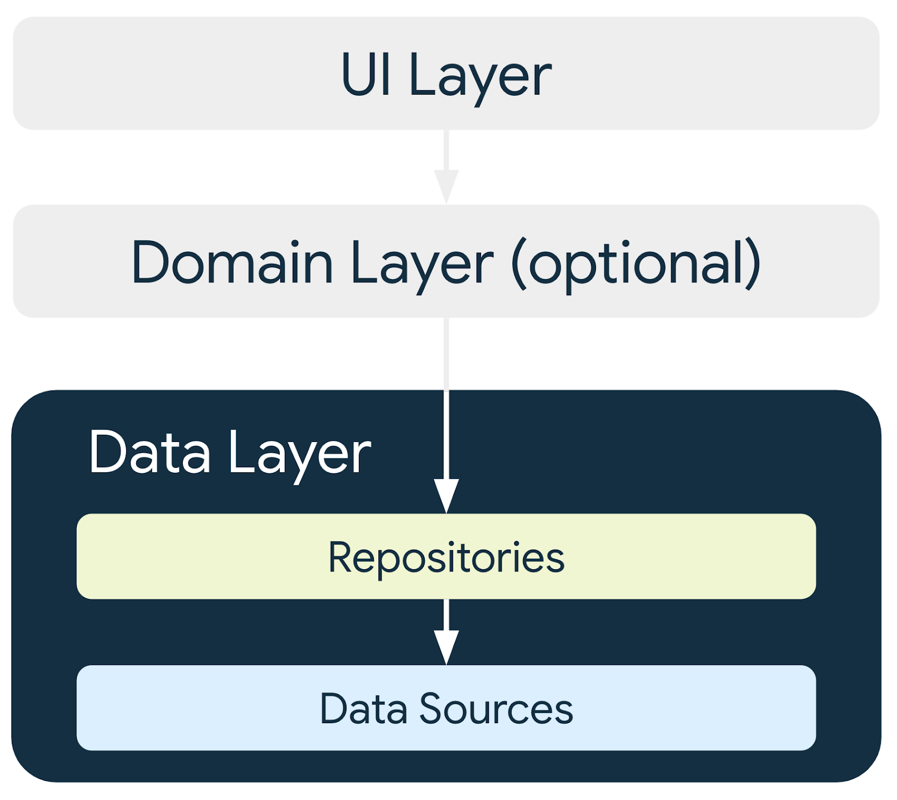

#### 前提条件

- Jetpack Compose を使用して Android アプリの基本的なユーザー インターフェース（UI）を作成できること。
- `Text`、`Icon`、`IconButton`、`LazyColumn` などのコンポーザブルを使用できること。
- `NavHost` コンポーザブルを使用して、アプリのルートと画面を定義できること。
- `NavHostController` を使用して画面間を移動できること。
- Android アーキテクチャ コンポーネント `ViewModel` に精通していること。`ViewModelProvider.Factory` を使用して ViewModel をインスタンス化できること。
- 同時実行の基本に精通していること。
- 長時間実行タスクにコルーチンを使用できること。
- SQLite データベースと SQL 言語に関する基本的な知識があること。

#### 学習内容

- Room ライブラリを使用して SQLite データベースを作成し、操作する方法。
- エンティティ、データ アクセス オブジェクト（DAO）、データベース クラスを作成する方法。
- DAO を使用して Kotlin 関数を SQL クエリにマッピングする方法。

#### 作成するアプリの概要

- インベントリ アイテムを SQLite データベースに保存する **Inventory** アプリを作成します。

#### 必要なもの

- **Inventory** アプリのスターター コード
- Android Studio がインストールされているパソコン
- API レベル 26 以降を搭載しているデバイスまたはエミュレータ

### 2. アプリの概要

この Codelab では、Inventory アプリのスターター コードを扱い、Room ライブラリを使用してアプリにデータベース レイヤを追加します。アプリの最終バージョンでは、在庫データベースからアイテムのリストを表示します。ユーザーは、新しいアイテムの追加、既存のアイテムの更新、在庫データベースからのアイテムの削除を行えます。この Codelab では、アイテムデータを Room データベースに保存します。アプリの残りの機能については、次の Codelab で説明します。

| 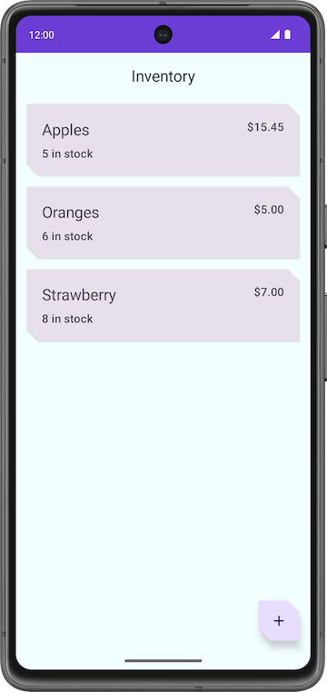 | ![スマートフォンに表示された [Add Item] 画面](./images/basic-android-kotlin-compose-persisting-data-room/7008448fe6aba0a2.png) | ![アイテムの詳細が入力された [Add Item] 画面](./images/basic-android-kotlin-compose-persisting-data-room/bae9fd572d154881.png) |
|---|---|---|

> **注**: 上のスクリーンショットは、この Codelab の最後ではなく、パスウェイの最後におけるアプリの最終バージョンのスクリーンショットです。このスクリーンショットは、アプリの最終バージョンの概要を示しています。

### 3. スターター アプリの概要

##### この Codelab のスターター コードをダウンロードする

まず、スターター コードをダウンロードします。

または、GitHub リポジトリのクローンを作成してコードを入手することもできます。

```
$ git clone https://github.com/google-developer-training/basic-android-kotlin-compose-training-inventory-app.git
$ cd basic-android-kotlin-compose-training-inventory-app
$ git checkout starter
```

> **注:**スターター コードは、ダウンロードしたリポジトリの `starter` ブランチにあります。

コードは [`Inventory app`](https://github.com/google-developer-training/basic-android-kotlin-compose-training-inventory-app/tree/starter) GitHub リポジトリで確認できます。

#### スターター コードの概要

1. Android Studio でスターター コードのプロジェクトを開きます。
2. Android デバイスまたはエミュレータでアプリを実行します。エミュレータまたは接続済みのデバイスが API レベル 26 以降で動作していることを確認します。[Database Inspector](https://developer.android.com/studio/inspect/database) は、API レベル 26 以降を搭載したエミュレータやデバイスで機能します。

> **注:**Database Inspector を使用すると、アプリを動作させながらアプリのデータベースの検査、クエリ、変更を行えます。Database Inspector は、プレーン SQLite で、または Room などの SQLite の上に構築されたライブラリで動作します。

3. アプリに在庫データが表示されていないことを確認します。
4. フローティング アクション ボタン（FAB）をタップすると、データベースに新しいアイテムを追加できます。

自動で新しい画面に移動し、新しいアイテムの詳細情報を入力できるようになります。

| 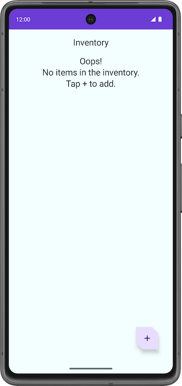 | ![スマートフォンに表示された [Add Item] 画面](./images/basic-android-kotlin-compose-persisting-data-room/7008448fe6aba0a2.png) |
|---|---|

#### スターター コードの問題点

1. [**Add Item**] 画面で、アイテムの詳細（名前、価格、数量など）を入力します。
2. [**保存**] をタップします。[**Add Item**] 画面は閉じませんが、戻るキーを使用して戻ることができます。保存機能が実装されていないため、アイテムの詳細は保存されません。

アプリは未完成であり、[**Save**] ボタンの機能が実装されていません。

![アイテムの詳細が入力された [Add Item] 画面](./images/basic-android-kotlin-compose-persisting-data-room/bae9fd572d154881.png)

この Codelab では、Room を使用してインベントリの詳細を SQLite データベースに保存するコードを追加します。Room 永続ライブラリを使用して SQLite データベースを操作します。

#### コードのチュートリアル

ダウンロードしたスターター コードには、画面のレイアウトがあらかじめ用意されています。ここでは、データベース ロジックの実装に焦点を当てます。作業の土台とするファイルの一部について簡単に説明します。

##### ui/home/HomeScreen.kt

このファイルはホーム画面、つまりアプリの最初の画面であり、在庫リストを表示するコンポーザブルが含まれています。新しいアイテムをリストに追加する FAB  があります。後ほどこのアイテムをリスト表示します。


##### ui/item/ItemEntryScreen.kt

この画面は `ItemEditScreen.kt` に似ています。どちらにもアイテムの詳細のテキスト フィールドがあります。この画面は、ホーム画面で FAB をタップすると表示されます。`ItemEntryViewModel.kt` は、この画面に対応する `ViewModel` です。

![アイテムの詳細が入力された [Add Item] 画面](./images/basic-android-kotlin-compose-persisting-data-room/bae9fd572d154881.png)

##### ui/navigation/InventoryNavGraph.kt

このファイルは、アプリ全体のナビゲーション グラフです。

### 4. Room の主なコンポーネント

Kotlin では、データクラスを通じてデータを簡単に扱えます。データクラスを使用してインメモリ データを扱うのは簡単ですが、データを永続化するとなると、そのデータをデータベース ストレージと互換性のある形式に変換する必要があります。そのためには、データを格納するためのテーブルと、データにアクセスして変更するためのクエリが必要です。

以下に示す [Room](https://developer.android.com/topic/libraries/architecture/room) の 3 つのコンポーネントを使用すると、こうしたワークフローがシームレスになります。

- [Room エンティティ](https://developer.android.com/training/data-storage/room/defining-data)は、アプリのデータベースのテーブルを表します。テーブルの行に格納されているデータの更新や、挿入するための新しい行の作成に使用します。
- Room [DAOs](https://developer.android.com/training/data-storage/room/accessing-data) は、データベース内のデータを取得、更新、挿入、削除するためにアプリで使用するメソッドを提供します。
- Room [Database クラス](https://developer.android.com/reference/kotlin/androidx/room/Database)は、データベースに関連付けられている DAO のインスタンスをアプリに提供するデータベース クラスです。

これらのコンポーネントの実装と詳細については、この Codelab で後ほど説明します。下図に、Room のコンポーネントが連携してデータベースを操作する仕組みを示します。

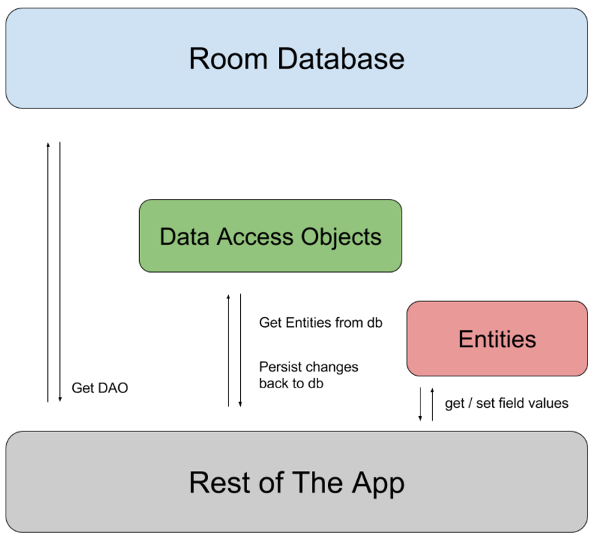

#### Room の依存関係を追加する

このタスクでは、必要な Room コンポーネント ライブラリを Gradle ファイルに追加します。

1. モジュール レベルの Gradle ファイル `build.gradle.kts (Module: InventoryApp.app)` を開きます。
2. `dependencies` ブロックに、次のコードに示す Room ライブラリの依存関係を追加します。

```kotlin
//Room
implementation("androidx.room:room-runtime:${rootProject.extra["room_version"]}")
ksp("androidx.room:room-compiler:${rootProject.extra["room_version"]}")
implementation("androidx.room:room-ktx:${rootProject.extra["room_version"]}")
```

KSP は、Kotlin アノテーションを解析するための強力かつシンプルな API です。

> **注**: Gradle ファイルのライブラリ依存関係については、必ず [AndroidX リリース](https://developer.android.com/jetpack/androidx/versions)のページにある最新の安定版リリース バージョン番号を使用してください。

### 5. アイテム エンティティを作成する

[Entity](https://developer.android.com/reference/androidx/room/Entity) クラスはテーブルを定義します。このクラスの各インスタンスは、データベース テーブルの行を表します。エンティティ クラスには、データベース内の情報の表示方法や操作方法を Room に伝えるためのマッピングがあります。今回のアプリでは、エンティティはアイテム名、アイテム価格、アイテムの残り数量など、在庫アイテムに関する情報を保持します。

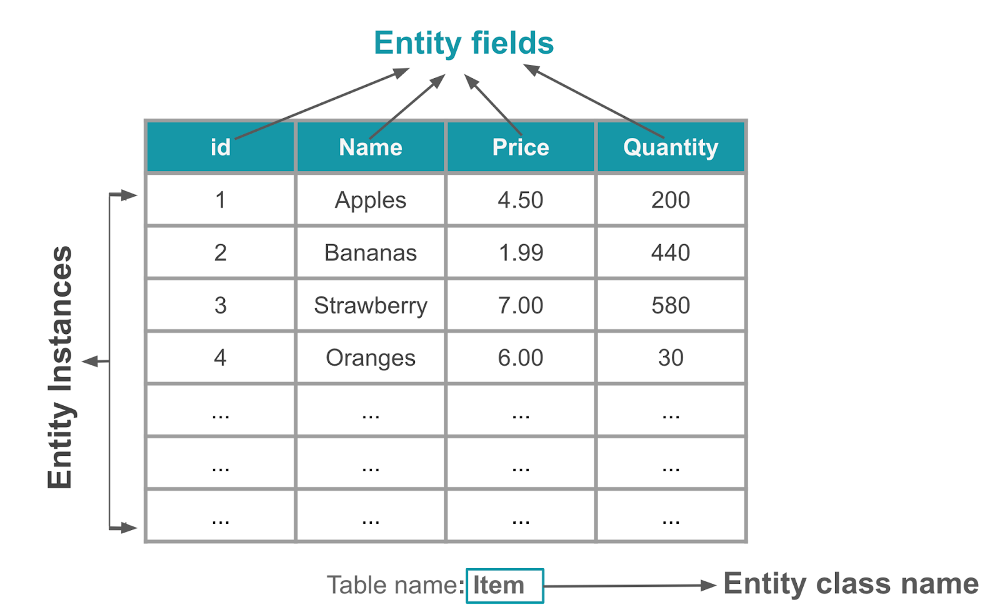

`@Entity` アノテーションは、クラスをデータベースの Entity クラスとしてマークします。アプリは Entity クラスごとに、アイテムを保持するデータベース テーブルを作成します。Entity の各フィールドは、特に明記されていない限り、データベースの列として表されます（詳細については [Entity](https://developer.android.com/reference/androidx/room/Entity) のドキュメントをご覧ください）。データベースに格納されるすべてのエンティティ インスタンスに主キーが必要です。[主キー](https://developer.android.com/reference/androidx/room/PrimaryKey)は、データベース テーブルのすべてのレコードやエントリを一意に識別するために使用します。アプリが割り当てた後に主キーを変更することはできません。データベースに存在する限り、エンティティ オブジェクトを表します。

このタスクでは、Entity クラスを作成し、アイテムごとに在庫情報を格納するフィールドを定義します（主キーの格納は `Int`、アイテム名の格納は `String`、アイテム価格の格納は `double`、在庫数の格納は `Int`）。

1. Android Studio でスターター コードを開きます。
2. `com.example.inventory` 基本パッケージの下にある `data` パッケージを開きます。
3. `data` パッケージ内で、アプリのデータベース エンティティを表す `Item` Kotlin クラスを開きます。

```kotlin
// No need to copy over, this is part of the starter code
class Item(
    val id: Int,
    val name: String,
    val price: Double,
    val quantity: Int
)
```

> **注**: プライマリ コンストラクタは、Kotlin クラスのクラスヘッダーの一部であり、クラス名（およびオプションの型パラメータ）の後に配置されます。

##### データクラス

データクラスは、主に Kotlin でデータを保持するために使用します。`data` キーワードで定義します。Kotlin データクラス オブジェクトには、いくつかの利点があります。たとえば、コンパイラが比較、出力、コピーのためのユーティリティ（`toString()`、[`copy()`](https://kotlinlang.org/docs/data-classes.html#copying)、`equals()` など）を自動的に生成します。

**例:**

```kotlin
// Example data class with 2 properties.
data class User(val firstName: String, val lastName: String){
}
```

生成されるコードに一貫性を持たせ、有意義な動作をさせるために、データクラスは次の要件を満たす必要があります。

- プライマリ コンストラクタには少なくとも 1 つのパラメータが必要です。
- プライマリ コンストラクタのパラメータはすべて、`val` または `var` にする必要があります。
- データクラスを `abstract`、`open`、`sealed` にすることはできません。

> **警告**: コンパイラは、自動生成される関数について、プライマリ コンストラクタ内で定義されているプロパティのみを使用します。コンパイラは、クラス本体内で宣言されたプロパティを、生成される実装から除外します。

データクラスの詳細については、[データクラス](https://kotlinlang.org/docs/data-classes.html)のドキュメントをご覧ください。

1. `Item` クラスの定義の前に `data` キーワードを付けて、データクラスに変換します。

```kotlin
data class Item(
    val id: Int,
    val name: String,
    val price: Double,
    val quantity: Int
)
```

2. `Item` クラス宣言の上で、データクラスに `@Entity` アノテーションを付けます。`tableName` 引数を使用して、`items` を SQLite テーブル名として設定します。

```kotlin
import androidx.room.Entity

@Entity(tableName = "items")
data class Item(
   ...
)
```

> **注**: `@Entity` アノテーションが取り得る引数は複数あります。デフォルト（`@Entity` の引数がない場合）では、テーブル名はクラス名と同じです。`tableName` 引数を使用してテーブル名をカスタマイズします。わかりやすくするために、`item` を使用します。`@Entity` には引数が他にもあります。詳しくは [Entity のドキュメント](https://developer.android.com/reference/androidx/room/Entity)をご覧ください。

3. `id` プロパティに `@PrimaryKey` アノテーションを付けて、`id` を主キーにします。主キーは、`Item` テーブルのすべてのレコードやエントリを一意に識別する ID です。

```kotlin
import androidx.room.PrimaryKey

@Entity(tableName = "items")
data class Item(
    @PrimaryKey
    val id: Int,
    ...
)
```

4. `id` にデフォルト値として `0` を割り当てます。これは、`id` が `id` 値を自動生成するために必要です。
5. `autoGenerate` パラメータを `@PrimaryKey` アノテーションに追加して、主キー列を自動生成するかどうかを指定します。`autoGenerate` が `true` に設定されている場合、新しいエンティティ インスタンスがデータベースに挿入されると、Room は主キー列の一意の値を自動生成します。これにより、各エンティティ インスタンスに一意の識別子が割り当てられ、主キー列に手動で値を割り当てる必要がなくなります。

```kotlin
data class Item(
    @PrimaryKey(autoGenerate = true)
    val id: Int = 0,
    // ...
)
```

お疲れさまでした。Entity クラスが作成されたので、データベースにアクセスするためのデータアクセス オブジェクト（DAO）を作成できます。

### 6. アイテム DAO を作成する

[データ アクセス オブジェクト](https://developer.android.com/reference/androidx/room/Dao)（DAO）は、抽象インターフェースを提供することで永続化レイヤをアプリの残りの部分から分離するために使用できるパターンです。この分離は、これまでの Codelab で見てきた[単一責任の原則](https://en.wikipedia.org/wiki/Single-responsibility_principle)に則したものです。

DAO の機能は、基となる永続化レイヤでのデータベース操作に関連するすべての複雑さを隠し、アプリの残りの部分から分離することです。これにより、データを使用するコードから独立してデータレイヤを変更できます。

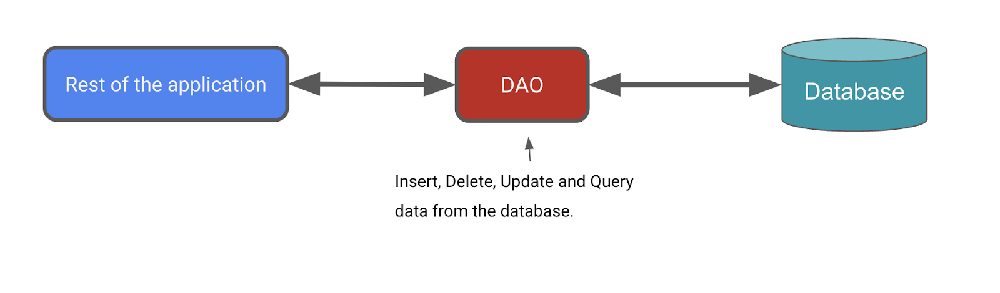

このタスクでは、Room の DAO を定義します。DAO は、データベースにアクセスするインターフェースを定義する Room の主要コンポーネントです。

作成する DAO はカスタム インターフェースです。データベースのクエリ、取得、挿入、削除、更新を簡単に行うことができます。Room はコンパイル時にこのクラスの実装を生成します。

`Room` ライブラリには、`@Insert`、`@Delete`、`@Update` などの便利なアノテーションが用意されており、SQL ステートメントを記述せずに簡単な挿入、削除、更新を行うメソッドを定義できます。

より複雑な挿入、削除、更新のオペレーションを定義する必要がある場合や、データベース内のデータにクエリを行う必要がある場合は、代わりに `@Query` アノテーションを使用します。

さらに、Android Studio でクエリを記述すると、コンパイラが SQL クエリの構文エラーをチェックします。

Inventory アプリの場合、次のことを行える必要があります。

- 新しいアイテムを**挿入**または追加する。
- 既存のアイテムを**更新**して、名前、価格、数量を更新する。
- 主キーである `id` に基づいて、特定のアイテムを**取得**する。
- **すべてのアイテムを取得**して、表示できるようにする。
- データベースのエントリを**削除**する。

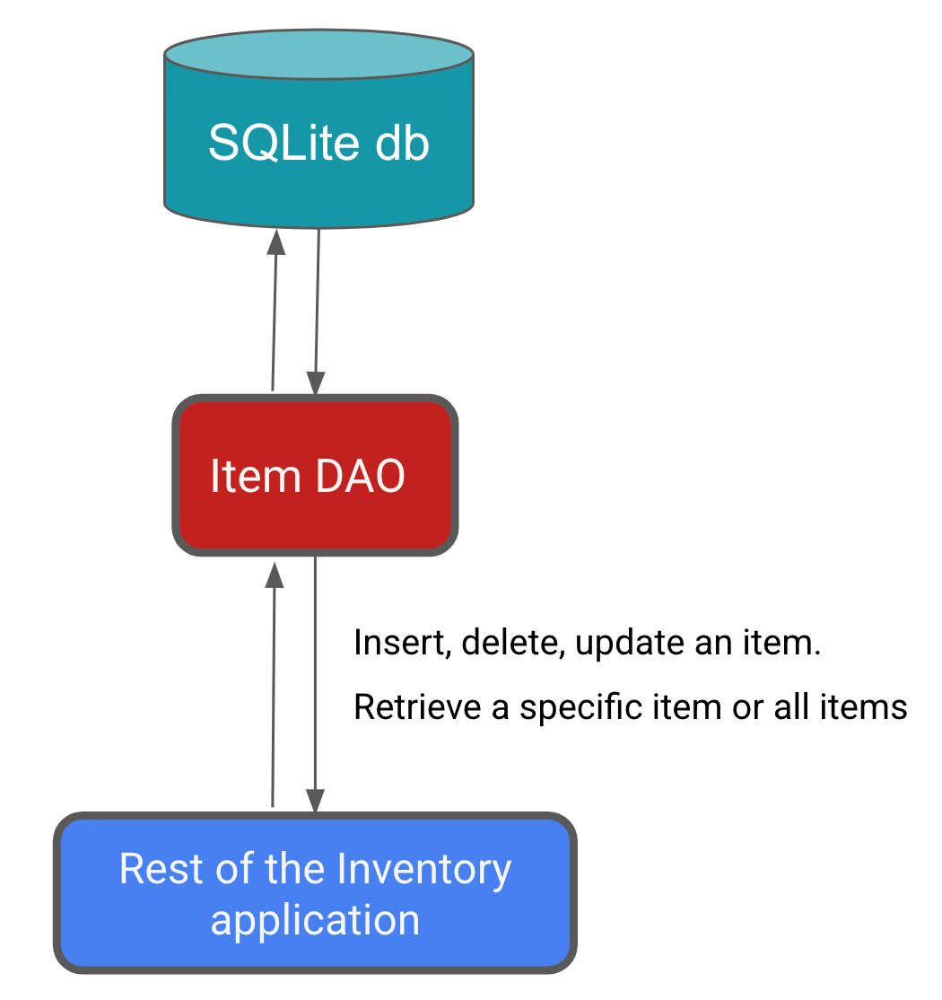

アプリにアイテム DAO を実装する手順は次のとおりです。

1. `data` パッケージで、Kotlin インターフェース `ItemDao.kt` を作成します。

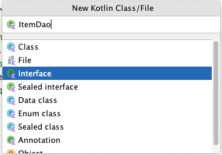

2. `ItemDao` インターフェースに `@Dao` アノテーションを付けます。

```kotlin
import androidx.room.Dao

@Dao
interface ItemDao {
}
```

3. インターフェースの本体内に `@Insert` アノテーションを追加します。
4. `@Insert` の下に、`Entity` クラスの `item` のインスタンスを引数として取る `insert()` 関数を追加します。
5. 関数を `suspend` キーワードでマークすると、別のスレッドで実行できます。

データベース操作は実行に時間がかかる可能性があるため、別のスレッドで実行する必要があります。Room ではメインスレッドでのデータベース アクセスができません。

```kotlin
import androidx.room.Insert

@Insert
suspend fun insert(item: Item)
```

データベースにアイテムを挿入する際、競合が発生することがあります。たとえば、コード内の複数の箇所で、異なる競合する値（同じ主キーなど）でエンティティを更新しようとする場合です。エンティティはデータベース内の行です。Inventory アプリでは、[**Add Item**] 画面からでないとエンティティを挿入できないため、競合は想定されていません。競合戦略は [Ignore] に設定できます。

6. 引数 `onConflict` を追加し、値 `OnConflictStrategy.``IGNORE` を割り当てます。

引数 `onConflict` は、競合が発生した場合の処理を Room に伝えます。`OnConflictStrategy.``IGNORE` 戦略は、新しいアイテムを無視します。

利用可能な競合戦略について詳しくは、[`OnConflictStrategy`](https://developer.android.com/reference/androidx/room/OnConflictStrategy.html) のドキュメントをご覧ください。

```kotlin
import androidx.room.OnConflictStrategy

@Insert(onConflict = OnConflictStrategy.IGNORE)
suspend fun insert(item: Item)
```

これで、`item` をデータベースに挿入するために必要なすべてのコードが `Room` によって生成されるようになりました。Room アノテーションが付いている DAO 関数を呼び出すと、Room はデータベースに対して対応する SQL クエリを実行します。たとえば、上記のメソッド `insert()` を Kotlin コードから呼び出すと、`Room` は SQL クエリを実行してエンティティをデータベースに挿入します。

7. `Item` をパラメータとして受け取る、`@Update` アノテーションを付けた新しい関数を追加します。

渡されるエンティティと同じ主キーを持つエンティティが更新されます。エンティティの他のプロパティの一部または全部を更新できます。

8. `insert()` メソッドと同様に、この関数に `suspend` キーワードを付けます。

```kotlin
import androidx.room.Update

@Update
suspend fun update(item: Item)
```

`@Delete` アノテーションを付けた別の関数を追加してアイテムを削除し、suspend 関数にします。

> **注**: `@Delete` アノテーションは、アイテムまたはアイテムのリストを削除します。削除するエンティティを渡す必要があります。エンティティがない場合は、`delete()` 関数を呼び出す前にエンティティを取得する必要があります。

```kotlin
import androidx.room.Delete

@Delete
suspend fun delete(item: Item)
```

残りの機能には便利なアノテーションがないため、`@Query` アノテーションを使用して SQLite クエリを指定する必要があります。

9. 指定した `id` に基づいてアイテム テーブルから特定のアイテムを取得する SQLite クエリを記述します。次のコードは、`items` から、`id` が特定の値に一致する列をすべて選択するサンプルクエリを示しています。`id` は一意の識別子です。

**例:**

```kotlin
// Example, no need to copy over
SELECT * from items WHERE id = 1
```

10. `@Query` アノテーションを追加します。
11. 前のステップの SQLite クエリを、`@Query` アノテーションの文字列パラメータとして使用します。
12. `String` パラメータを `@Query` に追加します。これはアイテム テーブルからアイテムを取得する SQLite クエリです。

このクエリでは、`id` が :`id` 引数と一致する `items` からすべての列が選択されることになります。`:id` はクエリ内でコロン表記を使用して、関数内の引数を参照しています。

```kotlin
@Query("SELECT * from items WHERE id = :id")
```

13. `@Query` アノテーションの後に、`Int` 引数を受け取って `Flow<Item>` を返す `getItem()` 関数を追加します。

```kotlin
import androidx.room.Query
import kotlinx.coroutines.flow.Flow

@Query("SELECT * from items WHERE id = :id")
fun getItem(id: Int): Flow<Item>
```

永続化レイヤでは `Flow` を使用することをおすすめします。戻り値の型として `Flow` を指定すると、データベース内のデータが変更されるたびに通知が届きます。`Room` がこの `Flow` を最新の状態に維持します。つまり、データを明示的に取得する必要があるのは一度だけです。このセットアップは次の Codelab で実装する在庫リストを更新する際に役立ちます。戻り値の型が `Flow` であるため、Room はバックグラウンド スレッドでクエリを実行します。明示的に `suspend` 関数にしてコルーチン スコープ内で呼び出す必要はありません。

> **注**: Room データベースの `Flow` は、データベース内のデータが変更されるたびに通知を送信して、データを最新の状態に保つことができます。これにより、データを監視し、それに応じて UI を更新できます。

14. `@Query` と `getAllItems()` 関数を追加します。
15. SQLite クエリが `item` テーブルのすべての列を昇順で返すようにします。
16. `getAllItems()` が `Item` エンティティのリストを `Flow` として返すようにします。`Room` がこの `Flow` を最新の状態に維持します。つまり、データを明示的に取得する必要があるのは一度だけです。

```kotlin
@Query("SELECT * from items ORDER BY name ASC")
fun getAllItems(): Flow<List<Item>>
```

完成した `ItemDao`:

```kotlin
import androidx.room.Dao
import androidx.room.Delete
import androidx.room.Insert
import androidx.room.OnConflictStrategy
import androidx.room.Query
import androidx.room.Update
import kotlinx.coroutines.flow.Flow

@Dao
interface ItemDao {
    @Insert(onConflict = OnConflictStrategy.IGNORE)
    suspend fun insert(item: Item)

    @Update
    suspend fun update(item: Item)

    @Delete
    suspend fun delete(item: Item)

    @Query("SELECT * from items WHERE id = :id")
    fun getItem(id: Int): Flow<Item>

    @Query("SELECT * from items ORDER BY name ASC")
    fun getAllItems(): Flow<List<Item>>
}
```

17. 目に見える変化はありませんが、アプリをビルドしてエラーがないことを確認します。

### 7. データベース インスタンスを作成する

このタスクでは、これまでのタスクで扱った `Entity` と DAO を使用する [`RoomDatabase`](https://developer.android.com/reference/androidx/room/RoomDatabase) を作成します。データベース クラスは、エンティティのリストと DAO を定義します。

[`Database`](https://developer.android.com/reference/androidx/room/Database) クラスは、定義した DAO のインスタンスをアプリに提供します。アプリはこの DAO を使用して、関連するデータ エンティティ オブジェクトのインスタンスとしてデータベースからデータを取得できます。また、定義されたデータ エンティティを使用して、対応するテーブルの行を更新したり、挿入用の新しい行を作成したりできます。

抽象 `RoomDatabase` クラスを作成し、`@Database` アノテーションを付ける必要があります。このクラスには、データベースが存在しない場合に `RoomDatabase` の既存のインスタンスを返すメソッドが 1 つあります。

`RoomDatabase` インスタンスを取得する一般的なプロセスは次のとおりです。

- `RoomDatabase` を拡張する `public abstract` クラスを作成します。定義した新しい抽象クラスは、データベース ホルダーとして機能します。`Room` が実装を作成するため、定義したクラスは抽象クラスです。
- クラスに `@Database` アノテーションを付けます。引数で、データベースのエンティティをリストしてバージョン番号を設定します。
- `ItemDao` インスタンスを返す抽象メソッドまたはプロパティを定義すると、`Room` が実装を生成します。
- アプリ全体で必要な `RoomDatabase` のインスタンスは 1 つのみであるため、`RoomDatabase` をシングルトンにします。
- `Room` の [`Room.databaseBuilder`](https://developer.android.com/reference/androidx/room/Room#databaseBuilder(android.content.Context,java.lang.Class,kotlin.String)) を使用して、存在しない場合にのみ（`item_database`）データベースを作成します。それ以外の場合は、既存のデータベースを返します。

#### データベースを作成する

1. `data` パッケージで、Kotlin クラス `InventoryDatabase.kt` を作成します。
2. `InventoryDatabase.kt` ファイルで、`InventoryDatabase` クラスを、`RoomDatabase` を拡張する `abstract` クラスにします。
3. クラスに `@Database` アノテーションを付けます。パラメータ欠落エラーは、次のステップで修正するため無視してください。

```kotlin
import androidx.room.Database
import androidx.room.RoomDatabase

@Database
abstract class InventoryDatabase : RoomDatabase() {}
```

`@Database` アノテーションには、`Room` がデータベースを構築できるように、複数の引数が必要です。

4. `entities` のリストを持つ唯一のクラスとして `Item` を指定します。
5. `version` を `1`に設定します。データベース テーブルのスキーマを変更するたびに、バージョン番号を増やす必要があります。
6. スキーマのバージョン履歴のバックアップを保持しないように、`exportSchema` を `false` に設定します。

```kotlin
@Database(entities = [Item::class], version = 1, exportSchema = false)
```

7. クラスの本体内で、`ItemDao` を返す抽象関数を宣言し、データベースが DAO を認識できるようにします。

```kotlin
abstract fun itemDao(): ItemDao
```

8. 抽象関数の下で、`companion object` を定義します。これにより、データベースを作成または取得するメソッドにアクセスできるようにし、クラス名を修飾子として使用します。

```kotlin
 companion object {}
```

9. `companion` オブジェクト内で、データベース用に null 許容のプライベート変数 `Instance` を宣言し、`null` に初期化します。

`Instance` 変数は、データベースの作成時に、データベースに対する参照を保持します。これは、ある時点で開かれているデータベースのインスタンス（作成と維持にコストのかかるリソース）を 1 つだけ維持する際に役立ちます。

10. `Instance` に `@Volatile` アノテーションを付けます。

volatile 変数の値はキャッシュに保存されません。読み取りと書き込みはすべてメインメモリとの間で行われます。こうした機能により、`Instance` の値が常に最新になり、すべての実行スレッドで同じになります。つまり、あるスレッドが `Instance` に加えた変更が、すぐに他のすべてのスレッドに反映されます。

```kotlin
@Volatile
private var Instance: InventoryDatabase? = null
```

11. `Instance` の下、`companion` オブジェクト内で、データベース ビルダーに必要な `Context` パラメータを持つ `getDatabase()` メソッドを定義します。
12. `InventoryDatabase` 型を返します。`getDatabase()` はまだ何も返していないため、エラー メッセージが表示されます。

```kotlin
import android.content.Context

fun getDatabase(context: Context): InventoryDatabase {}
```

複数のスレッドがデータベース インスタンスを同時に要求し、結果的に 1 つではなく 2 つのデータベースが作成される可能性があります。この現象を[競合状態](https://en.wikipedia.org/wiki/Race_condition)と呼びます。データベースを取得するコードを `synchronized` ブロックで囲むと、このコードブロックには一度に 1 つの実行スレッドしか入ることができず、データベースは一度だけ初期化されます。競合状態を回避するため、`synchronized{}` ブロックを使用します。

13. `getDatabase()` 内で `Instance` 変数を返します。または、`Instance` が null の場合は `synchronized{}` ブロック内で初期化します。これにはエルビス演算子（`?:`）を使用します。
14. コンパニオン オブジェクトの `this` を渡します。エラーは後ほど修正します。

```kotlin
return Instance ?: synchronized(this) { }
```

15. synchronized ブロック内で、データベース ビルダーを使用してデータベースを取得します。エラーは次のステップで修正するため無視してください。

```kotlin
import androidx.room.Room

Room.databaseBuilder()
```

16. `synchronized` ブロック内で、データベース ビルダーを使用してデータベースを取得します。アプリ コンテキスト、データベース クラス、データベースの名前 `item_database` を `Room.databaseBuilder()` に渡します。

```kotlin
Room.databaseBuilder(context, InventoryDatabase::class.java, "item_database")
```

Android Studio が型の不一致エラーを生成します。このエラーを解消するには、以降のステップで `build()` を追加する必要があります。

17. 必要な移行戦略をビルダーに追加します。`.` [`fallbackToDestructiveMigration()`](https://developer.android.com/reference/androidx/room/RoomDatabase.Builder#fallbackToDestructiveMigration()) を使用します。

```kotlin
.fallbackToDestructiveMigration()
```

> **注**: 通常は、スキーマが変更されたときの移行戦略を移行オブジェクトに指定します。「移行オブジェクト」とは、データが失われないように、古いスキーマの行をすべて取得して新しいスキーマの行に変換する方法を定義するオブジェクトです。[移行](https://medium.com/androiddevelopers/understanding-migrations-with-room-f01e04b07929)はこの Codelab の対象外ですが、スキーマが変更され、データを失うことなく日付を移動する必要がある場合のことを指します。サンプルアプリであるため、これに代わる簡単な方法はデータベースを破棄して再構築することです。その場合、在庫データは失われます。たとえば、新しいパラメータの追加など、エンティティ クラスでなんらかの変更を行った場合、アプリでデータベースの削除と再初期化を行えるようにできます。

18. データベース インスタンスを作成するために、`.build()` を呼び出します。この呼び出しにより、Android Studio のエラーが解消されます。

```kotlin
.build()
```

19. `build()` の後に、`also` ブロックを追加し、`Instance = it` を割り当てて、最近作成された db インスタンスへの参照を保持します。

```kotlin
.also { Instance = it }
```

20. `synchronized` ブロックの最後で `instance` を返します。コードは最終的に次のようになります。

```kotlin
import android.content.Context
import androidx.room.Database
import androidx.room.Room
import androidx.room.RoomDatabase

/**
* Database class with a singleton Instance object.
*/
@Database(entities = [Item::class], version = 1, exportSchema = false)
abstract class InventoryDatabase : RoomDatabase() {

    abstract fun itemDao(): ItemDao

    companion object {
        @Volatile
        private var Instance: InventoryDatabase? = null

        fun getDatabase(context: Context): InventoryDatabase {
            // if the Instance is not null, return it, otherwise create a new database instance.
            return Instance ?: synchronized(this) {
                Room.databaseBuilder(context, InventoryDatabase::class.java, "item_database")
                    .build()
                    .also { Instance = it }
            }
        }
    }
}
```

> **ヒント:**このコードは今後のプロジェクトのテンプレートとして使用できます。`RoomDatabase` インスタンスの作成方法は前のステップと同様です。アプリに固有のエンティティや DAO の置き換えが必要になることがあります。

21. コードをビルドして、エラーがないことを確認します。

### 8. リポジトリを実装する

このタスクでは、`ItemsRepository` インターフェースと `OfflineItemsRepository` クラスを実装して、データベースの `get`、`insert`、`delete`、`update` エンティティを提供します。

1. `data` パッケージの `ItemsRepository.kt` ファイルを開きます。
2. DAO 実装にマッピングする次の関数をインターフェースに追加します。

```kotlin
import kotlinx.coroutines.flow.Flow

/**
* Repository that provides insert, update, delete, and retrieve of [Item] from a given data source.
*/
interface ItemsRepository {
    /**
     * Retrieve all the items from the the given data source.
     */
    fun getAllItemsStream(): Flow<List<Item>>

    /**
     * Retrieve an item from the given data source that matches with the [id].
     */
    fun getItemStream(id: Int): Flow<Item?>

    /**
     * Insert item in the data source
     */
    suspend fun insertItem(item: Item)

    /**
     * Delete item from the data source
     */
    suspend fun deleteItem(item: Item)

    /**
     * Update item in the data source
     */
    suspend fun updateItem(item: Item)
}
```

3. `data` パッケージの `OfflineItemsRepository.kt` ファイルを開きます。
4. `ItemDao` 型のコンストラクタ パラメータを渡します。

```kotlin
class OfflineItemsRepository(private val itemDao: ItemDao) : ItemsRepository
```

5. `OfflineItemsRepository` クラスで、`ItemsRepository` インターフェースで定義された関数をオーバーライドし、`ItemDao` から対応する関数を呼び出します。

```kotlin
import kotlinx.coroutines.flow.Flow

class OfflineItemsRepository(private val itemDao: ItemDao) : ItemsRepository {
    override fun getAllItemsStream(): Flow<List<Item>> = itemDao.getAllItems()

    override fun getItemStream(id: Int): Flow<Item?> = itemDao.getItem(id)

    override suspend fun insertItem(item: Item) = itemDao.insert(item)

    override suspend fun deleteItem(item: Item) = itemDao.delete(item)

    override suspend fun updateItem(item: Item) = itemDao.update(item)
}
```

#### AppContainer クラスを実装する

このタスクでは、データベースをインスタンス化し、DAO インスタンスを `OfflineItemsRepository` クラスに渡します。

1. `data` パッケージの `AppContainer.kt` ファイルを開きます。
2. `ItemDao()` インスタンスを `OfflineItemsRepository` コンストラクタに渡します。
3. データベース インスタンスをインスタンス化するには、`InventoryDatabase` クラスで `getDatabase()` を呼び出してコンテキストを渡し、`.itemDao()` を呼び出して `Dao` のインスタンスを作成します。

```kotlin
override val itemsRepository: ItemsRepository by lazy {
    OfflineItemsRepository(InventoryDatabase.getDatabase(context).itemDao())
}
```

これで、Room を扱うためのビルディング ブロックが揃いました。このコードはコンパイルされて実行されますが、実際に機能するかどうかを確認する方法はありません。そのため、ここでデータベースをテストすることをおすすめします。テストを実施するには、`ViewModel` がデータベースとやりとりする必要があります。

### 9. 保存機能を追加する

これまでに、データベースを作成し、UI クラスはスターター コードに含まれていました。アプリの一時的なデータを保存し、データベースにアクセスするには、`ViewModel` を更新する必要があります。`ViewModel` は DAO を介してデータベースを操作し、UI にデータを提供します。データベース操作はすべてメイン UI スレッドから切り離す必要があるため、コルーチンと [`viewModelScope`](https://developer.android.com/topic/libraries/architecture/coroutines#viewmodelscope) を使用します。

#### UI 状態クラスのチュートリアル

`ui/item/ItemEntryViewModel.kt` ファイルを開きます。`ItemUiState` データクラスは、アイテムの UI 状態を表します。`ItemDetails` データクラスは 1 つのアイテムを表します。

スターター コードには拡張関数が 3 つ用意されています。

- `ItemDetails.toItem()` 拡張関数は、`ItemUiState` UI 状態オブジェクトを `Item` エンティティ型に変換します。
- `Item.toItemUiState()` 拡張関数は、`Item` Room エンティティ オブジェクトを `ItemUiState` UI 状態型に変換します。
- `Item.toItemDetails()` 拡張関数は、`Item` Room エンティティ オブジェクトを `ItemDetails` に変換します。

```kotlin
// No need to copy, this is part of starter code
/**
* Represents Ui State for an Item.
*/
data class ItemUiState(
    val itemDetails: ItemDetails = ItemDetails(),
    val isEntryValid: Boolean = false
)

data class ItemDetails(
    val id: Int = 0,
    val name: String = "",
    val price: String = "",
    val quantity: String = "",
)

/**
* Extension function to convert [ItemDetails] to [Item]. If the value of [ItemDetails.price] is
* not a valid [Double], then the price will be set to 0.0. Similarly if the value of
* [ItemDetails.quantity] is not a valid [Int], then the quantity will be set to 0
*/
fun ItemDetails.toItem(): Item = Item(
    id = id,
    name = name,
    price = price.toDoubleOrNull() ?: 0.0,
    quantity = quantity.toIntOrNull() ?: 0
)

fun Item.formatedPrice(): String {
    return NumberFormat.getCurrencyInstance().format(price)
}

/**
* Extension function to convert [Item] to [ItemUiState]
*/
fun Item.toItemUiState(isEntryValid: Boolean = false): ItemUiState = ItemUiState(
    itemDetails = this.toItemDetails(),
    isEntryValid = isEntryValid
)

/**
* Extension function to convert [Item] to [ItemDetails]
*/
fun Item.toItemDetails(): ItemDetails = ItemDetails(
    id = id,
    name = name,
    price = price.toString(),
    quantity = quantity.toString()
)
```

ビューモデルで上記のクラスを使用して、UI の読み取りと更新を行います。

#### ItemEntry ViewModel を更新する

このタスクでは、リポジトリを `ItemEntryViewModel.kt` ファイルに渡します。また、[**Add Item**] 画面で入力したアイテムの詳細をデータベースに保存します。

1. `ItemEntryViewModel` クラスの `validateInput()` プライベート関数に注目してください。

```kotlin
// No need to copy over, this is part of starter code
private fun validateInput(uiState: ItemDetails = itemUiState.itemDetails): Boolean {
    return with(uiState) {
        name.isNotBlank() && price.isNotBlank() && quantity.isNotBlank()
    }
}
```

上記の関数は、`name`、`price`、`quantity` が空かどうかを確認します。この関数を使用してユーザー入力を検証してから、データベースのエンティティを追加または更新します。

2. `ItemEntryViewModel` クラスを開き、`ItemsRepository` 型の `private` デフォルト コンストラクタ パラメータを追加します。

```kotlin
import com.example.inventory.data.ItemsRepository

class ItemEntryViewModel(private val itemsRepository: ItemsRepository) : ViewModel() {
}
```

3. `ui/AppViewModelProvider.kt` のアイテム エントリ ビューモデルの `initializer` を更新し、パラメータとしてリポジトリ インスタンスを渡します。

```kotlin
object AppViewModelProvider {
    val Factory = viewModelFactory {
        // Other Initializers 
        // Initializer for ItemEntryViewModel
        initializer {
            ItemEntryViewModel(inventoryApplication().container.itemsRepository)
        }
        //...
    }
}
```

4. `ItemEntryViewModel.kt` ファイルに移動し、`ItemEntryViewModel` クラスの最後に `saveItem()` という suspend 関数を追加して、Room データベースにアイテムを挿入します。この関数は、データをブロック以外の方法でデータベースに追加します。

```kotlin
suspend fun saveItem() {
}
```

5. 関数内で `itemUiState` が有効であるかどうかを確認し、`Item` 型に変換して、Room がデータを認識できるようにします。
6. `itemsRepository` に対して `insertItem()` を呼び出し、データを渡します。UI はこの関数を呼び出して、アイテムの詳細をデータベースに追加します。

```kotlin
suspend fun saveItem() {
    if (validateInput()) {
        itemsRepository.insertItem(itemUiState.itemDetails.toItem())
    }
}
```

エンティティをデータベースに追加するために必要な関数がすべて追加されました。次のタスクでは、上記の関数を使用するように UI を更新します。

##### ItemEntryBody() コンポーザブルのチュートリアル

1. `ui/item/ItemEntryScreen.kt` ファイルでは、`ItemEntryBody()` コンポーザブルがスターター コードの一部として部分的に実装されています。`ItemEntryScreen()` 関数呼び出しの `ItemEntryBody()` コンポーザブルに注目してください。

```kotlin
// No need to copy over, part of the starter code
ItemEntryBody(
    itemUiState = viewModel.itemUiState,
    onItemValueChange = viewModel::updateUiState,
    onSaveClick = { },
    modifier = Modifier
        .padding(innerPadding)
        .verticalScroll(rememberScrollState())
        .fillMaxWidth()
)
```

2. UI 状態と `updateUiState` ラムダが関数パラメータとして渡されています。関数の定義を調べて、UI 状態がどのように更新されるかを確認します。

```kotlin
// No need to copy over, part of the starter code
@Composable
fun ItemEntryBody(
    itemUiState: ItemUiState,
    onItemValueChange: (ItemUiState) -> Unit,
    onSaveClick: () -> Unit,
    modifier: Modifier = Modifier
) {
    Column(
        // ...
    ) {
        ItemInputForm(
             itemDetails = itemUiState.itemDetails,
             onValueChange = onItemValueChange,
             modifier = Modifier.fillMaxWidth()
         )
        Button(
             onClick = onSaveClick,
             enabled = itemUiState.isEntryValid,
             shape = MaterialTheme.shapes.small,
             modifier = Modifier.fillMaxWidth()
         ) {
             Text(text = stringResource(R.string.save_action))
         }
    }
}
```

このコンポーザブルに `ItemInputForm` と [**Save**] ボタンが表示されています。`ItemInputForm()` コンポーザブルにはテキスト フィールドが 3 つ表示されています。[**Save**] は、テキスト フィールドにテキストが入力されている場合にのみ有効になります。`isEntryValid` 値は、すべてのテキスト フィールドのテキストが有効である場合（空白ではない場合）に true になります。

| 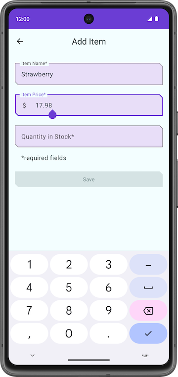 | 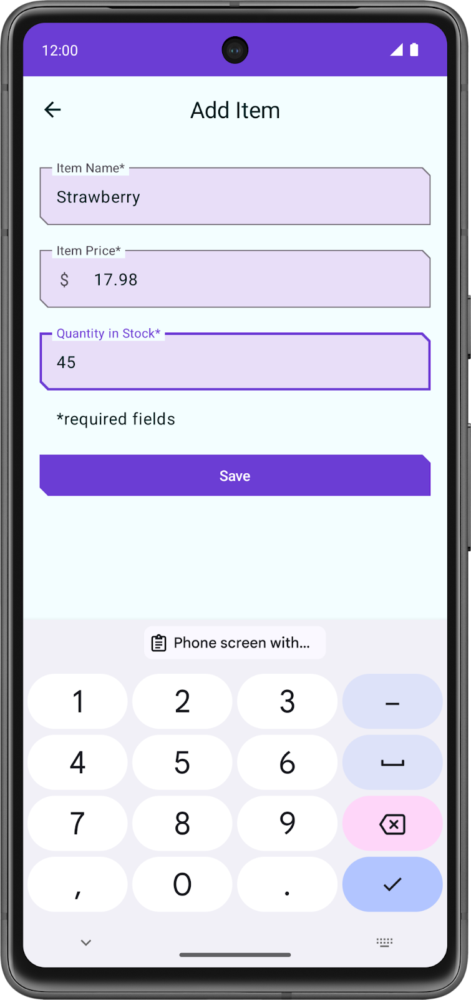 |
|---|---|

3. コンポーズ可能な関数 `ItemInputForm()` の実装を見ると、`onValueChange` 関数パラメータがあります。`itemDetails` の値を、ユーザーがテキスト フィールドに入力した値に置き換えます。[**Save**] ボタンが有効になるまでに、`itemUiState.itemDetails` には保存する必要がある値が設定されます。

```kotlin
// No need to copy over, part of the starter code
@Composable
fun ItemEntryBody(
    //...
) {
    Column(
        // ...
    ) {
        ItemInputForm(
             itemDetails = itemUiState.itemDetails,
             //...
         )
        //...
    }
}
```

```kotlin
// No need to copy over, part of the starter code
@Composable
fun ItemInputForm(
    itemDetails: ItemDetails,
    modifier: Modifier = Modifier,
    onValueChange: (ItemUiState) -> Unit = {},
    enabled: Boolean = true
) {
    Column(modifier = modifier.fillMaxWidth(), verticalArrangement = Arrangement.spacedBy(16.dp)) {
        OutlinedTextField(
            value = itemUiState.name,
            onValueChange = { onValueChange(itemDetails.copy(name = it)) },
            //...
        )
        OutlinedTextField(
            value = itemUiState.price,
            onValueChange = { onValueChange(itemDetails.copy(price = it)) },
            //...
        )
        OutlinedTextField(
            value = itemUiState.quantity,
            onValueChange = { onValueChange(itemDetails.copy(quantity = it)) },
            //...
        )
    }
}
```

#### Save ボタンにクリック リスナーを追加する

すべてをまとめるために、[**Save**] ボタンにクリック ハンドラを追加します。クリック ハンドラ内でコルーチンを開始し、`saveItem()` を呼び出してデータを Room データベースに保存します。

1. `ItemEntryScreen.kt` のコンポーズ可能な関数 `ItemEntryScreen` 内で、コンポーズ可能な関数 `rememberCoroutineScope()` を使用して、`coroutineScope` という `val` を作成します。

> **注:**`rememberCoroutineScope()` は、呼び出されたコンポジションにバインドされた `CoroutineScope` を返すコンポーズ可能な関数です。コンポーザブルの外部でコルーチンを開始し、スコープがコンポジションから離れた後にコルーチンがキャンセルされるようにする場合、コンポーズ可能な関数 `rememberCoroutineScope()` を使用できます。この関数は、コルーチンのライフサイクルを手動で制御する必要がある場合（ユーザー イベントが発生するたびにアニメーションをキャンセルする場合など）に使用できます。

```kotlin
import androidx.compose.runtime.rememberCoroutineScope

val coroutineScope = rememberCoroutineScope()
```

2. `ItemEntryBody``()` 関数呼び出しを更新し、`onSaveClick` ラムダ内でコルーチンを開始します。

```kotlin
ItemEntryBody(
   // ...
    onSaveClick = {
        coroutineScope.launch {
        }
    },
    modifier = modifier.padding(innerPadding)
)
```

3. `ItemEntryViewModel.kt` ファイルの `saveItem()` 関数実装で、`itemUiState` が有効で、`itemUiState` を `Item` 型に変換し、`itemsRepository.insertItem()` を使用してデータベースに挿入しているかどうかを確認します。

```kotlin
// No need to copy over, you have already implemented this as part of the Room implementation 

suspend fun saveItem() {
    if (validateInput()) {
        itemsRepository.insertItem(itemUiState.itemDetails.toItem())
    }
}
```

4. `ItemEntryScreen.kt` のコンポーズ可能な関数 `ItemEntryScreen` にあるコルーチン内で、`viewModel.saveItem()` を呼び出してアイテムをデータベースに保存します。

```kotlin
ItemEntryBody(
    // ...
    onSaveClick = {
        coroutineScope.launch {
            viewModel.saveItem()
        }
    },
    //...
)
```

`ItemEntryViewModel.kt` ファイルでは `saveItem()` に `viewModelScope.launch()` が使用されていませんが、これはリポジトリ メソッドを呼び出すとき `ItemEntryBody` `()` に必要です。suspend 関数は、コルーチンまたは別の suspend 関数からしか呼び出せません。関数 `viewModel.saveItem()` は suspend 関数です。

5. アプリをビルドして実行します。
6. **+** FAB をタップします。
7. [**Add Item**] 画面でアイテムの詳細を追加して [**Save**] をタップします。[**Save**] ボタンをタップしても [**Add Item**] 画面は閉じません。


8. `onSaveClick` ラムダで、`viewModel.saveItem()` の呼び出しの後に `navigateBack()` の呼び出しを追加して、前の画面に戻るようにします。`ItemEntryBody()` 関数は次のコードのようになります。

```kotlin
ItemEntryBody(
    itemUiState = viewModel.itemUiState,
    onItemValueChange = viewModel::updateUiState,
    onSaveClick = {
        coroutineScope.launch {
            viewModel.saveItem()
            navigateBack()
        }
    },
    modifier = modifier.padding(innerPadding)
)
```

9. アプリを再度実行し、同じ手順でデータを入力して保存します。今回は [**Inventory**] 画面に戻ります。

この操作を行うとデータは保存されますが、アプリで在庫データを確認することはできません。次のタスクでは [Database Inspector](https://developer.android.com/studio/inspect/database) を使用して、保存したデータを表示します。


### 10. Database Inspector を使用してデータベースの内容を表示する

[Database Inspector](https://developer.android.com/studio/inspect/database) を使用すると、アプリを動作させながらアプリのデータベースの検査、クエリ、変更を行えます。これは、データベースのデバッグで特に役立ちます。Database Inspector は、プレーン SQLite と、Room などの SQLite の上に構築されたライブラリで動作します。Database Inspector は、API レベル 26 を搭載したエミュレータやデバイスで最適に機能します。

> **注:**Database Inspector は、API レベル 26 以降の Android オペレーティング システムに含まれる SQLite ライブラリでのみ動作します。アプリにバンドルされる他の SQLite ライブラリでは動作しません。

1. API レベル 26 以降を搭載した接続済みデバイスまたはエミュレータでアプリを実行します。
2. Android Studio で、メニューバーから [**View**] > [**Tool Windows**] > [**App Inspection**] を選択します。
3. [**Database Inspector**] タブを選択します。
4. [**Database Inspector**] ペインのプルダウン メニューから `com.example.inventory` を選択します（選択されていない場合）。Inventory アプリの **item_database** が [**Databases**] ペインに表示されます。

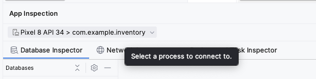

5. [**Databases**] ペインで **item_database** のノードを開き、[**Item**] を選択して調べます。[**Databases**] ペインが空の場合はエミュレータを使用し、[**Add Item**] 画面からデータベースにアイテムを追加します。
6. Database Inspector の [**Live updates**] チェックボックスをオンにすると、エミュレータまたはデバイス上で実行中のアプリを操作したときに、表示されるデータが自動的に更新されます。

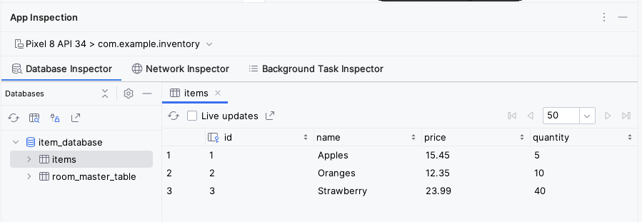

お疲れさまでした。[Room](https://developer.android.com/reference/androidx/room/package-summary) を使用してデータを保持するアプリを作成できました。次の Codelab では、アプリに `lazyColumn` を追加してデータベースのアイテムを表示し、エンティティの削除や更新などの新機能をアプリに追加します。ご参加をお待ちしております。

### 11. 解答コードを取得する

この Codelab の解答コードは GitHub リポジトリにあります。この Codelab の完成したコードをダウンロードするには、次の git コマンドを使用します。

```
$ git clone https://github.com/google-developer-training/basic-android-kotlin-compose-training-inventory-app.git
$ cd basic-android-kotlin-compose-training-inventory-app
$ git checkout room
```

または、リポジトリを ZIP ファイルとしてダウンロードし、Android Studio で開くこともできます。

> **注:**解答コードは、ダウンロードしたリポジトリの `room` ブランチにあります。

この Codelab の解答コードを確認する場合は、[GitHub](https://github.com/google-developer-training/basic-android-kotlin-compose-training-inventory-app/tree/room) で表示します。

### 12. 概要

#### まとめ

- テーブルを、`@Entity` アノテーション付きのデータクラスとして定義する。`@ColumnInfo` アノテーション付きのプロパティを、テーブルの列として定義する。
- データ アクセス オブジェクト（DAO）を、`@Dao` アノテーション付きのインターフェースとして定義する。DAO は、Kotlin 関数をデータベース クエリにマッピングする。
- アノテーションを使用して、`@Insert`、`@Delete`、`@Update` 関数を定義する。
- SQLite クエリ文字列の `@Query` アノテーションを、他のクエリのパラメータとして使用する。
- [Database Inspector](https://developer.android.com/studio/inspect/database) を使用して、Android SQLite データベースに保存されているデータを表示する。

### 13. 詳細

#### 関連リンク

Android デベロッパー ドキュメント

- [Room を使用してローカル データベースにデータを保存する](https://developer.android.com/training/data-storage/room)
- [androidx.room](https://developer.android.com/reference/androidx/room/package-summary)
- [Database Inspector を使用してデータベースをデバッグする](https://developer.android.com/studio/inspect/database)

ブログ投稿

- [Room に関する 7 つのプロフェッショナル向けのヒント](https://medium.com/androiddevelopers/7-pro-tips-for-room-fbadea4bfbd1)
- [唯一無二のオブジェクト。Kotlin 用語集](https://medium.com/androiddevelopers/the-one-and-only-object-5dfd2cf7ab9b)

動画


その他のドキュメントと記事

- [シングルトン パターン](https://en.wikipedia.org/wiki/Singleton_pattern)
- [コンパニオン オブジェクト](https://kotlinlang.org/docs/object-declarations.html#companion-objects)
- [SQLite チュートリアル - SQLite を早くマスターする簡単な方法](https://www.sqlitetutorial.net/)

## 4. Room によるデータの読み取りと更新


### 1. 始める前に

前の Codelab では、Room 永続ライブラリ（[SQLite](https://developer.android.com/training/data-storage/sqlite) データベース上の抽象化レイヤ）を使用してアプリデータを保存する方法を学習しました。この Codelab では、Inventory アプリに機能を追加し、Room を使用して SQLite データベースのデータの読み取り、表示、更新、削除を行う方法について学習します。`LazyColumn` を使用してデータベースのデータを表示し、データベースを構成するデータが変更されると表示データを自動的に更新します。

#### 前提条件

- Room ライブラリを使用して SQLite データベースの作成と操作ができること。
- エンティティ クラス、DAO クラス、データベース クラスを作成できること。
- データ アクセス オブジェクト（DAO）を使用して Kotlin 関数を SQL クエリにマッピングできること。
- [`LazyColumn`](https://developer.android.com/jetpack/compose/lists) でリストアイテムを表示できること。
- このユニットで前の Codelab（Room を使用してデータを永続化する）を修了していること。

#### 学習内容

- SQLite データベースからエンティティを読み取り、表示する方法。
- Room ライブラリを使用して SQLite データベースのエンティティの更新と削除を行う方法。

#### 作成するアプリの概要

- 在庫アイテムのリストを表示し、Room を使用してアプリ データベースのアイテムを更新、編集、削除できる Inventory アプリ。

#### 必要なもの

- Android Studio がインストールされているパソコン

### 2. スターター アプリの概要

この Codelab では、前の Codelab（Room を使用してデータを永続化する）で扱った Inventory アプリの解答コードをスターター コードとして使用します。スターター アプリはすでに、[Room](https://developer.android.com/reference/androidx/room/package-summary) 永続ライブラリを使用してデータを保存できる状態になっています。ユーザーは [**Add Item**] 画面を使用してアプリ データベースにデータを追加できます。

> **注:**現在のバージョンのスターター アプリでは、データベースに保存されているデータは表示されません。

| ![アイテムの詳細が入力された [Add Item] 画面](./images/basic-android-kotlin-compose-update-data-room/bae9fd572d154881.png) |  |
|---|---|

この Codelab ではアプリを拡張し、Room ライブラリを使用して、データの読み取りと表示、データベースのエンティティの更新と削除を行えるようにします。

##### この Codelab のスターター コードをダウンロードする

まず、スターター コードをダウンロードします。

```
$ git clone https://github.com/google-developer-training/basic-android-kotlin-compose-training-inventory-app.git
$ cd basic-android-kotlin-compose-training-inventory-app
$ git checkout room
```

または、リポジトリを ZIP ファイルとしてダウンロードし、Android Studio で開くこともできます。

> **注:**スターター コードは、ダウンロードしたリポジトリの `room` ブランチにあります。

この Codelab のスターター コードを確認する場合は、[GitHub](https://github.com/google-developer-training/basic-android-kotlin-compose-training-inventory-app/tree/room) で表示します。

### 3. UI 状態を更新する

このタスクではアプリに `LazyColumn` を追加して、データベースに格納されているデータを表示します。


#### コンポーズ可能な関数 HomeScreen のチュートリアル

- `ui/home/HomeScreen.kt` ファイルを開き、`HomeScreen()` コンポーザブルを確認します。

```kotlin
@Composable
fun HomeScreen(
    navigateToItemEntry: () -> Unit,
    navigateToItemUpdate: (Int) -> Unit,
    modifier: Modifier = Modifier,
) {
    val scrollBehavior = TopAppBarDefaults.enterAlwaysScrollBehavior()

    Scaffold(
        topBar = {
            // Top app with app title
        },
        floatingActionButton = {
            FloatingActionButton(
                // onClick details
            ) {
                Icon(
                    // Icon details
                )
            }
        },
    ) { innerPadding ->
     
       // Display List header and List of Items
        HomeBody(
            itemList = listOf(),  // Empty list is being passed in for itemList
            onItemClick = navigateToItemUpdate,
            modifier = modifier.padding(innerPadding)
                              .fillMaxSize()
        )
    }
```

このコンポーズ可能な関数は、次のアイテムを表示します。

- アプリタイトルが記載されたトップ アプリバー
- 在庫に新しいアイテムを追加するフローティング アクション ボタン（FAB）
- コンポーズ可能な関数 `HomeBody()`

コンポーズ可能な関数 `HomeBody()` は、渡されたリストに基づいて在庫アイテムを表示します。スターター コード実装の一環として、空のリスト（`listOf()`）がコンポーズ可能な関数 `HomeBody()` に渡されます。在庫リストをこのコンポーザブルに渡すには、リポジトリから在庫データを取得して `HomeViewModel` に渡す必要があります。

#### `HomeViewModel` で UI 状態を出力する

`ItemDao` にメソッド（`getItem()` と `getAllItems()`）を追加してアイテムを取得する際、戻り値の型として `Flow` を指定します。`Flow` は通常のデータ ストリームを表すということを思い出してください。`Flow` を返すと、特定のライフサイクルについて DAO からメソッドを明示的に 1 回呼び出すだけで済みます。Room は、基となるデータの更新を非同期的に処理します。

Flow からデータを取得することを「Flow からの収集」といいます。UI レイヤの Flow から収集する際は、考慮すべき点がいくつかあります。

- 構成変更（デバイスの回転など）のようなライフサイクル イベントが発生すると、アクティビティが再作成されます。これにより、再コンポーズと `Flow` からの収集が再度行われます。
- ライフサイクル イベント間で既存のデータが失われないように、値を状態としてキャッシュに保存することをおすすめします。
- コンポーザブルのライフサイクルが終了した後など、オブザーバーが残っていない場合は、Flow をキャンセルする必要があります。

`ViewModel` から `Flow` を公開するには、`StateFlow` を使用することをおすすめします。`StateFlow` を使用すると、UI のライフサイクルに関係なくデータを保存でき、監視できます。`Flow` を `StateFlow` に変換するには、`stateIn` 演算子を使用します。

`stateIn` 演算子には、次に示す 3 つのパラメータがあります。

- `scope` - `viewModelScope` は、`StateFlow` のライフサイクルを定義します。`viewModelScope` がキャンセルされると、`StateFlow` もキャンセルされます。
- `started` - パイプラインは、UI が表示されている場合にのみアクティブにする必要があります。そのためには `SharingStarted.WhileSubscribed()` を使用します。最後のサブスクライバーの消失から共有コルーチンの停止までの遅延（ミリ秒単位）を設定するには、`TIMEOUT_MILLIS` を `SharingStarted.WhileSubscribed()` メソッドに渡します。
- `initialValue` - 状態フローの初期値を `HomeUiState()` に設定します。

`Flow` を `StateFlow` に変換したら、`collectAsState()` メソッドを使用して収集し、そのデータを同じ型の `State` に変換できます。

このステップでは、`StateFlow`（UI 状態のオブザーバブル API）として、Room データベース内のアイテムをすべて取得します。Room の在庫データが変更されると、UI が自動的に更新されます。

1. `ui/home/HomeViewModel.kt` ファイルを開きます。このファイルには `TIMEOUT_MILLIS` 定数と、コンストラクタ パラメータとしてアイテムのリストが指定された `HomeUiState` データクラスが含まれています。

```kotlin
// No need to copy over, this code is part of starter code

class HomeViewModel : ViewModel() {

    companion object {
        private const val TIMEOUT_MILLIS = 5_000L
    }
}

data class HomeUiState(val itemList: List<Item> = listOf())
```

2. `HomeViewModel` クラス内で、`StateFlow<HomeUiState>` 型の `homeUiState` という `val` を宣言します。 初期化エラーはこの後すぐに解決します。

```kotlin
val homeUiState: StateFlow<HomeUiState>
```

3. `itemsRepository` に対して `getAllItemsStream()` を呼び出し、宣言した `homeUiState` に割り当てます。

```kotlin
val homeUiState: StateFlow<HomeUiState> =
    itemsRepository.getAllItemsStream()
```

「Unresolved reference: itemsRepository」というエラーが発生します。この未解決の参照エラーを解決するには、`ItemsRepository` オブジェクトを `HomeViewModel` に渡す必要があります。

4. `ItemsRepository` 型のコンストラクタ パラメータを `HomeViewModel` クラスに追加します。

```kotlin
import com.example.inventory.data.ItemsRepository

class HomeViewModel(itemsRepository: ItemsRepository): ViewModel() {
```

5. `ui/AppViewModelProvider.kt` ファイルの `HomeViewModel` イニシャライザで、次のように `ItemsRepository` オブジェクトを渡します。

```kotlin
initializer {
    HomeViewModel(inventoryApplication().container.itemsRepository)
}
```

6. `HomeViewModel.kt` ファイルに戻ります。型の不一致エラーが発生します。これを解決するには、次のように変換マップを追加します。

```kotlin
val homeUiState: StateFlow<HomeUiState> =
    itemsRepository.getAllItemsStream().map { HomeUiState(it) }
```

Android Studio に型の不一致エラーが引き続き表示されます。このエラーは、`homeUiState` が `StateFlow` 型であり、`getAllItemsStream()` が `Flow` を返すことが原因です。

7. `stateIn` 演算子を使用して `Flow` を `StateFlow` に変換します。`StateFlow` は、UI 状態のオブザーバブル API であり、UI 自体を更新できます。

```kotlin
import androidx.lifecycle.viewModelScope
import kotlinx.coroutines.flow.SharingStarted
import kotlinx.coroutines.flow.map
import kotlinx.coroutines.flow.stateIn

val homeUiState: StateFlow<HomeUiState> =
    itemsRepository.getAllItemsStream().map { HomeUiState(it) }
        .stateIn(
            scope = viewModelScope,
            started = SharingStarted.WhileSubscribed(TIMEOUT_MILLIS),
            initialValue = HomeUiState()
        )
```

8. アプリをビルドして、コードにエラーがないことを確認します。表示は変わりません。

### 4. 在庫データを表示する

このタスクでは、`HomeScreen` で UI 状態を収集し、更新します。

1. `HomeScreen.kt` ファイルのコンポーズ可能な関数 `HomeScreen` に、`HomeViewModel` 型の新しい関数パラメータを追加し、初期化します。

```kotlin
import androidx.lifecycle.viewmodel.compose.viewModel
import com.example.inventory.ui.AppViewModelProvider

@Composable
fun HomeScreen(
    navigateToItemEntry: () -> Unit,
    navigateToItemUpdate: (Int) -> Unit,
    modifier: Modifier = Modifier,
    viewModel: HomeViewModel = viewModel(factory = AppViewModelProvider.Factory)
)
```

2. コンポーズ可能な関数 `HomeScreen` に `homeUiState` という `val` を追加して、`HomeViewModel` から UI 状態を収集します。`collectAsState``()` を使用します。これにより、[`StateFlow`](https://kotlin.github.io/kotlinx.coroutines/kotlinx-coroutines-core/kotlinx.coroutines.flow/-state-flow/index.html) から値を収集し、[`State`](https://developer.android.com/reference/kotlin/androidx/compose/runtime/State) を介してその最新の値を表します。

```kotlin
import androidx.compose.runtime.collectAsState
import androidx.compose.runtime.getValue

val homeUiState by viewModel.homeUiState.collectAsState()
```

3. `HomeBody()` 関数呼び出しを更新し、`homeUiState.itemList` を `itemList` パラメータに渡します。

```kotlin
HomeBody(
    itemList = homeUiState.itemList,
    onItemClick = navigateToItemUpdate,
    modifier = modifier.padding(innerPadding)
)
```

4. アプリを実行します。アプリ データベースにアイテムを保存した場合、在庫リストが表示されます。リストが空の場合は、在庫アイテムをアプリ データベースに追加します。


### 5. データベースをテストする

コードをテストする重要性については、これまでの Codelab で説明しました。このタスクでは、DAO クエリをテストする単体テストを追加します。その後、Codelab を進めながらテストを追加します。

データベース実装をテストするには、JUnit テストを作成して Android デバイス上で実行することをおすすめします。このテストではアクティビティの作成が必要ないため、UI テストよりも高速に実行できます。

1. `build.gradle.kts (Module :app)` ファイルで、Espresso と JUnit に関する次の依存関係に注意してください。

```kotlin
// Testing
androidTestImplementation("androidx.test.espresso:espresso-core:3.5.1")
androidTestImplementation("androidx.test.ext:junit:1.1.5")
```

2. [**Project**] ビューに切り替え、[**src**] > [**New**] > [**Directory**] を右クリックして、テスト用にテスト ソースセットを作成します。

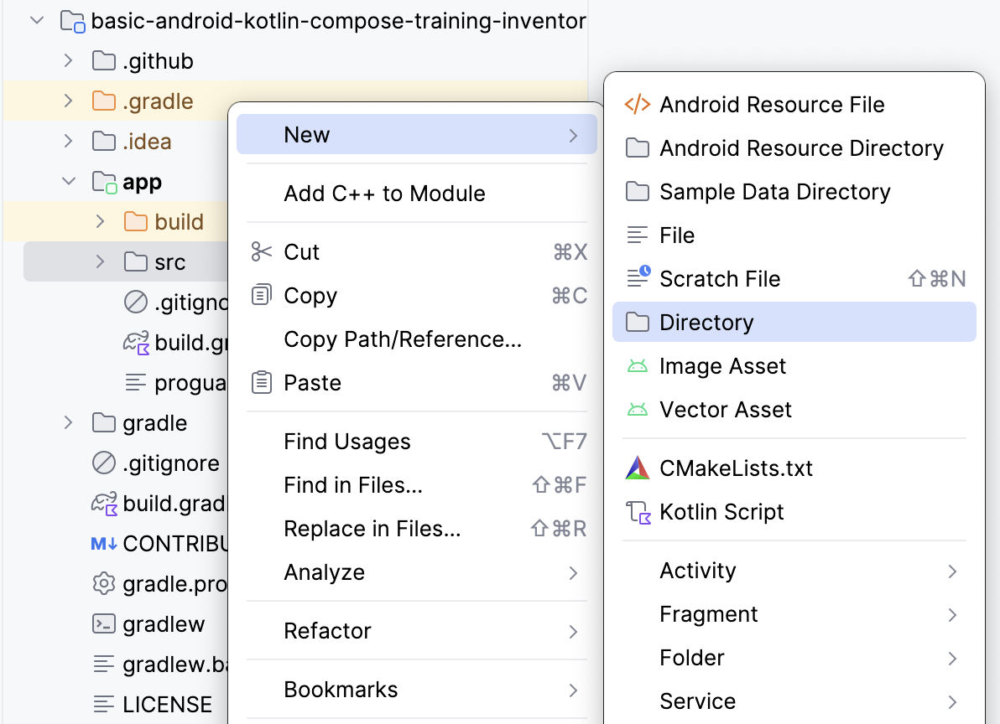

3. [**New Directory**] ポップアップで [**androidTest/kotlin**] を選択します。

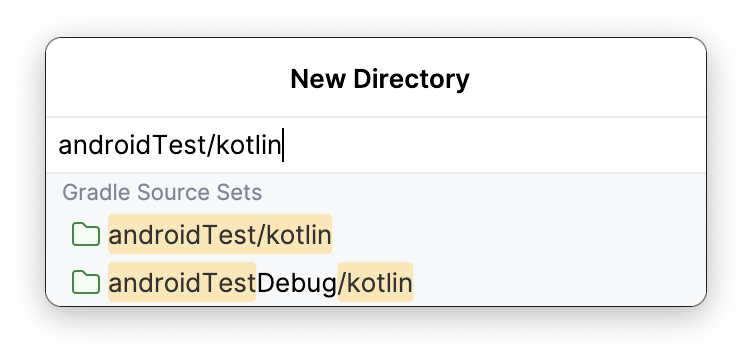

4. `ItemDaoTest.kt` という Kotlin クラスを作成します。
5. `ItemDaoTest` クラスに `@RunWith(AndroidJUnit4::class)` アノテーションを付けます。クラスは以下のサンプルコードのようになります。

```kotlin
package com.example.inventory

import androidx.test.ext.junit.runners.AndroidJUnit4
import org.junit.runner.RunWith

@RunWith(AndroidJUnit4::class)
class ItemDaoTest {
}
```

6. クラス内に、`ItemDao` 型と `InventoryDatabase` 型のプライベート `var` 変数を追加します。

```kotlin
import com.example.inventory.data.InventoryDatabase
import com.example.inventory.data.ItemDao

private lateinit var itemDao: ItemDao
private lateinit var inventoryDatabase: InventoryDatabase
```

7. データベースを作成するための関数を追加して `@Before` アノテーションを付け、どのテストよりも前に実行できるようにします。
8. メソッド内で、`itemDao` を初期化します。

```kotlin
import android.content.Context
import androidx.room.Room
import androidx.test.core.app.ApplicationProvider
import org.junit.Before

@Before
fun createDb() {
    val context: Context = ApplicationProvider.getApplicationContext()
    // Using an in-memory database because the information stored here disappears when the
    // process is killed.
    inventoryDatabase = Room.inMemoryDatabaseBuilder(context, InventoryDatabase::class.java)
        // Allowing main thread queries, just for testing.
        .allowMainThreadQueries()
        .build()
    itemDao = inventoryDatabase.itemDao()
}
```

この関数では、インメモリ データベースを使用し、ディスク上には保持しません。そのためには、inMemoryDatabaseBuilder() 関数を使用します。この処理を行うのは、情報を永続的に保持する必要はなく、プロセスが強制終了されたときに削除する必要があるためです。テスト用に、`.allowMainThreadQueries()` を使用してメインスレッドで DAO クエリを実行しています。

9. データベースを閉じるために別の関数を追加します。`@After` アノテーションを付けて、データベースを閉じ、それぞれのテストの後に実行します。

```kotlin
import org.junit.After
import java.io.IOException

@After
@Throws(IOException::class)
fun closeDb() {
    inventoryDatabase.close()
}
```

10. 次のコード例に示すように、使用するデータベース用にクラス `ItemDaoTest` でアイテムを宣言します。

```kotlin
import com.example.inventory.data.Item

private var item1 = Item(1, "Apples", 10.0, 20)
private var item2 = Item(2, "Bananas", 15.0, 97)
```

11. データベースにアイテムを 1 つ追加してから 2 つ追加するユーティリティ関数を追加します。これらの関数は後ほどテストで使用します。`suspend` としてマークし、コルーチン内で実行できるようにします。

```kotlin
private suspend fun addOneItemToDb() {
    itemDao.insert(item1)
}

private suspend fun addTwoItemsToDb() {
    itemDao.insert(item1)
    itemDao.insert(item2)
}
```

12. データベースにアイテムを 1 つ挿入する（`insert()`）テストを作成します。テストに `daoInsert_insertsItemIntoDB` という名前を付け、`@Test` アノテーションを付けます。

```kotlin
import kotlinx.coroutines.flow.first
import kotlinx.coroutines.runBlocking
import org.junit.Assert.assertEquals
import org.junit.Test

@Test
@Throws(Exception::class)
fun daoInsert_insertsItemIntoDB() = runBlocking {
    addOneItemToDb()
    val allItems = itemDao.getAllItems().first()
    assertEquals(allItems[0], item1)
}
```

このテストでは、ユーティリティ関数 `addOneItemToDb()` を使用してデータベースにアイテムを 1 つ追加します。次に、データベースの最初のアイテムを読み取ります。`assertEquals()` を使用して想定値と実際値を比較します。`runBlocking{}` を使用して新しいコルーチンでテストを実行します。このためにユーティリティ関数を `suspend` としてマークします。

13. テストを実行し、合格することを確認します。

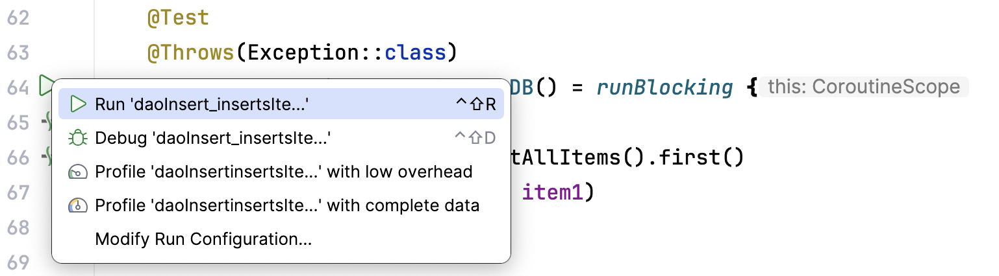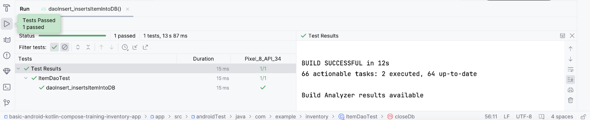

14. データベースから `getAllItems()` の別のテストを作成します。テストに `daoGetAllItems_returnsAllItemsFromDB` という名前を付けます。

```kotlin
@Test
@Throws(Exception::class)
fun daoGetAllItems_returnsAllItemsFromDB() = runBlocking {
    addTwoItemsToDb()
    val allItems = itemDao.getAllItems().first()
    assertEquals(allItems[0], item1)
    assertEquals(allItems[1], item2)
}
```

上記のテストでは、コルーチン内でデータベースにアイテムを 2 つ追加します。次に、その 2 つのアイテムを読み取り、想定値と比較します。

### 6. アイテムの詳細を表示する

このタスクでは、エンティティの詳細を読み取って [**Item Details**] 画面に表示します。Inventory アプリのデータベースから取得した名前、価格、数量などのアイテム UI 状態を使用し、`ItemDetailsScreen` コンポーザブルで [**Item Details**] 画面に表示します。あらかじめ用意されているコンポーズ可能な関数 `ItemDetailsScreen` には、アイテムの詳細を表示する 3 つの Text コンポーザブルが含まれています。

##### ui/item/ItemDetailsScreen.kt

この画面はスターター コードの一部であり、アイテムの詳細を表示します。これについては、後の Codelab で説明します。この Codelab では、この画面は扱いません。`ItemDetailsViewModel.kt` は、この画面に対応する `ViewModel` です。

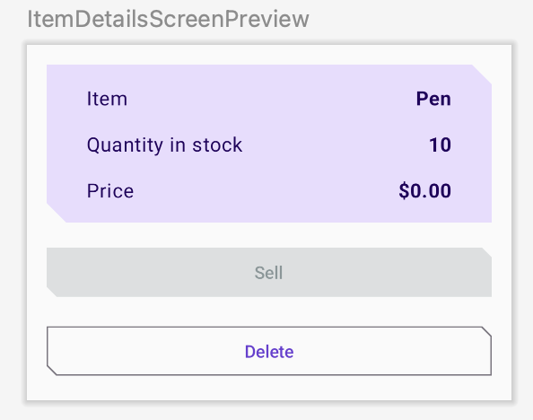

1. コンポーズ可能な関数 `HomeScreen` の `HomeBody()` 関数呼び出しに注目してください。`navigateToItemUpdate` が `onItemClick` パラメータに渡されています。これは、リスト内のアイテムをクリックすると呼び出されます。

```kotlin
// No need to copy over 
HomeBody(
    itemList = homeUiState.itemList,
    onItemClick = navigateToItemUpdate,
    modifier = modifier
        .padding(innerPadding)
        .fillMaxSize()
)
```

2. `ui/navigation/InventoryNavGraph.kt` を開き、`HomeScreen` コンポーザブルの `navigateToItemUpdate` パラメータに注目してください。このパラメータは、アイテムの詳細画面としてナビゲーションのデスティネーションを指定します。

```kotlin
// No need to copy over 
HomeScreen(
    navigateToItemEntry = { navController.navigate(ItemEntryDestination.route) },
    navigateToItemUpdate = {
        navController.navigate("${ItemDetailsDestination.route}/${it}")
   }
```

`onItemClick` 関数のこの部分は、すでに実装されています。リストアイテムをクリックすると、アプリは [Item Details] 画面に移動します。

3. 在庫リストのアイテムをクリックすると、フィールドが空の状態で [Item Details] 画面が表示されます。

![データが空の [Item Details] 画面](./images/basic-android-kotlin-compose-update-data-room/fc38a289ccb8a947.png)

テキスト フィールドにアイテムの詳細を入力するには、`ItemDetailsScreen()` で UI 状態を収集する必要があります。

4. `UI/Item/ItemDetailsScreen.kt` で、`ItemDetailsViewModel` 型の `ItemDetailsScreen` コンポーザブルに新しいパラメータを追加し、ファクトリ メソッドを使用して初期化します。

```kotlin
import androidx.lifecycle.viewmodel.compose.viewModel
import com.example.inventory.ui.AppViewModelProvider

@Composable
fun ItemDetailsScreen(
    navigateToEditItem: (Int) -> Unit,
    navigateBack: () -> Unit,
    modifier: Modifier = Modifier,
    viewModel: ItemDetailsViewModel = viewModel(factory = AppViewModelProvider.Factory)
)
```

5. `ItemDetailsScreen()` コンポーザブル内に `uiState` という `val` を作成して、UI 状態を収集します。`collectAsState()` を使用して `uiState` `StateFlow` を収集し、`State` を介して最新の値を表します。Android Studio に未解決の参照エラーが表示されます。

```kotlin
import androidx.compose.runtime.collectAsState

val uiState = viewModel.uiState.collectAsState()
```

6. エラーを解決するには、`ItemDetailsViewModel` クラスに `StateFlow<ItemDetailsUiState>` 型の `uiState` という `val` を作成します。
7. アイテム リポジトリからデータを取得し、拡張関数 `toItemDetails()` を使用して `ItemDetailsUiState` にマッピングします。拡張関数 `Item.toItemDetails()` はスターター コードの一部としてすでに作成されています。

```kotlin
import androidx.lifecycle.viewModelScope
import kotlinx.coroutines.flow.SharingStarted
import kotlinx.coroutines.flow.StateFlow
import kotlinx.coroutines.flow.filterNotNull
import kotlinx.coroutines.flow.map
import kotlinx.coroutines.flow.stateIn

val uiState: StateFlow<ItemDetailsUiState> =
         itemsRepository.getItemStream(itemId)
             .filterNotNull()
             .map {
                 ItemDetailsUiState(itemDetails = it.toItemDetails())
             }.stateIn(
                 scope = viewModelScope,
                 started = SharingStarted.WhileSubscribed(TIMEOUT_MILLIS),
                 initialValue = ItemDetailsUiState()
             )
```

8. `ItemsRepository` を `ItemDetailsViewModel` に渡して、`Unresolved reference: itemsRepository` エラーを解決します。

```kotlin
class ItemDetailsViewModel(
    savedStateHandle: SavedStateHandle,
    private val itemsRepository: ItemsRepository
    ) : ViewModel() {
```

9. 次のコード スニペットに示すように、`ui/AppViewModelProvider.kt` で `ItemDetailsViewModel` のイニシャライザを更新します。

```kotlin
initializer {
    ItemDetailsViewModel(
        this.createSavedStateHandle(),
        inventoryApplication().container.itemsRepository
    )
}
```

10. `ItemDetailsScreen.kt` に戻ると、`ItemDetailsScreen()` コンポーザブルのエラーが解決されています。
11. `ItemDetailsScreen()` コンポーザブルで、`ItemDetailsBody()` 関数呼び出しを更新し、`uiState.value` を `itemUiState` 引数に渡します。

```kotlin
ItemDetailsBody(
    itemUiState = uiState.value,
    onSellItem = {  },
    onDelete = { },
    modifier = modifier.padding(innerPadding)
)
```

12. `ItemDetailsBody()` と `ItemInputForm()` の実装を確認します。現在選択されている `item` を `ItemDetailsBody()` から `ItemDetails()` に渡します。

```kotlin
// No need to copy over

@Composable
private fun ItemDetailsBody(
    itemUiState: ItemUiState,
    onSellItem: () -> Unit,
    onDelete: () -> Unit,
    modifier: Modifier = Modifier
) {
    Column(
       //...
    ) {
        var deleteConfirmationRequired by rememberSaveable { mutableStateOf(false) }
        ItemDetails(
             item = itemDetailsUiState.itemDetails.toItem(), modifier = Modifier.fillMaxWidth()
         )

      //...
    }
```

13. アプリを実行します。[**Inventory**] 画面のリスト要素をクリックすると、[**Item Details**] 画面が表示されます。
14. 空白画面にはならず、在庫データベースから取得したエンティティの詳細が表示されます。

![有効なアイテムの詳細が表示された [Item Details] 画面](./images/basic-android-kotlin-compose-update-data-room/b0c839d911d5c379.png)

15. [**Sell**] ボタンをタップします。何も起こりません。

次のセクションでは、[**Sell**] ボタンの機能を実装します。

### 7. アイテムの詳細画面を実装する

##### **ui/item/ItemEditScreen.kt**

アイテム編集画面は、スターター コードの一部としてすでに用意されています。

このレイアウトには、新しい在庫アイテムの詳細を編集するテキスト フィールド コンポーザブルが含まれています。

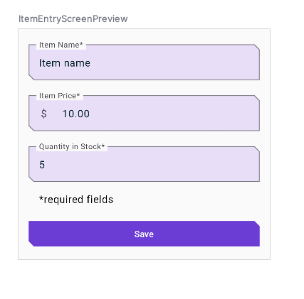

このアプリのコードはまだ完全には機能しません。たとえば、[**Item Details**] 画面で [**Sell**] ボタンをタップしても [**Quantity in Stock**] は増えません。[**Delete**] ボタンをタップすると確認ダイアログが表示されますが、[**Yes**] ボタンを選択しても、そのアイテムが実際に削除されるわけではありません。

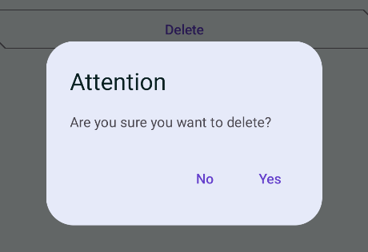

最後に、FAB ボタン  をタップすると空の [**Edit Item**] 画面が開きます。

![空のフィールドを含む [Edit Item] 画面](./images/basic-android-kotlin-compose-update-data-room/cdccb3a8931b4a3.png)

このセクションでは、[**Sell**] ボタン、[**Delete**] ボタン、FAB ボタンの機能を実装します。

### 8. アイテム販売機能を実装する

このセクションでは、アプリの機能を拡張して販売機能を実装します。この更新では次のタスクを行います。

- DAO 関数のテストを追加してエンティティを更新します。
- `ItemDetailsViewModel` に関数を追加して数量を減らし、アプリ データベースのエンティティを更新します。
- 数量が 0 の場合は [**Sell**] ボタンを無効にします。

1. `ItemDaoTest.kt` に、パラメータのない `daoUpdateItems_updatesItemsInDB()` という関数を追加します。`@Test` アノテーションと `@Throws(Exception::class)` アノテーションを付けます。

```kotlin
@Test
@Throws(Exception::class)
fun daoUpdateItems_updatesItemsInDB()
```

2. 関数を定義して、`runBlocking` ブロックを作成します。内部で `addTwoItemsToDb()` を呼び出します。

```kotlin
fun daoUpdateItems_updatesItemsInDB() = runBlocking {
    addTwoItemsToDb()
}
```

3. 2 つのエンティティを異なる値で更新し、`itemDao.update` を呼び出します。

```kotlin
itemDao.update(Item(1, "Apples", 15.0, 25))
itemDao.update(Item(2, "Bananas", 5.0, 50))
```

4. `itemDao.getAllItems()` を使用してエンティティを取得します。更新したエンティティと比較し、アサートします。

```kotlin
val allItems = itemDao.getAllItems().first()
assertEquals(allItems[0], Item(1, "Apples", 15.0, 25))
assertEquals(allItems[1], Item(2, "Bananas", 5.0, 50))
```

5. 完成した関数が次のようになっていることを確認します。

```kotlin
@Test
@Throws(Exception::class)
fun daoUpdateItems_updatesItemsInDB() = runBlocking {
    addTwoItemsToDb()
    itemDao.update(Item(1, "Apples", 15.0, 25))
    itemDao.update(Item(2, "Bananas", 5.0, 50))

    val allItems = itemDao.getAllItems().first()
    assertEquals(allItems[0], Item(1, "Apples", 15.0, 25))
    assertEquals(allItems[1], Item(2, "Bananas", 5.0, 50))
}
```

6. テストを実行し、合格することを確認します。

##### `ViewModel` に関数を追加する

1. `ItemDetailsViewModel.kt` の `ItemDetailsViewModel` クラス内に、パラメータのない `reduceQuantityByOne()` という関数を追加します。

```kotlin
fun reduceQuantityByOne() {
}
```

2. この関数内で、`viewModelScope.launch{}` を使用してコルーチンを開始します。

> **注:**データベース操作は、コルーチン内で実行する必要があります。

```kotlin
import kotlinx.coroutines.launch
import androidx.lifecycle.viewModelScope

viewModelScope.launch {
}
```

3. `launch` ブロック内で、`currentItem` という `val` を作成し、`uiState.value.toItem()` に設定します。

```kotlin
val currentItem = uiState.value.toItem()
```

`uiState.value` は **`ItemUiState`** 型です。拡張関数 `toItem``()` を使用して、`Item` エンティティ型に変換します。

4. `quality` が `0` より大きいかどうかを確認する `if` ステートメントを追加します。
5. `itemsRepository` に対して `updateItem()` を呼び出し、更新した `currentItem` を渡します。`copy()` を使用して `quantity` 値を更新し、関数を次のようにします。

```kotlin
fun reduceQuantityByOne() {
    viewModelScope.launch {
        val currentItem = uiState.value.itemDetails.toItem()
        if (currentItem.quantity > 0) {
    itemsRepository.updateItem(currentItem.copy(quantity = currentItem.quantity - 1))
       }
    }
}
```

6. `ItemDetailsScreen.kt` に戻ります。
7. `ItemDetailsScreen` コンポーザブルで、`ItemDetailsBody()` 関数呼び出しに移動します。
8. `onSellItem` ラムダで、`viewModel.reduceQuantityByOne()` を呼び出します。

```kotlin
ItemDetailsBody(
    itemUiState = uiState.value,
    onSellItem = { viewModel.reduceQuantityByOne() },
    onDelete = { },
    modifier = modifier.padding(innerPadding)
)
```

9. アプリを実行します。
10. [**Inventory**] 画面でリスト要素をクリックします。[**Item Details**] 画面が表示されたら、[**Sell**] をタップすると数量の値が 1 減ります。

![[Item Details] 画面で [Sell] ボタンをタップすると数量が 1 減る](./images/basic-android-kotlin-compose-update-data-room/3aac7e2c9e7a04b6.png)

11. [**Item Details**] 画面で、数量が 0 になるまで [**Sell**] ボタンをタップし続けます。

> **ヒント:**時間を節約するために、このタスクでは数量の少ないアイテムを使用することをおすすめします。数量の少ないアイテムがない場合は、数量の少ないアイテムを新たに作成しても構いません。

数量が 0 になったら、再度 [**Sell**] をタップします。数量を更新する前に関数 `reduceQuantityByOne()` によって数量が 0 より大きいかどうかがチェックされるため、見た目は変わりません。

![在庫量が 0 の [Item Details] 画面](./images/basic-android-kotlin-compose-update-data-room/dbd889a1ac1f3be4.png)

適切なフィードバックをユーザーに提供するために、販売するアイテムがないときは [**Sell**] ボタンを無効にすることをおすすめします。

12. `ItemDetailsViewModel` クラスで、`map` 変換の **`it`**`.quantity` に基づいて `outOfStock` 値を設定します。

```kotlin
val uiState: StateFlow<ItemDetailsUiState> =
    itemsRepository.getItemStream(itemId)
        .filterNotNull()
        .map {
            ItemDetailsUiState(outOfStock = it.quantity <= 0, itemDetails = it.toItemDetails())
        }.stateIn(
            //...
        )
```

13. アプリを実行します。在庫量が 0 になると [**Sell**] ボタンが無効になります。

![[Sell] ボタンが無効になっている [Item Details] 画面](./images/basic-android-kotlin-compose-update-data-room/48f2748adfe30d47.png)

これで、アイテム**販売**機能がアプリに実装されました。

#### アイテム エンティティを削除する

前のタスクと同様に、削除機能を実装して、アプリの機能をさらに拡張する必要があります。この機能は、販売機能よりはるかに簡単に実装できます。このプロセスでは次のタスクを行います。

- 削除 DAO クエリのテストを追加します。
- データベースからエンティティを削除する関数を `ItemDetailsViewModel` クラスに追加します。
- `ItemDetailsBody` コンポーザブルを更新します。

##### DAO テストを追加する

1. `ItemDaoTest.kt` に、`daoDeleteItems_deletesAllItemsFromDB()` というテストを追加します。

```kotlin
@Test
@Throws(Exception::class)
fun daoDeleteItems_deletesAllItemsFromDB()
```

2. `runBlocking {}` を使用してコルーチンを開始します。

```kotlin
fun daoDeleteItems_deletesAllItemsFromDB() = runBlocking {
}
```

3. データベースにアイテムを 2 つ追加し、この 2 つのアイテムに対して `itemDao.delete()` を呼び出してデータベースから削除します。

```kotlin
addTwoItemsToDb()
itemDao.delete(item1)
itemDao.delete(item2)
```

4. データベースからエンティティを取得し、リストが空であることを確認します。完成したテストは次のようになります。

```kotlin
import org.junit.Assert.assertTrue

@Test
@Throws(Exception::class)
fun daoDeleteItems_deletesAllItemsFromDB() = runBlocking {
    addTwoItemsToDb()
    itemDao.delete(item1)
    itemDao.delete(item2)
    val allItems = itemDao.getAllItems().first()
    assertTrue(allItems.isEmpty())
}
```

##### `ItemDetailsViewModel` に削除関数を追加する

1. `ItemDetailsViewModel` に、`deleteItem()` という新しい関数を追加します。これはパラメータを受け取らず、何も返しません。
2. `deleteItem()` 関数内に `itemsRepository.deleteItem()` 関数呼び出しを追加して、`uiState.value.``toItem``()` を渡します。

```kotlin
suspend fun deleteItem() {
    itemsRepository.deleteItem(uiState.value.itemDetails.toItem())
}
```

この関数では、`toItem``()` 拡張関数を使用して、`uiState` を `itemDetails` 型から `Item` エンティティ型に変換します。

3. `ui/item/ItemDetailsScreen` コンポーザブルに、`coroutineScope` という `val` を追加し、`rememberCoroutineScope()` に設定します。このアプローチでは、呼び出されたコンポジション（`ItemDetailsScreen` コンポーザブル）にバインドされているコルーチン スコープが返されます。

```kotlin
import androidx.compose.runtime.rememberCoroutineScope

val coroutineScope = rememberCoroutineScope()
```

4. `ItemDetailsBody()` 関数までスクロールします。
5. `onDelete` ラムダ内で `coroutineScope` を使用してコルーチンを開始します。
6. `launch` ブロック内で、`viewModel` に対して `deleteItem()` メソッドを呼び出します。

```kotlin
import kotlinx.coroutines.launch

ItemDetailsBody(
    itemUiState = uiState.value,
    onSellItem = { viewModel.reduceQuantityByOne() },
    onDelete = {
        coroutineScope.launch {
           viewModel.deleteItem()
    }
    modifier = modifier.padding(innerPadding)
)
```

7. アイテムを削除したら、在庫画面に戻ります。
8. `deleteItem()` 関数呼び出しの後で `navigateBack()` を呼び出します。

```kotlin
onDelete = {
    coroutineScope.launch {
        viewModel.deleteItem()
        navigateBack()
    }
```

9. 引き続き `ItemDetailsScreen.kt` ファイル内で、`ItemDetailsBody()` 関数までスクロールします。

この関数はスターター コードの一部です。このコンポーザブルは、アイテムを削除する前にユーザーの確認を得るためのアラート ダイアログを表示します。[**Yes**] をタップすると `deleteItem()` 関数が呼び出されます。

```kotlin
// No need to copy over

@Composable
private fun ItemDetailsBody(
    itemUiState: ItemUiState,
    onSellItem: () -> Unit,
    onDelete: () -> Unit,
    modifier: Modifier = Modifier
) {
    Column(
        /*...*/
    ) {
        //...
       
        if (deleteConfirmationRequired) {
            DeleteConfirmationDialog(
                onDeleteConfirm = {
                    deleteConfirmationRequired = false
                    onDelete()
                },
                //...
            )
        }
    }
}
```

[**No**] をタップするとアラート ダイアログが閉じます。`showConfirmationDialog()` 関数によって次のアラートが表示されます。


10. アプリを実行します。
11. [**Inventory**] 画面でリスト要素を選択します。
12. [**Item Details**] 画面で、[**Delete**] をタップします。
13. アラート ダイアログで [**Yes**] をタップすると [**Inventory**] 画面に戻ります。
14. 削除したエンティティがアプリ データベースに存在しなくなっていることを確認します。

これで削除機能が実装されました。

| ![[Alerts] ダイアログ ウィンドウが表示された [Item Details] 画面。](./images/basic-android-kotlin-compose-update-data-room/5a03d33f03b4d17c.png) | 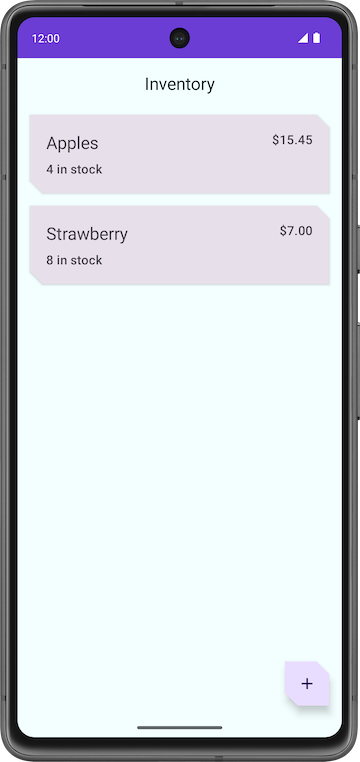 |
|---|---|

#### アイテム エンティティを編集する

前のセクションと同様に、このセクションではアイテム エンティティを編集するという別の機能をアプリに追加します。

アプリ データベースのエンティティを編集する手順を簡単に示すと、次のようになります。

- テスト用アイテム取得 DAO クエリにテストを追加します。
- テキスト フィールドと [**Edit Item**] 画面にエンティティの詳細を入力します。
- Room を使用してデータベースのエンティティを更新します。

##### DAO テストを追加する

1. `ItemDaoTest.kt` に、`daoGetItem_returnsItemFromDB()` というテストを追加します。

```kotlin
@Test
@Throws(Exception::class)
fun daoGetItem_returnsItemFromDB()
```

2. 関数を定義します。コルーチン内で、データベースにアイテムを 1 つ追加します。

```kotlin
@Test
@Throws(Exception::class)
fun daoGetItem_returnsItemFromDB() = runBlocking {
    addOneItemToDb()
}
```

3. `itemDao.getItem()` 関数を使用してデータベースからエンティティを取得し、`item` という `val` に設定します。

```kotlin
val item = itemDao.getItem(1)
```

4. `assertEquals()` を使用して実際値と取得値を比較し、アサートします。完成したテストは次のようになります。

```kotlin
@Test
@Throws(Exception::class)
fun daoGetItem_returnsItemFromDB() = runBlocking {
    addOneItemToDb()
    val item = itemDao.getItem(1)
    assertEquals(item.first(), item1)
}
```

5. テストを実行し、合格することを確認します。

##### テキスト フィールドに入力する

アプリを実行して [**Item Details**] 画面に移動し、次に FAB をクリックすると、画面のタイトルが [**Edit Item**] になったことを確認できます。ただし、テキスト フィールドはすべて空です。このステップでは、[**Edit Item**] 画面のテキスト フィールドにエンティティの詳細を入力します。

| ![[Item Details] 画面で [Sell] ボタンをタップすると数量が 1 減る](./images/basic-android-kotlin-compose-update-data-room/3aac7e2c9e7a04b6.png) | ![空のフィールドを含む [Edit Item] 画面](./images/basic-android-kotlin-compose-update-data-room/cdccb3a8931b4a3.png) |
|---|---|

1. `ItemDetailsScreen.kt` で、`ItemDetailsScreen` コンポーザブルまでスクロールします。
2. `FloatingActionButton()` で、`onClick` 引数を変更して `uiState.value.itemDetails.id`（選択したエンティティの `id`）を含めます。この `id` を使用してエンティティの詳細を取得します。

```kotlin
FloatingActionButton(
    onClick = { navigateToEditItem(uiState.value.itemDetails.id) },
    modifier = /*...*/
)
```

3. `ItemEditViewModel` クラスに、`init` ブロックを追加します。

```kotlin
init {

}
```

4. `init` ブロック内で、`viewModelScope``.``launch` を使用してコルーチンを開始します。

```kotlin
import kotlinx.coroutines.launch

viewModelScope.launch { }
```

5. `launch` ブロック内で、`itemsRepository.getItemStream(itemId)` を使用してエンティティの詳細を取得します。

```kotlin
import androidx.lifecycle.viewModelScope
import kotlinx.coroutines.flow.filterNotNull
import kotlinx.coroutines.flow.first

init {
    viewModelScope.launch {
        itemUiState = itemsRepository.getItemStream(itemId)
            .filterNotNull()
            .first()
            .toItemUiState(true)
    }
}
```

この launch ブロックに、null でない値のみを含むフローを返すフィルタを追加します。`toItemUiState()` を使用して、`item` エンティティを `ItemUiState` に変換します。`actionEnabled` 値を `true` として渡し、[**Save**] ボタンを有効にします。

`Unresolved reference: itemsRepository` エラーを解決するには、ビューモデルに依存関係として `ItemsRepository` を渡す必要があります。

6. `ItemEditViewModel` クラスにコンストラクタ パラメータを追加します。

```kotlin
class ItemEditViewModel(
    savedStateHandle: SavedStateHandle,
    private val itemsRepository: ItemsRepository
)
```

7. `AppViewModelProvider.kt` ファイルの `ItemEditViewModel` イニシャライザで、`ItemsRepository` オブジェクトを引数として追加します。

```kotlin
initializer {
    ItemEditViewModel(
        this.createSavedStateHandle(),
        inventoryApplication().container.itemsRepository
    )
}
```

8. アプリを実行します。
9. [**Item Details**] に移動し、FAB  をタップします。
10. フィールドにアイテムの詳細が入力されます。
11. 在庫量または他のフィールドを編集し、[**Save**] をタップします。

何も起こりません。アプリ データベースのエンティティを更新していないためです。これは次のセクションで修正します。

| ![[Item Details] 画面で [Sell] ボタンをタップすると数量が 1 減る](./images/basic-android-kotlin-compose-update-data-room/3aac7e2c9e7a04b6.png) | ![空のフィールドを含む [Edit Item] 画面](./images/basic-android-kotlin-compose-update-data-room/cdccb3a8931b4a3.png) |
|---|---|

##### Room を使用してエンティティを更新する

この最後のタスクでは、コードの最後の要素を追加して更新機能を実装します。ViewModel で必要な関数を定義し、`ItemEditScreen` で使用します。

それではまたコーディングしてみましょう。

1. `ItemEditViewModel` クラスに、`ItemUiState` オブジェクトを受け取って何も返さない `updateUiState()` という関数を追加します。この関数は、ユーザーが入力した新しい値で `itemUiState` を更新します。

```kotlin
fun updateUiState(itemDetails: ItemDetails) {
    itemUiState =
        ItemUiState(itemDetails = itemDetails, isEntryValid = validateInput(itemDetails))
}
```

この関数では、渡された `itemDetails` を `itemUiState` に割り当て、`isEntryValid` 値を更新します。`itemDetails` が `true` の場合、[**Save**] ボタンが有効になります。ユーザーが入力した内容が有効である場合にのみ、この値を `true` に設定します。

2. `ItemEditScreen.kt` ファイルに移動します。
3. `ItemEditScreen` コンポーザブルで、`ItemEntryBody()` 関数呼び出しまで下にスクロールします。
4. `onItemValueChange` 引数の値を、新しい関数 `updateUiState` に設定します。

```kotlin
ItemEntryBody(
    itemUiState = viewModel.itemUiState,
    onItemValueChange = viewModel::updateUiState,
    onSaveClick = { },
    modifier = modifier.padding(innerPadding)
)
```

5. アプリを実行します。
6. [**Edit Item**] 画面に移動します。
7. 無効になるようにエンティティ値のいずれかを空にします。[**Save**] ボタンが自動的に無効になります。

| ![[Sell] ボタンが有効になっている [Item Details] 画面](./images/basic-android-kotlin-compose-update-data-room/d368151eb7b198cd.png) | ![テキスト フィールドがすべて入力され、[Save] ボタンが有効になっている [Edit Item] 画面](./images/basic-android-kotlin-compose-update-data-room/427ff7e2bf45f6ca.png) | ![[Save] ボタンが無効な [Edit Item] 画面](./images/basic-android-kotlin-compose-update-data-room/9aa8fa86a928e1a6.png) |
|---|---|---|

8. `ItemEditViewModel` クラスに戻り、何も受け取らない `updateItem()` という `suspend` 関数を追加します。この関数を使用して、更新したエンティティを Room データベースに保存します。

```kotlin
suspend fun updateItem() {
}
```

9. `getUpdatedItemEntry()` 関数内で、`if` 条件を追加し、`validateInput()` 関数を使用してユーザー入力を検証します。
10. `itemsRepository` に対して `updateItem()` 関数を呼び出し、`itemUiState.itemDetails.``toItem``()` を渡します。Room データベースに追加するには、エンティティを `Item` 型にする必要があります。完成した関数は次のようになります。

```kotlin
suspend fun updateItem() {
    if (validateInput(itemUiState.itemDetails)) {
        itemsRepository.updateItem(itemUiState.itemDetails.toItem())
    }
}
```

11. `ItemEditScreen` コンポーザブルに戻ります。`updateItem()` 関数を呼び出すためにコルーチン スコープが必要です。`coroutineScope` という val を作成し、`rememberCoroutineScope()` に設定します。

```kotlin
import androidx.compose.runtime.rememberCoroutineScope

val coroutineScope = rememberCoroutineScope()
```

12. `ItemEntryBody()` 関数呼び出しで、`onSaveClick` 関数の引数を更新し、`coroutineScope` 内のコルーチンを開始します。
13. `launch` ブロック内で、`viewModel` に対して `updateItem()` を呼び出し、戻ります。

```kotlin
import kotlinx.coroutines.launch

onSaveClick = {
    coroutineScope.launch {
        viewModel.updateItem()
        navigateBack()
    }
},
```

完成した `ItemEntryBody()` 関数呼び出しは次のようになります。

```kotlin
ItemEntryBody(
    itemUiState = viewModel.itemUiState,
    onItemValueChange = viewModel::updateUiState,
    onSaveClick = {
        coroutineScope.launch {
            viewModel.updateItem()
            navigateBack()
        }
    },
    modifier = modifier.padding(innerPadding)
)
```

14. アプリを実行し、在庫アイテムを編集してみましょう。Inventory アプリのデータベース内のアイテムを編集できるようになりました。

| ![[Edit Item] 画面のアイテムの詳細を編集しました](./images/basic-android-kotlin-compose-update-data-room/6ed9dac5d3cafeda.png) | ![更新されたアイテムの詳細が表示された [アイテムの詳細] 画面 ](./images/basic-android-kotlin-compose-update-data-room/476f37623617d192.png) |
|---|---|

Room を使用してデータベースを管理する初めてのアプリを作成しました。

### 9. 解答コード

この Codelab の解答コードは、以下に示す GitHub リポジトリとブランチにあります。

> **解答コードの URL:**
> 
> [https://github.com/google-developer-training/basic-android-kotlin-compose-training-inventory-app](https://github.com/google-developer-training/basic-android-kotlin-compose-training-inventory-app/tree/main)

### 10. 詳細

#### 関連リンク

Android デベロッパー ドキュメント

- [Database Inspector を使用してデータベースをデバッグする](https://developer.android.com/studio/inspect/database)
- [Room を使用してローカル データベースにデータを保存する](https://developer.android.com/training/data-storage/room)
- [データベースをテストしてデバッグする | Android デベロッパー](https://developer.android.com/training/data-storage/room/testing-db)

Kotlin リファレンス

- [`Extensions`](https://kotlinlang.org/docs/extensions.html)

## 5. 演習: Bus Schedule アプリを作成する（提出対象）


### 1. 始める前に

#### はじめに

Room を使用してデータを永続化する Codelab では、Android アプリに Room データベースを実装する方法を学習しました。この演習では、独立して行われる一連のステップを通じて、Room データベースの実装について理解を深めることができます。

この演習セットでは、Room を使用してデータを永続化する Codelab で学習したコンセプトを使用して、Bus Schedule アプリを完成させます。このアプリは、Room データベースから取得したデータを使用して、バス停と出発予定時刻のリストをユーザーに提示します。

解答コードは最後にあります。この学習体験を最大限に活用するため、記載された解答コードを確認する前に、できる限りご自身で実装とトラブルシューティングを行ってみてください。この実践時間中に、多くのことを学びましょう。

#### 前提条件

- Persist Data with Room Codelab の「Compose を用いた Android アプリ開発の基礎」コースワークを完了していること

#### 必要なもの

- Android Studio がインストールされた、インターネットに接続できるパソコン。
- Bus Schedule スターター コード

#### 作成するアプリの概要

この演習セットでは、データベースを実装し、データベースを使用して UI にデータを配信することで、Bus Schedule アプリを完成させます。スターター コードのアセット ディレクトリにあるデータベース ファイルは、アプリのデータを提供します。このデータをデータベースに読み込み、アプリで読み取れるようにします。

アプリを完成させると、バス停の一覧とそれぞれの到着時刻が表示されます。リスト内の項目をクリックすると、そのバス停のデータを提供する詳細画面に移動できます。

完成したアプリが Room データベースから読み込まれたこのデータを表示します。

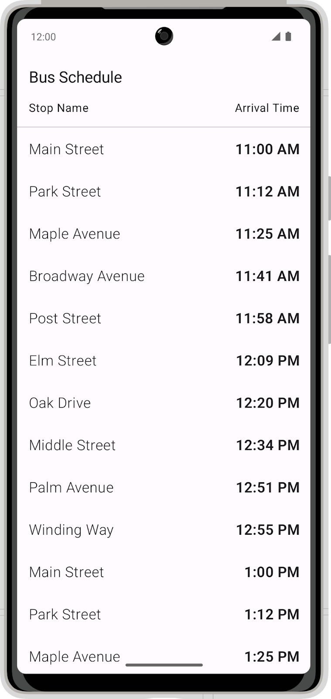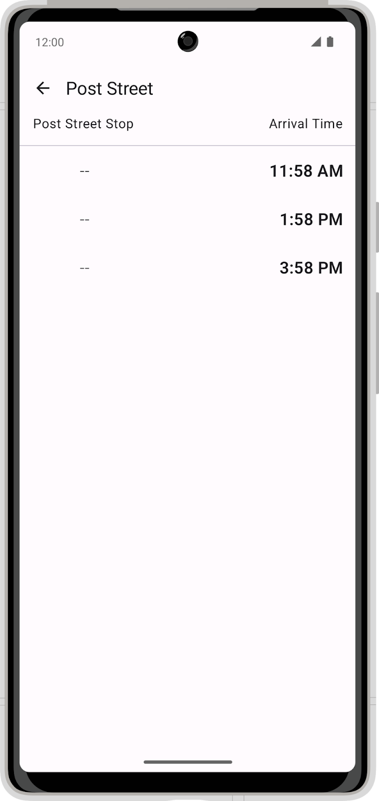

### 2. スターター コードをダウンロードする

> **スターター コードの URL:**
> 
> [https://github.com/google-developer-training/basic-android-kotlin-compose-training-bus-schedule-app](https://github.com/google-developer-training/basic-android-kotlin-compose-training-bus-schedule-app/tree/starter)
> 
> **スターター コードのブランチ名:**`starter`

1. Android Studio で `basic-android-kotlin-compose-training-bus-schedule` フォルダを開きます。
2. Android Studio で Bus Schedule アプリのコードを開きます。
3. **実行**ボタン  をクリックして、アプリをビルドし実行します。

アプリが `starter` ブランチコードからビルドされた場合、1 つのバス停を示すスケジュールを表示することが想定されています。

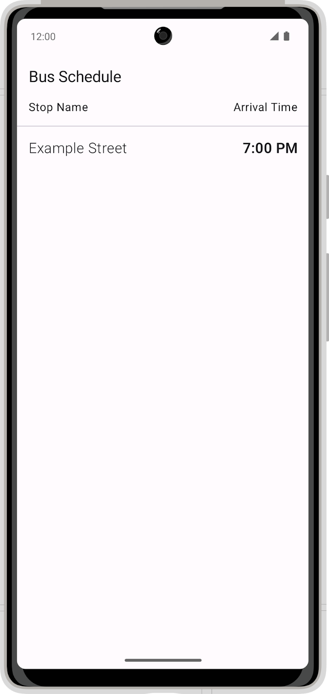

### 3. 依存関係を追加する

アプリに次の依存関係を追加します。

##### **app/build.gradle.kts**

```kotlin
implementation("androidx.room:room-ktx:${rootProject.extra["room_version"]}")
implementation("androidx.room:room-runtime:${rootProject.extra["room_version"]}")
ksp("androidx.room:room-compiler:${rootProject.extra["room_version"]}")
```

[Room のドキュメント](https://developer.android.com/jetpack/androidx/releases/room)から `room` の最新の安定版を入手し、正しいバージョン番号を追加してください。現時点での最新バージョンは下記のとおりです。

##### **build.gradle.kts**

```kotlin
set("room_version", "2.5.1")
```

### 4. Room エンティティを作成する

現在の Bus Schedule データクラスを `Room Entity` に変換します。

次の図は、スキーマと `Entity` プロパティを含む最終的なデータテーブルのサンプルを示しています。

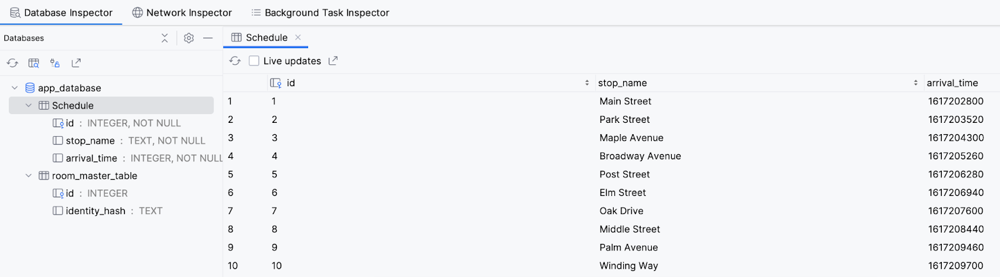

### 5. データ アクセス オブジェクトを作成する

データベースにアクセスするためのデータアクセス オブジェクト（DAO）を作成します。DAO は、データベース内のすべてのアイテムを取得するメソッドと、バス停の名前を含む単一のアイテムを取得するメソッドを提供します。スケジュールは到着時刻の順に並べます。

### 6. データベース インスタンスを作成する

`Entity` と DAO を使用する Room データベースを作成します。データベースがスターター コード内の `assets/database/bus_schedule.db` ファイルからのデータを使って初期化されます。

### 7. ViewModel を更新する

ViewModel を更新して DAO からデータを取得し、サンプルデータを提供する代わりにこれを UI に提供します。リストと個々のバス停のデータを提供するには、両方の DAO メソッドを利用します。

### 8. 解答コード

> **解答コードの URL:**
> 
> [https://github.com/google-developer-training/basic-android-kotlin-compose-training-bus-schedule-app](https://github.com/google-developer-training/basic-android-kotlin-compose-training-bus-schedule-app/tree/main)
> 
> **解答コードのブランチ名:**`main`

## 6. つまずきやすいポイント

- Room 関連のビルドエラーは KSP（アノテーション処理）の設定漏れが原因のことが多いです。Codelab の `build.gradle.kts` の記述と見比べましょう。
- 「保存したはずのデータが表示されない」ときは、Database Inspector で実際にテーブルの中身を見るのが最短です。

## 7. 提出物

次の Codelab で完成させた Android Studio プロジェクトを、学習用リポジトリの `unit6/BusSchedule/` に置きます（プロジェクトフォルダごとコピー。`build/` と `.idea/` は含めない）。

- 演習: Bus Schedule アプリを作成する

PR 本文には次の 3 点を書いてください。

- **やったこと**：どの Codelab / 演習を完了したか
- **動作確認**：どの端末（エミュレータ名 or 実機）で何を確認したか
- **詰まった点と解決**：エラーの内容と、どう直したか（AI に聞いた内容も可）

## 8. チェックリスト

- [ ] Room の Entity / DAO / Database の役割を説明できる
- [ ] アプリを再起動してもデータが残る CRUD アプリを作れる
- [ ] `Flow` でデータベースの変更を UI に自動反映できる
- [ ] パスウェイ末尾のクイズに合格した
- [ ] 提出物が `unit6/BusSchedule/` にあり、Android Studio（または Kotlin Playground）で開いて動く

---

## 課題提出

この章には提出課題があります。

1. 上記の提出物を完了する
2. GitHub で `feature/06-room` ブランチを作成し、`develop` へのPRを作成（base=`develop`）
3. [AIプログラムレビュー](https://ai.studio/apps/84d224cb-7de1-44fb-995b-9a5917d25603?fullscreenApplet=true) を実行
4. 問題がなければ、進捗ダッシュボードで **PR URL** と **完了日** を記録
