# 第15章: SQL の概要

## 1. この章のゴール

- リレーショナルデータベースのテーブル・行・列を説明できる
- `SELECT` / `INSERT` / `UPDATE` / `DELETE` の基本的な SQL を書ける
- Android Studio の Database Inspector で SQL を実行できる

## 2. 進め方

次の内容を **上から順番に** 進めます。「やらなくてOK」の行は飛ばして構いません。レッスンの本文はこのページの下にすべて掲載しています。目安時間の合計は約100分です。

| # | 種類 | 内容 | 目安 | 備考 |
|---|---|---|---|---|
| 1 | レッスン | SQL を使用してデータベースに対する読み取りと書き込みを行う | 約90分 |  |
| 2 | クイズ | [テスト: SQL の概要](https://developer.android.com/courses/quizzes/android-basics-compose-unit-6-pathway-1/android-basics-compose-unit-6-pathway-1?hl=ja) | 約10分 | リンク先で受ける |

このプログラムの進め方は次の通りです。

1. 下の各レッスンを読み、各ステップの説明を理解してから **自分でコードを打つ**（コピペで済ませない）
2. ステップごとにアプリを実行し、期待どおり動くか確認する
3. 動かないときは、エラー文をそのまま AI に貼って「何が原因か」を聞き、直したら **なぜ直ったか** をメモする
4. 章末のクイズ（リンク先）を受けて、間違えた項目をレッスンで読み直す

> 画面が最新の Android Studio と異なる場合があります。

## 3. SQL を使用してデータベースに対する読み取りと書き込みを行う


### 1. 始める前に

普段使用しているアプリの多くは、データをデバイスに直接保存します。時計アプリは繰り返しのアラームを保存し、Google マップ アプリは検索履歴のリストを保存します。連絡帳アプリでは、連絡先情報を追加、編集、削除できます。

データの永続化（デバイス上にデータを保存すること）は、Android 開発の重要な要素です。データを永続化すると、アプリを閉じてもユーザー作成コンテンツが失われません。また、インターネットからダウンロードしたデータが保存されるため、後で再ダウンロードせずに済みます。

SQLite は、Android アプリ向けに Android SDK に用意されている、一般的なデータ永続化方法です。SQLite によるリレーショナル データベースを使用すると、Kotlin クラスでデータを構造化する場合と同じようにデータを表現できます。このレッスンでは、SQL（構造化クエリ言語）の基礎を学びます。実際のプログラミング言語ではありませんが、わずか数行のコードで簡単かつ柔軟に SQLite データベースの読み取りと変更を行うことができます。

SQL の基礎知識を習得したら、このユニットで後ほど Room ライブラリを使用してアプリに永続性を追加できるようになります。

> **注:**Android アプリでは、内部ストレージと外部ストレージを含め、複数の方法でデータを保存できます。このユニットでは、Room と Preferences Datastore について説明します。Android でデータを保存するさまざまな方法について詳しくは、[データ ストレージとファイル ストレージの概要](https://developer.android.com/training/data-storage)をご覧ください。

### 2. リレーショナル データベースの主なコンセプト

#### データベースとは

Google スプレッドシートのようなスプレッドシート プログラムを使い慣れている方であれば、データベースの基本的な類似性をすでに把握しているでしょう。

スプレッドシートは、別々のデータテーブル、または同じワークブック内の個々のスプレッドシートで構成されます。

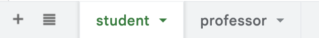

各テーブルは、データが表すものを定義する列、個々のアイテムを表す行と、各列の値で構成されます。たとえば、生徒の ID、名前、専攻、成績の列を定義できます。

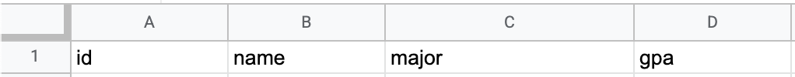

各行には 1 人の学生のデータが含まれ、各列に値が入っています。

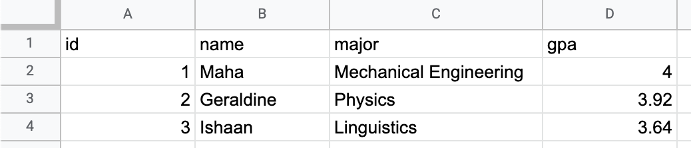

リレーショナル データベースも同様です。

- テーブルは、学生や教授など、表すデータの概要分類を定義します。
- 列は、テーブルの各行に含まれるデータを定義します。
- 行には、テーブルの各列の値からなる実際のデータが含まれます。

また、リレーショナル データベースの構造は、Kotlin のクラスとオブジェクトについてすでに学習した内容と重なります。

```kotlin
data class Student(
    id: Int,
    name: String,
    major: String,
    gpa: Double
)
```

- クラスは、テーブルのように、アプリで表すデータをモデル化します。
- プロパティは、列のように、クラスのすべてのインスタンスに含まれる特定のデータを定義します。
- オブジェクトは、行のように、実際のデータです。行にはデータテーブルで定義された各列の値が含まれるように、オブジェクトにはクラスで定義された各プロパティの値が含まれます。

スプレッドシートには複数のシートが含まれることがあり、アプリには複数のクラスが含まれることがあるように、データベースには複数のテーブルが含まれることがあります。テーブル間の関係をモデル化できるデータベースのことをリレーショナル データベースといいます。たとえば、ある大学院生が 1 人の教授を博士課程の指導教官に持ち、その教授は複数の学生の指導教官であるようなものです。

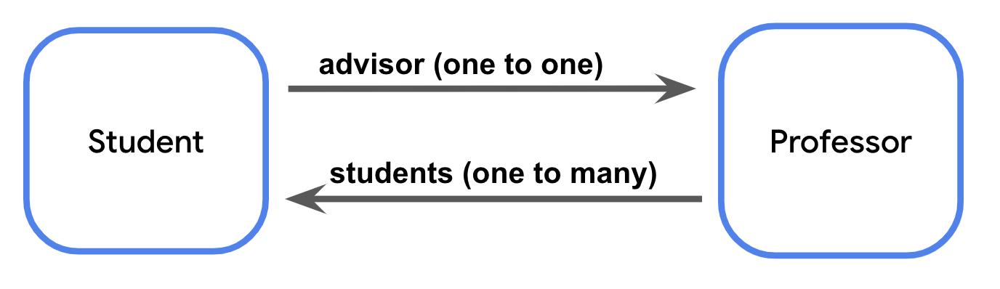

リレーショナル データベースのすべてのテーブルには、各行の値が自動的に増える整数の列など、行の固有識別子が含まれています。この識別子を主キーといいます。

あるテーブルが別のテーブルの主キーを参照する場合、そのキーを外部キーといいます。外部キーがあれば、テーブル間に関係があります。

> **注:**Kotlin のクラスと同様に、慣例として、データベース テーブルの名前には単数形を使用します。前述の例でいうと、テーブルに複数形の `teachers`、`students`、`courses` ではなく、`teacher`、`student`、`course` という名前を付けます。

#### SQLite とは

SQLite は、広く使用されているリレーショナル データベースです。具体的には、SQLite は構造化クエリ言語（SQL）によるリレーショナル データベース管理用の軽量な C ライブラリであり、略して「シーケル」と呼ぶこともあります。

リレーショナル データベースを扱うために C 言語やまったく新しいプログラミング言語を学習する必要はありません。SQL では、数行のコードでリレーショナル データベースのデータを追加したり取得したりできます。

> **注:**すべてのデータベースがテーブル、列、行に整理されているわけではありません。NoSQL という他の種類のデータベースは、キーと値のペアがネストされている JSON オブジェクトと同様の構造です。NoSQL データベースの例としては、Redis や [Cloud Firestore](https://firebase.google.com/docs/firestore) が挙げられます。

#### SQLite でデータを表す

Kotlin では、`Int` や `Boolean` などのデータ型に馴染みがあるでしょう。SQLite データベースでもデータ型を使用します。データテーブルの列には、特定のデータ型が必要です。一般的な Kotlin のデータ型と SQLite のデータ型の対応を下表に示します。

| **Kotlin のデータ型** | **SQLite のデータ型** |
|---|---|
| `Int` | INTEGER |
| `String` | VARCHAR または TEXT |
| `Boolean` | BOOLEAN |
| `Float`、`Double` | REAL |

データベース内のテーブルと各テーブルの列を、総称して「スキーマ」といいます。次のセクションでは、スターター データセットをダウンロードし、そのスキーマについて詳しく学習します。

### 3. スターター データセットをダウンロードする

このレッスンのデータベースは架空のメールアプリ用です。このレッスンでは、メールの並べ替えやフィルタリング、件名や送信者による検索などの身近な例を通じて、SQL で実現できることをすべて実演します。また、次の章で Room を使用する前に、アプリで起こり得る種類のシナリオを経験できます。

[こちら](https://github.com/google-developer-training/android-basics-kotlin-sql-basics-app/tree/compose)の SQL Basics GitHub リポジトリの `compose` ブランチからスターター プロジェクトをダウンロードしてください。

#### Database Inspector を使用する

Database Inspector を使用する手順は次のとおりです。

1. Android Studio で SQL Basics アプリを実行します。アプリの起動時に、次の画面が表示されます。

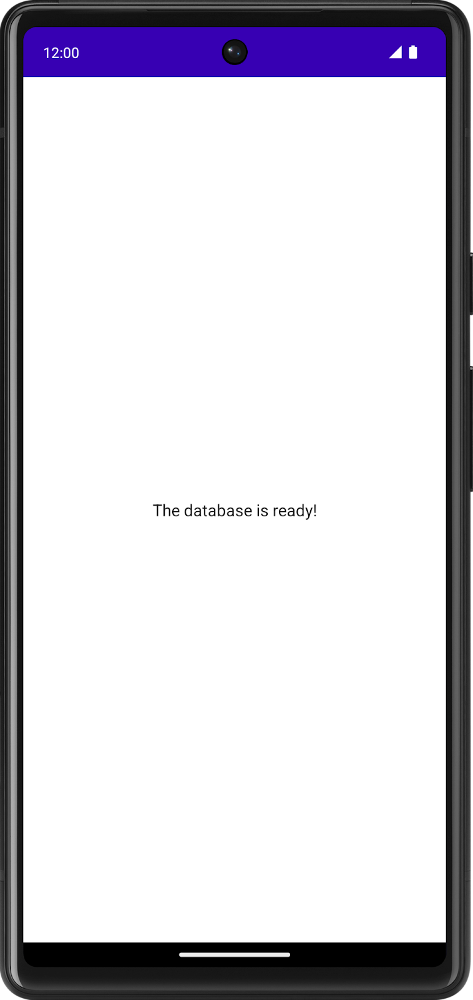

2. Android Studio で、[**View**] > [**Tool Windows**] > [**App Inspection**] をクリックします。

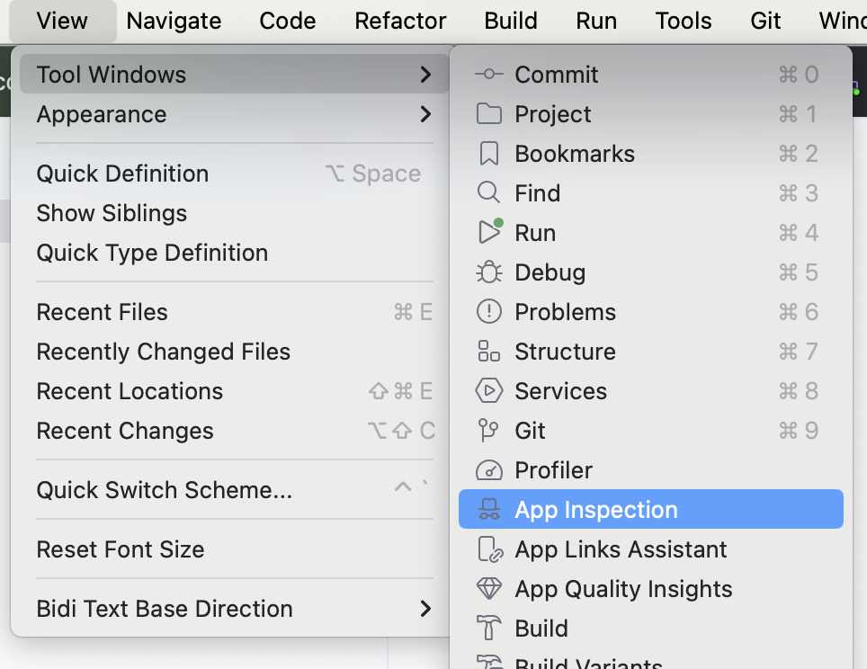

下部に [**App Inspection**] というラベルの付いた新しいタブが表示され、[**Database Inspector**] タブが選択されます。さらに 2 つのタブがありますが、使用する必要はありません。読み込みには数秒かかる場合がありますが、左側にデータテーブルのリストが表示されます。クエリを実行する対象はこの中から選択できます。

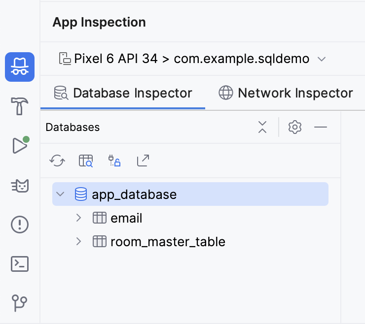

3. [**Open New Query Tab**] ボタンをクリックすると、データベースに対してクエリを実行するペインが開きます。

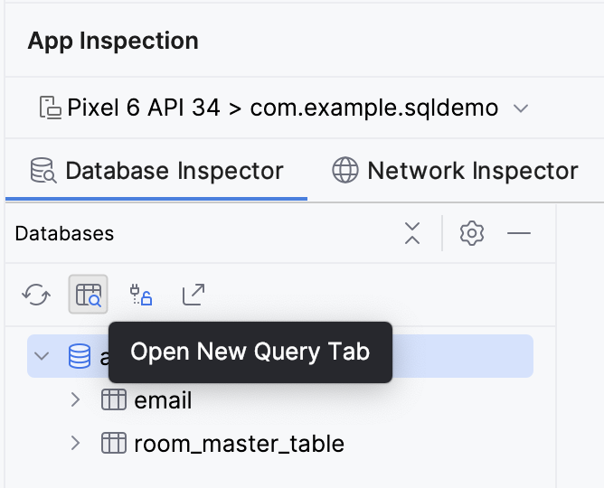

`email` テーブルには次の 7 つの列があります。

- `id`: 主キー
- `subject`: メールの件名
- `sender`: 送信元のメールアドレス
- `folder`: メールが入っているフォルダ（受信トレイや迷惑メールなど）
- `starred`: ユーザーがメールにスターを付けたかどうか
- `read`: ユーザーがメールを読んだかどうか
- `received`: メールを受信した時点のタイムスタンプ

> **ヒント:**[**Keep Database Connections Open**] ボタン 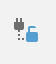 をクリックすると、エミュレータをシャットダウンした後もデータベースの操作が継続されます。
> 
> 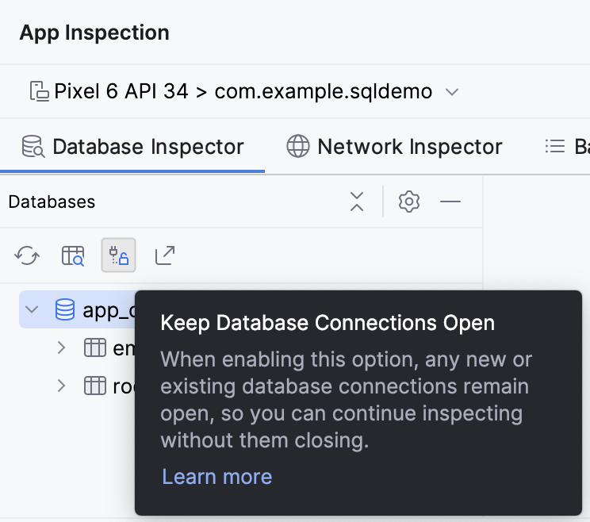

### 4. SELECT ステートメントでデータを読み取る

#### SQL `SELECT` ステートメント

SQL ステートメント（クエリということもあります）は、データベースの読み取りまたは操作に使用されます。

`SELECT` ステートメンでは、SQLite データベースからデータを読み取ります。シンプルな `SELECT` ステートメントは、`SELECT` キーワード、列名、`FROM` キーワード、テーブル名の順で構成されています。どの SQL ステートメントもセミコロン（`;`）で終わります。


`SELECT` ステートメントは、複数の列からデータを返すこともできます。列名はカンマで区切る必要があります。


テーブルからすべての列を選択する場合は、列名の代わりにワイルドカード文字（`*`）を使用します。


いずれの場合も、このようなシンプルな `SELECT` ステートメントでテーブルのすべての行が返されます。返す列名を指定するだけで済みます。

> **注:**どの SQL ステートメントもセミコロン（`;`）で終わらせることが慣例となっていますが、Android Studio の Database Inspector のように、セミコロンを省略できるエディタもあります。このレッスンの図では、完全な SQL クエリの最後にセミコロンを付けています。

#### `SELECT` ステートメントでメールデータを読み取る

メールアプリで第一に必要となる機能は、メッセージのリスト表示です。この情報は、SQL データベースで `SELECT` ステートメントを使用して取得できます。

1. **Database Inspector** で [**email**] テーブルが選択されていることを確認します。

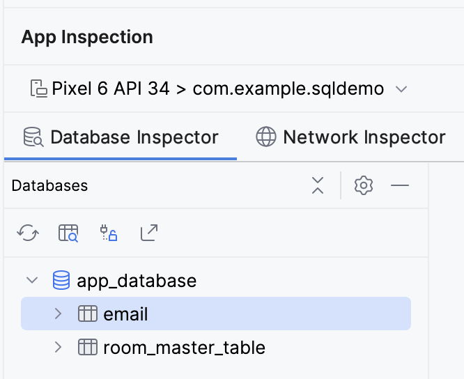

2. まず、`email` テーブル内のすべての行からすべての列を選択してみましょう。

```kotlin
SELECT * FROM email;
```

3. テキスト ボックスの右下隅にある [**Run**] ボタンをクリックします。`email` テーブル全体が返されることを確認します。

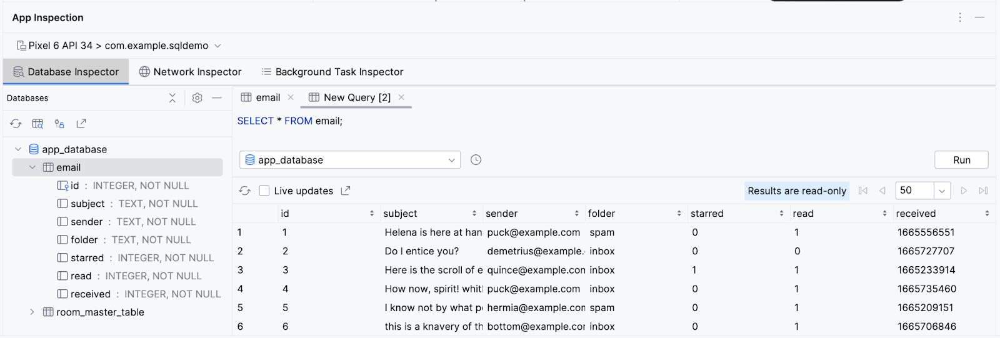

4. 次に、すべての行の件名のみを選択します。

```kotlin
SELECT subject FROM email;
```

5. 今回もクエリはすべての行を返しますが、1 列のみです。

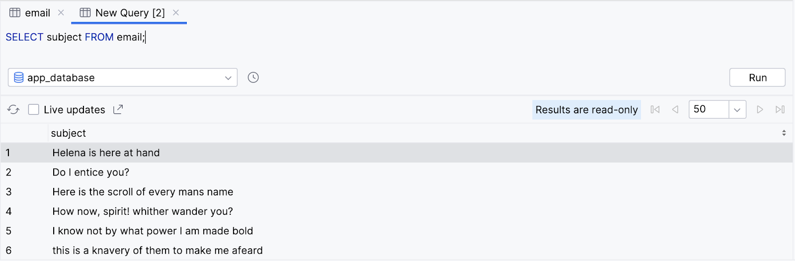

6. 列を複数選択することもできます。件名と送信元を選択してみましょう。

```kotlin
SELECT subject, sender FROM email;
```

7. このクエリで、`email` テーブルのすべての行について件名と送信者の列の値のみが返されることを確認します。

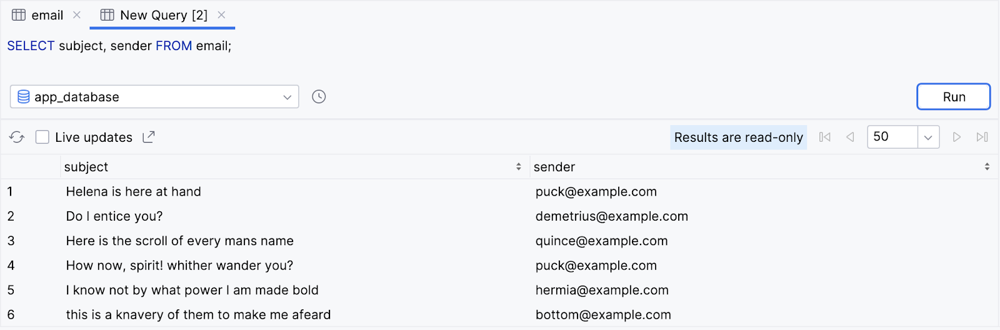

お疲れさまでした。初めてのクエリを実行できました。悪くはありませんが、ほんの初歩です。SQL の「Hello World」だと捉えてください。

`SELECT` ステートメントでは、データのサブセットを指定したり出力の形式を変更したりする句を追加することで、具体的に指定できます。以降のセクションでは、`SELECT` ステートメントでよく使用される句と、データの形式設定方法について説明します。

### 5. SELECT ステートメントを集計関数や個別の値とともに使用する

#### 集計関数で列を減らす

SQL ステートメントは行を返すだけではありません。SQL には、特定の列に対して演算または計算を行えるさまざまな関数が用意されています。たとえば最大値を求めたり、特定の列に対して一意の有効な値の個数を数えたりできます。こうした関数を**集計関数**といいます。特定の列のすべてのデータを返す代わりに、特定の列から 1 つの値を返すことができます。

SQL 集計関数の例を以下に示します。

- `COUNT()`: クエリに一致する行の合計数を返します。
- `SUM()`: 選択した列のすべての行の合計値を返します。
- `AVG()`: 選択した列のすべての値の平均値を返します。
- `MIN()`: 選択した列の最小値を返します。
- `MAX()`: 選択した列の最大値を返します。

列名の代わりに集計関数を呼び出し、かっこで囲んだ列名を引数として渡すことができます。


テーブルの各行についてその列の値を返すのではなく、集計関数を呼び出すことで 1 つの値が返されます。

集計関数を使用すると、データベース内のすべてのデータを読み取る必要がない場合に、値を効率的に計算できます。たとえば、データベース全体をリストに読み込んで手動で求めることなく、列の値の平均を求めることができます。

それでは、`email` テーブルを使用して集計関数を実際に確認してみましょう。

1. アプリで受信メールの総数を取得する必要がある場合は、`COUNT()` 関数とワイルドカード文字（`*`）を使用します。

```kotlin
SELECT COUNT(*) FROM email;
```

2. このクエリは値を 1 つ返します。この処理はすべて SQL クエリで行うことができます。行を手動で数える Kotlin コードは必要ありません。

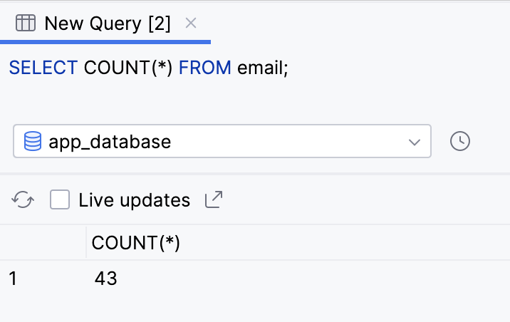

3. 最新のメッセージの時刻を取得するには、received 列に対し `MAX()` 関数を使用します（最新の UNIX タイムスタンプが最大の数になるため）。

```kotlin
SELECT MAX(received) FROM email;
```

4. このクエリは、1 つの結果、つまり received 列の最も大きい（最新の）タイムスタンプを返します。

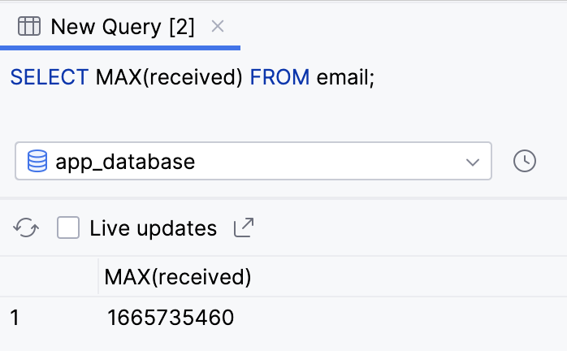

#### `DISTINCT` で重複する結果をフィルタする

列を選択したら、その前に `DISTINCT` キーワードを付けます。この方法は、クエリ結果から重複を削除する場合に便利です。

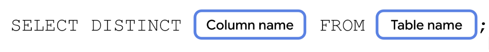

たとえば、多くのメールアプリは、アドレスの予測入力機能を備えています。受信したメールのすべての送信元アドレスを含めてリストに表示できます。

1. 次のクエリを実行すると、各行の `sender` 列が返されます。

```kotlin
SELECT sender FROM email;
```

2. 結果には重複が多数含まれていることがわかります。これは明らかに、理想的なユーザー エクスペリエンスではありません。

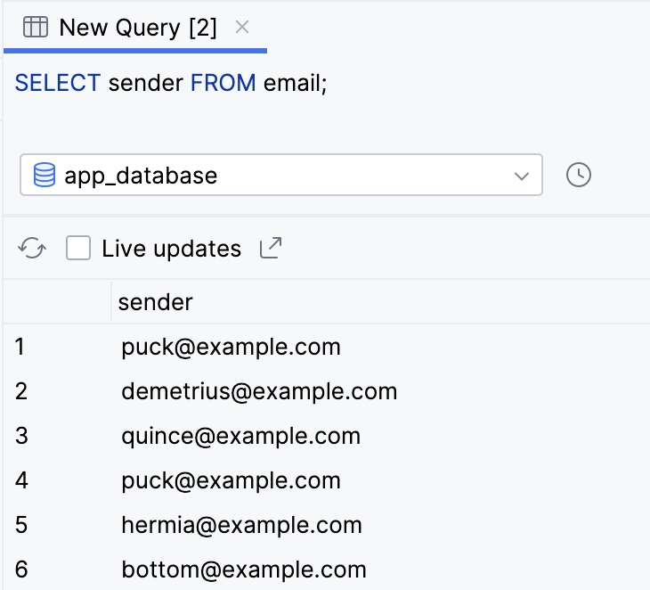

3. sender 列の前に `DISTINCT` キーワードを追加し、クエリを再実行します。

```kotlin
SELECT DISTINCT sender FROM email;
```

4. 結果がはるかに小さくなり、すべての値が一意になりました。

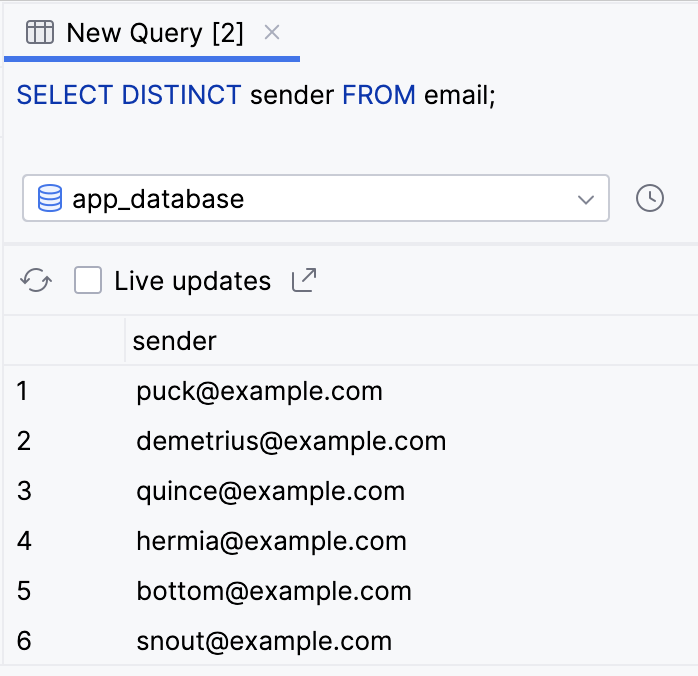

集計関数の列名の前に `DISTINCT` キーワードを付けることもできます。

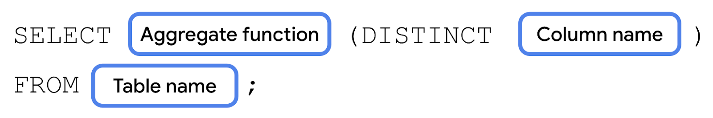

データベース内の一意の送信元の数を知りたいとします。`sender` 列に対して `COUNT()` 集計関数と `DISTINCT` キーワードを使用すると、一意の送信元を数えることができます。

1. `SELECT` ステートメントで `DISTINCT sender` を `COUNT()` 関数に渡します。

```kotlin
SELECT COUNT(DISTINCT sender) FROM email;
```

2. このクエリから、一意の送信元の数が 14 であることがわかります。

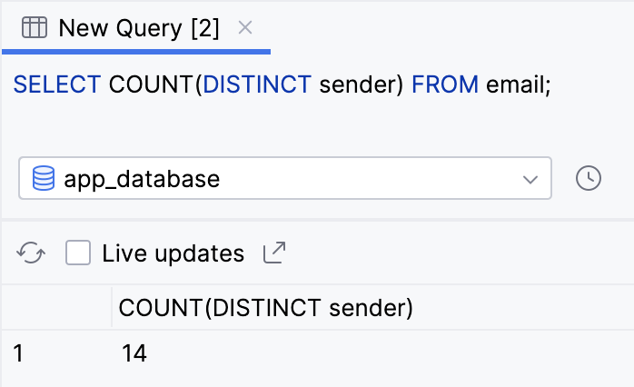

### 6. WHERE 句でクエリをフィルタする

多くのメールアプリには、データ、検索キーワード、フォルダ、送信元などの特定の条件に基づいて、表示するメールをフィルタする機能があります。このようなユースケースでは、`SELECT` クエリに `WHERE` 句を追加できます。

テーブル名の後、新しい行に `WHERE` キーワードとその後に式を追加できます。複雑な SQL クエリを記述するときは、一般的に、読みやすさを考えて句ごとに改行します。

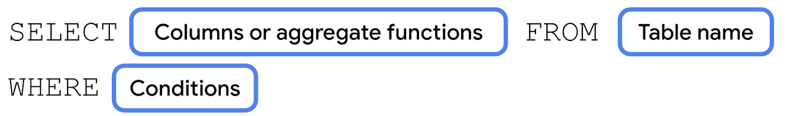

このクエリは、選択した各行に対してブール値チェックを行います。チェックで true が返された場合、その行はクエリの結果に含まれます。クエリで false が返された行は結果に含まれません。

たとえば、メールアプリには迷惑メール、ゴミ箱、下書きのフィルタや、ユーザーが作成したフィルタが存在することがあります。次の手順では、`WHERE` 句を使用してこの処理を行います。

1. 条件 `folder = 'inbox'` をチェックする `WHERE` 句を含め、`email` テーブルからすべての列（`*`）を返す `SELECT` ステートメントを実行します。誤字ではありません。SQL では単一等号を使用して等価性をチェックします。文字列値を表す場合は二重引用符ではなく単一引用符で囲みます。

```kotlin
SELECT * FROM email
WHERE folder = 'inbox';
```

2. 結果として、ユーザーの受信トレイにあるメッセージの行のみが返されます。

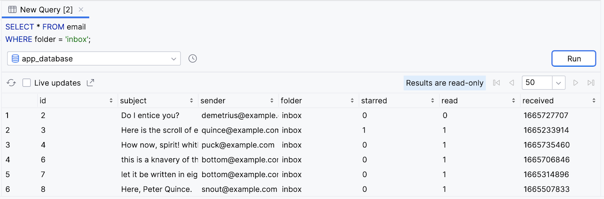

> **注:**SQL の比較演算子には特に注意してください。
> 
> Kotlin とは異なり、SQL の比較演算子は二重等号（`==`）ではなく、単一等号（`=`）です。
> 
> 不等価演算子（`!=`）は Kotlin と同じです。SQL には、比較演算子 `<`、`<=`、`>`、`>=` も用意されています。

#### 論理演算子と `WHERE` 句

SQL の `WHERE` 句は 1 つの式に限定されません。Kotlin の **AND** 演算子（`&&`）に相当する `AND` キーワードを使用すると、両方の条件を満たす結果のみを含めることができます。


あるいは、Kotlin の **OR** 演算子（`||`）に相当する `OR` キーワードを使用すると、いずれかの条件を満たす行を結果に含めることができます。


読みやすくするために、`NOT` キーワードを使用して式を反転することもできます。


多くのメールアプリでは、未読のメールのみを表示するなど、複数のフィルタを使用できます。

`email` テーブルに対し、次のような複雑な `WHERE` 句を試してみましょう。

1. ユーザーの受信トレイにあるメッセージのみを返すだけでなく、read 列の値が false である未読メッセージに限定してみます。

```kotlin
SELECT * FROM email
WHERE folder = 'inbox' AND read = false;
```

2. このクエリを実行すると、ユーザーの受信トレイにある未読メールだけが結果に含まれます。

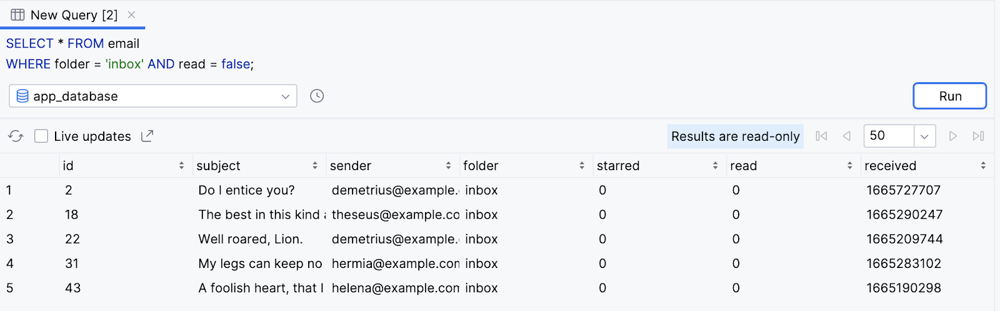

3. **important** フォルダ内にある `OR` **スター付きである**（`starred = true`）すべてのメールを返します。つまり、別のフォルダ内にあるメールであってもスター付きであれば結果に含まれます。

```kotlin
SELECT * FROM email
WHERE folder = 'important' OR starred = true;
```

4. 結果を確認します。

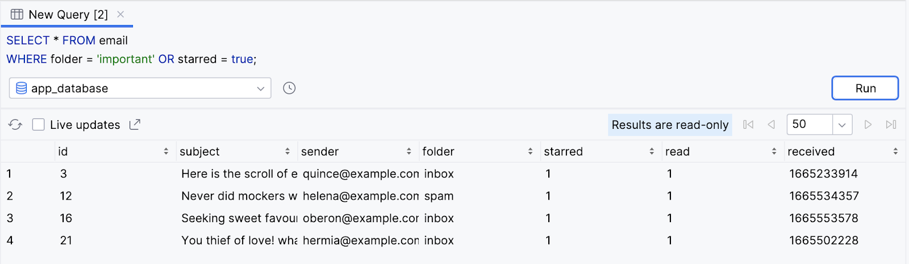

> **注:**SQL 条件 `NOT folder = 'spam'` は `folder != 'spam'` と記述することもできます。

#### `LIKE` を使用してテキストを検索する

`WHERE` 句では、特定の列にあるテキストを検索できるという点が非常に便利です。そのためには、列名、`LIKE` キーワード、検索文字列の順に指定します。


検索文字列はパーセント記号（`%`）で始まり、検索するテキスト（検索キーワード）、再びパーセント記号（`%`）と続きます。


プレフィックス（指定したテキストで始まる結果）を検索する場合は、最初のパーセント記号（`%`）を省略します。


あるいは、サフィックスを検索する場合は、最後のパーセント記号（`%`）を省略します。


アプリでテキスト検索を使用できるユースケースは多数あります。たとえば、件名に特定のテキストが含まれるメールを検索したり、ユーザーが入力しているときに予測入力の候補を更新したりできます。

次の手順では、`email` テーブルをクエリするときにテキスト検索を使用できます。

1. シェイクスピア作品の登場人物は、今回のデータベース内の人物のように、愚か者について話すことが好きでした。次のクエリを実行すると、件名に「fool」というテキストを含むメールの合計数を取得できます。

```kotlin
SELECT COUNT(*) FROM email
WHERE subject LIKE '%fool%';
```

2. 結果を確認します。

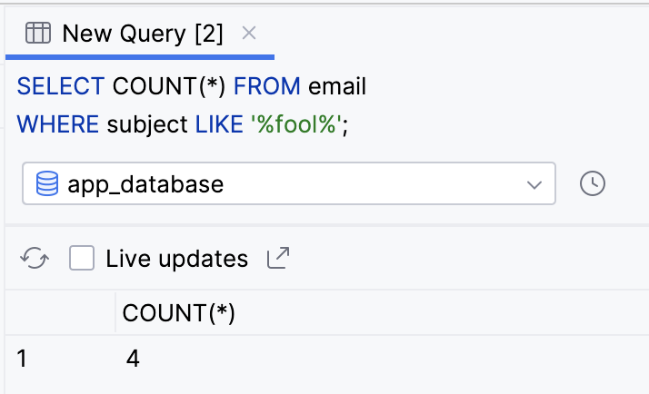

3. 次のクエリを実行すると、件名が「fool」という単語で終わるすべての行のすべての列が返されます。

```kotlin
SELECT * FROM email
WHERE subject LIKE '%fool';
```

4. 2 つの行が返されることを確認します。

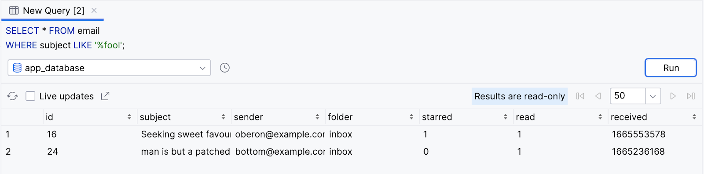

5. 次のクエリを実行すると、`sender` 列の文字「`h`」で始まる個別の値が返されます。

```kotlin
SELECT DISTINCT sender FROM email
WHERE sender LIKE 'h%';
```

6. このクエリで、`helena@example.com`、`hyppolytus@example.com`、`hermia@example.com` の 3 つの値が返されることを確認します。

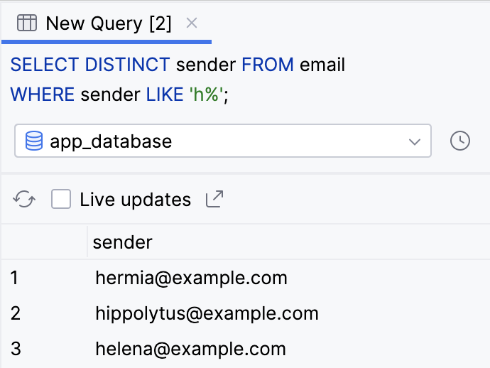

### 7. 結果のグループ化、並べ替え、制限

#### `GROUP BY` で結果をグループ化する

集計関数と `WHERE` 句を使用して結果をフィルタし、減らす方法を確認しました。SQL には、クエリの結果を書式設定するために役立つ句が他にも複数用意されています。これらの句には、結果のグループ化、順序付け、制限を行うものがあります。

`GROUP BY` 句を使用して結果をグループ化すると、指定した列に同じ値を持つすべての行が、結果の中で隣接するようにグループ化されます。この句で結果は変わりませんが、返される順序だけは変わります。

`GROUP BY` 句を `SELECT` ステートメントに追加するには、結果をグループ化する列名を `GROUP BY` キーワードの後に追加します。


一般的なユースケースとして挙げられるのは、`GROUP BY` 句と集計関数を組み合わせて、集計関数の結果を列の値などで別々のバケットに分ける場合です。次の例をご覧ください。`'inbox'` や `'spam'` などの各フォルダにあるメールの件数を取得するとします。`folder` 列と `COUNT()` 集計関数の両方を選択して、`GROUP BY` 句で `folder` 列を指定できます。

1. 次のクエリを実行すると、folder 列と `COUNT()` 集計関数の結果が選択されます。`GROUP BY` 句を使用して、結果を `folder` 列の値でバケット化します。

```kotlin
SELECT folder, COUNT(*) FROM email
GROUP BY folder;
```

2. 結果を確認します。このクエリでは、各フォルダのメールの合計数が返されます。

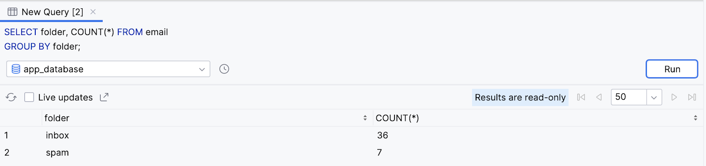

> **注:**各グループを別の列に基づいてさらにサブグループに分ける場合は、`GROUP BY` 句で、複数の列をカンマで区切って指定します。

#### `ORDER BY` で結果を並べ替える

`ORDER BY` 句でクエリ結果を並べ替えるとき、クエリ結果の順序を変更することもできます。`ORDER BY` キーワード、列名、並べ替え方向の順に追加します。


デフォルトでは、並べ替えの方向は `a` の順であり、`ORDER BY` 句で省略できます。結果を降順で並べ替えるには、列名の後に `DESC` を追加します。

メールアプリでは最新のメールを先頭に表示することが期待されているのではないでしょうか。次の手順では、`ORDER BY` 句でこの処理を行います。

1. `ORDER BY` 句を追加し、`received` 列に基づいて未読メールを並べ替えます。デフォルトは昇順（最も低いか古いものが先）であるため、`DESC` キーワードを使用する必要があります。

```kotlin
SELECT * FROM email
ORDER BY received DESC;
```

2. 結果を確認します。

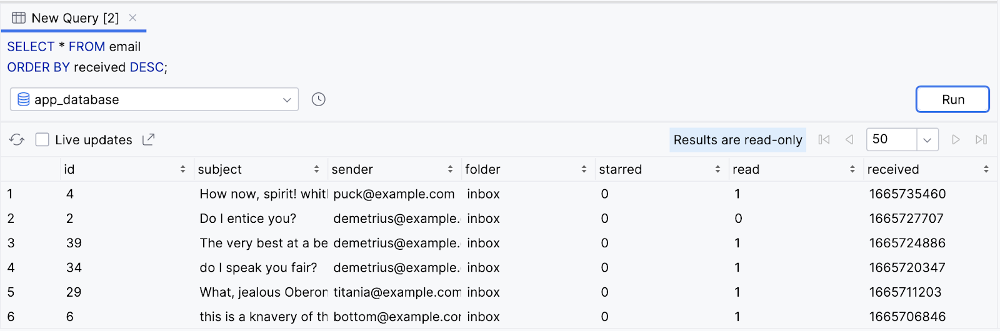

`ORDER BY` 句と `WHERE` 句は併用できます。たとえば、ユーザーが「*fool*」という単語を含む古いメールを検索するとします。この場合は検索結果を昇順に並べ替えて、最も古いメールを最初に表示させます。

1. 件名に「fool」というテキストが含まれるメールをすべて選択し、結果を昇順に並べ替えます。何も指定しない場合、順序はデフォルトの順序である昇順なので、`ORDER BY` 句で `ASC` キーワードを使用するかどうかは任意です。

```kotlin
SELECT * FROM email
WHERE subject LIKE '%fool%'
ORDER BY received ASC;
```

2. フィルタした結果、最も古いもの（received 列の最も低い値）が最初に表示されることを確認します。

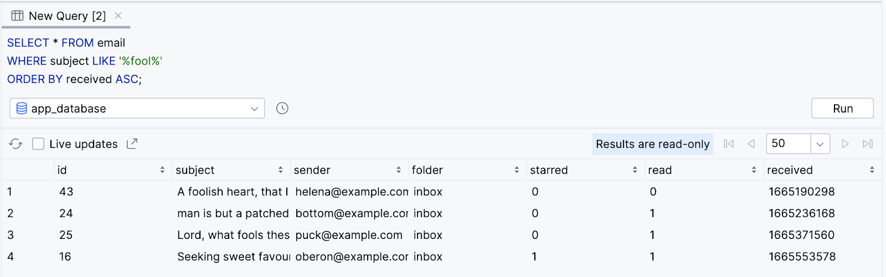

> **注:**両方を同じクエリで使用する場合は、`GROUP BY` 句を `ORDER BY` 句より前に配置します。

#### `LIMIT` で結果の件数を制限する

ここまで見てきたどの例でも、クエリに一致するあらゆる結果がデータベースから返されます。多くの場合、データベースから一部の行を表示するだけで済みます。クエリに `LIMIT` 句を追加すると、返す結果の件数を指定できます。`LIMIT` キーワードに続けて、返す行の最大数を追加します。該当する場合、`LIMIT` 句は `ORDER BY` 句より後に配置します。


必要に応じて、`OFFSET` キーワードとその後に別の数字を追加することで、「スキップ」する行数を指定できます。たとえば、最初の 10 件より後に続く 10 件の結果が必要であって、20 件の結果すべてを返すのではない場合は、`LIMIT 10 OFFSET 10` を使用します。


アプリでは、ユーザーの受信トレイにあるメールを最初の 10 件だけ返すことで、メールを素早く読み込むことができます。ユーザーはメールをスクロールして、後続のページを表示できます。次の手順では、`LIMIT` 句を使用してこの動作を実現します。

1. 次の `SELECT` ステートメントを実行して、ユーザーの受信トレイにあるすべてのメールを降順で取得し、結果を最初の 10 件に限定します。

```kotlin
SELECT * FROM email
WHERE folder = 'inbox'
ORDER BY received DESC
LIMIT 10;
```

2. 結果が 10 件だけ返されることを確認します。

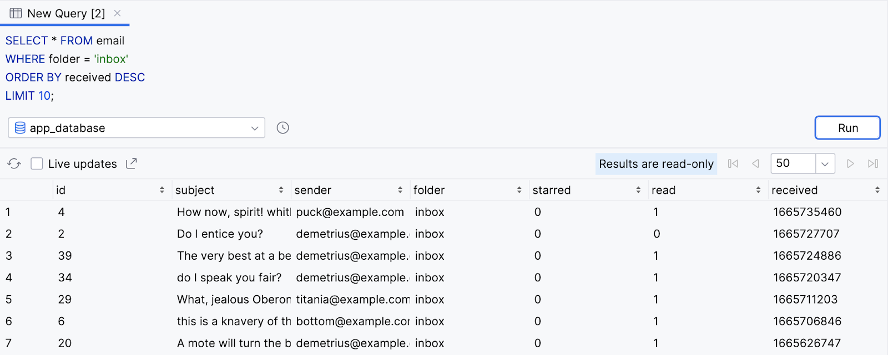

3. 値 `10` を指定して `OFFSET` キーワードを使用するようにクエリを変更し、再実行します。

```kotlin
SELECT * FROM email
WHERE folder = 'inbox'
ORDER BY received DESC
LIMIT 10 OFFSET 10;
```

4. このクエリでは、10 件の結果が降順で返されます。ただし、結果の最初の 10 件はスキップされます。

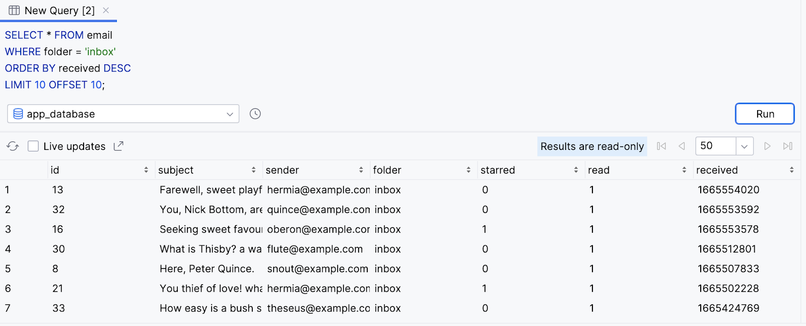

### 8. データベースのデータの挿入、更新、削除

#### データベースにデータを挿入する

データベースから読み取るだけでなく、データベースに書き込むためのさまざまな SQL ステートメントがあります。まずはデータを入力する方法が必要です。

`INSERT` ステートメントを使用すると、データベースに新しい行を追加できます。`INSERT` ステートメントは `INSERT INTO` で始め、その後に新しい行を挿入するテーブル名を続けます。改行して `VALUES` キーワードを使用し、その後にかっこで囲んで値のカンマ区切りのリストを続けます。値は、データベースの列と同じ順序で列挙する必要があります。


ユーザーが新しいメールを受信し、それをアプリのデータベースに保存する必要があるとします。`INSERT` ステートメントを使用すると、`email` テーブルに新しい行を追加できます。

1. 新しいメールについて、次のデータを使用して `INSERT` ステートメントを実行します。メールは新着であるため、未読であり、最初は受信トレイの `folder` に表示されます。`id` 列に対して `NULL` の値が指定されます。つまり、`id` は次に自動インクリメントされる整数を使用して自動的に生成されます。

```kotlin
INSERT INTO email
VALUES (
    NULL, 'Lorem ipsum dolor sit amet', 'sender@example.com', 'inbox', false, false, CURRENT_TIMESTAMP
);
```

> **注:**`CURRENT_TIMESTAMP` は、クエリの実行時に [UTC](https://en.wikipedia.org/wiki/Coordinated_Universal_Time) の現在時刻に置き換えられる特別な変数です。これは新しい行を挿入するときに便利です。

2. `44` という `id` で結果がデータベースに挿入されていることを確認します。

```kotlin
SELECT * FROM email
WHERE sender = 'sender@example.com';
```

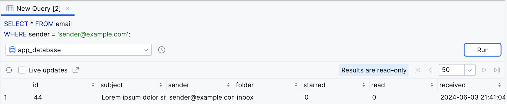

#### データベースの既存のデータを更新する

データは、テーブルに挿入した後でも変更できます。`UPDATE` ステートメントを使用して 1 つ以上の列の値を更新できます。`UPDATE` ステートメントは `UPDATE` キーワードで始めて、その後にテーブル名、`SET` 句と続けます。

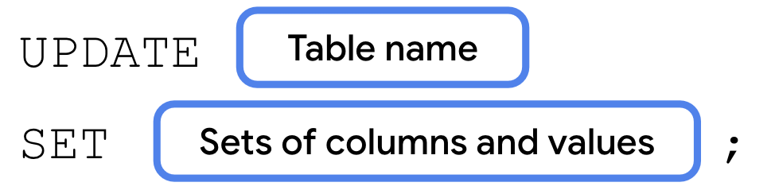

`SET` 句では、`SET` キーワードの後に、更新する列の名前を記述します。

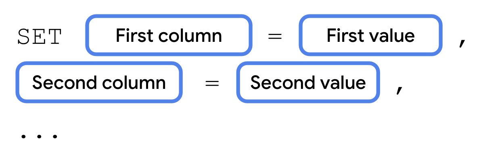

`UPDATE` ステートメントには、指定した列と値のペアで更新する単一または複数の行を指定するための `WHERE` 句が含まれていることがよくあります。

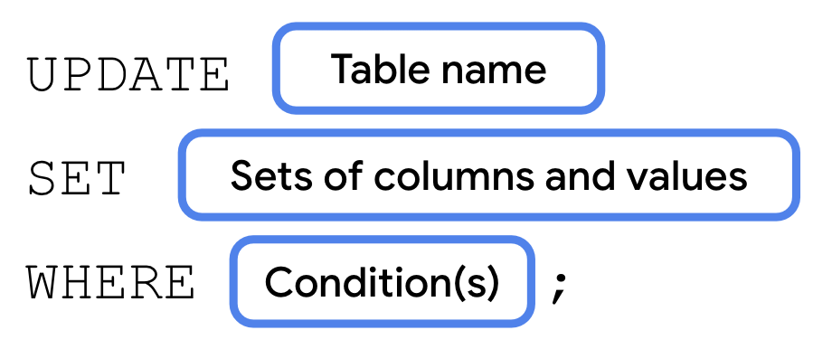

たとえば、ユーザーがメールを既読にする場合は、`UPDATE` ステートメントを使用してデータベースを更新します。次の手順では、前の手順で挿入したメールを既読としてマークします。

1. 次の `UPDATE` ステートメントを実行します。`read` 列の値が `true` になるように、`id` が `44` である列を設定します。

```kotlin
UPDATE email
SET read = true
WHERE id = 44;
```

2. 特定の行に対して `SELECT` ステートメントを実行して、結果を検証します。

```kotlin
SELECT read FROM email
WHERE id = 44;
```

3. 読み取り列の値が、false の `0` ではなく、true の値として `1` になったことを確認します。

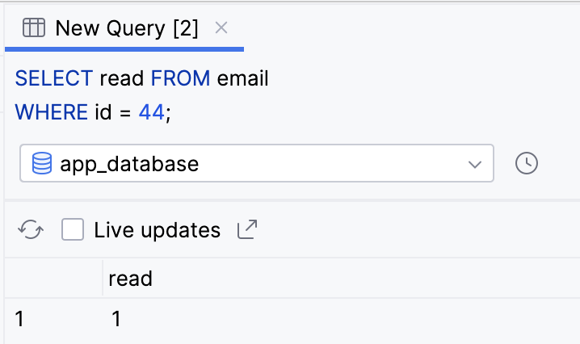

#### データベースの行を削除する

最後に、SQL の `DELETE` ステートメントを使用すると、テーブルから 1 つまたは複数の行を削除できます。`DELETE` ステートメントは `DELETE` キーワードで始めて、その後に `FROM` キーワード、テーブル名、削除する行を指定する `WHERE` 句と続けます。

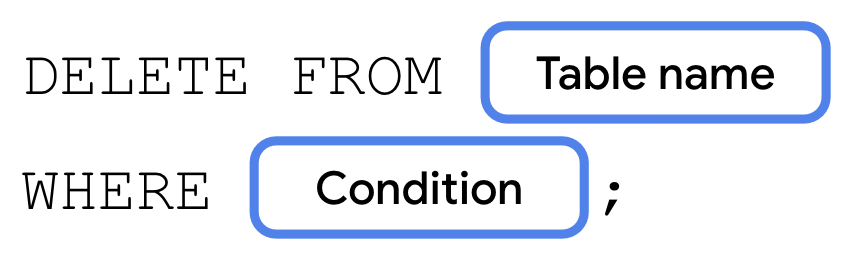

次の手順では、`DELETE` ステートメントを使用して、以前に挿入されてから更新された行をデータベースから削除します。

1. 次の `DELETE` ステートメントを実行します。`id` が `44` である行をデータベースから削除します。

```kotlin
DELETE FROM email
WHERE id = 44;
```

2. `SELECT` ステートメントを使用して変更を検証します。

```kotlin
SELECT * FROM email
WHERE id = 44;
```

3. `id` が `44` である行がなくなったことを確認します。

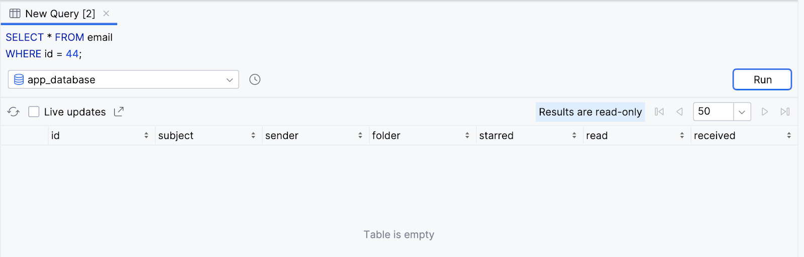

### 9. 概要

#### まとめ

お疲れさまでした。お疲れさまでした。`SELECT` ステートメントを使用してデータベースから読み取り、`WHERE`、`GROUP BY`、`ORDER BY`、`LIMIT` 句を使用して結果をフィルタできるようになりました。また、よく使用される集計関数、一意の結果を指定する `DISTINCT` キーワード、列の値に対してテキスト検索を行う `LIKE` キーワードについても学習しました。最後に、データテーブルの行に `INSERT`、`UPDATE`、`DELETE` を行う方法を学習しました。

こうしたスキルは Room に直接置き換えられます。SQL の知識があれば、今後開発するアプリでデータの永続化を十分に取り扱えます。

`SELECT` ステートメントの構文:

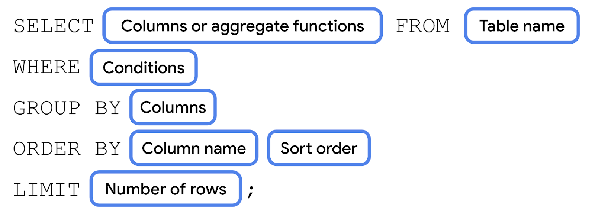

### 10. 詳細

#### 関連リンク

SQL の基礎と Android 開発における一般的なユースケースに重点を置いてきましたが、SQL でできることはまだたくさんあります。学習した内容の復習やトピックの詳細については、以下のリソースをご覧ください。

- [Database Inspector](https://developer.android.com/studio/inspect/database)
- [SQLite を使用してデータを保存する](https://developer.android.com/training/data-storage/sqlite)
- [集計関数](https://www.sqlite.org/lang_aggfunc.html)
- [SQL クイック リファレンス](https://www.w3schools.com/sql/sql_quickref.asp)
- [データテーブルの作成](https://www.w3schools.com/sql/sql_create_db.asp)
- [SQL の結合](https://www.w3schools.com/sql/sql_join.asp)
- [SQLite のパフォーマンス](https://developer.android.com/topic/performance/sqlite-performance-best-practices)

## 4. つまずきやすいポイント

- SQL は Android 以外（Web、業務システム）でも必ず使います。`WHERE` と `ORDER BY` は特に確実に。
- この章は Database Inspector 上で SQL を試すだけなので、提出物はありません。試した SQL をメモに残しておくと次章で役立ちます。

## 5. AIに質問する（この章の例）

次の例をそのままAIに投げてOKです（必要なら自分のコード/エラーに置き換えてください）。

```text
「`SELECT` `WHERE` `ORDER BY` の基本を、この章のサンプルテーブルを題材に例文つきで説明して」
「Database Inspector で SQL を実行する手順を教えて」
「この章の内容で SQL の練習問題を5問作って（解答は最後にまとめて）」
```

質問がまとまらないときは、第0章の「質問テンプレ」を使ってください。

## 6. チェックリスト

- [ ] リレーショナルデータベースのテーブル・行・列を説明できる
- [ ] `SELECT` / `INSERT` / `UPDATE` / `DELETE` の基本的な SQL を書ける
- [ ] Android Studio の Database Inspector で SQL を実行できる
- [ ] 章末のクイズに合格した

---

## 完了記録

この章には提出課題はありません。
学習が完了したら、進捗ダッシュボードで **完了日** を記録してください。
