# 第18章: WorkManager でタスクのスケジュールを設定する

> ユニット 7「WorkManager」 パスウェイ 1
> 提出ブランチ: `feature/07-workmanager`

## 1. この章のゴール

- WorkManager を使う場面（アプリを閉じても実行したい処理）を説明できる
- `Worker` を作り、`WorkRequest` で実行・連結・制約付きの実行ができる

## 2. 進め方

次の内容を **上から順番に** 進めます。「やらなくてOK」の行は飛ばして構いません。レッスンの本文はこのページの下にすべて掲載しています。目安時間の合計は約280分です。

| # | 種類 | 内容 | 目安 | 備考 |
|---|---|---|---|---|
| 1 | レッスン | WorkManager によるバックグラウンド処理 | 約120分 |  |
| 2 | レッスン | 高度な WorkManager とテスト | — | **やらなくてOK**（学習効果に対して難易度・工数が高い） |
| 3 | レッスン | 演習: Water Me アプリを作成する | 約150分 | **提出対象** |
| 4 | クイズ | [テスト: WorkManager](https://developer.android.com/courses/quizzes/android-basics-compose-unit-7-pathway-1/android-basics-compose-unit-7-pathway-1?hl=ja) | 約10分 | 公式サイトで受ける |

このプログラムの進め方は次の通りです。

1. 下の各レッスンを読み、各ステップの説明を理解してから **自分でコードを打つ**（コピペで済ませない）
2. ステップごとにアプリを実行し、期待どおり動くか確認する
3. 動かないときは、エラー文をそのまま AI に貼って「何が原因か」を聞き、直したら **なぜ直ったか** をメモする
4. 末尾のクイズを受けて、間違えた項目をレッスンで読み直す

> レッスン本文は Google Developers の公式コンテンツ（CC BY 4.0）を日本語のまま転載しています。画面が最新の Android Studio と異なる場合があります。

## 3. WorkManager によるバックグラウンド処理


### 1. 始める前に

このレッスンでは、遅延可能なバックグラウンド処理用のライブラリで、下位互換性、柔軟性、シンプルさを兼ね備えた [WorkManager](https://developer.android.com/arch/work) を取り上げます。`WorkManager` は、Android 上で遅延可能な処理を確実に実行するための推奨タスク スケジューラです。

#### 前提条件

- [StateFlow](https://developer.android.com/kotlin/flow/stateflow-and-sharedflow) と [ViewModel](https://developer.android.com/topic/libraries/architecture/viewmodel) に関する知識。これらのクラスを初めて使用する場合は、Compose での ViewModel と状態レッスン（特に ViewModel と状態関連）、または Room によるデータの読み取りと更新レッスン（特に Flow と StateFlow 関連）をご確認ください。
- リポジトリと依存関係注入に関する知識。確認するには、リポジトリと手動 DI を追加するをご覧ください。
- アプリにコルーチンを実装する能力

#### 学習内容

- プロジェクトに [WorkManager を追加する](https://developer.android.com/guide/background/persistent/getting-started)方法
- [簡単なタスクのスケジュール設定を行う](https://developer.android.com/topic/libraries/architecture/workmanager/how-to/define-work#schedule_one-time_work)方法
- [ワーカーの入出力パラメータ](https://developer.android.com/topic/libraries/architecture/workmanager/how-to/define-work#input_output)を設定する方法
- [ワーカー チェーンを作成](https://developer.android.com/topic/libraries/architecture/workmanager/how-to/chain-work)する方法

#### 演習内容

- スターター アプリを変更して、WorkManager を使用するようにします。
- 画像にぼかしを入れる処理リクエストを実装します。
- 処理チェーンを作成して連続した処理グループを実装します。
- スケジュール設定する処理との間でデータの受け渡しをします。

#### 必要なもの

- Android Studio の最新の安定版
- インターネット接続

### 2. アプリの概要

最近のスマートフォンは、写真撮影の性能が良すぎるくらいです。神秘的な被写体を撮影すると確実にぼけるという時代は終わりました。

このレッスンでは、写真にぼかしを入れて結果をファイルに保存するアプリ、Blur-O-Matic を作成します。[ネッシーのような怪物か、おもちゃの潜水艦か](https://en.wikipedia.org/wiki/Loch_Ness_Monster#%22Surgeon's_photograph%22_(1934))、Blur-O-Matic を使えば、誰にもわからなくります。

| 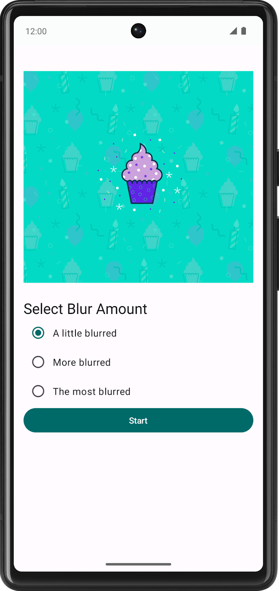 | 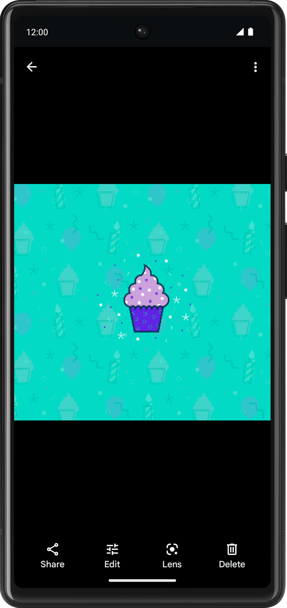 |
|---|---|

この画面では、ラジオボタンで画像をどの程度ぼかすかを選択できます。[**Start**] ボタンをクリックすると、画像がぼかし加工されて保存されます。

現時点では、ぼかし加工はされず、最終的な画像も保存されません。

このレッスンでは、アプリに WorkManager を追加し、画像のぼかし加工で作成された一時ファイルをクリーンアップするワーカー、画像をぼかし加工するワーカー、最終的な画像を保存して [**See File**] ボタンをクリックすると表示できるワーカーを作成します。また、バックグラウンド処理のステータスを監視し、それに応じてアプリの UI を更新する方法も学習します。

### 3. Blur-O-Matic スターター アプリを確認する

#### スターター コードを取得する

まず、スターター コードをダウンロードします。

または、GitHub リポジトリのクローンを作成してコードを入手することもできます。

```
$ git clone https://github.com/google-developer-training/basic-android-kotlin-compose-training-workmanager.git
$ cd basic-android-kotlin-compose-training-workmanager
$ git checkout starter
```

> **注:**スターター コードは、クローンを作成したリポジトリの `starter` ブランチにあります。

Blur-o-matic アプリのコードは、こちらの [GitHub](https://github.com/google-developer-training/basic-android-kotlin-compose-training-workmanager/tree/starter) リポジトリで確認できます。

#### スターター コードを実行する

次の手順でスターター コードを確認し、よく理解してください。

1. Android Studio でスターター コードのプロジェクトを開きます。
2. Android デバイスまたはエミュレータでアプリを実行します。


画面には、画像のぼかし加工の程度を選択できるラジオボタンがあります。[**Start**] ボタンをクリックすると、画像がぼかし加工されて保存されます。

この時点では、[**Start**] ボタンをクリックしても、ぼかし加工の程度は適用されません。

#### スターター コードのチュートリアル

ここでは、プロジェクトの構造を把握します。プロジェクトに含まれる重要なファイルとフォルダの説明を以下に示します。

- `WorkerUtils`: コンビニエンス メソッドです。後で `Notifications` を表示し、ビットマップをファイルに保存するコードを作成するために使用します。
- `BlurViewModel`: このビューモデルは、アプリの状態を保存し、リポジトリとやり取りします。
- `WorkManagerBluromaticRepository`: WorkManager でバックグラウンド処理を開始するクラスです。
- `Constants`: レッスンで使用する定数が含まれる静的クラスです。
- `BluromaticScreen`: UI 用のコンポーズ可能な関数が含まれ、`BlurViewModel` とやり取りします。これらのコンポーズ可能な関数は、画像を表示し、希望のぼかしレベルを選択するためのラジオボタンを含んでいます。

### 4. WorkManager とは

WorkManager は [Android Jetpack](http://d.android.com/jetpack) の一部であり、待機的実行と確実な実行というニーズの組み合わせをもつバックグラウンド処理のための[アーキテクチャ コンポーネント](http://d.android.com/arch)です。待機的実行とは、WorkManager がバックグラウンド処理を可能になり次第実行することを指します。確実な実行とは、たとえばアプリを終了した場合など、さまざまな状況下で WorkManager がその処理の開始ロジックを保持して実行することを指します。

WorkManager は特に柔軟性に優れたライブラリで、他にも多くのメリットがあります。メリットには次のようなものがあります。

- 非同期の 1 回限りのタスクと定期的なタスクの両方をサポート
- ネットワーク状態、保存容量、充電ステータスなどの制約をサポート
- 処理の並列実行など、複雑な処理リクエストのチェーンを作成可能
- 処理リクエストの出力を、後続の処理リクエストの入力として使用可能
- API レベル 14 までの後方互換性（注を参照）
- Google Play 開発者サービスの有無を問わず動作
- システムの健全性に関するベスト プラクティスに準拠
- アプリの UI に処理リクエストの状態を簡単に表示するためのサポート

> **注:** WorkManager は、[`JobScheduler`](https://developer.android.com/reference/android/app/job/JobScheduler.html) や [`AlarmManager`](https://developer.android.com/reference/android/app/AlarmManager) など、いくつかの API を基盤としています。どの API が使用されるかは、ユーザーのデバイスの API レベルなどによって決まります。詳しくは、[WorkManager でタスクのスケジュールを設定する](https://developer.android.com/topic/libraries/architecture/workmanager/)と [WorkManager のドキュメント](https://developer.android.com/reference/androidx/work/WorkManager)をご覧ください。

### 5. WorkManager の用途

WorkManager ライブラリの使用が適しているのは、完了することが求められるタスクです。これらのタスクの実行にあたっては、処理をキューに追加した後でアプリの実行を継続させる必要はありません。タスクは、アプリが閉じられても、ユーザーがホーム画面に戻っても実行されます。

WorkManager の使用が適したタスクの例を以下に示します。

- 最新ニュース記事の定期的な照会
- 画像に対するフィルタの適用と保存
- ローカルデータとネットワークとの定期的な同期

WorkManager は、メインスレッドを離れてタスクを実行する方法の一つですが、あらゆる種類のメインスレッド外のタスクに対応できるわけではありません。別の方法として、以前のレッスンで説明した[コルーチン](https://developer.android.com/kotlin/coroutines)もあります。

WorkManager の用途について詳しくは、[バックグラウンド処理ガイド](https://d.android.com/guide/background/)をご覧ください。

### 6. アプリに WorkManager を追加する

`WorkManager` には、次の Gradle 依存関係が必要です。これは以下のように、ビルドファイルに**すでに含まれています**。

**app/build.gradle.kts**

```kotlin
dependencies {
    // WorkManager dependency
    implementation("androidx.work:work-runtime-ktx:2.8.1")
}
```

`work-runtime-ktx` は必ず最新の[安定版](https://developer.android.com/jetpack/androidx/releases/work)を使用してください。

バージョンを変更した場合は、必ず [**Sync Now**] をクリックして、更新した Gradle ファイルとプロジェクトを同期してください。

### 7. WorkManager の基礎

把握しておくべき WorkManager クラスとして、以下のものがあります。

- [**`Worker`**](https://developer.android.com/reference/androidx/work/Worker) / [**`CoroutineWorker`**](https://developer.android.com/reference/androidx/work/CoroutineWorker): Worker はバックグラウンド スレッドで同期的に処理を実行するクラスです。非同期処理を行いたい場合は、Kotlin コルーチンと相互運用性がある CoroutineWorker を使用できます。このアプリでは、CoroutineWorker クラスから拡張し、[`doWork()`](https://developer.android.com/reference/androidx/work/CoroutineWorker#doWork()) メソッドをオーバーライドします。このメソッドに、バックグラウンドで実行する処理のコードを記述します。
- [**`WorkRequest`**](https://developer.android.com/reference/androidx/work/WorkRequest.html): このクラスは処理実行のリクエストを表します。`WorkRequest` では、ワーカーを 1 回実行する必要があるか定期的に実行する必要があるかを定義します。また、処理を実行する際に `WorkRequest` で特定の条件を満たしている必要がある場合には [Constraints](https://developer.android.com/reference/androidx/work/Constraints.html) を設定します。たとえば、リクエストされた作業を開始するにはデバイスが充電中でなければならない、などです。`WorkRequest` の作成の一環として `CoroutineWorker` を渡します。
- [**`WorkManager`**](https://developer.android.com/reference/androidx/work/WorkManager.html): このクラスが実際に `WorkRequest` をスケジュールして実行します。指定された制約を尊重しながら、負荷がシステム リソースに分散されるよう `WorkRequest` をスケジュールします。

今回は、画像をぼかし加工するコードを含んだ `BlurWorker` クラスを新たに定義します。[**Start**] ボタンをクリックすると、WorkManager が `WorkRequest` オブジェクトを作成してキューに追加します。

### 8. BlurWorker を作成する

このステップでは、`res/drawable` フォルダにある `android_cupcake.png` という画像に対して、いくつかの関数をバックグラウンドで実行します。これらの関数は画像にぼかしを入れます。

1. Android のプロジェクト ペインでパッケージ `com.example.bluromatic.workers` を右クリックし、**[New] -> [Kotlin Class/File]** を選択します。
2. 作成された Kotlin クラスに `BlurWorker` という名前を付けます。これを必須のコンストラクタ パラメータを使用して `CoroutineWorker` から拡張します。

**workers/BlurWorker.kt**

```kotlin
import androidx.work.CoroutineWorker
import androidx.work.WorkerParameters
import android.content.Context

class BlurWorker(ctx: Context, params: WorkerParameters) : CoroutineWorker(ctx, params) {
}
```

`BlurWorker` クラスは、[`Worker`](https://developer.android.com/reference/androidx/work/Worker) クラスではなく、より具体的な [`CoroutineWorker`](https://developer.android.com/reference/androidx/work/CoroutineWorker) クラスを拡張しています。`CoroutineWorker` クラスでの `doWork()` の実装は一時停止する関数であり、`Worker` では不可能な非同期コードを実行できます。[WorkManager でのスレッド化](https://developer.android.com/guide/background/persistent/threading)に関するガイドで詳しく説明されているように「CoroutineWorker は、Kotlin ユーザーにおすすめの実装」です。

この時点では、Android Studio で `class BlurWorker` の下にエラーを示す赤色の波線が表示されます。

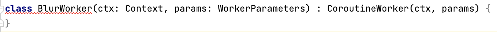

「`class BlurWorker`」というテキストにカーソルを合わせると、エラーに関する追加情報がポップアップで表示されます。

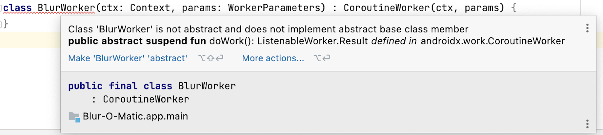

エラー メッセージは、必要とされる `doWork()` メソッドのオーバーライドを行っていないことを示しています。

`doWork()` メソッドの中で、表示されているカップケーキの画像にぼかしを入れるコードを記述します。

以下の手順でエラーを修正し、`doWork()` メソッドを実装します。

1. 「BlurWorker」というテキストをクリックして、カーソルをクラスコード内に置きます。
2. Android Studio のメニューで **[Code] > [Override Methods...]** を選択します。
3. [**Override Members**] ポップアップで、`doWork()` を選択します。
4. [**OK**] をクリックします。

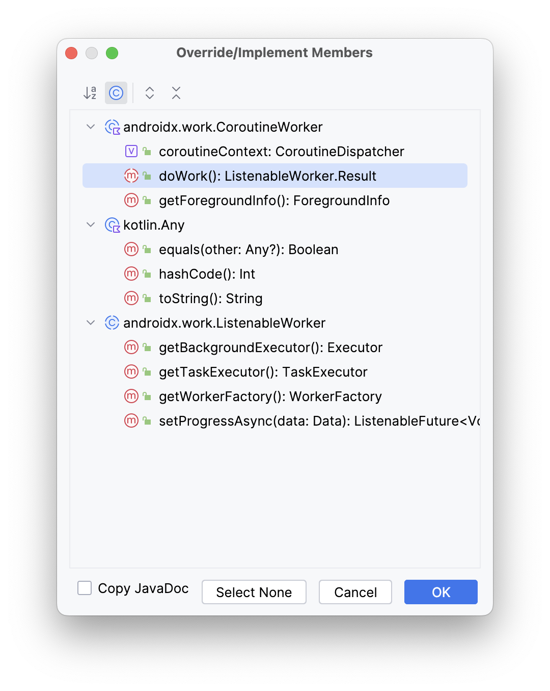

5. クラス宣言の直前で、`TAG` という名前の変数を作成し、値 `BlurWorker` を代入します。この変数は、`doWork()` メソッドとは特に関係ありませんが、後で `Log()` の呼び出しで使用します。

**workers/BlurWorker.kt**

```kotlin
private const val TAG = "BlurWorker"

class BlurWorker(ctx: Context, params: WorkerParameters) : CoroutineWorker(ctx, params) {
... 
```

6. 処理の実行タイミングを把握しやすくするには、`WorkerUtil` の `makeStatusNotification()` 関数を使用する必要があります。この関数を使用することで、通知バナーを画面上部に簡単に表示できます。

`doWork()` メソッド内で、`makeStatusNotification()` 関数を使用してステータス通知を表示し、ぼかし加工ワーカーが起動して画像にぼかしを入れていることをユーザーに通知します。

**workers/BlurWorker.kt**

```kotlin
import com.example.bluromatic.R
...
override suspend fun doWork(): Result {

    makeStatusNotification(
        applicationContext.resources.getString(R.string.blurring_image),
        applicationContext
    )
...
```

7. `return try...catch` コードブロックを追加します。ここで実際のぼかし加工の処理が行われます。

**workers/BlurWorker.kt**

```kotlin
...
        makeStatusNotification(
            applicationContext.resources.getString(R.string.blurring_image),
            applicationContext
        )

        return try {
        } catch (throwable: Throwable) {
        }
...
```

8. `try` ブロックに `Result.success()` の呼び出しを追加します。
9. `catch` ブロックに `Result.failure()` の呼び出しを追加します。

> **注:** WorkManager は、実行される処理リクエストの最終ステータスを示すために `Result.success()` と `Result.failure()` を使用します。

**workers/BlurWorker.kt**

```kotlin
...
        makeStatusNotification(
            applicationContext.resources.getString(R.string.blurring_image),
            applicationContext
        )

        return try {
            Result.success()
        } catch (throwable: Throwable) {
            Result.failure()
        }
...
```

10. `try` ブロックで、`picture` という名前の変数を作成し、[`BitmapFactory.decodeResource`](https://developer.android.com/reference/android/graphics/BitmapFactory#decodeResource(android.content.res.Resources,%20int))`()` メソッドを呼び出して、返されるビットマップを代入します。呼び出しの際には、アプリのリソース パッケージと、カップケーキ画像のリソース ID を渡します。

**workers/BlurWorker.kt**

```kotlin
...
        return try {
            val picture = BitmapFactory.decodeResource(
                applicationContext.resources,
                R.drawable.android_cupcake
            )

            Result.success()
...
```

11. `blurBitmap()` 関数を呼び出し、`picture` 変数と、`blurLevel` パラメータとして `1` の値を渡して、ビットマップにぼかしを入れます。
12. その結果を `output` という名前の新しい変数に保存します。

> **注:** この後の手順では、`blurLevel` パラメータとして変数を渡します。

**workers/BlurWorker.kt**

```kotlin
...
            val picture = BitmapFactory.decodeResource(
                applicationContext.resources,
                R.drawable.android_cupcake
            )

            val output = blurBitmap(picture, 1)

            Result.success()
...
```

13. 新たに変数 `outputUri` を作成し、`writeBitmapToFile()` 関数の呼び出し結果を代入します。
14. `writeBitmapToFile()` の呼び出しでは、引数としてアプリのコンテキストと `output` 変数を渡します。

**workers/BlurWorker.kt**

```kotlin
...
            val output = blurBitmap(picture, 1)

            // Write bitmap to a temp file
            val outputUri = writeBitmapToFile(applicationContext, output)

            Result.success()
...
```

15. `outputUri` 変数を含んだ通知メッセージをユーザーに表示するコードを追加します。

**workers/BlurWorker.kt**

```kotlin
...
            val outputUri = writeBitmapToFile(applicationContext, output)

            makeStatusNotification(
                "Output is $outputUri",
                applicationContext
            )

            Result.success()
...
```

16. `catch` ブロックで、画像のぼかし処理中にエラーが発生したことを示すエラー メッセージをログに記録します。`Log.e()` の呼び出しには、前に定義した `TAG` 変数、適切なメッセージ、スローされた例外を渡します。

**workers/BlurWorker.kt**

```kotlin
...
        } catch (throwable: Throwable) {
            Log.e(
                TAG,
                applicationContext.resources.getString(R.string.error_applying_blur),
                throwable
            )
            Result.failure()
        }
...
```

`CoroutineWorker,` は、デフォルトでは `Dispatchers.Default` として実行されますが、`withContext()` を呼び出して希望のディスパッチャを渡すことで変更できます。

17. `withContext()` ブロックを作成します。
18. `withContext()` の呼び出しの中で `Dispatchers.IO` を渡し、ブロックされる可能性がある IO 操作のための特別なスレッドプールでラムダ関数が実行されるようにします。
19. 以前に記述した `return try...catch` コードをこのブロックに移動します。

```kotlin
...
        return withContext(Dispatchers.IO) {

            return try {
                // ...
            } catch (throwable: Throwable) {
                // ...
            }
        }
...
```

ラムダ関数内から `return` を呼び出すことはできないため、Android Studio に次のエラーが表示されます。

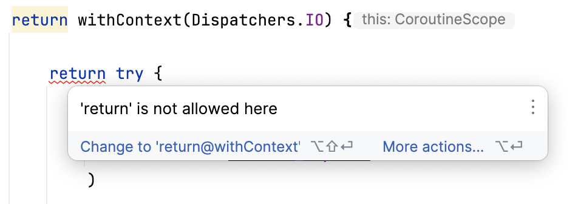

このエラーは、ポップアップに示されているように、ラベルを追加することで解決できます。

```kotlin
...
            //return try {
            return@withContext try {
...
```

この Worker は非常に短時間で実行されるため、コードに遅延を追加して低速な処理をエミュレートすることをおすすめします。

20. `withContext()` のラムダ内に、`delay()` ユーティリティ関数の呼び出しを追加して定数 `DELAY_TIME_MILLIS` を渡します。この呼び出しは、このレッスン用に遅延を通知メッセージ間に入れるためのものです。

```kotlin
import com.example.bluromatic.DELAY_TIME_MILLIS
import kotlinx.coroutines.delay

...
        return withContext(Dispatchers.IO) {

            // This is an utility function added to emulate slower work.
            delay(DELAY_TIME_MILLIS)

                val picture = BitmapFactory.decodeResource(
...
```

### 9. WorkManagerBluromaticRepository を更新する

リポジトリは、WorkManager とのすべてのやり取りを扱います。この構造は、[関心の分離という設計原則](https://en.wikipedia.org/wiki/Separation_of_concerns)を守るもので、Android アーキテクチャ パターンとして推奨されています。

- `data/WorkManagerBluromaticRepository.kt` ファイルの `WorkManagerBluromaticRepository` クラス内で、`workManager` という名前のプライベート変数を作成し、そこに `WorkManager.getInstance(context)` を呼び出して得た `WorkManager` インスタンスを格納します。

**data/WorkManagerBluromaticRepository.kt**

```kotlin
import androidx.work.WorkManager
...
class WorkManagerBluromaticRepository(context: Context) : BluromaticRepository {

    // New code
    private val workManager = WorkManager.getInstance(context)
...
```

#### WorkManager で WorkRequest を作成してキューに追加する

それでは、`WorkRequest` を作成して WorkManager に実行させましょう。`WorkRequest` には次の 2 種類があります。

- `OneTimeWorkRequest`: 1 回だけ実行される `WorkRequest`
- `PeriodicWorkRequest`: 定期的に繰り返し実行される `WorkRequest`

[**Start**] ボタンが選択されたときに画像にぼかしを入れるのは 1 回だけです。

この処理は、[**Start**] ボタンをクリックしたときに呼び出す `applyBlur()` メソッドで行います。

以下のステップは `applyBlur()` メソッド内で完了します。

1. ぼかし処理ワーカー用の `OneTimeWorkRequest` を作成し、[WorkManager KTX](https://developer.android.com/kotlin/ktx#workmanager) から `OneTimeWorkRequestBuilder` 拡張関数を呼び出して、`blurBuilder` という名前の新しい変数に代入します。

**data/WorkManagerBluromaticRepository.kt**

```kotlin
import com.example.bluromatic.workers.BlurWorker
import androidx.work.OneTimeWorkRequestBuilder
...
override fun applyBlur(blurLevel: Int) {
    // Create WorkRequest to blur the image
    val blurBuilder = OneTimeWorkRequestBuilder<BlurWorker>()
}
```

2. `workManager` オブジェクトの `enqueue()` メソッドを呼び出して処理を開始します。

**data/WorkManagerBluromaticRepository.kt**

```kotlin
import com.example.bluromatic.workers.BlurWorker
import androidx.work.OneTimeWorkRequestBuilder
...
override fun applyBlur(blurLevel: Int) {
    // Create WorkRequest to blur the image
    val blurBuilder = OneTimeWorkRequestBuilder<BlurWorker>()

    // Start the work
    workManager.enqueue(blurBuilder.build())
}
```

3. アプリを実行し、[**Start**] ボタンをクリックすると通知が表示されます。

この時点では、どの選択肢を選んでも画像に適用されるぼかしの程度は同じです。以降のステップでは、選んだ選択肢に応じてぼかしの程度が変化します。

> **注:** アプリで通知を有効にする必要があります。通知が表示されない場合は、**[設定] > [アプリ] > [Blur-O-Matic] > [通知]** に移動し、**Blur-O-Matic のすべての通知**を有効にします。

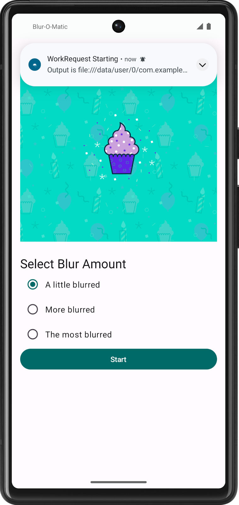

画像が正常にぼかし加工されたことを確認するには、Android Studio で [[**Device Explorer**](https://developer.android.com/studio/debug/device-file-explorer)] を開きます。

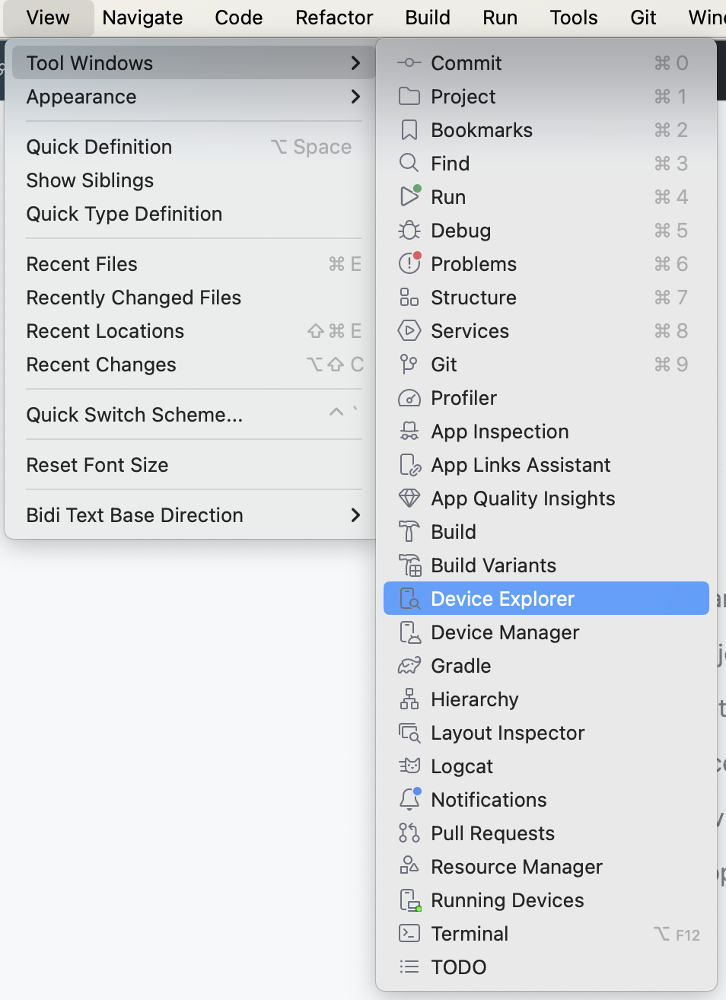

次に、**[data] > [data] > [com.example.bluromatic] > [files] > [blur_filter_outputs] > <URI>** に移動して、実際にカップケーキの画像にぼかしが入っていることを確認します。

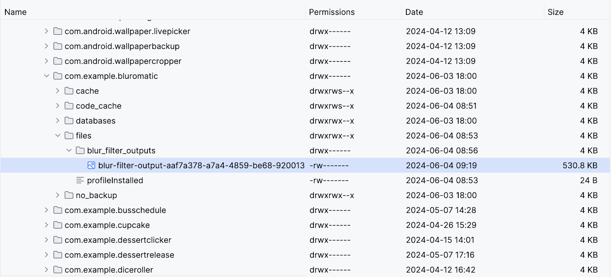

### 10. 入力データと出力データ

リソース ディレクトリ内の画像アセットにぼかしを入れることはできましたが、Blur-O-Matic が革新的な画像編集アプリになるよう、画面に表示されている画像にぼかしを入れて結果を表示できるようにする必要があります。

そのために、`WorkRequest` への入力として表示されるカップケーキ画像の URI を指定し、`WorkRequest` の出力を使用して、ぼかしを入れた最終的な画像を表示します。

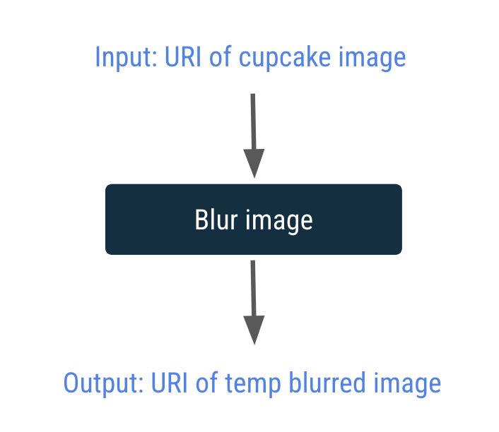

入力と出力は、[`Data`](http://d.android.com/reference/androidx/work/Data) オブジェクトを介してワーカーの間で受け渡しされます。`Data` オブジェクトは、Key-Value ペアの軽量コンテナです。ワーカーと `WorkRequest` との間でやり取りされる少量のデータを格納することを目的としています。

次のステップでは、入力データ オブジェクトを作成して URI を `BlurWorker` に渡します。

#### 入力データ オブジェクトを作成する

1. `data/WorkManagerBluromaticRepository.kt` ファイルの `WorkManagerBluromaticRepository` クラス内で、`imageUri` というプライベート変数を作成します。
2. コンテキスト メソッド `getImageUri()` を呼び出して、この変数に画像 URI を代入します。

**data/WorkManagerBluromaticRepository.kt**

```kotlin
import com.example.bluromatic.getImageUri
...
class WorkManagerBluromaticRepository(context: Context) : BluromaticRepository {

    private var imageUri: Uri = context.getImageUri() // <- Add this
    private val workManager = WorkManager.getInstance(context)
...
```

アプリコードには、入力データ オブジェクトを作成するための `createInputDataForWorkRequest()` ヘルパー関数が用意されています。

**data/WorkManagerBluromaticRepository.kt**

```kotlin
// For reference - already exists in the app
private fun createInputDataForWorkRequest(blurLevel: Int, imageUri: Uri): Data {
    val builder = Data.Builder()
    builder.putString(KEY_IMAGE_URI, imageUri.toString()).putInt(BLUR_LEVEL, blurLevel)
    return builder.build()
}
```

まず、このヘルパー関数が [`Data.Builder`](https://developer.android.com/reference/kotlin/androidx/work/Data.Builder) オブジェクトを作成します。そこに `imageUri` と `blurLevel` が Key-Value ペアとして設定されます。その後、`return builder.build()` を呼び出したときに Data オブジェクトが作成されて返されます。

3. WorkRequest の入力データ オブジェクトを設定するために、`blurBuilder.setInputData()` メソッドを呼び出します。引数で `createInputDataForWorkRequest()` ヘルパー関数を呼び出すと、1 ステップでデータ オブジェクトを作成して渡すことができます。`createInputDataForWorkRequest()` 関数の呼び出しでは、`blurLevel` 変数と `imageUri` 変数を渡します。

**data/WorkManagerBluromaticRepository.kt**

```kotlin
override fun applyBlur(blurLevel: Int) {
     // Create WorkRequest to blur the image
    val blurBuilder = OneTimeWorkRequestBuilder<BlurWorker>()

    // New code for input data object
    blurBuilder.setInputData(createInputDataForWorkRequest(blurLevel, imageUri))

    workManager.enqueue(blurBuilder.build())
}
```

#### 入力データ オブジェクトにアクセスする

次に、`BlurWorker` クラスの `doWork()` メソッドを更新して、入力データ オブジェクトを使って渡された URI とぼかしレベルを取得しましょう。`blurLevel` に値が指定されていない場合は、デフォルトで `1` が使用されます。

`doWork()` メソッド内で次の処理を行います。

1. `resourceUri` という名前の変数を作成し、`inputData.getString()` を呼び出し、入力データ オブジェクトの作成時にキーとして使用されていた定数 `KEY_IMAGE_URI` を渡して、返される値をこの変数に代入します。

`val resourceUri = inputData.getString(KEY_IMAGE_URI)`

2. `blurLevel` という名前の変数を作成します。`inputData.getInt()` を呼び出し、入力データ オブジェクトの作成時にキーとして使用されていた定数 `BLUR_LEVEL` を渡して、返される値をこの変数に代入します。この Key-Value ペアが作成されていない場合は、デフォルト値の `1` を指定します。

**workers/BlurWorker.kt**

```kotlin
import com.example.bluromatic.KEY_BLUR_LEVEL
import com.example.bluromatic.KEY_IMAGE_URI
...
override fun doWork(): Result {

    // ADD THESE LINES
    val resourceUri = inputData.getString(KEY_IMAGE_URI)
    val blurLevel = inputData.getInt(KEY_BLUR_LEVEL, 1)

    // ... rest of doWork()
}
```

URI を使用して、画面に表示されるカップケーキの画像にぼかしを入れましょう。

1. `resourceUri` 変数にデータが設定されていることを確認します。値が設定されていない場合は例外がスローされます。以下のコードでは、最初の引数の評価結果が false であった場合に `IllegalArgumentException` をスローする [`require()`](https://kotlinlang.org/api/latest/jvm/stdlib/kotlin/require.html#require) ステートメントを使用しています。

**workers/BlurWorker.kt**

```kotlin
return@withContext try {
    // NEW code
    require(!resourceUri.isNullOrBlank()) {
        val errorMessage =
            applicationContext.resources.getString(R.string.invalid_input_uri)
            Log.e(TAG, errorMessage)
            errorMessage
    }
```

画像のソースが URI として渡されるので、URI が指すコンテンツを読み取る [ContentResolver](https://developer.android.com/reference/kotlin/android/content/ContentResolver) オブジェクトが必要です。

2. `contentResolver` オブジェクトを `applicationContext` 値に追加します。

**workers/BlurWorker.kt**

```kotlin
...
    require(!resourceUri.isNullOrBlank()) {
        // ...
    }
    val resolver = applicationContext.contentResolver
...
```

3. 画像のソースが URI で渡されるようになったので、`BitmapFactory.decodeResource()` ではなく `BitmapFactory.decodeStream()` を使用してビットマップ オブジェクトを作成します。

**workers/BlurWorker.kt**

```kotlin
import android.net.Uri
...
//     val picture = BitmapFactory.decodeResource(
//         applicationContext.resources,
//         R.drawable.android_cupcake
//     )

    val resolver = applicationContext.contentResolver

    val picture = BitmapFactory.decodeStream(
        resolver.openInputStream(Uri.parse(resourceUri))
    )
```

4. `blurBitmap()` 関数の呼び出しで `blurLevel` 変数を渡します。

**workers/BlurWorker.kt**

```kotlin
//val output = blurBitmap(picture, 1)
val output = blurBitmap(picture, blurLevel)
```

#### 出力データ オブジェクトを作成する

この Worker に関する作業が完了し、`Result.success()` で出力 URI を出力データ オブジェクトとして返すことができるようになりました。出力 URI を出力データ オブジェクトとして指定することで、他のワーカーによる操作が容易になっています。この手法は、次のセクションでワーカー チェーンを作成する際に便利です。

その方法は次のとおりです。

1. `Result.success()` のコードの前で、`outputData` という名前の変数を作成します。
2. `workDataOf()` 関数を呼び出し、キーには定数 `KEY_IMAGE_URI` を、値には変数 `outputUri` を使用して、この変数に値を設定します。[`workDataOf()` 関数](https://developer.android.com/reference/kotlin/androidx/work/package-summary#workDataOf(kotlin.Array))は、渡された Key-Value ペアから Data オブジェクトを作成します。

**workers/BlurWorker.kt**

```kotlin
import androidx.work.workDataOf
// ...
val outputData = workDataOf(KEY_IMAGE_URI to outputUri.toString())
```

3. `Result.success()` のコードを更新して、この新しい Data オブジェクトを引数とします。

**workers/BlurWorker.kt**

```kotlin
//Result.success()
Result.success(outputData)
```

4. 出力データ オブジェクトが URI を使用するようになり、通知を表示するコードは不要となったため削除します。

**workers/BlurWorker.kt**

```kotlin
// REMOVE the following notification code
//makeStatusNotification(
//    "Output is $outputUri",
//    applicationContext
//)
```

#### アプリを実行する

この時点でアプリを実行すると、コンパイルは成功するはずです。ぼかしの入った画像が **Device Explorer** から確認できますが、画面にはまだ表示されません。

なお、画像を表示するには、[**Synchronize**] が必要な場合があります。

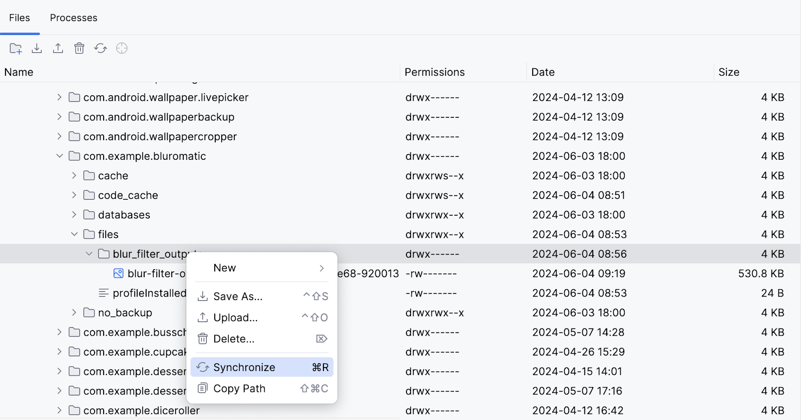

お疲れさまでした。`WorkManager` を使用して入力画像にぼかしを入れることができました。

### 11. 処理のチェーンを作成する

ここで行っているのは、画像にぼかしを入れるという課題だけです。最初のステップには最適ですが、アプリにはまだ重要な機能が欠けています。

- 一時ファイルがクリーンアップされません。
- 画像が永続ファイルに保存されません。
- 写真に常に同程度のぼかししか入れられません。

WorkManager の処理チェーンを使用すると、上記の機能を追加できます。WorkManager を使用すると、個別に作成した `WorkerRequest` を順次または並列に実行できます。

このセクションでは、下図のような処理チェーンを作成します。

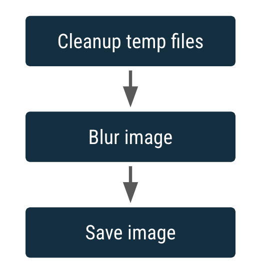

各箱は `WorkRequest` を表します。

チェーン化のもう 1 つの特長は、入力を受けて出力を生成する機能です。`WorkRequest` の出力がチェーン内で後続する `WorkRequest` の入力になります。

画像にぼかしを入れる `CoroutineWorker` はすでにありますが、一時ファイルをクリーンアップする `CoroutineWorker` と、画像を永続的に保存する `CoroutineWorker` も必要です。

#### CleanupWorker を作成する

`CleanupWorker` は、一時ファイルが存在する場合にそれを削除します。

1. Android のプロジェクト ペインでパッケージ `com.example.bluromatic.workers` を右クリックし、**[New] -> [Kotlin Class/File]** を選択します。
2. 作成された Kotlin クラスに `CleanupWorker` という名前を付けます。
3. 次のコード例のように、CleanupWorker.kt のコードをコピーします。

ファイル操作はこのレッスンの範囲外ですので、`CleanupWorker` に以下のコードをコピーして構いません。

**workers/CleanupWorker.kt**

```kotlin
package com.example.bluromatic.workers

import android.content.Context
import android.util.Log
import androidx.work.CoroutineWorker
import androidx.work.WorkerParameters
import com.example.bluromatic.DELAY_TIME_MILLIS
import com.example.bluromatic.OUTPUT_PATH
import com.example.bluromatic.R
import kotlinx.coroutines.Dispatchers
import kotlinx.coroutines.delay
import kotlinx.coroutines.withContext
import java.io.File

/**
 * Cleans up temporary files generated during blurring process
 */
private const val TAG = "CleanupWorker"

class CleanupWorker(ctx: Context, params: WorkerParameters) : CoroutineWorker(ctx, params) {

    override suspend fun doWork(): Result {
        /** Makes a notification when the work starts and slows down the work so that it's easier
         * to see each WorkRequest start, even on emulated devices
         */
        makeStatusNotification(
            applicationContext.resources.getString(R.string.cleaning_up_files),
            applicationContext
        )

        return withContext(Dispatchers.IO) {
            delay(DELAY_TIME_MILLIS)

            return@withContext try {
                val outputDirectory = File(applicationContext.filesDir, OUTPUT_PATH)
                if (outputDirectory.exists()) {
                    val entries = outputDirectory.listFiles()
                    if (entries != null) {
                        for (entry in entries) {
                            val name = entry.name
                            if (name.isNotEmpty() && name.endsWith(".png")) {
                                val deleted = entry.delete()
                                Log.i(TAG, "Deleted $name - $deleted")
                            }
                        }
                    }
                }
                Result.success()
            } catch (exception: Exception) {
                Log.e(
                    TAG,
                    applicationContext.resources.getString(R.string.error_cleaning_file),
                    exception
                )
                Result.failure()
            }
        }
    }
}
```

#### SaveImageToFileWorker を作成する

`SaveImageToFileWorker` クラスは、一時ファイルを永続ファイルに保存します。

`SaveImageToFileWorker` は、入力と出力を取ります。入力は、ぼかしを入れた一時画像の URI の `String` であり、キー `KEY_IMAGE_URI` を使用して格納されます。出力は、ぼかしを入れて保存された画像の URI の `String` であり、キー `KEY_IMAGE_URI` で保存されます。

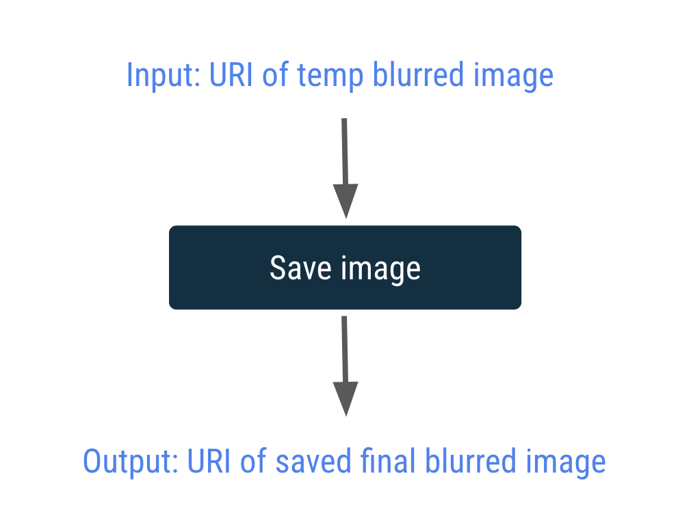

1. Android のプロジェクト ペインでパッケージ `com.example.bluromatic.workers` を右クリックし、**[New] -> [Kotlin Class/File]** を選択します。
2. 作成された Kotlin クラスに `SaveImageToFileWorker` という名前を付けます。
3. 次のサンプルコードのように、SaveImageToFileWorker.kt のコードをコピーします。

ファイル操作はこのレッスンの範囲外ですので、`SaveImageToFileWorker` に以下のコードをコピーして構いません。用意されているコードで、`resourceUri` と `output` の値をキー `KEY_IMAGE_URI` で取得、保存する方法を確認してください。この処理は、以前に入力データ オブジェクトと出力データ オブジェクト用に作成したコードとよく似ています。

**workers/SaveImageToFileWorker.kt**

```kotlin
package com.example.bluromatic.workers

import android.content.Context
import android.graphics.BitmapFactory
import android.net.Uri
import android.provider.MediaStore
import android.util.Log
import androidx.work.CoroutineWorker
import androidx.work.WorkerParameters
import androidx.work.workDataOf
import com.example.bluromatic.DELAY_TIME_MILLIS
import com.example.bluromatic.KEY_IMAGE_URI
import com.example.bluromatic.R
import kotlinx.coroutines.Dispatchers
import kotlinx.coroutines.delay
import kotlinx.coroutines.withContext
import java.text.SimpleDateFormat
import java.util.Locale
import java.util.Date

/**
 * Saves the image to a permanent file
 */
private const val TAG = "SaveImageToFileWorker"

class SaveImageToFileWorker(ctx: Context, params: WorkerParameters) : CoroutineWorker(ctx, params) {

    private val title = "Blurred Image"
    private val dateFormatter = SimpleDateFormat(
        "yyyy.MM.dd 'at' HH:mm:ss z",
        Locale.getDefault()
    )

    override suspend fun doWork(): Result {
        // Makes a notification when the work starts and slows down the work so that
        // it's easier to see each WorkRequest start, even on emulated devices
        makeStatusNotification(
            applicationContext.resources.getString(R.string.saving_image),
            applicationContext
        )

        return withContext(Dispatchers.IO) {
            delay(DELAY_TIME_MILLIS)

            val resolver = applicationContext.contentResolver
            return@withContext try {
                val resourceUri = inputData.getString(KEY_IMAGE_URI)
                val bitmap = BitmapFactory.decodeStream(
                    resolver.openInputStream(Uri.parse(resourceUri))
                )
                val imageUrl = MediaStore.Images.Media.insertImage(
                    resolver, bitmap, title, dateFormatter.format(Date())
                )
                if (!imageUrl.isNullOrEmpty()) {
                    val output = workDataOf(KEY_IMAGE_URI to imageUrl)

                    Result.success(output)
                } else {
                    Log.e(
                        TAG,
                        applicationContext.resources.getString(R.string.writing_to_mediaStore_failed)
                    )
                    Result.failure()
                }
            } catch (exception: Exception) {
                Log.e(
                    TAG,
                    applicationContext.resources.getString(R.string.error_saving_image),
                    exception
                )
                Result.failure()
            }
        }
    }
}
```

> **注:** `CleanupWorker` ワーカーと `SaveImageToFileWorker` ワーカー用に用意されているコードには、それぞれ `delay(DELAY_TIME_MILLIS)` というステートメントが含まれています。このコードはワーカーの実行を遅くします。このコードは演習用に追加したもので、**Background Task Inspector** で実行中のワーカーを簡単に確認できるようにするためと、通知メッセージ同士の時間間隔を空けるためのものです。通常、これを製品版のコードで使用することはありません。

#### 処理チェーンを作成する

今のところ、このコードは `WorkRequest` を 1 つだけ作成して実行します。

このステップでは、1 つのぼかし加工リクエストではなく WorkRequest のチェーンを作成して実行するようにコードを変更します。

WorkRequest のチェーンで最初に行う処理リクエストは、一時ファイルのクリーンアップです。

1. `OneTimeWorkRequestBuilder` の代わりに `workManager.beginWith()` を呼び出します。

`beginWith()` メソッドを呼び出すと、[`WorkContinuation`](https://developer.android.com/reference/androidx/work/WorkContinuation) オブジェクトが返され、チェーンの最初の処理リクエストを使って `WorkRequest` チェーンの始点が作成されます。

**data/WorkManagerBluromaticRepository.kt**

```kotlin
import androidx.work.OneTimeWorkRequest
import com.example.bluromatic.workers.CleanupWorker
// ...
    override fun applyBlur(blurLevel: Int) {
        // Add WorkRequest to Cleanup temporary images
        var continuation = workManager.beginWith(OneTimeWorkRequest.from(CleanupWorker::class.java))

        // Add WorkRequest to blur the image
        val blurBuilder = OneTimeWorkRequestBuilder<BlurWorker>()
...
```

> **注:** このコードでは、代替的な方法で `OneTimeWorkRequest` オブジェクトを作成しています。`OneTimeWorkRequest.from(CleanupWorker::class.java)` の呼び出しは、`OneTimeWorkRequestBuilder<CleanupWorker>().build()` の呼び出しと等価です。クラス `OneTimeWorkRequest` は [AndroidX](https://developer.android.com/jetpack/androidx) Work Library から提供されるクラスであり、`OneTimeWorkRequestBuilder` は [WorkManager KTX](https://developer.android.com/kotlin/ktx#workmanager) 拡張機能によって提供されるヘルパー関数です。

この処理リクエストのチェーンに追加するには、`then()` メソッドを呼び出し、`WorkRequest` オブジェクトを渡します。

2. 1 つの WorkRequest のみをキューに追加していた `workManager.enqueue(blurBuilder.build())` の呼び出しを削除します。
3. `.then()` メソッドを呼び出して、次の処理リクエストをチェーンに追加します。

**data/WorkManagerBluromaticRepository.kt**

```kotlin
...
//workManager.enqueue(blurBuilder.build())

// Add the blur work request to the chain
continuation = continuation.then(blurBuilder.build())
...
```

4. 画像を保存してチェーンに追加する処理リクエストを作成します。

**data/WorkManagerBluromaticRepository.kt**

```kotlin
import com.example.bluromatic.workers.SaveImageToFileWorker

...
continuation = continuation.then(blurBuilder.build())

// Add WorkRequest to save the image to the filesystem
val save = OneTimeWorkRequestBuilder<SaveImageToFileWorker>()
    .build()
continuation = continuation.then(save)
...
```

5. この処理を開始するには、継続オブジェクトの `enqueue()` メソッドを呼び出します。

**data/WorkManagerBluromaticRepository.kt**

```kotlin
...
continuation = continuation.then(save)

// Start the work
continuation.enqueue()
...
```

このコードは、`CleanupWorker` `WorkRequest` の次に `BlurWorker` `WorkRequest`、その次に `SaveImageToFileWorker` `WorkRequest` という WorkRequest のチェーンを生成して実行します。

6. アプリを実行します。

[**Start**] がクリックできるようになり、各ワーカーが実行されたときに通知が表示されるようになりました。ぼかしを入れた画像は引き続き **Device Explorer** で確認できますが、今後のセクションでは、ぼかしを入れた画像をデバイスで確認できるように別のボタンを追加します。

以下のスクリーンショットでは、現在実行されている Worker を示す通知メッセージが表示されています。

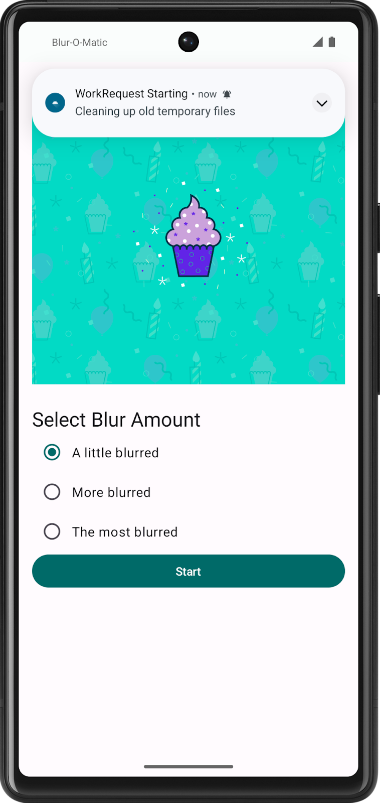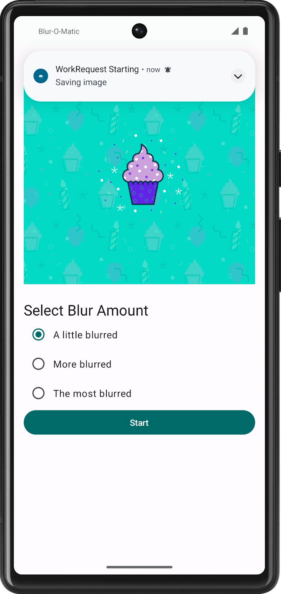

出力フォルダには、ぼかしが入った複数の画像（ぼかし加工の中間段階の画像と、選択したぼかし量で表示される最終画像）が残っています。

お疲れさまでした。これで、一時ファイルのクリーンアップ、画像のぼかし加工、保存ができるようになりました。

### 12. 解答コードを取得する

このレッスンの完成したコードをダウンロードするには、以下のコマンドを使用します。

```
$ git clone https://github.com/google-developer-training/basic-android-kotlin-compose-training-workmanager.git
$ cd basic-android-kotlin-compose-training-workmanager
$ git checkout intermediate
```

または、リポジトリを ZIP ファイルとしてダウンロードし、Android Studio で開くこともできます。

このレッスンの解答コードを確認する場合は、[GitHub](https://github.com/google-developer-training/basic-android-kotlin-compose-training-workmanager/tree/intermediate) で表示します。

### 13. まとめ

お疲れさまでした。Blur-O-Matic アプリが完成しました。このプロセスでは以下について学びました。

- プロジェクトへの WorkManager の追加
- `OneTimeWorkRequest` のスケジュール設定
- 入出力パラメータ
- 処理チェーンによる `WorkRequest` の連結

WorkManager は、このレッスンで取り上げたもの以外にも、繰り返し処理、テスト支援ライブラリ、並列処理リクエスト、入力マージツールなど、多くの機能をサポートしています。

詳しくは、[WorkManager でタスクのスケジュールを設定する](http://d.android.com/topic/libraries/architecture/workmanager/)をご覧ください。

## 4. 演習: Water Me アプリを作成する（提出対象）


### 1. 始める前に

#### はじめに

このユニットでは、遅延可能なバックグラウンド処理用の Jetpack ライブラリである WorkManager について学習しました。このバックグラウンド処理は、ソースアプリを閉じても必ず実行されます。

WorkManager について学習しながら、Worker クラスで処理を定義する方法、Worker の WorkRequest を作成する方法、処理をキューに登録してスケジュール設定する方法を学びました。

この演習セットでは、学習したコンセプトを活用して **Water Me!** アプリを拡張します。

解答コードは最後にあります。この学習体験を最大限に活用するため、記載された解答コードを確認する前に、できる限りご自身で実装とトラブルシューティングを行ってみてください。この実践時間中に、多くのことを学びましょう。

#### 前提条件

- [高度な WorkManager とテスト](https://developer.android.com/codelabs/basic-android-kotlin-compose-verify-background-work) レッスンの「Compose を用いた Android アプリ開発の基礎」コースワークを完了していること。

#### 必要なもの

- Android Studio がインストールされた、インターネットに接続できるパソコン。

#### 作成するアプリの概要

この演習セットでは、学習したコンセプトを活用して **Water Me!** アプリを拡張します。

アプリでは現在、スクロール リストに植物のリストが表示されます。植物をタップすると、水やりのリマインダーを設定できます。

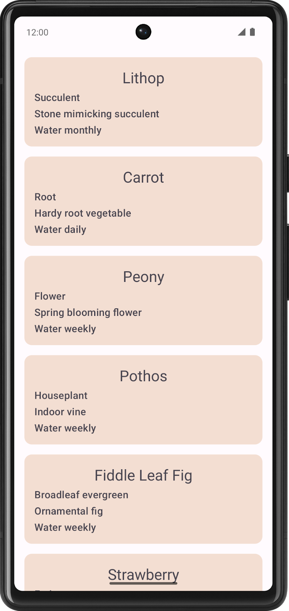 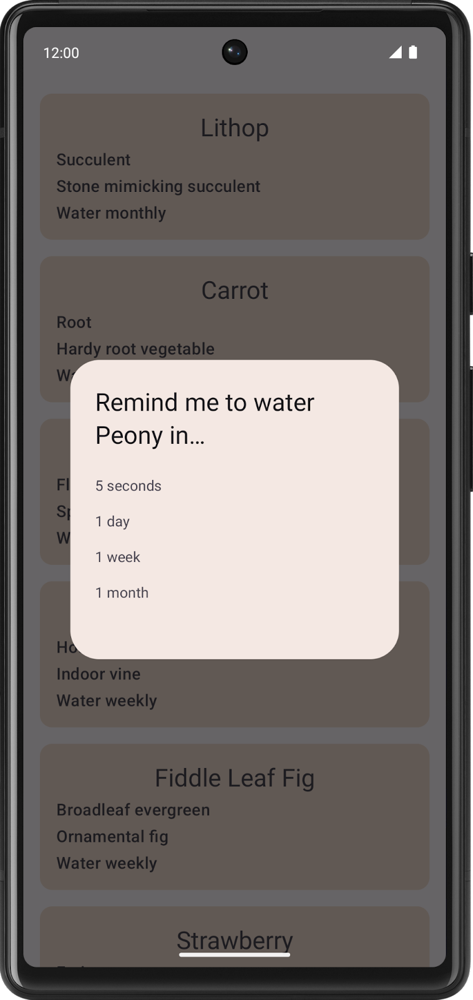

リマインダーの期間は選択できますが、リマインダー通知は表示されません。

この演習では、リマインダー通知を表示するバックグラウンド処理を実装します。

コードが完成すると、選択した時間の経過後にリマインダー通知が表示されるようになります。

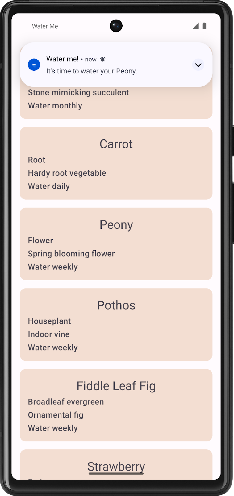

### 2. スターター コードを取得する

まず、スターター コードをダウンロードします。

または、GitHub リポジトリのクローンを作成してコードを入手することもできます。

```
$ git clone https://github.com/google-developer-training/basic-android-kotlin-compose-training-waterme.git
$ cd basic-android-kotlin-compose-training-waterme
$ git checkout starter
```

> **注:**スターター コードは、クローンを作成したリポジトリの `starter` ブランチにあります。

**Water Me!** アプリのコードは、こちらの [GitHub](https://github.com/google-developer-training/basic-android-kotlin-compose-training-waterme/tree/starter) リポジトリで確認できます。

#### スターター コードを実行する

次の手順でスターター コードを確認し、よく理解してください。

1. Android Studio でスターター コードのプロジェクトを開きます。
2. Android デバイスまたはエミュレータでアプリを実行します。

これで、コーディングを開始できます。

### 3. WorkManager を使用して通知をスケジュール設定する

**Water Me!** アプリの機能は、リマインダーの通知のスケジュール設定機能を除き、ほぼ実装済みです。

通知を行うコードは、**worker** パッケージ内の `WaterReminderWorker.kt` ファイルにあります。`WaterReminderWorker` クラスは `CoroutineWorker` クラスを拡張したもので、通知を行うためのコードはその `doWork()` メソッド内にあります。

通知を初めて扱うトピックであるため、このコードはすでに完成した状態で用意されています。

```kotlin
override suspend fun doWork(): Result {

    val plantName = inputData.getString(nameKey)

    makePlantReminderNotification(
        applicationContext.resources.getString(R.string.time_to_water, plantName),
        applicationContext
    )

    return Result.success()
}
```

ここでのタスクは、`WorkManagerWaterRepository` から正しいパラメータでこのメソッドを呼び出す [`OneTimeWorkRequest`](https://developer.android.com/reference/androidx/work/OneTimeWorkRequest) を作成することです。

詳しくは、WorkManager によるバックグラウンド処理をご覧ください。

#### 処理リクエストを作成する

通知のスケジュール設定を行うには、`WorkManagerWaterRepository.kt` ファイルに `scheduleReminder()` メソッドを実装する必要があります。

1. `Data.Builder` を使用して、`data` という変数を作成します。データは単一の文字列値（`WaterReminderWorker.nameKey` がキーで、`scheduleReminder()` に渡される `plantName` が値）で構成する必要があります。
2. `WaterReminderWorker` クラスを使用して 1 回限りの処理リクエストを作成します。`scheduleReminder()` 関数に渡された `duration` と `unit` を使用して、作成するデータ変数に入力データを設定します。
3. `workManager` の `enqueueUniqueWork()` メソッドを呼び出します。植物名に経過時間を連結して渡し、`ExistingWorkPolicy` および処理リクエスト オブジェクトとして `REPLACE` を使用します。

> **注:** 植物名に経過時間を連結して渡すことで、植物ごとに複数のリマインダーを設定できます。たとえば、ピオニーに 5 秒後に表示されるリマインダーを設定したうえで、1 日後に表示される別のリマインダーを設定することが可能です。植物名だけを渡した場合、ピオニーに 2 つ目のリマインダーを設定したときに、以前にピオニーに設定していたリマインダーが置き換えられます。

これで、アプリは想定どおりに動作するはずです。

### 4. 追加の課題（省略可）

さらにコーディングの練習をするために、経過時間のオプションを次のように変更しましょう。

- 5 秒
- 1 分
- 2 分
- 3 分

変更したら各経過時間をテストし、想定どおりに動作することを確認します。

> **注:** 用意された解答コードには、追加の課題の実装は含まれていません。

### 5. 解答コードを取得する

このレッスンの完成したコードをダウンロードするには、以下のコマンドを使用します。

```
$ git clone https://github.com/google-developer-training/basic-android-kotlin-compose-training-waterme.git
$ cd basic-android-kotlin-compose-training-waterme
$ git checkout main
```

または、リポジトリを ZIP ファイルとしてダウンロードし、Android Studio で開くこともできます。

このレッスンの解答コードを確認する場合は、[GitHub](https://github.com/google-developer-training/basic-android-kotlin-compose-training-waterme/tree/main) で表示します。

## 5. つまずきやすいポイント

- 通知が出ないときは、Android 13 以降の **通知パーミッション**（`POST_NOTIFICATIONS`）を確認しましょう。
- Water Me アプリの「リマインダー」は、実行時刻をエミュレータの時刻設定で早送りせず、短い遅延（数十秒）でまず動作確認するのがコツです。

## 6. AIに質問する（この章の例）

次の例をそのままAIに投げてOKです（必要なら自分のコード/エラーに置き換えてください）。

```text
「WorkManager を使うべき場面と、コルーチンで十分な場面の違いを説明して」
「通知が表示されない。Android 13 以降の通知パーミッションを含め、確認すべき点を順番に挙げて」
「演習: Water Me アプリ で、遅延つきの `WorkRequest` を作る書き方を、方針→ヒントの順で教えて」
```

質問がまとまらないときは、第0章の「質問テンプレ」を使ってください。

## 7. 提出物

次のレッスンで完成させた Android Studio プロジェクトを、学習用リポジトリの `unit7/WaterMe/` に置きます（プロジェクトフォルダごとコピー。`build/` と `.idea/` は含めない）。

- 演習: Water Me アプリを作成する

PR 本文には次の 3 点を書いてください。

- **やったこと**：どのレッスン / 演習を完了したか
- **動作確認**：どの端末（エミュレータ名 or 実機）で何を確認したか
- **詰まった点と解決**：エラーの内容と、どう直したか（AI に聞いた内容も可）

## 8. チェックリスト

- [ ] WorkManager を使う場面（アプリを閉じても実行したい処理）を説明できる
- [ ] `Worker` を作り、`WorkRequest` で実行・連結・制約付きの実行ができる
- [ ] パスウェイ末尾のクイズに合格した
- [ ] 提出物が `unit7/WaterMe/` にあり、Android Studio（または Kotlin Playground）で開いて動く

---

## 課題提出

この章には提出課題があります。

1. 上記の提出物を完了する
2. GitHub で `feature/07-workmanager` ブランチを作成し、`develop` へのPRを作成（base=`develop`）
3. [AIプログラムレビュー](https://ai.studio/apps/84d224cb-7de1-44fb-995b-9a5917d25603?fullscreenApplet=true) を実行
4. 問題がなければ、進捗ダッシュボードで **PR URL** と **完了日** を記録
