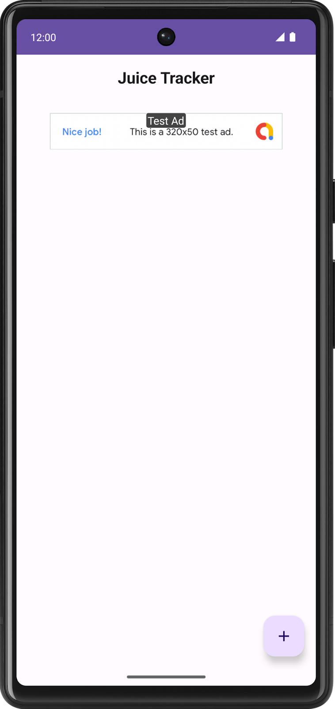
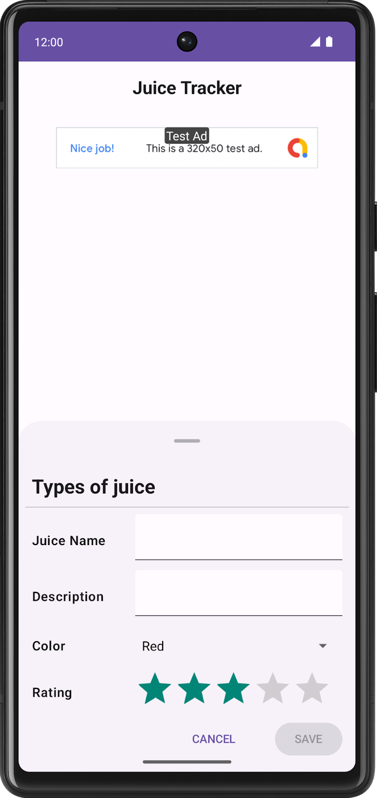
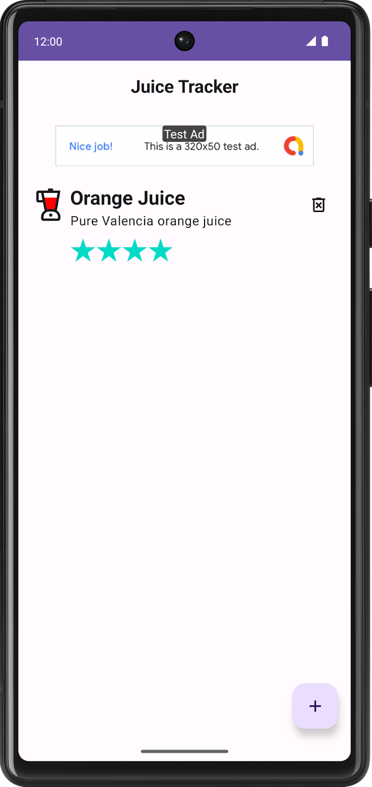
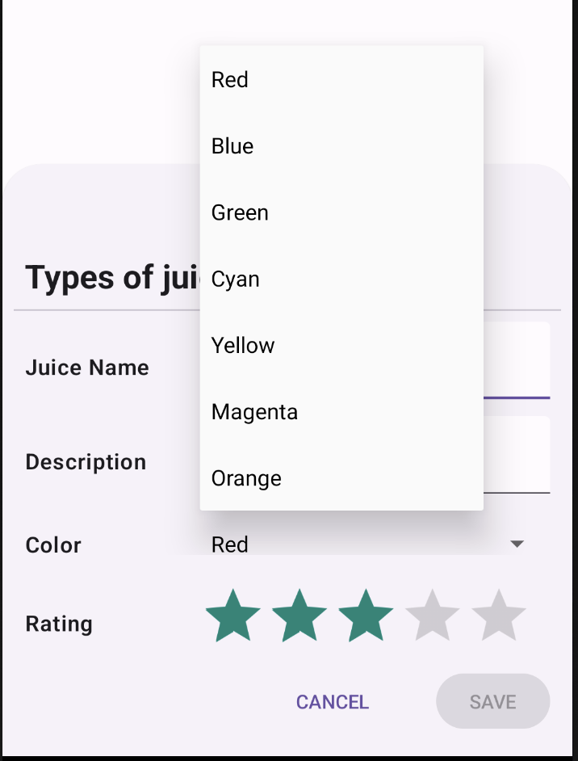
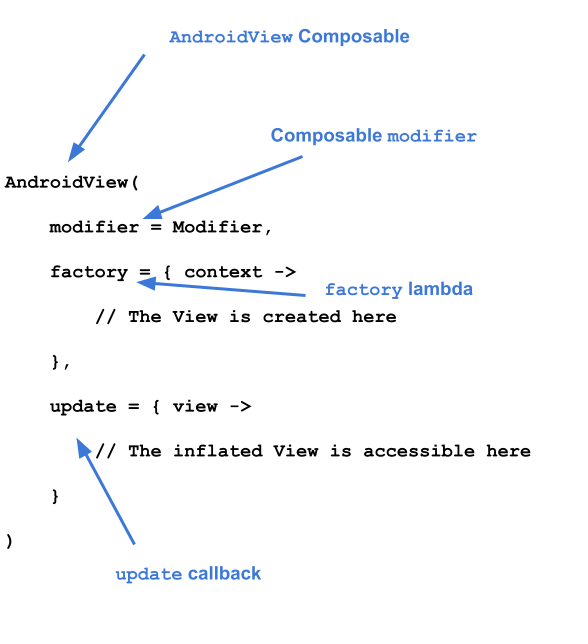

# 第20章: Compose 内のビュー

> 提出ブランチ: `feature/08-views-in-compose`

## 1. この章のゴール

- `AndroidView` で Compose 内に既存の View（Spinner、AdView など）を埋め込める
- Compose と View を混在させる場面と注意点を説明できる

## 2. 進め方

次の内容を **上から順番に** 進めます。「やらなくてOK」の行は飛ばして構いません。レッスンの本文はこのページの下にすべて掲載しています。目安時間の合計は約120分です。

| # | 種類 | 内容 | 目安 | 備考 |
|---|---|---|---|---|
| 1 | レッスン | Compose のビュー相互運用機能 | 約120分 | **提出対象** |

このプログラムの進め方は次の通りです。

1. 下の各レッスンを読み、各ステップの説明を理解してから **自分でコードを打つ**（コピペで済ませない）
2. ステップごとにアプリを実行し、期待どおり動くか確認する
3. 動かないときは、エラー文をそのまま AI に貼って「何が原因か」を聞き、直したら **なぜ直ったか** をメモする
4. 各レッスン末尾の「まとめ」を読み、説明できない用語があればレッスンに戻る

> 画面が最新の Android Studio と異なる場合があります。

## 3. Compose のビュー相互運用機能（提出対象）

### 1. 始める前に

#### はじめに

この時点で、Compose を使用したアプリの作成に精通し、XML、ビュー、ビュー バインディング、Fragment を使ったアプリの作成についてある程度理解しているはずです。ビューでアプリを構築したことで、Compose のような宣言型 UI でアプリを構築することの便利さに気付いたでしょう。しかし、Compose ではなくビューを使用するほうが合理的な場合があります。このレッスンでは、ビューの相互運用機能を使用して、ビュー コンポーネントをモダンな Compose アプリに追加する方法を学びます。

このレッスンの執筆時点では、作成する予定の UI コンポーネントは Compose ではまだ使用できません。これはビュー相互運用機能を活用する絶好の機会です。

#### 前提条件:

- 「ビューで Android アプリを作成する」のレッスンを完了していること

#### 必要なもの

- Android Studio がインストールされた、インターネットに接続できるパソコン。
- デバイスまたはエミュレータ。
- Juice Tracker アプリのスターター コード。

#### 作成するアプリの概要

このレッスンでは、Compose UI に Spinner、RatingBar、AdView の 3 つのビューを統合して、Juice Tracker アプリの UI を完成させる必要があります。これらのコンポーネントを作成するには、ビュー相互運用機能（またはビュー相互運用）を使用します。ビュー相互運用機能を使用して、ビューをコンポーズ可能な関数でラップすることで、実際にアプリにビューを追加できます。

  

#### コードのチュートリアル

このレッスンでは、ビューで Android アプリを作成する のレッスンと Compose をビューベースのアプリに追加するのレッスンと同じ JuiceTracker アプリを使用します。このバージョンとの違いは、提供されているスターター コードが Compose だけでできている点です。このアプリは現在、入力ダイアログ シートとリスト画面上部の広告バナーに、色と評価の入力がありません。

`bottomsheet` ディレクトリには、入力ダイアログに関連するすべての UI コンポーネントが含まれています。このパッケージには、作成時に色と評価の入力用の UI コンポーネントが含まれている必要があります。

`homescreen` には、ホーム画面でホストされている UI コンポーネントが含まれます。これには JuiceTracker リストが含まれます。最終的には、このパッケージには作成時に広告バナーが含まれるようにする必要があります。

ボトムシートやジュースリストなどのメインの UI コンポーネントは `JuiceTrackerApp.kt` ファイルでホストされています。

### 2. スターター コードを取得する

まず、スターター コードをダウンロードします。

または、GitHub リポジトリのクローンを作成してコードを入手することもできます。

```
$ git clone https://github.com/google-developer-training/basic-android-kotlin-compose-training-juice-tracker.git
$ cd basic-android-kotlin-compose-training-juice-tracker
$ git checkout compose-starter
```

> **スターター コードの URL:**
> 
> [`https://github.com/google-developer-training/basic-android-kotlin-compose-juice-tracker`](https://github.com/google-developer-training/basic-android-kotlin-compose-training-juice-tracker/tree/compose-starter)
> 
> **スターター コードのブランチ名:**`compose-starter`

1. Android Studio で `basic-android-kotlin-compose-training-juice-tracker` フォルダを開きます。
2. Android Studio で Juice Tracker アプリコードを開きます。

### 3. Gradle 構成

Play 開発者サービスの広告の依存関係をアプリの `build.gradle.kts` ファイルに追加します。

**app/build.gradle.kts**

```kotlin
android {
   ...
   dependencies {
      ...
      implementation("com.google.android.gms:play-services-ads:22.2.0")
   }
}
```

### 4. 設定

#### セットアップ

Android マニフェストの `activity` タグの上に次の値を追加して、テスト用の広告バナーを有効にします。

**AndroidManifest.xml**

```kotlin
...
<meta-data
   android:name="com.google.android.gms.ads.APPLICATION_ID"
   android:value="ca-app-pub-3940256099942544~3347511713" />

...
```

> **注:** 上記の ID 値はテスト専用です。アプリで実際の広告を配信する場合は、[AdMob アカウントでアプリを設定する](https://developers.google.com/admob/android/quick-start#set_up_your_app_in_your_admob_account)をご覧ください。

### 5. 入力ダイアログを完成させる

このセクションでは、カラースピナーと評価バーを作成し、入力ダイアログを完成させます。カラースピナーは色を選択するコンポーネントであり、評価バーではジュースの評価を選択できます。次のデザインを確認してください。



#### カラースピナーを作成する

Compose でスピナーを実装するには、`Spinner` クラスを使用する必要があります。`Spinner` はコンポーズ可能な関数ではなくビュー コンポーネントであるため、相互運用機能を使用して実装する必要があります。

1. `bottomsheet` ディレクトリに `ColorSpinnerRow.kt` という名前の新しいファイルを作成します。
2. ファイル内に `SpinnerAdapter` という新しいクラスを作成します。
3. `SpinnerAdapter` のコンストラクタで、`Int` パラメータを受け取る `onColorChange` というコールバック パラメータを定義します。`SpinnerAdapter` は、`Spinner` のコールバック関数を処理します。

**bottomsheet/ColorSpinnerRow.kt**

```kotlin
class SpinnerAdapter(val onColorChange: (Int) -> Unit){
}
```

4. `AdapterView.OnItemSelectedListener` インターフェースを実装します。

このインターフェースを実装すると、スピナーのクリック動作を定義できます。このアダプタは、後ほどコンポーズ可能な関数で設定します。

**bottomsheet/ColorSpinnerRow.kt**

```kotlin
class SpinnerAdapter(val onColorChange: (Int) -> Unit): AdapterView.OnItemSelectedListener {
}
```

5. `AdapterView.OnItemSelectedListener` のメンバー関数である `onItemSelected()` と `onNothingSelected()` を実装します。

**bottomsheet/ColorSpinnerRow.kt**

```kotlin
class SpinnerAdapter(val onColorChange: (Int) -> Unit): AdapterView.OnItemSelectedListener {
   override fun onItemSelected(parent: AdapterView<*>?, view: View?, position: Int, id: Long) {
        TODO("Not yet implemented")
    }

    override fun onNothingSelected(parent: AdapterView<*>?) {
        TODO("Not yet implemented")
    }
}
```

6. 色を選択するとアプリで UI の選択された値が更新されるように、`onItemSelected()` 関数を変更して `onColorChange()` コールバック関数を呼び出します。

**bottomsheet/ColorSpinnerRow.kt**

```kotlin
class SpinnerAdapter(val onColorChange: (Int) -> Unit): AdapterView.OnItemSelectedListener {
   override fun onItemSelected(parent: AdapterView<*>?, view: View?, position: Int, id: Long) {
        onColorChange(position)
    }

    override fun onNothingSelected(parent: AdapterView<*>?) {
        TODO("Not yet implemented")
    }
}
```

7. 何も選択しないときは最初の色（赤）がデフォルトの色になるように、`onNothingSelected()` 関数を変更して色を `0` に設定します。

**bottomsheet/ColorSpinnerRow.kt**

```kotlin
class SpinnerAdapter(val onColorChange: (Int) -> Unit): AdapterView.OnItemSelectedListener {
   override fun onItemSelected(parent: AdapterView<*>?, view: View?, position: Int, id: Long) {
        onColorChange(position)
    }

    override fun onNothingSelected(parent: AdapterView<*>?) {
        onColorChange(0)
    }
}
```

コールバック関数を通じてスピナーの動作を定義する `SpinnerAdapter` は作成済みです。ここで、スピナーの内容を作成し、それにデータを設定する必要があります。

8. `ColorSpinnerRow.kt` ファイル内、かつ `SpinnerAdapter` クラスの外部で、`ColorSpinnerRow` という新しいコンポーズ可能な関数を作成します。
9. `ColorSpinnerRow()` のメソッド シグネチャに、スピナー位置用の `Int` パラメータ、`Int` パラメータを受け取るコールバック関数、修飾子を追加します。

**bottomsheet/ColorSpinnerRow.kt**

```kotlin
...
@Composable
fun ColorSpinnerRow(
    colorSpinnerPosition: Int,
    onColorChange: (Int) -> Unit,
    modifier: Modifier = Modifier
) {
}
```

10. この関数内で、`JuiceColor` 列挙型を使用してジュースの色文字列リソースの配列を作成します。この配列がスピナーに入力される内容となります。

**bottomsheet/ColorSpinnerRow.kt**

```kotlin
...
@Composable
fun ColorSpinnerRow(
    colorSpinnerPosition: Int,
    onColorChange: (Int) -> Unit,
    modifier: Modifier = Modifier
) {
   val juiceColorArray =
        JuiceColor.values().map { juiceColor -> stringResource(juiceColor.label) }

}
```

11. `InputRow()` コンポーズ可能関数を追加し、入力ラベル用の色文字列リソースと、`Spinner` が表示される入力行を定義する修飾子を渡します。

**bottomsheet/ColorSpinnerRow.kt**

```kotlin
...
@Composable
fun ColorSpinnerRow(
    colorSpinnerPosition: Int,
    onColorChange: (Int) -> Unit,
    modifier: Modifier = Modifier
) {
   val juiceColorArray =
        JuiceColor.values().map { juiceColor -> stringResource(juiceColor.label) }
   InputRow(inputLabel = stringResource(R.string.color), modifier = modifier) {
   }
}
```

次に、`Spinner` を作成します。`Spinner` は View クラスであるため、Compose のビュー相互運用 API を利用してコンポーズ可能な関数にラップする必要があります。これを実現するには、`AndroidView` コンポーズ可能関数を使用します。

1. Compose で `Spinner` を使用するために、`InputRow` ラムダ本体で、`AndroidView()` コンポーズ可能関数を作成します。`AndroidView()` コンポーズ可能関数は、コンポーズ可能な関数内でビューの要素または階層を作成します。

**bottomsheet/ColorSpinnerRow.kt**

```kotlin
...
@Composable
fun ColorSpinnerRow(
    colorSpinnerPosition: Int,
    onColorChange: (Int) -> Unit,
    modifier: Modifier = Modifier
) {
   val juiceColorArray =
        JuiceColor.values().map { juiceColor -> stringResource(juiceColor.label) }
   InputRow(inputLabel = stringResource(R.string.color), modifier = modifier) {
      AndroidView()
   }
}
```

`AndroidView` **コンポーズ可能関数**は、次の 3 つのパラメータを取ります。

- **`factory`** **ラムダ**。ビューを作成する関数です。
- **`update`** **コールバック**。`factory` で作成されたビューがインフレートされるときに呼び出されます。
- **コンポーズ可能な関数の修飾子**`modifier`。



2. `AndroidView` を実装するために、まず修飾子を渡し、画面の最大幅を占有させます。
3. `factory` パラメータにラムダを渡します。
4. `factory` ラムダはパラメータとして `Context` を受け取ります。`Spinner` クラスを作成してコンテキストを渡します。

**bottomsheet/ColorSpinnerRow.kt**

```kotlin
...
@Composable
fun ColorSpinnerRow(
    colorSpinnerPosition: Int,
    onColorChange: (Int) -> Unit,
    modifier: Modifier = Modifier
) {
   ...
   InputRow(...) {
      AndroidView(
         modifier = Modifier.fillMaxWidth(),
         factory = { context ->
            Spinner(context)
         }
      )
   }
}
```

`RecyclerView.Adapter` が `RecyclerView` にデータを提供するのと同じように、`ArrayAdapter` は `Spinner` にデータを提供します。`Spinner` には、色の配列を保持するアダプタが必要です。

1. `ArrayAdapter` を使用してアダプタを設定します。`ArrayAdapter` には、コンテキスト、XML レイアウト、配列が必要です。レイアウトに `simple_spinner_dropdown_item` を渡します。このレイアウトは、Android のデフォルトとして提供されています。

**bottomsheet/ColorSpinnerRow.kt**

```kotlin
...
@Composable
fun ColorSpinnerRow(
    colorSpinnerPosition: Int,
    onColorChange: (Int) -> Unit,
    modifier: Modifier = Modifier
) {
   ...
   InputRow(...) {
      AndroidView(
         ​​modifier = Modifier.fillMaxWidth(),
         factory = { context ->
             Spinner(context).apply {
                 adapter =
                     ArrayAdapter(
                         context,
                         android.R.layout.simple_spinner_dropdown_item,
                         juiceColorArray
                     )
             }
         }
      )
   }
}
```

`factory` コールバックは、内部で作成された View のインスタンスを返します。`update` は、`factory` コールバックから返されるのと同じ型のパラメータを受け取るコールバックです。このパラメータは、`factory` によってインフレートされる View のインスタンスです。この例では、factory 内で `Spinner` が作成されたため、その `Spinner` のインスタンスは `update` ラムダ本体でアクセスできます。

2. `spinner` を渡す `update` コールバックを追加します。`update` で提供されるコールバックを使用して `setSelection()` メソッドを呼び出します。

**bottomsheet/ColorSpinnerRow.kt**

```kotlin
...
@Composable
fun ColorSpinnerRow(
    colorSpinnerPosition: Int,
    onColorChange: (Int) -> Unit,
    modifier: Modifier = Modifier
) {
   ...
   InputRow(...) {
      //...
         },
         update = { spinner ->
             spinner.setSelection(colorSpinnerPosition)
             spinner.onItemSelectedListener = SpinnerAdapter(onColorChange)
         }
      )
   }
}
```

3. 前に作成した `SpinnerAdapter` を使用して、`update` で `onItemSelectedListener()` コールバックを設定します。

**bottomsheet/ColorSpinnerRow.kt**

```kotlin
...
@Composable
fun ColorSpinnerRow(
    colorSpinnerPosition: Int,
    onColorChange: (Int) -> Unit,
    modifier: Modifier = Modifier
) {
   ...
   InputRow(...) {
      AndroidView(
         // ...
         },
         update = { spinner ->
             spinner.setSelection(colorSpinnerPosition)
             spinner.onItemSelectedListener = SpinnerAdapter(onColorChange)
         }
      )
   }
}
```

これでカラースピナー コンポーネントのコードが完成しました。

4. 次のユーティリティ関数を追加して、`JuiceColor` の列挙型インデックスを取得します。これは次のステップで使用します。

```kotlin
private fun findColorIndex(color: String): Int {
   val juiceColor = JuiceColor.valueOf(color)
   return JuiceColor.values().indexOf(juiceColor)
}
```

5. `EntryBottomSheet.kt` ファイルの `SheetForm` コンポーズ可能関数に `ColorSpinnerRow` を実装します。カラースピナーは「説明」テキストの後、ボタンの上に配置します。

**bottomsheet/EntryBottomSheet.kt**

```kotlin
...
@Composable
fun SheetForm(
   juice: Juice,
   onUpdateJuice: (Juice) -> Unit,
   onCancel: () -> Unit,
   onSubmit: () -> Unit,
   modifier: Modifier = Modifier,
) {
   ...
   TextInputRow(
            inputLabel = stringResource(R.string.juice_description),
            fieldValue = juice.description,
            onValueChange = { description -> onUpdateJuice(juice.copy(description = description)) },
            modifier = Modifier.fillMaxWidth()
        )
        ColorSpinnerRow(
            colorSpinnerPosition = findColorIndex(juice.color),
            onColorChange = { color ->
                onUpdateJuice(juice.copy(color = JuiceColor.values()[color].name))
            }
        )
   ButtonRow(
            modifier = Modifier
                .align(Alignment.End)
                .padding(bottom = dimensionResource(R.dimen.padding_medium)),
            onCancel = onCancel,
            onSubmit = onSubmit,
            submitButtonEnabled = juice.name.isNotEmpty()
        )
    }
}
```

#### 評価入力を作成する

1. `bottomsheet` ディレクトリに `RatingInputRow.kt` という新しいファイルを作成します。
2. `RatingInputRow.kt` ファイルで、`RatingInputRow()` という新しいコンポーズ可能な関数を作成します。
3. メソッド シグネチャで、評価用の `Int`、選択変更を処理する `Int` パラメータを含むコールバック、修飾子を渡します。

**bottomsheet/RatingInputRow.kt**

```kotlin
@Composable
fun RatingInputRow(rating:Int, onRatingChange: (Int) -> Unit, modifier: Modifier = Modifier){
}
```

4. 次のサンプルコードに示すように、`ColorSpinnerRow` と同様に、`AndroidView` を含むコンポーズ可能な関数に `InputRow` を追加します。

**bottomsheet/RatingInputRow.kt**

```kotlin
@Composable
fun RatingInputRow(rating:Int, onRatingChange: (Int) -> Unit, modifier: Modifier = Modifier){
    InputRow(inputLabel = stringResource(R.string.rating), modifier = modifier) {
        AndroidView(
            factory = {},
            update = {}
        )
    }
}
```

5. `factory` ラムダ本体で、`RatingBar` クラスのインスタンスを作成します。これにより、このデザインに必要な評価バーのタイプを指定します。`stepSize` を `1f` に設定して、評価が整数のみになるようにします。

**bottomsheet/RatingInputRow.kt**

```kotlin
@Composable
fun RatingInputRow(rating:Int, onRatingChange: (Int) -> Unit, modifier: Modifier = Modifier){
    InputRow(inputLabel = stringResource(R.string.rating), modifier = modifier) {
        AndroidView(
            factory = { context ->
                RatingBar(context).apply {
                    stepSize = 1f
                }
            },
            update = {}
        )
    }
}
```

ビューがインフレートされると、評価が設定されます。前述の通り、`factory` は `RatingBar` のインスタンスを update コールバックに返します。

6. コンポーズ可能な関数に渡される評価を使用して、`update` ラムダ本体で `RatingBar` インスタンスに評価を設定します。
7. 新しい評価を設定したら、`RatingBar` コールバックを使用して `onRatingChange()` コールバック関数を呼び出し、UI で評価を更新します。

**bottomsheet/RatingInputRow.kt**

```kotlin
@Composable
fun RatingInputRow(rating:Int, onRatingChange: (Int) -> Unit, modifier: Modifier = Modifier){
    InputRow(inputLabel = stringResource(R.string.rating), modifier = modifier) {
        AndroidView(
            factory = { context ->
                RatingBar(context).apply {
                    stepSize = 1f
                }
            },
            update = { ratingBar ->
                ratingBar.rating = rating.toFloat()
                ratingBar.setOnRatingBarChangeListener { _, _, _ ->
                    onRatingChange(ratingBar.rating.toInt())
                }
            }
        )
    }
}
```

これで、評価入力のコンポーズ可能な関数が完成しました。

8. `EntryBottomSheet` で `RatingInputRow()` コンポーズ可能関数を使用します。カラースピナーの後、ボタンの上に配置します。

**bottomsheet/EntryBottomSheet.kt**

```kotlin
@Composable
fun SheetForm(
    juice: Juice,
    onUpdateJuice: (Juice) -> Unit,
    onCancel: () -> Unit,
    onSubmit: () -> Unit,
    modifier: Modifier = Modifier,
) {
    Column(
        modifier = modifier,
        verticalArrangement = Arrangement.spacedBy(4.dp)
    ) {
        ...
        ColorSpinnerRow(
            colorSpinnerPosition = findColorIndex(juice.color),
            onColorChange = { color ->
                onUpdateJuice(juice.copy(color = JuiceColor.values()[color].name))
            }
        )
        RatingInputRow(
            rating = juice.rating,
            onRatingChange = { rating -> onUpdateJuice(juice.copy(rating = rating)) }
        )
        ButtonRow(
            modifier = Modifier.align(Alignment.CenterHorizontally),
            onCancel = onCancel,
            onSubmit = onSubmit,
            submitButtonEnabled = juice.name.isNotEmpty()
        )
    }
}
```

#### 広告バナーを作成する

1. `homescreen` パッケージで、`AdBanner.kt` という新しいファイルを作成します。
2. `AdBanner.kt` ファイルで、`AdBanner()` という新しいコンポーズ可能な関数を作成します。

前に作成したコンポーズ可能な関数とは異なり、`AdBanner` には入力は必要ありません。そのため、`InputRow` コンポーズ可能関数でラップする必要はありません。ただし、`AndroidView` は必要です。

3. `AdView` クラスを使用して、自作のバナーを作成してみましょう。広告サイズを `AdSize.BANNER`、広告ユニット ID を `"ca-app-pub-3940256099942544/6300978111"` に設定してください。
4. `AdView` がインフレートされたら、`AdRequest Builder` を使用して広告を読み込みます。

**homescreen/AdBanner.kt**

```kotlin
@Composable
fun AdBanner(modifier: Modifier = Modifier) {
    AndroidView(
        modifier = modifier,
        factory = { context ->
            AdView(context).apply {
                setAdSize(AdSize.BANNER)
                // Use test ad unit ID
                adUnitId = "ca-app-pub-3940256099942544/6300978111"
            }
        },
        update = { adView ->
            adView.loadAd(AdRequest.Builder().build())
        }
    )
}
```

5. `JuiceTrackerApp` で、`JuiceTrackerList` の前に `AdBanner` を配置します。`JuiceTrackerList` は 83 行目で宣言されています。

**ui/JuiceTrackerApp.kt**

```kotlin
...
AdBanner(
   Modifier
       .fillMaxWidth()
       .padding(
           top = dimensionResource(R.dimen.padding_medium),
           bottom = dimensionResource(R.dimen.padding_small)
       )
)

JuiceTrackerList(
    juices = trackerState,
    onDelete = { juice -> juiceTrackerViewModel.deleteJuice(juice) },
    onUpdate = { juice ->
        juiceTrackerViewModel.updateCurrentJuice(juice)
        scope.launch {
            bottomSheetScaffoldState.bottomSheetState.expand()
        }
     },
)
```

### 6. 解答コードを取得する

このレッスンの完成したコードをダウンロードするには、以下の git コマンドを使用します。

```
$ git clone https://github.com/google-developer-training/basic-android-kotlin-compose-training-juice-tracker.git
$ cd basic-android-kotlin-compose-training-juice-tracker
$ git checkout compose-with-views
```

または、リポジトリを ZIP ファイルとしてダウンロードし、Android Studio で開くこともできます。

> **注:**解答コードは、ダウンロードしたリポジトリの `compose-with-views` ブランチにあります。

解答コードを確認する場合は、[GitHub で表示します](https://github.com/google-developer-training/basic-android-kotlin-compose-training-juice-tracker/tree/compose-with-views)。

### 7. 詳細

#### 関連リンク

- [相互運用 API](https://developer.android.com/jetpack/compose/interop/interop-apis)
- レイアウト

### 8. 最後に

このプログラムはここまでですが、これは Android アプリの開発の始まりにすぎません。

このプログラムでは、ネイティブ Android アプリを作成するための最新の UI ツールキットである Jetpack Compose を使用してアプリを作成する方法を学習しました。このプログラムでは、リストを使ったアプリ（単一画面または複数画面）を作成し、それらの間を移動しました。インタラクティブなアプリを作成し、ユーザー入力への応答を実装して、UI を更新する方法を学びました。マテリアル デザインを適用し、色、シェイプ、タイポグラフィを使用してアプリにテーマを設定しました。また、Jetpack とその他のサードパーティ ライブラリを使用して、タスクのスケジュール設定、リモート サーバーからのデータの取得、ローカルでのデータの保持などを行いました。

このプログラムを完了することで、Jetpack Compose を使用して美しくレスポンシブなアプリを作成する方法をよく理解しただけでなく、効率的でメンテナンスしやすく、視覚的に魅力のある Android アプリを作成するために必要な知識とスキルを身に付けることができました。この基礎知識を身に付けておけば、最新の Android 開発や Compose のスキルを継続的に学習して身に付けることができます。

このプログラムにご参加いただき、ありがとうございました。今後も、[Android デベロッパー向けドキュメント](https://developer.android.com/)、Android デベロッパー向けの Jetpack Compose コース、最新の Android アプリ アーキテクチャ、[Android デベロッパー ブログ](https://medium.com/androiddevelopers)、その他の [レッスン](https://developer.android.com/codelabs/)、[サンプル プロジェクト](https://github.com/android/compose-samples)などの資料も活用して、スキルを身に付け、その幅を広げることをおすすめします。

最後に、ソーシャル メディアで作成したコンテンツを共有し、その際にはハッシュタグ #AndroidBasics を付けて、Google と他の Android デベロッパー コミュニティがあなたの学習プロセスを追いかけることができるようにしましょう。

Compose を使ったコーディングをお楽しみください！

## 4. つまずきやすいポイント

- この章がプログラムの最終章です。ここまでの提出物を振り返り、「自分で一からアプリを作るなら何を作るか」を先生に相談してみましょう。

## 5. AIに質問する（この章の例）

次の例をそのままAIに投げてOKです（必要なら自分のコード/エラーに置き換えてください）。

```text
「`AndroidView` を使う場面と注意点を説明して」
「Compose 内に `Spinner` を埋め込みたい。`AndroidView` の `factory` と `update` の役割を説明して」
「このプログラム全体を振り返って、次に自分で作るアプリのテーマを 3 つ提案して。各テーマで使う技術（Room / Retrofit / Navigation など）も添えて」
```

質問がまとまらないときは、第0章の「質問テンプレ」を使ってください。

## 6. 提出物

次のレッスンで完成させた Android Studio プロジェクトを、学習用リポジトリの `unit8/JuiceTracker/` に置きます（プロジェクトフォルダごとコピー。`build/` と `.idea/` は含めない）。

- Compose のビュー相互運用機能

PR 本文には次の 3 点を書いてください。

- **やったこと**：どのレッスン / 演習を完了したか
- **動作確認**：どの端末（エミュレータ名 or 実機）で何を確認したか
- **詰まった点と解決**：エラーの内容と、どう直したか（AI に聞いた内容も可）

## 7. チェックリスト

- [ ] `AndroidView` で Compose 内に既存の View（Spinner、AdView など）を埋め込める
- [ ] Compose と View を混在させる場面と注意点を説明できる
- [ ] 各レッスンの「まとめ」にある用語を自分の言葉で説明できる
- [ ] 提出物が `unit8/JuiceTracker/` にあり、Android Studio（または Kotlin Playground）で開いて動く

---

## 課題提出

この章には提出課題があります。

1. 上記の提出物を完了する
2. GitHub で `feature/08-views-in-compose` ブランチを作成し、`develop` へのPRを作成（base=`develop`）
3. [AIプログラムレビュー](https://ai.studio/apps/84d224cb-7de1-44fb-995b-9a5917d25603?fullscreenApplet=true) を実行
4. 問題がなければ、進捗ダッシュボードで **PR URL** と **完了日** を記録
