# 第19章: ビュー内の Android ビューと Compose

> 公式コース: [ユニット 8: Compose とビュー](https://developer.android.com/courses/android-basics-compose/unit-8?hl=ja) ／ [パスウェイ 1: ビュー内の Android ビューと Compose](https://developer.android.com/courses/pathways/android-basics-compose-unit-8-pathway-1?hl=ja)
> 提出ブランチ: `feature/08-views`

## 1. この章のゴール

- XML レイアウト・Fragment・RecyclerView など従来の View システムの基本を説明できる
- View ベースの既存アプリに `ComposeView` でコンポーザブルを追加できる

## 2. 進め方

公式パスウェイの内容を **上から順番に** 進めます。動画と「やらなくてOK」の行は飛ばして構いません。Codelab の本文はこのページの下にすべて掲載しています。目安時間の合計は約280分です。

| # | 種類 | 内容 | 目安 | 備考 |
|---|---|---|---|---|
| 1 | 動画 | Android ビューシステム | — | 見なくてOK |
| 2 | Codelab | [ビューで Android アプリを作成する](https://developer.android.com/codelabs/basic-android-kotlin-compose-app-with-views?hl=ja) | 約150分 | 本文は下に掲載 |
| 3 | 動画 | ビュー内の Compose | — | 見なくてOK |
| 4 | Codelab | [Compose を以前のアプリに追加する](https://developer.android.com/codelabs/basic-android-kotlin-training-compose-add-compose-to-a-view-based-app?hl=ja) | 約120分 | **提出対象**（本文は下に掲載） |
| 5 | 動画 | 次のステップ | — | 見なくてOK |
| 6 | クイズ | [テスト: Android ビュー](https://developer.android.com/courses/quizzes/android-basics-compose-unit-8-pathway-1/android-basics-compose-unit-8-pathway-1?hl=ja) | 約10分 |  |

Codelab の進め方は次の通りです。

1. 下の各 Codelab を読み、各ステップの説明を理解してから **自分でコードを打つ**（コピペで済ませない）
2. ステップごとにアプリを実行し、期待どおり動くか確認する
3. 動かないときは、エラー文をそのまま AI に貼って「何が原因か」を聞き、直したら **なぜ直ったか** をメモする
4. パスウェイ末尾のクイズを受けて、間違えた項目を Codelab で読み直す

> Codelab 本文は Google Developers の公式 Codelab（CC BY 4.0）を日本語のまま転載しています。画面が最新の Android Studio と異なる場合は、公式ページ（各見出しの「出典」リンク）も確認してください。

## 3. ビューで Android アプリを作成する

<!-- codelab:basic-android-kotlin-compose-app-with-views -->
出典: [ビューで Android アプリを作成する](https://developer.android.com/codelabs/basic-android-kotlin-compose-app-with-views?hl=ja)（Google Developers, CC BY 4.0）

### 1. 始める前に

#### はじめに

ここまで、Compose で Android アプリを作成する方法を学んできました。それは良いことです。Compose は、開発プロセスを簡素化できる非常に強力なツールです。しかし、Android アプリは必ずしも宣言型 UI で作成されているわけではありません。Android アプリの歴史において、Compose はごく最近のツールです。もともと、Android UI はビューを使用して作成されていました。そのため、Android デベロッパーとしての歩みを進めていくと、ビューに遭遇する可能性が高くなります。この Codelab では、Compose 以前の Android アプリの作成方法の基礎（XML、ビュー、ビュー バインディング、Fragment）を学びます。

#### 前提条件:

- [ユニット 7](https://developer.android.com/courses/android-basics-compose/unit-7) で「Compose での Android の基礎」コースワークを完了していること。

#### 必要なもの

- Android Studio がインストールされた、インターネットに接続できるパソコン。
- デバイスまたはエミュレータ。
- Juice Tracker アプリのスターター コード。

#### 作成するアプリの概要

この Codelab では、Juice Tracker アプリを完成させます。このアプリは、詳細なアイテムで構成されるリストを作成することで、注目のジュースを追跡できるというものです。Fragment と XML を追加して変更し、UI とスターター コードを完成させます。具体的には、UI と関連するロジックや Navigation を含む、新しいジュースを作るための入力フォームを作成します。その結果、独自のジュースを追加できる空のリストを持ったアプリができあがります。

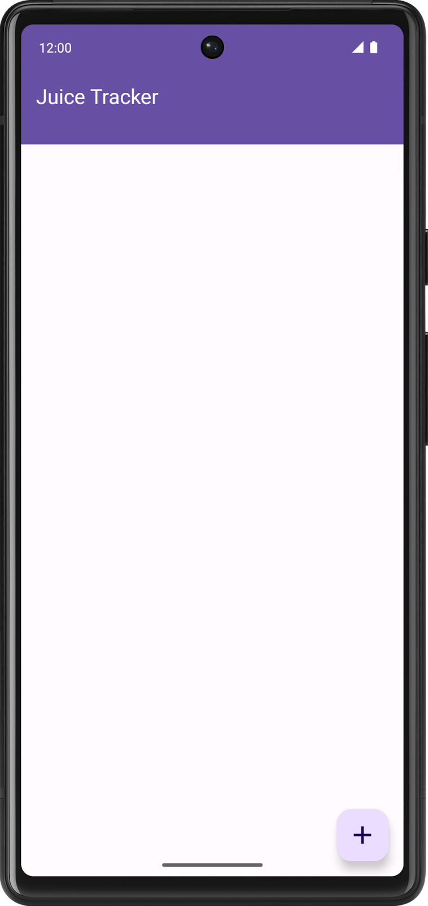 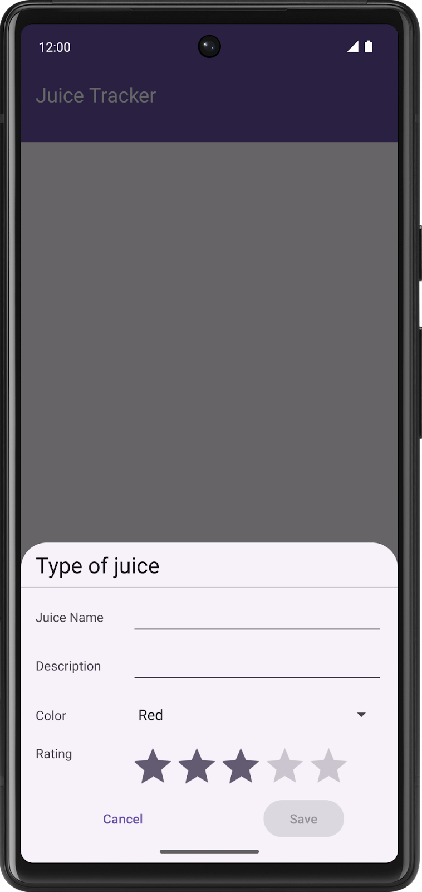 

### 2. スターター コードを取得する

> **スターター コードの URL:**
> 
> [`https://github.com/google-developer-training/basic-android-kotlin-compose-training-juice-tracker`](https://github.com/google-developer-training/basic-android-kotlin-compose-training-juice-tracker/tree/views-starter)
> 
> **スターター コードのブランチ名:**`views-starter`

1. Android Studio で `basic-android-kotlin-compose-training-juice-tracker` フォルダを開きます。
2. Android Studio で Juice Tracker アプリコードを開きます。

### 3. レイアウトを作成する

[`Views`](https://developer.android.com/reference/android/view/View) でアプリを作成する場合は、[Layout](https://developer.android.com/develop/ui/views/layout/declaring-layout) 内に UI を構築します。Layout は通常、XML を使用して宣言します。宣言した XML レイアウト ファイルは、リソース ディレクトリの **[res] > [layout]** に配置されます。レイアウトには、UI を構成するコンポーネントが含まれています。これらのコンポーネントが `View` と呼ばれるものです。XML 構文は、タグ、要素、属性で構成されています。XML 構文の詳細については、[Android の XML レイアウトを作成する](https://developer.android.com/codelabs/basic-android-kotlin-training-xml-layouts)の Codelab をご覧ください。

このセクションでは [**Type of juice**] 入力ダイアログの XML レイアウトを作成します。


1. **[main] > [res] > [layout]** ディレクトリに、`fragment_entry_dialog` という名前の新しい**レイアウト リソース ファイル**を作成します。

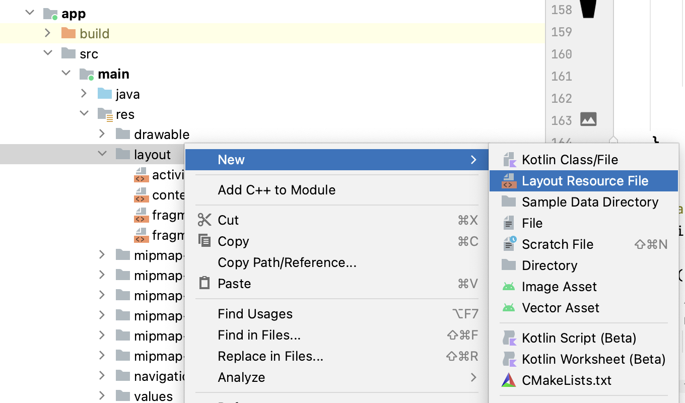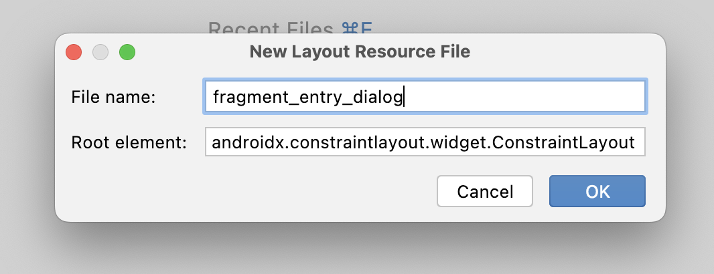

`fragment_entry_dialog.xml` レイアウトには、アプリがユーザーに表示する UI コンポーネントが含まれています。

**ルート要素**が `ConstraintLayout` であることに注目してください。このタイプのレイアウトは、制約を使用してビューの位置とサイズを柔軟に調整できる `ViewGroup` です。`ViewGroup` は、他の `View`（子または子 `View`）を含む `View` の一種です。次のステップでは、このトピックについて詳しく説明しますが、`ConstraintLayout` の詳細については、[ConstraintLayout でレスポンシブ UI を作成する](https://developer.android.com/develop/ui/views/layout/constraint-layout)をご覧ください。

2. ファイルを作成したら、`ConstraintLayout` でアプリの名前空間を定義します。

**`fragment_entry_dialog.xml`**

```kotlin
<androidx.constraintlayout.widget.ConstraintLayout
   xmlns:android="http://schemas.android.com/apk/res/android"
   xmlns:app="http://schemas.android.com/apk/res-auto"
   android:layout_width="match_parent"
   android:layout_height="match_parent">
</androidx.constraintlayout.widget.ConstraintLayout>
```

3. `ConstraintLayout` に次の Guidelines を追加します。

**`fragment_entry_dialog.xml`**

```kotlin
<androidx.constraintlayout.widget.Guideline
   android:id="@+id/guideline_left"
   android:layout_width="wrap_content"
   android:layout_height="wrap_content"
   android:orientation="vertical"
   app:layout_constraintGuide_begin="16dp" />
<androidx.constraintlayout.widget.Guideline
   android:id="@+id/guideline_middle"
   android:layout_width="wrap_content"
   android:layout_height="wrap_content"
   android:orientation="vertical"
   app:layout_constraintGuide_percent="0.5" />
<androidx.constraintlayout.widget.Guideline
   android:id="@+id/guideline_top"
   android:layout_width="wrap_content"
   android:layout_height="wrap_content"
   android:orientation="horizontal"
   app:layout_constraintGuide_begin="16dp" />
```

これらの `Guideline` は、他のビューのパディングとして機能します。Guidelines では「**Type of juice**」というヘッダー テキストが制約されています。

4. `TextView` 要素を作成します。この `TextView` は、詳細フラグメントのタイトルを表します。

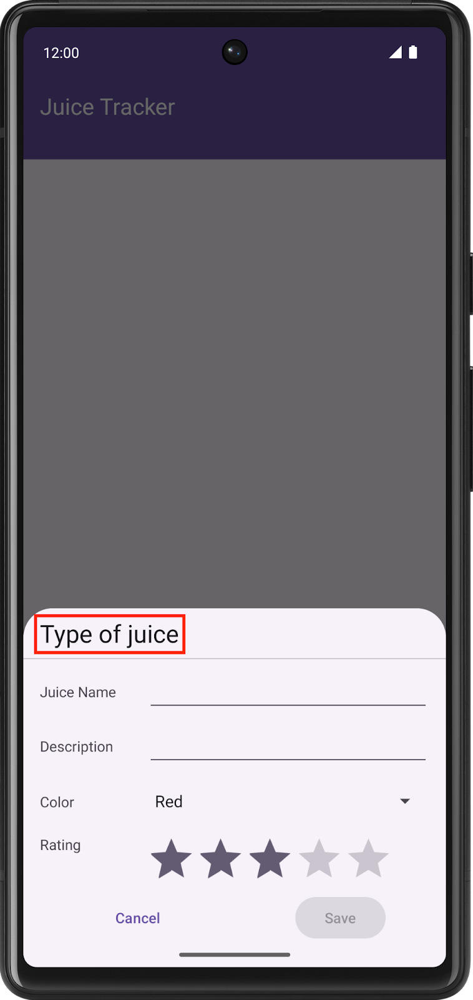

5. `TextView` の `id` を `header_title` に設定します。
6. `layout_width` を `0dp` に設定します。最終的には、レイアウト制約がこの `TextView` の幅を定義します。そのため、幅を定義しても、UI の描画中に不要な計算処理が発生するだけです。`0dp` の幅を定義すれば余分な計算処理がなくなります。
7. `TextView text` 属性を `@string/juice_type` に設定します。
8. `textAppearance` を `@style/TextAppearance.MaterialComponents.Headline5` に設定します。

**`fragment_entry_dialog.xml`**

```kotlin
<TextView
   android:id="@+id/header_title"
   android:layout_width="0dp"
   android:layout_height="wrap_content"
   android:text="@string/juice_type"
   android:textAppearance="@style/TextAppearance.MaterialComponents.Headline5" />
```

最後に、制約を定義する必要があります。寸法を制約として使用する `Guideline` とは異なり、このガイドライン自体はこの `TextView` を制約します。そのために、ビューを制約する `Guideline` の ID を参照します。

9. ヘッダーの上部を `guideline_top` の下部に制約します。

**`fragment_entry_dialog.xml`**

```kotlin
<TextView
   android:id="@+id/header_title"
   android:layout_width="0dp"
   android:layout_height="wrap_content"
   android:text="@string/juice_type"
   android:textAppearance="@style/TextAppearance.MaterialComponents.Headline5"
   app:layout_constraintTop_toBottomOf="@+id/guideline_top" />
```

10. 終点を `guideline_middle` の始点に制約し、始点を `guideline_left` の始点に制約して、`TextView` プレースメントを完成させます。ビューの制約方法は、UI の表示方法によって異なります。

**`fragment_entry_dialog.xml`**

```kotlin
<TextView
   android:id="@+id/header_title"
   android:layout_width="0dp"
   android:layout_height="wrap_content"
   android:text="@string/juice_type"
   android:textAppearance="@style/TextAppearance.MaterialComponents.Headline5"
   app:layout_constraintTop_toBottomOf="@+id/guideline_top"
   app:layout_constraintEnd_toStartOf="@+id/guideline_middle"
   app:layout_constraintStart_toStartOf="@+id/guideline_left" />
```

スクリーンショットに基づいて、残りの UI を作成してください。完成した [`fragment_entry_dialog.xml`](https://github.com/google-developer-training/basic-android-kotlin-compose-training-juice-tracker/blob/views/app/src/main/res/layout/fragment_entry_dialog.xml) ファイルは、[解答](https://github.com/google-developer-training/basic-android-kotlin-compose-training-juice-tracker/tree/views)にあります。

### 4. ビューで Fragment を作成する

Compose では、Kotlin または Java を使用してレイアウトを宣言的に作成します。別の「画面」にアクセスするには、通常は同じアクティビティ内にある、別のコンポーザブルに移動します。ビューでアプリを作成する場合は、XML レイアウトをホストする Fragment が、Composable の「画面」のコンセプトに代わるものとなります。

このセクションでは、`fragment_entry_dialog` レイアウトをホストして UI にデータを提供する `Fragment` を作成します。

1. `juicetracker` パッケージで、`EntryDialogFragment` という名前の新しいクラスを作成します。
2. `EntryDialogFragment` が `BottomSheetDialogFragment` を拡張するようにします。

**`EntryDialogFragment.kt`**

```kotlin
import com.google.android.material.bottomsheet.BottomSheetDialogFragment

class EntryDialogFragment : BottomSheetDialogFragment() {
}
```

`DialogFragment` は、フローティング ダイアログを表示する `Fragment` です。`BottomSheetDialogFragment` は `DialogFragment` クラスを継承していますが、画面下部に固定された画面幅のシートを表示します。この方法は、前述の設計に合わせたものです。

3. プロジェクトを再ビルドします。これにより、`fragment_entry_dialog` レイアウトに基づくビュー バインディング ファイルが自動生成されます。ビュー バインディングを使用すると、XML で宣言された `View` にアクセスして操作できます。詳細については、[ビュー バインディング](https://developer.android.com/topic/libraries/view-binding)のドキュメントをご覧ください。
4. `EntryDialogFragment` クラスで、`onCreateView()` 関数を実装します。名前が示すように、この関数はこの `Fragment` の `View` を作成します。

> **注:** `Activity` と同様に、`Fragment` にもさまざまな[ライフサイクル状態](https://developer.android.com/guide/fragments/lifecycle)と、それに対応するライフサイクル メソッドがあります。

**`EntryDialogFragment.kt`**

```kotlin
import android.os.Bundle
import android.view.LayoutInflater
import android.view.View
import android.view.ViewGroup

override fun onCreateView(
   inflater: LayoutInflater,
   container: ViewGroup?,
   savedInstanceState: Bundle?
): View? {
   return super.onCreateView(inflater, container, savedInstanceState)
}
```

`onCreateView()` 関数は `View` を返しますが、現時点では有用な `View` を返しません。

5. `super.onCreateView()` を返す代わりに、`FragmentEntryDialogViewBinding` のインフレートで生成された `View` を返します。

**`EntryDialogFragment.kt`**

```kotlin
import com.example.juicetracker.databinding.FragmentEntryDialogBinding

override fun onCreateView(
   inflater: LayoutInflater,
   container: ViewGroup?,
   savedInstanceState: Bundle?
): View? {
   return FragmentEntryDialogBinding.inflate(inflater, container, false).root
}
```

6. `onCreateView()` 関数外、かつ `EntryDialogFragment` クラス内で、`EntryViewModel` のインスタンスを作成します。
7. `onViewCreated()` 関数を実装します。

ビュー バインディングをインフレートすると、レイアウト内の `View` にアクセスして変更できるようになります。`onViewCreated()` メソッドが、このライフサイクルで `onCreateView()` の後に呼び出されます。`onViewCreated()` メソッドは、レイアウト内の `View` にアクセスして変更する場合におすすめの場所です。

8. `FragmentEntryDialogBinding` の `bind()` メソッドを呼び出して、ビュー バインディングのインスタンスを作成します。

この時点で、コードは次の例のようになります。

**`EntryDialogFragment.kt`**

```kotlin
import androidx.fragment.app.viewModels
import com.example.juicetracker.ui.AppViewModelProvider
import com.example.juicetracker.ui.EntryViewModel

class EntryDialogFragment : BottomSheetDialogFragment() {

   private val entryViewModel by viewModels<EntryViewModel> { AppViewModelProvider.Factory }

   override fun onCreateView(
       inflater: LayoutInflater,
       container: ViewGroup?,
       savedInstanceState: Bundle?
   ): View {
       return FragmentEntryDialogBinding.inflate(inflater, container, false).root
   }

   override fun onViewCreated(view: View, savedInstanceState: Bundle?) {
        val binding = FragmentEntryDialogBinding.bind(view)
    }
}
```

バインディングを使用してビューにアクセスし、設定できます。たとえば、`setText()` メソッドで `TextView` を設定できます。

```kotlin
binding.name.setText("Apple juice")
```

> **注:** 便宜上、上記の例ではハードコードされた文字列「**Apple juice**」を使用しています。製品版では、文字列リソースを使用する必要があります。

入力ダイアログの UI は、ユーザーが新しいアイテムを作成する場所ですが、既存のアイテムを変更するためにも使用できます。そのため、Fragment はクリックされたアイテムを取得する必要があります。Navigation コンポーネントにより、`EntryDialogFragment` への移動とクリックされたアイテムの取得が容易になります。

`EntryDialogFragment` は未完成ですが、心配無用です。次のセクションに進んで、`View` を使用するアプリで Navigation コンポーネントを使用する方法を学びましょう。

### 5. Navigation コンポーネントを変更する

このセクションでは、入力ダイアログを起動するためと、アイテムを取得するため（該当する場合）に、Navigation コンポーネントを使用します。

Compose では、呼び出すだけでさまざまなコンポーザブルをレンダリングする機会があります。しかし、Fragment の動作は異なります。[Navigation コンポーネント](https://developer.android.com/guide/navigation/navigation-getting-started)は、Fragment の「デスティネーション」を調整し、Fragment 間とそれに含まれるビューの間を簡単に移動できるようにします。

Navigation コンポーネントを使用して、`EntryDialogFragment` へのナビゲーションを調整します。

1. `nav_graph.xml` ファイルを開き、[**Design**] タブが選択されていることを確認します。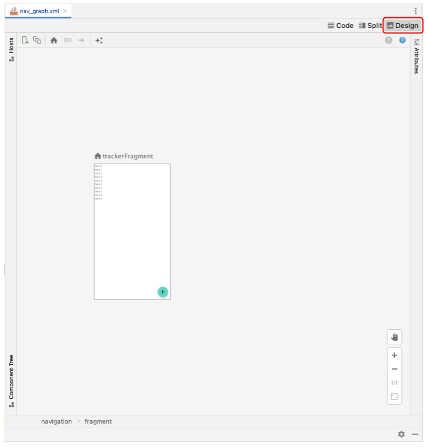
2.  アイコンをクリックして、新しいデスティネーションを追加します。

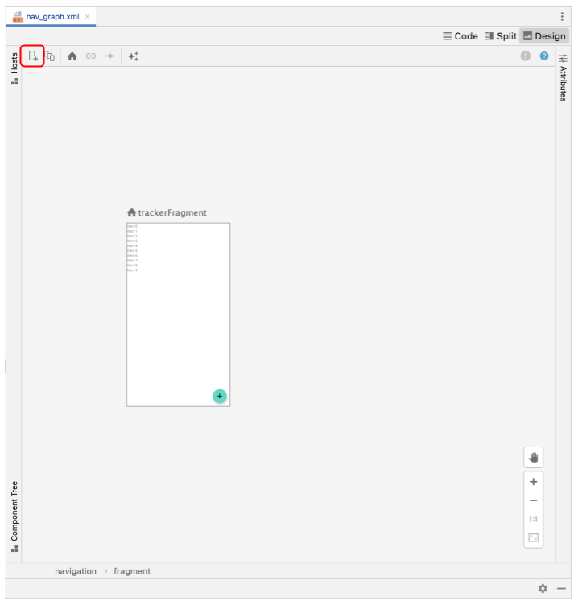

3. `EntryDialogFragment` デスティネーションを選択します。このアクションは、nav graph で `entryDialogFragment` を宣言し、ナビゲーション アクションからアクセスできるようにするものです。

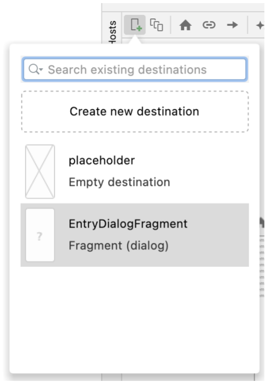

> **注:** `entryDialogFragment` 画面は `nav_graph.xml` の表示領域のランダムな位置に表示されることがあります。デスティネーションをドラッグすると、表示領域を整理できます。

`TrackerFragment` から `EntryDialogFragment` を起動する必要があります。そのためには、このタスクをナビゲーション アクションで実行する必要があります。

4. `trackerFragment` の上にカーソルを移動します。灰色の点を選択して、線を `entryDialogFragment` にドラッグします。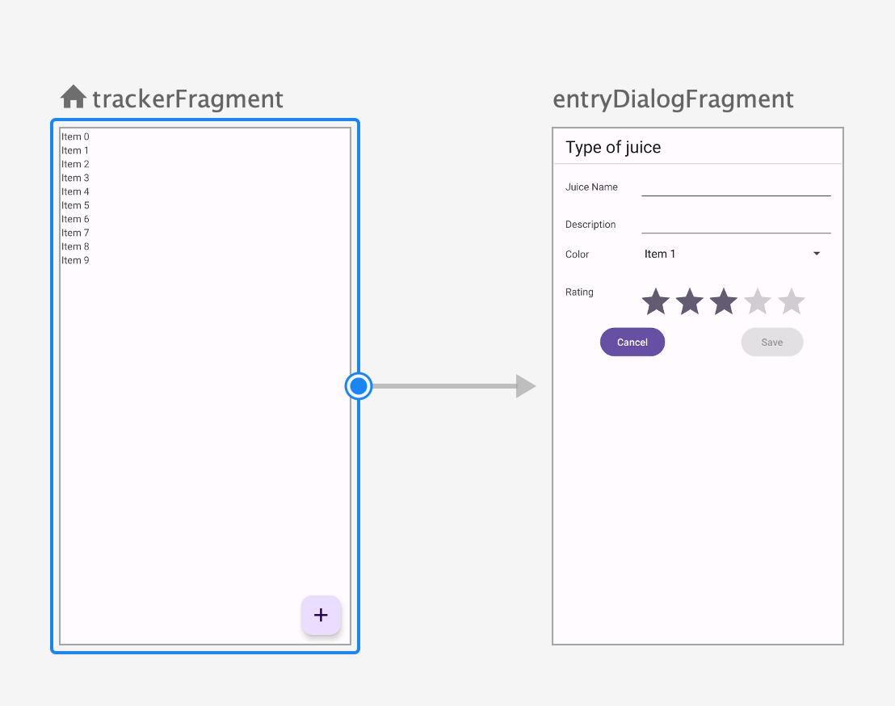
5. nav_graph デザインビューでは、デスティネーションを選択し、[**Arguments**] プルダウンの横にある  アイコンをクリックして、デスティネーションの引数を宣言できます。この機能を使用して、`Long` 型の `itemId` 引数を `entryDialogFragment` に追加します。デフォルト値は `0L` です。

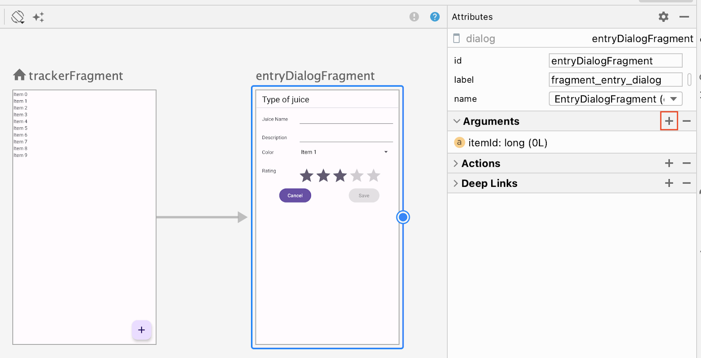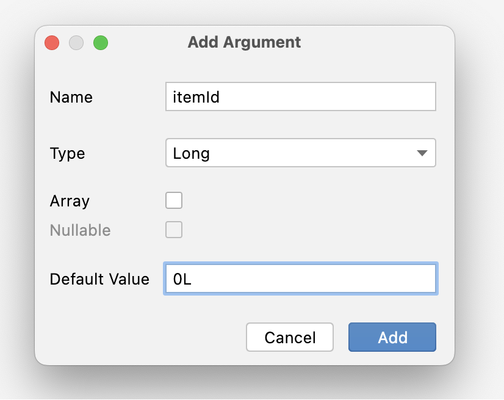

`TrackerFragment` は `Juice` アイテムのリストを保持します。これらのアイテムのいずれかをクリックすると、`EntryDialogFragment` が起動します。

6. プロジェクトを再ビルドします。`EntryDialogFragment` で `itemId` 引数にアクセスできるようになりました。

### 6. Fragment を完成させる

ナビゲーション引数のデータを使用して、入力ダイアログを完成させます。

1. `EntryDialogFragment` の `onViewCreated()` メソッドで `navArgs()` を取得します。
2. `navArgs()` から `itemId` を取得します。
3. `ViewModel` を使用して、新規または変更されたジュースを保存する `saveButton` を実装します。

入力ダイアログ UI で、デフォルトの色が赤であることを思い出してください。現時点では、これをプレースホルダとして渡します。

`saveJuice()` を呼び出すときに引数から取得したアイテム ID を渡します。

**`EntryDialogFragment.kt`**

```kotlin
import androidx.navigation.fragment.navArgs
import com.example.juicetracker.data.JuiceColor

class EntryDialogFragment : BottomSheetDialogFragment() {

   //...
   var selectedColor: JuiceColor = JuiceColor.Red

   override fun onViewCreated(view: View, savedInstanceState: Bundle?) {
        val binding = FragmentEntryDialogBinding.bind(view)
        val args: EntryDialogFragmentArgs by navArgs()
        val juiceId = args.itemId

        binding.saveButton.setOnClickListener {
           entryViewModel.saveJuice(
               juiceId,
               binding.name.text.toString(),
               binding.description.text.toString(),
               selectedColor.name,
               binding.ratingBar.rating.toInt()
           )
        }
    }
}
```

4. データを保存したら、`dismiss()` メソッドでダイアログを閉じます。

**`EntryDialogFragment.kt`**

```kotlin
class EntryDialogFragment : BottomSheetDialogFragment() {

    //...
    var selectedColor: JuiceColor = JuiceColor.Red
    //...

    override fun onViewCreated(view: View, savedInstanceState: Bundle?) {
        val binding = FragmentEntryDialogBinding.bind(view)
        val args: EntryDialogFragmentArgs by navArgs()
        binding.saveButton.setOnClickListener {
           entryViewModel.saveJuice(
               juiceId,
               binding.name.text.toString(),
               binding.description.text.toString(),
               selectedColor.name,
               binding.ratingBar.rating.toInt()
           )
           dismiss()
        }
    }
}
```

なお、上記のコードでは `EntryDialogFragment` は完成していません。まだ実装する必要のあることが多数あります。既存の `Juice` データをフィールドに入力する（該当する場合）、`colorSpinner` から色を選ぶ、`cancelButton` を実装などです。ただし、このコードは `Fragment` に固有なものではなく、自身で実装できるはずです。残りの機能を実装しましょう。最後の手段として、この Codelab の解答コードを参照することもできます。

### 7. 入力ダイアログの起動

最後のタスクでは、Navigation コンポーネントを使用して入力ダイアログを起動します。ユーザーがフローティング アクション ボタン（**FAB**）をクリックしたときに、入力ダイアログを起動する必要があります。また、ユーザーがアイテムをクリックしたときに起動して、対応する ID を渡す必要があります。

1. FAB の `onClickListener()` で、nav コントローラの `navigate()` を呼び出します。

**`TrackerFragment.kt`**

```kotlin
import androidx.navigation.findNavController

//...

binding.fab.setOnClickListener { fabView ->
   fabView.findNavController().navigate(
   )
}

//...
```

2. navigate 関数に、トラッカーから入力ダイアログに移動するアクションを渡します。

**`TrackerFragment.kt`**

```kotlin
//...

binding.fab.setOnClickListener { fabView ->
   fabView.findNavController().navigate(
TrackerFragmentDirections.actionTrackerFragmentToEntryDialogFragment()
   )
}

//...
```

3. このラムダ本体でのアクションを `JuiceListAdapter` の `onEdit()` メソッドについても繰り返しますが、今回は `Juice` の `id` を渡します。

**`TrackerFragment.kt`**

```kotlin
//...

onEdit = { drink ->
   findNavController().navigate(
       TrackerFragmentDirections.actionTrackerFragmentToEntryDialogFragment(drink.id)
   )
},

//...
```

### 8. 解答コードを取得する

この Codelab の完成したコードをダウンロードするには、以下の git コマンドを使用します。

```
$ git clone https://github.com/google-developer-training/basic-android-kotlin-compose-training-juice-tracker.git
$ cd basic-android-kotlin-compose-training-juice-tracker
$ git checkout views
```

または、リポジトリを ZIP ファイルとしてダウンロードし、Android Studio で開くこともできます。

> **注:**解答コードは、ダウンロードしたリポジトリの `views` ブランチにあります。

解答コードを確認する場合は、[GitHub で表示します](https://github.com/google-developer-training/basic-android-kotlin-compose-training-juice-tracker/tree/views)。

## 4. Compose を以前のアプリに追加する（提出対象）

<!-- codelab:basic-android-kotlin-training-compose-add-compose-to-a-view-based-app -->
出典: [Compose をビューベースのアプリに追加する](https://developer.android.com/codelabs/basic-android-kotlin-training-compose-add-compose-to-a-view-based-app?hl=ja)（Google Developers, CC BY 4.0）

### 1. 始める前に

Jetpack Compose は、当初から View の相互運用性を考慮して設計されており、Compose と View システムはリソースを共有し、互いに連携しながら UI を表示することができます。この機能により、Compose を既存のビューベースのアプリに追加することができるようになっています。つまり、アプリ全体が完全に Compose ベースになるまで、Compose と View をコードベース内で共存させることができるのです。

この Codelab では、**Juice Tracker** アプリのビューベースのリストアイテムを Compose に変更します。残りの Juice Tracker のビューは、必要に応じて自分で変換できます。

ビューベースの UI を備えたアプリがある場合、その UI 全体を一度に書き換えたくはないでしょう。この Codelab では、ビューベースの UI の中の 1 つのビューを Compose 要素に変換します。

#### 前提条件

- ビューベースの UI に精通していること。
- ビューベースの UI を使用してアプリを作成する方法に関する知識。
- ラムダを含む Kotlin 構文の使用経験。
- Jetpack Compose でアプリを作成する方法に関する知識。

#### 学習内容

- Android ビューで作成した既存の画面に Compose を追加する方法。
- ビューベースのアプリに追加されたコンポーザブルをプレビューする方法。

#### 作成するアプリの概要

- **Juice Tracker** アプリでビューベースのリストアイテムを Compose に変換します。

### 2. スターター アプリの概要

この Codelab では、[ビューを使用して Android アプリを作成する](https://developer.android.com/codelabs/basic-android-kotlin-compose-app-with-views)で取得した **Juice Tracker** アプリの解答コードをスターター コードとして使用します。スターター アプリはすでに、[Room](https://developer.android.com/reference/androidx/room/package-summary) 永続ライブラリを使用してデータを保存できる状態になっています。ユーザーは、ジュースの名前、説明、色、評価など、ジュースの情報をアプリ データベースに追加できます。

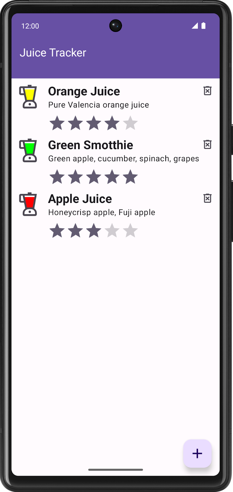

この Codelab では、ビューベースのリストアイテムを Compose に変換します。

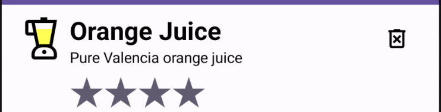

この Codelab のスターター コードをダウンロードする

まず、スターター コードをダウンロードします。

または、GitHub リポジトリのクローンを作成してコードを入手することもできます。

```
$ git clone https://github.com/google-developer-training/basic-android-kotlin-compose-training-juice-tracker.git
$ cd basic-android-kotlin-compose-training-juice-tracker
$ git checkout views
```

> **注:**スターター コードは、ダウンロードしたリポジトリの `views` ブランチにあります。

コードは [`JuiceTracker`](https://github.com/google-developer-training/basic-android-kotlin-compose-training-juice-tracker/tree/views) GitHub リポジトリで確認できます。

### 3. Jetpack Compose ライブラリを追加する

前述のとおり、Compose と View は特定の画面で共存できます。一部の UI 要素を Compose に、残りを View システムに保持できます。たとえば、Compose はリストのみとし、画面の残りの部分は View システムに保持できます。

以下の手順で、Compose ライブラリを **Juice Tracker** アプリに追加します。

1. Android Studio で Juice Tracker を開きます。
2. アプリレベルの `build.gradle.kts` を開きます。
3. `buildFeatures` ブロック内に `compose = true` フラグを追加します。

```kotlin
buildFeatures {
    //...
    // Enable Jetpack Compose for this module
    compose = true
}
```

このフラグにより、Android Studio が Compose を扱えるようになります。前の Codelab ではこのステップを実施していません。これは、新しい Android Studio Compose テンプレート プロジェクトを作成するときに、このコードが Android Studio によって自動的に生成されるためです。

4. `buildFeatures` で、`composeOptions` ブロックを追加します。
5. ブロック内で、`kotlinCompilerExtensionVersion` を `"1.5.1"` に設定して Kotlin コンパイラ バージョンを設定します。

```kotlin
composeOptions {
    kotlinCompilerExtensionVersion = "1.5.1"
}
```

6. `dependencies` セクションで、Compose の依存関係を追加します。Compose をビューベースのアプリに追加するには、次の依存関係が必要です。これらの依存関係は、Compose とアクティビティとの統合、Compose デザイン コンポーネント ライブラリの追加、Compose Jetpack テーマのサポート、IDE のサポートを改善するツールの提供に役立ちます。

```kotlin
dependencies {
    implementation(platform("androidx.compose:compose-bom:2023.06.01"))
    // other dependencies 
    // Compose
    implementation("androidx.activity:activity-compose:1.7.2")
    implementation("androidx.compose.material3:material3")
    implementation("com.google.accompanist:accompanist-themeadapter-material3:0.28.0")

    debugImplementation("androidx.compose.ui:ui-tooling")
}
```

#### ComposeView を追加する

[`ComposeView`](https://developer.android.com/reference/kotlin/androidx/compose/ui/platform/ComposeView) は、Jetpack Compose の UI コンテンツをホストできる Android View です。[`setContent`](https://developer.android.com/reference/kotlin/androidx/compose/ui/platform/ComposeView#setContent(kotlin.Function0)) を使用して、ビューにコンテンツのコンポーズ可能な関数を指定します。

1. `layout/list_item.xml` を開き、[**Split**] タブでプレビューを表示します。

この Codelab を終了すると、このビューがコンポーザブルに置き換わります。

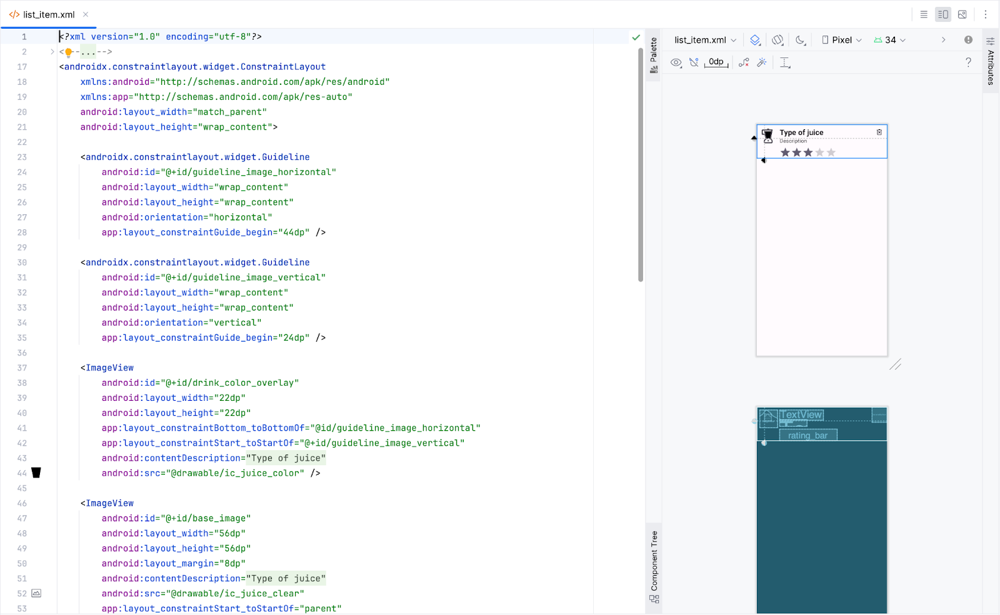

2. [`JuiceListAdapter.kt`](http://juicelistadapter.kt) で、すべての場所から `ListItemBinding` を削除します。`JuiceListViewHolder` クラスで、`binding.root` を `composeView` に置き換えます。

```kotlin
import androidx.compose.ui.platform.ComposeView

class JuiceListViewHolder(
    private val onEdit: (Juice) -> Unit,
    private val onDelete: (Juice) -> Unit
): RecyclerView.ViewHolder(composeView) 
```

3. `onCreateViewHolder()` フォルダで、`return()` 関数を次のコードと一致するように更新します。

```kotlin
override fun onCreateViewHolder(parent: ViewGroup, viewType: Int): JuiceListViewHolder {
   return JuiceListViewHolder(
       ComposeView(parent.context),
       onEdit,
       onDelete
   )
}
```

4. `JuiceListViewHolder` クラスで、すべての `private` 変数を削除し、`bind()` 関数からすべてのコードを削除します。`JuiceListViewHolder` クラスは次のコードのようになります。

```kotlin
class JuiceListViewHolder(
    private val onEdit: (Juice) -> Unit,
    private val onDelete: (Juice) -> Unit
) : RecyclerView.ViewHolder(composeView) {

   fun bind(juice: Juice) {

   }
}
```

5. この時点で、`com.example.juicetracker.databinding.ListItemBinding` と `android.view.LayoutInflater` のインポートを削除できます。

```kotlin
// Delete
import com.example.juicetracker.databinding.ListItemBinding
import android.view.LayoutInflater
```

6. ファイル `layout/list_item.xml` を削除します。
7. [**Delete**] ダイアログで [**OK**] を選択します。

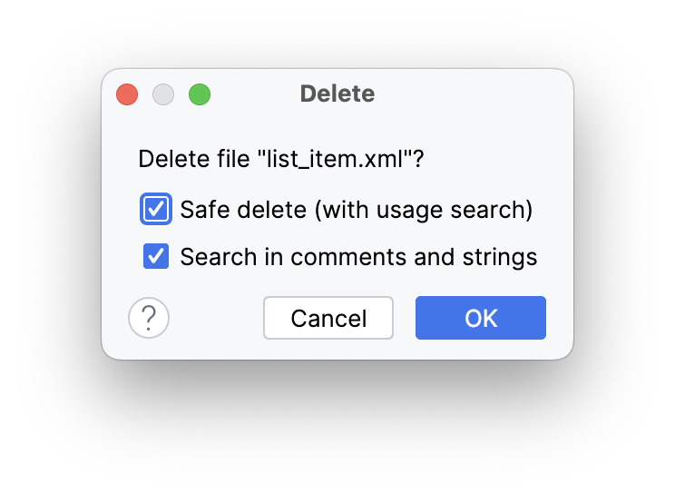

### 4. コンポーズ可能な関数を追加する

次に、リストアイテムを出力するコンポーザブルを作成します。コンポーザブルは、`Juice` と、リストアイテムの編集と削除を行うための 2 つのコールバック関数を受け取ります。

1. `JuiceListAdapter.kt` で、`JuiceListAdapter` クラス定義の後に、`ListItem()` というコンポーズ可能な関数を作成します。
2. `ListItem()` 関数が `Juice` オブジェクトと削除用のラムダ コールバックを受け入れるようにします。

```kotlin
import androidx.compose.runtime.Composable
import androidx.compose.ui.Modifier

@Composable
fun ListItem(
    input: Juice,
    onDelete: (Juice) -> Unit,
    modifier: Modifier = Modifier
) {
}
```

作成するリストアイテムのプレビューを確認します。ジュース アイコン、ジュースの詳細、削除ボタンのアイコンがあります。これらのコンポーネントは後ほど実装します。

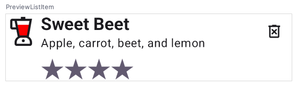

#### Juice アイコンのコンポーザブルを作成する

1. `JuiceListAdapter.kt` で、`ListItem()` コンポーザブルの後に、`color` と `Modifier` を受け取る `JuiceIcon()` という別のコンポーズ可能な関数を作成します。

```kotlin
@Composable
fun JuiceIcon(color: String, modifier: Modifier = Modifier) {

}
```

2. 次のコードに示すように、`JuiceIcon()` 関数内に `color` の変数と内容説明の変数を追加します。

```kotlin
@Composable
fun JuiceIcon(color: String, modifier: Modifier = Modifier) {
   val colorLabelMap = JuiceColor.values().associateBy { stringResource(it.label) }
   val selectedColor = colorLabelMap[color]?.let { Color(it.color) }
   val juiceIconContentDescription = stringResource(R.string.juice_color, color)

}
```

`colorLabelMap` 変数と `selectedColor` 変数を使用して、ユーザー選択に関連付けられたカラーリソースを取得します。

3. 2 つのアイコン *`ic_juice_color`* と *`ic_juice_clear`* を重ねて表示する `Box` レイアウトを追加します。*`ic_juice_color`* アイコンは色合いが含まれ、中央に揃えて表示されます。

```kotlin
import androidx.compose.foundation.layout.Box

Box(
   modifier.semantics {
       contentDescription = juiceIconContentDescription
   }
) {
   Icon(
       painter = painterResource(R.drawable.ic_juice_color),
       contentDescription = null,
       tint = selectedColor ?: Color.Red,
       modifier = Modifier.align(Alignment.Center)
   )
   Icon(painter = painterResource(R.drawable.ic_juice_clear), contentDescription = null)
}
```

コンポーザブルの実装には慣れているはずなので、実装方法については詳しく説明していません。

4. `JuiceIcon()` をプレビューする関数を追加します。色を `Yellow` として渡します。

```kotlin
import androidx.compose.ui.tooling.preview.Preview

@Preview
@Composable
fun PreviewJuiceIcon() {
    JuiceIcon("Yellow")
}
```

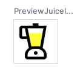

#### ジュースの詳細のコンポーザブルを作成する

`JuiceListAdapter.kt` に、ジュースの詳細を表示する別のコンポーズ可能な関数を追加する必要があります。また、名前と説明用の 2 つの `Text` コンポーザブルと、評価インジケーターを表示するための列レイアウトも必要です。そのための手順は次のとおりです。

1. 次のコードに示すように、`Juice` オブジェクトと `Modifier` を受け取るコンポーズ可能な関数 `JuiceDetails()`、およびジュース名用のテキスト コンポーザブルとジュースの説明用のコンポーザブルを追加します。

```kotlin
import androidx.compose.foundation.layout.Arrangement
import androidx.compose.foundation.layout.Column
import androidx.compose.foundation.layout.padding
import androidx.compose.material3.MaterialTheme
import androidx.compose.material3.Text
import androidx.compose.ui.text.font.FontWeight

@Composable
fun JuiceDetails(juice: Juice, modifier: Modifier = Modifier) {
   Column(modifier, verticalArrangement = Arrangement.Top) {
       Text(
           text = juice.name,
           style = MaterialTheme.typography.h5.copy(fontWeight = FontWeight.Bold),
       )
       Text(juice.description)
       RatingDisplay(rating = juice.rating, modifier = Modifier.padding(top = 8.dp))
   }
}
```

2. 未解決の参照エラーを解決するために、`RatingDisplay()` というコンポーズ可能な関数を作成します。

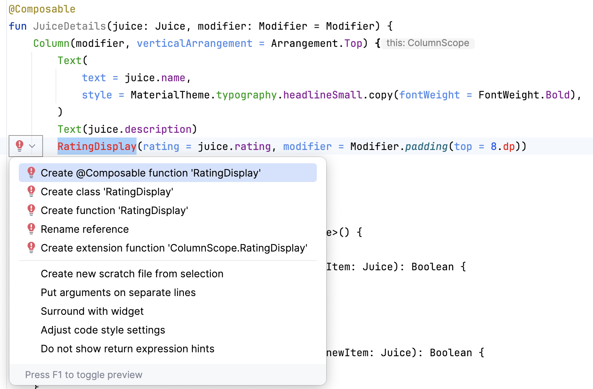

View システムには、次の評価バーを表示する [`RatingBar`](https://developer.android.com/reference/android/widget/RatingBar) があります。Compose には評価バー コンポーザブルがないため、この要素をゼロから実装する必要があります。

3. 評価に従って星を表示する `RatingDisplay()` 関数を定義します。このコンポーズ可能な関数は、評価に基づいて星の数を表示します。


```kotlin
import androidx.compose.ui.res.painterResource
import androidx.compose.ui.res.pluralStringResource

@Composable
fun RatingDisplay(rating: Int, modifier: Modifier = Modifier) {
   val displayDescription = pluralStringResource(R.plurals.number_of_stars, count = rating)
   Row(
       // Content description is added here to support accessibility
       modifier.semantics {
           contentDescription = displayDescription
       }
   ) {
       repeat(rating) {
           // Star [contentDescription] is null as the image is for illustrative purpose
           Image(
               modifier = Modifier.size(32.dp),
               painter = painterResource(R.drawable.star),
               contentDescription = null
           )
       }
   }
}
```

Compose で星形のドローアブルを作成するために、星形のベクター アセットを作成する必要があります。

4. [**Project**] ペインで、**[drawable] > [New] > [Vector Asset]** を右クリックします。

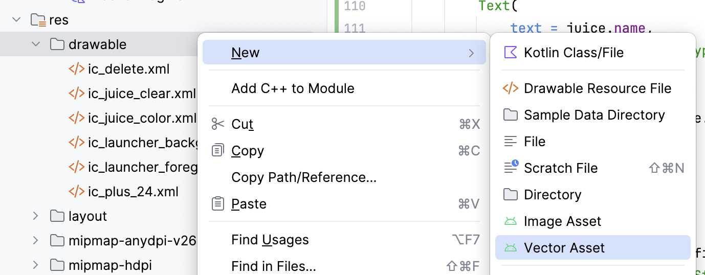

5. [**Asset Studio**] ダイアログで星形アイコンを検索します。塗りつぶされた星形アイコンを選択します。

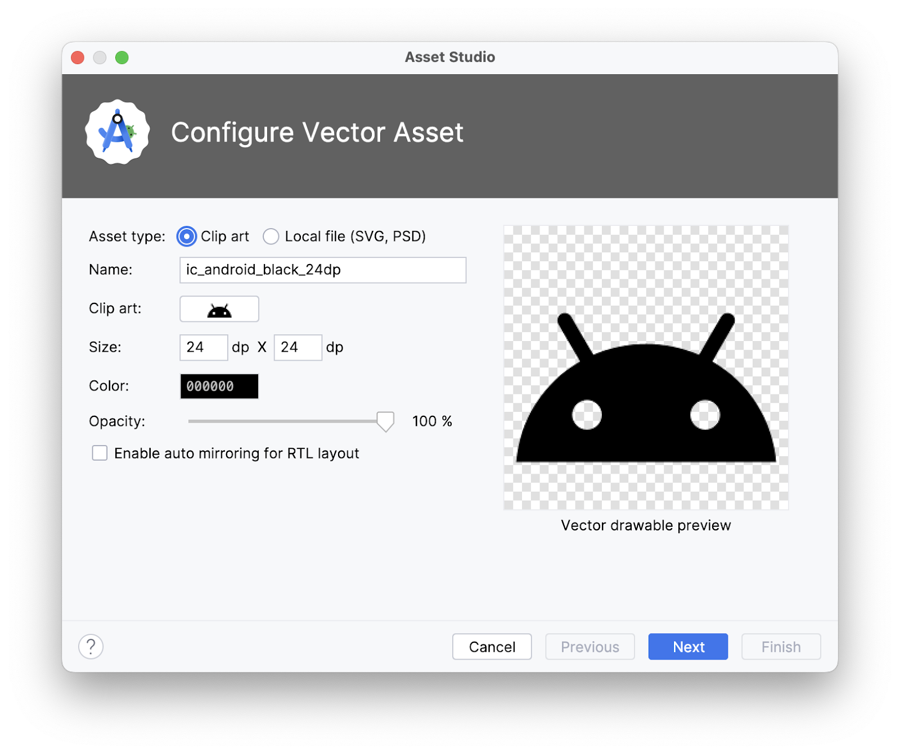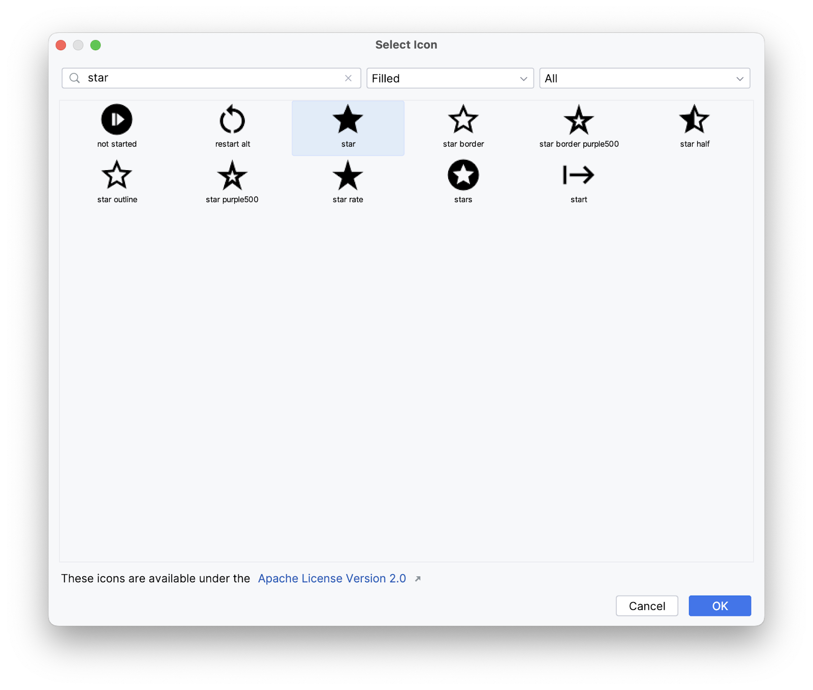

6. 星の色値を **625B71** に変更します。

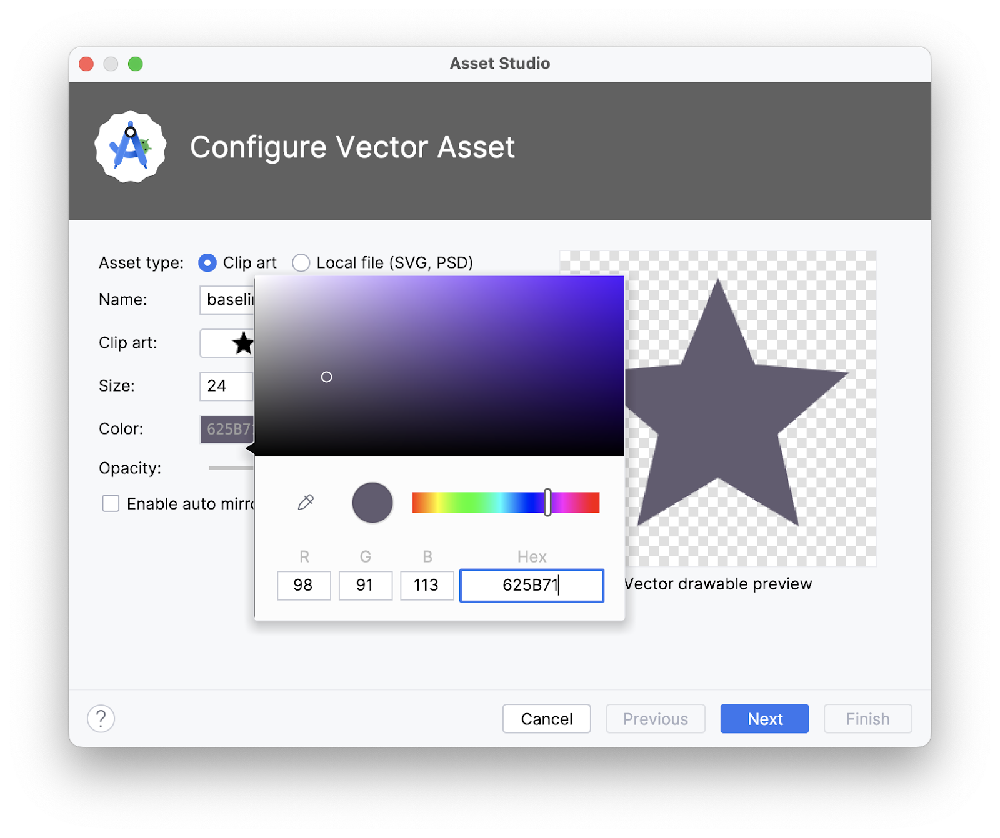

7. **[Next] > [Finish]** をクリックします。
8. `res/drawable` フォルダにドローアブルが表示されます。

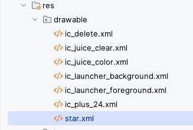

9. プレビュー コンポーザブルを追加して、*`JuiceDetails`* コンポーザブルをプレビューします。

```kotlin
@Preview
@Composable
fun PreviewJuiceDetails() {
    JuiceDetails(Juice(1, "Sweet Beet", "Apple, carrot, beet, and lemon", "Red", 4))
}
```

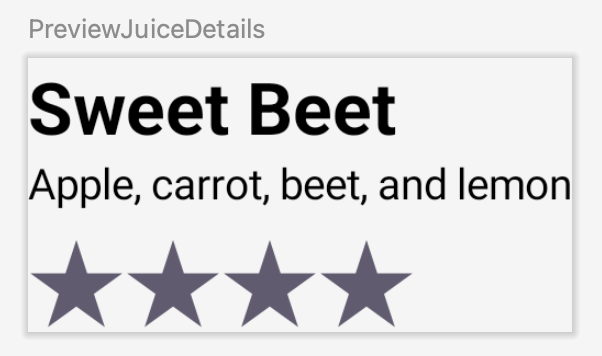

#### 削除ボタンのコンポーザブルを作成する

1. `JuiceListAdapter.kt` で、ラムダ コールバック関数と Modifier を受け取る `DeleteButton()` という別のコンポーズ可能な関数を追加します。
2. 次のコードに示すように、ラムダを `onClick` 引数に設定し、`Icon()` を渡します。

```kotlin
import androidx.compose.ui.res.painterResource
import androidx.compose.material3.Icon
import androidx.compose.material3.IconButton

@Composable
fun DeleteButton(onDelete: () -> Unit, modifier: Modifier = Modifier) {
    IconButton(
        onClick = { onDelete() },
        modifier = modifier
    ) {
        Icon(
            painter = painterResource(R.drawable.ic_delete),
            contentDescription = stringResource(R.string.delete)
        )
    }
}
```

3. 削除ボタンをプレビューするプレビュー関数を追加します。

```kotlin
@Preview
@Composable
fun PreviewDeleteIcon() {
    DeleteButton({})
}
```

![Android Studio の [削除] アイコンのプレビュー](./images/basic-android-kotlin-training-compose-add-compose-to-a-view-based-app/30e00883e38f39b0.png)

### 5. ListItem 関数を実装する

リストアイテムの表示に必要なコンポーザブルがすべて揃ったので、それらをレイアウト内に配置できるようになりました。前のステップで定義した `ListItem()` 関数に注意してください。

```kotlin
@Composable
fun ListItem(
   input: Juice,
   onEdit: (Juice) -> Unit,
   onDelete: (Juice) -> Unit,
   modifier: Modifier = Modifier
) {
}
```

`JuiceListAdapter.kt` で、次の手順で `ListItem()` 関数を実装します。

1. `Mdc3Theme {}` ラムダ内に `Row` レイアウトを追加します。

```kotlin
import androidx.compose.foundation.clickable
import androidx.compose.foundation.layout.Arrangement
import com.google.accompanist.themeadapter.material3.Mdc3Theme

Mdc3Theme {
   Row(
       modifier = modifier,
       horizontalArrangement = Arrangement.SpaceBetween
   ) {

   }
}
```

2. `Row` ラムダ内で、子要素として作成した 3 つのコンポーザブル `JuiceIcon`、`JuiceDetails`、`DeleteButton` を呼び出します。

```kotlin
JuiceIcon(input.color)
JuiceDetails(input, Modifier.weight(1f))
DeleteButton({})
```

`Modifier.`*`weight`*`(1f)` を `JuiceDetails()` コンポーザブルに渡すと、重み付けされていない子要素を測定した後に残った水平方向のスペースをジュースの詳細が占有するようになります。

3. `onDelete(input)` ラムダと上部に配置する修飾子をパラメータとして `DeleteButton` コンポーザブルに渡します。

```kotlin
DeleteButton(
   onDelete = {
       onDelete(input)
   },
   modifier = Modifier.align(Alignment.Top)
)
```

4. `ListItem` コンポーザブルをプレビューするプレビュー関数を作成します。

```kotlin
@Preview
@Composable
fun PreviewListItem() {
   ListItem(Juice(1, "Sweet Beet", "Apple, carrot, beet, and lemon", "Red", 4), {})
}
```

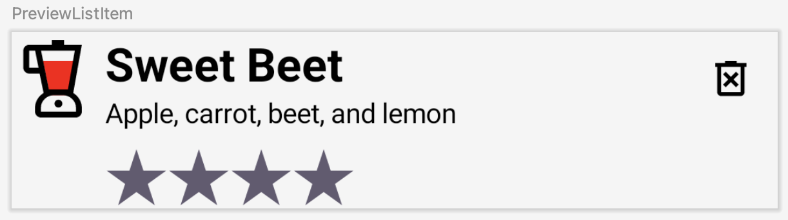

5. `ListItem` コンポーザブルをビューホルダーにバインドします。*`clickable()`* ラムダ関数内で `onEdit(input)` を呼び出して、リストアイテムがクリックされたときに編集ダイアログを開くようにします。

`JuiceListViewHolder` クラスの `bind()` 関数内で、コンポーザブルをホストする必要があります。`setContent` メソッドを使用して Compose UI コンテンツをホストできる Android View である [`ComposeView`](https://developer.android.com/reference/kotlin/androidx/compose/ui/platform/ComposeView) を使用します。

```kotlin
fun bind(input: Juice) {
    composeView.setContent {
        ListItem(
            input,
            onDelete,
            modifier = Modifier
                .fillMaxWidth()
                .clickable {
                    onEdit(input)
                }
                .padding(vertical = 8.dp, horizontal = 16.dp),
       )
   }
}
```

6. アプリを実行します。好きなジュースを追加します。Compose のリストアイテムが表示されます。

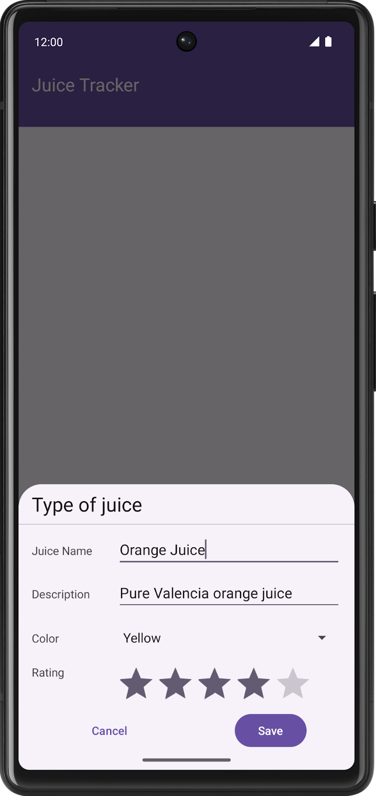. 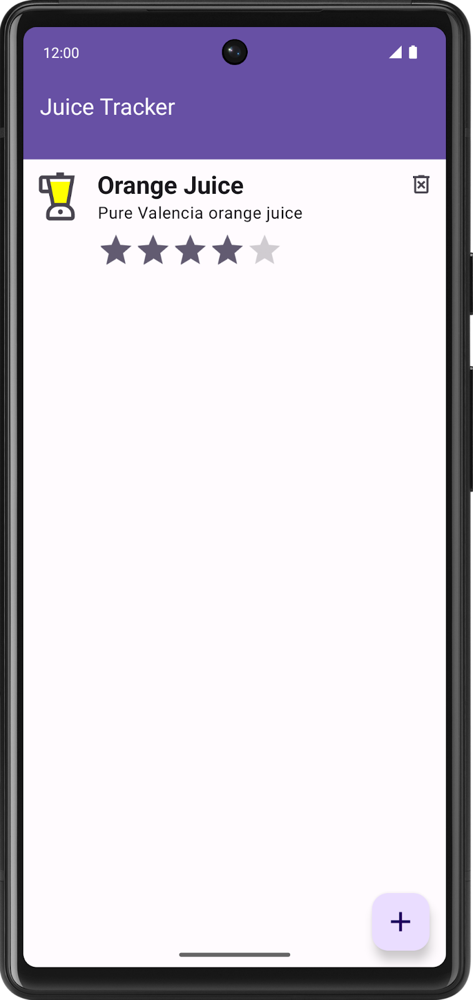

お疲れさまでした。ビューベースのアプリで Compose 要素を使用する最初の Compose 相互運用アプリを作成しました。

### 6. 解答コードを取得する

この Codelab の完成したコードをダウンロードするには、以下の git コマンドを使用します。

```
$ git clone https://github.com/google-developer-training/basic-android-kotlin-compose-training-juice-tracker.git
$ cd basic-android-kotlin-compose-training-juice-tracker
$ git checkout views-with-compose
```

または、リポジトリを ZIP ファイルとしてダウンロードし、Android Studio で開くこともできます。

> **注:**解答コードは、リポジトリの `views-with-compose` ブランチにあります。

解答コードを確認する場合は、[GitHub で表示します](https://github.com/google-developer-training/basic-android-kotlin-compose-training-juice-tracker/tree/views-with-compose)。

### 7. 詳細

#### 関連リンク

Android デベロッパー ドキュメント

- [Compose のツール | Jetpack Compose | Android デベロッパー](https://developer.android.com/jetpack/compose/tooling)
- [相互運用 API | Jetpack Compose | Android デベロッパー](https://developer.android.com/jetpack/compose/interop/interop-apis)
- [移行戦略 | Jetpack Compose | Android デベロッパー](https://developer.android.com/jetpack/compose/interop/migration-strategy)

Codelab [中級]

- [Jetpack Compose への移行](https://developer.android.com/codelabs/jetpack-compose-migration#0)

## 5. つまずきやすいポイント

- 実務の既存アプリはまだ View（XML）で書かれているものが多いです。「読める」ことがこの章の目的で、XML を書けるようになる必要はありません。

## 6. 提出物

次の Codelab で完成させた Android Studio プロジェクトを、学習用リポジトリの `unit8/Juice/` に置きます（プロジェクトフォルダごとコピー。`build/` と `.idea/` は含めない）。

- Compose を以前のアプリに追加する

PR 本文には次の 3 点を書いてください。

- **やったこと**：どの Codelab / 演習を完了したか
- **動作確認**：どの端末（エミュレータ名 or 実機）で何を確認したか
- **詰まった点と解決**：エラーの内容と、どう直したか（AI に聞いた内容も可）

## 7. チェックリスト

- [ ] XML レイアウト・Fragment・RecyclerView など従来の View システムの基本を説明できる
- [ ] View ベースの既存アプリに `ComposeView` でコンポーザブルを追加できる
- [ ] パスウェイ末尾のクイズに合格した
- [ ] 提出物が `unit8/Juice/` にあり、Android Studio（または Kotlin Playground）で開いて動く

---

## 課題提出

この章には提出課題があります。

1. 上記の提出物を完了する
2. GitHub で `feature/08-views` ブランチを作成し、`develop` へのPRを作成（base=`develop`）
3. [AIプログラムレビュー](https://ai.studio/apps/84d224cb-7de1-44fb-995b-9a5917d25603?fullscreenApplet=true) を実行
4. 問題がなければ、進捗ダッシュボードで **PR URL** と **完了日** を記録
